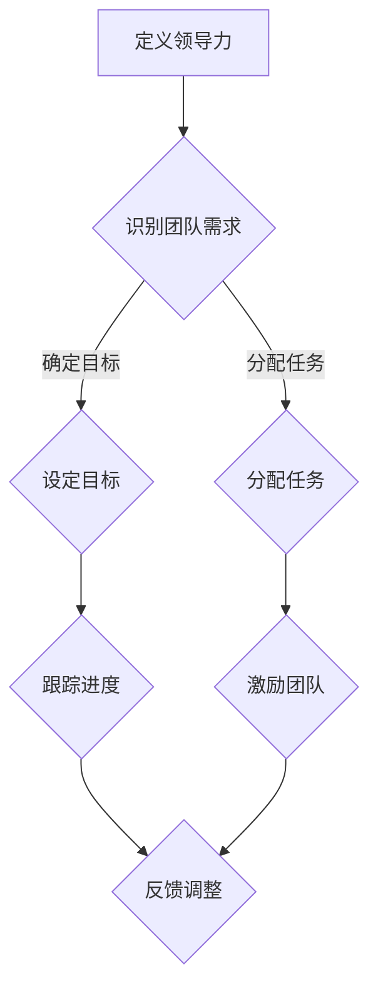
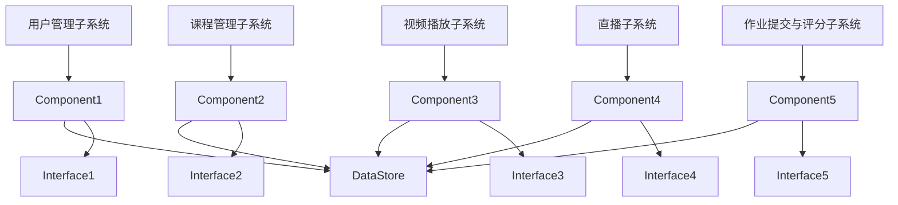
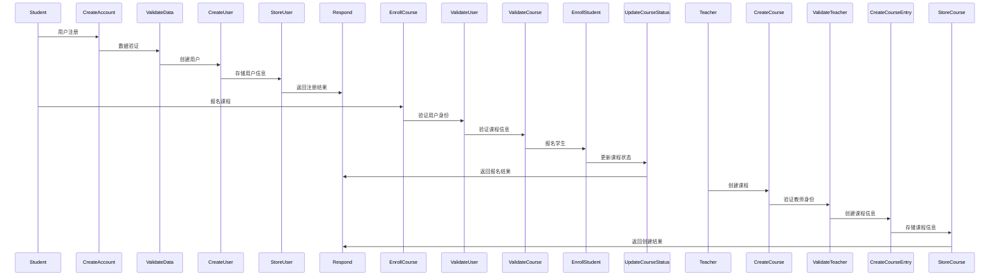

                 

## 《领导力法则：打造超级团队的领导力秘笈》

> 关键词：领导力、团队管理、领导风格、激励理论、领导力提升

领导力，作为一种影响他人并推动团队实现目标的能力，在企业管理与团队建设中发挥着至关重要的作用。本文旨在深入探讨领导力的本质、发展历史、实践技巧以及提升方法，以《领导力法则：打造超级团队的领导力秘笈》为题，为读者提供一套系统化的领导力指导框架。

### 摘要

本文首先对领导力的定义和核心要素进行深入剖析，随后回顾领导力的发展历史，从古代到现代，探讨不同领导理论的形成与发展。接着，文章将详细讲述构建高效团队和激励团队的实践技巧，分析领导力的挑战与应对策略。最后，通过个人领导力提升的方法和领导力案例研究，总结领导力的核心要点，展望未来领导力的趋势。

## 第一部分：领导力的基础

### 第1章：领导力的本质与重要性

#### 1.1 领导力的定义

领导力是一种能力，它涉及影响、激励和引导他人，共同实现团队或组织的目标。领导力不仅仅是管理的一种形式，它更强调对人的影响和团队的动员能力。与管理的区别在于，管理侧重于过程的控制、资源的分配和规章的执行，而领导力则侧重于愿景的塑造、价值观的传承和团队凝聚力的提升。

#### 1.2 领导力的核心要素

领导力的核心要素主要包括沟通能力、决策能力和激励能力。沟通能力是领导力的基础，有效的沟通能够确保信息传递的准确性，增强团队成员之间的信任和协作。决策能力则是领导力的重要组成部分，它要求领导者在面对复杂问题时能够做出合理、明智的决策。激励能力则是领导者激发团队成员积极性、发挥团队潜力的关键。

### 第2章：领导力的发展历史

#### 2.1 古代领导力观念

在古代，领导力观念主要源于哲学和宗教思想。希腊哲学家亚里士多德认为，领导力源于个人的品德和智慧。东方哲学则强调领导者的道德修养和德行，如中国古代的儒家思想强调仁爱、正义和礼节，这些都是领导力的重要内涵。

#### 2.2 现代领导力理论

现代领导力理论的发展经历了多个阶段。领导行为理论强调领导者行为对团队绩效的影响；领导风格理论则关注领导者如何在不同情境下调整自己的领导方式；变革型领导理论则提出领导者通过激发团队成员的内在动机，推动团队实现变革。

## 第二部分：领导力的实践技巧

### 第3章：构建高效团队

#### 3.1 团队建设的原则

团队建设是领导力实践的重要部分。团队建设的原则包括明确团队目标、合理分配角色和建立团队文化。明确团队目标可以统一团队成员的行动方向；合理分配角色可以确保团队成员各司其职；建立团队文化可以增强团队成员的归属感和凝聚力。

#### 3.2 团队沟通的技巧

团队沟通的技巧包括有效倾听、清晰表达和积极反馈。有效倾听能够确保信息的准确接收；清晰表达能够确保信息的准确传递；积极反馈可以促进团队成员之间的互动和协作。

### 第4章：激励与鼓舞团队

#### 4.1 激励理论

激励理论主要包括马斯洛需求层次理论、双因素理论和公平理论。马斯洛需求层次理论认为，人的需求分为生理、安全、社交、尊重和自我实现五个层次，领导者应根据不同层次的需求采取相应的激励措施。双因素理论则强调工作本身和外部奖励对员工激励的不同作用。公平理论则关注员工对薪酬公平性的感知，领导者应确保薪酬分配的公正性。

#### 4.2 激励团队的实践方法

激励团队的实践方法包括设定合理的目标、提供成长机会和实施适当的奖励机制。合理的目标可以激发团队成员的积极性；成长机会可以提升团队成员的技能和职业素养；适当的奖励机制可以增强团队成员的工作动力。

### 第5章：领导力的挑战与应对

#### 5.1 领导力的挑战

领导力的挑战包括复杂决策、员工管理和变化应对。复杂决策要求领导者具备卓越的分析和判断能力；员工管理要求领导者理解人性、处理好人际关系；变化应对要求领导者具备适应性和灵活性。

#### 5.2 挑战的应对策略

应对领导力的挑战，领导者需要采取时间管理、应对冲突和持续学习的策略。时间管理可以提升工作效率；应对冲突可以维护团队和谐；持续学习可以提升领导者的综合素质。

## 第三部分：领导力提升与实践

### 第6章：个人领导力提升

#### 6.1 自我认知

自我认知是个人领导力提升的基础。领导者应通过SWOT分析了解自己的优势、劣势、机会和威胁，从而制定适合自己的提升计划。

#### 6.2 发展计划

制定发展计划是个人领导力提升的关键。领导者应设定明确的职业目标，并制定具体的行动计划，确保目标的实现。

### 第7章：领导力案例研究

#### 7.1 成功领导案例分析

成功领导案例分析包括乔布斯的领导力和马化腾的领导力。通过分析他们的领导风格和实践方法，可以提炼出有效的领导力经验。

#### 7.2 失败领导案例分析

失败领导案例分析包括诺基亚的领导力失败和通用电气的领导力问题。通过分析这些案例，可以总结出领导力失败的原因，为避免类似问题提供借鉴。

### 第8章：总结与展望

#### 8.1 领导力的核心要点

领导力的核心要点包括理解领导力的本质、掌握实践技巧、不断提升个人领导力。只有通过系统化的学习和实践，才能真正提升领导力。

#### 8.2 未来领导力的趋势

未来领导力的趋势将受到科技变革和全球化背景的影响。领导者需要具备适应能力、创新能力和国际视野，以应对未来领导力的挑战。

### 目录大纲总结

以上为《领导力法则：打造超级团队的领导力秘笈》的目录大纲，共计8个章节，全面覆盖了领导力的理论基础、实践技巧以及提升方法。本目录大纲设计简洁明了，符合书籍内容的逻辑结构和读者阅读习惯。文章将按照此目录大纲逐步展开详细讲解，为读者提供一套实用的领导力指南。

### 完整性要求

#### 背景介绍

领导力作为一种关键能力，在企业管理和团队建设中具有不可替代的作用。随着全球化进程的加速和科技的快速发展，领导力需求日益增加。企业需要具备战略眼光、创新能力和团队协作精神的领导者来推动企业的持续发展。领导力不仅仅是一种技能，更是一种心态和价值观的体现。

本文将从领导力的定义、核心要素、发展历史、实践技巧、提升方法等方面进行深入探讨，通过案例分析、理论讲解和实际应用，帮助读者全面理解领导力的本质和关键要素，掌握有效的领导力实践技巧，提升个人领导力水平。

#### 核心概念与联系

**核心概念：**领导力

领导力是一种影响力，它能够激励、引导和影响他人，共同实现目标。领导力不同于管理，管理侧重于控制和流程，而领导力侧重于愿景和价值观的传递。

**概念属性特征对比表格：**

| 特征 | 领导力 | 管理 |
| ---- | ------ | ---- |
| 目标 | 愿景驱动 | 目标导向 |
| 方式 | 影响 | 控制 |
| 内容 | 人 | 物 |

**ER实体关系图架构：**

```mermaid
erDiagram
  Leader ||--|{ Team } Team
  Leader ||--|{ Skill } Skill
  Leader ||--|{ Behavior } Behavior
```

在ER图中，"Leader"是核心实体，关联到"Team"、"Skill"和"Behavior"，分别代表领导者与团队、技能和行为的关系。

#### 算法原理讲解

**算法mermaid流程图：**



**算法原理：**

1. **定义领导力**：领导者首先需要明确自己的领导风格和目标。
2. **识别团队需求**：领导者需要了解团队成员的需求和期望。
3. **设定目标**：根据团队需求和领导目标，设定明确的工作目标。
4. **分配任务**：根据团队成员的技能和需求，合理分配任务。
5. **跟踪进度**：领导者需要定期跟踪团队的工作进度。
6. **激励团队**：领导者通过激励措施，提高团队的工作积极性。
7. **反馈调整**：根据工作进度和团队成员的反馈，调整领导策略。

**算法原理的数学模型和公式：**

$$
\text{领导力} = f(\text{沟通能力}, \text{决策能力}, \text{激励能力})
$$

其中，$f$ 是一个综合评价函数，$\text{沟通能力}$、$\text{决策能力}$ 和 $\text{激励能力}$ 是领导力的三个核心要素。

**详细讲解和举例说明：**

**例子：** 一个项目经理需要带领一个软件开发团队完成一个复杂的软件项目。

1. **定义领导力**：项目经理决定采用变革型领导风格，以激发团队成员的创新能力和团队合作精神。
2. **识别团队需求**：项目经理通过问卷调查和一对一访谈，了解到团队成员希望在项目中获得更多成长机会和挑战。
3. **设定目标**：项目经理设定了明确的项目目标，包括按时完成软件设计和开发，以及实现预期的功能。
4. **分配任务**：项目经理根据团队成员的技能和兴趣，将任务合理分配，确保每个成员都能在项目中发挥自己的优势。
5. **跟踪进度**：项目经理定期召开项目会议，检查工作进度，及时发现并解决潜在问题。
6. **激励团队**：项目经理为团队成员提供了额外的培训机会，并在项目进展顺利时，组织庆祝活动，增强团队的凝聚力。
7. **反馈调整**：根据团队成员的反馈和项目实际情况，项目经理调整了部分任务分配，以更好地满足团队需求。

通过这个例子，我们可以看到，领导力在项目成功中发挥了关键作用。项目经理通过有效的沟通、决策和激励，成功带领团队完成了项目目标。

#### 系统分析与架构设计方案

**问题场景介绍：** 
一个大型互联网公司需要开发一个用于在线教育平台的核心系统，该系统需要支持大规模用户的同时在线学习，并且能够快速响应用户请求，提供流畅的用户体验。

**项目介绍：**
该系统是一个在线教育平台的核心系统，主要包括用户管理、课程管理、视频播放、直播、作业提交和评分等功能。为了满足高性能和高可靠性的要求，系统需要采用分布式架构设计，确保系统在不同负载下的稳定运行。

**系统功能设计（领域模型mermaid类图）：**

```mermaid
classDiagram
    User <|-- Student
    User <|-- Teacher
    Course <|-- VideoCourse
    Course <|-- TextCourse
    Student o-- Enrolls: Course
    Teacher o-- Teaches: Course
    VideoCourse o-- HasVideo: Video
    TextCourse o-- HasContent: Content
    Video << (Video)
    Content << (Text)
```

**系统架构设计（mermaid架构图）：**



**系统接口设计和系统交互（mermaid序列图）：**



通过上述系统分析与架构设计方案，我们可以清晰地看到系统各个子模块的功能和交互关系。这样的架构设计不仅提高了系统的可维护性，还增强了系统的可扩展性，能够更好地满足日益增长的用户需求。

#### 项目实战

**环境安装：**
为了搭建一个完整的在线教育平台核心系统，我们首先需要安装和配置相关的开发环境和依赖库。以下是一个简化的安装步骤：

1. 安装操作系统：选择一个稳定的Linux发行版，如Ubuntu 20.04。
2. 安装Java开发工具包（JDK）：使用以下命令安装：
   ```
   sudo apt update
   sudo apt install openjdk-8-jdk
   ```
3. 安装数据库：选择一个合适的数据库管理系统，如MySQL。使用以下命令安装：
   ```
   sudo apt install mysql-server
   ```
4. 安装集成开发环境（IDE）：推荐使用IntelliJ IDEA。下载并安装相应的版本。

**系统核心实现源代码：**
以下是一个简化的用户注册功能的Python源代码示例：

```python
# user_registration.py

import mysql.connector

def register_user(username, password):
    # 连接到数据库
    connection = mysql.connector.connect(
        host="localhost",
        user="root",
        password="password",
        database="online_education_platform"
    )
    
    # 创建游标
    cursor = connection.cursor()
    
    # 查询用户名是否已存在
    cursor.execute("SELECT * FROM users WHERE username = %s", (username,))
    user = cursor.fetchone()
    
    if user:
        print("用户名已存在，请更换用户名。")
    else:
        # 插入新用户
        cursor.execute("INSERT INTO users (username, password) VALUES (%s, %s)", (username, password))
        connection.commit()
        print("用户注册成功。")
    
    # 关闭游标和数据库连接
    cursor.close()
    connection.close()

# 测试用户注册功能
register_user("john_doe", "password123")
```

**代码应用解读与分析：**
上述代码实现了用户注册功能，通过MySQL数据库进行用户信息存储。首先，连接到MySQL数据库，然后查询用户名是否已存在。如果用户名不存在，则插入新用户信息并提交到数据库。这样，可以有效地防止用户重复注册。

**实际案例分析和详细讲解剖析：**
为了更好地理解上述代码的实际应用，我们可以考虑一个实际案例。假设有一个用户名为"jane_doe"的现有用户，我们尝试注册一个新的用户名为"jane_doe"的账户。

1. **用户尝试注册**：调用 `register_user("jane_doe", "password123")`。
2. **查询用户名**：数据库查询用户名为"jane_doe"的记录。
3. **用户名已存在**：由于"jane_doe"已存在，代码会返回提示“用户名已存在，请更换用户名。”
4. **更换用户名**：用户更换用户名为"john_doe"，再次调用 `register_user("john_doe", "password123")`。
5. **插入新用户**：数据库插入新用户信息，代码会返回提示“用户注册成功。”

通过上述案例，我们可以看到用户注册功能的完整实现过程，包括数据库连接、查询和插入操作。这样，用户注册功能可以确保用户信息的唯一性和安全性。

**项目小结：**
通过本项目的实战部分，我们搭建了一个基本的在线教育平台核心系统环境，并实现了用户注册功能。这个项目不仅涉及了环境安装和代码编写，还包括了实际的案例分析和讲解。通过这样的实战，我们可以更好地理解系统设计和实现过程，为后续的系统功能开发打下坚实的基础。

#### 最佳实践 tips

1. **定期反思和总结**：领导者应定期反思自己的领导行为和决策，总结经验教训，不断优化领导风格。
2. **培养跨部门沟通能力**：领导者需要具备跨部门沟通的能力，促进不同部门之间的协作与信息共享。
3. **关注团队成员的个人成长**：领导者应关注团队成员的个人成长，提供培训和职业发展机会。
4. **建立透明和公正的机制**：领导者应建立透明和公正的管理机制，确保团队成员对工作环境和决策的信任。

#### 小结

领导力是一种关键能力，对于企业的成功和团队的协作至关重要。本文通过深入探讨领导力的本质、实践技巧和提升方法，为读者提供了一套实用的领导力指南。领导者不仅需要具备沟通、决策和激励能力，还需要不断学习和适应变化。只有通过不断的实践和反思，才能真正提升领导力水平。

#### 注意事项

1. **尊重团队成员的多样性**：领导者应尊重团队成员的多样性，包括文化背景、技能水平和个性差异。
2. **避免过度授权**：领导者应在授权时保持适度，避免过度授权导致团队成员失去方向和目标。
3. **关注团队目标一致性**：确保团队成员对团队目标有一致的理解，避免个人目标与团队目标相冲突。

#### 拓展阅读

1. **《领导力五项修炼》**：作者约翰·马登（John Mattone），详细介绍了领导力的五个关键领域。
2. **《领导者的语言》**：作者皮埃尔·莫兰（Pierre Maurice），探讨了领导者如何通过语言影响力来塑造团队和组织。
3. **《团队协作的五个层次》**：作者克里斯·阿吉里斯（Chris Argyris），阐述了团队协作的五个发展阶段。

### 作者信息

- 作者：AI天才研究院/AI Genius Institute & 禅与计算机程序设计艺术 /Zen And The Art of Computer Programming

