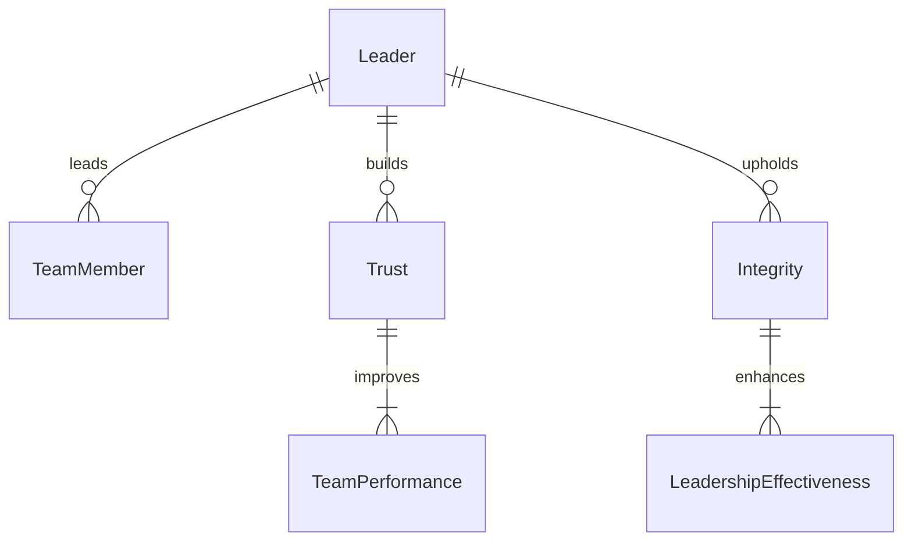
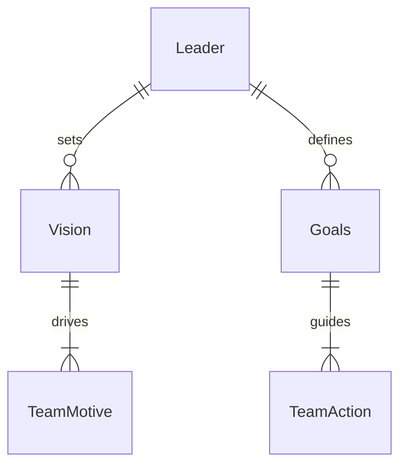
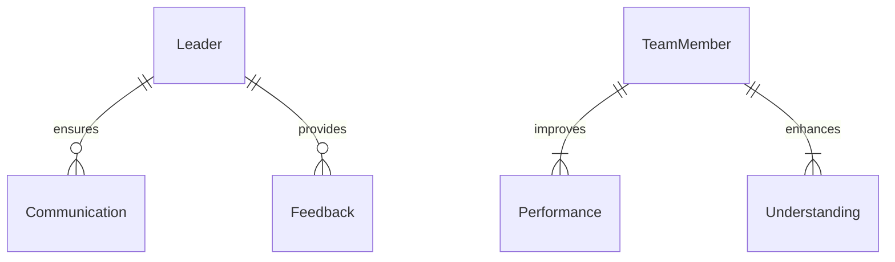
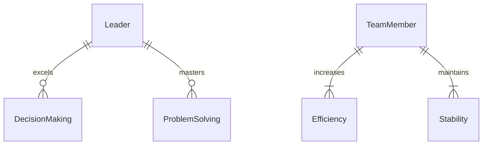

                 

# 领导力法则：打造超级团队的领导力秘诀

## 关键词：领导力原则、团队建设、领导艺术、超级团队、领导力实践

## 摘要：
本文将深入探讨领导力法则，通过一系列的章节，详细阐述如何运用这些法则来打造一支超级团队。文章从领导力的本质出发，逐步分析领导的核心原则、团队的组织与建设、成员的激励与引导，以及如何应对领导过程中的各种挑战。通过这些步骤，读者将能够掌握一套系统的领导力方法论，为成为一位卓越的领导者奠定基础。

## 目录

1. **领导力的本质**  
   1.1 领导的历史视角  
   1.2 领导的核心概念与理论  
   1.3 领导在现代社会中的角色  
   1.4 领导面临的挑战与演变  
   1.5 小结

2. **核心领导力原则**  
   2.1 基本领导原则  
   2.2 诚信与信任  
   2.3 愿景与目标设定  
   2.4 沟通与反馈  
   2.5 决策与问题解决  
   2.6 领导力与情感智力  
   2.7 小结

3. **构建高绩效团队**  
   3.1 团队结构的定义  
   3.2 团队发展阶段的概述  
   3.3 建立合作文化  
   3.4 团队中的多样性与包容性  
   3.5 小结

4. **激励与参与团队成员**  
   4.1 动机理论的理解  
   4.2 内在动机与外在动机  
   4.3 培养成长心态  
   4.4 认可与奖励  
   4.5 小结

5. **应对领导挑战**  
   5.1 常见领导失误的克服  
   5.2 领导力发展的障碍与策略  
   5.3 应对变化与不确定性  
   5.4 领导力的持续成长  
   5.5 小结

6. **最佳实践与总结**  
   6.1 领导力法则的实际应用  
   6.2 小结与注意事项  
   6.3 拓展阅读

## 前言
领导力是一种艺术，也是一种科学。在现代社会，领导力不仅仅关乎个人魅力，更关乎团队绩效、组织发展和社会进步。优秀的领导者不仅能够引导团队实现目标，还能够激发成员的潜力，创造一个积极向上的工作环境。

本文旨在为读者提供一套系统的领导力方法论，通过深入分析领导力的本质、核心原则、团队建设、成员激励以及领导挑战的应对策略，帮助读者理解如何成为一个卓越的领导者。本文将从实际案例出发，结合理论和实践，为读者提供实用的领导力工具和技巧。

在接下来的章节中，我们将逐一探讨领导力的各个层面，通过逻辑清晰、结构紧凑的分析，帮助读者逐步构建自己的领导力框架。让我们一起踏上这段探索领导力的旅程。

## 1. 领导力的本质

### 1.1 领导的历史视角

领导的历史可以追溯到古代社会的帝王和军事领袖。在封建时代，领导往往与权威和统治紧密相连，领导者通过强制和权威来维持秩序。然而，随着社会的进步和民主制度的兴起，领导的角色开始发生转变。现代领导不再仅仅是下达命令和控制他人，而是更多地关注如何激发团队的潜力、促进协作和创新。

从20世纪开始，领导理论开始多样化，出现了诸如特质理论、行为理论、情境理论和变革理论等不同的领导理论。这些理论从不同的角度对领导进行了深入分析，帮助我们更好地理解领导力的本质。

- **特质理论**：特质理论认为，领导者具有某些固有的特质和能力，这些特质是领导成功的关键。例如，自信、决断力、热情和智慧被认为是领导者的基本特质。

- **行为理论**：行为理论则关注领导者具体的行为模式，认为领导行为可以学习和模仿。领导者的行为可以影响团队的动力和绩效。

- **情境理论**：情境理论认为，领导行为应适应不同的环境和情境。有效的领导者能够根据具体情况调整自己的领导风格。

- **变革理论**：变革理论强调领导者在推动组织变革中的重要作用。领导者的任务是激励团队成员接受变革，并共同实现新的目标。

### 1.2 核心概念与理论

领导力的核心概念包括但不限于：

- **影响力**：领导者的核心任务是影响他人，推动团队实现共同目标。影响力不仅来自权威，还来自信任、尊重和榜样作用。

- **目标设定**：明确的目标是团队前进的方向。领导者需要制定清晰、具有挑战性的目标，并确保团队成员理解并认同这些目标。

- **沟通**：有效的沟通是领导力的关键。领导者需要能够清晰地传达信息，同时倾听团队成员的意见和反馈。

- **团队建设**：团队是领导者工作的核心。领导者需要建立信任、促进协作，并确保团队成员在共同目标下合作。

- **激励**：领导者需要了解团队成员的动机，提供适当的激励，以激发他们的潜力。

### 1.3 领导在现代社会中的角色

在现代社会，领导者的角色变得更加复杂和多元。以下是一些现代社会中领导者的关键角色：

- **变革推动者**：领导者需要引领组织适应不断变化的外部环境，推动创新和变革。

- **战略规划者**：领导者需要制定清晰的战略规划，确保组织朝着正确的方向前进。

- **文化塑造者**：领导者通过价值观和行为准则塑造组织文化，影响团队成员的行为和态度。

- **团队领导者**：领导者需要管理团队，确保团队高效合作，实现共同目标。

- **教练与导师**：领导者需要培养团队成员，提供指导和支持，帮助他们成长和发展。

### 1.4 领导面临的挑战与演变

随着全球化、技术进步和社会变迁，领导力也面临着一系列新的挑战。以下是现代社会中领导者面临的一些主要挑战：

- **快速变化的环境**：领导者需要快速适应外部环境的变化，并有效应对不确定性。

- **多元文化的团队**：领导者需要管理多元文化的团队，促进协作和包容性。

- **技术创新的压力**：领导者需要关注技术趋势，确保组织在技术领域保持竞争力。

- **道德和伦理问题**：领导者需要处理复杂的道德和伦理问题，确保组织行为符合社会规范。

- **领导力的可持续性**：领导者需要持续学习和成长，以适应不断变化的需求和环境。

### 1.5 小结

领导力的本质在于影响他人，推动团队实现共同目标。通过理解领导的历史视角和核心概念，我们可以更好地把握领导力的内涵。领导在现代社会中的角色更加多元和复杂，领导者需要面对快速变化的环境、多元文化的团队、技术创新的压力、道德和伦理问题，以及领导力的可持续性挑战。通过不断学习和实践，领导者可以不断提升自己的能力，为组织和社会创造更大的价值。

## 2. 核心领导力原则

### 2.1 基本领导原则

领导原则是领导者行为的基础，它们决定了领导者在团队中的影响力和管理能力。以下是几个核心的领导原则：

#### 2.1.1 诚信与信任

**核心概念**：诚信是领导者最基本的品质之一，它体现在领导者言行一致、遵守承诺和透明沟通上。信任是领导者与团队成员之间关系的基石。

**概念属性特征对比表格**：

| 特征          | 诚信                        | 信任                        |
| ------------- | --------------------------- | --------------------------- |
| 定义          | 实践与承诺一致               | 对他人的可靠性感到安心       |
| 对比          | 行为与道德规范一致           | 个人行为对团队的影响        |
| 关联性        | 信任的基础                  | 领导力的核心                |

**ER实体关系图架构**：

#### 2.1.2 愿景与目标设定

**核心概念**：愿景是领导者对未来的愿景和期望，目标则是实现愿景的具体步骤和里程碑。设定清晰的愿景和目标，可以帮助团队明确方向，激发动力。

**概念属性特征对比表格**：

| 特征          | 愿景                        | 目标                        |
| ------------- | --------------------------- | --------------------------- |
| 定义          | 对未来的理想描述             | 实现愿景的具体步骤           |
| 对比          | 长远目标                    | 短期实现步骤                 |
| 关联性        | 指导团队行动                | 推动团队实现目标             |

**ER实体关系图架构**：

#### 2.1.3 沟通与反馈

**核心概念**：沟通是领导者与团队成员之间传递信息和建立联系的过程。有效的沟通可以提高团队协作效率，减少误解和冲突。反馈则是领导者对团队成员表现的评价和指导。

**概念属性特征对比表格**：

| 特征          | 沟通                        | 反馈                        |
| ------------- | --------------------------- | --------------------------- |
| 定义          | 信息交流                    | 对表现的评价和指导           |
| 对比          | 广泛交流                    | 有针对性的评价               |
| 关联性        | 促进团队协作                | 提升团队成员能力和表现       |

**ER实体关系图架构**：

#### 2.1.4 决策与问题解决

**核心概念**：决策是领导者根据信息和判断做出的选择。问题解决是领导者应对挑战和困难的过程。有效的决策和问题解决能力，可以帮助团队迅速应对变化和问题。

**概念属性特征对比表格**：

| 特征          | 决策                        | 问题解决                        |
| ------------- | --------------------------- | --------------------------- |
| 定义          | 根据信息做出选择             | 解决困难和挑战                 |
| 对比          | 一次性选择                  | 持续性和迭代过程               |
| 关联性        | 推动团队前进                | 保持团队稳定和有效运作       |

**ER实体关系图架构**：

### 2.2 诚信与信任

#### 2.2.1 诚信的重要性

诚信是领导者最基本的品质之一，它不仅影响领导者的个人声誉，还直接关系到团队和组织的信任氛围。以下是一些诚信在领导中的作用：

- **建立信任基础**：诚信是信任的基石。领导者通过诚实和透明的行为，建立起与团队成员之间的信任关系。
- **提高团队协作效率**：当团队成员信任领导者时，他们更愿意合作和支持领导者的决策，从而提高团队的整体效率。
- **塑造组织文化**：领导者的诚信行为可以塑造整个组织的文化氛围，促进诚实、公正和透明的工作环境。

#### 2.2.2 建立信任与团队成员

建立信任不仅需要领导者个人的诚信行为，还需要通过一系列具体的行动来巩固和加深信任。以下是几个关键步骤：

- **透明沟通**：领导者应该保持沟通的透明性，及时分享信息，避免隐瞒或误导。
- **遵守承诺**：领导者要言出必行，遵守自己的承诺，以树立榜样。
- **倾听与理解**：领导者应该倾听团队成员的意见和反馈，理解他们的需求和困难。
- **公平对待**：领导者要公正地对待每一位团队成员，避免偏见和歧视。

### 2.3 愿景与目标设定

#### 2.3.1 梦想成真的愿景

愿景是领导者对未来的理想描述，它是团队的指南针，为团队成员提供了清晰的方向和目标。一个有吸引力的愿景能够激发团队成员的激情和动力，使他们愿意为共同的目标努力。

- **具体性**：愿景应该具体、明确，能够清晰地描述未来的愿景和目标。
- **可实现性**：愿景应该是可实现的，同时具有挑战性，以激发团队成员的积极性和创造力。
- **共享性**：愿景应该被所有团队成员共享和认同，成为团队的共同目标。

#### 2.3.2 设定有效的目标

目标设定是实现愿景的关键步骤，有效的目标设定需要考虑以下几个方面：

- **具体明确**：目标应该具体、明确，避免模糊和含糊不清。
- **可量化**：目标应该可量化，可以衡量进度和成果。
- **时限性**：目标应该有明确的时限，以便团队能够合理安排时间和资源。
- **挑战性**：目标应该具有挑战性，以激发团队成员的潜能。

### 2.4 沟通与反馈

#### 2.4.1 有效沟通的策略

沟通是领导者的重要职责之一，有效的沟通可以确保信息的准确传递，减少误解和冲突。以下是几个有效沟通的策略：

- **清晰表达**：领导者应该清晰、简洁地表达自己的观点和意图。
- **倾听**：领导者应该倾听团队成员的意见和反馈，理解他们的想法和需求。
- **积极反馈**：领导者应该给予团队成员积极的反馈，鼓励他们的努力和进步。
- **使用多种沟通方式**：领导者应该根据不同的情况和需求，使用多种沟通方式，如面对面交流、电子邮件、会议等。

#### 2.4.2 给予和接收反馈

有效的反馈是领导者激励团队成员、提升团队绩效的重要手段。以下是给予和接收反馈的几个关键点：

- **具体反馈**：反馈应该具体、明确，指出具体的行为或成果。
- **建设性反馈**：反馈应该是建设性的，旨在帮助团队成员改进和提高。
- **及时反馈**：反馈应该及时，以便团队成员能够迅速调整自己的行为和策略。
- **开放心态**：领导者应该鼓励团队成员开放心态，接受和反思反馈。

### 2.5 决策与问题解决

#### 2.5.1 决策的基本原则

决策是领导者的重要职责之一，有效的决策能力可以确保团队在面对复杂问题时能够迅速作出正确的选择。以下是几个决策的基本原则：

- **信息全面**：决策前应全面收集和分析信息，确保决策基于充分的数据和事实。
- **多方案比较**：考虑多种可能的方案，进行比较和分析，选择最优方案。
- **风险评估**：评估每个方案的潜在风险，并制定相应的风险应对策略。
- **决策后评估**：决策后对决策的效果进行评估，及时调整和改进。

#### 2.5.2 创新问题解决方法

问题解决是领导者的另一项关键能力。以下是一些创新问题解决的方法：

- **头脑风暴**：鼓励团队成员自由发表意见，提出各种可能的解决方案。
- **逆向思维**：从问题的反面思考，寻找创新的解决方案。
- **多角度分析**：从不同角度分析问题，寻找潜在的原因和解决方案。
- **实验验证**：实施小规模的实验，验证解决方案的有效性。

### 2.6 领导力与情感智力

#### 2.6.1 情感智力的理解

情感智力（Emotional Intelligence，简称EQ）是领导者成功的重要因素之一。情感智力包括自我意识、自我管理、社交意识和关系管理四个方面。以下是情感智力的一些关键点：

- **自我意识**：了解自己的情感，认识到情感对行为的影响。
- **自我管理**：控制和调节自己的情感，保持冷静和理智。
- **社交意识**：理解他人的情感和需求，建立良好的人际关系。
- **关系管理**：有效地管理人际关系，解决冲突，促进团队合作。

#### 2.6.2 利用情感智力提升领导力

领导者可以利用情感智力来提升自己的领导力，具体方法如下：

- **建立信任**：通过情感智力建立信任，增强团队凝聚力。
- **激励团队**：了解团队成员的情感需求，提供适当的激励和支持。
- **冲突解决**：通过情感智力理解和解决冲突，保持团队的和谐与稳定。
- **领导变革**：在推动变革时，考虑团队成员的情感反应，制定有效的变革策略。

### 2.7 小结

核心领导力原则是领导者成功的关键。通过诚信与信任、愿景与目标设定、沟通与反馈、决策与问题解决以及情感智力的应用，领导者可以提升自己的影响力，打造高绩效团队。在领导实践中，领导者应根据具体情况灵活运用这些原则，不断学习和成长，成为卓越的领导者。

## 3. 构建高绩效团队

### 3.1 团队结构的定义

团队结构是团队成员相互协作的组织形式，它决定了团队的工作流程、职责分配和沟通模式。一个高效的团队结构应该具备以下几个关键要素：

- **明确的目标**：团队应该有一个共同的目标，确保所有成员都明确自己的职责和贡献。
- **清晰的职责分配**：团队成员的职责应该明确，确保每个人都知道自己的工作内容和期望。
- **有效的沟通渠道**：团队内部应该建立畅通的沟通渠道，确保信息的及时传递和反馈。
- **合理的决策流程**：团队应该有一个明确的决策流程，确保在面临问题时能够迅速作出决策。
- **灵活的调整机制**：团队结构应该具有一定的灵活性，能够根据实际情况进行调整。

### 3.2 团队发展阶段的概述

团队的发展通常可以分为几个阶段，每个阶段都有其特定的特征和挑战。以下是团队发展的几个关键阶段：

#### 1. 形成阶段

在形成阶段，团队成员刚刚开始相互了解，团队的目标和职责可能还不清晰。这一阶段的关键任务是建立信任和沟通，确保团队成员能够顺利合作。

#### 2. 矛盾阶段

在矛盾阶段，团队成员之间的分歧和冲突开始出现，这可能是由于角色冲突、任务分工不明确或者沟通不畅等原因引起的。这一阶段的关键任务是识别和解决冲突，确保团队能够继续前进。

#### 3. 集中阶段

在集中阶段，团队开始发挥协同作用，团队成员之间的信任和合作得到加强，团队的目标和任务也变得明确。这一阶段的关键任务是保持团队的士气和动力，确保团队能够高效地完成任务。

#### 4. 成熟阶段

在成熟阶段，团队已经完全适应了工作流程和角色分配，成员之间的合作达到最佳状态。这一阶段的关键任务是持续优化团队结构和流程，确保团队能够在不断变化的环境中保持竞争力。

### 3.3 建立合作文化

建立合作文化是打造高绩效团队的关键。以下是一些关键的步骤：

- **共同价值观**：团队应该有一个共同的价值观，确保所有成员都认同并遵循这些价值观。
- **鼓励分享**：鼓励团队成员分享自己的想法和意见，建立开放的沟通环境。
- **认可与奖励**：对团队成员的成就和贡献给予认可和奖励，激发团队成员的积极性和创造力。
- **团队活动**：组织定期的团队活动，增强团队成员之间的联系和信任。
- **持续培训**：提供培训和发展机会，帮助团队成员提升技能和知识，为团队带来新的视角和思路。

### 3.4 团队中的多样性与包容性

多样性与包容性是现代团队管理的重要主题。一个多样化的团队可以带来更多的创意和视角，而包容性则确保所有成员都能在团队中感到被尊重和接纳。以下是促进多样性与包容性的几个关键步骤：

- **招聘多样化人才**：在招聘过程中，注重多样性和包容性，确保团队成员背景的多样性。
- **建立包容性文化**：通过政策和实践，确保所有成员都能在团队中感到被尊重和接纳。
- **培训与教育**：提供多样性和包容性的培训，帮助团队成员理解并尊重不同的观点和文化。
- **鼓励开放沟通**：鼓励团队成员表达不同的意见和观点，建立开放的沟通环境。
- **领导者的榜样作用**：领导者应该以身作则，展示对多样性和包容性的支持和尊重。

### 3.5 小结

构建高绩效团队需要明确团队结构、了解团队发展阶段、建立合作文化以及促进多样性与包容性。通过这些步骤，领导者可以打造一个高效、协作和创新的团队，实现共同的目标。在团队管理过程中，领导者需要持续关注团队动态，及时调整策略，确保团队始终保持在高绩效状态。

## 4. 激励与参与团队成员

### 4.1 动机理论的理解

动机理论是理解员工行为和激励的重要基础。以下是几种主要的动机理论：

#### 1. 马斯洛需求层次理论

马斯洛需求层次理论将人类需求分为五个层次：生理需求、安全需求、社交需求、尊重需求和自我实现需求。该理论认为，人们首先追求满足低层次需求，然后逐步追求更高层次的需求。

- **生理需求**：包括食物、水、住所等基本生理需求。
- **安全需求**：包括安全感、健康保障、工作保障等。
- **社交需求**：包括人际关系、社交互动和归属感。
- **尊重需求**：包括自尊、被尊重、成就感等。
- **自我实现需求**：包括实现个人潜力、追求自我价值等。

#### 2. 双因素理论

双因素理论，又称赫茨伯格理论，认为工作满意度由两个因素决定：激励因素和保健因素。激励因素与工作本身相关，能够带来积极的情感和激励；而保健因素与工作环境相关，能够预防不满意度。

- **激励因素**：包括成就感、认可、工作挑战等，能够带来积极的工作体验。
- **保健因素**：包括薪酬、工作条件、公司政策等，能够预防不满意度。

#### 3. 自我决定理论

自我决定理论认为，人们具有内在的自我驱动和自主性，通过自主选择和自我决策，实现个人目标和满足个人需求。该理论强调内在动机和自主性在激励中的作用。

- **自主性**：人们希望能够自主选择和决定工作内容和方法。
- **能力**：人们希望有能力完成工作，并从中获得成就。
- **关系**：人们希望与他人建立积极的关系，获得支持和认可。

### 4.2 内在动机与外在动机

动机可以分为内在动机和外在动机，这两种动机在激励员工中起着不同但互补的作用。

#### 1. 内在动机

内在动机是指由个体内部产生的动力，驱使人做出特定行为以满足个人需求或实现个人目标。内在动机通常与个人兴趣、爱好、成就感等有关。

- **个人兴趣**：当员工对某项工作感兴趣时，他们更有可能投入更多的时间和精力。
- **成就感**：当员工完成一项任务或达成一个目标时，他们能够获得成就感和满足感。
- **自我实现**：员工追求个人成长和自我实现，通过工作实现个人价值和目标。

#### 2. 外在动机

外在动机是指由外部环境或他人提供的激励，驱使人做出特定行为。外在动机通常与奖励、惩罚、评价等有关。

- **奖励**：通过物质奖励（如奖金、晋升）和精神奖励（如表扬、认可）来激励员工。
- **惩罚**：通过批评、处罚等手段来纠正员工的不当行为。
- **评价**：通过评价体系和反馈机制，帮助员工了解自己的表现，激励他们改进和提高。

### 4.3 培养成长心态

成长心态是指个体在面对挑战和困难时，愿意不断学习和成长，以提升自己的能力和技能。与固定心态相比，成长心态更关注过程而非结果，更注重学习和进步。

- **学习态度**：员工愿意主动学习和探索新知识和技能，以应对工作中的挑战。
- **适应变化**：员工能够灵活适应环境变化，不断调整自己的行为和策略。
- **积极反馈**：员工愿意接受反馈，并从中吸取经验教训，不断提升自己的表现。

### 4.4 认可与奖励

认可与奖励是激励员工的重要手段，通过表彰员工的贡献和成就，可以增强他们的工作动力和归属感。

#### 1. 认可

- **口头认可**：通过口头表扬、感谢等方式，及时认可员工的贡献和成就。
- **书面认可**：通过书面信件、公告等方式，正式认可员工的杰出表现。
- **团队认可**：在团队会议或活动中，公开表彰员工的成就，增强团队凝聚力。

#### 2. 奖励

- **物质奖励**：通过奖金、礼品、休假等方式，给予员工实际的物质奖励。
- **精神奖励**：通过荣誉称号、晋升机会等方式，提供精神上的奖励。
- **综合奖励**：结合物质奖励和精神奖励，提高激励效果。

### 4.5 小结

激励员工是领导者的重要职责之一，通过理解动机理论、区分内在动机与外在动机、培养成长心态以及实施认可与奖励，领导者可以有效地激励团队成员，提高团队绩效和员工满意度。在激励员工的过程中，领导者应注重个性化激励，关注员工的个人需求和职业发展，以实现长期的人才发展和组织成功。

## 5. 应对领导挑战

### 5.1 常见领导失误的克服

领导者在实践中可能会遇到多种挑战和误区，以下是一些常见的领导失误以及如何克服这些失误的策略：

#### 1. 沟通不足

**问题描述**：领导者可能因为忙碌或其他原因，忽视了与团队成员的沟通，导致信息传递不畅，团队成员感到被忽视或误解。

**解决策略**：
- **定期沟通**：设定固定的沟通时间，如每周的团队会议，确保团队成员有足够的机会表达自己的想法和问题。
- **主动倾听**：领导者应主动倾听团队成员的意见和反馈，给予关注和回应，建立双向沟通的渠道。
- **透明沟通**：在决策过程中保持透明，及时分享信息，避免隐瞒或误导。

#### 2. 权力滥用

**问题描述**：某些领导者可能会滥用权力，进行专断决策或对待团队成员不公平，导致团队士气低落，合作受阻。

**解决策略**：
- **公平对待**：领导者应公平对待每一位团队成员，避免偏见和歧视，确保团队成员感受到公正和尊重。
- **授权**：适当授权给团队成员，让他们参与决策和承担责任，增强他们的参与感和责任感。
- **建立监督机制**：建立内部监督机制，确保领导者的行为符合组织价值观和道德规范。

#### 3. 忽视团队成员需求

**问题描述**：领导者可能过于关注任务和目标，而忽视了团队成员的个人需求和心理状态，导致团队成员感到压力过大或缺乏支持。

**解决策略**：
- **关注员工福祉**：领导者应关注团队成员的身心健康，提供必要的支持和资源，如心理咨询、工作调整等。
- **定期反馈**：定期与团队成员进行一对一沟通，了解他们的工作状况和个人需求，提供个性化的支持和建议。
- **提供发展机会**：为团队成员提供职业发展机会和培训，帮助他们实现个人成长和职业目标。

#### 4. 缺乏灵活性

**问题描述**：领导者可能过于僵化，不适应变化和不确定性，导致团队在面对新的挑战时反应迟缓，无法迅速调整策略。

**解决策略**：
- **培养适应性**：领导者应培养团队适应变化的能力，通过灵活的工作流程和策略，确保团队能够快速响应外部环境的变化。
- **鼓励创新思维**：鼓励团队成员提出新的想法和解决方案，培养创新意识，推动团队持续改进。
- **建立反馈机制**：建立反馈机制，及时收集和分析团队成员的建议和反馈，调整和优化团队的工作流程和策略。

#### 5. 缺乏情感智力

**问题描述**：领导者可能缺乏情感智力，无法有效管理自己的情绪和团队成员的情绪，导致团队内部冲突和紧张氛围。

**解决策略**：
- **提升情感智力**：通过学习和实践，提升自己的情感智力，包括自我意识、自我管理、社交意识和关系管理等方面。
- **建立支持网络**：与团队成员建立良好的关系，提供情感支持和指导，帮助他们处理情绪问题和压力。
- **提供情感培训**：为团队成员提供情感智力培训，帮助他们提高自我意识和情感管理能力。

### 5.2 领导力发展的障碍与策略

领导力发展过程中，领导者可能会遇到各种障碍，以下是一些主要障碍及其应对策略：

#### 1. 缺乏自信

**问题描述**：领导者可能因为缺乏自信，导致决策犹豫不决，影响团队的效率和士气。

**应对策略**：
- **积极自我暗示**：通过积极的自我暗示，提升自信心，如“我能够胜任这个角色”、“我有能力解决这些问题”。
- **寻求反馈**：主动向同事和下属寻求反馈，了解自己的优势和不足，增强自信心。

#### 2. 缺乏知识

**问题描述**：领导者可能因为缺乏相关知识和技能，导致无法有效应对复杂的领导挑战。

**应对策略**：
- **持续学习**：通过参加培训、阅读相关书籍、参加行业会议等方式，不断提升自己的知识和技能。
- **经验分享**：与经验丰富的领导者进行交流，学习他们的成功经验和教训。

#### 3. 时间管理不当

**问题描述**：领导者可能因为时间管理不当，导致工作压力过大，影响健康和团队管理。

**应对策略**：
- **合理规划时间**：制定明确的工作计划和目标，合理安排时间，确保工作和生活平衡。
- **优先处理**：将最重要和紧急的任务优先处理，避免拖延和浪费时间。

#### 4. 缺乏支持

**问题描述**：领导者可能因为缺乏支持，感到孤立和无助，影响领导效果。

**应对策略**：
- **建立支持网络**：与同事、下属和上级建立良好的关系，寻求他们的支持和帮助。
- **寻求外部帮助**：在必要时，寻求外部咨询或专业培训，获取专业建议和支持。

### 5.3 应对变化与不确定性

在快速变化和不确定性的环境中，领导者需要具备应对变化和不确定性能力，以下是一些关键策略：

#### 1. 建立适应性

**策略**：
- **灵活调整策略**：根据环境和情况的变化，灵活调整团队的目标和策略。
- **培养团队适应性**：通过培训和指导，帮助团队成员适应变化，提高团队的适应性。

#### 2. 预测与规划

**策略**：
- **建立预测模型**：通过数据分析和趋势分析，建立预测模型，预测未来可能的变化。
- **制定应急预案**：针对可能的变化和风险，制定相应的应急预案，确保团队能够迅速应对。

#### 3. 激发创造力

**策略**：
- **鼓励创新思维**：鼓励团队成员提出新的想法和解决方案，激发创造力。
- **建立创新机制**：建立创新机制，如定期举行创新会议或创新挑战赛，促进团队创新。

### 5.4 领导力的可持续性

领导力的可持续性是领导者长期成功的关键，以下是一些确保领导力可持续发展的策略：

#### 1. 持续学习

**策略**：
- **保持好奇心**：对新的知识和技能保持好奇心，不断学习和探索。
- **自我反思**：定期进行自我反思，总结经验教训，不断提升自己的领导能力。

#### 2. 培养接班人

**策略**：
- **培养接班人**：通过培训和指导，培养有能力接替自己角色的接班人，确保领导力的传承。
- **建立人才梯队**：建立人才梯队，确保团队在不同阶段都有合适的领导人才。

#### 3. 价值观塑造

**策略**：
- **传承价值观**：将组织的价值观和使命传承给团队成员，确保领导力和组织文化的延续。
- **以身作则**：通过自身的言行，树立榜样，影响团队成员，塑造积极的领导风格。

### 5.5 小结

领导者在实践中可能会遇到多种挑战和误区，通过克服常见的领导失误、应对领导力发展的障碍、适应变化和不确定性以及确保领导力的可持续性，领导者可以不断提升自己的领导能力，为团队和组织创造更大的价值。在领导力发展的过程中，领导者应持续学习和成长，关注团队成员的需求，建立良好的团队文化，以应对复杂多变的领导环境。

## 6. 最佳实践与总结

### 6.1 领导力法则的实际应用

在实际应用中，领导力法则不仅仅是一系列理论，而是需要通过具体行动来体现其价值。以下是一些成功的领导力实践案例：

#### 案例一：谷歌的领导力文化

谷歌以其独特的领导力文化而闻名，这种文化注重创新、开放和透明。谷歌的领导者通过以下实践来打造这种文化：

- **鼓励创新**：谷歌为员工提供自由创新的环境，鼓励他们提出新的想法和解决方案。
- **透明沟通**：领导者通过定期的内部沟通会议，确保信息的透明传递，让员工了解公司的战略和目标。
- **关注员工福祉**：谷歌提供各种福利，如弹性工作时间、健康保险等，确保员工在工作中的舒适和满足。

#### 案例二：亚马逊的领导力实践

亚马逊的领导者杰夫·贝索斯通过以下实践来推动公司的持续成长：

- **明确目标**：贝索斯强调公司目标的明确性，通过季度报告和年度目标，确保团队始终聚焦于关键任务。
- **决策快速**：贝索斯倡导快速决策，鼓励员工在面临问题时迅速采取行动，而不是拖延。
- **持续学习**：贝索斯注重学习和自我提升，通过定期的读书会和内部培训，提升领导力和团队能力。

### 6.2 小结与注意事项

在总结领导力法则的实际应用时，我们可以得出以下结论：

- **实践性**：领导力法则需要通过具体的行动来体现其价值，而不仅仅是理论上的讨论。
- **个性化**：每个团队和组织都有其独特的文化背景和需求，领导力实践应结合实际情况进行个性化调整。
- **持续性**：领导力的提升是一个持续的过程，需要领导者不断地学习和改进。

### 6.3 拓展阅读

为了进一步提升领导力，读者可以参考以下拓展阅读资源：

- **《领导力》（作者：约翰·麦斯威尔）**：该书详细阐述了领导力的核心原则和实践方法，适合希望深入了解领导力的人士。
- **《高效能人士的七个习惯》（作者：史蒂芬·柯维）**：这本书提供了关于个人成长和领导力的实用建议，有助于提升领导力和个人效能。
- **《变革之舞》（作者：约翰·科特和伊阿瓦·谢伦）**：该书分析了组织变革的挑战和策略，对领导者在推动变革过程中具有指导意义。

通过这些资源，读者可以进一步深入理解领导力的本质和实践，提升自己的领导能力。

### 结论

领导力是一种重要的能力，对于个人、团队和组织的发展都至关重要。通过本文的探讨，我们系统地分析了领导力的核心原则、团队建设、成员激励以及应对领导挑战的策略。领导者应不断学习和实践，结合实际情况运用这些法则，打造高绩效团队，实现组织目标。让我们一起努力，成为卓越的领导者，为组织和社会创造更大的价值。**作者：AI天才研究院/AI Genius Institute & 禅与计算机程序设计艺术 /Zen And The Art of Computer Programming**

