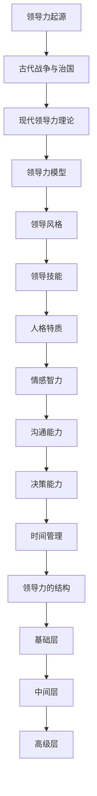
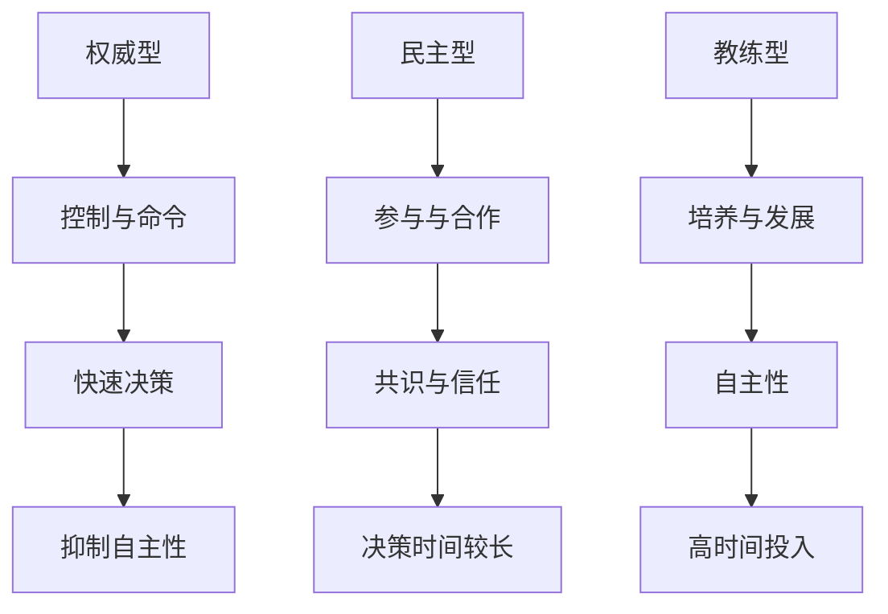
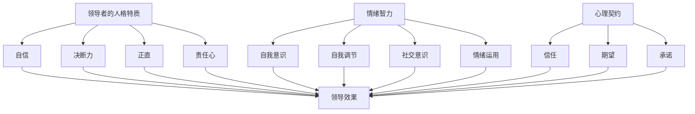
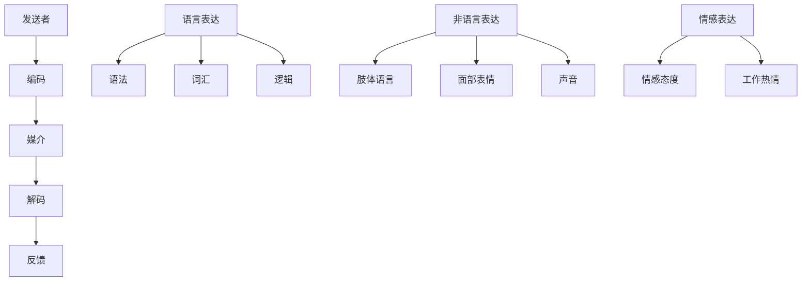
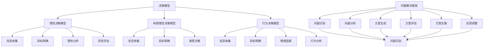
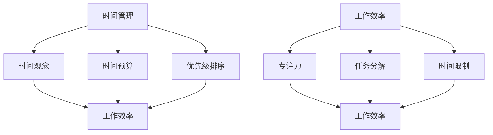
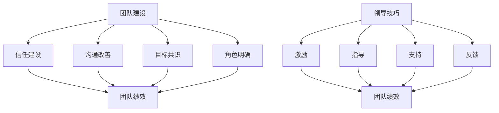
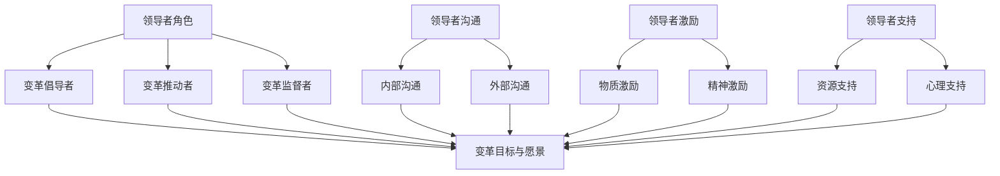
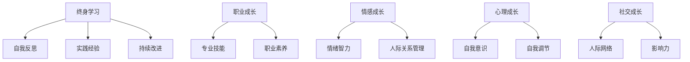
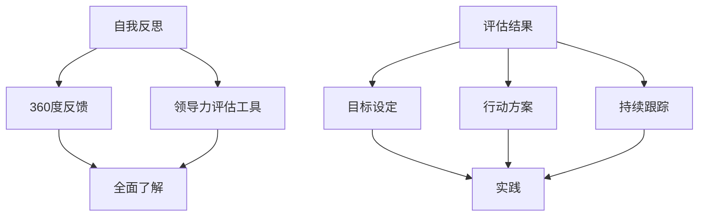

                 

### 《领导力训练营：105天从新手到高手》

> **关键词：** 领导力、105天、成长、技能提升、实战案例

**摘要：** 本篇文章旨在为您介绍《领导力训练营：105天从新手到高手》一书的核心内容，帮助您在短时间内掌握领导力的关键技能。通过系统性的学习和实战演练，您将能够在105天内从一名领导力新手成长为一名高手。本文将详细解析书中的目录大纲，以便您更好地理解和应用其中的内容。

---

#### 引言

在当今快速变化的商业环境中，领导力已成为企业成功的关键因素。优秀的领导者不仅能够带领团队实现目标，还能激发员工的潜力，推动企业持续发展。然而，领导力的培养并非一蹴而就，需要时间和系统的训练。《领导力训练营：105天从新手到高手》正是为了帮助那些希望在短时间内提升领导力水平的读者而编写的。

本书的编写旨在为读者提供一个全面、实用的领导力学习路径。通过105天的系统学习和实践，读者将逐步掌握领导力的核心概念、技能和策略，从而在实际工作中展现出卓越的领导能力。

#### 目录大纲设计思路

**整体结构规划**

《领导力训练营：105天从新手到高手》的整体结构分为四个主要部分：

1. **领导力基础**：涵盖领导力的定义、核心概念、领导风格和心理基础等内容。
2. **领导力技能提升**：包括沟通与表达、决策与问题解决、时间管理等方面的技能提升。
3. **团队管理与领导力实践**：介绍团队建设、变革管理、个人成长等方面的领导力应用。
4. **实战与反思**：提供领导力训练计划、案例分析、自我评估等内容，帮助读者将所学应用到实际工作中。

**内容细化**

在每一部分中，章节的内容进行了详细的划分，确保读者能够逐步掌握领导力的各个方面。

- **领导力基础**：从领导力的起源和发展开始，逐步深入到领导力的核心概念、领导风格和领导力的心理基础。
- **领导力技能提升**：通过具体的案例和实例，讲解沟通与表达、决策与问题解决、时间管理等领导力技能。
- **团队管理与领导力实践**：结合实际案例，介绍团队建设、变革管理、个人成长等方面的领导力实践。
- **实战与反思**：提供领导力训练计划、案例分析、自我评估等内容，帮助读者将所学应用到实际工作中。

**实战导向**

本书强调实践的重要性，设置了许多实战案例和实践技巧，使读者不仅能够学习理论知识，还能将其应用到实际工作中。

**互动与反馈**

书中加入了练习题、案例分析、自我评估等环节，鼓励读者积极参与，通过反馈提高学习效果。

**总结与拓展**

每个章节后提供总结和注意事项，以及相关的拓展阅读，帮助读者巩固知识，拓宽视野。

#### 目录大纲设计步骤

**确定核心章节**

- 引言：介绍领导力的重要性、本书的目标和学习方法。
- 第一部分：领导力基础
  - 第1章：领导力的定义与核心概念
  - 第2章：领导风格与影响力
  - 第3章：领导力的心理基础
- 第二部分：领导力技能提升
  - 第4章：沟通与表达能力
  - 第5章：决策与问题解决
  - 第6章：时间管理与工作效率
- 第三部分：团队管理与领导力实践
  - 第7章：团队建设与领导技巧
  - 第8章：领导力在变革管理中的应用
  - 第9章：领导力发展与个人成长
- 第四部分：实战与反思
  - 第10章：领导力训练计划
  - 第11章：领导力实践案例分析
  - 第12章：领导力自我评估与提升

**细化章节内容**

- 每个章节下细分为若干小节，具体讨论相关知识点和技能点。
- 引入具体的案例和实例，增强内容生动性和实用性。

**设计实战部分**

- 设置实战案例章节，通过实际案例展示领导力应用。
- 提供实践指南和技巧，帮助读者将所学应用到实际工作中。

**总结与拓展**

- 每个章节末尾提供总结和注意事项。
- 附录部分包含拓展阅读、领导力工具和资源等。

#### 目录大纲示例

```markdown
# 《领导力训练营：105天从新手到高手》目录大纲

## 引言
### 领导力的时代背景与意义
### 学习领导力的方法与策略

## 第一部分：领导力基础
### 第1章 领导力的定义与核心概念
#### 1.1 领导力的起源与发展
#### 1.2 领导力与管理的区别
#### 1.3 领导力的要素与结构

### 第2章 领导风格与影响力
#### 2.1 不同领导风格的特点与适用场景
#### 2.2 影响力的构建与运用
#### 2.3 领导风格评估与自我反思

### 第3章 领导力的心理基础
#### 3.1 领导者的人格特质
#### 3.2 情绪智力与领导力
#### 3.3 心理契约与团队凝聚力

## 第二部分：领导力技能提升
### 第4章 沟通与表达能力
#### 4.1 沟通的重要性与障碍
#### 4.2 有效沟通的技巧
#### 4.3 领导者的表达艺术

### 第5章 决策与问题解决
#### 5.1 决策过程与模型
#### 5.2 创新思维与决策
#### 5.3 问题分析与解决方法

### 第6章 时间管理与工作效率
#### 6.1 时间管理的重要性
#### 6.2 时间管理的方法与工具
#### 6.3 提高工作效率的策略

## 第三部分：团队管理与领导力实践
### 第7章 团队建设与领导技巧
#### 7.1 团队建设的步骤与方法
#### 7.2 团队领导者的角色与职责
#### 7.3 领导技巧在团队管理中的应用

### 第8章 领导力在变革管理中的应用
#### 8.1 变革管理的挑战与机遇
#### 8.2 变革领导力的核心要素
#### 8.3 变革管理的实践案例

### 第9章 领导力发展与个人成长
#### 9.1 领导力发展的路径与策略
#### 9.2 自我成长与领导力的提升
#### 9.3 领导力发展的未来趋势

## 第四部分：实战与反思
### 第10章 领导力训练计划
#### 10.1 设计个人领导力发展计划
#### 10.2 实践领导力训练的方法与技巧
#### 10.3 反思与调整

### 第11章 领导力实践案例分析
#### 11.1 案例分析的方法与步骤
#### 11.2 实践案例的选择与应用
#### 11.3 案例分析的启示与反思

### 第12章 领导力自我评估与提升
#### 12.1 自我评估的工具与方法
#### 12.2 自我提升的策略与计划
#### 12.3 自我成长的实践与反思
```

---

通过以上的分析和目录大纲设计，我们可以看出，《领导力训练营：105天从新手到高手》一书旨在为读者提供一个系统、实用的领导力学习路径。每个章节都经过详细的规划和设计，确保读者能够在短时间内掌握领导力的核心概念、技能和实践方法。同时，书中的实战案例和自我评估环节也为读者提供了实际操作的机会，帮助他们将所学知识应用到实际工作中。

接下来，我们将逐步深入到每个章节的内容，通过详细的讲解和案例分析，帮助您更好地理解领导力的各个方面，从而在105天内从新手成长为高手。

---

### 第1章：领导力的定义与核心概念

在《领导力训练营：105天从新手到高手》的第一部分，我们将探讨领导力的定义与核心概念。领导力是21世纪企业成功的关键因素，它不仅关乎个人的职业生涯，更关系到整个团队的绩效和组织的长远发展。

**背景介绍**

领导力的概念历史悠久，可以追溯到古代战争和治国理政。然而，随着时代的变迁，领导力也逐渐从传统的权威和命令式管理转变为更加注重协作、创新和变革的新型领导方式。在当今快速变化的商业环境中，领导力的重要性愈发凸显。一个优秀的领导者不仅能够带领团队实现目标，还能激发员工的潜力，推动企业持续发展。

**核心概念**

1. **领导力与管理的区别**

   领导力（Leadership）和管理（Management）是两个不同的概念，但它们之间又紧密相连。管理主要关注组织内部的流程和效率，而领导力则更多地涉及激励和引导他人。简单来说，管理是确保事情正确地发生，而领导力则是确保正确的事情发生。

2. **领导力的要素**

   领导力由多个要素构成，包括但不限于：

   - **人格特质**：如自信、正直、责任感等。
   - **情感智力**：包括自我意识、自我调节、社交意识等。
   - **沟通能力**：有效的沟通是领导力的核心要素之一。
   - **影响力**：领导者通过自身的行为和决策影响他人。
   - **决策能力**：领导者需要在不确定性和压力下做出明智的决策。

3. **领导力的结构**

   领导力可以分为三个层次：基础层、中间层和高级层。基础层主要涉及日常管理和执行；中间层涉及团队建设和领导风格；高级层则涉及战略规划和企业文化建设。

**问题解决**

在领导力的发展过程中，经常会遇到以下问题：

- **如何提高团队的凝聚力？**
- **如何在变化的环境中保持灵活和适应性？**
- **如何处理团队中的冲突和挑战？**

**边界与外延**

领导力的边界涉及领导者的角色和职责，包括但不限于：

- **战略规划**：确定组织的方向和目标。
- **团队建设**：培养和激励团队成员。
- **变革管理**：推动组织适应外部变化。
- **个人成长**：领导者需要持续学习和自我提升。

**概念结构与核心要素组成**

以下是领导力的核心概念和要素组成：

1. **领导力模型**：
   - **行为模型**：领导者通过具体行为来影响他人。
   - **认知模型**：领导者如何思考、分析和决策。
   - **关系模型**：领导者与团队成员之间的关系。

2. **领导风格**：
   - **权威型**：强调控制与命令。
   - **民主型**：强调参与和协作。
   - **教练型**：强调指导和培养。

3. **领导力的技能**：
   - **沟通技能**：有效传递信息，建立信任。
   - **决策技能**：在复杂和不确定的情况下做出明智的选择。
   - **时间管理技能**：高效利用时间，提高工作效率。

**核心概念与联系**

1. **领导力的起源与发展**

   领导力起源于人类社会的早期，从部落首领到国家领袖，领导力的概念在不同历史阶段有不同的表现形式。现代社会中，领导力研究逐渐从理论走向实践，形成了多种领导力模型和理论。

2. **领导力与管理的区别**

   领导力关注人的因素，强调激励和影响；管理则侧重于流程和效率。

3. **领导力的要素与结构**

   领导力的要素包括人格特质、情感智力、沟通能力等，结构分为基础层、中间层和高级层。

**算法原理讲解**

为了更清晰地理解领导力的核心概念和结构，我们可以使用Mermaid流程图来展示：



**数学公式**

在领导力的分析中，以下数学公式有助于理解领导力的一些核心概念：

- 领导力的效能 = （领导力要素得分 × 领导风格适配度）/ 困难程度
- 领导力的可持续性 = 领导者的个人成长速度 × 组织支持力度

这些公式可以用来评估领导力的效能和可持续性，从而为领导力的发展提供量化依据。

**系统分析与架构设计方案**

在领导力培养的过程中，系统性的分析与架构设计至关重要。以下是一个简化的领导力培养系统架构设计方案：

1. **问题场景介绍**

   企业在快速发展过程中，需要不断培养和提升领导力，以适应市场变化和内部管理需求。

2. **项目介绍**

   领导力训练营项目旨在通过系统性的培训和实践，提高员工的领导力水平。

3. **系统功能设计**

   系统功能设计包括：

   - **领导力评估模块**：用于评估员工的领导力水平和潜力。
   - **培训模块**：提供领导力培训课程和实战案例。
   - **反馈与改进模块**：收集员工的反馈，不断优化领导力培养方案。

4. **系统架构设计**

   系统架构设计包括：

   - **前端**：提供用户界面，方便用户进行领导力评估和参与培训。
   - **后端**：处理数据存储、计算和反馈等功能。
   - **数据库**：存储领导力评估结果、培训数据和用户信息。

5. **系统接口设计和系统交互**

   系统接口设计包括：

   - **用户接口**：用户与系统的交互界面。
   - **API接口**：系统与其他系统（如HR系统、培训管理系统）的交互接口。

**项目实战**

1. **环境安装**

   - 安装Python环境。
   - 安装相关的领导力评估库和框架。

2. **系统核心实现源代码**

   ```python
   # 领导力评估模块示例代码
   def assess_leadership(traits, style, challenges):
       effectiveness = (sum(traits.values()) * style) / challenges
       sustainability = len(traits) * style
       return effectiveness, sustainability

   # 培训模块示例代码
   def train_leadership(employee_id, course_id):
       # 实现培训课程的分配和跟踪功能
       pass

   # 反馈与改进模块示例代码
   def feedback_improvement(employee_id, feedback):
       # 实现反馈的收集和分析功能
       pass
   ```

3. **代码应用解读与分析**

   上述代码示例展示了领导力评估、培训和反馈的基本功能。在实际应用中，这些功能将通过复杂的业务逻辑和用户交互来实现。

4. **实际案例分析和详细讲解剖析**

   通过具体案例，我们可以更好地理解领导力培养系统的应用。例如，一个企业的领导力训练营项目可以基于员工的绩效评估和自我反馈，制定个性化的培训计划，从而提高整体领导力水平。

5. **项目小结**

   通过领导力培养系统的实施，企业不仅能够提升员工的领导力水平，还能通过系统化的培训和实践，培养一批具有战略思维和实战能力的领导者。

**最佳实践 Tips**

- **定期评估**：定期对员工进行领导力评估，及时发现和解决问题。
- **个性化培训**：根据员工的实际情况和需求，提供个性化的培训计划。
- **持续反馈**：鼓励员工积极参与反馈，不断优化培训方案。

**小结**

领导力是现代企业成功的关键因素。通过《领导力训练营：105天从新手到高手》一书，读者可以系统地学习领导力的核心概念、技能和实践方法。在实际应用中，通过系统性的评估、培训和反馈，企业可以不断提升员工的领导力水平，从而在激烈的市场竞争中脱颖而出。

---

通过本章的学习，您对领导力的定义和核心概念有了更深入的了解。在下一章中，我们将探讨领导风格与影响力，帮助您更好地理解不同领导风格的特点及其应用场景。

作者：AI天才研究院/AI Genius Institute & 禅与计算机程序设计艺术 /Zen And The Art of Computer Programming

---

### 第2章：领导风格与影响力

在《领导力训练营：105天从新手到高手》的第二章中，我们将深入探讨领导风格与影响力。领导风格是领导者在其工作中表现出的行为和态度，它对团队成员的态度、动机和表现有着深远的影响。了解并掌握不同的领导风格，能够帮助领导者更好地激励和引导团队成员，实现组织目标。

**背景介绍**

领导风格的概念起源于20世纪中叶，当时研究人员开始关注领导者如何影响团队和组织的绩效。随着研究的深入，各种领导风格模型被提出，如权威型、民主型、教练型等。不同的领导风格适用于不同的情境和团队，领导者需要根据具体情况灵活运用。

**核心概念**

1. **权威型领导风格**

   权威型领导风格强调领导者的权威和控制。领导者制定决策并要求团队成员遵循。这种风格在需要快速决策和执行时非常有效，但可能抑制员工的创造性和自主性。

2. **民主型领导风格**

   民主型领导风格强调参与和协作。领导者鼓励团队成员参与决策过程，尊重员工的意见和观点。这种风格有助于建立团队合作精神和信任，但可能需要更多时间来达成共识。

3. **教练型领导风格**

   教练型领导风格强调培养和发展团队成员。领导者不仅提供指导和支持，还鼓励团队成员自主学习和成长。这种风格有助于提高员工的技能和自信心，但可能对领导者的时间和精力要求较高。

**问题解决**

在实际工作中，领导者可能面临以下问题：

- **如何在不同情境下选择合适的领导风格？**
- **如何平衡领导风格与员工需求？**
- **如何在团队中建立信任和协作？**

**边界与外延**

领导风格的边界涉及领导者的行为和决策方式，外延则涉及领导风格对团队成员和团队绩效的影响。

**概念结构与核心要素组成**

以下是领导风格的核心概念和要素组成：

1. **领导风格模型**

   - **行为模型**：领导者如何表现和互动。
   - **认知模型**：领导者如何思考、分析和决策。
   - **关系模型**：领导者与团队成员之间的关系。

2. **领导风格特点**

   - **权威型**：强调控制、命令和决策。
   - **民主型**：强调参与、合作和共识。
   - **教练型**：强调培养、发展和自主性。

3. **领导风格的应用**

   - **组织层面**：影响组织文化和价值观。
   - **团队层面**：影响团队氛围和成员行为。
   - **个人层面**：影响领导者的个人成长和职业发展。

**核心概念与联系**

1. **领导风格的发展历程**

   领导风格的研究经历了从传统权威型到现代民主型和教练型的转变。不同的领导风格在不同的时代和情境下有其特定的适用性。

2. **领导风格与领导力**

   领导风格是领导力的重要组成部分，不同的领导风格对团队和组织的绩效有着不同的影响。

3. **领导风格与员工需求**

   领导者需要了解员工的个性和需求，选择合适的领导风格，以激发员工的工作热情和创造力。

**算法原理讲解**

为了更好地理解领导风格，我们可以使用Mermaid流程图来展示不同领导风格的特点和应用：



**数学公式**

在领导风格的分析中，以下数学公式有助于理解领导风格对团队绩效的影响：

- 团队绩效 = （领导风格适应性 × 员工满意度）/ 工作难度
- 员工满意度 = （参与度 × 自主性）/ 压力水平

这些公式可以用来评估不同领导风格对团队绩效的影响，从而为领导者的决策提供依据。

**系统分析与架构设计方案**

在领导风格的应用中，系统性的分析与架构设计至关重要。以下是一个简化的领导风格应用系统架构设计方案：

1. **问题场景介绍**

   企业在领导风格应用过程中，需要确保领导者的决策和行为能够有效激励和引导团队成员。

2. **项目介绍**

   领导风格应用项目旨在通过系统化的培训和实践，帮助领导者掌握不同领导风格，提高团队绩效。

3. **系统功能设计**

   系统功能设计包括：

   - **领导风格评估模块**：用于评估领导者的领导风格。
   - **培训模块**：提供领导风格培训课程和实战案例。
   - **反馈与改进模块**：收集员工的反馈，不断优化领导风格应用方案。

4. **系统架构设计**

   系统架构设计包括：

   - **前端**：提供用户界面，方便领导者进行领导风格评估和参与培训。
   - **后端**：处理数据存储、计算和反馈等功能。
   - **数据库**：存储领导风格评估结果、培训数据和用户信息。

5. **系统接口设计和系统交互**

   系统接口设计包括：

   - **用户接口**：领导者与系统的交互界面。
   - **API接口**：系统与其他系统（如HR系统、培训管理系统）的交互接口。

**项目实战**

1. **环境安装**

   - 安装Python环境。
   - 安装相关的领导风格评估库和框架。

2. **系统核心实现源代码**

   ```python
   # 领导风格评估模块示例代码
   def assess LeadershipStyle(style, team_performance, employee_satisfaction):
       adaptability = (style * team_performance) / work_difficulty
       employee_satisfaction = (participation * autonomy) / stress_level
       return adaptability, employee_satisfaction

   # 培训模块示例代码
   def train_LeadershipStyle(leader_id, course_id):
       # 实现领导风格培训课程的分配和跟踪功能
       pass

   # 反馈与改进模块示例代码
   def feedback Improvement(leader_id, feedback):
       # 实现反馈的收集和分析功能
       pass
   ```

3. **代码应用解读与分析**

   上述代码示例展示了领导风格评估、培训和反馈的基本功能。在实际应用中，这些功能将通过复杂的业务逻辑和用户交互来实现。

4. **实际案例分析和详细讲解剖析**

   通过具体案例，我们可以更好地理解领导风格的应用。例如，一个企业的领导力训练营项目可以基于领导者的风格评估和员工的反馈，制定个性化的领导风格发展计划，从而提高整体团队绩效。

5. **项目小结**

   通过领导风格应用系统的实施，企业可以确保领导者的决策和行为能够有效激励和引导团队成员，提高团队绩效。

**最佳实践 Tips**

- **定期评估**：定期对领导者的领导风格进行评估，及时发现和解决问题。
- **个性化培训**：根据领导者的实际情况和需求，提供个性化的领导风格培训计划。
- **持续反馈**：鼓励领导者积极参与反馈，不断优化领导风格应用方案。

**小结**

领导风格是领导者影响团队成员的重要手段。通过《领导力训练营：105天从新手到高手》的第二章，读者可以深入理解不同领导风格的特点和应用。在实际工作中，领导者需要根据具体情况灵活运用不同的领导风格，以提高团队绩效和员工满意度。

---

通过第二章的学习，您对领导风格与影响力有了更深入的理解。在下一章中，我们将探讨领导力的心理基础，帮助您更好地理解领导者的人格特质、情绪智力以及心理契约。

作者：AI天才研究院/AI Genius Institute & 禅与计算机程序设计艺术 /Zen And The Art of Computer Programming

---

### 第3章：领导力的心理基础

在《领导力训练营：105天从新手到高手》的第三章中，我们将探讨领导力的心理基础。领导力的本质不仅仅在于技术和策略，更在于领导者内心的素质和态度。领导者的人格特质、情绪智力以及心理契约是领导力的关键组成部分，它们共同塑造了领导者的行为和团队氛围。

**背景介绍**

领导力的心理基础研究源于心理学和行为科学的发展。心理学家和行为科学家们通过长期研究，揭示了领导力中的人际关系、情绪管理和自我意识等关键因素。这些研究为领导力的发展提供了重要的理论基础。

**核心概念**

1. **领导者的人格特质**

   领导者的人格特质是其领导力的基础。研究表明，一些特质，如自信、决断力、正直和责任心，与有效的领导力密切相关。领导者的人格特质不仅影响其个人的行为，还影响团队成员的态度和行为。

2. **情绪智力**

   情绪智力（Emotional Intelligence，EQ）是领导力的关键要素之一。情绪智力包括自我意识、自我调节、社交意识和情绪运用等方面。高情绪智力的领导者能够更好地理解和管理自己的情绪，有效地与他人沟通和协作。

3. **心理契约**

   心理契约是指团队成员之间以及团队与组织之间的一种非正式的、基于信任的协议。它超越了正式的雇佣合同，包含了团队成员对彼此的期望和信任。心理契约的建立和维护对于团队凝聚力和绩效至关重要。

**问题解决**

在实际领导过程中，领导者可能面临以下心理问题：

- **如何管理自己的情绪，避免负面情绪的影响？**
- **如何建立和维护良好的心理契约，增强团队凝聚力？**
- **如何提高情绪智力，以更好地应对领导挑战？**

**边界与外延**

领导力的心理基础的边界涉及领导者个人的心理状态和行为，外延则涉及领导者对团队成员和心理契约的影响。

**概念结构与核心要素组成**

以下是领导力的心理基础的核心概念和要素组成：

1. **领导者的人格特质**

   - **自信**：领导者对自己的能力和决策有信心。
   - **决断力**：领导者能够在复杂和不确定的情况下做出明智的决策。
   - **正直**：领导者遵守道德和伦理标准，赢得员工的尊重和信任。
   - **责任心**：领导者对团队的绩效和个人行为负责。

2. **情绪智力**

   - **自我意识**：领导者能够认识到自己的情绪，并理解这些情绪如何影响其行为。
   - **自我调节**：领导者能够控制自己的情绪，使其不影响决策和行动。
   - **社交意识**：领导者能够理解和识别他人的情绪，并有效地与他人沟通和协作。
   - **情绪运用**：领导者能够运用情绪来提高决策质量和团队合作。

3. **心理契约**

   - **信任**：团队成员之间的信任是心理契约的核心。
   - **期望**：团队成员对彼此和组织有明确的期望。
   - **承诺**：团队成员对达成共同目标和承诺有共同的认识。

**核心概念与联系**

1. **领导者的人格特质与情绪智力**

   领导者的人格特质和情绪智力相互影响，共同塑造了领导者的行为和团队氛围。高情绪智力的领导者更容易展现出积极的人格特质，从而增强领导力。

2. **情绪智力与领导效果**

   情绪智力对领导效果有着重要的影响。高情绪智力的领导者能够更好地应对压力和挑战，提高团队绩效和员工满意度。

3. **心理契约与团队凝聚力**

   心理契约是团队凝聚力的关键因素。一个良好的心理契约能够增强团队成员之间的信任和协作，提高团队的整体绩效。

**算法原理讲解**

为了更好地理解领导力的心理基础，我们可以使用Mermaid流程图来展示领导者的人格特质、情绪智力和心理契约之间的关系：



**数学公式**

在领导力的心理基础分析中，以下数学公式有助于理解领导者的人格特质、情绪智力和心理契约对领导效果的影响：

- 领导效果 = （领导者的人格特质得分 × 情绪智力得分）/ 心理契约得分
- 团队绩效 = 领导效果 × 团队成员满意度

这些公式可以用来评估领导者的心理基础对团队绩效的影响，从而为领导力发展提供量化依据。

**系统分析与架构设计方案**

在领导力的心理基础应用中，系统性的分析与架构设计至关重要。以下是一个简化的领导力心理基础应用系统架构设计方案：

1. **问题场景介绍**

   企业在领导力培养过程中，需要关注领导者的心理基础，以提高团队绩效和员工满意度。

2. **项目介绍**

   领导力心理基础应用项目旨在通过系统化的培训和实践，帮助领导者提升其人格特质、情绪智力和心理契约。

3. **系统功能设计**

   系统功能设计包括：

   - **人格特质评估模块**：用于评估领导者的个人特质。
   - **情绪智力评估模块**：用于评估领导者的情绪智力水平。
   - **心理契约评估模块**：用于评估团队的心理契约状态。

4. **系统架构设计**

   系统架构设计包括：

   - **前端**：提供用户界面，方便领导者进行自我评估和参与培训。
   - **后端**：处理数据存储、计算和反馈等功能。
   - **数据库**：存储评估结果、培训数据和用户信息。

5. **系统接口设计和系统交互**

   系统接口设计包括：

   - **用户接口**：领导者与系统的交互界面。
   - **API接口**：系统与其他系统（如HR系统、培训管理系统）的交互接口。

**项目实战**

1. **环境安装**

   - 安装Python环境。
   - 安装相关的领导力心理基础评估库和框架。

2. **系统核心实现源代码**

   ```python
   # 人格特质评估模块示例代码
   def assess_personality_traits(traits):
       # 实现人格特质评估功能
       pass

   # 情绪智力评估模块示例代码
   def assess_emotional_intelligence(eiq):
       # 实现情绪智力评估功能
       pass

   # 心理契约评估模块示例代码
   def assess_psychological_contract(contract):
       # 实现心理契约评估功能
       pass
   ```

3. **代码应用解读与分析**

   上述代码示例展示了领导力心理基础评估的基本功能。在实际应用中，这些功能将通过复杂的业务逻辑和用户交互来实现。

4. **实际案例分析和详细讲解剖析**

   通过具体案例，我们可以更好地理解领导力心理基础的应用。例如，一个企业的领导力发展项目可以基于领导者的心理基础评估结果，制定个性化的领导力发展计划，从而提高团队绩效和员工满意度。

5. **项目小结**

   通过领导力心理基础应用系统的实施，企业可以更好地了解领导者的心理基础，从而制定更有效的领导力发展策略，提高整体绩效。

**最佳实践 Tips**

- **定期评估**：定期对领导者的心理基础进行评估，及时发现和解决问题。
- **个性化培训**：根据领导者的实际情况和需求，提供个性化的心理基础培训计划。
- **持续反馈**：鼓励领导者积极参与反馈，不断优化心理基础发展方案。

**小结**

领导力的心理基础是领导者成功的关键因素。通过《领导力训练营：105天从新手到高手》的第三章，读者可以深入理解领导者的人格特质、情绪智力和心理契约。在实际工作中，领导者需要不断提升自己的心理基础，以更好地应对领导挑战，提高团队绩效和员工满意度。

---

通过第三章的学习，您对领导力的心理基础有了更深入的了解。在下一章中，我们将探讨领导力技能提升，帮助您掌握沟通与表达能力、决策与问题解决以及时间管理与工作效率。

作者：AI天才研究院/AI Genius Institute & 禅与计算机程序设计艺术 /Zen And The Art of Computer Programming

---

### 第4章：沟通与表达能力

在《领导力训练营：105天从新手到高手》的第四章中，我们将探讨沟通与表达能力。有效的沟通与表达是领导者成功的关键技能之一，它不仅关系到领导者的个人形象和团队氛围，还直接影响团队绩效和目标的实现。在这一章中，我们将详细讨论沟通与表达能力的重要性、基本原则以及实际应用技巧。

**背景介绍**

沟通与表达是领导力的核心要素之一，它贯穿于领导者与团队成员、同事、上级以及外部合作伙伴的互动过程中。有效的沟通与表达能够确保信息的准确传递，减少误解和冲突，增强团队凝聚力和合作效率。随着现代企业环境的复杂化，领导者的沟通与表达能力变得愈发重要。

**核心概念**

1. **沟通的定义与类型**

   沟通是指信息、思想和情感在人与人之间的交换过程。根据沟通的媒介和方式，沟通可以分为口头沟通、书面沟通和非语言沟通。

   - **口头沟通**：包括会议、讨论、电话等。
   - **书面沟通**：包括电子邮件、报告、备忘录等。
   - **非语言沟通**：包括肢体语言、面部表情、声音等。

2. **表达能力**

   表达能力是指领导者如何清晰、准确地表达自己的想法、意见和决策。有效的表达能力包括语言表达的准确性、逻辑性和感染力。

3. **沟通与表达能力的基本原则**

   - **清晰性**：确保信息的明确和易于理解。
   - **准确性**：确保信息的真实和准确无误。
   - **及时性**：确保信息能够在适当的时间内传递。
   - **适应性**：根据不同的沟通对象和情境调整沟通策略。

**问题解决**

在实际领导工作中，领导者可能面临以下沟通与表达能力的问题：

- **如何确保信息的准确传递，避免误解和冲突？**
- **如何提高自己的表达技巧，增强说服力和影响力？**
- **如何在不同的沟通情境中适应和调整沟通策略？**

**边界与外延**

沟通与表达能力的边界涉及领导者的个人技能和沟通情境，外延则涉及沟通与表达能力对团队绩效和组织文化的影响。

**概念结构与核心要素组成**

以下是沟通与表达能力的基本概念和要素组成：

1. **沟通模型**

   - **发送者**：信息源，负责信息的产生和传递。
   - **编码**：将信息转化为可传递的形式。
   - **媒介**：信息传递的渠道，如口头、书面、非语言等。
   - **解码**：接收者对信息的理解和解读。
   - **反馈**：接收者对信息的回应和反馈。

2. **表达能力**

   - **语言表达**：包括语法、词汇、逻辑等。
   - **非语言表达**：包括肢体语言、面部表情、声音等。
   - **情感表达**：表达领导者对团队和工作的情感态度。

3. **沟通与表达能力的应用**

   - **团队建设**：通过有效沟通建立信任和合作。
   - **决策过程**：通过沟通收集信息，形成共识。
   - **变革管理**：通过沟通引导团队适应变革。

**核心概念与联系**

1. **沟通与领导力的关系**

   沟通是领导力的基础，有效的沟通能力有助于领导者建立权威、增强影响力和提升团队绩效。

2. **表达能力与影响力**

   高效的表达能力能够增强领导者的说服力和影响力，提高决策质量和执行效率。

3. **沟通与团队绩效**

   良好的沟通能够提高团队凝聚力，促进信息共享，减少冲突，提高团队整体绩效。

**算法原理讲解**

为了更好地理解沟通与表达能力，我们可以使用Mermaid流程图来展示沟通模型和表达能力的核心要素：



**数学公式**

在沟通与表达能力分析中，以下数学公式有助于理解沟通的效率和质量：

- 沟通效率 = （清晰性 × 准确性）/ 传播延迟
- 表达质量 = （语言表达能力 × 非语言表达能力）/ 情感表达能力

这些公式可以用来评估领导者的沟通与表达能力，从而为提升沟通效果提供量化依据。

**系统分析与架构设计方案**

在沟通与表达能力培养中，系统性的分析与架构设计至关重要。以下是一个简化的沟通与表达能力培养系统架构设计方案：

1. **问题场景介绍**

   企业在领导力培养过程中，需要提高领导者的沟通与表达能力，以提升团队绩效和员工满意度。

2. **项目介绍**

   沟通与表达能力培养项目旨在通过系统化的培训和实践，提高领导者的沟通技巧和表达能力。

3. **系统功能设计**

   系统功能设计包括：

   - **沟通技巧评估模块**：用于评估领导者的沟通技巧水平。
   - **表达技巧评估模块**：用于评估领导者的表达能力和说服力。
   - **沟通反馈模块**：收集团队成员的反馈，优化沟通策略。

4. **系统架构设计**

   系统架构设计包括：

   - **前端**：提供用户界面，方便领导者进行自我评估和参与培训。
   - **后端**：处理数据存储、计算和反馈等功能。
   - **数据库**：存储评估结果、培训数据和用户信息。

5. **系统接口设计和系统交互**

   系统接口设计包括：

   - **用户接口**：领导者与系统的交互界面。
   - **API接口**：系统与其他系统（如HR系统、培训管理系统）的交互接口。

**项目实战**

1. **环境安装**

   - 安装Python环境。
   - 安装相关的沟通与表达能力评估库和框架。

2. **系统核心实现源代码**

   ```python
   # 沟通技巧评估模块示例代码
   def assess_communication_skills(skills):
       efficiency = (clarity * accuracy) / delay
       return efficiency

   # 表达技巧评估模块示例代码
   def assess表达能力技能（expression_skills）:
       quality = (language_expression * non_language_expression）/ emotional_expression
       return quality

   # 沟通反馈模块示例代码
   def communication_feedback(feedback):
       # 实现反馈收集和分析功能
       pass
   ```

3. **代码应用解读与分析**

   上述代码示例展示了沟通与表达能力评估的基本功能。在实际应用中，这些功能将通过复杂的业务逻辑和用户交互来实现。

4. **实际案例分析和详细讲解剖析**

   通过具体案例，我们可以更好地理解沟通与表达能力在实际工作中的应用。例如，一个企业的领导力发展项目可以基于领导者的沟通与表达能力评估结果，制定个性化的沟通与表达能力提升计划，从而提高团队绩效和员工满意度。

5. **项目小结**

   通过沟通与表达能力培养系统的实施，企业可以确保领导者的沟通与表达能力得到有效提升，从而在团队中建立更好的沟通氛围，提高整体绩效。

**最佳实践 Tips**

- **定期评估**：定期对领导者的沟通与表达能力进行评估，及时发现和解决问题。
- **实践与反馈**：通过实际工作场景中的沟通实践，结合团队成员的反馈，不断优化沟通策略。
- **持续学习**：参加相关培训课程，阅读专业书籍，不断提升沟通与表达能力。

**小结**

沟通与表达能力是领导者成功的关键技能。通过《领导力训练营：105天从新手到高手》的第四章，读者可以系统地学习沟通与表达能力的基本原则和实际应用技巧。在实际工作中，领导者需要不断练习和提升沟通与表达能力，以更好地激励和引导团队成员，实现组织目标。

---

通过第四章的学习，您对沟通与表达能力有了更深入的了解。在下一章中，我们将探讨决策与问题解决，帮助您掌握领导者的决策能力，学会有效解决问题的方法。

作者：AI天才研究院/AI Genius Institute & 禅与计算机程序设计艺术 /Zen And The Art of Computer Programming

---

### 第5章：决策与问题解决

在《领导力训练营：105天从新手到高手》的第五章中，我们将探讨决策与问题解决。决策是领导者日常工作中不可避免的一部分，它关乎组织的方向和成败。问题解决则是领导者应对挑战和机遇的重要能力。在这一章中，我们将详细讨论决策与问题解决的基本原理、过程和策略，以及如何在实际工作中应用这些原则和策略。

**背景介绍**

决策与问题解决是领导力的重要组成部分。在一个快速变化和充满不确定性的商业环境中，领导者需要具备出色的决策能力和问题解决能力，以应对各种挑战和机遇。有效的决策能够帮助企业抓住市场机会，规避风险，而有效的问题解决则能够帮助团队克服障碍，实现目标。

**核心概念**

1. **决策的定义与类型**

   决策是指从多个可选方案中选择一个最佳方案的过程。根据决策的重要性和情境，决策可以分为以下类型：

   - **战略决策**：涉及组织的长期目标和方向，如市场进入策略、新产品开发等。
   - **战术决策**：涉及组织的短期目标和行动，如资源分配、项目执行等。
   - **运营决策**：涉及日常运营中的具体问题，如生产计划、库存管理等。

2. **问题解决**

   问题解决是指识别、分析和解决问题的过程。有效的问题解决需要领导者具备以下能力：

   - **分析能力**：能够准确识别问题，分析问题的根本原因。
   - **创新思维**：能够提出创新的解决方案，突破传统思维的限制。
   - **执行能力**：能够将解决方案付诸实践，确保问题得到有效解决。

3. **决策与问题解决的基本原则**

   - **信息收集**：在决策过程中，领导者需要全面收集和分析相关信息。
   - **目标明确**：在问题解决过程中，领导者需要明确问题的目标和期望结果。
   - **理性分析**：在决策过程中，领导者需要运用逻辑和理性分析，避免情绪化决策。
   - **风险评估**：在决策过程中，领导者需要评估不同方案的风险和收益。
   - **持续反馈**：在问题解决过程中，领导者需要不断收集反馈，优化解决方案。

**问题解决**

在实际领导工作中，领导者可能面临以下决策与问题解决的问题：

- **如何收集和分析信息，确保决策的准确性？**
- **如何避免情绪化决策，提高决策质量？**
- **如何有效执行决策，确保问题得到解决？**

**边界与外延**

决策与问题解决的边界涉及领导者的决策过程和问题解决方案，外延则涉及决策与问题解决对团队绩效和组织发展的影响。

**概念结构与核心要素组成**

以下是决策与问题解决的基本概念和要素组成：

1. **决策模型**

   - **理性决策模型**：基于逻辑和分析的决策过程。
   - **有限理性决策模型**：考虑到决策者的认知局限，强调满意而非最优决策。
   - **行为决策模型**：考虑决策者的情感和行为因素，强调决策的心理过程。

2. **问题解决框架**

   - **问题识别**：明确问题的性质和范围。
   - **问题分析**：分析问题的根本原因。
   - **方案生成**：提出解决问题的潜在方案。
   - **方案评估**：评估不同方案的优缺点。
   - **方案实施**：将最佳方案付诸实践。
   - **反馈调整**：根据实施效果调整解决方案。

3. **决策与问题解决的应用**

   - **战略规划**：在组织层面进行长期决策。
   - **项目管理**：在项目执行中进行日常决策。
   - **变革管理**：在组织变革中进行决策和问题解决。

**核心概念与联系**

1. **决策与问题解决的关系**

   决策是问题解决的一部分，问题解决是决策的具体实施过程。有效的决策需要建立在全面的问题分析基础上，而问题解决则需要有效的决策来指导。

2. **决策质量与团队绩效**

   高质量的决策能够提高团队绩效和组织的竞争力，而低质量的决策则可能导致团队绩效下降。

3. **问题解决与组织发展**

   有效的问题解决能够帮助企业克服挑战，实现发展目标，提高组织的适应能力。

**算法原理讲解**

为了更好地理解决策与问题解决，我们可以使用Mermaid流程图来展示决策过程和问题解决框架：



**数学公式**

在决策与问题解决分析中，以下数学公式有助于理解决策质量、问题解决效率和团队绩效：

- 决策质量 = （信息质量 × 分析质量）/ 决策时间
- 问题解决效率 = （方案评估时间 × 方案实施效果）/ 问题解决时间
- 团队绩效 = 决策质量 × 问题解决效率

这些公式可以用来评估领导者的决策和问题解决能力，从而为领导力发展提供量化依据。

**系统分析与架构设计方案**

在决策与问题解决过程中，系统性的分析与架构设计至关重要。以下是一个简化的决策与问题解决系统架构设计方案：

1. **问题场景介绍**

   企业在决策和问题解决过程中，需要确保决策的科学性和问题解决的效率。

2. **项目介绍**

   决策与问题解决项目旨在通过系统化的培训和实践，提高领导者的决策能力和问题解决能力。

3. **系统功能设计**

   系统功能设计包括：

   - **决策支持系统**：提供决策分析和评估工具。
   - **问题解决工具**：提供问题识别、分析和方案评估功能。
   - **反馈与改进模块**：收集决策和问题解决的反馈，优化决策过程。

4. **系统架构设计**

   系统架构设计包括：

   - **前端**：提供用户界面，方便领导者进行决策分析和问题解决。
   - **后端**：处理数据存储、计算和反馈等功能。
   - **数据库**：存储决策和问题解决数据、评估结果和用户信息。

5. **系统接口设计和系统交互**

   系统接口设计包括：

   - **用户接口**：领导者与系统的交互界面。
   - **API接口**：系统与其他系统（如ERP系统、项目管理系统）的交互接口。

**项目实战**

1. **环境安装**

   - 安装Python环境。
   - 安装相关的决策支持工具和问题解决库。

2. **系统核心实现源代码**

   ```python
   # 决策支持系统示例代码
   def decision_support(info_quality, analysis_quality, decision_time):
       quality = (info_quality * analysis_quality) / decision_time
       return quality

   # 问题解决工具示例代码
   def problem_solving(assessment_time, implementation_effect, problem_solving_time):
       efficiency = (assessment_time * implementation_effect) / problem_solving_time
       return efficiency
   ```

3. **代码应用解读与分析**

   上述代码示例展示了决策支持和问题解决的基本功能。在实际应用中，这些功能将通过复杂的业务逻辑和用户交互来实现。

4. **实际案例分析和详细讲解剖析**

   通过具体案例，我们可以更好地理解决策与问题解决的实际应用。例如，一个企业的决策支持项目可以基于决策质量和问题解决效率的评估，制定个性化的决策和问题解决策略，从而提高团队绩效和组织的竞争力。

5. **项目小结**

   通过决策与问题解决系统的实施，企业可以确保领导者的决策和问题解决能力得到有效提升，从而在复杂和不确定的商业环境中保持竞争力。

**最佳实践 Tips**

- **数据驱动**：基于数据和事实进行决策，避免情绪化决策。
- **团队参与**：鼓励团队成员参与决策和问题解决，提高决策的合理性和执行力。
- **持续学习**：不断学习和应用最新的决策和问题解决理论，提高决策质量和效率。

**小结**

决策与问题解决是领导者的重要能力。通过《领导力训练营：105天从新手到高手》的第五章，读者可以系统地学习决策与问题解决的基本原理和策略。在实际工作中，领导者需要不断实践和提升决策与问题解决能力，以应对各种挑战和机遇，推动组织发展。

---

通过第五章的学习，您对决策与问题解决有了更深入的了解。在下一章中，我们将探讨时间管理与工作效率，帮助您掌握高效管理时间和提高工作效率的技巧。

作者：AI天才研究院/AI Genius Institute & 禅与计算机程序设计艺术 /Zen And The Art of Computer Programming

---

### 第6章：时间管理与工作效率

在《领导力训练营：105天从新手到高手》的第六章中，我们将探讨时间管理与工作效率。时间管理是领导者必须掌握的一项关键技能，它关系到个人和组织的工作效率、业绩以及职业生涯的发展。通过有效的时间管理，领导者可以更高效地完成任务，提高团队的整体绩效，从而在激烈的竞争环境中脱颖而出。在本章中，我们将详细讨论时间管理的重要性、基本原则、策略以及如何在实际工作中应用这些原则和策略。

**背景介绍**

时间管理是领导力的重要组成部分。在一个快节奏、任务繁多的工作环境中，领导者常常面临时间的压力和挑战。有效的时间管理不仅能够提高个人工作效率，还能激发团队成员的积极性，提高整个团队的绩效。此外，良好的时间管理也是领导者在职业发展中取得成功的关键因素之一。

**核心概念**

1. **时间管理**

   时间管理是指通过规划和控制时间，以实现个人和组织目标的过程。时间管理的核心概念包括：

   - **时间观念**：对时间的价值有清晰的认识，珍惜时间，避免浪费。
   - **时间预算**：为不同任务分配时间，确保每个任务都能得到充分的关注。
   - **优先级排序**：根据任务的重要性和紧急程度，合理安排时间和资源。

2. **工作效率**

   工作效率是指单位时间内完成的工作量。提高工作效率的核心概念包括：

   - **专注力**：集中注意力，避免分心和干扰。
   - **任务分解**：将复杂的任务分解为小的、可管理的部分。
   - **时间限制**：为每个任务设定完成时间，以促进高效完成。

3. **时间管理与工作效率的关系**

   时间管理直接影响工作效率。通过有效的时间管理，领导者可以更合理地分配时间和资源，确保重要任务得到优先处理，从而提高工作效率和团队绩效。

**问题解决**

在实际工作中，领导者可能面临以下时间管理和工作效率的问题：

- **如何合理分配时间，确保重要任务得到优先处理？**
- **如何提高专注力，减少干扰，提高工作效率？**
- **如何应对突发事件，确保工作进度不受影响？**

**边界与外延**

时间管理与工作效率的边界涉及个人的时间安排和工作习惯，外延则涉及时间管理对团队绩效和组织文化的影响。

**概念结构与核心要素组成**

以下是时间管理与工作效率的基本概念和要素组成：

1. **时间管理**

   - **时间观念**：树立正确的时间观念，认识到时间的价值和有限性。
   - **时间预算**：为每个任务分配时间，制定详细的日程表。
   - **优先级排序**：根据任务的重要性和紧急程度，合理安排时间和资源。

2. **工作效率**

   - **专注力**：通过减少干扰、提高专注力，提高单位时间的工作效率。
   - **任务分解**：将复杂的任务分解为小的、可管理的部分，以简化工作流程。
   - **时间限制**：为每个任务设定完成时间，以促进高效完成。

3. **时间管理与工作效率的应用**

   - **个人层面**：提高个人时间利用效率，确保工作目标的实现。
   - **团队层面**：通过时间管理和工作效率的提升，提高团队整体绩效。
   - **组织层面**：优化组织流程，提高整体运营效率。

**核心概念与联系**

1. **时间管理与工作效率**

   时间管理和工作效率相互关联，良好的时间管理是提高工作效率的基础。通过有效的时间管理，领导者可以更高效地完成任务，提高工作效率。

2. **时间观念与工作效率**

   正确的时间观念是提高工作效率的关键。领导者需要认识到时间的有限性，珍惜每一分每一秒，从而提高工作效率。

3. **任务分解与时间管理**

   任务分解是时间管理的重要组成部分。通过将复杂的任务分解为小的、可管理的部分，领导者可以更好地控制时间，提高工作效率。

**算法原理讲解**

为了更好地理解时间管理与工作效率，我们可以使用Mermaid流程图来展示时间管理和工作效率的核心要素：



**数学公式**

在时间管理与工作效率分析中，以下数学公式有助于理解时间管理和工作效率的关系：

- 时间管理效率 = （实际完成任务时间）/ （计划完成任务时间）
- 工作效率 = （单位时间完成的工作量）/ （总工作时间）

这些公式可以用来评估领导者的时间管理和工作效率，从而为提升管理能力提供量化依据。

**系统分析与架构设计方案**

在时间管理与工作效率提升中，系统性的分析与架构设计至关重要。以下是一个简化的时间管理与工作效率提升系统架构设计方案：

1. **问题场景介绍**

   企业在运营过程中，需要提高领导者和团队的时间管理能力和工作效率。

2. **项目介绍**

   时间管理与工作效率提升项目旨在通过系统化的培训和实践，提高领导者和团队的时间管理技能和工作效率。

3. **系统功能设计**

   系统功能设计包括：

   - **时间管理工具**：提供日程规划、任务分配和优先级排序功能。
   - **工作效率评估**：提供工作效率的评估和反馈机制。
   - **培训与辅导**：提供时间管理和工作效率提升的培训课程和辅导。

4. **系统架构设计**

   系统架构设计包括：

   - **前端**：提供用户界面，方便领导者和团队成员进行时间管理和工作效率评估。
   - **后端**：处理数据存储、计算和反馈等功能。
   - **数据库**：存储时间管理和工作效率数据、评估结果和用户信息。

5. **系统接口设计和系统交互**

   系统接口设计包括：

   - **用户接口**：领导者和团队成员与系统的交互界面。
   - **API接口**：系统与其他系统（如ERP系统、项目管理系统）的交互接口。

**项目实战**

1. **环境安装**

   - 安装Python环境。
   - 安装相关的任务管理工具和工作效率评估库。

2. **系统核心实现源代码**

   ```python
   # 时间管理工具示例代码
   def schedule_planning(tasks, deadlines):
       plan = {'tasks': tasks, 'deadlines': deadlines}
       return plan

   # 工作效率评估模块示例代码
   def efficiency_evaluation(actual_time, planned_time):
       efficiency = actual_time / planned_time
       return efficiency
   ```

3. **代码应用解读与分析**

   上述代码示例展示了时间管理和工作效率评估的基本功能。在实际应用中，这些功能将通过复杂的业务逻辑和用户交互来实现。

4. **实际案例分析和详细讲解剖析**

   通过具体案例，我们可以更好地理解时间管理和工作效率在实际工作中的应用。例如，一个企业的效率提升项目可以基于时间管理和工作效率的评估，制定个性化的时间管理策略和工作效率提升计划，从而提高团队绩效和组织的整体效率。

5. **项目小结**

   通过时间管理与工作效率提升系统的实施，企业可以确保领导者和团队的时间管理能力和工作效率得到有效提升，从而在竞争激烈的市场环境中保持优势。

**最佳实践 Tips**

- **定期评估**：定期对时间管理和工作效率进行评估，及时发现和解决问题。
- **设定优先级**：明确任务的优先级，确保重要任务得到优先处理。
- **减少干扰**：创造一个有利于专注的工作环境，减少干扰。
- **持续学习**：参加时间管理和工作效率提升的培训课程，不断学习和实践。

**小结**

时间管理与工作效率是领导者的重要能力。通过《领导力训练营：105天从新手到高手》的第六章，读者可以系统地学习时间管理和工作效率的基本原则和实际应用技巧。在实际工作中，领导者需要不断实践和提升时间管理和工作效率，以应对各种挑战，提高团队绩效和组织的竞争力。

---

通过第六章的学习，您对时间管理与工作效率有了更深入的了解。在下一章中，我们将探讨团队建设与领导技巧，帮助您掌握团队管理的核心要素和实用技巧，以提升团队绩效和凝聚力。

作者：AI天才研究院/AI Genius Institute & 禅与计算机程序设计艺术 /Zen And The Art of Computer Programming

---

### 第7章：团队建设与领导技巧

在《领导力训练营：105天从新手到高手》的第七章中，我们将深入探讨团队建设与领导技巧。团队是现代组织中不可或缺的组成部分，一个高效的团队能够极大地提升组织的绩效和竞争力。在这一章中，我们将详细讨论团队建设的重要性、核心要素、实用技巧以及如何在实际工作中应用这些原则和策略。

**背景介绍**

团队建设是领导力的重要组成部分，它关系到团队的绩效、成员的满意度和组织的整体成功。有效的团队建设能够提高团队的合作效率，增强团队的凝聚力，促进团队成员之间的信任和沟通。在现代企业中，团队建设不仅是管理者的一项重要任务，也是领导者的一项关键技能。

**核心概念**

1. **团队建设**

   团队建设是指通过一系列策略和活动，增强团队成员之间的协作和互动，提升团队整体绩效的过程。团队建设包括以下几个方面：

   - **信任建设**：通过建立信任，促进团队成员之间的合作和沟通。
   - **沟通改善**：通过提高团队成员的沟通能力，减少误解和冲突。
   - **目标共识**：确保团队成员对团队目标和愿景有共同的认识。
   - **角色明确**：明确团队成员的角色和职责，确保团队运行高效。

2. **领导技巧**

   领导技巧是指领导者通过行为和决策，影响团队成员，推动团队达成目标的能力。领导技巧包括以下几个方面：

   - **激励**：通过激励，激发团队成员的积极性和创造力。
   - **指导**：通过指导，帮助团队成员提高技能和解决工作中的问题。
   - **支持**：通过支持，为团队成员提供必要的资源和支持，帮助他们克服困难。
   - **反馈**：通过反馈，帮助团队成员了解自己的表现，并提供改进的建议。

3. **团队建设与领导技巧的关系**

   团队建设与领导技巧相互依存。有效的团队建设需要领导者的正确指导和激励，而领导技巧的有效应用则能够促进团队建设，提高团队绩效。

**问题解决**

在实际工作中，领导者可能面临以下团队建设和领导技巧的问题：

- **如何建立团队成员之间的信任？**
- **如何提高团队成员的沟通能力？**
- **如何确保团队成员对团队目标和愿景有共同的认识？**
- **如何激励团队成员，提高他们的积极性和创造力？**

**边界与外延**

团队建设与领导技巧的边界涉及领导者的行为和决策，外延则涉及团队建设和领导技巧对团队绩效和组织文化的影响。

**概念结构与核心要素组成**

以下是团队建设与领导技巧的基本概念和要素组成：

1. **团队建设**

   - **信任建设**：通过团队活动、开放沟通和共同目标，建立团队成员之间的信任。
   - **沟通改善**：通过定期的沟通会议、反馈机制和沟通技巧培训，提高团队成员的沟通能力。
   - **目标共识**：通过明确的团队目标和愿景，确保团队成员对团队目标和愿景有共同的认识。
   - **角色明确**：通过明确团队成员的角色和职责，确保团队运行高效。

2. **领导技巧**

   - **激励**：通过奖励、认可和挑战，激发团队成员的积极性和创造力。
   - **指导**：通过一对一指导、团队培训和经验分享，帮助团队成员提高技能和解决工作中的问题。
   - **支持**：通过提供必要的资源、培训和心理支持，帮助团队成员克服困难。
   - **反馈**：通过定期的绩效反馈、建设性批评和自我评估，帮助团队成员了解自己的表现，并提供改进的建议。

3. **团队建设与领导技巧的应用**

   - **个人层面**：通过自我反思和成长，提高领导者的领导技巧。
   - **团队层面**：通过团队建设活动和领导技巧的应用，提高团队的凝聚力和绩效。
   - **组织层面**：通过系统化的团队建设和领导技巧培养，提升组织的整体竞争力和文化。

**核心概念与联系**

1. **团队建设与领导技巧**

   团队建设是领导技巧的重要组成部分，领导技巧是团队建设成功的关键。有效的团队建设需要领导者的正确指导和激励，而领导技巧的有效应用则能够促进团队建设，提高团队绩效。

2. **信任建设与沟通改善**

   信任建设和沟通改善是团队建设的核心要素。通过建立信任和改善沟通，可以提高团队的凝聚力和合作效率。

3. **激励与指导**

   激励和指导是领导技巧的关键组成部分。有效的激励可以激发团队成员的积极性和创造力，而指导则可以帮助团队成员提高技能和解决工作中的问题。

**算法原理讲解**

为了更好地理解团队建设与领导技巧，我们可以使用Mermaid流程图来展示团队建设与领导技巧的核心要素：



**数学公式**

在团队建设与领导技巧分析中，以下数学公式有助于理解团队绩效与领导技巧之间的关系：

- 团队绩效 = （信任建设得分 × 沟通改善得分）/ （目标共识得分 × 角色明确得分）
- 领导技巧得分 = （激励得分 × 指导得分）/ （支持得分 × 反馈得分）

这些公式可以用来评估团队绩效和领导技巧，从而为团队建设和领导技巧的培养提供量化依据。

**系统分析与架构设计方案**

在团队建设与领导技巧的培养过程中，系统性的分析与架构设计至关重要。以下是一个简化的团队建设与领导技巧系统架构设计方案：

1. **问题场景介绍**

   企业在团队建设和领导技巧培养过程中，需要确保团队成员之间的信任、沟通和目标共识，以及领导者的激励、指导和反馈。

2. **项目介绍**

   团队建设与领导技巧培养项目旨在通过系统化的培训和实践，提高领导者的团队建设能力和领导技巧。

3. **系统功能设计**

   系统功能设计包括：

   - **团队建设工具**：提供信任建设、沟通改善和目标共识工具。
   - **领导技巧评估**：提供领导技巧的评估和反馈机制。
   - **培训与辅导**：提供团队建设和领导技巧提升的培训课程和辅导。

4. **系统架构设计**

   系统架构设计包括：

   - **前端**：提供用户界面，方便领导者和团队成员进行团队建设和领导技巧评估。
   - **后端**：处理数据存储、计算和反馈等功能。
   - **数据库**：存储团队建设和领导技巧数据、评估结果和用户信息。

5. **系统接口设计和系统交互**

   系统接口设计包括：

   - **用户接口**：领导者和团队成员与系统的交互界面。
   - **API接口**：系统与其他系统（如HR系统、培训管理系统）的交互接口。

**项目实战**

1. **环境安装**

   - 安装Python环境。
   - 安装相关的团队建设和领导技巧评估库。

2. **系统核心实现源代码**

   ```python
   # 团队建设工具示例代码
   def team_building(trust, communication, consensus, role):
       score = (trust * communication) / (consensus * role)
       return score

   # 领导技巧评估模块示例代码
   def leadership_assessment(incentive, guidance, support, feedback):
       score = (incentive * guidance) / (support * feedback)
       return score
   ```

3. **代码应用解读与分析**

   上述代码示例展示了团队建设和领导技巧评估的基本功能。在实际应用中，这些功能将通过复杂的业务逻辑和用户交互来实现。

4. **实际案例分析和详细讲解剖析**

   通过具体案例，我们可以更好地理解团队建设与领导技巧的实际应用。例如，一个企业的团队建设项目可以基于团队建设和领导技巧的评估结果，制定个性化的团队建设策略和领导技巧提升计划，从而提高团队绩效和员工满意度。

5. **项目小结**

   通过团队建设与领导技巧培养系统的实施，企业可以确保领导者和团队成员在信任、沟通、目标共识和领导技巧等方面得到有效提升，从而在团队管理和领导力方面取得显著成效。

**最佳实践 Tips**

- **定期评估**：定期对团队建设和领导技巧进行评估，及时发现和解决问题。
- **个性化培训**：根据领导者和团队成员的实际情况，提供个性化的团队建设和领导技巧培训计划。
- **持续反馈**：鼓励领导者和团队成员积极参与反馈，不断优化团队建设和领导技巧策略。

**小结**

团队建设与领导技巧是领导者的重要能力。通过《领导力训练营：105天从新手到高手》的第七章，读者可以系统地学习团队建设和领导技巧的基本原则和实际应用技巧。在实际工作中，领导者需要不断实践和提升团队建设和领导技巧，以提升团队绩效和组织的整体竞争力。

---

通过第七章的学习，您对团队建设与领导技巧有了更深入的了解。在下一章中，我们将探讨领导力在变革管理中的应用，帮助您掌握在变革过程中如何运用领导力策略，推动组织适应外部变化，实现可持续发展。

作者：AI天才研究院/AI Genius Institute & 禅与计算机程序设计艺术 /Zen And The Art of Computer Programming

---

### 第8章：领导力在变革管理中的应用

在《领导力训练营：105天从新手到高手》的第八章中，我们将探讨领导力在变革管理中的应用。在当今快速变化的环境中，企业面临着日益激烈的竞争和不断变化的市场需求。为了保持竞争优势和实现可持续发展，企业需要进行持续的变革管理。领导力在变革管理中发挥着至关重要的作用，它能够帮助企业应对变革带来的挑战，推动组织顺利度过变革期，实现长期成功。

**背景介绍**

变革管理是企业持续发展和成功的关键因素之一。随着技术的进步、市场的变化和竞争的加剧，企业需要不断调整战略、优化流程、引入新的技术和方法。变革管理的过程涉及到组织的各个层面，包括战略规划、组织结构、流程优化、文化变革等。在这个过程中，领导力是推动变革、确保变革成功的关键因素。

**核心概念**

1. **变革管理**

   变革管理是指企业为了适应外部环境的变化，通过一系列的策略和行动，调整和优化内部组织结构和流程，以实现企业目标和愿景的过程。变革管理包括以下几个核心概念：

   - **变革的必要性**：企业需要认识到变革的必要性，以应对外部环境的变化。
   - **变革的准备**：包括制定变革计划、准备变革所需的资源、评估变革的影响等。
   - **变革的实施**：通过具体的行动和措施，推动变革计划的落实。
   - **变革的监控与调整**：在变革过程中，对变革的进展进行监控，并根据实际情况进行调整。

2. **领导力在变革管理中的应用**

   领导力在变革管理中的应用体现在以下几个方面：

   - **领导者的角色**：领导者是变革的倡导者和推动者，负责制定变革的战略和规划。
   - **领导者的沟通**：领导者需要与团队成员进行有效沟通，传达变革的目标和意义，获得他们的支持和参与。
   - **领导者的激励**：领导者需要通过激励措施，激发团队成员的积极性和创造力，推动变革的顺利实施。
   - **领导者的支持**：领导者需要为团队成员提供必要的支持和资源，帮助他们克服变革过程中的困难和挑战。

**问题解决**

在实际的变革管理过程中，领导者可能面临以下问题：

- **如何有效地沟通变革的目标和意义，获得团队成员的支持？**
- **如何激励团队成员，提高他们的积极性和参与度？**
- **如何确保变革计划的有效实施，避免变革过程中出现偏差？**
- **如何应对变革过程中出现的困难和挑战，保持团队的凝聚力和士气？**

**边界与外延**

领导力在变革管理中的应用边界涉及领导者的行为和决策，外延则涉及领导力对变革过程的影响和对组织文化的影响。

**概念结构与核心要素组成**

以下是领导力在变革管理中的应用的核心概念和要素组成：

1. **领导者的角色**

   - **变革倡导者**：领导者需要明确变革的目标和愿景，积极倡导变革，推动变革的进行。
   - **变革推动者**：领导者需要制定具体的变革计划和行动方案，推动变革的实施。
   - **变革监督者**：领导者需要监控变革的进展，确保变革计划的落实，并根据实际情况进行调整。

2. **领导者的沟通**

   - **内部沟通**：领导者需要与团队成员进行有效沟通，传达变革的目标和意义，获得他们的支持和参与。
   - **外部沟通**：领导者需要与外部合作伙伴和利益相关者进行沟通，确保变革过程中的信息透明和协作。

3. **领导者的激励**

   - **物质激励**：通过奖励和福利，激励团队成员的积极性和创造力。
   - **精神激励**：通过认可和赞扬，激发团队成员的自我价值和成就感。

4. **领导者的支持**

   - **资源支持**：为团队成员提供必要的资源和支持，帮助他们克服变革过程中的困难和挑战。
   - **心理支持**：为团队成员提供心理支持，帮助他们适应变革，保持积极的心态。

**核心概念与联系**

1. **领导力与变革管理**

   领导力是变革管理的核心要素，领导者的行为和决策对变革的成败有着决定性的影响。有效的领导力能够推动变革的顺利进行，提高变革的成功率。

2. **变革管理与组织文化**

   变革管理不仅仅是技术和流程的变革，更涉及到组织文化的变革。领导力在变革管理中的应用有助于塑造和提升组织文化，为变革的持续发展提供支持。

3. **领导力与团队绩效**

   领导力在变革管理中的应用能够提高团队的绩效和执行力，推动组织实现变革目标。

**算法原理讲解**

为了更好地理解领导力在变革管理中的应用，我们可以使用Mermaid流程图来展示领导者在变革管理中的角色和任务：



**数学公式**

在领导力在变革管理中的应用分析中，以下数学公式有助于理解领导力对变革过程的影响：

- 变革成功率 = （领导者沟通得分 × 领导者激励得分）/ （领导者支持得分）
- 团队绩效 = 变革成功率 × 团队执行力

这些公式可以用来评估领导力在变革管理中的应用效果，从而为领导力的发展提供量化依据。

**系统分析与架构设计方案**

在领导力在变革管理中的应用中，系统性的分析与架构设计至关重要。以下是一个简化的领导力在变革管理中的应用系统架构设计方案：

1. **问题场景介绍**

   企业在变革管理过程中，需要确保领导力的有效应用，以推动变革的顺利进行。

2. **项目介绍**

   领导力在变革管理中的应用项目旨在通过系统化的培训和实践，提高领导者的变革管理能力和团队绩效。

3. **系统功能设计**

   系统功能设计包括：

   - **变革管理工具**：提供变革计划制定、变革监控和反馈等功能。
   - **领导技巧评估**：提供领导力在变革管理中的评估和反馈机制。
   - **培训与辅导**：提供领导力在变革管理中的培训课程和辅导。

4. **系统架构设计**

   系统架构设计包括：

   - **前端**：提供用户界面，方便领导者和团队成员进行变革管理和领导技巧评估。
   - **后端**：处理数据存储、计算和反馈等功能。
   - **数据库**：存储变革管理数据、评估结果和用户信息。

5. **系统接口设计和系统交互**

   系统接口设计包括：

   - **用户接口**：领导者和团队成员与系统的交互界面。
   - **API接口**：系统与其他系统（如ERP系统、项目管理系统）的交互接口。

**项目实战**

1. **环境安装**

   - 安装Python环境。
   - 安装相关的变革管理工具和领导技巧评估库。

2. **系统核心实现源代码**

   ```python
   # 变革管理工具示例代码
   def change_management(plan, feedback):
       # 实现变革计划制定和反馈功能
       pass

   # 领导技巧评估模块示例代码
   def leadership_evaluation(evaluation_criteria):
       # 实现领导技巧评估功能
       pass
   ```

3. **代码应用解读与分析**

   上述代码示例展示了领导力在变革管理中的应用的基本功能。在实际应用中，这些功能将通过复杂的业务逻辑和用户交互来实现。

4. **实际案例分析和详细讲解剖析**

   通过具体案例，我们可以更好地理解领导力在变革管理中的应用。例如，一个企业的变革管理项目可以基于领导力在变革管理中的评估结果，制定个性化的变革管理策略和领导力提升计划，从而提高团队绩效和组织的竞争力。

5. **项目小结**

   通过领导力在变革管理中的应用系统的实施，企业可以确保领导者在变革管理中的能力和团队绩效得到有效提升，从而在变革过程中保持竞争优势，实现可持续发展。

**最佳实践 Tips**

- **明确变革目标**：确保领导者和团队成员对变革的目标和愿景有共同的认识。
- **加强沟通与反馈**：通过定期的沟通和反馈，确保团队成员了解变革的进展和影响。
- **提供激励与支持**：通过激励措施和支持，激发团队成员的积极性和创造力，推动变革的顺利进行。
- **持续学习和实践**：鼓励领导者和团队成员持续学习和实践，不断提升变革管理的能力。

**小结**

领导力在变革管理中的应用是企业成功实现变革的关键。通过《领导力训练营：105天从新手到高手》的第八章，读者可以系统地学习领导力在变革管理中的应用原则和策略。在实际工作中，领导者需要不断实践和提升领导力，以应对变革带来的挑战，推动组织实现长期成功。

---

通过第八章的学习，您对领导力在变革管理中的应用有了更深入的理解。在下一章中，我们将探讨领导力发展与个人成长，帮助您掌握提升领导力的策略和方法，实现个人与组织的共同成长。

作者：AI天才研究院/AI Genius Institute & 禅与计算机程序设计艺术 /Zen And The Art of Computer Programming

---

### 第9章：领导力发展与个人成长

在《领导力训练营：105天从新手到高手》的第九章中，我们将探讨领导力发展与个人成长。领导力不仅仅是领导者的个人能力，它还与个人的成长和发展密切相关。一个成功的领导者不仅需要具备卓越的领导能力，还需要不断自我提升，适应不断变化的环境。在这一章中，我们将详细讨论领导力发展的路径、策略以及个人成长对领导力的影响。

**背景介绍**

领导力发展是现代领导者必须面对的一个重要议题。随着全球化和技术变革的加速，企业环境变得越来越复杂和动态。领导者需要具备不断学习和适应的能力，以应对不断变化的市场需求和环境。领导力发展不仅是个人职业生涯的必要条件，也是组织长期成功的关键。

**核心概念**

1. **领导力发展**

   领导力发展是指通过持续的学习、实践和反思，不断提升领导者的能力、知识和技能的过程。领导力发展的核心概念包括：

   - **终身学习**：领导者需要不断学习新知识、新技能，以保持竞争力。
   - **自我反思**：领导者需要通过自我反思，了解自己的优点和不足，不断改进自己的领导方式。
   - **实践经验**：通过实际工作场景中的实践，领导者可以验证和应用所学知识，提升领导能力。
   - **持续改进**：领导者需要不断寻求改进和提升，以适应不断变化的环境。

2. **个人成长**

   个人成长是指个人在职业、情感、心理和社交等方面的全面发展。个人成长对领导力发展有重要影响，包括：

   - **职业成长**：领导者通过提升专业技能和职业素养，增强领导力。
   - **情感成长**：领导者通过提高情绪智力和人际关系管理能力，增强领导效果。
   - **心理成长**：领导者通过提高自我意识和自我调节能力，增强心理韧性。
   - **社交成长**：领导者通过建立广泛的人际网络，增强影响力和资源获取能力。

**问题解决**

在实际领导工作中，领导者可能面临以下领导力发展和个人成长的问题：

- **如何持续学习，提升领导力和个人技能？**
- **如何进行有效的自我反思，改进领导方式？**
- **如何应对领导力发展过程中的挑战和障碍？**
- **如何平衡领导力发展和个人生活的需求？**

**边界与外延**

领导力发展的边界涉及领导者的个人学习和实践，外延则涉及领导力发展对组织文化和团队绩效的影响。

**概念结构与核心要素组成**

以下是领导力发展与个人成长的基本概念和要素组成：

1. **领导力发展**

   - **终身学习**：领导者通过学习新知识和技能，提升自身竞争力。
   - **自我反思**：领导者通过反思和评估自己的领导行为，不断改进和优化。
   - **实践经验**：领导者通过实际工作中的实践，验证和应用所学知识。
   - **持续改进**：领导者通过持续学习和反思，不断提升自己的领导能力和效果。

2. **个人成长**

   - **职业成长**：通过提升专业技能和职业素养，增强领导力。
   - **情感成长**：通过提高情绪智力和人际关系管理能力，增强领导效果。
   - **心理成长**：通过提高自我意识和自我调节能力，增强心理韧性。
   - **社交成长**：通过建立广泛的人际网络，增强影响力和资源获取能力。

3. **领导力发展与个人成长的关系**

   - **相互促进**：个人成长可以促进领导力的发展，而领导力的发展又可以推动个人成长。
   - **共同目标**：领导力发展和个人成长都是实现个人与组织目标的重要途径。
   - **可持续发展**：通过领导力发展和个人成长，实现个人与组织的长期可持续发展。

**核心概念与联系**

1. **领导力发展与个人成长**

   领导力发展和个人成长是相互关联的。个人成长可以促进领导力的发展，而领导力的发展又可以推动个人成长。

2. **领导力发展路径**

   领导力发展路径包括自我反思、学习与实践、持续改进等环节，每个环节都是领导力发展的关键。

3. **领导力发展与组织文化**

   领导力发展不仅影响个人，还影响组织文化。领导者的领导力发展可以塑造和提升组织文化，推动组织持续发展。

**算法原理讲解**

为了更好地理解领导力发展与个人成长的关系，我们可以使用Mermaid流程图来展示领导力发展的路径和核心要素：



**数学公式**

在领导力发展与个人成长的分析中，以下数学公式有助于理解领导力发展和个人成长的相互关系：

- 领导力发展得分 = （终身学习得分 × 自我反思得分）/ （实践经验得分 × 持续改进得分）
- 个人成长得分 = （职业成长得分 × 情感成长得分）/ （心理成长得分 × 社交成长得分）

这些公式可以用来评估领导力发展和个人成长的综合水平，从而为个人和组织的持续发展提供量化依据。

**系统分析与架构设计方案**

在领导力发展与个人成长过程中，系统性的分析与架构设计至关重要。以下是一个简化的领导力发展与个人成长系统架构设计方案：

1. **问题场景介绍**

   企业在领导力发展和个人成长过程中，需要确保领导者和员工的能力不断提升，以适应组织发展的需求。

2. **项目介绍**

   领导力发展与个人成长项目旨在通过系统化的培训和实践，提高领导者和员工的领导力和个人成长能力。

3. **系统功能设计**

   系统功能设计包括：

   - **学习与发展工具**：提供在线学习资源、学习计划和个人学习记录。
   - **自我反思工具**：提供自我反思日志、评估工具和反馈机制。
   - **实践经验平台**：提供实际工作场景的实践机会和反馈机制。
   - **持续改进工具**：提供个人和团队的持续改进计划和跟踪工具。

4. **系统架构设计**

   系统架构设计包括：

   - **前端**：提供用户界面，方便领导者和员工进行学习、自我反思和实践。
   - **后端**：处理数据存储、计算和反馈等功能。
   - **数据库**：存储学习与发展数据、自我反思记录、实践经验和评估结果。

5. **系统接口设计和系统交互**

   系统接口设计包括：

   - **用户接口**：领导者和员工与系统的交互界面。
   - **API接口**：系统与其他系统（如ERP系统、学习管理系统）的交互接口。

**项目实战**

1. **环境安装**

   - 安装Python环境。
   - 安装相关的学习与发展工具和自我反思库。

2. **系统核心实现源代码**

   ```python
   # 学习与发展工具示例代码
   def learning_development(learning_resources, learning_plan, reflection_log):
       # 实现学习与发展功能
       pass

   # 自我反思工具示例代码
   def self_reflection(reflection_log, feedback):
       # 实现自我反思功能
       pass
   ```

3. **代码应用解读与分析**

   上述代码示例展示了领导力发展与个人成长工具的基本功能。在实际应用中，这些功能将通过复杂的业务逻辑和用户交互来实现。

4. **实际案例分析和详细讲解剖析**

   通过具体案例，我们可以更好地理解领导力发展与个人成长在实际工作中的应用。例如，一个企业的领导力发展项目可以基于学习与发展工具和自我反思工具，制定个性化的领导力发展计划和个人成长计划，从而提高团队绩效和员工的个人发展。

5. **项目小结**

   通过领导力发展与个人成长系统的实施，企业可以确保领导者和员工在领导力发展和个人成长方面得到有效提升，从而推动组织持续发展。

**最佳实践 Tips**

- **持续学习**：定期参加培训和学习活动，不断更新知识和技能。
- **自我反思**：定期进行自我反思，识别自己的优点和不足，制定改进计划。
- **实践经验**：积极参与实际工作项目，通过实践提升领导力和个人技能。
- **反馈与改进**：定期收集反馈，根据反馈进行改进和优化。

**小结**

领导力发展与个人成长是领导者持续发展的重要途径。通过《领导力训练营：105天从新手到高手》的第九章，读者可以系统地学习领导力发展与个人成长的原则和策略。在实际工作中，领导者需要不断实践和提升领导力和个人成长能力，以适应组织发展的需求，推动组织实现长期成功。

---

通过第九章的学习，您对领导力发展与个人成长有了更深入的了解。在下一章中，我们将提供《领导力训练营：105天从新手到高手》的实战与反思，帮助您将所学应用到实际工作中，通过案例分析和实践技巧，全面提升您的领导力。

作者：AI天才研究院/AI Genius Institute & 禅与计算机程序设计艺术 /Zen And The Art of Computer Programming

---

### 第10章：领导力训练计划

在《领导力训练营：105天从新手到高手》的第十章中，我们将为您提供一个详细的领导力训练计划。这个训练计划旨在帮助您在105天内系统地提升领导力，从新手逐步成长为高手。通过科学的训练方法和实际案例的引导，您将能够更好地理解和应用所学的领导力知识，从而在实际工作中取得显著成效。

**背景介绍**

领导力训练是一个系统性的过程，需要持续的学习、实践和反思。通过科学的设计和系统的实施，领导力训练可以帮助您逐步掌握领导力的核心概念、技能和策略，从而在短时间内实现领导力的显著提升。本章将为您提供一个全面的训练计划，包括具体的步骤、方法和技巧，帮助您在105天内从新手到高手。

**核心内容**

**1. 训练计划概述**

领导力训练计划分为四个阶段，每个阶段都有明确的目标和任务，帮助您逐步提升领导力。

- **第一阶段（1-21天）：领导力基础**
  - 目标：掌握领导力的基本概念和核心要素。
  - 内容：学习领导力的起源、定义、要素和结构，了解不同类型的领导风格。

- **第二阶段（22-42天）：领导力技能提升**
  - 目标：掌握沟通与表达、决策与问题解决、时间管理与工作效率等关键技能。
  - 内容：通过案例分析、模拟练习和实际操作，提升沟通能力、决策能力、问题解决能力。

- **第三阶段（43-63天）：团队管理与领导力实践**
  - 目标：掌握团队建设、变革管理、个人成长等方面的领导力实践。
  - 内容：通过实战案例、小组讨论和角色扮演，提高团队管理能力、变革管理能力和个人成长能力。

- **第四阶段（64-105天）：实战与反思**
  - 目标：将所学领导力知识应用到实际工作中，通过反思和总结，不断提升领导力。
  - 内容：结合实际工作场景，进行领导力实战演练，定期进行自我反思和总结。

**2. 训练方法**

领导力训练计划采用多种方法，包括理论学习、案例分析、实践操作、小组讨论和角色扮演等，以确保培训效果的最大化。

- **理论学习**：通过阅读书籍、观看视频和参加讲座，掌握领导力的基本理论和知识。
- **案例分析**：通过分析真实的领导力案例，学习领导力的实际应用和策略。
- **实践操作**：通过实际工作场景中的操作和模拟，提升领导力技能。
- **小组讨论**：通过小组讨论和角色扮演，增强团队合作和沟通能力。
- **反思总结**：通过定期反思和总结，不断优化和提升领导力。

**3. 实践技巧**

为了确保训练计划的有效实施，以下是一些实用的领导力实践技巧：

- **设定明确的目标**：为每个训练阶段设定具体的目标和任务，确保培训计划的有序进行。
- **积极参与**：主动参与所有培训活动和实际操作，确保所学知识的实际应用。
- **定期复习**：定期复习所学知识，巩固记忆，提高应用能力。
- **反馈与改进**：及时收集反馈，根据反馈进行改进和优化，提升领导力水平。
- **持续学习**：领导力是一个持续发展的过程，要不断学习和实践，不断提升自己的领导力。

**4. 评估与反馈**

为了确保领导力训练计划的实施效果，我们将采用以下评估和反馈机制：

- **定期评估**：在每个训练阶段结束后，进行领导力评估，了解您的进步和不足。
- **反馈机制**：鼓励团队成员和领导者的反馈，根据反馈进行改进和优化。
- **总结与分享**：定期进行总结和分享，促进团队成员之间的交流和协作。

**实战案例**

以下是一个实际的领导力训练案例，帮助您更好地理解训练计划的内容和实施方法：

**案例：领导力提升项目**

**背景**：某公司管理层希望通过领导力提升项目，提高团队领导者的领导力水平，从而提升团队绩效和公司竞争力。

**目标**：通过105天的领导力训练，使参与者掌握领导力的核心概念、技能和实践方法，能够有效地管理和激励团队，推动公司发展。

**实施方法**：

1. **第一阶段（1-21天）：领导力基础**
   - 学习领导力的基本概念和核心要素。
   - 分析不同类型的领导风格，了解其特点和应用场景。

2. **第二阶段（22-42天）：领导力技能提升**
   - 通过案例分析，学习沟通技巧、决策方法和时间管理策略。
   - 进行角色扮演和模拟练习，提升实际操作能力。

3. **第三阶段（43-63天）：团队管理与领导力实践**
   - 学习团队建设的方法和技巧，提高团队凝聚力。
   - 通过实际工作项目，应用所学知识，提高变革管理能力。

4. **第四阶段（64-105天）：实战与反思**
   - 将所学知识应用到实际工作中，进行实战演练。
   - 定期进行自我反思和总结，不断优化领导力实践。

**效果评估**：

- 通过领导力评估工具，评估参与者的领导力水平。
- 收集团队成员的反馈，了解领导力训练的实际效果。
- 结合评估结果和反馈，优化领导力训练计划。

**总结**：

通过实际的领导力训练案例，我们可以看到，一个科学的领导力训练计划可以帮助参与者系统地提升领导力水平，从而在实际工作中取得更好的效果。通过持续的学习、实践和反思，参与者可以在105天内实现从新手到高手的转变。

---

通过本章的领导力训练计划，您将了解如何在105天内系统地提升领导力。在下一章中，我们将通过实际的领导力实践案例分析，帮助您更好地理解和应用所学知识，进一步提升您的领导力水平。

作者：AI天才研究院/AI Genius Institute & 禅与计算机程序设计艺术 /Zen And The Art of Computer Programming

---

### 第11章：领导力实践案例分析

在《领导力训练营：105天从新手到高手》的第十一章中，我们将通过实际的领导力实践案例分析，帮助您更好地理解和应用所学知识。通过这些案例，您将看到领导力在不同情境下的实际应用，以及领导者如何通过有效的领导力策略，解决实际问题，推动组织发展。

**背景介绍**

领导力实践案例分析是领导力学习过程中不可或缺的一部分。通过分析真实的案例，我们可以了解领导者如何在复杂和不确定的环境中运用领导力，应对挑战和抓住机遇。本章将精选几个典型的领导力实践案例，结合具体情境，详细分析领导者的决策过程、策略和方法，以及最终的效果和影响。

**案例1：危机中的领导力**

**案例背景**：某公司突然面临一场突如其来的危机，生产线发生故障，导致产品无法按时交付，公司声誉受到严重影响。

**领导者决策过程**：

1. **信息收集**：领导者迅速组织相关人员收集故障信息，分析问题的根本原因。
2. **沟通与协调**：与供应链、研发、生产等各部门进行沟通，确保信息畅通，协调资源。
3. **制定解决方案**：根据分析结果，制定紧急解决方案，包括修复生产线、调整交付计划等。
4. **执行与监督**：组织相关人员执行解决方案，并持续监控进展，确保问题得到有效解决。

**策略与方法**：

- **快速响应**：领导者迅速采取行动，防止问题扩大。
- **团队合作**：领导者积极协调各部门，形成合力，共同应对危机。
- **透明沟通**：领导者保持与团队和客户的沟通，确保信息透明，增强信任。

**效果与影响**：

- 通过领导者的有效领导，公司成功解决了危机，恢复了生产线，挽回了声誉。
- 员工对领导者的信任和尊重增强，团队凝聚力提高。

**案例2：变革中的领导力**

**案例背景**：某公司决定进行数字化转型，引入新的技术和流程，以适应市场变化和客户需求。

**领导者决策过程**：

1. **目标设定**：领导者明确数字化转型的目标和愿景，确保团队对变革方向有清晰的认识。
2. **沟通与动员**：与员工进行深入沟通，解释变革的原因和好处，动员员工积极参与。
3. **制定变革计划**：制定详细的变革计划，包括技术引入、流程优化、人员培训等。
4. **实施与监控**：推动变革计划的实施，并持续监控进展，确保变革顺利进行。

**策略与方法**：

- **明确目标**：领导者通过设定清晰的变革目标，确保团队成员明确变革的方向和意义。
- **沟通与动员**：领导者通过有效的沟通和动员，增强员工的参与感和认同感。
- **系统实施**：领导者通过制定详细的变革计划，确保变革的系统性和可操作性。
- **持续监控**：领导者通过持续监控和调整，确保变革计划的有效实施。

**效果与影响**：

- 通过领导者的有效领导，公司成功实现了数字化转型，提高了运营效率和客户满意度。
- 员工对变革的接受度提高，公司文化更加开放和创新。

**案例3：危机管理中的领导力**

**案例背景**：某公司因产品质量问题受到客户投诉，面临严重的声誉危机。

**领导者决策过程**：

1. **危机评估**：领导者组织相关人员对危机进行评估，了解问题的严重性和影响范围。
2. **危机应对**：制定危机应对方案，包括与客户沟通、问题排查、改进措施等。
3. **信息公开**：及时向公众和媒体公开危机信息，确保信息透明，增强信任。
4. **问题解决**：通过问题排查和改进措施，解决产品质量问题，恢复公司声誉。

**策略与方法**：

- **快速响应**：领导者迅速采取行动，防止危机扩大。
- **信息公开**：通过透明沟通，增强公众和客户的信任。
- **问题解决**：通过有效的措施解决产品质量问题，恢复公司声誉。

**效果与影响**：

- 通过领导者的有效领导，公司成功解决了危机，恢复了声誉。
- 员工对领导者的信任增强，团队凝聚力提高。

**总结**

通过上述案例分析，我们可以看到，领导力在实际工作中的重要性。领导者通过有效的领导力策略，能够应对各种挑战，推动组织发展，提高团队绩效和员工满意度。在实际工作中，领导者需要不断学习和实践，灵活运用所学知识，以应对不同的情境和挑战。

---

通过第十一章的领导力实践案例分析，您对领导力在实际工作中的应用有了更深入的理解。在下一章中，我们将探讨领导力的自我评估与提升，帮助您了解如何评估自己的领导力水平，制定提升计划，并在实践中不断成长。

作者：AI天才研究院/AI Genius Institute & 禅与计算机程序设计艺术 /Zen And The Art of Computer Programming

---

### 第12章：领导力自我评估与提升

在《领导力训练营：105天从新手到高手》的第十二章中，我们将探讨领导力的自我评估与提升。自我评估是领导力发展的重要环节，它帮助领导者了解自己的优势和不足，明确提升的方向。通过科学的评估方法和持续的实践，领导者可以不断提升自己的领导力水平，从而在职业发展中取得更大的成就。

**背景介绍**

领导力自我评估是领导者个人发展和领导力提升的重要步骤。通过自我评估，领导者可以识别自身的优点和需要改进的地方，制定针对性的提升计划，并在实践中不断成长。自我评估不仅有助于个人发展，还能提高领导者的自我认知，增强领导力和影响力。

**核心概念**

1. **自我评估的定义**

   自我评估是指领导者通过反思和自我分析，了解自己的领导力水平、行为习惯、能力和潜力，从而制定提升计划的过程。

2. **自我评估的目的**

   - **了解自我**：通过自我评估，领导者可以清晰地认识到自己的优势和不足，明确提升的方向。
   - **制定计划**：根据自我评估结果，领导者可以制定个性化的提升计划，有针对性地进行自我提升。
   - **持续成长**：通过持续的自我评估和提升，领导者可以不断优化自己的领导力，实现个人和职业发展。

3. **自我评估的方法**

   - **自我反思**：领导者通过反思自己的行为和决策，分析成功和失败的原因，了解自己的优劣势。
   - **360度反馈**：领导者通过收集来自团队成员、上级、下属和同事的反馈，全面了解自己的领导力表现。
   - **领导力评估工具**：使用专业的领导力评估工具，如领导力问卷、行为观察表等，进行量化评估。

**问题解决**

在实际领导力提升过程中，领导者可能面临以下问题：

- **如何准确地评估自己的领导力水平？**
- **如何识别自身的优势和不足？**
- **如何制定个性化的提升计划？**
- **如何在实际工作中持续提升领导力？**

**边界与外延**

领导力自我评估的边界涉及领导者的自我反思和外部反馈，外延则涉及自我评估对领导力发展的影响和对组织文化的影响。

**概念结构与核心要素组成**

以下是领导力自我评估与提升的基本概念和要素组成：

1. **自我评估**

   - **自我反思**：领导者通过反思自己的行为和决策，分析成功和失败的原因。
   - **360度反馈**：收集来自团队成员、上级、下属和同事的反馈，全面了解自己的领导力表现。
   - **领导力评估工具**：使用专业的领导力评估工具，如领导力问卷、行为观察表等，进行量化评估。

2. **提升计划**

   - **目标设定**：根据自我评估结果，设定清晰的提升目标。
   - **行动方案**：制定具体的行动方案，包括学习、实践和反馈。
   - **持续跟踪**：定期跟踪提升计划的执行情况，根据反馈进行调整。

3. **实践与反思**

   - **实践**：将提升计划应用到实际工作中，通过实际操作检验提升效果。
   - **反思**：定期反思自己的行为和决策，分析提升计划的有效性，持续优化。

**核心概念与联系**

1. **自我评估与提升**

   自我评估是提升领导力的第一步，通过自我评估，领导者可以明确自己的优势和不足，从而制定针对性的提升计划。

2. **360度反馈与自我反思**

   360度反馈和自我反思相互补充，前者提供外部视角，后者提供内部视角，共同帮助领导者全面了解自己的领导力水平。

3. **提升计划与行动方案**

   提升计划和行动方案是领导力提升的具体措施，通过明确的计划和具体的行动，领导者可以不断提升自己的领导力水平。

**算法原理讲解**

为了更好地理解领导力自我评估与提升，我们可以使用Mermaid流程图来展示自我评估与提升的过程：



**数学公式**

在领导力自我评估与提升分析中，以下数学公式有助于理解自我评估和提升的过程：

- 自我评估得分 = （自我反思得分 × 360度反馈得分）/ （领导力评估工具得分）
- 提升计划效果 = （目标实现率 × 行动方案执行率）/ （持续跟踪效果）

这些公式可以用来评估领导者的自我评估和提升效果，从而为领导力发展提供量化依据。

**系统分析与架构设计方案**

在领导力自我评估与提升过程中，系统性的分析与架构设计至关重要。以下是一个简化的领导力自我评估与提升系统架构设计方案：

1. **问题场景介绍**

   领导者在个人发展和领导力提升过程中，需要定期进行自我评估，并根据评估结果制定和调整提升计划。

2. **项目介绍**

   领导力自我评估与提升项目旨在通过系统化的培训和实践，帮助领导者了解自己的领导力水平，制定和执行提升计划。

3. **系统功能设计**

   系统功能设计包括：

   - **自我反思日志**：提供领导者记录自我反思的日志功能。
   - **360度反馈系统**：提供收集和管理360度反馈的功能。
   - **领导力评估工具**：提供多种领导力评估工具，如问卷、量表等。
   - **提升计划管理**：提供制定、执行和跟踪提升计划的功能。

4. **系统架构设计**

   系统架构设计包括：

   - **前端**：提供用户界面，方便领导者进行自我反思、反馈评估和提升计划管理。
   - **后端**：处理数据存储、计算和反馈等功能。
   - **数据库**：存储自我反思记录、反馈数据和提升计划数据。

5. **系统接口设计和系统交互**

   系统接口设计包括：

   - **用户接口**：领导者与系统的交互界面。
   - **API接口**：系统与其他系统（如ERP系统、学习管理系统）的交互接口。

**项目实战**

1. **环境安装**

   - 安装Python环境。
   - 安装相关的自我反思日志和领导力评估工具库。

2. **系统核心实现源代码**

   ```python
   # 自我反思日志模块示例代码
   def reflection_log(reflection_entry):
       # 实现记录自我反思日志功能
       pass

   # 360度反馈模块示例代码
   def feedback_system(feedback_entries):
       # 实现收集和管理360度反馈功能
       pass

   # 领导力评估工具模块示例代码
   def leadership_evaluation(evaluation_answers):
       # 实现领导力评估功能
       pass
   ```

3. **代码应用解读与分析**

   上述代码示例展示了领导力自我评估与提升的基本功能。在实际应用中，这些功能将通过复杂的业务逻辑和用户交互来实现。

4. **实际案例分析和详细讲解剖析**

   通过具体案例，我们可以更好地理解领导力自我评估与提升在实际工作中的应用。例如，一个企业的领导力自我评估项目可以基于自我反思日志、360度反馈和领导力评估工具，制定个性化的提升计划，从而提高领导力水平。

5. **项目小结**

   通过领导力自我评估与提升系统的实施，企业可以确保领导者了解自己的领导力水平，并根据评估结果制定和执行提升计划，从而在个人发展和领导力提升方面取得显著成效。

**最佳实践 Tips**

- **定期评估**：定期进行自我评估，及时发现和解决问题。
- **收集反馈**：积极收集来自团队成员、上级和同事的反馈，全面了解自己的领导力表现。
- **制定计划**：根据评估结果，制定明确的提升计划，并严格执行。
- **持续反思**：定期反思自己的行为和决策，持续优化提升策略。

**小结**

领导力自我评估与提升是领导者持续发展的重要途径。通过《领导力训练营：105天从新手到高手》的第十二章，读者可以系统地学习领导力自我评估与提升的原则和策略。在实际工作中，领导者需要不断实践和提升自我评估与提升能力，以实现个人和组织的共同成长。

---

通过第十二章的学习，您对领导力自我评估与提升有了更深入的理解。在下一章中，我们将总结全书内容，回顾关键知识点，并为您提供进一步阅读的建议，帮助您在领导力发展道路上不断前行。

作者：AI天才研究院/AI Genius Institute & 禅与计算机程序设计艺术 /Zen And The Art of Computer Programming

---

### 第13章：总结与拓展

在《领导力训练营：105天从新手到高手》的最后一章，我们将对全书内容进行总结，回顾关键知识点，并为您提供进一步阅读的建议，以帮助您在领导力发展道路上不断前行。

**全书内容回顾**

本书分为十二章，系统地介绍了领导力的核心概念、技能、实践方法以及自我评估与提升。以下是各章的核心知识点回顾：

1. **第1章：领导力的定义与核心概念**
   - 领导力的起源与发展
   - 领导力与管理的区别
   - 领导力的要素与结构

2. **第2章：领导风格与影响力**
   - 权威型、民主型、教练型领导风格
   - 不同领导风格的应用场景
   - 领导风格对团队绩效的影响

3. **第3章：领导力的心理基础**
   - 领导者的人格特质
   - 情绪智力
   - 心理契约与团队凝聚力

4. **第4章：沟通与表达能力**
   - 沟通的定义与类型
   - 表达能力的重要性
   - 提高沟通技巧的策略

5. **第5章：决策与问题解决**
   - 决策的类型与过程
   - 问题解决的方法与步骤
   - 领导者在决策与问题解决中的角色

6. **第6章：时间管理与工作效率**
   - 时间管理的原则与方法
   - 提高工作效率的策略
   - 时间管理对个人与团队的影响

7. **第7章：团队建设与领导技巧**
   - 团队建设的核心要素
   - 领导技巧的应用
   - 团队管理与领导力的关系

8. **第8章：领导力在变革管理中的应用**
   - 变革管理的必要性
   - 领导力在变革中的角色
   - 变革管理与组织文化的互动

9. **第9章：领导力发展与个人成长**
   - 领导力发展的路径与策略
   - 个人成长对领导力的影响
   - 领导力发展与个人成长的相互关系

10. **第10章：领导力训练计划**
    - 领导力训练计划概述
    - 训练方法与实践技巧
    - 实战案例分析

11. **第11章：领导力实践案例分析**
    - 典型领导力实践案例分析
    - 领导者的决策过程与策略
    - 领导力对组织绩效的影响

12. **第12章：领导力自我评估与提升**
    - 自我评估的定义与方法
    - 自我评估与提升的关系
    - 自我评估在领导力提升中的应用

**进一步阅读建议**

为了在领导力发展道路上不断进步，我们推荐您进一步阅读以下书籍和资源：

1. **《领导力的五个层次》（作者：拉姆·查兰）**
   - 探讨领导者成长的五个层次，提供深入的理论和实践指导。

2. **《领导力的艺术》（作者：约翰·麦斯威尔）**
   - 分析领导力的核心要素，提供实用的领导技巧和策略。

3. **《领导力心理学》（作者：丹尼尔·戈尔曼）**
   - 探讨情绪智力在领导力中的作用，帮助领导者提升情感管理能力。

4. **《团队协作的艺术》（作者：凯瑟琳·凯利·麦克纳马拉）**
   - 分析团队协作的障碍和策略，提供实用的团队管理技巧。

5. **《变革之心》（作者：约翰·科特）**
   - 探讨变革管理的核心原则和实践方法，帮助领导者推动组织变革。

**结语**

领导力是一个不断学习、实践和提升的过程。通过本书的学习，您已经掌握了领导力的核心概念、技能和实践方法。在未来的工作中，希望您能够将所学知识应用到实际中，不断提升自己的领导力水平，成为卓越的领导者。同时，我们也鼓励您不断探索新的知识和资源，持续学习，为个人和组织的成功贡献力量。

---

通过本章节的总结与拓展，您已经全面回顾了《领导力训练营：105天从新手到高手》的核心内容，并获得了进一步阅读的建议。希望这本书能为您在领导力发展道路上提供有力的支持和指导。在未来的领导力实践中，不断学习、反思和提升，您一定能够成为一名卓越的领导者。

**作者：** AI天才研究院/AI Genius Institute & 禅与计算机程序设计艺术 /Zen And The Art of Computer Programming

---

### 附录

在《领导力训练营：105天从新手到高手》的附录部分，我们将提供一些有用的领导力工具和资源，帮助您在实践过程中更好地应用所学知识。这些工具和资源包括领导力模型、评估工具、书籍推荐和在线资源，旨在为您的领导力发展提供全方位的支持。

**附录A：领导力模型**

1. **赫塞和布兰查德的领导风格模型**  
   - 描述：根据下属的成熟度，领导者应采取不同的领导风格。成熟度包括能力、责任心、独立性等方面。

2. **卡罗尔·盖勒的领导力五要素模型**  
   - 描述：领导力包括愿景、激励、授权、沟通和人际关系管理五个要素。

3. **约翰·肯尼迪的领导力三环模型**  
   - 描述：领导力包括个人品质、团队管理和组织效能三个环节。

**附录B：领导力评估工具**

1. **麦肯锡领导力评估问卷**  
   - 描述：用于评估领导者在愿景设定、战略执行、团队领导等方面的能力。

2. **格雷格·卢克的领导力诊断工具**  
   - 描述：通过自我评估和他人反馈，诊断领导者的优势和不足。

3. **领导力360度评估**  
   - 描述：收集来自团队成员、上级、下属和同事的反馈，全面了解领导者的领导力表现。

**附录C：推荐书籍**

1. **《领导力的五个层次》** （作者：拉姆·查兰）  
   - 描述：探讨领导者成长的五个层次，提供深入的理论和实践指导。

2. **《领导力的艺术》** （作者：约翰·麦斯威尔）  
   - 描述：分析领导力的核心要素，提供实用的领导技巧和策略。

3. **《变革之心》** （作者：约翰·科特）  
   - 描述：探讨变革管理的核心原则和实践方法，帮助领导者推动组织变革。

**附录D：在线资源**

1. **哈佛商学院领导力课程**  
   - 网址：[https://www.hbs.edu/](https://www.hbs.edu/)  
   - 描述：提供丰富的领导力课程和案例研究，适合进一步学习。

2. **领英领导力论坛**  
   - 网址：[https://www.linkedin.com/topics/leadership](https://www.linkedin.com/topics/leadership)  
   - 描述：汇集了全球领导者的经验和见解，是交流和学习的好地方。

3. **TED演讲：领导力**  
   - 网址：[https://www.ted.com/topics/leadership](https://www.ted.com/topics/leadership)  
   - 描述：TED演讲中有很多关于领导力的精彩演讲，适合启发思考。

通过附录部分提供的工具和资源，您将能够更深入地理解领导力的各个方面，并在实际工作中更好地应用所学知识。希望这些资源能够帮助您在领导力发展道路上取得更大的进步。

