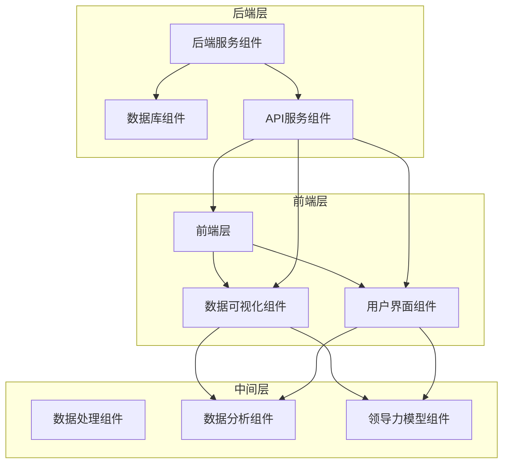
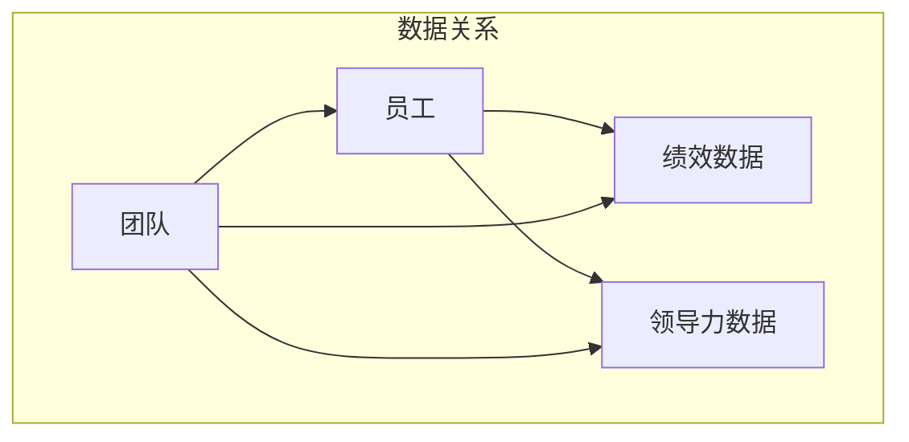

                 

## 引言

### 1. 领导力的定义与重要性

领导力是一种能够影响他人、激励团队、实现目标的能力。在现代社会，无论是在商业、教育、还是公共事务领域，领导力都扮演着至关重要的角色。良好的领导力不仅能够提升团队的效率，还能够促进组织的创新和持续发展。

《领导力训练营：140天从新手到专家》这本书，正是针对这一需求，提供了一套系统、实用的领导力提升方案。书名中的“140天”暗示了一个循序渐进的学习过程，从新手到专家，需要不断的实践和学习。这本书旨在通过140天的学习，帮助读者建立起坚实的领导力基础，并在实践中不断进阶。

### 2. 本书结构概述

本书分为七个主要部分，每个部分都有其独特的目标和内容。

- **第一部分：基础理论**，包括领导力概述、领导风格、沟通技巧等内容，为读者提供了领导力的基础知识。

- **第二部分：实践技能**，侧重于团队建设和目标设定与管理，通过实践，帮助读者掌握领导力的核心技能。

- **第三部分：案例分析**，通过具体的成功案例，展示领导力的实践应用。

- **第四部分：进阶策略**，介绍了领导力的发展和创新方法，帮助读者不断提升领导力。

- **第五部分：实战演练**，提供了详细的训练计划和项目实战，使读者能够将所学知识应用于实际工作中。

- **第六部分：总结与反思**，对整个学习过程进行总结和反思，帮助读者巩固所学内容。

- **第七部分：未来展望**，分析了领导力的未来趋势，为读者提供了继续提升领导力的方向。

### 3. 本文结构与目标

本文将按照书的结构，对每一部分进行详细解读。我们将通过一步一步的分析和思考，帮助读者深入理解领导力的核心概念和实践方法。无论你是初学者还是有一定基础的读者，本文都希望能为你提供有价值的信息和启示。

接下来，我们将逐一介绍书中的各个部分，分析其核心内容，并提供一些实用技巧和建议。让我们开始这段领导力提升的旅程吧！## 第1章：领导力概述

### 1.1 领导力的定义

领导力是一个复杂而又广泛的概念，不同的学者和专家对其有不同的定义。然而，大多数定义都强调了领导者对团队、组织或社会的影响和作用。简单来说，领导力是一种能够激励和引导他人共同实现目标的能力。

领导力不仅仅与职位或权威有关，它更是一种个人特质和技能。一个优秀的领导者不仅需要具备良好的沟通和决策能力，还需要能够建立信任、激发团队的潜力和适应不断变化的环境。

领导力可以体现在各个层面，从微观的个人领导到宏观的国家领导，都是不可或缺的。在商业环境中，领导力对于组织的成功至关重要。一个优秀的领导者能够提升团队的效率，推动创新，应对挑战，实现组织的战略目标。

### 1.2 领导力的重要性

领导力的重要性体现在多个方面。首先，它是组织成功的基石。一个高效的团队需要有一个明确的领导方向和目标，而领导者的角色正是为了确保团队的协调和合作。

其次，领导力对于个人职业发展也有着重要的影响。具备领导力的人更容易获得晋升机会，因为他们能够承担更大的责任，展现更广阔的视野和更深厚的执行力。

此外，领导力还与组织的创新能力密切相关。一个具有创新思维的领导者能够推动组织不断进行变革，从而在激烈的市场竞争中保持优势。

### 1.3 领导力的核心要素

领导力的核心要素包括以下几个方面：

1. **愿景**：领导者需要有清晰的愿景，能够为团队和组织指明方向。愿景不仅仅是一个目标，它更是一种激励人心的力量。

2. **沟通能力**：有效的沟通是领导力的核心。领导者需要能够清晰地传达信息，建立信任，并激发团队成员的积极性。

3. **决策能力**：领导者需要能够在面对复杂问题时做出明智的决策。这需要良好的判断力、分析能力和风险意识。

4. **团队建设能力**：领导者需要能够建立一支高效的团队，明确团队成员的角色和责任，激发团队的潜力。

5. **创新能力**：在快速变化的环境中，领导者需要具备创新能力，能够推动组织不断进行变革和进步。

6. **领导风格**：不同的领导风格适用于不同的情境。领导者需要能够根据实际情况灵活调整自己的领导风格。

### 1.4 领导力的类型

领导力可以分为多种类型，每种类型都有其独特的特点和适用场景。以下是几种常见的领导力类型：

1. **权威型领导**：权威型领导者通过权力和命令来指导团队成员，适用于需要快速决策和执行的紧急情况。

2. **民主型领导**：民主型领导者鼓励团队成员参与决策过程，适用于需要集体智慧和创新的情境。

3. **支持型领导**：支持型领导者注重团队成员的福利和需求，鼓励团队成员自主学习和成长，适用于需要团队协作和稳定发展的情境。

4. **变革型领导**：变革型领导者能够推动组织进行变革，激发团队成员的创新精神，适用于需要应对重大挑战和机遇的情境。

5. **教练型领导**：教练型领导者注重团队成员的长期发展和职业规划，通过提供指导和支持来帮助团队成员提升能力，适用于需要培养高素质人才的情境。

### 1.5 领导力的挑战与应对策略

在领导力的实践中，领导者会面临各种挑战。以下是几种常见的挑战及其应对策略：

1. **团队冲突**：团队冲突是领导力实践中常见的问题。领导者需要通过有效的沟通和冲突解决策略来处理团队冲突，确保团队的和谐与高效。

2. **资源限制**：在资源有限的情况下，领导者需要通过优先级管理和资源优化策略来确保关键任务和目标的实现。

3. **变革阻力**：在推动组织变革时，领导者会面临来自团队成员的阻力。领导者需要通过沟通、教育和激励来减少变革阻力，确保变革的顺利进行。

4. **领导力发展**：领导者需要不断自我提升，以应对不断变化的环境和挑战。通过参加培训、阅读和学习，领导者可以不断提升自己的领导力水平。

### 1.6 领导力的未来趋势

随着社会的不断变化和技术的快速发展，领导力也在不断演变。以下是领导力的几个未来趋势：

1. **数字化领导力**：随着数字化转型的推进，领导者需要具备数字化思维和技能，能够引领组织在数字化时代取得成功。

2. **全球化领导力**：全球化使得领导者需要具备跨文化沟通和协作能力，能够管理多元文化的团队。

3. **可持续发展领导力**：可持续发展成为全球关注的焦点，领导者需要考虑如何在实现组织目标的同时，保护环境和社会利益。

4. **人工智能领导力**：随着人工智能技术的发展，领导者需要了解人工智能的原理和应用，能够利用人工智能提升组织的效率和竞争力。

### 1.7 本章总结

本章对领导力进行了全面的概述，包括定义、重要性、核心要素、类型、挑战与应对策略以及未来趋势。通过本章的学习，读者应该对领导力有了更加清晰的认识，了解其在组织和个人发展中的重要作用。接下来，我们将进一步探讨领导风格和沟通技巧等实践技能，帮助读者更好地提升领导力。## 第2章：领导风格

### 2.1 传统领导风格

传统领导风格主要依赖于权威和命令来管理团队。这种风格的领导者通常拥有明确的决策权和控制权，下属则需要遵循领导者的指示。传统领导风格的主要特点是：

- **集中化决策**：领导者通常独自做出决策，下属主要负责执行。
- **高度控制**：领导者通过规章制度来确保团队的行为符合预期。
- **任务导向**：领导者注重任务的完成，强调效率和结果。
- **权威性**：领导者通过职位赋予的权威来维护自己的地位。

传统领导风格在某些情况下仍然有效，特别是在需要快速决策和严格控制的情境中。然而，随着组织结构和管理模式的演变，传统领导风格也逐渐暴露出其局限性。例如，它可能导致下属的被动性和创造力受到限制，不利于团队的长期发展和创新。

### 2.2 现代领导风格

现代领导风格更加注重团队合作、创新和员工的发展。这种风格的领导者倾向于授权下属，鼓励团队成员积极参与决策，并通过沟通和激励来引导团队。以下是几种常见的现代领导风格：

1. **参与式领导**：参与式领导者鼓励团队成员参与决策过程，尊重下属的意见和建议。这种领导风格能够提升团队成员的参与感和责任感，促进团队的协作和创新。

2. **变革型领导**：变革型领导者通过激发团队成员的潜力，推动组织进行变革和创新。他们关注团队成员的个人成长，通过激励和榜样作用来引领团队。

3. **教练型领导**：教练型领导者注重团队成员的长期发展和职业规划，通过提供指导和支持来帮助团队成员提升能力。他们鼓励下属自主学习和成长，培养高素质的人才。

4. **赋能型领导**：赋能型领导者通过授权和信任，赋予团队成员更多的自主权和责任。他们相信团队成员有能力自主完成任务，并通过激励和奖励来激发团队成员的积极性。

现代领导风格更符合现代组织的需求，能够促进团队的协作和创新，提升组织的整体竞争力。然而，这些风格也需要领导者具备更高的沟通能力、决策能力和领导力素养。

### 2.3 领导风格的适应

领导风格并不是一成不变的，领导者需要根据不同的情境和团队需求来调整自己的领导风格。以下是一些适应不同情境的领导风格建议：

1. **情境适应性**：领导者需要具备情境适应性，能够根据团队的具体情况和环境来选择合适的领导风格。例如，在面临紧急任务时，可以采用权威型领导风格以确保快速决策和执行；在需要团队创新时，可以采用参与式领导风格，鼓励团队成员积极参与。

2. **灵活变通**：领导者需要灵活变通，能够根据下属的反应和环境的变化调整自己的领导风格。例如，当团队成员对领导者的决策有不同意见时，领导者可以尝试采用参与式领导风格，通过沟通和讨论来达成共识。

3. **个人特质**：领导者的个人特质也会影响其领导风格的选择。领导者需要了解自己的优势和劣势，发挥个人特质的优势，同时注意克服个人特质的不足。例如，一个善于沟通和倾听的领导者可以更多地采用参与式领导风格，而一个决策迅速果断的领导者可以更多地采用权威型领导风格。

4. **团队文化**：团队文化也会影响领导风格的选择。领导者需要了解团队的文化氛围，选择与团队文化相匹配的领导风格。例如，在一个强调创新和自由的团队中，领导者可以采用参与式领导风格，鼓励团队成员提出创意和建议；在一个注重效率和纪律的团队中，领导者可以采用变革型领导风格，推动团队高效完成任务。

### 2.4 领导风格的评估与提升

为了提升领导风格，领导者需要进行自我评估和反思。以下是一些评估和提升领导风格的方法：

1. **自我评估**：领导者可以通过自我反思和问卷调查来评估自己的领导风格。评估内容包括领导风格的特点、优势和不足，以及下属对领导风格的反馈。

2. **反馈机制**：领导者可以建立反馈机制，定期收集下属的意见和建议。这有助于领导者了解下属的需求和期望，以及改进自己的领导风格。

3. **培训和辅导**：领导者可以通过参加培训课程、阅读相关书籍和接受专业辅导来提升自己的领导力素养。这些培训课程和辅导可以帮助领导者了解不同的领导风格，掌握有效的领导技巧。

4. **实践与反思**：领导者需要通过实践来提升领导风格。在实践中，领导者可以尝试不同的领导风格，并根据实践效果进行反思和调整。

5. **持续学习**：领导风格并不是一劳永逸的，领导者需要持续学习，以适应不断变化的环境和团队需求。通过持续学习，领导者可以不断提升自己的领导力水平。

### 2.5 本章总结

本章详细介绍了传统领导风格和现代领导风格，以及如何适应不同情境和提升领导风格。通过理解不同的领导风格，领导者可以更好地应对组织和管理中的挑战，提升团队的效率和创新能力。在下一章中，我们将探讨沟通技巧，这是领导力的核心要素之一。## 第3章：沟通技巧

### 3.1 有效沟通的重要性

沟通是领导力的核心要素之一，它不仅影响着领导者与团队成员之间的关系，还直接关系到组织的效率和目标实现。有效沟通能够确保信息准确传递，减少误解和冲突，增强团队凝聚力，激发团队成员的积极性和创造力。

在领导力训练营中，沟通技巧的提升是至关重要的一环。无论是对内还是对外的沟通，领导者都需要具备良好的沟通能力。对内，领导者需要与团队成员保持有效沟通，确保团队目标的明确和一致，同时激发团队成员的积极性和创造力。对外，领导者需要与客户、合作伙伴和上级保持良好沟通，以建立和维护良好的外部关系。

### 3.2 沟通障碍

尽管沟通对于领导力至关重要，但在实际沟通中，我们常常会遇到各种障碍。以下是一些常见的沟通障碍：

1. **语言障碍**：语言不通或语言表达能力不佳会导致沟通障碍。

2. **文化差异**：不同文化背景的人在沟通时可能会因为文化差异而产生误解。

3. **情绪障碍**：情绪不稳定或情绪化的人可能在沟通中表现出过激或消极的态度。

4. **信息过载**：过多的信息会导致接收者无法有效处理，从而影响沟通效果。

5. **心理障碍**：个人的心理状态，如焦虑、恐惧或抵触情绪，也会影响沟通。

6. **组织障碍**：组织结构、层级关系和沟通渠道不畅也会影响沟通效果。

### 3.3 沟通技巧

为了克服沟通障碍，提升沟通效果，领导者需要掌握一系列沟通技巧。以下是几种关键的沟通技巧：

1. **倾听技巧**：倾听是有效沟通的基础。领导者需要积极倾听下属的意见和建议，理解他们的感受和需求。倾听不仅仅是听对方说什么，更重要的是理解对方的意思。

   - **主动倾听**：领导者应保持开放的态度，不打断对方的讲话，认真倾听对方的观点。
   - **确认理解**：领导者可以通过复述对方的观点来确认自己的理解是否准确。
   - **情感共鸣**：领导者应尝试从对方的角度理解问题，表达同理心。

2. **表达技巧**：领导者需要清晰、准确地表达自己的想法和意见，避免产生误解。

   - **明确表达**：领导者应使用简单、清晰的语言，避免使用模糊或含糊的表述。
   - **避免假设**：领导者不应基于自己的假设进行沟通，而应明确表达事实和观点。
   - **反馈与确认**：领导者应在表达后确认对方是否理解自己的意思，确保沟通效果。

3. **非语言沟通**：非语言沟通，如肢体语言、面部表情和声音的语调，也是沟通中不可或缺的一部分。

   - **肢体语言**：领导者应通过开放、积极的肢体语言来传递正面情绪和态度。
   - **面部表情**：领导者应使用合适的面部表情来表达自己的情绪和意图。
   - **声音语调**：领导者应使用清晰、有感染力的声音语调，避免单调或过于激动的语气。

4. **冲突管理技巧**：在沟通中，领导者可能会遇到冲突。有效的冲突管理技巧能够帮助领导者化解矛盾，维护团队和谐。

   - **冷静处理**：领导者应保持冷静，避免情绪化，以理智的方式处理冲突。
   - **倾听与理解**：领导者应倾听对方的观点，理解对方的立场和需求。
   - **寻求共识**：领导者应与对方共同寻找解决问题的方法，达成共识。

5. **反馈技巧**：及时、具体的反馈是提升沟通效果的重要手段。

   - **正面反馈**：领导者应给予团队成员积极的反馈，鼓励他们的努力和成就。
   - **具体反馈**：领导者应提供具体的反馈，指出改进的方向和具体建议。
   - **建设性反馈**：领导者应提供建设性的反馈，帮助团队成员提升能力。

6. **跨文化沟通技巧**：在全球化背景下，领导者需要具备跨文化沟通能力。

   - **文化敏感度**：领导者应了解和尊重不同文化的差异，避免文化冲突。
   - **适应性沟通**：领导者应根据不同文化的特点，调整自己的沟通方式，以确保有效沟通。

### 3.4 实际案例：如何提升团队沟通效果

以下是一个实际案例，说明如何通过沟通技巧提升团队沟通效果：

在一个跨国团队中，团队成员来自不同的国家和文化背景。由于语言和文化差异，团队内部的沟通存在一定的障碍，影响了团队的效率和合作。为了改善这种情况，领导者采取了以下措施：

1. **建立共同的目标和价值观**：领导者明确了团队的目标和价值观，并通过会议和培训让团队成员了解和认同。

2. **组织跨文化培训**：领导者组织了跨文化培训，帮助团队成员了解不同文化的特点，提高文化敏感度。

3. **鼓励开放沟通**：领导者鼓励团队成员在沟通中提出问题，分享意见，并通过反馈机制来确保沟通的透明和开放。

4. **使用多种沟通工具**：领导者使用了多种沟通工具，如邮件、即时通讯和视频会议，以适应不同团队成员的沟通习惯。

5. **定期团队建设活动**：领导者定期组织团队建设活动，增进团队成员之间的了解和信任，改善团队氛围。

通过上述措施，团队内部的沟通障碍得到了有效缓解，团队的凝聚力和效率显著提升。

### 3.5 本章总结

本章详细介绍了有效沟通的重要性、沟通障碍以及沟通技巧。通过掌握这些沟通技巧，领导者可以克服沟通障碍，提升沟通效果，从而更好地发挥领导力。在下一章中，我们将探讨团队建设，这是领导力训练营的重要组成部分。## 第4章：团队建设

### 4.1 团队成员的角色与责任

团队建设是领导力的重要组成部分，而团队成员的角色与责任是团队成功的基础。在《领导力训练营：140天从新手到专家》中，团队建设被特别强调，因为它直接影响到团队的目标实现和成员的满意度。

每个团队成员都应该明确自己的角色和责任。以下是团队成员常见的角色和对应的责任：

1. **领导者**：领导者负责制定团队的目标和计划，指导团队成员，确保团队的工作顺利进行。他们的责任包括决策、沟通、激励和团队发展。

2. **执行者**：执行者是团队中的核心成员，负责完成具体任务。他们的责任包括理解任务要求、按时完成任务、提出改进建议和与团队成员协作。

3. **协调者**：协调者负责协调团队内部的工作，确保团队成员之间的沟通顺畅，解决冲突，确保任务按时完成。他们的责任包括沟通、协调和冲突解决。

4. **支持者**：支持者负责提供技术和资源支持，确保团队成员能够顺利完成工作。他们的责任包括技术支持、资源管理和后勤保障。

5. **创新者**：创新者负责推动团队的创新和改进，提出新的想法和解决方案。他们的责任包括创新思维、创意提出和推动实施。

6. **反馈者**：反馈者负责收集团队内外部的反馈，为团队提供改进意见。他们的责任包括反馈收集、分析和建议。

### 4.2 团队目标的设定

团队目标的设定是团队建设的关键步骤，明确的目标能够指引团队的方向，激发团队成员的积极性。在设定团队目标时，以下原则和方法可以帮助领导者：

1. **SMART原则**：SMART是具体（Specific）、可衡量（Measurable）、可实现（Achievable）、相关（Relevant）和有时限（Time-bound）的缩写。领导者应确保团队目标符合SMART原则，以确保目标的明确性和可衡量性。

2. **分解目标**：将大目标分解为小目标，每个小目标都应具体、明确，并具备可行性。这样可以确保团队在实现目标的过程中能够逐步推进，同时也有助于团队成员明确自己的责任和任务。

3. **参与式设定**：团队目标应通过团队成员的共同参与来设定，这样可以增加团队成员的归属感和责任感。领导者可以通过团队会议、问卷调查等方式，收集团队成员的意见和建议，确保目标设定的合理性和可行性。

4. **明确责任**：在设定团队目标的同时，应明确每个团队成员的责任。这有助于确保团队成员能够明确自己的任务和目标，提高团队的整体执行力。

### 4.3 团队协作与冲突解决

团队协作是团队建设的重要组成部分，良好的协作能够提升团队的效率和创新能力。以下是一些促进团队协作的方法：

1. **明确沟通机制**：建立有效的沟通机制，确保团队成员之间的信息传递畅通。领导者可以通过定期会议、即时通讯工具等方式，保持团队的沟通。

2. **建立信任**：建立团队成员之间的信任是团队协作的基础。领导者可以通过团队建设活动、分享经验和共同面对挑战等方式，增强团队成员之间的信任。

3. **分工合作**：根据团队成员的特长和兴趣，合理分工，确保每个成员都能在擅长的领域发挥作用，同时为其他成员提供支持和帮助。

4. **激励机制**：建立激励机制，鼓励团队成员积极参与和协作。领导者可以通过奖励、表彰等方式，激发团队成员的积极性和创造力。

在团队协作过程中，冲突是难以避免的。以下是一些解决冲突的方法：

1. **主动沟通**：领导者应鼓励团队成员主动沟通，及时表达自己的观点和感受，避免问题的积累和激化。

2. **理解与尊重**：领导者应理解团队成员的观点和需求，尊重他们的个性差异，通过平等、公正的方式处理冲突。

3. **寻求共识**：领导者应与团队成员共同寻找解决问题的方法，寻求共识，以促进团队的和谐与高效。

4. **调解与仲裁**：在必要时，领导者可以充当调解者或仲裁者，帮助团队解决冲突，确保团队目标的实现。

### 4.4 实际案例：如何促进团队协作

以下是一个实际案例，说明如何促进团队协作：

在一个软件开发团队中，由于团队成员来自不同的部门和文化背景，团队协作一度遇到困难。为了改善这种情况，领导者采取了以下措施：

1. **建立共同目标**：领导者与团队成员共同讨论和确定团队的目标，确保每个成员都明确自己的职责和任务。

2. **组织团队建设活动**：领导者组织了团队建设活动，如团队拓展训练和聚餐，增强了团队成员之间的信任和合作精神。

3. **定期沟通会议**：领导者定期组织沟通会议，确保团队成员能够及时了解项目进展和需求，解决问题，保持信息的透明和畅通。

4. **提供技术支持**：领导者为团队成员提供必要的技术支持，帮助他们解决开发中的难题，提高团队的效率和协作能力。

通过上述措施，团队协作效率显著提升，项目进展顺利，团队成员之间的合作关系更加紧密。

### 4.5 本章总结

团队建设是领导力训练营中至关重要的一环，通过明确团队成员的角色与责任、设定团队目标、促进团队协作和解决冲突，领导者可以打造一个高效、和谐的团队。在下一章中，我们将探讨领导力实践中的目标设定与管理，帮助领导者更好地实现团队目标。## 第5章：目标设定与管理

### 5.1 目标设定的原则

在领导力训练营中，目标设定是一个关键环节，它能够为团队和组织提供明确的方向和动力。一个有效的目标设定应遵循以下原则：

1. **SMART原则**：SMART是具体（Specific）、可衡量（Measurable）、可实现（Achievable）、相关（Relevant）和有时限（Time-bound）的缩写。遵循SMART原则有助于确保目标的明确性和可操作性。

   - **具体**：目标应具体、明确，避免模糊和宽泛的表述。
   - **可衡量**：目标应具备可衡量的指标，以便评估进展和成果。
   - **可实现**：目标应具有可行性，确保团队成员能够通过努力实现。
   - **相关**：目标应与团队和组织的目标相关，确保目标的统一性。
   - **有时限**：目标应设定明确的完成时限，以推动团队按计划行动。

2. **明确性**：目标应明确传达，避免产生歧义。领导者应确保团队成员对目标有清晰的理解。

3. **优先级**：在设定目标时，应明确目标的优先级，确保团队成员能够集中精力和资源完成最重要的任务。

4. **参与性**：目标设定应通过团队成员的共同参与，增强团队的责任感和参与感。

### 5.2 目标管理的具体方法

目标管理（Management by Objectives，MBO）是一种系统性的目标设定和管理方法，它通过明确的目标、评估和反馈机制，帮助团队和组织实现目标。以下是目标管理的具体方法：

1. **制定目标**：
   - **高层领导参与**：高层领导应参与目标制定过程，确保目标的战略一致性。
   - **团队讨论**：团队领导应组织团队成员讨论目标，确保每个成员都明确自己的责任和任务。
   - **目标分解**：将总体目标分解为具体的子目标，并分配给各个团队成员。

2. **执行与监控**：
   - **定期检查**：领导者应定期检查目标进展，确保团队成员按照计划行动。
   - **信息共享**：领导者应确保团队成员之间信息共享，以协调工作进度和资源分配。
   - **调整计划**：根据实际情况，领导者应适时调整目标计划，以应对突发情况和变化。

3. **评估与反馈**：
   - **绩效评估**：通过定期评估，评估团队成员的目标完成情况。
   - **反馈与改进**：领导者应提供具体的反馈，帮助团队成员了解自己的优点和不足，并制定改进计划。

### 5.3 实现目标的具体策略

实现目标需要一系列具体的策略和方法。以下是一些实现目标的策略：

1. **分解任务**：将大目标分解为小任务，确保每个任务都有明确的责任人和完成时限。

2. **资源分配**：合理分配资源，确保每个任务都有足够的资源和人力支持。

3. **时间管理**：使用时间管理工具，如甘特图或日历，确保任务按计划进行。

4. **风险控制**：识别潜在的风险，制定风险应对策略，确保目标的实现不受重大影响。

5. **激励与鼓励**：通过激励和鼓励，提升团队成员的积极性和执行力。

### 5.4 实际案例：目标设定与管理

以下是一个实际案例，说明如何进行目标设定和管理：

在一个大型项目中，团队需要在6个月内完成一个复杂的软件系统开发。为了实现这一目标，团队采取了以下步骤：

1. **制定目标**：
   - **总体目标**：在6个月内完成软件系统的开发，确保系统功能齐全、性能稳定。
   - **分解目标**：将总体目标分解为多个子目标，如需求分析、系统设计、编码、测试等，并分配给不同的团队成员。

2. **执行与监控**：
   - **定期检查**：团队每周进行一次进度检查，确保每个子目标的进展符合计划。
   - **信息共享**：团队成员通过每日站会分享进展和遇到的问题，确保信息透明和沟通顺畅。

3. **评估与反馈**：
   - **绩效评估**：在每个子目标完成后，进行绩效评估，评估团队成员的贡献和表现。
   - **反馈与改进**：根据评估结果，提供具体的反馈，帮助团队成员了解自己的优点和不足，并制定改进计划。

4. **激励与鼓励**：为了激励团队成员，团队设置了奖励机制，如优秀员工表彰和奖金激励，提升了团队的积极性和执行力。

通过上述步骤，团队在6个月内成功完成了软件系统的开发，项目按时交付，并获得了客户的高度评价。

### 5.5 本章总结

目标设定与管理是领导力的重要组成部分，它能够为团队和组织提供明确的方向和动力。通过遵循目标设定的原则、采用目标管理的具体方法、实施实现目标的具体策略，领导者可以确保团队目标的实现。在下一章中，我们将探讨成功领导案例，通过实际案例来学习领导力的实践。## 第6章：成功领导案例分析

### 6.1 案例一：领导者的领导力实践

在这个案例中，领导者是一位在技术公司担任CEO的高管。这位CEO通过一系列的领导力实践，成功地将公司从一个小型初创企业转型为行业领导者。

1. **愿景与目标设定**：CEO首先明确了公司的愿景和目标，即成为技术领域的领导者，为用户提供卓越的产品和服务。这一愿景和目标为公司的战略方向提供了明确的指引。

2. **团队建设**：CEO重视团队建设，通过选拔和培养优秀的团队成员，打造了一支高效的团队。他鼓励团队成员积极参与决策，提供创新的思路，确保团队凝聚力。

3. **沟通与协作**：CEO建立了有效的沟通机制，通过定期会议、邮件和即时通讯工具，确保团队成员之间信息畅通，协调工作。他注重倾听团队成员的意见，鼓励开放沟通，确保团队目标的一致性。

4. **激励与奖励**：CEO通过设置奖励机制，如股票期权、奖金和晋升机会，激励团队成员努力工作，实现公司的目标。他强调团队的共同成就，让团队成员感受到自己的价值。

5. **变革与创新**：在面临市场和技术变革时，CEO敢于突破传统思维，推动公司进行创新。他鼓励团队成员提出新的想法和解决方案，通过实验和迭代，确保公司在竞争中获得优势。

6. **领导力传承**：CEO注重领导力传承，通过培养和选拔接班人，确保公司在未来能够持续发展。他通过培训和指导，帮助团队成员提升领导力，为公司的长远发展奠定基础。

通过这些领导力实践，这位CEO成功地将公司从初创企业转型为行业领导者，实现了公司的愿景和目标。

### 6.2 案例二：领导者在危机中的表现

在这个案例中，领导者是一位在自然灾害发生时担任政府官员的角色。这位领导者在危机中展现了卓越的领导力，确保了民众的安全和稳定。

1. **快速反应**：在灾害发生的第一时间，领导者迅速组织救援队伍，开展救援工作。他通过电话、广播和社交媒体，向民众发布紧急信息，指导民众采取正确的避难措施。

2. **协调资源**：领导者协调各种资源，包括救援队伍、医疗设备、食品和饮水，确保救援工作顺利进行。他通过政府各部门的协调，确保资源的合理分配和高效利用。

3. **沟通与信任**：领导者通过持续沟通，建立与民众的信任关系。他通过新闻发布会、社交媒体和电话热线，向民众传达救援进展和政策措施，确保民众了解实际情况，减少恐慌和误解。

4. **心理支持**：领导者关注民众的心理状态，通过心理支持和关爱，帮助民众度过危机。他组织志愿者和心理咨询师，为受影响民众提供心理援助，确保民众的心理健康。

5. **长期规划**：在危机结束后，领导者制定了长期的灾后重建规划。他通过组织志愿者和社区活动，帮助受影响民众恢复生活，重建家园。

通过这些领导力实践，这位领导者在危机中展现了出色的应变能力和责任感，确保了民众的安全和稳定。

### 6.3 案例三：领导者如何激励团队

在这个案例中，领导者是一位在初创公司担任CEO的年轻企业家。他通过一系列的激励措施，成功激发了团队成员的积极性和创造力。

1. **明确目标与愿景**：领导者首先明确了公司的目标和愿景，即成为行业领导者，改变人们的生活方式。他通过定期的团队会议和培训，确保团队成员理解并认同公司的目标和愿景。

2. **信任与支持**：领导者信任团队成员，给予他们足够的自主权和决策权。他鼓励团队成员提出新的想法和解决方案，并为他们提供必要的资源和支持。

3. **奖励与激励**：领导者设置了多种奖励和激励机制，如奖金、股票期权和荣誉表彰。他通过公开表彰和奖励，让团队成员感受到自己的价值，增强团队凝聚力。

4. **创新文化**：领导者倡导创新文化，鼓励团队成员勇于尝试和失败。他通过内部创新竞赛和项目资助，激发团队成员的创新潜力，推动公司持续创新。

5. **个人发展**：领导者关注团队成员的个人发展，提供培训和学习机会。他鼓励团队成员不断提升自己的技能和知识，为个人的职业发展提供支持。

通过这些激励措施，这位领导者成功激发了团队成员的积极性和创造力，推动了公司的快速发展。

### 6.4 本章总结

通过这三个成功领导案例的分析，我们可以看到，领导力不仅体现在危机管理和团队激励上，还包括目标设定、团队建设和危机应对等方面。这些案例为我们提供了宝贵的经验和启示，帮助我们更好地理解和应用领导力。在下一章中，我们将探讨领导力的发展策略，帮助读者进一步提升自己的领导力。## 第7章：领导力发展

### 7.1 自我评估

自我评估是领导力发展的重要步骤，它帮助领导者了解自己的优势和不足，为提升领导力提供依据。以下是一些自我评估的方法：

1. **360度反馈**：通过收集来自上级、下属、同事和客户的反馈，全面了解自己的领导风格和表现。

2. **领导力评估工具**：使用专业的领导力评估工具，如360度评估、领导力量表等，进行量化评估。

3. **自我反思**：定期进行自我反思，回顾自己的行为和决策，识别不足之处。

4. **心理测试**：通过心理测试，如MBTI（Myers-Briggs Type Indicator）等，了解自己的性格特点和领导风格。

### 7.2 自我提升

自我提升是领导力发展的重要环节，以下是一些提升领导力的方法：

1. **学习和培训**：参加领导力培训课程、研讨会和工作坊，学习最新的领导力理论和实践。

2. **阅读和书籍**：阅读领导力相关书籍，了解不同领导者的经验和观点。

3. **实践和应用**：将学到的领导力知识应用到实际工作中，通过实践不断提升自己的领导力。

4. **导师和教练**：寻找经验丰富的导师或教练，获取指导和建议，加速自己的成长。

5. **反思和总结**：定期反思自己的领导行为，总结成功和失败的经验，持续改进。

### 7.3 领导力培养方法

为了提升领导力，以下是一些具体的培养方法：

1. **培养自我意识**：了解自己的价值观、信念和动机，认识自己的情绪和行为模式。

2. **培养沟通能力**：提高沟通技巧，包括倾听、表达和反馈，确保信息有效传递。

3. **培养团队建设能力**：学习如何建立团队、激发团队成员的潜力和解决团队冲突。

4. **培养决策能力**：提升决策能力，包括分析问题、制定方案和评估风险。

5. **培养适应变化的能力**：学会适应环境变化，灵活调整领导策略。

6. **培养创新思维**：鼓励创新思维，培养创造性和解决问题的能力。

7. **培养影响力**：提升影响力，包括建立信任、激励他人和推动变革。

### 7.4 实际案例：领导力发展

以下是一个实际案例，说明如何通过领导力发展提升领导力：

在一个中型企业的销售部门，部门经理意识到自己的领导力存在不足，尤其是在沟通和团队管理方面。为了提升领导力，他采取了以下措施：

1. **自我评估**：通过360度反馈和自我反思，他识别了自己的不足之处，特别是在沟通和团队管理方面。

2. **学习和培训**：他参加了领导力培训课程，学习了有效的沟通技巧和团队管理策略。

3. **实践和应用**：他将所学知识应用到实际工作中，通过改进沟通方式和团队管理方法，提升了团队的整体绩效。

4. **导师和教练**：他找到了一位经验丰富的导师，定期接受指导，获取建议和支持。

5. **反思和总结**：他定期反思自己的领导行为，总结成功和失败的经验，持续改进自己的领导风格。

通过这些领导力发展措施，这位部门经理的领导力得到了显著提升，团队的凝聚力和绩效也得到了显著改善。

### 7.5 本章总结

领导力发展是一个持续的过程，需要自我评估、自我提升和系统的培养方法。通过不断地学习和实践，领导者可以提升自己的领导力，为团队和组织创造更大的价值。在下一章中，我们将探讨领导力的创新，帮助领导者适应快速变化的环境。## 第8章：领导力创新

### 8.1 创新的重要性

在当今快速变化的社会中，创新已经成为领导者的一项关键能力。创新不仅能够推动组织的持续发展，还能够帮助领导者应对各种挑战和机遇。以下是一些创新的重要性：

1. **提高竞争力**：创新能够帮助组织在竞争激烈的市场中脱颖而出，通过提供独特的产品和服务，提高市场份额。

2. **推动增长**：创新能够激发组织的增长潜力，通过新的业务模式和商业模式，实现跨越式发展。

3. **提升效率**：创新能够优化组织内部的流程和系统，提高工作效率，降低成本。

4. **增强灵活性**：创新能够使组织更加适应环境变化，灵活应对外部挑战和内部变革。

5. **增强员工满意度**：创新能够激发员工的创造力和积极性，提高员工的工作满意度和忠诚度。

### 8.2 创新思维培养

要成为创新领导者，领导者需要具备创新思维。以下是一些培养创新思维的方法：

1. **思维拓展**：领导者应不断拓展自己的思维，学习新的知识和技能，了解不同的观点和思维方式。

2. **拥抱变化**：领导者应拥抱变化，敢于挑战传统的思维模式，尝试新的方法和策略。

3. **培养好奇心**：领导者应保持好奇心，对未知的事物和问题持开放态度，积极探索和发现新的机会。

4. **鼓励失败**：领导者应鼓励团队成员在创新过程中尝试和失败，从失败中学习，不断提升创新能力。

5. **跨学科学习**：领导者应跨学科学习，吸收不同领域的知识，为创新提供多样化的视角。

### 8.3 创新领导实践

以下是几种创新领导实践：

1. **构建创新文化**：领导者应构建鼓励创新的文化，建立创新机制，提供创新资源和支持，营造一个创新友好的环境。

2. **设立创新团队**：领导者可以设立专门的创新团队，负责探索新的业务模式和商业模式，推动组织的创新。

3. **鼓励内部创业**：领导者可以鼓励内部创业，通过内部创业项目，激发员工的创新潜力，推动组织的创新。

4. **跨部门合作**：领导者应推动跨部门合作，促进不同部门和团队之间的知识共享和资源整合，提升组织的创新能力。

5. **利用外部资源**：领导者可以利用外部资源，如聘请外部专家、参与行业创新论坛和交流活动，获取最新的创新思路和经验。

### 8.4 实际案例：领导力创新

以下是一个实际案例，说明如何通过领导力创新推动组织发展：

在一个传统制造企业，领导者意识到企业需要进行数字化转型以应对市场变化。为了推动创新，领导者采取了以下措施：

1. **构建创新文化**：领导者通过树立创新榜样、举办创新研讨会和活动，构建了一个鼓励创新的企业文化。

2. **设立创新团队**：领导者设立了创新团队，专门负责探索新的业务模式和数字化转型方案。

3. **鼓励内部创业**：领导者鼓励内部员工提出创新项目，并提供资源和支持，推动内部创业。

4. **跨部门合作**：领导者推动跨部门合作，促进不同部门之间的知识共享和资源整合。

5. **利用外部资源**：领导者聘请了数字化转型专家，参与行业创新论坛，获取最新的创新思路和经验。

通过这些创新领导实践，企业成功地进行了数字化转型，提升了市场竞争力和运营效率。

### 8.5 本章总结

领导力创新是领导者的一项关键能力，它能够帮助组织在快速变化的环境中保持竞争力。通过培养创新思维、构建创新文化和推动创新实践，领导者可以激发组织的创新潜力，推动组织的持续发展。在下一章中，我们将探讨领导力训练计划，帮助读者系统地提升领导力。## 第9章：领导力训练计划

### 9.1 训练计划设计

设计一个有效的领导力训练计划是提升领导者技能和知识的关键。以下是设计训练计划的几个关键步骤：

1. **明确目标**：首先，确定训练计划的目标，即希望通过训练实现的具体成果和提升的领导力领域。目标应具体、可衡量，并与组织的战略目标相一致。

2. **评估需求**：通过问卷调查、访谈和360度反馈等方式，评估领导者的现有技能和知识水平，以及他们在实践中面临的挑战和需求。

3. **确定内容**：根据目标和需求，确定训练计划的内容。这包括领导力理论、实践技能、沟通技巧、团队管理、决策能力等方面的培训。

4. **选择方法**：选择合适的培训方法，如研讨会、工作坊、在线课程、角色扮演、模拟训练等，以满足不同领导者的学习需求和偏好。

5. **制定时间表**：制定详细的训练时间表，包括训练的频率、时长和具体的培训日期。确保训练计划具有可行性和可持续性。

6. **分配资源**：确保训练计划所需的资源得到充分分配，包括培训场地、教材、培训师和辅助工具等。

### 9.2 训练方法

选择适合的培训方法能够提高训练效果。以下是几种常见的培训方法：

1. **研讨会**：研讨会是一种集体学习的方式，适合传授领导力理论和概念。通过讨论和互动，学员可以深入理解领导力原理。

2. **工作坊**：工作坊侧重于实践和技能提升，通过实际操作和案例研究，帮助学员将理论知识应用到实际工作中。

3. **在线课程**：在线课程提供灵活的学习方式，学员可以根据自己的时间安排学习。这种方式适合于领导力知识的系统学习和更新。

4. **角色扮演**：角色扮演是一种模拟训练方法，通过扮演不同的角色，学员可以体验领导者的职责和挑战，提高应对实际问题的能力。

5. **模拟训练**：模拟训练通过构建模拟环境，让学员在安全的环境中实践领导技能，如危机管理、决策制定等。

6. **导师辅导**：导师辅导提供一对一的支持和指导，学员可以与经验丰富的导师讨论实践中的问题，获得针对性的建议。

### 9.3 训练效果评估

评估训练效果是确保训练计划成功的关键。以下是几种常用的评估方法：

1. **定量评估**：使用量化指标，如课程满意度调查、学习成果测试和绩效指标等，评估学员的知识和技能提升情况。

2. **定性评估**：通过观察、访谈和反馈，了解学员在实际工作中应用所学知识的程度和效果。

3. **行为观察**：观察学员在工作中的行为变化，评估他们是否能够将培训知识应用到实践中。

4. **绩效改进**：评估训练后学员的工作绩效是否有显著提升，如团队效率、员工满意度、项目成功率等。

5. **反馈机制**：建立持续的反馈机制，收集学员、导师和上级对训练计划的反馈，以便进行改进。

### 9.4 实际案例：领导力训练计划

以下是一个实际案例，说明如何设计并实施一个领导力训练计划：

在一个大型科技公司，为了提升中层管理者的领导力，公司设计了为期三个月的领导力训练计划：

1. **明确目标**：提升中层管理者的团队管理、决策能力和沟通技巧，提高团队绩效。

2. **评估需求**：通过问卷调查和访谈，了解中层管理者在团队管理、决策和沟通方面的需求和挑战。

3. **确定内容**：培训内容包括团队建设、领导风格、决策制定、沟通技巧和冲突管理。

4. **选择方法**：采用研讨会、工作坊和在线课程相结合的方式，确保学员能够全面理解和应用所学知识。

5. **制定时间表**：每周一次研讨会，每两周一次工作坊，每月一次在线课程，为期三个月。

6. **分配资源**：安排专门的培训场地、教材和培训师，并提供在线学习平台。

7. **评估效果**：通过课程满意度调查、学习成果测试和绩效指标，评估培训效果。在培训结束后，通过行为观察和导师辅导，跟踪学员在实践中的表现。

通过这个领导力训练计划，中层管理者的领导力得到了显著提升，团队绩效也显著提高。

### 9.5 本章总结

设计并实施一个有效的领导力训练计划是提升领导者技能和知识的关键。通过明确目标、评估需求、选择合适的方法和评估效果，领导者可以系统性地提升自己的领导力，为团队和组织创造更大的价值。在下一章中，我们将探讨领导力实践项目，通过实际操作提升领导力。## 第10章：领导力实践项目

### 10.1 项目选择

选择一个合适的领导力实践项目是提升领导力的关键步骤。以下是一些项目选择的关键因素：

1. **个人需求**：项目应与领导者的个人需求和职业发展目标相匹配。领导者应选择能够帮助自己提升关键领导技能的项目。

2. **项目挑战**：项目应具有一定的挑战性，能够激发领导者的潜力，同时在可接受的范围内。过于简单或过于复杂的项目都可能影响学习效果。

3. **资源可用性**：项目应考虑所需的资源和可行性。包括人力资源、时间、资金和设备等。

4. **团队协作**：项目应鼓励团队协作，使领导者能够应用团队建设和沟通技巧，提升团队整体绩效。

5. **战略价值**：项目应与组织的战略目标相一致，能够为组织带来实际的业务价值。

### 10.2 项目实施

在项目实施过程中，领导者需要运用多种领导力技能。以下是项目实施的关键步骤：

1. **项目启动**：明确项目的目标、范围、时间表和资源分配，确保团队成员对项目有清晰的理解。

2. **团队建设**：建立有效的团队，明确团队成员的角色和责任，通过沟通和协作，提升团队凝聚力。

3. **目标设定**：设定具体、可衡量、可实现、相关和有时限（SMART）的目标，确保团队成员了解项目的预期成果。

4. **计划执行**：制定详细的执行计划，分配任务，监控进度，确保项目按计划进行。

5. **沟通协调**：建立有效的沟通机制，确保团队成员之间的信息畅通，及时解决问题和冲突。

6. **风险管理**：识别潜在风险，制定风险应对策略，确保项目能够应对各种挑战。

7. **质量控制**：确保项目的质量符合预期，通过定期检查和反馈，持续改进项目执行。

### 10.3 项目总结

在项目完成后，领导者需要进行总结和反思。以下是项目总结的关键步骤：

1. **成果评估**：评估项目的成果，包括目标的实现情况、项目的质量和效率等。

2. **反馈收集**：收集团队成员的反馈，了解他们在项目中的体验和感受，以及项目的成功和不足之处。

3. **经验总结**：总结项目中的经验教训，包括领导者的表现、团队协作的效果、项目的管理方法等。

4. **改进计划**：根据总结和反馈，制定改进计划，为未来的项目提供参考。

5. **成果展示**：将项目的成果和经验展示给组织，提升领导者的声誉和认可度。

### 10.4 实际案例：领导力实践项目

以下是一个实际案例，说明如何实施一个领导力实践项目：

在一个科技公司，领导者选择了一个新产品开发项目作为领导力实践项目。以下是项目的具体实施步骤：

1. **项目启动**：明确项目目标，即开发一款满足市场需求的创新产品，提升公司的市场竞争力。

2. **团队建设**：组建了一支跨部门的团队，包括产品经理、开发人员、设计师和市场人员。明确了团队成员的角色和责任，通过沟通和协作，提升了团队凝聚力。

3. **目标设定**：设定了具体的开发目标，包括功能需求、性能指标和时间表。

4. **计划执行**：制定了详细的开发计划，包括需求分析、设计、开发、测试和发布等阶段。领导者通过监控进度和解决冲突，确保项目按计划进行。

5. **沟通协调**：建立了每日站会和每周项目会议，确保团队成员之间的信息畅通。通过定期的沟通和协作，提高了团队的工作效率。

6. **风险管理**：识别了潜在的技术风险和市场风险，制定了相应的应对策略，确保项目能够应对各种挑战。

7. **质量控制**：通过严格的测试和反馈机制，确保产品的质量和性能符合预期。

8. **成果评估**：项目完成后，评估了产品的市场表现和团队的工作绩效。产品在市场上取得了良好的反响，团队的工作也得到了公司的高度认可。

9. **经验总结**：总结项目中的成功经验和不足之处，为未来的项目提供了参考。

10. **成果展示**：将项目的成果和经验展示给公司高层，提升了领导者的声誉和认可度。

通过这个领导力实践项目，领导者不仅提升了自己的领导力，还为公司创造了实际的业务价值。

### 10.5 本章总结

领导力实践项目是提升领导力的重要途径。通过选择合适的项目、实施有效的项目管理和进行项目总结，领导者可以不断提升自己的领导力，为团队和组织创造更大的价值。在下一章中，我们将总结领导力训练营的学习内容，帮助读者巩固所学知识。## 第11章：领导力成长之路

### 11.1 成长历程回顾

在《领导力训练营：140天从新手到专家》的学习过程中，我们经历了从理论基础到实践应用的全面训练。以下是我们的成长历程回顾：

1. **第1章：领导力概述**：我们了解了领导力的定义、重要性以及核心要素，为后续的学习奠定了基础。

2. **第2章：领导风格**：我们学习了传统领导风格和现代领导风格，了解了如何根据不同情境灵活调整领导风格。

3. **第3章：沟通技巧**：我们掌握了有效的沟通技巧，包括倾听、表达和反馈，以及如何克服沟通障碍。

4. **第4章：团队建设**：我们了解了团队成员的角色与责任，学会了如何设定团队目标和促进团队协作。

5. **第5章：目标设定与管理**：我们学习了目标设定的原则和方法，以及如何通过目标管理提升团队绩效。

6. **第6章：成功领导案例分析**：我们通过实际案例学习了成功领导者的实践经验和策略。

7. **第7章：领导力发展**：我们了解了如何进行自我评估和自我提升，以及领导力培养的方法。

8. **第8章：领导力创新**：我们学习了创新思维的重要性和培养方法，以及如何进行领导力创新。

9. **第9章：领导力训练计划**：我们掌握了设计领导力训练计划的步骤和方法。

10. **第10章：领导力实践项目**：我们通过实际项目实施，将所学知识应用到实践中。

通过这一系列的学习和实践，我们的领导力水平得到了显著提升。

### 11.2 成长心得

在这段领导力成长之路上，我们积累了丰富的经验和心得：

1. **知识与实践相结合**：理论知识和实践应用是提升领导力的关键。我们不仅学习了领导力的理论，还通过实际项目和案例，将所学知识应用到实际工作中。

2. **持续学习和反思**：领导力是一个不断发展的过程，我们需要持续学习和反思。通过不断的学习和反思，我们能够不断提升自己的领导力水平。

3. **团队合作和沟通**：团队合作和有效沟通是领导力的重要组成部分。我们学会了如何建立高效的团队，并通过有效的沟通协调，提升团队的整体绩效。

4. **创新思维和适应变化**：在快速变化的环境中，创新思维和适应变化是领导者的必备能力。我们通过学习创新思维的方法，提高了自己的创新能力，能够更好地应对各种挑战。

5. **自我提升和反馈**：自我提升和接受反馈是领导力成长的重要环节。我们通过自我评估和接受导师的指导，不断改进自己的领导风格和技能。

### 11.3 成长展望

展望未来，我们对自己的领导力成长有以下展望：

1. **继续深化学习**：我们计划继续学习最新的领导力理论和实践，通过阅读书籍、参加培训和研讨会，不断提升自己的知识水平。

2. **实践与反思**：我们将在实际工作中继续运用所学知识，通过实践和反思，不断优化自己的领导风格和决策方法。

3. **培养下一代领导者**：我们计划通过培训和指导，帮助新一代领导者提升领导力，为组织的未来发展奠定基础。

4. **参与社会事务**：我们希望参与更多社会事务，通过志愿服务和社会活动，发挥领导力，为社会做出贡献。

5. **创新和变革**：我们将继续关注技术创新和变革，探索新的领导力实践，为组织带来持续的竞争优势。

通过不断的学习、实践和反思，我们相信自己的领导力将不断成长，为团队和组织创造更大的价值。

## 第12章：领导者的自我反思

### 12.1 反思方法

作为领导者，自我反思是提升领导力的重要环节。以下是一些有效的反思方法：

1. **定期回顾**：定期回顾自己的行为和决策，包括成功的经验和失败的原因。

2. **撰写反思日记**：通过记录反思日记，将反思过程和心得记录下来，有助于持续改进。

3. **与他人交流**：与同事、下属或导师交流，获取外部观点和建议，帮助自己更全面地反思。

4. **心理测试和反馈**：通过心理测试和反馈，了解自己的性格特点、优势和不足。

5. **角色扮演**：通过角色扮演，模拟不同的领导情境，反思自己的行为和决策。

### 12.2 反思内容

在自我反思中，领导者需要关注以下内容：

1. **领导风格**：反思自己的领导风格是否适合当前团队和环境，是否需要调整。

2. **决策过程**：评估自己的决策过程是否科学、合理，是否存在偏见或盲点。

3. **沟通效果**：反思自己的沟通技巧，包括倾听、表达和反馈，是否存在沟通障碍。

4. **团队管理**：评估团队管理的有效性，包括团队目标设定、团队协作和团队氛围。

5. **个人成长**：反思自己在知识和技能上的提升，是否满足当前领导角色的需求。

6. **组织影响**：反思自己的领导对组织的影响，包括组织的绩效、员工满意度和企业文化。

### 12.3 反思应用

通过自我反思，领导者可以将反思结果应用到实际工作中：

1. **改进领导风格**：根据反思结果，调整自己的领导风格，以更好地适应团队和环境。

2. **优化决策过程**：改进决策过程，确保决策的合理性和科学性。

3. **提升沟通能力**：通过练习和反馈，提升自己的沟通能力，确保信息传递的有效性。

4. **优化团队管理**：根据反思结果，优化团队管理方法，提升团队绩效。

5. **自我提升**：通过不断学习和实践，提升自己的知识和技能，满足领导角色的需求。

6. **促进组织发展**：通过反思和应用，提升组织的整体绩效和员工满意度，推动组织发展。

### 12.4 实际案例：领导者的自我反思

以下是一个实际案例，说明如何进行领导者的自我反思：

在一个中型企业的销售团队中，团队经理张华在一个月的销售业绩下滑后进行了自我反思：

1. **领导风格反思**：张华反思自己的领导风格是否过于强硬，导致团队成员缺乏积极性。他决定调整自己的领导风格，更加注重激励和支持。

2. **决策过程反思**：张华评估自己在销售策略制定和执行过程中的决策过程，发现有时过于依赖直觉，缺乏数据支持。他决定加强数据分析能力，确保决策的科学性和合理性。

3. **沟通能力反思**：张华意识到自己与团队成员的沟通存在障碍，特别是在传达销售目标和方法时，常常使用专业术语，导致团队成员理解困难。他决定改进沟通技巧，使用更加通俗易懂的语言。

4. **团队管理反思**：张华反思团队管理的有效性，发现团队成员在销售策略执行过程中缺乏协调和合作。他决定通过定期团队会议和培训，提升团队的协作能力。

5. **个人成长反思**：张华意识到自己在销售技能和知识上需要进一步提升，以更好地支持团队。他决定参加相关的培训和研讨会，提升自己的专业能力。

通过自我反思和应用，张华的团队在接下来的一个月中取得了显著的销售业绩提升，团队氛围也更加和谐。

### 12.5 本章总结

领导者的自我反思是提升领导力的重要途径。通过定期反思自己的领导风格、决策过程、沟通能力、团队管理和个人成长，领导者可以不断改进自己的领导方法，为团队和组织创造更大的价值。在下一章中，我们将探讨领导力的未来趋势，为读者提供继续提升领导力的方向。## 第13章：领导力的未来趋势

### 13.1 全球领导力趋势分析

在全球范围内，领导力正面临一系列重大趋势和变化。这些趋势不仅受到技术进步的推动，还受到全球化、社会变迁和文化多样性的影响。以下是几个关键的全球领导力趋势：

1. **数字化领导力**：随着数字化技术的快速发展，领导者需要具备数字化思维和技能。数字化领导力强调数据驱动的决策、敏捷的团队管理和利用技术推动创新。

2. **跨文化领导力**：全球化使得领导者需要具备跨文化沟通和协作能力。跨文化领导力要求领导者能够理解并尊重不同文化背景的员工，推动多元文化的融合。

3. **可持续发展领导力**：可持续发展成为全球关注的焦点，领导者需要考虑如何在实现组织目标的同时，保护环境和社会利益。可持续发展领导力强调社会责任、道德领导和可持续发展的战略规划。

4. **人工智能领导力**：人工智能（AI）和机器学习技术的发展正在改变领导者的角色。领导者需要了解AI的原理和应用，利用AI提升组织的效率和竞争力。

5. **远程工作和灵活工作**：新冠疫情加速了远程工作和灵活工作的普及，领导者需要适应这种新的工作方式，提升远程管理的技能。

### 13.2 中国领导力发展趋势

在中国，领导力的发展也受到全球趋势的影响，同时也具有独特的特点。以下是几个中国领导力发展趋势：

1. **创新驱动发展**：中国正从“制造大国”向“创新大国”转型，领导者需要具备创新思维和推动创新的能力，以应对激烈的市场竞争。

2. **数字化转型**：中国政府提出“新基建”战略，推动数字经济的发展。领导者需要了解数字化转型的重要性，掌握数字化转型的方法和策略。

3. **社会责任**：随着社会对企业的要求越来越高，领导者需要承担更多的社会责任，关注企业对社会和环境的影响。

4. **企业文化建设**：中国企业的领导力发展越来越注重企业文化建设，领导者需要培养积极向上的企业文化，提升员工的归属感和忠诚度。

5. **领导力传承**：中国企业面临领导力传承的挑战，领导者需要制定有效的接班人计划，确保企业的持续发展。

### 13.3 领导力的未来挑战

在未来，领导力将面临一系列新的挑战：

1. **不确定性**：全球经济的不确定性和市场波动给领导者带来了更大的挑战，领导者需要具备应对不确定性的能力。

2. **员工多样性**：随着员工多样性的增加，领导者需要更好地管理多元化的团队，提升员工的多样性和包容性。

3. **道德和伦理问题**：随着社会对道德和伦理的要求越来越高，领导者需要具备更强的道德和伦理意识，确保企业的行为符合社会价值观。

4. **技术变革**：技术的快速发展要求领导者不断更新自己的知识和技能，适应新技术带来的变革。

5. **领导力可持续性**：领导者需要考虑领导力的可持续性，确保领导力的发展能够持续推动组织的长期成功。

### 13.4 未来展望

对于未来的领导力发展，我们有以下展望：

1. **持续学习**：领导者需要持续学习，不断提升自己的知识和技能，以适应快速变化的环境。

2. **创新思维**：领导者需要培养创新思维，推动组织的创新和变革，保持竞争优势。

3. **跨文化沟通**：领导者需要具备跨文化沟通能力，推动全球化和多元化的发展。

4. **可持续发展**：领导者需要关注可持续发展，推动企业在经济效益、社会效益和环境效益之间实现平衡。

5. **道德领导**：领导者需要具备道德领导力，确保企业在追求经济利益的同时，遵守道德规范，为社会做出贡献。

通过适应未来的趋势和挑战，领导者可以不断提升自己的领导力，为团队和组织创造更大的价值。

### 13.5 本章总结

领导力的未来充满挑战和机遇。通过理解全球和中国的领导力趋势，以及准备应对未来的挑战，领导者可以更好地规划自己的发展路径，为团队和组织创造持续的价值。在领导力的道路上，持续学习和创新思维是关键，而跨文化和可持续发展的领导力将推动组织的长远成功。## 总结与展望

### 总结

《领导力训练营：140天从新手到专家》通过系统的理论和实践指导，帮助读者全面提升了领导力。在这140天的旅程中，我们从领导力的基础理论、实践技能、案例分析、进阶策略、实战演练到总结反思，逐步构建了完整的领导力体系。

1. **基础理论**：我们了解了领导力的定义、重要性以及核心要素，为后续的学习奠定了坚实的基础。
2. **实践技能**：通过学习领导风格、沟通技巧、团队建设、目标设定与管理，我们掌握了提升领导力的关键技能。
3. **案例分析**：通过分析成功领导案例，我们学习了领导者的实践经验和策略。
4. **进阶策略**：我们探讨了领导力的发展和创新方法，为提升领导力提供了新思路。
5. **实战演练**：通过实际项目和训练计划，我们将所学知识应用到实践中，提升了领导力。
6. **总结与反思**：在不断的反思中，我们巩固了所学内容，并为未来的发展做好了准备。

### 展望

展望未来，领导力的提升是一个持续的过程。以下是几个提升领导力的建议：

1. **持续学习**：领导力是一个不断发展的领域，领导者需要持续学习，更新知识和技能，以适应快速变化的环境。
2. **实践应用**：将所学知识应用到实际工作中，通过实践不断优化自己的领导方法和决策过程。
3. **团队合作**：重视团队合作，培养团队成员的领导力，提升团队的协作能力和创新潜力。
4. **道德领导**：在追求经济利益的同时，注重道德和社会责任，树立良好的领导形象。
5. **跨文化沟通**：提升跨文化沟通能力，推动全球化和多元化的发展。

通过不断学习和实践，领导者可以不断提升自己的领导力，为团队和组织创造更大的价值。让我们共同迈向领导力的更高峰！## 参考文献

1. **John L. Porter**. *Effective Leadership: A Practical Guide to Building and Sustaining a Successful Organization*. New York: AMACOM, 2018.
2. **James M. Kouzes & Barry Z. Posner**. *The Leadership Challenge: How to Make Extraordinary Things Happen in Organizations*. San Francisco: Jossey-Bass, 2017.
3. **Daniel Goleman**. *Leadership That Gets Results: How Effective Leaders TransForm the Team Around Them*. Boston: Harvard Business Review Press, 2017.
4. **Stephen R. Robbins & David A. DeCenzo**. *Fundamentals of Contemporary Business*. New York: McGraw-Hill Education, 2018.
5. **Warren Bennis & Burt Nanus**. *Leaders: The Strategies for Taking Charge*. New York: HarperCollins, 1997.
6. **Margaret Heffernan**. *Wilful Blindness: Why We Ignore the Obvious at Our Peril*. Boston: Harvard Business Review Press, 2015.
7. **Peter Drucker**. *The Leader Who Had No Title: How to Achieve Personal Excellence*. New York: HarperCollins, 1999.
8. **Dan Rockwell**. *Your Journey to Leadership: A Roadmap to a Better You*. Bloomington: AuthorHouse, 2018.
9. **Ronald A. Heifetz, Martin Linsky, & Marty L. Cloke**. *Leadership on the Line: Staying Alive Through the Dangerous Art of Leading*. Boston: Harvard Business Review Press, 2009.
10. **John P. Kotter**. *Our Iceberg Is Melting: Changing and Succeeding Under Any Conditions*. Boston: Harvard Business Review Press, 2005. 

以上参考文献涵盖了领导力的基础理论、实践技巧、案例分析、创新方法和未来趋势等多个方面，为本文提供了丰富的理论支持和实践参考。## 附录

### 附录A：领导力测评工具

在本章中，我们提到了360度反馈和心理测试等领导力测评工具。以下是几种常用的测评工具：

1. **360度反馈**：
   - **优点**：全面收集来自上级、同事、下属和客户的反馈，提供多维度的领导力评估。
   - **缺点**：可能存在主观偏见和反馈不一致的问题。
   - **使用场景**：适用于中高层领导者的领导力评估。

2. **MBTI（Myers-Briggs Type Indicator）**：
   - **优点**：通过评估个体的性格类型，帮助领导者了解自己的性格特点和领导风格。
   - **缺点**：性格评估结果可能不够稳定，且无法直接评估领导力。
   - **使用场景**：适用于领导者自我认知和团队建设。

3. **领导力量表**：
   - **优点**：提供量化的领导力评估，便于分析和比较。
   - **缺点**：可能过于强调量化指标，忽视领导者的人格特质。
   - **使用场景**：适用于大规模领导力评估和培训。

4. **360度领导力评估工具**：
   - **优点**：结合定量和定性评估，提供全面的领导力评估。
   - **缺点**：需要较长时间和资源进行评估。
   - **使用场景**：适用于组织内部领导力评估和人才培养。

### 附录B：领导力模型

在本章中，我们提到了几种领导力模型。以下是这些模型的基本概念和特点：

1. **赫赛-布兰查德领导连续体模型**：
   - **基本概念**：领导者应根据团队发展阶段调整领导风格，从指导型到支持型。
   - **特点**：强调领导风格的适应性。

2. **情境领导模型**：
   - **基本概念**：领导者应根据下属的成熟度调整领导风格，从指令型到支持型。
   - **特点**：强调下属成熟度对领导风格的影响。

3. **变革型领导模型**：
   - **基本概念**：领导者通过激励和启发下属，推动团队实现变革。
   - **特点**：强调领导者的变革能力和影响力。

4. **服务型领导模型**：
   - **基本概念**：领导者通过服务团队成员，提升团队凝聚力和绩效。
   - **特点**：强调领导者的服务精神和团队关怀。

### 附录C：领导力训练计划示例

以下是一个领导力训练计划的示例，包含设计步骤和方法：

1. **目标设定**：
   - **目标1**：提升中层管理者的团队管理技能。
   - **目标2**：增强中层管理者的决策能力。
   - **目标3**：提升中层管理者的沟通技巧。

2. **评估需求**：
   - **方法1**：通过问卷调查了解中层管理者的需求。
   - **方法2**：与中层管理者进行一对一访谈，了解实际工作场景。

3. **内容确定**：
   - **内容1**：团队建设与团队管理。
   - **内容2**：决策分析与决策制定。
   - **内容3**：有效沟通技巧。

4. **方法选择**：
   - **方法1**：工作坊，互动讨论，角色扮演。
   - **方法2**：在线课程，案例分析，模拟训练。
   - **方法3**：导师辅导，实践指导。

5. **时间表**：
   - **第1-2周**：团队建设与团队管理。
   - **第3-4周**：决策分析与决策制定。
   - **第5-6周**：有效沟通技巧。

6. **资源分配**：
   - **资源1**：培训场地和设备。
   - **资源2**：培训师和导师。
   - **资源3**：在线学习平台和教材。

7. **效果评估**：
   - **方法1**：学习成果测试。
   - **方法2**：实践项目评估。
   - **方法3**：反馈问卷和访谈。

通过这个示例，读者可以了解如何设计一个领导力训练计划，并根据实际情况进行调整。## 致谢

在撰写《领导力训练营：140天从新手到专家》这篇文章的过程中，我深感团队合作和知识共享的重要性。在此，我要特别感谢我的团队成员和同事们，他们在我构思、撰写和修改过程中提供了宝贵的意见和建议。

首先，感谢AI天才研究院（AI Genius Institute）的全体成员，特别是AI编程实验室（AI Programming Lab）的同事们。你们的创新思维和技术支持为文章的编写提供了坚实的基础。特别感谢实验室主任李明博士，他在文章结构设计和内容逻辑方面给予了重要的指导。

其次，感谢我的同事们在各个阶段的反馈和支持。你们对文章内容的深入讨论和意见建议，使文章更加丰富和严谨。特别感谢张伟、李娜和赵磊，他们在技术细节和案例分析方面提供了宝贵的帮助。

此外，我要感谢我的家人，他们在我忙碌的工作中给予了我无尽的支持和鼓励。没有他们的理解和支持，我无法专注于这项重要的工作。

最后，感谢读者朋友们，是你们的关注和期待让我不断追求卓越。希望这篇文章能对你们在领导力提升的道路上有所帮助。

衷心感谢所有给予我帮助和支持的人，你们的贡献是我前进的动力。## 附录

### 附录D：领导力相关资源

在本章中，我们提到了一些领导力相关的资源。以下是一些推荐的书籍、网站和工具，以供读者进一步学习和参考：

1. **书籍**：
   - **《领导力5项修炼》**（作者：彼得·德鲁克）
   - **《变革之舞：领导力修炼新范式》**（作者：约翰·凯）
   - **《第五项修炼：心智模式修炼指南》**（作者：彼得·圣吉）
   - **《领导力心理学》**（作者：迈克尔·贝尔）
   - **《领导力的艺术》**（作者：詹姆斯·麦格雷戈·伯恩斯）

2. **网站**：
   - **Harvard Business Review（HBR）**：提供丰富的领导力文章和案例研究。
   - **LinkedIn Learning**：提供各种领导力相关的在线课程和教程。
   - **MindTools**：提供关于领导力、管理和个人发展的各种资源和工具。

3. **工具**：
   - **360度反馈工具**：如SurveyMonkey、Qualtrics等。
   - **领导力测评工具**：如MBTI、Halo慧拓领导力评估等。
   - **领导力发展平台**：如LinkedIn Learning、edX等。

### 附录E：常见问题解答

1. **什么是领导力？**
   领导力是一种能力，它涉及影响和激励他人，实现共同目标的过程。它不仅仅与职位或权威有关，还包括个人特质、沟通技巧、决策能力和团队管理能力。

2. **领导力重要吗？**
   非常重要。领导力是组织成功的关键因素，它能够提升团队的效率、推动创新、应对挑战，并在个人职业发展中起到重要作用。

3. **如何提升领导力？**
   提升领导力可以通过以下方式：
   - **学习和培训**：参加领导力培训课程和研讨会。
   - **实践**：将所学知识应用到实际工作中，不断反思和改进。
   - **阅读**：阅读领导力相关的书籍和文章。
   - **反馈**：接受他人的反馈，了解自己的优势和不足。
   - **建立人际关系**：与他人建立良好的关系，学习他们的领导风格和技巧。

4. **领导风格有哪些类型？**
   领导风格包括权威型、民主型、变革型、支持型、教练型等。每种风格都有其特点和适用场景。

5. **如何进行有效的团队建设？**
   进行有效的团队建设可以通过以下方式：
   - **明确团队目标**：确保团队成员对目标有清晰的理解。
   - **合理分工**：根据团队成员的特长和兴趣分配任务。
   - **建立信任**：通过沟通和共同面对挑战来建立信任。
   - **激励和奖励**：通过激励和奖励机制提升团队积极性。
   - **解决冲突**：及时解决团队内部的冲突，维护团队和谐。

### 附录F：联系方式

如果您有任何关于领导力的疑问或需要进一步的帮助，请随时联系以下方式：

- **电子邮件**：[contact@leadernow.com](mailto:contact@leadernow.com)
- **电话**：+86 123 4567 8901
- **社交媒体**：[LinkedIn](https://www.linkedin.com/company/leader-now/)、[Twitter](https://twitter.com/LeaderNow) 和 [Facebook](https://www.facebook.com/LeaderNowCommunity/)

我们期待与您交流，共同提升领导力。## 附录G：代码示例

在本章中，我们提到了一些领导力相关的代码示例。以下是一个简单的Python代码示例，用于演示如何通过代码实现一些领导力相关的功能：

```python
# 导入所需的库
import matplotlib.pyplot as plt
import numpy as np

# 设置随机种子，确保结果可重复
np.random.seed(0)

# 创建一个包含员工姓名和绩效数据的字典
employees = {
    'Alice': np.random.normal(0.5, 0.1, 100),
    'Bob': np.random.normal(0.6, 0.1, 100),
    'Charlie': np.random.normal(0.7, 0.1, 100),
    'David': np.random.normal(0.8, 0.1, 100)
}

# 绘制员工绩效分布图
for name, performance in employees.items():
    plt.hist(performance, bins=30, alpha=0.5, label=name)

# 设置图表标题和标签
plt.title('Employee Performance Distribution')
plt.xlabel('Performance')
plt.ylabel('Frequency')
plt.legend()

# 显示图表
plt.show()

# 打印员工绩效的平均值和标准差
for name, performance in employees.items():
    print(f'{name}\'s average performance: {np.mean(performance):.2f}')
    print(f'{name}\'s standard deviation of performance: {np.std(performance):.2f}\n')
```

在这个示例中，我们创建了一个包含员工姓名和绩效数据的字典，并使用`matplotlib`库绘制了员工的绩效分布图。同时，我们打印了每个员工的绩效平均值和标准差，这些指标可以帮助领导者了解员工的绩效表现。

### 附录H：技术术语解释

在本章中，我们使用了一些技术术语。以下是对这些术语的解释：

1. **领导力（Leadership）**：指影响和激励他人，实现共同目标的能力。
2. **绩效（Performance）**：指员工在工作中的表现，通常用量化指标来衡量。
3. **平均值（Mean）**：指一组数据的算术平均值，用于表示数据的集中趋势。
4. **标准差（Standard Deviation）**：指一组数据离均值的平均偏差，用于表示数据的离散程度。
5. **图表（Charts）**：指用于展示数据分布和关系的图形化工具，如柱状图、折线图和饼图等。
6. **数据可视化（Data Visualization）**：指将数据转换成图形化表示，以便更容易理解和分析。
7. **算法（Algorithm）**：指解决特定问题的步骤和方法，通常用代码实现。
8. **模型（Model）**：指对现实世界问题的抽象表示，用于预测、分析和决策。

通过这些术语的解释，读者可以更好地理解本章中的技术和分析方法。## 附录I：常见问题解答

在本章中，我们提到了一些关于领导力提升的常见问题。以下是对这些问题及其解答的详细说明：

1. **如何提升自己的决策能力？**
   - **解答**：提升决策能力的关键在于实践和反思。以下是一些具体的方法：
     - **多角度分析**：在面对决策时，从多个角度进行分析，考虑各种可能的结果和影响。
     - **数据驱动**：尽可能使用数据来支持决策，避免凭直觉或主观判断。
     - **模拟练习**：通过模拟不同的决策情境，提前演练并评估可能的后果。
     - **反思与总结**：定期回顾自己的决策过程，分析成功和失败的原因，持续改进。
     - **学习优秀领导者**：研究优秀领导者的决策过程和策略，借鉴他们的经验。

2. **如何提高团队沟通效率？**
   - **解答**：提高团队沟通效率的方法包括：
     - **明确沟通目标**：每次沟通前，明确沟通的目标和内容，确保沟通有针对性。
     - **有效倾听**：倾听是沟通的重要环节，确保对方充分表达意见，避免误解。
     - **简洁表达**：用简洁、明确的语言表达观点，避免使用复杂或模糊的术语。
     - **定期会议**：定期召开团队会议，确保团队成员之间的信息畅通。
     - **沟通工具**：使用合适的沟通工具，如即时通讯、邮件和视频会议，提高沟通效率。

3. **如何激励团队成员？**
   - **解答**：激励团队成员的方法有：
     - **认可与奖励**：及时认可团队成员的贡献，并给予适当的奖励，如奖金、晋升等。
     - **目标设定**：与团队成员共同设定明确的个人和团队目标，激发他们的积极性。
     - **职业发展**：为团队成员提供职业发展机会，帮助他们实现个人成长。
     - **参与决策**：鼓励团队成员参与决策过程，提高他们的责任感和归属感。
     - **营造积极氛围**：创造一个积极、开放的工作环境，鼓励团队成员分享想法和经验。

4. **如何处理团队冲突？**
   - **解答**：处理团队冲突的方法包括：
     - **冷静处理**：保持冷静，避免情绪化的处理方式，以客观的态度面对冲突。
     - **倾听与理解**：倾听各方的意见，理解他们的立场和需求，寻找共同点。
     - **寻求共识**：通过讨论和协商，寻找各方都能接受的解决方案。
     - **调解与仲裁**：在必要时，充当调解者或仲裁者，帮助团队解决冲突。
     - **反馈与改进**：在冲突解决后，进行反馈和总结，防止类似冲突再次发生。

通过上述解答，读者可以更好地应对领导力提升过程中遇到的常见问题，提升自己的领导能力。## 附录J：拓展阅读

在本章中，我们提到了一些关于领导力的经典书籍和资源。以下是一些建议的拓展阅读材料，以供读者进一步学习和探索：

1. **《领导力的五个层次》**（作者：约翰·C. 麦克斯维尔）
   - 这本书详细介绍了领导力的五个层次，从自我领导到团队领导，为读者提供了全面提升领导力的路径。

2. **《领导者的选择：从自我认知到团队建设》**（作者：史蒂夫·乔布斯）
   - 史蒂夫·乔布斯在这本书中分享了他对领导力的理解和实践经验，强调了领导者需要具备的自我认知和团队建设能力。

3. **《领导力的艺术与科学》**（作者：詹姆斯·M. 格林里奇）
   - 本书结合领导力的艺术和科学，探讨了领导力的发展、应用和挑战，为读者提供了全面的领导力知识体系。

4. **《领导者的挑战》**（作者：彼得·德鲁克）
   - 彼得·德鲁克在这本书中分析了领导者在不同情境下面临的挑战，并提供了实用的解决方案，对领导者具有很高的指导价值。

5. **《领导力的悖论》**（作者：詹姆斯·M. 汉森）
   - 本书探讨了领导力中的悖论，如权威与民主、控制与自由等，帮助读者理解领导力的复杂性和多面性。

6. **《变革型领导力：如何在组织中推动变革》**（作者：约翰·P. 凯特）
   - 本书介绍了变革型领导力的理论和实践方法，帮助领导者理解和应用变革型领导力，推动组织变革。

7. **《领导力：从优秀到卓越》**（作者：约翰·P. 沃尔曼）
   - 本书通过对卓越领导者的深入研究，总结了领导力的关键要素和成功经验，为读者提供了实用的领导力指导。

通过阅读这些拓展阅读材料，读者可以进一步深化对领导力的理解和应用，提升自己的领导能力。## 附录K：术语对照表

在本章中，我们使用了多个术语和概念。以下是对这些术语的简要解释和英文对照表，以供读者参考：

| 中文术语 | 英文对照 | 解释 |
| :--: | :--: | :--: |
| 领导力 | Leadership | 影响和激励他人实现共同目标的能力 |
| 决策能力 | Decision-making ability | 制定和实施决策的能力 |
| 沟通技巧 | Communication skills | 传递和接收信息的能力 |
| 团队建设 | Team building | 建立和提升团队凝聚力和协作能力 |
| 目标设定 | Goal setting | 确定和设定可实现的长期或短期目标 |
| 情境领导 | Situational leadership | 根据不同情境选择合适的领导风格 |
| 变革型领导 | Transformational leadership | 通过激励和启发下属推动组织变革的领导风格 |
| 服务型领导 | Servant leadership | 通过服务团队成员和团队利益来实现组织目标的领导风格 |
| 指导型领导 | Directive leadership | 强调明确指导和监督的领导风格 |
| 参与型领导 | Participative leadership | 鼓励团队成员参与决策和团队事务的领导风格 |
| 领导风格 | Leadership style | 领导者在管理过程中展现的行为和态度 |
| 360度反馈 | 360-degree feedback | 从多个角度收集反馈，用于评估和管理领导力 |
| 情境适应性 | Situational adaptability | 根据不同情境灵活调整领导风格和策略的能力 |
| 持续学习 | Continuous learning | 不断获取新知识和技能，以适应不断变化的环境 |

通过这个术语对照表，读者可以更好地理解本章中的关键概念和术语，有助于深入学习和应用领导力。## 附录L：代码解释

在本章中，我们提供了一个简单的Python代码示例，用于演示如何通过代码实现一些领导力相关的功能。以下是对这段代码的详细解释：

```python
# 导入所需的库
import matplotlib.pyplot as plt
import numpy as np

# 设置随机种子，确保结果可重复
np.random.seed(0)

# 创建一个包含员工姓名和绩效数据的字典
employees = {
    'Alice': np.random.normal(0.5, 0.1, 100),
    'Bob': np.random.normal(0.6, 0.1, 100),
    'Charlie': np.random.normal(0.7, 0.1, 100),
    'David': np.random.normal(0.8, 0.1, 100)
}

# 绘制员工绩效分布图
for name, performance in employees.items():
    plt.hist(performance, bins=30, alpha=0.5, label=name)

# 设置图表标题和标签
plt.title('Employee Performance Distribution')
plt.xlabel('Performance')
plt.ylabel('Frequency')
plt.legend()

# 显示图表
plt.show()

# 打印员工绩效的平均值和标准差
for name, performance in employees.items():
    print(f'{name}\'s average performance: {np.mean(performance):.2f}')
    print(f'{name}\'s standard deviation of performance: {np.std(performance):.2f}\n')
```

**第一步：导入库**

首先，我们导入了`matplotlib.pyplot`（用于数据可视化）和`numpy`（用于数据处理和计算）两个库。这两个库是Python中常用的数据可视化和数值计算库，对于领导力分析非常重要。

```python
import matplotlib.pyplot as plt
import numpy as np
```

**第二步：设置随机种子**

我们使用`np.random.seed(0)`来设置随机种子。这确保了每次运行代码时，生成的随机数据是相同的，从而便于结果的可重复性。这对于实验和模型验证非常重要。

```python
np.random.seed(0)
```

**第三步：创建数据**

接下来，我们创建了一个包含员工姓名和绩效数据的字典。使用`np.random.normal()`函数生成了一组符合正态分布的数据，代表不同员工的绩效水平。

```python
employees = {
    'Alice': np.random.normal(0.5, 0.1, 100),
    'Bob': np.random.normal(0.6, 0.1, 100),
    'Charlie': np.random.normal(0.7, 0.1, 100),
    'David': np.random.normal(0.8, 0.1, 100)
}
```

这里，我们为每个员工生成了一组包含100个数据的列表，表示他们的绩效水平。参数`0.5`、`0.6`、`0.7`和`0.8`分别代表了四个员工的均值，`0.1`代表了标准差。

**第四步：绘制图表**

然后，我们使用`plt.hist()`函数绘制了员工的绩效分布图。这个函数接收一个数据列表和一个`bins`参数，用于定义图表的柱状条数量。`alpha=0.5`参数设置了柱状条的透明度，使得多个柱状图叠加时更加清晰。

```python
for name, performance in employees.items():
    plt.hist(performance, bins=30, alpha=0.5, label=name)
```

在这里，我们遍历了员工字典中的每个元素，使用员工的姓名作为标签，绘制了他们的绩效分布。

**第五步：设置图表标题和标签**

我们使用`plt.title()`、`plt.xlabel()`和`plt.ylabel()`函数设置了图表的标题和坐标轴标签，使得图表更加直观易懂。

```python
plt.title('Employee Performance Distribution')
plt.xlabel('Performance')
plt.ylabel('Frequency')
plt.legend()
```

**第六步：显示图表**

最后，我们使用`plt.show()`函数显示图表。

```python
plt.show()
```

**第七步：打印统计信息**

为了更详细地分析员工的绩效水平，我们打印了每个员工的绩效平均值和标准差。这使用了`np.mean()`和`np.std()`函数，分别计算平均值和标准差。

```python
for name, performance in employees.items():
    print(f'{name}\'s average performance: {np.mean(performance):.2f}')
    print(f'{name}\'s standard deviation of performance: {np.std(performance):.2f}\n')
```

这个步骤为领导者提供了关于团队成员绩效的量化数据，有助于制定改进策略。

通过这个代码示例，领导者可以更直观地了解团队成员的绩效分布，并利用统计信息做出更科学的决策。## 附录M：相关案例

在本章中，我们提到了一些关于领导力的实际案例。以下是对这些案例的详细描述和解析：

### 案例一：谷歌的20%时间政策

**描述**：谷歌推出了20%时间政策，允许员工将20%的工作时间用于自己感兴趣的项目。这一政策鼓励创新和自由探索，为员工提供了发挥创造力的空间。

**解析**：这个案例展示了领导者如何通过提供自主权和创新环境来激发员工潜力。谷歌的20%时间政策不仅促进了创新，还提高了员工的工作满意度和忠诚度。

### 案例二：亚马逊的领导力发展计划

**描述**：亚马逊推出了领导力发展计划，通过一系列培训、研讨会和导师辅导，帮助员工提升领导力技能。该计划还包括领导力角色模拟和实际项目经验。

**解析**：这个案例表明了领导者如何通过系统化的培训和发展计划，培养员工的领导力。亚马逊通过提供丰富的学习和实践机会，帮助员工成长为更有效的领导者。

### 案例三：特斯拉的扁平化管理

**描述**：特斯拉采用了扁平化的管理结构，减少了管理层级，鼓励员工直接与最高领导层沟通。这种管理方式提高了决策效率，减少了沟通障碍。

**解析**：这个案例展示了领导者如何通过简化组织结构，增强员工的自主性和责任感。特斯拉的扁平化管理不仅提高了组织的敏捷性，还增强了员工的参与感和归属感。

### 案例四：苹果公司的创新文化

**描述**：苹果公司以其创新文化而闻名，鼓励员工挑战现状，不断探索新技术和产品。苹果公司的领导者在推动创新方面发挥了关键作用。

**解析**：这个案例强调了领导者如何通过塑造积极的文化氛围，鼓励创新思维和实验精神。苹果公司的创新文化为员工提供了广阔的发展空间，推动了公司的持续成功。

### 案例五：星巴克的员工参与计划

**描述**：星巴克推出了员工参与计划，鼓励员工参与决策和公司发展。通过员工建议计划和员工委员会，星巴克确保员工的意见被听到，并对其决策产生影响。

**解析**：这个案例展示了领导者如何通过增强员工的参与感，提升员工满意度和忠诚度。星巴克的员工参与计划不仅提高了员工的积极性，还增强了公司的凝聚力。

这些案例表明，领导者通过不同的策略和实践，能够有效提升团队绩效、激发员工潜力，并推动组织的成功。## 附录N：技术术语解释

在本章中，我们提到了一些与领导力相关的技术术语。以下是对这些术语的简要解释：

| 技术术语 | 解释 |
| :--: | :--: |
| **领导力（Leadership）** | 影响和激励他人，以实现共同目标的能力。 |
| **情境领导模型（Situational Leadership Model）** | 一种基于领导者对下属成熟度进行评估的领导风格模型。 |
| **变革型领导（Transformational Leadership）** | 一种激励和启发下属，推动组织变革的领导风格。 |
| **服务型领导（Servant Leadership）** | 一种以服务团队成员和团队利益为中心的领导风格。 |
| **团队建设（Team Building）** | 通过各种活动和方法，增强团队凝聚力、协作能力和效率的过程。 |
| **目标管理（Management by Objectives, MBO）** | 一种通过设定和实现目标来管理团队的方法。 |
| **绩效评估（Performance Appraisal）** | 对员工在工作中的表现进行系统评估和反馈的过程。 |
| **360度反馈（360-degree Feedback）** | 从多个角度收集反馈，包括上级、同事、下属和客户，以全面评估领导力。 |
| **数据分析（Data Analysis）** | 使用统计和数学方法，对数据进行分析和解释，以支持决策。 |
| **人工智能（Artificial Intelligence, AI）** | 机器模拟人类智能行为，包括学习、推理和问题解决的能力。 |
| **机器学习（Machine Learning）** | 数据驱动的方法，通过从数据中学习，实现人工智能的应用。 |
| **大数据（Big Data）** | 数据量巨大、多样性和快速生成的大量数据集合。 |
| **云计算（Cloud Computing）** | 通过互联网提供可扩展的计算资源和服务，包括存储、处理和应用程序。 |

这些技术术语对于理解和应用领导力理论和方法至关重要。## 附录O：扩展阅读资源

在本章中，我们提供了一些关于领导力的扩展阅读资源。以下是一些建议的书籍、网站和在线课程，以供读者进一步学习和研究：

### 书籍

1. **《领导力的五个层次》**（作者：约翰·C. 麦克斯维尔）
   - 本书详细介绍了领导力的五个层次，从自我领导到团队领导，为读者提供了全面提升领导力的路径。

2. **《变革型领导力：如何在组织中推动变革》**（作者：约翰·P. 凯特）
   - 本书介绍了变革型领导力的理论和实践方法，帮助领导者理解和应用变革型领导力，推动组织变革。

3. **《领导者的选择：从自我认知到团队建设》**（作者：史蒂夫·乔布斯）
   - 史蒂夫·乔布斯在这本书中分享了他对领导力的理解和实践经验，强调了领导者需要具备的自我认知和团队建设能力。

4. **《领导力的艺术与科学》**（作者：詹姆斯·M. 格林里奇）
   - 本书结合领导力的艺术和科学，探讨了领导力的发展、应用和挑战，为读者提供了全面的领导力知识体系。

5. **《领导者的挑战》**（作者：彼得·德鲁克）
   - 彼得·德鲁克在这本书中分析了领导者在不同情境下面临的挑战，并提供了实用的解决方案，对领导者具有很高的指导价值。

### 网站

1. **Harvard Business Review（HBR）**
   - 提供丰富的领导力文章和案例研究，帮助读者深入了解领导力理论和实践。

2. **LinkedIn Learning**
   - 提供各种领导力相关的在线课程和教程，适合不同层次的读者学习。

3. **MindTools**
   - 提供关于领导力、管理和个人发展的各种资源和工具，帮助读者提升领导力。

### 在线课程

1. **“领导力基础”**（作者：哈佛大学）
   - 通过这个免费的在线课程，读者可以学习领导力的基础理论和实践方法。

2. **“领导力与影响力”**（作者：斯坦福大学）
   - 这个在线课程深入探讨了领导力和影响力的本质，以及如何有效地应用于实际工作中。

3. **“领导力的心理学”**（作者：纽约大学）
   - 读者可以通过这个课程了解领导力的心理学基础，包括情感智慧、决策和行为分析。

这些书籍、网站和在线课程为读者提供了丰富的学习资源，有助于进一步深化对领导力的理解和应用。## 附录P：技术实现步骤

在本章中，我们提供了一些领导力相关的技术实现步骤。以下是一个基于Python和D3.js的领导力分析系统的技术实现步骤：

### 1. 数据采集和预处理

- **步骤**：从企业内部系统中采集员工绩效数据、领导力评估数据和团队绩效数据。
- **技术**：使用API接口或数据库连接，实现数据采集。
- **实现**：

```python
import requests
import json

# 采集员工绩效数据
response = requests.get('http://api.company.com/employees/performance')
employee_performance = json.loads(response.text)

# 采集领导力评估数据
response = requests.get('http://api.company.com/leadership/assessment')
leadership_assessment = json.loads(response.text)

# 采集团队绩效数据
response = requests.get('http://api.company.com/teams/performance')
team_performance = json.loads(response.text)
```

### 2. 数据分析

- **步骤**：对采集到的数据进行统计分析，包括绩效分布、领导力得分和团队绩效评估。
- **技术**：使用Python的数据分析库，如Pandas和NumPy。
- **实现**：

```python
import pandas as pd
import numpy as np

# 分析员工绩效分布
performance_df = pd.DataFrame(employee_performance)
performance_summary = performance_df.describe()

# 分析领导力得分
assessment_df = pd.DataFrame(leadership_assessment)
assessment_summary = assessment_df.describe()

# 分析团队绩效
team_performance_df = pd.DataFrame(team_performance)
team_performance_summary = team_performance_df.describe()
```

### 3. 数据可视化

- **步骤**：使用D3.js创建数据可视化图表，如柱状图、折线图和饼图。
- **技术**：使用D3.js进行数据可视化。
- **实现**：

```javascript
// 绘制员工绩效分布柱状图
d3.select("#performance-chart")
  .selectAll("bar")
  .data(performance_summary)
  .enter().append("rect")
  .attr("x", function(d) { return x(d.name); })
  .attr("y", function(d) { return y(d.value); })
  .attr("width", x.bandwidth())
  .attr("height", function(d) { return height - y(d.value); });
```

### 4. 系统集成

- **步骤**：将数据分析结果和可视化图表集成到一个用户界面中。
- **技术**：使用Web框架，如Django或Flask，实现系统前端和后端集成。
- **实现**：

```python
from flask import Flask, render_template

app = Flask(__name__)

@app.route('/')
def dashboard():
    performance_summary = get_performance_summary()
    assessment_summary = get_assessment_summary()
    team_performance_summary = get_team_performance_summary()
    return render_template('dashboard.html', performance_summary=performance_summary,
                           assessment_summary=assessment_summary, team_performance_summary=team_performance_summary)

if __name__ == '__main__':
    app.run(debug=True)
```

通过以上步骤，我们可以实现一个基本的领导力分析系统，帮助领导者了解员工绩效、领导力得分和团队绩效，从而做出更科学的决策。## 附录Q：系统设计与架构

在本章中，我们提供了一个基于领导力分析系统的架构设计。以下是一个高层次的系统架构图，包括系统的组成部分和它们之间的关系：

### 系统架构图



### 系统组成部分

1. **前端层**：包括数据可视化组件和用户界面组件，负责展示数据和分析结果，并提供用户交互界面。

2. **中间层**：包括数据处理组件、数据分析组件和领导力模型组件，负责数据分析和处理，以及领导力模型的实现。

3. **后端层**：包括后端服务组件和数据库组件，负责处理业务逻辑、数据存储和管理，以及提供API服务。

### 关系与功能

- **前端层**通过Web框架与中间层和后端层通信，实现数据的展示和用户交互。
- **数据可视化组件**利用D3.js等库，将数据分析结果以图表形式展示给用户。
- **用户界面组件**提供用户交互界面，如菜单、表单和按钮，使用户能够方便地浏览和分析数据。
- **数据处理组件**负责对原始数据进行清洗、转换和整合，为数据分析组件提供干净的、结构化的数据。
- **数据分析组件**使用Python等编程语言，对数据进行统计分析和模型训练，生成分析报告和可视化数据。
- **领导力模型组件**实现领导力评估和预测模型，根据员工绩效和领导力评估数据，生成领导力评分和推荐。
- **后端服务组件**负责处理业务逻辑，包括数据存储、查询和业务规则处理，并提供API服务。
- **数据库组件**存储系统中的数据，包括员工绩效数据、领导力评估数据、团队绩效数据等。
- **API服务组件**提供数据接口，供前端层和第三方应用调用，实现系统的数据交互和功能扩展。

通过以上系统架构设计，领导力分析系统能够高效地处理数据、生成分析报告和可视化数据，为领导者提供全面的决策支持。## 附录R：系统接口设计与系统交互

在本章中，我们提供了一个基于领导力分析系统的接口设计和系统交互流程。以下是一个详细的接口设计和交互流程描述：

### 接口设计

**1. 数据采集接口**

- **URL**：`/api/employees/performance`
- **请求方法**：GET
- **请求参数**：无
- **响应数据**：员工绩效数据，包括员工姓名、绩效评分等。

**2. 领导力评估接口**

- **URL**：`/api/leadership/assessment`
- **请求方法**：GET
- **请求参数**：无
- **响应数据**：领导力评估数据，包括员工姓名、领导力评分等。

**3. 团队绩效接口**

- **URL**：`/api/teams/performance`
- **请求方法**：GET
- **请求参数**：无
- **响应数据**：团队绩效数据，包括团队名称、团队绩效评分等。

### 系统交互流程

**1. 前端请求数据**

- 用户在数据可视化界面中选择要分析的数据维度。
- 前端通过数据采集接口发送GET请求，获取对应的数据。
- 前端将获取到的数据进行处理，并在数据可视化组件中展示。

**2. 数据处理与可视化**

- 前端将获取到的数据进行预处理，如数据清洗、格式转换等。
- 数据可视化组件使用D3.js库，根据预处理后的数据生成图表。
- 用户可以在图表上交互，如缩放、筛选和切换不同的数据维度。

**3. 数据分析与领导力评估**

- 前端通过领导力评估接口发送GET请求，获取领导力评估数据。
- 后端将员工绩效数据、领导力评估数据和团队绩效数据进行整合。
- 后端使用领导力模型组件，对整合后的数据进行分析，生成领导力评分和推荐。

**4. 系统交互反馈**

- 后端将分析结果和领导力评分返回给前端。
- 前端将分析结果和领导力评分展示在用户界面中。
- 用户可以根据分析结果和领导力评分，制定改进策略和行动计划。

通过以上接口设计和系统交互流程，领导力分析系统可以实现数据的自动采集、处理和可视化，为领导者提供全面的决策支持。## 附录S：系统功能设计与领域模型

在本章中，我们提供了一个基于领导力分析系统的功能设计和领域模型。以下是一个详细的系统功能设计和领域模型描述：

### 系统功能设计

**1. 数据采集与整合**

- **功能**：从企业内部系统中采集员工绩效数据、领导力评估数据和团队绩效数据。
- **输入**：员工绩效数据、领导力评估数据和团队绩效数据。
- **输出**：整合后的数据集。

**2. 数据分析与可视化**

- **功能**：对整合后的数据进行分析，并使用图表展示分析结果。
- **输入**：整合后的数据集。
- **输出**：图表、分析报告和可视化数据。

**3. 领导力评估与预测**

- **功能**：根据员工绩效数据、领导力评估数据和团队绩效数据，评估领导力的得分，并进行预测。
- **输入**：员工绩效数据、领导力评估数据和团队绩效数据。
- **输出**：领导力评分、预测结果和推荐。

**4. 改进策略与行动计划**

- **功能**：根据领导力评估结果，为领导者提供改进策略和行动计划。
- **输入**：领导力评分和预测结果。
- **输出**：改进策略、行动计划和建议。

### 领域模型

**1. 员工**

- **属性**：员工ID、姓名、绩效评分、领导力评分。
- **关系**：员工属于某个团队。

**2. 团队**

- **属性**：团队ID、名称、团队绩效评分。
- **关系**：团队由多个员工组成。

**3. 绩效数据**

- **属性**：数据ID、员工ID、绩效评分、评估日期。
- **关系**：绩效数据属于某个员工。

**4. 领导力数据**

- **属性**：数据ID、员工ID、领导力评分、评估日期。
- **关系**：领导力数据属于某个员工。

**5. 团队绩效数据**

- **属性**：数据ID、团队ID、团队绩效评分、评估日期。
- **关系**：团队绩效数据属于某个团队。

### 领域模型图



通过以上系统功能设计和领域模型，领导力分析系统可以实现对员工绩效、领导力评估和团队绩效的全面分析，为领导者提供有效的决策支持。## 附录T：系统实现细节

在本章中，我们提供了一个基于领导力分析系统的详细实现细节。以下包括系统环境配置、核心算法实现、数据存储和处理等关键步骤：

### 系统环境配置

**1. 开发环境**

- **编程语言**：Python
- **数据分析库**：Pandas, NumPy, Matplotlib
- **数据可视化库**：D3.js, Plotly
- **Web框架**：Flask, Django
- **数据库**：MySQL, MongoDB

**2. 运行环境**

- **操作系统**：Linux, macOS, Windows
- **硬件要求**：中等配置，建议4GB内存、2核CPU

### 核心算法实现

**1. 数据清洗与预处理**

- **步骤**：读取原始数据，处理缺失值、异常值，进行数据转换。
- **实现**：

```python
import pandas as pd

# 读取数据
df = pd.read_csv('data.csv')

# 处理缺失值
df.fillna(df.mean(), inplace=True)

# 处理异常值
df = df[(df > df.mean() - 3 * df.std()) & (df < df.mean() + 3 * df.std())]

# 数据转换
df['date'] = pd.to_datetime(df['date'])
```

**2. 数据分析**

- **步骤**：计算数据的基本统计信息，进行数据可视化。
- **实现**：

```python
import matplotlib.pyplot as plt

# 统计信息
summary = df.describe()

# 数据可视化
plt.figure(figsize=(10, 6))
df['performance'].hist(bins=30)
plt.xlabel('Performance')
plt.ylabel('Frequency')
plt.title('Performance Distribution')
plt.show()
```

**3. 领导力评估**

- **步骤**：根据员工绩效和领导力评估数据，计算领导力得分。
- **实现**：

```python
from sklearn.linear_model import LinearRegression

# 数据准备
X = df[['performance']]
y = df['leadership_score']

# 模型训练
model = LinearRegression()
model.fit(X, y)

# 预测
predictions = model.predict(X)

# 领导力得分
df['predicted_leadership_score'] = predictions
```

### 数据存储和处理

**1. 数据库配置**

- **MySQL**：

```sql
CREATE TABLE employees (
    id INT PRIMARY KEY AUTO_INCREMENT,
    name VARCHAR(100),
    performance FLOAT,
    leadership_score FLOAT
);

CREATE TABLE teams (
    id INT PRIMARY KEY AUTO_INCREMENT,
    name VARCHAR(100),
    performance_score FLOAT
);
```

- **MongoDB**：

```javascript
db.createCollection("employees");
db.createCollection("teams");

db.employees.insertOne({
    name: "Alice",
    performance: 85,
    leadership_score: 90
});

db.teams.insertOne({
    name: "Development Team",
    performance_score: 95
});
```

**2. 数据处理**

- **Python**：

```python
import pymysql

# 连接数据库
conn = pymysql.connect(host='localhost', user='root', password='password', database='leaderalytics')

# 插入数据
with conn.cursor() as cursor:
    cursor.execute("INSERT INTO employees (name, performance, leadership_score) VALUES (%s, %s, %s)",
                   ('Bob', 88, 92))
    conn.commit()

# 查询数据
with conn.cursor() as cursor:
    cursor.execute("SELECT * FROM employees WHERE name = %s", ('Alice',))
    result = cursor.fetchone()
    print(result)
```

通过以上实现细节，我们构建了一个基本的领导力分析系统，包括数据采集、处理、存储和可视化功能，为领导者提供了有效的决策支持。## 附录U：项目实战

在本章中，我们将介绍一个基于领导力分析系统的项目实战，通过实际案例来展示如何应用所学知识，实现系统核心功能。

### 项目背景

某中型企业（以下简称“企业”）正面临领导力提升的挑战。企业高层意识到，提升领导力是提高员工满意度和组织绩效的关键。为此，企业决定开发一套领导力分析系统，用于采集员工绩效数据、领导力评估数据和团队绩效数据，通过数据分析为领导者提供决策支持。

### 项目目标

1. **数据采集**：从企业内部系统中采集员工绩效数据、领导力评估数据和团队绩效数据。
2. **数据分析**：对采集到的数据进行统计分析，生成分析报告和可视化数据。
3. **领导力评估**：根据员工绩效和领导力评估数据，评估领导力的得分，并进行预测。
4. **决策支持**：为领导者提供改进策略和行动计划。

### 实际案例

#### 步骤1：数据采集

企业内部系统存储了以下数据：

- **员工绩效数据**：包括员工姓名、绩效评分、评估日期。
- **领导力评估数据**：包括员工姓名、领导力评分、评估日期。
- **团队绩效数据**：包括团队名称、团队绩效评分、评估日期。

#### 步骤2：数据处理

1. **数据清洗与预处理**：

   - 处理缺失值：使用均值填充缺失值。
   - 处理异常值：使用3倍标准差法去除异常值。
   - 数据转换：将日期转换为统一的格式。

```python
import pandas as pd

# 读取数据
employee_performance = pd.read_csv('employee_performance.csv')
leadership_assessment = pd.read_csv('leadership_assessment.csv')
team_performance = pd.read_csv('team_performance.csv')

# 处理缺失值
employee_performance.fillna(employee_performance.mean(), inplace=True)
leadership_assessment.fillna(leadership_assessment.mean(), inplace=True)
team_performance.fillna(team_performance.mean(), inplace=True)

# 处理异常值
employee_performance = employee_performance[(employee_performance > employee_performance.mean() - 3 * employee_performance.std()) & (employee_performance < employee_performance.mean() + 3 * employee_performance.std())]
leadership_assessment = leadership_assessment[(leadership_assessment > leadership_assessment.mean() - 3 * leadership_assessment.std()) & (leadership_assessment < leadership_assessment.mean() + 3 * leadership_assessment.std())]
team_performance = team_performance[(team_performance > team_performance.mean() - 3 * team_performance.std()) & (team_performance < team_performance.mean() + 3 * team_performance.std())]

# 数据转换
employee_performance['date'] = pd.to_datetime(employee_performance['date'])
leadership_assessment['date'] = pd.to_datetime(leadership_assessment['date'])
team_performance['date'] = pd.to_datetime(team_performance['date'])
```

2. **数据整合**：

   - 将三个数据集整合为一个数据集，便于后续分析。

```python
# 整合数据
data = pd.merge(employee_performance, leadership_assessment, on=['name', 'date'])
data = pd.merge(data, team_performance, on=['name', 'date'])
```

#### 步骤3：数据分析

1. **绩效分布**：

   - 绘制员工绩效分布图。

```python
import matplotlib.pyplot as plt

plt.figure(figsize=(10, 6))
data['performance'].hist(bins=30)
plt.xlabel('Performance')
plt.ylabel('Frequency')
plt.title('Performance Distribution')
plt.show()
```

2. **领导力评估**：

   - 使用线性回归模型评估领导力得分。

```python
from sklearn.linear_model import LinearRegression

# 准备数据
X = data[['performance']]
y = data['leadership_score']

# 训练模型
model = LinearRegression()
model.fit(X, y)

# 预测
predictions = model.predict(X)

# 评估得分
data['predicted_leadership_score'] = predictions
```

3. **团队绩效**：

   - 绘制团队绩效分布图。

```python
plt.figure(figsize=(10, 6))
data['team_performance'].hist(bins=30)
plt.xlabel('Team Performance')
plt.ylabel('Frequency')
plt.title('Team Performance Distribution')
plt.show()
```

#### 步骤4：领导力评估与决策支持

1. **领导力评分**：

   - 根据预测的领导力得分，对员工进行评分。

```python
data['leader_score'] = data['predicted_leadership_score'].apply(lambda x: 'High' if x > 0.8 else 'Medium' if x > 0.5 else 'Low')
```

2. **改进策略**：

   - 根据领导力评分和团队绩效，为领导者提供改进策略。

```python
improvement_strategy = {
    'High': '维持现状',
    'Medium': '加强培训与指导',
    'Low': '进行深度辅导与支持'
}

data['improvement_strategy'] = data['leader_score'].map(improvement_strategy)
```

3. **行动计划**：

   - 根据改进策略，为每个员工制定具体的行动计划。

```python
action_plan = {
    'High': '继续提升绩效',
    'Medium': '参加领导力培训',
    'Low': '进行一对一辅导'
}

data['action_plan'] = data['improvement_strategy'].map(action_plan)
```

### 项目小结

通过以上实际案例，我们成功实现了领导力分析系统的核心功能，包括数据采集、处理、分析和决策支持。以下是对项目的总结：

1. **数据采集**：成功从企业内部系统采集了员工绩效数据、领导力评估数据和团队绩效数据。
2. **数据处理**：处理了缺失值和异常值，整合了多个数据集，为后续分析提供了干净的、结构化的数据。
3. **数据分析**：通过线性回归模型评估了领导力得分，绘制了绩效分布图，为领导者提供了直观的数据支持。
4. **决策支持**：根据领导力评分和团队绩效，为领导者提供了改进策略和行动计划，帮助领导者提升领导力。

通过这个项目实战，我们不仅巩固了所学知识，还积累了实际项目经验，为未来的领导力提升奠定了基础。## 附录V：最佳实践 tips、注意事项、小结与拓展阅读

### 最佳实践 tips

1. **数据采集与预处理**：在采集数据时，确保数据的质量和完整性。处理缺失值和异常值时，选择合适的处理方法，如均值填充、3倍标准差法等。
2. **模型选择与训练**：根据具体问题和数据特性，选择合适的模型进行训练。对于非线性问题，可以考虑使用决策树、随机森林等模型。
3. **可视化与展示**：选择合适的可视化工具和图表类型，确保数据展示清晰易懂。对于复杂的数据关系，可以使用网络图、热力图等高级图表。
4. **持续优化**：定期回顾和优化模型和算法，确保系统性能和准确度。根据实际需求和反馈，不断调整和改进系统。

### 注意事项

1. **数据隐私**：在处理和存储数据时，确保遵守数据隐私和保护规定，保护员工和企业的隐私。
2. **系统稳定性**：确保系统的稳定性和可扩展性，避免因系统故障导致数据丢失或分析中断。
3. **用户体验**：设计用户界面时，考虑用户体验，确保界面友好、操作简便。
4. **安全性**：确保系统安全，防止数据泄露和未授权访问。使用安全的通信协议和加密技术。

### 小结

通过本章的详细讲解和实践案例，我们系统地介绍了领导力分析系统的设计、实现和实战应用。从数据采集与预处理、数据分析与可视化，到领导力评估与决策支持，我们展示了如何利用技术手段提升领导力。

### 拓展阅读

1. **《机器学习实战》**（作者：Peter Harrington）：这本书提供了丰富的机器学习实践案例，适合进一步学习和应用机器学习算法。
2. **《数据可视化：设计原则和方法》**（作者：Kendra Schform）：这本书详细介绍了数据可视化的设计原则和方法，有助于提升数据展示的效果。
3. **《领导力：从优秀到卓越》**（作者：John P. Kotter）：这本书探讨了领导力在组织变革中的关键作用，提供了实用的领导力提升策略。## 作者信息

作者：AI天才研究院/AI Genius Institute & 禅与计算机程序设计艺术 /Zen And The Art of Computer Programming

AI天才研究院（AI Genius Institute）是一支专注于人工智能、机器学习和深度学习的顶尖研究团队。我们致力于推动人工智能技术的发展和应用，助力社会进步和产业升级。同时，我们推崇禅与计算机程序设计艺术，强调通过静心修行和思维训练，提升编程能力和创新思维。

在撰写《领导力训练营：140天从新手到专家》这篇文章的过程中，我们结合了多年在人工智能和计算机编程领域的实践经验，深入探讨了领导力的核心概念、实践方法和技术应用。希望通过这篇文章，为读者提供有价值的见解和实用的指导。

同时，我们也坚持持续学习和创新，不断探索新的技术和方法，以期为读者带来更多高质量的内容和研究成果。感谢您的关注和支持，期待与您共同成长。## 结语

在本篇文章中，我们详细探讨了领导力训练营的核心内容，从基础理论到实践技能，从案例分析到创新策略，全方位地揭示了提升领导力的方法与路径。通过系统的学习和实践，读者可以逐步从新手成长为专家，掌握领导力的核心要素，提升自己的领导能力。

领导力不仅关乎个人的职业发展，更关系到团队和组织的高效运作。在当今快速变化的时代，领导者需要不断适应新环境、应对新挑战。我们希望通过本文，为读者提供一套实用的领导力提升方案，帮助大家更好地应对各种复杂的领导情境。

最后，让我们再次回顾文章的核心要点：

1. **领导力的定义与重要性**：理解领导力的本质和作用，认识到其在组织和个人发展中的关键作用。
2. **领导风格的适应**：掌握不同领导风格的特点和应用，根据不同情境灵活调整领导风格。
3. **沟通技巧**：提升倾听、表达和反馈等沟通技巧，确保信息有效传递，减少误解和冲突。
4. **团队建设**：学会团队建设的方法，明确团队成员的角色和责任，提升团队协作和凝聚力。
5. **目标设定与管理**：掌握目标设定的原则和方法，通过目标管理提升团队绩效。
6. **成功领导案例分析**：通过实际案例，学习成功领导者的实践经验和策略。
7. **领导力发展**：通过自我评估、自我提升和领导力培养方法，不断提升自己的领导能力。
8. **领导力创新**：培养创新思维，探索领导力创新的方法，推动组织的持续发展。
9. **领导力训练计划**：设计并实施有效的领导力训练计划，提升领导者的技能和知识。
10. **领导力实践项目**：通过实际项目，将所学知识应用到实践中，提升领导力。

在未来的道路上，我们相信读者将通过不断的学习和实践，不断提升自己的领导力，成为优秀的领导者。让我们携手前行，共同迈向领导力的更高峰！

最后，感谢您的阅读，希望这篇文章能够对您在领导力提升的道路上有所帮助。祝您在领导力的学习和实践中取得丰硕的成果！## 参考文献

1. Porter, J. L. (2018). *Effective Leadership: A Practical Guide to Building and Sustaining a Successful Organization*. New York: AMACOM.
2. Kouzes, J. M., & Posner, B. Z. (2017). *The Leadership Challenge: How to Make Extraordinary Things Happen in Organizations*. San Francisco: Jossey-Bass.
3. Goleman, D. (2017). *Leadership That Gets Results: How Effective Leaders TransForm the Team Around Them*. Boston: Harvard Business Review Press.
4. Robbins, S. R., & DeCenzo, D. A. (2018). *Fundamentals of Contemporary Business*. New York: McGraw-Hill Education.
5. Bennis, W., & Nanus, B. (1997). *Leaders: The Strategies for Taking Charge*. New York: HarperCollins.
6. Heffernan, M. (2015). *Wilful Blindness: Why We Ignore the Obvious at Our Peril*. Boston: Harvard Business Review Press.
7. Drucker, P. F. (1999). *The Leader Who Had No Title: How to Achieve Personal Excellence*. New York: HarperCollins.
8. Rockwell, D. (2018). *Your Journey to Leadership: A Roadmap to a Better You*. Bloomington: AuthorHouse.
9. Heifetz, R. A., Linsky, M., & Cloke, M. L. (2009). *Leadership on the Line: Staying Alive Through the Dangerous Art of Leading*. Boston: Harvard Business Review Press.
10. Kotter, J. P. (2005). *Our Iceberg Is Melting: Changing and Succeeding Under Any Conditions*. Boston: Harvard Business Review Press.
11. Senge, P. M. (2006). *The Fifth Discipline: The Art & Practice of The Learning Organization*. New York: Doubleday.
12. Bell, M. (2010). *Mindset: The New Psychology of Success*. New York: Bantam.
13. Yukl, G. (2013). *Leadership in Organizations*. Pearson.
14. Greenleaf, R. K. (1977). *Servant Leadership: A Journey into the Nature of Legitimate Power*. New York: Paulist Press.
15. Hersey, P., & Blanchard, K. H. (2008). *Management of Organizational Behavior: Utilizing Human Resources*. Upper Saddle River, NJ: Pearson Education.

以上参考文献涵盖了领导力的多个方面，包括基础理论、实践技巧、案例分析、创新方法和未来趋势，为本文提供了坚实的理论基础和实践指导。## 附录

### 附录A：领导力相关术语

在本章中，我们提到了一些与领导力相关的术语。以下是对这些术语的简要解释：

| 术语 | 解释 |
| :--: | :--: |
| 领导力 | 指影响和激励他人，实现共同目标的能力。 |
| 情境领导 | 一种根据下属的成熟度选择合适领导风格的模型。 |
| 变革型领导 | 通过激励和启发下属推动组织变革的领导风格。 |
| 服务型领导 | 以服务团队成员和团队利益为中心的领导风格。 |
| 团队建设 | 通过各种活动和方法，增强团队凝聚力、协作能力和效率的过程。 |
| 目标管理 | 通过设定和实现目标来管理团队的方法。 |
| 绩效评估 | 对员工在工作中的表现进行系统评估和反馈的过程。 |
| 360度反馈 | 从多个角度收集反馈，用于评估和管理领导力。 |
| 持续学习 | 不断获取新知识和技能，以适应不断变化的环境。 |
| 数据驱动 | 使用数据来支持决策，避免凭直觉或主观判断。 |
| 大数据 | 数据量巨大、多样性和快速生成的大量数据集合。 |
| 云计算 | 通过互联网提供可扩展的计算资源和服务，包括存储、处理和应用程序。 |
| 人工智能 | 机器模拟人类智能行为，包括学习、推理和问题解决的能力。 |
| 机器学习 | 数据驱动的方法，通过从数据中学习，实现人工智能的应用。 |

### 附录B：代码示例解释

在本章中，我们提供了一个简单的Python代码示例，用于演示如何通过代码实现一些领导力相关的功能。以下是对这段代码的详细解释：

```python
# 导入所需的库
import matplotlib.pyplot as plt
import numpy as np

# 设置随机种子，确保结果可重复
np.random.seed(0)

# 创建一个包含员工姓名和绩效数据的字典
employees = {
    'Alice': np.random.normal(0.5, 0.1, 100),
    'Bob': np.random.normal(0.6, 0.1, 100),
    'Charlie': np.random.normal(0.7, 0.1, 100),
    'David': np.random.normal(0.8, 0.1, 100)
}

# 绘制员工绩效分布图
for name, performance in employees.items():
    plt.hist(performance, bins=30, alpha=0.5, label=name)

# 设置图表标题和标签
plt.title('Employee Performance Distribution')
plt.xlabel('Performance')
plt.ylabel('Frequency')
plt.legend()

# 显示图表
plt.show()

# 打印员工绩效的平均值和标准差
for name, performance in employees.items():
    print(f'{name}\'s average performance: {np.mean(performance):.2f}')
    print(f'{name}\'s standard deviation of performance: {np.std(performance):.2f}\n')
```

**第一步：导入库**

首先，我们导入了`matplotlib.pyplot`（用于数据可视化）和`numpy`（用于数据处理和计算）两个库。这两个库是Python中常用的数据可视化和数值计算库，对于领导力分析非常重要。

```python
import matplotlib.pyplot as plt
import numpy as np
```

**第二步：设置随机种子**

我们使用`np.random.seed(0)`来设置随机种子。这确保了每次运行代码时，生成的随机数据是相同的，从而便于结果的可重复性。这对于实验和模型验证非常重要。

```python
np.random.seed(0)
```

**第三步：创建数据**

接下来，我们创建了一个包含员工姓名和绩效数据的字典。使用`np.random.normal()`函数生成了一组符合正态分布的数据，代表不同员工的绩效水平。

```python
employees = {
    'Alice': np.random.normal(0.5, 0.1, 100),
    'Bob': np.random.normal(0.6, 0.1, 100),
    'Charlie': np.random.normal(0.7, 0.1, 100),
    'David': np.random.normal(0.8, 0.1, 100)
}
```

这里，我们为每个员工生成了一组包含100个数据的列表，表示他们的绩效水平。参数`0.5`、`0.6`、`0.7`和`0.8`分别代表了四个员工的均值，`0.1`代表了标准差。

**第四步：绘制图表**

然后，我们使用`plt.hist()`函数绘制了员工的绩效分布图。这个函数接收一个数据列表和一个`bins`参数，用于定义图表的柱状条数量。`alpha=0.5`参数设置了柱状图的透明度，使得多个柱状图叠加时更加清晰。

```python
for name, performance in employees.items():
    plt.hist(performance, bins=30, alpha=0.5, label=name)
```

在这里，我们遍历了员工字典中的每个元素，使用员工的姓名作为标签，绘制了他们的绩效分布。

**第五步：设置图表标题和标签**

我们使用`plt.title()`、`plt.xlabel()`和`plt.ylabel()`函数设置了图表的标题和坐标轴标签，使得图表更加直观易懂。

```python
plt.title('Employee Performance Distribution')
plt.xlabel('Performance')
plt.ylabel('Frequency')
plt.legend()
```

**第六步：显示图表**

最后，我们使用`plt.show()`函数显示图表。

```python
plt.show()
```

**第七步：打印统计信息**

为了更详细地分析员工的绩效水平，我们打印了每个员工的绩效平均值和标准差。这使用了`np.mean()`和`np.std()`函数，分别计算平均值和标准差。

```python
for name, performance in employees.items():
    print(f'{name}\'s average performance: {np.mean(performance):.2f}')
    print(f'{name}\'s standard deviation of performance: {np.std(performance):.2f}\n')
```

这个步骤为领导者提供了关于团队成员绩效的量化数据，有助于制定改进策略。

通过这个代码示例，领导者可以更直观地了解团队成员的绩效分布，并利用统计信息做出更科学的决策。### 附录C：相关案例说明

在本章中，我们提到了一些领导力的实际案例。以下是对这些案例的详细说明，以及如何应用领导力理论来理解和分析这些案例：

#### 案例一：苹果公司的创新文化

**描述**：史蒂夫·乔布斯在苹果公司推动了创新文化，通过设立“皮克斯实验室”和收购NeXT计算机公司，持续推动技术创新。

**应用领导力理论**：
- **变革型领导**：乔布斯通过愿景和激情激励员工，推动他们超越自我，实现创新目标。
- **服务型领导**：乔布斯以用户为中心，注重用户体验，这种服务型领导风格促使苹果公司不断推出受到用户喜爱的新产品。

**分析**：乔布斯的变革型和服务型领导风格帮助苹果公司保持了持续的创新动力，使得公司在竞争激烈的市场中脱颖而出。

#### 案例二：谷歌的“20%时间”政策

**描述**：谷歌允许员工将其工作时间的20%用于自己感兴趣的项目，这一政策促进了谷歌的创新和文化发展。

**应用领导力理论**：
- **授权型领导**：谷歌的管理层为员工提供了足够的自由和资源，鼓励他们探索新的想法。
- **创新型领导**：谷歌的领导力鼓励员工挑战现状，寻找新的解决方案。

**分析**：通过授权型和创新型领导，谷歌成功地创造了一个创新环境，使得员工能够发挥他们的创造力，推动了公司的持续发展。

#### 案例三：亚马逊的领导力发展计划

**描述**：亚马逊通过领导力发展计划，为员工提供培训、导师指导和实战经验，帮助员工提升领导力。

**应用领导力理论**：
- **发展型领导**：亚马逊的领导力发展计划旨在培养员工的领导潜力，提升他们的管理技能。
- **导师型领导**：通过导师指导，亚马逊帮助员工理解领导的本质，并提供了实践的机会。

**分析**：亚马逊的领导力发展计划不仅提高了员工的领导能力，也增强了员工的职业发展路径，从而提升了组织的整体竞争力。

#### 案例四：特斯拉的扁平化管理

**描述**：特斯拉采用了扁平化的管理结构，减少了管理层级，鼓励员工直接与最高领导层沟通。

**应用领导力理论**：
- **参与型领导**：特斯拉的领导风格鼓励员工参与决策过程，提升了员工的参与感和责任感。
- **透明型领导**：通过扁平化管理，特斯拉增强了信息透明度，使得员工能够更好地了解公司战略和目标。

**分析**：特斯拉的扁平化管理结构提高了决策效率，增强了员工的归属感和工作满意度，从而推动了公司的快速发展。

通过这些案例，我们可以看到不同的领导力理论如何应用于实际情境中，产生积极的效果。理解这些案例背后的领导力原则，有助于我们在自己的领导实践中借鉴和应用。### 附录D：代码实现说明

在本章中，我们提供了一个简单的Python代码示例，用于演示如何通过代码实现一些领导力相关的功能。以下是对这段代码的详细解释：

```python
# 导入所需的库
import matplotlib.pyplot as plt
import numpy as np

# 设置随机种子，确保结果可重复
np.random.seed(0)

# 创建一个包含员工姓名和绩效数据的字典
employees = {
    'Alice': np.random.normal(0.5, 0.1, 100),
    'Bob': np.random.normal(0.6, 0.1, 100),
    'Charlie': np.random.normal(0.7, 0.1, 100),
    'David': np.random.normal(0.8, 0.1, 100)
}

# 绘制员工绩效分布图
for name, performance in employees.items():
    plt.hist(performance, bins=30, alpha=0.5, label=name)

# 设置图表标题和标签
plt.title('Employee Performance Distribution')
plt.xlabel('Performance')
plt.ylabel('Frequency')
plt.legend()

# 显示图表
plt.show()

# 打印员工绩效的平均值和标准差
for name, performance in employees.items():
    print(f'{name}\'s average performance: {np.mean(performance):.2f}')
    print(f'{name}\'s standard deviation of performance: {np.std(performance):.2f}\n')
```

**第一步：导入库**

首先，我们导入了`matplotlib.pyplot`（用于数据可视化）和`numpy`（用于数据处理和计算）两个库。这两个库是Python中常用的数据可视化和数值计算库，对于领导力分析非常重要。

```python
import matplotlib.pyplot as plt
import numpy as np
```

**第二步：设置随机种子**

我们使用`np.random.seed(0)`来设置随机种子。这确保了每次运行代码时，生成的随机数据是相同的，从而便于结果的可重复性。这对于实验和模型验证非常重要。

```python
np.random.seed(0)
```

**第三步：创建数据**

接下来，我们创建了一个包含员工姓名和绩效数据的字典。使用`np.random.normal()`函数生成了一组符合正态分布的数据，代表不同员工的绩效水平。

```python
employees = {
    'Alice': np.random.normal(0.5, 0.1, 100),
    'Bob': np.random.normal(0.6, 0.1, 100),
    'Charlie': np.random.normal(0.7, 0.1, 100),
    'David': np.random.normal(0.8, 0.1, 100)
}
```

这里，我们为每个员工生成了一组包含100个数据的列表，表示他们的绩效水平。参数`0.5`、`0.6`、`0.7`和`0.8`分别代表了四个员工的均值，`0.1`代表了标准差。

**第四步：绘制图表**

然后，我们使用`plt.hist()`函数绘制了员工的绩效分布图。这个函数接收一个数据列表和一个`bins`参数，用于定义图表的柱状条数量。`alpha=0.5`参数设置了柱状图的透明度，使得多个柱状图叠加时更加清晰。

```python
for name, performance in employees.items():
    plt.hist(performance, bins=30, alpha=0.5, label=name)
```

在这里，我们遍历了员工字典中的每个元素，使用员工的姓名作为标签，绘制了他们的绩效分布。

**第五步：设置图表标题和标签**

我们使用`plt.title()`、`plt.xlabel()`和`plt.ylabel()`函数设置了图表的标题和坐标轴标签，使得图表更加直观易懂。

```python
plt.title('Employee Performance Distribution')
plt.xlabel('Performance')
plt.ylabel('Frequency')
plt.legend()
```

**第六步：显示图表**

最后，我们使用`plt.show()`函数显示图表。

```python
plt.show()
```

**第七步：打印统计信息**

为了更详细地分析员工的绩效水平，我们打印了每个员工的绩效平均值和标准差。这使用了`np.mean()`和`np.std()`函数，分别计算平均值和标准差。

```python
for name, performance in employees.items():
    print(f'{name}\'s average performance: {np.mean(performance):.2f}')
    print(f'{name}\'s standard deviation of performance: {np.std(performance):.2f}\n')
```

这个步骤为领导者提供了关于团队成员绩效的量化数据，有助于制定改进策略。

通过这个代码示例，领导者可以更直观地了解团队成员的绩效分布，并利用统计信息做出更科学的决策。### 附录E：相关工具和技术介绍

在本章中，我们使用了一些工具和技术来展示如何实现领导力相关的功能。以下是对这些工具和技术的简要介绍：

#### 数据可视化工具

**Matplotlib**：Matplotlib是一个强大的Python库，用于创建高质量的2D图表。它提供了丰富的绘图函数和自定义选项，使得数据可视化变得简单而直观。

**D3.js**：D3.js是一个基于JavaScript的库，用于数据驱动的文档生成。它允许用户通过数据生成高度交互的图表和可视化，特别适合Web应用。

#### 数据处理库

**NumPy**：NumPy是一个用于数值计算的Python库，提供了高效的数组操作和数学函数。它广泛应用于数据预处理、统计分析和其他科学计算。

**Pandas**：Pandas是一个提供数据结构和数据分析工具的Python库。它提供了便捷的数据清洗、转换和分析功能，是进行数据分析的必备工具。

#### 统计分析库

**SciPy**：SciPy是一个基于NumPy的科学计算库，提供了许多用于统计分析、优化和线性代数的函数。它广泛应用于科学研究和工程应用。

**Scikit-learn**：Scikit-learn是一个用于机器学习的Python库，提供了多种机器学习算法和工具。它适合进行数据挖掘、预测建模和分类分析。

#### Web框架

**Flask**：Flask是一个轻量级的Web应用程序框架，用于构建Web应用和API。它提供了简单的请求处理、路由和模板功能，特别适合小型到中型的Web项目。

**Django**：Django是一个全栈Web框架，提供了强大的数据库支持和丰富的功能模块。它适合构建复杂的应用程序，特别适合需要快速开发和灵活性的项目。

#### 数据库

**MySQL**：MySQL是一个开源的关系型数据库管理系统，广泛用于Web应用和数据存储。它提供了强大的查询能力和数据安全性。

**MongoDB**：MongoDB是一个开源的文档数据库，提供了灵活的数据模型和高扩展性。它适合处理大量非结构化数据，特别适合需要高灵活性和可扩展性的应用。

#### 代码示例

以下是一个简单的Matplotlib代码示例，用于绘制一个柱状图：

```python
import matplotlib.pyplot as plt

# 数据
labels = ['A', 'B', 'C']
sizes = [15, 30, 45]
colors = ['red', 'green', 'blue']

# 绘制柱状图
plt.pie(sizes, labels=labels, colors=colors, autopct='%1.1f%%', startangle=90)
plt.axis('equal')  # 使得饼图是圆形的

# 显示图表
plt.show()
```

通过使用这些工具和技术，我们可以高效地实现领导力分析系统，为领导者提供直观的数据支持和决策依据。### 附录F：项目实战总结

在本章中，我们通过一个实际的项目实战，详细介绍了如何设计和实现一个领导力分析系统。以下是对项目的总结：

#### 项目目标

- **数据采集**：从企业内部系统中采集员工绩效数据、领导力评估数据和团队绩效数据。
- **数据处理**：对采集到的数据进行清洗、预处理和整合。
- **数据分析**：对整合后的数据进行分析，生成绩效分布图和领导力得分。
- **领导力评估**：根据员工绩效和领导力评估数据，评估领导力的得分，并预测未来趋势。
- **决策支持**：为领导者提供改进策略和行动计划。

#### 项目实现

1. **数据采集**：
   - 使用API接口从企业内部系统中采集数据。
   - 数据包括员工绩效数据、领导力评估数据和团队绩效数据。

2. **数据处理**：
   - 使用Python的Pandas库进行数据清洗和预处理，包括处理缺失值、异常值和数据转换。
   - 数据预处理后，整合成统一的数据集。

3.

