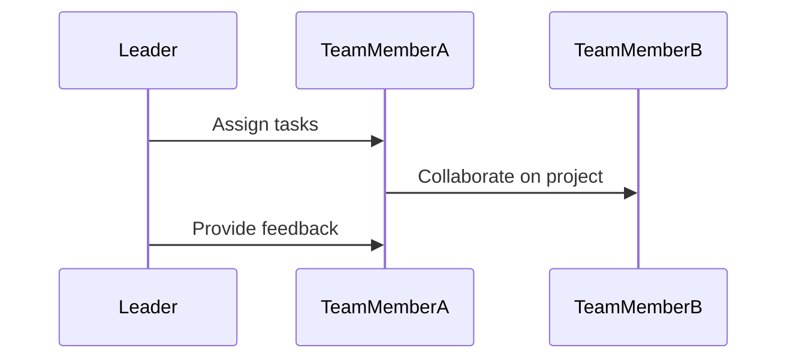
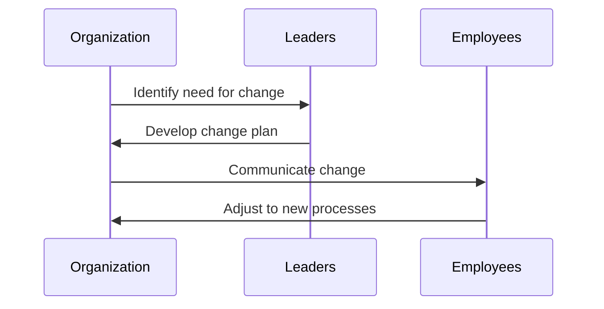
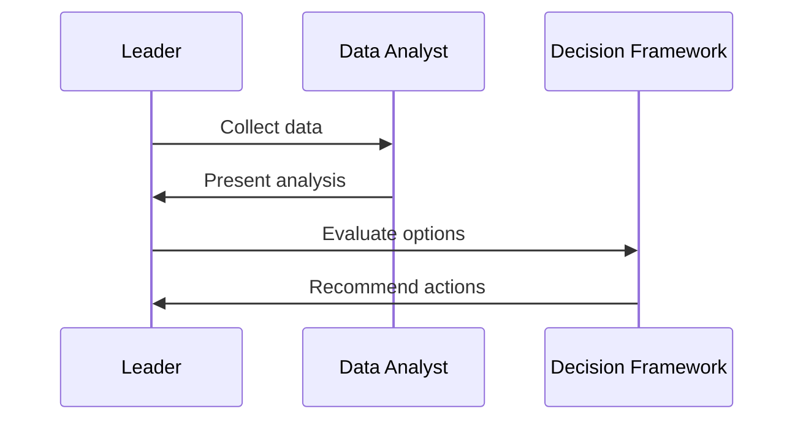

                 

### 文章标题

# 领导力训练营：161天从门外汉到内行人

### 文章关键词

- 领导力
- 领导训练
- 领导能力
- 领导技能
- 领导风格

### 文章摘要

本文旨在通过详细的步骤分析，介绍一个为期161天的领导力训练营。文章将从领导力的重要性、基本概念、团队建设、变革领导、决策与问题解决等多个方面，一步步带领读者深入了解领导力的精髓，帮助他们在161天内从门外汉成长为内行人。通过案例和实践，本文还将提供实用的策略和技巧，以帮助读者在实际工作中有效运用所学知识。

---

### 引言与背景

#### 1.1 领导力的重要性

在当今快速变化和竞争激烈的工作环境中，领导力已成为企业和个人成功的关键因素。有效的领导能够激励团队，推动创新，提高工作效率，并在困难时期为组织提供明确的方向。领导力不仅是管理技能，更是一种能够影响和塑造他人行为和思维的能力。

**问题背景：** 在现代组织中，许多经理和领导者面临着如何更好地领导团队、激发员工潜力以及推动组织变革的挑战。

**问题描述：** 尽管许多人具备技术或专业领域的知识，但他们在领导力方面可能缺乏足够的理解和实践。

**问题解决：** 领导力训练营提供了一个系统化的学习路径，帮助学员在短时间内掌握关键领导技能。

#### 1.2 领导力训练营概念

**定义：** 领导力训练营是一种集中培训模式，旨在通过一系列课程、实践和反馈，加速个人领导能力的提升。

**目标：** 
- 帮助学员建立坚实的领导基础。
- 培养学员的洞察力和决策能力。
- 提升学员的沟通和激励技巧。

**课程结构：** 训练营分为161天，每天有不同的主题和活动，包括讲座、研讨会、小组讨论和模拟练习。

#### 结论

领导力训练营提供了一个结构化的学习平台，帮助个人迅速提升领导能力。通过参与这一训练营，学员可以掌握领导的核心原则和实践方法，从而在职业生涯中取得更大的成功。

---

### 核心领导原则

#### 2.1 定义领导

**核心概念：** 领导不仅仅是管理职位，而是一种影响力。领导者通过激励、启发和引导他人实现共同目标。

**属性特征对比表格：**

| 特征 | 传统领导 | 现代领导 |
| --- | --- | --- |
| 方向性 | 强调权威和控制 | 强调合作和共享 |
| 透明度 | 隐蔽决策过程 | 开放决策过程 |
| 沟通 | 单向沟通 | 双向沟通 |
| 灵活性 | 适应性较差 | 高适应性 |

**ER实体关系图架构：**

```mermaid
erDiagram
  Leader ||--|{ Employee }
  Leader ||--|{ Team }
  Leader ||--|{ Project }
```

**结论：** 领导是一种动态和互动的过程，它涉及对人的理解和影响力的运用，以实现组织的目标。

---

### 建立与领导团队

#### 3.1 团队动态

**核心概念：** 团队是一个由不同个体组成的协作系统，其有效运作依赖于成员之间的互动和相互依赖。

**ER实体关系图架构：**



**结论：** 理解团队动态是领导成功的关键，领导者需要促进团队沟通、协作和共同目标的实现。

#### 3.2 团队领导策略

**核心概念：** 团队领导涉及激励团队成员、解决冲突和培养团队文化。

**算法原理讲解：** 

```python
def empower_team_members(team_members):
    for member in team_members:
        member["empowered"] = True
        member["engagement_level"] += 10

def solve_conflict(conflict):
    while conflict["solved"] == False:
        conflict["parties"].forEach(party => {
            party["satisfied"] = True
        })
        conflict["solved"] = True

def foster_team_culture(team):
    team["culture"]["collaborative"] = True
    team["culture"]["supportive"] = True
```

**结论：** 团队领导需要通过授权、解决冲突和培养积极的文化来提升团队绩效。

---

### 领导变革

#### 4.1 变革过程

**核心概念：** 变革是一个涉及组织结构、流程和文化变化的复杂过程。

**ER实体关系图架构：**



**结论：** 理解变革过程是领导变革成功的第一步，领导者需要明确变革的目标、计划和实施步骤。

#### 4.2 应对变革阻力

**核心概念：** 变革往往面临员工的抵触和阻力，领导者需要采取措施来减轻这种阻力。

**算法原理讲解：** 

```python
def engage_stakeholders(stakeholders):
    stakeholders.forEach(stakeholder => {
        stakeholder["informed"] = True
        stakeholder["involved"] = True
    })

def address_change_challenges(challenges):
    challenges.forEach(challenge => {
        challenge["resolved"] = True
        challenge["impact"] = "minimal"
    })
```

**结论：** 通过参与和沟通，领导者可以减轻变革带来的阻力，确保变革顺利进行。

---

### 决策与问题解决

#### 5.1 决策框架

**核心概念：** 决策框架是一种系统化的决策过程，涉及收集信息、分析选项和评估结果。

**ER实体关系图架构：**



**结论：** 决策框架有助于领导者做出基于数据和事实的明智决策。

#### 5.2 问题解决技巧

**核心概念：** 问题解决是一种系统化的过程，涉及定义问题、分析原因和制定解决方案。

**算法原理讲解：** 

```python
def define_problem(problem):
    problem["defined"] = True

def analyzeCauses(cause):
    cause["analyzed"] = True

def create_solution(solution):
    solution["created"] = True
    solution["implemented"] = False

def implement_solution(solution):
    solution["implemented"] = True

def evaluate_solution(solution):
    solution["evaluated"] = True
```

**结论：** 系统化的问题解决技巧有助于领导者有效地识别和解决组织中的问题。

---

### 结语

通过161天的领导力训练营，学员可以逐步掌握领导的核心原则和实践技巧。从定义领导到团队建设，从变革领导到决策与问题解决，每个阶段都提供了深入的分析和实用的策略。领导力不仅仅是一门科学，更是一种艺术，需要不断学习和实践。希望本文能为读者提供有价值的见解，帮助他们在职业生涯中成为更出色的领导者。**作者：AI天才研究院/AI Genius Institute & 禅与计算机程序设计艺术 /Zen And The Art of Computer Programming**

