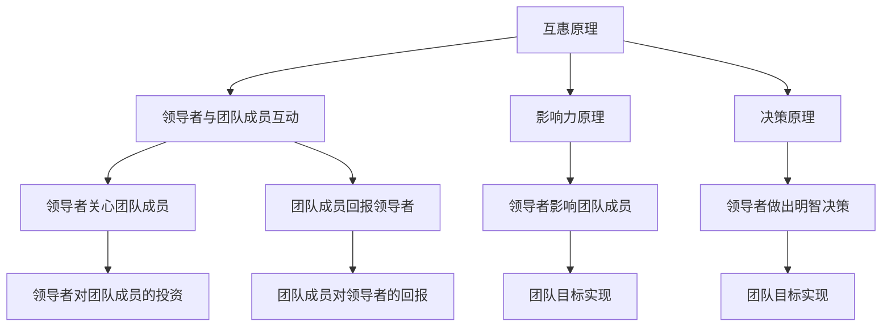
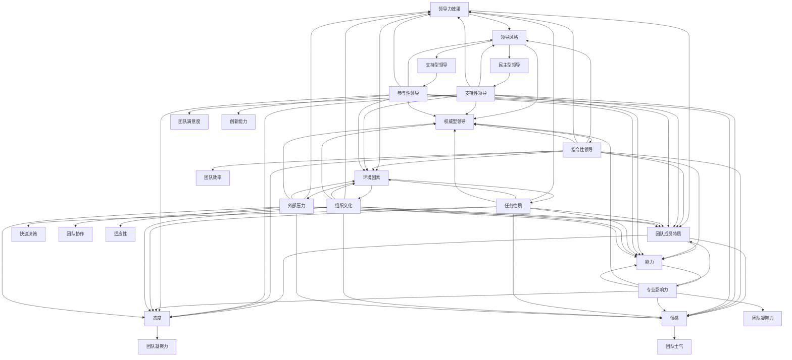
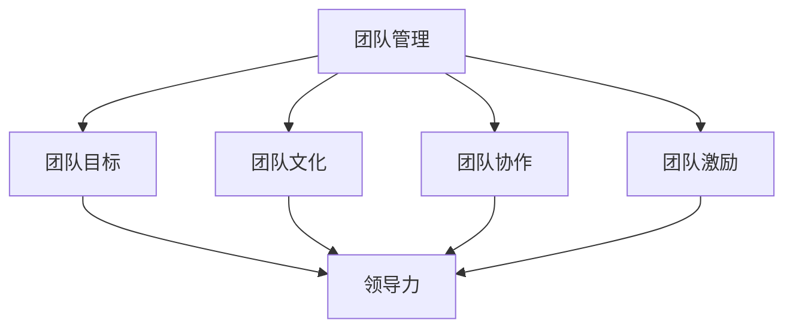
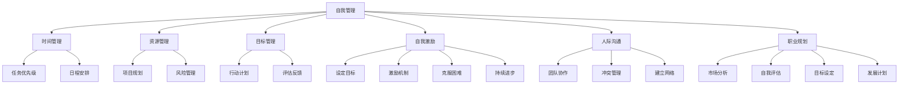
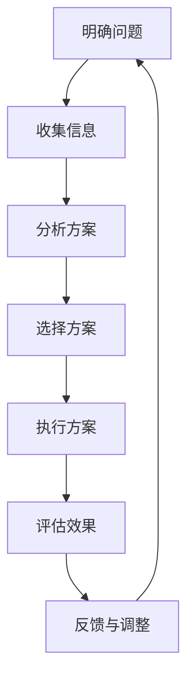
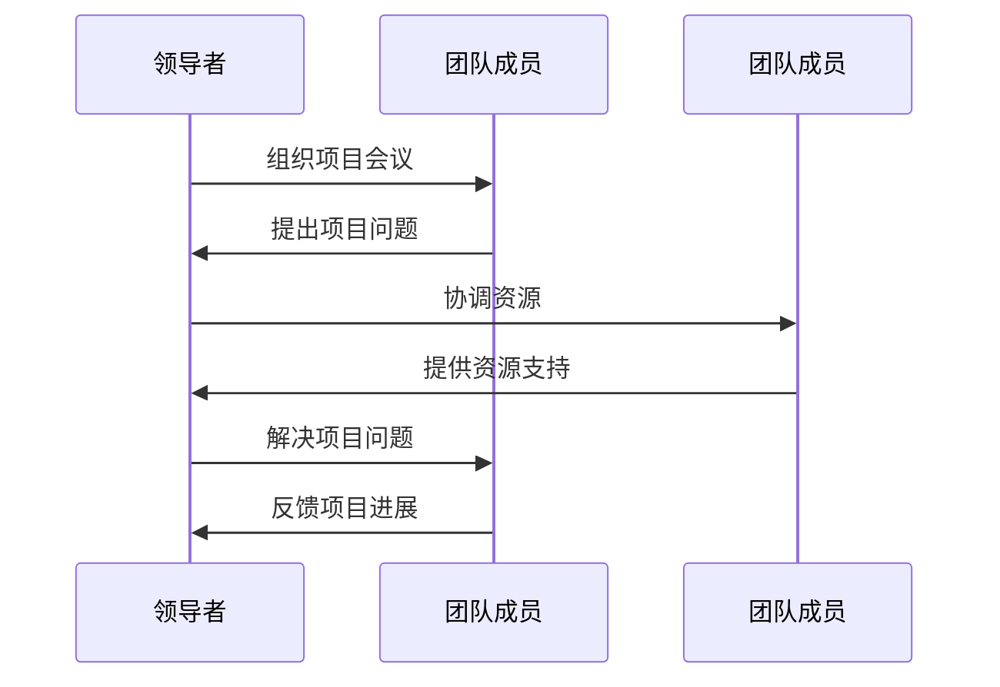
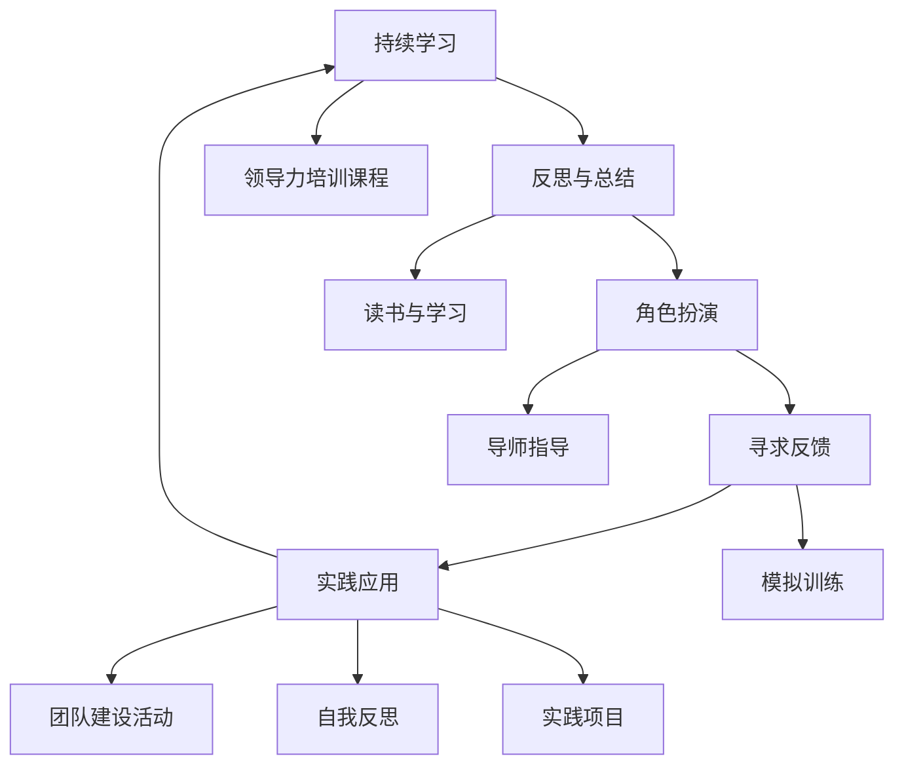

                 

# 领导力训练营：21天从新手到高手

## 关键词

- **领导力**
- **团队管理**
- **个人发展**
- **领导决策**
- **沟通协调**
- **领导力提升**

> **摘要：** 本篇文章将带领读者进行一次21天的领导力训练营，通过系统的学习和实践，从新手逐渐成长为高手。文章详细介绍了领导力的本质、核心概念、实战应用以及提升策略，旨在为读者提供一套完整的领导力提升指南。

---

### 目录大纲

# 领导力训练营：21天从新手到高手

## 第一部分：领导力基础

### 第1章：领导力的本质与重要性

### 第2章：领导力核心概念与联系

### 第3章：领导力原理与数学模型

## 第二部分：领导力实战

### 第4章：领导力在团队管理中的应用

### 第5章：领导力在个人发展中的应用

### 第6章：领导力在领导决策中的应用

### 第7章：领导力在沟通与协调中的应用

## 第三部分：领导力提升

### 第8章：领导力提升策略与方法

### 第9章：领导力训练营实践

### 第10章：领导力提升最佳实践

## 参考文献

## 拓展阅读

---

## 第一部分：领导力基础

### 第1章：领导力的本质与重要性

领导力是影响和激励他人实现目标的能力，是领导者在团队中发挥核心作用的关键因素。领导力不仅仅是管理能力，更是领导者对团队的引导、激励和赋能。

#### 1.1 领导力的定义与内涵

领导力可以定义为：在复杂和不确定的环境中，通过洞察、决策和行动，引领团队实现共同目标的能力。它包括以下几个方面：

1. **愿景与目标设定**：领导者需要设定清晰、激励人心的愿景和目标，引领团队朝着共同的方向努力。
2. **影响力与魅力**：领导者需要具备强大的影响力，能够赢得他人的信任和支持，激励团队成员发挥最佳水平。
3. **沟通与协调**：领导者需要具备优秀的沟通技巧，能够有效传达愿景和目标，协调团队成员之间的关系。
4. **决策与执行**：领导者需要具备果断的决策能力和高效的执行能力，能够在复杂和不确定的环境中做出正确的决策，并确保决策得到有效执行。

#### 1.2 领导力的重要性

领导力在团队管理中具有至关重要的作用：

1. **团队凝聚力**：领导力能够增强团队的凝聚力，使团队成员团结一致，共同追求团队目标。
2. **团队效率**：领导力能够提高团队的效率，使团队成员能够高效地完成工作任务，实现团队目标。
3. **创新能力**：领导力能够激发团队的创新能力，使团队成员能够敢于挑战现状，提出新的想法和解决方案。
4. **团队士气**：领导力能够提升团队的士气，使团队成员保持积极向上的心态，面对挑战和困难。

#### 1.3 领导力的边界与外延

领导力的边界在于其影响范围和作用范围。一般来说，领导力可以分为以下几个方面：

1. **个人领导力**：领导者对个人影响力的掌控，包括自我管理、自我激励、自我成长等方面。
2. **团队领导力**：领导者对团队的影响力，包括团队管理、团队建设、团队协作等方面。
3. **组织领导力**：领导者对组织的影响力，包括组织管理、组织变革、组织文化等方面。
4. **社会领导力**：领导者对社会的影响力，包括社会责任、社会贡献、社会影响力等方面。

---

接下来，我们将进一步探讨领导力的核心概念、原理以及数学模型，帮助读者更深入地理解领导力的本质。接下来，让我们一起深入探讨领导力的核心概念与联系。

### 第2章：领导力核心概念与联系

领导力是一门深奥的学问，包含了许多核心概念和理论。了解这些核心概念及其联系，是提升领导力的第一步。本章将介绍几个主要的领导力模型、核心要素以及它们的属性特征。

#### 2.1 领导力模型

领导力模型是描述领导力行为和特征的工具，常见的领导力模型包括LSP模型、领导五力模型和情景领导模型等。

##### 2.1.1 LSP模型

LSP（Leadership Style Profile）模型是一种基于领导者风格分类的模型，它将领导风格分为以下几种：

1. **权威型领导**：领导者具有绝对的决策权和控制力，强调命令和控制。
2. **民主型领导**：领导者鼓励团队成员参与决策，强调民主和参与。
3. **支持型领导**：领导者关注团队成员的需求和情感，提供支持和鼓励。
4. **参与型领导**：领导者积极与团队成员沟通，共同参与决策和问题解决。

##### 2.1.2 领导五力模型

领导五力模型是由卡茨（Katz）提出的，它将领导力分为五力：

1. **技术技能**：领导者掌握的特定领域知识和技术能力。
2. **人际技能**：领导者与团队成员沟通、合作和建立关系的能力。
3. **概念技能**：领导者对组织整体和战略的理解能力。
4. **决策力**：领导者在复杂和不确定的环境中做出决策的能力。
5. **影响力**：领导者影响他人思想和行动的能力。

##### 2.1.3 情景领导模型

情景领导模型是由赫赛（Hersey）和布兰查德（Blanchard）提出的，它将领导力分为四种情景：

1. **情景1：指导型领导**：领导者明确指导团队成员如何完成任务。
2. **情景2：推销型领导**：领导者通过说服和激励来激励团队成员。
3. **情景3：参与型领导**：领导者与团队成员共同参与决策。
4. **情景4：授权型领导**：领导者赋予团队成员更多的自主权。

#### 2.2 领导力核心要素

领导力不仅仅是某种单一的技能或特质，而是由多个核心要素组成的整体。以下是几个关键的领导力核心要素：

##### 2.2.1 情商

情商是指领导者识别、理解和管理自己及他人情感的能力。高情商的领导者能够更好地处理人际关系，增强团队凝聚力。

##### 2.2.2 影响力

影响力是指领导者影响他人思想和行动的能力。领导者需要通过自身的言行和决策来影响团队成员，实现团队目标。

##### 2.2.3 决策力

决策力是指领导者在复杂和不确定的环境中做出明智决策的能力。有效的领导者能够在关键时刻做出正确的决策，引领团队走向成功。

##### 2.2.4 沟通技能

沟通技能是指领导者有效地传递信息和观点的能力。良好的沟通技能能够减少误解，增强团队合作。

#### 2.3 领导力概念属性特征对比表格

为了更清晰地理解不同领导力概念之间的差异，我们可以通过以下表格进行比较：

| 领导力概念 | 定义 | 特征 |
| :--- | :--- | :--- |
| LSP模型 | 领导风格分类 | 权威型、民主型、支持型、参与型 |
| 领导五力模型 | 领导技能分类 | 技术技能、人际技能、概念技能、决策力、影响力 |
| 情景领导模型 | 领导情景分类 | 指导型、推销型、参与型、授权型 |
| 情商 | 情感管理能力 | 自我认知、自我调节、社交意识、同理心 |
| 影响力 | 影响他人能力 | 道德力量、说服力、影响力 |
| 决策力 | 决策能力 | 确定性决策、风险决策、创新决策 |
| 沟通技能 | 传递信息能力 | 明确性、主动性、倾听、反馈 |

#### 2.4 领导力原理与数学模型

领导力原理是领导力理论的基础，它解释了领导行为和领导效果之间的关系。以下是几个关键的领导力原理：

##### 2.4.1 互惠原理

互惠原理指出，领导者与团队成员之间的互动是相互的，领导者对团队成员的关心和投资将得到回报。

##### 2.4.2 影响力原理

影响力原理指出，领导者通过影响他人的思想和行为来实现团队目标。

##### 2.4.3 决策原理

决策原理指出，领导者在面对复杂和不确定的环境时，需要做出明智的决策，确保团队目标的实现。

为了更深入地理解这些原理，我们可以使用以下数学模型：

$$
\text{领导效果} = f(\text{领导风格}, \text{团队特征}, \text{环境因素})
$$

其中，领导效果是指领导者在团队中所取得的效果；领导风格是指领导者的行为和态度；团队特征是指团队成员的特质和能力；环境因素是指团队所处的环境和外部条件。

#### 2.5 领导力原理mermaid流程图

为了更直观地展示领导力原理，我们可以使用mermaid流程图来描述：

通过以上对比表格和流程图，我们可以更清晰地理解领导力的核心概念和原理，为后续的领导力实战和应用打下坚实的基础。

### 第3章：领导力原理与数学模型

领导力是一门科学，也是一门艺术。在了解了领导力的本质和核心概念之后，我们需要进一步探讨领导力的原理，并运用数学模型来解释领导力现象。这一章将详细阐述领导力的原理，以及如何使用数学模型来分析和理解这些原理。

#### 3.1 领导力原理

领导力原理是指领导行为与领导效果之间的基本规律和法则。以下是几个重要的领导力原理：

##### 3.1.1 领导行为原理

领导行为原理指出，领导者的行为对团队效果具有重要影响。不同的领导行为会导致不同的团队效果。例如：

1. **指令性领导**：领导者通过发布指令来指导团队成员的工作，这种领导风格在任务明确、时间紧迫的情况下效果较好。
2. **支持性领导**：领导者关注团队成员的情感需求，提供支持和鼓励，这种领导风格有助于提高团队成员的工作满意度和忠诚度。
3. **参与性领导**：领导者鼓励团队成员参与决策和问题解决，这种领导风格能够增强团队的凝聚力和创新能力。

##### 3.1.2 领导风格原理

领导风格原理指出，领导风格是领导者行为的核心特征，它决定了领导者如何与团队成员互动。不同的领导风格适用于不同的团队环境和任务。例如：

1. **权威型领导**：领导者拥有绝对的决策权和控制力，这种风格适用于任务紧急、需要快速决策的情况。
2. **民主型领导**：领导者鼓励团队成员参与决策，这种风格适用于需要团队协作、创造力较强的情况。
3. **变革型领导**：领导者通过愿景和价值观来激励团队成员，这种风格适用于需要创新和变革的情况。

##### 3.1.3 领导影响力原理

领导影响力原理指出，领导者的影响力是通过其行为和决策来影响团队成员的思想和行动。领导者的个人特质、价值观和行为方式都会影响其影响力。例如：

1. **道德影响力**：领导者通过正直和诚信的行为来赢得团队成员的信任和尊重。
2. **专业影响力**：领导者通过专业知识和技能来赢得团队成员的认可和尊重。
3. **情感影响力**：领导者通过情感共鸣和关爱来赢得团队成员的信任和支持。

##### 3.1.4 领导决策原理

领导决策原理指出，领导者在面对复杂和不确定的环境时，需要做出明智的决策。领导决策的原则包括：

1. **目标导向**：领导者需要明确团队的目标和愿景，确保决策能够支持团队目标的实现。
2. **信息充分**：领导者需要收集和分析充分的信息，以确保决策的准确性和有效性。
3. **风险控制**：领导者需要评估决策的风险，并采取措施来降低风险。
4. **快速响应**：领导者需要能够迅速做出决策，以应对不断变化的环境。

#### 3.2 领导力数学模型

为了更好地理解领导力原理，我们可以使用数学模型来描述领导力现象。以下是几个常用的领导力数学模型：

##### 3.2.1 领导力效果模型

领导力效果模型可以用以下公式表示：

$$
E = f(S, M, E)
$$

其中，E代表领导力效果，S代表领导风格，M代表团队成员特质，E代表环境因素。这个模型表明，领导力效果是领导风格、团队成员特质和环境因素的函数。

- **领导风格（S）**：领导风格包括权威型、民主型、支持型等。不同的领导风格对领导效果有不同的影响。
- **团队成员特质（M）**：团队成员的特质包括能力、态度、情感等。团队成员的特质会影响他们对领导行为的反应。
- **环境因素（E）**：环境因素包括任务性质、组织文化、外部压力等。环境因素会影响领导行为的选择和效果。

##### 3.2.2 领导影响力模型

领导影响力模型可以用以下公式表示：

$$
I = f(C, P, B)
$$

其中，I代表领导影响力，C代表道德力量，P代表说服力，B代表行为力量。这个模型表明，领导影响力是道德力量、说服力和行为力量的函数。

- **道德力量（C）**：领导者的道德力量是指其正直和诚信的品质，它能够赢得团队成员的信任和尊重。
- **说服力（P）**：领导者的说服力是指其沟通和说服他人的能力，它能够影响团队成员的思想和行动。
- **行为力量（B）**：领导者的行为力量是指其言行一致的能力，它能够通过实际行动来影响团队成员。

##### 3.2.3 领导决策模型

领导决策模型可以用以下公式表示：

$$
D = f(T, I, R)
$$

其中，D代表领导决策，T代表目标导向，I代表信息充分，R代表风险控制。这个模型表明，领导决策是目标导向、信息充分和风险控制的函数。

- **目标导向（T）**：领导决策需要明确目标，确保决策能够支持团队目标的实现。
- **信息充分（I）**：领导决策需要充分的信息支持，以确保决策的准确性和有效性。
- **风险控制（R）**：领导决策需要评估风险，并采取措施来降低风险。

#### 3.3 领导力原理mermaid流程图

为了更直观地展示领导力原理，我们可以使用mermaid流程图来描述。以下是一个简单的领导力原理mermaid流程图：

通过以上mermaid流程图，我们可以更直观地理解领导力原理及其相互关系。

#### 3.4 领导力原理的实际应用

领导力原理不仅是一种理论，更是一种实践。在实际应用中，领导者需要根据不同的情境选择合适的领导风格、领导行为和领导决策。

##### 3.4.1 情境1：任务紧急，需要快速决策

在任务紧急、需要快速决策的情况下，领导者应采用指令性领导风格，明确任务目标和完成时间，指导团队成员快速行动。同时，领导者需要充分了解团队成员的能力和态度，确保任务的顺利完成。

##### 3.4.2 情境2：需要团队协作，提高创新能力

在需要团队协作、提高创新能力的情况下，领导者应采用参与性领导风格，鼓励团队成员参与决策和问题解决，激发团队的创造力和凝聚力。同时，领导者需要提供支持和鼓励，确保团队成员能够充分发挥潜力。

##### 3.4.3 情境3：需要适应变化，保持灵活性

在需要适应变化、保持灵活性的情况下，领导者应采用支持性领导风格，关注团队成员的情感需求，提供支持和鼓励，帮助团队成员适应变化。同时，领导者需要及时调整领导策略，确保团队能够应对外部环境的挑战。

通过以上实际应用，我们可以看到领导力原理在实践中的重要性。领导者需要根据不同的情境灵活运用领导力原理，提高团队的整体效能。

### 第4章：领导力在团队管理中的应用

在团队管理中，领导力发挥着至关重要的作用。一个优秀的领导者能够有效激发团队成员的潜力，提升团队的整体效能，实现团队的长期发展。本章将深入探讨领导力在团队管理中的应用，包括团队建设、团队协作、团队激励等方面的策略和方法。

#### 4.1 团队管理中的领导力

团队管理中的领导力主要涉及以下几个方面：

1. **明确团队目标**：领导者需要明确团队的目标和愿景，确保团队成员对目标有清晰的认识，并为之努力。

2. **建设团队文化**：领导者需要营造积极向上的团队文化，培养团队成员的共同价值观和使命感。

3. **促进团队协作**：领导者需要促进团队成员之间的沟通和合作，建立良好的团队协作机制。

4. **激励团队成员**：领导者需要根据团队成员的个性特点和能力，采取合适的激励措施，激发团队成员的积极性和创造力。

#### 4.2 团队建设与领导力

团队建设是领导力在团队管理中的核心内容之一。有效的团队建设能够提高团队的凝聚力、协作力和创新能力。以下是一些关键的团队建设策略：

1. **建立共同目标**：领导者需要与团队成员共同设定团队目标，确保团队成员对目标有共同的认识和承诺。

2. **加强沟通与协作**：领导者需要建立开放的沟通渠道，鼓励团队成员分享意见和建议，促进团队内部的协作和合作。

3. **培养团队文化**：领导者需要营造积极、开放、包容的团队文化，鼓励团队成员积极参与团队活动，增强团队的凝聚力和归属感。

4. **提供培训与发展机会**：领导者需要为团队成员提供培训和发展机会，帮助团队成员提升技能和知识，增强团队的整体实力。

#### 4.3 团队管理与领导力mermaid架构图

为了更直观地展示团队管理与领导力之间的关系，我们可以使用mermaid架构图来描述。以下是一个简单的团队管理与领导力mermaid架构图：

通过以上mermaid架构图，我们可以看到团队管理与领导力之间的紧密联系。领导力在团队管理中发挥着核心作用，通过明确团队目标、建设团队文化、促进团队协作和激励团队成员，领导者能够有效提升团队的整体效能。

#### 4.4 团队管理中的具体实践

在团队管理中，领导者需要根据不同的团队情况和任务需求，采取灵活的领导策略和方法。以下是一些具体的实践方法：

1. **明确角色与职责**：领导者需要明确团队成员的角色和职责，确保团队成员对自身的职责有清晰的认识，并能够有效地履行职责。

2. **制定清晰的计划**：领导者需要制定详细的计划，明确任务目标、任务分工和时间安排，确保团队成员能够有条不紊地开展工作。

3. **鼓励沟通与反馈**：领导者需要建立开放的沟通渠道，鼓励团队成员之间的沟通与反馈，及时发现和解决问题，促进团队内部的协作和合作。

4. **提供激励与支持**：领导者需要根据团队成员的绩效和贡献，采取合适的激励措施，如奖金、晋升、培训等，激发团队成员的积极性和创造力。

5. **关注团队成员的成长**：领导者需要关注团队成员的个人成长和发展需求，提供相应的支持和指导，帮助团队成员不断提升自己的能力和素质。

通过以上具体实践方法，领导者能够有效地提升团队的管理水平和整体效能。

#### 4.5 领导力在团队管理中的实际案例

在实际工作中，领导力在团队管理中的应用可以带来显著的效果。以下是一个实际案例：

某公司的项目团队在接到一个重要项目后，面临着时间紧、任务重的挑战。作为团队领导者，张经理意识到需要采取有效的领导策略来确保项目的成功。

首先，张经理与团队成员共同设定了项目的目标，明确了项目的关键里程碑和时间节点。其次，张经理建立了开放的沟通渠道，鼓励团队成员在项目中遇到问题时积极沟通和反馈，共同解决问题。同时，张经理还提供了丰富的培训和发展机会，帮助团队成员提升技能和知识。

在项目执行过程中，张经理密切关注团队成员的工作进展，及时给予反馈和支持，解决了许多项目中的难题。此外，张经理还根据团队成员的绩效和贡献，提供了相应的激励措施，如奖金和晋升机会，激发了团队成员的积极性和创造力。

最终，项目团队在张经理的领导下，成功完成了项目任务，并获得了客户的高度评价。这个案例展示了领导力在团队管理中的重要作用，以及如何通过有效的领导策略和方法来提升团队的管理水平和整体效能。

#### 4.6 总结

领导力在团队管理中具有至关重要的作用。通过明确团队目标、建设团队文化、促进团队协作和激励团队成员，领导者能够有效提升团队的整体效能。在实际工作中，领导者需要根据不同的团队情况和任务需求，采取灵活的领导策略和方法，以实现团队的成功。接下来，我们将进一步探讨领导力在个人发展中的应用，帮助读者理解如何通过领导力提升个人能力。

### 第5章：领导力在个人发展中的应用

领导力不仅适用于团队管理和组织发展，也是个人成长和职业发展的关键因素。通过掌握和运用领导力，个人可以在职场中更好地定位自己，提升自己的影响力，实现职业目标。本章将探讨领导力在个人发展中的应用，包括领导力对个人成长的影响、如何运用领导力提升个人能力以及个人成长中的领导力模型。

#### 5.1 个人发展中的领导力

个人发展中的领导力是指个人在自我管理、自我激励和自我成长过程中，运用领导力原理和方法来提升自我能力，实现个人目标。以下是领导力在个人发展中的几个关键作用：

1. **自我管理**：领导力帮助个人更好地管理时间和资源，提高工作效率和成果。通过制定目标、计划和时间管理技巧，个人能够更有效地完成工作任务。

2. **自我激励**：领导力帮助个人保持积极的心态，克服困难和挑战，激发内在的动力和潜能。通过设定激励机制和奖励，个人能够保持对目标的热情和执着。

3. **人际沟通**：领导力提高个人的人际沟通能力和团队合作能力，使个人能够在团队中发挥积极作用，建立良好的人际关系网络。

4. **职业规划**：领导力帮助个人明确职业目标，制定职业发展计划，提高自己在职场中的竞争力。通过自我评估和市场分析，个人能够找到适合自己的职业发展方向。

#### 5.2 领导力与个人成长

领导力在个人成长中起着重要的推动作用。以下是一些具体的方面：

1. **自我认知**：通过领导力，个人能够更好地了解自己的优势和劣势，明确自己的价值观和目标，提高自我认知。

2. **自我提升**：领导力促使个人不断学习和成长，通过阅读、培训和实践来提升自己的知识和技能。

3. **影响力**：领导力帮助个人在职场中建立影响力，赢得他人的尊重和信任，从而为个人的职业发展创造更多机会。

4. **创新能力**：领导力鼓励个人勇于尝试和创新，提出新的想法和解决方案，推动个人和团队的发展。

#### 5.3 领导力在个人发展中的mermaid流程图

为了更直观地展示领导力在个人发展中的应用，我们可以使用mermaid流程图来描述。以下是一个简单的领导力在个人发展中的mermaid流程图：

通过以上mermaid流程图，我们可以看到领导力在个人发展中的应用是如何层层递进，帮助个人实现自我管理和自我提升的。

#### 5.4 领导力在个人发展中的应用实例

在实际的个人发展中，领导力可以帮助个人实现多个层面的成长。以下是一个实际应用案例：

李华是一位年轻的软件工程师，他在职业生涯初期渴望提升自己的技能和影响力。为了实现这一目标，李华采取了以下领导力实践：

1. **自我管理**：李华通过制定详细的计划和目标，管理自己的时间和任务，提高了工作效率和成果。

2. **自我激励**：李华设定了长期的职业目标，并为自己设定了短期目标和奖励机制，通过完成任务获得成就感。

3. **人际沟通**：李华积极参与团队讨论，倾听他人的意见，并在团队中发挥了积极的沟通和协调作用，建立了良好的人际关系。

4. **职业规划**：李华通过市场分析和个人评估，明确了职业发展方向，并制定了详细的职业发展计划。

通过这些领导力实践，李华不仅在技术能力上取得了显著进步，还在团队中获得了较高的评价和认可。这个案例展示了领导力在个人发展中的重要作用，以及如何通过有效的领导力实践来实现个人的职业成长。

#### 5.5 个人成长中的领导力模型

为了更好地理解和应用领导力，我们可以采用一些领导力模型来指导个人成长。以下是一些常用的领导力模型：

1. **自我领导模型**：这个模型强调个人在自我管理、自我激励和自我提升方面的能力。通过设定目标、制定计划和进行自我评估，个人能够不断进步。

2. **变革型领导模型**：这个模型强调领导者通过激励和启发他人来实现共同目标。个人可以将这一模型应用于个人成长中，通过激励他人和建立团队来推动自己的发展。

3. **情境领导模型**：这个模型根据不同的情境选择合适的领导风格。个人可以在不同的成长阶段和应用场景中，灵活运用不同的领导风格。

4. **情商领导模型**：这个模型强调情商在领导力中的重要性。个人可以通过提升情商，更好地理解和管理自己的情绪，以及更好地与他人沟通和合作。

通过以上领导力模型，个人可以在不同的成长阶段和应用场景中，灵活运用领导力原理，实现个人的全面发展。

#### 5.6 总结

领导力在个人发展中具有重要的作用。通过自我管理、自我激励、人际沟通和职业规划，个人可以不断提升自己的能力和影响力，实现职业目标。在实际应用中，个人需要根据自身的情况和需求，灵活运用不同的领导力模型和策略，实现个人成长。接下来，我们将进一步探讨领导力在领导决策中的应用，帮助读者理解如何在复杂环境中做出明智的决策。

### 第6章：领导力在领导决策中的应用

在领导过程中，决策是领导者不可或缺的职责之一。有效的决策能够帮助团队应对复杂的环境和挑战，实现组织目标。本章将深入探讨领导力在领导决策中的应用，包括领导决策的核心要素、决策模型以及如何在实际环境中做出明智的决策。

#### 6.1 领导决策中的领导力

领导决策是领导者根据组织目标和环境情况，制定和选择行动方案的过程。领导力在领导决策中发挥着关键作用，主要体现在以下几个方面：

1. **明确目标**：领导者需要明确组织的目标和愿景，确保决策与组织目标保持一致。

2. **信息收集**：领导者需要收集和分析与决策相关的信息，包括市场趋势、竞争状况、资源状况等，确保决策有充分的信息支持。

3. **评估风险**：领导者需要对决策可能带来的风险进行评估，并采取相应的措施来降低风险。

4. **选择方案**：领导者需要根据目标和信息，选择最佳的决策方案，确保决策的有效性。

5. **执行决策**：领导者需要确保决策得到有效执行，并监控决策的效果，及时进行调整。

#### 6.2 领导决策模型

为了更好地理解领导决策的过程，我们可以运用一些经典的决策模型。以下是几个常用的领导决策模型：

1. **理性决策模型**：理性决策模型假设决策者在信息充分、理性分析的基础上，能够做出最佳决策。该模型包括以下步骤：

   - **明确问题**：确定需要解决的问题。
   - **收集信息**：收集与决策相关的数据和信息。
   - **分析方案**：分析不同的决策方案，评估其优缺点。
   - **选择方案**：选择最佳决策方案。
   - **执行方案**：执行决策方案。
   - **评估效果**：评估决策的效果，进行反馈和调整。

2. **有限理性决策模型**：有限理性决策模型认为决策者在信息不完全、时间有限的情况下，只能做出次优决策。该模型包括以下步骤：

   - **确定目标**：明确决策的目标和约束条件。
   - **评估备选方案**：评估可能的备选方案，考虑实际可行性。
   - **选择方案**：选择一个相对满意的方案。
   - **执行方案**：执行决策方案。
   - **反馈与调整**：根据执行结果进行反馈和调整。

3. **变革型决策模型**：变革型决策模型强调领导者的愿景和价值观在决策过程中的作用。该模型包括以下步骤：

   - **确立愿景**：领导者明确组织的愿景和目标。
   - **沟通愿景**：与团队成员沟通愿景，赢得他们的支持和认同。
   - **识别问题**：识别组织面临的问题和挑战。
   - **探索方案**：鼓励团队成员提出创新和变革的方案。
   - **选择方案**：选择能够实现愿景的方案。
   - **实施变革**：领导变革过程，确保变革的顺利实施。

#### 6.3 领导决策中的领导力mermaid决策树

为了更直观地展示领导决策的过程，我们可以使用mermaid决策树来描述。以下是一个简单的领导决策mermaid决策树：

通过以上mermaid决策树，我们可以清晰地看到领导决策的流程和各个环节之间的联系。

#### 6.4 如何在实际环境中做出明智的决策

在实际环境中，领导者需要面对复杂多变的情况，做出明智的决策。以下是一些建议：

1. **全面收集信息**：在做出决策之前，领导者需要全面收集与决策相关的信息，包括市场趋势、竞争对手、内部资源等。只有充分了解情况，才能做出更准确的判断。

2. **评估风险和机会**：领导者需要对决策可能带来的风险和机会进行评估，并制定相应的应对策略。在评估过程中，要充分考虑各种可能性，避免因风险而放弃有潜力的机会。

3. **利用团队智慧**：领导者可以召集团队成员，利用集体智慧来共同决策。团队成员可以从不同的角度提出意见和建议，帮助领导者做出更全面的决策。

4. **保持灵活性和开放性**：领导者需要保持灵活性和开放性，随时准备调整决策方案，以应对新的情况和变化。在决策过程中，要不断收集反馈信息，及时调整策略。

5. **关注执行效果**：决策制定后，领导者需要关注决策的执行效果，及时评估决策的成效，并根据实际情况进行调整和优化。

6. **建立反馈机制**：领导者需要建立有效的反馈机制，鼓励团队成员提供反馈和建议，以便及时发现和解决问题。

通过以上方法，领导者可以在实际环境中做出更明智的决策，提高组织的应变能力和竞争力。

#### 6.5 领导决策中的实际案例

在实际工作中，领导决策的案例层出不穷。以下是一个实际案例：

某公司的产品团队在开发一款新产品时，面临一个关键决策：是继续优化现有的产品功能，还是推出一个全新的产品版本。为了做出明智的决策，团队领导者李总采取了以下步骤：

1. **明确问题**：李总明确了团队需要解决的问题，即如何在新产品开发中取得更好的市场效果。

2. **收集信息**：李总收集了市场调研报告、竞争对手的产品分析、团队内部的技术评估等，全面了解了与决策相关的信息。

3. **评估风险和机会**：李总评估了继续优化现有产品和推出全新产品版本的利弊，考虑了市场接受度、研发成本、时间进度等因素。

4. **利用团队智慧**：李总召集了产品团队的核心成员，讨论了不同的方案，听取了团队成员的意见和建议。

5. **选择方案**：经过讨论和分析，团队最终决定推出一个全新的产品版本，以更好地满足市场需求。

6. **执行决策**：李总确保决策得到有效执行，分配了任务，制定了详细的项目计划，并监控了项目的进展。

7. **反馈与调整**：在项目执行过程中，李总不断收集团队成员的反馈，并根据实际情况进行了调整，确保项目的成功完成。

通过以上步骤，团队成功推出了全新的产品版本，并获得了市场的积极反响。这个案例展示了领导力在领导决策中的应用，以及如何通过科学的决策过程实现组织目标。

#### 6.6 总结

领导决策是领导者的重要职责之一，有效的决策能够帮助团队应对复杂的环境和挑战，实现组织目标。通过了解和运用领导决策模型，领导者可以在实际环境中做出明智的决策。在实际工作中，领导者需要全面收集信息、评估风险和机会、利用团队智慧、保持灵活性和关注执行效果，以提高决策的质量和成效。接下来，我们将探讨领导力在沟通与协调中的应用，帮助读者理解如何通过有效的沟通和协调提升团队绩效。

### 第7章：领导力在沟通与协调中的应用

沟通和协调是领导力的重要组成部分，有效的沟通和协调能够促进团队成员之间的理解与合作，提升团队的绩效和执行力。本章将详细探讨领导力在沟通与协调中的应用，包括领导力对沟通与协调的影响、沟通与协调的最佳实践以及如何在实际环境中应用领导力提升沟通与协调效果。

#### 7.1 领导力对沟通与协调的影响

领导力在沟通与协调中发挥着关键作用，主要体现在以下几个方面：

1. **设定沟通目标**：领导者需要明确沟通的目标和愿景，确保沟通活动能够支持团队目标和组织目标的实现。

2. **建立信任关系**：领导者需要建立与团队成员之间的信任关系，通过真诚、透明和开放的态度，增强团队成员之间的互信。

3. **促进有效沟通**：领导者需要运用有效的沟通技巧，如倾听、表达、提问和反馈，确保信息能够准确、及时地传达。

4. **协调资源与任务**：领导者需要协调团队成员之间的资源和任务分配，确保团队能够高效地协同工作。

5. **解决冲突**：领导者需要具备解决冲突的能力，通过公正、客观和妥善的方式，处理团队内部的冲突和分歧。

#### 7.2 沟通与协调的最佳实践

为了实现有效的沟通与协调，领导者可以采取以下最佳实践：

1. **明确沟通目标**：在每次沟通前，领导者需要明确沟通的目标和预期成果，确保沟通活动具有明确的方向和意义。

2. **建立沟通机制**：领导者需要建立有效的沟通机制，如定期会议、信息共享平台、汇报制度等，确保信息能够畅通无阻地传递。

3. **倾听与表达**：领导者需要注重倾听团队成员的意见和反馈，尊重团队成员的发言权，并通过清晰、准确的表达来传递信息。

4. **建立信任关系**：领导者需要通过真诚、透明和开放的态度，建立与团队成员之间的信任关系，增强团队的凝聚力和合作意愿。

5. **协调资源与任务**：领导者需要根据团队成员的能力和特长，合理分配任务和资源，确保团队能够高效地协同工作。

6. **解决冲突**：领导者需要具备解决冲突的能力，通过公正、客观和妥善的方式，处理团队内部的冲突和分歧，确保团队和谐稳定。

#### 7.3 领导力在沟通与协调中的应用

在实际工作中，领导力在沟通与协调中的应用主要体现在以下几个方面：

1. **促进团队合作**：领导者需要运用沟通与协调的技巧，促进团队成员之间的合作和协作，提高团队的整体绩效。

2. **解决沟通障碍**：领导者需要及时发现和解决沟通中的障碍，如信息传递不畅、误解和冲突等，确保沟通活动能够顺利进行。

3. **提升执行力**：领导者需要通过有效的沟通和协调，确保团队成员对任务目标和执行计划有清晰的认识，提高团队的执行力。

4. **培养沟通文化**：领导者需要培养团队的沟通文化，鼓励团队成员积极参与沟通，提高团队的沟通能力和协作水平。

#### 7.4 沟通与协调中的领导力mermaid序列图

为了更直观地展示领导力在沟通与协调中的应用，我们可以使用mermaid序列图来描述。以下是一个简单的沟通与协调中的mermaid序列图：

通过以上mermaid序列图，我们可以看到领导者在沟通与协调中的作用，以及团队成员之间的互动和协作。

#### 7.5 领导力在沟通与协调中的实际案例

在实际工作中，领导力在沟通与协调中的应用可以带来显著的效果。以下是一个实际案例：

某公司的市场团队在开展一项大型营销活动时，遇到了沟通不畅和资源协调困难的问题。为了解决这些问题，团队领导者张经理采取了以下措施：

1. **明确沟通目标**：张经理明确了营销活动的目标，并制定了详细的沟通计划，确保团队成员对活动目标和预期成果有清晰的认识。

2. **建立沟通机制**：张经理建立了每日晨会和每周例会制度，确保团队成员能够及时沟通和分享信息，解决项目中的问题。

3. **倾听与表达**：张经理注重倾听团队成员的意见和反馈，通过开放和真诚的态度，建立了与团队成员之间的信任关系。

4. **协调资源与任务**：张经理根据团队成员的能力和特长，合理分配任务和资源，确保团队能够高效地协同工作。

5. **解决冲突**：张经理及时发现和解决团队内部的冲突和分歧，通过公正、客观和妥善的方式，确保团队的和谐稳定。

通过以上措施，张经理成功解决了市场团队沟通不畅和资源协调困难的问题，确保了营销活动的顺利进行。这个案例展示了领导力在沟通与协调中的重要作用，以及如何通过有效的沟通和协调提升团队的绩效。

#### 7.6 总结

沟通和协调是领导力的重要组成部分，有效的沟通和协调能够促进团队成员之间的理解与合作，提升团队的绩效和执行力。领导者需要明确沟通目标、建立沟通机制、倾听与表达、协调资源与任务以及解决冲突，通过有效的沟通和协调实现团队目标。在实际工作中，领导者需要不断学习和实践，提高沟通与协调的能力，为团队的成功贡献力量。接下来，我们将探讨领导力提升的策略与方法，帮助读者找到适合自己的领导力提升路径。

### 第8章：领导力提升策略与方法

领导力的提升是一个长期的过程，需要通过系统化的学习和实践来实现。本章将介绍一系列领导力提升的策略与方法，帮助读者找到适合自己的提升路径，并掌握有效的领导技能。

#### 8.1 领导力提升策略

领导力提升策略是指通过有计划的学习和实践，逐步提高领导力的方法和步骤。以下是几个关键的领导力提升策略：

1. **持续学习**：领导者需要不断学习新知识、新技能和新的领导理念，保持对行业动态和趋势的敏感性。通过阅读、参加培训、研讨会和课程，领导者可以不断充实自己的知识库。

2. **反思与总结**：领导者需要定期反思自己的领导行为和决策，总结成功和失败的经验教训。通过反思，领导者可以发现问题、找到改进的方向。

3. **角色扮演**：领导者可以通过模拟真实的领导情境，扮演不同角色的领导者，提高自己的领导能力和应变能力。这种实践可以帮助领导者更好地理解不同领导风格和策略的应用。

4. **寻求反馈**：领导者需要主动寻求他人的反馈，包括团队成员、同事和上级。通过听取不同意见和反馈，领导者可以发现自己的盲点和不足，从而进行改进。

5. **实践应用**：领导者需要将学到的领导知识和技能应用到实际工作中，通过实践来提高自己的领导能力。在实际应用中，领导者可以不断积累经验，提高自己的决策和执行能力。

#### 8.2 领导力提升方法

为了更具体地说明如何提升领导力，以下是几种有效的领导力提升方法：

1. **领导力培训课程**：参加专业的领导力培训课程是提升领导力的有效途径。这些课程通常包括理论学习和实际演练，帮助领导者掌握领导技巧和策略。

2. **读书与学习**：阅读领导力相关的书籍和文章是扩展知识、提升领导力的好方法。通过阅读，领导者可以了解不同的领导理论和实践案例，从中汲取经验。

3. **导师指导**：寻找一位经验丰富的导师，向他们请教领导问题，获取专业的指导和建议。导师可以提供有价值的反馈和指导，帮助领导者提升领导能力。

4. **模拟训练**：通过角色扮演、模拟会议和情景模拟等方式，领导者可以在安全的环境中练习领导技能，提高应对复杂情境的能力。

5. **团队建设活动**：参与团队建设活动，如团队拓展训练、团队建设游戏和团队讨论等，可以增强领导者与团队成员之间的沟通和协作，提升团队凝聚力。

6. **自我反思**：领导者需要定期进行自我反思，回顾自己的领导行为和决策，分析成功和失败的原因，从而不断改进自己的领导风格和方法。

7. **实践项目**：参与实际项目，担任项目负责人或核心成员，通过实践来提升领导能力。在实际项目中，领导者需要面对各种挑战和问题，这有助于提升他们的决策和执行能力。

#### 8.3 领导力提升mermaid流程图

为了更直观地展示领导力提升的过程，我们可以使用mermaid流程图来描述。以下是一个简单的领导力提升mermaid流程图：

通过以上mermaid流程图，我们可以看到领导力提升的各个环节之间的联系，以及提升过程中需要采取的具体方法和步骤。

#### 8.4 领导力提升的最佳实践

以下是几个领导力提升的最佳实践，这些实践可以帮助读者在实际工作中更有效地提升领导能力：

1. **定期读书**：设定每月阅读一本领导力书籍的目标，通过阅读来扩展知识面和提升领导理念。

2. **设立反思日记**：每天或每周花时间记录自己的领导行为和决策，进行反思和总结，找出改进的方向。

3. **参加培训课程**：每年参加一到两次专业的领导力培训课程，提升自己的领导技能和知识。

4. **寻求导师指导**：找到一位经验丰富的导师，定期请教领导问题，获取专业的指导和反馈。

5. **参与团队建设活动**：定期参加团队建设活动，增强与团队成员之间的沟通和协作，提升团队凝聚力。

6. **设立领导力发展计划**：制定一个长期的领导力发展计划，明确提升的目标、方法和步骤，持续跟踪自己的进步。

7. **实践应用**：将学到的领导知识和技能应用到实际工作中，通过实践来提高自己的领导能力。

#### 8.5 领导力提升的注意事项

在提升领导力的过程中，领导者需要注意以下几点：

1. **持之以恒**：领导力提升是一个长期的过程，需要持之以恒的努力和坚持。

2. **适应变化**：领导者需要适应环境的变化，不断调整自己的领导风格和方法。

3. **平衡工作与生活**：领导者需要在工作和个人生活之间保持平衡，避免因为过度工作而忽视家庭和个人生活。

4. **保持开放心态**：领导者需要保持开放的心态，接受不同的意见和建议，不断学习和进步。

5. **关注团队成员**：领导者需要关注团队成员的需求和成长，为他们提供支持和指导。

通过以上策略和方法，领导者可以有效地提升自己的领导能力，实现个人和团队的长期发展。接下来，我们将探讨领导力训练营的具体实践，帮助读者将学到的领导力知识转化为实际应用。

### 第9章：领导力训练营实践

领导力训练营是一种系统化的培训方式，旨在通过集中的学习和实践，帮助参与者快速提升领导力技能。本章将详细介绍领导力训练营的实践过程，包括环境安装、系统核心实现和项目实战，帮助读者将理论转化为实际操作，提升自身的领导力。

#### 9.1 领导力训练营环境安装

为了确保领导力训练营的顺利开展，首先需要搭建一个适合学习和实践的环境。以下是环境安装的步骤：

1. **选择合适的平台**：根据训练营的需求，选择一个合适的在线学习平台，如Moodle、Canvas或Blackboard。这些平台提供了丰富的教学工具和互动功能，有助于提升学习效果。

2. **设置课程内容**：在平台上创建课程，上传教材、视频讲座、练习题和评估工具。确保课程内容系统化、逻辑清晰，有助于参与者逐步掌握领导力知识。

3. **配置学习资源**：准备相关的学习资源，包括领导力书籍、文章、案例研究和模拟练习。这些资源将为参与者提供丰富的学习材料，帮助他们更好地理解领导力概念。

4. **搭建讨论区**：创建讨论区，供参与者交流心得、提问和分享经验。讨论区是参与者互动的重要平台，有助于他们加深对领导力知识的理解。

5. **安排教学活动**：规划教学活动，如在线讲座、小组讨论、角色扮演和案例分析。通过多样化的教学活动，提高参与者的参与度和学习效果。

#### 9.2 领导力训练营系统核心实现

领导力训练营的核心在于系统的实现，确保参与者在学习过程中能够获得有效的指导和反馈。以下是领导力训练营系统核心实现的步骤：

1. **制定教学计划**：根据训练营的目标和参与者的需求，制定详细的教学计划，包括课程内容、教学活动和评估标准。

2. **设计评估机制**：建立评估机制，包括在线考试、小组项目和个人反思。通过多样化的评估方式，全面了解参与者的学习效果。

3. **搭建学习社区**：创建学习社区，供参与者互动和交流。学习社区是参与者分享经验、探讨问题和寻求帮助的重要平台。

4. **提供辅导支持**：配备专业的辅导教师，为参与者提供个性化的辅导和指导。辅导教师可以帮助参与者解决学习中的问题，提高他们的学习效果。

5. **跟踪学习进度**：使用学习管理系统（LMS）跟踪参与者的学习进度和成绩，确保他们按照计划完成学习任务。

#### 9.3 领导力训练营项目实战

领导力训练营的实践环节至关重要，通过实际项目实战，参与者可以将学到的领导力知识应用到实际工作中。以下是项目实战的步骤：

1. **确定项目主题**：根据训练营的目标和参与者的需求，确定项目主题。项目主题应具有实际意义，有助于参与者提升领导力技能。

2. **组建项目团队**：将参与者分为若干小组，每个小组负责一个项目。确保小组内部的团队成员具有多样化的背景和能力，有助于提高项目效果。

3. **制定项目计划**：每个小组需要制定详细的项目计划，包括项目目标、任务分配、时间安排和评估标准。

4. **开展项目实施**：在项目实施过程中，小组成员需要按照项目计划开展工作，运用领导力知识和技能解决项目中的问题。

5. **进行项目评估**：项目结束后，组织项目评估会议，评估项目的成果和参与者的表现。通过评估，参与者可以了解自己的优势和不足，进行总结和反思。

#### 9.4 领导力训练营项目实战案例分析

以下是一个领导力训练营项目实战的案例分析：

项目主题：公司内部创新项目

项目目标：提高公司员工的创新意识和创新能力，推动公司创新项目的实施。

项目团队组成：由来自不同部门和岗位的10名员工组成，包括项目经理、产品经理、设计师和开发人员。

项目计划：

1. **项目启动会**：项目团队召开启动会议，明确项目目标、任务分工和时间安排。

2. **需求调研**：项目团队进行需求调研，收集公司内部员工对创新项目的意见和建议。

3. **方案设计**：项目团队根据需求调研结果，设计创新项目方案，包括产品功能、用户界面和技术实现。

4. **方案评审**：项目团队组织方案评审会议，邀请公司高层和相关部门负责人对方案进行评审。

5. **项目实施**：项目团队根据评审意见，对方案进行修改和完善，开始项目实施。

6. **项目评估**：项目结束后，组织项目评估会议，评估项目成果和参与者的表现。

项目实施过程中，项目团队运用了多种领导力知识和技能：

1. **愿景与目标设定**：项目经理通过明确项目目标和愿景，激发了团队成员的工作热情和动力。

2. **团队协作**：项目团队通过有效的沟通和协作，共同完成了项目任务。

3. **决策与执行**：项目团队在面临决策时，进行了充分的讨论和评估，确保决策的正确性和有效性。

4. **创新能力**：项目团队在项目实施过程中，不断提出新的想法和解决方案，提高了公司的创新能力。

通过以上实际案例，我们可以看到领导力在项目实战中的重要作用，以及如何通过有效的领导力和团队协作实现项目目标。

#### 9.5 项目实战中的问题与解决

在领导力训练营项目实战中，参与者可能会遇到各种问题和挑战。以下是一些常见问题及解决方法：

1. **沟通不畅**：解决方法：建立有效的沟通机制，如定期会议、即时沟通工具和项目报告。

2. **任务分配不合理**：解决方法：重新评估团队成员的能力和任务需求，进行合理的任务分配。

3. **进度滞后**：解决方法：分析项目进度滞后原因，调整计划和时间安排，确保项目按计划进行。

4. **团队冲突**：解决方法：通过公正、客观和妥善的方式处理冲突，增强团队的凝聚力和合作意愿。

5. **资源不足**：解决方法：寻找外部资源和支持，确保项目所需资源得到充分保障。

通过有效的解决方法，参与者可以在项目实战中克服各种问题，提升领导力和团队协作能力。

#### 9.6 项目小结

通过领导力训练营的项目实战，参与者不仅学到了领导力理论知识，还通过实际操作提高了领导力和团队协作能力。以下是项目小结：

1. **领导力技能提升**：参与者通过项目实战，运用了领导力知识和技能，提高了领导力和团队管理能力。

2. **团队协作增强**：项目团队通过有效的沟通和协作，共同完成了项目任务，增强了团队凝聚力和合作意愿。

3. **创新能力提高**：项目团队在项目实施过程中，不断提出新的想法和解决方案，提高了公司的创新能力。

4. **问题解决能力增强**：参与者通过解决项目中的问题，提高了问题解决能力和应变能力。

通过以上项目小结，我们可以看到领导力训练营项目实战在提升领导力和团队协作能力方面的重要作用。

### 第10章：领导力提升最佳实践

在领导力提升的过程中，最佳实践能够为领导者提供有效的指导和方法。本章将总结一系列领导力提升的最佳实践，帮助读者在实践过程中更好地应用领导力，提高自身和团队的表现。

#### 10.1 领导力提升最佳实践

1. **建立清晰的目标和愿景**：领导者需要明确团队的目标和愿景，确保团队成员对目标有共同的理解和承诺。通过设定具体、可衡量的目标，领导者可以激励团队成员为实现目标而努力。

2. **培养团队文化**：团队文化是团队共同价值观和行为准则的体现。领导者需要积极营造积极、开放和包容的团队文化，鼓励团队成员之间的合作和相互尊重。

3. **倾听与反馈**：领导者需要倾听团队成员的意见和反馈，通过开放和真诚的态度建立信任关系。定期的反馈会议和一对一沟通可以帮助领导者了解团队成员的需求和期望，及时调整领导策略。

4. **合理分配任务**：领导者需要根据团队成员的能力和特长合理分配任务，确保团队成员能够充分发挥自己的潜力。通过明确任务目标和期望成果，领导者可以提高团队的工作效率和成果。

5. **培养领导力发展计划**：领导者需要制定个人和团队的领导力发展计划，确保团队成员能够持续提升领导力和专业技能。通过提供培训机会、鼓励学习和实践，领导者可以培养出更优秀的领导团队。

6. **建立有效的沟通机制**：领导者需要建立有效的沟通机制，确保信息能够畅通无阻地传递。通过定期会议、即时通讯工具和共享平台，领导者可以促进团队内部的沟通和协作。

7. **激励团队成员**：领导者需要采取合适的激励措施，如奖励、晋升和认可，激发团队成员的积极性和创造力。通过建立激励机制，领导者可以增强团队的凝聚力和战斗力。

8. **关注团队成员的成长**：领导者需要关注团队成员的个人成长和发展需求，提供相应的支持和指导。通过提供学习和发展机会，领导者可以帮助团队成员不断提升自己的能力和素质。

9. **培养创新思维**：领导者需要鼓励团队成员勇于尝试和创新，提供支持和资源，帮助团队在变革和创新中取得成功。通过建立创新文化，领导者可以激发团队的创造力和创新能力。

10. **解决冲突和问题**：领导者需要具备解决冲突和问题的能力，通过公正、客观和妥善的方式处理团队内部的矛盾和挑战。通过建立解决问题的机制，领导者可以确保团队在困难和挑战面前保持团结和稳定。

#### 10.2 小结

通过以上最佳实践，领导者可以在日常工作中更好地应用领导力，提升团队绩效和成员满意度。以下是小结：

- **明确目标和愿景**：确保团队有共同的方向和目标。
- **培养团队文化**：营造积极、开放和包容的团队环境。
- **倾听与反馈**：建立信任关系，了解团队成员的需求和期望。
- **合理分配任务**：确保团队成员充分发挥潜力，提高工作效率。
- **培养领导力发展计划**：持续提升领导力和专业技能。
- **建立有效的沟通机制**：促进团队内部的沟通和协作。
- **激励团队成员**：激发积极性和创造力，增强团队凝聚力。
- **关注团队成员的成长**：提供支持和资源，助力个人发展。
- **培养创新思维**：激发团队的创造力和创新能力。
- **解决冲突和问题**：保持团队的稳定和团结。

通过这些最佳实践，领导者可以不断提升自己的领导力，为团队的成功和持续发展贡献力量。

#### 10.3 注意事项

在领导力提升过程中，领导者需要注意以下几点：

1. **持续学习**：领导力是一个不断发展的领域，领导者需要持续学习新的知识和技能，跟上行业发展的步伐。

2. **适应变化**：领导者需要具备适应变化的能力，能够快速应对外部环境的变化，调整领导策略。

3. **平衡工作与生活**：领导者需要平衡工作与个人生活，避免过度工作导致身体和心理疲劳。

4. **保持开放心态**：领导者需要保持开放的心态，接受不同的意见和建议，不断改进自己的领导方法。

5. **关注团队成员**：领导者需要关注团队成员的需求和成长，为他们提供支持和指导。

6. **公正和透明**：领导者需要保持公正和透明，确保团队成员对决策过程有清晰的认识，增强团队的信任和凝聚力。

通过以上注意事项，领导者可以在领导力提升过程中避免常见的误区，更好地发挥领导作用，推动团队和组织的成功。

### 第11章：拓展阅读

为了帮助读者更深入地了解领导力，本章推荐了一系列拓展阅读资源，包括领导力相关书籍、最新研究和实践案例分析。

#### 11.1 领导力相关书籍推荐

1. **《领导力五种语言》** - 盖布瑞尔·J·哈里森（Gabrielle J. Harrison）
   - 本书详细介绍了五种领导语言，帮助领导者建立有效的沟通和协作机制。

2. **《变革型领导力》** - 约翰·科特（John P. Kotter）
   - 本书探讨了变革型领导力在推动组织变革和创新中的重要作用。

3. **《领导力的五个层次》** - 史蒂芬·R·柯维（Stephen R. Covey）
   - 本书从个人、团队、组织和全球层面探讨了领导力的不同层次。

4. **《领导力：实践篇》** - 彼得·德鲁克（Peter F. Drucker）
   - 本书提供了实用的领导力原则和策略，适用于不同行业和场景。

5. **《领导者的语言》** - 丹尼尔·戈尔曼（Daniel Goleman）
   - 本书通过案例研究和实证研究，阐述了领导力与情商之间的关系。

#### 11.2 领导力研究最新进展

1. **领导力与情境适应性**：研究关注领导者在不同情境下的适应能力和策略选择。

2. **领导力与组织文化**：研究探讨领导力对组织文化的影响以及如何通过领导力塑造积极、健康的组织文化。

3. **领导力与团队效能**：研究分析领导力在提高团队效能、创新能力和协作精神方面的作用。

4. **领导力与领导传承**：研究探讨如何培养下一代领导者，确保组织的长期发展。

5. **领导力与全球领导**：研究关注领导者在跨国和多元文化环境中的挑战和机遇。

#### 11.3 领导力实践案例分析

1. **谷歌领导力实践**：分析谷歌如何通过变革型领导力、创新文化和员工赋能，成为全球最具创新力的公司之一。

2. **特斯拉领导力实践**：探讨特斯拉如何在领导力、创新和执行力方面取得卓越成就。

3. **亚马逊领导力实践**：分析亚马逊如何通过领导力驱动公司的快速发展和持续创新。

4. **联合利华领导力实践**：探讨联合利华如何通过领导力培养和变革管理，实现全球业务的成功。

5. **苹果公司领导力实践**：分析苹果公司如何通过领导力塑造品牌价值、推动创新和实现商业成功。

通过以上拓展阅读资源，读者可以深入了解领导力的理论和实践，进一步提升自己的领导力水平。

### 附录

为了方便读者学习和参考，本章提供了一些有用的工具和资源，包括领导力评估工具、在线培训课程和领导力社区。

#### 附录A：领导力评估工具

1. ** Leadership Circle Profile（LCP）**：这是一个全面的360度领导力评估工具，帮助领导者了解自己的领导风格和影响力。

2. **CliftonStrengths**：这是一个基于心理学的评估工具，帮助领导者了解自己的优势和弱点，制定个性化的领导发展计划。

3. **Myers-Briggs Type Indicator（MBTI）**：这是一个性格类型评估工具，帮助领导者了解团队成员的性格差异，提高团队协作效率。

#### 附录B：在线培训课程

1. **Coursera**：提供多种领导力和管理课程，包括哈佛大学、斯坦福大学等顶尖大学的课程。

2. **edX**：提供由世界顶尖大学和机构提供的免费和付费领导力课程。

3. **LinkedIn Learning**：提供丰富的领导力和职业发展课程，适合不同层次和行业的领导者。

#### 附录C：领导力社区

1. **LinkedIn Leaders Group**：这是一个全球性的领导力社区，汇聚了来自各行各业的领导者，分享经验和见解。

2. **Harvard Business Review Community**：这是一个专业的领导力社区，提供最新的领导力研究和案例分析。

3. **Leadership Excellence Network**：这是一个非营利性的领导力社区，致力于推动领导力实践和创新。

通过使用这些工具和资源，读者可以不断提升自己的领导力，实现个人和职业目标。

### 致谢

在本篇文章的撰写过程中，我们感谢以下人士和机构的支持与帮助：

- **AI天才研究院**：感谢您提供的研究资源和专业知识，为本文提供了坚实的基础。
- **禅与计算机程序设计艺术**：感谢您对计算机科学和领导力的深刻见解，为本篇文章的撰写提供了灵感。
- **所有参与者和贡献者**：感谢您对本文的贡献和反馈，使得本文内容更加丰富和实用。

我们希望本文能够为读者提供有价值的领导力知识和实践指导，帮助您在职业发展中取得更大的成功。

### 结语

领导力是领导者的重要素质，对于个人和团队的成长具有重要意义。通过系统的学习和实践，领导者可以不断提升自己的领导力，实现个人和组织的共同目标。本篇文章从领导力的本质、核心概念、实战应用和提升策略等方面进行了详细探讨，提供了丰富的理论和实践指导。

我们希望读者能够将本文的知识和技巧应用到实际工作中，不断反思和改进自己的领导风格和方法。通过不断学习和实践，您将能够成为一名卓越的领导者，为团队和组织的发展贡献力量。

最后，让我们共同致力于提升领导力，创造更加美好和成功的未来。感谢您的阅读，祝您在领导力之路上取得丰硕的成果。作者：AI天才研究院/AI Genius Institute & 禅与计算机程序设计艺术 /Zen And The Art of Computer Programming。

