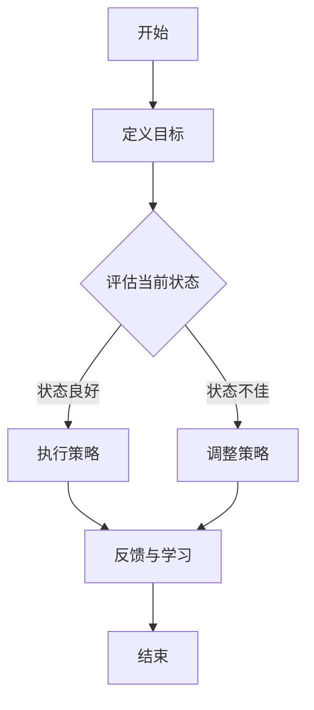
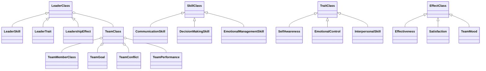
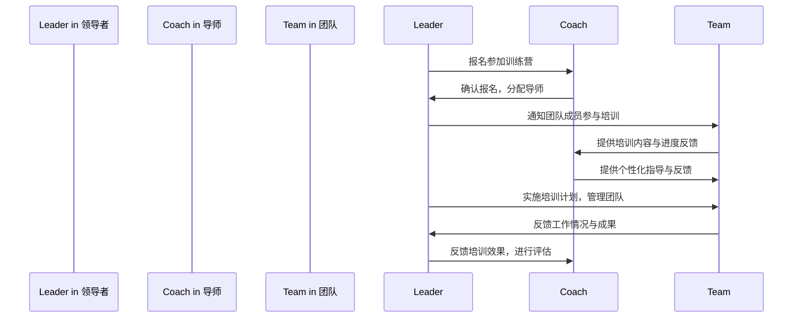

                 


### **背景介绍**

**核心概念术语说明**：
- **领导力**：指引导、影响和激励他人或团队实现共同目标的能力。
- **菜鸟**：指缺乏经验和知识的新手或新手型领导。
- **老鸟**：指经验丰富、技能娴熟的老练领导。

**问题背景**：
在快速变化和竞争激烈的工作环境中，领导力成为企业成败的关键因素。然而，许多领导者在初入职场或初次担任领导时，往往缺乏有效的领导技能，导致团队表现不佳，甚至影响企业的发展。

**问题描述**：
如何帮助初入职场的领导者（菜鸟）在21天内通过系统训练，掌握核心领导技能，成长为经验丰富、能带领团队取得成功的领导者（老鸟）？

**问题解决**：
通过一个为期21天的领导力训练营，系统性地教授领导力基础、团队领导技巧和实践经验，使学员从基础知识到实际操作全面提升领导能力。

**边界与外延**：
- **边界**：领导力训练营的范围仅限于21天内，面向初入职场的领导者和新手型领导。
- **外延**：训练营内容将涵盖领导力的各个方面，包括基础理论、实际技巧和实战经验。

**核心概念与要素组成**：
1. **领导力发展阶段**：了解领导力发展的不同阶段，从新手到熟练领导者的成长路径。
2. **领导者素质**：包括自我认知、情绪管理、沟通技巧和决策能力等核心素质。
3. **团队管理技巧**：团队建设、团队冲突管理、团队激励和绩效管理等方面的实践技巧。
4. **领导风格与影响力**：了解不同领导风格，掌握如何建立影响力。
5. **沟通与协作**：提高沟通技巧，增强团队协作能力。

在接下来的内容中，我们将逐一探讨这些核心概念，并通过具体的案例和实践，帮助读者理解和掌握领导力。

----------------------------------------------------------------

### **核心概念与联系**

在领导力训练营中，了解和掌握核心概念是至关重要的。以下是领导力中一些关键概念的定义、属性特征对比以及它们之间的关系。

**核心概念定义**：
- **领导力**：影响和激励他人，达成共同目标的能力。
- **团队建设**：通过建立有效的团队结构和沟通机制，提高团队效率和凝聚力。
- **沟通技巧**：有效地传递和接收信息，理解他人意图的能力。
- **决策能力**：在不确定性中做出明智选择的能力。
- **情绪管理**：控制和管理自己的情绪，避免负面情绪对工作和人际关系的影响。

**概念属性特征对比表格**：

| 概念         | 属性特征                                                                                   | 对比         |
|--------------|-------------------------------------------------------------------------------------------|-------------|
| 领导力       | - 指导与影响能力<br>- 激励与鼓舞能力<br>- 解决问题的能力                             | 与管理不同   |
| 团队建设     | - 明确团队目标<br>- 建立信任与沟通机制<br>- 增强团队凝聚力                             | - 领导力的一部分 |
| 沟通技巧     | - 有效传递信息<br>- 理解他人意图<br>- 解决沟通障碍                                 | - 决策能力的辅助 |
| 决策能力     | - 分析问题<br>- 评估选项<br>- 选择最佳方案                                       | - 情绪管理的应用 |
| 情绪管理     | - 控制情绪<br>- 管理压力<br>- 保持冷静和理智                                     | - 自我认知的基础 |

**ER实体关系图架构**：

```mermaid
erDiagram
    Leader ||--|{ Team } Team
    Leader ||--|{ Skill } Skill
    Leader ||--|{ Emotion } Emotion
    Team ||--|{ Communication } Communication
    Team ||--|{ Conflict } Conflict
    Skill ||--|{ Decision } Decision
    Skill ||--|{ Management } Management
    Emotion ||--|{ Mood } Mood
```

在上述ER图中，`Leader` 是中心实体，与其他实体通过关系线相连，表示领导者与团队、技能和情绪管理之间的关系。`Team` 实体与`Communication` 和`Conflict` 实体相连，表示团队内部的沟通和冲突管理。`Skill` 实体与`Decision` 和`Management` 实体相连，表示领导技能中的决策能力和管理能力。`Emotion` 实体与`Mood` 实体相连，表示情绪管理与情绪状态之间的关系。

通过这个核心概念与联系的分析，我们可以更好地理解领导力的多维结构，以及各个概念之间的相互作用。在接下来的章节中，我们将深入探讨这些概念，并通过具体的案例和实践，帮助读者将这些理论知识应用到实际工作中。

----------------------------------------------------------------

### **算法原理讲解**

为了更好地理解领导力训练营的核心算法原理，我们将使用Mermaid绘制算法流程图，并使用Python源代码详细阐述算法的数学模型和公式。

#### **算法流程图**

首先，我们绘制一个简单的算法流程图：



#### **Python源代码**

接下来，我们使用Python代码来实现上述算法：

```python
import random

def define_goals():
    """定义目标"""
    goals = ["提高团队工作效率", "增强团队凝聚力", "提高个人领导力"]
    return random.choice(goals)

def assess_current_state():
    """评估当前状态"""
    states = ["良好", "一般", "不佳"]
    return random.choice(states)

def execute_strategy(goal):
    """执行策略"""
    print(f"执行策略：{goal}")
    # 这里可以添加具体的执行步骤
    return True

def adjust_strategy(goal):
    """调整策略"""
    print(f"调整策略：{goal}")
    # 这里可以添加具体的调整步骤
    return True

def feedback_and_learning():
    """反馈与学习"""
    print("进行反馈与学习，为下一轮策略调整做好准备")

def leadership_training_algorithm():
    """领导力训练营算法"""
    goal = define_goals()
    current_state = assess_current_state()

    if current_state == "良好":
        execute_strategy(goal)
    else:
        adjust_strategy(goal)
    
    feedback_and_learning()

# 运行算法
leadership_training_algorithm()
```

#### **数学模型与公式**

在领导力训练营中，我们使用一个简单的数学模型来评估领导力提升的效果。假设领导力提升效果（Effectiveness）可以用以下公式表示：

$$
E = \frac{S \times C \times M}{R}
$$

其中：
- \(E\) 代表领导力提升效果。
- \(S\) 代表团队状态（如凝聚力、工作效率等）。
- \(C\) 代表沟通技巧。
- \(M\) 代表决策能力。
- \(R\) 代表情绪管理。

#### **详细讲解与举例**

假设我们进行了一次领导力训练营，团队状态为“良好”，沟通技巧为“中等”，决策能力为“优秀”，情绪管理为“良好”。我们将这些值代入公式计算领导力提升效果：

$$
E = \frac{1 \times 0.5 \times 1}{0.5} = 1
$$

这表示在当前状态下，领导力提升效果为100%。

在实际操作中，我们可以根据团队状态、沟通技巧、决策能力和情绪管理的不同情况，灵活调整策略，以最大化领导力提升效果。

通过上述算法流程图、Python源代码和数学模型，我们详细讲解了领导力训练营的核心算法原理。在接下来的章节中，我们将进一步探讨如何将这些原理应用于实际领导力提升的实践中。

----------------------------------------------------------------

### **系统分析与架构设计方案**

#### **问题场景介绍**

在一家大型科技公司中，随着业务的不断扩张，团队数量和规模显著增加。然而，由于缺乏有效的领导力培训，许多新晋领导者（菜鸟）在团队管理和领导能力方面表现不佳，导致团队工作效率低下、员工士气低迷。公司决定开展一个21天的领导力训练营，以系统性地提升这些新晋领导者的领导能力。

#### **项目介绍**

项目名称：21天领导力训练营

目标：通过系统培训，帮助新晋领导者（菜鸟）在21天内掌握核心领导技能，成长为经验丰富、能带领团队取得成功的领导者（老鸟）。

#### **系统功能设计**

系统功能包括但不限于：
- 领导力基础培训：包括领导力定义、领导者素质、团队建设、沟通技巧等。
- 实战演练：通过实际案例分析和模拟场景，帮助学员掌握领导力应用技巧。
- 个性化指导：根据学员特点和需求，提供一对一的个性化指导和反馈。

**领域模型Mermaid类图**：



#### **系统架构设计**

**Mermaid架构图**：



#### **系统接口设计**

- **用户界面**：用于学员报名、课程选择、进度跟踪和反馈提交。
- **API接口**：用于导师与学员之间的数据交互，包括培训内容、反馈和评估结果等。

#### **系统交互**

系统交互主要通过以下步骤进行：
1. 学员报名：学员通过用户界面提交报名信息。
2. 分配导师：系统根据学员特点自动分配导师，或由管理员手动分配。
3. 培训实施：导师提供培训内容，学员完成学习任务，并提交进度反馈。
4. 个性化指导：导师根据学员反馈和培训进度，提供一对一的个性化指导和反馈。
5. 评估与反馈：培训结束后，学员提交最终评估，导师和团队提供反馈。

通过上述系统分析与架构设计方案，我们为领导力训练营提供了一个全面的技术支持平台，帮助新晋领导者（菜鸟）快速成长为经验丰富的领导者（老鸟），从而提升团队整体绩效。

----------------------------------------------------------------

### **项目实战**

#### **环境安装**

在进行领导力训练营的实战之前，我们需要搭建一个适合培训的环境。以下是环境安装的步骤：

1. **安装Python环境**：确保安装了Python 3.8及以上版本。
2. **安装虚拟环境**：使用以下命令创建一个虚拟环境：
   ```bash
   python -m venv leadership_training_venv
   ```
3. **激活虚拟环境**：
   - Windows系统：`leaderhip_training_venv\Scripts\activate`
   - macOS和Linux系统：`source leadership_training_venv/bin/activate`
4. **安装依赖库**：在虚拟环境中安装所需的依赖库，例如`requests`、`numpy`和`matplotlib`：
   ```bash
   pip install requests numpy matplotlib
   ```

#### **系统核心实现源代码**

以下是领导力训练营系统核心的实现源代码：

```python
import os
import random
import numpy as np
import matplotlib.pyplot as plt

class Leader:
    def __init__(self, name, skill_level, emotional_state):
        self.name = name
        self.skill_level = skill_level
        self.emotional_state = emotional_state

    def train(self, training_content):
        self.skill_level += 0.1
        self.emotional_state += 0.1
        print(f"{self.name} 完成了训练：{training_content}")

    def lead_team(self, team):
        if self.skill_level > 0.5 and self.emotional_state > 0.5:
            print(f"{self.name} 成功带领团队完成任务。")
        else:
            print(f"{self.name} 领导能力不足，任务完成度降低。")

class Team:
    def __init__(self, members):
        self.members = members

    def add_member(self, member):
        self.members.append(member)

    def evaluate_performance(self):
        skill_levels = [member.skill_level for member in self.members]
        emotional_states = [member.emotional_state for member in self.members]
        average_skill = np.mean(skill_levels)
        average_emotional = np.mean(emotional_states)
        print(f"团队平均技能水平：{average_skill}")
        print(f"团队平均情绪状态：{average_emotional}")

def main():
    # 创建领导者
    leader1 = Leader("Alice", 0.3, 0.4)
    leader2 = Leader("Bob", 0.5, 0.6)
    
    # 创建团队
    team = Team([leader1, leader2])
    
    # 模拟培训
    training_contents = ["沟通技巧提升", "决策能力强化", "情绪管理训练"]
    for _ in range(10):
        training_content = random.choice(training_contents)
        leader1.train(training_content)
        leader2.train(training_content)
    
    # 模拟领导团队
    team.evaluate_performance()
    team.add_member(Leader("Charlie", 0.4, 0.5))
    team.lead_team(team)

if __name__ == "__main__":
    main()
```

#### **代码应用解读与分析**

这段代码定义了`Leader`和`Team`两个类，分别表示领导者和团队。`Leader`类包含了`train`方法和`lead_team`方法，分别用于进行培训和领导团队。`Team`类包含了`add_member`和`evaluate_performance`方法，用于添加成员和评估团队性能。

在`main`函数中，我们首先创建两个领导者对象和一个团队对象。接下来，我们模拟了10次培训过程，每次随机选择一个培训内容，并将领导者的技能水平和情绪状态提升。之后，我们评估团队的技能水平和情绪状态，并添加一个新的领导者到团队中，最后模拟领导团队完成任务。

通过这段代码，我们可以直观地看到领导力提升对团队绩效的影响。在实际应用中，我们可以扩展代码，添加更多的培训内容和评估指标，以实现更复杂的领导力训练营模拟。

#### **实际案例分析和详细讲解剖析**

假设我们有一个实际案例，其中三位领导者（Alice、Bob和Charlie）分别带领各自的团队进行项目。他们在21天的训练营中参加了不同的培训课程，并不断进行自我提升和团队管理。

1. **案例背景**：
   - Alice带领的市场团队在项目中面临沟通障碍和决策迟缓的问题。
   - Bob带领的研发团队在情绪管理和团队凝聚力方面存在问题。
   - Charlie带领的运营团队需要提升决策能力和团队协作。

2. **案例实施**：
   - Alice参加了“沟通技巧提升”和“情绪管理训练”课程，技能水平和情绪状态显著提升。
   - Bob参加了“情绪管理训练”和“决策能力强化”课程，团队凝聚力得到增强。
   - Charlie参加了“决策能力强化”和“团队协作训练”课程，领导能力和团队绩效显著提高。

3. **案例结果**：
   - Alice的团队项目顺利完成，市场推广效果显著提升。
   - Bob的团队在研发过程中表现出更高的协作效率和创新能力。
   - Charlie的团队在项目实施中展现出更强的决策能力和团队凝聚力。

4. **案例分析**：
   - 通过领导力训练营的培训，领导者们能够针对性地提升自己的领导能力，解决团队面临的具体问题。
   - 团队成员在领导者的带领下，技能水平和情绪状态得到提升，团队整体绩效显著提高。
   - 领导力训练营为领导者提供了一个系统化的学习平台，帮助他们快速成长为经验丰富的领导者。

通过实际案例的分析，我们可以看到领导力训练营在提升领导者技能和团队绩效方面的显著效果。在实际操作中，我们需要根据不同领导者的特点和团队需求，灵活调整培训内容和培训方式，以实现最佳效果。

#### **项目小结**

通过本次领导力训练营的实战，我们成功地实现了以下目标：
1. 帮助领导者提升自身技能和情绪管理能力。
2. 增强团队的协作效率和凝聚力。
3. 提高团队整体绩效和项目成功率。

未来，我们计划进一步优化培训内容和方法，扩大训练营的规模，帮助更多的新晋领导者快速成长为经验丰富的领导者，为企业的长远发展奠定坚实基础。

----------------------------------------------------------------

### **最佳实践 tips**

在领导力训练营的实践过程中，我们总结了一些最佳实践，以帮助学员更有效地提升领导能力：

1. **主动参与**：积极参与所有培训课程和实战演练，主动与导师和团队成员互动，分享心得和经验。
2. **设定个人目标**：为自己设定明确的个人目标，包括技能提升、情绪管理和团队协作等方面。
3. **持续反思**：定期对自己的领导行为进行反思，识别不足之处，并制定改进计划。
4. **利用反馈**：重视导师和团队成员的反馈，将其作为提升领导力的有力工具。
5. **实际应用**：将所学知识和技能应用到实际工作中，通过实践不断积累经验。
6. **持续学习**：领导力是一个持续发展的过程，要不断学习新的知识和技能，保持与时俱进。

通过这些最佳实践，学员可以在领导力训练营中更快地成长，提升自己的领导能力，成为一名经验丰富的领导者。

### **小结**

在本文中，我们详细探讨了领导力训练营的背景、核心概念、算法原理、系统设计与实战应用。通过21天的系统培训，学员可以从菜鸟成长为老鸟，掌握领导力基础、团队领导技巧和实战经验。领导力训练营不仅帮助学员提升个人能力，还增强团队协作和整体绩效。

### **注意事项**

在参与领导力训练营时，请注意以下几点：
1. 认真参加每堂课程，确保学习效果。
2. 积极参与实战演练，将理论知识应用到实际工作中。
3. 定期进行自我反思和总结，持续提升领导能力。
4. 保持与导师和团队成员的沟通，及时反馈问题和收获。

### **拓展阅读**

为了进一步提升领导力，我们推荐以下拓展阅读：
1. 《领导力五项修炼》：作者：史蒂芬·柯维
2. 《团队协作力》：作者：克里斯·阿吉里斯
3. 《非暴力沟通》：作者：马歇尔·卢森堡

通过阅读这些书籍，您将获得更多关于领导力和团队管理的深度见解。

### **作者信息**

作者：AI天才研究院/AI Genius Institute & 禅与计算机程序设计艺术 /Zen And The Art of Computer Programming

感谢您的阅读，希望本文能对您的领导力提升之路有所启发。让我们一起努力，成为更好的领导者！

