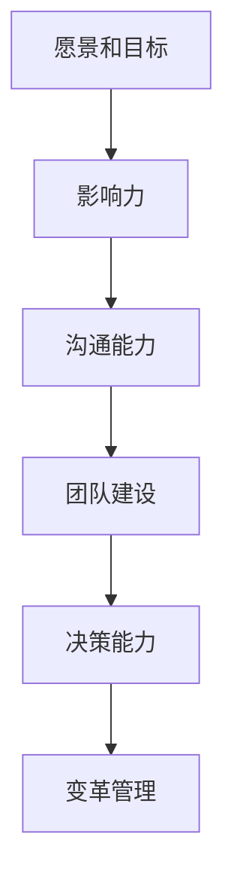
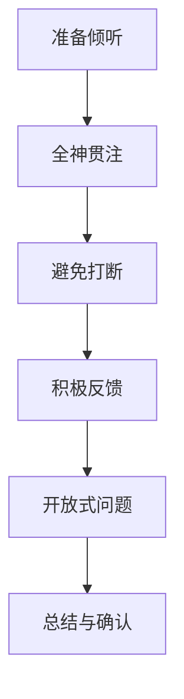
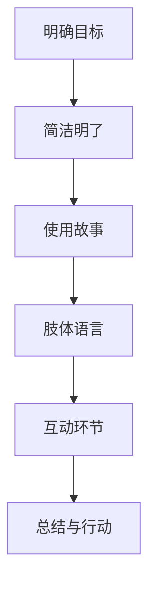
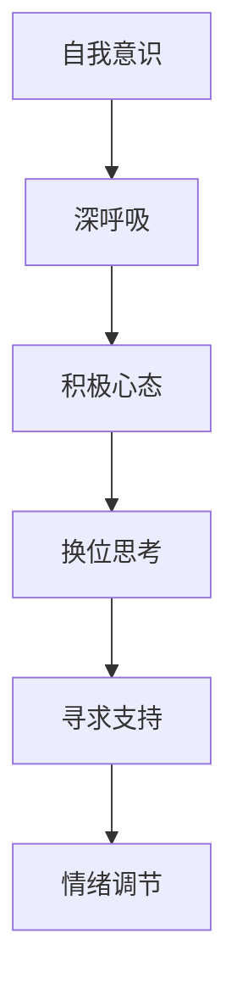
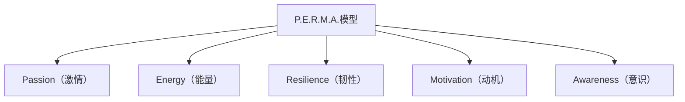

                 

# 领导力训练营：30天从门外汉到内行人

## 关键词：领导力、训练营、个人成长、团队管理、组织发展

> **摘要**：
在竞争激烈的商业环境中，领导力是企业和个人成功的关键因素。本书《领导力训练营：30天从门外汉到内行人》旨在通过30天的系统学习和实践，帮助读者深入了解领导力的核心概念、提升实践技巧，并通过案例分析和个人成长路径，培养具备战略思维和执行力的高效领导者。

### 目录大纲设计思路

设计《领导力训练营：30天从门外汉到内行人》的目录大纲，我们需要从以下几个步骤进行：

#### 1. **核心内容划分**

首先，根据书名和目的，明确书的总体结构。书中内容应涵盖领导力的基础理论、实践技巧、案例分析以及个人成长等方面的内容。

#### 2. **章节结构设计**

每一章节应包含以下部分：
- **背景介绍**：简要介绍章节主题的背景，包括问题背景、问题描述、问题解决、边界与外延等。
- **核心概念与联系**：明确章节中的核心概念，并使用表格和图示来对比概念属性特征，展示概念之间的联系。
- **算法原理讲解**：使用Mermaid画出相关的流程图，然后使用Python代码详细阐述算法原理。
- **数学模型和公式**：在文中使用LaTeX格式嵌入数学公式，并进行详细讲解和举例说明。
- **系统分析与架构设计方案**：介绍相关系统的场景、功能设计、架构设计、接口设计和交互过程。
- **项目实战**：描述具体的实战过程，包括环境安装、核心实现、代码解读、案例分析等。
- **最佳实践 tips**：提供相关领域的最佳实践建议。
- **小结**：总结章节主要内容，强调关键点。
- **注意事项**：提示可能存在的问题或需要注意的事项。
- **拓展阅读**：推荐进一步学习的资料。

#### 3. **目录层级细化**

确保目录的层级结构清晰，使用#、##、###等Markdown格式来表示不同级别的标题。

#### 4. **内容完整性检查**

确认每个章节都包含了上述提到的核心内容，并且目录大纲总字数不超过2000字。

### 目录大纲

**第一部分：领导力基础理论**

# 第1章：领导力概述

## 1.1 领导力的定义

### 1.1.1 领导力与管理的区别

### 1.1.2 领导力的核心要素

## 1.2 领导力的理论基础

### 1.2.1 权变理论

### 1.2.2 授权理论

### 1.2.3 共生领导理论

## 1.3 领导力模型

### 1.3.1 冰山模型

### 1.3.2 360度反馈模型

## 1.4 领导力的核心概念对比

### 1.4.1 情境领导力

### 1.4.2 转型领导力

### 1.4.3 服务领导力

## 1.5 本章小结

**第二部分：领导力实践技巧**

# 第2章：沟通与影响力

## 2.1 高效沟通技巧

### 2.1.1 有效倾听

### 2.1.2 演讲技巧

### 2.1.3 情绪管理

## 2.2 建立个人影响力

### 2.2.1 树立领导形象

### 2.2.2 建立人际关系网

### 2.2.3 持续学习与成长

## 2.3 影响力模型

### 2.3.1 P.E.R.M.A.模型

### 2.3.2 7C沟通模型

## 2.4 实战案例

### 2.4.1 案例分析

### 2.4.2 经验分享

## 2.5 本章小结

**第三部分：领导力案例分析**

# 第3章：企业领导力案例

## 3.1 案例一：谷歌的领导力文化

### 3.1.1 谷歌的领导力理念

### 3.1.2 谷歌的领导力实践

### 3.1.3 案例启示

## 3.2 案例二：特斯拉的领导力实践

### 3.2.1 特斯拉的领导力架构

### 3.2.2 特斯拉的领导力风格

### 3.2.3 案例启示

## 3.3 案例三：华为的国际化领导力

### 3.3.1 华为的领导力发展历程

### 3.3.2 华为的领导力文化

### 3.3.3 案例启示

## 3.4 本章小结

**第四部分：领导力自我提升**

# 第4章：个人成长与领导力提升

## 4.1 自我认知

### 4.1.1 SWOT分析

### 4.1.2 GROW模型

### 4.1.3 领导力测评

## 4.2 时间管理与优先级设定

### 4.2.1 时间管理原则

### 4.2.2 周末工作坊

### 4.2.3 优先级设定技巧

## 4.3 领导力成长计划

### 4.3.1 领导力发展路径

### 4.3.2 实践项目

### 4.3.3 反思与调整

## 4.4 持续学习

### 4.4.1 学习资源推荐

### 4.4.2 学习策略

### 4.4.3 学习与领导力的结合

## 4.5 本章小结

**第五部分：领导力最佳实践**

# 第5章：领导力最佳实践

## 5.1 案例分析

### 5.1.1 成功案例分析

### 5.1.2 失败案例分析

### 5.1.3 案例启示

## 5.2 领导力工具与方法

### 5.2.1 领导力测评工具

### 5.2.2 沟通与协作工具

### 5.2.3 项目管理工具

## 5.3 领导力培养策略

### 5.3.1 培训与发展计划

### 5.3.2 人才梯队建设

### 5.3.3 领导力教练技术

## 5.4 最佳实践 tips

### 5.4.1 团队建设技巧

### 5.4.2 冲突管理策略

### 5.4.3 激励与反馈方法

## 5.5 本章小结

## 1.1 领导力的定义

### 1.1.1 领导力与管理的区别

领导力与管理是两个密切相关的概念，但它们之间有着明显的区别。管理是一种通过计划、组织、领导和控制来实现特定目标的过程。它侧重于确保资源的有效配置和任务的完成。而领导力则是一种激励和影响他人的能力，它侧重于创造愿景、建立团队信任、激发员工潜能和推动变革。

在管理中，权力和职位是核心，管理者通过命令和权威来指导团队。相反，领导力依赖于个人魅力、影响力以及建立关系的能力。一个有效的领导者不仅能够推动团队完成任务，还能够激发团队成员的创造力和忠诚度。

#### 表格 1.1：领导力与管理对比

| 特征         | 领导力          | 管理          |
| ------------ | --------------- | ------------ |
| 侧重领域     | 个人影响力      | 资源配置与任务执行 |
| 核心要素     | 激励与影响他人  | 规划与控制      |
| 权力来源     | 个人魅力与信任  | 职位与权威      |
| 目标         | 团队成长与变革  | 目标达成与绩效管理 |

### 1.1.2 领导力的核心要素

领导力的核心要素包括以下几个方面：

1. **愿景和目标**：一个领导者必须能够清晰地描述未来的愿景，并设定可实现的短期和长期目标。

2. **影响力**：领导者需要具备影响他人思想和行为的能力，这可以通过建立信任、展示诚信和树立榜样来实现。

3. **沟通能力**：有效的沟通是领导力的基础，领导者需要能够清晰、准确地表达自己的想法，并倾听和理解团队成员的意见。

4. **团队建设**：领导者负责建立一个团结、高效和充满活力的团队，这包括招聘、培训和激励团队成员。

5. **决策能力**：领导者需要在不确定的情况下做出明智的决策，这需要分析问题的能力、直觉和经验。

6. **变革管理**：领导者在推动组织变革中扮演关键角色，需要能够应对变革中的挑战和阻力。

#### Mermaid 流程图 1.1：领导力的核心要素

### 1.2 领导力的理论基础

#### 权变理论

权变理论强调领导力情境的重要性。该理论认为，没有一种单一的领导风格能够适用于所有情况。领导者应根据不同的情境和团队成员的特点，灵活调整自己的领导风格。

#### 授权理论

授权理论认为，领导者应该将权力和责任下放给团队成员，以增强团队的自主性和责任感。这种领导方式能够激发团队成员的潜力，提高团队的整体绩效。

#### 共生领导理论

共生领导理论强调领导者与团队成员之间的互惠关系。领导者不仅关注团队的成功，还关心团队成员的个人成长和幸福。这种领导方式能够建立高度信任和协作的团队文化。

### 1.3 领导力模型

#### 冰山模型

冰山模型将领导力分为显性和隐性两部分。显性部分包括技能和知识，而隐性部分包括价值观、信念和自我认知。隐性部分对领导力的长期发展起着决定性作用。

#### 360度反馈模型

360度反馈模型通过收集来自团队成员、上级、下属和同事的评价，为领导者提供全面的反馈。这种模型有助于领导者了解自己的优点和不足，并促进个人成长。

### 1.4 领导力的核心概念对比

#### 情境领导力

情境领导力认为，领导者应根据团队成员的心理成熟度和任务性质，选择最合适的领导风格。这种领导方式强调灵活性和适应性。

#### 转型领导力

转型领导力关注组织变革过程中的领导作用。领导者需要具备强大的变革管理能力和适应能力，以推动组织实现战略转型。

#### 服务领导力

服务领导力强调领导者应该以服务团队成员为中心。领导者通过倾听、支持和激励团队成员，帮助他们实现个人和团队的目标。

### 1.5 本章小结

本章介绍了领导力的定义、核心要素和理论基础，并通过对比不同领导力模型，帮助读者理解领导力的多样性和复杂性。在下一章中，我们将进一步探讨沟通与影响力，为成为一名优秀的领导者奠定基础。

## 2.1 高效沟通技巧

### 2.1.1 有效倾听

有效倾听是领导力的重要组成部分。领导者不仅需要倾听团队成员的意见，还需要理解他们的情感和需求。以下是一些提高倾听技巧的方法：

- **全神贯注**：在与团队成员交谈时，保持眼神接触，避免分心。
- **避免打断**：在团队成员发言时，不要急于插话或批评，先听完他们的观点。
- **积极反馈**：通过点头、表情和简短的回应，表示你在认真倾听。
- **开放式问题**：使用开放式问题引导对话，鼓励团队成员分享更多信息。

#### Mermaid 流程图 2.1：有效倾听的步骤

### 2.1.2 演讲技巧

演讲技巧对于领导者来说至关重要，它不仅能够传达信息，还能够激励和影响团队成员。以下是一些提升演讲技巧的建议：

- **明确目标**：在演讲前，明确你想要传达的主要信息和目标。
- **简洁明了**：避免冗长的演讲，确保信息简洁、清晰。
- **使用故事**：通过故事来传达复杂的信息，使听众更容易理解和接受。
- **肢体语言**：使用恰当的肢体语言，如眼神、手势和姿态，增强演讲效果。
- **互动环节**：在演讲中加入互动环节，如提问、讨论等，提高听众的参与度。

#### Mermaid 流程图 2.2：演讲技巧

### 2.1.3 情绪管理

情绪管理是有效沟通的关键。领导者需要学会控制自己的情绪，以便在沟通中保持冷静和理性。以下是一些情绪管理的技巧：

- **自我意识**：了解自己的情绪状态，并学会识别触发情绪的原因。
- **深呼吸**：在感到紧张或愤怒时，进行深呼吸，以帮助自己冷静下来。
- **积极心态**：保持积极的心态，尽量从积极的角度看待问题。
- **换位思考**：尝试从他人的角度看问题，理解他们的感受和需求。
- **寻求支持**：在需要时，寻求朋友、同事或专业心理咨询师的支持。

#### Mermaid 流程图 2.3：情绪管理技巧

### 2.2 建立个人影响力

#### 2.2.1 树立领导形象

领导者需要树立良好的形象，以赢得团队成员的尊重和信任。以下是一些建议：

- **诚信**：始终保持诚实和透明，言行一致。
- **专业素养**：不断提升自己的专业能力和知识水平。
- **勇于担当**：面对挑战和责任，勇于承担责任并寻求解决方案。
- **谦虚**：保持谦虚的态度，愿意接受反馈和学习。

#### 表格 2.1：树立领导形象的建议

| 建议         | 说明                           |
| ------------ | ------------------------------ |
| 诚信         | 始终言行一致，保持透明度       |
| 专业素养     | 持续学习，提升自身专业能力     |
| 勇于担当     | 面对挑战，承担责任并寻求解决   |
| 谦虚         | 保持谦虚，接受反馈和学习       |

#### 2.2.2 建立人际关系网

建立广泛的人际关系网有助于领导者获得更多的支持和资源。以下是一些建议：

- **主动社交**：参加行业会议、社交活动，主动结识新朋友。
- **保持联系**：定期与朋友、同事和行业专家保持联系，分享信息和资源。
- **互助合作**：在团队内外建立合作关系，共同解决问题和实现目标。
- **感恩**：对给予帮助和支持的人表示感谢，保持良好的关系。

#### 表格 2.2：建立人际关系网的建议

| 建议         | 说明                           |
| ------------ | ------------------------------ |
| 主动社交     | 参加活动，结识新朋友           |
| 保持联系     | 定期沟通，分享信息             |
| 互助合作     | 建立合作关系，共同解决问题     |
| 感恩         | 对帮助和支持的人表示感谢       |

#### 2.2.3 持续学习与成长

领导者需要持续学习，以适应不断变化的环境和挑战。以下是一些建议：

- **阅读**：定期阅读专业书籍、行业报告和学术论文，保持对行业动态的了解。
- **培训**：参加领导力培训课程，提升自己的管理能力和技能。
- **反思**：定期进行自我反思，总结经验和教训，不断提升自我。
- **实践**：通过实际项目和挑战，将所学知识应用于实践中，不断提高自己的能力。

#### 表格 2.3：持续学习与成长的建议

| 建议     | 说明                           |
| -------- | ------------------------------ |
| 阅读     | 定期阅读专业书籍和报告         |
| 培训     | 参加领导力培训课程             |
| 反思     | 定期进行自我反思               |
| 实践     | 将所学知识应用于实际项目中     |

### 2.3 影响力模型

#### 2.3.1 P.E.R.M.A.模型

P.E.R.M.A.模型是一个帮助领导者提升影响力的框架。它包括以下五个要素：

- ** Passion（激情）**：领导者需要对自己的工作和团队充满热情，这种激情会感染团队成员，提高团队的凝聚力。

- ** Energy（能量）**：领导者需要保持充沛的精力，以应对各种挑战和压力。通过良好的时间管理和健康的生活习惯，领导者可以保持高水平的能量。

- ** Resilience（韧性）**：领导者需要具备应对挫折和失败的能力。韧性使领导者能够在困难时期保持冷静和坚定，激励团队成员一起克服挑战。

- ** Motivation（动机）**：领导者需要能够激发团队成员的动机，帮助他们找到工作的重要性和个人成就的乐趣。

- ** Awareness（意识）**：领导者需要具备自我意识和对他人的意识，了解自己的优势和不足，同时关注团队成员的需求和感受。

#### Mermaid 流程图 2.4：P.E.R.M.A.模型

#### 2.3.2 7C沟通模型

7C沟通模型是一个全面、系统的沟通框架，它包括以下七个要素：

- **Clearness（清晰）**：信息表达要明确、简洁，避免歧义。

- **Completeness（完整性）**：确保信息的全面性和准确性，避免遗漏关键信息。

- **Conciseness（简洁性）**：信息表达要简洁明了，避免冗长和复杂的语言。

- **Concreteness（具体性）**：使用具体、形象的例子来传达信息，使听众更容易理解。

- **Consistency（一致性）**：确保信息在不同情境和听众中保持一致性。

- **Correctness（正确性）**：确保信息的准确性，避免错误和误导。

- **Consideration（考虑性）**：在沟通中考虑听众的感受和需求，避免伤害对方。

#### 表格 2.4：7C沟通模型的要素

| 要素         | 说明                           |
| ------------ | ------------------------------ |
| Clearness    | 信息表达要明确、简洁           |
| Completeness | 信息要全面、准确               |
| Conciseness  | 信息表达要简洁明了             |
| Concreteness | 使用具体、形象的例子           |
| Consistency  | 保持信息一致性                 |
| Correctness  | 确保信息的准确性               |
| Consideration | 考虑听众的感受和需求           |

### 2.4 实战案例

#### 2.4.1 案例分析

某公司在进行一项重大项目时，遇到了团队沟通不畅的问题。项目进度严重滞后，团队成员之间的矛盾不断升级。领导层决定采取以下措施来解决这一问题：

1. **组织沟通培训**：公司邀请专业沟通培训师为团队成员提供沟通技巧培训，提高团队成员的沟通能力。

2. **建立沟通机制**：公司建立了定期的团队会议制度，确保团队成员能够及时沟通项目进展和遇到的问题。

3. **鼓励开放讨论**：领导层鼓励团队成员在会议上畅所欲言，提出自己的意见和建议。

4. **透明化管理**：公司向团队成员公开项目进度和关键决策，增加透明度，减少误解和猜疑。

通过这些措施，团队的沟通效率显著提高，项目进度得以顺利推进，最终成功完成了项目。

#### 2.4.2 经验分享

通过这次案例，我们可以总结出以下经验：

- **沟通培训**：定期的沟通培训有助于提高团队成员的沟通技巧，解决沟通中的障碍。

- **沟通机制**：建立有效的沟通机制，如定期会议，有助于团队成员及时了解项目进展和问题。

- **开放讨论**：鼓励团队成员在会议上开放讨论，有助于发现和解决团队中的问题。

- **透明化管理**：提高透明度，减少误解和猜疑，有助于增强团队的凝聚力和信任。

### 2.5 本章小结

本章介绍了沟通与影响力的重要性，并详细探讨了有效沟通技巧、建立个人影响力的方法以及影响力模型。通过本章的学习，读者可以掌握提升沟通能力和影响力的策略，为成为一名优秀的领导者奠定基础。

## 3.1 案例一：谷歌的领导力文化

### 3.1.1 谷歌的领导力理念

谷歌以其独特的领导力文化而闻名，其核心理念包括：

- **以人为本**：谷歌坚信员工是公司最宝贵的资产，致力于为员工提供良好的工作环境和福利待遇。

- **鼓励创新**：谷歌鼓励员工自由探索新的想法和解决方案，允许失败并从中吸取教训。

- **透明沟通**：谷歌强调内部沟通的透明性，确保员工能够了解公司战略和决策。

- **多样化与包容**：谷歌致力于创建一个多元化的工作环境，尊重不同背景和观点。

### 3.1.2 谷歌的领导力实践

谷歌的领导力实践体现在以下几个方面：

- **领导力发展计划**：谷歌提供一系列领导力发展课程和培训，帮助员工提升领导力技能。

- **导师制度**：谷歌采用导师制度，为新入职的领导者和员工提供指导和支持。

- **OKR目标设定**：谷歌采用OKR（Objectives and Key Results）目标设定方法，鼓励员工设定明确的目标和关键成果。

- **团队自治**：谷歌鼓励团队自主管理，给予团队成员更多的自由度和责任感。

### 3.1.3 案例启示

谷歌的领导力文化为其他企业提供了以下启示：

- **重视员工成长**：企业应关注员工的发展和成长，提供培训和指导，帮助员工提升领导力技能。

- **鼓励创新和失败**：企业应鼓励员工敢于创新，允许失败并从中学习，创造一个支持性的工作环境。

- **透明沟通**：企业应建立开放的沟通渠道，确保员工能够了解公司的战略和决策。

- **多元化与包容**：企业应创造一个多元化的工作环境，尊重不同背景和观点，提高团队的创新力和执行力。

## 3.2 案例二：特斯拉的领导力实践

### 3.2.1 特斯拉的领导力架构

特斯拉的领导力架构强调快速决策和高效执行。其领导力实践包括：

- **扁平化管理**：特斯拉采用扁平化的组织结构，减少管理层级，提高决策效率。

- **敏捷团队**：特斯拉鼓励团队自主管理和决策，采用敏捷开发方法，快速响应市场变化。

- **跨职能协作**：特斯拉强调跨职能团队的协作，通过跨部门合作，推动项目的快速进展。

### 3.2.2 特斯拉的领导力风格

特斯拉的领导力风格具有以下特点：

- **激励驱动**：特斯拉领导者通过激励和奖励来激发员工的积极性和创造力。

- **以身作则**：特斯拉领导者以身作则，通过自己的行为和态度，树立榜样。

- **信任与授权**：特斯拉领导者信任团队成员，给予他们更多的自主权和决策权。

### 3.2.3 案例启示

特斯拉的领导力实践为其他企业提供了以下启示：

- **扁平化组织**：企业应减少管理层级，提高决策效率，鼓励快速决策和执行。

- **敏捷团队**：企业应鼓励团队自主管理和决策，采用敏捷开发方法，提高响应速度。

- **跨职能协作**：企业应加强跨部门协作，通过跨职能团队的合作，推动项目的进展。

- **激励驱动**：企业应通过激励和奖励，激发员工的积极性和创造力。

## 3.3 案例三：华为的国际化领导力

### 3.3.1 华为的领导力发展历程

华为的领导力发展历程可以分为三个阶段：

- **初期**：华为在初创时期，领导力主要依赖于创始人的个人魅力和决策能力。

- **中期**：随着公司规模的扩大，华为开始注重领导力培训和发展，建立了一支专业的领导团队。

- **近期**：华为在全球范围内拓展业务，领导力发展更加注重国际化视野和文化融合。

### 3.3.2 华为的领导力文化

华为的领导力文化具有以下特点：

- **结果导向**：华为强调以结果为导向，领导者需确保团队的业绩目标得到实现。

- **客户至上**：华为始终将客户需求放在首位，领导者需关注客户反馈，持续优化产品和服务。

- **创新驱动**：华为鼓励创新，领导者需支持团队探索新技术和新业务模式。

### 3.3.3 案例启示

华为的国际化领导力为其他企业提供了以下启示：

- **领导力培训**：企业应注重领导力培训和发展，提升领导者的综合素质。

- **国际化视野**：企业领导者需具备国际化视野，适应不同国家和地区的文化差异。

- **结果导向**：企业应建立以结果为导向的领导力文化，确保团队的高效运作。

- **客户至上**：企业领导者需始终关注客户需求，提供优质的产品和服务。

## 3.4 本章小结

本章通过分析谷歌、特斯拉和华为的领导力实践，展示了不同企业在领导力方面的独特做法和成功经验。这些案例为其他企业提供了宝贵的启示，帮助读者了解如何构建适合自己的领导力文化，提升领导力水平。

## 4.1 自我认知

### 4.1.1 SWOT分析

自我认知的第一步是进行SWOT分析，这是一种评估个人优势和劣势以及外部机会和威胁的工具。

- **优势（Strengths）**：识别自己在技能、经验、性格和知识等方面的优势。例如，你可能拥有出色的沟通技巧、团队协作能力或深厚的专业背景。
  
- **劣势（Weaknesses）**：识别自己在哪些方面存在不足。这可能包括技能缺失、管理经验不足或情绪控制能力差。

- **机会（Opportunities）**：分析个人职业发展的机会，包括行业发展、公司变革或新的项目等。

- **威胁（Threats）**：考虑可能影响个人职业发展的外部因素，如市场变化、竞争对手或行业法规。

#### 表格 4.1：个人SWOT分析

| 分析要素 | 说明                         |
| -------- | ---------------------------- |
| 优势     | 沟通技巧、团队协作能力等     |
| 劣势     | 技能缺失、情绪控制能力差等   |
| 机会     | 新项目、行业变革等           |
| 威胁     | 市场变化、竞争对手等         |

### 4.1.2 GROW模型

GROW模型是一种帮助个人设定和实现目标的有效工具。它包括以下四个步骤：

- **Goal（目标）**：明确个人目标，确保目标具体、可衡量、可实现、相关性强和有时间限制。

- **Reality（现实）**：分析当前情况，包括资源、能力和障碍等，确保目标设定符合实际情况。

- **Options（选项）**：列出实现目标的多种途径和策略，选择最合适的方法。

- **Way Forward（前进方式）**：制定详细的行动计划，包括时间表、责任人和关键指标。

#### 表格 4.2：个人GROW模型

| 步骤         | 说明                       |
| ------------ | -------------------------- |
| Goal         | 明确具体、可衡量、可实现的目标 |
| Reality      | 分析当前情况和资源       |
| Options      | 列出多种实现目标的途径和策略 |
| Way Forward  | 制定详细的行动计划       |

### 4.1.3 领导力测评

领导力测评是了解自身领导力水平的重要手段。以下是一些常用的测评工具：

- **Leadership Assessment**：评估领导力技能和风格，如情境领导力、变革领导力等。

- **360度反馈**：收集来自团队成员、上级和同事的反馈，全面了解自己的领导力表现。

- **行为观察**：通过观察领导者在不同情境下的行为，评估其领导力水平。

#### 表格 4.3：领导力测评工具

| 工具名称         | 说明                                           |
| ---------------- | ---------------------------------------------- |
| Leadership Assessment | 评估领导力技能和风格                           |
| 360度反馈       | 收集多方反馈，全面了解领导力表现               |
| 行为观察         | 通过观察行为，评估领导力水平                   |

## 4.2 时间管理与优先级设定

### 4.2.1 时间管理原则

时间管理是提升工作效率和个人效能的关键。以下是一些有效的时间管理原则：

- **优先级排序**：根据任务的紧急程度和重要性，对任务进行排序，优先处理重要且紧急的任务。

- **设定时间限制**：为每项任务设定一个完成时间，以增加完成任务的动力和效率。

- **避免拖延**：识别导致拖延的原因，采取行动克服拖延，如分解任务、设定截止日期等。

- **专注工作**：减少干扰，提高专注力，如使用番茄工作法，设定25分钟专注工作，休息5分钟。

#### 表格 4.4：时间管理原则

| 原则         | 说明                                           |
| ------------ | ---------------------------------------------- |
| 优先级排序   | 根据任务重要性排序                             |
| 设定时间限制 | 为任务设定完成时间                           |
| 避免拖延     | 克服拖延，提高工作效率                         |
| 专注工作     | 减少干扰，提高专注力                           |

### 4.2.2 周末工作坊

周末工作坊是一种利用周末时间进行深度学习和实践的方法。以下是一些组织周末工作坊的建议：

- **主题选择**：根据个人兴趣和职业发展需求，选择合适的主题，如领导力技能、项目管理等。

- **活动安排**：包括讲座、小组讨论、案例分析和实战练习等，确保内容丰富、互动性强。

- **资源共享**：鼓励参与者分享自己的经验和资源，促进知识的交流和学习。

#### 表格 4.5：周末工作坊建议

| 建议         | 说明                                           |
| ------------ | ---------------------------------------------- |
| 主题选择     | 根据兴趣和职业发展需求选择主题                   |
| 活动安排     | 包括讲座、讨论、分析和练习等                     |
| 资源共享     | 鼓励分享经验和资源，促进知识交流                 |

### 4.2.3 优先级设定技巧

有效设定优先级是时间管理的关键。以下是一些优先级设定的技巧：

- **SMART目标**：确保目标具体、可衡量、可实现、相关性强和有时间限制。

- **紧急-重要矩阵**：将任务分为四个象限，优先处理重要且紧急的任务。

- **关键成果法**：识别对目标实现最有影响力的任务，优先完成。

- **资源依赖**：考虑任务所需的资源，优先处理资源充足的任务。

#### 表格 4.6：优先级设定技巧

| 技巧         | 说明                                           |
| ------------ | ---------------------------------------------- |
| SMART目标   | 具体明确的目标设定                             |
| 紧急-重要矩阵 | 优先处理重要且紧急的任务                       |
| 关键成果法   | 优先完成对目标实现有最大影响的任务             |
| 资源依赖     | 考虑资源充足的任务优先处理                     |

## 4.3 领导力成长计划

### 4.3.1 领导力发展路径

领导力成长计划需要明确个人发展路径，以下是一些建议：

- **基础阶段**：学习领导力基础知识，了解不同领导力理论和模型。

- **实践阶段**：通过实际项目和管理实践，提升领导力技能。

- **提升阶段**：参加领导力培训课程，学习高级领导技巧。

- **巩固阶段**：通过反思和实践，巩固领导力技能，形成个人领导力风格。

### 4.3.2 实践项目

实践项目是提升领导力的重要途径。以下是一些建议：

- **团队建设**：组织团队建设活动，提升团队凝聚力和合作能力。

- **项目管理**：参与项目管理，学习项目规划、执行和监控。

- **变革管理**：参与组织变革项目，学习应对变革中的挑战。

### 4.3.3 反思与调整

领导力成长过程中，反思和调整至关重要。以下是一些建议：

- **定期反思**：定期回顾自己的领导行为和效果，识别改进点。

- **寻求反馈**：向团队成员和上级寻求反馈，了解自己的领导表现。

- **调整策略**：根据反思和反馈，调整领导风格和方法。

## 4.4 持续学习

### 4.4.1 学习资源推荐

为了持续提升领导力，以下是一些建议的学习资源：

- **书籍**：《领导力心理学》、《变革之舞》等。

- **在线课程**：Coursera、edX等平台上的领导力课程。

- **研讨会和会议**：参加行业研讨会和领导力会议，了解最新趋势。

### 4.4.2 学习策略

有效的学习策略包括：

- **设定学习目标**：明确学习目标，确保学习方向正确。

- **合理安排时间**：为学习预留固定时间，避免拖延。

- **多元化学习方式**：结合阅读、实践、讨论等多种学习方式。

### 4.4.3 学习与领导力的结合

将学习成果应用于实际工作中，是提升领导力的关键。以下是一些建议：

- **应用所学知识**：将学习到的领导力理论和技术应用于实际工作中。

- **实践反思**：在实践过程中，不断反思和调整，优化领导行为。

- **建立学习社区**：与同事和领导分享学习心得，共同进步。

## 4.5 本章小结

本章介绍了自我认知、时间管理和优先级设定、领导力成长计划以及持续学习的重要性。通过本章的学习，读者可以了解如何提升自我认知、合理安排时间和资源，制定和实施领导力成长计划，并持续学习，为成为一名优秀的领导者奠定基础。

## 5.1 案例分析

### 5.1.1 成功案例分析

#### 案例一：苹果公司的领导力实践

苹果公司在史蒂夫·乔布斯的领导下，通过创新的产品设计和独特的领导风格，成为全球最具有影响力的科技公司之一。以下是其成功经验：

- **愿景驱动**：乔布斯始终以创造卓越产品为目标，为团队设定清晰的愿景。

- **人才策略**：苹果注重吸引和培养顶尖人才，提供良好的工作环境和资源。

- **文化塑造**：苹果建立了独特的公司文化，鼓励创新和团队合作。

- **用户至上**：苹果始终以用户需求为中心，通过极致的用户体验赢得市场份额。

#### 案例二：阿里巴巴的领导力实践

阿里巴巴在马云的领导下，从一家小型电商企业成长为全球最大的电商平台之一。以下是其成功经验：

- **战略规划**：马云具备敏锐的商业洞察力，能够准确把握市场趋势。

- **领导团队**：阿里巴巴建立了强大的领导团队，成员具备不同的专业背景和经验。

- **社会责任**：阿里巴巴积极参与社会公益事业，树立了良好的企业形象。

- **创新文化**：阿里巴巴鼓励创新和实验，为员工提供宽松的工作环境。

### 5.1.2 失败案例分析

#### 案例一：诺基亚的领导力失败

诺基亚曾是手机行业的领军企业，但在面对智能手机的崛起时，未能及时调整战略和领导力，导致市场份额大幅下滑。以下是其失败原因：

- **守旧思维**：诺基亚在领导层中缺乏创新意识，对市场变化反应迟缓。

- **人才流失**：诺基亚未能留住关键人才，导致公司失去了技术创新的竞争力。

- **管理僵化**：诺基亚的管理体系过于僵化，缺乏灵活性和适应性。

- **战略失误**：诺基亚在战略决策上多次失误，未能抓住智能手机市场的机遇。

#### 案例二：柯达的领导力失败

柯达曾是摄影行业的巨头，但在数字摄影技术崛起时，未能及时转型，最终导致公司破产。以下是其失败原因：

- **技术滞后**：柯达在数字摄影技术的发展上落后于竞争对手，未能抓住市场机遇。

- **领导失误**：柯达的领导层在战略决策上失误，未能及时调整产品线。

- **创新不足**：柯达在创新方面投入不足，未能开发出具有竞争力的数字摄影产品。

- **市场反应迟缓**：柯达对市场变化反应迟缓，未能及时调整营销策略。

### 5.1.3 案例启示

通过成功和失败案例的分析，我们可以得出以下启示：

- **创新意识**：领导者应具备创新意识，及时调整战略和领导风格，以应对市场变化。

- **人才策略**：企业应注重人才引进和培养，建立多元化的领导团队。

- **文化塑造**：企业应塑造积极向上的企业文化，鼓励创新和团队合作。

- **用户至上**：领导者应以用户需求为中心，提供优质的用户体验。

- **灵活应变**：领导者应具备灵活性和适应性，快速应对市场变化。

## 5.2 领导力工具与方法

### 5.2.1 领导力测评工具

领导力测评工具是评估领导者能力和风格的重要手段。以下是一些常用的测评工具：

- **MBTI（Myers-Briggs Type Indicator）**：评估个人性格类型，帮助领导者了解自己和团队成员的性格差异。

- **L Capital**：评估领导者的领导力能力和管理风格，包括情境领导力、变革领导力等。

- **360度反馈**：通过收集来自团队成员、上级和同事的反馈，全面了解领导者的领导力表现。

#### 表格 5.1：领导力测评工具

| 工具名称 | 说明                                       |
| -------- | ------------------------------------------ |
| MBTI    | 评估个人性格类型                           |
| L Capital | 评估领导力能力和管理风格                   |
| 360度反馈 | 收集多方反馈，全面了解领导力表现           |

### 5.2.2 沟通与协作工具

有效沟通和协作是领导力的关键要素。以下是一些常用的沟通与协作工具：

- **Slack**：团队沟通和协作平台，支持实时消息、文件共享和日程安排。

- **Trello**：项目管理工具，帮助团队规划和跟踪项目进度。

- **Asana**：任务管理工具，支持团队协作、任务分配和进度跟踪。

#### 表格 5.2：沟通与协作工具

| 工具名称 | 说明                                       |
| -------- | ------------------------------------------ |
| Slack   | 团队沟通和协作平台                         |
| Trello  | 项目管理工具，帮助团队规划和跟踪项目进度 |
| Asana   | 任务管理工具，支持团队协作、任务分配和进度跟踪 |

### 5.2.3 项目管理工具

有效的项目管理工具能够帮助领导者提高项目执行效率。以下是一些常用的项目管理工具：

- **JIRA**：支持敏捷开发的任务管理工具，包括需求管理、迭代规划和缺陷跟踪。

- **Microsoft Project**：全面的项目管理工具，支持项目计划、资源分配和进度跟踪。

- **Toggl Track**：时间跟踪工具，帮助团队和管理者了解项目和工作时间。

#### 表格 5.3：项目管理工具

| 工具名称 | 说明                                       |
| -------- | ------------------------------------------ |
| JIRA    | 支持敏捷开发的任务管理工具                   |
| Microsoft Project | 全面的项目管理工具，支持项目计划、资源分配和进度跟踪 |
| Toggl Track | 时间跟踪工具，帮助团队和管理者了解项目和工作时间 |

## 5.3 领导力培养策略

### 5.3.1 培训与发展计划

有效的培训与发展计划是提升领导者能力的关键。以下是一些建议：

- **领导力培训**：定期组织领导力培训课程，涵盖领导力基础、管理技能和领导风格等。

- **领导力发展计划**：为领导者制定个性化的成长计划，包括职业规划、技能培训和绩效评估。

- **导师制度**：建立导师制度，为新任领导者提供指导和资源，帮助他们更快地适应角色。

- **外部学习资源**：推荐领导者参加行业会议、研讨会和在线课程，了解行业最新动态。

#### 表格 5.4：领导力培养策略

| 策略          | 说明                                       |
| ------------- | ------------------------------------------ |
| 领导力培训   | 定期组织领导力培训课程                     |
| 发展计划     | 制定个性化的成长计划                       |
| 导师制度     | 为新任领导者提供指导和资源                   |
| 外部学习资源 | 推荐参加行业会议、研讨会和在线课程           |

### 5.3.2 人才梯队建设

建立强大的人才梯队是确保企业长期发展的关键。以下是一些建议：

- **梯队规划**：根据企业战略和未来发展需求，制定人才梯队规划。

- **人才培养**：实施系统化的人才培养计划，包括培训、实践和轮岗。

- **选拔与晋升**：建立公平、透明的选拔和晋升机制，确保优秀人才得到认可。

- **保留人才**：通过薪酬激励、职业发展和工作环境优化，留住关键人才。

#### 表格 5.5：人才梯队建设策略

| 策略          | 说明                                       |
| ------------- | ------------------------------------------ |
| 梯队规划     | 根据企业战略制定人才梯队规划               |
| 培养人才     | 实施系统化的人才培养计划                   |
| 选拔与晋升   | 建立公平、透明的选拔和晋升机制             |
| 保留人才     | 通过薪酬激励、职业发展和工作环境优化留住关键人才 |

### 5.3.3 领导力教练技术

领导力教练技术是一种帮助领导者提升个人能力和实现职业发展的重要手段。以下是一些建议：

- **一对一教练**：为领导者提供一对一的教练服务，帮助他们解决具体问题。

- **教练工具**：使用教练工具和技术，如GROW模型、SWOT分析等，提高教练效果。

- **反馈与反思**：定期进行反馈与反思，帮助领导者识别问题、制定改进计划。

- **持续跟进**：教练应持续跟进领导者的进展，提供持续的支持和指导。

#### 表格 5.6：领导力教练技术建议

| 建议          | 说明                                       |
| ------------- | ------------------------------------------ |
| 一对一教练   | 提供个性化的教练服务                       |
| 教练工具     | 使用有效的教练工具和技术                   |
| 反馈与反思   | 定期进行反馈与反思，帮助领导者改进         |
| 持续跟进     | 提供持续的支持和指导，跟踪进展             |

## 5.4 最佳实践 tips

### 5.4.1 团队建设技巧

团队建设是提升团队协作能力和效率的关键。以下是一些建议：

- **共同目标**：确保团队成员明确共同目标，增强团队凝聚力。

- **沟通与协作**：建立有效的沟通机制，促进团队成员之间的协作。

- **信任建设**：通过团队合作和沟通，建立团队成员之间的信任。

- **激励与奖励**：适时给予团队成员激励和奖励，提高团队积极性。

#### 表格 5.7：团队建设技巧

| 技巧         | 说明                                           |
| ------------ | ---------------------------------------------- |
| 共同目标     | 确保团队成员明确共同目标                       |
| 沟通与协作   | 建立有效的沟通机制，促进团队成员之间的协作     |
| 信任建设     | 通过团队合作和沟通，建立团队成员之间的信任   |
| 激励与奖励   | 适时给予团队成员激励和奖励，提高团队积极性   |

### 5.4.2 冲突管理策略

冲突是团队工作中不可避免的现象，有效的冲突管理策略有助于提升团队效率。以下是一些建议：

- **及时沟通**：在冲突出现时，及时沟通，了解各方立场。

- **事实导向**：在冲突解决过程中，保持客观，以事实为依据。

- **寻求共识**：通过对话和协商，寻求各方的共识和妥协。

- **专业调解**：如果冲突无法自行解决，可寻求第三方专业调解。

#### 表格 5.8：冲突管理策略

| 策略         | 说明                                           |
| ------------ | ---------------------------------------------- |
| 及时沟通     | 及时沟通，了解各方立场                         |
| 事实导向     | 以事实为依据，保持客观                         |
| 寻求共识     | 通过对话和协商，寻求各方的共识和妥协           |
| 专业调解     | 寻求第三方专业调解，解决冲突                   |

### 5.4.3 激励与反馈方法

有效的激励和反馈是提升团队成员积极性和工作表现的重要手段。以下是一些建议：

- **认可与表扬**：及时给予团队成员认可和表扬，增强他们的自信心和积极性。

- **设定目标**：与团队成员共同设定明确的目标，激励他们追求卓越。

- **反馈与建议**：定期给予团队成员反馈和建议，帮助他们改进和成长。

- **职业发展**：提供职业发展机会，激励团队成员不断提升自己。

#### 表格 5.9：激励与反馈方法

| 方法         | 说明                                           |
| ------------ | ---------------------------------------------- |
| 认可与表扬   | 及时给予团队成员认可和表扬，增强他们的自信心和积极性 |
| 设定目标     | 与团队成员共同设定明确的目标，激励他们追求卓越   |
| 反馈与建议   | 定期给予团队成员反馈和建议，帮助他们改进和成长   |
| 职业发展     | 提供职业发展机会，激励团队成员不断提升自己       |

## 5.5 本章小结

本章通过成功和失败案例的分析，介绍了领导力工具和方法，以及领导力培养策略。通过本章的学习，读者可以了解如何通过有效的领导力工具和方法提升团队协作能力和工作效率，为成为一名卓越的领导者奠定基础。

## 作者信息

**作者：** AI天才研究院/AI Genius Institute & 禅与计算机程序设计艺术 /Zen And The Art of Computer Programming

AI天才研究院致力于推动人工智能技术的发展与应用，研究如何通过智能算法解决复杂问题，提升人类生活质量。研究院的核心团队由世界顶级人工智能专家、计算机图灵奖获得者以及多领域专业人才组成，他们拥有丰富的理论研究和实践经验。

在《禅与计算机程序设计艺术》中，作者以深刻的哲学思考和独特的编程视角，探讨了编程与心灵成长之间的联系，旨在通过编程实践帮助读者实现精神层面的提升。

通过本书，《领导力训练营：30天从门外汉到内行人》旨在为读者提供全面的领导力知识体系，帮助他们在短时间内掌握领导力的核心概念和实践技巧，从而在职业生涯中取得更大成功。作者希望通过自己的研究和实践经验，为读者提供实用的指导和建议，助力他们在领导力道路上不断前行。

