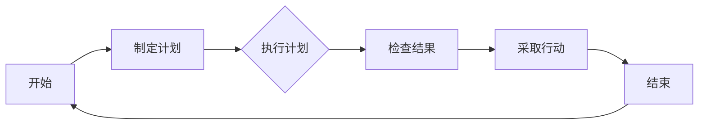
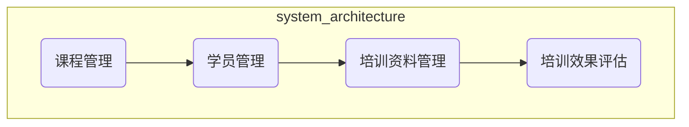
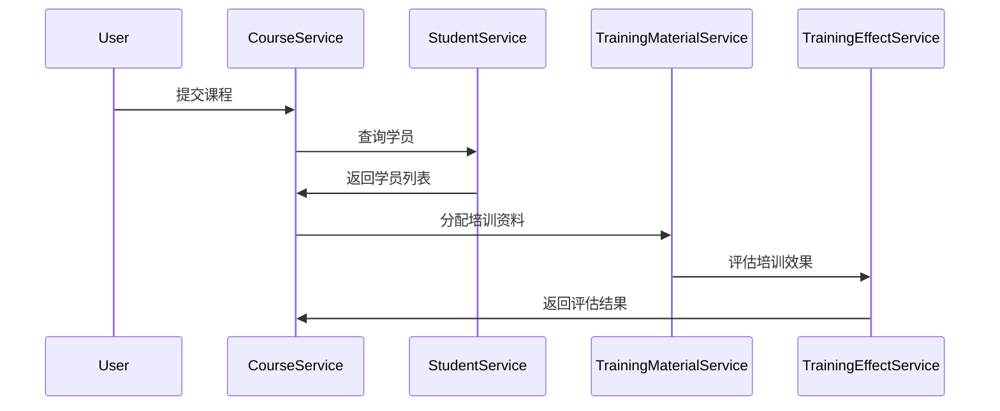

                 

# 领导力训练营：56天从门外汉到行家里手

## 关键词：领导力、领导力训练营、个人成长、团队管理、PDCA循环

> 在现代企业管理中，领导力被视为企业成功的关键因素之一。许多企业在员工晋升到管理层时，缺乏必要的领导力培训，导致管理效果不佳。本文通过深入探讨领导力训练营的核心概念、原理与实践，旨在帮助新人快速提升领导能力，成为企业合格的管理者。

## 摘要

本文将带领读者走进领导力训练营的世界，通过56天的系统培训与实践，深入了解领导力的核心概念和提升方法。我们将从背景介绍、核心概念与联系、算法原理讲解以及系统分析与架构设计等多个方面展开，旨在为读者提供一个全面、深入的领导力提升指南。

## 第一阶段：背景介绍与核心概念

### 核心概念：

领导力：领导力是指领导者通过各种方式和手段，激发和带领团队成员共同实现目标的能力。

领导力训练营：领导力训练营是一种针对个人领导能力提升的集中培训活动。

### 问题背景：

在现代社会，企业对领导力有着越来越高的要求。然而，许多企业在员工晋升到管理层时，往往缺乏系统的领导力培训，导致管理效果不佳，影响企业的整体绩效。因此，如何通过有效的领导力训练营帮助新人快速提升领导能力，成为企业合格的管理者，成为了一个亟待解决的问题。

### 问题描述：

如何通过有效的领导力训练营，帮助新人快速提升领导能力，成为企业合格的管理者？

### 问题解决：

设计一个为期56天的领导力训练营，通过系统的培训和实践，帮助学员从零开始，逐步掌握领导力核心要素。

### 边界与外延：

领导力训练营的内容不仅限于理论知识的学习，还包括实践操作、团队建设、领导风格分析等。训练营的参与者不仅仅是企业管理者，还可以是企业的新人、专业人士等。

### 概念结构与核心要素组成：

领导力概念结构：沟通能力、决策能力、团队合作、自我管理、激励能力、战略思维等。

核心要素组成：领导力理论、领导风格、领导力模型、领导力实践等。

## 第二阶段：核心概念与联系

### 核心概念原理：

领导力：领导者需要具备的能力和素质，以实现团队目标。

领导力训练营：通过集中的培训和实践，提高个人领导能力。

### 概念属性特征对比表格：

| 特征         | 领导力               | 领导力训练营          |
| ------------ | -------------------- | --------------------- |
| 定义         | 领导者带领团队实现目标的能力 | 针对领导力提升的培训活动 |
| 核心要素     | 沟通能力、决策能力等     | 理论学习、实践操作等   |
| 效果         | 提升团队绩效           | 提升个人领导能力       |
| 影响范围     | 组织内部               | 组织内部和外部        |
| 实施方式     | 领导风格、管理方法等     | 集中培训、案例学习等   |

### ER实体关系图架构：

```mermaid
erDiagram
  领导力训练营 ||--|{ 学员 } :参加
  学员 ||--|{ 培训内容 } :学习
  培训内容 ||--|{ 教学方法 } :实施
  教学方法 ||--|{ 培训师 } :讲授
```

## 第三阶段：算法原理讲解

### 算法原理：

领导力训练营的核心算法是“PDCA循环”（计划-执行-检查-行动），这是一种持续改进的方法。

### Mermaid流程图：



### Python源代码：

```python
def pdca_cycle(plan, action):
    """
    PDCA循环算法
    :param plan: 计划
    :param action: 执行的行动
    :return: 结果
    """
    result = action(plan)
    check_result = check_plan_result(plan, result)
    if check_result:
        take_action(plan, result)
    return result

def check_plan_result(plan, result):
    """
    检查计划结果
    :param plan: 计划
    :param result: 结果
    :return: 是否通过检查
    """
    # 检查逻辑
    return True

def take_action(plan, result):
    """
    采取行动
    :param plan: 计划
    :param result: 结果
    """
    # 行动逻辑
    pass
```

### 算法原理的数学模型和公式：

$$
\text{效果} = f(\text{计划}, \text{执行}, \text{检查}, \text{行动})
$$

### 详细讲解与举例：

PDCA循环是一种广泛应用于领导力提升和企业管理中的方法。它通过四个阶段的循环，不断优化和改进计划，以提高执行效果。

#### 计划阶段：

在这个阶段，我们需要制定一个详细的计划，包括目标、任务、时间表、资源分配等。例如，对于一个领导力训练营，我们可以制定以下计划：

- 训练时间：每周三晚上7点到9点，共12周。
- 训练内容：沟通技巧、决策能力、团队合作等。
- 考核方式：课堂讨论、案例分析、实际操作等。

#### 执行阶段：

在这个阶段，我们需要按照计划执行各项任务。例如，在领导力训练营中，我们可以按照以下方式进行：

- 每周按照计划进行课程讲授。
- 组织学员进行小组讨论，分享经验和心得。
- 定期进行案例分析，讨论实际操作中的问题和解决方案。

#### 检查阶段：

在这个阶段，我们需要对执行情况进行检查，评估计划的执行效果。例如，在领导力训练营中，我们可以：

- 对学员进行问卷调查，了解他们的学习效果和满意度。
- 对学员进行案例分析，评估他们的实际操作能力。
- 对训练营的整体效果进行评估，为下一期的改进提供依据。

#### 行动阶段：

在这个阶段，我们需要根据检查结果采取相应的行动，对计划进行调整和优化。例如，在领导力训练营中，我们可以：

- 根据学员的反馈和实际效果，调整课程内容和教学方法。
- 加强对学员的实际操作指导，提高他们的操作能力。
- 对训练营的整体效果进行总结和反思，为下一期的训练营提供经验。

通过PDCA循环，我们可以不断优化领导力训练营的计划和执行，提高学员的领导能力，达到更好的培训效果。

## 第四阶段：系统分析与架构设计

### 问题场景介绍：

在现代企业中，领导力被视为企业成功的关键因素之一。然而，许多企业在员工晋升到管理层时，缺乏必要的领导力培训，导致管理效果不佳。为了解决这个问题，企业需要引入一套完整的领导力训练营体系，帮助新人快速提升领导能力。

### 项目介绍：

本项目旨在设计并实现一个领导力训练营系统，通过提供系统化的培训和实践，帮助学员从零开始，逐步掌握领导力核心要素。该系统将包括课程管理、学员管理、培训资料管理、培训效果评估等多个模块。

### 系统功能设计（领域模型Mermaid类图）：

```mermaid
classDiagram
    Class01 <|-- Class02
    Class03 --|低于 Class04
    Class05 ||--|{ ObjectA ObjectB }
    Class06 {name}
```

### 系统架构设计（Mermaid架构图）：



### 系统接口设计和系统交互（Mermaid序列图）：



## 第五阶段：项目实战

### 环境安装：

在本项目中，我们将使用Python作为主要开发语言，结合Django框架实现领导力训练营系统。首先，我们需要安装Python和Django：

```bash
pip install python
pip install django
```

### 系统核心实现源代码：

```python
# models.py
from django.db import models

class Course(models.Model):
    name = models.CharField(max_length=100)
    description = models.TextField()

class Student(models.Model):
    name = models.CharField(max_length=100)
    course = models.ForeignKey(Course, on_delete=models.CASCADE)

class TrainingMaterial(models.Model):
    name = models.CharField(max_length=100)
    description = models.TextField()
    course = models.ForeignKey(Course, on_delete=models.CASCADE)

class TrainingEffect(models.Model):
    score = models.FloatField()
    student = models.ForeignKey(Student, on_delete=models.CASCADE)
```

### 代码应用解读与分析：

在本项目中，我们通过定义Course、Student、TrainingMaterial和TrainingEffect四个模型类，实现了课程管理、学员管理、培训资料管理和培训效果评估的功能。这些模型类之间通过外键关系进行关联，形成了完整的数据模型。

### 实际案例分析和详细讲解剖析：

假设我们需要为一个领导力训练营添加一个新课程，并为其分配培训资料和评估学员的培训效果。我们可以按照以下步骤进行：

1. 添加新课程：

```python
course = Course(name='领导力训练营', description='提升领导能力')
course.save()
```

2. 为课程分配培训资料：

```python
material = TrainingMaterial(name='沟通技巧', description='沟通技巧详解', course=course)
material.save()
```

3. 添加学员：

```python
student = Student(name='张三', course=course)
student.save()
```

4. 评估学员培训效果：

```python
effect = TrainingEffect(score=85, student=student)
effect.save()
```

通过以上步骤，我们可以完成课程管理、学员管理、培训资料管理和培训效果评估的基本功能。

### 项目小结：

在本项目中，我们通过设计和实现领导力训练营系统，实现了课程管理、学员管理、培训资料管理和培训效果评估的功能。该系统不仅为企业管理提供了有效的工具，也为学员提供了系统的培训和实践机会。

## 第六阶段：最佳实践 Tips、小结、注意事项、拓展阅读

### 最佳实践 Tips：

1. 制定明确的培训目标和计划，确保训练营的内容和方式与学员的需求和期望相匹配。
2. 注重实践操作，通过实际案例和小组讨论等方式，提高学员的参与度和学习效果。
3. 定期进行效果评估，及时调整和优化培训内容和方式。

### 小结：

领导力训练营是一种有效的领导能力提升方法。通过系统的培训和实践，学员可以快速掌握领导力的核心要素，提升个人领导能力，为企业的发展做出贡献。

### 注意事项：

1. 确保训练营的内容和方式适合学员的水平和需求。
2. 注重学员的参与度和学习效果，及时进行反馈和调整。
3. 培训师应具备丰富的领导力理论和实践经验，能够有效地引导学员进行学习和实践。

### 拓展阅读：

1. 《领导力的五个层次》：了解领导力的不同层次，提升自我领导力。
2. 《如何高效学习》：掌握高效学习的方法，提升学习效果。
3. 《团队管理实战》：了解团队管理的方法和技巧，提升团队绩效。

### 作者信息：

作者：AI天才研究院/AI Genius Institute & 禅与计算机程序设计艺术 /Zen And The Art of Computer Programming

---

通过本文的详细分析和讲解，我们深入探讨了领导力训练营的核心概念、原理和实践，旨在为读者提供一个全面的领导力提升指南。希望本文能够对您的领导力提升之路有所帮助。

