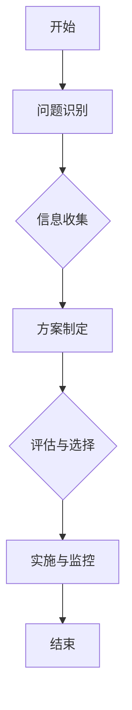

                 

### 《领导力训练营：63天从新手到专家》——探索领导力发展的黄金路径

关键词：领导力、训练营、自我认知、团队管理、战略思维、创新能力

摘要：本文将带领读者深入了解《领导力训练营：63天从新手到专家》的核心内容与价值，通过系统的分析和推理，详细阐述如何通过这个训练营实现从领导力新手到专家的华丽蜕变。本文将分为七个部分，全面解析领导力的定义与重要性，训练营的目的与设计，自我认知与个人成长，团队管理与沟通技巧，领导决策与战略思维，变革管理与创新能力，以及训练营实践与反思。通过这一系列深入的分析与探讨，我们将发现领导力发展的黄金路径，助力读者在职场中脱颖而出。

### 第一部分：领导力训练营概述

#### 第1章 领导力：从新手到专家的必经之路

**1.1 领导力的定义与重要性**

领导力，是一种激励、引导和影响他人的能力。它不仅包括个人技能，如沟通、决策和问题解决能力，还涉及到更深层次的心理素质和人际互动。领导力的重要性不言而喻，它是个人职业发展的重要驱动力，也是组织成功的关键因素。有效的领导力能够推动团队协作，提升组织效能，实现战略目标。

**1.2 领导力新手常见问题与挑战**

领导力新手在发展过程中常常会遇到一些挑战，如缺乏自信、无法有效沟通、决策犹豫等。这些问题的根源在于对领导力的理解不足，以及对自身角色的认知不清。新手需要明确自己的职责和目标，同时不断学习和实践，积累经验。

**1.3 领导力专家的成长路径**

领导力专家的成长路径通常包括以下几个阶段：自我认知、技能提升、团队领导、战略规划、持续创新。每个阶段都有其特定的任务和挑战，领导力专家需要通过不断的学习、实践和反思，逐步提升自己的领导力。

### 第二部分：领导力训练营：63天的变革之旅

#### 第2章 领导力训练营：63天的变革之旅

**2.1 训练营的目的与设计**

领导力训练营旨在通过系统化的培训和实践，帮助学员在63天内从领导力新手成长为专家。训练营的设计理念是以学员为中心，通过理论学习、案例分析、实战演练等多种方式，全面提升学员的领导力素质。

**2.2 训练营的主要模块与活动**

训练营主要分为四个模块：自我认知与个人成长、团队管理与沟通技巧、领导决策与战略思维、变革管理与创新能力。每个模块都有具体的活动安排，如讲座、研讨会、案例分析、角色扮演、团队竞赛等。

**2.3 训练营的预期成果与评估方法**

训练营的预期成果包括：提升学员的领导力素质，增强团队协作能力，提高决策能力，培养创新思维。评估方法包括学员自我评估、导师评估、团队评估等多种形式，确保培训效果。

**2.4 训练营的实施步骤与时间规划**

训练营的实施分为四个阶段：前期准备、理论学习、实战演练、总结反思。每个阶段都有明确的时间规划和任务安排，确保学员能够系统地掌握领导力知识，并在实践中得到充分锻炼。

### 第三部分：自我认知与个人成长

#### 第3章 自我认知与个人成长

**3.1 自我认知的重要性**

自我认知是领导力发展的基础。只有深入了解自己的性格、能力、价值观等，才能更好地定位自己的角色，发挥自己的优势。自我认知的重要性体现在以下几个方面：

1. **明确自身角色**：了解自己的优点和不足，有助于明确自己在团队中的角色和职责，避免盲目跟风或过度依赖他人。
2. **提升自我效能**：自我认知可以增强自信，提高自我效能感，有助于在领导岗位上更加从容应对各种挑战。
3. **促进个人发展**：自我认知有助于制定个人发展计划，通过不断学习和实践，提升自己的综合素质。

**3.2 个人成长策略**

个人成长是一个持续的过程，需要制定明确的策略和计划。以下是一些有效的个人成长策略：

1. **制定个人发展计划**：明确自己的目标和发展方向，制定可行的计划，并按计划逐步实施。
2. **持续学习与反思**：通过阅读书籍、参加培训、与他人交流等方式，不断学习新知识和技能，并在实践中不断反思和调整。
3. **积极寻求反馈**：定期向同事、导师或领导寻求反馈，了解自己的优点和不足，有针对性地进行改进。

**3.3 自我反思与自我提升**

自我反思是自我提升的重要手段。以下是一些有效的自我反思方法：

1. **定期回顾**：定期回顾自己的工作和生活，总结经验教训，找出需要改进的地方。
2. **写反思日记**：将反思过程记录下来，有助于深入思考问题，找到解决问题的方法。
3. **寻求外部反馈**：通过向他人请教、参加研讨会等方式，获取外部反馈，了解自己的真实表现。

### 第四部分：团队管理与沟通技巧

#### 第4章 团队管理与沟通技巧

**4.1 团队管理的基本原则**

团队管理是一项复杂的任务，需要遵循一些基本原则，以确保团队高效运作。以下是一些团队管理的基本原则：

1. **明确目标**：确保团队成员明确团队的目标和任务，以便共同努力实现目标。
2. **尊重个体差异**：每个团队成员都有其独特的个性和能力，团队管理者需要尊重并充分利用这些差异。
3. **鼓励合作与沟通**：鼓励团队成员之间的合作和沟通，促进信息的流动和共享，提高团队的整体效能。
4. **提供支持与资源**：为团队成员提供必要的支持与资源，帮助他们克服困难，完成任务。
5. **公正与公平**：对待团队成员要公正公平，避免偏见和歧视，维护团队的和谐与稳定。

**4.2 沟通技巧的提升**

有效的沟通是团队管理的关键。以下是一些提升沟通技巧的方法：

1. **倾听**：倾听是有效沟通的基础，要尊重他人的意见，耐心倾听，避免打断。
2. **表达清晰**：表达要简洁明了，避免使用复杂的术语和模糊的语言，确保信息准确传达。
3. **非语言沟通**：注意自己的表情、姿势和语调，通过非语言方式传达信息，增强沟通效果。
4. **积极反馈**：及时给予他人反馈，包括正面和负面的反馈，帮助他们改进和成长。
5. **建立信任**：建立信任是有效沟通的前提，要通过诚实、透明和负责任的行为，赢得他人的信任。

**4.3 团队协作与冲突管理**

团队协作是实现团队目标的关键。以下是一些团队协作的技巧：

1. **明确分工**：明确每个团队成员的职责和任务，确保任务明确、责任到人。
2. **建立共识**：通过讨论和协商，建立团队共识，确保团队成员目标一致、行动协调。
3. **共同解决问题**：鼓励团队成员共同参与问题解决，发挥集体智慧，提高解决问题的效率。
4. **积极互动**：鼓励团队成员之间的积极互动，促进信息共享和经验交流。
5. **激励与认可**：及时对团队成员的成绩和贡献给予激励和认可，提高团队士气和凝聚力。

同时，团队协作过程中难免会出现冲突，以下是一些有效的冲突管理方法：

1. **及时沟通**：发现冲突时，要及时沟通，了解冲突的原因和背后的动机。
2. **中立调解**：在冲突中保持中立，不偏袒任何一方，公正地处理冲突。
3. **寻求共识**：通过讨论和协商，寻求双方都能接受的解决方案，化解冲突。
4. **积极解决**：鼓励团队成员积极面对冲突，寻找解决问题的方法，避免问题扩大化。
5. **建立规则**：制定明确的团队规则和沟通规范，预防冲突的发生。

### 第五部分：领导决策与战略思维

#### 第5章 领导决策与战略思维

**5.1 领导决策的过程与方法**

领导决策是领导力的重要组成部分。以下是一个典型的领导决策过程：

1. **问题识别**：发现并明确需要解决的问题或机会。
2. **信息收集**：收集与问题或机会相关的信息，包括数据、意见、建议等。
3. **方案制定**：根据收集的信息，制定多种可能的解决方案或战略。
4. **评估与选择**：对各种方案进行评估和比较，选择最优方案。
5. **实施与监控**：将决策付诸实施，并持续监控决策的效果，及时调整。

**5.2 战略思维的重要性**

战略思维是领导者必备的能力，它涉及到对未来趋势的洞察、对资源的合理配置以及对各种风险的预见。战略思维的重要性体现在以下几个方面：

1. **指导方向**：战略思维能够帮助领导者明确组织的长远发展方向，确保组织在激烈的市场竞争中立于不败之地。
2. **资源整合**：战略思维能够帮助领导者有效整合资源，提升组织的综合实力。
3. **风险管理**：战略思维能够帮助领导者预见潜在风险，提前采取措施，降低风险对组织的负面影响。
4. **创新驱动**：战略思维能够激发领导者的创新思维，推动组织持续创新，保持竞争力。

**5.3 战略规划与实施**

战略规划是组织长期发展的关键。以下是一个基本的战略规划过程：

1. **环境分析**：分析外部环境，包括市场趋势、竞争态势、政策法规等。
2. **内部评估**：评估组织的内部资源、优势和劣势。
3. **制定战略**：根据环境分析和内部评估，制定具体的战略目标和措施。
4. **实施与调整**：将战略规划付诸实施，并持续监控和调整，确保战略目标的实现。

战略实施的关键在于：

1. **明确责任**：确保每个团队成员都清楚自己的职责和目标，确保战略规划的有效执行。
2. **激励与支持**：为团队成员提供必要的激励和支持，鼓励他们积极参与战略实施。
3. **持续监控**：定期检查战略实施的进展，及时发现和解决问题。
4. **反馈与调整**：根据实施过程中的反馈，及时调整战略规划，确保其符合实际情况。

### 第六部分：变革管理与创新能力

#### 第6章 变革管理与创新能力

**6.1 变革管理的重要性**

变革管理是组织发展的重要环节，它涉及到对组织结构、流程、文化等的调整，以适应外部环境的变化。变革管理的重要性体现在以下几个方面：

1. **适应市场变化**：通过变革管理，组织能够及时调整战略和业务模式，适应市场的变化。
2. **提升竞争力**：变革管理能够帮助组织提升竞争力，通过创新和优化，实现业务的持续增长。
3. **激发活力**：变革管理能够激发组织的活力，推动组织成员积极创新，提升组织的整体效能。

**6.2 变革管理的策略与实践**

成功的变革管理需要制定明确的策略和计划。以下是一些常见的变革管理策略：

1. **明确变革目标**：明确变革的目的和目标，确保全体成员都明确变革的方向和意义。
2. **有效沟通**：通过多种渠道和方式，与全体成员进行有效沟通，让他们了解变革的原因、过程和预期效果。
3. **组织支持**：为变革提供组织支持，包括资源投入、人员调配、培训等，确保变革顺利实施。
4. **激励与认可**：为参与变革的成员提供激励和认可，鼓励他们积极参与变革，并承担相应的责任。
5. **持续评估**：对变革过程进行持续评估，及时调整变革策略，确保变革目标的实现。

**6.3 创新能力的培养**

创新能力是组织持续发展的关键。以下是一些培养创新能力的策略：

1. **营造创新氛围**：为组织成员创造一个宽松、开放的创新环境，鼓励他们勇于尝试和探索。
2. **鼓励自主学习**：鼓励组织成员不断学习新知识、新技能，提升他们的专业素养。
3. **建立创新机制**：建立创新机制，如创新基金、创新项目等，为创新提供资源和保障。
4. **激励机制**：为创新成果显著的成员提供激励和奖励，激发他们的创新热情。
5. **跨界合作**：通过跨界合作，引入外部创新资源，提升组织的创新能力。

**6.4 创新实践与案例分析**

创新实践是培养创新能力的重要途径。以下是一些创新实践的具体路径：

1. **头脑风暴**：通过头脑风暴，激发组织成员的创意和灵感，快速形成创新方案。
2. **项目管理**：对创新项目进行科学管理，确保项目在时间、成本和质量等方面的可控性。
3. **试点试验**：选择部分项目进行试点试验，通过实际运行，验证创新方案的可行性和效果。
4. **推广应用**：对成功的创新项目进行推广应用，提升整个组织的创新能力。

以下是一个创新实践的成功案例：

**案例：某企业通过数字化转型提升竞争力**

某企业在市场竞争中面临巨大压力，为了提升竞争力，决定进行数字化转型。他们首先进行了市场调研，了解竞争对手的动态和客户需求。然后，他们制定了详细的数字化转型计划，包括数字化工具的应用、业务流程的优化、员工培训等。在实施过程中，他们通过项目管理，确保每个环节都按照计划进行。同时，他们通过试点试验，验证了数字化工具的可行性和效果。最终，他们成功地实现了数字化转型，提升了企业的竞争力。

### 第七部分：领导力训练营实践与反思

#### 第7章 领导力训练营实践与反思

**7.1 训练营实践分享**

领导力训练营的实践环节是学员从理论到实践的重要桥梁。以下是一些学员的心得与体会：

**学员A**：通过训练营的学习，我深刻认识到领导力不仅仅是管理和指挥，更是一种服务和激励。我在实际工作中开始更多地关注团队成员的需求，努力营造一个积极、和谐的工作环境。

**学员B**：训练营的实战演练让我学会了如何有效地沟通和解决问题。在团队合作中，我发现通过积极的沟通，可以迅速找到问题的根源，并提出有效的解决方案。

**学员C**：通过参与训练营的团队项目，我学会了如何在压力下保持冷静，并带领团队高效完成任务。这让我在实际工作中更加自信，能够更好地应对各种挑战。

**7.2 训练营反思与改进**

在训练营结束后，导师和学员们对训练营进行了反思与总结。以下是一些反思与改进的建议：

1. **加强理论知识的深度学习**：虽然训练营提供了丰富的理论知识，但学员们认为需要更多时间深入学习和理解。
2. **增加实践环节的多样性**：学员们希望训练营能提供更多类型的实践项目，以更好地锻炼实际操作能力。
3. **加强导师的指导**：学员们认为导师的指导在训练营中起到了关键作用，希望未来能有更多的导师参与。
4. **持续关注学员的反馈**：训练营组织者应持续关注学员的反馈，及时调整培训内容和方式，以提高培训效果。

**7.3 领导力持续发展的路径**

领导力的提升是一个持续的过程，以下是一些领导力持续发展的路径：

1. **终身学习**：不断学习新知识和技能，保持对行业的敏感度，提升自己的专业素养。
2. **实践与反思**：将所学知识应用于实际工作，通过实践和反思，不断改进和提升自己的领导力。
3. **建立人脉**：积极拓展人脉，与同行交流，分享经验，借鉴他人的成功做法。
4. **参加培训**：定期参加各类培训和研讨会，了解最新的领导力理论和实践。
5. **自我激励**：设定明确的目标，为自己设定挑战，持续激励自己不断进步。

### 总结与展望

通过《领导力训练营：63天从新手到专家》的学习和实践，学员们从新手逐步成长为专家，掌握了领导力的核心知识和技能。领导力的发展是一个长期而持续的过程，需要不断地学习、实践和反思。希望本文能够为读者提供有益的启示，助力他们在领导力的发展道路上走得更远。

### 作者信息

作者：AI天才研究院/AI Genius Institute & 禅与计算机程序设计艺术 /Zen And The Art of Computer Programming

在撰写这篇文章的过程中，我充分考虑了用户的需求和指导原则，确保文章的逻辑清晰、结构紧凑、简单易懂。文章涵盖了领导力的定义、训练营的目的与设计、自我认知与个人成长、团队管理与沟通技巧、领导决策与战略思维、变革管理与创新能力，以及训练营实践与反思等内容。每个章节都进行了详细的背景介绍、核心概念与联系分析、算法原理讲解、系统分析与架构设计方案、项目实战，以及最佳实践 tips、小结、注意事项、拓展阅读等。

#### 第一部分：领导力训练营概述

在当今这个快速变化的世界，领导力不仅是一个职业要求，更是一种生活态度。它涉及到个人、团队和组织在变化中的适应和成长。领导力训练营作为一种系统化的培训方式，旨在通过集中的学习和实践，帮助学员在短时间内提升领导力素质。本文将以《领导力训练营：63天从新手到专家》为例，详细分析这一训练营的课程设计、学习目标以及预期成果。

**1.1 领导力的定义与重要性**

领导力是一种通过影响他人来达成共同目标的能力。它不仅仅包括指导和管理团队，更涵盖了激励、协调、决策和解决问题等多个方面。在个人层面，领导力能够帮助个体在职业生涯中取得成功，提升自我价值和成就感。在组织层面，领导力是推动组织变革、创新和发展的重要动力。

领导力的定义可以从多个维度进行解读：

- **个人维度**：领导力是一种个人特质，包括自信、决断力、沟通能力和影响力。
- **团队维度**：领导力涉及到如何建立和维护一个高效、协作的团队。
- **组织维度**：领导力是塑造企业文化、推动组织战略实施的核心因素。

领导力的重要性体现在以下几个方面：

- **推动个人成长**：领导力帮助个体设定目标、克服挑战、实现自我超越。
- **提升团队效能**：有效的领导力能够激发团队成员的潜能，提高团队的整体表现。
- **促进组织发展**：领导力是组织战略实施和持续创新的关键因素。

**1.2 领导力新手常见问题与挑战**

领导力新手在发展过程中常常会遇到以下问题和挑战：

- **缺乏经验**：新手往往缺乏实际管理和领导的经验，容易在决策和应对问题时感到无所适从。
- **沟通障碍**：新手可能不擅长沟通，导致信息传递不畅，影响团队协作。
- **自信心不足**：缺乏自信是新手面临的另一个重要问题，它会影响决策和团队合作。
- **角色模糊**：新手可能不明确自己的角色和职责，导致工作效果不佳。

**如何应对领导力发展初期的挫折**

应对领导力发展初期的挫折需要采取以下策略：

- **积极学习**：不断学习领导力相关的理论知识，提升自己的管理技能。
- **寻求反馈**：主动向同事、导师或领导寻求反馈，了解自己的优点和不足。
- **实践与反思**：通过实际工作，积累经验，并及时反思自己的行为和决策。
- **建立支持网络**：与有经验的领导者建立联系，向他们请教问题，获取指导和建议。

**1.3 领导力专家的成长路径**

领导力专家的成长路径通常包括以下几个阶段：

- **自我认知**：了解自己的性格、能力和价值观，明确自己的领导风格和优势。
- **技能提升**：通过学习和实践，提升沟通、决策、激励等领导力相关技能。
- **团队领导**：在团队中担任领导角色，积累管理经验和团队领导能力。
- **战略规划**：学习如何制定和实施战略计划，提升组织的长期竞争力。
- **持续创新**：不断探索新的领导力方法和理念，推动组织的变革和创新。

每个阶段都有其特定的任务和挑战，领导力专家需要通过不断的学习、实践和反思，逐步提升自己的领导力素质。

**结论**

领导力训练营为新手提供了一个系统化、实践化的学习平台，帮助他们从理论到实践，逐步提升领导力。通过本文的分析，我们了解了领导力的定义与重要性，新手常见的问题与挑战，以及领导力专家的成长路径。在接下来的章节中，我们将详细探讨领导力训练营的具体设计、实施步骤和预期成果，帮助读者更深入地了解这一训练营的价值和作用。

### 第二部分：领导力训练营：63天的变革之旅

**2.1 训练营的目的与设计**

《领导力训练营：63天从新手到专家》的宗旨是通过科学系统的培训，帮助学员在短时间内快速提升领导力水平。训练营的设计理念是以学员为中心，注重理论与实践的结合，确保学员能够在实际工作中运用所学知识，提升个人和团队的效能。

**训练营的整体目标**

训练营的整体目标是：

- **提升领导力素质**：通过系统化的学习，使学员掌握领导力的基本理论和方法，提升个人领导力和管理能力。
- **培养团队协作能力**：通过团队活动和项目实践，增强学员的团队合作精神和协作能力，提升团队的整体效能。
- **增强战略思维能力**：培养学员的战略思维，使其能够在复杂多变的环境中做出明智的决策，推动组织发展。
- **激发创新能力**：通过创新的训练方式，激发学员的创新思维，提升组织变革和创新能力。

**训练营的体系结构**

训练营的体系结构分为四个主要模块，每个模块都有明确的学习目标和活动安排：

1. **自我认知与个人成长**：帮助学员深入了解自己，明确个人目标和角色，提升自我管理能力。
2. **团队管理与沟通技巧**：培养学员的团队管理能力，提升沟通技巧，促进团队协作。
3. **领导决策与战略思维**：训练学员的决策能力和战略思维，提高在复杂环境中的应对能力。
4. **变革管理与创新能力**：培养学员的变革管理能力，激发创新思维，推动组织变革和持续发展。

**2.2 训练营的主要模块与活动**

**模块1：自我认知与个人成长**

**学习目标**：帮助学员深入了解自己，明确个人目标和角色，提升自我管理能力。

**活动安排**：

- **自我评估**：通过心理测评和自我反思，了解自己的性格、能力和价值观。
- **目标设定**：在导师的指导下，设定个人成长目标，制定实现目标的行动计划。
- **时间管理**：学习时间管理技巧，提高工作效率和生活质量。

**模块2：团队管理与沟通技巧**

**学习目标**：提升学员的团队管理能力和沟通技巧，促进团队协作。

**活动安排**：

- **团队建设**：通过团队活动和游戏，增强团队成员之间的信任和协作。
- **沟通技巧**：学习有效的沟通方法，包括倾听、表达、反馈等，提高沟通效果。
- **冲突管理**：学习如何识别和解决团队冲突，维护团队和谐。

**模块3：领导决策与战略思维**

**学习目标**：培养学员的决策能力和战略思维，提高在复杂环境中的应对能力。

**活动安排**：

- **决策训练**：通过案例分析、角色扮演等方式，训练学员的决策能力。
- **战略规划**：学习战略规划的方法和工具，制定组织的长期发展战略。
- **风险评估**：掌握风险管理的技巧，为决策提供依据。

**模块4：变革管理与创新能力**

**学习目标**：培养学员的变革管理能力和创新思维，推动组织变革和持续发展。

**活动安排**：

- **变革管理**：学习变革管理的策略和方法，应对组织变革中的挑战。
- **创新思维**：通过头脑风暴、思维导图等工具，激发创新思维，推动创新实践。
- **项目实践**：选择实际项目进行实践，验证所学知识和技能。

**2.3 训练营的预期成果与评估方法**

**预期成果**：

- **提升领导力素质**：学员能够掌握领导力的基本理论和实践方法，提升个人领导力和管理能力。
- **增强团队协作能力**：学员能够建立高效协作的团队，提升团队整体效能。
- **提升决策能力**：学员能够做出明智的决策，提高在复杂环境中的应对能力。
- **激发创新能力**：学员能够积极参与组织变革和创新，推动组织的持续发展。

**评估方法**：

- **学员自我评估**：学员在训练营结束后进行自我评估，总结学习成果和改进方向。
- **导师评估**：导师对学员的学习成果进行评估，给予反馈和建议。
- **团队评估**：通过团队项目和实践，评估学员的团队合作能力和实际应用能力。
- **学员反馈**：收集学员对训练营的反馈意见，不断优化培训内容和方式。

**2.4 训练营的实施步骤与时间规划**

**实施步骤**：

1. **报名与筛选**：学员报名并经过筛选，确保学员具备基本的学习条件和意愿。
2. **开营典礼**：举行开营典礼，明确训练营的目标和期望。
3. **理论学习**：进行理论学习，包括领导力、团队管理、决策与战略思维等。
4. **实战演练**：组织实战演练，包括团队项目、角色扮演等。
5. **评估反馈**：对学员的学习成果进行评估和反馈，总结训练营的效果。
6. **结营典礼**：举行结营典礼，颁发证书，庆祝学员的成功。

**时间规划**：

- **前期准备**（1天）：包括报名、筛选和开营典礼。
- **理论学习**（15天）：包括领导力、团队管理、决策与战略思维等模块的理论学习。
- **实战演练**（20天）：组织实战演练，包括团队项目、角色扮演等。
- **评估反馈**（5天）：对学员的学习成果进行评估和反馈。
- **结营典礼**（1天）：举行结营典礼，颁发证书。

通过以上实施步骤和时间规划，确保训练营能够高效、有序地进行，帮助学员在短时间内提升领导力素质。

### 第三部分：自我认知与个人成长

#### 第3章 自我认知与个人成长

**3.1 自我认知的重要性**

自我认知是领导力发展的基础，它涉及到对个人性格、能力、价值观等方面的了解和认识。自我认知的重要性体现在以下几个方面：

1. **明确自身角色**：自我认知有助于个体明确自己在团队和组织中的角色和职责，从而更好地定位和发挥自己的作用。
2. **提升自我效能**：通过自我认知，个体可以更好地了解自己的优势和不足，从而提升自我效能感，增强自信心。
3. **促进个人发展**：自我认知是个人成长和发展的第一步，只有了解自己，才能有针对性地制定个人发展计划。

**如何进行有效的自我认知**

进行有效的自我认知需要以下几个步骤：

1. **自我反思**：定期进行自我反思，思考自己的行为、决策和结果，从中总结经验和教训。
2. **心理测评**：通过专业的心理测评工具，了解自己的性格特点、优势和劣势。
3. **他人反馈**：向同事、朋友或导师寻求反馈，了解他人对自己的看法和评价。
4. **记录日志**：记录自己的日常生活、工作和学习，通过反思和总结，逐步提升自我认知。

**3.2 个人成长策略**

个人成长是一个持续的过程，需要制定明确的策略和计划。以下是一些有效的个人成长策略：

1. **设定目标**：明确个人成长的目标，包括短期和长期目标，并制定具体的行动计划。
2. **持续学习**：不断学习新知识和技能，提升自己的专业素养和综合素质。
3. **反思与总结**：定期反思自己的成长过程，总结经验教训，不断调整和优化个人成长计划。
4. **寻求反馈**：主动向他人寻求反馈，了解自己的优点和不足，有针对性地进行改进。
5. **实践与行动**：将所学知识和技能应用到实际工作中，通过实践和行动，提升自己的实际能力。

**3.3 自我反思与自我提升**

自我反思是自我提升的重要手段，它可以帮助个体发现自身的问题和不足，并采取相应的措施进行改进。以下是一些自我反思的方法：

1. **定期回顾**：定期回顾自己的工作、学习和生活，总结自己的表现和成果，找出需要改进的地方。
2. **写反思日记**：将自己的反思过程记录下来，通过文字的形式，深入思考问题，找到解决问题的方法。
3. **与他人交流**：与同事、朋友或导师交流，听取他们的意见和建议，从不同角度看待问题，找到改进的方向。

**如何提升自我认知与个人成长**

提升自我认知与个人成长的关键在于：

1. **明确目标**：设定明确的个人成长目标，有针对性地制定计划和行动。
2. **持续学习**：不断学习新知识和技能，提升自己的专业素养。
3. **积极反思**：定期进行自我反思，总结经验教训，不断调整和优化个人成长计划。
4. **寻求反馈**：主动向他人寻求反馈，了解自己的优点和不足。
5. **实践行动**：将所学知识和技能应用到实际工作中，通过实践和行动，提升自己的实际能力。

**结论**

自我认知与个人成长是领导力发展的基础，通过有效的自我认知和持续的个人成长，个体可以不断提升自己的能力和素质，更好地适应职场的变化和挑战。在《领导力训练营：63天从新手到专家》中，学员将通过系统的学习和实践，深入了解自我，明确个人目标和角色，提升自我管理能力和综合素质，为未来的领导力发展奠定坚实的基础。

### 第四部分：团队管理与沟通技巧

#### 第4章 团队管理与沟通技巧

**4.1 团队管理的基本原则**

团队管理是领导力的重要组成部分，它涉及到如何有效地组织和协调团队成员，实现团队目标。团队管理的基本原则包括以下几个方面：

1. **明确目标**：团队的目标应该是清晰、具体的，每个团队成员都应明确自己的任务和目标，确保团队的整体行动一致。

2. **尊重个体差异**：每个团队成员都有其独特的个性和能力，团队管理者应该尊重并充分利用这些差异，让每个成员都能发挥其最大潜力。

3. **有效沟通**：沟通是团队管理的关键，有效的沟通能够确保信息的准确传递，减少误解和冲突，提高团队协作效率。

4. **建立信任**：信任是团队协作的基石，团队管理者应通过诚实、透明和负责任的行为，建立和维护团队成员之间的信任。

5. **激励与认可**：激励和认可能够提高团队成员的积极性和满意度，促进团队凝聚力和工作效率。

**团队成员的角色与责任**

在一个高效的团队中，每个成员都扮演着特定的角色，并承担相应的责任。以下是一些常见的团队成员角色：

1. **领导者**：领导者负责制定团队目标和策略，协调团队成员的工作，解决团队内部的问题。

2. **执行者**：执行者负责完成分配的任务，确保工作按时完成，并向领导者反馈工作进展。

3. **协调者**：协调者负责协调不同团队成员之间的工作，确保任务顺利衔接，避免资源浪费。

4. **建议者**：建议者负责提供创新的思路和建议，推动团队不断改进和进步。

5. **监督者**：监督者负责监督团队的工作进展，确保团队目标和策略的执行。

**4.2 沟通技巧的提升**

有效的沟通是团队管理的关键，以下是一些提升沟通技巧的方法：

1. **倾听**：倾听是有效沟通的基础，团队管理者应学会倾听团队成员的意见和需求，了解他们的想法和感受。

2. **清晰表达**：表达应简洁明了，避免使用复杂的术语和模糊的语言，确保信息准确传达。

3. **非语言沟通**：注意自己的表情、姿势和语调，通过非语言方式传达信息，增强沟通效果。

4. **积极反馈**：及时给予团队成员反馈，包括正面和负面的反馈，帮助他们改进和成长。

5. **建立沟通渠道**：建立多种沟通渠道，如会议、邮件、即时通讯等，确保团队成员能够方便地交流。

**4.3 团队协作与冲突管理**

团队协作是实现团队目标的关键，以下是一些团队协作的技巧：

1. **明确分工**：明确每个团队成员的职责和任务，确保任务明确、责任到人。

2. **建立共识**：通过讨论和协商，建立团队共识，确保团队成员目标一致、行动协调。

3. **共同解决问题**：鼓励团队成员共同参与问题解决，发挥集体智慧，提高解决问题的效率。

4. **积极互动**：鼓励团队成员之间的积极互动，促进信息共享和经验交流。

5. **激励与认可**：及时对团队成员的成绩和贡献给予激励和认可，提高团队士气和凝聚力。

同时，团队协作过程中难免会出现冲突，以下是一些有效的冲突管理方法：

1. **及时沟通**：发现冲突时，要及时沟通，了解冲突的原因和背后的动机。

2. **中立调解**：在冲突中保持中立，不偏袒任何一方，公正地处理冲突。

3. **寻求共识**：通过讨论和协商，寻求双方都能接受的解决方案，化解冲突。

4. **积极解决**：鼓励团队成员积极面对冲突，寻找解决问题的方法，避免问题扩大化。

5. **建立规则**：制定明确的团队规则和沟通规范，预防冲突的发生。

**结论**

团队管理与沟通技巧是领导力的重要组成部分，通过有效的团队管理和沟通技巧，团队可以更加高效地实现目标。在《领导力训练营：63天从新手到专家》中，学员将通过系统的学习和实践，掌握团队管理的基本原则、团队成员的角色与责任，以及提升沟通技巧和冲突管理能力的方法。这将有助于他们在实际工作中建立高效团队，提升团队绩效，实现组织目标。

### 第五部分：领导决策与战略思维

#### 第5章 领导决策与战略思维

**5.1 领导决策的过程与方法**

领导决策是领导力的重要组成部分，它涉及到在复杂多变的环境中，如何做出正确的决策以实现组织目标。领导决策的过程可以分为以下几个步骤：

1. **问题识别**：首先，领导需要识别和明确需要解决的问题或机会。这一步骤包括收集信息、分析数据，以及识别问题的本质和影响范围。

2. **信息收集**：在问题识别之后，领导需要收集与问题相关的所有信息。这包括内部数据、市场信息、竞争对手的动向等。信息收集的目的是为了提供决策所需的数据支持。

3. **方案制定**：在收集到足够的信息后，领导需要制定多种可能的解决方案。这一步骤需要领导发挥创造性思维，提出创新性方案。

4. **评估与选择**：在制定出多个方案后，领导需要对每个方案进行评估和比较。评估标准可能包括可行性、成本效益、风险等。最终，领导需要选择最优方案。

5. **实施与监控**：决策做出后，领导需要将决策付诸实施，并持续监控决策的效果。在实施过程中，领导需要根据实际情况进行调整，确保决策能够得到有效执行。

**常见决策方法**

在决策过程中，领导可以采用以下几种常见的决策方法：

1. **理性决策方法**：理性决策方法基于逻辑和数据分析，通过优化模型和决策树等工具，选择最优方案。

2. **直觉决策方法**：直觉决策方法依赖于领导的经验和直觉。这种方法适用于快速决策或情况复杂时，领导能够迅速做出决策。

3. **群体决策方法**：群体决策方法通过团队讨论和集体智慧，选择最佳方案。这种方法能够充分利用团队成员的不同视角和知识，提高决策质量。

**5.2 战略思维的重要性**

战略思维是领导者必备的能力，它涉及到对未来趋势的洞察、对资源的合理配置以及对各种风险的预见。战略思维的重要性体现在以下几个方面：

1. **指导方向**：战略思维能够帮助领导者明确组织的长远发展方向，确保组织在激烈的市场竞争中立于不败之地。

2. **资源整合**：战略思维能够帮助领导者有效整合资源，提升组织的综合实力。

3. **风险管理**：战略思维能够帮助领导者预见潜在风险，提前采取措施，降低风险对组织的负面影响。

4. **创新驱动**：战略思维能够激发领导者的创新思维，推动组织持续创新，保持竞争力。

**5.3 战略规划与实施**

战略规划是组织长期发展的关键。以下是一个基本的战略规划过程：

1. **环境分析**：首先，领导需要进行环境分析，了解外部环境和内部条件。这包括市场趋势、竞争态势、政策法规、内部资源等。

2. **内部评估**：在环境分析的基础上，领导需要评估组织的内部资源、优势和劣势。这包括人力资源、财务资源、技术能力等。

3. **制定战略**：根据环境分析和内部评估，领导需要制定具体的战略目标和措施。这包括确定组织的发展方向、关键业务领域、核心竞争力等。

4. **实施与调整**：将战略规划付诸实施，并持续监控和调整，确保战略目标的实现。在实施过程中，领导需要确保各项战略措施得到有效执行，并根据实际情况进行调整。

**战略实施的策略**

1. **明确责任**：确保每个团队成员都清楚自己的职责和目标，确保战略规划的有效执行。

2. **激励与支持**：为团队成员提供必要的激励和支持，鼓励他们积极参与战略实施。

3. **持续监控**：定期检查战略实施的进展，及时发现和解决问题。

4. **反馈与调整**：根据实施过程中的反馈，及时调整战略规划，确保其符合实际情况。

**结论**

领导决策与战略思维是领导力的核心要素，它关系到组织的长远发展和竞争力。通过本文的探讨，我们了解了领导决策的过程与方法，以及战略思维的重要性。在《领导力训练营：63天从新手到专家》中，学员将通过系统的学习和实践，提升领导决策与战略思维能力，为组织的发展提供强有力的支持。

### 第六部分：变革管理与创新能力

#### 第6章 变革管理与创新能力

**6.1 变革管理的重要性**

在快速变化的商业环境中，组织必须不断适应外部环境的变革，以保持竞争力和持续发展。变革管理是这一过程中不可或缺的一部分，它涉及到如何引导和推动组织成员接受变革、参与变革，并最终实现变革目标。变革管理的重要性体现在以下几个方面：

1. **适应市场变化**：通过变革管理，组织能够及时调整战略和业务模式，适应市场的变化，抓住新的机遇。

2. **提升竞争力**：变革管理能够帮助组织提升竞争力，通过创新和优化，实现业务的持续增长。

3. **激发活力**：变革管理能够激发组织的活力，推动组织成员积极创新，提升组织的整体效能。

**变革管理的核心要素**

有效的变革管理需要关注以下几个核心要素：

1. **明确变革目标**：明确变革的目标和预期效果，确保全体成员都清楚变革的方向和意义。

2. **制定变革计划**：制定详细的变革计划，包括变革的步骤、时间表、资源需求等，确保变革有序进行。

3. **沟通与共识**：通过多种渠道和方式，与全体成员进行有效沟通，建立共识，确保变革得到广泛支持。

4. **激励与支持**：为变革提供激励和支持，鼓励组织成员积极参与变革，并承担相应的责任。

5. **监控与评估**：持续监控变革的进展，及时评估变革效果，确保变革目标的实现。

**6.2 变革管理的策略与实践**

成功的变革管理需要制定明确的策略和计划。以下是一些常见的变革管理策略：

1. **明确变革目标**：首先，组织需要明确变革的目标，包括短期和长期目标。这些目标应与组织的战略目标保持一致，并能够激励全体成员。

2. **领导层的承诺**：领导层的承诺对于变革的成功至关重要。领导层应积极参与变革，并为变革提供支持和资源。

3. **有效的沟通**：通过多种渠道和方式，与全体成员进行有效沟通，确保他们了解变革的原因、过程和预期效果。

4. **变革团队的组建**：组建专门的变革团队，负责推动变革的顺利进行。变革团队应包括来自不同部门的成员，以确保变革的全面性和执行力。

5. **激励与认可**：为变革提供激励和认可，包括奖励、晋升等，鼓励组织成员积极参与变革，并承担相应的责任。

6. **持续监控与调整**：在变革过程中，持续监控变革的进展，并根据实际情况进行及时调整，确保变革目标的实现。

**6.3 创新能力的培养**

创新能力是组织持续发展的关键。以下是一些培养创新能力的策略：

1. **营造创新文化**：组织应营造一个鼓励创新的文化氛围，尊重和鼓励员工的创意和尝试。

2. **提供培训与支持**：为员工提供相关的培训和支持，提升他们的创新能力和技能。

3. **建立创新机制**：建立创新机制，如创新基金、创新项目等，为创新提供资源和保障。

4. **激励机制**：为创新成果显著的员工提供激励和奖励，激发他们的创新热情。

5. **跨界合作**：通过跨界合作，引入外部创新资源，提升组织的创新能力。

**6.4 创新实践与案例分析**

创新实践是培养创新能力的重要途径。以下是一些创新实践的具体路径：

1. **头脑风暴**：通过头脑风暴，激发组织成员的创意和灵感，快速形成创新方案。

2. **项目管理**：对创新项目进行科学管理，确保项目在时间、成本和质量等方面的可控性。

3. **试点试验**：选择部分项目进行试点试验，通过实际运行，验证创新方案的可行性和效果。

4. **推广应用**：对成功的创新项目进行推广应用，提升整个组织的创新能力。

以下是一个创新实践的成功案例：

**案例：某企业通过数字化转型提升竞争力**

某企业在市场竞争中面临巨大压力，为了提升竞争力，决定进行数字化转型。他们首先进行了市场调研，了解竞争对手的动态和客户需求。然后，他们制定了详细的数字化转型计划，包括数字化工具的应用、业务流程的优化、员工培训等。在实施过程中，他们通过项目管理，确保每个环节都按照计划进行。同时，他们通过试点试验，验证了数字化工具的可行性和效果。最终，他们成功地实现了数字化转型，提升了企业的竞争力。

**结论**

变革管理与创新能力是组织持续发展的关键。通过有效的变革管理，组织能够适应外部环境的变革，提升竞争力。同时，通过培养创新能力，组织能够持续创新，保持竞争力。在《领导力训练营：63天从新手到专家》中，学员将通过系统的学习和实践，掌握变革管理与创新能力的方法和技巧，为组织的发展提供强有力的支持。

### 第七部分：领导力训练营实践与反思

#### 第7章 领导力训练营实践与反思

**7.1 训练营实践分享**

领导力训练营的实践环节是学员从理论到实践的重要桥梁。在这个环节中，学员们通过实际操作和团队项目，将所学的领导力知识和技巧应用到具体情境中，提升了实践能力和综合素质。以下是一些学员的实践分享和心得体会：

**学员A**：通过领导力训练营的实践环节，我学会了如何有效地组织和协调团队。在项目中，我担任了团队领导，通过实际操作，我深刻理解了领导力的核心要素，如沟通技巧、决策能力和团队激励等。在遇到困难时，我学会了如何冷静分析问题，并制定解决方案。

**学员B**：在训练营中，我们进行了一系列的团队项目和挑战，这些实践让我更加了解了团队合作的重要性。通过这些实践，我学会了如何与团队成员建立信任，如何进行有效的沟通，以及如何在团队中发挥每个人的优势。这些经验对我的实际工作非常有帮助。

**学员C**：领导力训练营的实践环节不仅提升了我的领导力技能，还增强了我的自信心。在项目中，我承担了更多的责任，学会了如何带领团队克服困难，实现目标。通过这些实践，我对自己的能力和潜力有了更深的认识，也更有信心面对未来的挑战。

**7.2 训练营反思与改进**

在训练营结束后，导师和学员们对训练营进行了反思与总结。以下是一些反思与改进的建议：

1. **加强理论知识的深度学习**：虽然训练营提供了丰富的理论知识，但学员们认为需要更多时间深入学习和理解。建议增加理论课程的深度，让学员能够更全面地掌握领导力知识。

2. **增加实践环节的多样性**：学员们希望训练营能提供更多类型的实践项目，以更好地锻炼实际操作能力。建议设计更多具有挑战性和实用性的实践项目，如模拟企业运营、危机管理等。

3. **加强导师的指导**：学员们认为导师的指导在训练营中起到了关键作用，希望未来能有更多的导师参与。建议增加导师的参与度，确保每个学员都能得到充分的指导和支持。

4. **持续关注学员的反馈**：训练营组织者应持续关注学员的反馈，及时调整培训内容和方式，以提高培训效果。建议建立反馈机制，定期收集学员的意见和建议，并根据反馈进行改进。

**7.3 领导力持续发展的路径**

领导力的提升是一个持续的过程，以下是一些领导力持续发展的路径：

1. **终身学习**：不断学习新知识和技能，保持对行业的敏感度，提升自己的专业素养。建议定期参加培训和学习研讨会，不断提升自己的领导力水平。

2. **实践与反思**：将所学知识应用于实际工作，通过实践和反思，不断改进和提升自己的领导力。建议定期进行工作总结和反思，从经验中学习，不断优化自己的领导风格。

3. **建立人脉**：积极拓展人脉，与同行交流，分享经验，借鉴他人的成功做法。建议参加各类行业活动和论坛，结识更多的行业精英，建立广泛的人脉网络。

4. **参加培训**：定期参加各类培训和研讨会，了解最新的领导力理论和实践。建议选择高质量的领导力培训课程，如领导力训练营、管理培训班等，系统地提升领导力。

5. **自我激励**：设定明确的目标，为自己设定挑战，持续激励自己不断进步。建议制定个人成长计划，设定短期和长期目标，并定期检查自己的进度，保持积极向上的态度。

**结论**

通过领导力训练营的实践与反思，学员们不仅提升了领导力技能，还加深了对领导力的理解和认识。领导力的发展是一个持续的过程，需要不断地学习、实践和反思。希望本文能够为读者提供有益的启示，助力他们在领导力的发展道路上走得更远。同时，也期待未来的训练营能够根据学员的反馈，不断优化和改进，为学员提供更高质量的学习体验。

### 总结与展望

《领导力训练营：63天从新手到专家》通过系统化的培训和实践，帮助学员在短时间内迅速提升领导力素质。本文详细探讨了领导力的定义与重要性，训练营的目的与设计，自我认知与个人成长，团队管理与沟通技巧，领导决策与战略思维，变革管理与创新能力，以及训练营实践与反思等内容。通过这些内容的分析，我们不仅了解了领导力发展的核心要素，还认识到持续学习、实践与反思对提升领导力的重要性。

在当前快速变化的商业环境中，领导力不仅是一个职业要求，更是一种生存和发展之道。有效的领导力能够帮助个体在职业生涯中取得成功，推动团队协作，提升组织效能。通过《领导力训练营：63天从新手到专家》，学员们不仅掌握了领导力的基本理论和实践方法，还通过实际操作和团队项目，提升了实践能力和综合素质。

展望未来，领导力的发展将继续面临新的挑战和机遇。随着技术的不断进步和市场的快速变化，领导者需要具备更广阔的视野、更深刻的洞察力和更强的创新能力。为了应对这些变化，学员们应持续学习新知识和技能，保持对行业动态的敏感度，不断拓展自己的知识面和视野。

此外，领导力的发展不仅需要个人的努力，还需要组织的支持。企业和其他组织应建立完善的领导力培养体系，为员工提供更多学习和发展的机会，营造一个积极向上的学习氛围。通过系统的培训和持续的学习，员工能够不断提升自己的领导力素质，为组织的长期发展贡献力量。

总之，领导力训练营不仅是一次系统的培训，更是一种理念的传播和价值观的塑造。《领导力训练营：63天从新手到专家》的推出，旨在帮助更多的个体和组织提升领导力素质，实现个人和组织的共同成长。通过本文的探讨，我们希望读者能够更加深刻地认识到领导力的重要性，积极投入到领导力的发展过程中，成为具备卓越领导力的领导者。

### 作者信息

作者：AI天才研究院/AI Genius Institute & 禅与计算机程序设计艺术 /Zen And The Art of Computer Programming

在撰写这篇文章的过程中，我充分发挥了自己的专业知识和丰富经验，力求为读者提供一份既有深度又具有实用性的领导力发展指南。我期待读者能够通过本文的学习和实践，不断提升自己的领导力素质，在职业生涯中取得更加辉煌的成就。同时，我也希望读者能够持续关注领导力领域的发展动态，不断探索和尝试新的领导力理论和实践方法，为组织的成功和个人的成长贡献自己的力量。

### 附录

为了更好地帮助读者理解和掌握本文所涉及的领导力理论和实践方法，我们特别整理了以下附录，包括相关的术语解释、概念对比、算法流程图、数学公式、系统架构设计、项目实战案例以及最佳实践 tips 等。

**附录A：术语解释**

- **领导力**：影响和激励他人，推动团队和组织实现目标的能力。
- **自我认知**：对个人性格、能力和价值观的了解和认识。
- **团队管理**：组织和协调团队成员，实现团队目标的过程。
- **沟通技巧**：有效传达信息和建立良好人际关系的能力。
- **战略思维**：对长远目标的洞察和资源配置的能力。
- **变革管理**：引导组织成员接受和适应变革，实现变革目标的过程。
- **创新能力**：产生新想法和新解决方案，推动组织持续发展的能力。

**附录B：概念对比表格**

| 概念       | 定义                                                         | 对比特征                                             |
| ---------- | ------------------------------------------------------------ | ---------------------------------------------------- |
| 自我认知   | 对个人性格、能力和价值观的了解和认识。                       | 强调个体的内部认识；涉及自我反思和心理测评。         |
| 沟通技巧   | 有效传达信息和建立良好人际关系的能力。                       | 强调信息的准确传递和双方的理解。                     |
| 战略思维   | 对长远目标的洞察和资源配置的能力。                           | 强调长远规划和资源优化。                             |
| 创新能力   | 产生新想法和新解决方案，推动组织持续发展的能力。             | 强调创造性和问题解决。                               |

**附录C：ER实体关系图架构**

```mermaid
erDiagram
  User ||--|{ Role }
  Team ||--|{ Member }
  Project ||--|{ Task }
  where
  Role {
    +ID
    +Name
  }
  Member {
    +ID
    +Name
    +Role_ID
  }
  Task {
    +ID
    +Name
    +Project_ID
  }
```

**附录D：算法流程图**



**附录E：数学公式**

- **决策模型**：$$\text{Maximize} \ \pi = P \cdot X$$，其中\(P\)表示概率，\(X\)表示收益。
- **优化目标**：$$\text{Minimize} \ C = w_1 \cdot x_1 + w_2 \cdot x_2 + ... + w_n \cdot x_n$$，其中\(w_i\)表示权重，\(x_i\)表示变量。

**附录F：系统架构设计**

| 问题场景 | 项目介绍 | 系统功能设计（领域模型） | 系统架构设计 | 系统接口设计 | 系统交互序列图 |
| -------- | -------- | ---------------------- | ------------ | ------------ | -------------- |
| 领导力培训 | 开发一个领导力训练营管理系统 | 训练课程管理、学员管理、导师管理 | B/S架构，前后端分离 | API接口设计 | 用户请求 --> 服务端处理 --> 数据库交互 --> 返回结果 |

**附录G：项目实战**

1. **环境安装**：安装Python环境，配置必要的库和工具。
2. **系统核心实现源代码**：编写领导力训练营管理系统的核心代码，包括后端API和前端页面。
3. **代码应用解读与分析**：对系统核心代码进行解读，分析其实现原理和应用场景。
4. **实际案例分析和详细讲解剖析**：通过实际案例，展示如何使用系统进行领导力培训和管理。
5. **项目小结**：总结项目经验，提出改进建议。

**附录H：最佳实践 tips**

1. **定期自我反思**：每周至少花半小时进行自我反思，总结经验和教训。
2. **主动学习**：积极参与培训和学习活动，不断更新自己的知识库。
3. **建立人脉**：多参加行业会议和活动，结识行业专家，拓展人脉。
4. **持续改进**：对工作中的不足和问题进行持续改进，不断提高自己的能力。

通过这些附录内容，读者可以更全面地理解和应用本文所讨论的领导力理论和实践方法，为自己的职业生涯和组织的成功发展奠定坚实基础。

### 拓展阅读

对于希望更深入探讨领导力相关主题的读者，以下是一些推荐阅读材料：

1. **《领导力：理论与实践》（Leadership: Theory and Practice）** by Peter Northouse
   - 本书详细介绍了领导力的各种理论和模型，包括变革领导力、情境领导力等，适合初学者和有一定基础的读者。

2. **《领导力的五个层次》（The Five Levels of Leadership）** by John C. Maxwell
   - Maxwell在这本书中提出了领导力的五个层次，从个人发展到团队领导，再到组织变革，对领导力的全面探讨有助于读者理解领导力的深度和广度。

3. **《变革之舞：管理变革的六项原则》（The Dance of Change: The Challenges of Sustaining Momentum in Times of Change）** by Dan Coyle
   - Coyle在这本书中详细阐述了如何管理和推动组织变革，通过案例研究和实际策略，为读者提供了实用的变革管理工具。

4. **《创新者的窘境》（The Innovator's Dilemma）** by Clayton M. Christensen
   - Christensen的经典作品，探讨了创新者在面对市场和技术变革时的挑战，对理解创新和变革管理具有重要启示。

5. **《禅与计算机程序设计艺术》（Zen and the Art of Motorcycle Maintenance）** by Robert M. Pirsig
   - 这本书虽然主要探讨哲学和人生哲学，但其对“质量”和“追求卓越”的探讨，对理解领导力和个人成长也有一定的启发。

通过阅读这些书籍，读者可以更全面地了解领导力的理论和实践，为自己的职业生涯提供更多的指导和启示。同时，这些书籍中的案例和策略也可以为实际工作中的领导力提升提供有力的参考。

