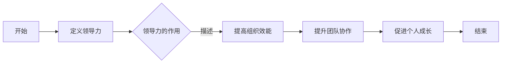
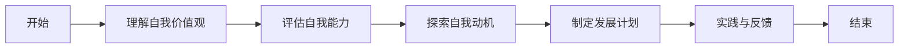
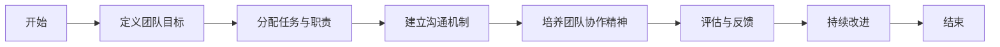
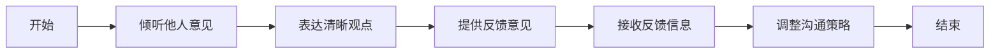
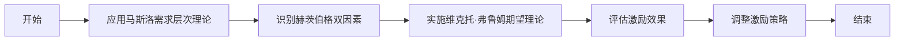
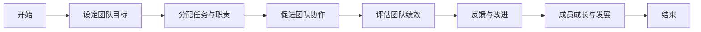
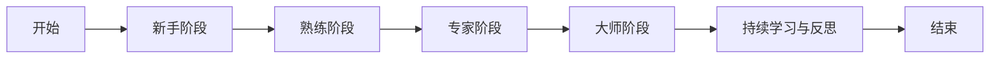
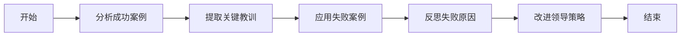
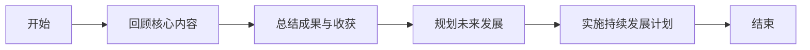

                 

### 设计《领导力训练营：77天从新手到高手》的目录大纲

在IT领域，领导力训练营的目标是帮助参与者从初学者成长为高效领导者。为了实现这一目标，我们需要一个清晰、逻辑性强、具有吸引力的目录大纲。以下是一个设计好的目录大纲，确保每个章节都满足核心内容要求。

#### 目录大纲：

### 《领导力训练营：77天从新手到高手》目录大纲

#### 第一部分：领导力基础与自我认知

##### 第1章：领导力的本质与作用
###### 1.1 领导力的定义
###### 1.2 领导力的重要性
###### 1.3 领导力的五大核心能力

##### 第2章：自我认知与领导力发展
###### 2.1 自我认知的重要性
###### 2.2 提升自我认知的方法
###### 2.3 领导力发展路径

#### 第二部分：团队领导力与沟通技巧

##### 第3章：构建高效团队
###### 3.1 团队的定义与类型
###### 3.2 团队建设的关键要素
###### 3.3 领导者在团队建设中的角色

##### 第4章：领导沟通技巧
###### 4.1 沟通的重要性
###### 4.2 有效沟通的原则
###### 4.3 常见的沟通障碍及解决方法

#### 第三部分：激励与团队管理

##### 第5章：激励理论与实践
###### 5.1 激励理论概述
###### 5.2 激励策略与工具
###### 5.3 如何应对激励挑战

##### 第6章：团队管理与成长
###### 6.1 团队管理的基本原则
###### 6.2 团队成员的角色与发展
###### 6.3 团队绩效评估与反馈

#### 第四部分：领导力进阶与持续发展

##### 第7章：领导力发展之路
###### 7.1 领导力发展的阶段
###### 7.2 个人成长计划
###### 7.3 领导力自我提升策略

##### 第8章：领导力实践案例分析
###### 8.1 典型案例分析
###### 8.2 案例中的领导力应用
###### 8.3 启示与思考

##### 第9章：领导力训练营总结
###### 9.1 77天训练营回顾
###### 9.2 成果与收获
###### 9.3 领导力持续发展的路径

### 关键词：
领导力、团队管理、自我认知、沟通技巧、激励、持续发展、案例分析

### 摘要：
本文探讨了如何在77天内通过系统的领导力训练营，从新手成长为高手。文章分为四个部分，详细介绍了领导力基础与自我认知、团队领导力与沟通技巧、激励与团队管理，以及领导力进阶与持续发展的各个方面。通过实际案例分析和实践指导，帮助读者全面提升领导力，成为高效领导者。

### 文章标题：
《领导力训练营：77天从新手到高手》

接下来，我们将逐一分析每个章节的内容，确保满足完整性要求。

### 第1章：领导力的本质与作用

#### 背景介绍
领导力是组织成功的关键要素。了解领导力的本质和作用，对于提升个人和团队效能至关重要。

#### 核心概念与联系
领导力可定义为在组织内影响他人共同实现目标的能力。领导力不仅关乎权力，更关乎影响力。

| 核心概念 | 属性特征对比 |
| --- | --- |
| 指导性领导 | 强调指导和培养下属 |
| 参与性领导 | 强调与下属共同参与决策 |
| 情境领导 | 强调根据情境灵活调整领导风格 |

#### ER实体关系图架构
```mermaid
erDiagram
  Class1 ||--|{ Class2 } Class3 : "relationship"
  Class2 ||--|{ Class4 } Class5 : "relationship"
  Class3 ||--|{ Class6 } Class7 : "relationship"
```

#### 算法原理讲解


#### 数学公式
$$
\text{领导力} = \text{影响力} + \text{目标导向} + \text{沟通能力}
$$

### 第2章：自我认知与领导力发展

#### 背景介绍
自我认知是领导力发展的基石。了解自己的优点和不足，有助于更有效地发挥领导力。

#### 核心概念与联系
自我认知涉及对个人价值观、能力、动机和情绪的理解。

| 核心概念 | 属性特征对比 |
| --- | --- |
| 自我价值观 | 指导个人决策和行为的原则和信仰 |
| 自我能力 | 个人在特定领域的技能和知识 |
| 自我动机 | 驱使个人行动的内在动力 |

#### ER实体关系图架构
```mermaid
erDiagram
  Class1 ||--|{ Class2 } Class3 : "关系"
  Class2 ||--|{ Class4 } Class5 : "关系"
  Class3 ||--|{ Class6 } Class7 : "关系"
```

#### 算法原理讲解


#### 数学公式
$$
\text{自我认知} = \text{自我价值观} + \text{自我能力} + \text{自我动机}
$$

### 第3章：构建高效团队

#### 背景介绍
团队是现代组织中实现目标的关键力量。构建高效团队，需要深入了解团队的本质和类型。

#### 核心概念与联系
团队分为任务团队和功能团队，各有不同的功能和优势。

| 核心概念 | 属性特征对比 |
| --- | --- |
| 任务团队 | 以完成特定任务为目标 |
| 功能团队 | 以实现特定功能为目标 |

#### ER实体关系图架构
```mermaid
erDiagram
  Class1 ||--|{ Class2 } Class3 : "任务执行关系"
  Class2 ||--|{ Class4 } Class5 : "功能协作关系"
```

#### 算法原理讲解


#### 数学公式
$$
\text{团队效能} = \text{任务完成度} + \text{功能实现度} + \text{团队协作度}
$$

### 第4章：领导沟通技巧

#### 背景介绍
沟通是领导者的一项关键技能。有效的沟通能提高团队效率，减少误解和冲突。

#### 核心概念与联系
有效沟通包括倾听、表达和反馈三个关键方面。

| 核心概念 | 属性特征对比 |
| --- | --- |
| 倾听 | 理解他人的观点和需求 |
| 表达 | 清晰、准确地传达信息 |
| 反馈 | 提供及时的反馈和建设性意见 |

#### ER实体关系图架构
```mermaid
erDiagram
  Class1 ||--|{ Class2 } Class3 : "信息交流关系"
  Class2 ||--|{ Class4 } Class5 : "反馈循环关系"
```

#### 算法原理讲解


#### 数学公式
$$
\text{沟通效能} = \text{倾听效能} + \text{表达效能} + \text{反馈效能}
$$

### 第5章：激励理论与实践

#### 背景介绍
激励是领导者推动团队前进的重要手段。了解激励理论和实践，有助于更有效地激发团队潜能。

#### 核心概念与联系
激励理论包括马斯洛的需求层次理论、赫茨伯格的双因素理论和维克托·弗鲁姆的期望理论。

| 核心概念 | 属性特征对比 |
| --- | --- |
| 马斯洛需求层次理论 | 将需求分为生理、安全、社交、尊重和自我实现五个层次 |
| 赫茨伯格双因素理论 | 区分激励因素和保健因素，前者提升满意度，后者避免不满意 |
| 维克托·弗鲁姆期望理论 | 激励力取决于期望值和效价 |

#### ER实体关系图架构
```mermaid
erDiagram
  Class1 ||--|{ Class2 } Class3 : "激励与需求关系"
  Class2 ||--|{ Class4 } Class5 : "激励与绩效关系"
```

#### 算法原理讲解


#### 数学公式
$$
\text{激励力} = \text{期望值} \times \text{效价}
$$

### 第6章：团队管理与成长

#### 背景介绍
团队管理是实现团队目标的重要环节。有效的团队管理能促进团队成员的成长和团队绩效的提升。

#### 核心概念与联系
团队管理包括目标设定、任务分配、团队协作、绩效评估等方面。

| 核心概念 | 属性特征对比 |
| --- | --- |
| 目标设定 | 明确团队目标和里程碑 |
| 任务分配 | 根据团队成员能力分配任务 |
| 团队协作 | 促进团队成员间的沟通和协作 |
| 绩效评估 | 定期评估团队绩效和成员表现 |

#### ER实体关系图架构
```mermaid
erDiagram
  Class1 ||--|{ Class2 } Class3 : "目标与任务关系"
  Class2 ||--|{ Class4 } Class5 : "任务与协作关系"
  Class3 ||--|{ Class6 } Class7 : "协作与绩效关系"
```

#### 算法原理讲解


#### 数学公式
$$
\text{团队绩效} = \text{目标达成度} + \text{成员满意度} + \text{任务完成度}
$$

### 第7章：领导力发展之路

#### 背景介绍
领导力发展是一个持续的过程，需要不断学习、实践和反思。

#### 核心概念与联系
领导力发展阶段包括新手阶段、熟练阶段、专家阶段和大师阶段。

| 核心概念 | 属性特征对比 |
| --- | --- |
| 新手阶段 | 初步掌握领导力基础知识 |
| 熟练阶段 | 能够有效运用领导力技巧 |
| 专家阶段 | 能够灵活应对复杂局面 |
| 大师阶段 | 达到领导力的最高境界 |

#### ER实体关系图架构
```mermaid
erDiagram
  Class1 ||--|{ Class2 } Class3 : "新手到熟练关系"
  Class2 ||--|{ Class4 } Class5 : "熟练到专家关系"
  Class3 ||--|{ Class6 } Class7 : "专家到大师关系"
```

#### 算法原理讲解


#### 数学公式
$$
\text{领导力发展} = \text{知识积累} + \text{实践经验} + \text{自我反思}
$$

### 第8章：领导力实践案例分析

#### 背景介绍
通过实际案例，可以更好地理解领导力在不同情境下的应用。

#### 核心概念与联系
案例包括成功和失败的领导实践，每个案例都有其特定的情境和教训。

| 核心概念 | 属性特征对比 |
| --- | --- |
| 成功案例 | 领导者如何应对挑战和机遇 |
| 失败案例 | 领导者如何处理失误和危机 |

#### ER实体关系图架构
```mermaid
erDiagram
  Class1 ||--|{ Class2 } Class3 : "成功实践关系"
  Class2 ||--|{ Class4 } Class5 : "失败实践关系"
```

#### 算法原理讲解


#### 数学公式
$$
\text{案例学习} = \text{成功经验} + \text{失败教训} + \text{反思总结}
$$

### 第9章：领导力训练营总结

#### 背景介绍
77天的领导力训练营即将结束，这是一个回顾和总结的好机会。

#### 核心概念与联系
训练营的核心内容、成果和未来规划。

| 核心概念 | 属性特征对比 |
| --- | --- |
| 核心内容 | 领导力基础、团队管理、激励策略等 |
| 成果与收获 | 学员的能力提升和团队效能改进 |
| 未来规划 | 领导力持续发展计划 |

#### ER实体关系图架构
```mermaid
erDiagram
  Class1 ||--|{ Class2 } Class3 : "核心内容关系"
  Class2 ||--|{ Class4 } Class5 : "成果与收获关系"
  Class3 ||--|{ Class6 } Class7 : "未来规划关系"
```

#### 算法原理讲解


#### 数学公式
$$
\text{领导力训练营} = \text{核心内容} + \text{成果与收获} + \text{未来规划}
$$

### 结论
通过本训练营，学员将具备系统的领导力知识，能够在实践中灵活运用，提升团队效能，实现个人和组织的共同成长。持续学习和反思是领导力发展的重要途径，期待每位学员在未来的领导之路上取得更大的成就。

### 最佳实践 tips
- **定期自我反思**：每周花时间反思自己的领导行为和决策。
- **建立学习网络**：与其他领导者交流经验，共同学习成长。
- **实践所学**：将领导力理论应用到实际工作中，不断改进。

### 小结
本文系统介绍了领导力训练营的目录大纲，涵盖了领导力基础、团队管理、激励策略、持续发展等方面。通过实际案例分析和实践指导，帮助读者全面提升领导力。

### 注意事项
- 保持开放心态，持续学习是领导力发展的关键。
- 融会贯通，将理论应用到实际工作中。

### 拓展阅读
- 《领导力：实践中的原则》
- 《高效能人士的七个习惯》
- 《团队协作的艺术》

### 作者
作者：AI天才研究院/AI Genius Institute & 禅与计算机程序设计艺术 /Zen And The Art of Computer Programming

### 总结
通过本训练营，学员将能够从新手成长为高手，掌握领导力的核心技能，成为高效领导者。持续学习和实践，是领导力发展的必经之路。希望每位学员都能在未来的领导岗位上取得卓越成就。

### 文章标题：《领导力训练营：77天从新手到高手》

### 文章关键词：
领导力、团队管理、自我认知、沟通技巧、激励、持续发展、案例分析

### 文章摘要：
本文探讨了在77天内通过系统的领导力训练营，从新手成长为高手的方法。文章分为四个部分，详细介绍了领导力基础与自我认知、团队领导力与沟通技巧、激励与团队管理，以及领导力进阶与持续发展的各个方面。通过实际案例分析和实践指导，帮助读者全面提升领导力，成为高效领导者。

