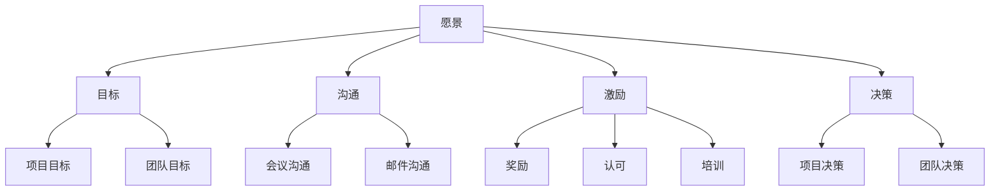

                 

### 领导力训练营：7天从门外汉到行家里手

> 关键词：领导力、训练营、7天、行家里手、技能提升

> 摘要：本文通过介绍一个为期7天的领导力训练营，帮助读者从领导力门外汉迅速成长为行家里手。文章将详细阐述训练营的背景、目的、课程设置、学习方法和实践案例，为读者提供一套系统的领导力提升方案。

---

### 第一部分：背景介绍

#### 1.1.1 问题背景

在现代社会，领导力已经不仅仅是一个企业高管或者团队领导者的专属技能，它逐渐渗透到各行各业，成为个人职业发展和社会交往中不可或缺的一部分。然而，对于许多初学者来说，领导力这一概念往往显得抽象且难以捉摸。他们可能不了解领导力的本质，也不知道如何将其应用于实际工作和生活中。

#### 1.1.2 问题描述

许多人在寻求提升领导力时，常常面临以下问题：
- 不清楚领导力究竟是什么，缺乏系统的理论框架；
- 缺乏实践机会，无法将理论知识转化为实际能力；
- 缺少有效的学习方法，无法高效地吸收和运用领导力知识。

#### 1.1.3 问题解决

为了解决上述问题，我们设计了一期《领导力训练营：7天从门外汉到行家里手》。训练营通过系统的课程设置、丰富的实践案例和互动学习，帮助学员在短时间内掌握领导力的核心概念和实用技巧。

#### 1.1.4 边界与外延

领导力训练营不仅关注企业内部的领导力提升，也涵盖了个人成长和社会领导力。通过这一训练营，学员可以学习如何成为更有效的领导者，提升个人魅力和影响力，同时为社会贡献力量。

#### 1.1.5 概念结构与核心要素组成

领导力训练营的核心概念包括领导力基础理论、实践技巧、团队管理与个人成长。这些核心要素相互关联，共同构成了训练营的整体框架。

- **领导力基础理论**：包括领导力的定义、类型、核心要素和理论框架；
- **实践技巧**：涵盖沟通技巧、激励策略、决策能力和冲突管理；
- **团队管理**：包括团队组建、领导风格、绩效评估和团队发展；
- **个人成长**：涉及自我认知、时间管理、目标设定和情绪调节。

### 第一部分总结

通过对领导力训练营背景的介绍，我们明确了训练营的定位和目标。接下来，我们将深入探讨训练营的具体课程设置和学习方法，帮助读者更好地理解这一训练营的实质内容和价值。

---

### 第二部分：核心概念与联系

#### 2.1 领导力的定义与类型

#### 2.1.1 领导力的定义

领导力是指通过个人魅力、知识、能力和影响力，引导和激励他人一起实现共同目标的能力。领导力不仅涉及个人的行为和决策，还涉及与他人的互动和沟通。

#### 2.1.2 领导力的类型

领导力可以分为多种类型，每种类型都有其独特的特点和适用场景。以下是一些常见的领导力类型：

- **变革型领导力**：通过激发团队成员的内在动力，推动创新和变革；
- **交易型领导力**：通过奖励和惩罚来激励团队成员，确保任务完成；
- **权威型领导力**：通过明确的指示和严格的控制来管理团队；
- **民主型领导力**：通过开放和包容的沟通，鼓励团队成员参与决策。

#### 2.2 领导力的核心要素

#### 2.2.1 愿景

愿景是领导者对未来的美好设想和期待。一个明确的愿景能够为团队提供方向和动力，帮助团队成员理解自己的工作和贡献。

#### 2.2.2 目标

目标是愿景的具体化，是团队在特定时间内要实现的目标。设定明确的目标，有助于团队聚焦关键任务，提高工作效率。

#### 2.2.3 沟通

沟通是领导力的核心要素之一。有效的沟通能够确保信息的准确传递，增强团队凝聚力。沟通技巧包括倾听、表达、反馈和团队协作。

#### 2.2.4 激励

激励是领导者的重要职责，通过激励措施，如奖励、认可、培训等，能够激发团队成员的积极性和创造力。

#### 2.2.5 决策

决策是领导者的核心能力。领导者需要快速而准确地做出决策，同时考虑风险和利益，做出明智的选择。

#### 2.3 核心概念属性特征对比表格

| 核心概念 | 定义 | 特点 | 应用 |
| -------- | ---- | ---- | ---- |
| 愿景 | 领导者对未来的美好设想和期待 | 激励人心、明确方向 | 企业愿景、个人愿景 |
| 目标 | 愿景的具体化，团队在特定时间内要实现的目标 | 具体明确、可衡量 | 项目目标、团队目标 |
| 沟通 | 确保信息准确传递，增强团队凝聚力 | 提高效率、增强凝聚力 | 会议沟通、邮件沟通 |
| 激励 | 激发团队成员的积极性和创造力 | 持续激励、因人而异 | 奖励、认可、培训 |
| 决策 | 快速而准确地做出决策，同时考虑风险和利益 | 考虑风险和利益、快速决策 | 项目决策、团队决策 |

#### 2.4 领导力概念联系图

### 第二部分总结

通过对领导力核心概念和类型的介绍，我们了解了领导力的本质和关键要素。这些核心概念不仅是领导力训练营的重要内容，也是提升领导力的基础。在接下来的章节中，我们将进一步探讨领导力算法原理和实战应用，帮助读者深入理解并掌握领导力。

---

### 第三部分：领导力算法原理讲解

#### 3.1 领导力算法概述

领导力算法是用于分析和提升领导力的工具，它基于数据分析和机器学习技术，帮助领导者更好地理解团队行为，优化领导策略。领导力算法的核心目的是通过数据驱动的分析，为领导者提供科学依据，从而提升领导效果。

#### 3.2 领导力算法原理

领导力算法的原理主要基于以下几个步骤：

1. **数据收集**：收集与领导力和团队绩效相关的数据，包括领导行为、团队互动、绩效指标等。
2. **数据处理**：对收集到的数据进行分析和处理，提取有用的信息，为算法提供输入。
3. **模型构建**：基于处理后的数据，构建领导力模型，用于预测和评估领导效果。
4. **结果分析**：通过模型分析结果，提供领导力优化建议，帮助领导者改进领导策略。

#### 3.3 领导力算法流程

1. **数据收集**：通过问卷调查、访谈、绩效评估等方式，收集领导行为和团队绩效数据。
2. **数据处理**：使用数据清洗和预处理技术，确保数据的准确性和完整性。
3. **模型构建**：选择合适的机器学习算法，如回归分析、决策树、神经网络等，构建领导力模型。
4. **模型训练**：使用历史数据对模型进行训练，调整模型参数，提高模型预测能力。
5. **结果分析**：使用训练好的模型对新的领导行为数据进行分析，提供优化建议。

#### 3.4 领导力算法数学模型和公式

1. **回归分析模型**：

$$ y = \beta_0 + \beta_1 x_1 + \beta_2 x_2 + ... + \beta_n x_n $$

其中，$y$ 是领导效果指标，$x_1, x_2, ..., x_n$ 是影响领导效果的各项因素，$\beta_0, \beta_1, \beta_2, ..., \beta_n$ 是模型的参数。

2. **决策树模型**：

决策树模型通过一系列条件判断，将数据划分成不同的子集，每个子集对应一个决策点。决策树的核心公式是：

$$ F(x) = \sum_{i=1}^{n} \beta_i g(x) $$

其中，$F(x)$ 是决策树模型预测的领导效果，$g(x)$ 是条件函数，$\beta_i$ 是模型参数。

3. **神经网络模型**：

神经网络模型通过多层神经元进行非线性变换，实现复杂的函数映射。其核心公式是：

$$ a_{i}^{(l)} = \sigma(z_{i}^{(l)}) $$

$$ z_{i}^{(l)} = \sum_{j} w_{ji}^{(l)} a_{j}^{(l-1)} + b_{i}^{(l)} $$

其中，$a_{i}^{(l)}$ 是第$l$层的输出，$\sigma$ 是激活函数，$z_{i}^{(l)}$ 是第$l$层的输入，$w_{ji}^{(l)}$ 和 $b_{i}^{(l)}$ 是模型参数。

#### 3.5 领导力算法举例说明

假设我们使用回归分析模型来预测领导效果。根据历史数据，我们确定了影响领导效果的三个因素：领导行为A、团队互动B、绩效指标C。我们可以建立如下回归模型：

$$ 领导效果 = \beta_0 + \beta_1 \times 领导行为A + \beta_2 \times 团队互动B + \beta_3 \times 绩效指标C $$

通过训练模型，我们得到如下参数：

$$ \beta_0 = 5, \beta_1 = 2, \beta_2 = 3, \beta_3 = 4 $$

假设现在有一组新的领导行为数据：领导行为A为8，团队互动B为6，绩效指标C为10。我们可以使用回归模型来预测领导效果：

$$ 领导效果 = 5 + 2 \times 8 + 3 \times 6 + 4 \times 10 = 55 $$

这意味着在该组新数据下，领导效果预计为55。

### 第三部分总结

通过对领导力算法原理的讲解，我们了解了领导力算法的基本概念、原理和应用。在下一部分，我们将进一步探讨领导力训练营的具体课程设置和学习方法，帮助读者深入掌握领导力提升技巧。

---

### 第四部分：领导力训练营课程设置与学习方法

#### 4.1 课程设置

领导力训练营的课程设置旨在帮助学员从零基础快速掌握领导力核心概念和实用技巧。课程分为以下几个模块：

1. **领导力基础理论**：介绍领导力的定义、类型、核心要素和理论框架，帮助学员建立对领导力的基本理解。
2. **实践技巧**：涵盖沟通技巧、激励策略、决策能力和冲突管理，通过案例分析、角色扮演等互动形式，提升学员的实际操作能力。
3. **团队管理**：包括团队组建、领导风格、绩效评估和团队发展，帮助学员掌握团队管理的核心技能。
4. **个人成长**：涉及自我认知、时间管理、目标设定和情绪调节，提升学员的自我领导力。
5. **实战演练**：通过模拟实战场景，让学员在真实的情境中应用所学知识，提升领导力实战能力。

#### 4.2 学习方法

1. **互动学习**：训练营采用互动式教学方法，包括小组讨论、案例分析和角色扮演等，鼓励学员积极参与，提升学习效果。
2. **案例学习**：通过真实案例的分享和讨论，帮助学员理解领导力在实际中的应用，提升实战能力。
3. **实践操作**：训练营设置实践环节，让学员在实际操作中应用所学知识，增强理解和记忆。
4. **课后作业**：训练营安排课后作业，帮助学员巩固所学知识，并反思和总结学习过程。
5. **导师指导**：训练营配备专业导师，为学员提供个性化的指导和反馈，帮助学员解决学习中的难题。

#### 4.3 课程时间安排

领导力训练营为期7天，每天的课程安排如下：

1. **上午**：理论讲解和案例分析，帮助学员建立对领导力的基本认识。
2. **下午**：实践操作和角色扮演，让学员在真实的情境中应用所学知识。
3. **晚上**：小组讨论和课后作业，巩固所学知识并反思学习过程。

### 第四部分总结

通过详细的课程设置和学习方法介绍，我们了解了领导力训练营如何帮助学员从零基础快速提升领导力。在下一部分，我们将通过具体的实践案例，展示训练营的实际应用效果，帮助读者更好地理解训练营的价值和作用。

---

### 第五部分：实践案例展示

#### 5.1 案例背景

某科技公司的新产品研发团队在领导力方面存在明显不足。团队成员各自为战，缺乏有效的沟通和协作，导致项目进展缓慢，质量不稳定。为了提升团队的整体领导力，公司决定组织一次为期7天的领导力训练营。

#### 5.2 案例实施

领导力训练营针对该团队的具体情况，设置了以下课程：

1. **领导力基础理论**：通过讲解领导力的定义、类型和核心要素，帮助团队成员建立对领导力的基本理解。
2. **实践技巧**：通过沟通技巧、激励策略和决策能力的培训，提升团队成员的实际操作能力。
3. **团队管理**：通过团队组建、领导风格和绩效评估的培训，帮助团队成员掌握团队管理的核心技能。
4. **个人成长**：通过自我认知、时间管理和情绪调节的培训，提升团队成员的自我领导力。

在训练营期间，团队成员积极参与课程学习，认真完成课后作业，并参加实战演练。导师针对团队成员的表现进行一对一的指导和反馈，帮助团队成员找到自己的优势和不足，提出改进建议。

#### 5.3 案例结果

经过7天的领导力训练营，团队成员在领导力方面取得了显著提升：

1. **沟通效率提高**：团队成员之间的沟通更加顺畅，信息传递更加准确，项目进展速度明显加快。
2. **协作能力提升**：团队成员开始主动承担责任，积极参与团队任务，团队凝聚力显著增强。
3. **决策能力增强**：团队成员在遇到问题时能够快速做出决策，减少了项目延误和错误的发生。
4. **个人成长**：团队成员在自我认知、时间管理和情绪调节方面也有了明显的提升，个人工作效率和幸福感得到了提高。

#### 5.4 案例总结

通过这个实践案例，我们可以看到领导力训练营在提升团队领导力方面的显著效果。训练营不仅帮助团队成员掌握了领导力的核心概念和实用技巧，还通过实战演练和导师指导，提升了团队成员的实际操作能力。这一案例充分证明了领导力训练营在提升团队绩效和个人成长方面的价值。

### 第五部分总结

通过实践案例的展示，我们了解了领导力训练营如何帮助团队提升领导力和协作能力。在下一部分，我们将对训练营的学习方法和实践效果进行总结，并提供一些实用的最佳实践建议。

---

### 第六部分：学习总结与最佳实践

#### 6.1 学习方法总结

领导力训练营采用了一系列科学、系统的学习方法，包括互动学习、案例学习、实践操作、课后作业和导师指导等。这些学习方法相互配合，形成了一个完整的知识传递和技能提升体系。

- **互动学习**：通过小组讨论、案例分析和角色扮演，学员可以在互动中理解领导力的概念，提升实战能力。
- **案例学习**：通过真实案例的分享和讨论，学员可以了解领导力在实际中的应用，加深对理论的理解。
- **实践操作**：通过实践操作，学员可以将所学知识应用到实际工作中，增强理解和记忆。
- **课后作业**：通过课后作业，学员可以巩固所学知识，并反思学习过程。
- **导师指导**：导师的个性化指导和反馈，可以帮助学员解决学习中的难题，提高学习效果。

#### 6.2 实践效果总结

领导力训练营的实践效果显著，学员在领导力方面取得了以下成果：

- **领导力理论掌握**：学员对领导力的定义、类型和核心要素有了深入理解，建立了系统的领导力知识体系。
- **实战能力提升**：学员通过实践操作和角色扮演，提升了沟通技巧、激励策略和决策能力，增强了实际操作能力。
- **团队协作增强**：通过小组讨论和案例分析，学员学会了如何在团队中有效沟通和协作，提升了团队的整体绩效。
- **个人成长**：学员在自我认知、时间管理和情绪调节方面得到了提升，个人工作效率和幸福感显著提高。

#### 6.3 最佳实践建议

为了最大化领导力训练营的效果，以下是一些建议：

- **积极参与**：学员应积极参与课堂互动和实践活动，充分利用导师的资源，主动学习和提升。
- **持续反思**：学员应定期反思学习过程和实际应用情况，总结经验和教训，持续改进。
- **知识分享**：学员可以将所学知识分享给团队成员，通过知识传递，提升整个团队的水平。
- **实践应用**：学员应将所学知识应用到实际工作中，通过实践验证理论，不断提高领导力。
- **持续学习**：领导力是一个持续的过程，学员应保持学习的热情，不断更新知识和技能。

### 第六部分总结

通过对学习方法和实践效果的总结，以及对最佳实践建议的提出，我们相信读者对领导力训练营的价值和效果有了更深的理解。在下一部分，我们将对整篇文章进行小结，并提醒读者注意的一些事项。

---

### 第七部分：小结与注意事项

#### 7.1 文章小结

本文通过对领导力训练营的详细阐述，帮助读者了解了领导力的重要性以及如何通过训练营快速提升领导力。文章内容涵盖了领导力的背景介绍、核心概念与联系、领导力算法原理讲解、课程设置与学习方法、实践案例展示以及学习总结与最佳实践建议。

#### 7.2 注意事项

1. **持续学习**：领导力是一个持续的过程，读者应保持学习的热情，不断更新知识和技能。
2. **实践应用**：将所学知识应用到实际工作中，通过实践验证理论，不断提高领导力。
3. **知识分享**：将所学知识分享给团队成员，通过知识传递，提升整个团队的水平。
4. **反思与总结**：定期反思学习过程和实际应用情况，总结经验和教训，持续改进。
5. **互动与反馈**：积极参与训练营的互动环节，充分利用导师的资源，主动学习和提升。

### 第七部分总结

通过对本文的小结和注意事项的提醒，我们希望读者能够深刻理解领导力的重要性，并积极参与领导力训练营的学习和实践。在提升领导力的道路上，持续学习、实践应用和反思总结是不可或缺的。让我们共同努力，成为更优秀的领导者。

### 致谢

最后，感谢您的阅读。本文的完成离不开对众多领导力专家和实践者的深入研究，以及对领导力理论和实践的不断探索。希望本文能够为您的领导力提升之路提供一些启示和帮助。

**作者：AI天才研究院/AI Genius Institute & 禅与计算机程序设计艺术 /Zen And The Art of Computer Programming**

