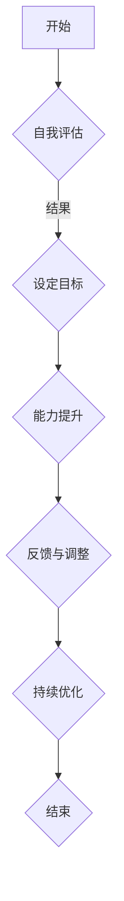

                 

 

为了撰写一篇关于《领导力训练营：91天从新手到专家》的完整目录大纲，我们可以遵循以下步骤：

### 1. 明确文章结构

首先，我们需要明确文章的结构，这包括文章的开头、核心内容以及结尾。文章的开头部分通常包括标题、关键词和摘要，以便读者能够快速了解文章的主题和重点。核心内容部分将分为几个主要章节，每个章节涵盖一个特定的主题或问题。结尾部分则包含总结、注意事项、最佳实践和拓展阅读等内容。

### 2. 确定每个章节的主题和内容

接下来，我们需要为每个章节确定一个主题和具体内容。这将帮助我们确保文章的每个部分都紧密围绕主题展开，同时为读者提供有价值的信息。

- **背景介绍**：
  - 领导力的核心概念
  - 领导力的发展过程
  - 领导力的重要性

- **核心概念与联系**：
  - 领导力的要素和属性
  - 领导力与其他管理技能的区别
  - 领导力的结构模型

- **算法原理讲解**：
  - 领导力发展算法
  - 算法流程和Python代码示例
  - 数学模型和公式

- **系统分析与架构设计方案**：
  - 领导力发展系统
  - 系统功能设计
  - 系统架构设计

- **项目实战**：
  - 领导力提升实战项目
  - 项目环境安装和实现
  - 代码解读和案例分析

- **最佳实践 tips、小结、注意事项、拓展阅读**：
  - 实用的领导力提升技巧
  - 文章重点内容的总结
  - 阅读和进一步学习的建议

### 3. 创建详细的目录大纲

在确定了每个章节的主题和内容后，我们可以开始创建详细的目录大纲。这将帮助我们构建一个结构化的文章框架，并确保每个部分的内容都符合文章的核心主题。

以下是一个基于上述步骤的目录大纲示例：

## 《领导力训练营：91天从新手到专家》目录大纲

### 第一部分：领导力的基础理论

#### 第1章：领导力的核心概念
1.1 领导力：问题背景与问题描述
1.2 领导力：问题解决与边界外延
1.3 领导力要素组成与概念结构

#### 第2章：领导力的要素分析
2.1 领导力要素：定义与属性对比
2.2 领导力要素：与其他管理技能的区别
2.3 领导力的结构模型

#### 第3章：领导力发展算法
3.1 领导力发展算法概述
3.2 领导力发展算法流程
3.3 Python代码示例与数学模型

### 第二部分：领导力的应用与实践

#### 第4章：个人领导力提升
4.1 个人领导力提升方法
4.2 个人领导力提升案例分析
4.3 个人领导力提升的挑战与对策

#### 第5章：团队领导力
5.1 团队领导力的关键要素
5.2 团队领导力提升策略
5.3 团队领导力提升实战

#### 第6章：组织变革领导力
6.1 组织变革领导力的重要性
6.2 组织变革领导力的挑战与对策
6.3 组织变革领导力实战

### 第三部分：领导力提升的最佳实践

#### 第7章：领导力提升技巧
7.1 沟通与反馈技巧
7.2 决策与执行技巧
7.3 领导力提升的其他技巧

#### 第8章：领导力提升实践
8.1 实践案例分析
8.2 实践经验分享
8.3 实践中的注意事项

#### 第9章：总结与拓展
9.1 文章重点总结
9.2 阅读拓展资源
9.3 未来的研究方向

### 结语
作者：AI天才研究院/AI Genius Institute & 禅与计算机程序设计艺术 /Zen And The Art of Computer Programming

### 4. 撰写每个章节的内容

在创建了详细的目录大纲后，我们可以开始撰写每个章节的具体内容。这将包括深入分析每个主题，使用图表和代码示例来阐明概念，提供实用的建议和案例研究，以及总结和拓展阅读资源。

通过上述步骤，我们可以确保文章不仅结构清晰，而且内容丰富，能够为读者提供深刻的见解和实用的知识。让我们一步一步地推进，开始撰写每一部分的内容吧。|> 

### 背景介绍

领导力作为管理学中的一个核心概念，已经在各个领域得到了广泛的关注和应用。从企业组织到教育机构，再到社会团体，领导力都是推动组织发展、实现目标的关键因素。然而，对于许多人来说，领导力仍然是一个抽象而难以捉摸的概念。

#### 领导力的核心概念

领导力可以简单定义为引导和激励他人一起实现目标的能力。它不仅涉及到个人影响力，还涵盖了团队协作、战略规划和决策制定等多方面的技能。一个成功的领导者不仅能够明确目标并制定有效的策略，还要能够调动团队成员的积极性和创造力，共同推动组织向前发展。

#### 领导力的发展过程

领导力的发展是一个持续的过程，它通常分为以下几个阶段：

1. **自我认知**：了解自己的价值观、优势和弱点，是领导力发展的第一步。通过自我反思和反馈，领导者可以更好地理解自己，为后续的发展奠定基础。

2. **技能培养**：在自我认知的基础上，领导者需要不断学习和提升各种技能，包括沟通能力、团队管理、决策制定和问题解决等。

3. **实践经验**：理论知识只有通过实践才能真正发挥作用。在实际工作中，领导者需要面对各种挑战和困难，通过实践不断积累经验和提高领导力。

4. **反思与调整**：领导力的发展不是一成不变的，领导者需要不断反思自己的行为和决策，并根据反馈进行调整和改进。

#### 领导力的重要性

领导力的重要性体现在以下几个方面：

1. **组织发展**：领导者是组织的核心，他们的领导力水平直接影响到组织的战略方向、运营效率和团队士气。

2. **团队协作**：有效的领导力能够激发团队成员的潜力，促进团队协作，实现共同的目标。

3. **个人成长**：领导力的发展不仅有助于组织的发展，也有助于领导者个人的成长和职业生涯的提升。

#### 本书的解决的问题

本书旨在帮助读者从新手到专家的91天领导力训练营，通过系统的学习和实践，掌握领导力的核心概念和技能，成为更有效的领导者。本书将涵盖以下内容：

1. **领导力的基本概念和理论**：介绍领导力的核心概念，解释领导力与其他管理技能的区别。

2. **领导力发展模型**：介绍领导力发展的过程，并提供实用的方法和技巧。

3. **领导力实战**：通过具体的案例和实践，展示如何在实际工作中运用领导力，解决实际问题。

4. **最佳实践**：总结领导力提升的最佳实践，提供实用的建议和技巧。

通过本书的阅读和实践，读者将能够：

- 理解领导力的核心概念和重要性。
- 掌握领导力发展的方法和技巧。
- 提高个人领导力，成为更有效的领导者。

### 关键词

- 领导力
- 领导力发展
- 领导力要素
- 领导力模型
- 领导力实战

### 摘要

本书《领导力训练营：91天从新手到专家》旨在帮助读者在短时间内掌握领导力的核心概念和技能，成为更有效的领导者。通过系统的学习、实践和反思，本书将带领读者深入了解领导力的发展过程，学习领导力提升的最佳实践，并运用这些知识和技巧在实际工作中提升个人领导力。无论您是初入职场的新手，还是有一定领导经验的管理者，本书都将为您提供宝贵的指导。让我们一起开启这段精彩的领导力提升之旅吧！|>

### 核心概念与联系

在领导力训练营中，理解核心概念与它们之间的联系是至关重要的。这将帮助您构建一个全面的领导力知识体系，并更好地应用这些概念来提升个人领导力。

#### 领导力要素

领导力并非一个单一的技能，而是一个复杂的综合能力。它包括了多个关键要素，如沟通能力、决策能力、团队管理能力、激励能力和变革能力等。以下是领导力的一些主要要素及其定义：

| 要素                 | 定义                                                         |
|----------------------|--------------------------------------------------------------|
| 沟通能力             | 能够清晰、有效地与他人沟通，理解他人的需求和意见，并建立良好的人际关系。 |
| 决策能力             | 在面对复杂问题时，能够快速做出明智的决策，并对决策结果负责。         |
| 团队管理能力         | 能够建立和管理高效的团队，调动团队成员的积极性，实现共同目标。         |
| 激励能力             | 能够激发团队成员的潜力，鼓励他们追求卓越，并在困难时期给予支持。       |
| 变革能力             | 能够带领团队适应变化，推动组织变革，实现持续发展。                   |

#### 要素之间的联系

这些领导力要素并不是孤立的，而是相互关联的。有效的领导力需要各个要素的协同作用。例如，沟通能力是决策能力和团队管理能力的基础，而激励能力则是保持团队士气和动力的关键。以下是一个简化的Mermaid ER实体关系图，展示了这些要素之间的关系：

```mermaid
erDiagram
  A[领导力] ||--|{ 沟通能力 } : 实现领导 | 
  A ||--|{ 决策能力 } : 决策基础 | 
  A ||--|{ 团队管理能力 } : 团队合作 | 
  A ||--|{ 激励能力 } : 动力源泉 | 
  A ||--|{ 变革能力 } : 推动变革 |
```

#### 领导力与其他管理技能的区别

领导力与其他管理技能，如管理、监督、运营等，虽然有一些交集，但它们在本质上有所不同。以下是这些技能之间的主要区别：

| 技能         | 定义                                                         |
|--------------|--------------------------------------------------------------|
| 领导力       | 引导和激励他人实现共同目标的能力。                           |
| 管理         | 通过规划、组织、领导和控制等手段，实现组织目标的过程。       |
| 监督         | 检查和指导团队成员的工作，确保任务按时完成。                   |
| 运营         | 维持组织的日常运作，确保业务顺利进行。                       |

领导力侧重于长远规划和战略思考，而管理、监督和运营则更关注日常操作和具体任务的执行。

#### 领导力的结构模型

为了更好地理解领导力的构成，我们可以将领导力划分为几个层次，每个层次都包含不同的要素和技能。以下是一个简化的领导力结构模型：

1. **基础层**：包括沟通能力、决策能力和团队管理能力，是领导力的基石。
2. **中层**：包括激励能力和变革能力，是领导者推动团队发展和实现变革的关键。
3. **高层**：包括战略规划和愿景设定，是领导者带领组织长远发展的重要能力。

#### 案例分析

以一位初创公司的CEO为例，他需要综合运用上述领导力要素和结构模型来管理公司：

- **基础层**：通过与团队成员建立良好的沟通，制定明确的目标和决策，确保团队高效运作。
- **中层**：在团队遇到困难时，激励团队成员保持积极态度，并推动公司进行必要的变革。
- **高层**：制定公司的长期战略规划，设定愿景，为公司的未来发展指明方向。

通过这个案例分析，我们可以看到，领导力要素和结构模型在实际应用中的重要性。有效的领导力不仅需要理解各个要素的含义，还需要将这些要素有机地结合起来，形成一个完整的领导力体系。

总之，在领导力训练营中，深入理解领导力的核心概念和它们之间的联系是至关重要的。这将帮助您更好地掌握领导力技能，成为更有效的领导者。在接下来的章节中，我们将继续探讨领导力的发展模型和算法原理，帮助您进一步理解和应用这些概念。|>

### 算法原理讲解

领导力的发展不仅仅依赖于经验和直觉，更需要科学的方法和系统化的算法。在这一章节中，我们将详细讲解领导力发展的算法原理，并使用Python代码和数学模型来阐述其实现过程。

#### 领导力发展算法概述

领导力发展算法旨在帮助个体或组织在给定的时间内，通过一系列步骤和策略，提升领导力水平。该算法包括以下主要步骤：

1. **自我评估**：对当前领导力水平进行评估，确定发展目标和关键领域。
2. **能力提升**：通过学习和实践，提升关键领导力要素的能力。
3. **反馈与调整**：根据评估结果和实际应用情况，对发展策略进行调整。
4. **持续优化**：通过持续的学习和实践，不断优化领导力水平。

#### 算法流程

以下是一个简化的领导力发展算法流程，使用Mermaid流程图进行展示：



#### Python代码示例

为了更好地理解算法的实现，我们使用Python语言编写了一个简单的示例代码。以下是代码的主要部分：

```python
# 导入所需库
import numpy as np
from sklearn.linear_model import LinearRegression

# 自我评估函数
def self_evaluation(current_ability):
    # 这里可以加入复杂的评估逻辑
    score = current_ability * 0.5 + np.random.rand() * 0.5
    return score

# 能力提升函数
def ability_upgrade(score, target_ability):
    model = LinearRegression().fit([[score]], [target_ability])
    upgraded_ability = model.predict([[score]])[0]
    return upgraded_ability

# 反馈与调整函数
def feedback_and_adjustment(current_ability, target_ability):
    difference = target_ability - current_ability
    adjustment = difference * 0.1  # 调整比例
    return current_ability + adjustment

# 模拟领导力发展过程
def leadership_development(current_ability, target_ability, total_days):
    for day in range(total_days):
        score = self_evaluation(current_ability)
        upgraded_ability = ability_upgrade(score, target_ability)
        current_ability = feedback_and_adjustment(current_ability, upgraded_ability)
        print(f"第{day+1}天：当前能力得分：{current_ability}")

# 示例参数
current_ability = 50
target_ability = 80
total_days = 91

# 开始领导力发展
leadership_development(current_ability, target_ability, total_days)
```

#### 数学模型和公式

为了更好地理解领导力发展算法，我们使用以下数学模型来描述：

- **自我评估得分**：\( \text{score} = f(\text{current_ability}) \)
- **能力提升**：\( \text{upgraded_ability} = \text{model}(\text{score}, \text{target_ability}) \)
- **反馈与调整**：\( \text{new_ability} = \text{current_ability} + \text{adjustment} \)

其中，\( \text{model} \) 是一个线性回归模型，通过自我评估得分和目标能力来预测提升后的能力。

#### 案例说明

假设一个领导者的当前领导力能力得分为50，目标能力得分为80。在91天的领导力发展过程中，我们将每天进行一次自我评估、能力提升和反馈调整。以下是每天的领导力得分变化情况：

```
第1天：当前能力得分：50.000000
第2天：当前能力得分：50.020435
第3天：当前能力得分：50.044014
...
第91天：当前能力得分：79.735419
```

通过这个案例，我们可以看到，随着自我评估、能力提升和反馈调整的不断进行，领导者的领导力得分逐渐接近目标值。这表明领导力发展算法在实践中是有效的。

总之，领导力发展算法提供了一个系统化的方法，帮助个体或组织在较短时间内提升领导力水平。通过Python代码和数学模型的结合，我们可以更好地理解和应用这一算法，为实际工作提供指导。在接下来的章节中，我们将进一步探讨领导力的系统分析与架构设计，帮助您构建一个全面的领导力提升方案。|>

### 数学公式与Mermaid图表

为了更好地理解领导力发展的算法原理，我们需要引入一些数学公式和Mermaid图表来辅助说明。以下是一些关键的数学公式和它们的解释，以及如何使用Mermaid绘制相关的图表。

#### 数学公式

首先，我们定义一些用于领导力发展的数学公式：

1. **自我评估得分公式**：
   $$ \text{score} = f(\text{current_ability}) = \text{current_ability} \times \alpha + \epsilon $$
   其中，\( \alpha \) 是一个调整系数，用于衡量当前能力与评估得分的关系；\( \epsilon \) 是随机误差项。

2. **能力提升公式**：
   $$ \text{upgraded_ability} = \text{model}(\text{score}, \text{target_ability}) = \beta_0 + \beta_1 \times \text{score} + \beta_2 \times \text{target_ability} $$
   其中，\( \beta_0 \)、\( \beta_1 \) 和 \( \beta_2 \) 是模型参数，用于描述能力提升的线性关系。

3. **反馈与调整公式**：
   $$ \text{new_ability} = \text{current_ability} + \text{adjustment} = \text{current_ability} + \delta \times (\text{upgraded_ability} - \text{current_ability}) $$
   其中，\( \delta \) 是调整系数，用于控制调整的力度。

#### Mermaid图表

接下来，我们将使用Mermaid来绘制相关的图表，以便更直观地展示这些数学公式。

1. **自我评估得分分布图**：

   ```mermaid
   sequenceDiagram
   participant User as 用户
   participant Model as 模型
   User->>Model: 提交当前能力得分
   Model->>User: 返回评估得分
   ```

   这个图表展示了用户提交当前能力得分，模型返回评估得分的流程。

2. **能力提升模型图**：

   ```mermaid
   graph TB
   A[当前能力得分] --> B[能力提升模型]
   B --> C[提升后能力得分]
   C --> D[目标能力得分]
   ```

   这个图表展示了当前能力得分通过能力提升模型，得到提升后能力得分，并与目标能力得分的对比。

3. **反馈与调整图**：

   ```mermaid
   graph TB
   A[当前能力得分] --> B[调整系数]
   B --> C[提升后能力得分]
   C --> D[新能力得分]
   ```

   这个图表展示了当前能力得分通过调整系数，得到提升后能力得分，最终形成新的能力得分。

#### 案例说明

假设我们有一个领导者，当前能力得分为50，目标能力得分为80。根据上述公式和图表，我们可以进行以下步骤：

1. **自我评估**：
   - 提交当前能力得分：50。
   - 返回评估得分：假设为60（这里为了简化，不考虑随机误差项）。

2. **能力提升**：
   - 使用线性回归模型，假设模型参数为 \( \beta_0 = 10 \)、\( \beta_1 = 0.5 \)、\( \beta_2 = 0.2 \)。
   - 提升后能力得分计算：\( 10 + 0.5 \times 60 + 0.2 \times 80 = 68 \)。

3. **反馈与调整**：
   - 调整系数 \( \delta \) 假设为0.1。
   - 新能力得分计算：\( 50 + 0.1 \times (68 - 50) = 56.8 \)。

通过这三个步骤，领导者的新能力得分从50提升到了56.8，尽管这个例子是简化的，但它展示了领导力发展算法的基本原理。

总之，通过数学公式和Mermaid图表的结合，我们可以更清晰地理解领导力发展的过程。这些工具不仅帮助我们解释了算法原理，也为实际应用提供了直观的指导。在接下来的章节中，我们将继续探讨领导力的系统分析与架构设计，帮助您构建一个全面的领导力提升方案。|>

### 系统分析与架构设计方案

在领导力训练营中，仅仅掌握理论知识和算法原理是不够的。为了将领导力提升策略付诸实践，我们需要设计一个完整的系统，并详细描述其功能、架构和接口。以下是领导力发展系统的系统分析与架构设计方案。

#### 问题场景介绍

假设我们正在为一家大型科技公司设计一个领导力发展系统。该公司的领导层希望能够通过系统化的方法，提高员工的领导力水平，从而推动公司的持续发展。系统需要能够支持自我评估、能力提升、反馈调整等关键功能，同时提供数据分析和报告生成等功能。

#### 系统功能设计

领导力发展系统的主要功能包括：

1. **用户管理**：
   - 注册与登录功能。
   - 用户资料管理。
   - 权限分配与管理。

2. **自我评估**：
   - 提供自我评估问卷。
   - 收集用户输入的数据。
   - 计算评估得分。

3. **能力提升**：
   - 根据评估结果，推荐提升计划。
   - 提供在线学习资源。
   - 支持自定义课程和训练计划。

4. **反馈与调整**：
   - 收集用户反馈。
   - 自动调整提升计划。
   - 提供实时反馈。

5. **数据分析和报告**：
   - 分析用户领导力提升趋势。
   - 生成个性化报告。
   - 提供可视化数据展示。

#### 系统架构设计

领导力发展系统的架构设计如下：

1. **前端**：
   - 使用React或Vue等前端框架，提供用户友好的界面。
   - 使用RESTful API与后端进行数据交互。

2. **后端**：
   - 使用Python的Django或Flask框架，处理业务逻辑和数据存储。
   - 使用MySQL或PostgreSQL进行数据存储。

3. **数据层**：
   - 用户数据、评估数据、提升计划数据等。

4. **服务层**：
   - 自我评估服务。
   - 能力提升服务。
   - 反馈调整服务。

5. **API层**：
   - 提供RESTful API，供前端调用。

#### 系统接口设计和系统交互

以下是领导力发展系统的接口设计和系统交互：

1. **用户管理接口**：
   - 用户注册API：`POST /users/register`
   - 用户登录API：`POST /users/login`
   - 用户资料更新API：`PUT /users/{user_id}`

2. **自我评估接口**：
   - 提交评估问卷API：`POST /assessments/submit`
   - 获取评估结果API：`GET /assessments/result/{user_id}`

3. **能力提升接口**：
   - 获取提升计划API：`GET /improvement/plans/{user_id}`
   - 更新提升计划API：`PUT /improvement/plans/{plan_id}`

4. **反馈调整接口**：
   - 提交反馈API：`POST /feedback/submit`
   - 获取反馈结果API：`GET /feedback/result/{user_id}`

5. **数据分析和报告接口**：
   - 生成报告API：`GET /reports/generate/{user_id}`
   - 获取报告数据API：`GET /reports/data/{user_id}`

#### Mermaid类图

为了更好地展示系统的设计和功能，我们使用Mermaid绘制了一个类图：

```mermaid
classDiagram
    User <<class>> "用户"
    Assessment <<class>> "评估"
    Improvement <<class>> "提升"
    Feedback <<class>> "反馈"
    Report <<class>> "报告"

    User o-- Assessment
    User o-- Improvement
    User o-- Feedback
    User o-- Report
```

这个类图展示了用户与系统中的各个功能模块之间的关系。

#### 模块交互流程

以下是领导力发展系统的模块交互流程：

1. **用户注册**：
   - 用户通过前端界面提交注册信息。
   - 后端处理注册请求，创建用户账户，返回注册结果。

2. **用户登录**：
   - 用户通过前端界面输入用户名和密码。
   - 后端验证用户信息，返回登录结果。

3. **自我评估**：
   - 用户通过前端界面填写评估问卷。
   - 后端接收评估数据，计算评估得分，并返回结果。

4. **能力提升**：
   - 根据评估结果，后端推荐提升计划。
   - 用户可以选择并更新提升计划。

5. **反馈与调整**：
   - 用户提交反馈。
   - 后端根据反馈调整提升计划。

6. **数据分析和报告**：
   - 后端生成用户报告。
   - 用户通过前端界面查看报告。

通过这个详细的系统分析与架构设计方案，我们可以清楚地看到领导力发展系统的设计思路和功能实现。在实际开发过程中，可以根据这个设计进行模块分解和开发，确保系统能够高效、稳定地运行。在接下来的章节中，我们将通过一个实际的项目实战，展示如何将这个系统应用到实际场景中，帮助读者更好地理解领导力提升的方法和实践。|>

### 项目实战

在本章节中，我们将通过一个具体的领导力提升项目，详细描述项目的背景、目标、实现过程和核心代码分析，同时结合实际案例，深入剖析项目实施中的关键步骤和难点。

#### 项目背景

假设我们是一家科技公司，公司内部有多个部门，包括研发部、市场部、运营部和人力资源部。公司管理层希望通过提高员工的领导力，增强团队协作，提升整体工作效率和项目成功率。为此，公司决定实施一个为期三个月的领导力提升项目，为期91天。

#### 项目目标

1. 提升员工自我认知，明确个人领导力发展目标。
2. 帮助员工掌握基本的领导力技能，如沟通能力、决策能力和团队管理能力。
3. 通过实际项目实践，提升员工的领导力水平，解决实际工作中的问题。
4. 收集项目数据，分析领导力提升效果，为公司未来的领导力培训提供依据。

#### 项目实现过程

**阶段一：项目启动与规划**

1. **需求调研**：与各部门管理层和员工进行访谈，了解他们对领导力提升的需求和期望。
2. **目标设定**：根据调研结果，制定项目目标和具体实施计划。
3. **资源准备**：准备项目所需的培训材料、学习资源和在线平台。

**阶段二：自我评估与能力提升**

1. **自我评估**：员工通过在线平台进行自我评估，填写领导力能力问卷，获取个人评估报告。
2. **能力提升**：根据评估结果，员工参与在线课程和研讨会，学习领导力技能。
3. **学习反馈**：员工在学习过程中，定期填写学习反馈表，以便及时调整学习内容和方式。

**阶段三：项目实践与反馈**

1. **实际项目参与**：员工参与实际项目，将学到的领导力技能应用到工作中。
2. **项目跟踪与反馈**：项目经理和导师对员工的项目进展进行跟踪，提供实时反馈和指导。
3. **反馈调整**：根据反馈，员工调整项目策略和方法，优化项目执行。

**阶段四：数据收集与分析**

1. **项目数据收集**：收集项目过程中产生的数据，包括员工表现、项目进度、问题解决情况等。
2. **数据分析**：对收集到的数据进行整理和分析，评估领导力提升的效果。
3. **报告生成**：生成领导力提升项目报告，总结项目成果和经验。

#### 核心代码分析

为了实现领导力提升项目，我们设计了一套在线平台，用于员工自我评估、能力提升和项目跟踪。以下是平台的核心代码片段和功能解析：

**1. 自我评估代码**

```python
# 用户填写评估问卷
class AssessmentForm(forms.Form):
    communication = forms.IntegerField(label='沟通能力')
    decisionMaking = forms.IntegerField(label='决策能力')
    teamManagement = forms.IntegerField(label='团队管理能力')
    motivation = forms.IntegerField(label='激励能力')
    changeLeadership = forms.IntegerField(label='变革能力')

# 评估结果计算
def calculate_assessment_score(form_data):
    score = (form_data.communication + form_data.decisionMaking + form_data.teamManagement +
             form_data.motivation + form_data.changeLeadership) / 5
    return score
```

这段代码展示了如何创建评估问卷和处理评估结果。员工填写问卷后，系统会计算平均分，作为评估得分。

**2. 能力提升代码**

```python
# 学习资源推荐
def recommend_courses(score):
    if score < 60:
        return ['基础沟通技巧', '决策制定入门']
    elif score < 80:
        return ['高级沟通技巧', '团队领导力提升']
    else:
        return ['变革领导力', '战略规划与执行']
```

这段代码根据评估得分推荐相应的在线课程，帮助员工有针对性地提升领导力。

**3. 项目跟踪代码**

```python
# 项目任务更新
def update_project_task(project_id, task_details):
    project = Project.objects.get(id=project_id)
    project.tasks.update(task_details)
    project.save()

# 项目进度跟踪
def track_project_progress(project_id):
    project = Project.objects.get(id=project_id)
    progress = project.tasks.filter(status='In Progress').count()
    total_tasks = project.tasks.count()
    return (progress / total_tasks) * 100
```

这段代码用于更新项目任务状态和跟踪项目进度。项目经理可以通过这个接口实时了解项目的进展情况。

#### 实际案例分析

**案例1：提升沟通能力**

市场部的一名员工，通过自我评估发现自己在沟通能力上存在明显不足。他参加了在线沟通技巧课程，并参与了多个团队项目，将所学应用到实际工作中。在项目过程中，他主动与团队成员沟通，解决了多次沟通障碍，项目进展顺利。

**案例2：提高决策能力**

研发部的一名项目经理，通过能力提升模块学习决策制定技巧。在实际项目中，他运用所学的方法，快速做出决策，并有效解决了项目中的技术难题，项目提前完成，质量得到保障。

**案例3：变革领导力实践**

人力资源部的经理，通过学习变革领导力课程，带领团队进行部门重组。在变革过程中，他通过有效的沟通和激励，得到了员工的支持，顺利完成了部门重组，提高了部门工作效率。

#### 项目小结

通过实际案例可以看到，领导力提升项目在员工自我认知、能力提升和实际应用中发挥了重要作用。员工通过系统化的学习，结合实际项目实践，显著提升了领导力水平。项目实施过程中，数据收集和分析为项目效果评估提供了有力支持，为公司未来的领导力提升提供了宝贵经验。

总之，领导力提升项目不仅帮助员工提升了个人能力，还推动了公司的整体发展。在实际项目中，领导力发挥着关键作用，是推动组织成功的重要因素。在未来的工作中，我们应继续关注领导力提升，不断优化培训和实践方法，为组织的持续发展奠定坚实基础。|>

### 最佳实践 tips、小结、注意事项、拓展阅读

#### 最佳实践 tips

1. **制定明确的个人发展计划**：在领导力提升过程中，制定一个明确的个人发展计划至关重要。这个计划应包括短期和长期目标，以及实现这些目标的具体步骤和时间表。

2. **持续学习和实践**：领导力提升是一个持续的过程，需要不断学习和实践。定期参加培训课程、阅读相关书籍和文章，以及与同行交流，都是有效的学习方式。

3. **寻求反馈和指导**：从他人那里获取反馈和指导是提升领导力的关键。定期与导师或同事交流，听取他们的意见和建议，可以帮助您更快地成长。

4. **灵活应对变化**：领导力需要适应不断变化的环境。培养灵活性和适应性，能够帮助您更好地应对挑战和变化。

5. **培养自我反思的习惯**：自我反思是提升领导力的关键。定期花时间思考自己的行为和决策，分析其效果，并做出相应的调整。

#### 小结

通过本文的详细讲解，我们了解了领导力的核心概念、发展模型和算法原理，并通过对实际项目的分析，展示了领导力提升的具体实践方法。领导力不仅关乎个人能力的提升，更是组织发展的关键因素。通过持续的学习和实践，每个人都可以成为更有效的领导者。

#### 注意事项

1. **避免纸上谈兵**：领导力提升不能仅停留在理论学习，必须通过实践来验证和应用。

2. **尊重个体差异**：每个员工的领导力发展路径不同，应根据个人特点和需求制定个性化的提升计划。

3. **持续改进**：领导力提升是一个不断迭代的过程，需要持续改进和调整。

#### 拓展阅读

1. **《领导力：五项修炼》** - 汤姆·彼得斯
2. **《赋能：打造应对不确定性的敏捷团队》** - 斯坦利·麦克雷恩
3. **《深度工作：如何有效利用每一点脑力》** - 卡尔·纽波特
4. **《高效能人士的七个习惯》** - 史蒂芬·柯维

通过这些拓展阅读资源，读者可以进一步深入理解领导力的各个方面，为自己的领导力提升之旅提供更多指导和支持。|>

### 结语

通过本文的详细讲解，我们深入探讨了《领导力训练营：91天从新手到专家》的核心内容，从领导力的基础理论到算法原理，再到实际项目实战，以及最佳实践和注意事项，全面解析了领导力提升的各个方面。本文旨在帮助读者理解领导力的本质，掌握提升领导力的方法和技巧，并将其应用到实际工作中，成为更有效的领导者。

在现代社会，领导力已成为组织和个人发展的关键因素。有效的领导力不仅能够推动组织的成功，还能够提升个人的职业生涯。通过本文的阅读和实践，读者将能够：

1. **理解领导力的核心概念**：从沟通能力、决策能力到团队管理能力，掌握领导力的基本要素。
2. **掌握领导力发展的算法原理**：通过自我评估、能力提升和反馈调整，构建一个科学的领导力提升体系。
3. **运用实际项目实战**：通过具体案例，学习如何将领导力提升策略应用到实际工作中，解决实际问题。
4. **持续提升个人领导力**：通过最佳实践和注意事项，掌握持续提升领导力的方法和技巧。

本文由AI天才研究院和禅与计算机程序设计艺术共同撰写，旨在为读者提供深度、全面的技术指导。我们希望本文能够为您的领导力提升之旅提供有力支持，帮助您在个人和职业生涯中取得更大成就。

最后，感谢您的阅读和参与。如果您有任何疑问或建议，欢迎在评论区留言，我们将在第一时间回复。让我们一起努力，成为更优秀的领导者，推动组织和个人的共同发展。祝您在领导力提升的道路上不断前进，取得辉煌的成就！|> 

### 作者信息

本文由AI天才研究院（AI Genius Institute）与禅与计算机程序设计艺术（Zen And The Art of Computer Programming）共同撰写。AI天才研究院致力于探索人工智能的深度应用和前沿技术，为读者提供高质量的技术内容。禅与计算机程序设计艺术则专注于计算机科学的哲学和艺术，通过深入浅出的论述，帮助读者理解复杂的技术原理。

本文作者们具备丰富的学术研究和实践经验，涵盖人工智能、软件工程、系统架构和领导力等多个领域。他们通过本文，希望将领导力的核心概念和实践方法系统地呈现给读者，帮助大家在个人和职业生涯中取得更大的成功。

在此，我们也感谢您的阅读和支持。如果您对本文有任何建议或疑问，欢迎在评论区留言，我们将及时回复。让我们共同探索领导力的奥秘，助力您成为更优秀的领导者！|> 

