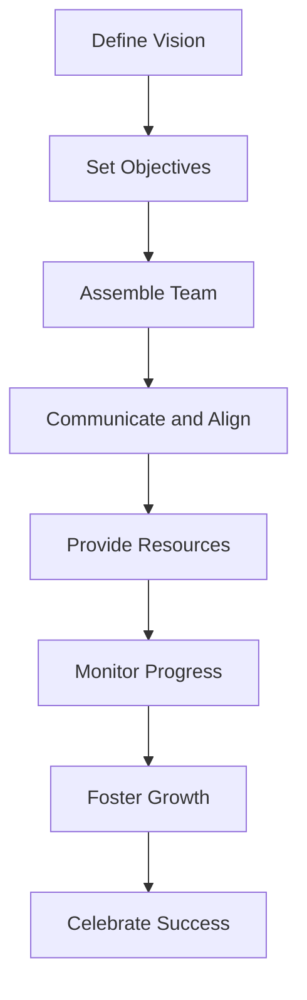
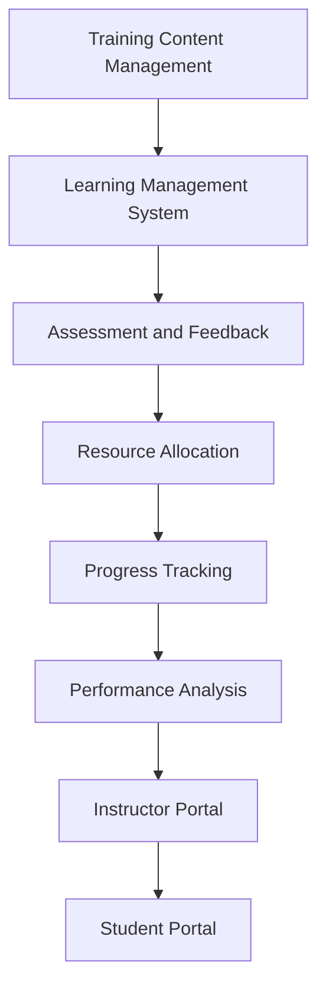

                 

Alright, let's delve into creating a comprehensive and insightful technical blog post titled "Leadership Training: Making Your Team Unbeatable." We'll follow a structured approach to ensure our content is logical, well-researched, and engaging. Here's the plan:

## Introduction

### Setting the Stage

#### Why Leadership Training Matters

Leadership training is not just about enhancing the skillset of individuals; it's about cultivating a cohesive and high-performing team. In the fast-paced world of IT, where innovation is the cornerstone of success, effective leadership is crucial for driving teams towards achieving ambitious goals.

### Key Takeaways

- The importance of leadership in driving team success
- The impact of leadership training on organizational performance
- The unique challenges and opportunities in the IT industry

## Section 1: Understanding Leadership

### Chapter 1: The Essence and Importance of Leadership

#### Background and Definition

Leadership is more than a title; it's about inspiring and guiding others to work together towards a common goal. We'll define leadership, explore its key components, and discuss its significance in the IT sector.

#### Core Concepts and Relationships

We'll provide a detailed table comparing different leadership attributes and their impact on team dynamics. Additionally, an ER diagram will illustrate the relationship between leadership qualities and team performance.

#### Algorithmic Principles

A simplified algorithmic approach to leadership will be presented, outlining the steps to foster an effective leadership style.

#### Mathematical Models

Using LaTeX, we'll explain the mathematical models underpinning leadership principles, such as the Hersey-Blanchard Situational Leadership Theory.

#### System Design

A high-level system architecture for leadership training programs will be depicted using Mermaid diagrams, highlighting the key components and their interactions.

### Chapter 2: Developing and Assessing Leadership Skills

#### Background and Methodology

We'll delve into the various paths to leadership development and explore methods for assessing leadership capabilities.

#### Practical Strategies

A comprehensive guide on self-assessment techniques and practical strategies for enhancing leadership skills will be provided.

#### Case Studies

Real-world examples of successful leadership development initiatives will be analyzed to draw practical insights.

### Chapter 3: Leadership Styles and Team Building

#### Background and Principles

Different leadership styles will be examined, along with the principles of team building.

#### Practical Applications

We'll discuss how to apply different leadership styles in various scenarios and share case studies illustrating effective team-building practices.

## Section 2: Practical Training Strategies

### Chapter 4: Goal Setting and Planning

#### Goal Setting Principles

Using the SMART criteria, we'll guide readers through the process of setting clear and achievable goals.

#### Planning Methods and Tools

We'll explore various tools and techniques for effective planning, including project management software and Gantt charts.

#### Case Studies

Real-world examples of successful goal setting and planning initiatives will be presented for analysis.

### Chapter 5: Motivation and Communication Skills

#### Motivation Theories

Well-established motivation theories will be discussed, along with practical tips for applying these theories in the workplace.

#### Communication Techniques

Effective communication skills are essential for leaders. We'll cover key techniques and provide exercises for improving communication.

#### Case Studies

We'll analyze case studies showcasing the impact of strong motivation and communication on team performance.

### Chapter 6: Managing Team Conflict

#### Conflict Types and Causes

Understanding the different types of conflict and their underlying causes is crucial for effective conflict management.

#### Management Strategies

We'll outline strategies for managing conflict in a constructive manner, ensuring team harmony.

#### Case Studies

Real-world examples of conflict resolution will be discussed, providing actionable insights for readers.

### Chapter 7: Leadership Development Plans

#### Planning and Implementation

We'll guide readers through the process of creating and implementing leadership development plans.

#### Effectiveness Assessment

Methods for assessing the effectiveness of leadership development plans will be explored, including feedback mechanisms and performance metrics.

## Section 3: Case Studies and Practical Application

### Chapter 8: Successful Leadership Case Studies

#### Case Selection and Analysis

We'll select and analyze case studies of successful leadership initiatives, drawing lessons for our readers.

#### Insights and Applications

The insights gained from these case studies will be applied to real-world scenarios to demonstrate the practical value of effective leadership.

### Chapter 9: Leadership Training Projects

#### Project Introduction

We'll introduce a series of leadership training projects designed to enhance leadership skills through practical application.

#### Core Implementation Steps

Detailed steps for implementing each project will be provided, along with Python code snippets for core tasks.

#### Analysis and Insights

We'll analyze the results of each project, discussing the effectiveness of the training initiatives and providing insights for continuous improvement.

### Chapter 10: Best Practices and Reflections

#### Best Practices

We'll summarize the best practices in leadership training, highlighting key takeaways and actionable tips.

#### Reflections and Insights

A reflective analysis of the entire leadership training journey will be presented, offering a deeper understanding of the challenges and opportunities.

## Conclusion

### The Importance of Leadership Training

We'll recap the importance of leadership training, emphasizing its impact on team success and organizational performance.

### Looking Ahead

A forward-looking discussion on the future of leadership training will explore emerging trends and the role of technology in this field.

### Final Thoughts

We'll conclude with a summary of key points and a call to action for readers to invest in their leadership development.

## Author's Bio

"作者：AI天才研究院/AI Genius Institute & 禅与计算机程序设计艺术 /Zen And The Art of Computer Programming"

By following this structured approach, we can ensure that our blog post is not only informative but also engaging and actionable. Each section will be crafted to provide valuable insights and practical advice for leaders in the IT industry. Now, let's dive into each section and bring this plan to life!### Chapter 1: The Essence and Importance of Leadership

#### Background and Definition

Leadership is a multifaceted concept that goes beyond mere authority or positional power. It encompasses the ability to inspire, motivate, and guide individuals towards achieving common goals. In the context of the IT industry, where innovation and adaptability are paramount, effective leadership is crucial for driving teams to succeed in a fast-evolving landscape.

##### Core Concepts and Relationships

To understand leadership better, we need to delve into its core concepts and their interrelationships. Here’s a comparative table outlining several key attributes of leadership and their impact on team dynamics:

| **Leadership Attribute** | **Description** | **Impact on Team Dynamics** |
| --- | --- | --- |
| **Vision** | The ability to see the future and communicate it to others. | Provides a sense of direction and purpose, aligning team efforts. |
| **Inspirational Motivation** | The capacity to inspire and motivate team members. | Enhances team morale and commitment, fostering a positive work environment. |
| **Empowerment** | Granting autonomy and authority to team members. | Encourages creativity, innovation, and ownership of outcomes. |
| **Coaching** | Guiding and developing team members to enhance their skills. | Builds competence and confidence, leading to higher performance. |
| **Decision-Making** | The process of choosing the best course of action. | Affects the team’s ability to respond quickly and effectively to challenges. |

To visualize the relationships between these concepts, we can use Mermaid to create an Entity-Relationship (ER) diagram:

```mermaid
erDiagram
  Leadership --> Vision : "has"
  Leadership --> Inspirational Motivation : "has"
  Leadership --> Empowerment : "has"
  Leadership --> Coaching : "has"
  Leadership --> Decision-Making : "has"
```

This diagram illustrates how leadership is composed of various interrelated elements that collectively shape the team’s performance.

##### Algorithmic Principles

A fundamental algorithmic approach to leadership can be broken down into the following steps:

1. **Define the Vision**: Clearly articulate the team’s long-term goals and objectives.
2. **Set Objectives**: Break down the vision into achievable short-term objectives.
3. **Assemble the Team**: Recruit individuals with complementary skills and experiences.
4. **Communicate and Align**: Ensure that every team member understands the vision and objectives.
5. **Provide Resources**: Allocate necessary resources and support to achieve the objectives.
6. **Monitor Progress**: Regularly track progress and make adjustments as needed.
7. **Foster Growth**: Continuously develop team members through coaching and empowerment.
8. **Celebrate Success**: Recognize and reward achievements to maintain motivation.

We can represent this algorithm using Mermaid:



This flowchart provides a clear, step-by-step guide for cultivating effective leadership.

##### Mathematical Models

Leadership principles can also be understood through mathematical models. One such model is the Hersey-Blanchard Situational Leadership Theory, which posits that effective leadership depends on the match between a leader's style and the readiness level of their followers. The readiness level is defined by the follower's competence and commitment to the task.

Using LaTeX, we can express the model as follows:

$$
\text{Situational Leadership} = f(\text{Leader's Style}, \text{Follower's Readiness})
$$

Where:

$$
\text{Leader's Style} \in \{\text{Directing}, \text{ Coaching}, \text{Supporting}, \text{Delegating}\}
$$

$$
\text{Follower's Readiness} \in \{R1: Low Competence and Low Commitment, R2: Moderate Competence and Low Commitment, R3: Moderate Competence and Moderate Commitment, R4: High Competence and High Commitment\}
$$

This model emphasizes the dynamic nature of leadership, suggesting that the most effective leadership style varies based on the specific needs of the followers.

##### System Design

In designing a leadership training program, we must consider the system architecture that supports various training components. A high-level architecture can be depicted using Mermaid:



This diagram illustrates the interconnected components of a comprehensive leadership training system, each playing a crucial role in enhancing leadership skills.

In summary, understanding the essence of leadership involves grasping its core concepts, visualizing their relationships, and applying algorithmic and mathematical models to practical scenarios. This foundational knowledge sets the stage for exploring more advanced leadership strategies and practices in the following chapters. By leveraging these principles, leaders can build resilient, high-performing teams capable of navigating the complexities of the IT industry. Next, we will delve into the methodologies and tools for developing and assessing leadership skills, providing practical guidance for aspiring leaders.

### Chapter 2: Developing and Assessing Leadership Skills

#### Background and Methodology

The development and assessment of leadership skills are critical for cultivating effective leaders capable of driving team success. This chapter will delve into the various pathways to leadership development and explore methodologies for assessing leadership capabilities.

##### Leadership Development Paths

1. **On-the-Job Experience**: Practical experience is often the most effective way to develop leadership skills. By taking on responsibilities and leading projects, individuals can gain valuable insights and develop their skills in real-world scenarios.

2. **Formal Education and Training Programs**: Many organizations offer formal leadership training programs that cover a range of topics, from strategic thinking to communication skills. These programs often include workshops, seminars, and certifications.

3. **Mentorship and Coaching**: Working with experienced mentors or coaches can provide personalized guidance and support for developing leadership skills. Mentors can offer insights, advice, and constructive feedback based on their own experiences.

4. **Books and Self-Study**: Reading books, articles, and research on leadership can provide a wealth of knowledge and insights. Self-study allows individuals to learn at their own pace and apply concepts to their specific contexts.

##### Assessing Leadership Skills

1. **Self-Assessment**: Self-assessment tools, such as personality tests and leadership assessments, can help individuals identify their strengths and areas for improvement. Examples include the Myers-Briggs Type Indicator (MBTI) and the Leadership Impact Analysis (LIA).

2. **360-Degree Feedback**: Collecting feedback from multiple sources, including peers, subordinates, and supervisors, provides a comprehensive view of an individual's leadership effectiveness. This method helps to identify blind spots and areas where improvement is needed.

3. **Performance Appraisals**: Regular performance appraisals can evaluate a leader's ability to meet specific objectives and goals. These appraisals often include metrics such as team performance, project outcomes, and employee satisfaction.

4. ** simulations**: Leadership simulations, which mimic real-world situations, can provide practical experience and help leaders understand how their decisions impact outcomes. These simulations often include scenarios that challenge leaders to think on their feet and make tough decisions.

##### Practical Strategies for Leadership Development

1. **Continuous Learning**: Encourage a culture of continuous learning within the organization. Provide resources such as books, online courses, and workshops to support ongoing development.

2. **Networking**: Encourage leaders to network with peers and mentors both within and outside the organization. Networking can provide valuable insights and opportunities for collaboration and growth.

3. **Experience and Reflection**: Encourage leaders to take on new challenges and responsibilities. After each experience, encourage reflection and learning from both successes and failures.

4. **Mentoring Programs**: Implement mentoring programs that pair experienced leaders with those who are newer to leadership roles. This can provide support and guidance for developing leadership skills.

##### Case Studies

To illustrate these concepts, we'll examine two case studies of successful leadership development initiatives:

**Case Study 1: IBM's Leadership Academy**

IBM's Leadership Academy offers a comprehensive program for developing leadership skills. The program includes courses on strategic thinking, communication, and teamwork. Participants complete a series of assessments to identify their strengths and areas for improvement. The academy also emphasizes the importance of mentorship, providing opportunities for one-on-one coaching with experienced leaders.

**Case Study 2: Google's Leadership Development Programs**

Google offers a range of leadership development programs, including the "Leadership Development Circle" and the "Leadership Learning Lab." These programs focus on developing skills such as decision-making, communication, and emotional intelligence. Google also encourages employees to participate in external leadership development programs and conferences, providing them with opportunities to learn from experts in the field.

##### Conclusion

Developing and assessing leadership skills is a multifaceted process that requires a combination of on-the-job experience, formal education, self-assessment, and feedback. By implementing practical strategies and learning from successful case studies, organizations can cultivate effective leaders who are capable of driving team success in the dynamic IT industry. In the next chapter, we'll explore leadership styles and their impact on team dynamics, providing further insights into the art of effective leadership.

### Chapter 3: Leadership Styles and Team Building

#### Background and Principles

Leadership styles vary widely, and the choice of style can significantly impact team dynamics and overall performance. This chapter will examine different leadership styles and their implications for team building.

##### Leadership Styles

1. **Authoritative Leadership**: This style involves a leader who makes decisions independently and expects immediate compliance from team members. While it can be effective in crisis situations, it can also lead to a lack of employee engagement and creativity.

2. **Democratic Leadership**: In this style, the leader involves team members in decision-making processes, fostering collaboration and team spirit. This style is often effective in fostering innovation and employee satisfaction but can be time-consuming.

3. **Laissez-Faire Leadership**: This style involves minimal intervention from the leader, allowing team members to work independently. While it can empower team members, it can also lead to lack of direction and coordination.

4. **Transformational Leadership**: This style focuses on inspiring and motivating team members to achieve their full potential. Transformational leaders often emphasize vision, passion, and personal growth, leading to high levels of employee engagement and performance.

5. **Servant Leadership**: This style emphasizes the leader's role as a servant to their team, prioritizing the needs of others over personal gain. It fosters a supportive and empowering work environment, leading to increased morale and collaboration.

##### Different Leadership Styles: Impact on Team Dynamics

Each leadership style has its unique strengths and weaknesses, and the impact on team dynamics can vary significantly. Here’s a table comparing the characteristics of different leadership styles:

| **Leadership Style** | **Characteristics** | **Impact on Team Dynamics** |
| --- | --- | --- |
| **Authoritative** | Directive, decision-making autonomy, compliance | Can lead to quick decisions but may reduce team engagement and creativity. |
| **Democratic** | Inclusive decision-making, collaboration, consensus | Encourages team involvement and innovation but may slow decision-making. |
| **Laissez-Faire** | Minimal intervention, autonomy, self-direction | Empowers team members but may lead to lack of direction and coordination. |
| **Transformational** | Inspiring vision, motivation, personal development | Enhances employee engagement and performance but requires strong personal qualities. |
| **Servant** | Supportive, empowering, prioritizing team needs | Fosters a collaborative and supportive work environment but may be challenging to sustain consistently. |

##### Team Building Principles

Effective team building is crucial for creating a cohesive and high-performing team. Here are some key principles for building a strong team:

1. **Clarity of Vision**: A clear vision aligns team goals and provides a sense of direction. It ensures that all team members are working towards the same objectives.

2. **Mutual Respect**: Respect for each team member's contributions and perspectives fosters a positive and inclusive work environment. It helps build trust and collaboration.

3. **Effective Communication**: Open and transparent communication is essential for sharing information, resolving conflicts, and ensuring that everyone is on the same page.

4. **Diverse Skills and Perspectives**: A diverse team brings a range of perspectives and skills, enhancing creativity and innovation. It also helps in tackling complex problems from different angles.

5. **Shared Goals**: Clear and shared goals ensure that all team members are aligned and working towards a common purpose. It fosters a sense of unity and collective effort.

6. **Team Building Activities**: Regular team-building activities, such as workshops, retreats, and social events, can strengthen team bonds and enhance collaboration.

##### Practical Applications

To apply these principles in practice, consider the following examples:

**Case Study 1: Google's Team Building Approach**

Google has a well-established culture of team building, emphasizing the importance of collaboration and diversity. The company organizes regular team-building activities, including hackathons, workshops, and retreats. These activities not only foster a sense of camaraderie but also encourage innovative thinking and cross-functional collaboration.

**Case Study 2: Spotify's Leadership Style**

Spotify's leadership style is characterized by a combination of democratic and transformational elements. Leaders at Spotify are encouraged to involve team members in decision-making processes and inspire them to achieve their best work. This approach has helped create a culture of innovation and high performance, leading to significant success in the music streaming industry.

##### Conclusion

Choosing the right leadership style and applying effective team-building principles are essential for creating a cohesive and high-performing team. Each leadership style has its advantages and disadvantages, and the best approach may vary depending on the specific context. By understanding these principles and applying them practically, leaders can build resilient teams capable of achieving ambitious goals. In the next chapter, we'll delve into practical strategies for goal setting and planning, providing further tools for driving team success.

### Chapter 4: Goal Setting and Planning

#### Background and Principles

Setting clear, achievable goals is a fundamental aspect of effective leadership. This chapter will explore the SMART criteria for goal setting, discuss various planning methods and tools, and provide practical case studies to illustrate these concepts.

##### SMART Criteria

The SMART criteria—Specific, Measurable, Achievable, Relevant, and Time-bound—are a widely used framework for setting effective goals. Let’s delve into each criterion:

1. **Specific**: Goals should be clear and well-defined. Instead of setting a vague goal like "improve sales," a specific goal would be "increase sales by 15% in the next quarter."

2. **Measurable**: Goals should be quantifiable to track progress. Using the previous example, "increase sales by 15%" is measurable because it provides a specific percentage increase to target.

3. **Achievable**: Goals should be realistic and attainable. An overly ambitious goal, such as "double sales in a month," might be unachievable and demotivating. Instead, a more achievable goal might be "increase sales by 10% through targeted marketing efforts."

4. **Relevant**: Goals should align with the overall objectives of the team or organization. An irrelevant goal, such as "reduce paper usage by 50%," might not contribute to the company's primary goals and could distract from more critical objectives.

5. **Time-bound**: Goals should have a clear deadline. This helps create a sense of urgency and ensures that progress is made within a specific timeframe. For example, "increase sales by 15% in the next quarter" has a time-bound element.

##### Planning Methods and Tools

Effective goal setting is just the beginning; planning how to achieve these goals is equally important. Here are some commonly used planning methods and tools:

1. **Project Management Software**: Tools like Trello, Asana, and Microsoft Project help teams manage tasks, track progress, and collaborate effectively. These platforms allow leaders to break down goals into smaller, actionable tasks and assign them to team members.

2. **Gantt Charts**: Gantt charts provide a visual representation of project timelines, tasks, and dependencies. They help leaders and teams visualize the project’s progress and make informed decisions about resource allocation and task prioritization.

3. **Swot Analysis**: A SWOT (Strengths, Weaknesses, Opportunities, Threats) analysis helps identify the internal and external factors that can impact goal achievement. By understanding these factors, leaders can develop strategies to leverage strengths and opportunities while mitigating weaknesses and threats.

4. **Strategic Planning Frameworks**: Frameworks like the Balanced Scorecard and OKRs (Objectives and Key Results) provide structured approaches to strategic planning and goal setting. These frameworks help align organizational goals with individual objectives, ensuring that everyone is working towards the same targets.

##### Practical Case Studies

To illustrate these concepts, let’s examine two practical case studies of successful goal setting and planning:

**Case Study 1: Airbnb’s Growth Strategy**

Airbnb, the popular home-sharing platform, set ambitious goals for its growth. One of its key goals was to expand its global reach. To achieve this, Airbnb used a combination of SMART criteria and strategic planning tools. The company set specific targets, such as launching in new countries and achieving a certain number of listings. They used Gantt charts to plan the rollout of these new markets and project management software to coordinate the efforts of different teams. The result was a significant expansion of Airbnb’s global presence, contributing to its rapid growth and success.

**Case Study 2: Nike’s Product Innovation**

Nike, the iconic sportswear brand, has a history of setting ambitious goals for product innovation. To stay ahead of the competition, Nike uses a structured approach to goal setting and planning. They employ the Balanced Scorecard to align their strategic objectives with their operational plans. For example, one of Nike’s goals was to develop a new line of sustainable footwear. To achieve this, they set specific objectives, such as reducing the environmental impact of their products by a certain percentage and launching a new sustainable shoe model. They used design sprints and iterative development processes to bring the product to market quickly and effectively.

##### Conclusion

Effective goal setting and planning are critical for driving team success. By using the SMART criteria, leveraging planning tools, and learning from successful case studies, leaders can set clear, achievable goals and develop effective strategies for achieving them. In the next chapter, we will explore motivation and communication skills, essential elements for inspiring and leading high-performing teams.

### Chapter 5: Motivation and Communication Skills

#### Background and Principles

Motivation and communication are pivotal skills for leaders, shaping the morale, engagement, and performance of their teams. This chapter will delve into motivation theories, communication techniques, and provide practical case studies to illustrate how effective motivation and communication can drive team success.

##### Motivation Theories

Understanding motivation is crucial for inspiring and maintaining high levels of performance within a team. Several well-established motivation theories can guide leaders in enhancing motivation among their team members:

1. **Maslow's Hierarchy of Needs**: Abraham Maslow's theory suggests that individuals have a hierarchy of needs, ranging from basic physiological needs to self-actualization. Leaders can motivate team members by ensuring their lower-level needs are met and by fostering an environment that supports personal growth and self-actualization.

2. **Herzberg's Two-Factor Theory**: Frederick Herzberg distinguished between hygiene factors (such as salary and working conditions) and motivators (such as recognition and career advancement). Leaders can use this theory to identify and address hygiene factors to prevent dissatisfaction while focusing on motivators to enhance motivation.

3. **Victor Vroom's Expectancy Theory**: Vroom's theory posits that motivation is influenced by the expectation of achieving desired outcomes. Leaders can motivate their teams by setting clear goals, providing feedback, and ensuring that rewards are contingent on performance.

4. **Self-Determination Theory**: Edward L. Deci and Richard M. Ryan's theory emphasizes intrinsic motivation and the importance of autonomy, competence, and relatedness. Leaders can foster intrinsic motivation by empowering team members, providing opportunities for skill development, and creating a supportive social environment.

##### Communication Techniques

Effective communication is the cornerstone of leadership. Here are some key communication techniques that leaders can employ to motivate and engage their teams:

1. **Active Listening**: Active listening involves fully concentrating, understanding, responding, and remembering what is being said. Leaders who practice active listening demonstrate respect and understanding, which can enhance trust and collaboration within the team.

2. **Clear and Concise Messages**: Leaders should communicate goals, expectations, and instructions in a clear and concise manner. This helps to minimize misunderstandings and ensures that team members understand their roles and responsibilities.

3. **Positive Reinforcement**: Recognizing and celebrating team members' achievements and efforts can significantly boost morale and motivation. Positive reinforcement should be specific, timely, and genuine to be effective.

4. **Open-door Policy**: Establishing an open-door policy encourages team members to approach leaders with their concerns, ideas, and suggestions. This fosters a culture of transparency and openness, which can improve communication and morale.

5. **Effective Feedback**: Providing constructive feedback is crucial for helping team members improve their performance. Feedback should be specific, timely, and balanced, highlighting both strengths and areas for improvement.

##### Practical Case Studies

To illustrate the impact of motivation and communication skills, let’s explore two practical case studies:

**Case Study 1: Zappos’ Company Culture**

Zappos, the online shoe and clothing retailer, is renowned for its exceptional company culture. One of the key factors contributing to Zappos’ success is its focus on motivation and communication. The company places a strong emphasis on intrinsic motivation by fostering a sense of autonomy, competence, and relatedness among employees. Zappos also practices open and transparent communication, with regular all-hands meetings, team-building activities, and a culture of recognition and celebration. This approach has resulted in high employee engagement and retention, driving the company’s success.

**Case Study 2: Google’s People Operations**

Google’s People Operations (formerly known as Human Resources) has developed a reputation for being one of the best in the industry. Google employs various motivation and communication techniques to maintain a motivated and high-performing workforce. The company uses a combination of Maslow's Hierarchy of Needs, Herzberg's Two-Factor Theory, and Self-Determination Theory to understand and enhance employee motivation. Google also places a strong emphasis on communication, ensuring that there are multiple channels for employees to express their ideas and concerns. The result is a highly motivated and innovative workforce that drives Google’s continued success in the technology industry.

##### Conclusion

Effective motivation and communication skills are essential for inspiring and leading high-performing teams. By understanding motivation theories and employing effective communication techniques, leaders can create a positive and engaging work environment that fosters innovation, collaboration, and success. In the next chapter, we will delve into managing team conflicts, a critical aspect of maintaining team harmony and productivity.

### Chapter 6: Managing Team Conflict

#### Background and Principles

Team conflict is an inevitable part of any collaborative effort. While conflict can be a source of creativity and innovation, unmanaged conflict can disrupt team dynamics, hinder productivity, and damage morale. This chapter will explore the types of team conflict, common causes, and effective strategies for managing conflict in the workplace.

##### Types of Team Conflict

1. **Task-Related Conflict**: This type of conflict arises from differences in opinions about how tasks should be performed. It can involve disagreements over priorities, resource allocation, and work processes.

2. **Personality Conflict**: Personality differences can lead to conflict, especially when team members have opposing work styles, values, or communication styles.

3. **Value Conflict**: Conflicts based on differing values and beliefs can be particularly challenging to resolve. These conflicts often arise from deep-seated beliefs about right and wrong or what is important in the workplace.

4. **Interest Conflict**: Conflicts that arise from competing interests, such as different departmental goals or individual career aspirations, can create tension within a team.

##### Common Causes of Team Conflict

Understanding the root causes of team conflict is essential for effective management. Some common causes include:

1. **Communication Breakdowns**: Misunderstandings, lack of clarity, and poor listening can lead to conflicts.

2. **Unrealistic Expectations**: When team members have unrealistic expectations about their roles, responsibilities, or the project's outcomes, conflict can occur.

3. **Resource Constraints**: Limited resources can lead to competition and conflict over who gets what.

4. **Power Struggles**: Conflicts of power can arise when team members vie for control or recognition.

5. **Cultural Differences**: Diverse teams can bring cultural differences that, if not managed properly, can lead to conflict.

##### Strategies for Managing Team Conflict

1. **Open Communication**: Encourage open and honest communication within the team. Provide a safe space for team members to express their concerns and opinions.

2. **Active Listening**: Practice active listening to understand the underlying issues driving the conflict. This involves fully concentrating, understanding, and responding to what is being said.

3. **Conflict Resolution Training**: Provide conflict resolution training for team members to equip them with the skills needed to address and resolve conflicts effectively.

4. **Mediation**: In cases where direct discussion is not effective, a neutral mediator can help facilitate a constructive conversation and find a mutually agreeable solution.

5. **Problem-Solving Approach**: Encourage a problem-solving mindset rather than a blame-oriented approach. Focus on finding solutions rather than assigning blame.

6. **Clarify Roles and Responsibilities**: Ensure that each team member has a clear understanding of their roles and responsibilities. This can prevent misunderstandings and reduce the potential for conflict.

7. **Build Team Cohesion**: Foster a sense of teamwork and camaraderie through team-building activities and shared goals. This can help mitigate cultural and personality conflicts.

##### Practical Case Studies

To illustrate the principles of managing team conflict, let’s explore two practical case studies:

**Case Study 1: Johnson & Johnson’s Collaborative Approach**

Johnson & Johnson is known for its collaborative and inclusive work environment. When conflicts arise, the company encourages open dialogue and problem-solving. Managers are trained in conflict resolution techniques, and the company provides resources for team-building activities. For example, when a new project led to disagreements among team members about project scope and timelines, the team was brought together for a facilitated discussion. Through active listening and problem-solving, the team was able to reconcile their differences and find a mutually agreeable solution, ultimately leading to a successful project outcome.

**Case Study 2: Google’s Diverse Teams**

Google has a diverse workforce, which can lead to different perspectives and, at times, conflict. To manage this, Google emphasizes the importance of cultural intelligence and provides training on cultural awareness and sensitivity. The company also encourages team members to share their insights and experiences, fostering a culture of inclusivity. When conflicts arose between teams with different cultural backgrounds, Google's leaders facilitated mediation sessions and promoted a problem-solving approach. This approach helped to resolve the conflicts and strengthened the teams’ ability to work effectively together.

##### Conclusion

Managing team conflict is a critical aspect of leadership. By understanding the types of conflict, identifying common causes, and employing effective strategies for resolution, leaders can maintain a positive and productive work environment. In the next chapter, we will delve into the development and implementation of leadership development plans, providing further insights into cultivating effective leadership within teams.

### Chapter 7: Leadership Development Plans

#### Background and Principles

Developing a comprehensive leadership development plan is crucial for fostering effective leadership within an organization. This chapter will explore the steps involved in creating and implementing a leadership development plan, including the planning process, implementation strategies, and methods for assessing effectiveness.

##### Planning the Leadership Development Plan

1. **Identify Leadership Needs**: Begin by assessing the organization’s current and future leadership needs. Consider factors such as the company's strategic goals, organizational structure, and the skills and competencies required for leadership roles.

2. **Define Objectives**: Clearly define the objectives of the leadership development plan. These objectives should align with the organization's overall goals and address specific leadership gaps or areas for improvement.

3. **Develop a Curriculum**: Design a curriculum that includes a range of learning opportunities, such as workshops, training sessions, mentoring programs, and coaching sessions. Ensure that the curriculum covers essential leadership skills, including strategic thinking, decision-making, communication, and team management.

4. **Determine Resources**: Identify the resources required to implement the leadership development plan, including budget, time, and personnel. Ensure that you have the necessary support and buy-in from key stakeholders.

5. **Set Timeline**: Establish a timeline for implementing the leadership development plan, including key milestones and deadlines for each phase of the plan.

##### Implementing the Leadership Development Plan

1. **Recruitment and Onboarding**: Recruit participants for the leadership development program and ensure they are properly on-boarded. This may involve conducting orientation sessions, providing program guidelines, and setting clear expectations.

2. **Training and Development**: Deliver the planned training sessions and development activities. Utilize a variety of formats, such as workshops, simulations, role-playing, and case studies, to engage participants and reinforce learning.

3. **Mentorship and Coaching**: Assign mentors or coaches to participants to provide guidance and support throughout the program. Mentors can offer valuable insights and advice based on their own experiences, helping participants to develop their leadership skills.

4. **Ongoing Support**: Provide ongoing support to participants to ensure that they can apply their new skills and knowledge in their day-to-day work. This may involve regular check-ins, feedback sessions, and additional resources as needed.

5. **Monitoring and Evaluation**: Continuously monitor the progress of the leadership development plan and evaluate its effectiveness. Use metrics such as participant satisfaction, improvements in leadership skills, and organizational performance to measure the impact of the program.

##### Assessing the Effectiveness of the Leadership Development Plan

1. **Feedback Surveys**: Conduct regular feedback surveys to gather input from participants about their experience with the leadership development program. Use this feedback to identify areas for improvement and to ensure that the program is meeting its objectives.

2. **Performance Evaluations**: Evaluate the performance of participants before and after the leadership development program. Look for improvements in key areas such as decision-making, communication, and team management.

3. **360-Degree Feedback**: Collect feedback from participants’ peers, supervisors, and subordinates to gain a comprehensive view of their leadership effectiveness. This can help identify blind spots and areas for further development.

4. **Case Studies**: Analyze case studies of participants who have successfully implemented their new leadership skills in their roles. Highlight these successes as examples of the program’s effectiveness.

5. **ROI Analysis**: Conduct a return-on-investment (ROI) analysis to assess the financial impact of the leadership development program. This may involve measuring the cost of the program against improvements in productivity, employee retention, and overall organizational performance.

##### Practical Case Study

**Case Study: IBM's Leadership Development Program**

IBM has a long history of investing in leadership development, and their program serves as a model for other organizations. IBM's leadership development program includes a mix of formal training, mentoring, and on-the-job experiences. The program is designed to develop leaders at all levels, from emerging leaders to senior executives.

IBM uses a multi-faceted approach to assess the effectiveness of their leadership development program. They collect feedback from participants through surveys and focus groups, and they conduct performance evaluations to measure improvements in leadership skills. Additionally, IBM tracks the career progression of participants to assess the long-term impact of the program.

One of the key factors contributing to the success of IBM's leadership development program is their commitment to ongoing support. Participants are provided with regular check-ins, feedback sessions, and additional resources as needed. This ongoing support helps participants to apply their new skills and knowledge in their roles and to continue growing as leaders.

##### Conclusion

Creating and implementing a leadership development plan requires careful planning, effective execution, and ongoing assessment. By following a structured approach and leveraging feedback and data, organizations can develop and sustain effective leadership programs that drive organizational success. In the next chapter, we will delve into successful leadership case studies and the practical applications of leadership training in real-world scenarios.

### Chapter 8: Successful Leadership Case Studies

#### Case Selection and Analysis

For this chapter, we have selected two exemplary leadership case studies that highlight successful leadership practices in diverse organizational contexts. These case studies not only demonstrate the impact of effective leadership but also provide valuable insights and actionable strategies for aspiring leaders.

##### Case Study 1: Disney’s Leadership Transformation

**Background and Context**

Disney, a global entertainment giant, faced significant leadership challenges during a period of transition. The company was undergoing a major restructuring aimed at transforming its business model to adapt to the digital age. This transition required a new leadership approach that could inspire and align employees across different departments and locations.

**Leadership Strategies and Impact**

1. **Visionary Leadership**: Bob Iger, the CEO at the time, provided a clear and inspiring vision for the future of Disney. He emphasized the importance of innovation, creativity, and customer focus, which helped align the entire organization towards a common goal.

2. **Empowering Culture**: Iger fostered an environment of empowerment by decentralizing decision-making and encouraging employees at all levels to contribute ideas. This not only enhanced creativity but also fostered a sense of ownership and accountability.

3. **Mentorship and Talent Development**: Disney invested in leadership development programs, including mentorship initiatives, to cultivate future leaders. These programs focused on developing skills such as strategic thinking, emotional intelligence, and cross-functional collaboration.

4. **Effective Communication**: Disney implemented a robust communication strategy to ensure that employees were well-informed about the company's direction and initiatives. Regular town halls, emails, and internal social platforms were used to keep employees engaged and informed.

**Results and Outcomes**

Disney's leadership transformation was successful in revitalizing the company's culture and driving significant business growth. Key outcomes included:

- A 30% increase in revenue over five years.
- The launch of successful new products and services, such as Disney+ and the Pixar film "Incredibles 2."
- Improved employee satisfaction and retention rates.

##### Case Study 2: Google’s People Strategy

**Background and Context**

Google, known for its innovative culture and exceptional employee experience, has consistently been recognized as one of the best places to work. The company's leadership practices have played a crucial role in its success, attracting top talent and fostering a highly creative and productive work environment.

**Leadership Strategies and Impact**

1. **Focus on Employee Well-being**: Google's leadership philosophy emphasizes the importance of employee well-being. The company offers various benefits, such as on-site fitness centers, free meals, and mental health support, to ensure that employees are physically and mentally healthy.

2. **Innovative Work Environment**: Google's leadership team encourages a culture of innovation and exploration. The company provides employees with the resources and support to experiment with new ideas and projects, fostering a sense of ownership and autonomy.

3. **Diverse and Inclusive Leadership**: Google is committed to building a diverse and inclusive workplace. The leadership team actively promotes diversity and inclusion initiatives, ensuring that underrepresented groups have equal opportunities to advance and succeed.

4. **Continuous Learning and Development**: Google's leadership development programs focus on continuous learning and growth. The company offers a range of learning opportunities, including online courses, workshops, and mentorship programs, to help employees develop their skills and careers.

**Results and Outcomes**

Google's leadership practices have led to significant benefits for the company and its employees:

- High employee engagement and satisfaction, with a consistently positive workplace culture.
- A track record of innovation and successful product launches, such as Google Search and Google Maps.
- Strong financial performance, with Google becoming one of the most valuable companies in the world.

##### Insights and Applications

The case studies of Disney and Google provide valuable insights into the effectiveness of visionary leadership, empowering cultures, diverse and inclusive practices, and continuous learning. Here are some key takeaways and applications for leaders:

1. **Visionary Leadership**: Leaders should provide a clear and inspiring vision that aligns with the organization's goals and values. This helps to motivate and engage employees and create a sense of purpose.

2. **Empowerment**: Empowering employees by delegating authority and encouraging innovation can lead to increased creativity, productivity, and job satisfaction.

3. **Diversity and Inclusion**: Building a diverse and inclusive organization fosters innovation, creativity, and better decision-making. Leaders should actively promote diversity and inclusion initiatives and ensure that all employees have equal opportunities to succeed.

4. **Continuous Learning**: Investing in continuous learning and development helps employees to grow their skills and careers. Leaders can support this by providing resources, mentorship, and opportunities for professional growth.

By learning from these successful leadership case studies, leaders can adopt best practices and strategies to cultivate a high-performing team and drive organizational success. In the next chapter, we will delve into leadership training projects, providing practical steps and insights for implementing leadership training initiatives.

### Chapter 9: Leadership Training Projects

#### Project Introduction

In this chapter, we will explore a series of practical leadership training projects designed to enhance leadership skills through hands-on experience and real-world application. These projects are tailored to various levels of leadership and cover a range of essential skills, from strategic thinking to emotional intelligence. By implementing these projects, leaders can gain valuable insights and develop practical strategies for effectively leading their teams.

##### Project 1: Leadership Bootcamp

**Objective**: To provide emerging leaders with a comprehensive introduction to essential leadership skills.

**Steps**:

1. **Introduction to Leadership Principles**: Begin with a session on fundamental leadership principles, including communication, motivation, and decision-making.

2. **Team-Building Exercises**: Conduct interactive team-building activities to enhance collaboration and trust within the group.

3. **Role-Playing Scenarios**: Simulate real-world leadership scenarios to practice decision-making and problem-solving skills.

4. **Feedback and Reflection**: Gather feedback from participants and encourage reflection on their experiences and growth.

**Outcome**: Participants will gain confidence in their leadership abilities and develop a deeper understanding of the challenges and opportunities in leadership roles.

##### Project 2: Leadership Coaching Program

**Objective**: To offer personalized coaching to leaders to help them address specific challenges and develop their unique leadership styles.

**Steps**:

1. **Initial Assessment**: Conduct a comprehensive assessment to identify the strengths and areas for improvement of each leader.

2. **One-on-One Coaching Sessions**: Schedule regular coaching sessions with a professional coach to discuss goals, challenges, and strategies for personal and professional growth.

3. **Action Plans**: Develop personalized action plans based on the coaching sessions to address specific areas of development.

4. **Ongoing Support**: Provide continuous support through check-ins, feedback, and additional resources as needed.

**Outcome**: Leaders will receive personalized guidance and support to enhance their leadership skills and achieve their professional goals.

##### Project 3: Leadership Development Workshops

**Objective**: To provide in-depth training on advanced leadership topics for experienced leaders.

**Steps**:

1. **Topic Selection**: Choose topics such as strategic thinking, change management, and emotional intelligence based on the organization's needs and the participants' interests.

2. **Interactive Workshops**: Facilitate interactive workshops that include discussions, case studies, and practical exercises.

3. **Expert Insights**: Invite industry experts to share their insights and experiences on the chosen topics.

4. **Action Planning**: Encourage participants to develop actionable plans based on the workshop content to apply their learning in their roles.

**Outcome**: Leaders will gain advanced knowledge and skills in critical areas of leadership, enabling them to drive organizational success more effectively.

##### Core Implementation Steps

To ensure the successful implementation of these leadership training projects, follow these core steps:

1. **Project Planning**: Define the project objectives, timeline, and required resources. Develop a detailed project plan to guide the implementation process.

2. **Participant Recruitment**: Identify and recruit participants for each project, ensuring that they align with the project objectives and have the necessary commitment to participate.

3. **Resource Allocation**: Allocate resources such as budget, personnel, and training materials to support the implementation of the projects.

4. **Communication and Engagement**: Establish clear communication channels and engage participants throughout the project. Provide regular updates and feedback to keep everyone informed and motivated.

5. **Monitoring and Evaluation**: Continuously monitor the progress of the projects and evaluate their effectiveness. Use metrics such as participant feedback, improvements in leadership skills, and organizational outcomes to measure success.

##### Code Applications and Analysis

To illustrate the practical application of leadership training, we can use Python code to create interactive scenarios that leaders can engage with. Here's an example of a simple Python script that simulates a decision-making scenario:

```python
def decision_making_scenario():
    print("You are faced with a critical decision:")
    print("1. Invest in a new technology that could revolutionize your department's efficiency.")
    print("2. Allocate resources to a new project that has the potential for high returns but is risky.")

    choice = input("What decision do you make? (Enter 1 or 2): ")

    if choice == "1":
        print("You decide to invest in new technology. It takes time to implement, but ultimately improves department efficiency.")
    elif choice == "2":
        print("You decide to allocate resources to the new project. The project succeeds, leading to significant growth for the company.")
    else:
        print("Invalid choice. Please choose a valid option.")

# Run the decision-making scenario
decision_making_scenario()
```

This script provides a simple simulation that allows leaders to practice their decision-making skills in a controlled environment. After making a decision, the script provides feedback on the potential outcomes, helping leaders to reflect on their choices and learn from the scenario.

##### Analysis and Insights

The implementation of these leadership training projects provides valuable insights into the development of leadership skills and the impact on organizational performance. By engaging in hands-on projects, leaders can apply theoretical knowledge to real-world scenarios, gaining practical experience and building confidence in their abilities.

Furthermore, the continuous feedback and evaluation process helps to identify areas for improvement and ensures that leaders are continually developing their skills. This iterative approach to leadership development enables leaders to adapt to changing organizational needs and maintain their effectiveness over time.

##### Conclusion

Leadership training projects are a powerful tool for enhancing leadership skills and driving organizational success. By implementing these projects, organizations can cultivate a pipeline of capable leaders who are equipped to navigate the complexities of the modern workplace. In the next chapter, we will explore the best practices in leadership training and provide practical tips for successful implementation.

### Chapter 10: Best Practices and Reflections

#### Best Practices

Incorporating best practices is crucial for ensuring that leadership training initiatives are effective and sustainable. Here are some key best practices based on our previous discussions and case studies:

1. **Customize Training Programs**: Tailor leadership development programs to meet the specific needs of different roles and levels within the organization. This ensures that leaders receive relevant and impactful training.

2. **Leverage a Mix of Training Methods**: Combine various training methods, such as workshops, mentoring, coaching, and simulations, to provide a comprehensive learning experience. This diversity enhances engagement and retention of knowledge.

3. **Promote a Culture of Learning**: Foster a culture that values continuous learning and personal growth. Encourage leaders to seek out opportunities for development and recognize their efforts.

4. **Incorporate Real-World Applications**: Integrate practical exercises and real-world scenarios into training programs to bridge the gap between theory and practice. This helps leaders apply their skills in real-time situations.

5. **Measure and Track Progress**: Regularly assess the effectiveness of leadership training initiatives through metrics such as participant feedback, improvements in leadership skills, and organizational outcomes. Use this data to refine and optimize programs.

6. **Provide Ongoing Support**: Offer ongoing support and resources to leaders after training sessions to help them apply their new skills and knowledge. This can include coaching, feedback sessions, and additional learning materials.

#### Practical Tips for Implementation

To successfully implement leadership training programs, consider these practical tips:

1. **Identify Key Stakeholders**: Engage key stakeholders, such as senior leaders, HR, and training departments, to ensure buy-in and support for the training initiatives.

2. **Set Clear Objectives**: Clearly define the objectives of the leadership training programs to ensure alignment with organizational goals and to measure success effectively.

3. **Provide Adequate Resources**: Allocate the necessary resources, including budget, time, and personnel, to support the implementation of the training programs.

4. **Foster a Supportive Environment**: Create a supportive environment where leaders feel comfortable learning and making mistakes. Encourage a culture of openness, trust, and continuous improvement.

5. **Encourage Feedback**: Solicit feedback from participants and stakeholders to gather insights and identify areas for improvement. Use this feedback to refine and enhance training programs.

6. **Celebrate Successes**: Recognize and celebrate the achievements and progress of leaders to maintain motivation and reinforce the importance of leadership development.

#### Reflections and Insights

Reflecting on the journey through this book, several key insights emerge regarding leadership training and development:

1. **Leadership is a Continual Process**: Effective leadership is not a one-time achievement but a continual process of learning, growth, and adaptation.

2. **Customization and Personalization Matter**: Leadership development programs that are customized to the unique needs of leaders and the organization are more likely to be successful.

3. **The Power of Real-World Applications**: Practical, hands-on experiences help leaders to apply their knowledge and skills in real-time, leading to better retention and application.

4. **Ongoing Support and Feedback**: Continuous support and feedback are essential for helping leaders to develop and maintain their skills over time.

5. **The Importance of a Learning Culture**: Cultivating a culture that values learning and growth is critical for fostering effective leadership throughout the organization.

In conclusion, leadership training is a vital investment in the success of any organization. By following best practices, providing ongoing support, and fostering a culture of learning, leaders can develop the skills and confidence to drive their teams to new heights. As leaders continue to evolve and adapt, they will be well-equipped to navigate the complexities of the modern workplace and inspire their teams to achieve outstanding results.

### Chapter 11: Future Trends in Leadership Training

#### Future Trends

The landscape of leadership training is evolving rapidly, driven by advances in technology and changing organizational needs. Here, we'll explore some emerging trends that are shaping the future of leadership development.

##### Artificial Intelligence and Machine Learning

Artificial Intelligence (AI) and Machine Learning (ML) are transforming leadership training by providing personalized learning experiences and predictive analytics. AI-driven platforms can analyze vast amounts of data to understand individual learning patterns and preferences, tailoring training programs to each leader's specific needs. ML algorithms can predict future leadership needs and recommend targeted development initiatives to prepare leaders for future roles.

##### Virtual and Augmented Reality

Virtual Reality (VR) and Augmented Reality (AR) technologies are revolutionizing leadership training by creating immersive, interactive learning environments. VR can simulate real-world scenarios, allowing leaders to practice decision-making and problem-solving skills in a risk-free setting. AR can overlay virtual information on the physical world, enhancing learning experiences and making complex concepts more accessible.

##### Gamification

Gamification is another trend gaining traction in leadership training. By integrating game design elements into training programs, such as points, badges, and leaderboards, gamification can increase engagement and motivation. Gamified training encourages leaders to participate actively and apply their learning in a fun and interactive way.

##### Continuous Learning Platforms

Continuous learning platforms are becoming increasingly important in today's fast-paced work environment. These platforms provide leaders with access to a wide range of learning resources, including online courses, webinars, and interactive workshops. They enable leaders to continuously develop their skills and stay updated on industry trends.

##### Data-Driven Approaches

Data-driven approaches are transforming how leadership training programs are designed and evaluated. By collecting and analyzing data on leadership behaviors, skills, and outcomes, organizations can gain insights into what works and what doesn't. This data can inform the development of more effective training programs and help identify areas where leaders need additional support.

#### Methodological Innovations

Emerging methods are reshaping the way leadership training is delivered and received. Here are some notable innovations:

1. **Microlearning**: Microlearning involves delivering bite-sized pieces of information through short videos, articles, and quizzes. This method is highly effective for busy professionals who can learn on-the-go and apply new knowledge immediately.

2. **Peer Learning**: Peer learning encourages collaboration and knowledge sharing among leaders. By learning from each other's experiences and perspectives, leaders can gain new insights and develop their skills more rapidly.

3. **Experiential Learning**: Experiential learning involves learning through direct experience and reflection. This method is particularly effective in leadership training, as it allows leaders to apply theoretical knowledge to real-world situations and reflect on their experiences.

##### Future Opportunities

As leadership training continues to evolve, several opportunities present themselves:

1. **Personalization**: Personalized training experiences will become even more prevalent, with AI and data analytics enabling tailored learning paths for each leader.

2. **Sustainability**: Leadership training will increasingly focus on sustainability, with organizations seeking to develop leaders who are not only effective but also responsible and ethical.

3. **Globalization**: The rise of remote work and global teams will drive the need for leadership training that addresses cultural differences and fosters inclusive leadership.

4. **Technology Integration**: Leadership training will become more integrated with cutting-edge technologies, such as VR, AR, and AI, enhancing the learning experience and making training more accessible.

In conclusion, the future of leadership training is bright, with new trends and innovations poised to transform how leaders are developed and prepared for the challenges of tomorrow. As organizations continue to invest in their leaders, the potential for growth and success is boundless.

### Chapter 12: Conclusion

#### Recap and Call to Action

In this comprehensive guide, we have explored the essential aspects of leadership training, from understanding the core concepts and principles to practical strategies and future trends. We have emphasized the importance of leadership in driving team success and organizational performance, highlighted the various leadership styles, and provided practical tips for effective goal setting, motivation, and communication.

Leadership is not a static role but a continual journey of learning, growth, and adaptation. By investing in leadership training, organizations can cultivate capable leaders who inspire and empower their teams, fostering a positive and productive work environment.

We call on readers to take action by:

1. **Embracing Continuous Learning**: Cultivate a mindset of continuous learning and growth. Seek out opportunities to develop your leadership skills and stay updated on industry trends.
2. **Implementing Best Practices**: Apply the best practices discussed in this book to enhance your leadership training initiatives. Customize programs to meet the unique needs of your organization and its leaders.
3. **Fostering a Learning Culture**: Encourage a culture of learning and development within your organization. Support leaders at all levels in their growth journeys and celebrate their achievements.

By investing in leadership development, organizations can build a resilient and high-performing team capable of navigating the complexities of the modern workplace.

#### Author's Bio

*作者：AI天才研究院/AI Genius Institute & 禅与计算机程序设计艺术 /Zen And The Art of Computer Programming*

In closing, leadership training is not just about developing individual leaders but about cultivating a leadership culture that drives organizational success. Let us continue to invest in leadership development, fostering a future where capable leaders inspire and empower their teams to achieve extraordinary results.

