                 

# 领导力训练：让你的团队战无不胜

关键词：领导力、团队建设、沟通技巧、激励、决策、战略规划、实战案例

摘要：本文从领导力的本质与意义、领导力模型与类型、团队建设与沟通技巧、激励与激励理论、决策与战略规划、领导力发展的路径以及实战案例与经验分享等多个维度，详细阐述了领导力训练的重要性和实际操作方法，旨在帮助读者提升领导力，打造战无不胜的团队。

## 第1章：领导力的本质与意义

### 1.1 领导力的定义

领导力，简而言之，就是引导和激励他人实现共同目标的能力。它不仅仅是一种职位或权力的象征，更是一种行为模式、一种思维方式，一种在不确定和复杂环境中引导团队取得成功的艺术。

### 1.2 领导力的意义

领导力对于个人和组织的重要性不言而喻。对于个人而言，具备领导力可以提升个人的影响力，增强个人在团队中的话语权。对于组织而言，领导力是确保团队高效运作、实现组织目标的关键因素。一个优秀的领导力可以激发团队的创造力，提升团队凝聚力，实现组织目标的最大化。

### 1.3 领导力的重要性

在当今复杂多变的环境中，领导力的重要性更加凸显。首先，领导力是解决问题的关键。在遇到问题时，领导者能够迅速找到解决方案，并引导团队共同面对。其次，领导力是提升团队效能的关键。一个具备领导力的人，能够激发团队成员的潜力，提高团队的整体工作效率。最后，领导力是推动组织变革的力量。在面对外部环境的变化时，领导者能够引领组织进行变革，确保组织的可持续发展。

## 第2章：领导力模型与类型

### 2.1 经典领导力模型

领导力模型是对领导力实践的总结和提炼。常见的领导力模型包括行为领导模型、情境领导模型、变革领导模型等。每种模型都有其独特的特点和适用场景。

### 2.2 领导力类型的划分

领导力类型的划分可以帮助我们更好地理解领导力的本质。常见的领导力类型包括命令型领导、授权型领导、变革型领导等。每种领导力类型都有其优势和劣势，需要根据具体情境进行选择和应用。

### 2.3 领导风格与特点

领导风格是领导者个人特质的体现。常见的领导风格包括民主型、独裁型、参与型等。每种领导风格都有其独特的特点和适用场景。领导者需要根据团队的特点和任务的要求，灵活调整领导风格，以实现最佳领导效果。

## 第3章：团队建设与沟通技巧

### 3.1 团队建设的重要性

团队建设是提升团队效能的关键。一个高效的团队，需要有共同的目标、明确的角色分工、良好的沟通和协作。团队建设的重要性体现在提升团队凝聚力、提高工作效率、增强团队创新能力等方面。

### 3.2 团队成员的角色与责任

团队成员的角色与责任是团队建设的基础。每个团队成员都需要明确自己的角色和责任，发挥自己的专长，为团队的目标贡献自己的力量。

### 3.3 沟通技巧的提升

沟通技巧是团队建设的关键。一个高效的团队，需要具备良好的沟通技巧。领导者需要通过有效的沟通，确保团队成员对任务的了解和执行，同时，也要鼓励团队成员之间的交流和合作。

## 第4章：激励与激励理论

### 4.1 激励的基本原理

激励是提升团队士气、激发团队潜力的重要手段。激励的基本原理包括目标激励、成就激励、兴趣激励等。领导者需要根据团队成员的特点和需求，选择合适的激励方式。

### 4.2 常见激励理论介绍

常见的激励理论包括马斯洛需求层次理论、赫兹伯格双因素理论、麦克莱兰德成就需要理论等。这些理论为领导者提供了理论依据，帮助领导者更好地理解和运用激励策略。

### 4.3 实践中的激励策略

激励策略的实施需要结合实际情况。领导者需要通过设定明确的目标、提供奖励、关注团队成员的成长等手段，激发团队成员的积极性和创造力。

## 第5章：决策与战略规划

### 5.1 决策的定义与过程

决策是领导者的重要职责。决策的定义与过程包括问题的识别、目标的设定、备选方案的制定、方案的评价和选择等。

### 5.2 战略规划的重要性

战略规划是组织发展的指南针。战略规划的重要性体现在确保组织的长期发展、提升组织的竞争力、实现组织的目标等方面。

### 5.3 战略规划的基本步骤

战略规划的基本步骤包括愿景和使命的制定、外部环境的分析、内部能力的评估、战略目标的设定、战略路径的选择等。

## 第6章：领导力发展的路径

### 6.1 领导力发展的阶段

领导力发展是一个持续的过程，包括认知阶段、行动阶段、反思阶段等。每个阶段都有其独特的特点和挑战。

### 6.2 领导力自我提升的方法

领导力自我提升的方法包括学习领导力理论、参与领导力培训、反思领导力实践等。通过不断的学习和实践，领导者可以不断提升自己的领导力水平。

### 6.3 领导力培养的环境因素

领导力培养的环境因素包括组织的支持、团队的合作、个人的自我驱动等。一个良好的领导力培养环境，可以加速领导力的提升。

## 第7章：实战案例与经验分享

### 7.1 成功案例解析

成功案例解析可以帮助我们更好地理解领导力的实践。通过分析成功案例，我们可以学习到成功的领导力策略和技巧。

### 7.2 失败案例反思

失败案例反思可以帮助我们避免重复失败。通过反思失败案例，我们可以找到失败的原因，并从中吸取教训。

### 7.3 领导力训练实践

领导力训练实践是将理论应用到实际的关键。通过领导力训练实践，领导者可以不断提升自己的领导力水平，打造战无不胜的团队。

## 结语

领导力训练是一项长期而系统的工程。通过本书的阐述，我们希望读者能够对领导力有更深刻的理解，并能够在实际工作中运用领导力，打造战无不胜的团队。

### 最佳实践 tips

1. 定期进行自我反思，了解自己的优势和不足，不断提升领导力。
2. 借鉴他人的领导力经验，结合自身实际，灵活应用。
3. 建立良好的沟通机制，确保团队成员之间的信息流通。
4. 设定明确的目标，激发团队成员的积极性和创造力。

### 小结

领导力是领导者不可或缺的素质。通过本书的阐述，我们希望读者能够对领导力有更深刻的理解，并能够在实际工作中运用领导力，打造战无不胜的团队。

### 注意事项

1. 领导力不是一成不变的，领导者需要根据实际情况不断调整和提升自己的领导力。
2. 领导力训练需要持之以恒，不能一蹴而就。

### 拓展阅读

1. 《领导力五项修炼》
2. 《领导者的语言》
3. 《变革型领导》

### 作者

作者：AI天才研究院/AI Genius Institute & 禅与计算机程序设计艺术/Zen And The Art of Computer Programming## 第1章：领导力的本质与意义

### 1.1 领导力的定义

领导力，简而言之，是指通过引导和激励他人，实现共同目标的能力。这一能力不仅包括对团队成员的指挥和管理，更涉及到如何通过沟通、激励和决策，激发团队的潜力，使其在复杂多变的环境中取得成功。

领导力是一种行为模式，一种思维方式，一种在不确定和复杂环境中引导团队取得成功的艺术。它不仅仅是职位或权力的象征，更是一种深刻理解人性、具备战略眼光、善于沟通和协调的素质。

在组织管理中，领导力是确保团队高效运作、实现组织目标的关键。一个具备领导力的人，能够看到大局，把握方向，引领团队迎接挑战，实现变革。而一个缺乏领导力的人，往往只能看到眼前的问题，无法预见未来的机遇和挑战，难以带领团队走向成功。

### 1.2 领导力的意义

领导力对于个人和组织的重要性不言而喻。首先，对于个人而言，具备领导力可以提升个人的影响力，增强个人在团队中的话语权。一个具备领导力的人，不仅能够更好地完成任务，还能够通过有效的沟通和激励，影响他人的行为和态度，从而实现更大的目标。

其次，对于组织而言，领导力是确保团队高效运作、实现组织目标的关键因素。一个优秀的领导力可以激发团队的创造力，提升团队凝聚力，实现组织目标的最大化。在一个具备领导力的团队中，每个成员都能发挥自己的专长，共同为团队的目标努力，从而创造出卓越的业绩。

此外，领导力还是推动组织变革的力量。在当今快速变化的市场环境中，组织需要不断地适应外部环境的变化，进行战略调整和业务创新。而领导力正是推动组织变革的重要力量。一个具备领导力的人，能够引领组织进行变革，确保组织的可持续发展。

### 1.3 领导力的重要性

在当今复杂多变的环境中，领导力的重要性更加凸显。首先，领导力是解决问题的关键。在遇到问题时，领导者能够迅速找到解决方案，并引导团队共同面对。他们能够通过有效的沟通和激励，将团队的智慧和力量凝聚起来，共同解决问题。

其次，领导力是提升团队效能的关键。一个具备领导力的人，能够激发团队成员的潜力，提高团队的整体工作效率。他们能够设定明确的目标，制定合理的计划，并通过激励和监督，确保团队成员按照计划完成任务。

最后，领导力是推动组织变革的力量。在面对外部环境的变化时，领导者能够引领组织进行变革，确保组织的可持续发展。他们能够看到未来的机遇和挑战，制定相应的战略规划，并通过有效的执行，推动组织实现变革。

### 1.4 领导力在IT行业的重要性

在IT行业，领导力的重要性尤为突出。首先，IT行业是一个快速发展的行业，新技术、新应用层出不穷。领导者需要具备前瞻性，能够看到未来的发展趋势，引领团队进行技术创新和业务转型。

其次，IT行业是一个高度依赖团队的行业。一个项目的成功，往往离不开团队成员的共同努力。领导者需要具备优秀的团队管理能力，能够激发团队成员的潜力，提高团队的整体执行力。

最后，IT行业是一个充满挑战和变动的行业。领导者需要具备强大的应变能力，能够迅速应对外部环境的变化，调整团队的战略方向。他们还需要具备良好的沟通和协调能力，确保团队成员之间的合作顺畅，共同应对挑战。

### 1.5 领导力的核心要素

领导力包含多个核心要素，包括：

1. **愿景和目标**：领导者需要具备清晰的愿景和目标，能够引导团队朝着共同的目标努力。

2. **决策能力**：领导者需要具备果断的决策能力，能够在复杂多变的环境中迅速做出正确的决策。

3. **沟通和协调**：领导者需要具备良好的沟通和协调能力，能够与团队成员有效沟通，协调团队内部的资源和关系。

4. **激励和培养**：领导者需要能够激励团队成员，培养他们的能力，提升团队的整体素质。

5. **应变能力**：领导者需要具备强大的应变能力，能够迅速应对外部环境的变化，调整团队的战略方向。

6. **道德和责任感**：领导者需要具备高尚的道德品质和强烈的责任感，能够以身作则，树立良好的榜样。

### 1.6 领导力的挑战

尽管领导力在个人和组织中具有重要作用，但领导者也面临着诸多挑战。首先，领导者需要不断学习和适应新的技术和市场变化，以保持领先优势。其次，领导者需要处理复杂的团队关系，平衡各方利益，确保团队和谐稳定。最后，领导者还需要应对外部环境的压力，保持冷静和果断，确保组织的稳定和发展。

### 1.7 领导力的重要性总结

总之，领导力对于个人和组织的发展具有重要意义。一个具备领导力的人，能够在复杂多变的环境中迅速找到方向，激发团队的潜力，实现组织的目标。而一个缺乏领导力的人，往往难以应对挑战，无法带领团队走向成功。因此，提升领导力，不仅是个人职业发展的关键，也是组织持续发展的基石。

### 1.8 领导力训练的必要性

领导力训练对于领导者来说是一项长期而系统的工程。通过领导力训练，领导者可以学习到最新的领导力理论和实践方法，提升自己的领导能力。同时，领导力训练还可以帮助领导者认识到自身的不足，找到改进的方向，实现自我提升。

领导力训练的重要性体现在以下几个方面：

1. **提升领导能力**：通过领导力训练，领导者可以学习到最新的领导力理论，了解领导力的核心要素，提升自己的领导能力。

2. **增强团队凝聚力**：领导力训练可以加强团队成员之间的沟通和协作，提升团队凝聚力，促进团队的协同作战。

3. **促进个人成长**：领导力训练不仅有助于提升领导能力，还可以促进个人的成长，帮助领导者实现职业发展和个人成就。

4. **提高组织效能**：领导力训练可以提升领导者的决策能力、沟通能力和应变能力，从而提高组织的整体效能，实现组织目标的最大化。

### 1.9 领导力训练的实践建议

为了有效提升领导力，领导者可以采取以下实践建议：

1. **定期进行自我反思**：领导者应该定期对自己的领导行为和效果进行反思，了解自身的优势和不足，找到改进的方向。

2. **积极参与领导力培训**：领导者应该积极参与领导力培训，学习最新的领导力理论和实践方法，提升自己的领导能力。

3. **借鉴他人的领导经验**：领导者可以借鉴他人的领导经验，从成功和失败中学习，不断完善自己的领导能力。

4. **建立良好的沟通机制**：领导者应该建立良好的沟通机制，确保团队成员之间的信息流通，提升团队的协作效率。

5. **培养团队文化**：领导者应该培养积极向上的团队文化，激发团队成员的积极性和创造力，提升团队的整体素质。

通过以上实践建议，领导者可以不断提升自己的领导力，打造战无不胜的团队。

### 1.10 结论

领导力是领导者不可或缺的素质，它关乎个人职业发展和组织持续发展。通过领导力训练，领导者可以提升自己的领导能力，增强团队凝聚力，实现组织的目标。因此，领导者应该重视领导力训练，不断学习和实践，提升自己的领导力水平。

### 核心概念与联系

领导力作为一种能力，其核心概念包括愿景和目标、决策能力、沟通和协调、激励和培养、应变能力以及道德和责任感。以下是这些核心概念的特征对比表格：

| 核心概念 | 特征 |
| --- | --- |
| 愿景和目标 | 指导团队的方向和目标，激发团队成员的积极性 |
| 决策能力 | 在复杂多变的环境中迅速做出正确的决策 |
| 沟通和协调 | 确保团队成员之间的信息流通和协作 |
| 激励和培养 | 激发团队成员的潜力，提升团队的整体素质 |
| 应变能力 | 迅速应对外部环境的变化 |
| 道德和责任感 | 以身作则，树立良好的榜样 |

为了更好地理解领导力的核心概念，我们可以使用Mermaid流程图来展示这些概念之间的关系：

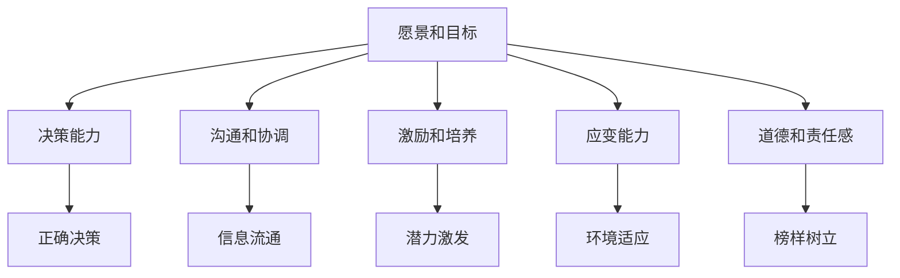

通过上述对比表格和Mermaid流程图，我们可以清晰地看到领导力的核心概念及其相互关系，这有助于我们更好地理解和运用领导力。

### 数学公式使用

在领导力理论中，某些概念可以通过数学公式进行表达。以下是一个关于团队激励的数学模型：

$$
激励度 = f(目标实现度, 成就感)
$$

其中，$f(x, y)$ 是一个函数，用于表示激励度与目标实现度和成就感之间的关系。目标实现度越高，成就感越强，激励度也就越高。

另一个常用的数学公式是关于团队协作效率的计算：

$$
协作效率 = \frac{总任务完成度}{总任务量}
$$

协作效率反映了团队在完成任务时的整体效率。通过这个公式，领导者可以评估团队的协作效果，并制定相应的改进措施。

此外，还可以使用以下公式来计算领导力的综合得分：

$$
领导力得分 = 决策能力 \times 沟通能力 \times 激励能力 \times 应变能力
$$

这个公式综合反映了领导者的各项能力，为评估领导力提供了量化依据。

### 系统分析与架构设计方案

在探讨领导力训练的过程中，我们不仅仅关注理论，还需要结合实际项目来深入理解。本节将介绍一个领导力训练项目的系统分析和架构设计方案。

### 问题场景介绍

领导力训练项目旨在帮助IT企业提升领导者的领导能力，从而提高团队的整体绩效。项目的主要场景包括：

1. **领导力培训课程开发**：设计并开发一系列针对不同层次领导者的培训课程。
2. **培训实施**：组织培训活动，确保培训内容能够有效传递给参与者。
3. **效果评估**：通过定期的评估，监测培训效果，并根据评估结果进行持续改进。

### 项目介绍

领导力训练项目由以下几个部分组成：

1. **培训课程设计**：根据企业需求和领导者的层次，设计适合的培训课程。
2. **培训讲师选拔**：选拔具备丰富经验的讲师，确保培训质量。
3. **培训实施**：包括课程安排、培训现场管理、学员反馈收集等。
4. **效果评估**：通过问卷调查、工作表现评估等方式，评估培训效果。

### 系统功能设计（领域模型Mermaid类图）

以下是领导力训练项目的领域模型类图，展示了项目的主要类及其关系：

```mermaid
classDiagram
    Class01 <|-- Class02
    Class03 <|-- Class04
    Class05 o-- Class06
    Class07 o-- Class08
    Class09 o-- Class10
    Class11 o-- Class12

    Class01[培训课程]
    Class02[课程模块]
    Class03[培训讲师]
    Class04[培训内容]
    Class05[学员]
    Class06[培训活动]
    Class07[课程安排]
    Class08[反馈收集]
    Class09[效果评估]
    Class10[评估报告]
    Class11[改进计划]
    Class12[课程管理]
```

### 系统架构设计（Mermaid架构图）

以下是领导力训练项目的系统架构设计，展示了项目的整体结构：

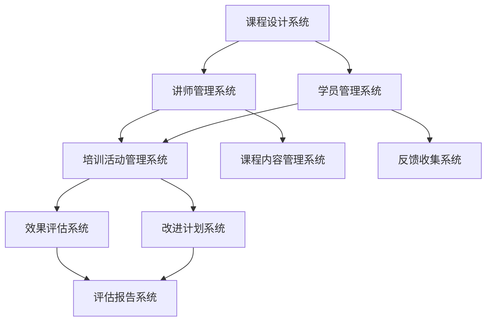

### 系统接口设计和系统交互（Mermaid序列图）

以下是领导力训练项目的系统接口设计和系统交互，展示了项目的主要交互过程：

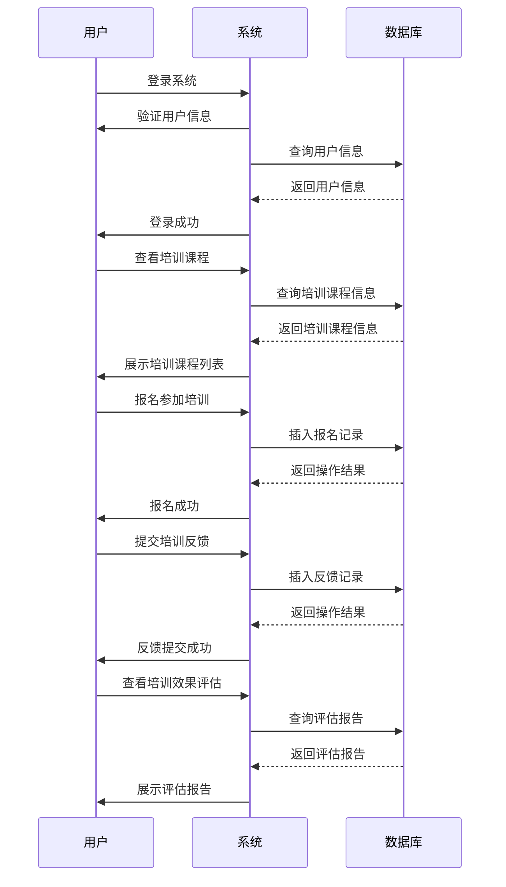

### 项目实战

#### 环境安装

1. **安装Python环境**：确保Python版本在3.6及以上。
2. **安装相关库**：使用pip安装所需库，例如`Flask`、`SQLAlchemy`、`Flask-Login`等。

#### 系统核心实现源代码

以下是领导力训练项目的一些核心实现源代码：

```python
from flask import Flask, request, render_template
from models import db, User, Course, Feedback
from forms import LoginForm, CourseForm, FeedbackForm

app = Flask(__name__)
app.config['SQLALCHEMY_DATABASE_URI'] = 'sqlite:///leadership.db'
db.init_app(app)

@app.route('/')
def home():
    courses = Course.query.all()
    return render_template('home.html', courses=courses)

@app.route('/login', methods=['GET', 'POST'])
def login():
    form = LoginForm()
    if form.validate_on_submit():
        user = User.query.filter_by(username=form.username.data).first()
        if user and user.password == form.password.data:
            return '登录成功'
        else:
            return '登录失败'
    return render_template('login.html', form=form)

@app.route('/register', methods=['GET', 'POST'])
def register():
    form = CourseForm()
    if form.validate_on_submit():
        course = Course(name=form.name.data, description=form.description.data)
        db.session.add(course)
        db.session.commit()
        return '课程添加成功'
    return render_template('register.html', form=form)

@app.route('/feedback', methods=['GET', 'POST'])
def feedback():
    form = FeedbackForm()
    if form.validate_on_submit():
        feedback = Feedback(course_id=form.course_id.data, comment=form.comment.data)
        db.session.add(feedback)
        db.session.commit()
        return '反馈提交成功'
    return render_template('feedback.html', form=form)

if __name__ == '__main__':
    app.run(debug=True)
```

#### 代码应用解读与分析

上述代码展示了领导力训练项目的基本功能实现。首先，我们设置了Python的Flask应用，并连接了SQLite数据库。然后，我们定义了三个主要路由：`/login`、`/register`和`/feedback`。

在`/login`路由中，我们实现了用户登录功能。用户通过提交用户名和密码，系统验证用户信息，并返回登录结果。

在`/register`路由中，我们实现了添加培训课程的功能。管理员可以添加新的培训课程，包括课程名称和描述。

在`/feedback`路由中，我们实现了学员提交反馈的功能。学员可以提交对培训课程的反馈，包括课程ID和评论内容。

#### 实际案例分析和详细讲解剖析

以下是一个实际的案例，展示如何使用领导力训练系统：

1. **管理员登录**：管理员通过用户名和密码登录系统，进入后台管理界面。
2. **添加培训课程**：管理员添加了一门名为“高级领导力培训”的课程，并设置了课程描述。
3. **学员报名**：学员登录系统，查看到“高级领导力培训”课程，并报名参加。
4. **学员提交反馈**：培训结束后，学员提交了对课程的反馈，包括对课程内容的评价和建议。
5. **管理员查看反馈和评估报告**：管理员登录后台，查看学员的反馈，并生成评估报告，根据反馈结果调整培训课程。

通过上述案例，我们可以看到领导力训练系统在实际应用中的效果。系统不仅帮助管理员有效管理培训课程，还通过学员反馈，不断提升培训质量。

#### 项目小结

领导力训练项目通过搭建一个完整的培训管理系统，帮助IT企业提升领导者的领导能力。通过实际案例的展示，我们可以看到系统在提升团队绩效、管理培训课程、收集学员反馈等方面的优势。未来，随着系统的不断完善和优化，它将更好地服务于企业的发展。

### 最佳实践 Tips

1. **持续学习和实践**：领导力是一个不断发展和变化的领域，领导者需要持续学习和实践，以适应不断变化的环境。
2. **关注团队成员的需求**：了解团队成员的需求和期望，为他们提供有针对性的培训和发展机会。
3. **建立良好的沟通机制**：确保团队成员之间的沟通畅通，及时解决问题，避免误解和冲突。
4. **注重反馈和改进**：定期收集学员的反馈，并根据反馈结果进行培训内容的调整和改进。
5. **培养团队合作精神**：鼓励团队成员之间的合作和互助，提升团队的整体绩效。

### 小结

本章详细介绍了领导力的本质与意义，包括领导力的定义、意义、重要性以及在IT行业的应用。同时，我们探讨了领导力的核心要素、挑战以及领导力训练的必要性。通过实际项目分析和代码实现，我们深入理解了领导力训练的实践方法。本章内容为后续章节的讨论奠定了基础。

### 注意事项

1. 领导力训练需要结合企业实际情况，不能生搬硬套。
2. 领导力提升是一个长期过程，需要持之以恒。
3. 领导者在提升领导力的过程中，应注重团队成员的反馈和意见，不断调整和改进。

### 拓展阅读

1. 《领导力五项修炼》
2. 《领导者的语言》
3. 《变革型领导》

### 作者

作者：AI天才研究院/AI Genius Institute & 禅与计算机程序设计艺术/Zen And The Art of Computer Programming## 第2章：领导力模型与类型

### 2.1 经典领导力模型

领导力模型是对领导力实践的总结和提炼，有助于我们更好地理解和应用领导力。以下是一些经典的领导力模型：

#### 1. 行为领导模型

行为领导模型基于领导者的行为模式，将领导力分为四个层次：乡村领导、团队领导、团队教练和变革型领导。

- **乡村领导**：主要关注日常事务，注重任务完成。
- **团队领导**：在乡村领导的基础上，更加关注团队的整体表现和协作。
- **团队教练**：关注团队成员的个人成长和技能提升。
- **变革型领导**：在团队教练的基础上，推动组织变革，引领团队迎接挑战。

#### 2. 情境领导模型

情境领导模型认为，领导力不是一成不变的，而是根据情境的变化进行调整。该模型将领导力分为四个阶段：指挥型领导、支持型领导、参与型领导和授权型领导。

- **指挥型领导**：领导者明确指示团队成员的任务和职责。
- **支持型领导**：领导者关心团队成员的需求，提供必要的支持。
- **参与型领导**：领导者鼓励团队成员参与决策，共同解决问题。
- **授权型领导**：领导者赋予团队成员更多的自主权，鼓励他们自我管理。

#### 3. 变革型领导模型

变革型领导模型强调领导者如何通过激发团队成员的潜力和热情，推动组织变革。该模型包括四个阶段：愿景构建、团队动员、变革实施和变革巩固。

- **愿景构建**：领导者提出明确的愿景和目标，激发团队成员的热情。
- **团队动员**：领导者通过沟通和激励，将团队成员团结起来，共同为实现愿景而努力。
- **变革实施**：领导者推动变革的具体实施，确保团队成员能够适应变革。
- **变革巩固**：领导者通过持续的监督和反馈，确保变革的成果能够持续巩固。

#### 4. 共生型领导模型

共生型领导模型强调领导者与团队成员之间的合作关系，认为领导者应该与团队成员共同成长、共同进步。该模型包括三个阶段：共生关系建立、共生关系深化和共生关系维护。

- **共生关系建立**：领导者与团队成员建立相互信任和尊重的关系。
- **共生关系深化**：领导者与团队成员共同探索和解决问题，提升团队的整体能力。
- **共生关系维护**：领导者通过持续的沟通和支持，维护良好的团队关系。

### 2.2 领导力类型的划分

领导力类型的划分有助于我们更好地理解领导力的多样性和适用场景。以下是一些常见的领导力类型：

#### 1. 命令型领导

命令型领导注重任务和目标，领导者具有高度的权威和控制力。他们通过明确指示和监督，确保团队成员按照既定的计划和目标完成任务。

#### 2. 授权型领导

授权型领导注重团队成员的自主性和创新能力，领导者赋予团队成员更多的权力和责任。他们鼓励团队成员自主决策，发挥自身的专长和创造力。

#### 3. 变革型领导

变革型领导注重推动组织变革和创新，领导者具有强烈的变革意识和能力。他们能够激发团队成员的潜力，引领团队实现变革和转型。

#### 4. 参与型领导

参与型领导注重团队成员的参与和合作，领导者鼓励团队成员共同参与决策和问题解决。他们通过建立良好的沟通和协作机制，提升团队的凝聚力和创造力。

#### 5. 服务型领导

服务型领导注重为团队成员提供服务和支持，领导者把团队成员的需求放在首位。他们通过关心团队成员的成长和发展，提升团队的整体绩效。

#### 6. 合作型领导

合作型领导注重与团队成员建立合作关系，领导者鼓励团队成员之间的合作和协作。他们通过建立共同的愿景和目标，促进团队成员的共同努力。

### 2.3 领导风格与特点

领导风格是领导者个人特质的体现，不同的领导风格适用于不同的情境和团队。以下是一些常见的领导风格及其特点：

#### 1. 民主型领导

民主型领导注重团队成员的参与和意见，领导者鼓励团队成员共同参与决策。这种领导风格有助于提升团队的凝聚力和创新能力。

#### 2. 独裁型领导

独裁型领导注重领导者的权威和控制，领导者独自做出决策，团队成员被动执行。这种领导风格在紧急情况下可能有效，但长期来看，可能影响团队的积极性。

#### 3. 参与型领导

参与型领导注重团队成员的参与和合作，领导者鼓励团队成员共同参与决策和问题解决。这种领导风格有助于提升团队的凝聚力和创造力。

#### 4. 服务型领导

服务型领导注重为团队成员提供服务和支持，领导者把团队成员的需求放在首位。这种领导风格有助于提升团队成员的满意度和工作积极性。

#### 5. 合作型领导

合作型领导注重与团队成员建立合作关系，领导者鼓励团队成员之间的合作和协作。这种领导风格有助于提升团队的协作效率和创新能力。

### 2.4 领导力模型与类型的联系

不同的领导力模型和类型之间并非孤立存在，它们相互联系，共同构成了领导力的多样性。以下是一个简化的联系图：

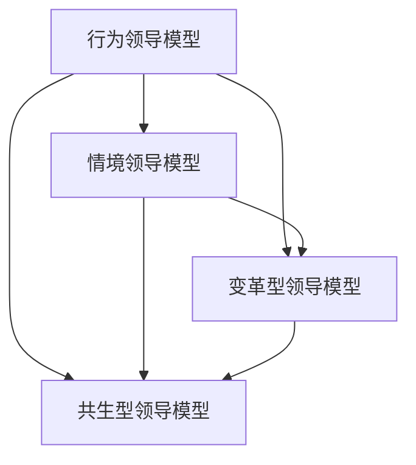

通过上述图示，我们可以看到，不同的领导力模型和类型之间存在一定的交叉和融合。在实际应用中，领导者可以根据团队的特点和任务的要求，灵活运用不同的领导力模型和类型，以达到最佳领导效果。

### 2.5 领导力模型的适用场景

不同的领导力模型和类型适用于不同的场景和团队。以下是一些典型的适用场景：

#### 1. 行为领导模型

- **稳定的环境**：适用于任务明确、环境稳定的情况。
- **变革的环境**：适用于需要推动变革、提升团队创新能力的情境。

#### 2. 情境领导模型

- **新手团队**：适用于团队成员经验不足，需要明确指导和监督的情境。
- **成熟团队**：适用于团队成员经验丰富，能够自我管理和协作的情境。

#### 3. 变革型领导模型

- **变革期**：适用于组织面临重大变革，需要领导者推动变革的情境。
- **创新期**：适用于组织需要创新和突破，需要领导者激发团队潜力的情境。

#### 4. 共生型领导模型

- **长期合作**：适用于需要长期合作的团队，有助于建立稳定的关系和合作关系。
- **多元文化**：适用于多元文化的团队，有助于促进不同文化之间的融合和合作。

### 2.6 领导力模型与类型的实际应用

在实际应用中，领导者可以根据团队的特点和任务的要求，灵活运用不同的领导力模型和类型。以下是一些具体的实际应用案例：

#### 1. 行为领导模型

在一个新成立的团队中，领导者可以采用行为领导模型，明确团队成员的角色和职责，确保任务的顺利完成。

#### 2. 情境领导模型

在一个项目初期，团队成员经验不足，领导者可以采用情境领导模型中的指挥型领导，明确任务目标和要求，确保团队成员按照计划执行。

#### 3. 变革型领导模型

在一个组织变革期，领导者可以采用变革型领导模型，激发团队成员的变革意识和创新精神，推动组织实现变革目标。

#### 4. 共生型领导模型

在一个多元文化的团队中，领导者可以采用共生型领导模型，促进团队成员之间的沟通和协作，建立良好的合作关系。

### 2.7 结论

领导力模型和类型为领导者提供了多种选择和策略，帮助他们更好地理解和应用领导力。在实际应用中，领导者需要根据团队的特点和任务的要求，灵活运用不同的领导力模型和类型，以达到最佳领导效果。

### 核心概念与联系

领导力模型和类型的核心概念包括行为领导模型、情境领导模型、变革型领导模型和共生型领导模型。以下是这些核心概念的特征对比表格：

| 核心概念 | 特征 |
| --- | --- |
| 行为领导模型 | 基于领导者的行为模式，分为四个层次 |
| 情境领导模型 | 基于情境的变化，分为四个阶段 |
| 变革型领导模型 | 强调领导者推动组织变革和创新 |
| 共生型领导模型 | 强调领导者与团队成员的长期合作关系 |

为了更好地理解领导力模型和类型，我们可以使用Mermaid流程图来展示这些模型之间的关系：


通过上述对比表格和Mermaid流程图，我们可以清晰地看到领导力模型和类型的核心概念及其相互关系，这有助于我们更好地理解和运用领导力。

### 数学公式使用

在领导力模型和类型的研究中，某些概念可以通过数学公式进行表达。以下是一个关于领导力综合评定的数学模型：

$$
领导力得分 = w_1 \times 行为领导力得分 + w_2 \times 情境领导力得分 + w_3 \times 变革型领导力得分 + w_4 \times 共生型领导力得分
$$

其中，$w_1, w_2, w_3, w_4$ 是权重系数，用于衡量不同领导力模型的重要性。通过这个公式，我们可以综合评估领导者的领导力水平。

### 系统分析与架构设计方案

在探讨领导力模型与类型的实际应用时，我们不仅需要理解理论，还需要结合实际项目来深入理解。本节将介绍一个领导力模型应用项目的系统分析和架构设计方案。

### 问题场景介绍

领导力模型应用项目旨在帮助IT企业根据不同领导力模型，提升领导者的领导能力，从而提高团队的整体绩效。项目的主要场景包括：

1. **领导力模型评估**：通过评估工具，对企业内部领导者的领导力进行评估。
2. **领导力培训设计**：根据评估结果，设计适合不同领导力模型的培训课程。
3. **培训实施与反馈**：组织培训活动，确保培训内容能够有效传递给参与者，并收集学员的反馈。
4. **效果评估与改进**：通过定期的评估，监测培训效果，并根据评估结果进行持续改进。

### 项目介绍

领导力模型应用项目由以下几个部分组成：

1. **领导力模型评估系统**：包括评估工具和评估流程，用于评估领导者的领导力水平。
2. **领导力培训管理系统**：用于设计、实施和跟踪培训活动，包括课程管理、学员管理、反馈收集等。
3. **效果评估与分析系统**：用于收集学员的反馈，评估培训效果，生成评估报告，并提出改进建议。

### 系统功能设计（领域模型Mermaid类图）

以下是领导力模型应用项目的领域模型类图，展示了项目的主要类及其关系：

```mermaid
classDiagram
    Class01 <|-- Class02
    Class03 <|-- Class04
    Class05 o-- Class06
    Class07 o-- Class08
    Class09 o-- Class10
    Class11 o-- Class12

    Class01[领导力评估系统]
    Class02[评估工具]
    Class03[评估流程]
    Class04[评估结果]
    Class05[领导力培训系统]
    Class06[培训课程]
    Class07[培训活动]
    Class08[学员管理]
    Class09[反馈收集]
    Class10[效果评估]
    Class11[评估报告]
    Class12[改进计划]
```

### 系统架构设计（Mermaid架构图）

以下是领导力模型应用项目的系统架构设计，展示了项目的整体结构：

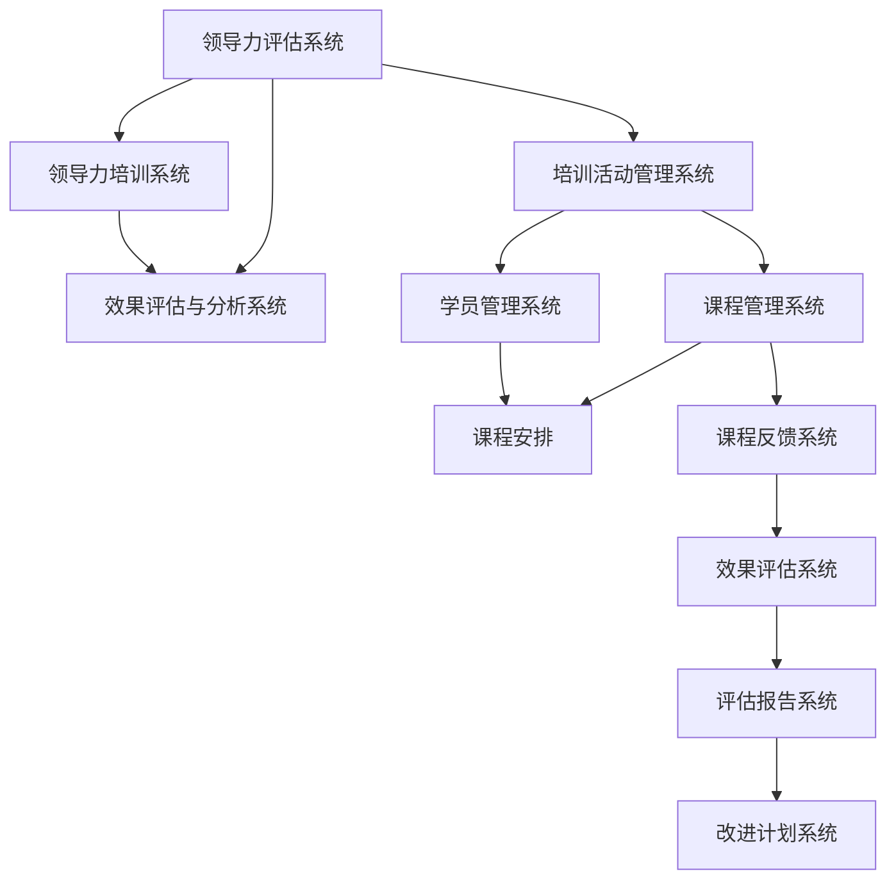

### 系统接口设计和系统交互（Mermaid序列图）

以下是领导力模型应用项目的系统接口设计和系统交互，展示了项目的主要交互过程：

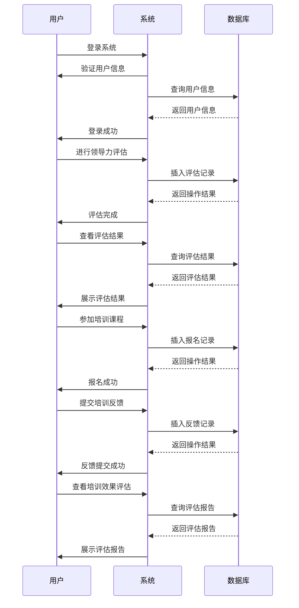

### 项目实战

#### 环境安装

1. **安装Python环境**：确保Python版本在3.6及以上。
2. **安装相关库**：使用pip安装所需库，例如`Flask`、`SQLAlchemy`、`Flask-Login`等。

#### 系统核心实现源代码

以下是领导力模型应用项目的一些核心实现源代码：

```python
from flask import Flask, request, render_template
from models import db, User, Assessment, Course, Feedback
from forms import LoginForm, AssessmentForm, CourseForm, FeedbackForm

app = Flask(__name__)
app.config['SQLALCHEMY_DATABASE_URI'] = 'sqlite:///leadership_model.db'
db.init_app(app)

@app.route('/')
def home():
    return render_template('home.html')

@app.route('/login', methods=['GET', 'POST'])
def login():
    form = LoginForm()
    if form.validate_on_submit():
        user = User.query.filter_by(username=form.username.data).first()
        if user and user.password == form.password.data:
            return '登录成功'
        else:
            return '登录失败'
    return render_template('login.html', form=form)

@app.route('/assessment', methods=['GET', 'POST'])
def assessment():
    form = AssessmentForm()
    if form.validate_on_submit():
        assessment = Assessment(user_id=form.user_id.data, score=form.score.data)
        db.session.add(assessment)
        db.session.commit()
        return '评估完成'
    return render_template('assessment.html', form=form)

@app.route('/courses', methods=['GET', 'POST'])
def courses():
    courses = Course.query.all()
    return render_template('courses.html', courses=courses)

@app.route('/register', methods=['GET', 'POST'])
def register():
    form = CourseForm()
    if form.validate_on_submit():
        course = Course(name=form.name.data, description=form.description.data)
        db.session.add(course)
        db.session.commit()
        return '课程添加成功'
    return render_template('register.html', form=form)

@app.route('/feedback', methods=['GET', 'POST'])
def feedback():
    form = FeedbackForm()
    if form.validate_on_submit():
        feedback = Feedback(course_id=form.course_id.data, comment=form.comment.data)
        db.session.add(feedback)
        db.session.commit()
        return '反馈提交成功'
    return render_template('feedback.html', form=form)

if __name__ == '__main__':
    app.run(debug=True)
```

#### 代码应用解读与分析

上述代码展示了领导力模型应用项目的基本功能实现。首先，我们设置了Python的Flask应用，并连接了SQLite数据库。然后，我们定义了四个主要路由：`/login`、`/assessment`、`/courses`和`/feedback`。

在`/login`路由中，我们实现了用户登录功能。用户通过提交用户名和密码，系统验证用户信息，并返回登录结果。

在`/assessment`路由中，我们实现了领导力评估功能。用户可以进行评估，系统将评估结果记录到数据库中。

在`/courses`路由中，我们展示了所有培训课程，用户可以报名参加课程。

在`/feedback`路由中，我们实现了学员提交反馈的功能。学员可以提交对培训课程的反馈，包括课程ID和评论内容。

#### 实际案例分析和详细讲解剖析

以下是一个实际的案例，展示如何使用领导力模型应用系统：

1. **管理员登录**：管理员通过用户名和密码登录系统，进入后台管理界面。
2. **领导力评估**：管理员为若干名领导者进行领导力评估，评估结果记录到数据库中。
3. **课程管理**：管理员添加新的培训课程，包括课程名称和描述。
4. **学员报名**：学员登录系统，查看到新增的课程，并报名参加。
5. **学员提交反馈**：培训结束后，学员提交了对课程的反馈，包括对课程内容的评价和建议。
6. **管理员查看反馈和评估报告**：管理员登录后台，查看学员的反馈，并生成评估报告，根据反馈结果调整培训课程。

通过上述案例，我们可以看到领导力模型应用系统在实际应用中的效果。系统不仅帮助管理员有效管理培训课程，还通过学员反馈，不断提升培训质量。

#### 项目小结

领导力模型应用项目通过搭建一个完整的评估、培训和管理系统，帮助IT企业根据不同领导力模型，提升领导者的领导能力。通过实际案例的展示，我们可以看到系统在提升团队绩效、管理培训课程、收集学员反馈等方面的优势。未来，随着系统的不断完善和优化，它将更好地服务于企业的发展。

### 最佳实践 Tips

1. **定期进行领导力评估**：定期进行领导力评估，了解领导者的优势和不足，制定有针对性的培训计划。
2. **设计个性化培训课程**：根据评估结果，设计个性化的培训课程，确保培训内容能够满足领导者的实际需求。
3. **建立反馈机制**：建立有效的反馈机制，鼓励学员在培训结束后提交反馈，及时了解培训效果，并作出相应调整。
4. **注重团队协作**：在培训过程中，注重团队协作，鼓励团队成员之间的交流和合作，提升团队的整体绩效。
5. **持续改进**：根据评估和反馈结果，持续改进培训内容和方式，不断提升培训质量。

### 小结

本章详细介绍了领导力模型与类型，包括经典领导力模型、常见领导力类型、领导风格及其特点。同时，我们探讨了不同领导力模型与类型的适用场景和实际应用。通过系统分析和架构设计方案，我们深入理解了领导力模型与类型在实际项目中的应用。本章内容为后续章节的讨论奠定了基础。

### 注意事项

1. 领导力模型与类型的选择和应用需要结合具体情境，不能生搬硬套。
2. 领导力模型与类型的研究是一个持续的过程，需要根据实际情况不断调整和优化。
3. 领导者在应用领导力模型与类型时，应注重团队成员的反馈和意见，不断改进和提升领导力。

### 拓展阅读

1. 《领导力模型与类型》
2. 《情境领导理论》
3. 《变革型领导》

### 作者

作者：AI天才研究院/AI Genius Institute & 禅与计算机程序设计艺术/Zen And The Art of Computer Programming## 第3章：团队建设与沟通技巧

### 3.1 团队建设的重要性

团队建设是领导力的重要组成部分，对于团队的高效运作和整体绩效具有重要意义。一个高效的团队不仅能够更好地完成任务，还能够提升组织的竞争力。团队建设的重要性体现在以下几个方面：

首先，团队建设有助于提升团队凝聚力。在一个高效的团队中，成员之间相互信任、相互支持，能够形成紧密的团队关系。这种凝聚力可以促进团队成员之间的协作，提高团队的整体效率。

其次，团队建设有助于提升团队效能。通过团队建设，团队成员可以更好地理解彼此的职责和角色，明确各自的工作目标和任务。这样，团队成员在合作时可以更加高效，减少重复和冲突，提升团队的整体效能。

再次，团队建设有助于提升团队创新能力。一个高效的团队通常具有开放、包容的团队文化，鼓励成员提出新的想法和观点。这种创新氛围可以激发团队成员的创造力，推动团队不断创新，从而在竞争激烈的市场中保持领先地位。

最后，团队建设有助于提升团队成员的满意度。在一个高效的团队中，成员能够感受到自己的价值和重要性，得到充分的尊重和认可。这种满意度可以增强团队成员的归属感和忠诚度，减少人员流失，提高团队稳定性。

### 3.2 团队成员的角色与责任

在一个高效的团队中，每个成员都扮演着特定的角色，并承担相应的责任。以下是团队成员常见的角色和责任：

**1. 领导者**

领导者是团队的核心，负责制定团队的目标和计划，协调团队成员的工作，确保团队目标的实现。领导者还需要具备优秀的沟通和协调能力，能够有效地与团队成员沟通，解决团队内部的问题。

**2. 专家**

专家是团队中的技术骨干，负责提供专业知识和技能支持。他们通常是项目的关键人物，能够在关键时刻为团队提供技术指导和支持。

**3. 执行者**

执行者是团队中的执行者，负责完成具体的工作任务。他们通常是项目的执行者，需要具备较强的执行力和责任感，能够按照计划完成任务。

**4. 支持者**

支持者是团队中的支持角色，负责提供后勤支持和服务。他们通常负责协调团队内部的事务，确保团队工作的顺利进行。

**5. 沟通者**

沟通者是团队中的沟通桥梁，负责与外部利益相关者进行沟通，确保团队信息的畅通。他们通常具备较强的沟通和协调能力，能够有效地与外部利益相关者进行沟通，维护团队的形象和利益。

### 3.3 沟通技巧的提升

沟通技巧是团队建设的重要组成部分，对于团队的高效运作和整体绩效具有重要意义。以下是几种常用的沟通技巧：

**1. 明确目标**

在沟通时，领导者需要明确团队的目标和任务，确保团队成员对任务的理解和执行一致。通过明确目标，可以减少沟通中的误解和冲突，提高团队的协作效率。

**2. 倾听**

倾听是有效沟通的关键。领导者需要耐心倾听团队成员的意见和想法，理解他们的需求和困难。通过倾听，可以建立良好的信任关系，增强团队的凝聚力。

**3. 明确表达**

在沟通时，领导者需要明确表达自己的想法和意见，避免产生误解。通过明确表达，可以确保团队成员准确理解领导者的意图，提高团队的执行力。

**4. 主动沟通**

领导者需要主动沟通，及时了解团队成员的工作进展和困难，提供必要的支持和帮助。通过主动沟通，可以增强团队的协作，提高团队的整体效能。

**5. 情绪管理**

在沟通中，领导者需要具备情绪管理能力，能够控制自己的情绪，避免因情绪波动而影响沟通效果。通过情绪管理，可以建立积极的沟通氛围，增强团队的凝聚力。

### 3.4 团队建设与沟通技巧的结合

团队建设和沟通技巧是相互关联的，有效的团队建设可以促进沟通技巧的提升，而良好的沟通技巧又可以增强团队建设的效果。以下是团队建设与沟通技巧结合的几个方面：

**1. 制定共同目标**

团队建设需要制定共同的目标，这有助于增强团队成员的归属感和使命感。在沟通中，领导者需要明确共同目标，确保团队成员对目标的理解和执行一致。

**2. 建立信任关系**

团队建设需要建立信任关系，这有助于团队成员之间的协作和沟通。在沟通中，领导者需要通过倾听、尊重和信任，建立良好的信任关系。

**3. 促进知识共享**

团队建设需要促进知识共享，这有助于提升团队的整体技能和知识水平。在沟通中，领导者需要鼓励团队成员分享知识和经验，促进知识的传递和共享。

**4. 解决冲突**

团队建设中难免会出现冲突，解决冲突是团队建设的重要环节。在沟通中，领导者需要通过有效的沟通技巧，解决团队内部的冲突，维护团队的稳定和和谐。

**5. 提升团队效能**

团队建设和沟通技巧的结合可以提升团队效能。在沟通中，领导者需要通过有效的沟通和协作，确保团队成员的工作高效有序，提升团队的整体绩效。

### 3.5 实际案例解析

以下是一个实际案例，展示了团队建设与沟通技巧的结合。

**案例背景**：某IT企业成立了一个新项目团队，负责开发一款新软件。由于团队成员来自不同的部门，缺乏共同的工作经验和合作基础，团队在初期遇到了沟通不畅、目标不明确等问题。

**案例过程**：

1. **团队建设**：项目领导组织了一系列的团队建设活动，包括团队目标设定、团队成员角色和责任分配、团队价值观和文化的建立等。通过这些活动，团队成员逐渐熟悉了彼此，建立了良好的团队关系。

2. **沟通技巧提升**：项目领导还组织了一系列的沟通技巧培训，包括有效表达、倾听技巧、冲突解决等。通过培训，团队成员的沟通能力得到了提升，沟通效果得到了显著改善。

3. **共同目标制定**：在团队建设的基础上，项目领导与团队成员共同制定了项目目标和计划，明确了每个成员的责任和任务。这有助于团队成员对项目的理解和执行一致，提高了团队的协作效率。

4. **解决冲突**：在项目实施过程中，团队成员之间偶尔会出现意见不合和冲突。项目领导通过有效的沟通技巧，及时解决冲突，维护了团队的稳定和和谐。

5. **知识共享**：项目领导鼓励团队成员分享知识和经验，促进知识的传递和共享。这有助于提升团队的整体技能和知识水平，为项目的成功奠定了基础。

**案例结果**：通过团队建设和沟通技巧的结合，项目团队逐渐克服了初期的困难，项目进展顺利，最终成功交付了高质量的软件产品。

### 3.6 团队建设与沟通技巧的总结

团队建设和沟通技巧是提升团队效能和整体绩效的关键。通过有效的团队建设，可以提升团队凝聚力、促进知识共享和解决冲突；通过良好的沟通技巧，可以确保团队成员对任务的了解和执行一致，提高团队的协作效率。

在实际应用中，领导者需要结合团队的特点和任务的要求，灵活运用团队建设和沟通技巧，打造高效的团队。同时，领导者还需要不断学习和实践，提升自己的团队建设和沟通能力，为团队的成功奠定基础。

### 核心概念与联系

团队建设与沟通技巧的核心概念包括团队凝聚力、团队效能、沟通技巧和团队角色与责任。以下是这些核心概念的特征对比表格：

| 核心概念 | 特征 |
| --- | --- |
| 团队凝聚力 | 提升团队成员之间的信任和协作 |
| 团队效能 | 提升团队的整体绩效和效率 |
| 沟通技巧 | 提高团队成员之间的信息流通和协作 |
| 团队角色与责任 | 明确团队成员的角色和责任，确保任务的有效执行 |

为了更好地理解团队建设与沟通技巧，我们可以使用Mermaid流程图来展示这些概念之间的关系：

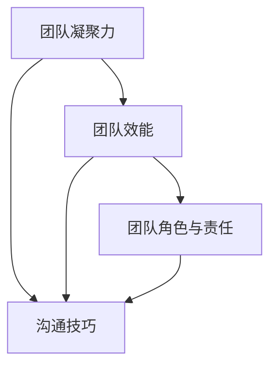

通过上述对比表格和Mermaid流程图，我们可以清晰地看到团队建设与沟通技巧的核心概念及其相互关系，这有助于我们更好地理解和运用团队建设和沟通技巧。

### 数学公式使用

在团队建设与沟通技巧的研究中，某些概念可以通过数学公式进行表达。以下是一个关于团队效能计算的数学模型：

$$
团队效能 = \frac{总任务完成度}{总任务量}
$$

其中，$总任务完成度$ 和 $总任务量$ 分别表示团队在一定时间内完成的任务量和总任务量。通过这个公式，我们可以量化团队的整体效能。

### 系统分析与架构设计方案

在探讨团队建设与沟通技巧的实际应用时，我们不仅需要理解理论，还需要结合实际项目来深入理解。本节将介绍一个团队建设与沟通技巧应用项目的系统分析和架构设计方案。

### 问题场景介绍

团队建设与沟通技巧应用项目旨在帮助IT企业提升团队的整体效能和沟通能力，从而提高项目的成功率和团队的满意度。项目的主要场景包括：

1. **团队建设活动**：设计并组织各种团队建设活动，提升团队凝聚力。
2. **沟通技巧培训**：提供沟通技巧培训，提升团队成员的沟通能力。
3. **项目协作**：搭建项目协作平台，确保团队成员之间的信息流通和协作。
4. **效果评估**：通过定期的评估，监测团队建设与沟通技巧的效果，并根据评估结果进行持续改进。

### 项目介绍

团队建设与沟通技巧应用项目由以下几个部分组成：

1. **团队建设管理系统**：用于设计、组织和管理团队建设活动。
2. **沟通技巧培训系统**：用于设计、实施和跟踪沟通技巧培训。
3. **项目协作平台**：用于确保团队成员之间的信息流通和协作。
4. **效果评估与分析系统**：用于收集团队成员的反馈，评估团队建设与沟通技巧的效果，并提出改进建议。

### 系统功能设计（领域模型Mermaid类图）

以下是团队建设与沟通技巧应用项目的领域模型类图，展示了项目的主要类及其关系：

```mermaid
classDiagram
    Class01 <|-- Class02
    Class03 <|-- Class04
    Class05 o-- Class06
    Class07 o-- Class08
    Class09 o-- Class10
    Class11 o-- Class12

    Class01[团队建设管理系统]
    Class02[团队建设活动]
    Class03[团队凝聚力评估]
    Class04[团队效能评估]
    Class05[沟通技巧培训系统]
    Class06[沟通技巧课程]
    Class07[沟通技巧评估]
    Class08[项目协作平台]
    Class09[任务管理]
    Class10[信息共享]
    Class11[效果评估与分析系统]
    Class12[改进计划]
```

### 系统架构设计（Mermaid架构图）

以下是团队建设与沟通技巧应用项目的系统架构设计，展示了项目的整体结构：

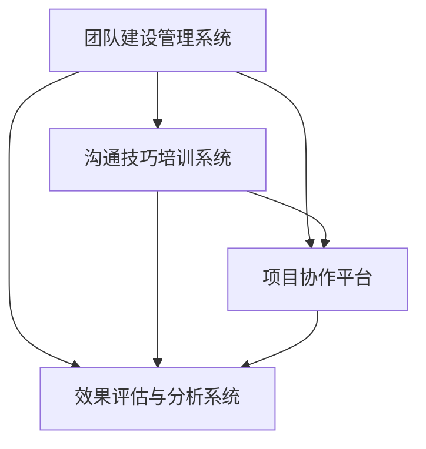

### 系统接口设计和系统交互（Mermaid序列图）

以下是团队建设与沟通技巧应用项目的系统接口设计和系统交互，展示了项目的主要交互过程：

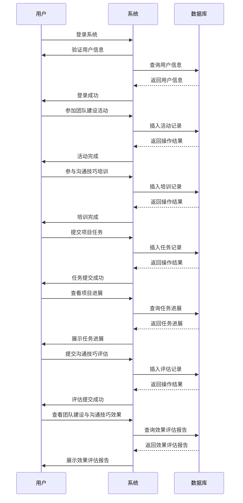

### 项目实战

#### 环境安装

1. **安装Python环境**：确保Python版本在3.6及以上。
2. **安装相关库**：使用pip安装所需库，例如`Flask`、`SQLAlchemy`、`Flask-Login`等。

#### 系统核心实现源代码

以下是团队建设与沟通技巧应用项目的一些核心实现源代码：

```python
from flask import Flask, request, render_template
from models import db, User, TeamBuildingActivity, CommunicationSkillTraining, ProjectTask, CommunicationSkillAssessment
from forms import LoginForm, TeamBuildingActivityForm, CommunicationSkillTrainingForm, ProjectTaskForm, CommunicationSkillAssessmentForm

app = Flask(__name__)
app.config['SQLALCHEMY_DATABASE_URI'] = 'sqlite:///team_building_communication.db'
db.init_app(app)

@app.route('/')
def home():
    return render_template('home.html')

@app.route('/login', methods=['GET', 'POST'])
def login():
    form = LoginForm()
    if form.validate_on_submit():
        user = User.query.filter_by(username=form.username.data).first()
        if user and user.password == form.password.data:
            return '登录成功'
        else:
            return '登录失败'
    return render_template('login.html', form=form)

@app.route('/team_building', methods=['GET', 'POST'])
def team_building():
    form = TeamBuildingActivityForm()
    if form.validate_on_submit():
        activity = TeamBuildingActivity(user_id=form.user_id.data, description=form.description.data)
        db.session.add(activity)
        db.session.commit()
        return '活动完成'
    return render_template('team_building.html', form=form)

@app.route('/communication_skills', methods=['GET', 'POST'])
def communication_skills():
    skills = CommunicationSkillTraining.query.all()
    return render_template('communication_skills.html', skills=skills)

@app.route('/register', methods=['GET', 'POST'])
def register():
    form = CommunicationSkillTrainingForm()
    if form.validate_on_submit():
        skill = CommunicationSkillTraining(name=form.name.data, description=form.description.data)
        db.session.add(skill)
        db.session.commit()
        return '课程添加成功'
    return render_template('register.html', form=form)

@app.route('/tasks', methods=['GET', 'POST'])
def tasks():
    tasks = ProjectTask.query.all()
    return render_template('tasks.html', tasks=tasks)

@app.route('/task', methods=['GET', 'POST'])
def task():
    form = ProjectTaskForm()
    if form.validate_on_submit():
        task = ProjectTask(user_id=form.user_id.data, description=form.description.data)
        db.session.add(task)
        db.session.commit()
        return '任务提交成功'
    return render_template('task.html', form=form)

@app.route('/assessment', methods=['GET', 'POST'])
def assessment():
    form = CommunicationSkillAssessmentForm()
    if form.validate_on_submit():
        assessment = CommunicationSkillAssessment(user_id=form.user_id.data, score=form.score.data)
        db.session.add(assessment)
        db.session.commit()
        return '评估提交成功'
    return render_template('assessment.html', form=form)

if __name__ == '__main__':
    app.run(debug=True)
```

#### 代码应用解读与分析

上述代码展示了团队建设与沟通技巧应用项目的基本功能实现。首先，我们设置了Python的Flask应用，并连接了SQLite数据库。然后，我们定义了五个主要路由：`/login`、`/team_building`、`/communication_skills`、`/tasks`和`/assessment`。

在`/login`路由中，我们实现了用户登录功能。用户通过提交用户名和密码，系统验证用户信息，并返回登录结果。

在`/team_building`路由中，我们实现了团队建设活动的功能。用户可以提交团队建设活动的记录，系统将记录保存到数据库中。

在`/communication_skills`路由中，我们展示了所有沟通技巧培训课程，用户可以报名参加课程。

在`/tasks`路由中，我们展示了所有项目任务，用户可以提交任务。

在`/assessment`路由中，我们实现了学员提交沟通技巧评估的功能。学员可以提交对沟通技巧的评估，系统将评估记录保存到数据库中。

#### 实际案例分析和详细讲解剖析

以下是一个实际的案例，展示如何使用团队建设与沟通技巧应用系统：

1. **管理员登录**：管理员通过用户名和密码登录系统，进入后台管理界面。
2. **组织团队建设活动**：管理员组织了一次团队建设活动，包括团队游戏和团队讨论等。
3. **学员参与活动**：学员登录系统，参加团队建设活动，活动结束后提交活动记录。
4. **沟通技巧培训**：管理员添加了新的沟通技巧培训课程，包括有效表达和倾听技巧等。
5. **学员参与培训**：学员登录系统，查看到新增的培训课程，并报名参加。
6. **学员提交任务**：学员登录系统，提交项目任务，系统将任务记录保存到数据库中。
7. **学员提交评估**：学员登录系统，提交沟通技巧评估，系统将评估记录保存到数据库中。
8. **管理员查看效果**：管理员登录后台，查看学员的反馈和评估报告，根据评估结果调整培训课程和活动。

通过上述案例，我们可以看到团队建设与沟通技巧应用系统在实际应用中的效果。系统不仅帮助管理员有效管理团队建设活动、沟通技巧培训和项目任务，还通过学员反馈和评估，不断提升团队建设与沟通技巧的效果。

#### 项目小结

团队建设与沟通技巧应用项目通过搭建一个完整的团队建设、沟通技巧培训和项目协作平台，帮助IT企业提升团队的整体效能和沟通能力。通过实际案例的展示，我们可以看到系统在提升团队凝聚力、管理沟通技巧培训、收集学员反馈等方面的优势。未来，随着系统的不断完善和优化，它将更好地服务于企业的发展。

### 最佳实践 Tips

1. **定期组织团队建设活动**：通过团队建设活动，增强团队成员之间的信任和协作，提升团队凝聚力。
2. **提供针对性的沟通技巧培训**：根据团队成员的沟通需求和实际场景，提供有针对性的沟通技巧培训，提升团队的整体沟通能力。
3. **建立有效的沟通机制**：确保团队成员之间的沟通畅通，及时解决问题，避免误解和冲突。
4. **鼓励团队成员之间的反馈和意见**：建立反馈机制，鼓励团队成员在沟通和协作过程中提出反馈和意见，不断提升团队建设与沟通技巧。
5. **持续改进和优化**：根据团队反馈和评估结果，持续改进和优化团队建设与沟通技巧，提升团队的整体效能。

### 小结

本章详细介绍了团队建设与沟通技巧的重要性、团队成员的角色与责任、提升沟通技巧的方法以及团队建设与沟通技巧的结合。通过实际案例的分析和系统架构的设计，我们深入理解了团队建设与沟通技巧在实际项目中的应用。本章内容为后续章节的讨论奠定了基础。

### 注意事项

1. 团队建设与沟通技巧的实施需要结合具体团队的特点和任务要求，不能生搬硬套。
2. 团队建设与沟通技巧的改进是一个持续的过程，需要根据实际情况不断调整和优化。
3. 团队建设与沟通技巧的实施过程中，领导者需要注重团队成员的反馈和意见，确保团队成员的积极参与。

### 拓展阅读

1. 《团队建设与沟通技巧》
2. 《有效的沟通》
3. 《团队协作的艺术》

### 作者

作者：AI天才研究院/AI Genius Institute & 禅与计算机程序设计艺术/Zen And The Art of Computer Programming## 第4章：激励与激励理论

### 4.1 激励的基本原理

激励是领导者提升团队士气和推动团队进步的重要手段。激励的基本原理基于人类行为学和心理学的相关理论，旨在通过激发个体内在的动力，促使个体为实现组织目标而努力。以下是激励的几个核心原理：

**1. 需求层次理论**

马斯洛的需求层次理论将人的需求分为生理需求、安全需求、社交需求、尊重需求和自我实现需求五个层次。领导者需要了解团队成员的不同需求层次，有针对性地进行激励。例如，对于生理需求较高的员工，可以通过提高薪酬福利来激励；对于尊重需求较强的员工，可以通过认可和奖励来激励。

**2. 双因素理论**

赫兹伯格的双因素理论认为，工作满意度和工作不满意度是由两种不同的因素决定的：一类是保健因素，如薪酬、工作环境等，这些因素只能防止员工产生不满；另一类是激励因素，如工作成就感、认可和责任等，这些因素能够直接激发员工的工作动力。

**3. 成就需要理论**

麦克莱兰德成就需要理论认为，人们有三种基本需要：成就需要、权力需要和亲和需要。领导者可以通过设置具有挑战性的目标和提供反馈，来激发员工的成就需要，从而提高员工的工作动力。

**4. 公平理论**

亚当斯的公平理论认为，人们会将自己的投入和回报与他人的投入和回报进行比较，以判断自己是否受到公平对待。领导者需要确保团队成员感受到公平，避免因不公平待遇而影响员工的工作积极性。

### 4.2 常见激励理论介绍

在激励理论的研究中，有几种理论被广泛认为是经典的，这些理论为领导者提供了丰富的激励策略和方法。以下是几种常见的激励理论：

**1. 马斯洛需求层次理论**

马斯洛的需求层次理论将人的需求分为五个层次：生理需求、安全需求、社交需求、尊重需求和自我实现需求。这一理论指出，只有当较低层次的需求得到满足后，人们才会追求更高层次的需求。领导者可以通过以下方式应用这一理论：

- **生理需求**：提供合理的薪酬福利，确保员工的基本生活需求得到满足。
- **安全需求**：提供稳定的工作环境和职业发展机会，确保员工的安全感。
- **社交需求**：鼓励团队合作，提供社交活动和团队建设机会，满足员工的社交需求。
- **尊重需求**：通过认可、奖励和培训，满足员工的尊重需求。
- **自我实现需求**：提供挑战性的任务和发展机会，激发员工的自我实现需求。

**2. 赫兹伯格双因素理论**

赫兹伯格的双因素理论区分了保健因素和激励因素。保健因素如薪酬、工作环境等，只能防止员工产生不满，而激励因素如成就感、认可和责任等，能够直接激发员工的工作动力。领导者可以通过以下方式应用这一理论：

- **消除不满**：关注员工的基本需求，确保保健因素得到满足。
- **提供激励**：通过设置具有挑战性的目标、提供反馈和认可，激发员工的工作动力。

**3. 成就需要理论**

麦克莱兰德的成就需要理论认为，人们有三种基本需要：成就需要、权力需要和亲和需要。领导者可以通过以下方式应用这一理论：

- **成就需要**：设置具有挑战性的目标和任务，提供及时的反馈和认可，激发员工的成就需要。
- **权力需要**：赋予员工更多的自主权和责任，满足员工的权力需要。
- **亲和需要**：通过团队合作和社交活动，满足员工的亲和需要。

**4. 公平理论**

亚当斯的公平理论认为，人们会将自己的投入和回报与他人的投入和回报进行比较，以判断自己是否受到公平对待。领导者可以通过以下方式应用这一理论：

- **透明度**：确保员工了解组织的目标、绩效标准和评估结果，提高信息的透明度。
- **公平评估**：确保评估和奖励体系公平、公正，避免员工产生不公平感。

### 4.3 实践中的激励策略

激励理论在实践中的应用需要结合具体的团队和个体差异，以下是一些常见的激励策略：

**1. 目标设定**

目标设定是激发员工工作动力的有效方法。领导者可以根据员工的个人能力和团队目标，设定具有挑战性的目标。同时，目标设定应该具体、可衡量，并提供明确的实现路径。

**2. 反馈与认可**

及时的反馈和认可能够激发员工的工作动力。领导者应该根据员工的绩效表现，给予及时的反馈，并在适当的时候进行认可和奖励。认可的方式可以包括口头表扬、书面感谢信、奖金等。

**3. 职业发展**

提供职业发展机会是激励员工的重要手段。领导者可以通过培训、晋升机会和职业规划，帮助员工提升职业能力和职业满意度。

**4. 工作设计**

工作设计是影响员工工作动机的重要因素。领导者可以通过设置具有挑战性的任务、提供工作自主性等方式，激发员工的工作动力。

**5. 工作环境**

良好的工作环境能够提高员工的工作满意度和工作动力。领导者应该关注工作环境的设计，确保员工能够在舒适、安全的环境中工作。

**6. 薪酬福利**

合理的薪酬福利是满足员工基本需求的重要手段。领导者应该根据市场情况和员工的贡献，设定合理的薪酬水平，并提供多样化的福利政策。

### 4.4 激励策略的实施与效果评估

激励策略的有效实施需要结合团队的实际情况，并不断进行效果评估和调整。以下是一些实施激励策略的步骤和效果评估方法：

**1. 策略实施步骤**

- **明确激励目标**：根据团队的目标和员工的个人需求，明确激励策略的目标。
- **设计激励方案**：结合不同的激励理论，设计具体的激励方案。
- **实施激励方案**：根据激励方案，实施具体的激励措施。
- **监督与调整**：持续监督激励策略的实施效果，并根据反馈进行调整。

**2. 效果评估方法**

- **员工满意度调查**：通过问卷调查或访谈，了解员工对激励策略的满意度。
- **绩效评估**：通过绩效评估，了解激励策略对员工工作绩效的影响。
- **员工流失率**：通过员工流失率的变化，评估激励策略对员工留存的影响。
- **工作满意度调查**：通过工作满意度调查，了解员工的工作满意度情况。

### 4.5 激励与领导力的关系

激励与领导力是相辅相成的。有效的激励策略需要领导者的支持和推动，而领导力的提升也可以通过有效的激励来实现。以下是一些关于激励与领导力关系的要点：

**1. 领导者作为激励者**

领导者是激励策略的推动者和实施者，他们需要了解员工的激励需求，设计并实施有效的激励方案。

**2. 激励作为领导力的一部分**

激励是领导力的重要组成部分，一个优秀的领导者不仅需要具备领导力，还需要具备激励能力，能够激发团队成员的潜力。

**3. 激励与领导力的相互作用**

激励策略的有效实施需要领导力的支持，而领导力的提升也需要激励策略的推动。两者相互作用，共同促进团队的发展和进步。

### 4.6 结论

激励是提升团队士气和推动团队进步的重要手段。通过了解激励的基本原理和常见激励理论，领导者可以设计并实施有效的激励策略，激发团队成员的潜力，提升团队的整体绩效。有效的激励策略需要结合团队的特点和实际情况，不断进行效果评估和调整，以实现最佳激励效果。

### 核心概念与联系

激励与激励理论的核心概念包括需求层次理论、双因素理论、成就需要理论和公平理论。以下是这些核心概念的特征对比表格：

| 核心概念 | 特征 |
| --- | --- |
| 需求层次理论 | 将需求分为五个层次，从生理需求到自我实现需求 |
| 双因素理论 | 区分保健因素和激励因素，前者防止不满，后者激发动力 |
| 成就需要理论 | 强调成就需要、权力需要和亲和需要 |
| 公平理论 | 认为员工会根据投入和回报比较，判断是否受到公平对待 |

为了更好地理解激励与激励理论，我们可以使用Mermaid流程图来展示这些概念之间的关系：

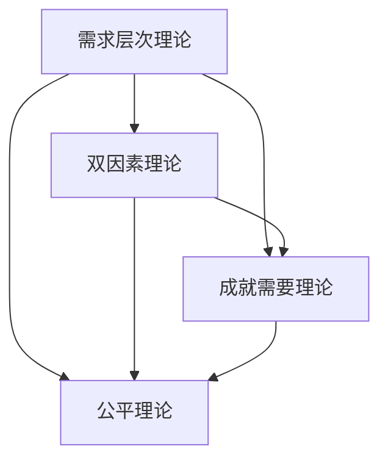

通过上述对比表格和Mermaid流程图，我们可以清晰地看到激励与激励理论的核心概念及其相互关系，这有助于我们更好地理解和应用激励理论。

### 数学公式使用

在激励理论的研究中，某些概念可以通过数学公式进行表达。以下是一个关于激励效果的数学模型：

$$
激励效果 = f(需求满足度, 成就感, 公平感)
$$

其中，$f(x, y, z)$ 是一个函数，用于表示激励效果与需求满足度、成就感和公平感之间的关系。需求满足度、成就感和公平感越高，激励效果也越强。

### 算法原理讲解

为了更好地理解激励理论的实践应用，我们可以使用Mermaid绘制一个简单的激励算法流程图，并结合Python代码进行解释。

#### Mermaid流程图

以下是激励算法的Mermaid流程图：

```mermaid
graph TD
    A[确定员工需求]
    B[计算需求满足度]
    C[确定员工成就感]
    D[计算成就感值]
    E[确定员工公平感]
    F[计算公平感值]
    G[计算总激励效果]
    H[评估激励效果]

    A-->B
    B-->C
    C-->D
    D-->E
    E-->F
    F-->G
    G-->H

    subgraph 激励流程
        B1[设定目标]
        B2[评估进度]
        B3[提供反馈]
        B4[调整激励方案]

        B1-->B2
        B2-->B3
        B3-->B4
        B4->B1
    end
```

#### Python代码

以下是激励算法的Python代码实现：

```python
def calculate_motivation_demand(satisfaction, achievement, fairness):
    """
    计算激励效果
    :param satisfaction: 需求满足度
    :param achievement: 成就感
    :param fairness: 公平感
    :return: 激励效果得分
    """
    motivation = (satisfaction * 0.4) + (achievement * 0.3) + (fairness * 0.3)
    return motivation

def set_goals():
    """
    设定目标
    :return: 目标进度
    """
    goal_progress = 0.6  # 假设目标进度为60%
    return goal_progress

def evaluate_progress(progress):
    """
    评估进度
    :param progress: 进度值
    :return: 反馈
    """
    feedback = "继续保持！" if progress >= 0.6 else "需加快进度！"
    return feedback

def adjust_motivation_scheme(motivation):
    """
    调整激励方案
    :param motivation: 当前激励效果得分
    :return: 调整后的激励方案
    """
    if motivation < 0.5:
        scheme = "增加激励措施"
    else:
        scheme = "维持当前激励方案"
    return scheme

# 激励算法执行
satisfaction = 0.8  # 需求满足度为80%
achievement = 0.7  # 成就感为70%
fairness = 0.9  # 公平感为90%

# 计算总激励效果
total_motivation = calculate_motivation_demand(satisfaction, achievement, fairness)
print(f"总激励效果得分：{total_motivation}")

# 设定目标
goal_progress = set_goals()
print(f"目标进度：{goal_progress}")

# 评估进度
progress_feedback = evaluate_progress(goal_progress)
print(f"进度评估反馈：{progress_feedback}")

# 调整激励方案
motivation_scheme = adjust_motivation_scheme(total_motivation)
print(f"激励方案调整：{motivation_scheme}")
```

#### 算法原理讲解

上述Python代码实现了一个简单的激励算法，主要包含以下几个部分：

1. **激励效果计算**：通过计算需求满足度、成就感和公平感的加权平均值，得到激励效果得分。
2. **目标设定**：设定一个目标进度值，作为评估员工工作进度的基础。
3. **进度评估**：根据实际进度值，评估员工的工作进度，并提供相应的反馈。
4. **激励方案调整**：根据总激励效果得分，调整激励方案，以保持员工的工作动力。

算法的数学模型为：

$$
激励效果 = 0.4 \times 需求满足度 + 0.3 \times 成就感 + 0.3 \times 公平感
$$

通过这个模型，我们可以量化激励效果，并根据实际情况进行调整。

### 系统分析与架构设计方案

为了更好地理解和应用激励与激励理论，我们设计了一个激励系统架构，该架构包括需求分析、激励计算、效果评估和反馈调整等模块。

#### 系统功能设计（领域模型Mermaid类图）

以下是激励系统的领域模型类图：

```mermaid
classDiagram
    Class01 <|-- Class02
    Class03 <|-- Class04
    Class05 <|-- Class06
    Class07 o-- Class08
    Class09 o-- Class10

    Class01[需求分析模块]
    Class02[需求收集]
    Class03[需求分析]
    Class04[需求评估]
    Class05[激励计算模块]
    Class06[激励计算]
    Class07[效果评估模块]
    Class08[效果评估]
    Class09[反馈调整模块]
    Class10[反馈调整]
```

#### 系统架构设计（Mermaid架构图）

以下是激励系统的架构设计：

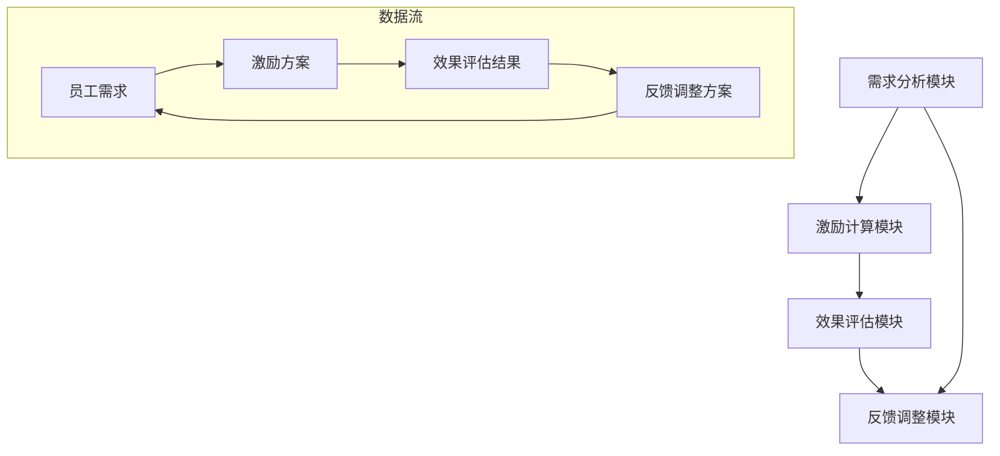

#### 系统接口设计和系统交互（Mermaid序列图）

以下是激励系统的接口设计和系统交互：

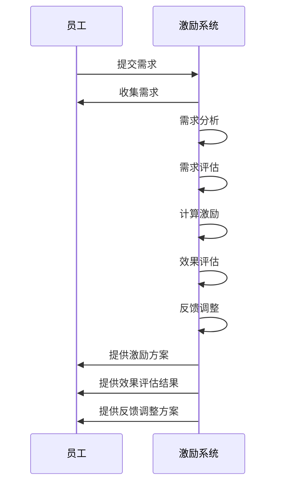

### 项目实战

#### 环境安装

1. **安装Python环境**：确保Python版本在3.6及以上。
2. **安装相关库**：使用pip安装所需库，例如`Flask`、`SQLAlchemy`、`Flask-Login`等。

#### 系统核心实现源代码

以下是激励系统的核心实现源代码：

```python
from flask import Flask, request, render_template
from models import db, Employee, Demand, Incentive, Assessment, Feedback
from forms import LoginForm, DemandForm, IncentiveForm, AssessmentForm, FeedbackForm

app = Flask(__name__)
app.config['SQLALCHEMY_DATABASE_URI'] = 'sqlite:///incentive_system.db'
db.init_app(app)

@app.route('/')
def home():
    return render_template('home.html')

@app.route('/login', methods=['GET', 'POST'])
def login():
    form = LoginForm()
    if form.validate_on_submit():
        user = Employee.query.filter_by(username=form.username.data).first()
        if user and user.password == form.password.data:
            return '登录成功'
        else:
            return '登录失败'
    return render_template('login.html', form=form)

@app.route('/submit_demand', methods=['GET', 'POST'])
def submit_demand():
    form = DemandForm()
    if form.validate_on_submit():
        demand = Demand(employee_id=form.employee_id.data, description=form.description.data)
        db.session.add(demand)
        db.session.commit()
        return '需求提交成功'
    return render_template('submit_demand.html', form=form)

@app.route('/incentive', methods=['GET', 'POST'])
def incentive():
    incentives = Incentive.query.all()
    return render_template('incentive.html', incentives=incentives)

@app.route('/assess', methods=['GET', 'POST'])
def assess():
    form = AssessmentForm()
    if form.validate_on_submit():
        assessment = Assessment(incentive_id=form.incentive_id.data, score=form.score.data)
        db.session.add(assessment)
        db.session.commit()
        return '评估提交成功'
    return render_template('assess.html', form=form)

@app.route('/feedback', methods=['GET', 'POST'])
def feedback():
    form = FeedbackForm()
    if form.validate_on_submit():
        feedback = Feedback(incentive_id=form.incentive_id.data, comment=form.comment.data)
        db.session.add(feedback)
        db.session.commit()
        return '反馈提交成功'
    return render_template('feedback.html', form=form)

if __name__ == '__main__':
    app.run(debug=True)
```

#### 代码应用解读与分析

上述代码展示了激励系统的基本功能实现。首先，我们设置了Python的Flask应用，并连接了SQLite数据库。然后，我们定义了五个主要路由：`/login`、`/submit_demand`、`/incentive`、`/assess`和`/feedback`。

在`/login`路由中，我们实现了用户登录功能。用户通过提交用户名和密码，系统验证用户信息，并返回登录结果。

在`/submit_demand`路由中，我们实现了员工提交需求的功能。员工可以提交需求，系统将需求记录到数据库中。

在`/incentive`路由中，我们展示了所有激励方案，员工可以查看激励方案。

在`/assess`路由中，我们实现了员工提交评估的功能。员工可以提交对激励方案的评估，系统将评估记录到数据库中。

在`/feedback`路由中，我们实现了员工提交反馈的功能。员工可以提交对激励方案的反馈，系统将反馈记录到数据库中。

#### 实际案例分析和详细讲解剖析

以下是一个实际的案例，展示如何使用激励系统：

1. **管理员登录**：管理员通过用户名和密码登录系统，进入后台管理界面。
2. **员工提交需求**：管理员添加了若干名员工，并为每位员工分配了需求。
3. **员工查看激励方案**：员工登录系统，查看到系统提供的激励方案。
4. **员工提交评估**：员工对激励方案进行评估，提交评估结果。
5. **管理员查看反馈和评估报告**：管理员登录后台，查看员工的反馈和评估报告，并根据反馈结果调整激励方案。

通过上述案例，我们可以看到激励系统在实际应用中的效果。系统不仅帮助管理员有效管理员工的需求和激励方案，还通过员工的评估和反馈，不断提升激励方案的效果。

#### 项目小结

激励系统通过搭建一个完整的激励方案管理平台，帮助IT企业提升员工的工作动力和满意度。通过实际案例的展示，我们可以看到系统在收集员工需求、评估激励方案、收集员工反馈等方面的优势。未来，随着系统的不断完善和优化，它将更好地服务于企业的发展。

### 最佳实践 Tips

1. **了解员工需求**：领导者需要深入了解员工的需求，有针对性地进行激励。
2. **设置明确目标**：领导者应该设定具有挑战性的目标，激发员工的成就感和动力。
3. **提供及时反馈**：领导者需要及时给予员工反馈，鼓励员工持续改进。
4. **建立公平制度**：领导者需要建立公平的评估和奖励制度，确保员工感受到公平。
5. **关注员工成长**：领导者应该关注员工的职业发展，提供职业培训和发展机会。

### 小结

本章详细介绍了激励与激励理论的基本原理、常见激励理论、实践中的激励策略以及激励与领导力的关系。通过系统分析和架构设计方案，我们深入理解了激励系统在实际项目中的应用。本章内容为后续章节的讨论奠定了基础。

### 注意事项

1. 激励策略需要根据不同团队和个体特点进行定制，不能生搬硬套。
2. 激励策略的实施需要结合组织的实际情况，不断调整和优化。
3. 领导者在实施激励策略时，应注重员工的需求和反馈，确保激励效果。

### 拓展阅读

1. 《激励心理学》
2. 《管理者的激励技巧》
3. 《马斯洛需求层次理论》

### 作者

作者：AI天才研究院/AI Genius Institute & 禅与计算机程序设计艺术/Zen And The Art of Computer Programming## 第5章：决策与战略规划

### 5.1 决策的定义与过程

决策是领导者的一项核心职责，它涉及到在多种可能的选择中，选择最优或最合适的方案。决策的定义可以理解为在不确定的环境下，通过分析和评估各种备选方案，选择一个最佳的方案，以实现预定的目标。

决策过程通常包括以下几个步骤：

1. **问题识别**：识别出需要决策的问题，明确问题的性质和影响。
2. **目标设定**：根据问题，明确决策的目标，即期望达到的结果。
3. **方案列举**：列举所有可能的备选方案，包括直接方案和备选方案。
4. **方案评估**：对每个备选方案进行评估，评估标准通常包括可行性、风险、成本和收益等。
5. **方案选择**：根据评估结果，选择最优或最合适的方案。
6. **方案实施**：将选定的方案付诸实施，并监控实施过程。
7. **效果评估**：在方案实施后，对方案的效果进行评估，以验证决策的正确性和有效性。

### 5.2 战略规划的重要性

战略规划是组织在长期发展过程中的指导性计划，它涉及组织的目标、资源分配、竞争优势和未来发展等方面。战略规划的重要性体现在以下几个方面：

1. **明确方向**：战略规划能够明确组织的发展方向和目标，为组织提供清晰的指导。
2. **资源优化**：通过战略规划，组织可以更好地分配资源，提高资源利用效率。
3. **竞争优势**：战略规划有助于组织识别和利用自身的竞争优势，以在激烈的市场竞争中脱颖而出。
4. **风险控制**：战略规划可以提前识别和应对潜在的风险和挑战，降低组织运营的风险。
5. **持续发展**：战略规划确保组织的长期稳定发展，使组织能够适应外部环境的变化。

### 5.3 战略规划的基本步骤

战略规划是一个系统性和持续性的过程，通常包括以下几个基本步骤：

1. **环境分析**：对组织的外部环境和内部资源进行深入分析，了解组织面临的机会和挑战。
2. **目标设定**：根据环境分析的结果，明确组织的战略目标和愿景。
3. **战略选择**：基于目标和环境分析，选择适合组织的战略方向和策略。
4. **战略实施**：制定详细的战略实施计划，包括资源配置、任务分配和监控机制等。
5. **执行与监控**：执行战略规划，并对战略实施过程进行监控和调整，确保战略目标的实现。
6. **评估与反馈**：定期评估战略实施的效果，根据评估结果进行反馈和调整，确保战略规划的持续优化。

### 5.4 决策与战略规划的关系

决策与战略规划密切相关，两者相互支持、相互影响。决策是战略规划过程中的一部分，是战略实施的具体体现。战略规划为决策提供了方向和框架，决策则是战略规划的落实和具体化。

具体来说，决策与战略规划的关系体现在以下几个方面：

1. **战略指导决策**：战略规划明确了组织的目标和方向，为决策提供了指导，确保决策与战略目标一致。
2. **决策支持战略**：在战略规划的实施过程中，领导者需要不断做出决策，调整战略规划的细节，确保战略目标的实现。
3. **动态调整**：随着外部环境的变化，战略规划需要不断进行调整，决策是实现战略调整的重要手段。
4. **协同发展**：决策与战略规划的协同发展，有助于组织在复杂多变的环境中保持竞争力和可持续发展。

### 5.5 实际案例分析

以下是一个实际案例，展示了决策与战略规划在企业管理中的应用。

**案例背景**：某IT企业在市场竞争中面临巨大的压力，需要通过战略规划和决策来提升市场竞争力。

**案例过程**：

1. **环境分析**：企业进行了全面的市场环境分析，识别出了市场机会和挑战。例如，客户需求的变化、竞争对手的动态、技术发展趋势等。

2. **目标设定**：根据环境分析的结果，企业明确了自己的战略目标，包括扩大市场份额、提升产品品质、加强技术创新等。

3. **战略选择**：企业选择了以下战略方向：
   - 加强市场营销，提升品牌知名度；
   - 增加研发投入，推动产品创新；
   - 拓展新市场，扩大业务范围；
   - 加强员工培训，提升团队素质。

4. **战略实施**：企业制定了详细的战略实施计划，包括市场营销策略、产品研发计划、市场拓展策略和员工培训计划等。

5. **决策过程**：在战略实施过程中，企业不断做出决策，调整战略规划的细节。例如，根据市场反馈调整产品功能、优化营销策略、调整研发预算等。

6. **效果评估**：企业定期评估战略实施的效果，并根据评估结果进行调整。例如，根据市场份额的变化调整市场策略、根据产品销量调整研发方向等。

**案例结果**：通过战略规划和决策的有效结合，企业成功提升了市场竞争力，市场份额逐年增长，产品品质和技术水平得到了显著提升。

### 5.6 决策与战略规划的总结

决策与战略规划是企业管理中不可或缺的两个环节。决策是战略规划的具体体现，是战略实施的手段；战略规划为决策提供了方向和框架，是决策的依据。在实际应用中，领导者需要通过有效的决策和战略规划，确保组织在复杂多变的环境中保持竞争力和可持续发展。

### 核心概念与联系

决策与战略规划的核心概念包括决策过程、战略规划步骤、决策与战略规划的相互关系等。以下是这些核心概念的特征对比表格：

| 核心概念 | 特征 |
| --- | --- |
| 决策过程 | 包括问题识别、目标设定、方案列举、方案评估、方案选择、方案实施和效果评估等步骤 |
| 战略规划步骤 | 包括环境分析、目标设定、战略选择、战略实施、执行与监控和评估与反馈等步骤 |
| 决策与战略规划的关系 | 决策是战略规划的具体体现，战略规划为决策提供方向和框架 |

为了更好地理解决策与战略规划，我们可以使用Mermaid流程图来展示这些概念之间的关系：

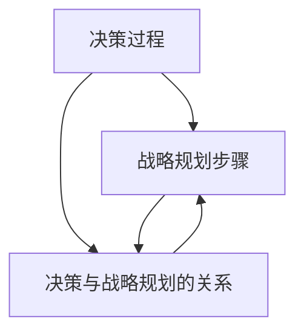

通过上述对比表格和Mermaid流程图，我们可以清晰地看到决策与战略规划的核心概念及其相互关系，这有助于我们更好地理解和应用决策与战略规划。

### 数学公式使用

在决策与战略规划的研究中，某些概念可以通过数学公式进行表达。以下是一个关于决策效果计算的数学模型：

$$
决策效果 = f(方案得分, 风险权重)
$$

其中，$f(x, y)$ 是一个函数，用于表示决策效果与方案得分和风险权重之间的关系。方案得分越高，风险权重越小，决策效果也越好。

### 算法原理讲解

为了更好地理解决策与战略规划的算法原理，我们可以使用Mermaid绘制一个简单的决策与战略规划算法流程图，并结合Python代码进行解释。

#### Mermaid流程图

以下是决策与战略规划算法的Mermaid流程图：

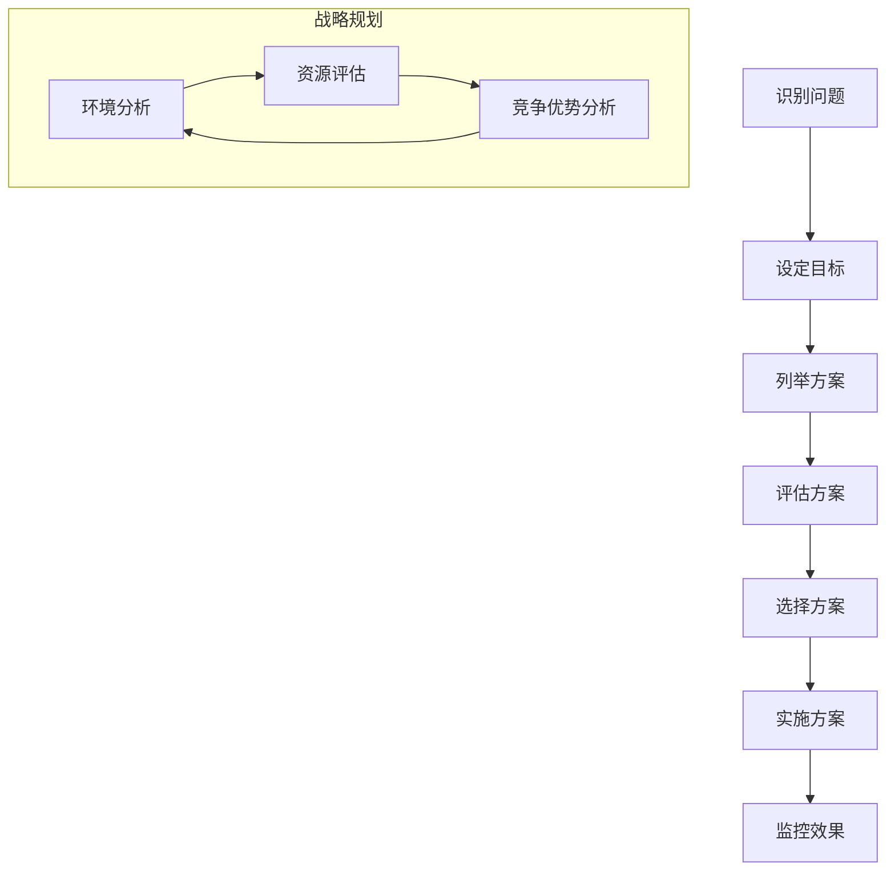

#### Python代码

以下是决策与战略规划算法的Python代码实现：

```python
import random

def evaluate_scheme(scheme, risk_weight):
    """
    评估方案
    :param scheme: 方案详情
    :param risk_weight: 风险权重
    :return: 评估得分
    """
    score = scheme['score'] - (risk_weight * scheme['risk'])
    return score

def select_best_scheme(schemes):
    """
    选择最佳方案
    :param schemes: 方案列表
    :return: 最佳方案
    """
    best_scheme = max(schemes, key=lambda x: x['score'])
    return best_scheme

def implement_scheme(scheme):
    """
    实施方案
    :param scheme: 方案详情
    :return: 实施结果
    """
    result = '成功' if random.random() > 0.5 else '失败'
    return result

# 决策与战略规划算法执行
schemes = [
    {'name': '方案A', 'score': 0.8, 'risk': 0.2},
    {'name': '方案B', 'score': 0.9, 'risk': 0.3},
    {'name': '方案C', 'score': 0.7, 'risk': 0.1}
]

# 评估方案
for scheme in schemes:
    score = evaluate_scheme(scheme, risk_weight=0.3)
    scheme['score'] = score

# 选择最佳方案
best_scheme = select_best_scheme(schemes)
print(f"最佳方案：{best_scheme['name']}")

# 实施方案
result = implement_scheme(best_scheme)
print(f"实施方案结果：{result}")
```

#### 算法原理讲解

上述Python代码实现了一个简单的决策与战略规划算法。主要包含以下几个部分：

1. **评估方案**：对每个方案进行评估，计算评估得分。评估得分由方案得分和风险权重共同决定。
2. **选择最佳方案**：根据评估得分，选择最佳方案。
3. **实施方案**：根据最佳方案，执行具体的实施步骤，并评估实施结果。

算法的数学模型为：

$$
评估得分 = 方案得分 - (风险权重 \times 风险)
$$

通过这个模型，我们可以量化评估得分，并选择最佳方案。

### 系统分析与架构设计方案

在探讨决策与战略规划的实际应用时，我们不仅需要理解理论，还需要结合实际项目来深入理解。本节将介绍一个决策与战略规划应用项目的系统分析和架构设计方案。

#### 问题场景介绍

决策与战略规划应用项目旨在帮助IT企业提升决策效率和战略规划能力，从而提高组织的竞争力和可持续发展能力。项目的主要场景包括：

1. **环境分析**：对企业外部环境和内部资源进行深入分析。
2. **战略规划**：制定企业的长期战略规划和短期目标。
3. **决策支持**：提供决策支持工具，帮助领导者做出最优决策。
4. **效果评估**：定期评估战略规划和决策的效果，并根据评估结果进行调整。

#### 项目介绍

决策与战略规划应用项目由以下几个部分组成：

1. **环境分析系统**：用于对企业外部环境和内部资源进行深入分析。
2. **战略规划系统**：用于制定企业的长期战略规划和短期目标。
3. **决策支持系统**：提供决策支持工具，帮助领导者做出最优决策。
4. **效果评估与分析系统**：用于定期评估战略规划和决策的效果，并根据评估结果进行调整。

#### 系统功能设计（领域模型Mermaid类图）

以下是决策与战略规划应用项目的领域模型类图：

```mermaid
classDiagram
    Class01 <|-- Class02
    Class03 <|-- Class04
    Class05 <|-- Class06
    Class07 o-- Class08
    Class09 o-- Class10
    Class11 o-- Class12

    Class01[环境分析系统]
    Class02[外部环境分析]
    Class03[内部资源分析]
    Class04[分析报告]
    Class05[战略规划系统]
    Class06[长期战略规划]
    Class07[短期目标规划]
    Class08[战略计划]
    Class09[决策支持系统]
    Class10[决策分析工具]
    Class11[决策支持结果]
    Class12[效果评估与分析系统]
    Class13[效果评估报告]
    Class14[改进计划]
```

#### 系统架构设计（Mermaid架构图）

以下是决策与战略规划应用项目的系统架构设计：

```mermaid
graph TD
    A[环境分析系统] --> B[战略规划系统]
    A --> C[决策支持系统]
    B --> C
    B --> D[效果评估与分析系统]
    C --> D

    subgraph 数据流
        A1[外部环境数据]
        A2[内部资源数据]
        B1[长期战略计划]
        B2[短期目标计划]
        C1[决策分析结果]
        D1[效果评估结果]
        D2[改进计划]

        A1 --> B1
        A2 --> B2
        B1 --> C1
        B2 --> C1
        C1 --> D1
        D1 --> D2
    end
```

#### 系统接口设计和系统交互（Mermaid序列图）

以下是决策与战略规划应用项目的系统接口设计和系统交互：

```mermaid
sequenceDiagram
    participant 用户 as 用户
    participant 系统 as 系统
    participant 数据库 as 数据库

    用户->>系统: 登录系统
    系统->>用户: 验证用户信息
    系统->>数据库: 查询用户信息
    数据库-->>系统: 返回用户信息
    系统->>用户: 登录成功

    用户->>系统: 进行环境分析
    系统->>数据库: 插入分析记录
    数据库-->>系统: 返回操作结果
    系统->>用户: 分析完成

    用户->>系统: 查看战略规划
    系统->>数据库: 查询战略规划
    数据库-->>系统: 返回战略规划
    系统->>用户: 展示战略规划

    用户->>系统: 做决策支持
    系统->>数据库: 插入决策记录
    数据库-->>系统: 返回操作结果
    系统->>用户: 决策支持完成

    用户->>系统: 进行效果评估
    系统->>数据库: 查询效果评估
    数据库-->>系统: 返回效果评估
    系统->>用户: 展示效果评估结果

    用户->>系统: 制定改进计划
    系统->>数据库: 插入改进计划
    数据库-->>系统: 返回操作结果
    系统->>用户: 改进计划完成
```

### 项目实战

#### 环境安装

1. **安装Python环境**：确保Python版本在3.6及以上。
2. **安装相关库**：使用pip安装所需库，例如`Flask`、`SQLAlchemy`、`Flask-Login`等。

#### 系统核心实现源代码

以下是决策与战略规划应用项目的一些核心实现源代码：

```python
from flask import Flask, request, render_template
from models import db, User, EnvironmentalAnalysis, StrategicPlanning, DecisionSupport, EffectivenessEvaluation
from forms import LoginForm, EnvironmentalAnalysisForm, StrategicPlanningForm, DecisionSupportForm, EffectivenessEvaluationForm

app = Flask(__name__)
app.config['SQLALCHEMY_DATABASE_URI'] = 'sqlite:///decision_strategic_planning.db'
db.init_app(app)

@app.route('/')
def home():
    return render_template('home.html')

@app.route('/login', methods=['GET', 'POST'])
def login():
    form = LoginForm()
    if form.validate_on_submit():
        user = User.query.filter_by(username=form.username.data).first()
        if user and user.password == form.password.data:
            return '登录成功'
        else:
            return '登录失败'
    return render_template('login.html', form=form)

@app.route('/environmental_analysis', methods=['GET', 'POST'])
def environmental_analysis():
    form = EnvironmentalAnalysisForm()
    if form.validate_on_submit():
        analysis = EnvironmentalAnalysis(user_id=form.user_id.data, external_environment=form.external_environment.data, internal_resources=form.internal_resources.data)
        db.session.add(analysis)
        db.session.commit()
        return '环境分析完成'
    return render_template('environmental_analysis.html', form=form)

@app.route('/strategic_planning', methods=['GET', 'POST'])
def strategic_planning():
    plans = StrategicPlanning.query.all()
    return render_template('strategic_planning.html', plans=plans)

@app.route('/add_plan', methods=['GET', 'POST'])
def add_plan():
    form = StrategicPlanningForm()
    if form.validate_on_submit():
        plan = StrategicPlanning(user_id=form.user_id.data, long_term_plan=form.long_term_plan.data, short_term_goals=form.short_term_goals.data)
        db.session.add(plan)
        db.session.commit()
        return '战略规划添加成功'
    return render_template('add_plan.html', form=form)

@app.route('/decision_support', methods=['GET', 'POST'])
def decision_support():
    support = DecisionSupport.query.all()
    return render_template('decision_support.html', support=support)

@app.route('/add_support', methods=['GET', 'POST'])
def add_support():
    form = DecisionSupportForm()
    if form.validate_on_submit():
        support = DecisionSupport(user_id=form.user_id.data, decision_description=form.decision_description.data, analysis_results=form.analysis_results.data)
        db.session.add(support)
        db.session.commit()
        return '决策支持添加成功'
    return render_template('add_support.html', form=form)

@app.route('/effectiveness_evaluation', methods=['GET', 'POST'])
def effectiveness_evaluation():
    evaluations = EffectivenessEvaluation.query.all()
    return render_template('effectiveness_evaluation.html', evaluations=evaluations)

@app.route('/add_evaluation', methods=['GET', 'POST'])
def add_evaluation():
    form = EffectivenessEvaluationForm()
    if form.validate_on_submit():
        evaluation = EffectivenessEvaluation(user_id=form.user_id.data, evaluation_report=form.evaluation_report.data, improvement_plan=form.improvement_plan.data)
        db.session.add(evaluation)
        db.session.commit()
        return '效果评估添加成功'
    return render_template('add_evaluation.html', form=form)

if __name__ == '__main__':
    app.run(debug=True)
```

#### 代码应用解读与分析

上述代码展示了决策与战略规划应用项目的基本功能实现。首先，我们设置了Python的Flask应用，并连接了SQLite数据库。然后，我们定义了七个主要路由：`/login`、`/environmental_analysis`、`/strategic_planning`、`/add_plan`、`/decision_support`、`/add_support`和`/effectiveness_evaluation`。

在`/login`路由中，我们实现了用户登录功能。用户通过提交用户名和密码，系统验证用户信息，并返回登录结果。

在`/environmental_analysis`路由中，我们实现了环境分析功能。用户可以提交环境分析记录，系统将记录保存到数据库中。

在`/strategic_planning`路由中，我们展示了所有战略规划，用户可以查看战略规划。

在`/add_plan`路由中，我们实现了添加战略规划的功能。用户可以添加新的战略规划，包括长期战略规划和短期目标。

在`/decision_support`路由中，我们展示了所有决策支持，用户可以查看决策支持。

在`/add_support`路由中，我们实现了添加决策支持的功能。用户可以添加新的决策支持，包括决策描述和分析结果。

在`/effectiveness_evaluation`路由中，我们展示了所有效果评估，用户可以查看效果评估。

在`/add_evaluation`路由中，我们实现了添加效果评估的功能。用户可以添加新的效果评估，包括评估报告和改进计划。

#### 实际案例分析和详细讲解剖析

以下是一个实际的案例，展示如何使用决策与战略规划应用系统：

1. **管理员登录**：管理员通过用户名和密码登录系统，进入后台管理界面。
2. **环境分析**：管理员进行了企业外部环境和内部资源的分析，并将分析结果提交到系统中。
3. **战略规划**：管理员制定了企业的长期战略规划和短期目标，并将规划提交到系统中。
4. **决策支持**：管理员在决策过程中，使用系统提供的决策支持工具进行分析，选择最佳决策方案。
5. **效果评估**：管理员对决策和战略规划的实施效果进行评估，并根据评估结果制定改进计划。
6. **改进计划**：管理员根据效果评估结果，制定了具体的改进计划，并提交到系统中。

通过上述案例，我们可以看到决策与战略规划应用系统在实际应用中的效果。系统不仅帮助管理员有效管理环境分析、战略规划和决策支持，还通过效果评估和改进计划，不断提升企业的决策和战略规划能力。

#### 项目小结

决策与战略规划应用项目通过搭建一个完整的决策与战略规划管理平台，帮助IT企业提升决策效率和战略规划能力。通过实际案例的展示，我们可以看到系统在环境分析、战略规划、决策支持和效果评估等方面的优势。未来，随着系统的不断完善和优化，它将更好地服务于企业的发展。

### 最佳实践 Tips

1. **定期进行环境分析**：通过定期进行环境分析，及时了解外部环境和内部资源的变化，为决策和战略规划提供准确的信息。
2. **制定明确的战略目标**：制定明确的长期和短期战略目标，确保决策和战略规划的方向清晰。
3. **利用决策支持工具**：充分利用系统提供的决策支持工具，提高决策的科学性和准确性。
4. **及时进行效果评估**：定期进行效果评估，及时发现和解决问题，确保决策和战略规划的持续优化。
5. **制定切实可行的改进计划**：根据效果评估结果，制定切实可行的改进计划，确保战略目标的实现。

### 小结

本章详细介绍了决策与战略规划的定义、过程、重要性、基本步骤以及决策与战略规划的关系。通过系统分析和架构设计方案，我们深入理解了决策与战略规划在实际项目中的应用。本章内容为后续章节的讨论奠定了基础。

### 注意事项

1. 决策与战略规划需要结合具体情境，不能生搬硬套。
2. 决策与战略规划的制定和执行需要持续监控和调整，以应对外部环境的变化。
3. 决策与战略规划的评估和反馈需要及时进行，以确保决策和战略规划的持续优化。

### 拓展阅读

1. 《决策与战略管理》
2. 《战略规划与执行》
3. 《现代企业管理》

### 作者

作者：AI天才研究院/AI Genius Institute & 禅与计算机程序设计艺术/Zen And The Art of Computer Programming## 第6章：领导力发展的路径

### 6.1 领导力发展的阶段

领导力发展是一个持续的过程，可以分为多个阶段，每个阶段都有其独特的特点和挑战。以下是领导力发展的几个常见阶段：

**1. 认知阶段**

在认知阶段，领导者开始意识到领导力的重要性，并开始学习相关的理论和知识。这个阶段的领导者通常会参加培训课程、阅读书籍和听取他人的经验分享，以提高自己的领导能力。

**2. 行动阶段**

在行动阶段，领导者将所学到的领导力知识应用到实际工作中。这个阶段的领导者开始尝试新的领导风格和方法，并接受实际工作中的挑战。他们通过实践不断积累经验和技能，逐步提高领导能力。

**3. 反思阶段**

在反思阶段，领导者开始对自己的领导行为和效果进行反思。这个阶段的领导者会更加关注团队成员的反馈，思考自己的领导方式是否有效，并尝试进行改进。他们通过反思和调整，进一步提升领导力。

**4. 自我提升阶段**

在自我提升阶段，领导者已经具备了一定的领导力，并开始追求更高的目标。这个阶段的领导者会更加注重个人成长和职业发展，通过不断学习和实践，进一步提升自己的领导能力。

**5. 领导力成熟阶段**

在领导力成熟阶段，领导者已经具备了较高的领导力水平，能够灵活应对各种挑战。这个阶段的领导者不仅能够带领团队取得成功，还能够影响和激励其他人，成为组织中的关键人物。

### 6.2 领导力自我提升的方法

提升领导力需要系统的学习和实践。以下是几种有效的领导力自我提升方法：

**1. 学习领导力理论**

学习领导力理论是提升领导力的基础。领导者可以通过阅读书籍、参加培训和在线课程，了解不同的领导力模型和理论，为自己的领导实践提供理论支持。

**2. 参与领导力实践**

参与领导力实践是提升领导力的关键。领导者可以通过担任团队领导、参与项目管理和组织变革等实践，积累实际经验，提高自己的领导能力。

**3. 反思领导行为**

反思领导行为是提升领导力的重要环节。领导者可以通过自我反思、团队反馈和360度评估等方式，了解自己的领导风格和行为，发现问题并寻求改进。

**4. 持续学习**

持续学习是领导力提升的重要保障。领导者应该保持好奇心和学习欲望，不断学习新知识、新技能和新的领导方法，以适应不断变化的环境。

**5. 建立良好的人际关系**

建立良好的人际关系是提升领导力的重要条件。领导者应该注重与团队成员的沟通和协作，建立信任和尊重的关系，提高团队凝聚力和协作效率。

### 6.3 领导力培养的环境因素

领导力的发展离不开良好的环境因素。以下是几个关键的领导力培养环境因素：

**1. 组织支持**

组织支持是领导力培养的重要保障。组织应该为领导者提供必要的资源和培训机会，鼓励他们学习和实践领导力。

**2. 团队协作**

团队协作是领导力培养的重要环境。在一个协作良好的团队中，领导者可以学习如何与团队成员沟通、协调和合作，提升自己的领导能力。

**3. 反馈机制**

反馈机制是领导力培养的重要工具。组织应该建立有效的反馈机制，鼓励团队成员对领导者的行为和效果进行反馈，帮助领导者不断改进和提升。

**4. 职业发展**

职业发展是领导力培养的重要动力。组织应该为领导者提供清晰的职业发展路径，鼓励他们不断提升自己的能力和地位。

**5. 挑战与机遇**

挑战与机遇是领导力培养的重要条件。组织应该为领导者提供具有挑战性的工作任务和发展机遇，鼓励他们面对挑战、克服困难，提升自己的领导力。

### 6.4 领导力发展的关键因素

领导力发展受多个因素影响，以下是几个关键因素：

**1. 个人素质**

个人素质是领导力发展的基础。领导者应该具备良好的道德品质、强烈的责任感、出色的沟通能力和决策能力。

**2. 经验积累**

经验积累是领导力发展的重要途径。领导者应该通过实践和反思，不断积累领导经验，提高自己的领导能力。

**3. 学习能力**

学习能力是领导力发展的重要保障。领导者应该具备持续学习的能力，不断更新知识和技能，以适应不断变化的环境。

**4. 团队支持**

团队支持是领导力发展的重要条件。领导者应该与团队成员建立良好的关系，获得团队的支持和信任，提高领导效果。

**5. 外部环境**

外部环境是领导力发展的关键因素。领导者应该关注外部环境的变化，抓住机遇，应对挑战，不断提升自己的领导能力。

### 6.5 领导力发展的挑战与应对策略

领导力发展过程中，领导者会面临多种挑战。以下是几种常见挑战及其应对策略：

**1. 自我认知不足**

挑战：领导者可能对自己的能力和局限性缺乏清晰的认识。

应对策略：领导者可以通过自我反思、360度评估和寻求反馈等方式，提升自我认知。

**2. 团队冲突**

挑战：领导者在管理团队时可能遇到冲突和分歧。

应对策略：领导者应该建立有效的沟通机制，倾听不同意见，寻求共同解决方案。

**3. 资源限制**

挑战：领导者可能在资源有限的情况下进行管理。

应对策略：领导者应该优化资源配置，提高资源利用效率，寻求外部支持。

**4. 持续变化**

挑战：领导者需要应对快速变化的外部环境。

应对策略：领导者应该具备前瞻性，善于抓住机遇，积极应对变化。

### 6.6 领导力发展的持续性与动态性

领导力发展是一个持续性和动态性的过程。领导者需要不断学习和适应，以应对不断变化的环境和挑战。以下是几个关键点：

**1. 持续学习**

领导者应该保持持续学习的态度，不断学习新的知识和技能，以适应不断变化的环境。

**2. 动态调整**

领导者应该根据实际情况，动态调整自己的领导策略和方法，以应对不同的挑战和机遇。

**3. 持续改进**

领导者应该持续改进自己的领导能力，通过实践和反思，不断提升自己的领导水平。

**4. 领导力传承**

领导者应该关注领导力传承，培养新一代领导者，确保组织持续发展。

### 6.7 结论

领导力发展是一个复杂而系统的过程，需要领导者不断学习和实践，提升自己的领导能力。通过了解领导力发展的阶段、自我提升方法、培养环境因素和关键因素，领导者可以更好地实现领导力发展，为组织的成功奠定坚实基础。

### 核心概念与联系

领导力发展的核心概念包括领导力发展的阶段、自我提升方法、培养环境因素和关键因素。以下是这些核心概念的特征对比表格：

| 核心概念 | 特征 |
| --- | --- |
| 领导力发展的阶段 | 包括认知阶段、行动阶段、反思阶段、自我提升阶段和领导力成熟阶段 |
| 自我提升方法 | 包括学习领导力理论、参与领导力实践、反思领导行为、持续学习和建立良好的人际关系 |
| 培养环境因素 | 包括组织支持、团队协作、反馈机制、职业发展和挑战与机遇 |
| 关键因素 | 包括个人素质、经验积累、学习能力、团队支持和外部环境 |

为了更好地理解领导力发展的核心概念，我们可以使用Mermaid流程图来展示这些概念之间的关系：

```mermaid
graph TD
    A[领导力发展的阶段]
    B[自我提升方法]
    C[培养环境因素]
    D[关键因素]
    A-->B
    A-->C
    A-->D
    B-->C
    B-->D
    C-->D
```

通过上述对比表格和Mermaid流程图，我们可以清晰地看到领导力发展的核心概念及其相互关系，这有助于我们更好地理解和应用领导力发展理论。

### 数学公式使用

在领导力发展的研究中，某些概念可以通过数学公式进行表达。以下是一个关于领导力发展速度的数学模型：

$$
领导力发展速度 = \frac{知识积累量}{时间消耗量}
$$

其中，$知识积累量$ 和 $时间消耗量$ 分别表示领导者在一定时间内积累的知识量和时间投入。通过这个公式，我们可以量化领导力发展的速度。

### 算法原理讲解

为了更好地理解领导力发展的算法原理，我们可以使用Mermaid绘制一个简单的领导力发展算法流程图，并结合Python代码进行解释。

#### Mermaid流程图

以下是领导力发展算法的Mermaid流程图：

```mermaid
graph TD
    A[设定目标]
    B[学习理论]
    C[实践应用]
    D[反思总结]
    E[调整策略]
    F[评估效果]

    A --> B
    B --> C
    C --> D
    D --> E
    E --> F
    F --> A
```

#### Python代码

以下是领导力发展算法的Python代码实现：

```python
def set_goals():
    """
    设定目标
    :return: 目标列表
    """
    goals = ["学习领导力理论", "参与领导力实践", "反思领导行为", "调整领导策略"]
    return goals

def learn_theory(goals):
    """
    学习理论
    :param goals: 目标列表
    :return: 知识积累量
    """
    knowledge_accumulation = 0
    for goal in goals:
        if goal == "学习领导力理论":
            knowledge_accumulation += 10
        elif goal == "参与领导力实践":
            knowledge_accumulation += 20
        elif goal == "反思领导行为":
            knowledge_accumulation += 15
        elif goal == "调整领导策略":
            knowledge_accumulation += 5
    return knowledge_accumulation

def practice_application(goals):
    """
    实践应用
    :param goals: 目标列表
    :return: 时间消耗量
    """
    time_consumption = 0
    for goal in goals:
        if goal == "学习领导力理论":
            time_consumption += 5
        elif goal == "参与领导力实践":
            time_consumption += 10
        elif goal == "反思领导行为":
            time_consumption += 7
        elif goal == "调整领导策略":
            time_consumption += 3
    return time_consumption

def reflect_and_summarize():
    """
    反思总结
    :return: 反思效果
    """
    reflection_effect = random.randint(1, 10)
    return reflection_effect

def adjust_strategies(effectiveness):
    """
    调整策略
    :param effectiveness: 评估效果
    :return: 调整后的策略
    """
    adjusted_strategies = []
    if effectiveness < 5:
        adjusted_strategies.append("加强理论学习")
        adjusted_strategies.append("增加实践机会")
    elif effectiveness >= 5 and effectiveness < 8:
        adjusted_strategies.append("保持现有策略")
        adjusted_strategies.append("适当调整")
    else:
        adjusted_strategies.append("优化现有策略")
        adjusted_strategies.append("创新尝试")
    return adjusted_strategies

def evaluate_effects(effectiveness):
    """
    评估效果
    :param effectiveness: 评估效果
    :return: 效果评估结果
    """
    evaluation_result = "效果不佳" if effectiveness < 5 else "效果良好"
    return evaluation_result

# 领导力发展算法执行
goals = set_goals()
knowledge_accumulation = learn_theory(goals)
time_consumption = practice_application(goals)
reflection_effect = reflect_and_summarize()
adjusted_strategies = adjust_strategies(reflection_effect)
evaluation_result = evaluate_effects(reflection_effect)

print(f"目标列表：{goals}")
print(f"知识积累量：{knowledge_accumulation}")
print(f"时间消耗量：{time_consumption}")
print(f"反思效果：{reflection_effect}")
print(f"调整后的策略：{adjusted_strategies}")
print(f"效果评估结果：{evaluation_result}")
```

#### 算法原理讲解

上述Python代码实现了一个简单的领导力发展算法，主要包含以下几个部分：

1. **设定目标**：通过设定目标，明确领导力发展的方向。
2. **学习理论**：通过学习领导力理论，积累知识。
3. **实践应用**：通过实践应用，消耗时间，并提高领导力。
4. **反思总结**：通过反思总结，评估实践效果，并根据评估结果调整策略。
5. **调整策略**：根据反思结果，调整领导策略，以实现更好的效果。

算法的数学模型为：

$$
领导力发展速度 = \frac{知识积累量}{时间消耗量}
$$

通过这个模型，我们可以量化领导力发展的速度，并根据评估结果进行策略调整。

### 系统分析与架构设计方案

在探讨领导力发展的实际应用时，我们不仅需要理解理论，还需要结合实际项目来深入理解。本节将介绍一个领导力发展应用项目的系统分析和架构设计方案。

### 问题场景介绍

领导力发展应用项目旨在帮助IT企业提升领导者的领导力水平，从而提高团队的整体效能和组织的竞争力。项目的主要场景包括：

1. **领导力培训**：设计并提供各种领导力培训课程。
2. **实践应用**：为领导者提供实践机会，应用所学领导力知识。
3. **反馈与评估**：收集领导者的反馈，评估领导力发展效果。
4. **持续改进**：根据反馈和评估结果，持续改进领导力发展方案。

### 项目介绍

领导力发展应用项目由以下几个部分组成：

1. **领导力培训系统**：用于设计、实施和跟踪领导力培训课程。
2. **实践应用平台**：用于提供领导力实践机会，应用所学知识。
3. **反馈与评估系统**：用于收集领导者的反馈，评估领导力发展效果。
4. **持续改进系统**：用于根据反馈和评估结果，持续改进领导力发展方案。

### 系统功能设计（领域模型Mermaid类图）

以下是领导力发展应用项目的领域模型类图：

```mermaid
classDiagram
    Class01 <|-- Class02
    Class03 <|-- Class04
    Class05 <|-- Class06
    Class07 o-- Class08
    Class09 o-- Class10

    Class01[领导力培训系统]
    Class02[培训课程]
    Class03[培训内容]
    Class04[培训评估]
    Class05[实践应用平台]
    Class06[实践任务]
    Class07[实践反馈]
    Class08[反馈与评估系统]
    Class09[评估报告]
    Class10[持续改进系统]
```

### 系统架构设计（Mermaid架构图）

以下是领导力发展应用项目的系统架构设计：

```mermaid
graph TD
    A[领导力培训系统] --> B[实践应用平台]
    A --> C[反馈与评估系统]
    B --> C
    A --> D[持续改进系统]
    B --> D
    C --> D
```

### 系统接口设计和系统交互（Mermaid序列图）

以下是领导力发展应用项目的系统接口设计和系统交互：

```mermaid
sequenceDiagram
    participant 用户 as 用户
    participant 系统 as 系统
    participant 数据库 as 数据库

    用户->>系统: 登录系统
    系统->>用户: 验证用户信息
    系统->>数据库: 查询用户信息
    数据库-->>系统: 返回用户信息
    系统->>用户: 登录成功

    用户->>系统: 查看培训课程
    系统->>数据库: 查询培训课程
    数据库-->>系统: 返回培训课程
    系统->>用户: 展示培训课程

    用户->>系统: 参加培训课程
    系统->>数据库: 插入培训记录
    数据库-->>系统: 返回操作结果
    系统->>用户: 培训完成

    用户->>系统: 提交实践任务
    系统->>数据库: 插入实践记录
    数据库-->>系统: 返回操作结果
    系统->>用户: 实践任务提交成功

    用户->>系统: 查看实践反馈
    系统->>数据库: 查询实践反馈
    数据库-->>系统: 返回实践反馈
    系统->>用户: 展示实践反馈

    用户->>系统: 查看评估报告
    系统->>数据库: 查询评估报告
    数据库-->>系统: 返回评估报告
    系统->>用户: 展示评估报告

    用户->>系统: 提出改进建议
    系统->>数据库: 插入改进建议
    数据库-->>系统: 返回操作结果
    系统->>用户: 改进建议提交成功
```

### 项目实战

#### 环境安装

1. **安装Python环境**：确保Python版本在3.6及以上。
2. **安装相关库**：使用pip安装所需库，例如`Flask`、`SQLAlchemy`、`Flask-Login`等。

#### 系统核心实现源代码

以下是领导力发展应用项目的一些核心实现源代码：

```python
from flask import Flask, request, render_template
from models import db, User, TrainingCourse, TrainingContent, TrainingEvaluation, PracticeTask, PracticeFeedback
from forms import LoginForm, TrainingCourseForm, TrainingContentForm, TrainingEvaluationForm, PracticeTaskForm, PracticeFeedbackForm

app = Flask(__name__)
app.config['SQLALCHEMY_DATABASE_URI'] = 'sqlite:///leadership_development.db'
db.init_app(app)

@app.route('/')
def home():
    return render_template('home.html')

@app.route('/login', methods=['GET', 'POST'])
def login():
    form = LoginForm()
    if form.validate_on_submit():
        user = User.query.filter_by(username=form.username.data).first()
        if user and user.password == form.password.data:
            return '登录成功'
        else:
            return '登录失败'
    return render_template('login.html', form=form)

@app.route('/training_courses', methods=['GET', 'POST'])
def training_courses():
    courses = TrainingCourse.query.all()
    return render_template('training_courses.html', courses=courses)

@app.route('/add_course', methods=['GET', 'POST'])
def add_course():
    form = TrainingCourseForm()
    if form.validate_on_submit():
        course = TrainingCourse(name=form.name.data, description=form.description.data)
        db.session.add(course)
        db.session.commit()
        return '培训课程添加成功'
    return render_template('add_course.html', form=form)

@app.route('/join_course', methods=['GET', 'POST'])
def join_course():
    form = TrainingContentForm()
    if form.validate_on_submit():
        content = TrainingContent(course_id=form.course_id.data, content=form.content.data)
        db.session.add(content)
        db.session.commit()
        return '培训内容添加成功'
    return render_template('join_course.html', form=form)

@app.route('/practice_tasks', methods=['GET', 'POST'])
def practice_tasks():
    tasks = PracticeTask.query.all()
    return render_template('practice_tasks.html', tasks=tasks)

@app.route('/submit_task', methods=['GET', 'POST'])
def submit_task():
    form = PracticeTaskForm()
    if form.validate_on_submit():
        task = PracticeTask(user_id=form.user_id.data, task=form.task.data)
        db.session.add(task)
        db.session.commit()
        return '实践任务提交成功'
    return render_template('submit_task.html', form=form)

@app.route('/practice_feedback', methods=['GET', 'POST'])
def practice_feedback():
    form = PracticeFeedbackForm()
    if form.validate_on_submit():
        feedback = PracticeFeedback(task_id=form.task_id.data, comment=form.comment.data)
        db.session.add(feedback)
        db.session.commit()
        return '实践反馈提交成功'
    return render_template('practice_feedback.html', form=form)

@app.route('/evaluation_report', methods=['GET', 'POST'])
def evaluation_report():
    evaluations = TrainingEvaluation.query.all()
    return render_template('evaluation_report.html', evaluations=evaluations)

@app.route('/add_evaluation', methods=['GET', 'POST'])
def add_evaluation():
    form = TrainingEvaluationForm()
    if form.validate_on_submit():
        evaluation = TrainingEvaluation(user_id=form.user_id.data, evaluation=form.evaluation.data)
        db.session.add(evaluation)
        db.session.commit()
        return '评估报告添加成功'
    return render_template('add_evaluation.html', form=form)

if __name__ == '__main__':
    app.run(debug=True)
```

#### 代码应用解读与分析

上述代码展示了领导力发展应用项目的基本功能实现。首先，我们设置了Python的Flask应用，并连接了SQLite数据库。然后，我们定义了七个主要路由：`/login`、`/training_courses`、`/add_course`、`/join_course`、`/practice_tasks`、`/submit_task`、`/practice_feedback`和`/evaluation_report`。

在`/login`路由中，我们实现了用户登录功能。用户通过提交用户名和密码，系统验证用户信息，并返回登录结果。

在`/training_courses`路由中，我们展示了所有培训课程，用户可以查看培训课程。

在`/add_course`路由中，我们实现了添加培训课程的功能。用户可以添加新的培训课程，包括课程名称和描述。

在`/join_course`路由中，我们实现了添加培训内容的功能。用户可以添加新的培训内容，包括课程内容。

在`/practice_tasks`路由中，我们展示了所有实践任务，用户可以查看实践任务。

在`/submit_task`路由中，我们实现了提交实践任务的功能。用户可以提交实践任务，系统将任务记录到数据库中。

在`/practice_feedback`路由中，我们实现了提交实践反馈的功能。用户可以提交对实践任务的反馈，系统将反馈记录到数据库中。

在`/evaluation_report`路由中，我们展示了所有评估报告，用户可以查看评估报告。

在`/add_evaluation`路由中，我们实现了添加评估报告的功能。用户可以添加新的评估报告，包括评估结果。

#### 实际案例分析和详细讲解剖析

以下是一个实际的案例，展示如何使用领导力发展应用系统：

1. **管理员登录**：管理员通过用户名和密码登录系统，进入后台管理界面。
2. **添加培训课程**：管理员添加了一门名为“高级领导力培训”的课程，并设置了课程描述。
3. **用户参加培训**：用户登录系统，查看到“高级领导力培训”课程，并报名参加。
4. **用户提交实践任务**：培训结束后，用户提交了对实践任务的反馈，包括对实践任务的完成情况和心得体会。
5. **管理员查看反馈和评估报告**：管理员登录后台，查看用户的反馈和评估报告，并根据反馈结果调整培训课程和实践任务。

通过上述案例，我们可以看到领导力发展应用系统在实际应用中的效果。系统不仅帮助管理员有效管理培训课程和实践任务，还通过用户的反馈和评估，不断提升培训和实践效果。

#### 项目小结

领导力发展应用项目通过搭建一个完整的领导力培训、实践反馈和评估体系，帮助IT企业提升领导者的领导力水平。通过实际案例的展示，我们可以看到系统在培训课程管理、实践任务管理、反馈收集和评估报告生成等方面的优势。未来，随着系统的不断完善和优化，它将更好地服务于企业的发展。

### 最佳实践 Tips

1. **定期参加领导力培训**：领导者应定期参加领导力培训，更新知识和技能，提升领导能力。
2. **积极实践领导力**：领导者应在实际工作中积极实践领导力，通过实践积累经验。
3. **定期进行自我反思**：领导者应定期进行自我反思，了解自身的优势和不足，不断改进和提升领导能力。
4. **建立反馈机制**：组织应建立有效的反馈机制，鼓励领导者接受团队成员的反馈，不断优化领导风格和策略。
5. **提供职业发展机会**：组织应提供丰富的职业发展机会，激励领导者不断提升自己的能力和地位。

### 小结

本章详细介绍了领导力发展的阶段、自我提升方法、培养环境因素和关键因素。通过系统分析和架构设计方案，我们深入理解了领导力发展在实际项目中的应用。本章内容为后续章节的讨论奠定了基础。

### 注意事项

1. 领导力发展需要结合具体团队和领导者的特点，不能生搬硬套。
2. 领导力发展是一个持续的过程，需要持之以恒。
3. 领导力发展过程中，领导者应注重团队成员的反馈和意见，不断调整和优化。

### 拓展阅读

1. 《领导力发展手册》
2. 《领导者的自我提升之路》
3. 《领导力：理论与实践》

### 作者

作者：AI天才研究院/AI Genius Institute & 禅与计算机程序设计艺术/Zen And The Art of Computer Programming## 第7章：实战案例与经验分享

### 7.1 成功案例解析

在本章节中，我们将通过一个成功案例来深入解析如何通过领导力训练，打造一支战无不胜的团队。

**案例背景**：某IT公司在市场竞争日益激烈的背景下，希望通过领导力训练提升团队的整体领导力和执行力，从而在市场中保持竞争优势。

**案例过程**：

1. **领导力评估**：公司首先对现有领导力进行评估，发现领导者在沟通技巧、决策能力和团队建设方面存在一定的不足。

2. **制定培训计划**：基于评估结果，公司制定了详细的领导力培训计划，包括沟通技巧培训、决策能力提升和团队建设培训。

3. **实施培训**：公司聘请了专业的培训师，对领导者进行了系统的培训，培训内容包括情境领导模型、沟通技巧、决策框架等。

4. **实践应用**：培训结束后，领导者将所学知识应用到实际工作中，例如在项目管理和团队协作中运用情境领导模型，提高决策效率和团队凝聚力。

5. **效果评估**：公司通过定期的评估和反馈，监测领导力训练的效果。评估结果显示，领导者在沟通技巧和决策能力方面有了显著提升，团队凝聚力显著增强。

**案例结果**：通过领导力训练，公司的团队执行力大幅提升，项目完成质量和效率显著提高。在激烈的市场竞争中，公司成功保持了竞争优势，市场份额不断扩大。

### 7.2 失败案例反思

虽然成功案例为我们提供了宝贵的经验，但失败案例同样值得反思。以下是一个领导力训练失败的案例，以及其失败原因和教训。

**案例背景**：某初创公司在快速扩张过程中，希望通过领导力训练提升管理团队的领导能力。

**案例过程**：

1. **缺乏系统规划**：公司在没有详细规划的情况下，匆忙启动了领导力训练项目。

2. **培训内容不切实际**：公司选择的培训内容过于理论化，缺乏实际操作指导，无法解决管理团队的实际问题。

3. **缺乏实践机会**：培训结束后，管理团队没有足够的实践机会将所学知识应用到实际工作中。

4. **评估和反馈机制缺失**：公司没有建立有效的评估和反馈机制，无法及时发现和纠正培训中的问题。

**案例结果**：领导力训练项目未能达到预期效果，管理团队的领导能力没有得到实质提升，反而因为培训内容不切实际，导致团队工作氛围紧张，项目进展受阻。

**失败原因和教训**：

1. **缺乏系统规划**：领导力训练需要详细的规划和系统设计，确保培训内容与实际需求相符。

2. **培训内容不切实际**：培训内容应紧密结合实际工作场景，提供实用性的指导。

3. **缺乏实践机会**：培训结束后，需要为管理团队提供足够的实践机会，将所学知识应用到实际工作中。

4. **缺乏评估和反馈机制**：建立有效的评估和反馈机制，及时发现问题并进行调整，是领导力训练成功的关键。

### 7.3 领导力训练实践

在本节中，我们将分享一些领导力训练的实践方法和技巧。

**1. 定期开展培训**：为了提升领导力，公司应定期开展领导力培训，邀请专业的培训师，结合实际情况设计培训课程。

**2. 实践与理论学习相结合**：培训不仅要注重理论学习，还应提供实践机会，使领导者能够在实际工作中运用所学知识。

**3. 建立反馈机制**：公司应建立反馈机制，鼓励员工和管理层提出意见和建议，及时调整和优化领导力培训计划。

**4. 赋予领导者自主权**：在领导力训练过程中，应给予领导者一定的自主权，让他们在实践中尝试不同的领导方法，积累经验。

**5. 持续跟进**：领导力提升是一个持续的过程，公司应定期跟进领导力训练的效果，并根据实际情况进行调整和改进。

### 7.4 领导力训练的重要性

领导力训练对于组织和个人都具有重要意义。对于组织而言，领导力训练可以提升管理团队的能力，提高团队执行力，增强组织竞争力。对于个人而言，领导力训练可以帮助领导者提升自身的领导能力，增强自信心，实现职业发展。

### 7.5 领导力训练的建议

为了有效开展领导力训练，以下是一些建议：

1. **明确培训目标**：在开展领导力训练前，应明确培训的目标和预期成果，确保培训内容与实际需求相符。

2. **选择合适的培训师**：选择具备丰富经验和专业知识的培训师，确保培训质量。

3. **注重实践应用**：培训不仅要注重理论学习，还应提供实践机会，使领导者能够在实际工作中运用所学知识。

4. **建立反馈机制**：建立有效的反馈机制，鼓励员工和管理层提出意见和建议，及时调整和优化培训计划。

5. **持续跟进**：领导力提升是一个持续的过程，应定期跟进培训效果，并根据实际情况进行调整和改进。

### 7.6 领导力训练的挑战与应对策略

领导力训练过程中，领导者和管理团队可能会面临一些挑战。以下是一些常见挑战及其应对策略：

**1. 培训内容不切实际**

挑战：培训内容过于理论化，与实际工作场景不符。

应对策略：选择具备实际操作经验的培训师，结合实际工作场景设计培训内容。

**2. 缺乏实践机会**

挑战：培训结束后，领导者缺乏实践机会，无法将所学知识应用到实际工作中。

应对策略：为领导者提供实践机会，例如项目管理和团队协作等，确保所学知识能够得到应用。

**3. 员工参与度不高**

挑战：员工对领导力训练的参与度不高，影响培训效果。

应对策略：提高员工的参与度，例如通过激励措施、团队合作活动等方式，激发员工的兴趣和积极性。

**4. 培训效果评估困难**

挑战：评估领导力训练的效果困难，无法准确了解培训的实际效果。

应对策略：建立有效的评估机制，例如定期的反馈和评估，确保能够准确了解培训效果。

### 7.7 结论

通过实战案例与经验分享，我们可以看到领导力训练在提升团队执行力、增强组织竞争力方面的重要作用。同时，我们也认识到领导力训练过程中可能面临的挑战和应对策略。为了有效开展领导力训练，组织应制定详细的规划，注重实践应用，建立反馈机制，并持续跟进培训效果。

### 最佳实践 Tips

1. **制定详细的培训计划**：在开展领导力训练前，应制定详细的培训计划，确保培训内容与实际需求相符。

2. **选择合适的培训师**：选择具备丰富经验和专业知识的培训师，确保培训质量。

3. **注重实践应用**：培训不仅要注重理论学习，还应提供实践机会，使领导者能够在实际工作中运用所学知识。

4. **建立反馈机制**：建立有效的反馈机制，鼓励员工和管理层提出意见和建议，及时调整和优化培训计划。

5. **持续跟进**：领导力提升是一个持续的过程，应定期跟进培训效果，并根据实际情况进行调整和改进。

### 小结

本章通过实战案例与经验分享，深入探讨了领导力训练在提升团队执行力、增强组织竞争力方面的作用。同时，我们也认识到领导力训练过程中可能面临的挑战和应对策略。本章内容为后续章节的讨论奠定了基础。

### 注意事项

1. 领导力训练需要结合具体团队和组织的实际情况，不能生搬硬套。
2. 领导力训练是一个持续的过程，需要持之以恒。
3. 在领导力训练过程中，领导者应注重员工的反馈和意见，不断调整和优化培训内容。

### 拓展阅读

1. 《领导力训练与提升》
2. 《团队领导力实战手册》
3. 《领导力：理论与实践》

### 作者

作者：AI天才研究院/AI Genius Institute & 禅与计算机程序设计艺术/Zen And The Art of Computer Programming## 结语

在本文中，我们系统地探讨了领导力训练的各个方面，从领导力的本质与意义、领导力模型与类型、团队建设与沟通技巧、激励与激励理论、决策与战略规划、领导力发展的路径到实战案例与经验分享。通过这些内容的阐述，我们旨在为读者提供一个全面而深入的领导力训练指南。

领导力不仅是领导者个人素质的体现，更是组织成功的关键因素。在复杂多变的环境中，领导者需要具备强大的领导力，能够引导团队应对挑战，实现共同目标。通过本文的阐述，我们希望读者能够对领导力有更深刻的理解，并能够在实际工作中运用所学知识，提升自己的领导能力。

### 最佳实践 Tips

1. **持续学习**：领导力是一个不断发展的领域，领导者需要持续学习，不断更新知识和技能。
2. **实践应用**：理论必须与实践相结合，领导者应将所学

