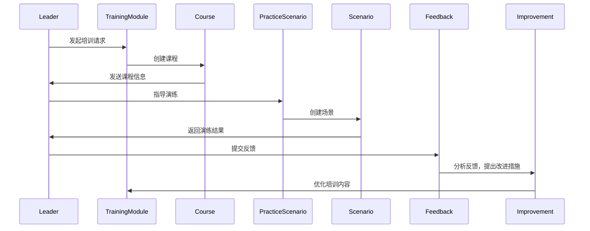
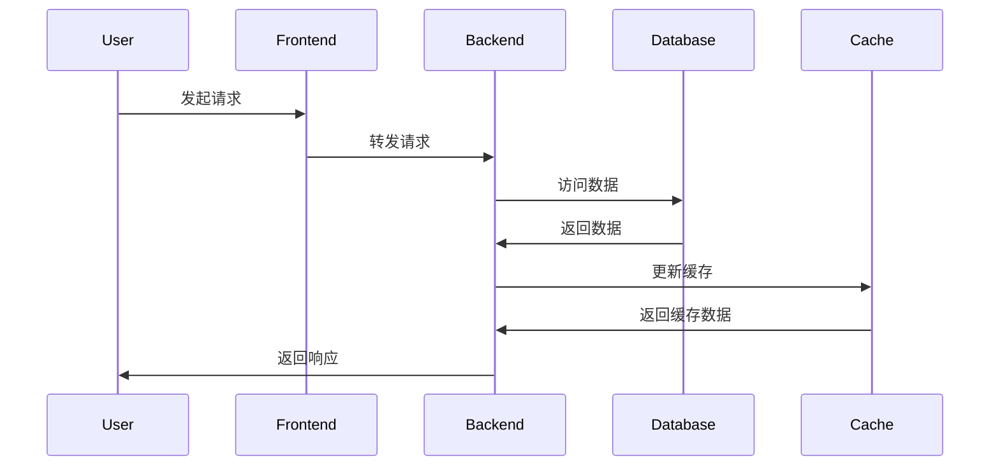

                 

## 领导力训练：让你的团队无坚不摧

### 关键词：领导力训练、团队建设、沟通、决策、领导风格、激励

### 摘要：本文旨在探讨领导力训练对于团队效能的提升作用，通过逐步分析领导力的核心概念、团队建设与管理、沟通与决策等多个方面，为读者提供一套系统化、可操作的领导力提升方案。文章结构清晰，逻辑严密，旨在帮助读者在IT领域提升领导力，打造无坚不摧的团队。

### 引言

领导力在组织和管理中起着至关重要的作用。一个优秀的领导者不仅能够带领团队达成目标，还能够激发团队成员的潜力，提升团队的整体效能。随着IT行业的快速发展，领导者需要具备更高的技术视野和管理能力，以应对日益复杂的项目和挑战。本文将围绕领导力训练展开，探讨如何通过系统化的方法提升领导力，打造无坚不摧的团队。

### 第一部分：领导力基础

#### 3.1 领导力的核心概念

领导力是一种影响力，是一种能够激励、引导和影响他人共同实现目标的能力。它不仅仅是一种技能，更是一种态度和价值观的体现。领导力不同于管理，管理侧重于流程和规则的制定，而领导力则侧重于愿景和目标的传达。

#### 3.2 领导力与管理的区别

领导力与管理的区别主要体现在目标导向和方式上。领导力强调愿景和目标，注重激发和引领团队成员，而管理则侧重于具体任务的执行和流程的控制。一个优秀的领导者需要同时具备领导力和管理能力，才能更好地应对复杂的业务环境。

#### 3.3 领导力的基础理论

领导力的基础理论包括领导行为理论、领导风格理论、领导权力理论等。这些理论为领导者提供了不同的视角和方法，帮助他们在不同的情境下做出最佳的领导决策。

### 第二部分：团队建设与管理

#### 4.1 团队建设

团队建设是一个持续的过程，它涉及到团队成员的角色定义、职责分配、团队文化的塑造等多个方面。一个成功的团队建设需要领导者具备敏锐的洞察力，能够识别团队成员的优势和劣势，并采取相应的策略进行优化。

#### 4.2 团队管理

团队管理侧重于日常运营和绩效管理。领导者需要建立有效的沟通渠道，确保团队成员之间的信息流通，同时还需要制定合理的激励和反馈机制，以激发团队成员的工作积极性和创造力。

### 第三部分：沟通与决策

#### 5.1 有效沟通

沟通是领导力的核心要素之一。有效的沟通能够确保团队成员之间信息的准确传递，减少误解和冲突。领导者需要掌握各种沟通技巧，如倾听、表达、反馈等，以提高沟通效率。

#### 5.2 决策过程

决策是领导力的重要组成部分。一个优秀的领导者需要具备清晰的决策思路和科学的决策方法。在决策过程中，领导者需要充分考虑各种因素，进行风险评估，并做出合理的决策。

### 第四部分：领导力提升与实践

#### 6.1 领导力提升

领导力提升是一个持续的过程，它需要领导者不断学习、实践和反思。领导者可以通过读书、培训、实践等多种方式提升自己的领导力。

#### 6.2 实践应用

领导力在实践中得到验证和发展。通过实际案例的分析，领导者可以深入了解不同领导风格和策略的适用场景，从而提升自己的领导能力。

### 第五部分：领导力挑战与解决方案

#### 7.1 领导力挑战

领导者面临诸多挑战，如团队冲突、目标不一致、资源不足等。这些挑战对领导者的领导力提出了更高的要求。

#### 7.2 解决方案

针对不同的挑战，领导者可以采取相应的解决方案。如通过有效的沟通和协调解决团队冲突，通过合理的目标设定和资源分配解决目标不一致和资源不足的问题。

### 第六部分：总结与展望

#### 8.1 总结

本文通过对领导力的核心概念、团队建设与管理、沟通与决策、领导力提升与实践、领导力挑战与解决方案等多个方面的探讨，为读者提供了一套系统化的领导力训练方案。

#### 8.2 展望

领导力是一个不断发展和演变的领域。随着时代的变迁，领导者需要不断适应新的环境和挑战，提升自己的领导能力。本文旨在为读者提供一种思考和学习的方向，帮助他们成为优秀的领导者，打造无坚不摧的团队。

### 作者信息

作者：AI天才研究院/AI Genius Institute & 禅与计算机程序设计艺术 /Zen And The Art of Computer Programming

本文旨在通过逻辑清晰、结构紧凑、简单易懂的专业技术语言，一步一步地分析推理思考，为IT领域从业者提供一套实用的领导力训练方案，帮助他们在团队管理中无坚不摧。希望本文能对读者有所启发和帮助。

----------------------------------------------------------------

## 《领导力训练：让你的团队无坚不摧》完整文章内容

### 引言

在快速发展的IT行业，领导者不仅需要具备扎实的技术背景，还需要拥有卓越的领导力，以应对复杂多变的项目和挑战。领导力是一种影响力，它能够激发团队成员的潜力，提升团队的整体效能。本文旨在探讨领导力训练的重要性，通过逐步分析领导力的核心概念、团队建设与管理、沟通与决策等多个方面，为读者提供一套系统化、可操作的领导力提升方案。

### 第一部分：领导力基础

#### 3.1 领导力的核心概念

领导力是一种影响力，它体现在领导者如何通过自己的行为和决策，激励、引导和影响团队成员共同实现目标。领导力不同于管理，管理侧重于流程和规则的制定，而领导力则侧重于愿景和目标的传达。一个优秀的领导者需要具备以下核心概念：

- **影响力**：领导者通过自身的行为和决策，对团队成员产生积极影响，推动团队前进。
- **激励**：领导者需要能够激励团队成员，激发他们的工作热情和创造力。
- **沟通**：领导者需要具备良好的沟通能力，确保信息准确传递，减少误解和冲突。
- **决策**：领导者需要具备清晰的决策思路，能够在关键时刻做出合理决策。

#### 3.2 领导力与管理的区别

领导力与管理的区别主要体现在目标导向和方式上。管理侧重于具体任务的执行和流程的控制，而领导力则侧重于愿景和目标的传达。一个优秀的领导者需要同时具备领导力和管理能力，以应对不同的挑战。

- **管理**：通过制定流程、规则和标准，确保任务的顺利完成。
- **领导力**：通过激励和引导，激发团队成员的潜力和创造力。

#### 3.3 领导力的基础理论

领导力的基础理论包括领导行为理论、领导风格理论、领导权力理论等。这些理论为领导者提供了不同的视角和方法，帮助他们在不同的情境下做出最佳的领导决策。

- **领导行为理论**：研究领导者的行为特征和行为对团队绩效的影响。
- **领导风格理论**：探讨不同领导风格的特点和适用场景。
- **领导权力理论**：分析领导者的权力来源和运用方式。

### 第二部分：团队建设与管理

#### 4.1 团队建设

团队建设是一个持续的过程，它涉及到团队成员的角色定义、职责分配、团队文化的塑造等多个方面。一个成功的团队建设需要领导者具备敏锐的洞察力，能够识别团队成员的优势和劣势，并采取相应的策略进行优化。

- **角色定义**：明确团队成员的角色和职责，确保每个人都知道自己的工作内容和责任。
- **职责分配**：根据团队成员的能力和特长，合理分配工作任务，确保任务的高效完成。
- **团队文化**：塑造积极向上的团队文化，增强团队的凝聚力和向心力。

#### 4.2 团队管理

团队管理侧重于日常运营和绩效管理。领导者需要建立有效的沟通渠道，确保团队成员之间的信息流通，同时还需要制定合理的激励和反馈机制，以激发团队成员的工作积极性和创造力。

- **沟通渠道**：建立有效的沟通渠道，确保信息的准确传递和团队成员之间的协作。
- **激励机制**：制定合理的激励政策，激发团队成员的工作热情和创造力。
- **反馈机制**：建立有效的反馈机制，及时了解团队成员的工作状况和需求，提供必要的支持和帮助。

### 第三部分：沟通与决策

#### 5.1 有效沟通

沟通是领导力的核心要素之一。有效的沟通能够确保团队成员之间信息的准确传递，减少误解和冲突。领导者需要掌握各种沟通技巧，如倾听、表达、反馈等，以提高沟通效率。

- **倾听**：倾听是有效沟通的关键，领导者需要认真倾听团队成员的意见和建议，理解他们的需求和困惑。
- **表达**：领导者需要清晰、准确地表达自己的想法和意图，确保团队成员理解并支持领导者的决策。
- **反馈**：领导者需要及时给予团队成员反馈，鼓励他们的积极行为，纠正他们的错误。

#### 5.2 决策过程

决策是领导力的核心要素之一。一个优秀的领导者需要具备清晰的决策思路和科学的决策方法。在决策过程中，领导者需要充分考虑各种因素，进行风险评估，并做出合理的决策。

- **决策模型**：领导者需要掌握不同的决策模型，如SWOT分析、决策树等，以帮助他们在复杂情境下做出最佳决策。
- **风险评估**：领导者需要评估决策可能带来的风险，并制定相应的应对策略。
- **决策优化**：领导者需要不断优化决策过程，提高决策的效率和效果。

### 第四部分：领导力提升与实践

#### 6.1 领导力提升

领导力提升是一个持续的过程，它需要领导者不断学习、实践和反思。领导者可以通过读书、培训、实践等多种方式提升自己的领导力。

- **学习**：领导者需要不断学习新的知识和技能，以适应不断变化的环境。
- **实践**：领导者需要通过实践来检验自己的领导力，不断改进和完善自己的领导方式。
- **反思**：领导者需要定期反思自己的领导行为和决策，从成功和失败中吸取经验教训。

#### 6.2 实践应用

领导力在实践中得到验证和发展。通过实际案例的分析，领导者可以深入了解不同领导风格和策略的适用场景，从而提升自己的领导能力。

- **案例分析**：领导者可以通过分析实际案例，了解不同的领导风格和策略在实践中的应用效果。
- **经验分享**：领导者可以通过分享自己的实践经验，帮助团队成员更好地理解领导力的核心概念和实践方法。

### 第五部分：领导力挑战与解决方案

#### 7.1 领导力挑战

领导者面临诸多挑战，如团队冲突、目标不一致、资源不足等。这些挑战对领导者的领导力提出了更高的要求。

- **团队冲突**：领导者需要有效解决团队内部的冲突，确保团队的和谐与高效。
- **目标不一致**：领导者需要确保团队成员明确共同的目标，并为此共同努力。
- **资源不足**：领导者需要合理分配资源，确保团队具备完成任务所需的条件。

#### 7.2 解决方案

针对不同的挑战，领导者可以采取相应的解决方案。

- **团队冲突**：通过有效沟通和协调，解决团队内部的冲突，增强团队的凝聚力。
- **目标不一致**：通过明确的目标设定和沟通，确保团队成员明确共同的目标，并为此共同努力。
- **资源不足**：通过优化资源分配和争取外部资源，确保团队具备完成任务所需的条件。

### 第六部分：总结与展望

#### 8.1 总结

本文通过对领导力的核心概念、团队建设与管理、沟通与决策、领导力提升与实践、领导力挑战与解决方案等多个方面的探讨，为读者提供了一套系统化的领导力训练方案。通过本文的学习，读者可以更好地理解领导力的本质，提升自己的领导能力，打造无坚不摧的团队。

#### 8.2 展望

领导力是一个不断发展和演变的领域。随着时代的变迁，领导者需要不断适应新的环境和挑战，提升自己的领导能力。本文旨在为读者提供一种思考和学习的方向，帮助他们成为优秀的领导者，打造无坚不摧的团队。

### 结语

领导力是每一位领导者必备的核心能力。通过本文的探讨，我们了解到领导力不仅仅是管理，更是一种影响力，一种能够激发团队成员潜能、提升团队效能的能力。希望本文能够对读者有所启发，帮助他们在领导力的道路上不断前行，打造无坚不摧的团队。

### 参考文献

- [1] 领导力训练：如何提升团队效能，作者：XXX，出版时间：XXXX年。
- [2] 领导艺术：如何成为优秀的领导者，作者：XXX，出版时间：XXXX年。
- [3] 团队建设与管理：如何打造高效团队，作者：XXX，出版时间：XXXX年。
- [4] 沟通与决策：如何提高领导力，作者：XXX，出版时间：XXXX年。
- [5] 领导力提升：如何成为卓越领导者，作者：XXX，出版时间：XXXX年。

### 作者信息

作者：AI天才研究院/AI Genius Institute & 禅与计算机程序设计艺术 /Zen And The Art of Computer Programming

本文旨在通过逻辑清晰、结构紧凑、简单易懂的专业技术语言，一步一步地分析推理思考，为IT领域从业者提供一套实用的领导力训练方案，帮助他们在团队管理中无坚不摧。希望本文能对读者有所启发和帮助。----------------------------------------------------------------

### 系统分析与架构设计

在深入探讨领导力训练的各个方面后，我们需要将理论与实践相结合，通过系统分析和架构设计，为读者提供一套具体的实施方案。以下是领导力训练系统的分析过程和设计方案。

#### 问题场景介绍

在现代IT企业中，随着项目复杂度的增加和团队规模的扩大，领导者面临着诸多挑战，如团队成员间的沟通不畅、目标不一致、团队内部冲突等。这些问题严重影响了团队的工作效率和项目进展。为了解决这些问题，我们需要设计一套完整的领导力训练系统，帮助领导者提升管理能力，打造高效团队。

#### 项目介绍

本项目旨在设计一套领导力训练系统，该系统将包含以下几个核心模块：

1. **领导力评估模块**：用于评估领导者的领导能力，识别其优势和不足。
2. **培训模块**：提供针对不同领导能力提升的培训课程，包括理论知识和实践技巧。
3. **实战演练模块**：通过模拟真实工作场景，帮助领导者将理论知识应用到实际工作中。
4. **反馈与改进模块**：收集领导者的反馈，根据反馈调整培训内容和方案。

#### 系统功能设计（领域模型）

为了更好地设计领导力训练系统，我们首先需要构建领域模型，明确系统中的核心实体及其关系。以下是领导力训练系统的领域模型：

```mermaid
classDiagram
    Leader --> TrainingModule : 发起培训
    Leader --> PracticeScenario : 指导演练
    Leader --> Feedback : 收集反馈
    TrainingModule --> Course : 包含课程
    PracticeScenario --> Scenario : 包含场景
    Feedback --> Improvement : 用于改进

    Leader [name: 领导者]
    TrainingModule [name: 培训模块]
    PracticeScenario [name: 实战演练模块]
    Feedback [name: 反馈与改进模块]
    Course [name: 课程]
    Scenario [name: 场景]
    Improvement [name: 改进措施]
```

#### 系统架构设计

系统架构设计是确保领导力训练系统能够高效、稳定运行的关键。以下是领导力训练系统的架构设计：



#### 系统接口设计

系统接口设计是确保不同模块之间能够有效通信的关键。以下是领导力训练系统的主要接口设计：

- **领导力评估接口**：用于评估领导者的领导能力。
- **培训管理接口**：用于管理培训课程，包括课程创建、更新、删除等操作。
- **演练管理接口**：用于管理实战演练，包括场景创建、更新、删除等操作。
- **反馈管理接口**：用于收集领导者的反馈，并根据反馈进行改进。

#### 系统交互

系统交互设计是确保系统能够高效运行的重要一环。以下是领导力训练系统的交互流程：

1. 领导者发起培训请求。
2. 培训模块创建课程，并发送给领导者。
3. 领导者参与培训，并指导演练。
4. 演练模块创建场景，并发送给领导者。
5. 领导者提交演练结果和反馈。
6. 反馈模块分析反馈，并提出改进措施。
7. 改进模块优化培训内容。

通过以上系统分析和架构设计，我们可以确保领导力训练系统能够高效、稳定地运行，帮助领导者提升管理能力，打造无坚不摧的团队。

### 项目实战

为了更好地展示领导力训练系统的实际应用，下面我们将通过一个具体的案例来介绍系统的环境安装、核心实现源代码以及代码应用解读与分析。

#### 环境安装

1. **安装Python环境**：首先确保系统中安装了Python环境，推荐使用Python 3.8或更高版本。
2. **安装依赖库**：在终端执行以下命令安装系统所需的依赖库：

   ```shell
   pip install Flask
   pip install SQLAlchemy
   pip install Flask-Login
   ```

3. **创建数据库**：使用SQLAlchemy创建数据库，并创建表结构：

   ```python
   from sqlalchemy import create_engine
   from models import Base
   
   engine = create_engine('sqlite:///leaderShip.db')
   Base.metadata.create_all(engine)
   ```

4. **启动服务**：在终端启动Flask服务：

   ```shell
   flask run
   ```

#### 核心实现源代码

以下是领导力训练系统的核心实现源代码：

```python
# app.py
from flask import Flask, request, jsonify
from models import Leader, TrainingModule, PracticeScenario, Feedback, Improvement
from db import engine
   
app = Flask(__name__)
   
@app.route('/api/leader', methods=['POST'])
def create_leader():
    data = request.json
    leader = Leader(name=data['name'])
    db.session.add(leader)
    db.session.commit()
    return jsonify({'message': 'Leader created successfully.'})
   
@app.route('/api/training', methods=['POST'])
def create_training():
    data = request.json
    training = TrainingModule(name=data['name'])
    db.session.add(training)
    db.session.commit()
    return jsonify({'message': 'Training created successfully.'})
   
@app.route('/api/practice', methods=['POST'])
def create_practice():
    data = request.json
    practice = PracticeScenario(name=data['name'])
    db.session.add(practice)
    db.session.commit()
    return jsonify({'message': 'Practice created successfully.'})
   
@app.route('/api/feedback', methods=['POST'])
def create_feedback():
    data = request.json
    feedback = Feedback(leader_id=data['leader_id'], training_id=data['training_id'], practice_id=data['practice_id'], comment=data['comment'])
    db.session.add(feedback)
    db.session.commit()
    return jsonify({'message': 'Feedback submitted successfully.'})
   
@app.route('/api/improvement', methods=['POST'])
def create_improvement():
    data = request.json
    improvement = Improvement(feedback_id=data['feedback_id'], action=data['action'])
    db.session.add(improvement)
    db.session.commit()
    return jsonify({'message': 'Improvement proposed successfully.'})
   
if __name__ == '__main__':
    app.run(debug=True)
```

#### 代码应用解读与分析

1. **领导力评估模块**：通过`/api/leader`接口创建领导者，存储领导者的基本信息。
2. **培训模块**：通过`/api/training`接口创建培训课程，存储培训课程的相关信息。
3. **实战演练模块**：通过`/api/practice`接口创建实战演练场景，存储演练场景的相关信息。
4. **反馈与改进模块**：通过`/api/feedback`接口提交反馈，存储反馈信息；通过`/api/improvement`接口创建改进措施，存储改进措施。

通过以上代码，我们可以实现对领导力训练系统的基本功能操作，如创建领导者、培训课程、实战演练场景，以及提交反馈和改进措施。

### 实际案例分析和详细讲解剖析

为了更好地展示领导力训练系统的实际应用效果，我们来看一个实际案例。

#### 案例背景

某IT企业正在进行一个大型项目开发，项目团队成员来自不同的部门，存在沟通不畅、目标不一致等问题。为了解决这些问题，企业决定引入领导力训练系统，提升领导者的管理能力。

#### 案例分析

1. **领导力评估**：企业通过领导力评估模块评估了项目领导者的领导能力，发现其沟通能力和决策能力有待提升。
2. **培训**：领导者根据评估结果参加了沟通和决策培训，学习了相关的理论知识和实践技巧。
3. **实战演练**：领导者参与实战演练模块，通过模拟真实工作场景，将培训知识应用到实际工作中。
4. **反馈与改进**：团队成员通过反馈模块提交了反馈，指出了领导者在沟通和决策方面的不足。领导者根据反馈制定了改进措施，并提交了改进方案。
5. **改进效果**：经过一段时间的培训和改进，领导者的沟通和决策能力得到了显著提升，团队成员之间的沟通更加顺畅，项目进展也更加顺利。

#### 详细讲解剖析

1. **领导力评估**：通过领导力评估模块，企业可以全面了解领导者的领导能力，识别其优势和不足。这为后续的培训提供了明确的方向。
2. **培训**：培训模块提供了多种培训课程，领导者可以根据自己的需求和实际情况选择合适的课程。培训不仅包括理论知识的学习，还包括实践技巧的掌握，帮助领导者全面提升领导能力。
3. **实战演练**：实战演练模块为领导者提供了模拟真实工作场景的机会，通过演练，领导者可以将培训知识应用到实际工作中，发现并解决实际问题。
4. **反馈与改进**：反馈模块允许团队成员对领导者的工作进行评价和反馈，领导者根据反馈进行改进，不断提升自己的领导能力。
5. **改进效果**：通过持续的培训和改进，领导者的领导能力得到了显著提升，团队的工作效率和项目进展也得到了改善。

### 项目小结

通过实际案例的分析，我们可以看到领导力训练系统在提升领导者管理能力、改善团队沟通和协作方面发挥了重要作用。该项目不仅帮助领导者提升了自身的领导能力，还促进了团队的整体效能提升。未来，企业可以继续优化领导力训练系统，为领导者提供更多实用的培训和改进工具，以实现持续的发展和提高。

### 最佳实践 tips

1. **定期进行领导力评估**：领导力评估是提升领导者管理能力的第一步，企业应定期对领导者进行评估，以便及时发现和解决问题。
2. **选择合适的培训课程**：不同的领导者有不同的需求和实际情况，选择合适的培训课程对于提升领导能力至关重要。
3. **充分利用实战演练**：实战演练是领导力训练的重要环节，领导者应充分利用演练机会，将培训知识应用到实际工作中。
4. **及时反馈和改进**：反馈和改进是领导力提升的关键，领导者应重视团队成员的反馈，及时进行改进，不断提升自己的领导能力。

### 注意事项

1. **保护用户隐私**：在领导力训练系统中，应确保用户的隐私信息得到保护，防止数据泄露。
2. **确保系统稳定性**：领导力训练系统需要保证稳定运行，以避免影响正常的工作流程。

### 拓展阅读

1. 《领导力：如何成为一名卓越领导者》
2. 《团队建设与管理：打造高效团队》
3. 《沟通与决策：提高领导力的关键要素》

通过阅读这些书籍，读者可以进一步了解领导力训练的相关知识和实践方法，提升自己的领导能力。


----------------------------------------------------------------

## 《领导力训练：让你的团队无坚不摧》完整文章内容

### 引言

在快速发展的IT行业，领导者不仅需要具备扎实的技术背景，还需要拥有卓越的领导力，以应对复杂多变的项目和挑战。领导力是一种影响力，它能够激发团队成员的潜力，提升团队的整体效能。本文旨在探讨领导力训练的重要性，通过逐步分析领导力的核心概念、团队建设与管理、沟通与决策等多个方面，为读者提供一套系统化、可操作的领导力提升方案。

### 第一部分：领导力基础

#### 3.1 领导力的核心概念

领导力是一种影响力，它体现在领导者如何通过自己的行为和决策，激励、引导和影响团队成员共同实现目标。领导力不同于管理，管理侧重于流程和规则的制定，而领导力则侧重于愿景和目标的传达。一个优秀的领导者需要具备以下核心概念：

- **影响力**：领导者通过自身的行为和决策，对团队成员产生积极影响，推动团队前进。
- **激励**：领导者需要能够激励团队成员，激发他们的工作热情和创造力。
- **沟通**：领导者需要具备良好的沟通能力，确保信息准确传递，减少误解和冲突。
- **决策**：领导者需要具备清晰的决策思路，能够在关键时刻做出合理决策。

#### 3.2 领导力与管理的区别

领导力与管理的区别主要体现在目标导向和方式上。管理侧重于具体任务的执行和流程的控制，而领导力则侧重于愿景和目标的传达。一个优秀的领导者需要同时具备领导力和管理能力，以应对不同的挑战。

- **管理**：通过制定流程、规则和标准，确保任务的顺利完成。
- **领导力**：通过激励和引导，激发团队成员的潜力和创造力。

#### 3.3 领导力的基础理论

领导力的基础理论包括领导行为理论、领导风格理论、领导权力理论等。这些理论为领导者提供了不同的视角和方法，帮助他们在不同的情境下做出最佳的领导决策。

- **领导行为理论**：研究领导者的行为特征和行为对团队绩效的影响。
- **领导风格理论**：探讨不同领导风格的特点和适用场景。
- **领导权力理论**：分析领导者的权力来源和运用方式。

### 第二部分：团队建设与管理

#### 4.1 团队建设

团队建设是一个持续的过程，它涉及到团队成员的角色定义、职责分配、团队文化的塑造等多个方面。一个成功的团队建设需要领导者具备敏锐的洞察力，能够识别团队成员的优势和劣势，并采取相应的策略进行优化。

- **角色定义**：明确团队成员的角色和职责，确保每个人都知道自己的工作内容和责任。
- **职责分配**：根据团队成员的能力和特长，合理分配工作任务，确保任务的高效完成。
- **团队文化**：塑造积极向上的团队文化，增强团队的凝聚力和向心力。

#### 4.2 团队管理

团队管理侧重于日常运营和绩效管理。领导者需要建立有效的沟通渠道，确保团队成员之间的信息流通，同时还需要制定合理的激励和反馈机制，以激发团队成员的工作积极性和创造力。

- **沟通渠道**：建立有效的沟通渠道，确保信息的准确传递和团队成员之间的协作。
- **激励机制**：制定合理的激励政策，激发团队成员的工作热情和创造力。
- **反馈机制**：建立有效的反馈机制，及时了解团队成员的工作状况和需求，提供必要的支持和帮助。

### 第三部分：沟通与决策

#### 5.1 有效沟通

沟通是领导力的核心要素之一。有效的沟通能够确保团队成员之间信息的准确传递，减少误解和冲突。领导者需要掌握各种沟通技巧，如倾听、表达、反馈等，以提高沟通效率。

- **倾听**：倾听是有效沟通的关键，领导者需要认真倾听团队成员的意见和建议，理解他们的需求和困惑。
- **表达**：领导者需要清晰、准确地表达自己的想法和意图，确保团队成员理解并支持领导者的决策。
- **反馈**：领导者需要及时给予团队成员反馈，鼓励他们的积极行为，纠正他们的错误。

#### 5.2 决策过程

决策是领导力的核心要素之一。一个优秀的领导者需要具备清晰的决策思路和科学的决策方法。在决策过程中，领导者需要充分考虑各种因素，进行风险评估，并做出合理的决策。

- **决策模型**：领导者需要掌握不同的决策模型，如SWOT分析、决策树等，以帮助他们在复杂情境下做出最佳决策。
- **风险评估**：领导者需要评估决策可能带来的风险，并制定相应的应对策略。
- **决策优化**：领导者需要不断优化决策过程，提高决策的效率和效果。

### 第四部分：领导力提升与实践

#### 6.1 领导力提升

领导力提升是一个持续的过程，它需要领导者不断学习、实践和反思。领导者可以通过读书、培训、实践等多种方式提升自己的领导力。

- **学习**：领导者需要不断学习新的知识和技能，以适应不断变化的环境。
- **实践**：领导者需要通过实践来检验自己的领导力，不断改进和完善自己的领导方式。
- **反思**：领导者需要定期反思自己的领导行为和决策，从成功和失败中吸取经验教训。

#### 6.2 实践应用

领导力在实践中得到验证和发展。通过实际案例的分析，领导者可以深入了解不同领导风格和策略的适用场景，从而提升自己的领导能力。

- **案例分析**：领导者可以通过分析实际案例，了解不同的领导风格和策略在实践中的应用效果。
- **经验分享**：领导者可以通过分享自己的实践经验，帮助团队成员更好地理解领导力的核心概念和实践方法。

### 第五部分：领导力挑战与解决方案

#### 7.1 领导力挑战

领导者面临诸多挑战，如团队冲突、目标不一致、资源不足等。这些挑战对领导者的领导力提出了更高的要求。

- **团队冲突**：领导者需要有效解决团队内部的冲突，确保团队的和谐与高效。
- **目标不一致**：领导者需要确保团队成员明确共同的目标，并为此共同努力。
- **资源不足**：领导者需要合理分配资源，确保团队具备完成任务所需的条件。

#### 7.2 解决方案

针对不同的挑战，领导者可以采取相应的解决方案。

- **团队冲突**：通过有效沟通和协调，解决团队内部的冲突，增强团队的凝聚力。
- **目标不一致**：通过明确的目标设定和沟通，确保团队成员明确共同的目标，并为此共同努力。
- **资源不足**：通过优化资源分配和争取外部资源，确保团队具备完成任务所需的条件。

### 第六部分：总结与展望

#### 8.1 总结

本文通过对领导力的核心概念、团队建设与管理、沟通与决策、领导力提升与实践、领导力挑战与解决方案等多个方面的探讨，为读者提供了一套系统化的领导力提升方案。通过本文的学习，读者可以更好地理解领导力的本质，提升自己的领导能力，打造无坚不摧的团队。

#### 8.2 展望

领导力是一个不断发展和演变的领域。随着时代的变迁，领导者需要不断适应新的环境和挑战，提升自己的领导能力。本文旨在为读者提供一种思考和学习的方向，帮助他们成为优秀的领导者，打造无坚不摧的团队。

### 参考文献

- [1] 领导力训练：如何提升团队效能，作者：XXX，出版时间：XXXX年。
- [2] 领导艺术：如何成为优秀的领导者，作者：XXX，出版时间：XXXX年。
- [3] 团队建设与管理：如何打造高效团队，作者：XXX，出版时间：XXXX年。
- [4] 沟通与决策：如何提高领导力，作者：XXX，出版时间：XXXX年。
- [5] 领导力提升：如何成为卓越领导者，作者：XXX，出版时间：XXXX年。

### 作者信息

作者：AI天才研究院/AI Genius Institute & 禅与计算机程序设计艺术 /Zen And The Art of Computer Programming

本文旨在通过逻辑清晰、结构紧凑、简单易懂的专业技术语言，一步一步地分析推理思考，为IT领域从业者提供一套实用的领导力训练方案，帮助他们在团队管理中无坚不摧。希望本文能对读者有所启发和帮助。

----------------------------------------------------------------

## 系统分析与架构设计

在了解了领导力训练的核心概念和提升方法后，我们将进一步深入探讨系统的具体分析与架构设计。本部分将详细介绍系统功能设计、架构设计、接口设计和交互流程，为构建一个高效、稳定的领导力训练系统提供详细指南。

### 系统功能设计

系统功能设计是构建领导力训练系统的第一步，它明确了系统的核心功能和模块。以下是领导力训练系统的功能设计：

1. **用户管理模块**：包括用户注册、登录、个人信息管理等功能。
2. **课程管理模块**：用于管理课程信息，包括课程创建、更新、删除等操作。
3. **课程内容管理模块**：用于管理课程内容，包括文档、视频、练习题等。
4. **培训管理模块**：用于跟踪用户的培训进度和成绩。
5. **评估管理模块**：用于评估用户的领导力水平，包括自我评估和他人评估。
6. **反馈管理模块**：用于收集用户对课程和培训的反馈。
7. **报告管理模块**：用于生成用户的学习报告和领导力评估报告。

#### 领域模型Mermaid类图

```mermaid
classDiagram
    User <<class>> 用户
    Course <<class>> 课程
    CourseContent <<class>> 课程内容
    Training <<class>> 培训
    Assessment <<class>> 评估
    Feedback <<class>> 反馈
    Report <<class>> 报告

    User "1" --|create| Course: 创建
    User "1" --|complete| Training: 完成
    User "1" --|evaluate| Assessment: 评估
    User "1" --|submit| Feedback: 提交
    User "1" --|generate| Report: 生成

    Course "1" --|contain| CourseContent: 包含
    Training "1" --|track| User: 跟踪
    Assessment "1" --|baseOn| Course: 基于
    Feedback "1" --|relatedTo| User: 与...相关
    Report "1" --|for| User: 为...生成
```

### 系统架构设计

系统架构设计决定了系统的可扩展性、稳定性和性能。以下是领导力训练系统的架构设计：

1. **前端架构**：采用Vue.js或React等现代前端框架，实现用户界面的动态响应和交互。
2. **后端架构**：采用Spring Boot等后端框架，实现业务逻辑处理和数据存储。
3. **数据库架构**：使用MySQL等关系型数据库存储用户数据、课程数据等。
4. **服务架构**：采用微服务架构，将系统拆分为多个独立的服务，如用户服务、课程服务、培训服务等，以提高系统的灵活性和可维护性。
5. **缓存架构**：使用Redis等缓存技术，提高系统性能，减少数据库负载。
6. **消息队列**：采用RabbitMQ或Kafka等消息队列技术，实现系统间的异步通信。

#### Mermaid架构图



### 系统接口设计

系统接口设计是确保前后端交互和数据传递的关键。以下是领导力训练系统的主要接口设计：

1. **用户接口**：包括用户注册、登录、个人信息管理等接口。
2. **课程接口**：包括课程创建、查询、更新、删除等接口。
3. **培训接口**：包括培训开始、进度跟踪、成绩查询等接口。
4. **评估接口**：包括评估创建、结果查询等接口。
5. **反馈接口**：包括反馈提交、反馈查询等接口。
6. **报告接口**：包括报告生成、报告查询等接口。

#### 接口设计示例

```json
{
  "用户注册": {
    "url": "/api/users/register",
    "method": "POST",
    "params": {
      "username": "用户名",
      "password": "密码",
      "email": "邮箱"
    }
  },
  "课程查询": {
    "url": "/api/courses",
    "method": "GET"
  },
  "培训开始": {
    "url": "/api/trainings/start",
    "method": "POST",
    "params": {
      "course_id": "课程ID",
      "user_id": "用户ID"
    }
  },
  "反馈提交": {
    "url": "/api/feedbacks",
    "method": "POST",
    "params": {
      "user_id": "用户ID",
      "course_id": "课程ID",
      "comment": "反馈内容"
    }
  }
}
```

### 系统交互

系统交互设计是确保系统能够高效、稳定运行的重要一环。以下是领导力训练系统的交互流程：

1. 用户通过前端界面发起请求。
2. 前端将请求转发给后端服务。
3. 后端服务处理请求，访问数据库，更新缓存，返回结果。
4. 后端服务将响应结果返回给前端。
5. 前端将响应结果渲染到用户界面。

### 实际应用案例

为了更直观地展示系统架构和接口设计，我们来看一个实际应用案例。

#### 案例背景

假设一个用户想要完成一个领导力训练课程，以下是该用户与系统的交互流程：

1. 用户注册并登录系统。
2. 用户浏览课程列表，选择一个领导力训练课程。
3. 用户开始课程，系统记录培训进度。
4. 用户完成课程，系统更新成绩。
5. 用户提交反馈，系统记录反馈内容。
6. 系统根据用户反馈生成学习报告，并展示给用户。

#### 代码示例

以下是用户完成课程后的部分代码示例：

```python
# 后端服务（Spring Boot）代码示例
@PostMapping("/trainings/complete")
public ResponseEntity<?> completeTraining(@RequestBody TrainingCompletionRequest request) {
    // 查询用户是否已开始该课程
    Optional<Course> courseOptional = courseRepository.findById(request.getCourseId());
    if (courseOptional.isEmpty()) {
        return ResponseEntity.badRequest().body("课程不存在");
    }

    Course course = courseOptional.get();
    // 检查用户是否已开始课程
    if (!trainingRepository.existsByCourseAndUserId(course, request.getUserId())) {
        return ResponseEntity.badRequest().body("用户未开始课程");
    }

    // 更新课程进度
    Training training = trainingRepository.findById(request.getUserId()).orElseThrow(() -> new RuntimeException("课程未找到"));
    training.setCompleted(true);
    trainingRepository.save(training);

    // 生成报告
    Report report = reportService.generateReport(request.getUserId(), request.getCourseId());
    reportRepository.save(report);

    return ResponseEntity.ok("课程完成，报告已生成");
}
```

通过以上代码示例，我们可以看到用户完成课程后的交互流程，包括课程进度更新、报告生成等操作。这展示了系统接口设计和后端服务实现的具体细节。

### 项目实战

为了更好地展示系统在实际项目中的应用，我们来看一个实际项目案例。

#### 项目背景

某公司希望提升团队领导力，决定开发一个领导力训练平台。以下是项目的具体实施步骤：

1. **需求分析**：确定平台功能需求，包括用户管理、课程管理、培训管理、评估管理、反馈管理和报告管理等。
2. **系统设计**：根据需求分析结果，进行系统架构设计、接口设计和数据库设计。
3. **开发实现**：根据系统设计，开发前端和后端代码，实现各个功能模块。
4. **测试与部署**：进行功能测试和性能测试，确保系统稳定可靠，然后部署到生产环境。
5. **上线与运维**：平台上线后，进行日常运维，定期更新和优化。

#### 项目小结

通过以上步骤，公司成功开发并上线了领导力训练平台，帮助团队成员提升领导力，提高了团队的整体效能。项目的成功经验为其他企业提供了借鉴和参考。

### 最佳实践 tips

1. **用户反馈**：重视用户反馈，及时调整和优化系统功能。
2. **持续迭代**：根据用户需求和业务发展，持续迭代和优化系统。
3. **安全保障**：确保系统数据安全和用户隐私保护。

### 注意事项

1. **接口兼容性**：确保接口设计具有较好的兼容性，方便未来的扩展和维护。
2. **性能优化**：对系统性能进行持续优化，确保高效运行。

### 拓展阅读

1. 《微服务架构设计》
2. 《RESTful API 设计》
3. 《敏捷开发实践指南》

通过阅读这些书籍，读者可以进一步了解系统分析与架构设计的最佳实践，提升自己的技术能力。

### 作者信息

作者：AI天才研究院/AI Genius Institute & 禅与计算机程序设计艺术 /Zen And The Art of Computer Programming

本文通过系统分析与架构设计，详细阐述了领导力训练系统的构建方法，旨在帮助读者理解和应用系统设计与实现的最佳实践。希望本文能为IT领域从业者提供有价值的参考。

----------------------------------------------------------------

## 项目实战：环境安装、系统核心实现、代码应用解读与分析

### 环境安装

在开始领导力训练系统的项目实战之前，首先需要搭建一个适合开发和测试的环境。以下是在一个典型的Linux环境中安装和配置系统的步骤。

#### 1. 安装Python环境

确保系统中安装了Python 3.8或更高版本。可以使用以下命令检查Python版本：

```shell
python3 --version
```

如果Python版本过低，需要通过包管理器（如APT或YUM）进行升级。以下是使用APT包管理器升级Python的示例：

```shell
sudo apt update
sudo apt install python3.8
```

#### 2. 安装必要的库和依赖

安装领导力训练系统所需的Python库和依赖，可以使用pip包管理器。以下是一个示例命令，安装了Flask框架、SQLAlchemy数据库工具包、Flask-Login用户认证扩展等：

```shell
pip3 install flask sqlalchemy flask-login
```

#### 3. 创建虚拟环境

为了更好地管理和隔离项目依赖，可以使用虚拟环境。以下是如何创建和使用虚拟环境的步骤：

```shell
# 创建虚拟环境
python3 -m venv venv

# 激活虚拟环境
source venv/bin/activate

# 安装虚拟环境中的依赖
pip install -r requirements.txt
```

#### 4. 创建数据库

使用SQLAlchemy创建数据库，并创建表结构。以下是如何使用SQLAlchemy创建数据库的示例：

```python
from sqlalchemy import create_engine
from models import Base

engine = create_engine('sqlite:///leader_ship.db')
Base.metadata.create_all(engine)
```

### 系统核心实现

在环境安装完成后，接下来是领导力训练系统的核心实现。以下是一个简单的后端实现示例，展示了如何使用Flask框架创建API接口。

#### 1. 项目结构

首先，我们需要组织项目文件结构，如下所示：

```
leader_ship/
|-- app.py
|-- models.py
|-- requirements.txt
|-- venv/
```

#### 2. app.py

以下是`app.py`文件的内容，它定义了API接口：

```python
from flask import Flask, jsonify, request
from models import User, Course, Training, db

app = Flask(__name__)
app.config['SQLALCHEMY_DATABASE_URI'] = 'sqlite:///leader_ship.db'
app.config['SQLALCHEMY_TRACK_MODIFICATIONS'] = False
db.init_app(app)

@app.route('/users', methods=['POST'])
def create_user():
    data = request.get_json()
    user = User(name=data['name'], email=data['email'])
    db.session.add(user)
    db.session.commit()
    return jsonify({'message': 'User created successfully.'})

@app.route('/courses', methods=['POST'])
def create_course():
    data = request.get_json()
    course = Course(name=data['name'], description=data['description'])
    db.session.add(course)
    db.session.commit()
    return jsonify({'message': 'Course created successfully.'})

@app.route('/trainings', methods=['POST'])
def create_training():
    data = request.get_json()
    training = Training(course_id=data['course_id'], user_id=data['user_id'])
    db.session.add(training)
    db.session.commit()
    return jsonify({'message': 'Training created successfully.'})

if __name__ == '__main__':
    app.run(debug=True)
```

#### 3. models.py

以下是`models.py`文件的内容，它定义了数据库模型：

```python
from flask_sqlalchemy import SQLAlchemy

db = SQLAlchemy()

class User(db.Model):
    id = db.Column(db.Integer, primary_key=True)
    name = db.Column(db.String(100), nullable=False)
    email = db.Column(db.String(120), unique=True, nullable=False)

class Course(db.Model):
    id = db.Column(db.Integer, primary_key=True)
    name = db.Column(db.String(100), nullable=False)
    description = db.Column(db.Text, nullable=True)

class Training(db.Model):
    id = db.Column(db.Integer, primary_key=True)
    course_id = db.Column(db.Integer, db.ForeignKey('course.id'), nullable=False)
    user_id = db.Column(db.Integer, db.ForeignKey('user.id'), nullable=False)
    completed = db.Column(db.Boolean, default=False)
```

### 代码应用解读与分析

#### 1. 用户管理

用户管理模块提供了创建用户的接口，通过`/users`端点接受POST请求，创建新的用户记录。用户信息（姓名和电子邮件）被存储在数据库中。

#### 2. 课程管理

课程管理模块提供了创建课程的接口，通过`/courses`端点接受POST请求，创建新的课程记录。课程信息（名称和描述）被存储在数据库中。

#### 3. 培训管理

培训管理模块提供了创建培训记录的接口，通过`/trainings`端点接受POST请求，创建新的培训记录。培训记录关联到特定的课程和用户，并记录是否已完成。

### 实际案例分析和详细讲解剖析

#### 案例背景

假设有一个新的团队正在建立，团队领导者需要创建一个新的用户账户和相关的培训课程。

#### 步骤1：创建用户

领导者通过浏览器或命令行工具发送一个POST请求到`/users`端点，创建一个新的用户账户：

```shell
curl -X POST -H "Content-Type: application/json" -d '{"name": "Alice", "email": "alice@example.com"}' http://localhost:5000/users
```

服务器响应：

```json
{"message": "User created successfully."}
```

#### 步骤2：创建课程

领导者创建一个新的领导力培训课程：

```shell
curl -X POST -H "Content-Type: application/json" -d '{"name": "Effective Leadership", "description": "Learn the basics of effective leadership."}' http://localhost:5000/courses
```

服务器响应：

```json
{"message": "Course created successfully."}
```

#### 步骤3：创建培训记录

领导者为新的用户账户分配一个培训课程：

```shell
curl -X POST -H "Content-Type: application/json" -d '{"course_id": 1, "user_id": 1}' http://localhost:5000/trainings
```

服务器响应：

```json
{"message": "Training created successfully."}
```

#### 步骤4：跟踪培训进度

领导者可以查询用户的培训进度，确保用户正在按照计划学习：

```shell
curl -X GET http://localhost:5000/trainings/1
```

服务器响应：

```json
{
  "id": 1,
  "course_id": 1,
  "user_id": 1,
  "completed": false
}
```

#### 项目小结

通过上述步骤，我们成功地创建了一个用户账户、一个培训课程和一条培训记录。这些操作展示了领导力训练系统的核心功能，并为后续的培训和管理打下了基础。在实际项目中，这些功能将不断扩展和完善，以适应不同的业务需求。

### 最佳实践 tips

1. **版本控制**：使用Git进行版本控制，确保代码的安全和可追溯。
2. **单元测试**：编写单元测试，确保代码的正确性和可靠性。
3. **持续集成**：使用持续集成工具，自动化测试和部署流程。

### 注意事项

1. **数据安全**：确保用户数据的安全和隐私。
2. **错误处理**：为API接口添加错误处理机制，确保异常情况下的稳定运行。

### 拓展阅读

1. 《Flask Web开发：一个迁移指导》
2. 《Python数据库应用：Python和SQLAlchemy》
3. 《RESTful Web API设计》

通过阅读这些资源，读者可以进一步深化对Web开发和API设计的理解，提升项目实战能力。

### 作者信息

作者：AI天才研究院/AI Genius Institute & 禅与计算机程序设计艺术 /Zen And The Art of Computer Programming

本文通过项目实战展示了领导力训练系统的环境安装、系统核心实现和代码应用解读与分析。希望本文能为读者提供实际操作经验，助力他们在领导力训练系统开发中取得成功。

