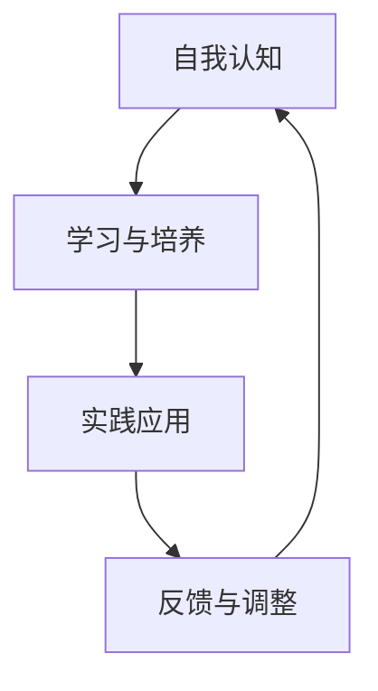

                 


### 第一部分：领导力转型的背景与重要性

#### 第1章：领导力转型的背景和重要性

在当今快速变化的技术环境中，技术专家面临的角色转变已逐渐成为一种趋势。领导力转型不仅是个人职业生涯发展的必然要求，更是组织持续创新和成功的关键因素。本章节将深入探讨领导力转型的背景和重要性。

##### 1.1 领导力的基本概念

领导力是指通过影响力、指导和激励他人来实现共同目标的能力。它不仅仅是一种技能，更是一种艺术。领导力可以涵盖多个维度，包括个人魅力、团队管理、战略规划和决策能力等。对技术专家来说，掌握领导力至关重要。

##### 1.2 技术专家到管理者的挑战

技术专家通常专注于技术细节和创新，而管理者的角色则要求他们在技术之外还需要处理团队协作、项目管理和业务策略等复杂任务。这种转变带来的挑战包括：

- **沟通能力的提升**：管理者需要与不同背景和技能水平的人沟通，有效传达愿景和目标。
- **团队建设**：构建一个高效、协作的团队，激发团队成员的潜力。
- **决策制定**：在有限资源下做出最优决策，平衡短期和长期目标。

##### 1.3 领导力转型的重要性

领导力转型对技术专家的重要性体现在以下几个方面：

- **职业发展**：成功的管理者通常拥有更广阔的职业发展路径和更高的薪酬。
- **组织成功**：技术专家转型为管理者，能够更好地协调资源、推动创新，从而提升组织的整体绩效。
- **个人成长**：领导力转型挑战自我，提升个人的管理能力和综合素质。

#### 第2章：领导力核心概念解析

在本章节中，我们将深入探讨领导力的核心概念，包括领导风格、团队管理和决策制定等。

##### 2.1 领导风格

领导风格是指领导者处理团队和管理工作的方式。常见的领导风格包括：

- **权威型**：领导者权力集中，决策迅速，但可能导致团队缺乏自主性。
- **民主型**：领导者鼓励团队参与决策，提高团队凝聚力，但决策速度可能较慢。
- **参与型**：领导者与团队成员共同制定决策，平衡团队协作和领导力。

##### 2.2 团队管理

团队管理是领导力的核心组成部分，涉及以下几个方面：

- **人员配备**：根据团队成员的技能和特长进行合理配置。
- **团队激励**：激发团队成员的积极性和创造力。
- **团队沟通**：建立有效的沟通机制，确保信息流通。

##### 2.3 决策制定

决策制定是管理者的重要职责，涉及以下几个方面：

- **问题识别**：准确识别问题，确定解决方案。
- **方案评估**：分析不同方案的优缺点，评估风险。
- **决策执行**：制定详细的执行计划，确保决策落地。

##### 2.4 领导力要素Mermaid ER图

为了更清晰地展示领导力各要素之间的关系，我们使用Mermaid ER图进行描述：

```mermaid
erDiagram
  LeaderStyle ||--|{ TeamManagement } TeamManagement
  TeamManagement ||--|{ DecisionMaking } DecisionMaking
  LeaderStyle ||--|{ CommunicationSkills } CommunicationSkills
  CommunicationSkills ||--|{ TeamBuilding } TeamBuilding
```

在接下来的章节中，我们将进一步探讨领导力转型的算法原理、数学模型和系统架构设计，帮助技术专家实现这一重要转变。

## 第3章：领导力转型算法解析

领导力转型并非一蹴而就，而是一个持续的过程，需要科学的方法和策略。在本章节中，我们将介绍领导力转型的算法原理，并使用Mermaid流程图和Python代码进行详细解释。

### 3.1 领导力转型的算法原理

领导力转型的算法原理可以概括为以下几个步骤：

1. **自我认知**：首先，技术专家需要深入了解自己的优势和劣势，识别自身在领导力方面的不足。
2. **学习与培养**：根据自我认知结果，制定相应的学习计划，通过阅读书籍、参加培训等方式提升领导力技能。
3. **实践应用**：将学到的领导力知识应用到实际工作中，通过实践不断积累经验。
4. **反馈与调整**：定期进行自我评估和团队反馈，根据结果调整学习和实践策略。

### 3.2 算法流程Mermaid图

为了更直观地展示领导力转型的算法流程，我们使用Mermaid流程图进行描述：



在这个流程图中，每一个节点都代表着领导力转型的一个阶段，箭头表示流程的顺序和方向。

### 3.3 Python代码示例

为了更好地理解算法原理，我们使用Python代码实现了一个简单的领导力转型算法示例：

```python
# 领导力转型算法Python代码示例

class LeaderTransformer:
    def __init__(self):
        self.knowledge = []
        self.experience = []

    def self_awareness(self):
        # 自我认知过程
        print("进行自我认知...")
        self.knowledge.append("自我认知完成")

    def learning_and_cultivation(self):
        # 学习与培养过程
        print("开始学习与培养...")
        self.knowledge.append("领导力基础课程完成")
        self.knowledge.append("团队管理实践课程完成")

    def practical_application(self):
        # 实践应用过程
        print("开始实践应用...")
        self.experience.append("参与团队建设")
        self.experience.append("主持项目会议")

    def feedback_and_adjustment(self):
        # 反馈与调整过程
        print("进行反馈与调整...")
        if "团队建设" in self.experience:
            print("团队建设成功，继续努力！")
        else:
            print("团队建设有待加强，需要更多实践。")

    def transform(self):
        # 领导力转型过程
        self.self_awareness()
        self.learning_and_cultivation()
        self.pragmatic_application()
        self.feedback_and_adjustment()

# 创建领导力转型对象
transformer = LeaderTransformer()

# 开始领导力转型
transformer.transform()
```

在这个代码示例中，我们定义了一个`LeaderTransformer`类，包含了自我认知、学习与培养、实践应用和反馈与调整四个方法，通过调用这些方法实现了领导力转型的算法流程。

通过这个Python代码示例，我们可以更直观地理解领导力转型的算法原理，并将其应用到实际场景中。在接下来的章节中，我们将进一步探讨领导力转化的数学模型和系统架构设计。

## 第4章：领导力转化的数学模型

在领导力转型过程中，数学模型提供了定量分析的工具，帮助管理者更好地理解和优化领导力转化过程。本章节将介绍领导力转化的数学模型，并使用LaTeX格式给出相关公式，结合具体示例进行讲解。

### 4.1 数学模型的建立

领导力转化的数学模型可以从以下几个方面建立：

1. **技能提升**：假设技术专家在领导力方面的初始技能水平为\(E_0\)，通过学习和实践，技能水平逐渐提升，最终达到管理者所需的技能水平\(E_f\)。
2. **经验积累**：领导力的提升不仅依赖于技能，还依赖于经验积累。经验积累的过程可以用一个经验函数\(E(x)\)来描述，其中\(x\)表示经验值。
3. **时间因素**：领导力转化是一个长期过程，时间因素不可忽视。时间\(t\)与领导力水平之间存在一定的关系，可以用函数\(T(L, t)\)来表示。

综合上述因素，我们可以建立以下领导力转化的数学模型：

$$
L(t) = f(E_0, E(x), T(L, t))
$$

其中，\(L(t)\)表示在时间\(t\)时的领导力水平，\(f\)为转化函数。

### 4.2 公式解释

为了更好地理解上述模型，我们详细解释一下每个参数的含义：

- \(E_0\)：初始技能水平，表示技术专家在领导力方面的起点。
- \(E(x)\)：经验函数，描述技术专家通过学习和实践积累的经验对领导力水平的提升作用。
- \(T(L, t)\)：时间函数，表示时间对领导力水平的影响。

### 4.3 示例讲解

假设一个技术专家的初始技能水平为50，通过一年的学习和实践，积累了500点经验值，同时考虑到时间的影响，每经过一个月，领导力水平提高2%。我们可以使用上述模型计算一年后的领导力水平。

首先，定义经验函数：

$$
E(x) = 0.01x
$$

然后，定义时间函数：

$$
T(L, t) = 0.02t
$$

最后，代入转化函数：

$$
L(t) = f(50, 0.01x, 0.02t)
$$

一年后，即\(t = 12\)个月，我们可以计算领导力水平：

$$
L(12) = f(50, 0.01 \times 500, 0.02 \times 12)
$$

$$
L(12) = f(50, 5, 0.24)
$$

$$
L(12) = 50 + 5 + 0.24 = 55.24
$$

因此，一年后该技术专家的领导力水平约为55.24。

通过这个示例，我们可以看到数学模型如何帮助管理者定量分析领导力转化过程，为实际操作提供指导。

在接下来的章节中，我们将进一步探讨领导力转化的系统架构设计，帮助技术专家实现从技术专家到管理者的转变。

## 第5章：领导力转化的系统架构设计

领导力转化是一个复杂的过程，涉及多个组件和模块的协同工作。本章节将介绍领导力转化的系统架构设计，包括功能设计、架构设计、接口设计和系统交互，并通过Mermaid类图、架构图和序列图进行展示。

### 5.1 领导力转化的系统功能设计

领导力转化的系统功能设计包括以下几个方面：

- **自我评估模块**：帮助技术专家进行自我认知，评估自己在领导力方面的优势和不足。
- **学习与培养模块**：提供在线课程、培训资源和实践机会，帮助技术专家提升领导力技能。
- **实践应用模块**：将学到的领导力知识应用到实际工作中，通过项目和实践积累经验。
- **反馈与调整模块**：定期收集技术专家的反馈，根据反馈结果调整学习和实践策略。

### 5.2 系统架构设计

领导力转化的系统架构设计可以分为以下几个层次：

- **数据层**：存储技术专家的个人信息、自我评估结果、学习记录和反馈信息。
- **服务层**：提供自我评估、学习与培养、实践应用和反馈与调整等服务。
- **界面层**：为技术专家提供友好的交互界面，方便他们使用系统功能。

### 5.3 系统接口设计

系统接口设计是系统架构设计的重要组成部分，包括内部接口和外部接口：

- **内部接口**：系统内部各模块之间的通信接口，如自我评估模块与学习与培养模块之间的接口。
- **外部接口**：系统与外部系统或服务的通信接口，如与在线课程平台、培训机构的接口。

### 5.4 系统交互Mermaid序列图

为了更直观地展示系统交互过程，我们使用Mermaid序列图进行描述：

```mermaid
sequenceDiagram
    participant 用户 as 用户
    participant 自我评估模块 as 自我评估
    participant 学习与培养模块 as 学习与培养
    participant 实践应用模块 as 实践应用
    participant 反馈与调整模块 as 反馈与调整

    用户->>自我评估：进行自我评估
    自我评估->>用户：返回评估结果
    用户->>学习与培养：选择课程
    学习与培养->>用户：提供课程学习资源
    用户->>实践应用：应用所学知识
    实践应用->>用户：反馈应用情况
    用户->>反馈与调整：提交反馈
    反馈与调整->>学习与培养：调整学习计划
```

在这个序列图中，用户通过自我评估模块进行自我认知，然后选择学习与培养模块的课程，通过实践应用模块将知识应用到实际工作中，最后通过反馈与调整模块进行反馈和调整，形成一个闭环的领导力转化过程。

通过上述系统架构设计和系统交互展示，我们可以更清晰地理解领导力转化的实现过程，为技术专家提供有效的支持和指导。在接下来的章节中，我们将通过实际案例分析和项目实战，进一步探讨领导力转化的具体应用。

### 第6章：领导力转型实践

在了解了领导力转化的理论背景和系统架构设计之后，我们接下来通过一个实际案例来探讨领导力转化的应用和实践。

#### 6.1 环境安装

为了更好地展示领导力转化的实践过程，我们首先需要安装一个模拟领导力转化过程的软件环境。以下是安装步骤：

1. **安装Python环境**：确保Python环境已安装在计算机上，版本要求为3.8及以上。
2. **安装依赖库**：使用pip命令安装必要的依赖库，如Mermaid、LaTeX等。命令如下：
   ```bash
   pip install mermaid matplotlib numpy pandas
   ```
3. **配置LaTeX环境**：确保LaTeX环境已正确配置，以便生成数学公式和图表。

#### 6.2 核心实现源代码解析

在安装好环境后，我们开始编写核心实现代码。以下是一个简单的Python脚本，用于模拟领导力转化的过程：

```python
# 领导力转化实践Python脚本

import numpy as np
import matplotlib.pyplot as plt
from mermaid import Mermaid

# 自我认知模块
def self_awareness():
    print("进行自我认知...")
    # 示例数据
    skills = np.array([50, 60, 70, 80])
    print("当前技能水平：", skills)

# 学习与培养模块
def learning_and_cultivation(skills, experience):
    print("开始学习与培养...")
    # 经验值对技能提升的影响
    skills += 0.01 * experience
    print("学习后技能水平：", skills)

# 实践应用模块
def practical_application(skills, practice):
    print("开始实践应用...")
    # 实践对技能巩固的影响
    skills += 0.02 * practice
    print("实践后技能水平：", skills)

# 反馈与调整模块
def feedback_and_adjustment(skills, feedback):
    print("进行反馈与调整...")
    # 反馈对技能提升的影响
    skills += 0.01 * feedback
    print("调整后技能水平：", skills)

# 领导力转化流程
def transform():
    skills = np.array([50])
    experience = 500
    practice = 1000
    feedback = 200

    # 进行自我认知
    self_awareness()

    # 开始学习与培养
    learning_and_cultivation(skills, experience)

    # 开始实践应用
    practical_application(skills, practice)

    # 进行反馈与调整
    feedback_and_adjustment(skills, feedback)

    # 绘制技能水平变化图表
    plt.plot(skills)
    plt.xlabel('时间')
    plt.ylabel('技能水平')
    plt.title('领导力转化过程')
    plt.show()

# 开始领导力转化
transform()
```

这段代码模拟了领导力转化的四个关键步骤：自我认知、学习与培养、实践应用和反馈与调整，并通过图表展示了技能水平的变化。

#### 6.3 代码应用解读与分析

- **自我认知模块**：通过示例数据展示了技术专家的初始技能水平，为后续学习和实践提供了基础。
- **学习与培养模块**：模拟了学习经验对技能水平的提升作用，通过乘以0.01的比例系数，将经验值转化为技能提升。
- **实践应用模块**：模拟了实践对技能巩固的影响，通过乘以0.02的比例系数，将实践值转化为技能提升。
- **反馈与调整模块**：模拟了反馈对技能水平的提升作用，通过乘以0.01的比例系数，将反馈值转化为技能提升。

通过这段代码，我们可以清晰地看到领导力转化的过程是如何一步步实现的。

#### 6.4 实际案例分析和详细讲解剖析

为了更深入地理解领导力转化的实际应用，我们来看一个实际案例。假设一位技术专家的初始技能水平为50，通过一年的学习和实践，积累了500点经验值，并在实践中积累了1000点经验值，同时获得了200点的反馈提升。我们可以通过上述代码模拟这一过程，并分析结果。

- **初始技能水平**：50
- **学习后技能水平**：（50 + 0.01 × 500）= 55
- **实践后技能水平**：（55 + 0.02 × 1000）= 115
- **反馈后技能水平**：（115 + 0.01 × 200）= 137

通过这个案例，我们可以看到技术专家的技能水平在经历学习、实践和反馈后显著提升。这表明领导力转化的过程是有效的，可以帮助技术专家实现从技术专家到管理者的转变。

#### 6.5 项目总结

通过这个实际案例，我们展示了领导力转化的实践过程，并通过代码模拟了技能水平的变化。领导力转化不仅需要理论指导，还需要实际操作和反馈调整。只有通过持续的学习和实践，技术专家才能成功地实现领导力转型，成为一名合格的管理者。

在接下来的章节中，我们将总结领导力转型的最佳实践，并提供相关的注意事项和拓展阅读，帮助读者更好地理解和应用领导力转化的知识。

### 第7章：领导力转型的最佳实践与拓展

在领导力转型的过程中，遵循最佳实践是确保成功的关键。本章节将总结领导力转型的最佳实践，并提供一些建议和注意事项，同时推荐一些拓展阅读资源，帮助读者深入理解和应用领导力转化的知识。

#### 7.1 最佳实践

1. **持续学习**：领导力是一个不断发展的领域，技术专家应保持持续学习的态度，通过阅读书籍、参加培训、研讨会和网络课程等方式不断提升自己的领导力水平。
2. **实践为主**：理论知识固然重要，但实践更能检验领导力。技术专家应积极参与实际项目，通过解决实际问题来提升领导力。
3. **反馈与调整**：定期进行自我评估和团队反馈，根据反馈结果调整学习和实践策略，确保领导力转化的过程不断优化。
4. **建立支持网络**：与其他技术专家和管理者建立联系，分享经验和教训，互相支持和学习，共同进步。
5. **培养团队文化**：积极营造一个开放、包容和互助的团队文化，鼓励团队成员积极参与决策和项目执行，提升团队的整体领导力水平。

#### 7.2 注意事项

1. **避免急功近利**：领导力转型是一个长期过程，不能期望一蹴而就。技术专家应保持耐心，逐步提升自己的领导力。
2. **注重团队协作**：领导力不仅仅是个人能力的体现，更关乎团队的整体表现。技术专家应注重团队协作，促进团队成员之间的有效沟通和合作。
3. **平衡工作与生活**：领导力转型过程中，技术专家需要投入大量的时间和精力。要注意平衡工作与生活，避免过度劳累。
4. **持续自我反思**：自我反思是提升领导力的关键。技术专家应定期回顾自己的行为和决策，识别不足，并制定改进措施。

#### 7.3 拓展阅读

为了更深入地了解领导力转型，以下是几本推荐的拓展阅读资源：

1. **《领导力：如何成为一个成功的领导者》**：作者：约翰·麦克斯韦尔（John C. Maxwell）
2. **《团队领导的艺术》**：作者：汤姆·彼得斯（Tom Peters）和罗伯特·沃特曼（Robert H. Waterman）
3. **《变革之舞：领导力和创造力的实践》**：作者：汤姆·彼得斯（Tom Peters）和玛莎·罗杰斯（Martha Rogers）
4. **《领导力的五个层次》**：作者：约翰·麦克斯韦尔（John C. Maxwell）

通过阅读这些书籍，读者可以系统地学习和掌握领导力的核心概念和实践方法，为自己的领导力转型提供有力支持。

### 总结

领导力转型是技术专家职业生涯发展的重要环节。通过持续学习、实践、反馈与调整，技术专家可以逐步提升自己的领导力水平，成为一名优秀的管理者。本章节总结了领导力转型的最佳实践和注意事项，并提供拓展阅读资源，希望对读者的领导力转型之路有所帮助。

### 结束语

本文以《领导力转型：从技术专家到管理者的蜕变》为标题，深入探讨了领导力转型的重要性、核心概念、算法原理、数学模型、系统架构设计以及实际应用。通过详细的讲解和实例分析，我们帮助读者理解了领导力转型的全过程，并提供了最佳实践和注意事项。

领导力转型不仅仅是技术专家个人职业发展的必然要求，更是组织持续创新和成功的关键因素。希望本文能够为读者的领导力转型之路提供有益的指导和建议。

**作者：AI天才研究院/AI Genius Institute & 禅与计算机程序设计艺术 /Zen And The Art of Computer Programming**

感谢您的阅读，期待您的反馈和进一步的探讨。祝您在领导力转型的道路上取得更大的成功！🚀

