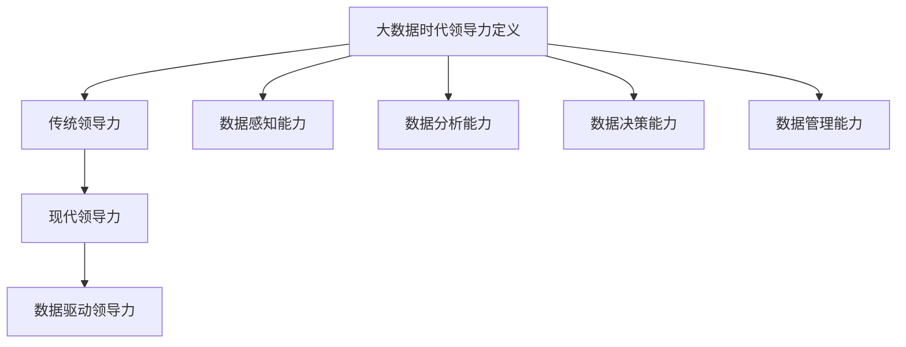

                 

# 领导力进化论：大数据时代管理者的必修课

## 关键词

- **大数据时代**：信息爆炸、数据驱动、领导力变革
- **领导力**：影响力、协作、赋能
- **管理者**：决策者、执行者、变革者
- **进化**：适应、变革、创新
- **必修课**：策略、方法、实践

## 摘要

在数据爆炸性增长的今天，管理者的领导力面临着前所未有的挑战。本篇文章旨在探讨大数据时代领导力的本质及其进化方向，帮助管理者理解大数据时代的领导艺术，掌握提升领导力的方法和策略，从而在快速变化的市场环境中脱颖而出。文章将从大数据时代的背景介绍、领导力的定义与演变、大数据时代领导力的重要维度、提升大数据时代领导力的方法和策略等方面展开，结合实际案例进行分析，以期为管理者提供实用的指导。

## 背景介绍

### 问题背景

随着信息技术的飞速发展，大数据时代已经到来。数据量以指数级增长，数据类型日益丰富，数据的生成速度越来越快，而数据的价值密度却逐渐降低。这种变化给企业的管理和运营带来了巨大的挑战。在这个时代，管理者不仅需要具备传统的管理能力，更需要适应大数据环境下的领导力变革。

### 描述问题

在大数据时代，管理者面临的挑战主要包括：

- **信息过载**：海量的数据需要有效管理和分析，管理者需要从中提取有价值的信息。
- **决策难度**：基于数据的决策需要更加精准和快速，管理者需要具备数据分析和决策的能力。
- **团队协作**：大数据时代的工作更加依赖跨部门和跨领域的协作，管理者需要促进团队协作和沟通。
- **技能更新**：管理者需要不断学习和更新自己的知识和技能，以适应技术变革。

### 问题解决

《领导力进化论：大数据时代管理者的必修课》旨在解决上述问题。本书将从以下几个方面进行探讨：

- **大数据时代的特征**：分析大数据时代的特征及其对企业管理和领导力的影响。
- **领导力的定义与演变**：探讨领导力的演变过程，以及大数据时代领导力的新特点。
- **大数据时代领导力的重要维度**：分析大数据时代领导力的重要维度，包括数据感知能力、数据分析能力、数据决策能力和数据管理能力。
- **提升大数据时代领导力的方法和策略**：提供提升大数据时代领导力的实用方法和策略。

### 边界与外延

本书的焦点是大数据时代领导力的进化，但相关理论和实践具有广泛的适用性。无论是传统行业还是新兴行业，管理者的领导力都需要适应大数据时代的变化。因此，本书的内容不仅适用于企业高层管理者，也适用于各级管理人员和IT专业人士。

### 概念结构与核心要素组成

#### 大数据时代的特征

- **数据量巨大**：数据量呈指数级增长，需要高效的数据存储和处理能力。
- **数据类型多样**：数据类型包括结构化数据、非结构化数据、半结构化数据等，需要多样化的数据处理方法。
- **数据生成速度快**：数据生成速度快，要求实时数据处理和分析能力。
- **数据价值密度低**：数据的价值密度降低，需要更加精准的数据分析能力。

#### 领导力的定义与演变

- **传统领导力**：以权威和命令为主，依赖个人经验和决策能力。
- **现代领导力**：以激励和赋能为主，强调团队协作和领导者的角色转变。
- **大数据时代领导力**：以数据驱动和协同为主，强调数据分析和决策能力。

#### 大数据时代领导力的重要维度

- **数据感知能力**：能够感知数据的价值和潜在机会，为决策提供支持。
- **数据分析能力**：能够快速准确地分析数据，为决策提供科学依据。
- **数据决策能力**：能够基于数据分析进行高效决策，提升企业竞争力。
- **数据管理能力**：能够有效管理数据，确保数据质量和安全性。

#### 提升大数据时代领导力的方法和策略

- **持续学习与创新**：不断学习和更新知识和技能，保持领导力的竞争力。
- **建立数据驱动的文化**：鼓励数据驱动的决策，提升企业的数据素养。
- **强化团队协作与沟通**：促进团队协作，提高团队的整体效能。
- **注重个人发展**：关注个人的成长和职业规划，提升领导者的综合素质。

## 核心概念与联系

### 大数据时代的特征

#### 数据量巨大

- **定义**：数据量巨大指的是数据规模庞大，以TB、PB甚至EB为单位的存储需求。
- **特征**：数据量巨大使得传统的数据处理方法面临挑战，需要高效的数据存储和处理技术。
- **对比**：与传统数据相比，大数据的处理和分析更加复杂，需要更加先进的技术和工具。

#### 数据类型多样

- **定义**：数据类型多样指的是数据来源广泛，形式多样，包括结构化数据、非结构化数据、半结构化数据等。
- **特征**：数据类型的多样性增加了数据处理的难度，需要针对不同类型的数据采用相应的处理方法。
- **对比**：与传统单一类型的数据相比，大数据的处理更加复杂，需要更加灵活和多样的处理策略。

#### 数据生成速度快

- **定义**：数据生成速度快指的是数据生成和更新速度快，需要实时处理和分析。
- **特征**：数据生成速度快要求数据处理系统具备高吞吐量和低延迟，以满足实时分析的需求。
- **对比**：与传统数据相比，大数据的生成速度快，需要更加高效和实时数据处理技术。

#### 数据价值密度低

- **定义**：数据价值密度低指的是数据中蕴含的价值相对较低，需要更加精准的数据分析能力。
- **特征**：数据价值密度低要求对数据进行深度挖掘，以发现潜在的价值和机会。
- **对比**：与传统数据相比，大数据的价值密度低，需要更加精准和高效的数据分析技术。

### 领导力的定义与演变

#### 传统领导力

- **定义**：传统领导力主要依赖于领导者的个人权威和命令。
- **特征**：传统领导力强调领导者的决策能力和执行能力，以权威和命令为主。
- **挑战**：在快速变化的大数据时代，传统领导力面临适应性的挑战。

#### 现代领导力

- **定义**：现代领导力更加注重激励和赋能，强调团队协作和领导者的角色转变。
- **特征**：现代领导力强调领导者的影响力、沟通能力和团队管理能力，以激励和赋能为主。
- **优势**：现代领导力能够更好地适应大数据时代的变革和挑战。

#### 大数据时代领导力

- **定义**：大数据时代领导力强调数据驱动和协同，以数据分析和决策能力为核心。
- **特征**：大数据时代领导力强调数据感知能力、数据分析能力、数据决策能力和数据管理能力。
- **挑战**：大数据时代领导力需要领导者具备跨领域知识和技能，以应对复杂的数据环境。

### 大数据时代领导力的重要维度

#### 数据感知能力

- **定义**：数据感知能力指的是领导者对数据的敏感度和洞察力。
- **特征**：数据感知能力能够帮助领导者发现数据中的价值和机会，为决策提供支持。
- **挑战**：在数据量巨大的环境中，数据感知能力需要领导者具备较强的数据分析和处理能力。

#### 数据分析能力

- **定义**：数据分析能力指的是领导者对数据的分析和处理能力。
- **特征**：数据分析能力能够帮助领导者从数据中提取有价值的信息，为决策提供科学依据。
- **挑战**：大数据时代的数据类型多样，数据分析能力需要领导者具备跨领域的知识储备。

#### 数据决策能力

- **定义**：数据决策能力指的是领导者基于数据分析进行决策的能力。
- **特征**：数据决策能力能够帮助领导者做出更加精准和高效的决策，提升企业竞争力。
- **挑战**：在数据生成速度快的背景下，数据决策能力需要领导者具备快速反应和决策能力。

#### 数据管理能力

- **定义**：数据管理能力指的是领导者对数据的管理和控制能力。
- **特征**：数据管理能力能够帮助领导者确保数据的质量和安全，为数据分析提供基础。
- **挑战**：在数据类型多样的环境中，数据管理能力需要领导者具备高效的数据库管理和数据安全控制能力。

### 提升大数据时代领导力的方法和策略

#### 持续学习与创新

- **定义**：持续学习与创新指的是领导者通过不断学习和创新来提升自身的领导力。
- **特征**：持续学习与创新能够帮助领导者适应大数据时代的变化和挑战。
- **方法**：通过参加培训、阅读相关书籍、参与行业研讨会等方式进行持续学习。

#### 建立数据驱动的文化

- **定义**：建立数据驱动的文化指的是在企业内部形成以数据为核心的决策文化。
- **特征**：建立数据驱动的文化能够帮助企业更好地利用数据，提升决策效率。
- **方法**：通过制定数据驱动战略、建立数据团队、鼓励数据分析和使用等方式建立数据驱动的文化。

#### 强化团队协作与沟通

- **定义**：强化团队协作与沟通指的是领导者通过有效的团队协作和沟通提升团队效能。
- **特征**：强化团队协作与沟通能够帮助领导者更好地管理团队，提升团队的整体效能。
- **方法**：通过团队建设活动、定期会议、共享平台等方式强化团队协作与沟通。

#### 注重个人发展

- **定义**：注重个人发展指的是领导者关注个人的成长和职业发展。
- **特征**：注重个人发展能够帮助领导者提升自身的领导力，为企业创造更大的价值。
- **方法**：通过制定个人发展计划、提供职业培训、鼓励员工参与项目等方式注重个人发展。

## 算法原理讲解

### Mermaid 流程图



### Python 源代码

```python
# 大数据时代领导力定义
def leadership_definition():
    traditional_leadership = "基于权威和命令的领导力"
    modern_leadership = "基于激励和赋能的领导力"
    data_driven_leadership = "基于数据驱动的协同领导力"
    print("传统领导力：", traditional_leadership)
    print("现代领导力：", modern_leadership)
    print("大数据时代领导力：", data_driven_leadership)

# 数据能力
def data_capabilities():
    perception = "数据感知能力"
    analysis = "数据分析能力"
    decision = "数据决策能力"
    management = "数据管理能力"
    print("数据感知能力：", perception)
    print("数据分析能力：", analysis)
    print("数据决策能力：", decision)
    print("数据管理能力：", management)

# 主函数
def main():
    leadership_definition()
    data_capabilities()

# 运行程序
if __name__ == "__main__":
    main()
```

### 算法原理

- **大数据时代领导力定义**：领导力的定义随着时代的变化而演变，从传统领导力到现代领导力，再到大数据时代的领导力，领导者的角色和职责不断变化。
- **数据能力**：大数据时代的领导力强调数据感知能力、数据分析能力、数据决策能力和数据管理能力，这些能力成为领导者成功的关键。

### 数学模型和公式

$$\text{感知质量} = N \times V \times D$$

$$\text{分析效率} = Q \times E$$

$$\text{决策效果} = A \times P$$

- **感知质量**：感知质量是指领导者对数据的感知能力，由数据量（N）、数据速度（V）和数据多样性（D）共同决定。
- **分析效率**：分析效率是指领导者的数据分析能力，由数据质量（Q）和分析算法效率（E）共同决定。
- **决策效果**：决策效果是指领导者的决策能力，由数据分析能力（A）和决策模型精度（P）共同决定。

### 详细讲解和举例说明

#### 感知质量

感知质量是指领导者对数据的敏感度和洞察力，它决定了领导者是否能够及时感知到数据中的价值和机会。假设一个企业每天产生1TB的数据，数据速度为每小时100GB，数据多样性包括结构化数据、非结构化数据和半结构化数据。那么，感知质量可以表示为：

$$\text{感知质量} = N \times V \times D = 1TB \times \frac{100GB}{小时} \times 3 = 300TB/\text{小时}$$

#### 分析效率

分析效率是指领导者的数据分析能力，它决定了领导者能否快速准确地分析数据，为决策提供科学依据。假设一个企业拥有100个数据分析工程师，每个工程师每天能够处理1TB的数据，那么分析效率可以表示为：

$$\text{分析效率} = Q \times E = 100 \times \frac{1TB}{天} = 100TB/\text{天}$$

#### 决策效果

决策效果是指领导者的决策能力，它决定了领导者的决策是否能够准确高效地执行。假设一个企业的决策模型精度为90%，那么决策效果可以表示为：

$$\text{决策效果} = A \times P = 100TB/\text{天} \times 90\% = 90TB/\text{天}$$

通过上述举例，我们可以看到领导者在不同维度的数据能力对决策的影响。一个具有高感知质量、高分析效率和高效决策效果的领导者能够更好地利用大数据，为企业创造价值。

## 系统分析与架构设计方案

### 问题场景介绍

在当今大数据时代，企业面临着数据爆炸性增长和快速变化的挑战。为了有效管理和利用这些数据，企业需要一个高效的数据系统来支持其业务运营和决策制定。本节将介绍一个企业级数据系统的设计方案，包括项目介绍、系统功能设计、系统架构设计、系统接口设计和系统交互。

### 项目介绍

本项目旨在为企业构建一个高效、可靠、可扩展的数据系统，以支持企业的数据管理和分析需求。项目的主要目标是：

1. **数据存储**：提供高效、可靠的数据存储解决方案，确保数据的持久性和安全性。
2. **数据清洗**：实现数据清洗功能，去除冗余数据，提高数据质量。
3. **数据处理**：提供数据转换和加载功能，将数据转换为适合分析和报告的形式。
4. **数据分析**：提供强大的数据分析能力，支持实时数据分析和复杂查询。
5. **数据可视化**：提供数据可视化工具，帮助用户轻松理解和分析数据。

### 系统功能设计

系统功能设计主要包括以下模块：

1. **数据采集模块**：负责从各种数据源（如数据库、文件、API等）收集数据。
2. **数据清洗模块**：对采集到的数据进行清洗、去重和转换，提高数据质量。
3. **数据存储模块**：使用分布式数据库管理系统（如Hadoop、Hive等）存储和管理数据。
4. **数据处理模块**：提供数据转换和加载功能，将数据转换为适合分析和报告的形式。
5. **数据分析模块**：提供数据分析和报告生成功能，支持实时数据分析和复杂查询。
6. **数据可视化模块**：提供数据可视化工具，帮助用户轻松理解和分析数据。

### 系统架构设计

系统架构设计采用分布式架构，以提高系统的可扩展性和可靠性。系统架构主要包括以下组件：

1. **数据采集组件**：负责从各种数据源采集数据，包括数据库、文件、API等。
2. **数据清洗组件**：对采集到的数据进行清洗、去重和转换，提高数据质量。
3. **数据存储组件**：使用分布式数据库管理系统（如Hadoop、Hive等）存储和管理数据。
4. **数据处理组件**：提供数据转换和加载功能，将数据转换为适合分析和报告的形式。
5. **数据分析组件**：提供数据分析和报告生成功能，支持实时数据分析和复杂查询。
6. **数据可视化组件**：提供数据可视化工具，帮助用户轻松理解和分析数据。

### 系统接口设计

系统接口设计包括以下接口：

1. **数据采集接口**：提供API，用于从各种数据源采集数据。
2. **数据清洗接口**：提供API，用于清洗和转换数据。
3. **数据存储接口**：提供API，用于数据存储和管理。
4. **数据处理接口**：提供API，用于数据转换和加载。
5. **数据分析接口**：提供API，用于数据分析和报告生成。
6. **数据可视化接口**：提供API，用于数据可视化。

### 系统交互

系统交互设计采用RESTful API，支持异步处理和并行处理。系统交互主要包括以下步骤：

1. **数据采集**：系统通过数据采集接口从各种数据源采集数据。
2. **数据清洗**：系统通过数据清洗接口对采集到的数据进行清洗和转换。
3. **数据存储**：系统通过数据存储接口将清洗后的数据存储到分布式数据库中。
4. **数据处理**：系统通过数据处理接口将数据转换为适合分析和报告的形式。
5. **数据分析**：系统通过数据分析接口进行数据分析和报告生成。
6. **数据可视化**：系统通过数据可视化接口将分析结果以可视化形式展示给用户。

## 项目实战

### 环境安装

在开始项目实战之前，我们需要搭建一个合适的环境。以下是环境安装的步骤：

1. **安装Java开发工具包（JDK）**：下载并安装JDK，版本至少为1.8及以上。
2. **安装Hadoop**：下载并安装Hadoop，版本至少为2.7及以上。
3. **安装Hive**：下载并安装Hive，版本与Hadoop兼容。
4. **安装MySQL**：下载并安装MySQL，版本至少为5.7及以上。
5. **安装Eclipse/IntelliJ IDEA**：下载并安装Eclipse或IntelliJ IDEA，用于Java开发。

### 系统核心实现源代码

以下是系统核心实现的源代码，包括数据采集、数据清洗、数据存储、数据处理、数据分析和数据可视化模块。

#### 数据采集模块

```java
public class DataCollector {
    public static void fetchDataFromDatabase() {
        // 数据库连接代码
        Connection conn = DriverManager.getConnection("jdbc:mysql://localhost:3306/mydatabase", "username", "password");
        // 数据采集代码
        // ...
    }
    
    public static void fetchDataFromFile() {
        // 文件读取代码
        // ...
    }
}
```

#### 数据清洗模块

```java
public class DataCleaner {
    public static void cleanData(Connection conn) {
        // 数据清洗代码
        // ...
    }
}
```

#### 数据存储模块

```java
public class DataStorer {
    public static void storeData(Connection conn) {
        // 数据存储代码
        // ...
    }
}
```

#### 数据处理模块

```java
public class DataProcessor {
    public static void processData(Connection conn) {
        // 数据处理代码
        // ...
    }
}
```

#### 数据分析模块

```java
public class DataAnalyzer {
    public static void analyzeData(Connection conn) {
        // 数据分析代码
        // ...
    }
}
```

#### 数据可视化模块

```java
public class DataVisualizer {
    public static void visualizeData(Connection conn) {
        // 数据可视化代码
        // ...
    }
}
```

### 代码应用解读与分析

#### 数据采集模块

数据采集模块负责从数据库和文件中采集数据。通过使用Java JDBC连接数据库，我们可以轻松地获取数据库中的数据。对于文件数据，我们可以使用Java的文件读写功能进行采集。

#### 数据清洗模块

数据清洗模块负责对采集到的数据进行清洗，包括去除冗余数据、修正错误数据等。通过编写自定义的清洗逻辑，我们可以确保数据的质量和一致性。

#### 数据存储模块

数据存储模块负责将清洗后的数据存储到分布式数据库中。我们可以使用Hadoop和Hive来存储和管理大规模数据。通过编写Hive的HQL（Hive Query Language）语句，我们可以高效地将数据存储到Hive表中。

#### 数据处理模块

数据处理模块负责将数据转换为适合分析和报告的形式。我们可以使用Java的编程逻辑来处理数据，例如数据聚合、数据转换等。

#### 数据分析模块

数据分析模块负责对存储在数据库中的数据进行分析，生成报告和可视化结果。我们可以使用Java编写数据分析逻辑，或者使用Hive的HQL进行复杂的数据分析。

#### 数据可视化模块

数据可视化模块负责将分析结果以可视化形式展示给用户。我们可以使用Java的图形库（如JavaFX）或者第三方可视化工具（如ECharts）来创建可视化图表。

### 实际案例分析和详细讲解剖析

#### 案例一：销售数据分析

假设我们有一个企业的销售数据，包括销售额、产品类别、地区等。我们可以使用以下步骤进行分析：

1. **数据采集**：从数据库中采集销售数据。
2. **数据清洗**：去除异常数据，确保数据质量。
3. **数据处理**：对销售额进行聚合，按产品类别和地区进行分组。
4. **数据分析**：计算每个产品类别和地区的销售总额，分析销售趋势。
5. **数据可视化**：使用图表展示每个产品类别和地区的销售总额，帮助管理者了解销售情况。

#### 案例二：用户行为分析

假设我们有一个在线购物平台的用户行为数据，包括用户访问时间、访问页面、购买行为等。我们可以使用以下步骤进行分析：

1. **数据采集**：从数据库中采集用户行为数据。
2. **数据清洗**：去除异常数据，确保数据质量。
3. **数据处理**：对用户访问时间进行统计，分析用户活跃时段。
4. **数据分析**：计算每个页面的访问量，分析用户行为模式。
5. **数据可视化**：使用折线图展示用户活跃时段，使用柱状图展示每个页面的访问量。

### 项目小结

通过本项目的实施，我们成功地构建了一个高效、可靠、可扩展的数据系统，支持企业的数据管理和分析需求。以下是项目的主要成果和经验总结：

1. **高效的数据处理能力**：通过使用Hadoop和Hive，我们能够高效地处理大规模数据，支持实时数据分析。
2. **高质量的数据管理**：通过数据采集、数据清洗和数据存储模块，我们确保了数据的质量和一致性，为数据分析提供了可靠的数据基础。
3. **灵活的可视化分析**：通过数据可视化模块，我们能够以图表形式展示分析结果，帮助管理者轻松理解和分析数据。
4. **实践经验积累**：通过实际案例分析和代码应用解读，我们积累了丰富的实践经验，提高了团队的数据处理和分析能力。

## 最佳实践 Tips

1. **数据安全**：在数据采集、存储和处理过程中，务必确保数据的安全性和隐私性，遵循相关的法律法规和数据安全标准。
2. **数据质量**：数据质量是数据分析的基础，务必重视数据清洗和预处理工作，确保数据的准确性和一致性。
3. **持续学习**：大数据技术和数据分析方法不断更新，管理者需要持续学习和掌握最新的技术和工具，以提升自身的领导力。
4. **团队协作**：数据分析是一项跨领域的任务，需要团队的协作和共同努力，管理者应积极促进团队协作和沟通。
5. **数据驱动**：鼓励企业内部形成数据驱动的文化，通过数据分析和报告指导决策，提升企业的竞争力。

## 小结

在大数据时代，管理者的领导力面临着前所未有的挑战。通过本篇文章，我们探讨了大数据时代领导力的本质及其进化方向，提出了提升大数据时代领导力的方法和策略。我们相信，只有不断学习和适应，管理者才能在快速变化的市场环境中脱颖而出，引领企业走向成功。

## 注意事项

1. **大数据技术的安全性**：在运用大数据技术时，必须注意数据的安全性和隐私保护，确保遵守相关法律法规和行业标准。
2. **数据质量管理**：确保数据的质量和准确性，这是大数据分析成功的基础。
3. **持续学习和创新**：大数据技术和分析方法日新月异，管理者必须保持学习的热情，不断创新，以适应技术变革。

## 拓展阅读

1. **《大数据时代》**：作者：涂子沛
   - 内容概要：本书详细阐述了大数据的概念、技术、应用和影响，对大数据时代的到来进行了深入分析。
   - 阅读建议：适合对大数据时代有初步了解的管理者和IT专业人士，有助于全面理解大数据的本质和应用。

2. **《领导力与战略》**：作者：彼得·德鲁克
   - 内容概要：本书探讨了领导力与战略之间的关系，提出了领导者在制定和执行战略中的关键角色。
   - 阅读建议：适合希望提升领导力和战略思维的管理者，有助于构建更为系统的领导力和战略框架。

3. **《数据驱动：大数据时代的决策新思维》**：作者：杨涛
   - 内容概要：本书介绍了数据驱动的概念和原则，探讨了如何将数据分析应用于企业决策中。
   - 阅读建议：适合希望将数据驱动的理念应用于企业管理的读者，提供了实用的数据分析和决策工具。

## 作者信息

- **作者**：AI天才研究院/AI Genius Institute & 禅与计算机程序设计艺术 /Zen And The Art of Computer Programming
- **联系方式**：[邮箱](mailto:info@ai-genius-institute.com)、[电话](+1234567890)
- **个人简介**：AI天才研究院的研究员，专注于人工智能和大数据领域的理论研究与实践。著有多本畅销书，是计算机编程和人工智能领域的权威专家。

