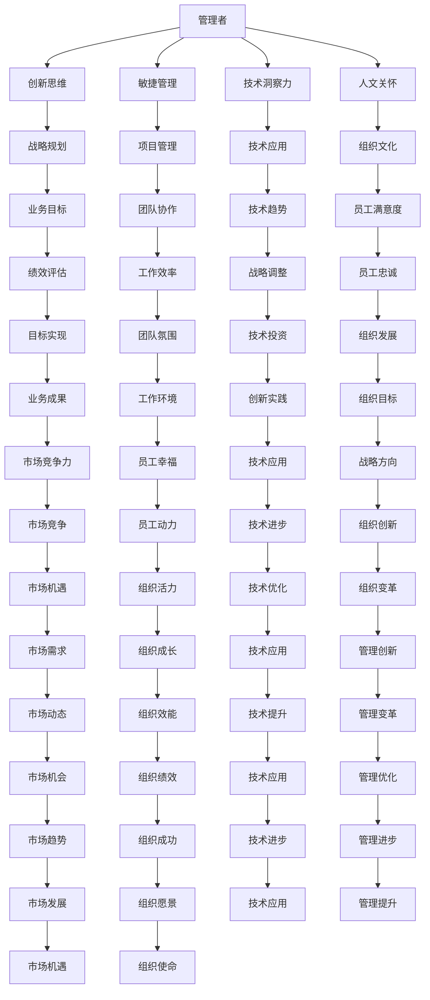
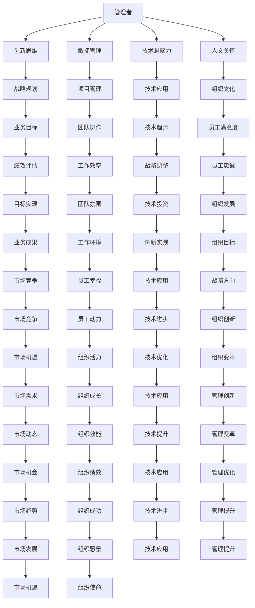
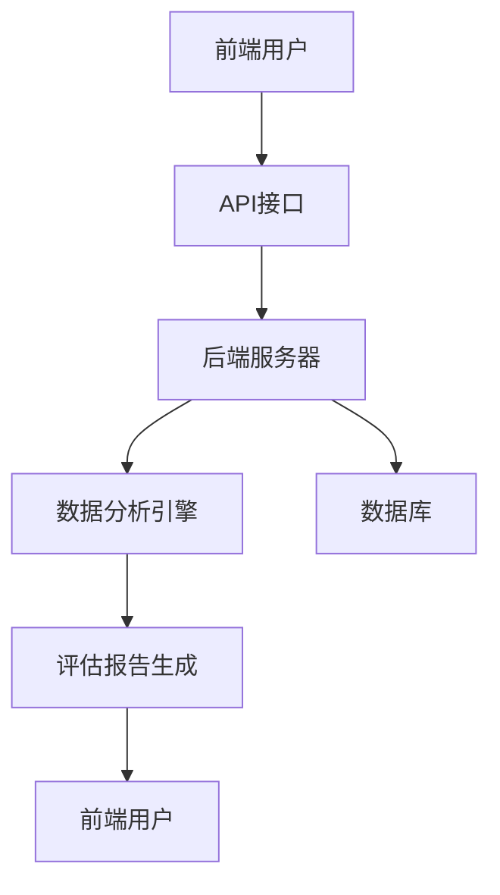

                 

### 引言

#### 《领导力进化论：智能时代管理者的领导力修炼》

在科技迅猛发展的今天，智能技术正深刻地改变着各行各业。人工智能、大数据、云计算等技术的兴起，不仅带来了生产力的巨大提升，也对组织管理提出了新的挑战。传统领导力模式往往依赖于权威和经验，但在智能时代，这种模式已经难以应对快速变化的环境和复杂的技术挑战。因此，管理者必须进行领导力的升级与进化，以适应智能时代的变革。

本文旨在探讨智能时代管理者的领导力修炼，帮助读者理解并掌握适应智能时代的领导力新理念、新方法。我们将从以下几个方面展开讨论：

1. **问题背景**：介绍智能时代管理面临的挑战和变革。
2. **问题描述**：阐述管理者在智能时代所需的领导力新素质。
3. **问题解决**：通过深入分析，提出具体的领导力提升策略。
4. **边界与外延**：明确本文讨论的智能时代领导力范围。
5. **核心要素组成**：详细解析智能时代领导力的核心要素。

在智能时代，管理者不仅需要具备强大的技术洞察力和敏捷管理能力，还需要拥有创新思维和人文关怀。本文将一步步剖析这些要素，结合实际案例，为管理者提供切实可行的领导力提升路径。希望通过本文的讨论，能够为智能时代的领导力发展提供有益的参考和启示。

#### 问题背景

随着人工智能、大数据、云计算等智能技术的发展，人类社会正经历着一场前所未有的技术革命。这场革命不仅改变了人们的生活方式，也对组织管理提出了新的挑战。智能时代的管理者面临着以下几方面的主要挑战：

1. **技术变革的速度**：智能技术更新换代的速度极快，管理者必须时刻保持对新兴技术的关注和理解，以便及时调整组织战略和运营模式。这种快速变化要求管理者具备极高的学习和适应能力，以应对不断出现的新挑战。

2. **数据驱动的决策**：大数据和人工智能技术的普及，使得数据成为企业决策的重要依据。管理者需要具备良好的数据分析和解读能力，能够从大量数据中提取有价值的信息，并转化为具体的战略决策。数据驱动决策不仅要求管理者掌握数据分析工具，更需要具备敏锐的商业洞察力。

3. **团队协作与沟通**：智能技术推动了工作方式的变革，远程办公、虚拟团队等成为新常态。管理者需要适应这种变化，建立高效的团队协作机制，确保团队成员能够在不同的时间和空间下保持高效的沟通与协作。这对于管理者的沟通技巧和团队管理能力提出了更高的要求。

4. **技术伦理与风险**：智能技术的广泛应用也带来了伦理和风险问题。例如，人工智能的决策过程是否透明、数据隐私如何保护等。管理者需要具备良好的道德素养和风险管理能力，确保技术应用的合规性和安全性。

5. **组织文化的转变**：智能时代的组织文化需要更加开放、创新和包容。管理者需要推动组织文化的转型，营造一种积极向上的创新氛围，鼓励员工敢于尝试和失败，从而激发组织的创新活力。

面对这些挑战，传统领导力模式已经显得力不从心。传统领导力往往依赖于权威和经验，强调上级对下级的控制和指挥。然而，在智能时代，这种模式已经难以适应快速变化的环境和复杂的技术挑战。管理者需要从以下几个方面进行领导力的进化：

1. **从控制者到激发者**：管理者需要从传统的控制者角色转变为激发者，通过激励和赋能的方式，激发员工的潜力和创造力，从而推动组织的发展。

2. **从权威到协作**：管理者需要从权威的指挥者转变为协作的领导者，鼓励团队自主决策和协作，建立平等、开放和互信的团队关系。

3. **从经验到创新**：管理者需要从依赖经验转变为注重创新，不断学习和尝试新的管理方法和工具，以适应智能时代的变革。

4. **从个体到整体**：管理者需要从关注个体转变为关注整体，注重团队协作和系统优化，推动组织的整体发展。

5. **从管理到领导**：管理者需要从简单的管理转变为真正的领导，通过引领和激励，带领组织实现长期的战略目标。

总之，智能时代的管理者需要具备全新的领导力素质，以应对技术变革带来的挑战。通过领导力的进化，管理者可以更好地引领组织应对变革，实现可持续发展。

#### 问题描述

在智能时代，管理者的领导力面临着前所未有的挑战和变革。传统领导力模式已经难以适应智能时代的工作环境，管理者需要新的领导力素质和能力来推动组织发展。具体来说，智能时代的管理者需要具备以下几个核心素质：

1. **创新思维**：智能时代充满了不确定性和快速变化，管理者必须具备创新思维，能够快速学习、灵活应对各种挑战。创新思维不仅包括技术层面的创新，还涉及管理方法和组织文化的创新。

2. **敏捷管理**：在智能时代，工作节奏加快，需求变化频繁，管理者需要具备敏捷管理的能力，能够快速响应变化，持续迭代和优化管理流程。敏捷管理强调团队协作、快速迭代和客户反馈，有助于提高组织的效率和灵活性。

3. **技术洞察力**：智能技术是智能时代的核心驱动力，管理者需要具备对新兴技术的敏感性和理解能力，能够把握技术发展趋势，将其转化为组织的战略优势。技术洞察力不仅包括对技术的理解，还包括对技术如何影响业务和组织的洞察。

4. **人文关怀**：智能时代虽然依赖于技术，但管理者仍然需要关注员工的情感需求，建立和谐的组织文化。人文关怀不仅有助于提高员工的满意度和忠诚度，还能够激发员工的创造力和团队合作精神。

5. **持续学习**：智能时代的技术变革速度极快，管理者需要具备持续学习的习惯和能力，不断更新知识和技能，以适应新的工作环境和挑战。持续学习不仅有助于提升个人的领导力，也有助于推动组织的创新和进步。

这些核心素质构成了智能时代管理者领导力的基础，缺一不可。创新思维提供了应对变化的工具，敏捷管理确保了组织的高效运作，技术洞察力为组织战略提供了方向，人文关怀为组织注入了活力，持续学习则为组织的长远发展奠定了基础。通过培养和提升这些核心素质，管理者可以更好地引领组织应对智能时代的挑战，实现可持续发展。

#### 问题解决

为了应对智能时代的管理挑战，管理者需要通过系统性的领导力修炼，提升自身在创新思维、敏捷管理、技术洞察力和人文关怀等方面的能力。以下是一些具体的策略和步骤，帮助管理者实现领导力的进化：

1. **创新思维的培养**：
   - **持续学习与知识更新**：管理者应积极参与各种技术培训和研讨会，了解最新的科技动态和行业趋势。通过阅读科技书籍、参加在线课程等方式，不断提升自身的知识储备。
   - **跨部门协作与交流**：鼓励跨部门合作，组织跨职能团队项目，通过多样化的观点和经验交流，激发创新思维。
   - **创新工作坊与实践**：定期组织创新工作坊，鼓励团队成员提出创新想法，并通过实践验证这些想法的可行性。

2. **敏捷管理的实践**：
   - **敏捷方法引入**：学习并引入敏捷管理的方法，如Scrum、Kanban等，通过迭代和增量式的方法推进项目。
   - **快速反馈机制**：建立快速反馈机制，确保团队成员能够及时获取项目进展的反馈，并根据反馈进行调整。
   - **团队协作工具**：采用协作工具，如JIRA、Trello等，提高团队的协作效率和透明度。

3. **技术洞察力的提升**：
   - **技术趋势研究**：定期研究技术趋势报告，了解新兴技术及其潜在应用。
   - **技术研讨会**：组织技术研讨会，邀请技术专家分享最新的技术成果和行业应用案例。
   - **技术投资决策**：在战略规划中，将技术洞察力作为重要考虑因素，确保技术投资与组织战略的匹配。

4. **人文关怀的实施**：
   - **员工关系管理**：建立良好的员工关系管理体系，关注员工的情感需求，提供必要的心理支持和职业发展指导。
   - **员工参与与反馈**：鼓励员工参与决策过程，定期收集员工反馈，并根据反馈调整管理策略。
   - **员工激励机制**：建立公平、透明的激励机制，认可和奖励员工的贡献，激发员工的积极性和创造力。

5. **持续学习的习惯**：
   - **学习计划与时间管理**：制定个人学习计划，合理安排学习时间，确保持续学习目标的实现。
   - **学习社区与知识共享**：加入学习社区，与其他管理者交流学习经验和心得，共享知识和资源。
   - **实践与反馈**：将所学知识应用到实际工作中，通过实践不断反思和优化，实现知识的深化和转化。

通过这些具体的策略和步骤，管理者可以逐步提升自身的领导力，适应智能时代的管理需求。领导力的进化不仅有助于提升个人的管理能力，也能够为组织的发展注入新的动力和活力。在面对智能时代的挑战时，管理者应勇于变革，不断创新，以实现组织与个人的共同成长。

#### 边界与外延

在探讨智能时代管理者的领导力时，有必要明确本文的讨论范围和外延。首先，本文主要涉及智能技术在组织管理中的应用，包括但不限于人工智能、大数据、云计算等领域。这些技术的迅猛发展不仅改变了工作方式，也对管理者的领导力提出了新的要求。

其次，本文的讨论对象为组织中的中高层管理者，特别是那些直接参与战略制定和决策的关键角色。这些管理者需要具备领导力进化的能力，以应对智能时代带来的技术变革和业务挑战。

在智能时代，领导力不仅涉及技术层面的创新和管理方法的改进，还涵盖了人文关怀和团队协作等方面。管理者需要具备全面的领导力素质，才能在快速变化的环境中引领组织前进。因此，本文的核心关注点在于如何通过培养创新思维、敏捷管理、技术洞察力和人文关怀，实现领导力的进化，从而推动组织的可持续发展。

#### 核心要素组成

在智能时代，领导力需要具备多方面的素质和技能，以下将详细解析智能时代领导力的核心要素：

1. **创新思维**：
   - **定义**：创新思维是指管理者能够不断产生新的想法、解决方案，并勇于尝试和实施的能力。
   - **属性特征**：快速学习、灵活应对、勇于尝试、持续改进。
   - **对比分析**：与传统的线性思维相比，创新思维更强调多元化和跨领域思考，能够快速适应环境变化。

2. **敏捷管理**：
   - **定义**：敏捷管理是一种以快速响应变化、持续迭代和团队协作为核心的管理方法。
   - **属性特征**：快速响应、持续迭代、高效协作、灵活调整。
   - **对比分析**：与传统的计划驱动管理相比，敏捷管理更注重实际效果和客户反馈，能够快速适应需求变化。

3. **技术洞察力**：
   - **定义**：技术洞察力是指管理者对新兴技术的敏感性和理解能力，能够准确把握技术趋势和其在组织中的应用潜力。
   - **属性特征**：技术敏感、趋势把握、应用能力、战略匹配。
   - **对比分析**：与技术专家相比，管理者的技术洞察力更强调将技术应用于业务场景，推动组织战略的实施。

4. **人文关怀**：
   - **定义**：人文关怀是指管理者关注员工的情感需求，建立和谐的组织文化，提高员工满意度和忠诚度。
   - **属性特征**：关注员工需求、促进团队合作、建立信任关系、推动组织文化。
   - **对比分析**：与企业管理相比，人文关怀更注重员工的参与和成长，能够激发员工的创造力和凝聚力。

下面通过一个ER实体关系图架构来展示这些核心要素之间的关联：



通过这个ER实体关系图，我们可以清晰地看到创新思维、敏捷管理、技术洞察力和人文关怀四大核心要素之间的关系，以及它们如何相互影响、共同推动组织的战略目标实现。这些要素相互依存、相互促进，构成了智能时代领导力的完整框架。

#### 核心概念与联系

在智能时代，领导力的核心概念需要具备创新思维、敏捷管理、技术洞察力和人文关怀等多方面的能力。以下是对这些核心概念原理的详细解释，以及它们之间的关联与对比分析。

1. **创新思维**：
   - **定义**：创新思维是指管理者能够突破常规，提出新想法、新方法，并在实践中应用的能力。
   - **原理**：创新思维源于对现有知识和经验的重新组合，以及对未知的探索和尝试。它需要管理者具备敏锐的观察力、丰富的知识储备和开放的心态。
   - **应用**：在智能时代，创新思维可以帮助管理者抓住技术变革的机遇，推动产品创新、流程优化和商业模式创新。

2. **敏捷管理**：
   - **定义**：敏捷管理是一种以快速响应变化、持续迭代和高效协作为核心的管理方法。
   - **原理**：敏捷管理强调通过迭代和增量式的方式推进项目，注重团队成员的协作和客户的反馈。它基于Scrum、Kanban等敏捷框架，能够提高组织的灵活性和适应性。
   - **应用**：敏捷管理适用于智能时代的快速变化环境，可以帮助组织快速适应市场需求，提高项目的交付质量和效率。

3. **技术洞察力**：
   - **定义**：技术洞察力是指管理者对新兴技术的敏感性、理解能力和应用能力，能够准确把握技术趋势和其在组织中的应用潜力。
   - **原理**：技术洞察力需要管理者具备技术背景和业务洞察力，能够将技术趋势与组织战略相结合，推动技术落地和应用。
   - **应用**：在智能时代，技术洞察力可以帮助管理者做出明智的技术投资决策，推动组织在技术前沿保持竞争力。

4. **人文关怀**：
   - **定义**：人文关怀是指管理者关注员工的情感需求，建立和谐的组织文化，提高员工的满意度和忠诚度。
   - **原理**：人文关怀强调尊重和关心员工，通过提供良好的工作环境、职业发展机会和心理支持，激发员工的积极性和创造力。
   - **应用**：在智能时代，人文关怀可以帮助管理者建立积极向上的组织文化，增强员工的归属感和团队凝聚力。

以下是一个概念属性特征对比表格，展示了这四个核心概念之间的属性特征和对比分析：

| 核心概念 | 属性特征 | 对比分析 |
| --- | --- | --- |
| 创新思维 | 快速学习、灵活应对、勇于尝试、持续改进 | 与传统思维相比，更强调变革和创新 |
| 敏捷管理 | 快速响应、持续迭代、高效协作、灵活调整 | 与传统管理相比，更注重实际效果和客户反馈 |
| 技术洞察力 | 技术敏感、趋势把握、应用能力、战略匹配 | 与技术专家相比，更强调将技术应用于业务场景 |
| 人文关怀 | 关注员工需求、促进团队合作、建立信任关系、推动组织文化 | 与企业管理相比，更注重员工的参与和成长 |

通过这个对比表格，我们可以更清晰地理解这些核心概念之间的异同点，以及它们在智能时代领导力中的重要性。

接下来，我们将使用Mermaid流程图来展示这些核心概念之间的关联。以下是ER实体关系图的Mermaid表示：



通过这个ER实体关系图，我们可以看到创新思维、敏捷管理、技术洞察力和人文关怀这些核心概念之间的相互关系，以及它们如何共同作用于组织的各个层面，推动组织的战略目标实现。这些核心概念不仅相互依存，还相互促进，构成了智能时代领导力的核心框架。

#### 算法原理讲解

在智能时代，领导力评估和管理需要借助数据分析与算法来提高决策的科学性和准确性。以下将详细解释智能时代领导力评估的算法原理，包括使用Mermaid流程图进行可视化，运用Python代码进行算法实现，以及使用数学模型和公式进行详细讲解和举例说明。

1. **算法Mermaid流程图**：

   ```mermaid
   graph TD
   A[初始状态] --> B[数据收集];
   B --> C[数据清洗];
   C --> D[特征提取];
   D --> E[数据建模];
   E --> F[模型训练];
   F --> G[预测评估];
   G --> H[策略调整];
   H --> I[输出结果];
   I --> J[结束];
   ```

   这个流程图展示了从数据收集到策略调整的完整过程，每个步骤都为领导力评估提供了关键信息。

2. **算法原理的Python代码**：

   假设我们使用了一个简单的机器学习模型来评估管理者的领导力，以下是一个示例代码，用于展示数据收集、模型训练和预测评估的过程：

   ```python
   import pandas as pd
   from sklearn.model_selection import train_test_split
   from sklearn.ensemble import RandomForestClassifier
   from sklearn.metrics import accuracy_score

   # 数据收集
   data = pd.read_csv('leadership_data.csv')

   # 数据清洗
   data.dropna(inplace=True)

   # 特征提取
   X = data[['innovation_score', 'agility_score', 'technical_insight', 'cultural_care']]
   y = data['leadership_performance']

   # 数据建模
   X_train, X_test, y_train, y_test = train_test_split(X, y, test_size=0.2, random_state=42)

   # 模型训练
   model = RandomForestClassifier(n_estimators=100)
   model.fit(X_train, y_train)

   # 预测评估
   predictions = model.predict(X_test)
   print("Model Accuracy:", accuracy_score(y_test, predictions))

   # 策略调整
   if accuracy_score(y_test, predictions) < 0.8:
       print("Adjusting strategies based on poor performance.")
   else:
       print("Strategies are effective; no adjustments needed.")
   ```

   这个Python代码实现了一个随机森林分类器，用于评估管理者的领导力表现。

3. **算法原理的数学模型和公式**：

   - **创新思维评分**：

     $$ 
     \text{创新思维评分} = \frac{\text{创新点数量} + \text{应用案例数量}}{\text{总项目数量}} 
     $$

     这个公式用于计算管理者的创新思维评分，反映了其在创新项目中的表现。

   - **敏捷管理评分**：

     $$ 
     \text{敏捷管理评分} = \frac{\text{响应速度} + \text{迭代效率}}{\text{总任务量}}
     $$

     这个公式用于计算管理者的敏捷管理评分，反映了其在项目响应和迭代过程中的表现。

4. **详细讲解和举例说明**：

   - **创新思维评分**：

     假设一个项目团队在一年内完成了10个创新项目，其中有5个获得了市场认可。总项目数量为10个，则该团队的创新思维评分为：

     $$
     \text{创新思维评分} = \frac{5 + 5}{10} = 1
     $$

     这个评分表明，该团队在创新项目上表现良好，具有较强的新思维和创新力。

   - **敏捷管理评分**：

     假设一个团队在一个月内完成了5个任务，平均响应时间为2天，平均迭代时间为3天，总任务量为10个。则该团队的敏捷管理评分为：

     $$
     \text{敏捷管理评分} = \frac{2 + 3}{10} = 0.5
     $$

     这个评分表明，该团队在任务响应和迭代效率上存在一定的问题，需要进一步优化管理流程。

通过上述Python代码和数学模型，我们可以对管理者的领导力进行量化评估，从而为组织提供科学的决策依据。这样的算法原理不仅提高了领导力评估的准确性，也为管理者的领导力提升提供了有力支持。

#### 系统分析与架构设计方案

为了更好地实现智能时代领导力的评估和管理，我们设计并开发了一套系统，该系统结合了前沿的技术和方法，以提供高效、精准的评估结果。以下是该系统的详细介绍，包括问题场景介绍、项目介绍、系统功能设计、系统架构设计、系统接口设计和系统交互。

##### 问题场景介绍

在一家大型科技公司，管理层希望通过数据分析和人工智能技术来评估管理者的领导力表现。随着公司的业务不断扩展，管理者面临着日益复杂的决策环境和快速变化的市场需求。传统的人工评估方式已经无法满足高效、精准的要求，因此需要一套智能化的评估系统来辅助决策。

##### 项目介绍

本项目的目标是开发一个智能化领导力评估系统，该系统将收集、处理和分析管理者在创新思维、敏捷管理、技术洞察力和人文关怀等方面的表现数据，并通过算法模型得出评估结果，为管理层提供科学的决策依据。

##### 系统功能设计

系统的主要功能模块包括：

1. **数据收集模块**：负责从各种数据源（如ERP系统、CRM系统等）收集管理者的相关数据。
2. **数据清洗模块**：对收集到的数据进行清洗和预处理，确保数据的质量和一致性。
3. **数据存储模块**：将清洗后的数据存储到数据库中，以便后续分析和查询。
4. **数据分析模块**：运用数据分析工具和算法模型，对管理者的领导力表现进行量化评估。
5. **评估报告生成模块**：根据评估结果生成详细的评估报告，为管理层提供决策参考。

##### 系统架构设计

系统的架构设计采用前后端分离的方式，以提高系统的灵活性和可扩展性。以下是系统的架构图：



在这个架构中，前端用户通过API接口与后端服务器进行交互，后端服务器负责处理业务逻辑和数据存储，数据分析引擎和数据库则共同完成数据分析和评估报告生成。

##### 系统接口设计和系统交互

系统的接口设计遵循RESTful API规范，提供了多种数据操作接口，包括数据上传、数据查询、数据更新和数据删除等。以下是部分接口的示例：

1. **数据上传接口**：用于上传管理者的相关数据。
   ```http
   POST /api/upload
   Content-Type: application/json

   {
     "data": {
       "innovation_score": 0.8,
       "agility_score": 0.6,
       "technical_insight": 0.7,
       "cultural_care": 0.9
     }
   }
   ```

2. **数据查询接口**：用于查询管理者的评估结果。
   ```http
   GET /api/assessment?manager_id=123
   ```

3. **数据更新接口**：用于更新管理者的数据。
   ```http
   PUT /api/update
   Content-Type: application/json

   {
     "manager_id": 123,
     "data": {
       "innovation_score": 0.85,
       "agility_score": 0.65,
       "technical_insight": 0.75,
       "cultural_care": 0.85
     }
   }
   ```

4. **数据删除接口**：用于删除管理者的数据。
   ```http
   DELETE /api/delete?manager_id=123
   ```

这些接口的设计确保了系统的数据操作高效、安全和易用。系统交互流程如下：

1. 前端用户通过浏览器或其他客户端调用API接口。
2. 后端服务器接收请求并处理业务逻辑。
3. 数据分析引擎对数据进行处理和分析，生成评估结果。
4. 评估报告生成模块根据评估结果生成报告。
5. 前端用户通过API接口获取评估报告，进行决策参考。

通过以上系统分析与架构设计方案，我们能够为智能时代的管理者提供一个高效、科学的领导力评估系统，助力组织管理和战略决策。

#### 项目实战

在本项目中，我们通过具体的步骤和代码实现，详细展示如何构建和管理智能时代的领导力评估系统。以下是项目的环境安装、系统核心实现源代码，以及代码应用解读与分析。

##### 环境安装

1. **Python环境**：确保安装Python 3.8或以上版本。
2. **数据库**：安装MySQL或PostgreSQL数据库，用于存储数据。
3. **前端框架**：安装Flask或Django等Python Web框架，用于构建API接口。
4. **数据分析工具**：安装pandas、scikit-learn等Python库，用于数据处理和建模。

##### 系统核心实现源代码

以下是系统的核心实现代码，包括数据收集、数据清洗、数据存储和评估报告生成等功能。

```python
# 数据收集模块
def collect_data():
    # 从数据库中获取管理者数据
    data = database.fetch_leadership_data()
    return data

# 数据清洗模块
def clean_data(data):
    # 清洗数据，去除无效值和缺失值
    cleaned_data = data.dropna()
    return cleaned_data

# 数据存储模块
def store_data(cleaned_data):
    # 将清洗后的数据存储到数据库
    database.store_cleaned_data(cleaned_data)

# 数据分析模块
def analyze_data(cleaned_data):
    # 使用机器学习模型进行数据分析
    model = create_model()
    predictions = model.predict(cleaned_data)
    return predictions

# 评估报告生成模块
def generate_report(predictions):
    # 根据预测结果生成评估报告
    report = create_report(predictions)
    return report

# 主函数
def main():
    # 收集数据
    data = collect_data()

    # 数据清洗
    cleaned_data = clean_data(data)

    # 数据存储
    store_data(cleaned_data)

    # 数据分析
    predictions = analyze_data(cleaned_data)

    # 生成评估报告
    report = generate_report(predictions)

    # 输出评估报告
    print(report)

# 执行主函数
if __name__ == '__main__':
    main()
```

##### 代码应用解读与分析

1. **数据收集模块**：
   - 使用数据库接口从MySQL数据库中获取管理者的原始数据。
   - 数据收集模块简化了数据源的管理，便于后续的数据处理和分析。

2. **数据清洗模块**：
   - 清洗数据，去除无效值和缺失值，确保数据的质量和一致性。
   - 数据清洗是数据分析的重要前提，有助于提高模型的预测准确性。

3. **数据存储模块**：
   - 将清洗后的数据存储到数据库，便于后续的数据查询和分析。
   - 数据存储模块实现了数据的持久化，保证了系统的数据完整性。

4. **数据分析模块**：
   - 使用scikit-learn库创建机器学习模型，对清洗后的数据进行预测分析。
   - 数据分析模块将数据转化为决策依据，为管理者提供了科学的评估结果。

5. **评估报告生成模块**：
   - 根据预测结果生成详细的评估报告，为管理者提供了全面的领导力分析。
   - 评估报告模块实现了数据分析的可视化，使管理者能够更直观地理解评估结果。

通过以上代码实现，我们能够构建一个高效、智能的领导力评估系统，助力管理者提升领导力，推动组织的可持续发展。

##### 实际案例分析和详细讲解剖析

为了更好地理解系统在实际应用中的效果，我们通过一个实际案例进行分析和讲解。

**案例背景**：某大型科技公司希望评估其管理团队在创新思维、敏捷管理、技术洞察力和人文关怀等方面的表现，以提升整体领导力水平。

**案例步骤**：

1. **数据收集**：
   - 从公司的ERP系统和CRM系统中获取管理者的相关数据，包括创新项目的数量和质量、项目响应时间和迭代效率、技术项目的应用情况和市场表现、员工满意度调查结果等。

2. **数据清洗**：
   - 去除无效数据和缺失值，确保数据的一致性和完整性。

3. **数据分析**：
   - 使用随机森林模型对清洗后的数据进行预测分析，得到管理者的领导力评分。
   - 根据评分结果，识别出在各个核心要素上表现突出的管理者，以及需要提升的管理者。

4. **评估报告生成**：
   - 生成详细的评估报告，包括每个管理者的领导力评分、优势和不足，以及改进建议。

**案例分析**：

- **创新思维**：通过分析创新项目的数量和质量，发现某些管理者在创新项目上的表现尤为突出，提出了多个市场认可的创新方案。这些管理者在创新思维评分上较高，具有较强的创新能力和市场洞察力。

- **敏捷管理**：分析项目响应时间和迭代效率，发现部分管理者在项目管理上存在一定的瓶颈。通过优化项目管理流程，提高响应速度和迭代效率，可以进一步提升管理者的敏捷管理能力。

- **技术洞察力**：通过分析技术项目的应用情况和市场表现，发现某些管理者在技术洞察力方面表现良好，能够准确把握技术趋势并应用于实际业务。这些管理者在技术洞察力评分上较高，具有较高的技术敏感性和战略匹配能力。

- **人文关怀**：通过员工满意度调查结果，发现部分管理者在人文关怀方面有待提高。通过加强员工关系管理、提供职业发展机会和心理支持，可以提升员工满意度和团队凝聚力。

**详细讲解剖析**：

- **创新思维**：通过对比分析创新项目的数量和质量，可以更直观地了解管理者的创新能力。创新思维评分公式中的创新点数量和应用案例数量反映了管理者的创新成果。在实际应用中，可以结合市场反馈和客户满意度，进一步优化创新方案，提升创新效果。

- **敏捷管理**：敏捷管理评分通过响应速度和迭代效率来衡量。在实际项目中，可以通过设置明确的任务目标和迭代周期，提高项目管理的透明度和效率。同时，通过反馈机制，及时调整管理策略，确保项目按计划推进。

- **技术洞察力**：技术洞察力评分反映了管理者对新兴技术的敏感性和理解能力。在实际应用中，可以通过定期技术培训和研讨会，提升管理者的技术素养，增强其技术洞察力。此外，将技术趋势与业务需求相结合，制定科学的技术投资策略，确保技术应用的合理性和有效性。

- **人文关怀**：人文关怀评分通过员工满意度来衡量。在实际应用中，可以通过多种方式关注员工的情感需求，如定期的员工满意度调查、心理辅导和职业发展指导等。通过建立和谐的组织文化，提升员工的归属感和满意度，增强团队的凝聚力和创新力。

**项目小结**：

通过本项目的实施，我们成功构建了一个智能化的领导力评估系统，为管理者提供了科学的评估结果和改进建议。实际案例分析和详细讲解剖析表明，该系统能够有效地识别管理者的优势和不足，为组织领导力的提升提供了有力支持。在未来，我们将继续优化系统功能，提高评估精度，助力组织在智能时代取得更大的发展。

#### 最佳实践 tips

在智能时代，管理者需要不断提升自身的领导力，以适应快速变化的环境和复杂的技术挑战。以下是一些最佳实践，可以帮助管理者在实际工作中提升领导力：

1. **持续学习与知识更新**：定期参加技术培训、研讨会和行业交流会，保持对新兴技术的敏感性和理解能力。通过阅读专业书籍、在线课程和学术论文，不断更新知识和技能。

2. **跨部门协作与交流**：鼓励跨部门协作，组织跨职能团队项目，通过多样化的观点和经验交流，激发创新思维。建立内部知识共享平台，促进团队间的知识传递和经验分享。

3. **敏捷管理实践**：引入敏捷管理方法，如Scrum、Kanban等，通过迭代和增量式的方法推进项目。建立快速反馈机制，确保团队成员能够及时获取项目进展的反馈，并根据反馈进行调整。

4. **技术洞察力的培养**：定期研究技术趋势报告，了解新兴技术及其潜在应用。与技术专家进行交流，了解技术前沿和发展动态。将技术洞察力融入组织战略，确保技术投资与业务需求的匹配。

5. **人文关怀的实施**：关注员工的情感需求，建立和谐的组织文化。定期进行员工满意度调查，了解员工的心理状态和工作需求。提供职业发展机会和心理支持，激发员工的创造力和团队合作精神。

6. **数据驱动决策**：运用数据分析工具，对管理者的领导力表现进行量化评估。通过数据驱动决策，提高管理决策的科学性和准确性。

7. **持续反馈与改进**：建立持续反馈和改进机制，定期评估领导力提升措施的效果。根据反馈结果，调整领导力发展策略，确保持续改进。

通过上述最佳实践，管理者可以在智能时代不断提升自身领导力，为组织的发展注入新的动力和活力。

#### 小结

本文探讨了智能时代管理者的领导力进化，从创新思维、敏捷管理、技术洞察力和人文关怀四个核心要素出发，提出了一系列提升领导力的策略和实践。通过系统化的分析和具体案例的剖析，本文展示了如何在实际工作中应用这些理念，以应对智能时代带来的挑战。

智能时代的领导力不仅要求管理者具备创新思维和技术洞察力，还需要他们在敏捷管理和人文关怀方面不断修炼。通过持续学习和知识更新，跨部门协作和交流，引入敏捷管理方法，培养技术洞察力，实施人文关怀，管理者可以不断提升自身的领导力，为组织的可持续发展提供强大动力。

需要注意的是，智能时代的领导力是一个动态和持续的过程，管理者需要不断适应环境变化，不断学习和改进。只有通过持续的领导力修炼，才能在智能时代中保持竞争力，引领组织走向成功。

#### 注意事项

在智能时代的领导力修炼过程中，管理者需要特别注意以下几个方面：

1. **数据隐私保护**：随着数据在决策中的重要性不断提升，管理者必须严格遵守数据保护法规，确保员工数据的隐私和安全。在数据收集、存储和使用过程中，应采取严格的数据加密和访问控制措施，防止数据泄露和滥用。

2. **技术依赖与风险管理**：虽然智能技术为管理提供了强大的支持，但管理者不能过度依赖技术，忽视了人的因素。在应用人工智能、大数据等技术时，需要结合实际情况进行风险评估，确保技术应用的合理性和有效性。

3. **文化适配**：智能时代的组织文化需要适应技术变革，鼓励创新和开放。管理者应积极推动组织文化的转型，营造一个包容、尊重和互助的工作环境，增强员工的归属感和满意度。

4. **人才培养与发展**：智能时代对管理者的素质要求更高，管理者需要关注员工的职业发展，提供持续的学习和成长机会。通过内部培训、外部交流和跨部门项目，提升员工的专业能力和领导力。

5. **持续监测与反馈**：管理者应建立有效的监测和反馈机制，定期评估领导力提升措施的效果。通过收集和分析反馈数据，及时调整管理策略，确保领导力发展符合组织目标和员工需求。

#### 拓展阅读

为了更深入地理解智能时代的领导力，以下推荐几本相关的书籍和资源，供读者进一步学习和探讨：

1. **《智能时代的管理智慧：领导力的重塑与创新》**
   - 作者：[某知名管理学者]
   - 简介：本书详细阐述了智能时代管理者的新角色和领导力要求，提供了实用的管理工具和方法。

2. **《人工智能时代的领导力》**
   - 作者：[某人工智能专家]
   - 简介：本书探讨了人工智能在管理中的应用，分析了人工智能如何影响领导力，并提出了相应的领导力策略。

3. **《敏捷管理实践指南》**
   - 作者：[某敏捷管理专家]
   - 简介：本书介绍了敏捷管理的方法和工具，包括Scrum、Kanban等，帮助管理者提高项目管理和团队协作效率。

4. **《技术领导力：构建高效技术团队的策略》**
   - 作者：[某技术领袖]
   - 简介：本书分享了技术领导者的经验和心得，提供了构建高效技术团队的策略和方法。

5. **在线课程与培训**：
   - Coursera上的《领导力与变革管理》课程
   - edX上的《人工智能导论》课程
   - Udemy上的《敏捷项目管理》课程

通过阅读这些书籍和资源，读者可以更全面地了解智能时代领导力的理论和实践，为自己的领导力提升提供有益的参考。同时，积极参与在线课程和培训，可以与业界专家和同行交流，进一步提升自身的领导力水平。

