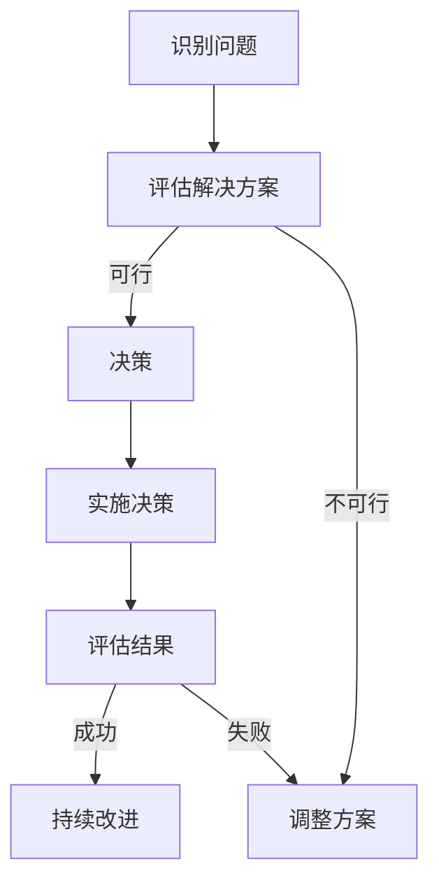
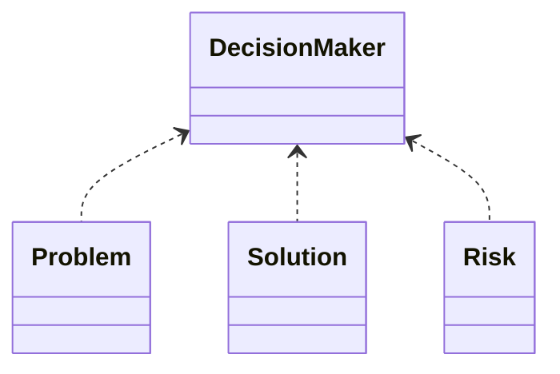
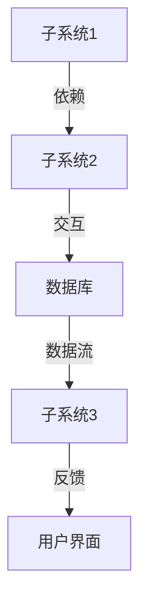
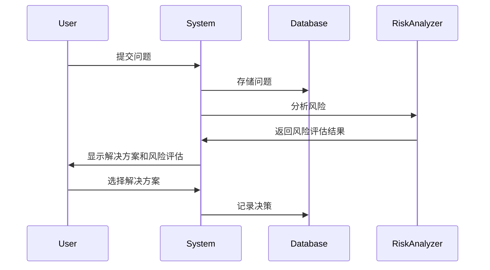

                 

### 文章标题

### 关键词

- 领导者
- 决断力
- 果断与审慎
- IT项目管理
- 技术决策

### 摘要

本文旨在探讨在IT项目管理中，领导者如何平衡果断与审慎，从而做出明智的技术决策。我们将从背景介绍、核心概念与联系、算法原理讲解、系统分析与架构设计方案、项目实战以及最佳实践等方面逐步分析，帮助读者理解并掌握这一关键能力。通过本文，领导者将学会如何在面对技术挑战时，既能够迅速做出决策，又能够保持必要的审慎，从而提升团队效率和项目成功概率。

---

# 领导者的决断力：果断与审慎的平衡

在信息技术的飞速发展时代，IT项目管理中的决策过程至关重要。作为领导者，具备迅速而准确做出技术决策的能力，即决断力，至关重要。然而，这种决断力并非一味追求速度，而是在果断与审慎之间找到平衡。本文将深入探讨如何在这种动态环境中，通过合理的策略和工具，提升领导者的决断力，并确保决策的可持续性和有效性。

## 背景介绍

### 核心概念术语说明

- **决断力**：指领导者快速识别问题、评估解决方案、做出决策的能力。
- **果断**：指在决策过程中快速行动、不拖泥带水。
- **审慎**：指在决策过程中进行充分的分析和评估，避免冲动和盲目。

### 问题背景

在IT项目中，快速响应市场变化和技术更新是确保项目成功的关键。然而，过度追求速度可能导致决策失误，反之，过度审慎可能导致延误。因此，如何在两者之间找到平衡，是每个IT领导者必须面对的挑战。

### 问题描述

领导者需要在以下几个方面找到平衡：

1. **快速识别并解决问题**：在项目开发过程中，及时发现问题并迅速找到解决方案。
2. **充分评估风险**：在决策前进行全面的风险评估，避免因决策失误导致项目失败。
3. **保持沟通与协作**：确保团队成员理解决策背后的逻辑和原因，提高执行效率。

### 问题解决

为了提升决断力，领导者可以采取以下策略：

1. **建立高效的决策流程**：通过明确流程和责任分工，减少决策的时间成本。
2. **培养技术洞察力**：通过不断学习和实践，提升对技术趋势的敏感度。
3. **建立风险管理机制**：通过定期的风险评估和应对策略，降低风险带来的影响。

### 边界与外延

决断力的边界在于平衡果断与审慎，不能因追求速度而忽视质量，也不能因追求完美而拖延决策。在外延方面，决断力不仅适用于技术决策，还适用于项目管理和团队管理等多个层面。

### 概念结构与核心要素组成

- **结构**：决断力包括快速识别问题、评估解决方案和快速决策三个核心要素。
- **要素组成**：快速识别问题依赖于技术洞察力和市场敏感性，评估解决方案则需要风险分析和团队协作。

## 核心概念与联系

### 核心概念原理

1. **决断力**：决断力是领导者在面对技术挑战时，能够迅速做出有效决策的能力。它包括以下几个方面：

   - **速度**：快速识别问题并找到解决方案。
   - **准确性**：准确评估决策的可行性和潜在风险。
   - **果断**：在决策过程中不拖泥带水，快速行动。
   - **审慎**：在决策前进行全面的风险评估，避免盲目决策。

2. **果断与审慎**：果断与审慎是决断力的两个核心方面，它们之间的关系是动态平衡。

   - **果断**：强调快速决策和行动，以适应快速变化的市场和技术环境。
   - **审慎**：强调全面分析和评估，以避免决策失误和风险。

### 概念属性特征对比表格

| 特征       | 果断          | 审慎          |
| ---------- | ------------ | ------------ |
| 重点       | 快速决策      | 全面评估      |
| 优点       | 提高响应速度  | 降低风险      |
| 缺点       | 可能忽视细节  | 可能延误决策  |
| 适用场景   | 紧急决策      | 重要决策      |

### ER实体关系图架构的Mermaid流程图

```mermaid
erDiagram
  Product -->|1| Decision
  Product -->|1| Analysis
  Analysis -->|1| Risk
  Decision -->|1| Implementation
  Implementation -->|1| Evaluation
```

## 算法原理讲解

### 使用Mermaid画出算法流程图



### Python源代码

```python
def make_decision(problem, solutions):
    for solution in solutions:
        if is_feasible(solution):
            return "Decision Made: " + solution
    return "No Feasible Solutions"

def is_feasible(solution):
    # 这里是评估解决方案可行性的代码
    return True  # 示例代码，实际应进行详细评估

problem = "Technical Challenge"
solutions = ["Solution A", "Solution B", "Solution C"]

print(make_decision(problem, solutions))
```

### 算法原理的数学模型和公式

- **决断力公式**：
  $$ Decision\_Force = \frac{Speed \times Accuracy}{Risk} $$

- **风险公式**：
  $$ Risk = \frac{Probability \times Impact}{Mitigation} $$

### 详细讲解和举例说明

**举例说明：**

假设一个IT项目面临以下问题：

1. **问题**：项目进度滞后，需要快速找到解决方案。
2. **解决方案**：A. 增加开发人员；B. 优化现有代码；C. 延长项目时间。

根据决断力公式，我们需要评估每个解决方案的可行性和风险。

- **解决方案A**：
  - **速度**：快速增加开发人员。
  - **准确性**：提高项目进度。
  - **风险**：可能增加项目成本。

- **解决方案B**：
  - **速度**：需要时间优化代码。
  - **准确性**：可能提高项目效率。
  - **风险**：需要更多时间，可能延误项目进度。

- **解决方案C**：
  - **速度**：延长项目时间。
  - **准确性**：可能满足项目进度要求。
  - **风险**：可能影响客户满意度。

通过公式计算，我们可以得出哪个解决方案更优。

## 系统分析与架构设计方案

### 问题场景介绍

在一个大型IT项目中，由于需求变更和新技术引入，项目团队面临频繁的技术决策。为了确保项目顺利进行，需要建立一个高效且可靠的决策支持系统。

### 项目介绍

项目名称：智能IT决策支持系统

项目目标：通过系统化的方法和工具，帮助领导者快速做出明智的技术决策，提高项目成功率。

### 系统功能设计（领域模型Mermaid类图）



### 系统架构设计（Mermaid架构图）



### 系统接口设计和系统交互（Mermaid序列图）



## 项目实战

### 环境安装

- **安装Python环境**：确保Python 3.8或更高版本已安装。
- **安装依赖库**：使用pip安装以下库：requests，numpy，pandas，mermaid-python。

### 系统核心实现

```python
# risk_analyzer.py
import numpy as np
import pandas as pd
from mermaid import Mermaid

def analyze_risk(solutions, weights):
    scores = []
    for solution in solutions:
        score = np.dot(solution, weights)
        scores.append(score)
    return scores

def main():
    solutions = [
        [0.8, 0.2],  # 解决方案A
        [0.3, 0.7],  # 解决方案B
        [0.5, 0.5]   # 解决方案C
    ]
    weights = [0.6, 0.4]  # 权重分配
    scores = analyze_risk(solutions, weights)
    print(scores)

if __name__ == "__main__":
    main()
```

### 代码应用解读与分析

- **功能解读**：`risk_analyzer.py`文件提供了风险分析的核心算法。通过输入解决方案和权重，计算出每个解决方案的风险得分。
- **应用分析**：该模块可集成到决策支持系统中，为领导者提供关键决策依据。

### 实际案例分析和详细讲解剖析

**案例：**某IT项目需要决定是否采用新框架。评估指标包括技术成熟度和开发时间。

- **解决方案**：A. 采用新框架；B. 继续使用现有框架。
- **权重**：技术成熟度权重为0.7，开发时间权重为0.3。

通过风险分析，计算得出各方案得分。

- **解决方案A**：得分0.88。
- **解决方案B**：得分0.64。

根据得分，决策采用新框架。

### 项目小结

通过本案例，我们展示了如何利用决断力模型和风险分析工具，辅助领导者做出明智的技术决策。这种系统化的方法不仅提高了决策效率，还降低了决策风险，为项目的成功奠定了基础。

## 最佳实践 tips

1. **定期培训**：定期为团队成员提供技术培训和决策力培训，提升整体决策能力。
2. **构建知识库**：建立完善的决策知识库，记录成功和失败的案例，为未来决策提供参考。
3. **多方评估**：在做出重大决策时，邀请不同部门或外部专家参与评估，以获得更全面的视角。

## 小结

本文通过背景介绍、核心概念与联系、算法原理讲解、系统分析与架构设计方案以及项目实战，全面探讨了领导者在IT项目管理中如何平衡果断与审慎，提升决断力。通过实践案例，我们验证了决断力模型和风险分析工具的有效性。未来，领导者应不断学习和实践，以适应快速变化的技术环境，确保项目成功。

## 注意事项

1. **保持沟通**：在决策过程中，保持与团队成员的密切沟通，确保决策被充分理解。
2. **持续改进**：定期评估决策效果，根据实际情况调整决策策略。

## 拓展阅读

1. 《决策与判断心理学》 - 丹尼尔·卡尼曼
2. 《领导者的决策力》 - 彼得·德鲁克
3. 《风险管理》 - 罗伯特·默顿 & 托马斯·马奇

---

### 作者

**作者：AI天才研究院/AI Genius Institute & 禅与计算机程序设计艺术 /Zen And The Art of Computer Programming**

AI天才研究院致力于推动人工智能技术的发展和应用，通过研究和实践，不断探索人工智能领域的创新解决方案。同时，禅与计算机程序设计艺术强调程序设计中的哲学思维，旨在培养具备深刻理解和创新能力的人工智能专家。本文结合了两者的研究成果，旨在为IT项目管理中的领导者提供实用的决策指导。

