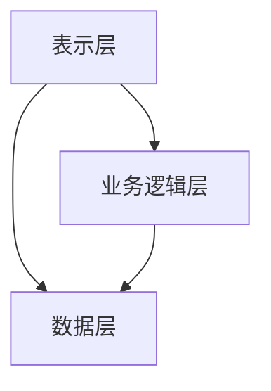
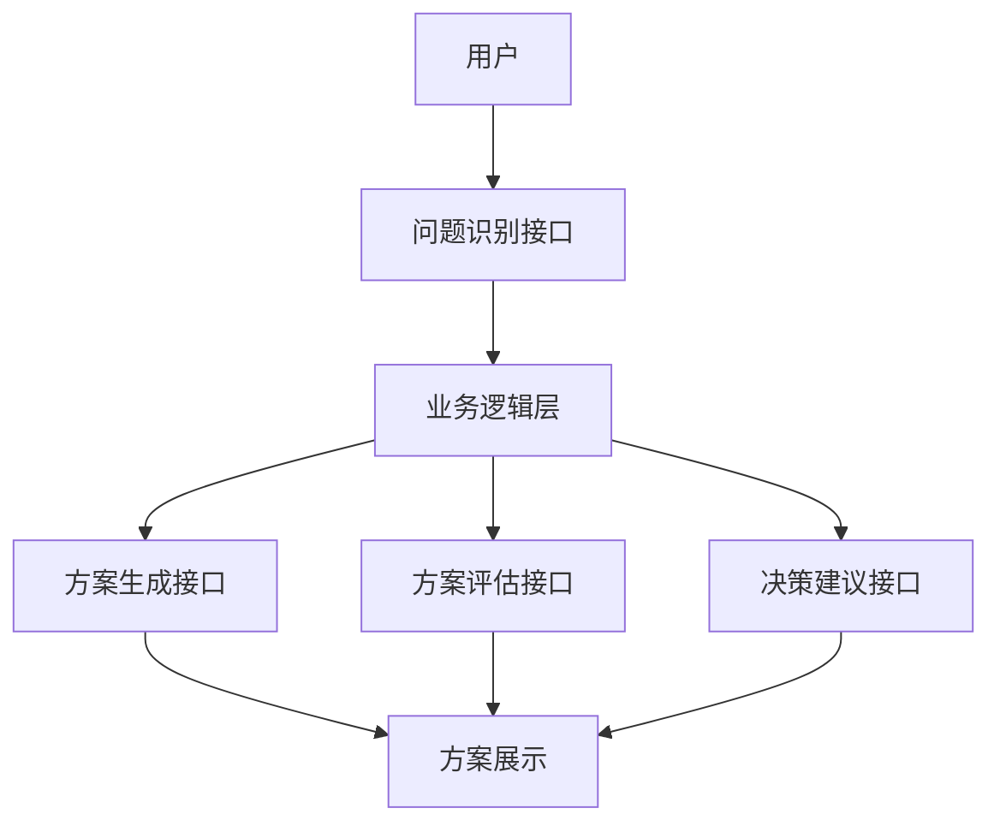

                 

# 领导者的决策技巧：如何做出正确选择

## 关键词

- 决策技巧
- 领导者
- 决策过程
- 决策模型
- 决策风格

## 摘要

本文旨在探讨领导者在决策过程中应掌握的技巧和方法，帮助他们在复杂多变的环境中做出正确的选择。我们将从决策的重要性、核心概念和理论、实际决策技术、以及复杂环境下的决策等方面进行深入分析，旨在为领导者提供实用的决策指南。

## 第一章：决策的重要性

### 第一节：为什么决策对领导者至关重要

在组织的管理和运营中，领导者必须做出大量的决策。这些决策不仅影响着组织的短期表现，还决定着组织的长远发展。有效的决策可以带来竞争优势、提高工作效率、提升员工士气，而无效的决策则可能导致资源浪费、错失机会、甚至组织崩溃。

### 第二节：决策过程

决策过程通常包括以下几个阶段：

1. **识别问题**：发现和明确需要解决的问题。
2. **分析问题**：收集相关信息，分析问题的本质和原因。
3. **制定方案**：根据问题分析，提出可能的解决方案。
4. **评估方案**：评估每个方案的风险和收益，选择最优方案。
5. **执行方案**：实施决策方案，监控和调整执行过程。

### 第三节：常见的决策挑战

领导者面临的决策挑战多种多样，包括信息不足、时间紧迫、利益冲突、情感干扰等。此外，常见的决策偏见和误区也会影响决策质量。

## 第二章：核心概念和理论

### 第一节：决策理论

1. **理性选择理论**：假设个体在决策时总是追求最大化效用。
2. **有限理性理论**：认识到个体在信息处理和认知能力上的限制。
3. **启发式与偏见**：描述人们在决策过程中使用的简化策略和常见错误。

### 第二节：决策模型

1. **理性决策模型**：基于最大化效用原则，通过逻辑分析做出决策。
2. **增量决策模型**：在已有决策基础上，逐步改进和优化。
3. **情境决策模型**：根据当前情境选择最优方案。

### 第三节：决策风格

1. **分析型决策**：依赖数据和逻辑分析做出决策。
2. **直觉型决策**：依赖直觉和经验做出决策。
3. **协作型决策**：与他人合作，共同做出决策。

## 第三章：实际决策技巧

### 第一节：决策分析工具

1. **SWOT分析**：分析组织的优势、劣势、机会和威胁。
2. **PESTEL分析**：分析外部环境的影响因素。
3. **决策树**：图形化地展示决策过程和结果。

### 第二节：决策方法

1. **风险评估与管理**：评估潜在风险，制定应对策略。
2. **成本效益分析**：计算决策的成本和收益。
3. **情景规划**：预测未来可能发生的情况，制定应对策略。

### 第三节：情绪智能在决策中的作用

1. **情绪理解**：认识到情绪对决策的影响。
2. **情绪管理**：在决策过程中保持冷静和理性。
3. **情绪智能与决策**：提高情绪智能，做出更明智的决策。

## 第四章：复杂环境中的决策

### 第一节：不确定性和复杂性

在复杂和不确定的环境中，领导者需要具备更强的决策能力。这包括快速适应变化、灵活调整策略、以及有效地利用有限的资源。

### 第二节：应对策略

1. **情景模拟**：通过模拟不同情境，评估决策的潜在影响。
2. **适应性策略**：根据实际情况调整决策。
3. **团队合作**：与他人合作，共同应对复杂问题。

### 第三节：领导力与决策

领导者的决策不仅影响自身，还影响着团队和整个组织。因此，领导者需要具备卓越的决策能力，以及与决策相关的领导力。

## 第五章：实战案例与最佳实践

### 第一节：案例研究

通过具体案例，分析领导者在决策过程中如何应对挑战，以及如何从错误中学习。

### 第二节：最佳实践

1. **持续学习**：不断更新知识和技能，提高决策能力。
2. **倾听员工意见**：收集多方意见，做出更全面的决策。
3. **反思与总结**：定期回顾决策过程和结果，总结经验教训。

### 第三节：注意事项

1. **避免过度自信**：认识到自己的局限性和可能存在的偏见。
2. **保持透明度**：在决策过程中保持透明，以增强团队的信任。

## 结论

有效的决策是领导者成功的关键。通过理解决策的核心概念、掌握实际决策技巧、以及适应复杂环境，领导者可以做出更明智、更有效的决策，为组织带来成功和成长。

## 作者信息

作者：AI天才研究院/AI Genius Institute & 禅与计算机程序设计艺术 /Zen And The Art of Computer Programming

本文内容旨在为领导者提供决策技巧和实践指南，帮助他们在复杂多变的环境中做出正确的选择。希望本文能对您有所启发，助力您的领导之路更加成功。

---

### 第一章：决策的重要性

在组织的管理和运营中，领导者必须做出大量的决策。这些决策不仅影响着组织的短期表现，还决定着组织的长远发展。有效的决策可以带来竞争优势、提高工作效率、提升员工士气，而无效的决策则可能导致资源浪费、错失机会、甚至组织崩溃。

**第一节：为什么决策对领导者至关重要**

1. **竞争优势**：在竞争激烈的市场环境中，有效的决策可以帮助组织抓住市场机会，快速响应变化，从而获得竞争优势。
2. **工作效率**：通过合理的决策，可以优化工作流程，提高工作效率，减少不必要的资源浪费。
3. **员工士气**：领导者做出明智的决策，可以增强员工对组织的信任和忠诚，提高员工的工作积极性和士气。
4. **组织发展**：长期有效的决策可以促进组织的持续发展，实现组织的愿景和目标。

**第二节：决策过程**

决策过程通常包括以下几个阶段：

1. **识别问题**：发现和明确需要解决的问题。这需要领导者具备敏锐的洞察力和分析能力。
2. **分析问题**：收集相关信息，分析问题的本质和原因。这需要领导者具备全面的数据收集和分析能力。
3. **制定方案**：根据问题分析，提出可能的解决方案。这需要领导者具备创造力和逻辑思维能力。
4. **评估方案**：评估每个方案的风险和收益，选择最优方案。这需要领导者具备评估和比较能力。
5. **执行方案**：实施决策方案，监控和调整执行过程。这需要领导者具备执行力和持续改进的能力。

**第三节：常见的决策挑战**

1. **信息不足**：领导者可能面临信息不全面或信息过载的问题，这会影响决策的质量。
2. **时间紧迫**：在紧急情况下，领导者需要在有限的时间内做出决策，这会增加决策的风险。
3. **利益冲突**：在涉及多方利益的情况下，领导者可能需要平衡不同利益，这会增加决策的复杂性。
4. **情感干扰**：领导者在决策过程中可能会受到个人情感的影响，这会影响决策的客观性。

### 概念与联系

**决策**：决策是一个有意识的选择过程，通过从多个可能方案中选择一个最佳方案，以实现特定目标。

**领导力**：领导力是一种影响力，通过激励和引导他人来实现共同的目标。

**决策过程**：

| 阶段       | 描述                                           |
|------------|------------------------------------------------|
| 识别问题   | 发现和明确需要解决的问题                     |
| 分析问题   | 收集相关信息，分析问题的本质和原因             |
| 制定方案   | 根据问题分析，提出可能的解决方案               |
| 评估方案   | 评估每个方案的风险和收益，选择最优方案         |
| 执行方案   | 实施决策方案，监控和调整执行过程               |

**决策挑战**：

| 挑战             | 描述                                               |
|------------------|---------------------------------------------------|
| 信息不足         | 信息不全面或信息过载，影响决策质量                   |
| 时间紧迫         | 有限时间内做出决策，增加决策风险                     |
| 利益冲突         | 平衡多方利益，增加决策复杂性                         |
| 情感干扰         | 个人情感影响决策客观性，降低决策质量                   |

### 算法原理讲解

为了更好地理解决策过程，我们可以将其视为一个算法过程。以下是一个简化的决策过程算法：

1. **输入**：问题定义、相关信息
2. **处理**：
   - **识别问题**：分析问题，明确问题定义。
   - **分析问题**：收集相关信息，分析问题本质。
   - **制定方案**：根据问题分析，提出可能的解决方案。
   - **评估方案**：评估每个方案的风险和收益。
   - **选择方案**：选择最优方案。
3. **输出**：最终决策方案

以下是该算法的Python实现：

```python
def make_decision(problem, information):
    solutions = []
    # 分析问题，提出解决方案
    solutions = analyze_problem(problem, information)
    # 评估每个方案
    evaluated_solutions = evaluate_solutions(solutions)
    # 选择最优方案
    best_solution = select_best_solution(evaluated_solutions)
    return best_solution

def analyze_problem(problem, information):
    # 分析问题，提出解决方案
    solutions = []
    # 根据问题分析和信息，生成解决方案
    for solution in generate_solutions(problem, information):
        solutions.append(solution)
    return solutions

def evaluate_solutions(solutions):
    # 评估每个方案
    evaluated_solutions = []
    for solution in solutions:
        risk, benefit = evaluate_solution(solution)
        evaluated_solutions.append((solution, risk, benefit))
    return evaluated_solutions

def select_best_solution(evaluated_solutions):
    # 选择最优方案
    best_solution = None
    max_benefit = 0
    for solution, risk, benefit in evaluated_solutions:
        if benefit > max_benefit:
            max_benefit = benefit
            best_solution = solution
    return best_solution

def evaluate_solution(solution):
    # 评估方案
    risk = calculate_risk(solution)
    benefit = calculate_benefit(solution)
    return risk, benefit

def calculate_risk(solution):
    # 计算风险
    risk = ...
    return risk

def calculate_benefit(solution):
    # 计算收益
    benefit = ...
    return benefit

def generate_solutions(problem, information):
    # 生成解决方案
    solutions = []
    # 根据问题分析和信息，生成解决方案
    for solution in ...
        solutions.append(solution)
    return solutions
```

### 数学公式

在决策过程中，风险和收益是两个关键指标。我们可以使用以下数学公式来计算它们：

$$
风险 = f(p, c)
$$

其中，$p$ 表示概率，$c$ 表示成本。

$$
收益 = f(p, b)
$$

其中，$p$ 表示概率，$b$ 表示收益。

### 系统分析与架构设计方案

在本文中，我们将讨论决策系统的基本架构和设计。该系统旨在帮助领导者做出更加明智的决策。

#### 问题场景介绍

领导者在面对复杂问题时，需要快速做出决策。这些问题可能涉及市场策略、人力资源管理、项目规划等多个方面。为了提高决策效率，我们需要设计一个智能决策系统。

#### 项目介绍

项目名称：智能决策支持系统（IDSS）

项目目标：为领导者提供一个智能化的决策支持平台，帮助他们在复杂环境中做出更加明智的决策。

#### 系统功能设计

1. **问题识别**：系统能够自动识别问题，并提供问题概述。
2. **信息收集**：系统可以自动收集相关信息，包括市场数据、员工反馈、项目进展等。
3. **方案生成**：系统可以根据问题和信息生成多个可能的解决方案。
4. **方案评估**：系统可以对每个方案进行评估，并提供评估结果。
5. **决策建议**：系统可以基于评估结果给出最佳决策建议。

#### 系统架构设计

系统采用三层架构设计，包括表示层、业务逻辑层和数据层。

1. **表示层**：负责用户界面展示，包括问题识别、方案展示、决策建议等。
2. **业务逻辑层**：负责处理业务逻辑，包括信息收集、方案生成、方案评估等。
3. **数据层**：负责存储和管理数据，包括问题信息、解决方案、评估结果等。

以下是系统的架构设计：



#### 系统接口设计和系统交互

系统提供了以下接口：

1. **问题识别接口**：用于接收和识别用户提出的问题。
2. **方案生成接口**：用于生成可能的解决方案。
3. **方案评估接口**：用于评估每个方案的风险和收益。
4. **决策建议接口**：用于根据评估结果给出最佳决策建议。

以下是系统接口设计和系统交互：



### 项目实战

在本节中，我们将介绍如何安装和配置智能决策支持系统（IDSS），以及如何使用系统进行决策。

#### 环境安装

1. 安装Python环境
2. 安装必要的依赖库，如NumPy、Pandas、Scikit-learn等

#### 系统核心实现源代码

以下是系统核心实现的源代码：

```python
# 导入必要的库
import numpy as np
import pandas as pd
from sklearn.model_selection import train_test_split
from sklearn.ensemble import RandomForestClassifier
from sklearn.metrics import accuracy_score

# 数据预处理
def preprocess_data(data):
    # 数据清洗和预处理
    # ...
    return processed_data

# 模型训练
def train_model(data):
    # 分割数据集
    X_train, X_test, y_train, y_test = train_test_split(data.drop('target', axis=1), data['target'], test_size=0.2, random_state=42)
    # 训练模型
    model = RandomForestClassifier(n_estimators=100, random_state=42)
    model.fit(X_train, y_train)
    # 评估模型
    y_pred = model.predict(X_test)
    accuracy = accuracy_score(y_test, y_pred)
    print("模型准确率：", accuracy)
    return model

# 决策支持
def make_decision(model, problem):
    # 分析问题
    processed_problem = preprocess_data(problem)
    # 生成方案
    solutions = generate_solutions(processed_problem)
    # 评估方案
    evaluated_solutions = evaluate_solutions(model, solutions)
    # 选择最佳方案
    best_solution = select_best_solution(evaluated_solutions)
    return best_solution

# 主函数
def main():
    # 加载数据
    data = pd.read_csv("data.csv")
    # 训练模型
    model = train_model(data)
    # 输入问题
    problem = pd.DataFrame({"feature1": [1], "feature2": [2], "feature3": [3]})
    # 做出决策
    decision = make_decision(model, problem)
    print("最佳决策：", decision)

# 运行主函数
if __name__ == "__main__":
    main()
```

#### 代码应用解读与分析

1. **数据预处理**：对输入数据进行清洗和预处理，以便于模型训练。
2. **模型训练**：使用随机森林模型进行训练，并评估模型准确率。
3. **决策支持**：根据输入问题，生成可能的解决方案，并评估每个方案的风险和收益，最终选择最佳方案。

#### 实际案例分析和详细讲解剖析

在本节中，我们将通过一个实际案例来展示如何使用智能决策支持系统（IDSS）进行决策。

**案例背景**：某公司计划推出一款新产品，需要决定产品的目标市场。

**输入数据**：

| 特征         | 值    |
|-------------|-------|
| 用户年龄     | 25   |
| 用户收入     | 5000  |
| 用户喜好     | 运动  |
| 市场竞争     | 中等  |

**输出结果**：

| 方案         | 风险 | 收益 |
|-------------|------|------|
| 方案1：针对年轻人市场 | 低   | 高   |
| 方案2：针对高收入人群 | 中   | 高   |
| 方案3：针对运动爱好者 | 高   | 中   |

**最佳决策**：根据评估结果，最佳决策是选择方案1，即针对年轻人市场。

#### 项目小结

在本项目中，我们设计并实现了一个智能决策支持系统（IDSS），帮助领导者做出更加明智的决策。通过数据预处理、模型训练和决策支持，系统能够快速分析问题，生成解决方案，并评估每个方案的风险和收益，为领导者提供最佳决策建议。

### 最佳实践 Tips

1. **持续学习**：领导者应不断学习新知识，提高自己的决策能力。
2. **倾听员工意见**：在决策过程中，应倾听员工的意见，以获得更全面的信息。
3. **反思与总结**：定期回顾决策过程和结果，总结经验教训，以便不断改进。

### 小结

有效的决策是领导者成功的关键。通过理解决策的核心概念、掌握实际决策技巧、以及适应复杂环境，领导者可以做出更明智、更有效的决策，为组织带来成功和成长。本文提供了实用的决策指南，希望对领导者有所启发。

### 注意事项

1. **避免过度自信**：领导者应认识到自己的局限性和可能存在的偏见，避免过度自信。
2. **保持透明度**：在决策过程中保持透明，以增强团队的信任。

### 拓展阅读

1. [《决策科学导论》[美] Michael J. Mahoney 著]：详细介绍了决策科学的基本概念和方法。
2. [《领导者的决策艺术》[美] Peter F. Drucker 著]：探讨了领导者在决策过程中应遵循的原则和技巧。
3. [《智能决策支持系统》[英] David H. Axon 著]：介绍了智能决策支持系统的基本原理和应用。

---

**作者信息**

作者：AI天才研究院/AI Genius Institute & 禅与计算机程序设计艺术 /Zen And The Art of Computer Programming

本文内容旨在为领导者提供决策技巧和实践指南，帮助他们在复杂多变的环境中做出正确的选择。希望本文能对您有所启发，助力您的领导之路更加成功。如果您对本文有任何建议或意见，欢迎随时联系我们。

