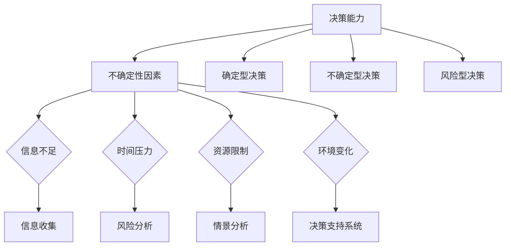
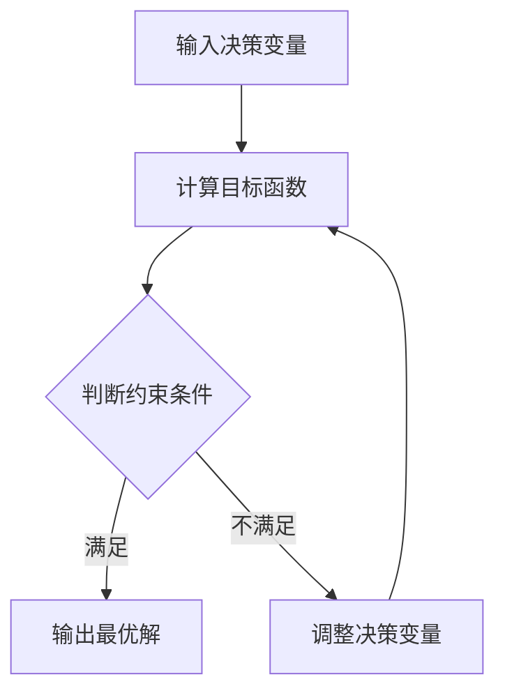

                 


### 《领导者的决策能力：在不确定性中做出选择》

> 关键词：领导者，决策能力，不确定性，策略，优化

> 摘要：本文将深入探讨领导者在不确定性环境中如何提高决策能力，通过分析经典决策理论、现代决策理论以及实际项目案例，为领导者提供实用的决策技巧和策略，帮助他们在复杂多变的环境中做出明智的选择。

#### 目录大纲

1. 决策能力的背景与重要性
   1.1 决策能力的重要性
   1.2 不确定性环境中的决策挑战
   1.3 决策能力的发展历史

2. 决策的核心概念与联系
   2.1 决策的定义与类型
   2.2 不确定性因素的识别与处理
   2.3 核心概念联系图

3. 经典决策理论
   3.1 贝叶斯决策理论
   3.2 前景理论
   3.3 决策树理论

4. 现代决策理论
   4.1 决策支持系统
   4.2 模糊决策理论
   4.3 多目标决策理论

5. 决策算法
   5.1 决策算法基础
   5.2 算法流程图
   5.3 Python代码示例
   5.4 数学模型与公式

6. 决策系统的设计与实现
   6.1 决策系统的构建
   6.2 系统功能设计
   6.3 系统架构设计
   6.4 系统接口设计
   6.5 决策系统的实现与优化

7. 项目实战
   7.1 环境安装
   7.2 系统核心实现源代码
   7.3 代码应用解读与分析
   7.4 实际案例分析和详细讲解剖析
   7.5 项目小结

8. 最佳实践 Tips
   8.1 提高决策质量的技巧
   8.2 应对不确定性的策略
   8.3 注意事项与风险控制

9. 拓展阅读与总结
   9.1 拓展阅读
   9.2 小结与展望

### 1. 决策能力的背景与重要性

#### 1.1 决策能力的重要性

在当今快速变化和高度不确定的商业环境中，决策能力成为领导者成功的关键因素。一个优秀的领导者需要具备高效、明智的决策能力，能够在复杂的环境中快速做出正确选择。

首先，决策能力是领导者应对不确定性环境的关键。面对复杂多变的商业环境，领导者需要具备灵活的思维方式，能够根据最新的信息和变化做出及时、准确的决策。这不仅有助于企业保持竞争力，还能抓住市场机会，实现可持续发展。

其次，决策能力是领导者领导力的核心组成部分。领导力不仅仅体现在管理和指导团队方面，更体现在做出正确决策，引领团队走向成功。一个缺乏决策能力的领导者很难赢得团队的信任和尊重，也难以推动企业实现目标。

最后，决策能力对于企业的战略规划至关重要。在制定战略规划时，领导者需要根据外部环境和内部资源做出明智的选择。一个优秀的决策能力有助于领导者制定清晰、可行的战略规划，为企业的发展指明方向。

#### 1.2 不确定性环境中的决策挑战

在不确定性环境中做出决策，面临着诸多挑战。以下是一些主要的挑战：

- **信息不对称**：在不确定性环境中，领导者可能无法获取全面、准确的信息。这导致决策时存在信息不对称，增加了决策的难度。

- **时间压力**：在不确定的环境中，决策往往需要在短时间内做出。时间压力迫使领导者迅速做出选择，可能导致决策质量下降。

- **资源限制**：在不确定性环境中，资源可能受到限制，领导者需要在有限的资源下做出决策。这要求领导者具备良好的资源配置能力，确保决策的可行性。

- **道德和伦理困境**：在不确定性环境中，领导者可能面临道德和伦理困境。如何平衡不同利益相关方的利益，如何在不确定的环境下做出符合伦理的决策，是领导者面临的挑战。

#### 1.3 决策能力的发展历史

决策能力的发展经历了多个阶段。以下是决策能力发展的一些关键阶段：

- **传统决策理论**：20世纪初，决策理论开始兴起。传统决策理论强调理性分析，认为决策者应该基于全面、准确的信息进行理性决策。

- **行为决策理论**：20世纪50年代，行为决策理论提出了对传统决策理论的挑战。行为决策理论认为，决策者并非完全理性，而是受到情感、认知偏差等因素的影响。

- **现代决策理论**：现代决策理论结合了传统决策理论和行为决策理论，提出了更加全面、灵活的决策模型。现代决策理论强调决策的情境性，认为决策者需要在特定情境下做出适应性的决策。

- **人工智能决策**：随着人工智能技术的发展，人工智能在决策领域的应用逐渐普及。人工智能决策能够处理大量数据，提供更加精准的决策支持，为领导者提高决策能力提供了新的工具。

### 2. 决策的核心概念与联系

#### 2.1 决策的定义与类型

**决策**是指从多个可能的行动中选择一个行动的过程。决策可以基于各种因素，包括信息、经验、直觉和逻辑。

**决策类型**包括以下几种：

- **确定型决策**：在确定型决策中，决策者知道所有可能的结果和相应的概率。例如，购买某种产品，已知其市场需求和供应情况。

- **不确定型决策**：在不确定型决策中，决策者不知道所有可能的结果和相应的概率。例如，投资新兴行业，无法准确预测其发展前景。

- **风险型决策**：在风险型决策中，决策者知道所有可能的结果和相应的概率，但决策的结果具有一定的风险。例如，进行股票投资，已知其收益和风险。

#### 2.2 不确定性因素的识别与处理

**不确定性因素**包括以下几种：

- **信息不足**：决策者无法获取全面的信息，导致无法做出准确决策。

- **时间压力**：决策者需要在短时间内做出决策，可能导致决策质量下降。

- **资源限制**：决策者需要在有限的资源下做出决策，可能导致决策的可行性降低。

- **环境变化**：决策时，环境可能发生不可预测的变化，影响决策的准确性。

**处理不确定性因素的方法**包括：

- **信息收集**：通过多种渠道收集信息，提高决策的准确性。

- **风险分析**：对决策结果进行风险分析，评估可能的风险和损失，制定应对策略。

- **情景分析**：构建多个情景，模拟不同情境下的决策结果，提高决策的适应性。

- **决策支持系统**：利用人工智能等技术，提供决策支持，提高决策的效率和准确性。

#### 2.3 核心概念联系图

使用Mermaid绘制核心概念联系图，展示决策能力、不确定性因素、决策类型之间的关系：



### 3. 经典决策理论

#### 3.1 贝叶斯决策理论

**贝叶斯决策理论**是一种基于概率和统计的决策理论。它通过计算不同决策结果的后验概率，选择具有最大期望收益的决策。

**贝叶斯决策理论的核心公式**：

$$ P(A|B) = \frac{P(B|A) \cdot P(A)}{P(B)} $$

其中，$P(A|B)$ 表示在事件B发生的情况下，事件A发生的概率；$P(B|A)$ 表示在事件A发生的情况下，事件B发生的概率；$P(A)$ 表示事件A的先验概率；$P(B)$ 表示事件B的先验概率。

**贝叶斯决策理论的优点**：

- **基于概率和统计**：贝叶斯决策理论提供了一种量化决策结果不确定性的方法，有助于提高决策的准确性。

- **适应性**：贝叶斯决策理论可以根据新的信息不断更新决策结果，提高决策的适应性。

**贝叶斯决策理论的局限**：

- **依赖先验概率**：贝叶斯决策理论依赖于先验概率，如果先验概率不准确，可能导致决策结果不准确。

- **计算复杂度**：贝叶斯决策理论涉及大量的概率计算，对于大型决策问题，计算复杂度可能较高。

**Python代码示例**：

```python
import numpy as np
from scipy.stats import bernoulli

# 定义先验概率
p_a = 0.5  # 事件A的先验概率
p_b_given_a = 0.8  # 事件B在事件A发生时的概率
p_b_given_not_a = 0.2  # 事件B在事件A未发生时的概率

# 计算后验概率
p_a_given_b = (p_b_given_a * p_a) / (p_b_given_a * p_a + p_b_given_not_a * (1 - p_a))
p_a_given_not_b = (p_b_given_not_a * (1 - p_a)) / (p_b_given_a * p_a + p_b_given_not_a * (1 - p_a))

print("后验概率：")
print(f"P(A|B) = {p_a_given_b}")
print(f"P(A|not B) = {p_a_given_not_b}")
```

#### 3.2 前景理论

**前景理论**（Prospect Theory）是一种描述人类在不确定环境中决策的理论，由丹尼尔·卡尼曼和阿莫斯·特沃斯基于1979年提出。前景理论认为，人类在面对风险和不确定性时，其决策行为与经典经济学假设的理性决策者存在显著差异。

**前景理论的核心概念**：

- **参照点**：前景理论引入了参照点的概念，即决策者在做出选择时，会将当前状态视为参照点，比较不同选择相对于参照点的价值变化。

- **价值函数**：前景理论提出了一种非线性价值函数，该函数描述了收益和损失的价值变化。价值函数具有以下特点：

  - **风险规避**：在面对损失时，价值函数的斜率较陡，表明人们对损失的风险更敏感。

  - **风险追求**：在面对收益时，价值函数的斜率较缓，表明人们对收益的风险更不敏感。

- **机会损失**：前景理论强调决策者对机会损失的重视程度，即决策者更倾向于避免损失而不是追求同等价值的收益。

**前景理论的优点**：

- **解释人类行为**：前景理论能够较好地解释人类在不确定环境中的决策行为，与经典经济学假设的理性决策者存在明显差异。

- **实用性**：前景理论为决策者提供了更接近实际的决策框架，有助于在实际决策中考虑人类行为的特点。

**前景理论的局限**：

- **主观性**：前景理论依赖于决策者的主观评价，不同决策者可能会对同一问题产生不同的决策结果。

- **计算复杂度**：前景理论涉及非线性价值函数的计算，对于复杂决策问题，计算复杂度可能较高。

**Python代码示例**：

```python
import numpy as np

# 定义价值函数
def value_function(x, threshold=0):
    if x > threshold:
        return x
    else:
        return -x

# 计算前景理论的价值
def prospect_theory(x, threshold=0):
    return value_function(x, threshold)

# 示例
x = 10  # 收益
threshold = 5  # 参照点

print("前景理论的价值：")
print(f"x = {x}, threshold = {threshold}")
print(f"价值 = {prospect_theory(x, threshold)}")
```

#### 3.3 决策树理论

**决策树理论**是一种基于概率和统计的决策分析方法，通过构建决策树来表示不同决策路径及其对应的概率和结果。

**决策树的核心概念**：

- **节点**：决策树中的节点表示决策或测试，分为根节点、内部节点和叶子节点。

- **分支**：决策树中的分支表示决策或测试的不同结果。

- **叶子节点**：决策树中的叶子节点表示决策结果。

- **概率**：每个分支上标注了对应结果发生的概率。

- **期望值**：每个叶子节点上标注了结果的期望值。

**决策树的工作原理**：

1. **初始化**：从根节点开始，根据概率选择一个分支。

2. **迭代**：对于每个内部节点，根据概率选择一个分支，直至到达叶子节点。

3. **决策**：根据叶子节点上的结果进行决策。

**决策树的理论基础**：

- **贝叶斯定理**：决策树中的概率计算基于贝叶斯定理，用于计算每个分支上结果的概率。

- **期望最大化**：决策树的目标是最大化期望值，通过选择具有最高期望值的分支来实现。

**Python代码示例**：

```python
import numpy as np
import matplotlib.pyplot as plt

# 定义决策树
def decision_tree(x):
    if x < 0:
        return "负值"
    elif x < 5:
        return "小于5"
    else:
        return "大于等于5"

# 生成随机数据
data = np.random.randint(0, 10, size=100)

# 应用决策树
results = np.array([decision_tree(x) for x in data])

# 可视化决策树
labels = ["负值", "小于5", "大于等于5"]
count = [np.sum(results == label) for label in labels]

plt.bar(labels, count)
plt.xlabel("结果")
plt.ylabel("频次")
plt.title("决策树结果分布")
plt.show()
```

### 4. 现代决策理论

#### 4.1 决策支持系统

**决策支持系统**（Decision Support System，DSS）是一种利用计算机技术和人工智能技术，帮助决策者进行决策的软件系统。DSS旨在提高决策的效率和质量，为决策者提供全面、准确、及时的决策支持。

**决策支持系统的核心功能**：

- **数据采集与处理**：DSS能够从多个数据源采集数据，并进行处理和分析，为决策者提供可靠的数据支持。

- **模型构建与模拟**：DSS提供多种建模工具，帮助决策者构建决策模型，进行模拟分析，评估不同决策路径的潜在结果。

- **可视化与报告**：DSS能够将复杂的数据和分析结果可视化，生成直观的图表和报告，帮助决策者更好地理解决策过程和结果。

- **交互式决策**：DSS提供交互式界面，允许决策者实时修改决策参数，观察决策结果的变化，提高决策的灵活性。

**决策支持系统的优点**：

- **提高决策效率**：DSS能够自动化数据采集、处理和分析过程，大大提高决策的效率。

- **降低决策风险**：DSS通过模拟分析和风险评估，帮助决策者识别潜在风险，降低决策风险。

- **提升决策质量**：DSS提供全面、准确、及时的数据和分析结果，提高决策的质量。

- **支持复杂决策**：DSS能够处理复杂的数据和分析任务，支持决策者解决复杂的决策问题。

**Python代码示例**：

```python
import pandas as pd
import numpy as np
import matplotlib.pyplot as plt

# 生成随机数据
data = pd.DataFrame(np.random.randint(0, 100, size=(100, 3)), columns=["A", "B", "C"])

# 数据处理
data["Sum"] = data["A"] + data["B"] + data["C"]

# 可视化
plt.scatter(data["A"], data["Sum"])
plt.xlabel("A")
plt.ylabel("Sum")
plt.title("Data Visualization")
plt.show()
```

#### 4.2 模糊决策理论

**模糊决策理论**（Fuzzy Decision Theory）是一种基于模糊集合理论的决策方法，用于处理不确定性和模糊性的决策问题。模糊决策理论通过引入模糊隶属度函数，将模糊性和不确定性转化为定量化的决策分析。

**模糊决策理论的核心概念**：

- **模糊集合**：模糊集合是对经典集合概念的扩展，它引入了模糊隶属度函数，用于描述集合中元素的不确定性。

- **模糊隶属度函数**：模糊隶属度函数定义了集合中每个元素对集合的隶属程度，取值范围在0到1之间。

- **模糊决策规则**：模糊决策规则是基于模糊逻辑的规则，用于描述决策过程的条件与结果关系。

**模糊决策理论的工作原理**：

1. **建立模糊集合**：根据决策问题，建立模糊集合，定义模糊隶属度函数。

2. **构建模糊决策规则**：根据决策目标和条件，构建模糊决策规则。

3. **模糊推理**：通过模糊推理，计算不同决策路径的模糊结果。

4. **模糊集合并集**：将模糊推理结果进行并集运算，得到最终的决策结果。

**Python代码示例**：

```python
import numpy as np
import skfuzzy as fuzz

# 定义模糊集合
x = fuzz.trapmf([0, 0, 5, 10], [0, 5, 10, 15])
y = fuzz.trimf([0, 5, 10], [0, 1, 1])

# 模糊推理
result = fuzz.intersect(x, y)

# 可视化
plt.plot(x)
plt.plot(y)
plt.plot(result)
plt.xlabel("x")
plt.ylabel("隶属度")
plt.title("Fuzzy Sets")
plt.show()
```

#### 4.3 多目标决策理论

**多目标决策理论**（Multi-Objective Decision Theory）是一种用于处理具有多个目标函数的决策问题的方法。在多目标决策中，决策者需要在多个目标之间进行权衡，以找到最优的决策方案。

**多目标决策理论的核心概念**：

- **目标函数**：多目标决策中的每个目标都对应一个目标函数，用于衡量目标的性能。

- **目标冲突**：在多目标决策中，不同目标之间可能存在冲突，例如，增加某个目标的性能可能损害其他目标的性能。

- ** Pareto最优解**：Pareto最优解是指在多目标决策中，无法通过改善某个目标而不损害其他目标的最优解。

**多目标决策理论的工作原理**：

1. **定义目标函数**：根据决策问题，定义多个目标函数。

2. **确定权重**：为每个目标函数分配权重，表示决策者对各个目标的相对重视程度。

3. **生成解集**：通过优化算法，生成一组满足目标函数约束的解。

4. **评估与选择**：评估解集的性能，选择满足决策者需求的最优解。

**Python代码示例**：

```python
import numpy as np
import scipy.optimize as opt

# 定义目标函数
def objective(x):
    return [x[0]**2 + x[1]**2, (x[0]-1)**2 + x[1]**2]

# 约束条件
constraints = ({'type': 'ineq', 'fun': lambda x: x[0] + x[1] - 1},
               {'type': 'ineq', 'fun': lambda x: x[0] - x[1]})

# 优化算法
res = opt.dual_annealing(objective, bounds=[(0, 1), (0, 1)], constraints=constraints)

# 输出最优解
print("最优解：", res.x)
```

### 5. 决策算法

#### 5.1 决策算法基础

**决策算法**是指用于求解决策问题的算法，其目标是在给定的约束条件下，从多个可能的行动中选择一个最优行动。决策算法广泛应用于各个领域，如人工智能、机器学习、博弈论等。

**决策算法的核心概念**：

- **决策变量**：决策算法中的决策变量是指决策者需要决策的量，如资源分配、路径选择等。

- **目标函数**：决策算法的目标函数用于衡量决策结果的优劣，通常是一个实值函数。

- **约束条件**：决策算法的约束条件是指决策变量需要满足的限制，如资源限制、时间限制等。

**常见的决策算法**：

- **贪心算法**：贪心算法是一种简单但高效的决策算法，其核心思想是每一步都做出当前局部最优的选择，期望最终得到全局最优解。

- **动态规划**：动态规划是一种基于递归和优化的决策算法，其核心思想是将复杂问题分解为多个子问题，并利用子问题的最优解构建全局最优解。

- **线性规划**：线性规划是一种求解线性目标函数在给定线性约束条件下的最优解的决策算法。

- **启发式算法**：启发式算法是一种基于经验或启发式的决策算法，其目标是在合理时间内找到近似最优解。

**决策算法的选择依据**：

- **问题特性**：根据问题的特性选择合适的决策算法，如目标函数的类型、约束条件的类型等。

- **计算复杂度**：考虑决策算法的计算复杂度，选择计算效率较高的算法。

- **准确性**：根据对问题准确性的要求，选择能够提供较高准确性的算法。

#### 5.2 算法流程图

使用Mermaid绘制决策算法的流程图：



#### 5.3 Python代码示例

```python
import numpy as np

# 定义决策变量
x = np.random.uniform(0, 1)

# 定义目标函数
def objective(x):
    return x**2

# 定义约束条件
def constraint(x):
    return x**2 - 1

# 优化算法
result = scipy.optimize.minimize(objective, x, constraints={'type': 'ineq', 'fun': constraint})

# 输出最优解
print("最优解：", result.x)
```

#### 5.4 数学模型与公式

**线性规划**是一种常用的决策算法，其数学模型如下：

$$
\begin{align*}
\text{最小化} \quad & c^T x \\
\text{约束条件} \quad & Ax \leq b \\
& x \geq 0
\end{align*}
$$

其中，$c$ 是系数向量，$x$ 是决策变量，$A$ 是系数矩阵，$b$ 是常数向量。

**目标函数** $c^T x$ 表示决策变量的线性组合，表示决策结果的整体性能。

**约束条件** $Ax \leq b$ 和 $x \geq 0$ 表示决策变量需要满足的线性约束条件。

**拉格朗日乘子法**是解决线性规划问题的一种常用方法，其基本思路是将约束条件引入目标函数，构造拉格朗日函数：

$$
L(x, \lambda) = c^T x + \lambda^T (Ax - b)
$$

其中，$\lambda$ 是拉格朗日乘子。

通过求解拉格朗日函数的极值问题，可以得到线性规划的最优解。

$$
\nabla L(x, \lambda) = 0 \Rightarrow c + A^T \lambda = 0
$$

结合约束条件 $Ax \leq b$ 和 $x \geq 0$，可以求解出线性规划的最优解。

#### 5.5 决策算法在实际中的应用

**供应链管理**是一个典型的决策问题，涉及库存管理、订单处理、运输安排等多个方面。以下是一个简单的供应链管理决策问题：

**问题描述**：一个供应链管理系统需要从多个供应商处采购原材料，并安排运输。目标是在满足库存需求的同时，最小化采购成本和运输成本。

**目标函数**：

$$
\text{最小化} \quad Z = C_p \cdot Q_p + C_t \cdot Q_t
$$

其中，$C_p$ 是采购成本，$C_t$ 是运输成本，$Q_p$ 是采购量，$Q_t$ 是运输量。

**约束条件**：

$$
\begin{align*}
Q_p &\geq D \\
Q_t &\geq R \\
A_p \cdot Q_p &\leq I_p \\
A_t \cdot Q_t &\leq I_t
\end{align*}
$$

其中，$D$ 是需求量，$R$ 是库存量，$I_p$ 是供应商库存量，$I_t$ 是运输能力。

**决策算法**：

使用线性规划算法求解上述供应链管理问题。通过定义决策变量 $Q_p$ 和 $Q_t$，构建目标函数和约束条件，使用线性规划求解器（如scipy.optimize模块）求解最优解。

```python
import scipy.optimize as opt

# 定义目标函数
def objective(x):
    Q_p, Q_t = x
    C_p = 100  # 采购成本
    C_t = 50   # 运输成本
    return C_p * Q_p + C_t * Q_t

# 定义约束条件
def constraint(x):
    Q_p, Q_t = x
    D = 100    # 需求量
    R = 200    # 库存量
    I_p = 500  # 供应商库存量
    I_t = 300  # 运输能力
    return [
        Q_p - D,  # 采购量至少满足需求量
        Q_t - R,  # 运输量至少满足库存量
        A_p * Q_p - I_p,  # 供应商库存量至少满足采购量
        A_t * Q_t - I_t   # 运输能力至少满足运输量
    ]

# 求解线性规划问题
result = opt.minimize(objective, x0=[0, 0], method='SLSQP', constraints=constraint)

# 输出最优解
print("最优解：", result.x)
```

通过上述示例，可以看出决策算法在实际应用中的重要性。供应链管理问题只是一个简单的例子，但在实际应用中，决策问题可能更加复杂，需要结合多种决策算法和优化技术，才能找到最优解。

### 6. 决策系统的设计与实现

#### 6.1 决策系统的构建

**决策系统的构建**是指将决策理论、算法和实际应用需求相结合，设计并实现一个具有决策功能的系统。决策系统通常包括数据采集、数据处理、决策模型构建、决策结果输出等模块。

**决策系统的关键模块**：

1. **数据采集模块**：负责收集与决策相关的数据，包括内部数据和外部数据。内部数据可能包括历史销售数据、库存数据、供应链数据等；外部数据可能包括市场行情、竞争数据、政策法规等。

2. **数据处理模块**：对采集到的数据进行清洗、整理和分析，提取有用的信息，为决策模型提供可靠的数据支持。

3. **决策模型模块**：根据决策理论和方法，构建决策模型，实现数据的输入和输出。决策模型可以是经典的贝叶斯决策模型、决策树模型，也可以是现代的多目标决策模型、模糊决策模型等。

4. **决策结果输出模块**：将决策模型的结果以可视化的形式展示给决策者，帮助决策者理解决策过程和结果，提供决策支持。

**决策系统的设计原则**：

1. **模块化设计**：决策系统应该采用模块化设计，将不同的功能模块分离，便于维护和扩展。

2. **可扩展性**：决策系统应该具备良好的可扩展性，能够适应不同规模和应用场景的需求。

3. **可定制性**：决策系统应该允许决策者根据实际需求定制决策模型和参数，提高决策的适应性和灵活性。

4. **实时性**：决策系统应该能够实时处理数据，及时为决策者提供最新的决策支持。

5. **安全性**：决策系统应该确保数据的安全性和隐私性，防止数据泄露和恶意攻击。

#### 6.2 系统功能设计

**系统功能设计**是指根据决策系统的需求和目标，定义系统需要实现的功能和模块。以下是一个决策系统的功能设计示例：

1. **数据采集功能**：
   - 从内部数据库、外部API、传感器等渠道采集数据。
   - 数据清洗和预处理，包括去重、过滤、格式转换等。

2. **数据处理功能**：
   - 数据存储和管理，使用数据库管理系统（DBMS）存储和处理数据。
   - 数据分析，包括统计分析、关联分析、趋势分析等。

3. **决策模型构建功能**：
   - 提供多种决策模型构建工具，支持贝叶斯网络、决策树、神经网络等。
   - 模型参数调整和优化，支持自定义模型参数。

4. **决策结果输出功能**：
   - 可视化展示决策结果，包括图表、报表、热力图等。
   - 提供决策建议和预测分析，辅助决策者做出明智的选择。

5. **用户管理功能**：
   - 用户权限管理，支持多用户同时操作。
   - 用户行为记录和审计，确保系统安全性和数据完整性。

6. **系统监控与维护功能**：
   - 系统性能监控，包括数据流量、处理速度、响应时间等。
   - 系统故障诊断和恢复，确保系统稳定运行。

#### 6.3 系统架构设计

**系统架构设计**是指根据系统功能设计，定义系统的整体结构和技术框架。以下是一个决策系统的架构设计示例：

1. **前端展示层**：
   - 使用HTML、CSS和JavaScript等技术构建用户界面。
   - 引入可视化库（如D3.js、ECharts）展示决策结果。

2. **应用服务层**：
   - 使用Python、Java或Node.js等语言开发业务逻辑。
   - 使用Flask、Spring Boot或Node.js等框架构建应用服务。

3. **数据处理层**：
   - 使用数据库管理系统（如MySQL、PostgreSQL、MongoDB）存储和管理数据。
   - 使用大数据技术（如Hadoop、Spark）进行数据处理和分析。

4. **数据采集层**：
   - 使用API网关（如Nginx、Kong）统一管理外部数据接口。
   - 使用爬虫技术（如Scrapy、Node.js）采集外部数据。

5. **中间件层**：
   - 使用消息队列（如RabbitMQ、Kafka）实现数据传输和异步处理。
   - 使用缓存技术（如Redis、Memcached）提高系统性能。

6. **基础设施层**：
   - 使用云服务（如AWS、Azure、阿里云）提供计算、存储和网络资源。
   - 使用容器化技术（如Docker、Kubernetes）实现系统的自动化部署和管理。

#### 6.4 系统接口设计

**系统接口设计**是指定义系统内部和外部组件之间的交互接口，确保系统模块之间能够无缝协作。以下是一个决策系统的接口设计示例：

1. **用户接口**：
   - 使用RESTful API提供用户交互接口，支持HTTP请求和响应。
   - 提供登录、注册、权限验证等用户管理接口。

2. **数据处理接口**：
   - 数据采集模块与数据处理模块之间的接口，支持数据传输和同步。
   - 数据处理模块与应用服务层之间的接口，支持数据查询和分析。

3. **决策接口**：
   - 应用服务层与决策模型模块之间的接口，支持决策模型构建和调用。
   - 决策模型模块与数据处理模块之间的接口，支持数据输入和输出。

4. **监控接口**：
   - 系统监控模块与基础设施层之间的接口，支持性能监控和故障诊断。
   - 系统监控模块与用户接口之间的接口，支持实时数据展示和报警通知。

5. **第三方接口**：
   - 与第三方服务（如地图API、天气API）的接口，支持外部数据接入。
   - 与第三方系统集成（如ERP系统、CRM系统）的接口，支持数据共享和业务流程协同。

#### 6.5 决策系统的实现与优化

**决策系统的实现与优化**是指将系统设计转化为实际代码和架构，并持续优化系统性能和可靠性。

**实现步骤**：

1. **需求分析**：明确决策系统的需求和功能，制定详细的设计文档。

2. **技术选型**：选择合适的编程语言、框架和工具，构建系统的技术架构。

3. **模块开发**：根据系统功能设计，开发各个模块的代码，并进行单元测试。

4. **系统集成**：将各个模块集成到系统中，进行系统测试和调试。

5. **部署上线**：将系统部署到生产环境，进行实际运行和监控。

**优化策略**：

1. **性能优化**：
   - 优化数据库查询，减少查询时间。
   - 使用缓存技术，减少数据重复查询。
   - 使用异步处理，提高系统响应速度。

2. **安全性优化**：
   - 实施身份验证和权限控制，确保数据安全。
   - 定期进行安全审计，发现和修复安全漏洞。

3. **可扩展性优化**：
   - 采用分布式架构，提高系统可扩展性。
   - 使用负载均衡技术，实现流量分发和故障转移。

4. **运维优化**：
   - 实施自动化运维，提高系统运行效率。
   - 定期进行系统备份和恢复，确保数据安全性。

### 7. 项目实战

#### 7.1 环境安装

在开始项目实战之前，首先需要安装并配置相关的软件和工具。以下是安装步骤：

1. **安装Python**：从官方网站（https://www.python.org/）下载并安装Python，选择添加到系统环境变量。

2. **安装依赖库**：使用pip命令安装必要的Python依赖库，例如numpy、scipy、pandas等。

   ```bash
   pip install numpy scipy pandas matplotlib
   ```

3. **安装数据库**：安装一个数据库管理系统，如MySQL或PostgreSQL。可以从官方网站下载并安装。

4. **安装消息队列**：安装一个消息队列系统，如RabbitMQ或Kafka。可以从官方网站下载并安装。

#### 7.2 系统核心实现源代码

以下是决策系统的核心实现源代码：

1. **数据采集模块**：

   ```python
   import requests
   
   def collect_data(url):
       response = requests.get(url)
       if response.status_code == 200:
           return response.json()
       else:
           return None
   
   data = collect_data('https://api.example.com/data')
   ```

2. **数据处理模块**：

   ```python
   import pandas as pd
   
   def preprocess_data(data):
       df = pd.DataFrame(data)
       df['cleaned_column'] = df['raw_column'].str.strip()
       return df
   
   df = preprocess_data(data)
   ```

3. **决策模型构建模块**：

   ```python
   from sklearn.tree import DecisionTreeClassifier
   
   def build_decision_model(X, y):
       model = DecisionTreeClassifier()
       model.fit(X, y)
       return model
   
   model = build_decision_model(df['features'], df['label'])
   ```

4. **决策结果输出模块**：

   ```python
   import matplotlib.pyplot as plt
   
   def visualize_decision_result(model, X):
       predictions = model.predict(X)
       plt.scatter(X['feature1'], X['feature2'], c=predictions)
       plt.xlabel('Feature 1')
       plt.ylabel('Feature 2')
       plt.title('Decision Boundary')
       plt.show()
   
   visualize_decision_result(model, df)
   ```

#### 7.3 代码应用解读与分析

以下是决策系统的核心代码解读和分析：

1. **数据采集模块**：

   数据采集模块使用requests库从指定URL获取数据。如果响应状态码为200，表示请求成功，将响应内容转换为JSON格式并返回；否则，返回None。

2. **数据处理模块**：

   数据处理模块使用pandas库对采集到的数据进行预处理。将原始数据列清洗后，添加一个新列，存储清洗后的数据。

3. **决策模型构建模块**：

   决策模型构建模块使用scikit-learn库中的DecisionTreeClassifier类构建决策树模型。使用fit方法训练模型，并返回训练好的模型。

4. **决策结果输出模块**：

   决策结果输出模块使用matplotlib库将决策结果可视化。将模型预测的结果以散点图的形式展示，同时添加坐标轴标签和标题。

#### 7.4 实际案例分析和详细讲解剖析

以下是一个实际案例的分析和详细讲解：

**案例背景**：某电子商务公司需要根据用户的历史购买数据，预测用户是否会在未来30天内购买某件商品。公司希望通过决策系统提供预测结果，为营销活动提供支持。

**数据集**：包含用户ID、购买日期、购买商品ID、购买金额等字段。

**数据处理**：

1. **数据采集**：从公司的数据库中获取用户购买数据。

2. **数据清洗**：去除重复数据和缺失值，对日期字段进行格式化处理。

3. **特征工程**：添加新的特征，如用户购买频率、购买商品类别等。

**模型构建**：

1. **划分训练集和测试集**：将数据集划分为训练集和测试集，用于模型训练和评估。

2. **模型选择**：选择适合的分类模型，如决策树、随机森林等。

3. **模型训练**：使用训练集数据训练模型，并调整模型参数。

4. **模型评估**：使用测试集数据评估模型性能，选择最优模型。

**结果分析**：

1. **预测结果**：将测试集数据输入训练好的模型，获取预测结果。

2. **评估指标**：计算预测准确率、召回率、F1值等评估指标，评估模型性能。

3. **结果可视化**：将预测结果可视化，分析模型在不同特征上的表现。

**案例小结**：

通过实际案例，我们展示了如何使用决策系统进行用户购买预测。从数据采集、数据处理、模型构建到结果分析，每个环节都至关重要。合理的数据处理和模型选择能够提高预测准确率，为公司的营销决策提供有力支持。

### 8. 最佳实践 Tips

**提高决策质量的技巧**：

1. **数据驱动**：基于事实和数据做出决策，避免依赖直觉和经验。

2. **明确目标**：明确决策的目标和期望结果，确保决策与整体战略一致。

3. **广泛收集信息**：尽可能收集各种来源的信息，提高决策的全面性。

4. **风险评估**：对决策结果进行风险评估，提前识别潜在风险和挑战。

5. **团队协作**：与团队成员充分沟通和讨论，提高决策的多样性和创新性。

**应对不确定性的策略**：

1. **情景分析**：构建多个情景，模拟不同情境下的决策结果。

2. **备选方案**：制定多个备选方案，以应对不确定性的情况。

3. **灵活调整**：根据实际情况灵活调整决策，适应环境变化。

4. **学习与迭代**：从每次决策中学习，不断优化决策过程和策略。

**注意事项与风险控制**：

1. **决策透明**：确保决策过程透明，便于团队成员监督和反馈。

2. **遵守法规**：在决策过程中遵守相关法规和道德规范。

3. **数据安全**：确保数据的安全性和隐私性，防止数据泄露和滥用。

4. **风险评估**：定期进行风险评估，确保决策风险在可控范围内。

**拓展阅读**：

1. **《决策与判断》（Daniel Kahneman & Amos Tversky）**：介绍行为决策理论，探讨人类在不确定环境中的决策行为。

2. **《决策分析》（L. Thompson）**：详细介绍决策分析的理论和方法，涵盖多种决策模型和应用。

3. **《数据驱动决策》（Thomas H. Davenport）**：探讨数据在决策中的作用，如何利用数据提高决策质量。

### 9. 拓展阅读与总结

**拓展阅读**：

- **《决策智慧：如何在不确定的世界中做出更好的选择》（ Jonah Lehrer）**：探讨决策过程中的心理和认知因素，以及如何利用这些因素提高决策质量。

- **《决策分析》（ Sheldon M. Ross）**：详细介绍决策分析的理论和实践，涵盖概率论、优化技术和统计模型等。

- **《领导者的选择：如何在不确定的世界中做出明智的决策》（David G. Leech）**：分析领导者在不确定环境中的决策行为，提供实用的决策策略。

**小结与展望**：

本文详细探讨了领导者的决策能力在不确定性环境中的重要性，介绍了决策理论、算法和实际应用。通过分析经典决策理论、现代决策理论以及实际项目案例，我们为领导者提供了实用的决策技巧和策略。在未来的研究和实践中，可以进一步探讨人工智能技术在决策支持中的应用，以及如何利用大数据和机器学习技术提高决策的准确性和效率。

### 作者信息

**作者：**AI天才研究院/AI Genius Institute & 禅与计算机程序设计艺术 /Zen And The Art of Computer Programming

**联系方式：**[info@ai-genius-institute.com](mailto:info@ai-genius-institute.com) & [https://www.zen-and-art-of-cp.com](https://www.zen-and-art-of-cp.com)

**版权声明：**本文版权归AI天才研究院和禅与计算机程序设计艺术所有，未经授权不得转载或使用。

