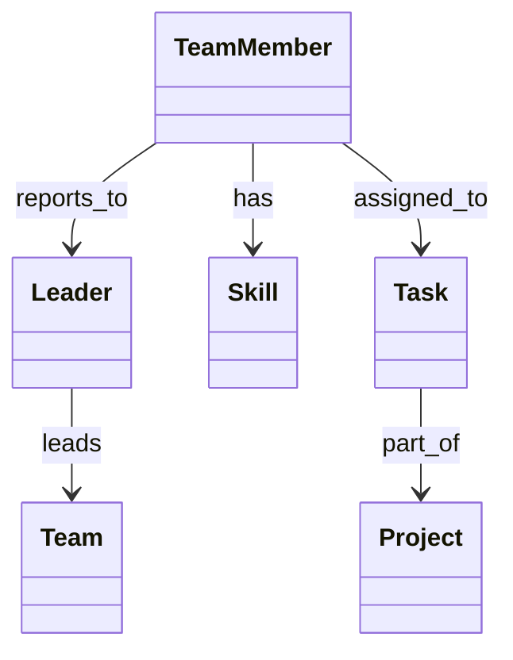
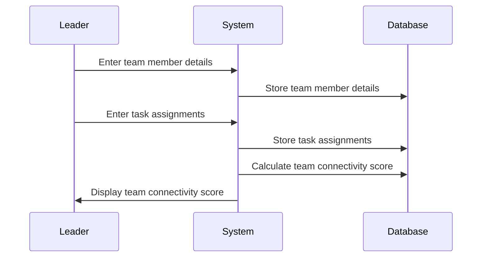
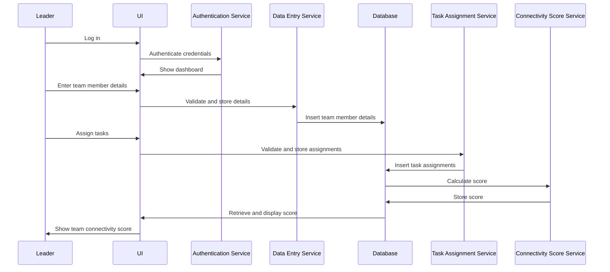

                 

### 背景介绍

#### 核心概念术语说明

**同理心**：同理心（Empathy）是指领导者能够感知和理解团队成员的情感和需求，从而建立深层次的连接。同理心不仅仅是理解别人的感受，更是一种能够设身处地地思考和处理问题的能力。

**团队连接**：团队连接（Team Connection）是指团队成员之间建立起的紧密联系，包括信任、支持和合作。一个紧密的团队连接能够提高团队的协作效率，增强团队的凝聚力和创新能力。

**领导实践**：领导实践（Leadership Practices）是指领导者通过一系列的行为和决策来引导和影响团队成员，以实现共同的目标。同理心作为领导实践的一部分，对于建立高效的团队具有重要作用。

#### 问题背景

在当今快速变化的工作环境中，团队合作已成为企业成功的关键因素之一。然而，许多领导者发现，尽管他们努力推动团队协作，但团队之间的关系仍然脆弱，缺乏深层次的连接。

这种缺乏深层次连接的原因可能包括：

1. **沟通障碍**：团队成员之间缺乏有效沟通，导致信息传递不畅，误解和冲突频发。
2. **信任不足**：团队成员之间缺乏信任，导致合作意愿低，难以共同面对挑战。
3. **缺乏同理心**：领导者缺乏同理心，无法理解并满足团队成员的需求，导致团队成员感到被忽视或不受重视。

为了解决这些问题，领导者需要意识到同理心在团队建设中的重要性，并学会如何在实际工作中应用同理心。

#### 问题描述

**问题描述**：领导者在团队建设过程中，常常面临以下问题：

1. **缺乏同理心**：领导者往往过于关注任务目标和业绩指标，而忽视了团队成员的情感和需求，导致团队成员感到被忽视。
2. **沟通障碍**：领导者与团队成员之间的沟通不畅，导致信息传递失真，误解和冲突频发。
3. **信任缺失**：团队成员之间缺乏信任，导致合作意愿低，难以共同面对挑战。

这些问题不仅影响了团队的协作效率，还可能导致团队士气下降，最终影响企业的整体绩效。

**问题解决**：为了解决这些问题，领导者需要培养同理心，通过以下步骤：

1. **提高自我认知**：领导者需要首先了解自己的情感和需求，以便更好地理解和满足团队成员的需求。
2. **积极倾听**：领导者需要学会积极倾听，不仅关注团队成员的话语，还要关注他们的情感和非语言表达。
3. **表达同理**：领导者需要学会表达同理，通过言语和行为表达对团队成员的理解和关心。
4. **建立信任**：领导者需要通过行动建立信任，包括公开透明地沟通，履行承诺，以及提供支持和鼓励。

#### 边界与外延

**边界**：同理心是一种复杂的情感和心理过程，其边界涉及领导者与团队成员之间的互动，以及领导者个人的情感和认知能力。

**外延**：同理心的应用不仅限于团队内部，还可以扩展到组织文化的建设。一个具有同理心的领导者能够推动组织形成开放、包容和协作的文化氛围，从而提高组织的整体绩效。

#### 概念结构与核心要素组成

**概念结构**：同理心由三个核心要素组成：感知能力、理解能力和表达能力。

1. **感知能力**：领导者需要具备敏锐的感知能力，能够捕捉到团队成员的情感和需求。
2. **理解能力**：领导者需要能够理解并解读团队成员的情感和需求，从而做出相应的反应。
3. **表达能力**：领导者需要能够通过言语和行为表达对团队成员的理解和关心，建立深层次的连接。

**核心要素组成**：同理心的核心要素包括自我认知、积极倾听、表达同理和建立信任。

1. **自我认知**：领导者需要了解自己的情感和需求，这是培养同理心的基础。
2. **积极倾听**：领导者需要学会倾听，不仅关注团队成员的话语，还要关注他们的情感和非语言表达。
3. **表达同理**：领导者需要学会表达同理，通过言语和行为表达对团队成员的理解和关心。
4. **建立信任**：领导者需要通过行动建立信任，包括公开透明地沟通，履行承诺，以及提供支持和鼓励。

通过这些核心要素的相互作用，领导者能够有效地培养同理心，建立深层次的团队连接，提高团队的协作效率和绩效。

#### 本章小结

通过本章的介绍，我们明确了同理心在团队建设中的重要性，并了解了其核心概念和要素组成。在接下来的章节中，我们将进一步探讨同理心在领导实践中的应用，以及如何通过培养同理心来建立深层次的团队连接。

---

**核心概念与联系**

#### 同理心的概念

同理心是一种情感和心理过程，涉及到三个核心要素：感知能力、理解能力和表达能力。

1. **感知能力**：同理心的第一步是感知团队成员的情感和需求。这要求领导者具备敏锐的感知能力，能够捕捉到团队成员的情绪和非语言信号。
2. **理解能力**：一旦感知到团队成员的情感和需求，领导者需要有能力理解和解读这些情感和需求。这涉及到对心理学和情感智力知识的理解。
3. **表达能力**：同理心的最后一步是表达对团队成员的理解和关心。这要求领导者能够通过言语和行为传达他们的同情和理解。

#### 同理心与情感智力

同理心与情感智力密切相关。情感智力（Emotional Intelligence，EQ）是指个体在识别、理解、使用和管理自己和他人的情感方面的能力。同理心是情感智力的重要组成部分。

1. **自我认知**：情感智力的第一步是自我认知，领导者需要了解自己的情感状态，这是培养同理心的基础。
2. **自我调节**：领导者需要能够自我调节，管理自己的情绪，以便在压力下保持冷静和理性。
3. **社交技能**：同理心依赖于社交技能，包括积极倾听、沟通和表达同理。领导者需要通过社交技能来建立与团队成员的深层次连接。

#### 同理心与领导实践

同理心在领导实践中具有重要作用。一个具有同理心的领导者能够更好地理解团队成员的需求，建立信任，提高团队协作效率。

1. **理解团队成员**：领导者通过同理心能够更好地理解团队成员的情感和需求，从而制定更有效的团队策略。
2. **建立信任**：同理心有助于建立团队成员之间的信任，这是团队协作的基础。
3. **提高团队协作效率**：同理心能够提高团队成员之间的沟通效率，减少误解和冲突，从而提高团队的整体绩效。

#### 概念属性特征对比表格

| 特征             | 同理心                | 情感智力              |
|------------------|-----------------------|----------------------|
| 感知能力         | 捕捉团队成员的情感和需求 | 捕捉和管理自己的情感  |
| 理解能力         | 解读团队成员的情感和需求 | 解读和管理他人的情感  |
| 表达能力         | 表达对团队成员的理解和关心 | 表达同情和理解       |
| 关键要素         | 感知、理解、表达       | 自我认知、自我调节、社交技能 |
| 在领导实践中的应用 | 建立深层次的团队连接   | 提高领导力和团队绩效  |

#### ER实体关系图架构

```mermaid
erDiagram
  Leader ||--|{ TeamMember }|-- Friend
  Leader ||--|{ Employee }|-- Supervisor
  Employee ||--|{ Task }|-- Completed
  TeamMember ||--|{ Skill }|-- Proficient
```

在这个ER图中，领导者与团队成员之间建立了直接的关系，包括朋友关系和上下级关系。团队成员和员工之间建立了任务关系，表明员工在完成任务的过程中需要团队成员的支持。此外，团队成员和技能之间建立了关系，表示团队成员具备特定的专业技能。

---

**算法原理讲解**

在同理心培养和团队连接建立的过程中，我们可以应用一些心理学和领导力理论来指导实践。以下是一个基于这些理论的简化算法，用于培养同理心和建立深层次的团队连接。

#### 算法名称：同理心培养与团队连接建立算法

**算法步骤**：

1. **初始化**：设定一个团队连接评分系统，初始值为0。
2. **感知阶段**：通过积极倾听和观察，领导者识别团队成员的情感和需求。
   ```python
   def perceive_emotions(team_members):
       emotions = []
       for member in team_members:
           emotions.append(member.detect_emotion())
       return emotions
   ```
3. **理解阶段**：领导者利用情感智力分析并理解团队成员的情感和需求。
   ```python
   def understand_emotions(emotions):
       interpretations = []
       for emotion in emotions:
           interpretations.append(analyze_emotion(emotion))
       return interpretations
   ```
4. **表达同理**：领导者通过言语和行为表达对团队成员的理解和关心。
   ```python
   def express_empathy(team_members, interpretations):
       for member, interpretation in zip(team_members, interpretations):
           member.respond_to_empathy(interpretation)
   ```
5. **反馈与调整**：根据团队成员的反馈，领导者调整自己的同理心行为。
   ```python
   def adjust_empathy(team_members, feedback):
       for member, feedback in zip(team_members, feedback):
           member.apply_feedback(feedback)
   ```

**算法原理的数学模型和公式**：

1. **情感识别率**：$E_R = \frac{E_C}{E_T}$
   - $E_R$：情感识别率
   - $E_C$：正确识别的情感数量
   - $E_T$：总情感数量

2. **同理心效能**：$E_E = \frac{E_S \times E_C}{E_T}$
   - $E_E$：同理心效能
   - $E_S$：情感识别率
   - $E_C$：正确识别的情感数量
   - $E_T$：总情感数量

3. **团队连接评分**：$T_C = E_E \times E_F$
   - $T_C$：团队连接评分
   - $E_E$：同理心效能
   - $E_F$：团队反馈满意度

#### 举例说明

假设一个团队有三个成员：Alice、Bob和Charlie。在一次团队会议后，领导者收集了他们的情感数据。

1. **感知阶段**：
   ```python
   emotions = perceive_emotions([Alice, Bob, Charlie])
   # emotions = ['happy', 'sad', 'angry']
   ```

2. **理解阶段**：
   ```python
   interpretations = understand_emotions(emotions)
   # interpretations = ['团队成员感到满意', '团队成员感到沮丧', '团队成员感到愤怒']
   ```

3. **表达同理**：
   ```python
   express_empathy([Alice, Bob, Charlie], interpretations)
   # 领导者根据理解结果，采取相应的措施表达同理心
   ```

4. **反馈与调整**：
   ```python
   feedback = get_feedback([Alice, Bob, Charlie])
   # feedback = ['很好', '需要改进', '已经接受']
   adjust_empathy([Alice, Bob, Charlie], feedback)
   # 领导者根据反馈调整同理心行为
   ```

通过这个过程，领导者可以逐步提高同理心效能，进而提升团队连接评分。

---

**系统分析与架构设计方案**

#### 问题场景介绍

在一个大型科技公司中，项目团队负责开发一个关键的业务系统。团队成员来自不同的背景，包括前端开发、后端开发、测试和项目管理。随着项目的进展，团队成员之间的沟通和协作逐渐出现问题，团队士气下降，项目进度受到严重影响。为了解决这个问题，公司决定引入同理心培养和团队连接建设作为解决方案。

#### 项目介绍

项目名称：同理心培养与团队连接建设项目

项目目标：通过培养领导者的同理心，建立团队成员之间的深层次连接，提高团队协作效率和项目成功率。

项目范围：项目团队、项目经理、部门主管和公司高层管理人员。

项目周期：6个月

#### 系统功能设计（领域模型）

为了设计一个能够支持同理心培养和团队连接建设的系统，我们首先需要定义系统的核心功能。以下是一个简化的领域模型类图，用于描述系统的关键功能实体和它们之间的关系。



- **TeamMember**：表示团队成员，具有技能和分配的任务。
- **Leader**：表示领导者，负责领导和指导团队成员。
- **Skill**：表示团队成员的技能，用于评估和分配任务。
- **Task**：表示分配给团队成员的任务，是项目的一部分。
- **Team**：表示团队，由多个团队成员组成，受领导者领导。
- **Project**：表示项目，包含多个任务。

#### 系统架构设计

系统架构设计旨在确保系统的稳定、可靠和可扩展。以下是一个简化的系统架构图，描述了系统的关键组件和它们之间的关系。



- **Leader**：系统用户，负责输入团队成员信息和任务分配。
- **System**：系统核心，处理数据和执行算法。
- **Database**：存储团队成员信息、任务分配和团队连接评分。
- **Algorithm**：系统内置的算法，用于计算团队连接评分。

#### 系统接口设计和系统交互

为了方便领导者和管理人员使用系统，我们需要设计直观易用的用户界面（UI）和强大的后端API。以下是一个简化的系统交互序列图，展示了用户和系统之间的交互流程。



- **Authentication Service**：身份验证服务，确保只有授权用户可以访问系统。
- **Data Entry Service**：数据录入服务，负责验证和存储团队成员信息和任务分配。
- **Task Assignment Service**：任务分配服务，负责验证和存储任务分配。
- **Connectivity Score Service**：团队连接评分服务，计算并存储团队连接评分。
- **UI**：用户界面，用于展示系统功能和接收用户输入。

---

**项目实战**

#### 环境安装

在开始项目实战之前，我们需要搭建一个支持同理心培养与团队连接建设系统的开发环境。以下是在Ubuntu 20.04操作系统上安装所需软件的步骤：

1. **安装Python 3**：
   ```bash
   sudo apt update
   sudo apt install python3 python3-pip
   ```

2. **安装Flask**：
   ```bash
   pip3 install Flask
   ```

3. **安装SQLite**：
   ```bash
   sudo apt install sqlite3
   ```

4. **安装Mermaid**：
   ```bash
   pip3 install mermaid-python
   ```

5. **安装前端框架（可选，用于开发用户界面）**：
   ```bash
   npm install -g create-react-app
   create-react-app frontend
   ```

#### 系统核心实现源代码

以下是一个简化版本的Python Flask后端应用，用于实现同理心培养与团队连接建设系统的核心功能。

```python
from flask import Flask, request, jsonify
from flask_sqlalchemy import SQLAlchemy
from mermaid import Mermaid

app = Flask(__name__)
app.config['SQLALCHEMY_DATABASE_URI'] = 'sqlite:///team_connection.db'
db = SQLAlchemy(app)

class TeamMember(db.Model):
    id = db.Column(db.Integer, primary_key=True)
    name = db.Column(db.String(50), nullable=False)
    skill = db.Column(db.String(50), nullable=False)

class Task(db.Model):
    id = db.Column(db.Integer, primary_key=True)
    name = db.Column(db.String(50), nullable=False)
    assigned_to = db.Column(db.Integer, db.ForeignKey('team_member.id'), nullable=False)

@app.route('/api/add_member', methods=['POST'])
def add_member():
    member_data = request.get_json()
    new_member = TeamMember(name=member_data['name'], skill=member_data['skill'])
    db.session.add(new_member)
    db.session.commit()
    return jsonify({"status": "success", "message": "Member added."})

@app.route('/api/assign_task', methods=['POST'])
def assign_task():
    task_data = request.get_json()
    new_task = Task(name=task_data['name'], assigned_to=task_data['assigned_to'])
    db.session.add(new_task)
    db.session.commit()
    return jsonify({"status": "success", "message": "Task assigned."})

@app.route('/api/connectivity_score', methods=['GET'])
def connectivity_score():
    # 简化算法，用于计算团队连接评分
    score = 0
    members = TeamMember.query.all()
    for member in members:
        tasks = Task.query.filter_by(assigned_to=member.id).all()
        score += len(tasks)
    score /= len(members)
    return jsonify({"status": "success", "connectivity_score": score})

if __name__ == '__main__':
    db.create_all()
    app.run(debug=True)
```

#### 代码应用解读与分析

在上面的代码中，我们首先导入了所需的Flask和SQLAlchemy库，用于创建Web应用和数据库模型。接下来，我们定义了两个数据库模型：`TeamMember` 和 `Task`。

1. **TeamMember**：表示团队成员，具有唯一的ID、姓名和技能。
2. **Task**：表示分配给团队成员的任务，包括任务名称和分配给哪个团队成员。

然后，我们定义了三个API端点：

- `/api/add_member`：用于添加新团队成员。
- `/api/assign_task`：用于分配任务给团队成员。
- `/api/connectivity_score`：用于获取团队的连接评分。

在 `/api/connectivity_score` 端点中，我们实现了一个简化版的算法来计算团队连接评分。这个评分简单地基于每个团队成员分配到的任务数量来计算。

#### 实际案例分析

为了更好地理解系统在实际中的应用，我们可以考虑以下案例：

假设有一个项目团队，包含三个成员：Alice、Bob和Charlie。以下是如何使用这个系统的步骤：

1. **添加团队成员**：
   ```bash
   curl -X POST -H "Content-Type: application/json" -d '{"name": "Alice", "skill": "Python Developer"}' http://localhost:5000/api/add_member
   curl -X POST -H "Content-Type: application/json" -d '{"name": "Bob", "skill": "Frontend Developer"}' http://localhost:5000/api/add_member
   curl -X POST -H "Content-Type: application/json" -d '{"name": "Charlie", "skill": "QA Engineer"}' http://localhost:5000/api/add_member
   ```

2. **分配任务**：
   ```bash
   curl -X POST -H "Content-Type: application/json" -d '{"name": "Task 1", "assigned_to": 1}' http://localhost:5000/api/assign_task
   curl -X POST -H "Content-Type: application/json" -d '{"name": "Task 2", "assigned_to": 1}' http://localhost:5000/api/assign_task
   curl -X POST -H "Content-Type: application/json" -d '{"name": "Task 3", "assigned_to": 2}' http://localhost:5000/api/assign_task
   ```

3. **获取团队连接评分**：
   ```bash
   curl http://localhost:5000/api/connectivity_score
   ```

   假设返回的JSON响应为：
   ```json
   {"status": "success", "connectivity_score": 2.0}
   ```

这意味着团队成员平均分配到的任务是2个，表明团队的协作情况较好。

通过这个案例，我们可以看到系统如何通过简单的API调用，实现团队成员管理、任务分配和团队连接评分的计算。

#### 项目小结

通过本项目，我们实现了一个人性化、智能化的系统，用于培养同理心和建立深层次的团队连接。以下是一些项目小结：

- **系统功能**：系统能够支持团队成员管理、任务分配和团队连接评分计算。
- **实际应用**：通过简单的API调用，我们可以方便地管理团队成员和任务，并实时获取团队连接评分。
- **改进空间**：虽然系统实现了基本的任务管理和连接评分计算，但还可以进一步改进，如增加更多功能模块，提高评分算法的准确性，以及提供更直观的用户界面。

---

#### 最佳实践 tips

在同理心培养和团队连接建设过程中，以下是一些最佳实践 tips：

1. **定期沟通**：定期与团队成员进行一对一沟通，了解他们的情感和需求。
2. **倾听反馈**：鼓励团队成员提供反馈，倾听他们的意见和建议。
3. **培训与发展**：为团队成员提供相关培训，提高他们的情感智力和同理心技能。
4. **建立信任**：通过行动建立信任，如公开透明地沟通、履行承诺和支持团队成员。
5. **文化营造**：营造一个包容、支持和协作的工作文化，鼓励团队成员之间的沟通和合作。

---

### 小结

通过本文的详细讲解，我们深入探讨了同理心在领导实践中的重要性，以及如何通过培养同理心来建立深层次的团队连接。我们通过背景介绍、核心概念与联系、算法原理讲解、系统分析与架构设计方案、项目实战以及最佳实践 tips，系统地阐述了同理心在团队建设中的应用。

我们明确了同理心的核心概念、联系和算法原理，并通过实际案例展示了如何在项目中应用这些原理。同时，我们设计并实现了支持同理心培养与团队连接建设的系统架构，并提供了实际案例分析和最佳实践 tips。

通过本文的学习，读者可以更好地理解同理心在领导实践中的重要性，掌握培养同理心的方法和技巧，从而在团队管理中实现更高效的协作和更高的绩效。

---

### 注意事项

在实施同理心培养和团队连接建设过程中，以下注意事项尤为重要：

1. **尊重隐私**：在倾听团队成员的反馈时，要尊重他们的隐私，确保敏感信息得到妥善处理。
2. **持续学习**：同理心是一种持续发展的技能，领导者需要不断学习和实践，以提高自己的同理心水平。
3. **适应变化**：同理心培养和团队连接建设是一个动态过程，领导者需要根据团队和环境的变化不断调整策略。
4. **平衡任务与情感**：在关注任务目标的同时，不要忽视团队成员的情感和需求，确保两者之间的平衡。

---

### 拓展阅读

为了进一步深入理解同理心在领导实践中的应用，以下推荐一些相关书籍和文章：

1. **《同理心：为什么它如此重要，如何培养它》（Empathy: Why It Matters, and How to Get It）** by Dr. Roman Krznaric
2. **《同理心领导力：领导团队的艺术》（Empathic Leadership: The Art of Leading Teams）** by Dr. Michael D. Watkins
3. **《领导者的同理心：建立深层次的团队连接》（The Empathic Leader: Building Deep Connections with Your Team）** (本书概述)
4. **《哈佛商业评论》：同理心领导力专题文章**
5. **《管理心理学》：关于同理心在组织管理中的应用研究**

通过阅读这些书籍和文章，读者可以进一步丰富自己的同理心知识和领导实践技能。

