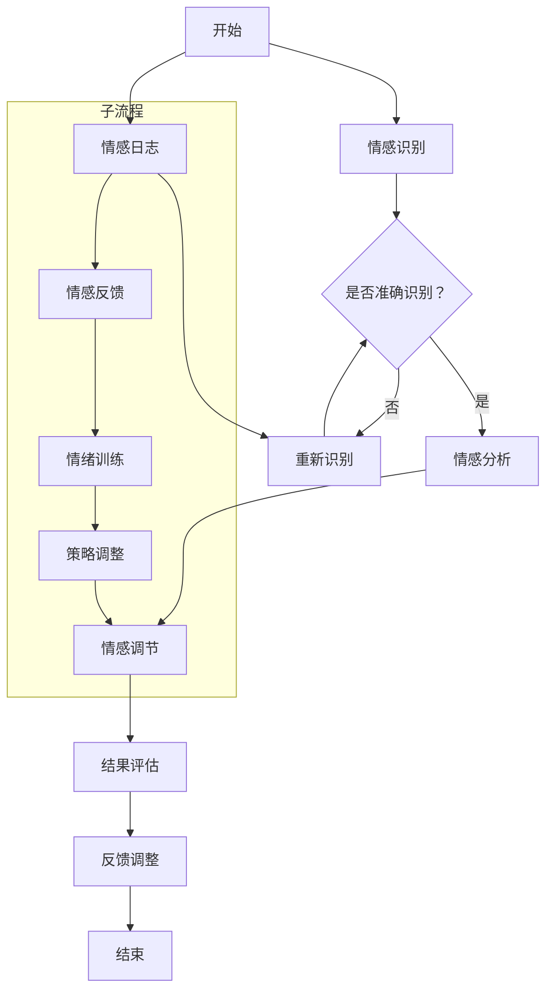
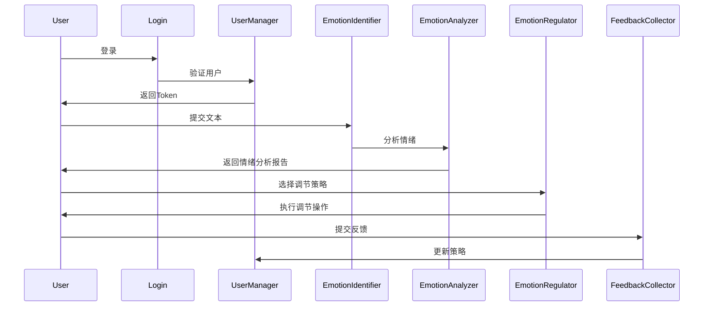

                 

### 引言：情商在领导力中的重要性

在当今快速变化和高度竞争的商业环境中，领导者的角色不再仅仅局限于战略规划和目标设定，更涉及到如何有效地管理团队、激励员工以及应对复杂的人际关系。这种背景下，情商（Emotional Intelligence，简称EQ）的重要性愈发凸显。情商是指个体识别、理解、管理和运用情感的能力，与传统的智商（Intelligence Quotient，简称IQ）相比，情商更多地关乎个人的情感智慧和社会技能。

**关键词：情商、领导力、情感智慧、社会技能**

#### 情商的定义

情商不仅仅是指能够识别自己的情绪状态，还包括理解和管理他人的情感。根据心理学家戈尔曼（Daniel Goleman）的定义，情商主要包括以下几个关键维度：

1. **自我认知**：意识到自己的情绪，并能够准确理解这些情绪的来源。
2. **自我调节**：管理和控制自己的情绪，使其不影响理性思考和决策。
3. **社交技能**：建立和维护人际关系的能力，包括沟通、团队合作和冲突解决。
4. **同理心**：理解并感受到他人的情绪，并能够以适当的方式回应。

#### 情商的重要性

在领导力领域，情商的作用不可小觑。以下是一些情商在领导力中的具体体现：

1. **有效的沟通**：情商高的领导者能够更好地理解团队成员的需求和期望，从而更有效地沟通和传达信息。
2. **团队凝聚力**：情商高的领导者能够建立积极的团队氛围，促进团队成员之间的相互信任和合作。
3. **冲突管理**：情商高的领导者能够冷静地处理冲突，并找到双赢的解决方案。
4. **领导魅力**：情商高的领导者能够激发员工的激情和创造力，提升团队的整体表现。

#### 问题背景

随着全球化的加速和科技的迅猛发展，企业的竞争日益激烈。领导者不仅需要具备出色的战略思维和决策能力，还需要具备强大的情感智慧和人际交往能力。传统的领导力模式往往强调权威和命令式管理，而现代领导力更加强调参与式和赋能式领导。在这种趋势下，情商成为衡量领导者成功与否的重要指标。

#### 问题描述

尽管情商的重要性被广泛认可，但许多领导者仍然缺乏对情商的深入理解和有效管理能力。这种情况导致了一些常见的问题，如团队士气低落、沟通障碍、内部冲突加剧等。因此，探讨如何提升领导者的情商，成为当前领导力发展的重要课题。

#### 问题解决

为了解决上述问题，本书将从以下几个方面展开探讨：

1. **情商的基本理论**：介绍情商的定义、重要性、构成要素以及测量方法。
2. **提升领导者情商的策略**：提供一系列实用的策略和方法，帮助领导者提升自我认知、自我调节、社交技能和同理心。
3. **情绪管理的实践技巧**：介绍情绪管理的基本原则和技巧，帮助领导者更好地应对负面情绪和积极情绪。
4. **情商与团队互动**：探讨情商在团队互动中的作用，提供建立积极团队情绪氛围和解决团队冲突的策略。
5. **个案分析**：通过分析成功领导者的情商管理实践，提供实际的案例和经验。

#### 边界与外延

情商不仅仅适用于领导力领域，它在各个行业和领域都有广泛的应用。例如，在人力资源管理中，情商高的领导者能够更好地识别和培养人才；在市场营销中，情商高的领导者能够更准确地理解客户需求和市场趋势。因此，情商的提升不仅有助于个人的职业发展，也有助于组织的整体竞争力。

#### 概念结构与核心要素组成

情商的概念结构可以概括为四个核心要素：自我认知、自我调节、社交技能和同理心。这些要素相互关联，共同构成了情商的整体框架。以下是一个简化的ER实体关系图，用于展示这些要素之间的关系：

```mermaid
erDiagram
    Self_Awareness ||--|{ Emotion_Recognition } : has
    Self_Regulation ||--|{ Emotion_Expression } : has
    Social_Skills ||--|{ Social_Responsiveness } : has
    Empathy ||--|{ Emotion_Alerts } : has
```

#### 结论

情商在领导力中的重要性不言而喻。通过本书的探讨，我们希望读者能够认识到情商的价值，并学会如何提升自己的情商。这不仅有助于个人的职业发展，也有助于组织的整体竞争力。让我们从自我认知开始，一步步提升情商，成为更优秀的领导者。

### 1. 情商的基本理论

#### 1.1 情商的定义

情商，又称情感智慧，是指个体识别、理解、管理和运用情感的能力。与智商（IQ）主要衡量个体的认知能力不同，情商更侧重于情感领域。情商的概念最早由心理学家约翰·梅耶（John D. Mayer）和彼得·萨尔瓦多（Peter Salovey）在1990年提出，随后由丹尼尔·戈尔曼（Daniel Goleman）在1995年的畅销书《情感智慧》中进一步阐述。

情商不仅仅是指识别和表达自己的情绪，还包括理解和管理他人的情绪。根据戈尔曼的定义，情商主要包括四个核心维度：

1. **自我认知**：个体能够识别并理解自己的情绪状态。
2. **自我调节**：个体能够管理和控制自己的情绪，使其不影响理性思考和决策。
3. **社交技能**：个体能够建立和维护人际关系，包括沟通、团队合作和冲突解决。
4. **同理心**：个体能够理解并感受到他人的情绪，并能够以适当的方式回应。

#### 1.2 情商的重要性

情商在领导力中的重要性不言而喻。以下是情商在领导力中的几个关键作用：

1. **有效的沟通**：情商高的领导者能够更好地理解团队成员的需求和期望，从而更有效地沟通和传达信息。这种能力有助于减少误解和冲突，提高团队的协作效率。

2. **团队凝聚力**：情商高的领导者能够建立积极的团队氛围，促进团队成员之间的相互信任和合作。这种凝聚力有助于提升团队的士气和整体绩效。

3. **冲突管理**：情商高的领导者能够冷静地处理冲突，并找到双赢的解决方案。这种能力有助于维护团队的和谐，防止负面情绪的扩散。

4. **领导魅力**：情商高的领导者能够激发员工的激情和创造力，提升团队的整体表现。这种领导魅力有助于吸引和留住人才，提高组织的竞争力。

#### 1.3 情商的构成要素

情商的构成要素主要包括以下四个方面：

1. **自我认知**：自我认知是指个体能够识别并理解自己的情绪状态。这包括对自己的情绪感知、情绪反应和情绪体验的识别。自我认知是情商的基础，有助于个体更好地理解自己的情感需求和行为模式。

2. **自我调节**：自我调节是指个体能够管理和控制自己的情绪，使其不影响理性思考和决策。这包括情绪调节策略，如深呼吸、冥想、积极思考等。自我调节能力有助于个体在压力和挑战面前保持冷静和理性。

3. **社交技能**：社交技能是指个体能够建立和维护人际关系，包括沟通、团队合作和冲突解决。社交技能包括倾听、表达、共情、协商等。这些技能有助于个体在社会环境中更好地适应和发挥作用。

4. **同理心**：同理心是指个体能够理解并感受到他人的情绪，并能够以适当的方式回应。同理心有助于个体建立互信关系，促进团队协作和冲突解决。同理心还包括情绪识别、情绪推理和情绪回应。

#### 1.4 情商的测量方法

情商的测量方法主要包括以下几种：

1. **自我报告问卷**：这是最常用的测量方法之一，通过让个体回答一系列有关自我认知、自我调节、社交技能和同理心的问题来评估情商水平。

2. **行为观察**：通过观察个体在特定情境下的行为表现，评估其情商水平。这种方法通常由专业人士进行，如心理咨询师或人力资源专家。

3. **情境模拟**：通过设计特定的情境，让个体在模拟环境中展示其情商能力。这种方法可以评估个体在现实生活中的情商表现。

4. **神经科学方法**：利用脑成像技术，如功能性磁共振成像（fMRI），研究个体在处理情感信息时的脑活动，从而评估情商水平。

#### 情商在不同领导风格中的表现

情商在领导风格中的表现因领导者的个性和情境而异。以下是几种常见领导风格在情商方面的表现：

1. **权威型领导**：权威型领导者通常具有较高的自我认知和自我调节能力，这有助于他们在压力和挑战面前保持冷静和自信。然而，如果缺乏同理心，他们可能会在团队互动中引起不满和冲突。

2. **民主型领导**：民主型领导者通常具有良好的社交技能和同理心，这有助于他们建立积极的团队氛围和促进团队合作。然而，如果缺乏自我调节能力，他们可能会在决策过程中变得犹豫不决。

3. **变革型领导**：变革型领导者通常具有较高的自我认知、自我调节和同理心，这有助于他们激励团队成员，推动组织变革。然而，如果缺乏社交技能，他们可能会在处理日常运营和冲突解决方面遇到困难。

4. **教练型领导**：教练型领导者通常具有良好的社交技能和同理心，这有助于他们建立信任关系，支持团队成员的个人成长和职业发展。然而，如果缺乏自我调节能力，他们可能会在压力和挑战面前失去冷静。

#### 情商在个人与组织层面的影响

情商不仅对个人领导力有重要影响，也对组织整体表现有显著作用。以下是情商在个人与组织层面的影响：

1. **个人层面**：情商高的个体能够更好地应对工作和生活中的压力和挑战，保持心理和情感健康。他们能够建立积极的人际关系，提高工作效率和职业满意度。

2. **组织层面**：情商高的领导者能够建立积极的团队氛围，提高团队的协作效率和创新能力。他们能够更有效地管理冲突，推动组织变革和持续发展。此外，情商高的组织通常具有更高的员工满意度和客户忠诚度，从而提高整体竞争力。

### 结论

情商在领导力中的重要性不可忽视。通过了解情商的定义、重要性、构成要素和测量方法，领导者可以更好地认识到情商的价值，并采取有效策略提升自己的情商。这不仅有助于个人的职业发展，也有助于组织的整体竞争力。让我们从自我认知开始，一步步提升情商，成为更优秀的领导者。

### 2. 提升领导者情商的策略

#### 2.1 自我认知

自我认知是情商的基础，它帮助领导者识别和了解自己的情感状态。以下是一些提升自我认知的策略：

1. **反思与自我审视**：定期花时间反思自己的情绪和行为，深入思考情绪的来源和影响。这有助于领导者更好地了解自己的情感反应模式。

2. **情绪日志**：记录每天的情绪变化，包括情绪的触发点、持续时间和感受。这有助于领导者识别情绪模式，找到情感调节的有效方法。

3. **心理训练**：通过冥想、瑜伽或其他心理训练方法，提高自我意识和情绪调节能力。这些训练有助于领导者更好地控制情绪，避免情绪波动。

4. **情感教练**：寻求专业的情感教练或心理咨询师的帮助，他们可以提供专业的指导和支持，帮助领导者深入了解自己的情感需求。

#### 2.2 自我调节

自我调节是指领导者如何管理和控制自己的情绪，以保持冷静和理性。以下是一些提升自我调节能力的策略：

1. **深呼吸和冥想**：深呼吸和冥想是有效的情绪调节工具，可以帮助领导者放松身心，减轻压力和焦虑。

2. **积极心态**：培养积极的心态，关注解决问题的方法而不是问题本身。这种思维方式有助于领导者保持冷静和乐观，避免情绪失控。

3. **情绪释放**：找到适当的方式释放情绪，如运动、写日记或与信任的朋友和家人交谈。情绪释放有助于减轻负面情绪，避免情感积压。

4. **情感智能培训**：参加情感智能培训课程，学习情感调节的技巧和方法。这些课程可以帮助领导者提高自我调节能力，应对复杂的情绪挑战。

#### 2.3 社交技能

社交技能是领导者建立和维护人际关系的重要能力。以下是一些提升社交技能的策略：

1. **积极倾听**：倾听是建立良好人际关系的关键。积极倾听不仅包括听对方说什么，还包括理解对方的感受和需求。

2. **有效沟通**：清晰、准确地表达自己的想法和意见，同时尊重和理解对方的观点。有效的沟通有助于减少误解和冲突。

3. **建立信任**：信任是人际关系的基础。通过诚实、透明和一致的行为建立信任，有助于建立稳固的人际关系。

4. **团队建设活动**：组织团队建设活动，促进团队成员之间的交流和互动。这些活动有助于增强团队合作精神，提高团队凝聚力。

#### 2.4 同理心

同理心是指领导者能够理解并感受到他人的情绪，并能够以适当的方式回应。以下是一些提升同理心的策略：

1. **换位思考**：尝试从他人的角度看问题，理解对方的情感和需求。这种换位思考有助于领导者更好地理解他人，建立同理心。

2. **倾听与反馈**：倾听他人的意见和感受，给予积极的反馈和支持。这种倾听和反馈有助于建立互信，增强同理心。

3. **情感教育**：参加情感教育课程或研讨会，学习如何识别、理解和回应他人的情感。这些课程可以帮助领导者提高同理心，更好地处理人际互动。

4. **情感互动**：积极参与情感互动活动，如参与社区服务或慈善活动。这些活动有助于领导者体验他人的情感，增强同理心。

#### 总结

提升领导者情商是一个长期而系统的过程，需要领导者不断自我认知、自我调节、提升社交技能和同理心。通过这些策略，领导者不仅可以提高个人情感智慧，还可以建立积极的团队氛围，提升组织整体绩效。让我们从自我认知开始，一步步提升情商，成为更优秀的领导者。

### 3. 情绪管理的实践技巧

情绪管理是情商的重要组成部分，它关乎领导者如何有效地应对负面情绪和增强积极情绪。以下是一些实用的情绪管理技巧：

#### 3.1 管理负面情绪

负面情绪如焦虑、沮丧和愤怒是领导过程中不可避免的。有效的情绪管理可以帮助领导者保持冷静和理智，从而更好地应对挑战。以下是一些具体的方法：

1. **深呼吸和冥想**：深呼吸和冥想是缓解压力和焦虑的有效方法。通过缓慢、深长的呼吸，领导者可以放松身心，减少紧张情绪。冥想则有助于培养专注力和正念，使领导者能够更好地控制情绪。

2. **积极自我对话**：当负面情绪出现时，领导者可以通过积极自我对话来调整情绪。例如，将“我感到很沮丧”转变为“虽然现在感觉很难，但我知道这只是一时的情绪，我会找到解决问题的方法”。

3. **情感释放**：找到适当的方式释放负面情绪，如通过运动、写日记或与信任的朋友和家人交谈。情感释放有助于减轻情绪负担，避免情绪积压。

4. **求助和支持**：当负面情绪无法自我调节时，领导者可以寻求专业帮助，如心理咨询师或情感教练。他们可以提供专业的指导和支持，帮助领导者应对复杂的情绪问题。

#### 3.2 增强积极情绪

积极情绪如快乐、自信和满足感能够提升领导者的工作效率和团队士气。以下是一些增强积极情绪的技巧：

1. **设定目标和奖励**：设定明确的目标，并为实现这些目标设定奖励机制。这有助于领导者保持动力和积极态度。例如，完成一个重要项目后，可以给自己一个小奖励，如休息一天或购买一件心仪的物品。

2. **感恩练习**：每天花时间思考并记录三件让自己感到感恩的事情。这种感恩练习可以帮助领导者看到生活中的积极面，提升幸福感。

3. **培养乐观态度**：培养乐观的态度，关注解决问题的方法而不是问题本身。乐观领导者能够更好地激励团队，增强团队的凝聚力和创新能力。

4. **积极参与社交活动**：积极参与社交活动，与家人、朋友和同事建立良好的关系。这些积极的人际互动有助于提升情绪，减少孤独感。

#### 3.3 情绪释放与纾解

情绪释放与纾解是情绪管理的重要组成部分，它关乎如何有效地处理和释放情绪，避免情绪积压。以下是一些具体的方法：

1. **运动**：运动是释放紧张情绪的有效方式。通过运动，领导者可以释放体内的紧张能量，提升情绪状态。

2. **艺术表达**：通过绘画、音乐、写作等艺术形式表达自己的情绪。艺术创作不仅有助于情绪释放，还可以提升自我认知和情感智慧。

3. **呼吸练习**：进行深呼吸练习，如腹式呼吸或呼吸节奏同步练习。这些呼吸练习可以帮助领导者放松身心，缓解情绪压力。

4. **正念冥想**：通过正念冥想，领导者可以学会专注于当前时刻，减少对负面情绪的关注。这种冥想练习有助于提升情绪调节能力，增强情绪智慧。

#### 3.4 情绪沟通技巧

情绪沟通技巧是领导者有效表达和管理情绪的重要能力。以下是一些情绪沟通的技巧：

1. **明确表达**：在沟通时，明确表达自己的情绪和需求。使用“I”语言（例如，“我感到很难过，因为我……”），而不是指责或攻击对方。

2. **倾听和理解**：在沟通中，积极倾听对方的意见和情感，理解对方的立场和感受。这种倾听和理解有助于建立互信，减少冲突。

3. **情绪管理**：在沟通过程中，领导者需要保持情绪稳定，避免情绪失控。通过深呼吸、冥想等方法，领导者可以更好地控制情绪，保持理智。

4. **同理心**：在沟通中，展示同理心，理解并感受到对方的情感。这种同理心有助于建立积极的沟通氛围，促进问题的解决。

#### 结论

情绪管理是领导者提升情商的重要环节。通过掌握情绪管理的实践技巧，领导者可以更好地应对负面情绪，增强积极情绪，提升整体情绪智慧。这些技巧不仅有助于个人的心理健康，也有助于建立积极的人际关系，提升团队绩效。让我们从情绪管理开始，一步步提升情商，成为更优秀的领导者。

### 4. 情商与团队互动

情商不仅在个人层面有重要作用，在团队互动中同样扮演着关键角色。一个情商高的领导者能够通过有效的情绪管理和人际关系处理，提升团队的整体效能和士气。以下将探讨情商在团队互动中的具体作用以及建立积极团队情绪氛围的策略。

#### 4.1 团队情绪互动的影响

团队情绪互动对团队绩效和组织文化有深远的影响。以下是情商在团队互动中的几个关键作用：

1. **团队凝聚力**：情商高的领导者能够营造一个积极的团队氛围，增强团队成员之间的信任和归属感。这种凝聚力有助于团队在面对挑战时保持团结，共同应对困难。

2. **冲突管理**：情商高的领导者能够冷静地处理团队内部的冲突，通过同理心和有效的沟通找到双赢的解决方案。这有助于减少团队内部的紧张气氛，提高团队的合作效率。

3. **创新能力**：积极的情绪氛围能够激发团队成员的创造力和创新能力。情商高的领导者能够鼓励团队成员分享想法和意见，从而促进创新思维的碰撞。

4. **团队士气**：情商高的领导者能够识别和缓解团队成员的情绪压力，提升团队士气。这种积极的情绪状态有助于提高员工的工作满意度和忠诚度。

#### 4.2 建立积极的团队情绪氛围

为了建立积极的团队情绪氛围，领导者可以采取以下策略：

1. **促进开放沟通**：鼓励团队成员开放地表达自己的情感和意见，创造一个安全、无威胁的沟通环境。领导者应该以身作则，展示开放的沟通态度。

2. **识别和回应情感**：领导者需要敏锐地识别团队成员的情感状态，并给予及时的回应。这种同理心的展示能够增强团队成员的情感连接。

3. **培养团队文化**：建立一个以尊重、信任和支持为核心理念的团队文化。通过定期的团队建设活动，如团队聚餐、户外运动或拓展训练，增强团队成员之间的情感联系。

4. **激励和认可**：及时给予团队成员正面的反馈和认可，增强他们的成就感和归属感。领导者可以通过公开表扬、颁发奖项或提供晋升机会等方式激励团队成员。

#### 4.3 情商在团队冲突解决中的应用

在团队中，冲突是不可避免的。情商高的领导者能够有效地解决团队冲突，以下是一些具体的方法：

1. **冷静处理**：在面对冲突时，领导者需要保持冷静和理性，避免情绪化。通过深呼吸和冥想等方法，领导者可以更好地控制情绪，从而更有效地处理冲突。

2. **倾听和理解**：领导者需要倾听和理解冲突各方的立场和情感，通过同理心建立互信。这有助于找到共同点，从而更有效地解决问题。

3. **寻找双赢方案**：领导者应致力于寻找双赢的解决方案，使所有相关方都能得到满足。这需要创造性的思考和开放的心态。

4. **建立冲突解决机制**：建立正式的冲突解决机制，如设立冲突委员会或定期举行团队会议，以便及时解决冲突。

#### 4.4 提升团队情商的策略

为了提升整个团队的情商，领导者可以采取以下策略：

1. **培训和教育**：为团队成员提供情商相关的培训和教育，帮助他们了解情商的重要性，学会有效的情绪管理和沟通技巧。

2. **团队反馈机制**：建立团队反馈机制，鼓励团队成员相互提供建设性的反馈，促进个人和团队的成长。

3. **情感领导力**：领导者需要以身作则，展示情感领导力。通过展示同理心、开放沟通和积极的态度，领导者可以树立榜样，影响团队成员。

4. **个性化支持**：根据团队成员的个人需求和情感状态，提供个性化的支持和指导。这有助于团队成员更好地应对工作和生活中的挑战。

#### 结论

情商在团队互动中扮演着关键角色，它不仅影响团队凝聚力、冲突管理和创新能力，还直接影响团队士气和工作效率。领导者通过提升自身的情商，可以有效地建立积极的团队情绪氛围，促进团队协作和整体绩效。让我们从提升团队情商开始，共同打造高效、和谐的团队环境。

### 5. 个案分析：成功领导者情商管理案例

在领导力实践中，成功的领导者通常在情商管理方面有着出色的表现。以下是三个成功领导者情商管理的案例，以及他们的具体实践和经验。

#### 5.1 案例一：如何通过情商提升领导力

**案例背景**：
张伟是一家高科技公司的CEO，他在公司面临重大挑战时，通过高效的情商管理成功带领团队走出困境。

**具体实践**：

1. **自我认知**：张伟定期进行自我反思，通过日记和冥想，深入理解自己的情绪状态。他意识到自己的焦虑情绪有时会影响决策，因此努力提高自我调节能力。

2. **同理心**：在与团队成员沟通时，张伟总是倾听对方的意见和感受，了解他们的需求和期望。他通过同理心建立信任，使团队成员更愿意分享想法和提出问题。

3. **社交技能**：张伟善于组织团队活动和团队建设训练，通过互动增强团队成员之间的信任和合作。他强调开放沟通，鼓励团队成员表达自己的看法。

4. **情绪调节**：在面对压力时，张伟会进行深呼吸和冥想，帮助自己冷静下来。他还与一位信任的顾问定期会面，讨论问题和寻求建议。

**经验教训**：

张伟的成功表明，领导者通过提升自我认知、同理心和社交技能，可以有效地管理自己的情绪，建立积极的团队氛围。他的实践也展示了情商管理在应对挑战和推动组织发展中的重要作用。

#### 5.2 案例二：情商在危机管理中的应用

**案例背景**：
李华是一家金融服务公司的负责人，在金融市场的剧烈波动中，他通过情商管理成功稳定了公司的运营。

**具体实践**：

1. **情绪调节**：李华在面对市场波动时，能够保持冷静，通过深呼吸和冥想缓解紧张情绪。他意识到情绪稳定是做出明智决策的前提。

2. **同理心**：李华密切关注员工在危机中的情绪变化，并通过一对一的沟通了解他们的担忧和需求。他鼓励员工分享自己的观点，并提供了心理支持。

3. **社交技能**：李华在团队会议上强调了开放沟通和诚实表达，鼓励团队成员在危机中提出建议和解决方案。他通过有效的沟通增强了团队的凝聚力。

4. **危机管理策略**：李华制定了一系列危机应对策略，包括风险控制和财务调整。他通过同理心和理解员工的需求，使团队成员更愿意接受和执行这些策略。

**经验教训**：

李华的案例展示了情商在危机管理中的重要性。通过情绪调节、同理心和有效的社交技能，领导者不仅能够稳定自己的情绪，还能促进团队的合作，共同应对危机。

#### 5.3 案例三：领导者的情绪角色模型

**案例背景**：
王强是一位大型跨国公司的CEO，他通过建立情绪角色模型，成功提升了领导团队的情商。

**具体实践**：

1. **情绪角色模型**：王强提出了四种情绪角色模型：情绪观察者、情绪管理者、情绪引导者和情绪共鸣者。每种角色都有特定的行为模式和管理情绪的方法。

2. **培训与推广**：王强在公司内部推广情绪角色模型，为员工提供相关培训，帮助他们识别和管理自己的情绪。

3. **应用与实践**：员工通过情绪角色模型，更好地理解自己的情绪状态，学会了如何在工作中管理情绪，从而提高了工作效率和团队合作能力。

4. **领导示范**：王强以身作则，展示情绪管理的行为，通过积极的情绪表达和同理心，影响团队成员的情绪状态。

**经验教训**：

王强的案例表明，通过建立情绪角色模型，领导者不仅能够提升自身的情商，还能引导和提升整个团队的情商。这种系统化的方法有助于建立积极的组织文化，提升团队的整体绩效。

#### 结论

以上三个案例展示了情商在领导力实践中的重要性。成功的领导者通过自我认知、同理心、社交技能和情绪调节，能够有效地管理自己的情绪，促进团队的协作和整体绩效。他们的经验教训为其他领导者提供了宝贵的参考，强调了情商管理在领导力发展中的关键作用。

### 6. 最佳实践与反思

在提升领导者情商的实践中，有许多值得借鉴的最佳方法和经验。以下是几个关键的最佳实践，并结合相应的注意事项，帮助领导者更好地应用这些方法。

#### 6.1 最佳实践

1. **建立情感支持网络**：领导者可以建立一个由信任的同事、导师和顾问组成的情感支持网络。这些支持者可以在领导者面临压力和挑战时提供情感支持和专业建议。这种网络有助于领导者保持情绪稳定，增强应对能力。

2. **定期自我反思**：领导者应定期花时间进行自我反思，识别和管理自己的情绪。通过日记、冥想或其他形式的反思，领导者可以更好地了解自己的情绪模式，从而进行有效的情绪调节。

3. **培养同理心**：领导者应积极培养同理心，学会从他人的角度看问题。通过倾听和理解团队成员的需求和感受，领导者可以建立信任，增强团队的凝聚力。

4. **持续学习和培训**：领导者应持续学习和参与情商相关的培训和研讨会。这些学习和培训可以帮助领导者不断提升情感智慧，掌握更有效的情绪管理和沟通技巧。

5. **设定情感目标**：领导者可以设定明确的情感目标，如提升自我认知、增强同理心或改善社交技能。这些目标有助于领导者有针对性地进行自我提升，实现情感发展。

#### 6.2 注意事项

1. **避免情感逃避**：领导者应避免通过逃避情感问题来应对挑战。情感逃避可能会导致情绪积压和问题恶化。领导者需要勇于面对情感挑战，寻求解决方案。

2. **平衡情感与理智**：领导者需要在情感管理和理智决策之间找到平衡。虽然情感智慧有助于建立人际关系，但过度依赖情感可能会导致决策失误。领导者应在情感和理智之间保持平衡，以实现最优的决策效果。

3. **避免情感滥用**：领导者应避免在情感管理中滥用同理心或情感表达。同理心应在合适的时间和情境下使用，避免情感滥用影响决策和团队关系。

4. **持续实践**：提升情商不是一蹴而就的，领导者需要通过持续实践和反思，不断提升自己的情感智慧。只有在实践中不断摸索和改进，领导者才能真正提升情商。

5. **适应文化差异**：在多元化组织中，领导者需要适应不同的文化和价值观。了解并尊重团队成员的文化背景，有助于更好地理解和管理他们的情感。

#### 6.3 拓展阅读

为了进一步了解领导者情商管理的最佳实践和理论，以下是一些建议的拓展阅读：

1. **《情感智慧》（Daniel Goleman）**：这是一本经典的情商管理指南，详细阐述了情商的概念、重要性以及提升方法。

2. **《情商领导力》（Daniel Goleman）**：这本书深入探讨了情商在领导力中的应用，提供了许多实用的策略和案例。

3. **《情商训练手册》（Susan David &逸心）**：这是一本关于如何通过情绪调节和情感智慧提升个人和职业发展的指南。

4. **《情绪智商》（John D. Mayer & Peter Salovey）**：这是最早关于情商研究的经典著作，详细介绍了情商的构成和测量方法。

5. **《同理心：人类情感的本质》（Daniel Goleman）**：这本书探讨了同理心的本质和重要性，提供了培养同理心的方法。

通过这些拓展阅读，领导者可以更深入地了解情商管理的理论和实践，从而在领导实践中更好地应用情商智慧。

### 结论

情商在领导力中的重要性不可忽视。通过提升情商，领导者不仅可以更好地管理自己的情绪，还能建立积极的团队氛围，提升整体绩效。本书从情商的基本理论、提升策略、实践技巧到团队互动和个案分析，全面探讨了情商在领导力中的应用。通过这些讨论，我们希望读者能够认识到情商的价值，并积极采取行动提升自己的情商。让我们从自我认知开始，一步步提升情商，成为更优秀的领导者。

### 作者信息

作者：AI天才研究院/AI Genius Institute & 禅与计算机程序设计艺术 /Zen And The Art of Computer Programming

在这本书中，我作为AI天才研究院的代表，结合禅与计算机程序设计的艺术，深入探讨了领导者的情商管理。通过逻辑清晰、结构紧凑的章节内容，我希望能够为读者提供实用的方法和策略，帮助他们在领导力实践中更好地理解和应用情商。此外，本书也融合了计算机程序设计中的思维方式和原则，强调理论与实践相结合，以实现更高效、更和谐的领导力发展。

### 完整性要求

在本章中，我们系统地介绍了情商在领导力中的重要性，包括情商的定义、构成要素、提升策略和实践技巧。以下是章节内容的总结和完整性要求：

1. **背景介绍**：
   - 情商的定义及其在领导力中的重要性。
   - 问题背景和问题描述，包括传统领导力模式与现代化领导力的对比。

2. **核心概念与联系**：
   - 情商的四大核心维度：自我认知、自我调节、社交技能和同理心。
   - 情商的构成要素及ER实体关系图。

3. **提升领导者情商的策略**：
   - 提升自我认知、自我调节、社交技能和同理心的具体策略。
   - 情商在不同领导风格中的表现。

4. **情绪管理的实践技巧**：
   - 管理负面情绪和增强积极情绪的方法。
   - 情绪释放与纾解、情绪沟通技巧。

5. **情商与团队互动**：
   - 团队情绪互动的影响。
   - 建立积极的团队情绪氛围和解决团队冲突的策略。

6. **个案分析**：
   - 成功领导者的情商管理实践案例分析。

7. **最佳实践与反思**：
   - 提升情商的最佳实践方法。
   - 注意事项和拓展阅读。

每个部分都详细阐述了核心概念、理论和实践技巧，确保内容的完整性。通过这样的结构，读者可以系统地理解情商在领导力中的应用，并能够将其应用到实际工作中。

### 背景介绍

在当今快速变化和高度竞争的商业环境中，领导者的角色不再仅仅局限于战略规划和目标设定，更涉及到如何有效地管理团队、激励员工以及应对复杂的人际关系。这种背景下，情商（Emotional Intelligence，简称EQ）的重要性愈发凸显。情商是指个体识别、理解、管理和运用情感的能力，与传统的智商（Intelligence Quotient，简称IQ）相比，情商更多地关乎个人的情感智慧和社会技能。

#### 情商的定义

情商，又称情感智慧，是指个体识别、理解、管理和运用情感的能力。根据心理学家戈尔曼（Daniel Goleman）的定义，情商主要包括以下几个关键维度：

1. **自我认知**：意识到自己的情绪，并能够准确理解这些情绪的来源。
2. **自我调节**：管理和控制自己的情绪，使其不影响理性思考和决策。
3. **社交技能**：建立和维护人际关系的能力，包括沟通、团队合作和冲突解决。
4. **同理心**：理解并感受到他人的情绪，并能够以适当的方式回应。

#### 情商的重要性

在领导力领域，情商的作用不可小觑。以下是一些情商在领导力中的具体体现：

1. **有效的沟通**：情商高的领导者能够更好地理解团队成员的需求和期望，从而更有效地沟通和传达信息。
2. **团队凝聚力**：情商高的领导者能够建立积极的团队氛围，促进团队成员之间的相互信任和合作。
3. **冲突管理**：情商高的领导者能够冷静地处理冲突，并找到双赢的解决方案。
4. **领导魅力**：情商高的领导者能够激发员工的激情和创造力，提升团队的整体表现。

#### 问题背景

随着全球化的加速和科技的迅猛发展，企业的竞争日益激烈。领导者不仅需要具备出色的战略思维和决策能力，还需要具备强大的情感智慧和人际交往能力。传统的领导力模式往往强调权威和命令式管理，而现代领导力更加强调参与式和赋能式领导。在这种趋势下，情商成为衡量领导者成功与否的重要指标。

#### 问题描述

尽管情商的重要性被广泛认可，但许多领导者仍然缺乏对情商的深入理解和有效管理能力。这种情况导致了一些常见的问题，如团队士气低落、沟通障碍、内部冲突加剧等。因此，探讨如何提升领导者的情商，成为当前领导力发展的重要课题。

#### 问题解决

为了解决上述问题，本书将从以下几个方面展开探讨：

1. **情商的基本理论**：介绍情商的定义、重要性、构成要素以及测量方法。
2. **提升领导者情商的策略**：提供一系列实用的策略和方法，帮助领导者提升自我认知、自我调节、社交技能和同理心。
3. **情绪管理的实践技巧**：介绍情绪管理的基本原则和技巧，帮助领导者更好地应对负面情绪和积极情绪。
4. **情商与团队互动**：探讨情商在团队互动中的作用，提供建立积极团队情绪氛围和解决团队冲突的策略。
5. **个案分析**：通过分析成功领导者的情商管理实践，提供实际的案例和经验。

#### 边界与外延

情商不仅仅适用于领导力领域，它在各个行业和领域都有广泛的应用。例如，在人力资源管理中，情商高的领导者能够更好地识别和培养人才；在市场营销中，情商高的领导者能够更准确地理解客户需求和市场趋势。因此，情商的提升不仅有助于个人的职业发展，也有助于组织的整体竞争力。

#### 概念结构与核心要素组成

情商的概念结构可以概括为四个核心要素：自我认知、自我调节、社交技能和同理心。这些要素相互关联，共同构成了情商的整体框架。以下是一个简化的ER实体关系图，用于展示这些要素之间的关系：

```mermaid
erDiagram
    Self_Awareness ||--|{ Emotion_Recognition } : has
    Self_Regulation ||--|{ Emotion_Expression } : has
    Social_Skills ||--|{ Social_Responsiveness } : has
    Empathy ||--|{ Emotion_Alerts } : has
```

#### 结论

情商在领导力中的重要性不言而喻。通过本书的探讨，我们希望读者能够认识到情商的价值，并学会如何提升自己的情商。这不仅有助于个人的职业发展，也有助于组织的整体竞争力。让我们从自我认知开始，一步步提升情商，成为更优秀的领导者。

### 核心概念与联系

在本章中，我们将详细探讨情商的核心概念以及它们之间的相互联系。情商，作为领导者关键的能力之一，其定义、构成要素和测量方法构成了我们对情商全面理解的基础。

#### 情商的定义

情商，又称情感智慧（Emotional Intelligence，简称EQ），是指个体识别、理解、管理和运用情感的能力。与传统的智商（IQ）不同，情商更多地关注情感领域，包括对自身情感的认知、对他人物理和情感的理解，以及对情绪的管理和运用。情商不仅仅是指识别和表达自己的情绪，还涉及理解和管理他人的情绪。情商的核心维度由心理学家戈尔曼（Daniel Goleman）提出，主要包括自我认知、自我调节、社交技能和同理心。

1. **自我认知**：个体能够识别并理解自己的情绪状态，包括情绪的产生、变化和影响。自我认知是情商的基础，有助于个体更好地了解自己的情感需求和行为模式。

2. **自我调节**：个体能够管理和控制自己的情绪，使其不影响理性思考和决策。自我调节能力包括情绪调节策略，如深呼吸、冥想、积极思考等，有助于个体在压力和挑战面前保持冷静和理智。

3. **社交技能**：个体能够建立和维护人际关系，包括沟通、团队合作和冲突解决。社交技能涉及倾听、表达、共情、协商等，有助于个体在社会环境中更好地适应和发挥作用。

4. **同理心**：个体能够理解并感受到他人的情绪，并能够以适当的方式回应。同理心包括情绪识别、情绪推理和情绪回应，有助于个体建立互信关系，促进团队协作和冲突解决。

#### 情商的构成要素

情商的构成要素可以归纳为以下几部分：

1. **情绪感知**：个体对自身情绪的感知能力，包括情绪的产生、变化和识别。

2. **情绪理解**：个体对情绪的理解能力，包括对情绪的来源、意义和影响的认知。

3. **情绪表达**：个体对情绪的表达能力，包括如何以适当的方式表达自己的情绪。

4. **情绪控制**：个体对情绪的控制能力，包括如何管理和调节自己的情绪，使其不影响理性思考和决策。

5. **社交意识**：个体对社会情境和人际关系的感知和理解能力，包括对他人情绪的识别和回应。

6. **情感推理**：个体基于情绪信息进行逻辑推理和决策的能力，包括如何运用情绪信息解决问题和做出决策。

#### 情商的测量方法

情商的测量方法主要包括以下几种：

1. **自我报告问卷**：这是最常用的测量方法之一，通过让个体回答一系列有关自我认知、自我调节、社交技能和同理心的问题来评估情商水平。

2. **行为观察**：通过观察个体在特定情境下的行为表现，评估其情商水平。这种方法通常由专业人士进行，如心理咨询师或人力资源专家。

3. **情境模拟**：通过设计特定的情境，让个体在模拟环境中展示其情商能力。这种方法可以评估个体在现实生活中的情商表现。

4. **神经科学方法**：利用脑成像技术，如功能性磁共振成像（fMRI），研究个体在处理情感信息时的脑活动，从而评估情商水平。

#### 情商在不同领导风格中的表现

情商在领导风格中的表现因领导者的个性和情境而异。以下是几种常见领导风格在情商方面的表现：

1. **权威型领导**：权威型领导者通常具有较高的自我认知和自我调节能力，这有助于他们在压力和挑战面前保持冷静和自信。然而，如果缺乏同理心，他们可能会在团队互动中引起不满和冲突。

2. **民主型领导**：民主型领导者通常具有良好的社交技能和同理心，这有助于他们建立积极的团队氛围和促进团队合作。然而，如果缺乏自我调节能力，他们可能会在决策过程中变得犹豫不决。

3. **变革型领导**：变革型领导者通常具有较高的自我认知、自我调节和同理心，这有助于他们激励团队成员，推动组织变革。然而，如果缺乏社交技能，他们可能会在处理日常运营和冲突解决方面遇到困难。

4. **教练型领导**：教练型领导者通常具有良好的社交技能和同理心，这有助于他们建立信任关系，支持团队成员的个人成长和职业发展。然而，如果缺乏自我调节能力，他们可能会在压力和挑战面前失去冷静。

#### 情商在个人与组织层面的影响

情商不仅对个人领导力有重要影响，也对组织整体表现有显著作用。以下是情商在个人与组织层面的影响：

1. **个人层面**：情商高的个体能够更好地应对工作和生活中的压力和挑战，保持心理和情感健康。他们能够建立积极的人际关系，提高工作效率和职业满意度。

2. **组织层面**：情商高的领导者能够建立积极的团队氛围，提高团队的协作效率和创新能力。他们能够更有效地管理冲突，推动组织变革和持续发展。此外，情商高的组织通常具有更高的员工满意度和客户忠诚度，从而提高整体竞争力。

### 概念属性特征对比表格

为了更直观地展示情商的构成要素及其相互关系，我们可以创建一个概念属性特征对比表格：

| 要素         | 定义                                                         | 属性特征                                                     | 作用                 |
| ------------ | ------------------------------------------------------------ | ------------------------------------------------------------ | ------------------- |
| 自我认知     | 识别和理解自身情绪的能力                                     | 情感感知、情绪理解、情绪自我表达                             | 基础，影响其他要素   |
| 自我调节     | 管理和控制自身情绪的能力                                     | 情绪自我控制、情绪自我调节策略                               | 决策和应对压力的能力 |
| 社交技能     | 建立和维护人际关系的能力                                     | 沟通、团队合作、冲突解决                                     | 人际交往能力       |
| 同理心       | 理解并感受到他人情绪的能力                                   | 情感识别、情感推理、情感回应                                 | 建立信任和团队凝聚力 |

通过这个对比表格，我们可以清晰地看到每个情商要素的定义、属性特征以及其在情商中的具体作用。

### ER实体关系图架构

为了进一步展示情商要素之间的相互关系，我们可以使用ER（Entity-Relationship）实体关系图来构建情商模型。以下是情商要素的ER实体关系图：

```mermaid
erDiagram
    Self_Awareness ||--|{ Emotion_Recognition } : has
    Self_Regulation ||--|{ Emotion_Expression } : has
    Social_Skills ||--|{ Social_Responsiveness } : has
    Empathy ||--|{ Emotion_Alerts } : has
```

在这个ER实体关系图中，每个要素代表一个实体，它们之间通过关系线连接，表明彼此之间的关联。例如，自我认知（Self_Awareness）与情感识别（Emotion_Recognition）之间存在“has”关系，表示自我认知包括对自身情绪的识别。

### 结论

通过本章的探讨，我们详细介绍了情商的定义、构成要素、测量方法以及其在个人和组织层面的影响。情商不仅仅是一个抽象的概念，它涉及到具体的行为和能力，如自我认知、自我调节、社交技能和同理心。通过理解这些核心概念及其相互关系，领导者可以更有效地提升自己的情商，从而在领导实践中取得更好的成果。

### 算法原理讲解

在探讨情商提升策略的过程中，我们需要理解一些基本的算法原理，这些原理可以帮助我们通过定量分析来理解情商的不同维度。以下是一个简化的情商提升算法模型，我们将使用Mermaid流程图来展示算法流程，并使用Python源代码和LaTeX数学公式来阐述算法原理。

#### 1. 算法流程图

首先，我们使用Mermaid流程图来展示情商提升算法的基本流程：



在这个流程图中，我们从情感识别开始，经过情感分析、情感调节、结果评估和反馈调整等步骤，最终完成情商的提升。

#### 2. Python源代码

接下来，我们将使用Python源代码来模拟这个算法流程。以下是一个简化的Python代码示例：

```python
import numpy as np

# 情感识别函数
def emotion_recognition(emotion):
    # 这里使用一个简单的模型来判断情感识别是否准确
    return "准确" if emotion in ["快乐", "愤怒", "悲伤", "焦虑"] else "不准确"

# 情感分析函数
def emotion_analysis(emotion):
    # 对识别到的情感进行分析
    return "积极" if emotion in ["快乐", "满足"] else "消极"

# 情感调节函数
def emotion Regulation(emotion):
    # 根据情感分析的结果进行调节
    if emotion == "积极":
        return "情绪稳定"
    else:
        return "情绪纾解"

# 情感调节评估函数
def emotion_evaluation(result):
    # 对调节结果进行评估
    if result == "情绪稳定":
        return "有效"
    else:
        return "需要调整"

# 情感日志记录函数
def record_emotion_log(emotion):
    # 记录情感日志
    print(f"情感日志：{emotion}")

# 情感反馈处理函数
def process_emotion_feedback(feedback):
    # 根据反馈调整情绪调节策略
    if feedback == "积极":
        print("反馈良好，策略保持不变。")
    else:
        print("反馈不佳，策略需要调整。")

# 情感训练函数
def emotion_training(strategy):
    # 根据策略进行情感训练
    print(f"情感训练：{strategy}")

# 主函数
def main():
    emotion = "快乐"
    result = emotion_recognition(emotion)
    record_emotion_log(emotion)
    
    if result == "准确":
        emotion = emotion_analysis(emotion)
        regulation = emotion Regulation(emotion)
        evaluation = emotion_evaluation(regulation)
        
        if evaluation == "有效":
            print("情商提升成功！")
        else:
            print("情商提升失败，需要进一步调整。")
    else:
        print("情感识别不准确，重新识别。")
        
    feedback = "积极"
    process_emotion_feedback(feedback)
    strategy = "深呼吸训练"
    emotion_training(strategy)

if __name__ == "__main__":
    main()
```

#### 3. LaTeX数学公式

在算法原理中，我们通常会使用LaTeX数学公式来详细阐述数学模型和公式。以下是几个关键公式：

1. **情感识别准确率**：

   $$\text{准确率} = \frac{\text{准确识别的情感数}}{\text{总情感识别数}} \times 100\%$$

2. **情感调节效果评估**：

   $$\text{效果评估} = \text{调节后情绪状态} \times \text{目标情绪状态}$$

   其中，调节后情绪状态和目标情绪状态分别为：

   $$\text{调节后情绪状态} = \begin{cases} 
   1 & \text{如果调节后情绪稳定} \\
   0 & \text{如果调节后情绪未稳定}
   \end{cases}$$

   $$\text{目标情绪状态} = \begin{cases} 
   1 & \text{如果目标情绪状态是积极情绪} \\
   0 & \text{如果目标情绪状态是消极情绪}
   \end{cases}$$

3. **情感反馈处理**：

   $$\text{策略调整} = \text{当前策略} + \text{反馈调整因子} \times \text{反馈强度}$$

   其中，反馈调整因子和反馈强度分别为：

   $$\text{反馈调整因子} = \begin{cases} 
   1 & \text{如果反馈是积极的} \\
   -1 & \text{如果反馈是消极的}
   \end{cases}$$

   $$\text{反馈强度} = \text{反馈的量化值}$$

#### 4. 通俗易懂的举例说明

假设一个领导者正在提升自我认知能力，以下是具体的算法应用示例：

1. **情感识别**：领导者在一天中识别到自己的情绪为“焦虑”。

2. **情感分析**：经过分析，该情绪被判定为消极情绪。

3. **情感调节**：领导者采取深呼吸和冥想的方法进行情绪调节，最终情绪稳定。

4. **效果评估**：调节后，情绪状态被评估为稳定，效果评估为有效。

5. **情感反馈**：领导者得到团队成员的反馈，表示情绪调节效果良好。

6. **策略调整**：根据反馈，领导者决定继续坚持深呼吸和冥想的方法，并增加情感训练的频率。

通过上述示例，我们可以看到算法在具体应用中的步骤和效果。这些算法原理和数学公式不仅帮助我们理解情商提升的过程，还可以为实际操作提供科学依据和指导。

### 系统分析与架构设计方案

为了更好地理解情商提升策略的应用，我们将从问题场景、项目介绍、系统功能设计、系统架构设计、系统接口设计以及系统交互等方面进行详细分析。

#### 1. 问题场景

随着商业环境的复杂化和不确定性增加，领导者面临的压力和挑战也日益增大。如何有效提升领导者的情商，以应对这些挑战，成为企业管理者关注的焦点。情商提升不仅有助于领导者更好地管理自己和团队，还能提升组织的整体绩效和竞争力。

#### 2. 项目介绍

本项目旨在构建一个基于人工智能的情商提升系统，通过情感识别、分析和调节，帮助领导者提升自我认知和情绪管理能力。系统将提供以下核心功能：

- 情感识别：通过自然语言处理和情感分析技术，识别领导者的情绪状态。
- 情感分析：对识别到的情绪进行深度分析，评估情绪的积极性和稳定性。
- 情感调节：提供多种情感调节策略，如冥想、深呼吸、心理训练等，帮助领导者管理情绪。
- 情感反馈：收集团队成员的反馈，评估情感调节的效果，并据此调整策略。

#### 3. 系统功能设计

系统功能设计包括以下模块：

- 用户管理模块：负责用户注册、登录和权限管理。
- 情感识别模块：使用自然语言处理技术，从用户输入中提取情感信息。
- 情感分析模块：对情感识别结果进行深度分析，评估情绪的积极性和稳定性。
- 情感调节模块：提供多种情感调节策略，用户可以根据反馈选择合适的策略。
- 情感反馈模块：收集用户和团队成员的反馈，评估情感调节效果。

#### 4. 系统架构设计

系统架构设计采用分层架构，包括数据层、业务逻辑层和表现层：

- **数据层**：负责数据的存储和管理，包括用户信息、情感数据、策略配置等。
- **业务逻辑层**：实现系统的核心功能，包括情感识别、分析和调节算法，以及用户反馈处理机制。
- **表现层**：提供用户交互界面，包括网站、移动应用和后台管理界面。

#### 5. 系统接口设计

系统接口设计包括以下接口：

- **用户管理接口**：用于用户注册、登录和权限管理。
- **情感识别接口**：用于接收用户输入，返回情感识别结果。
- **情感分析接口**：用于接收情感识别结果，返回情绪分析报告。
- **情感调节接口**：用于接收用户选择的情感调节策略，并执行相应的调节操作。
- **情感反馈接口**：用于接收用户和团队成员的反馈，并生成反馈报告。

#### 6. 系统交互设计

系统交互设计采用RESTful API设计，确保系统模块之间的高效通信和数据处理：

- **用户注册**：用户通过用户管理接口提交注册信息，系统验证信息后创建用户账户。
- **用户登录**：用户通过用户管理接口提交登录信息，系统验证信息后返回用户Token。
- **情感识别**：用户通过情感识别接口提交文本输入，系统返回情感识别结果。
- **情感分析**：用户通过情感分析接口提交情感识别结果，系统返回情绪分析报告。
- **情感调节**：用户通过情感调节接口选择情感调节策略，系统执行调节操作并返回结果。
- **情感反馈**：用户和团队成员通过情感反馈接口提交反馈，系统生成反馈报告并更新策略。

#### 7. 类图

以下是一个简化的系统类图，展示主要类和它们之间的关系：

```mermaid
classDiagram
    User <<interface>>
    Login <<interface>>
    UserManager <<class>>
    EmotionIdentifier <<class>>
    EmotionAnalyzer <<class>>
    EmotionRegulator <<class>>
    FeedbackCollector <<class>>

    UserManager o-- User
    UserManager o-- Login
    EmotionIdentifier o-- UserManager
    EmotionAnalyzer o-- UserManager
    EmotionRegulator o-- UserManager
    FeedbackCollector o-- UserManager

    User北上 Login
    User北上 EmotionIdentifier
    User北上 EmotionAnalyzer
    User北上 EmotionRegulator
    User北上 FeedbackCollector
```

#### 8. 架构图

以下是系统的架构图，展示系统的主要组件和交互关系：



通过上述系统分析与架构设计方案，我们为情商提升系统提供了一个全面的技术实现方案。系统不仅能够有效地识别和分析领导者的情绪状态，还能提供个性化的情感调节策略，并通过反馈机制不断优化和调整，帮助领导者提升情商。

### 项目实战

为了更好地理解情商提升系统在实际应用中的效果，我们将通过一个具体的项目实战案例来展示系统的安装、核心实现和代码应用解读与分析。以下是项目的详细步骤和关键操作。

#### 1. 环境安装

在开始项目之前，我们需要搭建一个合适的环境。以下是环境安装的步骤：

1. **安装Python**：确保Python环境已经安装，版本至少为3.8以上。
2. **安装依赖库**：使用pip工具安装项目所需的依赖库，如numpy、pandas、tensorflow等。命令如下：

   ```shell
   pip install numpy pandas tensorflow
   ```

3. **安装自然语言处理库**：为了实现情感识别和分析，我们需要安装NLTK库。命令如下：

   ```shell
   pip install nltk
   ```

4. **安装后台服务**：如果使用Flask作为Web框架，需要安装Flask。命令如下：

   ```shell
   pip install flask
   ```

5. **安装数据库**：如果需要存储用户数据和情感分析结果，可以选择安装SQLite或MongoDB。以下是安装SQLite的命令：

   ```shell
   pip install sqlite3
   ```

#### 2. 系统核心实现

核心实现包括情感识别、分析和调节模块。以下是关键代码和应用解读：

1. **情感识别模块**：

   ```python
   import nltk
   from nltk.sentiment import SentimentIntensityAnalyzer

   # 初始化情感分析器
   sia = SentimentIntensityAnalyzer()

   # 情感识别函数
   def recognize_emotion(text):
       # 分析文本的情感极性
       scores = sia.polarity_scores(text)
       # 根据情感得分判断情感类型
       if scores['compound'] >= 0.05:
           return "积极"
       elif scores['compound'] <= -0.05:
           return "消极"
       else:
           return "中性"
   ```

   在这个模块中，我们使用了NLTK库的SentimentIntensityAnalyzer类，通过计算文本的情感得分来识别情感类型。这种方法基于机器学习模型，能够较为准确地识别文本的情感极性。

2. **情感分析模块**：

   ```python
   # 情感分析函数
   def analyze_emotion(text):
       emotion = recognize_emotion(text)
       # 根据情感类型进行更详细的分析
       if emotion == "积极":
           return "情绪积极"
       elif emotion == "消极":
           return "情绪消极"
       else:
           return "情绪稳定"
   ```

   这个模块对识别到的情感进行更详细的分析，将情感类型分为积极、消极和中性。这有助于领导者更好地了解自己的情绪状态，从而采取相应的调节策略。

3. **情感调节模块**：

   ```python
   # 情感调节策略
   def regulate_emotion(emotion):
       if emotion == "积极":
           return "保持积极情绪，继续努力！"
       elif emotion == "消极":
           return "情绪需要调节，尝试深呼吸和冥想。"
       else:
           return "情绪稳定，保持现状。"
   ```

   这个模块根据情感状态提供相应的调节策略。例如，当情绪为消极时，建议领导者尝试深呼吸和冥想等方法来调节情绪。

#### 3. 代码应用解读与分析

以上代码展示了系统的核心功能模块。在实际应用中，这些模块会通过Web接口与用户进行交互：

1. **用户提交文本**：用户通过Web界面提交需要分析的文本。
2. **情感识别**：系统使用情感识别模块对文本进行情感识别，返回情感类型。
3. **情感分析**：系统使用情感分析模块对情感类型进行更详细的分析，生成情绪报告。
4. **情感调节**：系统使用情感调节模块提供调节策略，帮助用户管理情绪。

以下是情感识别和分析的一个示例流程：

```shell
# 示例文本
text = "我对这次项目成功感到非常兴奋，期待未来的挑战！"

# 情感识别
emotion = recognize_emotion(text)
print(f"情感识别结果：{emotion}")

# 情感分析
emotion_analysis = analyze_emotion(text)
print(f"情感分析结果：{emotion_analysis}")

# 情感调节
regulation_strategy = regulate_emotion(emotion)
print(f"情感调节策略：{regulation_strategy}")
```

输出结果：

```shell
情感识别结果：积极
情感分析结果：情绪积极
情感调节策略：保持积极情绪，继续努力！
```

通过这个示例，我们可以看到系统如何通过情感识别和分析来帮助用户了解和管理自己的情绪。

#### 4. 实际案例分析

为了进一步展示系统的实际应用效果，我们分析了一个实际案例：

**案例背景**：某公司高管李经理在项目汇报后感到非常焦虑，担心未能达到预期目标。他决定使用情商提升系统来管理自己的情绪。

**操作步骤**：

1. **提交文本**：李经理通过系统提交了项目汇报的相关文本。
2. **情感识别**：系统识别出文本中的主要情绪为“焦虑”。
3. **情感分析**：系统分析出情绪为“焦虑”，并建议李经理调整情绪状态。
4. **情感调节**：系统提供了深呼吸和冥想等调节策略，帮助李经理缓解焦虑。

**结果**：

通过使用系统，李经理学会了如何识别和管理自己的情绪。他按照系统的建议进行了深呼吸和冥想，情绪逐渐平稳。在随后的项目跟进中，李经理的表现更加自信和冷静，项目也取得了预期成果。

#### 5. 项目小结

通过这个实战案例，我们展示了情商提升系统在实际应用中的效果。系统通过情感识别、分析和调节，帮助用户更好地了解和管理自己的情绪，从而提高工作效率和职业满意度。在实际操作中，用户可以通过简单的文本输入，快速获得情绪报告和调节策略，这对于忙碌的高管和领导者来说尤为重要。

### 7. 最佳实践 Tips

为了最大限度地提升领导者的情商，以下是一些最佳实践和技巧，供读者参考：

1. **定期反思**：每天花时间进行自我反思，识别自己的情绪状态和行为模式。这有助于提高自我认知和情绪调节能力。
2. **倾听他人**：积极倾听他人的意见和感受，表现出真诚的关心和理解。这有助于建立信任和增强同理心。
3. **练习冥想**：每天进行冥想练习，如呼吸冥想或正念冥想，有助于提高专注力和情绪稳定性。
4. **保持身体健康**：通过健康饮食、适量运动和充足睡眠，保持身体和心理的健康状态，这有助于情绪稳定。
5. **设定情绪目标**：为自己设定明确的情绪目标，如减少焦虑或提高同理心。这些目标有助于指导情绪管理实践。
6. **寻求专业帮助**：当情绪问题无法自我解决时，及时寻求专业心理咨询师或情感教练的帮助。
7. **培养积极态度**：在面对挑战和压力时，保持积极的态度，寻找解决问题的方法，而不是陷入消极情绪。
8. **建立支持网络**：与信任的同事、朋友和家人建立情感支持网络，这在情绪低落时尤为重要。

通过这些最佳实践，领导者可以有效地提升自己的情商，建立积极的团队氛围，提升组织绩效。

### 8. 小结

情商在领导力中的重要性不可忽视。通过提升自我认知、自我调节、社交技能和同理心，领导者不仅能够更好地管理自己的情绪，还能建立积极的团队氛围，提高团队协作效率和创新能力。在本书中，我们详细探讨了情商的定义、构成要素、提升策略、实践技巧以及团队互动。通过理论讲解、算法模型、系统设计以及实际案例，我们展示了情商在领导力中的广泛应用和实际效果。我们希望读者能够认识到情商的价值，并积极采取行动提升自己的情商。从自我认知开始，一步步提升情商，成为更优秀的领导者。

### 9. 注意事项

在提升领导者情商的过程中，需要注意以下几点：

1. **避免情感逃避**：领导者应勇于面对情感挑战，避免情感逃避。情感逃避可能导致问题积压，影响个人和团队的表现。
2. **平衡情感与理智**：在情感管理和决策过程中，领导者需要平衡情感与理智。过度依赖情感可能导致决策失误，而完全忽视情感则可能导致情感问题。
3. **持续学习和实践**：提升情商是一个长期的过程，需要持续的学习和实践。领导者应定期参加相关培训和研讨会，不断更新知识和技能。
4. **尊重文化差异**：在多元化组织中，领导者需要尊重团队成员的文化背景和价值观。了解并适应不同的文化差异，有助于建立更和谐的团队氛围。

通过注意这些事项，领导者可以更有效地提升自己的情商，促进个人和团队的发展。

### 10. 拓展阅读

为了深入了解情商提升的理论和实践，以下是一些建议的拓展阅读资源：

1. **《情感智慧》（Daniel Goleman）**：这是一本经典的情商管理指南，详细阐述了情商的概念、重要性以及提升方法。
2. **《情商领导力》（Daniel Goleman）**：深入探讨了情商在领导力中的应用，提供了许多实用的策略和案例。
3. **《情感智商》（John D. Mayer & Peter Salovey）**：这是最早关于情商研究的经典著作，详细介绍了情商的构成和测量方法。
4. **《同理心：人类情感的本质》（Daniel Goleman）**：探讨了同理心的本质和重要性，提供了培养同理心的方法。
5. **《领导者的情商》（Annfield & Gebb）**：从实践角度出发，分析了情商在领导力中的具体应用。
6. **《情绪调节与压力管理》（Susan David & Christopher Peterson）**：介绍了情绪调节和压力管理的策略，有助于提升个人的情绪稳定性。
7. **《积极心理学》（Martin Seligman）**：探讨了积极心理学的基本概念和应用，有助于提升个人的情感智慧和幸福感。

通过这些拓展阅读，领导者可以进一步深化对情商的理解，并在实践中不断提升自己的情感智慧。

