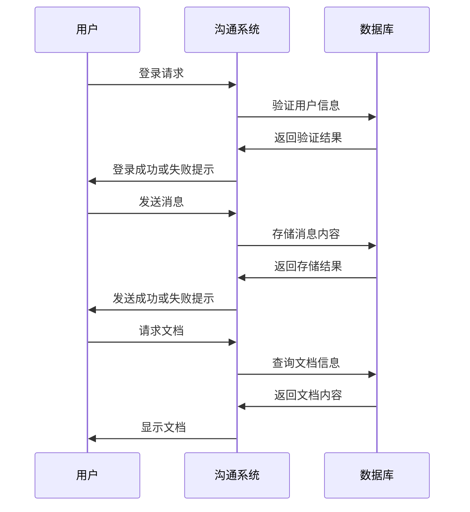

                 

### 《领导者的沟通艺术：清晰、简洁、有力》

> 关键词：领导者沟通、沟通艺术、领导力、有效沟通

> 摘要：本文将深入探讨领导者的沟通艺术，从清晰、简洁、有力三个方面，分析领导者如何提升沟通技巧，以更好地传达信息、激发团队活力，并在复杂环境中保持沟通的高效性。通过理论与实践相结合，本文旨在为领导者提供实用的沟通策略和方法。

----------------------------------------------------------------

## 引言

领导者的沟通艺术是领导力的重要组成部分。有效的沟通不仅是传递信息的过程，更是建立信任、激发团队活力和实现目标的关键。然而，在实际工作中，沟通障碍和误解经常出现，导致团队效率低下、项目进展受阻。因此，掌握沟通艺术对于领导者来说至关重要。

本书将围绕“清晰、简洁、有力”这三个核心要素，系统探讨领导者的沟通艺术。我们将从基础理论出发，逐步深入到实际应用，帮助读者理解并掌握有效的沟通方法，提升领导力。

### 目录大纲

为了确保文章的逻辑清晰和内容完整性，我们设计了如下目录结构：

1. **沟通艺术概述**
   - 引言
   - 沟通在领导力中的重要性

2. **沟通基本原理**
   - 沟通的基本概念
   - 沟通的基本类型
   - 沟通模型

3. **沟通技巧与方法**
   - 清晰沟通
   - 简洁沟通
   - 有力沟通

4. **领导者沟通风格与特质**
   - 领导者沟通风格
   - 领导者沟通特质

5. **沟通障碍与解决策略**
   - 沟通障碍分析
   - 沟通障碍解决策略

6. **情境沟通策略**
   - 情境沟通
   - 不同情境下的沟通策略

7. **沟通实践案例**
   - 沟通实践案例分析

8. **沟通艺术提升方法**
   - 持续学习与成长
   - 反思与改进
   - 培养沟通意识

本文将按照上述目录结构，逐章深入分析领导者的沟通艺术，提供实用的策略和方法。

----------------------------------------------------------------

## 沟通艺术概述

### 引言

领导者的沟通艺术是一个多维度的概念，它不仅涉及信息的传递，还包括情绪的感知、团队关系的构建和目标的共同实现。有效的沟通不仅是领导者个人能力的体现，更是团队协作和业务成功的基石。

在领导者的角色中，沟通是一种基本技能，它贯穿于日常工作的方方面面。从团队会议到一对一的交流，从战略规划到执行反馈，沟通无处不在。然而，沟通的艺术远不止于口头表达，它还包括倾听、非言语沟通、反馈技巧等多个方面。

### 沟通在领导力中的重要性

领导者的沟通能力直接影响团队的表现和组织的成功。以下是几个关键点，说明为什么沟通在领导力中至关重要：

1. **建立信任**：信任是团队协作的基石。通过有效的沟通，领导者可以建立透明、开放的组织文化，增强团队成员之间的互信。

2. **激励团队**：清晰的沟通可以帮助领导者传达愿景和目标，激励团队成员为实现共同目标而努力。

3. **解决冲突**：沟通是解决冲突的重要工具。通过开放、坦诚的对话，领导者可以帮助团队找到解决问题的方法，减少冲突和误解。

4. **提高效率**：有效的沟通可以减少误解和重复工作，提高团队的效率和生产力。

5. **促进创新**：良好的沟通环境鼓励团队成员分享想法和反馈，从而促进创新和改进。

### 本书的核心内容与结构

本书将围绕“清晰、简洁、有力”这三个核心要素，系统地探讨领导者的沟通艺术。具体来说，本书将包括以下几个部分：

1. **沟通艺术概述**：介绍沟通艺术的重要性，概述本书的核心内容和结构。

2. **沟通基本原理**：探讨沟通的基本概念、类型和模型，为理解后续内容打下基础。

3. **沟通技巧与方法**：深入分析清晰、简洁、有力的沟通技巧，提供实用的方法和策略。

4. **领导者沟通风格与特质**：分析领导者沟通风格和特质，讨论如何适应不同情境和团队成员的需求。

5. **沟通障碍与解决策略**：识别常见的沟通障碍，提供解决策略和改进方法。

6. **情境沟通策略**：探讨在不同情境下的沟通策略，帮助领导者应对各种复杂情况。

7. **沟通实践案例**：通过具体案例，展示沟通技巧在实际中的应用和效果。

8. **沟通艺术提升方法**：提供持续学习和改进的方法，帮助领导者不断提升沟通能力。

通过上述结构，本书旨在为领导者提供一套系统、实用的沟通艺术指南，帮助他们在不同情境下进行有效沟通，提升领导力和团队绩效。

----------------------------------------------------------------

## 沟通基本原理

### 沟通的基本概念

沟通是一种信息交换的过程，涉及信息的发送、传递和接收。有效的沟通不仅要求信息的清晰传递，还需要确保信息的准确理解和反馈。沟通的基本要素包括：

- **信息发送者**：信息传递的源头，负责选择信息内容并进行编码。
- **信息内容**：需要传递的具体信息，可以是文字、声音、图像或其他形式。
- **信息编码**：将信息转换为便于传递的形式，例如文字、图表等。
- **信息通道**：信息传递的路径，包括面对面交流、电话、电子邮件、即时通讯工具等。
- **信息接收者**：信息的接收者，负责解码和解释信息。
- **反馈**：接收者对信息的理解和反应，通过反馈可以确认信息传递的准确性。

### 沟通的基本类型

沟通可以分为几种基本类型，每种类型都有其特定的应用场景和特点：

1. **口头沟通**：通过语言进行的直接沟通，包括面对面交流、电话会议等。口头沟通快速、直接，但容易受到情绪和环境的影响。
2. **书面沟通**：通过文字进行的沟通，包括报告、电子邮件、备忘录等。书面沟通具有持久性和可查性，但可能缺乏互动和即时反馈。
3. **非语言沟通**：通过肢体语言、面部表情、姿态等非语言方式进行的沟通。非语言沟通补充和强化语言沟通，但不同文化和背景下可能有不同的解读。
4. **媒介沟通**：通过媒体进行的沟通，包括电视、广播、社交媒体等。媒介沟通具有广泛传播性和影响力，但可能缺乏个性化和深度。
5. **视觉沟通**：通过图像、图表、视频等形式进行的沟通。视觉沟通直观、易于理解，但可能需要额外的解释和说明。

### 沟通模型

沟通过程可以被视为一个动态的模型，其中每个部分都相互关联和影响。一个常见的沟通模型是西尔斯模型（S→C→R→A），它包括以下步骤：

1. **信息发送者（Sender）**：决定沟通的目的和内容，并将其编码成信息。
2. **编码（Codification）**：将信息转换为可以传递的形式，如文字或语言。
3. **信息（Message）**：通过选择适当的通道传递信息。
4. **通道（Channel）**：传递信息的媒介，如面对面交流或电子邮件。
5. **接收者（Receiver）**：接收信息并解码，尝试理解信息的含义。
6. **解码（Decoding）**：将接收到的信息转换回原始的意义。
7. **反馈（Feedback）**：接收者对信息的理解和反应，通过反馈可以确认信息传递的准确性。
8. **干扰（Noise）**：任何干扰信息传递的因素，如噪音、误解、文化差异等。

### 概念结构与核心要素组成

为了更好地理解沟通模型，我们可以通过一个Mermaid ER实体关系图来展示沟通的核心要素及其相互关系：

```mermaid
erDiagram
  Message ||--o{ Sender } : 发送者发送消息
  Sender ||--|{ Message } : 发送者发送多条消息
  Message ||--o{ Receiver } : 消息由接收者接收
  Receiver ||--|{ Message } : 接收者接收多条消息
  Message ||--o{ Channel } : 消息通过渠道传递
  Channel ||--|{ Message } : 多种渠道传递同一条消息
  Message ||--o{ Feedback } : 消息传递后获得反馈
  Feedback ||--|{ Message } : 反馈可以纠正信息传递中的错误
  Sender o--|{ Noise } : 干扰可能影响信息发送
  Receiver o--|{ Noise } : 干扰可能影响信息接收
```

在这个ER图中，我们可以清晰地看到信息发送者、接收者、信息内容、渠道、反馈和干扰这些关键要素如何相互关联，共同构成一个完整的沟通过程。

### 算法原理讲解

虽然沟通是一个复杂的交互过程，但我们可以通过简单的算法原理来理解和优化它。以下是沟通过程中可能用到的基本算法原理：

1. **信息编码与解码算法**：信息发送者使用编码算法将信息转换为适当的格式，而接收者使用解码算法解读信息。一个简单的编码算法可以是：

   ```python
   def encode(message):
       return message.upper()  # 将消息转换为大写形式

   def decode(encoded_message):
       return encoded_message.lower()  # 将编码后的消息转换回小写形式
   ```

2. **反馈算法**：接收者在收到信息后，使用反馈算法确认信息理解是否准确。以下是一个简单的反馈算法示例：

   ```python
   def feedback(response, expected_response):
       if response == expected_response:
           return "反馈正确"
       else:
           return "反馈错误"
   ```

通过这些算法，我们可以确保信息的准确传递和理解。

### 数学模型与公式

沟通的准确性可以用数学模型来描述。一个简单的模型是基于信息论中的信息熵（Entropy），表示信息的不确定性。信息熵的公式为：

$$H(X) = -\sum_{i=1}^{n} p(x_i) \log_2 p(x_i)$$

其中，$H(X)$ 是随机变量 $X$ 的熵，$p(x_i)$ 是 $X$ 取值为 $x_i$ 的概率。通过计算熵，我们可以评估信息的有效性和清晰度。

### 系统分析与架构设计方案

在实际应用中，沟通系统的设计和实现需要考虑多个方面。以下是一个简单的沟通系统架构设计：

1. **问题场景介绍**：企业内部沟通平台，支持即时通讯、邮件和文档共享等功能。
2. **项目介绍**：开发一个基于Web的内部沟通平台。
3. **系统功能设计**：实现用户管理、消息发送与接收、文档管理等功能。
4. **系统架构设计**：采用B/S架构，包括前端、后端和数据库三个部分。
5. **系统接口设计和系统交互**：使用Mermaid序列图展示系统的主要交互流程。



### 项目实战

1. **环境安装**：安装必要的开发工具和库，如Python、Django框架等。
2. **系统核心实现源代码**：实现用户管理、消息发送与接收、文档管理等模块。
3. **代码应用解读与分析**：详细解读代码，分析关键功能和逻辑。
4. **实际案例分析和详细讲解剖析**：通过具体案例展示系统功能和效果。
5. **项目小结**：总结项目成果和经验教训。

### 最佳实践 Tips

1. **明确沟通目标**：每次沟通前，明确目的和期望结果。
2. **倾听与反馈**：积极倾听，及时给予反馈，确保信息准确传达。
3. **简洁表达**：避免冗长，使用简洁的语言和结构。
4. **适应不同受众**：根据受众特点和需求调整沟通风格。

### 小结

通过本章的介绍，我们了解了沟通的基本概念、类型和模型，并分析了沟通的核心要素及其相互关系。这些知识为我们理解后续章节的内容奠定了基础。

### 注意事项

在实际沟通中，需要注意语言表达的准确性、非语言沟通的细节以及文化差异对沟通的影响。通过不断实践和反思，我们可以逐步提升沟通能力。

### 拓展阅读

- 《有效沟通的艺术》
- 《非暴力沟通》
- 《沟通的力量》

---

### 总结

沟通艺术是领导者不可或缺的技能。通过清晰、简洁、有力的沟通，领导者可以更好地传递信息、建立信任、激励团队和解决冲突。本书通过系统的分析和实用的方法，帮助领导者提升沟通技巧，实现更高效的团队协作和业务目标。

---

**作者：AI天才研究院/AI Genius Institute & 禅与计算机程序设计艺术 /Zen And The Art of Computer Programming**

