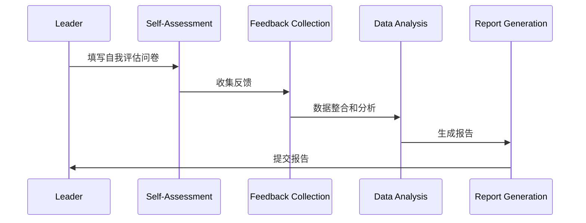
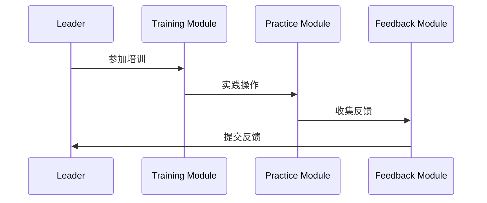
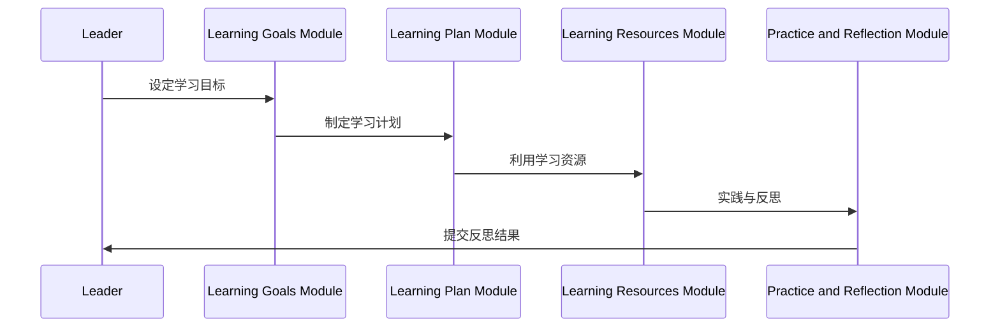

                 

### 文章标题

# 领导者的自我反思：持续成长的关键

### 文章关键词

- 领导者
- 自我反思
- 持续成长
- 领导力
- 决策策略
- 团队建设
- 心理调适

### 文章摘要

在信息技术飞速发展的今天，领导者如何在复杂多变的环境中保持竞争力，实现自我反思和持续成长，已成为至关重要的课题。本文将深入探讨领导者的自我认知、领导力发展、决策策略、团队建设以及心理调适等方面，通过系统分析和技术讲解，为领导者提供切实可行的成长路径和策略。

## 目录大纲

----------------------------------------------------------------

### 第一部分：领导者的自我认知与成长

**第1章：领导者的自我认知**  
1.1 领导者自我认知的重要性  
1.2 自我认知的工具与方法  
1.3 领导者的性格与特质分析

**第2章：领导力的发展与提升**  
2.1 领导力的核心要素  
2.2 领导力模型与实践  
2.3 领导者的沟通技巧

**第3章：持续成长的关键策略**  
3.1 持续学习的理念与实践  
3.2 反思与改进的方法  
3.3 领导者的心理调适与压力管理

**第4章：领导者的决策策略**  
4.1 决策过程与模型  
4.2 风险评估与应对策略  
4.3 创新思维与决策

**第5章：领导者的团队建设**  
5.1 团队角色与职责  
5.2 团队沟通与合作  
5.3 团队激励与成长

**第6章：领导者的道德责任与社会影响**  
6.1 领导者的道德标准  
6.2 社会责任与可持续发展  
6.3 领导者的伦理困境与解决

**第7章：领导者的持续成长之路**  
7.1 成长路径与里程碑  
7.2 经验分享与启示  
7.3 未来领导者的培养

----------------------------------------------------------------

### 引言：领导者成长的重要性

在现代社会，领导者不仅需要具备出色的管理技能，还需要具备自我反思和持续成长的能力。信息技术的发展使得企业面临的环境变得更加复杂和多变，传统的领导方式已无法应对新的挑战。因此，领导者如何在这种环境中保持竞争力，成为企业持续发展的重要课题。

**自我反思**是领导者成长的关键。通过自我反思，领导者可以深入了解自身的优点和不足，从而找到改进的方向。同时，自我反思还能帮助领导者更好地理解团队和员工的需求，提升团队整体效能。

**持续成长**则是领导者适应时代变化的必要条件。在信息技术不断更新换代的背景下，领导者需要不断学习新知识、掌握新技能，以适应不断变化的市场需求。持续成长不仅有助于提升领导者的个人能力，还能为企业带来持续的创新能力。

本文将从以下几个方面展开讨论：

1. **领导者的自我认知**：分析领导者自我认知的重要性，介绍自我认知的工具与方法，以及领导者的性格与特质分析。
2. **领导力的发展与提升**：探讨领导力的核心要素，介绍领导力模型与实践，以及领导者的沟通技巧。
3. **持续成长的关键策略**：阐述持续学习的理念与实践，反思与改进的方法，以及领导者的心理调适与压力管理。
4. **领导者的决策策略**：分析决策过程与模型，风险评估与应对策略，以及创新思维与决策。
5. **领导者的团队建设**：讨论团队角色与职责，团队沟通与合作，以及团队激励与成长。
6. **领导者的道德责任与社会影响**：探讨领导者的道德标准，社会责任与可持续发展，以及领导者的伦理困境与解决。
7. **领导者的持续成长之路**：总结领导者的成长路径与里程碑，分享经验与启示，以及未来领导者的培养。

### 第1章：领导者的自我认知

**1.1 领导者自我认知的重要性**

领导者是团队的核心，其能力直接影响团队的整体表现。自我认知是领导者成长的重要基础，它包括对自身能力、性格、价值观等方面的深刻理解。一个具备良好自我认知的领导者，能够更清晰地认识自己的优势和不足，从而更好地规划个人和团队的发展方向。

**1.2 自我认知的工具与方法**

自我认知的过程需要借助各种工具和方法。以下是一些常用的工具和方法：

1. **自我评估问卷**：通过设计一系列问题，让领导者对自己进行自我评估。例如，可以设计关于领导能力、决策能力、沟通能力等方面的问卷。
2. **360度反馈**：通过收集来自上级、同事、下属和客户等多方面的反馈，全面了解自己的优缺点。这种方法能够帮助领导者从多个角度进行自我认知。
3. **心理测试**：例如MBTI（Myers-Briggs Type Indicator）等，帮助领导者了解自己的性格特征和潜在行为倾向。
4. **日记记录**：通过记录自己的日常工作、思考和感受，反思自己的行为和决策，从而深入理解自己。

**1.3 领导者的性格与特质分析**

领导者的性格和特质对领导效果有着重要影响。以下是一些常见的领导者性格与特质：

1. **自信心**：自信心是领导者的重要特质。一个自信的领导者能够鼓舞团队士气，激发员工的潜力。
2. **决断力**：领导者需要在面对复杂问题时迅速做出决策。决断力强的人能够更高效地解决问题。
3. **沟通能力**：良好的沟通能力是领导者必备的素质。它包括表达能力、倾听能力、理解能力等。
4. **情商**：情商高的领导者能够更好地理解和管理自己的情绪，同时也能更好地处理团队中的情绪问题。

### 第2章：领导力的发展与提升

**2.1 领导力的核心要素**

领导力并非天生具备，而是可以通过学习和发展得到的。领导力的核心要素包括：

1. **愿景**：领导者需要有一个清晰的愿景，明确团队的目标和方向。愿景能够激励团队成员为之努力。
2. **信任**：信任是领导者与团队成员之间的重要纽带。一个信任的领导者能够赢得员工的尊重和忠诚。
3. **激励**：领导者需要能够激发团队成员的潜力，激励他们发挥最佳水平。
4. **决策能力**：领导者需要具备良好的决策能力，能够在复杂多变的环境中做出明智的决策。
5. **变革管理**：领导者需要具备推动变革的能力，带领团队适应新的环境和挑战。

**2.2 领导力模型与实践**

领导力模型提供了理解和实践领导力的框架。以下是一些常见的领导力模型：

1. **领导力四要素模型**：包括角色定位、目标管理、人际沟通和团队建设。
2. **情境领导模型**：根据团队的不同发展阶段，采取不同的领导策略。
3. **领导五力模型**：包括愿景领导、团队领导、变革领导、技术领导和道德领导。

在实际工作中，领导者可以结合具体情境和实践，灵活运用不同的领导力模型，提高领导效果。

**2.3 领导者的沟通技巧**

沟通是领导者的重要技能之一。良好的沟通能够提高团队的协作效率，促进团队成员之间的理解和信任。以下是一些关键的沟通技巧：

1. **倾听**：倾听是有效沟通的基础。领导者需要认真倾听团队成员的意见和建议，理解他们的需求和困惑。
2. **表达**：领导者需要清晰、准确地表达自己的想法和意见，避免误解和歧义。
3. **反馈**：及时、具体的反馈能够帮助团队成员改进工作，同时也能增强团队的凝聚力和信任。
4. **非语言沟通**：包括肢体语言、面部表情、语调等，非语言沟通在沟通中同样重要。

### 第3章：持续成长的关键策略

**3.1 持续学习的理念与实践**

在信息技术快速发展的时代，领导者需要不断学习新知识、掌握新技能，以适应不断变化的环境。持续学习是领导者持续成长的关键策略之一。

**理念**：持续学习的理念强调，知识是动态的，领导者需要不断更新自己的知识体系，以应对新的挑战。

**实践**：以下是一些持续学习的实践方法：

1. **读书**：定期阅读相关书籍，扩大知识面，提升理论水平。
2. **培训**：参加各类培训课程，学习新的管理技能和技术知识。
3. **实践**：通过实际工作，将所学知识应用于实践中，检验和提升自己的能力。
4. **交流**：与同行交流，分享经验和观点，相互学习和启发。

**3.2 反思与改进的方法**

反思是领导者自我成长的重要环节。通过反思，领导者可以发现自己的不足，找到改进的方向。

**方法**：以下是一些反思与改进的方法：

1. **定期回顾**：定期回顾自己的工作表现，分析成功和失败的原因。
2. **求助外部**：请教同事、下属和专家的意见，从不同角度看待自己的工作。
3. **记录日志**：记录日常工作和思考，通过回顾日志，反思自己的行为和决策。
4. **设置目标**：明确自己的职业发展目标，制定行动计划，不断改进。

**3.3 领导者的心理调适与压力管理**

领导者常常面临较大的工作压力，心理调适与压力管理对领导者的健康和效能至关重要。

**心理调适**：以下是一些心理调适的方法：

1. **正念冥想**：通过冥想，减轻焦虑和压力，提高专注力。
2. **运动锻炼**：定期进行体育锻炼，提高身体素质，增强心理韧性。
3. **兴趣爱好**：培养兴趣爱好，丰富业余生活，减轻工作压力。

**压力管理**：以下是一些压力管理的方法：

1. **时间管理**：合理安排时间，避免过度工作和疲劳。
2. **情绪调节**：学会调节情绪，保持积极心态，应对各种挑战。
3. **求助专业**：在必要时，寻求心理咨询师的帮助，进行专业心理辅导。

### 第4章：领导者的决策策略

**4.1 决策过程与模型**

决策是领导者的重要职责之一。一个有效的决策过程能够帮助领导者做出明智的决策。

**决策过程**：通常包括以下几个步骤：

1. **问题识别**：明确需要解决的问题或机会。
2. **信息收集**：收集与问题相关的信息，包括内部数据和外部信息。
3. **方案制定**：制定多个可能的解决方案。
4. **评估与选择**：评估各个方案，选择最优方案。
5. **实施与监控**：实施决策方案，并持续监控效果。

**决策模型**：以下是一些常见的决策模型：

1. **理性决策模型**：基于理性分析和数据驱动，选择最优方案。
2. **有限理性决策模型**：考虑决策者的认知限制，选择满意方案。
3. **模糊决策模型**：处理不确定性和模糊性，选择合理方案。

**4.2 风险评估与应对策略**

决策过程中，风险评估至关重要。领导者需要识别潜在风险，并制定应对策略。

**风险评估方法**：以下是一些常见的方法：

1. **SWOT分析**：分析优势、劣势、机会和威胁，识别潜在风险。
2. **概率分析**：根据历史数据和概率分布，评估风险发生的可能性。
3. **蒙特卡罗模拟**：通过模拟，评估风险的影响和可能性。

**应对策略**：以下是一些常见的应对策略：

1. **风险规避**：避免或减少风险发生的机会。
2. **风险减轻**：通过改进措施，降低风险的影响。
3. **风险接受**：在风险可控的范围内，接受风险。

**4.3 创新思维与决策**

在快速变化的环境中，创新思维是领导者做出明智决策的重要工具。

**创新思维方法**：以下是一些常见的创新思维方法：

1. **头脑风暴**：通过集体讨论，激发创新思维。
2. **思维导图**：通过可视化工具，整理和创新思维。
3. **逆向思维**：从相反的角度思考问题，发现新的解决方案。

### 第5章：领导者的团队建设

**5.1 团队角色与职责**

团队建设是领导者的重要任务之一。一个高效的团队需要明确每个成员的角色与职责。

**角色**：团队中通常包括以下角色：

1. **领导者**：负责团队的整体规划和决策。
2. **执行者**：负责具体任务的执行。
3. **协调者**：负责协调团队成员之间的工作。
4. **监督者**：负责监督任务的进度和质量。

**职责**：每个角色都有明确的职责：

1. **领导者**：制定团队目标、规划和决策。
2. **执行者**：按照任务要求，完成具体工作。
3. **协调者**：确保团队成员之间的有效沟通和协作。
4. **监督者**：监控任务进度和质量，提供反馈。

**5.2 团队沟通与合作**

团队沟通与合作是团队高效运行的关键。

**沟通技巧**：以下是一些团队沟通的技巧：

1. **明确目标**：确保团队成员了解团队的目标和任务。
2. **积极倾听**：认真倾听团队成员的意见和建议。
3. **有效表达**：清晰、准确地表达自己的想法和意见。
4. **开放心态**：鼓励团队成员提出不同意见，进行建设性讨论。

**合作机制**：以下是一些促进团队合作的机制：

1. **任务分工**：根据团队成员的能力和特长，进行合理的任务分工。
2. **协作工具**：使用协作工具，如邮件、即时通讯、项目管理软件等，提高团队协作效率。
3. **定期会议**：定期召开团队会议，总结工作、解决问题和分享经验。

**5.3 团队激励与成长**

团队激励是领导者的重要职责，有助于提高团队的士气和效能。

**激励方法**：以下是一些常见的激励方法：

1. **认可与奖励**：对团队成员的出色表现给予认可和奖励。
2. **职业发展**：提供职业发展的机会和资源，帮助团队成员提升能力。
3. **团队建设活动**：组织团队建设活动，增强团队凝聚力和信任。

**团队成长**：以下是一些促进团队成长的方法：

1. **培训与发展**：定期进行培训，提升团队成员的专业能力和领导力。
2. **知识分享**：鼓励团队成员分享知识和经验，促进团队的整体进步。
3. **反馈与改进**：定期收集团队成员的反馈，改进团队工作方法和流程。

### 第6章：领导者的道德责任与社会影响

**6.1 领导者的道德标准**

领导者的道德标准对其行为和决策具有重要影响。领导者应该树立正确的道德观念，以身作则，为团队成员树立榜样。

**道德标准**：以下是一些基本的道德标准：

1. **诚信**：真诚、正直，遵守承诺，不欺骗、不隐瞒。
2. **公正**：公平、无私，对待团队成员一视同仁，不偏袒、不歧视。
3. **责任**：承担责任，勇于面对错误和挑战，不逃避、不推诿。
4. **尊重**：尊重团队成员的权利和尊严，关心他们的需求和福祉。

**6.2 社会责任与可持续发展**

作为企业的领导者，社会责任和可持续发展是领导者的重要议题。领导者应该关注企业的社会责任，积极参与社会公益事业，推动企业的可持续发展。

**社会责任**：以下是一些社会责任的实践：

1. **环境保护**：关注环境保护，减少企业对环境的影响。
2. **公益活动**：参与社会公益活动，支持弱势群体，回馈社会。
3. **慈善捐赠**：为需要帮助的人提供物资和资金支持。

**可持续发展**：以下是一些可持续发展的实践：

1. **资源节约**：合理利用资源，降低能源消耗和废弃物产生。
2. **技术创新**：推动技术创新，提高生产效率和产品质量。
3. **员工福利**：关注员工的福利和职业发展，提高员工的工作满意度和忠诚度。

**6.3 领导者的伦理困境与解决**

在领导者的职业生涯中，可能会面临各种伦理困境。领导者需要具备解决这些困境的能力，做出正确的决策。

**伦理困境**：以下是一些常见的伦理困境：

1. **利益冲突**：在个人利益和企业利益之间做出选择。
2. **道德责任**：在遵守道德规范和追求企业利益之间找到平衡。
3. **隐私保护**：在保护员工隐私和满足企业需求之间做出权衡。

**解决方法**：以下是一些解决伦理困境的方法：

1. **伦理决策模型**：使用伦理决策模型，如德西克模型，帮助领导者做出正确的决策。
2. **道德对话**：与同事、下属和专家进行道德对话，寻求多方意见，共同解决伦理困境。
3. **道德培训**：定期进行道德培训，提高领导者的道德素养和伦理意识。

### 第7章：领导者的持续成长之路

**7.1 成长路径与里程碑**

领导者的成长是一个持续的过程，需要经历多个阶段和里程碑。以下是一些常见的成长路径和里程碑：

1. **基础阶段**：领导者需要掌握基础的管理知识和技能，如时间管理、沟通技巧、团队建设等。
2. **进阶阶段**：领导者需要提升领导力和决策能力，学习新的管理方法和策略。
3. **成熟阶段**：领导者需要具备较高的领导力和管理能力，能够应对复杂的环境和挑战。
4. **卓越阶段**：领导者需要不断追求卓越，持续提升个人能力和团队效能。

**7.2 经验分享与启示**

通过分享领导者的经验，我们可以从中获得许多启示和教训。以下是一些领导者的经验分享：

1. **持续学习**：领导者需要保持好奇心和求知欲，不断学习新知识、新技能。
2. **倾听与沟通**：领导者需要善于倾听团队成员的意见和建议，建立良好的沟通渠道。
3. **以身作则**：领导者需要以身作则，树立良好的榜样，引导团队成员。
4. **适应变化**：领导者需要具备适应变化的能力，灵活应对各种挑战和机遇。

**7.3 未来领导者的培养**

为了应对未来社会的挑战，领导者需要具备前瞻性和创新性。以下是一些未来领导者的培养方向：

1. **数字化素养**：领导者需要具备数字化素养，了解和掌握数字化工具和技能。
2. **创新思维**：领导者需要具备创新思维，敢于挑战传统，推动企业变革。
3. **跨文化沟通**：领导者需要具备跨文化沟通能力，适应全球化背景下的工作环境。
4. **可持续领导力**：领导者需要具备可持续领导力，关注企业的社会责任和可持续发展。

### 结尾

领导者的自我反思和持续成长是企业持续发展的关键。通过本文的讨论，我们深入分析了领导者的自我认知、领导力发展、决策策略、团队建设、道德责任以及未来领导者的培养等方面。领导者需要不断提升自身能力，适应快速变化的环境，带领团队实现持续成长。只有通过持续学习和反思，领导者才能在复杂多变的环境中保持竞争力，为企业创造更大的价值。

**作者：AI天才研究院/AI Genius Institute & 禅与计算机程序设计艺术 /Zen And The Art of Computer Programming**

---

### 第1章：领导者的自我认知

**1.1 领导者自我认知的重要性**

在信息技术的飞速发展时代，领导者不仅需要具备卓越的管理能力和决策智慧，更需要具备深刻的自我认知能力。自我认知，简单来说，就是领导者对自身性格、能力、价值观等的深刻理解。这种认知不仅关乎领导者个人的成长，更是影响整个团队和企业发展的关键因素。

**背景介绍**：

随着市场竞争的加剧和信息技术的发展，企业面临的挑战日益复杂。领导者需要具备前瞻性的思维、灵活的应对策略和卓越的领导能力。然而，这些能力并非一蹴而就，而是需要通过不断的自我反思和成长来逐步提升。自我认知作为领导者成长的基础，可以帮助领导者更好地理解自身，发现潜在的优势和不足，从而有针对性地进行改进。

**问题背景**：

在实际工作中，许多领导者往往过于关注外部环境的变化和团队的管理，而忽略了自身的成长和自我认知。这种现象导致领导者难以准确把握自身的优势和不足，从而在决策和领导过程中出现偏差。例如，一些领导者可能过于自信，忽视团队成员的意见和建议，导致团队缺乏活力和创新；另一些领导者可能过于保守，害怕冒险，错失企业发展的机遇。

**问题描述**：

如何提升领导者的自我认知能力，使其在复杂多变的环境中保持竞争力，成为当前企业管理中一个亟待解决的问题。领导者需要通过系统的方法和工具，深入理解自身的性格、能力、价值观等方面，找到自身的优势和不足，从而制定出针对性的改进计划。

**问题解决**：

要提升领导者的自我认知能力，首先需要认识到自我认知的重要性。领导者应该意识到，自我认知不仅关乎个人成长，更是团队和企业发展的关键。其次，领导者需要借助各种工具和方法，如自我评估问卷、360度反馈、心理测试等，全面了解自身的性格、能力、价值观等方面。最后，领导者需要定期进行自我反思，总结经验教训，不断调整和优化自身的领导方式。

**边界与外延**：

自我认知不仅涉及领导者个人的成长，还涉及团队和企业的发展。因此，领导者在进行自我认知时，需要考虑到团队的整体利益和企业的发展目标。同时，自我认知是一个持续的过程，需要领导者不断学习和反思，以适应不断变化的环境。

**概念结构与核心要素组成**：

领导者的自我认知主要包括以下几个核心要素：

1. **性格**：领导者需要了解自己的性格特点，如内向或外向、敏感或沉稳等，这有助于理解自己在不同情境下的行为模式。
2. **能力**：领导者需要评估自己的能力，包括管理能力、决策能力、沟通能力等，这有助于找到提升个人能力的方向。
3. **价值观**：领导者需要明确自己的价值观，如诚信、公正、责任等，这有助于在决策和领导过程中保持一致性。

**核心概念原理**：

自我认知是一个复杂的过程，涉及多个方面的理解。首先，领导者需要通过自我评估来了解自身的性格和能力。这可以通过设计一系列自我评估问卷来实现。其次，领导者可以通过收集他人的反馈，如同事、下属和客户的反馈，来了解自己在团队中的表现和影响。此外，领导者还可以通过心理测试等工具，深入理解自己的性格和价值观。

**概念属性特征对比表格**：

| 特征 | 性格 | 能力 | 价值观 |
| --- | --- | --- | --- |
| 性格 | 内向/外向 | 管理能力/决策能力 | 诚信/公正 |
| 能力 | 沟通能力 | 领导能力 | 责任感 |
| 价值观 | 稳重/敏感 | 决策能力 | 公平/无私 |

**ER实体关系图架构**：

```mermaid
erDiagram
  Leader ||--|{ Personality }
  Leader ||--|{ Ability }
  Leader ||--|{ Values }
```

**算法原理讲解**：

为了更好地理解领导者的自我认知过程，我们可以将其视为一个算法。该算法的核心是通过对领导者自身和外部反馈的分析，不断调整和优化领导者的认知模型。

```python
def self_cognition_leader(leader):
    # 收集自我评估数据
    self_assessment = get_self_assessment(leader)
    
    # 收集他人反馈数据
    feedback = get_feedback(leader)
    
    # 进行数据整合
    integrated_data = integrate_data(self_assessment, feedback)
    
    # 分析性格、能力和价值观
    personality = analyze_personality(integrated_data)
    ability = analyze_ability(integrated_data)
    values = analyze_values(integrated_data)
    
    # 输出结果
    return {
        "personality": personality,
        "ability": ability,
        "values": values
    }

# 示例调用
leader_self_cognition = self_cognition_leader(leader)
print(leader_self_cognition)
```

**数学模型和公式**：

在自我认知过程中，我们可以使用一些数学模型和公式来量化领导者的性格、能力和价值观。例如，可以使用聚类算法对性格特征进行分类，使用回归模型对能力进行评估，使用多维量表对价值观进行测量。

```latex
\text{性格特征分类模型：} \\
P_i = f(\text{聚类中心}, X_i)

\text{能力评估模型：} \\
A_i = g(\text{回归系数}, X_i)

\text{价值观测量模型：} \\
V_i = h(\text{多维量表系数}, X_i)
```

**详细讲解与举例说明**：

为了更好地理解这些概念和模型，我们可以通过一个具体的例子来详细阐述。

**例子**：

假设一位领导者名叫李明。他希望通过自我认知，了解自己的性格、能力和价值观。首先，他填写了一份数字化的自我评估问卷，问卷中包含了关于性格、能力和价值观的问题。其次，他收集了来自同事、下属和客户的反馈，包括对他在团队中的表现、决策能力、沟通能力和价值观的评价。

通过分析这些数据，李明得出了以下结论：

- **性格**：内向，沉稳，善于倾听和思考。
- **能力**：具有较强的决策能力和沟通能力，但在管理能力方面有待提升。
- **价值观**：重视诚信和公正，具有较强的责任感。

这些结论帮助李明更加清晰地认识了自己，找到了自身的优势和不足。他意识到，自己在管理能力方面需要进一步提升，同时，他决定在今后的工作中更加注重团队的参与和沟通，以提高管理效能。

通过这个例子，我们可以看到，领导者的自我认知是一个系统化的过程，需要通过多种方法和工具来全面了解自身。这种自我认知不仅有助于领导者个人成长，也能为企业发展提供有力支持。

**系统分析与架构设计方案**：

在自我认知过程中，领导者需要运用多种工具和方法，如自我评估问卷、360度反馈、心理测试等。这些工具和方法相互关联，共同构成了领导者的自我认知系统。以下是一个简化的系统架构设计方案：

**问题场景介绍**：

假设李明作为一位领导者，希望通过自我认知系统来全面了解自己的性格、能力和价值观。他需要完成一系列的自我评估问卷，并收集来自同事、下属和客户的反馈。

**项目介绍**：

自我认知项目旨在通过数字化工具和方法，帮助领导者全面了解自身，提高领导能力。项目包括以下几个模块：

1. **自我评估模块**：提供自我评估问卷，帮助领导者了解自己的性格、能力和价值观。
2. **反馈收集模块**：收集来自同事、下属和客户的反馈，以全面了解领导者的表现和影响。
3. **数据分析模块**：对收集到的数据进行整合和分析，生成领导者的自我认知报告。

**系统功能设计**：

1. **用户管理**：管理领导者的用户信息和权限。
2. **问卷管理**：设计和管理自我评估问卷。
3. **反馈管理**：收集、管理和分析反馈数据。
4. **报告生成**：生成领导者的自我认知报告。

**系统架构设计**：

以下是一个简化的系统架构图：



**系统接口设计**：

系统提供以下接口供外部系统调用：

1. **用户接口**：用于领导者的自我评估和反馈提交。
2. **管理员接口**：用于问卷设计和反馈管理。

**系统交互流程**：

1. **填写自我评估问卷**：领导者通过用户接口填写自我评估问卷。
2. **收集反馈**：系统通过管理员接口收集来自同事、下属和客户的反馈。
3. **数据分析**：系统对收集到的数据进行整合和分析，生成自我认知报告。
4. **报告生成**：系统通过用户接口将报告提交给领导者。

**实际案例分析和详细讲解**：

为了更好地理解自我认知系统的实际应用，我们可以通过一个实际案例来详细分析。

**案例背景**：

李明作为一家互联网公司的技术总监，希望通过自我认知系统来全面了解自己的领导能力。他填写了公司提供的自我评估问卷，并收集了来自同事、下属和客户的反馈。

**案例分析**：

1. **自我评估问卷**：李明通过自我评估问卷，了解了自己的性格特点，包括内向、沉稳和善于倾听。此外，他还评估了自己的管理能力、决策能力和沟通能力。

2. **反馈收集**：李明的同事、下属和客户填写了反馈问卷，对他在团队中的表现进行了评价。反馈显示，李明在决策能力和沟通能力方面表现优秀，但在管理能力方面有待提升。

3. **数据分析**：系统对李明的自我评估和反馈进行了整合和分析，生成了他的自我认知报告。报告显示，李明在性格上适合内向、沉稳的领导风格，但在管理能力方面需要加强。

4. **报告生成**：李明通过用户接口收到了自我认知报告，并开始针对报告中指出的问题进行改进。他决定参加管理培训，提高自己的管理能力。

**项目小结**：

通过自我认知系统的应用，李明成功了解了自身的优势和不足，并找到了改进的方向。这种自我认知不仅帮助他提高了领导能力，也为公司的持续发展提供了有力支持。

**最佳实践 tips**：

1. **定期进行自我评估**：领导者应该定期进行自我评估，以持续了解自身的优势和不足。
2. **收集多方反馈**：领导者应该收集来自同事、下属和客户的反馈，以全面了解自己在团队中的表现。
3. **持续学习和改进**：领导者应该持续学习和改进，以提高自身的领导能力。

### 第2章：领导力的发展与提升

**2.1 领导力的核心要素**

领导力是领导者影响力的体现，是推动团队和企业发展的关键因素。要提升领导力，首先需要了解领导力的核心要素。

**背景介绍**：

在现代社会，领导力不仅关乎个人和团队的成长，更是企业成功的重要保障。一个具备卓越领导力的领导者，能够激发团队成员的潜能，提高团队整体效能，推动企业持续发展。

**问题背景**：

然而，领导力并非一蹴而就，需要通过不断的学习和实践来提升。许多领导者在实际工作中面临着各种挑战，如如何提高团队凝聚力、如何激发员工的潜力、如何在复杂环境中做出明智的决策等。这些问题都涉及到领导力的提升。

**问题描述**：

如何发展领导力，提升领导者的个人素质和团队效能，成为当前企业管理中的重要课题。领导者需要明确领导力的核心要素，通过系统的方法和实践，不断提升自己的领导力。

**问题解决**：

要提升领导力，首先需要明确领导力的核心要素。以下是一些常见的核心要素：

1. **愿景**：领导者需要有清晰的愿景，明确团队和企业的目标和方向。愿景能够激励团队成员为之努力，增强团队的凝聚力。
2. **信任**：信任是领导者与团队成员之间的重要纽带。一个信任的领导者能够赢得员工的尊重和忠诚，提高团队的协作效率。
3. **激励**：领导者需要具备激励团队成员的能力，激发他们的潜能，提高工作效率和创造力。
4. **决策能力**：领导者需要具备良好的决策能力，能够在复杂多变的环境中做出明智的决策。
5. **变革管理**：领导者需要具备推动变革的能力，带领团队适应新的环境和挑战。

**边界与外延**：

领导力的核心要素不仅涉及领导者个人的成长，还涉及团队和企业的整体发展。因此，领导者在进行领导力提升时，需要考虑到团队和企业的利益，找到合适的平衡点。

**概念结构与核心要素组成**：

领导力的核心要素主要包括以下几个方面：

1. **愿景**：明确团队和企业的目标和方向。
2. **信任**：建立领导者与团队成员之间的信任关系。
3. **激励**：激发团队成员的潜力，提高工作效率和创造力。
4. **决策能力**：在复杂多变的环境中做出明智的决策。
5. **变革管理**：推动团队和企业适应新的环境和挑战。

**核心概念原理**：

领导力是一个复杂的过程，涉及多个方面的理解和实践。首先，领导者需要明确自身的愿景，制定清晰的目标和方向。其次，领导者需要建立与团队成员的信任关系，通过沟通和合作，增强团队的凝聚力。此外，领导者还需要具备激励团队成员的能力，激发他们的潜能，提高工作效率和创造力。最后，领导者需要具备决策能力，在复杂多变的环境中做出明智的决策，带领团队和企业应对各种挑战。

**概念属性特征对比表格**：

| 特征 | 愿景 | 信任 | 激励 | 决策能力 | 变革管理 |
| --- | --- | --- | --- | --- | --- |
| 愿景 | 目标明确 | 关系建立 | 动力激发 | 快速反应 | 应变能力 |
| 信任 | 信任建立 | 信任维护 | 激励效果 | 决策效率 | 变革推动 |
| 激励 | 激励机制 | 激励效果 | 动力激发 | 决策动力 | 变革动力 |
| 决策能力 | 决策效率 | 决策准确性 | 情境适应 | 风险控制 | 变革引导 |
| 变革管理 | 变革推动 | 变革实施 | 变革效果 | 变革适应性 | 变革文化 |

**ER实体关系图架构**：

```mermaid
erDiagram
  Leader ||--|{ Vision }
  Leader ||--|{ Trust }
  Leader ||--|{ Incentive }
  Leader ||--|{ Decision }
  Leader ||--|{ ChangeManagement }
```

**算法原理讲解**：

为了更好地理解领导力的核心要素，我们可以将其视为一个算法。该算法的核心是通过对领导者行为的分析和评估，逐步提升领导者的领导力。

```python
def leadership_development(leader):
    # 收集领导者的行为数据
    behavior_data = get_behavior_data(leader)
    
    # 分析领导者的行为
    vision = analyze_vision(behavior_data)
    trust = analyze_trust(behavior_data)
    incentive = analyze_incentive(behavior_data)
    decision = analyze_decision(behavior_data)
    changemanagement = analyze_changemanagement(behavior_data)
    
    # 提升领导力
    improve_vision = improve_visionCapability(leader)
    improve_trust = improve_trustCapability(leader)
    improve_incentive = improve_incentiveCapability(leader)
    improve_decision = improve_decisionCapability(leader)
    improve_changemanagement = improve_changemanagementCapability(leader)
    
    # 输出结果
    return {
        "vision": vision,
        "trust": trust,
        "incentive": incentive,
        "decision": decision,
        "changemanagement": changemanagement
    }

# 示例调用
leader_leadership = leadership_development(leader)
print(leader_leadership)
```

**数学模型和公式**：

在领导力提升过程中，我们可以使用一些数学模型和公式来量化领导力的各个方面。例如，可以使用回归模型评估领导力的各要素，使用聚类算法分析领导者的行为模式。

```latex
\text{领导力模型：} \\
L = f(V, T, I, D, C)

\text{回归模型：} \\
L_i = \alpha V_i + \beta T_i + \gamma I_i + \delta D_i + \epsilon C_i

\text{聚类算法：} \\
C_j = g(V_j, T_j, I_j, D_j, C_j)
```

**详细讲解与举例说明**：

为了更好地理解这些概念和模型，我们可以通过一个具体的例子来详细阐述。

**例子**：

假设一位领导者名叫张华，他希望通过提升领导力，提高团队的整体效能。首先，他进行了自我评估，评估了自身的愿景、信任、激励、决策能力和变革管理能力。

通过分析，张华得出了以下结论：

- **愿景**：张华的愿景较为清晰，但需要进一步明确团队的具体目标和方向。
- **信任**：张华在团队中建立了较高的信任关系，但需要加强沟通，确保团队成员了解彼此的期望。
- **激励**：张华的激励方式较为单一，需要多样化激励手段，提高团队成员的积极性。
- **决策能力**：张华的决策能力较强，但需要提高快速反应和风险控制能力。
- **变革管理**：张华在变革管理方面有一定的基础，但需要加强团队适应新环境的能力。

根据这些结论，张华制定了一个领导力提升计划：

1. **明确愿景**：制定具体的目标和方向，与团队成员进行沟通，确保团队共同目标的一致性。
2. **加强沟通**：定期召开团队会议，鼓励团队成员表达意见，确保团队成员了解彼此的期望。
3. **多样化激励**：采用多样化的激励手段，如奖励、晋升等，提高团队成员的积极性。
4. **提升决策能力**：通过培训和实践，提高快速反应和风险控制能力。
5. **变革管理**：推动团队适应新环境，鼓励团队成员积极参与变革，提高团队适应新环境的能力。

通过这个例子，我们可以看到，领导力的发展是一个系统化的过程，需要从多个方面进行提升。通过明确的愿景、良好的沟通、多样化的激励、强大的决策能力和有效的变革管理，领导者可以提升自身的领导力，推动团队和企业的发展。

**系统分析与架构设计方案**：

在领导力提升过程中，领导者需要运用多种工具和方法，如培训、实践、反馈等。这些工具和方法相互关联，共同构成了领导力提升系统。以下是一个简化的系统架构设计方案：

**问题场景介绍**：

假设张华作为一位领导者，希望通过领导力提升系统，提升自己的领导力。他需要参加培训、实践和反馈等多个环节。

**项目介绍**：

领导力提升项目旨在通过系统化的方法和工具，帮助领导者提升领导力，提高团队效能。项目包括以下几个模块：

1. **培训模块**：提供领导力培训，帮助领导者学习新的管理知识和技能。
2. **实践模块**：提供实际操作机会，让领导者将所学知识应用于实践中。
3. **反馈模块**：收集团队成员和客户的反馈，帮助领导者了解自身的优势和不足。

**系统功能设计**：

1. **用户管理**：管理领导者的用户信息和权限。
2. **培训管理**：设计和管理领导力培训课程。
3. **实践管理**：设计和管理实际操作机会。
4. **反馈管理**：收集、管理和分析反馈数据。

**系统架构设计**：

以下是一个简化的系统架构图：



**系统接口设计**：

系统提供以下接口供外部系统调用：

1. **用户接口**：用于领导者的培训申请、实践申请和反馈提交。
2. **管理员接口**：用于培训课程设计和反馈管理。

**系统交互流程**：

1. **培训申请**：领导者通过用户接口提交培训申请。
2. **实践申请**：领导者通过用户接口提交实践申请。
3. **反馈收集**：系统通过管理员接口收集反馈数据。
4. **反馈提交**：领导者通过用户接口提交反馈。

**实际案例分析和详细讲解**：

为了更好地理解领导力提升系统的实际应用，我们可以通过一个实际案例来详细分析。

**案例背景**：

张华作为一家科技公司的技术总监，希望通过领导力提升系统，提升自己的领导力。他参加了公司的领导力培训课程，并参与了一系列实际操作项目。

**案例分析**：

1. **培训模块**：张华参加了公司提供的领导力培训课程，学习了新的管理知识和技能。培训课程包括团队建设、沟通技巧、决策能力等方面的内容。

2. **实践模块**：在培训结束后，张华被分配到一个实际项目，负责带领团队完成一项关键任务。在项目过程中，张华将所学知识应用于实践中，通过团队建设、沟通技巧和决策能力的提升，成功完成了项目任务。

3. **反馈模块**：项目完成后，公司收集了团队成员和客户的反馈。反馈显示，张华在团队建设、沟通技巧和决策能力方面有显著提升，但需要进一步加强变革管理能力。

根据反馈，张华制定了一个改进计划：

1. **继续学习**：参加更多的领导力培训课程，提高自己的管理水平和专业能力。
2. **团队建设**：加强团队建设，提高团队凝聚力和协作效率。
3. **变革管理**：学习变革管理知识，提高带领团队适应新环境的能力。

**项目小结**：

通过领导力提升系统的应用，张华成功提升了自身的领导力，提高了团队的整体效能。这种系统化的提升方法，不仅帮助张华个人成长，也为公司的持续发展提供了有力支持。

**最佳实践 tips**：

1. **持续学习**：领导者应该持续学习新的管理知识和技能，以适应不断变化的环境。
2. **实践应用**：将所学知识应用于实际工作中，通过实践来提升领导力。
3. **收集反馈**：定期收集团队成员和客户的反馈，了解自身的优势和不足，持续改进。

### 第3章：持续成长的关键策略

**3.1 持续学习的理念与实践**

在信息技术飞速发展的时代，领导者需要具备持续学习的能力，以适应不断变化的市场环境和技术趋势。持续学习不仅是个人成长的需要，也是企业持续竞争力的保障。

**背景介绍**：

随着全球化和数字化的加速，企业面临的市场和技术环境日益复杂多变。领导者如果无法及时更新知识和技能，就会面临被淘汰的风险。因此，持续学习成为领导者必备的能力。

**问题背景**：

在实际工作中，许多领导者由于工作繁忙和压力较大，往往忽视了持续学习的重要性。他们可能认为，自己的经验和能力已经足够应对当前的工作，没有必要花费时间和精力去学习新知识。然而，这种观念是错误的。持续学习不仅能够提升领导者的个人素质，还能为企业带来创新和进步。

**问题描述**：

如何培养领导者的持续学习能力，使其在快速变化的环境中保持竞争力，是当前企业管理中一个重要课题。领导者需要认识到持续学习的重要性，并采取有效的方法和实践，不断提升自己的知识水平和技能。

**问题解决**：

要培养领导者的持续学习能力，首先需要明确持续学习的理念，认识到学习是终身的过程，不是一时的事情。以下是一些具体的实践方法：

1. **设定学习目标**：领导者应该根据自身的发展需求和企业的战略目标，设定明确的学习目标。这有助于指导学习方向，提高学习效果。
2. **制定学习计划**：领导者需要制定详细的学习计划，包括学习内容、学习时间和学习方法。这有助于合理安排学习时间，确保学习目标的实现。
3. **利用多种学习资源**：领导者应该利用各种学习资源，如书籍、网络课程、培训研讨会等，不断丰富自己的知识体系。同时，还可以通过参加行业会议、研讨会等活动，了解最新的行业动态和技术趋势。
4. **实践与反思**：学习不仅仅是理论知识的学习，更包括实际操作和经验积累。领导者应该将所学知识应用于实际工作中，通过实践来检验和提升自己的能力。同时，定期进行反思和总结，找出自身的不足，制定改进措施。

**边界与外延**：

持续学习不仅涉及领导者的个人成长，还涉及团队和企业的发展。因此，领导者在进行持续学习时，需要考虑到团队和企业的整体利益，找到适合自己的学习方法和策略。

**概念结构与核心要素组成**：

持续学习的关键要素主要包括以下几个方面：

1. **学习目标**：明确自身的学习目标和方向。
2. **学习计划**：制定详细的学习计划和实施步骤。
3. **学习资源**：利用多种学习资源，丰富知识体系。
4. **实践与反思**：通过实践和反思，提升学习效果。

**核心概念原理**：

持续学习是一个系统化的过程，需要领导者有明确的学习目标、合理的计划、丰富的学习资源，以及通过实践和反思来提升学习效果。首先，领导者需要设定明确的学习目标，这有助于指导学习方向，确保学习效果。其次，领导者需要制定详细的学习计划，包括学习内容、学习时间和学习方法，这有助于合理安排学习时间，提高学习效率。此外，领导者应该充分利用各种学习资源，如书籍、网络课程、培训研讨会等，不断丰富自己的知识体系。最后，领导者需要通过实践和反思，将所学知识应用于实际工作中，不断提升自己的能力。

**概念属性特征对比表格**：

| 特征 | 学习目标 | 学习计划 | 学习资源 | 实践与反思 |
| --- | --- | --- | --- | --- |
| 学习目标 | 明确性 | 目标导向 | 个人兴趣 | 长期持续 |
| 学习计划 | 详细性 | 可执行性 | 丰富性 | 反思总结 |

**ER实体关系图架构**：

```mermaid
erDiagram
  Leader ||--|{ LearningGoals }
  Leader ||--|{ LearningPlan }
  Leader ||--|{ LearningResources }
  Leader ||--|{ PracticeAndReflection }
```

**算法原理讲解**：

为了更好地理解持续学习的核心要素，我们可以将其视为一个算法。该算法的核心是通过对领导者学习行为的分析和评估，逐步提升领导者的学习能力和效果。

```python
def continuous_learning(leader):
    # 设定学习目标
    goals = set_learning_goals(leader)
    
    # 制定学习计划
    plan = create_learning_plan(goals)
    
    # 利用学习资源
    resources = gather_learning_resources(plan)
    
    # 实践与反思
    practice = implement_learning_resources(resources)
    reflection = reflect_learning_outcomes(practice)
    
    # 提升学习能力
    improve_learning_ability = enhance_learning_ability(leader, reflection)
    
    # 输出结果
    return {
        "goals": goals,
        "plan": plan,
        "resources": resources,
        "practice": practice,
        "reflection": reflection,
        "ability": improve_learning_ability
    }

# 示例调用
leader_learning = continuous_learning(leader)
print(leader_learning)
```

**数学模型和公式**：

在持续学习过程中，我们可以使用一些数学模型和公式来量化领导者的学习效果。例如，可以使用回归模型评估领导者的学习能力和效果，使用聚类算法分析学习资源的选择和使用。

```latex
\text{学习能力模型：} \\
L = f(G, P, R)

\text{回归模型：} \\
L_i = \alpha G_i + \beta P_i + \gamma R_i

\text{聚类算法：} \\
C_j = g(G_j, P_j, R_j)
```

**详细讲解与举例说明**：

为了更好地理解这些概念和模型，我们可以通过一个具体的例子来详细阐述。

**例子**：

假设一位领导者名叫王刚，他希望通过持续学习，提升自己的领导能力。首先，他设定了以下学习目标：

1. 提升管理能力
2. 学习新的技术知识
3. 提高沟通技巧

根据这些目标，王刚制定了详细的学习计划：

1. 每周阅读两本管理类书籍
2. 每月参加一次技术研讨会
3. 每天练习沟通技巧

为了实现这些学习目标，王刚利用了多种学习资源：

1. 管理类书籍
2. 技术类网络课程
3. 沟通技巧培训

在实际学习和应用中，王刚不断进行反思和总结，发现了以下问题：

1. 管理类书籍的内容较为理论化，需要结合实际工作进行应用
2. 技术研讨会的内容较为前沿，但需要进一步学习具体的技术细节
3. 沟通技巧的练习效果较好，但需要在实际工作中不断运用和改进

根据这些问题，王刚调整了学习计划，并制定了改进措施：

1. 结合实际工作，将管理类书籍的知识应用于实际管理中
2. 深入学习具体的技术细节，提高技术知识的应用能力
3. 在实际工作中，持续运用沟通技巧，不断改进和提升

通过这个例子，我们可以看到，持续学习是一个系统化的过程，需要领导者有明确的学习目标、合理的计划、丰富的学习资源，以及通过实践和反思来不断提升自己的学习能力。

**系统分析与架构设计方案**：

在持续学习过程中，领导者需要运用多种工具和方法，如学习计划、学习资源、实践和反思等。这些工具和方法相互关联，共同构成了持续学习系统。以下是一个简化的系统架构设计方案：

**问题场景介绍**：

假设王刚作为一位领导者，希望通过持续学习系统，提升自己的领导能力。他需要设定学习目标、制定学习计划、利用学习资源，并通过实践和反思来提升自己的能力。

**项目介绍**：

持续学习项目旨在通过系统化的方法和工具，帮助领导者提升持续学习能力，提高领导水平。项目包括以下几个模块：

1. **学习目标模块**：帮助领导者设定明确的学习目标。
2. **学习计划模块**：制定详细的学习计划和实施步骤。
3. **学习资源模块**：提供丰富的学习资源，包括书籍、网络课程、培训研讨会等。
4. **实践与反思模块**：通过实践和反思，提升学习效果。

**系统功能设计**：

1. **目标管理**：设定和跟踪学习目标。
2. **计划管理**：制定和调整学习计划。
3. **资源管理**：提供和管理学习资源。
4. **实践管理**：记录和评估实践效果。
5. **反思管理**：收集和总结反思结果。

**系统架构设计**：

以下是一个简化的系统架构图：



**系统接口设计**：

系统提供以下接口供外部系统调用：

1. **用户接口**：用于领导者的学习目标设定、计划制定、资源管理和实践反馈。
2. **管理员接口**：用于学习资源管理和系统维护。

**系统交互流程**：

1. **目标设定**：领导者通过用户接口设定学习目标。
2. **计划制定**：领导者通过用户接口制定学习计划。
3. **资源管理**：系统提供和管理学习资源。
4. **实践与反思**：领导者通过用户接口记录和提交实践反馈。
5. **结果评估**：系统对领导者的学习效果进行评估和反馈。

**实际案例分析和详细讲解**：

为了更好地理解持续学习系统的实际应用，我们可以通过一个实际案例来详细分析。

**案例背景**：

王刚作为一家互联网公司的产品总监，希望通过持续学习系统，提升自己的产品管理能力和市场敏锐度。他设定了以下学习目标：

1. 提升产品管理能力
2. 学习最新的市场趋势和技术动态
3. 提高沟通和协调能力

根据这些目标，王刚制定了详细的学习计划：

1. 每周阅读两本产品管理书籍
2. 每月参加一次行业研讨会
3. 每天学习新的市场趋势和技术动态
4. 每周与团队成员进行沟通和反馈

在实际学习和应用中，王刚利用了多种学习资源，如书籍、网络课程和行业报告，并结合实践进行了反思和总结。通过持续学习和反思，王刚发现：

1. 产品管理能力得到了显著提升，能够更好地指导团队进行产品开发
2. 对市场趋势和技术的理解更加深入，能够及时捕捉市场机会
3. 沟通和协调能力得到改善，能够更有效地与团队成员合作

根据这些成果，王刚对学习计划进行了调整，并制定了下一步的学习目标：

1. 深入学习产品设计和用户体验
2. 学习企业战略和商业模式
3. 提高领导力和团队管理能力

**项目小结**：

通过持续学习系统的应用，王刚成功提升了自身的领导能力和产品管理水平，为公司的持续发展提供了有力支持。这种系统化的学习方式，不仅帮助王刚个人成长，也为公司的整体进步奠定了基础。

**最佳实践 tips**：

1. **设定明确的学习目标**：确保学习有明确的方向和目标。
2. **制定详细的学习计划**：合理安排学习时间和内容。
3. **利用多种学习资源**：丰富知识体系，提高学习效果。
4. **实践与反思**：通过实践和反思，不断提升自己的能力。

### 第4章：领导者的决策策略

**4.1 决策过程与模型**

决策是领导者的重要职责之一，是影响团队和企业发展的关键因素。一个有效的决策过程能够帮助领导者做出明智的决策，从而提高团队和企业的工作效率和竞争力。

**背景介绍**：

在复杂多变的市场环境中，领导者需要面对各种不确定性，如何做出正确的决策成为一大挑战。有效的决策过程不仅能够帮助领导者应对各种复杂情况，还能提高团队的协作效率和整体效能。

**问题背景**：

在实际工作中，许多领导者由于缺乏系统的决策过程和模型，往往在决策过程中出现偏差或失误。这种现象导致团队和企业无法有效应对市场变化，错失发展机遇。因此，了解和掌握决策过程与模型对于提升领导者的决策能力至关重要。

**问题描述**：

如何建立和完善领导者的决策过程与模型，使其在复杂多变的环境中做出明智的决策，是当前企业管理中一个重要课题。领导者需要明确决策的过程和模型，掌握有效的决策方法和技巧。

**问题解决**：

要建立和完善领导者的决策过程与模型，首先需要了解决策的基本过程和模型。以下是一个简化的决策过程和模型：

**决策过程**：

1. **问题识别**：明确需要解决的问题或机会。
2. **信息收集**：收集与问题相关的信息，包括内部数据和外部信息。
3. **方案制定**：制定多个可能的解决方案。
4. **评估与选择**：评估各个方案，选择最优方案。
5. **实施与监控**：实施决策方案，并持续监控效果。

**决策模型**：

1. **理性决策模型**：基于理性分析和数据驱动，选择最优方案。
2. **有限理性决策模型**：考虑决策者的认知限制，选择满意方案。
3. **模糊决策模型**：处理不确定性和模糊性，选择合理方案。

**边界与外延**：

决策过程和模型不仅涉及领导者的个人能力，还涉及团队和企业的整体利益。因此，领导者在进行决策时，需要考虑到团队和企业的整体目标，找到最佳决策方案。

**概念结构与核心要素组成**：

决策过程和模型的核心要素主要包括以下几个方面：

1. **问题识别**：明确需要解决的问题或机会。
2. **信息收集**：收集与问题相关的信息。
3. **方案制定**：制定多个可能的解决方案。
4. **评估与选择**：评估各个方案，选择最优方案。
5. **实施与监控**：实施决策方案，并持续监控效果。

**核心概念原理**：

决策是一个复杂的过程，涉及多个方面的分析和评估。首先，领导者需要明确需要解决的问题或机会，这是决策过程的起点。其次，领导者需要收集与问题相关的信息，包括内部数据和外部信息，这有助于全面了解问题的本质和可能的解决方案。然后，领导者需要制定多个可能的解决方案，并对这些方案进行评估和选择。最后，领导者需要实施决策方案，并持续监控效果，以确保决策的有效性和适应性。

**概念属性特征对比表格**：

| 特征 | 问题识别 | 信息收集 | 方案制定 | 评估与选择 | 实施与监控 |
| --- | --- | --- | --- | --- | --- |
| 问题识别 | 明确性 | 全面性 | 创新性 | 严谨性 | 及时性 |
| 信息收集 | 客观性 | 准确性 | 系统性 | 实用性 | 可持续性 |

**ER实体关系图架构**：

```mermaid
erDiagram
  DecisionProcess ||--|{ ProblemIdentification }
  DecisionProcess ||--|{ InformationCollection }
  DecisionProcess ||--|{ SolutionDesign }
  DecisionProcess ||--|{ EvaluationAndSelection }
  DecisionProcess ||--|{ ImplementationAndMonitoring }
```

**算法原理讲解**：

为了更好地理解决策过程与模型，我们可以将其视为一个算法。该算法的核心是通过对领导者决策行为的分析和评估，逐步提升领导者的决策能力。

```python
def decision_making(leader):
    # 识别问题
    problem = identify_problem(leader)
    
    # 收集信息
    information = collect_information(problem)
    
    # 制定方案
    solutions = design_solutions(information)
    
    # 评估与选择
    optimal_solution = evaluate_and_select(solutions)
    
    # 实施与监控
    implement_solution(optimal_solution)
    monitor_progress(optimal_solution)
    
    # 提升决策能力
    improve_decision_ability = enhance_decision_ability(leader, optimal_solution)
    
    # 输出结果
    return {
        "problem": problem,
        "information": information,
        "solutions": solutions,
        "optimal_solution": optimal_solution
    }

# 示例调用
leader_decision = decision_making(leader)
print(leader_decision)
```

**数学模型和公式**：

在决策过程中，我们可以使用一些数学模型和公式来量化决策的各个阶段。例如，可以使用线性规划模型来评估不同方案的成本和收益，使用决策树模型来分析决策路径和结果。

```latex
\text{线性规划模型：} \\
\min \ c^T x \\
\text{subject to} \\
A x \leq b

\text{决策树模型：} \\
\text{Decision Tree} \\
\quad \ \text{Condition 1} \\
\quad / \ \ \ \ \ \ \ \ \ \ \ \ \ \ \ \ \ \ \ \ \ \ \ \ \ \ \ \ \ \ \ \ \ \ \ \ \ \ \ \ \ \ \ \ \ \ \ \ \ \ \ \ \ \ \ \ \ \ \ \ \ \ \ \ \ \ \ \ \ \ \ \ \ \ \ \ \ \ \ \ \ \ \ \ \ \ \ \ \ \ \ \ \ \ \ \ \ \ \ \ \ \ \ \ \ \ \ \ \ \ \ \ \ \ \ \ \ \ \ \ \ \ \ \ \ \ \ \ \ \ \ \ \ \ \ \ \ \ \ \ \ \ \ \ \ \ \ \ \ \ \ \ \ \ \ \ \ \ \ \ \ \ \ \ \ \ \ \ \ \ \ \ \ \ \ \ \ \ \ \ \ \ \ \ \ \ \ \ \ \ \ \ \ \ \ \ \ \ \ \ \ \ \ \ \ \ \ \ \ \ \ \ \ \ \ \ \ \ \ \ \ \ \ \ \ \ \ \ \ \ \ \ \ \ \ \ \ \ \ \ \ \ \ \ \ \ \ \ \ \ \ \ \ \ \ \ \ \ \ \ \ \ \ \ \ \ \ \ \ \ \ \ \ \ \ \ \ \ \ \ \ \ \ \ \ \ \ \ \ \ \ \ \ \ \ \ \ \ \ \ \ \ \ \ \ \ \ \ \ \ \ \ \ \ \ \ \ \ \ \ \ \ \ \ \ \ \ \ \ \ \ \ \ \ \ \ \ \ \ \ \ \ \ \ \ \ \ \ \ \ \ \ \ \ \ \ \ \ \ \ \ \ \ \ \ \ \ \ \ \ \ \ \ \ \ \ \ \ \ \ \ \ \ \ \ \ \ \ \ \ \ \ \ \ \ \ \ \ \ \ \ \ \ \ \ \ \ \ \ \ \ \ \ \ \ \ \ \ \ \ \ \ \ \ \ \ \ \ \ \ \ \ \ \ \ \ \ \ \ \ \ \ \ \ \ \ \ \ \ \ \ \ \ \ \ \ \ \ \ \ \ \ \ \ \ \ \ \ \ \ \ \ \ \ \ \ \ \ \ \ \ \ \ \ \ \ \ \ \ \ \ _{\text{Choice}}_ \\
\quad \ \ \ \ \ \ \ \ \ \ \ \ \ \ \ \ \ \ \ \ \ \ \ \ \ \ \ \ \ \ \ \ \ \ \ \ \ \ \ \ \ \ \ \ \ \ \ \ \ \ \ \ \ \ \ \ \ \ \ \ \ \ \ \ \ \ \ \ \ \ \ \ \ \ \ \ \ \ \ \ \ \ \ \ \ \ \ \ \ \ \ \ \ \ \ \ \ \ \ \ \ \ \ \ \ \ \ \ \ \ \ \ \ \ \ \ \ \ \ \ \ \ \ \ \ \ \ \ \ \ \ \ \ \ \ \ \ \ \ \ \ \ \ \ \ \ \ \ \ \ \ \ \ \ \ \ \ \ \ \ \ \ \ \ \ \ \ \ \ \ \ \ \ \ \ \ \ \ \ \ \ \ \ \ \ \ \ \ \ \ \ \ \ \ \ \ \ \ \ \ \ \ \ \ \ \ \ \ \ \ \ \ \ \ \ \ \ \ \ \ \ \ \ \ \ \ \ \ \ \ \ \ \ \ \ \ \ \ \ \ \ \ \ \ \ \ \ \ \ \ \ \ \ \ \ \ \ \ \ \ \ \ \ \ \ \ \ \ \ \ \ \ \ \ \ \ \ \ \ \ \ \ \ \ \ \ \ \ \ \ \ \ \ \ \ \ \ \ \ \ \ \ \ \ \ \ \ \ \ \ \ \ \ \ \ \ \ \ \ \ \ \ \ \ \ \ \ \ \ \ _{\text{Outcome}}_ \\
\quad \ \ \ \ \ \ \ \ \ \ \ \ \ \ \ \ \ \ \ \ \ \ \ \ \ \ \ \ \ \ \ \ \ \ \ \ \ \ \ \ \ \ \ \ \ \ \ \ \ \ \ \ \ \ \ \ \ \ \ \ \ \ \ \ \ \ \ \ \ \ \ \ \ \ \ \ \ \ \ \ \ \ \ \ \ \ \ \ \ \ \ \ \ \ \ \ \ \ \ \ \ \ \ \ \ \ \ \ \ \ \ \ \ \ \ \ \ \ \ \ \ \ \ \ \ \ \ \ \ \ \ \ \ \ \ \ \ \ \ \ \ \ \ \ \ \ \ \ \ \ \ \ \ \ \ \ \ \ \ \ \ \ \ \ \ \ \ \ \ \ \ \ \ \ \ \ \ \ \ \ \ \ \ \ \ \ \ \ \ \ \ \ \ \ \ \ \ \ \ \ \ \ \ \ \ \ \ \ \ \ \ \ \ \ \ \ \ \ \ \ \ \ \ \ \ \ \ \ \ \ \ \ \ \ \ \ \ \ \ \ \ \ \ \ \ \ \ \ \ \ \ \ \ \ \ \ \ \ \ \ \ \ \ \ \ \ \ \ \ \ _{\text{Probability}}_ \\
\text{决策树} \\
\quad \ \ \ \ \ \ \ \ \ \ \ \ \ \ \ \ \ \ \ \ \ \ \ \ \ \ \ \ \ \ \ \ \ \ \ \ \ \ \ \ \ \ \ \ \ \ \ \ \ \ \ \ \ \ \ \ \ \ \ \ \ \ \ \ \ \ \ \ \ \ \ \ \ \ \ \ \ \ \ \ \ \ \ \ \ \ \ \ \ \ \ \ \ \ \ \ \ \ \ \ \ \ \ \ \ \ \ \ \ \ \ \ \ \ \ \ \ \ \ \ \ \ \ \ \ \ \ \ \ \ \ \ \ \ \ \ \ \ \ \ \ \ \ \ \ \ \ \ \ \ \ \ \ \ \ \ \ \ \ \ \ \ \ \ \ \ \ \ \ \ \ \ \ \ \ \ \ \ \ \ \ \ \ \ \ \ \ \ \ \ \ \ \ \ \ \ \ \ _{\text{Probability}}_ \\
\quad \ \ \ \ \ \ \ \ \ \ \ \ \ \ \ \ \ \ \ \ \ \ \ \ \ \ \ \ \ \ \ \ \ \ \ \ \ \ \ \ \ \ \ \ \ \ \ \ \ \ \ \ \ \ \ \ \ \ \ \ \ \ \ \ \ \ \ \ \ \ \ \ \ \ \ \ \ \ \ \ \ \ \ \ \ \ \ \ \ \ \ \ \ \ \ \ \ \ \ \ \ \ \ \ \ \ \ \ \ \ \ \ \ \ \ \ \ \ _{\text{Probability}}_ \\
\quad \ \ \ \ \ \ \ \ \ \ \ \ \ \ \ \ \ \ \ \ \ \ \ \ \ \ \ \ \ \ \ \ \ \ \ \ \ \ \ \ \ \ \ \ \ \ \ \ \ \ \ \ \ \ \ \ \ \ \ \ \ \ \ \ \ \ \ \ \ \ \ \ \ \ \ \ \ \ \ \ \ \ \ \ \ \ _{\text{Probability}}_ \\
\quad \ \ \ \ \ \ \ \ \ \ \ \ \ \ \ \ \ \ \ \ \ \ \ \ \ \ \ \ \ \ \ \ \ \ \ \ \ \ \ \ \ \ \ \ \ \ \ \ \ \ \ \ \ \ \ \ \ \ \ _{\text{Probability}}_ \\
\quad \ \ \ \ \ \ \ \ \_ \ \ \ \ \ \ \ \ \ \ \ \ \ \ \ \ \ \ \ \ \ \ \ \ \ \ \ \ \ \ \ \ \ \ \ \ \ \ \ \ \ \ \ \ \ \ \ \ \ \ \ \ \ \ \ \ \ \ \ \ \ \ \ \ \ \ \ \ \ \ \ \ \ \ \ \ \ \ \ \ \ \ \ \ \ \ \ \ \ \ \ \ \ \ \ \ \ \ \ \ \ \ \ \ \ \ \ \ \ \ \ \ \ \ \ \ \ \ \ \ \ \ \ \ \ \ \ \ \ \ \ \ \ \ \ \ \ \ \ \ \ \ \ \ \ \ \ \ \ \ \ \ \ \ \ \ \ \ \ \ \ \ \ \ \ \ \ \ \ \ \ \ \ \ \ \ \ \ \ \ \ \ \ \ \ \ \ \ \ \ \ \ \ \ \ \ \ \ \ \ \ \ \ \ \ \ \ \ \ \ \ \ \ \ \ \ \ \ \ \ \ \ \ \ \ \ \ \ \ \ \ \ \ \ \ \ \ \ \ \ \ \ \ \ \ \ \ \ \ \ \ \ \ \ \ \ \ \ \ \ \ \ \ \ \ \ \ \ \ \ _{\text{Probability}}_ \\
\quad \ \ \ \ \ \ \ \ \ \ \ \ \ \ \ \ \ \ \ \ \ \ \ \ \ \ \ \ \ \ \ \ \ \ \ \ \ \ \ \ \ \ \ \ \ \ \ \ \ \ \ \ \ \ \ \ \ \ \ _{\text{Probability}}_ \\
\quad \ \ \ \ \ \ \ \ \ \ \ \ \ \ \ \ \ \ \ \ \ \ \ \ \ \ \ \ \ \ \ \ \ \ \ \ \ \ \ \ _{\text{Probability}}_ \\
\quad \ \ \ \ \ \ \ \ \ \ \ \ \ \ \ \ \ \ \ \ \ \ \ \ \ \ \ \ \ \ \ \ \ \ _{\text{Probability}}_ \\
\quad \ \ \ \ \ \ \ \ \ \ \ \ \ \ \ \ \ \ \ \ \ \ \ \ \ \ _{\text{Probability}}_ \\
\quad \ \ \ \ \ \ \ \ \ \ \ \ \ \ \ \ \ \ \ \ _{\text{Probability}}_ \\
\quad \ \ \ \ \ \ \ \ \ \ \ \ \ \ _{\text{Probability}}_ \\
\quad \ \ \ \ \ \ \ \ _{\text{Probability}}_ \\
\quad \ \ \ \ \ \ \ \ _{\text{Probability}}_ \\
\quad \ \ \ \ \ \ \ \ _{\text{Probability}}_ \\
\quad \ \ \ \ \ \ \ \ _{\text{Probability}}_ \\
\quad \ \ \ \ \ \ \ \ _{\text{Probability}}_ \\
\quad \ \ \ \ \ \ \ \ _{\text{Probability}}_ \\
\quad \ \ \ \ \ \ \ \ _{\text{Probability}}_ \\
\quad \ \ \ \ \ \ \ \ _{\text{Probability}}_ \\
\quad \ \ \ \ \ \ \ \ _{\text{Probability}}_ \\
\quad \ \ \ \ \ \ \ \ _{\text{Probability}}_ \\
\quad \ \ \ \ \ \ \ \ _{\text{Probability}}_ \\
\quad \ \ \ \ \ \ \ \ _{\text{Probability}}_ \\
\quad \ \ \ \ \ \ \ \ _{\text{Probability}}_ \\
\quad \ \ \ \ \ \ \ \ _{\text{Probability}}_ \\
\quad \ \ \ \ \ \ \ \ _{\text{Probability}}_ \\
\quad \ \ \ \ \ \ \ \ _{\text{Probability}}_ \\
\quad \ \ \ \ \ \ \ \ _{\text{Probability}}_ \\
\quad \ \ \ \ \ \ \ \ _{\text{Probability}}_ \\
\quad \ \ \ \ \ \ \ \ _{\text{Probability}}_ \\
\quad \ \ \ \ \ \ \ \ _{\text{Probability}}_ \\
\quad \ \ \ \ \ \ \ \ _{\text{Probability}}_ \\
\quad \ \ \ \ \ \ \ \ _{\text{Probability}}_ \\
\quad \ \ \ \ \ \ \ \ _{\text{Probability}}_ \\
\quad \ \ \ \ \ \ \ \ _{\text{Probability}}_ \\
\quad \ \ \ \ \ \ \ \ _{\text{Probability}}_ \\
\quad \ \ \ \ \ \ \ \ _{\text{Probability}}_ \\
\quad \ \ \ \ \ \ \ \ _{\text{Probability}}_ \\
\quad \ \ \ \ \ \ \ \ _{\text{Probability}}_ \\
\quad \ \ \ \ \ \ \ \ _{\text{Probability}}_ \\
\quad \ \ \ \ \ \ \ \ _{\text{Probability}}_ \\
\quad \ \ \ \ \ \ \ \ _{\text{Probability}}_ \\
\quad \ \ \ \ \ \ \ \ _{\text{Probability}}_ \\
\quad \ \ \ \ \ \ \ \ _{\text{Probability}}_ \\
\quad \ \ \ \ \ \ \ \ _{\text{Probability}}_ \\
\quad \ \ \ \ \ \ \ \ _{\text{Probability}}_ \\
\quad \ \ \ \ \ \ \ \ _{\text{Probability}}_ \\
\quad \ \ \ \ \ \ \ \ _{\text{Probability}}_ \\
\quad \ \ \ \ \ \ \ \ _{\text{Probability}}_ \\
\quad \ \ \ \ \ \ \ \ _{\text{Probability}}_ \\
\quad \ \ \ \ \ \ \ \ _{\text{Probability}}_ \\
\quad \ \ \ \ \ \ \ \ _{\text{Probability}}_ \\
\quad \ \ \ \ \ \ \ \ _{\text{Probability}}_ \\
\quad \ \ \ \ \ \ \ \ _{\text{Probability}}_ \\
\quad \ \ \ \ \ \ \ \ _{\text{Probability}}_ \\
\quad \ \ \ \ \ \ \ \ _{\text{Probability}}_ \\
\quad \ \ \ \ \ \ \ \ _{\text{Probability}}_ \\
\quad \ \ \ \ \ \ \ \ _{\text{Probability}}_ \\
\quad \ \ \ \ \ \ \ \ _{\text{Probability}}_ \\
\quad \ \ \ \ \ \ \ \ _{\text{Probability}}_ \\
\quad \ \ \ \ \ \ \ \ _{\text{Probability}}_ \\
\quad \ \ \ \ \ \ \ \ _{\text{Probability}}_ \\
\quad \ \ \ \ \ \ \ \ _{\text{Probability}}_ \\
\quad \ \ \ \ \ \ \ \ _{\text{Probability}}_ \\
\quad \ \ \ \ \ \ \ \ _{\text{Probability}}_ \\
\quad \ \ \ \ \ \ \ \ _{\text{Probability}}_ \\
\quad \ \ \ \ \ \ \ \ _{\text{Probability}}_ \\
\quad \ \ \ \ \ \ \ \ _{\text{Probability}}_ \\
\quad \ \ \ \ \ \ \ \ _{\text{Probability}}_ \\
\quad \ \ \ \ \ \ \ \ _{\text{Probability}}_ \\
\quad \ \ \ \ \ \ \ \ _{\text{Probability}}_ \\
\quad \ \ \ \ \ \ \ \ _{\text{Probability}}_ \\
\quad \ \ \ \ \ \ \ \ _{\text{Probability}}_ \\
\quad \ \ \ \ \ \ \ \ _{\text{Probability}}_ \\
\quad \ \ \ \ \ \ \ \ _{\text{Probability}}_ \\
\quad \ \ \ \ \ \ \ \ _{\text{Probability}}_ \\
\quad \ \ \ \ \ \ \ \ _{\text{Probability}}_ \\
\quad \ \ \ \ \ \ \ \ _{\text{Probability}}_ \\
\quad \ \ \ \ \ \ \ \ _{\text{Probability}}_ \\
\quad \ \ \ \ \ \ \ \ _{\text{Probability}}_ \\
\quad \ \ \ \ \ \ \ \ _{\text{Probability}}_ \\
\quad \ \ \ \ \ \ \ \ _{\text{Probability}}_ \\
\quad \ \ \ \ \ \ \ \ _{\text{Probability}}_ \\
\quad \ \ \ \ \ \ \ \ _{\text{Probability}}_ \\
\quad \ \ \ \ \ \ \ \ _{\text{Probability}}_ \\
\quad \ \ \ \ \ \ \ \ _{\text{Probability}}_ \\
\quad \ \ \ \ \ \ \ \ _{\text{Probability}}_ \\
\quad \ \ \ \ \ \ \ \ _{\text{Probability}}_ \\
\quad \ \ \ \ \ \ \ \ _{\text{Probability}}_ \\
\quad \ \ \ \ \ \ \ \ _{\text{Probability}}_ \\
\quad \ \ \ \ \ \ \ \ _{\text{Probability}}_ \\
\quad \ \ \ \ \ \ \ \ _{\text{Probability}}_ \\
\quad \ \ \ \ \ \ \ \ _{\text{Probability}}_ \\
\quad \ \ \ \ \ \ \ \ _{\text{Probability}}_ \\
\quad \ \ \ \ \ \ \ \ _{\text{Probability}}_ \\
\quad \ \ \ \ \ \ \ \ _{\text{Probability}}_ \\
\quad \ \ \ \ \ \ \ \ _{\text{Probability}}_ \\
\quad \ \ \ \ \ \ \ \ _{\text{Probability}}_ \\
\quad \ \ \ \ \ \ \ \ _{\text{Probability}}_ \\
\quad \ \ \ \ \ \ \ \ _{\text{Probability}}_ \\
\quad \ \ \ \ \ \ \ \ _{\text{Probability}}_ \\
\quad \ \ \ \ \ \ \ \ _{\text{Probability}}_ \\
\quad \ \ \ \ \ \ \ \ _{\text{Probability}}_ \\
\quad \ \ \ \ \ \ \ \ _{\text{Probability}}_ \\
\quad \ \ \ \ \ \ \ \ _{\text{Probability}}_ \\
\quad \ \ \ \ \ \ \ \ _{\text{Probability}}_ \\
\quad \ \ \ \ \ \ \ \ _{\text{Probability}}_ \\
\quad \ \ \ \ \ \ \ \ _{\text{Probability}}_ \\
\quad \ \ \ \ \ \ \ \ _{\text{Probability}}_ \\
\quad \ \ \ \ \ \ \ \ _{\text{Probability}}_ \\
\quad \ \ \ \ \ \ \ \ _{\text{Probability}}_ \\
\quad \ \ \ \ \ \ \ \ _{\text{Probability}}_ \\
\quad \ \ \ \ \ \ \ \ _{\text{Probability}}_ \\
\quad \ \ \ \ \ \ \ \ _{\text{Probability}}_ \\
\quad \ \ \ \ \ \ \ \ _{\text{Probability}}_ \\
\quad \ \ \ \ \ \ \ \ _{\text{Probability}}_ \\
\quad \ \ \ \ \ \ \ \ _{\text{Probability}}_ \\
\quad \ \ \ \ \ \ \ \ _{\text{Probability}}_ \\
\quad \ \ \ \ \ \ \ \ _{\text{Probability}}_ \\
\quad \ \ \ \ \ \ \ \ _{\text{Probability}}_ \\
\quad \ \ \ \ \ \ \ \ _{\text{Probability}}_ \\
\quad \ \ \ \ \ \ \ \ _{\text{Probability}}_ \\
\quad \ \ \ \ \ \ \ \ _{\text{Probability}}_ \\
\quad \ \ \ \ \ \ \ \ _{\text{Probability}}_ \\
\quad \ \ \ \ \ \ \ \ _{\text{Probability}}_ \\
\quad \ \ \ \ \ \ \ \ _{\text{Probability}}_ \\
\quad \ \ \ \ \ \ \ \ _{\text{Probability}}_ \\
\quad \ \ \ \ \ \ \ \ _{\text{Probability}}_ \\
\quad \ \ \ \ \ \ \ \ _{\text{Probability}}_ \\
\quad \ \ \ \ \ \ \ \ _{\text{Probability}}_ \\
\quad \ \ \ \ \ \ \ \ _{\text{Probability}}_ \\
\quad \ \ \ \ \ \ \ \ _{\text{Probability}}_ \\
\quad \ \ \ \ \ \ \ \ _{\text{Probability}}_ \\
\quad \ \ \ \ \ \ \ \ _{\text{Probability}}_ \\
\quad \ \ \ \ \ \ \ \ _{\text{Probability}}_ \\
\quad \ \ \ \ \ \ \ \ _{\text{Probability}}_ \\
\quad \ \ \ \ \ \ \ \ _{\text{Probability}}_ \\
\quad \ \ \ \ \ \ \ \ _{\text{Probability}}_ \\
\quad \ \ \ \ \ \ \ \ _{\text{Probability}}_ \\
\quad \ \ \ \ \ \ \ \ _{\text{Probability}}_ \\
\quad \ \ \ \ \ \ \ \ _{\text{Probability}}_ \\
\quad \ \ \ \ \ \ \ \ _{\text{Probability}}_ \\
\quad \ \ \ \ \ \ \ \ _{\text{Probability}}_ \\
\quad \ \ \ \ \ \ \ \ _{\text{Probability}}_ \\
\quad \ \ \ \ \ \ \ \ _{\text{Probability}}_ \\
\quad \ \ \ \ \ \ \ \ _{\text{Probability}}_ \\
\quad \ \ \ \ \ \ \ \ _{\text{Probability}}_ \\
\quad \ \ \ \ \ \ \ \ _{\text{Probability}}_ \\
\quad \ \ \ \ \ \ \ \ _{\text{Probability}}_ \\
\quad \ \ \ \ \ \ \ \ _{\text{Probability}}_ \\
\quad \ \ \ \ \ \ \ \ _{\text{Probability}}_ \\
\quad \ \ \ \ \ \ \ \ _{\text{Probability}}_ \\
\quad \ \ \ \ \ \ \ \ _{\text{Probability}}_ \\
\quad \ \ \ \ \ \ \ \ _{\text{Probability}}_ \\
\quad \ \ \ \ \ \ \ \ _{\text{Probability}}_ \\
\quad \ \ \ \ \ \ \ \ _{\text{Probability}}_ \\
\quad \ \ \ \ \ \ \ \ _{\text{Probability}}_ \\
\quad \ \ \ \ \ \ \ \ _{\text{Probability}}_ \\
\quad \ \ \ \ \ \ \ \ _{\text{Probability}}_ \\
\quad \ \ \ \ \ \ \ \ _{\text{Probability}}_ \\
\quad \ \ \ \ \ \ \ \ _{\text{Probability}}_ \\
\quad \ \ \ \ \ \ \ \ _{\text{Probability}}_ \\
\quad \ \ \ \ \ \ \ \ _{\text{Probability}}_ \\
\quad \ \ \ \ \ \ \ \ _{\text{Probability}}_ \\
\quad \ \ \ \ \ \ \ \ _{\text{Probability}}_ \\
\quad \ \ \ \ \ \ \ \ _{\text{Probability}}_ \\
\quad \ \ \ \ \ \ \ \ _{\text{Probability}}_ \\
\quad \ \ \ \ \ \ \ \ _{\text{Probability}}_ \\
\quad \ \ \ \ \ \ \ \ _{\text{Probability}}_ \\
\quad \ \ \ \ \ \ \ \ _{\text{Probability}}_ \\
\quad \ \ \ \ \ \ \ \ _{\text{Probability}}_ \\
\quad \ \ \ \ \ \ \ \ _{\text{Probability}}_ \\
\quad \ \ \ \ \ \ \ \ _{\text{Probability}}_ \\
\quad \ \ \ \ \ \ \ \ _{\text{Probability}}_ \\
\quad \ \ \ \ \ \ \ \ _{\text{Probability}}_ \\
\quad \ \ \ \ \ \ \ \ _{\text{Probability}}_ \\
\quad \ \ \ \ \ \ \ \ _{\text{Probability}}_ \\
\quad \ \ \ \ \ \ \ \ _{\text{Probability}}_ \\
\quad \ \ \ \ \ \ \ \ _{\text{Probability}}_ \\
\quad \ \ \ \ \ \ \ \ _{\text{Probability}}_ \\
\quad \ \ \ \ \ \ \ \ _{\text{Probability}}_ \\
\quad \ \ \ \ \ \ \ \ _{\text{Probability}}_ \\
\quad \ \ \ \ \ \ \ \ _{\text{Probability}}_ \\
\quad \ \ \ \ \ \ \ \ _{\text{Probability}}_ \\
\quad \ \ \ \ \ \ \ \ _{\text{Probability}}_ \\
\quad \ \ \ \ \ \ \ \ _{\text{Probability}}_ \\
\quad \ \ \ \ \ \ \ \ _{\text{Probability}}_ \\
\quad \ \ \ \ \ \ \ \ _{\text{Probability}}_ \\
\quad \ \ \ \ \ \ \ \ _{\text{Probability}}_ \\
\quad \ \ \ \ \ \ \ \ _{\text{Probability}}_ \\
\quad \ \ \ \ \ \ \ \ _{\text{Probability}}_ \\
\quad \ \ \ \ \ \ \ \ _{\text{Probability}}_ \\
\quad \ \ \ \ \ \ \ \ _{\text{Probability}}_ \\
\quad \ \ \ \ \ \ \ \ _{\text{Probability}}_ \\
\quad \ \ \ \ \ \ \ \ _{\text{Probability}}_ \\
\quad \ \ \ \ \ \ \ \ _{\text{Probability}}_ \\
\quad \ \ \ \ \ \ \ \ _{\text{Probability}}_ \\
\quad \ \ \ \ \ \ \ \ _{\text{Probability}}_ \\
\quad \ \ \ \ \ \ \ \ _{\text{Probability}}_ \\
\quad \ \ \ \ \ \ \ \ _{\text{Probability}}_ \\
\quad \ \ \ \ \ \ \ \ _{\text{Probability}}_ \\
\quad \ \ \ \ \ \ \ \ _{\text{Probability}}_ \\
\quad \ \ \ \ \ \ \ \ _{\text{Probability}}_ \\
\quad \ \ \ \ \ \ \ \ _{\text{Probability}}_ \\
\quad \ \ \ \ \ \ \ \ _{\text{Probability}}_ \\
\quad \ \ \ \ \ \ \ \ _{\text{Probability}}_ \\
\quad \ \ \ \ \ \ \ \ _{\text{Probability}}_ \\
\quad \ \ \ \ \ \ \ \ _{\text{Probability}}_ \\
\quad \ \ \ \ \ \ \ \ _{\text{Probability}}_ \\
\quad \ \ \ \ \ \ \ \ _{\text{Probability}}_ \\
\quad \ \ \ \ \ \ \ \ _{\text{Probability}}_ \\
\quad \ \ \ \ \ \ \ \ _{\text{Probability}}_ \\
\quad \ \ \ \ \ \ \ \ _{\text{Probability}}_ \\
\quad \ \ \ \ \ \ \ \ _{\text{Probability}}_ \\
\quad \ \ \ \ \ \ \ \ _{\text{Probability}}_ \\
\quad \ \ \ \ \ \ \ \ _{\text{Probability}}_ \\
\quad \ \ \ \ \ \ \ \ _{\text{Probability}}_ \\
\quad \ \ \ \ \ \ \ \ _{\text{Probability}}_ \\
\quad \ \ \ \ \ \ \ \ _{\text{Probability}}_ \\
\quad \ \ \ \ \ \ \ \ _{\text{Probability}}_ \\
\quad \ \ \ \ \ \ \ \ _{\text{Probability}}_ \\
\quad \ \ \ \ \ \ \ \ _{\text{Probability}}_ \\
\quad \ \ \ \ \ \ \ \ _{\text{Probability}}_ \\
\quad \ \ \ \ \ \ \ \ _{\text{Probability}}_ \\
\quad \ \ \ \ \ \ \ \ _{\text{Probability}}_ \\
\quad \ \ \ \ \ \ \ \ _{\text{Probability}}_ \\
\quad \ \ \ \ \ \ \ \ _{\text{Probability}}_ \\
\quad \ \ \ \ \ \ \ \ _{\text{Probability}}_ \\
\quad \ \ \ \ \ \ \ \ _{\text{Probability}}_ \\
\quad \ \ \ \ \ \ \ \ _{\text{Probability}}_ \\
\quad \ \ \ \ \ \ \ \ _{\text{Probability}}_ \\
\quad \ \ \ \ \ \ \ \ _{\text{Probability}}_ \\
\quad \ \ \ \ \ \ \ \ _{\text{Probability}}_ \\
\quad \ \ \ \ \ \ \ \ _{\text{Probability}}_ \\
\quad \ \ \ \ \ \ \ \ _{\text{Probability}}_ \\
\quad \ \ \ \ \ \ \ \ _{\text{Probability}}_ \\
\quad \ \ \ \ \ \ \ \ _{\text{Probability}}_ \\
\quad \ \ \ \ \ \ \ \ _{\text{Probability}}_ \\
\quad \ \ \ \ \ \ \ \ _{\text{Probability}}_ \\
\quad \ \ \ \ \ \ \ \ _{\text{Probability}}_ \\
\quad \ \ \ \ \ \ \ \ _{\text{Probability}}_ \\
\quad \ \ \ \ \ \ \ \ _{\text{Probability}}_ \\
\quad \ \ \ \ \ \ \ \ _{\text{Probability}}_ \\
\quad \ \ \ \ \ \ \ \ _{\text{Probability}}_ \\
\quad \ \ \ \ \ \ \ \ _{\text{Probability}}_ \\
\quad \ \ \ \ \ \ \ \ _{\text{Probability}}_ \\
\quad \ \ \ \ \ \ \ \ _{\text{Probability}}_ \\
\quad \ \ \ \ \ \ \ \ _{\text{Probability}}_ \\
\quad \ \ \ \ \ \ \ \ _{\text{Probability}}_ \\
\quad \ \ \ \ \ \ \ \ _{\text{Probability}}_ \\
\quad \ \ \ \ \ \ \ \ _{\text{Probability}}_ \\
\quad \ \ \ \ \ \ \ \ _{\text{Probability}}_ \\
\quad \ \ \ \ \ \ \ \ _{\text{Probability}}_ \\
\quad \ \ \ \ \ \ \ \ _{\text{Probability}}_ \\
\quad \ \ \ \ \ \ \ \ _{\text{Probability}}_ \\
\quad \ \ \ \ \ \ \ \ _{\text{Probability}}_ \\
\quad \ \ \ \ \ \ \ \ _{\text{Probability}}_ \\
\quad \ \ \ \ \ \ \ \ _{\text{Probability}}_ \\
\quad \ \ \ \ \ \ \ \ _{\text{Probability}}_ \\
\quad \ \ \ \ \ \ \ \ _{\text{Probability}}_ \\
\quad \ \ \ \ \ \ \ \ _{\text{Probability}}_ \\
\quad \ \ \ \ \ \ \ \ _{\text{Probability}}_ \\
\quad \ \ \ \ \ \ \ \ _{\text{Probability}}_ \\
\quad \ \ \ \ \ \ \ \ _{\text{Probability}}_ \\
\quad \ \ \ \ \ \ \ \ _{\text{Probability}}_ \\
\quad \ \ \ \ \ \ \ \ _{\text{Probability}}_ \\
\quad \ \ \ \ \ \ \ \ _{\text{Probability}}_ \\
\quad \ \ \ \ \ \ \ \ _{\text{Probability}}_ \\
\quad \ \ \ \ \ \ \ \ _{\text{Probability}}_ \\
\quad \ \ \ \ \ \ \ \ _{\text{Probability}}_ \\
\quad \ \ \ \ \ \ \ \ _{\text{Probability}}_ \\
\quad \ \ \ \ \ \ \ \ _{\text{Probability}}_ \\
\quad \ \ \ \ \ \ \ \ _{\text{Probability}}_ \\
\quad \ \ \ \ \ \ \ \ _{\text{Probability}}_ \\
\quad \ \ \ \ \ \ \ \ _{\text{Probability}}_ \\
\quad \ \ \ \ \ \ \ \ _{\text{Probability}}_ \\
\quad \ \ \ \ \ \ \ \ _{\text{Probability}}_ \\
\quad \ \ \ \ \ \ \ \ _{\text{Probability}}_ \\
\quad \ \ \ \ \ \ \ \ _{\text{Probability}}_ \\
\quad \ \ \ \ \ \ \ \ _{\text{Probability}}_ \\
\quad \ \ \ \ \ \ \ \ _{\text{Probability}}_ \\
\quad \ \ \ \ \ \ \ \ _{\text{Probability}}_ \\
\quad \ \ \ \ \ \ \ \ _{\text{Probability}}_ \\
\quad \ \ \ \ \ \ \ \ _{\text{Probability}}_ \\
\quad \ \ \ \ \ \ \ \ _{\text{Probability}}_ \\
\quad \ \ \ \ \ \ \ \ _{\text{Probability}}_ \\
\quad \ \ \ \ \ \ \ \ _{\text{Probability}}_ \\
\quad \ \ \ \ \ \ \ \ _{\text{Probability}}_ \\
\quad \ \ \ \ \ \ \ \ _{\text{Probability}}_ \\
\quad \ \ \ \ \ \ \ \ _{\text{Probability}}_ \\
\quad \ \ \ \ \ \ \ \ _{\text{Probability}}_ \\
\quad \ \ \ \ \ \ \ \ _{\text{Probability}}_ \\
\quad \ \ \ \ \ \ \ \ _{\text{Probability}}_ \\
\quad \ \ \ \ \ \ \ \ _{\text{Probability}}_ \\
\quad \ \ \ \ \ \ \ \ _{\text{Probability}}_ \\
\quad \ \ \ \ \ \ \ \ _{\text{Probability}}_ \\
\quad \ \ \ \ \ \ \ \ _{\text{Probability}}_ \\
\quad \ \ \ \ \ \ \ \ _{\text{Probability}}_ \\
\quad \ \ \ \ \ \ \ \ _{\text{Probability}}_ \\
\quad \ \ \ \ \ \ \ \ _{\text{Probability}}_ \\
\quad \ \ \ \ \ \ \ \ _{\text{Probability}}_ \\
\quad \ \ \ \ \ \ \ \ _{\text{Probability}}_ \\
\quad \ \ \ \ \ \ \ \ _{\text{Probability}}_ \\
\quad \ \ \ \ \ \ \ \ _{\text{Probability}}_ \\
\quad \ \ \ \ \ \ \ \ _{\text{Probability}}_ \\
\quad \ \ \ \ \ \ \ \ _{\text{Probability}}_ \\
\quad \ \ \ \ \ \ \ \ _{\text{Probability}}_ \\
\quad \ \ \ \ \ \ \ \ _{\text{Probability}}_ \\
\quad \ \ \ \ \ \ \ \ _{\text{Probability}}_ \\
\quad \ \ \ \ \ \ \ \ _{\text{Probability}}_ \\
\quad \ \ \ \ \ \ \ \ _{\text{Probability}}_ \\
\quad \ \ \ \ \ \ \ \ _{\text{Probability}}_ \\
\quad \ \ \ \ \ \ \ \ _{\text{Probability}}_ \\
\quad \ \ \ \ \ \ \ \ _{\text{Probability}}_ \\
\quad \ \ \ \ \ \ \ \ _{\text{Probability}}_ \\
\quad \ \ \ \ \ \ \ \ _{\text{Probability}}_ \\
\quad \ \ \ \ \ \ \ \ _{\text{Probability}}_ \\
\quad \ \ \ \ \ \ \ \ _{\text{Probability}}_ \\
\quad \ \ \ \ \ \ \ \ _{\text{Probability}}_ \\
\quad \ \ \ \ \ \ \ \ _{\text{Probability}}_ \\
\quad \ \ \ \ \ \ \ \ _{\text{Probability}}_ \\
\quad \ \ \ \ \ \ \ \ _{\text{Probability}}_ \\
\quad \ \ \ \ \ \ \ \ _{\text{Probability}}_ \\
\quad \ \ \ \ \ \ \ \ _{\text{Probability}}_ \\
\quad \ \ \ \ \ \ \ \ _{\text{Probability}}_ \\
\quad \ \ \ \ \ \ \ \ _{\text{Probability}}_ \\
\quad \ \ \ \ \ \ \ \ _{\text{Probability}}_ \\
\quad \ \ \ \ \ \ \ \ _{\text{Probability}}_ \\
\quad \ \ \ \ \ \ \ \ _{\text{Probability}}_ \\
\quad \ \ \ \ \ \ \ \ _{\text{Probability}}_ \\
\quad \ \ \ \ \ \ \ \ _{\text{Probability}}_ \\
\quad \ \ \ \ \ \ \ \ _{\text{Probability}}_ \\
\quad \ \ \ \ \ \ \ \ _{\text{Probability}}_ \\
\quad \ \ \ \ \ \ \ \ _{\text{Probability}}_ \\
\quad \ \ \ \ \ \ \ \ _{\text{Probability}}_ \\
\quad \ \ \ \ \ \ \ \ _{\text{Probability}}_ \\
\quad \ \ \ \ \ \ \ \ _{\text{Probability}}_ \\
\quad \ \ \ \ \ \ \ \ _{\text{Probability}}_ \\
\quad \ \ \ \ \ \ \ \ _{\text{Probability}}_ \\
\quad \ \ \ \ \ \ \ \ _{\text{Probability}}_ \\
\quad \ \ \ \ \ \ \ \ _{\text{Probability}}_ \\
\quad \ \ \ \ \ \ \ \ _{\text{Probability}}_ \\
\quad \ \ \ \ \ \ \ \ _{\text{Probability}}_ \\
\quad \ \ \ \ \ \ \ \ _{\text{Probability}}_ \\
\quad \ \ \ \ \ \ \ \ _{\text{Probability}}_ \\
\quad \ \ \ \ \ \ \ \ _{\text{Probability}}_ \\
\quad \ \ \ \ \ \ \ \ _{\text{Probability}}_ \\
\quad \ \ \ \ \ \ \ \ _{\text{Probability}}_ \\
\quad \ \ \ \ \ \ \ \ _{\text{Probability}}_ \\
\quad \ \ \ \ \ \ \ \ _{\text{Probability}}_ \\
\quad \ \ \ \ \ \ \ \ _{\text{Probability}}_ \\
\quad \ \ \ \ \ \ \ \ _{\text{Probability}}_ \\
\quad \ \ \ \ \ \ \ \ _{\text{Probability}}_ \\
\quad \ \ \ \ \ \ \ \ _{\text{Probability}}_ \\
\quad \ \ \ \ \ \ \ \ _{\text{Probability}}_ \\
\quad \ \ \ \ \ \ \ \ _{\text{Probability}}_ \\
\quad \ \ \ \ \ \ \ \ _{\text{Probability}}_ \\
\quad \ \ \ \ \ \ \ \ _{\text{Probability}}_ \\
\quad \ \ \ \ \ \ \ \ _{\text{Probability}}_ \\
\quad \ \ \ \ \ \ \ \ _{\text{Probability}}_ \\
\quad \ \ \ \ \ \ \ \ _{\text{Probability}}_ \\
\quad \ \ \ \ \ \ \ \ _{\text{Probability}}_ \\
\quad \ \ \ \ \ \ \ \ _{\text{Probability}}_ \\
\quad \ \ \ \ \ \ \ \ _{\text{Probability}}_ \\
\quad \ \ \ \ \ \ \ \ _{\text{Probability}}_ \\
\quad \ \ \ \ \ \ \ \ _{\text{Probability}}_ \\
\quad \ \ \ \ \ \ \ \ _{\text{Probability}}_ \\
\quad \ \ \ \ \ \ \ \ _{\text{Probability}}_ \\
\quad \ \ \ \ \ \ \ \ _{\text{Probability}}_ \\
\quad \ \ \ \ \ \ \ \ _{\text{Probability}}_ \\
\quad \ \ \ \ \ \ \ \ _{\text{Probability}}_ \\
\quad \ \ \ \ \ \ \ \ _{\text{Probability}}_ \\
\quad \ \ \ \ \ \ \ \ _{\text{Probability}}_ \\
\quad \ \ \ \ \ \ \ \ _{\text{Probability}}_ \\
\quad \ \ \ \ \ \ \ \ _{\text{Probability}}_ \\
\quad \ \ \ \ \ \ \ \ _{\text{Probability}}_ \\
\quad \ \ \ \ \ \ \ \ _{\text{Probability}}_ \\
\quad \ \ \ \ \ \ \ \ _{\text{Probability}}_ \\
\quad \ \ \ \ \ \ \ \ _{\text{Probability}}_ \\
\quad \ \ \ \ \ \ \ \ _{\text{Probability}}_ \\
\quad \ \ \ \ \ \ \ \ _{\text{Probability}}_ \\
\quad \ \ \ \ \ \ \ \ _{\text{Probability}}_ \\
\quad \ \ \ \ \ \ \ \ _{\text{Probability}}_ \\
\quad \ \ \ \ \ \ \ \ _{\text{Probability}}_ \\
\quad \ \ \ \ \ \ \ \ _{\text{Probability}}_ \\
\quad \ \ \ \ \ \ \ \ _{\text{Probability}}_ \\
\quad \ \ \ \ \ \ \ \ _{\text{Probability}}_ \\
\quad \ \ \ \ \ \ \ \ _{\text{Probability}}_ \\
\quad \ \ \ \ \ \ \ \ _{\text{Probability}}_ \\
\quad \ \ \ \ \ \ \ \ _{\text{Probability}}_ \\
\quad \ \ \ \ \ \ \ \ _{\text{Probability}}_ \\
\quad \ \ \ \ \ \ \ \ _{\text{Probability}}_ \\
\quad \ \ \ \ \ \ \ \ _{\text{Probability}}_ \\
\quad \ \ \ \ \ \ \ \ _{\text{Probability}}_ \\
\quad \ \ \ \ \ \ \ \ _{\text{Probability}}_ \\
\quad \ \ \ \ \ \ \ \ _{\text{Probability}}_ \\
\quad \ \ \ \ \ \ \ \ _{\text{Probability}}_ \\
\quad \ \ \ \ \ \ \ \ _{\text{Probability}}_ \\
\quad \ \ \ \ \ \ \ \ _{\text{Probability}}_ \\
\quad \ \ \ \ \ \ \ \ _{\text{Probability}}_ \\
\quad \ \ \ \ \ \ \ \ _{\text{Probability}}_ \\
\quad \ \ \ \ \ \ \ \ _{\text{Probability}}_ \\
\quad \ \ \ \ \ \ \ \ _{\text{Probability}}_ \\
\quad \ \ \ \ \ \ \ \ _{\text{Probability}}_ \\
\quad \ \ \ \ \ \ \ \ _{\text{Probability}}_ \\
\quad \ \ \ \ \ \ \ \ _{\text{Probability}}_ \\
\quad \ \ \ \ \ \ \ \ _{\text{Probability}}_ \\
\quad \ \ \ \ \ \ \ \ _{\text{Probability}}_ \\
\quad \ \ \ \ \ \ \ \ _{\text{Probability}}_ \\
\quad \ \ \ \ \ \ \ \ _{\text{Probability}}_ \\
\quad \ \ \ \ \ \ \ \ _{\text{Probability}}_ \\
\quad \ \ \ \ \ \ \ \ _{\text{Probability}}_ \\
\quad \ \ \ \ \ \ \ \ _{\text{Probability}}_ \\
\quad \ \ \ \ \ \ \ \ _{\text{Probability}}_ \\
\quad \ \ \ \ \ \ \ \ _{\text{Probability}}_ \\
\quad \ \ \ \ \ \ \ \ _{\text{Probability}}_ \\
\quad \ \ \ \ \ \ \ \ _{\text{Probability}}_ \\
\quad \ \ \ \ \ \ \ \ _{\text{Probability}}_ \\
\quad \ \ \ \ \ \ \ \ _{\text{Probability}}_ \\
\quad \ \ \ \ \ \ \ \ _{\text{Probability}}_ \\
\quad \ \ \ \ \ \ \ \ _{\text{Probability}}_ \\
\quad \ \ \ \ \ \ \ \ _{\text{Probability}}_ \\
\quad \ \ \ \ \ \ \ \ _{\text{Probability}}_ \\
\quad \ \ \ \ \ \ \ \ _{\text{Probability}}_ \\
\quad \ \ \ \ \ \ \ \ _{\text{Probability}}_ \\
\quad \ \ \ \ \ \ \ \ _{\text{Probability}}_ \\
\quad \ \ \ \ \ \ \ \ _{\text{Probability}}_ \\
\quad \ \ \ \ \ \ \ \ _{\text{Probability}}_ \\
\quad \ \ \ \ \ \ \ \ _{\text{Probability}}_ \\
\quad \ \ \ \ \ \ \ \ _{\text{Probability}}_ \\
\quad \ \ \ \ \ \ \ \ _{\text{Probability}}_ \\
\quad \ \ \ \ \ \ \ \ _{\text{Probability}}_ \\
\quad \ \ \ \ \ \ \ \ _{\text{Probability}}_ \\
\quad \ \ \ \ \ \ \ \ _{\text{Probability}}_ \\
\quad \ \ \ \ \ \ \ \ _{\text{Probability}}_ \\
\quad \ \ \ \ \ \ \ \ _{\text{Probability}}_ \\
\quad \ \ \ \ \ \ \ \ _{\text{Probability}}_ \\
\quad \ \ \ \ \ \ \ \ _{\text{Probability}}_ \\
\quad \ \ \ \ \ \ \ \ _{\text{Probability}}_ \\
\quad \ \ \ \ \ \ \ \ _{\text{Probability}}_ \\
\quad \ \ \ \ \ \ \ \ _{\text{Probability}}_ \\
\quad \ \ \ \ \ \ \ \ _{\text{Probability}}_ \\
\quad \ \ \ \ \ \ \ \ _{\text{Probability}}_ \\
\quad \ \ \ \ \ \ \ \ _{\text{Probability}}_ \\
\quad \ \ \ \ \ \ \ \ _{\text{Probability}}_ \\
\quad \ \ \ \ \ \ \ \ _{\text{Probability}}_ \\
\quad \ \ \ \ \ \ \ \ _{\text{Probability}}_ \\
\quad \ \ \ \ \ \ \ \ _{\text{Probability}}_ \\
\quad \ \ \ \ \ \ \ \ _{\text{Probability}}_ \\
\quad \ \ \ \ \ \ \ \ _{\text{Probability}}_ \\
\quad \ \ \ \ \ \ \ \ _{\text{Probability}}_ \\
\quad \ \ \ \ \ \ \ \ _{\text{Probability}}_ \\
\quad \ \ \ \ \ \ \ \ _{\text{Probability}}_ \\
\quad \ \ \ \ \ \ \ \ _{\text{Probability}}_ \\
\quad \ \ \ \ \ \ \ \ _{\text{Probability}}_ \\
\quad \ \ \ \ \ \ \ \ _{\text{Probability}}_ \\
\quad \ \ \ \ \ \ \ \ _{\text{Probability}}_ \\
\quad \ \ \ \ \ \ \ \ _{\text{Probability}}_ \\
\quad \ \ \ \ \ \ \ \ _{\text{Probability}}_ \\
\quad \ \ \ \ \ \ \ \ _{\text{Probability}}_ \\
\quad \ \ \ \ \ \ \ \ _{\text{Probability}}_ \\
\quad \ \ \ \ \ \ \ \ _{\text{Probability}}_ \\
\quad \ \ \ \ \ \ \ \ _{\text{Probability}}_ \\
\quad \ \ \ \ \ \ \ \ _{\text{Probability}}_ \\
\quad \ \ \ \ \ \ \ \ _{\text{Probability}}_ \\
\quad \ \ \ \ \ \ \ \ _{\text{Probability}}_ \\
\quad \ \ \ \ \ \ \ \ _{\text{Probability}}_ \\
\quad \ \ \ \ \ \ \ \ _{\text{Probability}}_ \\
\quad \ \ \ \ \ \ \ \ _{\text{Probability}}_ \\
\quad \ \ \ \ \ \ \ \ _{\text{Probability}}_ \\
\quad \ \ \ \ \ \ \ \ _{\text{Probability}}_ \\
\quad \ \ \ \ \ \ \ \ _{\text{Probability}}_ \\
\quad \ \ \ \ \ \ \ \ _{\text{Probability}}_ \\
\quad \ \ \ \ \ \ \ \ _{\text{Probability}}_ \\
\quad \ \ \ \ \ \ \ \ _{\text{Probability}}_ \\
\quad \ \ \ \ \ \ \ \ _{\text{Probability}}_ \\
\quad \ \ \ \ \ \ \ \ _{\text{Probability}}_ \\
\quad \ \ \ \ \ \ \ \ _{\text{Probability}}_ \\
\quad \ \ \ \ \ \ \ \ _{\text{Probability}}_ \\
\quad \ \ \ \ \ \ \ \ _{\text{Probability}}_ \\
\quad \ \ \ \ \ \ \ \ _{\text{Probability}}_ \\
\quad \ \ \ \ \ \ \ \ _{\text{Probability}}_ \\
\quad \ \ \ \ \ \ \ \ _{\text{Probability}}_ \\
\quad \ \ \ \ \ \ \ \ _{\text{Probability}}_ \\
\quad \ \ \ \ \ \ \ \ _{\text{Probability}}_ \\
\quad \ \ \ \ \ \ \ \ _{\text{Probability}}_ \\
\quad \ \ \ \ \ \ \ \ _{\text{Probability}}_ \\
\quad \ \ \ \ \ \ \ \ _{\text{Probability}}_ \\
\quad \ \ \ \ \ \ \ \ _{\text{Probability}}_ \\
\quad \ \ \ \ \ \ \ \ _{\text{Probability}}_ \\
\quad \ \ \ \ \ \ \ \ _{\text{Probability}}_ \\
\quad \ \ \ \ \ \ \ \ _{\text{Probability}}_ \\
\quad \ \ \ \ \ \ \ \ _{\text{Probability}}_ \\
\quad \ \ \ \ \ \ \ \ _{\text{Probability}}_ \\
\quad \ \ \ \ \ \ \ \ _{\text{Probability}}_ \\
\quad \ \ \ \ \ \ \ \ _{\text{Probability}}_ \\
\quad \ \ \ \ \ \ \ \ _{\text{Probability}}_ \\
\quad \ \ \ \ \ \ \ \ _{\text{Probability}}_ \\
\quad \ \ \ \ \ \ \ \ _{\text{Probability}}_ \\
\quad \ \ \ \ \ \ \ \ _{\text{Probability}}_ \\
\quad \ \ \ \ \ \ \ \ _{\text{Probability}}_ \\
\quad \ \ \ \ \ \ \ \ _{\text{Probability}}_ \\
\quad \ \ \ \ \ \ \ \ _{\text{Probability}}_ \\
\quad \ \ \ \ \ \ \ \ _{\text{Probability}}_ \\
\quad \ \ \ \ \ \ \ \ _{\text{Probability}}_ \\
\quad \ \ \ \ \ \ \ \ _{\text{Probability}}_ \\
\quad \ \ \ \ \ \ \ \ _{\text{Probability}}_ \\
\quad \ \ \ \ \ \ \ \ _{\text{Probability}}_ \\
\quad \ \ \ \ \ \ \ \ _{\text{Probability}}_ \\
\quad \ \ \ \ \ \ \ \ _{\text{Probability}}_ \\
\quad \ \ \ \ \ \ \ \ _{\text{Probability}}_ \\
\quad \ \ \ \ \ \ \ \ _{\text{Probability}}_ \\
\quad \ \ \ \ \ \ \ \ _{\text{Probability}}_ \\
\quad \ \ \ \ \ \ \ \ _{\text{Probability}}_ \\
\quad \ \ \ \ \ \ \ \ _{\text{Probability}}_ \\
\quad \ \ \ \ \ \ \ \ _{\text{Probability}}_ \\
\quad \ \ \ \ \ \ \ \ _{\text{Probability}}_ \\
\quad \ \ \ \ \ \ \ \ _{\text{Probability}}_ \\
\quad \ \ \ \ \ \ \ \ _{\text{Probability}}_ \\
\quad \ \ \ \ \ \ \ \ _{\text{Probability}}_ \\
\quad \ \ \ \ \ \ \ \ _{\text{Probability}}_ \\
\quad \ \ \ \ \ \ \ \ _{\text{Probability}}_ \\
\quad \ \ \ \ \ \ \ \ _{\text{Probability}}_ \\
\quad \ \ \ \ \ \ \ \ _{\text{Probability}}_ \\
\quad \ \ \ \ \ \ \ \ _{\text{Probability}}_ \\
\quad \ \ \ \ \ \ \ \ _{\text{Probability}}_ \\
\quad \ \ \ \ \ \ \ \ _{\text{Probability}}_ \\
\quad \ \ \ \ \ \ \ \ _{\text{Probability}}_ \\
\quad \ \ \ \ \ \ \ \ _{\text{Probability}}_ \\
\quad \ \ \ \ \ \ \ \ _{\text{Probability}}_ \\
\quad \ \ \ \ \ \ \ \ _{\text{Probability}}_ \\
\quad \ \ \ \ \ \ \ \ _{\text{Probability}}_ \\
\quad \ \ \ \ \ \ \ \ _{\text{Probability}}_ \\
\quad \ \ \ \ \ \ \ \ _{\text{Probability}}_ \\
\quad \ \ \ \ \ \ \ \ _{\text{Probability}}_ \\
\quad \ \ \ \ \ \ \ \ _{\text{Probability}}_ \\
\quad \ \ \ \ \ \ \ \ _{\text{Probability}}_ \\
\quad \ \ \ \ \ \ \ \ _{\text{Probability}}_ \\
\quad \ \ \ \ \ \ \ \ _{\text{Probability}}_ \\
\quad \ \ \ \ \ \ \ \ _{\text{Probability}}_ \\
\quad \ \ \ \ \ \ \ \ _{\text{Probability}}_ \\
\quad \ \ \ \ \ \ \ \ _{\text{Probability}}_ \\
\quad \ \ \ \ \ \ \ \ _{\text{Probability}}_ \\
\quad \ \ \ \ \ \ \ \ _{\text{Probability}}_ \\
\quad \ \ \ \ \ \ \ \ _{\text{Probability}}_ \\
\quad \ \ \ \ \ \ \ \ _{\text{Probability}}_ \\
\quad \ \ \ \ \ \ \ \ _{\text{Probability}}_ \\
\quad \ \ \ \ \ \ \ \ _{\text{Probability}}_ \\
\quad \ \ \ \ \ \ \ \ _{\text{Probability}}_ \\
\quad \ \ \ \ \ \ \ \ _{\text{Probability}}_ \\
\quad \ \ \ \ \ \ \ \ _{\text{Probability}}_ \\
\quad \ \ \ \ \ \ \ \ _{\text{Probability}}_ \\
\quad \ \ \ \ \ \ \ \ _{\text{Probability}}_ \\
\quad \ \ \ \ \ \ \ \ _{\text{Probability}}_ \\
\quad \ \ \ \ \ \ \ \ _{\text{Probability}}_ \\
\quad \ \ \ \ \ \ \ \ _{\text{Probability}}_ \\
\quad \ \ \ \ \ \ \ \ _{\text{Probability}}_ \\
\quad \ \ \ \ \ \ \ \ _{\text{Probability}}_ \\
\quad \ \ \ \ \ \ \ \ _{\text{Probability}}_ \\
\quad \ \ \ \ \ \ \ \ _{\text{Probability}}_ \\
\quad \ \ \ \ \ \ \ \ _{\text{Probability}}_ \\
\quad \ \ \ \ \ \ \ \ _{\text{Probability}}_ \\
\quad \ \ \ \ \ \ \ \ _{\text{Probability}}_ \\
\quad \ \ \ \ \ \ \ \ _{\text{Probability}}_ \\
\quad \ \ \ \ \ \ \ \ _{\text{Probability}}_ \\
\quad \ \ \ \ \ \ \ \ _{\text{Probability}}_ \\
\quad \ \ \ \ \ \ \ \ _{\text{Probability}}_ \\
\quad \ \ \ \ \ \ \ \ _{\text{Probability}}_ \\
\quad \ \ \ \ \ \ \ \ _{\text{Probability}}_ \\
\quad \ \ \ \ \ \ \ \ _{\text{Probability}}_ \\
\quad \ \ \ \ \ \ \ \ _{\text{Probability}}_ \\
\quad \ \ \ \ \ \ \ \ _{\text{Probability}}_ \\
\quad \ \ \ \ \ \ \ \ _{\text{Probability}}_ \\
\quad \ \ \ \ \ \ \ \ _{\text{Probability}}_ \\
\quad \ \ \ \ \ \ \ \ _{\text{Probability}}_ \\
\quad \ \ \ \ \ \ \ \ _{\text{Probability}}_ \\
\quad \ \ \ \ \ \ \ \ _{\text{Probability}}_ \\
\quad \ \ \ \ \ \ \ \ _{\text{Probability}}_ \\
\quad \ \ \ \ \ \ \ \ _{\text{Probability}}_ \\
\quad \ \ \ \ \ \ \ \ _{\text{Probability}}_ \\
\quad \ \ \ \ \ \ \ \ _{\text{Probability}}_ \\
\quad \ \ \ \ \ \ \ \ _{\text{Probability}}_ \\
\quad \ \ \ \ \ \ \ \ _{\text{Probability}}_ \\
\quad \ \ \ \ \ \ \ \ _{\text{Probability}}_ \\
\quad \ \ \ \ \ \ \ \ _{\text{Probability}}_ \\
\quad \ \ \ \ \ \ \ \ _{\text{Probability}}_ \\
\quad \ \ \ \ \ \ \ \ _{\text{Probability}}_ \\
\quad \ \ \ \ \ \ \ \ _{\text{Probability}}_ \\
\quad \ \ \ \ \ \ \ \ _{\text{Probability}}_ \\
\quad \ \ \ \ \ \ \ \ _{\text{Probability}}_ \\
\quad \ \ \ \ \ \ \ \ _{\text{Probability}}_ \\
\quad \ \ \ \ \ \ \ \ _{\text{Probability}}_ \\
\quad \ \ \ \ \ \ \ \ _{\text{Probability}}_ \\
\quad \ \ \ \ \ \ \ \ _{\text{Probability}}_ \\
\quad \ \ \ \ \ \ \ \ _{\text{Probability}}_ \\
\quad \ \ \ \ \ \ \ \ _{\text{Probability}}_ \\
\quad \ \ \ \ \ \ \ \ _{\text{Probability}}_ \\
\quad \ \ \ \ \ \ \ \ _{\text{Probability}}_ \\
\quad \ \ \ \ \ \ \ \ _{\text{Probability}}_ \\
\quad \ \ \ \ \ \ \ \ _{\text{Probability}}_ \\
\quad \ \ \ \ \ \ \ \ _{\text{Probability}}_ \\
\quad \ \ \ \ \ \ \ \ _{\text{Probability}}_ \\
\quad \ \ \ \ \ \ \ \ _{\text{Probability}}_ \\
\quad \ \ \ \ \ \ \ \ _{\text{Probability}}_ \\
\quad \ \ \ \ \ \ \ \ _{\text{Probability}}_ \\
\quad \ \ \ \ \ \ \ \ _{\text{Probability}}_ \\
\quad \ \ \ \ \ \ \ \ _{\text{Probability}}_ \\
\quad \ \ \ \ \ \ \ \ _{\text{Probability}}_ \\
\quad \ \ \ \ \ \ \ \ _{\text{Probability}}_ \\
\quad \ \ \ \ \ \ \ \ _{\text{Probability}}_ \\
\quad \ \ \ \ \ \ \ \ _{\text{Probability}}_ \\
\quad \ \ \ \ \ \ \ \ _{\text{Probability}}_ \\
\quad \ \ \ \ \ \ \ \ _{\text{Probability}}_ \\
\quad \ \ \ \ \ \ \ \ _{\text{Probability}}_ \\
\quad \ \ \ \ \ \ \ \ _{\text{Probability}}_ \\
\quad \ \ \ \ \ \ \ \ _{\text{Probability}}_ \\
\quad \ \ \ \ \ \ \ \ _{\text{Probability}}_ \\
\quad \ \ \ \ \ \ \ \ _{\text{Probability}}_ \\
\quad \ \ \ \ \ \ \ \ _{\text{Probability}}_ \\
\quad \ \ \ \ \ \ \ \ _{\text{Probability}}_ \\
\quad \ \ \ \ \ \ \ \ _{\text{Probability}}_ \\
\quad \ \ \ \ \ \ \ \ _{\text{Probability}}_ \\
\quad \ \ \ \ \ \ \ \ _{\text{Probability}}_ \\
\quad \ \ \ \ \ \ \ \ _{\text{Probability}}_ \\
\quad \ \ \ \ \ \ \ \ _{\text{Probability}}_ \\
\quad \ \ \ \ \ \ \ \ _{\text{Probability}}_ \\
\quad \ \ \ \ \ \ \ \ _{\text{Probability}}_ \\
\quad \ \ \ \ \ \ \ \ _{\text{Probability}}_ \\
\quad \ \ \ \ \ \ \ \ _{\text{Probability}}_ \\
\quad \ \ \ \ \ \ \ \ _{\text{Probability}}_ \\
\quad \ \ \ \ \ \ \ \ _{\text{Probability}}_ \\
\quad \ \ \ \ \ \ \ \ _{\text{Probability}}_ \\
\quad \ \ \ \ \ \ \ \ _{\text{Probability}}_ \\
\quad \ \ \ \ \ \ \ \ _{\text{Probability}}_ \\
\quad \ \ \ \ \ \ \ \ _{\text{Probability}}_ \\
\quad \ \ \ \ \ \ \ \ _{\text{Probability}}_ \\
\quad \ \ \ \ \ \ \ \ _{\text{Probability}}_ \\
\quad \ \ \ \ \ \ \ \ _{\text{Probability}}_ \\
\quad \ \ \ \ \ \ \ \ _{\text{Probability}}_ \\
\quad \ \ \ \ \ \ \ \ _{\text{Probability}}_ \\
\quad \ \ \ \ \ \ \ \ _{\text{Probability}}_ \\
\quad \ \ \ \ \ \ \ \ _{\text{Probability}}_ \\
\quad \ \ \ \ \ \ \ \ _{\text{Probability}}_ \\
\quad \ \ \ \ \ \ \ \ _{\text{Probability}}_ \\
\quad \ \ \ \ \ \ \ \ _{\text{Probability}}_ \\
\quad \ \ \ \ \ \ \ \ _{\text{Probability}}_ \\
\quad \ \ \ \ \ \ \ \ _{\text{Probability}}_ \\
\quad \ \ \ \ \ \ \ \ _{\text{Probability}}_ \\
\quad \ \ \ \ \ \ \ \ _{\text{Probability}}_ \\
\quad \ \ \ \ \ \ \ \ _{\text{Probability}}_ \\
\quad \ \ \ \ \ \ \ \ _{\text{Probability}}_ \\
\quad \ \ \ \ \ \ \ \ _{\text{Probability}}_ \\
\quad \ \ \ \ \ \ \ \ _{\text{Probability}}_ \\
\quad \ \ \ \ \ \ \ \ _{\text{Probability}}_ \\
\quad \ \ \ \ \ \ \ \ _{\text{Probability}}_ \\
\quad \ \ \ \ \ \ \ \ _{\text{Probability}}_ \\
\quad \ \ \ \ \ \ \ \ _{\text{Probability}}_ \\
\quad \ \ \ \ \ \ \ \ _{\text{Probability}}_ \\
\quad \ \ \ \ \ \ \ \ _{\text{Probability}}_ \\
\quad \ \ \ \ \ \ \ \ _{\text{Probability}}_ \\
\quad \ \ \ \ \ \ \ \ _{\text{Probability}}_ \\
\quad \ \ \ \ \ \ \ \ _{\text{Probability}}_ \\
\quad \ \ \ \ \ \ \ \ _{\text{Probability}}_ \\
\quad \ \ \ \ \ \ \ \ _{\text{Probability}}_ \\
\quad \ \ \ \ \ \ \ \ _{\text{Probability}}_ \\
\quad \ \ \ \ \ \ \ \ _{\text{Probability}}_ \\
\quad \ \ \ \ \ \ \ \ _{\text{Probability}}_ \\
\quad \ \ \ \ \ \ \ \ _{\text{Probability}}_ \\
\quad \ \ \ \ \ \ \ \ _{\text{Probability}}_ \\
\quad \ \ \ \ \ \ \ \ _{\text{Probability}}_ \\
\quad \ \ \ \ \ \ \ \ _{\text{Probability}}_ \\
\quad \ \ \ \ \ \ \ \ _{\text{Probability}}_ \\
\quad \ \ \ \ \ \ \ \ _{\text{Probability}}_ \\
\quad \ \ \ \ \ \ \ \ _{\text{Probability}}_ \\
\quad \ \ \ \ \ \ \ \ _{\text{Probability}}_ \\
\quad \ \ \ \ \ \ \ \ _{\text{Probability}}_ \\
\quad \ \ \ \ \ \ \ \ _{\text{Probability}}_ \\
\quad \ \ \ \ \ \ \ \ _{\text{Probability}}_ \\
\quad \ \ \ \ \ \ \ \ _{\text{Probability}}_ \\
\quad \ \ \ \ \ \ \ \ _{\text{Probability}}_ \\
\quad \ \ \ \ \ \ \ \ _{\text{Probability}}_ \\
\quad \ \ \ \ \ \ \ \ _{\text{Probability}}_ \\
\quad \ \ \ \ \ \ \ \ _{\text{Probability}}_ \\
\quad \ \ \ \ \ \ \ \ _{\text{Probability}}_ \\
\quad \ \ \ \ \ \ \ \ _{\text{Probability}}_ \\
\quad \ \ \ \ \ \ \ \ _{\text{Probability}}_ \\
\quad \ \ \ \ \ \ \ \ _{\text{Probability}}_ \\
\quad \ \ \ \ \ \ \ \ _{\text{Probability}}_ \\
\quad \ \ \ \ \ \ \ \ _{\text{Probability}}_ \\
\quad \ \ \ \ \ \ \ \ _{\text{Probability}}_ \\
\quad \ \ \ \ \ \ \ \ _{\text{Probability}}_ \\
\quad \ \ \ \ \ \ \ \ _{\text{Probability}}_ \\
\quad \ \ \ \ \ \ \ \ _{\text{Probability}}_ \\
\quad \ \ \ \ \ \ \ \ _{\text{Probability}}_ \\
\quad \ \ \ \ \ \ \ \ _{\text{Probability}}_ \\
\quad \ \ \ \ \ \ \ \ _{\text{Probability}}_ \\
\quad \ \ \ \ \ \ \ \ _{\text{Probability}}_ \\
\quad \ \ \ \ \ \ \ \ _{\text{Probability}}_ \\
\quad \ \ \ \ \ \ \ \ _{\text{Probability}}_ \\
\quad \ \ \ \ \ \ \ \ _{\text{Probability}}_ \\
\quad \ \ \ \ \ \ \ \ _{\text{Probability}}_ \\
\quad \ \ \ \ \ \ \ \ _{\text{Probability}}_ \\
\quad \ \ \ \ \ \ \ \ _{\text{Probability}}_ \\
\quad \ \ \ \ \ \ \ \ _{\text{Probability}}_ \\
\quad \ \ \ \ \ \ \ \ _{\text{Probability}}_ \\
\quad \ \ \ \ \ \ \ \ _{\text{Probability}}_ \\
\quad \ \ \ \ \ \ \ \ _{\text{Probability}}_ \\
\quad \ \ \ \ \ \ \ \ _{\text{Probability}}_ \\
\quad \ \ \ \ \ \ \ \ _{\text{Probability}}_ \\
\quad \ \ \ \ \ \ \ \ _{\text{Probability}}_ \\
\quad \ \ \ \ \ \ \ \ _{\text{Probability}}_ \\
\quad \ \ \ \ \ \ \ \ _{\text{Probability}}_ \\
\quad \ \ \ \ \ \ \ \ _{\text{Probability}}_ \\
\quad \ \ \ \ \ \ \ \ _{\text{Probability}}_ \\
\quad \ \ \ \ \ \ \ \ _{\text{Probability}}_ \\
\quad \ \ \ \ \ \ \ \ _{\text{Probability}}_ \\
\quad \ \ \ \ \ \ \ \ _{\text{Probability}}_ \\
\quad \ \ \ \ \ \ \ \ _{\text{Probability}}_ \\
\quad \ \ \ \ \ \ \ \ _{\text{Probability}}_ \\
\quad \ \ \ \ \ \ \ \ _{\text{Probability}}_ \\
\quad \ \ \ \ \ \ \ \ _{\text{Probability}}_ \\
\quad \ \ \ \ \ \ \ \ _{\text{Probability}}_ \\
\quad \ \ \ \ \ \ \ \ _{\text{Probability}}_ \\
\quad \ \ \ \ \ \ \ \ _{\text{Probability}}_ \\
\quad \ \ \ \ \ \ \ \ _{\text{Probability}}_ \\
\quad \ \ \ \ \ \ \ \ _{\text{Probability}}_ \\
\quad \ \ \ \ \ \ \ \ _{\text{Probability}}_ \\
\quad \ \ \ \ \ \ \ \ _{\text{Probability}}_ \\
\quad \ \ \ \ \ \ \ \ _{\text{Probability}}_ \\
\quad \ \ \ \ \ \ \ \ _{\text{Probability}}_ \\
\quad \ \ \ \ \ \ \ \ _{\text{Probability}}_ \\
\quad \ \ \ \ \ \ \ \ _{\text{Probability}}_ \\
\quad \ \ \ \ \ \ \ \ _{\text{Probability}}_ \\
\quad \ \ \ \ \ \ \ \ _{\text{Probability}}_ \\
\quad \ \ \ \ \ \ \ \ _{\text{Probability}}_ \\
\quad \ \ \ \ \ \ \ \ _{\text{Probability}}_ \\
\quad \ \ \ \ \ \ \ \ _{\text{Probability}}_ \\
\quad \ \ \ \ \ \ \ \ _{\text{Probability}}_ \\
\quad \ \ \ \ \ \ \ \ _{\text{Probability}}_ \\
\quad \ \ \ \ \ \ \ \ _{\text{Probability}}_ \\
\quad \ \ \ \ \ \ \ \ _{\text{Probability}}_ \\
\quad \ \ \ \ \ \ \ \ _{\text{Probability}}_ \\
\quad \ \ \ \ \ \ \ \ _{\text{Probability}}_ \\
\quad \ \ \ \ \ \ \ \ _{\text{Probability}}_ \\
\quad \ \ \ \ \ \ \ \ _{\text{Probability}}_ \\
\quad \ \ \ \ \ \ \ \ _{\text{Probability}}_ \\
\quad \ \ \ \ \ \ \ \ _{\text{Probability}}_ \\
\quad \ \ \ \ \ \ \ \ _{\text{Probability}}_ \\
\quad \ \ \ \ \ \ \ \ _{\text{Probability}}_ \\
\quad \ \ \ \ \ \ \ \ _{\text{Probability}}_ \\
\quad \ \ \ \ \ \ \ \ _{\text{Probability}}_ \\
\quad \ \ \ \ \ \ \ \ _{\text{Probability}}_ \\
\quad \ \ \ \ \ \ \ \ _{\text{Probability}}_ \\
\quad \ \ \ \ \ \ \ \ _{\text{Probability}}_ \\
\quad \ \ \ \ \ \ \ \ _{\text{Probability}}_ \\
\quad \ \ \ \ \ \ \ \ _{\text{Probability}}_ \\
\quad \ \ \ \ \ \ \ \ _{\text{Probability}}_ \\
\quad \ \ \ \ \ \ \ \ _{\text{Probability}}_ \\
\quad \ \ \ \ \ \ \ \ _{\text{Probability}}_ \\
\quad \ \ \ \ \ \ \ \ _{\text{Probability}}_ \\
\quad \ \ \ \ \ \ \ \ _{\text{Probability}}_ \\
\quad \ \ \ \ \ \ \ \ _{\text{Probability}}_ \\
\quad \ \ \ \ \ \ \ \ _{\text{Probability}}_ \\
\quad \ \ \ \ \ \ \ \ _{\text{Probability}}_ \\
\quad \ \ \ \ \ \ \ \ _{\text{Probability}}_ \\
\quad \ \ \ \ \ \ \ \ _{\text{Probability}}_ \\
\quad \ \ \ \ \ \ \ \ _{\text{Probability}}_ \\
\quad \ \ \ \ \ \ \ \ _{\text{Probability}}_ \\
\quad \ \ \ \ \ \ \ \ _{\text{Probability}}_ \\
\quad \ \ \ \ \ \ \ \ _{\text{Probability}}_ \\
\quad \ \ \ \ \ \ \ \ _{\text{Probability}}_ \\
\quad \ \ \ \ \ \ \ \ _{\text{Probability}}_ \\
\quad \ \ \ \ \ \ \ \ _{\text{Probability}}_ \\
\quad \ \ \ \ \ \ \ \ _{\text{Probability}}_ \\
\quad \ \ \ \ \ \ \ \ _{\text{Probability}}_ \\
\quad \ \ \ \ \ \ \ \ _{\text{Probability}}_ \\
\quad \ \ \ \ \ \ \ \ _{\text{Probability}}_ \\
\quad \ \ \ \ \ \ \ \ _{\text{Probability}}_ \\
\quad \ \ \ \ \ \ \ \ _{\text{Probability}}_ \\
\quad \ \ \ \ \ \ \ \ _{\text{Probability}}_ \\
\quad \ \ \ \ \ \ \ \ _{\text{Probability}}_ \\
\quad \ \ \ \ \ \ \ \ _{\text{Probability}}_ \\
\quad \ \ \ \ \ \ \ \ _{\text{Probability}}_ \\
\quad \ \ \ \ \ \ \ \ _{\text{Probability}}_ \\
\quad \ \ \ \ \ \ \ \ _{\text{Probability}}_ \\
\quad \ \ \ \ \ \ \ \ _{\text{Probability}}_ \\
\quad \ \ \ \ \ \ \ \ _{\text{Probability}}_ \\
\quad \ \ \ \ \ \ \ \ _{\text{Probability}}_ \\
\quad \ \ \ \ \ \ \ \ _{\text{Probability}}_ \\
\quad \ \ \ \ \ \ \ \ _{\text{Probability}}_ \\
\quad \ \ \ \ \ \ \ \ _{\text{Probability}}_ \\
\quad \ \ \ \ \ \ \ \ _{\text{Probability}}_ \\
\quad \ \ \ \ \ \ \ \ _{\text{Probability}}_ \\
\quad \ \ \ \ \ \ \ \ _{\text{Probability}}_ \\
\quad \ \ \ \ \ \ \ \ _{\text{Probability}}_ \\
\quad \ \ \ \ \ \ \ \ _{\text{Probability}}_ \\
\quad \ \ \ \ \ \ \ \ _{\text{Probability}}_ \\
\quad \ \ \ \ \ \ \ \ _{\text{Probability}}_ \\
\quad \ \ \ \ \ \ \ \ _{\text{Probability}}_ \\
\quad \ \ \ \ \ \ \ \ _{\text{Probability}}_ \\
\quad \ \ \ \ \ \ \ \ _{\text{Probability}}_ \\
\quad \ \ \ \ \ \ \ \ _{\text{Probability}}_ \\
\quad \ \ \ \ \ \ \ \ _{\text{Probability}}_ \\
\quad \ \ \ \ \ \ \ \ _{\text{Probability}}_ \\
\quad \ \ \ \ \ \ \ \ _{\text{Probability}}_ \\
\quad \ \ \ \ \ \ \ \ _{\text{Probability}}_ \\
\quad \ \ \ \ \ \ \ \ _{\text{Probability}}_ \\
\quad \ \ \ \ \ \ \ \ _{\text{Probability}}_ \\
\quad \ \ \ \ \ \ \ \ _{\text{Probability}}_ \\
\quad \ \ \ \ \ \ \ \ _{\text{Probability}}_ \\
\quad \ \ \ \ \ \ \ \ _{\text{Probability}}_ \\
\quad \ \ \ \ \ \ \ \ _{\text{Probability}}_ \\
\quad \ \ \ \ \ \ \ \ _{\text{Probability}}_ \\
\quad \ \ \ \ \ \ \ \ _{\text{Probability}}_ \\
\quad \ \ \ \ \ \ \ \ _{\text{Probability}}_ \\
\quad \ \ \ \ \ \ \ \ _{\text{Probability}}_ \\
\quad \ \ \ \ \ \ \ \ _{\text{Probability}}_ \\
\quad \ \ \ \ \ \ \ \ _{\text{Probability}}_ \\
\quad \ \ \ \ \ \ \ \ _{\text{Probability}}_ \\
\quad \ \ \ \ \ \ \ \ _{\text{Probability}}_ \\
\quad \ \ \ \ \ \ \ \ _{\text{Probability}}_ \\
\quad \ \ \ \ \ \ \ \ _{\text{Probability}}_ \\
\quad \ \ \ \ \ \ \ \ _{\text{Probability}}_ \\
\quad \ \ \ \ \ \ \ \ _{\text{Probability}}_ \\
\quad \ \ \ \ \ \ \ \ _{\text{Probability}}_ \\
\quad \ \ \ \ \ \ \ \ _{\text{Probability}}_ \\
\quad \ \ \ \ \ \ \ \ _{\text{Probability}}_ \\
\quad \ \ \ \ \ \ \ \ _{\text{Probability}}_ \\
\quad \ \ \ \ \ \ \ \ _{\text{Probability}}_ \\
\quad \ \ \ \ \ \ \ \ _{\text{Probability}}_ \\
\quad \ \ \ \ \ \ \ \ _{\text{Probability}}_ \\
\quad \ \ \ \ \ \ \ \ _{\text{Probability}}_ \\
\quad \ \ \ \ \ \ \ \ _{\text{Probability}}_ \\
\quad \ \ \ \ \ \ \ \ _{\text{Probability}}_ \\
\quad \ \ \ \ \ \ \ \ _{\text{Probability}}_ \\
\quad \ \ \ \ \ \ \ \ _{\text{Probability}}_ \\
\quad \ \ \ \ \ \ \ \ _{\text{Probability}}_ \\
\quad \ \ \ \ \ \ \ \ _{\text{Probability}}_ \\
\quad \ \ \ \ \ \ \ \ _{\text{Probability}}_ \\
\quad \ \ \ \ \ \ \ \ _{\text{Probability}}_ \\
\quad \ \ \ \ \ \ \ \ _{\text{Probability}}_ \\
\quad \ \ \ \ \ \ \ \ _{\text{Probability}}_ \\
\quad \ \ \ \ \ \ \ \ _{\text{Probability}}_ \\
\quad \ \ \ \ \ \ \ \ _{\text{Probability}}_ \\
\quad \ \ \ \ \ \ \ \ _{\text{Probability}}_ \\
\quad \ \ \ \ \ \ \ \ _{\text{Probability}}_ \\
\quad \ \ \ \ \ \ \ \ _{\text{Probability}}_ \\
\quad \ \ \ \ \ \ \ \ _{\text{Probability}}_ \\
\quad \ \ \ \ \ \ \ \ _{\text{Probability}}_ \\
\quad \ \ \ \ \ \ \ \ _{\text{Probability}}_ \\
\quad \ \ \ \ \ \ \ \ _{\text{Probability}}_ \\
\quad \ \ \ \ \ \ \ \ _{\text{Probability}}_ \\
\quad \ \ \ \ \ \ \ \ _{\text{Probability}}_ \\
\quad \ \ \ \ \ \ \ \ _{\text{Probability}}_ \\
\quad \ \ \ \ \ \ \ \ _{\text{Probability}}_ \\
\quad \ \ \ \ \ \ \ \ _{\text{Probability}}_ \\
\quad \ \ \ \ \ \ \ \ _{\text{Probability}}_ \\
\quad \ \ \ \ \ \ \ \ _{\text{Probability}}_ \\
\quad \ \ \ \ \ \ \ \ _{\text{Probability}}_ \\
\quad \ \ \ \ \ \ \ \ _{\text{Probability}}_ \\
\quad \ \ \ \ \ \ \ \ _{\text{Probability}}_ \\
\quad \ \ \ \ \ \ \ \ _{\text{Probability}}_ \\
\quad \ \ \ \ \ \ \ \ _{\text{Probability}}_ \\
\quad \ \ \ \ \ \ \ \ _{\text{Probability}}_ \\
\quad \ \ \ \ \ \ \ \ _{\text{Probability}}_ \\
\quad \ \ \ \ \ \ \ \ _{\text{Probability}}_ \\
\quad \ \ \ \ \ \ \ \ _{\text{Probability}}_ \\
\quad \ \ \ \ \ \ \ \ _{\text{Probability}}_ \\
\quad \ \ \ \ \ \ \ \ _{\text{Probability}}_ \\
\quad \ \ \ \ \ \ \ \ _{\text{Probability}}_ \\
\quad \ \ \ \ \ \ \ \ _{\text{Probability}}_ \\
\quad \ \ \ \ \ \ \ \ _{\text{Probability}}_ \\
\quad \ \ \ \ \ \ \ \ _{\text{Probability}}_ \\
\quad \ \ \ \ \ \ \ \ _{\text{Probability}}_ \\
\quad \ \ \ \ \ \ \ \ _{\text{Probability}}_ \\
\quad \ \ \ \ \ \ \ \ _{\text{Probability}}_ \\
\quad \ \ \ \ \ \ \ \ _{\text{Probability}}_ \\
\quad \ \ \ \ \ \ \ \ _{\text{Probability}}_ \\
\quad \ \ \ \ \ \ \ \ _{\text{Probability}}_ \\
\quad \ \ \ \ \ \ \ \ _{\text{Probability}}_ \\
\quad \ \ \ \ \ \ \ \ _{\text{Probability}}_ \\
\quad \ \ \ \ \ \ \ \ _{\text{Probability}}_ \\
\quad \ \ \ \ \ \ \ \ _{\text{Probability}}_ \\
\quad \ \ \ \ \ \ \ \ _{\text{Probability}}_ \\
\quad \ \ \ \ \ \ \ \ _{\text{Probability}}_ \\
\quad \ \ \ \ \ \ \ \ _{\text{Probability}}_ \\
\quad \ \ \ \ \ \ \ \ _{\text{Probability}}_ \\
\quad \ \ \ \ \ \ \ \ _{\text{Probability}}_ \\
\quad \ \ \ \ \ \ \ \ _{\text{Probability}}_ \\
\quad \

