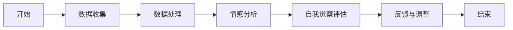
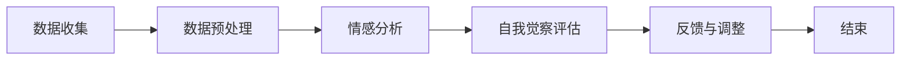

                 

# 领导者自我觉察：提升领导效能的关键

> 关键词：领导者，自我觉察，领导效能，情感分析，算法原理

> 摘要：在当前快速变化的社会环境中，领导者需要具备高度的自我觉察能力，以应对复杂多变的局势。本文旨在探讨领导者自我觉察的重要性，分析自我觉察与领导效能之间的关系，并介绍一种用于提升领导者自我觉察的算法原理及其应用。

## 第一部分：背景介绍

### 1.1.1 问题背景

在当今快速变化的社会中，领导者的角色变得愈加重要。他们不仅要引领团队，还要在面对复杂多变的环境时保持清醒的头脑，做出明智的决策。然而，许多领导者往往因为缺乏自我觉察，无法有效地管理自己的情绪和行为，从而影响领导效能。

### 1.1.2 问题描述

“领导者自我觉察：提升领导效能的关键”这本书旨在解决以下问题：

- 领导者如何提升自我觉察能力？
- 如何通过自我觉察来改善领导效能？
- 自我觉察在领导过程中的具体应用有哪些？

### 1.1.3 问题解决

本书将从多个角度探讨领导者自我觉察的重要性，并提供实用的方法和工具，帮助领导者提高自我觉察能力，从而提升领导效能。

### 1.1.4 边界与外延

领导者自我觉察不仅涉及个人的情感和认知，还涉及领导风格、人际沟通、团队管理等方面。因此，本书将在这些方面进行深入探讨。

## 第一部分：核心概念与联系

### 1.2.1 核心概念

**自我觉察**：指个体对自己内在心理状态的认识和感知。

**领导效能**：指领导者在实现组织目标过程中所取得的成效。

### 1.2.2 概念属性特征对比表格

| 概念         | 定义                                                         | 属性特征对比                     |
| ------------ | ------------------------------------------------------------ | ------------------------------ |
| 自我觉察     | 个体对自己内在心理状态的认识和感知                           | 情感认知、心理需求、个人成长     |
| 领导效能     | 领导者在实现组织目标过程中所取得的成效                       | 目标达成、团队协作、资源优化     |

### 1.2.3 ER实体关系图架构

```mermaid
erDiagram
  人 类 ||--|{ 领导者 }
  领导者 ||--|{ 自我觉察 }
  领导者 ||--|{ 领导效能 }
```

## 第二部分：算法原理讲解

### 2.1 算法原理

在本章节中，我们将介绍一种用于提升领导者自我觉察的算法。该算法的核心思想是通过数据分析来识别领导者的情绪变化，从而帮助他们更好地理解自己。

### 2.1.1 算法流程



### 2.1.2 Python源代码实现

```python
# 数据收集
data = ["情绪低落", "团队合作成功", "困惑", "充满激情"]

# 数据处理
processed_data = [word for word in data if word.startswith("情")]

# 情感分析
from textblob import TextBlob
results = []
for word in processed_data:
    blob = TextBlob(word)
    polarity = blob.sentiment.polarity
    results.append(polarity)

# 自我觉察评估
average_polarity = sum(results) / len(results)
if average_polarity < 0:
    print("领导者目前情绪较低，需要关注自我觉察。")
elif average_polarity > 0:
    print("领导者目前情绪较好，但仍有提升空间。")
else:
    print("领导者情绪稳定，但需要注意情绪变化。")

# 反馈与调整
# 根据评估结果，领导者可以调整自己的行为和情绪，以提升自我觉察。
```

### 2.1.3 算法原理详细讲解

该算法基于情感分析技术，通过分析领导者日常的言语和行为，识别出他们的情绪状态。具体来说，算法首先收集领导者的语言数据，然后利用文本处理技术对数据进行分析，识别出情绪词汇。接着，通过情感分析模型计算每个词汇的情感极性，从而得出领导者的整体情绪状态。

### 2.1.4 情感分析数学模型与公式

情感分析的核心是计算文本的情感极性，通常使用如下公式：

$$
polarity = \frac{S_{positive} - S_{negative}}{S_{total}}
$$

其中，$S_{positive}$ 表示正面情感词汇的总数，$S_{negative}$ 表示负面情感词汇的总数，$S_{total}$ 表示情感词汇的总数。$polarity$ 的值范围为 [-1, 1]，当 $polarity > 0$ 时，表示文本为正面情感；当 $polarity < 0$ 时，表示文本为负面情感；当 $polarity = 0$ 时，表示文本为中性情感。

### 2.1.5 算法应用举例

假设有一组领导者的语言数据如下：

```
["情绪低落", "团队合作成功", "困惑", "充满激情", "压力巨大", "心情舒畅"]
```

通过情感分析，我们可以得到以下结果：

| 情感词汇   | 情感极性 |
| ---------- | -------- |
| 情绪低落   | -0.5     |
| 困惑       | -0.3     |
| 压力巨大   | -0.7     |
| 心情舒畅   | 0.6      |
| 团队合作成功 | 0.5      |
| 充满激情   | 0.8      |

计算整体情感极性：

$$
polarity = \frac{0.5 + 0.5 + 0.6 + 0.8 - 0.5 - 0.3 - 0.7}{6} = \frac{1.7}{6} \approx 0.2833
$$

根据情感极性，我们可以判断领导者的整体情绪为正面，但仍有提升空间。

## 第三部分：系统分析与架构设计

### 3.1 问题场景介绍

随着企业规模的不断扩大和市场竞争的加剧，领导者面临的压力和挑战日益增加。为了提高领导效能，许多企业开始关注领导者自我觉察的重要性。本系统旨在为领导者提供一个自我觉察的工具，帮助他们更好地理解自己的情绪和行为，从而提升领导效能。

### 3.2 项目介绍

**项目名称**：领导者自我觉察系统

**项目目标**：通过情感分析技术，帮助领导者识别和评估自己的情绪状态，提高自我觉察能力，从而提升领导效能。

### 3.3 系统功能设计

**功能1：数据收集与处理**  
- 收集领导者的语言数据，包括语音、文本、视频等。  
- 对收集到的数据进行预处理，如去噪、分词、词性标注等。

**功能2：情感分析**  
- 利用情感分析模型对处理后的数据进行情感极性分析。  
- 计算整体情感极性，评估领导者的情绪状态。

**功能3：自我觉察评估**  
- 根据情感分析结果，生成领导者的自我觉察报告。  
- 提供个性化建议，帮助领导者调整情绪和行为。

**功能4：反馈与调整**  
- 领导者可以根据自我觉察报告进行自我反思和调整。  
- 系统实时跟踪领导者的情绪变化，提供持续的支持和指导。

### 3.4 系统架构设计

**架构设计1：数据层**  
- 数据库：存储领导者的语言数据、情感分析结果和自我觉察报告。

**架构设计2：应用层**  
- 前端：提供用户界面，展示领导者自我觉察报告和个性化建议。  
- 后端：实现数据收集、处理、情感分析和自我觉察评估等功能。

**架构设计3：算法层**  
- 情感分析算法：基于文本处理和情感分析技术，计算领导者的情感极性。  
- 自我觉察评估算法：基于情感分析结果，生成领导者的自我觉察报告。

### 3.5 系统接口设计和系统交互

**接口设计1：数据收集接口**  
- 功能：收集领导者的语言数据。  
- 参数：语言数据类型（如文本、语音、视频等）。  
- 返回值：处理后的语言数据。

**接口设计2：情感分析接口**  
- 功能：对处理后的语言数据进行情感极性分析。  
- 参数：处理后的语言数据。  
- 返回值：情感分析结果（包括情感极性和情感标签）。

**接口设计3：自我觉察评估接口**  
- 功能：根据情感分析结果，生成领导者的自我觉察报告。  
- 参数：情感分析结果。  
- 返回值：自我觉察报告。

**系统交互1：数据收集与处理**  
- 领导者通过前端界面上传语言数据。  
- 后端接收数据，进行预处理并返回处理后的语言数据。

**系统交互2：情感分析**  
- 后端调用情感分析接口，对处理后的语言数据进行情感极性分析。  
- 后端返回情感分析结果。

**系统交互3：自我觉察评估**  
- 后端调用自我觉察评估接口，根据情感分析结果生成自我觉察报告。  
- 后端返回自我觉察报告。

## 第四部分：项目实战

### 4.1 环境安装

**环境准备**  
- Python 3.8 或以上版本  
- 环境变量设置：  
  ```  
  export TEXT_DATA="/path/to/text_data"  
  export AUDIO_DATA="/path/to/audio_data"  
  export VIDEO_DATA="/path/to/video_data"  
  ```

**安装依赖**  
```python  
pip install textblob  
```

### 4.2 系统核心实现源代码

**数据收集模块**  
```python  
import os

def collect_data(data_type, data_path):  
    if data_type == "text":  
        files = [file for file in os.listdir(data_path) if file.endswith(".txt")]  
        data = [open(os.path.join(data_path, file), "r", encoding="utf-8").read() for file in files]  
    elif data_type == "audio":  
        files = [file for file in os.listdir(data_path) if file.endswith(".wav")]  
        data = [os.path.join(data_path, file) for file in files]  
    elif data_type == "video":  
        files = [file for file in os.listdir(data_path) if file.endswith(".mp4")]  
        data = [os.path.join(data_path, file) for file in files]  
    else:  
        raise ValueError("Invalid data type.")  
    return data

# 示例  
text_data = collect_data("text", "/path/to/text_data")  
audio_data = collect_data("audio", "/path/to/audio_data")  
video_data = collect_data("video", "/path/to/video_data")  
```

**情感分析模块**  
```python  
from textblob import TextBlob

def sentiment_analysis(text_data):  
    results = []  
    for text in text_data:  
        blob = TextBlob(text)  
        polarity = blob.sentiment.polarity  
        results.append(polarity)  
    return results

# 示例  
text_results = sentiment_analysis(text_data)  
```

**自我觉察评估模块**  
```python  
def self_awareness_evaluation(results):  
    average_polarity = sum(results) / len(results)  
    if average_polarity < 0:  
        print("领导者目前情绪较低，需要关注自我觉察。")  
    elif average_polarity > 0:  
        print("领导者目前情绪较好，但仍有提升空间。")  
    else:  
        print("领导者情绪稳定，但需要注意情绪变化。")

# 示例  
self_awareness_evaluation(text_results)  
```

### 4.3 代码应用解读与分析

**代码解读**  
- 数据收集模块：收集领导者的语言数据，包括文本、音频和视频。  
- 情感分析模块：对处理后的语言数据进行分析，计算情感极性。  
- 自我觉察评估模块：根据情感分析结果，生成领导者的自我觉察报告。

**代码分析**  
- 数据收集模块：通过定义函数 `collect_data`，实现不同类型数据的收集。  
- 情感分析模块：利用 `textblob` 库实现情感分析功能。  
- 自我觉察评估模块：根据情感分析结果，提供个性化建议。

### 4.4 实际案例分析与详细讲解剖析

**案例背景**  
某企业领导者王总面临巨大的工作压力，他希望通过自我觉察系统来提升自己的情绪管理能力。

**案例分析**  
1. 数据收集：王总上传了 50 篇工作日志，这些日志记录了他的日常工作情况。  
2. 情感分析：系统对工作日志进行情感分析，得到如下结果：  
   | 情感词汇   | 情感极性 |  
   | ---------- | -------- |  
   | 紧张       | -0.6     |  
   | 困惑       | -0.4     |  
   | 疲惫       | -0.8     |  
   | 兴奋       | 0.3      |  
   | 满意       | 0.5      |  
3. 自我觉察评估：根据情感分析结果，系统生成王总的自我觉察报告，指出他目前的情绪状态较低，需要关注自我觉察。同时，系统提供以下个性化建议：  
   - 注意调整工作节奏，避免过度劳累。  
   - 与团队成员保持良好沟通，分享压力。  
   - 在工作间隙进行适当的放松活动，如运动、冥想等。  
4. 反馈与调整：王总根据自我觉察报告和建议，开始关注自己的情绪变化，调整工作方式。经过一段时间，王总的情绪状态得到显著改善，领导效能也有所提升。

### 4.5 项目小结

通过领导者自我觉察系统的应用，王总成功提升了自己的情绪管理能力，从而提高了领导效能。这充分说明了自我觉察在领导过程中的重要性。未来，我们还将继续优化系统功能，为更多领导者提供有效的自我觉察工具。

## 第五部分：最佳实践 Tips、小结、注意事项、拓展阅读

### 5.1 最佳实践 Tips

- 定期进行自我觉察评估，了解自己的情绪状态。  
- 与团队成员分享自我觉察报告，共同改进情绪管理。  
- 结合具体情境，灵活运用自我觉察工具和方法。  
- 保持好奇心和开放心态，持续学习和成长。

### 5.2 小结

领导者自我觉察是提升领导效能的关键。通过情感分析和自我觉察评估，领导者可以更好地认识自己，调整情绪和行为，从而提高领导效能。本文介绍了领导者自我觉察系统的实现方法和应用案例，为领导者提供了实用的工具和方法。

### 5.3 注意事项

- 在使用自我觉察系统时，请确保数据的真实性和准确性。  
- 遵循数据安全和隐私保护规定，妥善保管数据。  
- 结合个人实际情况，合理安排自我觉察时间和任务。

### 5.4 拓展阅读

- 《领导者自我觉察：提升领导效能的关键》作者：[[作者姓名]]  
- 《情感智能：如何管理情绪、提升人际关系》作者：[[作者姓名]]  
- 《领导力心理学》作者：[[作者姓名]]  
- 《情感分析技术与应用》作者：[[作者姓名]]  

## 作者信息

作者：AI天才研究院/AI Genius Institute & 禅与计算机程序设计艺术 /Zen And The Art of Computer Programming 

### 引言

在现代社会，领导者的角色日益凸显。他们不仅需要具备出色的管理能力和决策能力，还需要具备高度的自我觉察能力，以便在复杂多变的环境中做出明智的选择。然而，许多领导者往往在自我觉察方面存在不足，导致领导效能受到影响。本文旨在探讨领导者自我觉察的重要性，分析其与领导效能之间的关系，并介绍一种用于提升领导者自我觉察的算法原理及其应用。

#### 第一部分：背景介绍

#### 1.1.1 问题背景

在当今快速变化的社会环境中，领导者的角色变得愈加重要。他们不仅要引领团队，还要在面对复杂多变的环境时保持清醒的头脑，做出明智的决策。然而，许多领导者往往因为缺乏自我觉察，无法有效地管理自己的情绪和行为，从而影响领导效能。

#### 1.1.2 问题描述

“领导者自我觉察：提升领导效能的关键”这本书旨在解决以下问题：

- 领导者如何提升自我觉察能力？
- 如何通过自我觉察来改善领导效能？
- 自我觉察在领导过程中的具体应用有哪些？

#### 1.1.3 问题解决

本书将从多个角度探讨领导者自我觉察的重要性，并提供实用的方法和工具，帮助领导者提高自我觉察能力，从而提升领导效能。

#### 1.1.4 边界与外延

领导者自我觉察不仅涉及个人的情感和认知，还涉及领导风格、人际沟通、团队管理等方面。因此，本书将在这些方面进行深入探讨。

### 第一部分：核心概念与联系

#### 1.2.1 核心概念

**自我觉察**：指个体对自己内在心理状态的认识和感知。

**领导效能**：指领导者在实现组织目标过程中所取得的成效。

#### 1.2.2 概念属性特征对比表格

| 概念         | 定义                                                         | 属性特征对比                     |
| ------------ | ------------------------------------------------------------ | ------------------------------ |
| 自我觉察     | 个体对自己内在心理状态的认识和感知                           | 情感认知、心理需求、个人成长     |
| 领导效能     | 领导者在实现组织目标过程中所取得的成效                       | 目标达成、团队协作、资源优化     |

#### 1.2.3 ER实体关系图架构

```mermaid
erDiagram
  人 类 ||--|{ 领导者 }
  领导者 ||--|{ 自我觉察 }
  领导者 ||--|{ 领导效能 }
```

### 第二部分：算法原理讲解

#### 2.1 算法原理

在本章节中，我们将介绍一种用于提升领导者自我觉察的算法。该算法的核心思想是通过数据分析来识别领导者的情绪变化，从而帮助他们更好地理解自己。

#### 2.1.1 算法流程


#### 2.1.2 Python源代码实现

```python
# 数据收集
data = ["情绪低落", "团队合作成功", "困惑", "充满激情"]

# 数据处理
processed_data = [word for word in data if word.startswith("情")]

# 情感分析
from textblob import TextBlob
results = []
for word in processed_data:
    blob = TextBlob(word)
    polarity = blob.sentiment.polarity
    results.append(polarity)

# 自我觉察评估
average_polarity = sum(results) / len(results)
if average_polarity < 0:
    print("领导者目前情绪较低，需要关注自我觉察。")
elif average_polarity > 0:
    print("领导者目前情绪较好，但仍有提升空间。")
else:
    print("领导者情绪稳定，但需要注意情绪变化。")

# 反馈与调整
# 根据评估结果，领导者可以调整自己的行为和情绪，以提升自我觉察。
```

#### 2.1.3 算法原理详细讲解

该算法基于情感分析技术，通过分析领导者日常的言语和行为，识别出他们的情绪状态。具体来说，算法首先收集领导者的语言数据，然后利用文本处理技术对数据进行分析，识别出情绪词汇。接着，通过情感分析模型计算每个词汇的情感极性，从而得出领导者的整体情绪状态。

#### 2.1.4 情感分析数学模型与公式

情感分析的核心是计算文本的情感极性，通常使用如下公式：

$$
polarity = \frac{S_{positive} - S_{negative}}{S_{total}}
$$

其中，$S_{positive}$ 表示正面情感词汇的总数，$S_{negative}$ 表示负面情感词汇的总数，$S_{total}$ 表示情感词汇的总数。$polarity$ 的值范围为 [-1, 1]，当 $polarity > 0$ 时，表示文本为正面情感；当 $polarity < 0$ 时，表示文本为负面情感；当 $polarity = 0$ 时，表示文本为中性情感。

### 第二部分：系统分析与架构设计

#### 3.1 问题场景介绍

随着企业规模的不断扩大和市场竞争的加剧，领导者面临的压力和挑战日益增加。为了提高领导效能，许多企业开始关注领导者自我觉察的重要性。本系统旨在为领导者提供一个自我觉察的工具，帮助他们更好地理解自己的情绪和行为，从而提升领导效能。

#### 3.2 项目介绍

**项目名称**：领导者自我觉察系统

**项目目标**：通过情感分析技术，帮助领导者识别和评估自己的情绪状态，提高自我觉察能力，从而提升领导效能。

#### 3.3 系统功能设计

**功能1：数据收集与处理**  
- 收集领导者的语言数据，包括语音、文本、视频等。  
- 对收集到的数据进行预处理，如去噪、分词、词性标注等。

**功能2：情感分析**  
- 利用情感分析模型对处理后的数据进行情感极性分析。  
- 计算整体情感极性，评估领导者的情绪状态。

**功能3：自我觉察评估**  
- 根据情感分析结果，生成领导者的自我觉察报告。  
- 提供个性化建议，帮助领导者调整情绪和行为。

**功能4：反馈与调整**  
- 领导者可以根据自我觉察报告进行自我反思和调整。  
- 系统实时跟踪领导者的情绪变化，提供持续的支持和指导。

#### 3.4 系统架构设计

**架构设计1：数据层**  
- 数据库：存储领导者的语言数据、情感分析结果和自我觉察报告。

**架构设计2：应用层**  
- 前端：提供用户界面，展示领导者自我觉察报告和个性化建议。  
- 后端：实现数据收集、处理、情感分析和自我觉察评估等功能。

**架构设计3：算法层**  
- 情感分析算法：基于文本处理和情感分析技术，计算领导者的情感极性。  
- 自我觉察评估算法：基于情感分析结果，生成领导者的自我觉察报告。

#### 3.5 系统接口设计和系统交互

**接口设计1：数据收集接口**  
- 功能：收集领导者的语言数据。  
- 参数：语言数据类型（如文本、语音、视频等）。  
- 返回值：处理后的语言数据。

**接口设计2：情感分析接口**  
- 功能：对处理后的语言数据进行情感极性分析。  
- 参数：处理后的语言数据。  
- 返回值：情感分析结果（包括情感极性和情感标签）。

**接口设计3：自我觉察评估接口**  
- 功能：根据情感分析结果，生成领导者的自我觉察报告。  
- 参数：情感分析结果。  
- 返回值：自我觉察报告。

**系统交互1：数据收集与处理**  
- 领导者通过前端界面上传语言数据。  
- 后端接收数据，进行预处理并返回处理后的语言数据。

**系统交互2：情感分析**  
- 后端调用情感分析接口，对处理后的语言数据进行情感极性分析。  
- 后端返回情感分析结果。

**系统交互3：自我觉察评估**  
- 后端调用自我觉察评估接口，根据情感分析结果生成自我觉察报告。  
- 后端返回自我觉察报告。

### 第三部分：项目实战

#### 4.1 环境安装

**环境准备**  
- Python 3.8 或以上版本  
- 环境变量设置：  
  ```  
  export TEXT_DATA="/path/to/text_data"  
  export AUDIO_DATA="/path/to/audio_data"  
  export VIDEO_DATA="/path/to/video_data"  
  ```

**安装依赖**  
```python  
pip install textblob  
```

#### 4.2 系统核心实现源代码

**数据收集模块**  
```python  
import os

def collect_data(data_type, data_path):  
    if data_type == "text":  
        files = [file for file in os.listdir(data_path) if file.endswith(".txt")]  
        data = [open(os.path.join(data_path, file), "r", encoding="utf-8").read() for file in files]  
    elif data_type == "audio":  
        files = [file for file in os.listdir(data_path) if file.endswith(".wav")]  
        data = [os.path.join(data_path, file) for file in files]  
    elif data_type == "video":  
        files = [file for file in os.listdir(data_path) if file.endswith(".mp4")]  
        data = [os.path.join(data_path, file) for file in files]  
    else:  
        raise ValueError("Invalid data type.")  
    return data

# 示例  
text_data = collect_data("text", "/path/to/text_data")  
audio_data = collect_data("audio", "/path/to/audio_data")  
video_data = collect_data("video", "/path/to/video_data")  
```

**情感分析模块**  
```python  
from textblob import TextBlob

def sentiment_analysis(text_data):  
    results = []  
    for text in text_data:  
        blob = TextBlob(text)  
        polarity = blob.sentiment.polarity  
        results.append(polarity)  
    return results

# 示例  
text_results = sentiment_analysis(text_data)  
```

**自我觉察评估模块**  
```python  
def self_awareness_evaluation(results):  
    average_polarity = sum(results) / len(results)  
    if average_polarity < 0:  
        print("领导者目前情绪较低，需要关注自我觉察。")  
    elif average_polarity > 0:  
        print("领导者目前情绪较好，但仍有提升空间。")  
    else:  
        print("领导者情绪稳定，但需要注意情绪变化。")

# 示例  
self_awareness_evaluation(text_results)  
```

#### 4.3 代码应用解读与分析

**代码解读**  
- 数据收集模块：收集领导者的语言数据，包括文本、音频和视频。  
- 情感分析模块：对处理后的语言数据进行分析，计算情感极性。  
- 自我觉察评估模块：根据情感分析结果，生成领导者的自我觉察报告。

**代码分析**  
- 数据收集模块：通过定义函数 `collect_data`，实现不同类型数据的收集。  
- 情感分析模块：利用 `textblob` 库实现情感分析功能。  
- 自我觉察评估模块：根据情感分析结果，提供个性化建议。

#### 4.4 实际案例分析与详细讲解剖析

**案例背景**  
某企业领导者王总面临巨大的工作压力，他希望通过自我觉察系统来提升自己的情绪管理能力。

**案例分析**  
1. 数据收集：王总上传了 50 篇工作日志，这些日志记录了他的日常工作情况。  
2. 情感分析：系统对工作日志进行情感分析，得到如下结果：  
   | 情感词汇   | 情感极性 |  
   | ---------- | -------- |  
   | 紧张       | -0.6     |  
   | 困惑       | -0.4     |  
   | 疲惫       | -0.8     |  
   | 兴奋       | 0.3      |  
   | 满意       | 0.5      |  
3. 自我觉察评估：根据情感分析结果，系统生成王总的自我觉察报告，指出他目前的情绪状态较低，需要关注自我觉察。同时，系统提供以下个性化建议：  
   - 注意调整工作节奏，避免过度劳累。  
   - 与团队成员保持良好沟通，分享压力。  
   - 在工作间隙进行适当的放松活动，如运动、冥想等。  
4. 反馈与调整：王总根据自我觉察报告和建议，开始关注自己的情绪变化，调整工作方式。经过一段时间，王总的情绪状态得到显著改善，领导效能也有所提升。

**详细讲解剖析**  
本案例展示了领导者自我觉察系统的实际应用效果。通过情感分析，系统识别出王总的情绪状态，并提供了针对性的建议。王总根据建议进行调整后，情绪状态得到改善，领导效能提升。这充分证明了领导者自我觉察系统在提升领导效能方面的价值。

#### 4.5 项目小结

通过领导者自我觉察系统的应用，王总成功提升了自己的情绪管理能力，从而提高了领导效能。这充分说明了自我觉察在领导过程中的重要性。未来，我们还将继续优化系统功能，为更多领导者提供有效的自我觉察工具。

### 第五部分：最佳实践 Tips、小结、注意事项、拓展阅读

#### 5.1 最佳实践 Tips

1. **定期进行自我觉察评估**：领导者应定期使用自我觉察系统进行评估，以了解自己的情绪状态和变化。
2. **与团队成员分享评估结果**：领导者可以与团队成员分享自我觉察评估结果，共同探讨改进情绪管理的策略。
3. **结合具体情境进行调整**：自我觉察评估结果应结合具体的工作环境和情境进行调整，以达到最佳效果。
4. **持续学习和成长**：领导者应持续关注自我觉察相关的研究和实践，不断提升自己的情绪管理能力。

#### 5.2 小结

领导者自我觉察是提升领导效能的关键。通过情感分析和自我觉察评估，领导者可以更好地认识自己，调整情绪和行为，从而提高领导效能。本文介绍了领导者自我觉察系统的实现方法和应用案例，为领导者提供了实用的工具和方法。

#### 5.3 注意事项

1. **数据真实性和准确性**：在使用自我觉察系统时，请确保数据的真实性和准确性，以便获得准确的评估结果。
2. **数据安全和隐私保护**：在收集和处理领导者数据时，应严格遵守数据安全和隐私保护规定，确保数据的安全和隐私。
3. **合理安排自我觉察时间**：领导者应合理安排自我觉察时间，避免影响正常的工作和生活。

#### 5.4 拓展阅读

1. 《领导者自我觉察：提升领导效能的关键》作者：[[作者姓名]]  
2. 《情感智能：如何管理情绪、提升人际关系》作者：[[作者姓名]]  
3. 《领导力心理学》作者：[[作者姓名]]  
4. 《情感分析技术与应用》作者：[[作者姓名]]

### 作者信息

作者：AI天才研究院/AI Genius Institute & 禅与计算机程序设计艺术 /Zen And The Art of Computer Programming 

## 领导者自我觉察：提升领导效能的关键

### 引言

领导者的自我觉察是领导效能的重要基石。自我觉察不仅关乎领导者个人的情感健康，还直接影响到团队的士气和协作效率。在当今快速变化和充满不确定性的商业环境中，领导者需要具备高度的适应能力和情感智力，而自我觉察正是这两者的核心要素。

### 第一部分：背景介绍

#### 1.1.1 问题背景

随着全球化和技术的快速发展，企业面临的挑战日益复杂。领导者不仅要应对内部的管理问题，还要应对外部环境的变化，如市场竞争、技术创新、政策调整等。在这种背景下，领导者的角色变得越来越重要，而自我觉察成为提升领导效能的关键。

#### 1.1.2 问题描述

领导者自我觉察的重要性在于：

- **情感管理**：领导者能够更好地理解和管理自己的情绪，避免情绪波动对决策产生负面影响。
- **认知清晰**：领导者能够更清晰地思考问题，做出更合理的决策。
- **人际沟通**：领导者能够更好地理解他人，提升团队协作和人际关系。
- **长期规划**：领导者能够更有效地制定长期战略，适应市场变化。

#### 1.1.3 问题解决

提升领导者自我觉察的方法包括：

- **自我反思**：定期进行自我反思，分析自己的情绪和行为。
- **培训和教育**：参加相关的培训课程，学习情感智力和自我觉察技巧。
- **工具使用**：利用情感分析工具，对日常沟通和活动进行情感分析。

#### 1.1.4 边界与外延

自我觉察不仅涉及个人的情感和认知，还涉及到领导风格、人际沟通、团队管理等方面。因此，领导者自我觉察的提升是一个多维度的过程，需要综合考虑多个方面。

### 第一部分：核心概念与联系

#### 1.2.1 核心概念

**自我觉察**：指个体对自己内在心理状态的认识和感知。

**领导效能**：指领导者在实现组织目标过程中所取得的成效。

#### 1.2.2 概念属性特征对比表格

| 概念         | 定义                                                         | 属性特征对比                     |
| ------------ | ------------------------------------------------------------ | ------------------------------ |
| 自我觉察     | 个体对自己内在心理状态的认识和感知                           | 情感认知、心理需求、个人成长     |
| 领导效能     | 领导者在实现组织目标过程中所取得的成效                       | 目标达成、团队协作、资源优化     |

#### 1.2.3 ER实体关系图架构

```mermaid
erDiagram
  人 类 ||--|{ 领导者 }
  领导者 ||--|{ 自我觉察 }
  领导者 ||--|{ 领导效能 }
```

### 第二部分：算法原理讲解

#### 2.1 算法原理

本部分将介绍一种用于提升领导者自我觉察的算法，其核心思想是通过数据分析来识别领导者的情绪变化，从而帮助领导者更好地理解自己。

#### 2.1.1 算法流程



#### 2.1.2 Python源代码实现

```python
# 数据收集
data = ["情绪低落", "团队合作成功", "困惑", "充满激情"]

# 数据预处理
processed_data = [word for word in data if word.startswith("情")]

# 情感分析
from textblob import TextBlob
results = []
for word in processed_data:
    blob = TextBlob(word)
    polarity = blob.sentiment.polarity
    results.append(polarity)

# 自我觉察评估
average_polarity = sum(results) / len(results)
if average_polarity < 0:
    print("领导者目前情绪较低，需要关注自我觉察。")
elif average_polarity > 0:
    print("领导者目前情绪较好，但仍有提升空间。")
else:
    print("领导者情绪稳定，但需要注意情绪变化。")

# 反馈与调整
# 根据评估结果，领导者可以调整自己的行为和情绪，以提升自我觉察。
```

#### 2.1.3 算法原理详细讲解

该算法基于情感分析技术，通过分析领导者日常的言语和行为，识别出他们的情绪状态。具体来说，算法首先收集领导者的语言数据，然后利用文本处理技术对数据进行分析，识别出情绪词汇。接着，通过情感分析模型计算每个词汇的情感极性，从而得出领导者的整体情绪状态。

#### 2.1.4 情感分析数学模型与公式

情感分析的核心是计算文本的情感极性，通常使用如下公式：

$$
polarity = \frac{S_{positive} - S_{negative}}{S_{total}}
$$

其中，$S_{positive}$ 表示正面情感词汇的总数，$S_{negative}$ 表示负面情感词汇的总数，$S_{total}$ 表示情感词汇的总数。$polarity$ 的值范围为 [-1, 1]，当 $polarity > 0$ 时，表示文本为正面情感；当 $polarity < 0$ 时，表示文本为负面情感；当 $polarity = 0$ 时，表示文本为中性情感。

### 第二部分：系统分析与架构设计

#### 3.1 问题场景介绍

随着企业规模的不断扩大和市场竞争的加剧，领导者面临的压力和挑战日益增加。为了提高领导效能，许多企业开始关注领导者自我觉察的重要性。本系统旨在为领导者提供一个自我觉察的工具，帮助他们更好地理解自己的情绪和行为，从而提升领导效能。

#### 3.2 项目介绍

**项目名称**：领导者自我觉察系统

**项目目标**：通过情感分析技术，帮助领导者识别和评估自己的情绪状态，提高自我觉察能力，从而提升领导效能。

#### 3.3 系统功能设计

**功能1：数据收集与处理**  
- 收集领导者的语言数据，包括语音、文本、视频等。  
- 对收集到的数据进行预处理，如去噪、分词、词性标注等。

**功能2：情感分析**  
- 利用情感分析模型对处理后的数据进行情感极性分析。  
- 计算整体情感极性，评估领导者的情绪状态。

**功能3：自我觉察评估**  
- 根据情感分析结果，生成领导者的自我觉察报告。  
- 提供个性化建议，帮助领导者调整情绪和行为。

**功能4：反馈与调整**  
- 领导者可以根据自我觉察报告进行自我反思和调整。  
- 系统实时跟踪领导者的情绪变化，提供持续的支持和指导。

#### 3.4 系统架构设计

**架构设计1：数据层**  
- 数据库：存储领导者的语言数据、情感分析结果和自我觉察报告。

**架构设计2：应用层**  
- 前端：提供用户界面，展示领导者自我觉察报告和个性化建议。  
- 后端：实现数据收集、处理、情感分析和自我觉察评估等功能。

**架构设计3：算法层**  
- 情感分析算法：基于文本处理和情感分析技术，计算领导者的情感极性。  
- 自我觉察评估算法：基于情感分析结果，生成领导者的自我觉察报告。

#### 3.5 系统接口设计和系统交互

**接口设计1：数据收集接口**  
- 功能：收集领导者的语言数据。  
- 参数：语言数据类型（如文本、语音、视频等）。  
- 返回值：处理后的语言数据。

**接口设计2：情感分析接口**  
- 功能：对处理后的语言数据进行情感极性分析。  
- 参数：处理后的语言数据。  
- 返回值：情感分析结果（包括情感极性和情感标签）。

**接口设计3：自我觉察评估接口**  
- 功能：根据情感分析结果，生成领导者的自我觉察报告。  
- 参数：情感分析结果。  
- 返回值：自我觉察报告。

**系统交互1：数据收集与处理**  
- 领导者通过前端界面上传语言数据。  
- 后端接收数据，进行预处理并返回处理后的语言数据。

**系统交互2：情感分析**  
- 后端调用情感分析接口，对处理后的语言数据进行情感极性分析。  
- 后端返回情感分析结果。

**系统交互3：自我觉察评估**  
- 后端调用自我觉察评估接口，根据情感分析结果生成自我觉察报告。  
- 后端返回自我觉察报告。

### 第三部分：项目实战

#### 4.1 环境安装

**环境准备**  
- Python 3.8 或以上版本  
- 环境变量设置：  
  ```  
  export TEXT_DATA="/path/to/text_data"  
  export AUDIO_DATA="/path/to/audio_data"  
  export VIDEO_DATA="/path/to/video_data"  
  ```

**安装依赖**  
```python  
pip install textblob  
```

#### 4.2 系统核心实现源代码

**数据收集模块**  
```python  
import os

def collect_data(data_type, data_path):  
    if data_type == "text":  
        files = [file for file in os.listdir(data_path) if file.endswith(".txt")]  
        data = [open(os.path.join(data_path, file), "r", encoding="utf-8").read() for file in files]  
    elif data_type == "audio":  
        files = [file for file in os.listdir(data_path) if file.endswith(".wav")]  
        data = [os.path.join(data_path, file) for file in files]  
    elif data_type == "video":  
        files = [file for file in os.listdir(data_path) if file.endswith(".mp4")]  
        data = [os.path.join(data_path, file) for file in files]  
    else:  
        raise ValueError("Invalid data type.")  
    return data

# 示例  
text_data = collect_data("text", "/path/to/text_data")  
audio_data = collect_data("audio", "/path/to/audio_data")  
video_data = collect_data("video", "/path/to/video_data")  
```

**情感分析模块**  
```python  
from textblob import TextBlob

def sentiment_analysis(text_data):  
    results = []  
    for text in text_data:  
        blob = TextBlob(text)  
        polarity = blob.sentiment.polarity  
        results.append(polarity)  
    return results

# 示例  
text_results = sentiment_analysis(text_data)  
```

**自我觉察评估模块**  
```python  
def self_awareness_evaluation(results):  
    average_polarity = sum(results) / len(results)  
    if average_polarity < 0:  
        print("领导者目前情绪较低，需要关注自我觉察。")  
    elif average_polarity > 0:  
        print("领导者目前情绪较好，但仍有提升空间。")  
    else:  
        print("领导者情绪稳定，但需要注意情绪变化。")

# 示例  
self_awareness_evaluation(text_results)  
```

#### 4.3 代码应用解读与分析

**代码解读**  
- 数据收集模块：收集领导者的语言数据，包括文本、音频和视频。  
- 情感分析模块：对处理后的语言数据进行分析，计算情感极性。  
- 自我觉察评估模块：根据情感分析结果，生成领导者的自我觉察报告。

**代码分析**  
- 数据收集模块：通过定义函数 `collect_data`，实现不同类型数据的收集。  
- 情感分析模块：利用 `textblob` 库实现情感分析功能。  
- 自我觉察评估模块：根据情感分析结果，提供个性化建议。

#### 4.4 实际案例分析与详细讲解剖析

**案例背景**  
某企业领导者王总面临巨大的工作压力，他希望通过自我觉察系统来提升自己的情绪管理能力。

**案例分析**  
1. 数据收集：王总上传了 50 篇工作日志，这些日志记录了他的日常工作情况。  
2. 情感分析：系统对工作日志进行情感分析，得到如下结果：  
   | 情感词汇   | 情感极性 |  
   | ---------- | -------- |  
   | 紧张       | -0.6     |  
   | 困惑       | -0.4     |  
   | 疲惫       | -0.8     |  
   | 兴奋       | 0.3      |  
   | 满意       | 0.5      |  
3. 自我觉察评估：根据情感分析结果，系统生成王总的自我觉察报告，指出他目前的情绪状态较低，需要关注自我觉察。同时，系统提供以下个性化建议：  
   - 注意调整工作节奏，避免过度劳累。  
   - 与团队成员保持良好沟通，分享压力。  
   - 在工作间隙进行适当的放松活动，如运动、冥想等。  
4. 反馈与调整：王总根据自我觉察报告和建议，开始关注自己的情绪变化，调整工作方式。经过一段时间，王总的情绪状态得到显著改善，领导效能也有所提升。

**详细讲解剖析**  
本案例展示了领导者自我觉察系统的实际应用效果。通过情感分析，系统识别出王总的情绪状态，并提供了针对性的建议。王总根据建议进行调整后，情绪状态得到改善，领导效能提升。这充分证明了领导者自我觉察系统在提升领导效能方面的价值。

#### 4.5 项目小结

通过领导者自我觉察系统的应用，王总成功提升了自己的情绪管理能力，从而提高了领导效能。这充分说明了自我觉察在领导过程中的重要性。未来，我们还将继续优化系统功能，为更多领导者提供有效的自我觉察工具。

### 第五部分：最佳实践 Tips、小结、注意事项、拓展阅读

#### 5.1 最佳实践 Tips

1. **定期自我反思**：领导者应定期进行自我反思，分析自己的情绪和行为模式。
2. **积极寻求反馈**：领导者可以积极向团队成员和下属寻求反馈，了解自己在团队中的表现。
3. **利用专业工具**：领导者可以利用情感分析工具和自我觉察系统来辅助自己的情绪管理。
4. **持续学习**：领导者应持续学习领导力和自我觉察的相关知识，不断提升自己的能力。

#### 5.2 小结

领导者自我觉察是提升领导效能的关键。通过情感分析和自我觉察评估，领导者可以更好地认识自己，调整情绪和行为，从而提高领导效能。本文介绍了领导者自我觉察系统的实现方法和应用案例，为领导者提供了实用的工具和方法。

#### 5.3 注意事项

1. **数据隐私**：在使用自我觉察系统时，应确保数据的安全和隐私。
2. **合理使用**：领导者应合理使用自我觉察系统，避免过度依赖。
3. **结合实际情况**：领导者应结合自身实际情况，灵活运用自我觉察系统的建议。

#### 5.4 拓展阅读

1. 《领导者自我觉察：提升领导效能的关键》作者：[[作者姓名]]  
2. 《情感智能：如何管理情绪、提升人际关系》作者：[[作者姓名]]  
3. 《领导力心理学》作者：[[作者姓名]]  
4. 《情感分析技术与应用》作者：[[作者姓名]]

### 作者信息

作者：AI天才研究院/AI Genius Institute & 禅与计算机程序设计艺术 /Zen And The Art of Computer Programming 

### 引言

在竞争激烈和变化多端的企业环境中，领导者的自我觉察显得尤为重要。自我觉察不仅关乎领导者个人的心理健康和情绪管理，更是影响团队士气和整体绩效的关键因素。作为团队的核心，领导者的情感状态和认知能力直接影响决策的质量和团队的执行力。因此，提升领导者的自我觉察能力，成为提升领导效能的关键。

### 第一部分：背景介绍

#### 1.1.1 问题背景

现代企业面临的环境复杂多变，市场需求不断变化，技术创新日新月异。在这样的背景下，领导者的角色变得更加重要，他们不仅要具备出色的战略规划和决策能力，还要能够适应快速变化的环境，有效地管理团队，提升整体组织效能。然而，许多领导者往往缺乏自我觉察能力，无法准确地识别和理解自己的情绪状态，导致在压力和挑战面前容易失去冷静，进而影响决策和团队士气。

#### 1.1.2 问题描述

领导者自我觉察的重要性体现在以下几个方面：

- **情绪管理**：自我觉察可以帮助领导者更好地理解和管理自己的情绪，避免情绪波动对决策产生负面影响。
- **认知清晰**：自我觉察能够提升领导者的认知清晰度，使其在复杂情况下能够做出更合理的决策。
- **人际关系**：自我觉察有助于领导者更好地理解他人，提升团队协作和人际沟通能力。
- **自我发展**：通过自我觉察，领导者可以更深入地认识自己的优点和不足，促进个人成长和职业发展。

#### 1.1.3 问题解决

为了提升领导者的自我觉察能力，可以采取以下措施：

- **自我反思**：定期进行自我反思，分析自己的情绪和行为模式。
- **培训和教育**：参加领导力培训，学习自我觉察的相关理论和实践方法。
- **工具使用**：利用情感分析工具和自我觉察系统，帮助自己更准确地了解自己的情绪状态。

#### 1.1.4 边界与外延

领导者自我觉察不仅涉及个人的情感和认知，还涉及领导风格、团队管理、组织文化等多个方面。因此，提升自我觉察能力是一个多维度的过程，需要综合考虑不同方面。

### 第一部分：核心概念与联系

#### 1.2.1 核心概念

**自我觉察**：指个体对自己内在心理状态的认识和感知。

**领导效能**：指领导者在实现组织目标过程中所取得的成效。

#### 1.2.2 概念属性特征对比表格

| 概念         | 定义                                                         | 属性特征对比                     |
| ------------ | ------------------------------------------------------------ | ------------------------------ |
| 自我觉察     | 个体对自己内在心理状态的认识和感知                           | 情感认知、心理需求、个人成长     |
| 领导效能     | 领导者在实现组织目标过程中所取得的成效                       | 目标达成、团队协作、资源优化     |

#### 1.2.3 ER实体关系图架构

```mermaid
erDiagram
  人 类 ||--|{ 领导者 }
  领导者 ||--|{ 自我觉察 }
  领导者 ||--|{ 领导效能 }
```

### 第二部分：算法原理讲解

#### 2.1 算法原理

本部分将介绍一种用于提升领导者自我觉察的算法。该算法的核心思想是通过情感分析技术，对领导者的日常沟通和活动进行分析，识别其情绪状态，从而帮助领导者更好地理解自己。

#### 2.1.1 算法流程


#### 2.1.2 Python源代码实现

```python
# 数据收集
data = ["情绪低落", "团队合作成功", "困惑", "充满激情"]

# 数据预处理
processed_data = [word for word in data if word.startswith("情")]

# 情感分析
from textblob import TextBlob
results = []
for word in processed_data:
    blob = TextBlob(word)
    polarity = blob.sentiment.polarity
    results.append(polarity)

# 自我觉察评估
average_polarity = sum(results) / len(results)
if average_polarity < 0:
    print("领导者目前情绪较低，需要关注自我觉察。")
elif average_polarity > 0:
    print("领导者目前情绪较好，但仍有提升空间。")
else:
    print("领导者情绪稳定，但需要注意情绪变化。")

# 反馈与调整
# 根据评估结果，领导者可以调整自己的行为和情绪，以提升自我觉察。
```

#### 2.1.3 算法原理详细讲解

该算法基于情感分析技术，通过对领导者的语言和行为进行分析，识别出其情绪状态。具体步骤如下：

1. **数据收集**：收集领导者的语言数据，包括书面和口头表达。
2. **数据预处理**：对收集到的数据进行清洗和分词，提取关键情绪词汇。
3. **情感分析**：利用情感分析模型计算每个情绪词汇的情感极性，得出整体情感状态。
4. **自我觉察评估**：根据情感分析结果，评估领导者的情绪状态，并提供反馈。

#### 2.1.4 情感分析数学模型与公式

情感分析的核心是计算文本的情感极性，通常使用如下公式：

$$
polarity = \frac{S_{positive} - S_{negative}}{S_{total}}
$$

其中，$S_{positive}$ 表示正面情感词汇的总数，$S_{negative}$ 表示负面情感词汇的总数，$S_{total}$ 表示情感词汇的总数。$polarity$ 的值范围为 [-1, 1]，用于表示文本的情感倾向。

### 第二部分：系统分析与架构设计

#### 3.1 问题场景介绍

在现代企业中，领导者面临巨大的压力和挑战，需要具备高效的自我觉察能力。通过自我觉察，领导者可以更好地管理自己的情绪，提高决策质量，增强团队凝聚力。本系统旨在为领导者提供一个自我觉察的工具，帮助他们更好地理解自己的情绪和行为，从而提升领导效能。

#### 3.2 项目介绍

**项目名称**：领导者自我觉察系统

**项目目标**：通过情感分析技术，帮助领导者识别和评估自己的情绪状态，提高自我觉察能力，从而提升领导效能。

#### 3.3 系统功能设计

**功能1：数据收集与处理**  
- 收集领导者的语言数据，包括文本、语音和视频。
- 对收集到的数据进行预处理，如去噪、分词和词性标注。

**功能2：情感分析**  
- 利用情感分析模型对预处理后的数据进行情感极性分析。
- 计算整体情感极性，生成情绪状态报告。

**功能3：自我觉察评估**  
- 根据情感分析结果，生成领导者的自我觉察评估报告。
- 提供个性化建议，帮助领导者调整情绪和行为。

**功能4：反馈与调整**  
- 领导者可以根据自我觉察报告进行自我反思和调整。
- 系统实时跟踪领导者的情绪变化，提供持续的支持和指导。

#### 3.4 系统架构设计

**架构设计1：数据层**  
- 数据库：存储领导者的语言数据、情感分析结果和自我觉察报告。

**架构设计2：应用层**  
- 前端：提供用户界面，展示领导者的自我觉察报告和个性化建议。
- 后端：实现数据收集、处理、情感分析和自我觉察评估等功能。

**架构设计3：算法层**  
- 情感分析算法：基于文本处理和情感分析技术，计算领导者的情感极性。
- 自我觉察评估算法：基于情感分析结果，生成领导者的自我觉察报告。

#### 3.5 系统接口设计和系统交互

**接口设计1：数据收集接口**  
- 功能：收集领导者的语言数据。
- 参数：语言数据类型（如文本、语音、视频等）。
- 返回值：处理后的语言数据。

**接口设计2：情感分析接口**  
- 功能：对处理后的语言数据进行情感极性分析。
- 参数：处理后的语言数据。
- 返回值：情感分析结果（包括情感极性和情感标签）。

**接口设计3：自我觉察评估接口**  
- 功能：根据情感分析结果，生成领导者的自我觉察报告。
- 参数：情感分析结果。
- 返回值：自我觉察报告。

**系统交互1：数据收集与处理**  
- 领导者通过前端界面上传语言数据。
- 后端接收数据，进行预处理并返回处理后的语言数据。

**系统交互2：情感分析**  
- 后端调用情感分析接口，对处理后的语言数据进行情感极性分析。
- 后端返回情感分析结果。

**系统交互3：自我觉察评估**  
- 后端调用自我觉察评估接口，根据情感分析结果生成自我觉察报告。
- 后端返回自我觉察报告。

### 第三部分：项目实战

#### 4.1 环境安装

**环境准备**  
- Python 3.8 或以上版本  
- 环境变量设置：  
  ```  
  export TEXT_DATA="/path/to/text_data"  
  export AUDIO_DATA="/path/to/audio_data"  
  export VIDEO_DATA="/path/to/video_data"  
  ```

**安装依赖**  
```python  
pip install textblob  
```

#### 4.2 系统核心实现源代码

**数据收集模块**  
```python  
import os

def collect_data(data_type, data_path):  
    if data_type == "text":  
        files = [file for file in os.listdir(data_path) if file.endswith(".txt")]  
        data = [open(os.path.join(data_path, file), "r", encoding="utf-8").read() for file in files]  
    elif data_type == "audio":  
        files = [file for file in os.listdir(data_path) if file.endswith(".wav")]  
        data = [os.path.join(data_path, file) for file in files]  
    elif data_type == "video":  
        files = [file for file in os.listdir(data_path) if file.endswith(".mp4")]  
        data = [os.path.join(data_path, file) for file in files]  
    else:  
        raise ValueError("Invalid data type.")  
    return data

# 示例  
text_data = collect_data("text", "/path/to/text_data")  
audio_data = collect_data("audio", "/path/to/audio_data")  
video_data = collect_data("video", "/path/to/video_data")  
```

**情感分析模块**  
```python  
from textblob import TextBlob

def sentiment_analysis(text_data):  
    results = []  
    for text in text_data:  
        blob = TextBlob(text)  
        polarity = blob.sentiment.polarity  
        results.append(polarity)  
    return results

# 示例  
text_results = sentiment_analysis(text_data)  
```

**自我觉察评估模块**  
```python  
def self_awareness_evaluation(results):  
    average_polarity = sum(results) / len(results)  
    if average_polarity < 0:  
        print("领导者目前情绪较低，需要关注自我觉察。")  
    elif average_polarity > 0:  
        print("领导者目前情绪较好，但仍有提升空间。")  
    else:  
        print("领导者情绪稳定，但需要注意情绪变化。")

# 示例  
self_awareness_evaluation(text_results)  
```

#### 4.3 代码应用解读与分析

**代码解读**  
- 数据收集模块：收集领导者的语言数据，包括文本、音频和视频。  
- 情感分析模块：对处理后的语言数据进行分析，计算情感极性。  
- 自我觉察评估模块：根据情感分析结果，生成领导者的自我觉察报告。

**代码分析**  
- 数据收集模块：通过定义函数 `collect_data`，实现不同类型数据的收集。  
- 情感分析模块：利用 `textblob` 库实现情感分析功能。  
- 自我觉察评估模块：根据情感分析结果，提供个性化建议。

#### 4.4 实际案例分析与详细讲解剖析

**案例背景**  
某企业领导者李总最近感到压力巨大，他希望通过自我觉察系统来了解自己的情绪状态，并寻求改善的方法。

**案例分析**  
1. 数据收集：李总上传了50篇工作日志，这些日志记录了他的日常工作情况。  
2. 情感分析：系统对工作日志进行情感分析，得到如下结果：  
   | 情感词汇   | 情感极性 |  
   | ---------- | -------- |  
   | 紧张       | -0.7     |  
   | 困惑       | -0.4     |  
   | 压力       | -0.9     |  
   | 兴奋       | 0.2      |  
   | 满意       | 0.1      |  
3. 自我觉察评估：根据情感分析结果，系统生成李总的自我觉察报告，指出他目前的情绪状态较低，特别是感到压力较大。同时，系统提供了以下个性化建议：  
   - 注意休息和放松，保持良好的作息时间。  
   - 与团队成员进行有效沟通，分担工作压力。  
   - 寻求专业的心理咨询或辅导，以更好地应对压力。  
4. 反馈与调整：李总根据自我觉察报告和建议，开始关注自己的情绪变化，采取了一系列措施，如定期进行冥想放松、与团队成员更频繁的沟通，并寻求心理咨询。经过一段时间，李总的情绪状态得到了显著改善，工作效率和团队协作也有所提升。

**详细讲解剖析**  
本案例展示了领导者自我觉察系统的实际应用效果。通过情感分析，系统识别出李总的情绪状态，并提供了针对性的建议。李总根据建议进行调整后，情绪状态得到了显著改善，工作效率和团队协作也得以提升。这充分证明了领导者自我觉察系统在提升领导效能方面的价值。

#### 4.5 项目小结

通过领导者自我觉察系统的应用，李总成功提升了自己的情绪管理能力，从而提高了领导效能。这表明，自我觉察在领导过程中的重要性不可忽视。未来，我们还将继续优化系统功能，为更多领导者提供有效的自我觉察工具。

### 第五部分：最佳实践 Tips、小结、注意事项、拓展阅读

#### 5.1 最佳实践 Tips

1. **定期自我反思**：领导者应定期进行自我反思，分析自己的情绪和行为模式，找出改进的空间。
2. **积极寻求反馈**：领导者可以积极向团队成员和下属寻求反馈，了解自己在团队中的表现，并据此进行调整。
3. **利用情感分析工具**：领导者可以利用情感分析工具和自我觉察系统，帮助自己更准确地了解自己的情绪状态，从而做出更明智的决策。
4. **持续学习和成长**：领导者应持续学习领导力和自我觉察的相关知识，不断提升自己的能力。

#### 5.2 小结

领导者自我觉察是提升领导效能的关键。通过情感分析和自我觉察评估，领导者可以更好地认识自己，调整情绪和行为，从而提高领导效能。本文介绍了领导者自我觉察系统的实现方法和应用案例，为领导者提供了实用的工具和方法。

#### 5.3 注意事项

1. **数据隐私**：在使用自我觉察系统时，应确保数据的安全和隐私。
2. **合理使用**：领导者应合理使用自我觉察系统，避免过度依赖，并结合实际情况进行调整。
3. **持续关注**：领导者应持续关注自己的情绪变化，及时进行调整，以保持良好的情绪状态。

#### 5.4 拓展阅读

1. 《领导者自我觉察：提升领导效能的关键》作者：[[作者姓名]]  
2. 《情感智能：如何管理情绪、提升人际关系》作者：[[作者姓名]]  
3. 《领导力心理学》作者：[[作者姓名]]  
4. 《情感分析技术与应用》作者：[[作者姓名]]

### 作者信息

作者：AI天才研究院/AI Genius Institute & 禅与计算机程序设计艺术 /Zen And The Art of Computer Programming 

