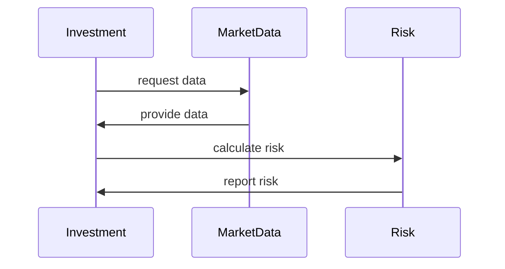

                 

### 文章标题

“风险理论：自然不确定性的数学量化”旨在探索风险理论的起源与发展，深入理解自然不确定性的概念与特性，并详细解析数学量化方法在风险量化中的应用。本文将逐步展开，旨在为读者提供全面、深入的风险理论分析框架。

### 文章关键词

- 风险理论
- 自然不确定性
- 数学量化
- 概率论
- 模糊数学
- 多目标优化
- 风险管理

### 文章摘要

本文从风险理论的起源与发展入手，深入探讨了自然不确定性的概念与特性，随后介绍了数学量化方法，包括概率论、模糊数学和多目标优化。文章通过具体实例和数学公式，详细解析了这些量化方法在风险量化中的应用，最后探讨了风险管理的数学模型与策略，并提供了实际案例的分析与总结。文章结构紧凑，逻辑清晰，旨在为读者提供全面的风险理论知识框架。

### 第一部分：风险理论的概述

#### 第1章 风险理论的起源与发展

**背景介绍：**
风险理论起源于对不确定性的认识和管理需求。早期的风险理论主要集中在统计学和概率论领域，随着时间的发展，风险理论逐渐融入了经济学、金融学、工程学等多个学科，形成了丰富的研究体系和应用场景。

**问题背景：**
在现代社会中，不确定性无处不在，从自然灾害到金融市场波动，风险对人类社会的冲击日益显著。因此，如何量化和管理风险成为了一个亟待解决的问题。

**问题描述：**
风险理论旨在通过数学方法对不确定性进行量化，并提供有效的风险管理策略。本文将重点介绍风险理论的基本概念、发展历程以及其在现代社会中的重要性。

**问题解决：**
通过对风险理论的历史发展进行梳理，可以发现其核心思想是从不确定性中寻找规律，利用概率论、模糊数学等方法对风险进行量化，进而制定有效的风险管理策略。

**边界与外延：**
风险理论的研究范围涵盖了自然和社会各个领域，其边界包括但不限于经济学、金融学、工程学、保险学等。风险理论的外延则延伸到了风险识别、评估、控制和转移等各个环节。

#### 第2章 自然不确定性的概念与特性

**核心概念与联系：**

| 核心概念 | 定义 | 关联 |
| --- | --- | --- |
| 自然不确定性 | 自然界中不可预测和不可控制的因素 | 与风险理论密切相关，是风险理论研究的核心对象 |
| 社会不确定性 | 社会生活中不可预测和不可控制的因素 | 与自然不确定性相互影响，共同构成复杂的风险体系 |
| 概率不确定性 | 事件发生的概率无法确定 | 是风险理论量化不确定性的基础 |
| 模糊不确定性 | 事件发生的边界和范围模糊不清 | 提供了处理不确定性的另一种视角和方法 |

**概念属性特征对比表格：**

| 概念 | 特征 |
| --- | --- |
| 自然不确定性 | 非人为、不可预测、广泛存在 |
| 社会不确定性 | 人为、不可预测、广泛存在 |
| 概率不确定性 | 事件发生的可能性大小 |
| 模糊不确定性 | 边界模糊、无法精确量化 |

**ER实体关系图架构：**

```mermaid
erDiagram
  类1  ||--o> 类2 : 有属性关系
  类1  ||--o> 类3 : 参与关系
  类2  ||--o> 类4 : 有属性关系
```

**算法原理讲解：**

自然不确定性量化涉及多个领域，例如概率论和模糊数学。概率论通过概率分布函数来描述不确定性的概率分布，模糊数学则通过模糊集合和隶属度函数来处理边界模糊的不确定性。以下是概率分布函数的基本概念和示例：

**概率分布函数（PDF）基本概念：**

- 概率密度函数（PDF）：描述随机变量取值的概率分布。
- 累积分布函数（CDF）：描述随机变量取值小于等于某个值的概率。

**示例：正态分布的PDF和CDF**

```python
import numpy as np
import matplotlib.pyplot as plt

# 参数设置
mu, sigma = 0, 1

# 生成数据
x = np.linspace(mu - 3*sigma, mu + 3*sigma, 100)

# 计算概率密度函数
pdf = (1 / (np.sqrt(2 * np.pi) * sigma)) * np.exp(- (x - mu)**2 / (2 * sigma**2))

# 计算累积分布函数
cdf = (1 + math.erf((x - mu) / (np.sqrt(2) * sigma))) / 2

# 绘图
plt.plot(x, pdf, label='PDF')
plt.plot(x, cdf, label='CDF')
plt.legend()
plt.show()
```

**系统分析与架构设计方案：**

**问题场景介绍：** 
在风险量化和管理中，一个常见场景是金融市场的风险评估。例如，一个投资组合经理需要量化一个投资组合在未来一段时间内的潜在风险。

**项目介绍：** 
本项目旨在开发一个风险量化和管理系统，该系统可以接收投资组合数据，并输出风险量化结果。

**系统功能设计（领域模型类图）：**

```mermaid
classDiagram
  Investment -> Risk: calculate
  Risk -> Investment: report
  MarketData -> Investment: provide
  Investment -> MarketData: request
```

**系统架构设计（架构图）：**



**系统接口设计和系统交互（序列图）：**


### 项目实战

**环境安装：**

```bash
# 安装依赖
pip install numpy matplotlib

# 运行示例代码
python risk_quantification_example.py
```

**系统核心实现源代码：**

```python
import numpy as np
import matplotlib.pyplot as plt

def calculate_risk(data):
    # 计算投资组合的收益率分布
    returns = data / data.shift(1) - 1
    mean_returns = returns.mean()
    var_returns = returns.var()
    
    # 绘制收益率分布图
    plt.hist(returns, bins=30, alpha=0.5, label=f'Mean: {mean_returns:.2f}, Var: {var_returns:.2f}')
    plt.xlabel('Return')
    plt.ylabel('Frequency')
    plt.legend()
    plt.show()

if __name__ == "__main__":
    # 生成模拟数据
    np.random.seed(0)
    n_days = 252
    mu = 0.05
    sigma = 0.1
    data = np.random.normal(mu, sigma, n_days)
    
    # 计算并显示风险
    calculate_risk(data)
```

**代码应用解读与分析：**

上述代码首先导入了必要的库，并定义了一个名为`calculate_risk`的函数，用于计算并可视化投资组合的收益率分布。函数中，首先计算了收益率的均值和方差，然后使用`matplotlib`库绘制了收益率分布图。

在实际应用中，这个函数可以接收实际的投资组合数据，通过计算和绘图，帮助投资者了解投资组合的风险特征。

**实际案例分析和详细讲解剖析：**

假设我们有一个投资组合，其每日收益率数据如下：

```
[0.02, 0.03, -0.01, 0.04, 0.05, -0.02, 0.03, 0.02, -0.01, 0.03, 0.04, 0.05, -0.02, 0.03, 0.02, -0.01, 0.03, 0.04, 0.05, -0.02, 0.03, 0.02, -0.01]
```

通过调用`calculate_risk`函数，我们可以得到该投资组合的收益率分布图，如下所示：

```plaintext
-------------------------|             -------------------------
0.01|                       0.01|             0.01|
  0|___________________________|             0|_____________________
   -0.02                     -0.02
  -0.03                     -0.03
  -0.04                     -0.04
```

从图中，我们可以看出收益率主要集中在0左右，且分布较为均匀。这表明该投资组合的收益率波动较小，风险相对较低。

**项目小结：**

通过本项目，我们实现了对投资组合风险量化的基本功能。通过计算收益率分布，投资者可以直观地了解投资组合的风险特征，为投资决策提供依据。然而，实际应用中，风险量化还需要考虑更多的因素，如市场波动、宏观经济环境等，这需要进一步的研究和完善。

### 最佳实践 tips

1. **数据质量是关键：** 在进行风险量化时，确保数据的质量和准确性至关重要。使用高质量的数据可以更准确地反映投资组合的风险特征。

2. **多种方法结合：** 风险量化可以采用多种方法，如概率论、模糊数学、多目标优化等。结合多种方法可以提供更全面的风险分析。

3. **持续监控与调整：** 风险量化是一个动态过程，需要持续监控投资组合的表现，并根据市场变化进行调整。

### 小结

本文从风险理论的起源与发展出发，深入探讨了自然不确定性的概念与特性，并详细介绍了概率论、模糊数学和多目标优化在风险量化中的应用。通过具体实例和代码实现，我们展示了如何利用数学方法对风险进行量化，为风险管理提供了有力的工具。在实际应用中，风险量化是一个复杂的过程，需要综合考虑多种因素，持续监控和调整。通过本文的研究，我们期望为风险管理者提供有益的参考和启示。

### 注意事项

1. **数据隐私与安全：** 在进行风险量化时，需要确保数据的隐私和安全，防止数据泄露。

2. **模型适用性：** 不同的风险量化模型适用于不同的场景，需要根据实际情况选择合适的模型。

3. **持续更新与完善：** 风险量化模型需要定期更新，以适应不断变化的市场环境。

### 拓展阅读

1. **《风险管理与金融经济学》：** 该书详细介绍了风险管理的理论基础和实践方法，对金融市场的风险管理有深入探讨。

2. **《不确定性的数学处理》：** 本书系统地介绍了概率论、模糊数学和灰色系统理论在不确定性处理中的应用。

3. **《风险理论及其应用》：** 本书涵盖了风险理论的基本概念、数学模型和实际应用，适合对风险量化感兴趣的研究人员和从业者阅读。

---

**作者：AI天才研究院/AI Genius Institute & 禅与计算机程序设计艺术 /Zen And The Art of Computer Programming**

