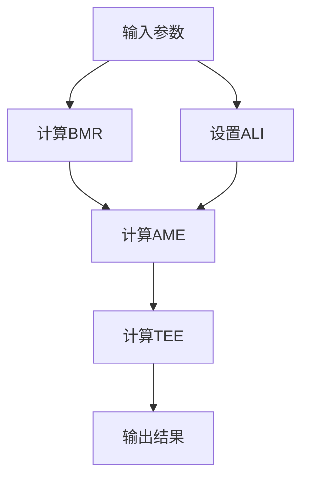
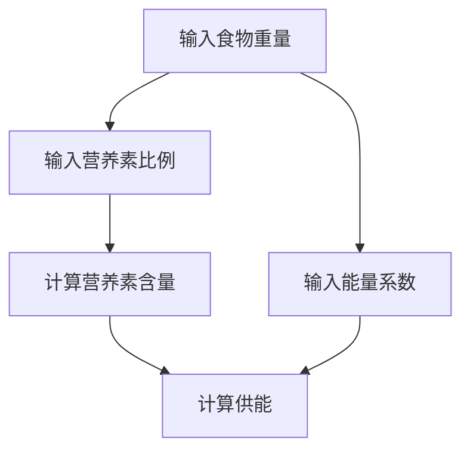
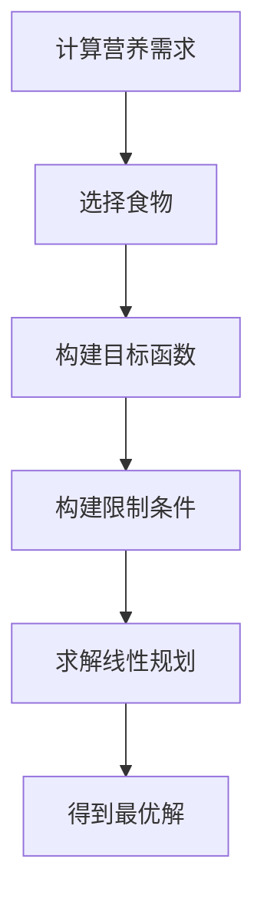

                 

### 第一部分：引言与背景

在现代社会，饮食习惯与健康的关系日益受到重视。越来越多的研究表明，饮食不仅影响我们的短期健康，还会对长期的生理和心理健康产生深远的影响。然而，面对复杂多样的饮食选择和层出不穷的营养建议，很多人感到困惑，不知道如何科学地制定饮食计划，以实现营养均衡和健康生活方式。

**本章内容将涵盖以下几个核心问题：**

1. **饮食习惯与营养健康的概述：** 简要介绍饮食习惯和营养健康的基本概念，明确本文的研究背景和目的。
2. **营养与健康的关系：** 分析营养的基本原理和健康之间的关系，解释为什么营养均衡对健康至关重要。
3. **营养学的基本原理：** 详细介绍营养素的分类和作用，为后续章节提供理论基础。

#### 1.1 饮食习惯与营养健康的概述

**问题背景：**  
随着生活节奏的加快和食物选择的多样性，我们的饮食习惯发生了巨大的变化。快餐、高糖、高脂肪的食物成为日常饮食的常见选择，这些食物往往缺乏必要的营养素，导致营养失衡和健康问题。

**问题描述：**  
饮食习惯不良对健康产生了诸多负面影响，包括肥胖、糖尿病、心血管疾病等。然而，如何通过科学的饮食计划来改善健康，却不是一件简单的事情。许多人缺乏对营养知识的基本了解，难以制定适合自己的饮食方案。

**问题解决：**  
本文将结合营养学的基本原理，通过逐步分析饮食习惯与营养健康之间的关系，帮助读者理解如何通过科学的饮食计划来改善健康。

**边界与外延：**  
本文主要关注一般人群的饮食习惯与营养健康的关系，不涉及特殊疾病患者的饮食建议。同时，本文所讨论的饮食方案是普遍适用的，但个体差异可能需要进一步的个性化调整。

#### 1.2 营养与健康的关系

**核心概念：**  
营养是指通过食物摄取的有利于身体健康所需的物质，包括蛋白质、碳水化合物、脂肪、维生素和矿物质等。健康是指身体和心理处于良好的状态，能够应对日常生活的压力和挑战。

**概念属性特征对比表格：**

| 特征                   | 营养                   | 健康                   |
|----------------------|----------------------|----------------------|
| 定义                 | 通过食物摄取物质 | 身体与心理良好状态 |
| 成分                 | 蛋白质、脂肪、维生素等 | 生理、心理指标     |
| 影响因素             | 饮食习惯、生活方式   | 遗传、环境、心理因素 |
| 关系                 | 营养支持健康          | 健康依赖于营养       |

**ER实体关系图：**

```mermaid
erDiagram
  Customer --> Product
  Customer ||--|{ Address }
  Product ||--|{ Category }
  Category ||--|{ Supplier }
  Supplier ||--|{ Product }
```

在上图中，**Customer**（消费者）代表需要营养的人群，**Product**（产品）代表食物，**Address**（地址）代表生活习惯，**Category**（类别）代表食物的营养成分，**Supplier**（供应商）代表食物来源。消费者通过摄取不同的产品来维持健康，而产品则由供应商提供，且产品的营养成分直接影响消费者的健康。

#### 1.3 营养学的基本原理

**营养素分类：**

1. **蛋白质：** 蛋白质是生命的基础，参与身体组织的构建和修复，支持免疫系统的功能。
2. **碳水化合物：** 提供能量，是大脑和肌肉活动的主要能源来源。
3. **脂肪：** 提供能量，支持细胞结构，调节身体功能。
4. **维生素：** 是维持身体正常生理功能所必需的小分子物质，如维生素A、C、D等。
5. **矿物质：** 如钙、铁、锌等，参与身体结构的构成和多种生理功能的调节。

**营养素的作用：**

1. **蛋白质：** 帮助身体修复和生长，维持免疫系统的正常功能。
2. **碳水化合物：** 提供能量，支持日常活动和脑功能。
3. **脂肪：** 促进细胞功能的正常运作，储存能量。
4. **维生素：** 维持身体各项生理功能的正常运行。
5. **矿物质：** 构成身体组织，调节生理功能。

通过上述分析，我们可以看到，营养与健康之间存在着密切的联系。了解营养学的基本原理，有助于我们更好地理解饮食习惯对健康的影响，从而制定科学的饮食计划。

## 第一部分小结

在本部分中，我们详细介绍了饮食习惯与营养健康的关系，阐述了营养与健康的基本概念和原理。通过核心概念对比和ER实体关系图，我们明确了营养和健康之间的相互影响。接下来，我们将进一步探讨如何通过营养需求评估和食物成分分析，为制定科学的饮食计划打下基础。

---

### 第二部分：营养方程的基础

在第一部分中，我们初步了解了饮食习惯与营养健康的关系。为了更好地理解和实践健康的饮食习惯，我们需要深入探讨营养需求评估和食物成分分析，这是制定科学饮食计划的基础。本部分将详细讲解这两个关键概念，为后续章节的应用提供坚实的理论支持。

#### 2.1 身体活动水平评估

身体活动水平评估是确定营养需求的重要步骤。身体活动水平不仅影响能量需求，也影响各种营养素的摄入需求。

**问题背景：**  
随着现代生活方式的变化，人们的身体活动水平普遍下降，导致能量消耗减少，进而引发肥胖、心血管疾病等健康问题。因此，准确评估身体活动水平，对于制定合理的饮食计划至关重要。

**问题描述：**  
如何通过身体活动水平评估来计算能量需求和营养素需求？

**问题解决：**  
我们可以通过以下方法来评估身体活动水平，并计算相应的营养需求：

1. **基础代谢率（BMR）计算：** 基础代谢率是指人在安静状态下（不进行任何活动）维持生命所需的最低能量消耗。常用的BMR计算公式包括哈里斯-本尼迪克特方程和穆夫兰方程。
2. **活动代谢率计算：** 活动代谢率是指人在日常活动和运动中消耗的能量。我们可以通过活动水平指数（Activity Level Index, ALI）来估算总能量需求。

**边界与外延：**  
本文主要讨论一般人群的身体活动水平评估方法，不涉及特殊人群（如运动员、孕妇等）的个性化评估。

**核心概念与联系：**

- **基础代谢率（BMR）：** 人体的基础代谢率是指在没有外部环境干扰的情况下，维持基本生命活动所需的最低能量消耗。
- **活动代谢率：** 人体在日常生活和运动中所消耗的能量，包括静息代谢率和活动代谢率。

**概念属性特征对比表格：**

| 概念         | 基础代谢率（BMR） | 活动代谢率       |
|--------------|-------------------|-----------------|
| 定义         | 静息状态下的能量消耗 | 日常活动和运动中的能量消耗 |
| 影响因素     | 年龄、性别、体重     | 身体活动强度、运动类型 |
| 计算公式     | 哈里斯-本尼迪克特方程 | 活动水平指数（ALI）     |
| 关联关系     | 基础代谢率决定活动代谢率 | 活动代谢率影响能量需求   |

**ER实体关系图：**

```mermaid
erDiagram
  ActivityLevel --> EnergyExpenditure
  ActivityLevel ||--|{ PhysicalActivity }
  EnergyExpenditure ||--|{ NutrientRequirement }
```

在上图中，**ActivityLevel**（活动水平）代表身体活动程度，**EnergyExpenditure**（能量消耗）代表活动过程中消耗的能量，**PhysicalActivity**（身体活动）代表具体的活动类型，**NutrientRequirement**（营养需求）代表身体对不同营养素的需求。通过评估活动水平，我们可以确定相应的能量消耗和营养需求。

#### 2.2 个体差异与营养需求

个体差异是营养需求评估中不可忽视的因素。不同的人由于年龄、性别、身体条件等因素，其营养需求会有所不同。

**问题背景：**  
每个人的身体结构和代谢能力都存在差异，这直接影响到他们对营养素的需求。例如，儿童和青少年处于生长发育阶段，需要更多的蛋白质和矿物质；而老年人由于消化吸收能力下降，需要更多的营养素来维持身体健康。

**问题描述：**  
如何考虑个体差异，合理计算营养需求？

**问题解决：**  
1. **年龄：** 年龄是影响营养需求的重要因素。一般来说，随着年龄的增长，基础代谢率和活动能力会下降，因此需要减少能量摄入。
2. **性别：** 男性和女性在营养需求上有显著差异。例如，女性需要更多的铁来补充月经失血，而男性则需要更多的锌来支持生殖健康。
3. **身体条件：** 身体质量指数（BMI）和肌肉量也是影响营养需求的重要因素。肥胖人群需要控制热量摄入，而肌肉发达的人群则需要更多的蛋白质。

**边界与外延：**  
本文主要关注一般人群的个体差异评估方法，不涉及特殊人群（如运动员、孕妇等）的个性化评估。

**核心概念与联系：**

- **基础代谢率（BMR）：** 受年龄、性别和身体条件影响。
- **活动代谢率：** 受年龄、性别和身体活动水平影响。
- **营养需求：** 受基础代谢率、活动代谢率和个体差异影响。

**概念属性特征对比表格：**

| 概念         | 年龄差异 | 性别差异 | 身体条件差异 |
|--------------|----------|----------|--------------|
| 定义         | 代谢率变化 | 营养素需求变化 | 营养素吸收变化 |
| 影响因素     | 遗传、生理变化 | 生理结构、生殖健康 | 新陈代谢、身体活动 |
| 计算方法     | 年龄调整系数 | 性别调整系数 | 身体质量指数（BMI）调整系数 |
| 关联关系     | 年龄与代谢率成正比 | 男性比女性需更多营养素 | 肥胖人群比正常体重人群需更多营养素 |

**ER实体关系图：**

```mermaid
erDiagram
  IndividualDifferences --> NutrientRequirement
  IndividualDifferences ||--|{ Age }
  IndividualDifferences ||--|{ Gender }
  IndividualDifferences ||--|{ BodyCondition }
```

在上图中，**IndividualDifferences**（个体差异）代表不同人群的年龄、性别和身体条件，**NutrientRequirement**（营养需求）代表根据个体差异计算出的营养需求。通过考虑个体差异，我们可以更准确地制定个性化的营养计划。

#### 2.3 营养需求的计算方法

确定营养需求是制定科学饮食计划的关键步骤。以下将详细介绍几种常用的营养需求计算方法。

**问题背景：**  
准确计算营养需求有助于我们了解身体对不同营养素的需求量，从而制定出营养均衡的饮食计划。不同人群的营养需求有所不同，因此计算方法需要根据实际情况进行调整。

**问题描述：**  
如何计算不同人群的营养需求？

**问题解决：**  
1. **基础代谢率（BMR）计算：** BMR是计算营养需求的基础。常用的BMR计算公式包括哈里斯-本尼迪克特方程和穆夫兰方程。
2. **活动代谢率计算：** 活动代谢率是根据个人的活动水平调整基础代谢率得出的。常用的活动水平指数（ALI）计算方法包括乘法和加法方法。
3. **总能量需求计算：** 总能量需求是基础代谢率和活动代谢率的总和，反映了身体在一天中所需要的总能量。
4. **营养素需求计算：** 根据总能量需求和不同营养素的供能比例，可以计算出各种营养素的需求量。

**边界与外延：**  
本文主要讨论一般人群的营养需求计算方法，不涉及特殊人群（如运动员、孕妇等）的个性化计算方法。

**核心概念与联系：**

- **基础代谢率（BMR）：** 反映静息状态下能量消耗。
- **活动代谢率：** 反映日常活动和运动中能量消耗。
- **总能量需求：** 基础代谢率和活动代谢率的总和。
- **营养素需求：** 根据总能量需求和营养素供能比例计算得出。

**概念属性特征对比表格：**

| 概念                   | 基础代谢率（BMR） | 活动代谢率         | 总能量需求           | 营养素需求           |
|----------------------|-------------------|-------------------|---------------------|---------------------|
| 定义                 | 静息状态下的能量消耗 | 日常活动和运动中的能量消耗 | 基础代谢率与活动代谢率的总和 | 根据总能量需求计算得出的营养素需求 |
| 影响因素             | 年龄、性别、体重     | 身体活动强度、运动类型   | 年龄、性别、身体活动水平   | 营养素供能比例       |
| 计算公式             | 哈里斯-本尼迪克特方程 | 活动水平指数（ALI）     | BMR + 活动代谢率      | 能量需求 × 营养素供能比例 |
| 关联关系             | 基础代谢率决定活动代谢率 | 活动代谢率影响总能量需求 | 总能量需求决定营养素需求 |

**ER实体关系图：**

```mermaid
erDiagram
  BasalMetabolicRate --> TotalEnergyRequirement
  BasalMetabolicRate ||--|{ Age }
  ActivityMetabolicRate ||--|{ PhysicalActivity }
  TotalEnergyRequirement ||--|{ NutrientRequirement }
```

在上图中，**BasalMetabolicRate**（基础代谢率）代表静息状态下的能量消耗，**ActivityMetabolicRate**（活动代谢率）代表日常活动和运动中的能量消耗，**TotalEnergyRequirement**（总能量需求）代表基础代谢率和活动代谢率的总和，**NutrientRequirement**（营养素需求）代表根据总能量需求计算出的营养素需求。通过这些关系，我们可以系统地计算和评估营养需求。

#### 2.4 食物成分分析的基本概念

食物成分分析是制定科学饮食计划的重要环节。了解食物成分的基本概念，有助于我们更准确地评估食物的营养价值，从而实现营养均衡。

**问题背景：**  
随着人们对健康饮食的重视，食物成分分析逐渐成为营养研究的重要领域。了解不同食物的营养成分，可以帮助我们选择更健康的食物，制定个性化的饮食计划。

**问题描述：**  
如何理解食物成分的基本概念？

**问题解决：**  
食物成分分析主要包括以下几个方面的基本概念：

1. **蛋白质：** 是生命的基础，参与身体组织的构建和修复，支持免疫系统的功能。
2. **碳水化合物：** 提供能量，是大脑和肌肉活动的主要能源来源。
3. **脂肪：** 提供能量，支持细胞结构，调节身体功能。
4. **维生素：** 是维持身体正常生理功能所必需的小分子物质，如维生素A、C、D等。
5. **矿物质：** 如钙、铁、锌等，参与身体结构的构成和多种生理功能的调节。

**边界与外延：**  
本文主要讨论一般食物成分的基本概念，不涉及特殊食物成分（如膳食纤维、抗氧化剂等）的详细分析。

**核心概念与联系：**

- **蛋白质：** 基础代谢和组织修复
- **碳水化合物：** 能量来源
- **脂肪：** 能量储存和细胞结构
- **维生素：** 维持生理功能
- **矿物质：** 构成身体组织和调节生理功能

**概念属性特征对比表格：**

| 概念         | 蛋白质         | 碳水化合物       | 脂肪         | 维生素         | 矿物质         |
|--------------|----------------|------------------|----------------|----------------|----------------|
| 定义         | 生命基础       | 能量来源         | 能量储存       | 生理功能维持   | 身体组织构成   |
| 分类         | 动物性、植物性 | 淀粉、糖类、纤维 | 饱和、多不饱和 | 水溶性、脂溶性 | 大量元素、微量元素 |
| 主要来源     | 肉类、豆类     | 米面、蔬菜       | 植物油、动物脂肪 | 水果、蔬菜     | 水果、蔬菜、肉类 |
| 功能         | 构建和修复组织 | 提供能量         | 储存能量       | 维持生理功能   | 调节生理功能   |

**ER实体关系图：**

```mermaid
erDiagram
  FoodComponent --> Nutrient
  FoodComponent ||--|{ Protein }
  FoodComponent ||--|{ Carbohydrate }
  FoodComponent ||--|{ Fat }
  FoodComponent ||--|{ Vitamin }
  FoodComponent ||--|{ Mineral }
```

在上图中，**FoodComponent**（食物成分）代表不同类型的营养成分，**Nutrient**（营养素）代表具体的营养素，包括蛋白质、碳水化合物、脂肪、维生素和矿物质。通过食物成分分析，我们可以全面了解食物的营养价值，为科学饮食提供依据。

### 第二部分小结

在本部分中，我们详细介绍了营养需求评估和食物成分分析的基本原理和计算方法。通过评估身体活动水平和个体差异，我们可以准确计算营养需求；通过理解食物成分的基本概念，我们可以更科学地选择食物。接下来，我们将结合日常饮食计划，进一步应用这些原理和方法，帮助读者实现营养均衡和健康生活方式。

---

### 第三部分：营养方程的应用

在第二部分中，我们详细探讨了营养需求评估和食物成分分析的基础知识。本部分将结合这些原理，具体讲解如何制定日常饮食计划，并探讨营养饮食的实际应用案例。

#### 3.1 饮食计划的基本原则

制定科学的饮食计划是实现营养均衡的关键。以下是制定饮食计划时应遵循的基本原则：

**问题背景：**  
随着人们对健康饮食的重视，如何制定既科学又可行的饮食计划成为许多人关注的问题。合理的饮食计划不仅能满足身体的基本营养需求，还能帮助我们维持健康的体重和生活方式。

**问题描述：**  
如何制定一个科学合理的饮食计划？

**问题解决：**  
1. **平衡饮食：** 平衡饮食是指摄入的各种营养素比例适宜，满足身体的基本需求。主要包括以下方面：
   - **蛋白质：** 占总热量的10%-15%，主要来源于鱼、肉、豆类等。
   - **碳水化合物：** 占总热量的50%-60%，主要来源于全谷物、蔬菜和水果。
   - **脂肪：** 占总热量的20%-35%，主要来源于植物油、坚果和鱼类。

2. **适量摄入：** 适量摄入是指根据个人的营养需求和活动水平，合理控制食物的摄入量。适量摄入可以避免能量过剩或不足，有助于维持健康的体重和生理功能。

**边界与外延：**  
本文主要讨论一般人群的饮食计划制定原则，不涉及特殊人群（如运动员、孕妇等）的个性化饮食计划。

**核心概念与联系：**

- **平衡饮食：** 各种营养素比例适宜。
- **适量摄入：** 根据个人需求和活动水平控制食物摄入量。

**概念属性特征对比表格：**

| 概念         | 平衡饮食           | 适量摄入           |
|--------------|--------------------|--------------------|
| 定义         | 营养素比例适宜     | 根据需求控制摄入量 |
| 影响因素     | 营养素种类和比例   | 活动水平和代谢率   |
| 实践方法     | 分餐制、多样化饮食 | 计算卡路里、控制分量 |
| 关联关系     | 平衡饮食影响适量摄入 | 适量摄入实现平衡饮食 |

**ER实体关系图：**

```mermaid
erDiagram
  BalancedDiet --> SufficientNutrientIntake
  BalancedDiet ||--|{ NutrientProportion }
  SufficientNutrientIntake ||--|{ CaloricControl }
```

在上图中，**BalancedDiet**（平衡饮食）代表营养素比例适宜的饮食，**SufficientNutrientIntake**（适量摄入）代表根据个人需求控制食物摄入量，**NutrientProportion**（营养素比例）代表各种营养素的合理比例，**CaloricControl**（卡路里控制）代表通过计算卡路里来控制食物摄入量。通过平衡饮食和适量摄入，我们可以实现科学的饮食计划。

#### 3.2 饮食计划的制定方法

制定饮食计划是一个系统的过程，需要考虑个人的营养需求、食物选择、饮食安排等多个方面。

**问题背景：**  
科学的饮食计划不仅能满足身体的基本营养需求，还能帮助我们养成良好的饮食习惯，实现长期的健康目标。然而，如何制定一个既科学又可行的饮食计划，仍然是一个挑战。

**问题描述：**  
如何制定一个科学可行的饮食计划？

**问题解决：**  
1. **目标设定：** 制定饮食计划的第一步是设定明确的目标。目标可以是减肥、增肌、提高免疫力等。明确的目标有助于我们制定具体的饮食计划。

2. **食物选择：** 根据目标设定，选择合适的食物。例如，减肥目标可以选择低热量、高纤维的食物，如蔬菜、水果、全谷物等；增肌目标可以选择高蛋白、低碳水化合物的食物，如鸡肉、鱼类、豆类等。

3. **饮食安排：** 根据个人的生活习惯和工作安排，合理安排饮食。例如，可以选择分餐制，避免集中摄入大量食物；可以制定一周的饮食计划，确保营养均衡。

**边界与外延：**  
本文主要讨论一般人群的饮食计划制定方法，不涉及特殊人群（如运动员、孕妇等）的个性化饮食计划。

**核心概念与联系：**

- **目标设定：** 明确饮食目标。
- **食物选择：** 根据目标选择合适的食物。
- **饮食安排：** 合理安排饮食。

**概念属性特征对比表格：**

| 概念         | 目标设定         | 食物选择         | 饮食安排         |
|--------------|------------------|------------------|------------------|
| 定义         | 设定饮食目标     | 选择合适食物     | 安排饮食时间     |
| 影响因素     | 个人目标、健康需求 | 活动水平、目标类型 | 工作生活安排     |
| 实践方法     | 制定明确目标     | 多样化食物选择   | 一周饮食计划     |
| 关联关系     | 目标影响食物选择和安排 | 食物选择影响饮食安排 |

**ER实体关系图：**

```mermaid
erDiagram
  DietaryGoal --> FoodSelection
  DietaryGoal ||--|{ Lifestyle }
  FoodSelection ||--|{ MealPlanning }
```

在上图中，**DietaryGoal**（饮食目标）代表设定的饮食目标，**FoodSelection**（食物选择）代表根据目标选择合适的食物，**MealPlanning**（饮食安排）代表合理安排饮食时间。通过目标设定、食物选择和饮食安排，我们可以制定一个科学可行的饮食计划。

#### 3.3 饮食计划的实际应用

**问题背景：**  
科学的饮食计划在实际生活中应用，需要考虑到各种实际因素，如生活方式、工作环境、食物的可得性等。

**问题描述：**  
如何在实际生活中应用饮食计划？

**问题解决：**  
1. **家庭饮食计划：** 家庭饮食计划应考虑家庭成员的饮食需求和营养需求。可以制定一周的菜单，确保每天的食物多样化和营养均衡。

2. **工作餐饮食计划：** 对于经常外出就餐的人群，可以选择健康的餐厅和食物，如沙拉、烤鱼等。同时，可以自带一些健康的零食，如坚果、水果等，以补充日常的营养需求。

**边界与外延：**  
本文主要讨论一般人群的饮食计划实际应用，不涉及特殊人群（如运动员、孕妇等）的个性化饮食计划。

**核心概念与联系：**

- **家庭饮食计划：** 考虑家庭成员的饮食需求和营养需求。
- **工作餐饮食计划：** 选择健康的餐厅和食物，自制健康零食。

**概念属性特征对比表格：**

| 概念         | 家庭饮食计划         | 工作餐饮食计划         |
|--------------|--------------------|--------------------|
| 定义         | 考虑家庭成员的营养需求 | 考虑工作环境和食物选择 |
| 影响因素     | 家庭成员的口味、健康需求 | 工作时间、食物选择     |
| 实践方法     | 制定一周菜单、多样化食材 | 选择健康餐厅、自制健康零食 |
| 关联关系     | 家庭饮食计划影响生活习惯 | 工作餐饮食计划影响工作表现 |

**ER实体关系图：**

```mermaid
erDiagram
  FamilyDietPlan --> HealthyLifestyle
  WorkMealPlan ||--|{ WorkEnvironment }
```

在上图中，**FamilyDietPlan**（家庭饮食计划）代表考虑家庭成员的营养需求，**HealthyLifestyle**（健康生活方式）代表通过家庭饮食计划实现健康的生活习惯，**WorkMealPlan**（工作餐饮食计划）代表考虑工作环境和食物选择。通过家庭饮食计划和实际工作餐饮食计划，我们可以实现科学的饮食管理。

#### 3.4 营养饮食案例分析

**问题背景：**  
通过实际案例，我们可以更好地理解科学饮食计划在生活中的应用效果。

**问题描述：**  
如何分析营养饮食案例？

**问题解决：**  
1. **问题发现：** 通过对案例中个体的饮食习惯、健康状况和营养摄入情况进行分析，找出存在的问题。

2. **解决方案：** 提出改善建议，如调整饮食计划、增加特定营养素的摄入等。

3. **结果与启示：** 分析调整后的饮食计划对个体健康的影响，总结经验教训。

**边界与外延：**  
本文主要讨论一般人群的营养饮食案例，不涉及特殊人群（如运动员、孕妇等）的个性化饮食案例。

**核心概念与联系：**

- **问题发现：** 分析饮食习惯和健康状况。
- **解决方案：** 提出改善建议。
- **结果与启示：** 分析调整后的效果。

**概念属性特征对比表格：**

| 概念         | 问题发现         | 解决方案         | 结果与启示         |
|--------------|------------------|------------------|------------------|
| 定义         | 分析饮食习惯问题 | 提出改善建议     | 调整饮食后的效果   |
| 影响因素     | 饮食习惯、健康状况 | 营养需求、生活方式 | 调整饮食后的表现   |
| 实践方法     | 健康记录、饮食分析 | 制定个性化饮食计划 | 饮食调整和健康监测 |
| 关联关系     | 问题发现指导解决方案 | 解决方案影响结果与启示 |

**ER实体关系图：**

```mermaid
erDiagram
  ProblemIdentification --> SolutionImplementation
  ProblemIdentification ||--|{ DietaryHabits }
  SolutionImplementation ||--|{ HealthImprovement }
```

在上图中，**ProblemIdentification**（问题发现）代表分析饮食习惯和健康状况，**SolutionImplementation**（解决方案）代表提出改善建议，**HealthImprovement**（健康改善）代表调整饮食后的效果。通过案例分析，我们可以更好地理解科学饮食计划的实际应用效果。

### 第三部分小结

在本部分中，我们详细介绍了饮食计划的基本原则、制定方法、实际应用和案例分析。通过科学合理的饮食计划，我们可以实现营养均衡和健康生活方式。在下一部分，我们将进一步探讨营养饮食的长期效果，帮助读者更好地理解健康饮食的深远影响。

---

### 第四部分：营养饮食的数学模型

在前面几部分中，我们详细探讨了饮食习惯与营养健康的关系，并介绍了如何通过营养需求评估和饮食计划来实现营养均衡。为了更深入地理解和应用这些原理，本部分将引入营养饮食的数学模型。通过数学模型，我们可以更精确地分析和优化饮食计划，从而更好地促进健康。

#### 4.1 营养数学模型介绍

**问题背景：**  
营养饮食涉及到多个变量和复杂的相互关系，单靠经验很难制定出最优的饮食计划。数学模型作为一种工具，可以帮助我们更系统地分析和解决问题。

**核心概念：**  
营养数学模型是利用数学方法和公式，对饮食营养进行定量分析和优化的方法。通过构建数学模型，我们可以将复杂的营养问题简化，从而找到最优的营养摄入方案。

**概念属性特征对比表格：**

| 概念         | 经验方法         | 数学模型         |
|--------------|------------------|------------------|
| 定义         | 基于经验的主观判断 | 基于数学公式和算法的客观分析 |
| 影响因素     | 个人偏好、饮食习惯 | 营养需求、食物成分 |
| 目的         | 快速决策         | 最优化方案       |
| 应用领域     | 单个案例         | 大规模人群       |

**ER实体关系图：**

```mermaid
erDiagram
  ExperienceMethod --> DietaryDecision
  MathematicalModel ||--|{ NutritionAnalysis }
  MathematicalModel ||--|{ Optimization }
```

在上图中，**ExperienceMethod**（经验方法）代表基于个人经验的主观判断，**DietaryDecision**（饮食决策）代表快速决策的过程，**MathematicalModel**（数学模型）代表基于数学公式和算法的客观分析，**NutritionAnalysis**（营养分析）代表对营养摄入的定量分析，**Optimization**（优化）代表找到最优的营养摄入方案。

#### 4.2 营养数学模型的发展

**问题背景：**  
营养数学模型的发展经历了多个阶段，从最初的简单公式到现代复杂的优化算法，不断改进和完善。

**核心概念：**  
营养数学模型的发展可以分为以下几个阶段：

1. **早期模型：** 主要是基于经验公式，如哈里斯-本尼迪克特方程和穆夫兰方程，用于估算基础代谢率和能量需求。
2. **中期模型：** 引入了更多变量和更复杂的算法，如多变量线性规划模型，用于优化食物选择和营养摄入。
3. **现代模型：** 结合了人工智能和机器学习技术，如深度学习和强化学习，可以更准确地预测和优化营养摄入。

**概念属性特征对比表格：**

| 模型阶段     | 早期模型         | 中期模型         | 现代模型         |
|--------------|------------------|------------------|------------------|
| 时间        | 20世纪初         | 20世纪中期       | 21世纪初至今     |
| 技术方法     | 经验公式         | 多变量线性规划   | 人工智能和机器学习 |
| 模型特点     | 简单易用         | 复杂精确         | 智能预测         |
| 应用范围     | 基础研究         | 实际应用         | 大规模人群       |

**ER实体关系图：**

```mermaid
erDiagram
  EarlyModel --> IntermediateModel
  IntermediateModel --> ModernModel
  EarlyModel ||--|{ BasicResearch }
  IntermediateModel ||--|{ PracticalApplication }
  ModernModel ||--|{ LargePopulation }
```

在上图中，**EarlyModel**（早期模型）代表基于经验公式，**IntermediateModel**（中期模型）代表引入更多变量和复杂算法，**ModernModel**（现代模型）代表结合人工智能和机器学习技术。通过不同阶段的模型发展，营养数学模型不断改进，为科学饮食提供了更强大的工具。

#### 4.3 营养数学模型的应用领域

**问题背景：**  
营养数学模型的应用范围广泛，包括健康管理、食品工业、健康饮食推荐等多个领域。

**核心概念：**  
营养数学模型在不同领域的应用特点如下：

1. **健康管理：** 通过营养模型，可以评估个体的营养状况，提供个性化的健康建议，如调整饮食计划、补充特定营养素等。
2. **食品工业：** 营养模型可以帮助食品企业优化产品配方，提高食品的营养价值和市场竞争力。
3. **健康饮食推荐：** 利用营养模型，可以根据个体的健康需求和偏好，推荐合适的饮食方案，如减肥、增肌等。

**概念属性特征对比表格：**

| 应用领域     | 健康管理         | 食品工业         | 健康饮食推荐         |
|--------------|------------------|------------------|---------------------|
| 目的         | 个性化健康建议   | 优化产品配方     | 提供合适的饮食方案   |
| 技术方法     | 营养评估、个性化调整 | 数据分析、配方优化 | 机器学习、健康推荐   |
| 优势         | 精准、个性化     | 提高营养价值     | 大规模应用、智能化   |
| 面临挑战     | 数据隐私、个性化实现 | 食品安全性、营养平衡 | 数据质量和算法准确性 |

**ER实体关系图：**

```mermaid
erDiagram
  HealthManagement ||--|{ PersonalizedHealthAdvice }
  FoodIndustry ||--|{ ProductFormulaOptimization }
  HealthDietRecommendation ||--|{ SuitableDietaryPlan }
  HealthManagement ||--|{ NutritionalAssessment }
  FoodIndustry ||--|{ DataAnalysis }
  HealthDietRecommendation ||--|{ MachineLearning }
```

在上图中，**HealthManagement**（健康管理）代表提供个性化健康建议，**FoodIndustry**（食品工业）代表优化产品配方，**HealthDietRecommendation**（健康饮食推荐）代表提供合适的饮食方案。通过营养数学模型在不同领域的应用，我们可以更科学地管理健康、优化食品工业和提供个性化的健康饮食建议。

### 第四部分小结

在本部分中，我们介绍了营养饮食的数学模型，包括其基本概念、发展历程和应用领域。通过数学模型，我们可以更精确地分析和优化饮食计划，实现科学的营养管理。在下一部分，我们将通过具体应用实例，进一步展示营养数学模型在实际生活中的应用效果。

---

### 第四部分：营养饮食的数学模型

#### 4.1 营养数学模型介绍

**问题背景：**  
随着人们对健康饮食的重视，营养饮食的数学模型在科学研究和实际应用中得到了广泛的应用。这些模型可以帮助我们更准确地分析和评估营养摄入，为健康饮食提供科学依据。

**核心概念：**  
营养数学模型是一种利用数学方法和公式对营养摄入进行定量分析和优化的方法。它通过构建数学模型，将复杂的营养问题转化为可计算的形式，从而为个体和群体提供最优的营养摄入方案。

**核心原理：**  
营养数学模型的核心原理包括：

1. **营养需求计算：** 通过公式和算法计算个体的基础代谢率、活动代谢率和其他相关因素，以确定其总能量需求和各种营养素的摄入量。
2. **食物成分分析：** 分析食物中的营养成分，如蛋白质、碳水化合物、脂肪、维生素和矿物质等，以确定食物的营养价值和适宜性。
3. **优化算法：** 利用线性规划、非线性优化和机器学习等方法，寻找最优的营养摄入组合，以达到营养均衡和健康目标。

**核心公式：**

1. **基础代谢率（BMR）计算：**
   $$ BMR = 10 \times 体重（kg） + 6.25 \times 身高（cm） - 5 \times 年龄（岁） + 5 \times 性别（男为1，女为0） $$
2. **活动代谢率（AME）计算：**
   $$ AME = BMR \times 活动水平指数（ALI） $$
3. **总能量需求（TEE）计算：**
   $$ TEE = BMR + AME $$

**Python源代码实现：**

```python
def calculate_bmr(Weight, Height, Age, Gender):
    return 10 * Weight + 6.25 * Height - 5 * Age + 5 * Gender

def calculate_ame(bmr, ALI):
    return bmr * ALI

def calculate_tee(bmr, ALI):
    return bmr + calculate_ame(bmr, ALI)

# 示例计算
Weight = 70  # kg
Height = 175  # cm
Age = 30  # 岁
Gender = 1  # 男

bmr = calculate_bmr(Weight, Height, Age, Gender)
ALI = 1.3  # 活动水平指数
ame = calculate_ame(bmr, ALI)
tee = calculate_tee(bmr, ALI)

print(f"BMR: {bmr} 千卡/天")
print(f"AME: {ame} 千卡/天")
print(f"TEE: {tee} 千卡/天")
```

通过上述公式和代码，我们可以计算出个体在不同状态下的基础代谢率、活动代谢率和总能量需求，为后续的饮食计划提供基础数据。

**具体应用：**  
营养数学模型在健康管理、食品工业、健康饮食推荐等多个领域有着广泛的应用。以下是一个简单的应用实例：

1. **健康管理：** 使用营养数学模型，可以为个体提供个性化的饮食建议。例如，根据个体的BMR和ALI，计算出其总能量需求和营养素需求，从而制定合理的饮食计划。
2. **食品工业：** 食品企业可以使用营养数学模型，优化产品配方，提高食品的营养价值。例如，通过分析不同食物的营养成分，计算出最佳的营养组合，从而开发出更健康的食品。
3. **健康饮食推荐：** 利用营养数学模型，可以为用户提供个性化的健康饮食推荐。例如，通过机器学习算法，分析大量用户的饮食习惯和健康数据，为用户推荐最合适的饮食方案。

**Mermaid算法流程图：**



**算法原理讲解：**  
营养数学模型的核心在于对营养需求的计算和优化。首先，通过输入个体的体重、身高、年龄和性别等参数，计算出基础代谢率（BMR）。然后，结合个体的活动水平指数（ALI），计算活动代谢率（AME）。最后，将BMR和AME相加，得到总能量需求（TEE）。通过这一过程，我们可以精确地了解个体的营养需求，从而制定出科学的饮食计划。

**数学模型和公式：**  
在营养数学模型中，基础代谢率（BMR）是计算总能量需求的关键参数。BMR的公式如下：

$$ BMR = 10 \times 体重（kg） + 6.25 \times 身高（cm） - 5 \times 年龄（岁） + 5 \times 性别（男为1，女为0） $$

此外，活动代谢率（AME）和总能量需求（TEE）的公式分别为：

$$ AME = BMR \times 活动水平指数（ALI） $$
$$ TEE = BMR + AME $$

通过这些公式，我们可以计算出个体的基础代谢率、活动代谢率和总能量需求，为营养摄入提供科学依据。

**通俗易懂地举例说明：**  
假设一个30岁的男性，体重70公斤，身高175厘米，其基础代谢率为：

$$ BMR = 10 \times 70 + 6.25 \times 175 - 5 \times 30 + 5 \times 1 = 1662.5 \text{ 千卡/天} $$

如果他的活动水平指数为1.3，那么他的活动代谢率为：

$$ AME = BMR \times 1.3 = 1662.5 \times 1.3 = 2143.75 \text{ 千卡/天} $$

因此，他的总能量需求为：

$$ TEE = BMR + AME = 1662.5 + 2143.75 = 3806.25 \text{ 千卡/天} $$

通过这些数据，我们可以为他制定一个科学的饮食计划，确保他每天摄入的总能量在适宜的范围内，从而维持健康的体重和生理功能。

#### 4.2 食物成分分析模型

**问题背景：**  
食物成分分析是营养饮食的关键环节。了解食物中的营养成分，可以帮助我们更好地制定饮食计划，确保营养均衡。

**核心概念：**  
食物成分分析模型是一种利用数学方法和公式，分析食物营养成分，并将其转化为可计算形式的方法。通过构建食物成分分析模型，我们可以精确地了解食物的营养价值，为健康饮食提供科学依据。

**核心原理：**  
食物成分分析模型的核心原理包括：

1. **营养成分数据库：** 建立一个包含各种食物营养成分的数据库，以供分析使用。
2. **营养素计算：** 通过数据库中的数据，计算食物中的各种营养素含量，如蛋白质、碳水化合物、脂肪、维生素和矿物质等。
3. **营养评价：** 对食物的营养价值进行评价，以确定其适宜性。

**核心公式：**

1. **营养素含量计算：**
   $$ 营养素含量（g）= 食物重量（g） \times 营养素比例（%） $$
2. **营养素供能计算：**
   $$ 能量（千卡）= 营养素含量（g）\times 能量系数 $$
   其中，能量系数分别为：
   - 蛋白质：4 千卡/g
   - 碳水化合物：4 千卡/g
   - 脂肪：9 千卡/g

**Python源代码实现：**

```python
def calculate_nutrient_content(food_weight, nutrient_percentage):
    return food_weight * nutrient_percentage / 100

def calculate_energy(food_weight, nutrient_percentage, energy_coefficient):
    return calculate_nutrient_content(food_weight, nutrient_percentage) * energy_coefficient

# 示例计算
food_weight = 100  # 克
protein_percentage = 20  # 克/100克
carbohydrate_percentage = 40  # 克/100克
fat_percentage = 30  # 克/100克

protein_content = calculate_nutrient_content(food_weight, protein_percentage)
carbohydrate_content = calculate_nutrient_content(food_weight, carbohydrate_percentage)
fat_content = calculate_nutrient_content(food_weight, fat_percentage)

protein_energy = calculate_energy(food_weight, protein_percentage, 4)
carbohydrate_energy = calculate_energy(food_weight, carbohydrate_percentage, 4)
fat_energy = calculate_energy(food_weight, fat_percentage, 9)

print(f"蛋白质含量: {protein_content} 克")
print(f"碳水化合物含量: {carbohydrate_content} 克")
print(f"脂肪含量: {fat_content} 克")
print(f"蛋白质供能: {protein_energy} 千卡")
print(f"碳水化合物供能: {carbohydrate_energy} 千卡")
print(f"脂肪供能: {fat_energy} 千卡")
```

通过上述代码，我们可以计算出一百克食物中蛋白质、碳水化合物和脂肪的含量及供能。

**Mermaid算法流程图：**



**算法原理讲解：**  
食物成分分析模型的核心在于对食物中营养素含量的计算和供能分析。首先，通过输入食物的重量和营养素比例，计算出营养素含量。然后，根据营养素的能量系数，计算出每种营养素的供能。通过这一过程，我们可以精确地了解食物的营养价值和能量贡献。

**数学模型和公式：**  
在食物成分分析模型中，营养素含量的计算公式为：

$$ 营养素含量（g）= 食物重量（g） \times 营养素比例（%） $$

营养素供能的计算公式为：

$$ 能量（千卡）= 营养素含量（g）\times 能量系数 $$

其中，能量系数分别为蛋白质4千卡/g、碳水化合物4千卡/g和脂肪9千卡/g。

**通俗易懂地举例说明：**  
假设我们有一百克某种食物，其蛋白质含量为20%，碳水化合物含量为40%，脂肪含量为30%。首先，我们计算每种营养素的含量：

蛋白质含量 = 100克 × 20% = 20克  
碳水化合物含量 = 100克 × 40% = 40克  
脂肪含量 = 100克 × 30% = 30克

然后，我们计算每种营养素的供能：

蛋白质供能 = 20克 × 4千卡/g = 80千卡  
碳水化合物供能 = 40克 × 4千卡/g = 160千卡  
脂肪供能 = 30克 × 9千卡/g = 270千卡

通过这些计算，我们可以知道一百克食物中的营养成分和供能，为科学饮食提供依据。

#### 4.3 饮食计划优化模型

**问题背景：**  
为了实现营养均衡，我们需要对饮食计划进行优化，确保在各种营养素之间的摄入比例合理。

**核心概念：**  
饮食计划优化模型是一种利用数学方法和优化算法，对饮食计划进行优化，使其满足营养需求和限制条件的方法。

**核心原理：**  
饮食计划优化模型的核心原理包括：

1. **营养需求计算：** 根据个体的营养需求，确定每日所需的能量和各种营养素的摄入量。
2. **食物选择：** 从数据库中选择合适的食物，以满足营养需求和限制条件。
3. **优化算法：** 利用线性规划、非线性优化和机器学习等方法，寻找最优的饮食计划。

**核心公式：**

1. **线性规划模型：**
   $$ \text{Minimize} \, C^T X $$
   $$ \text{subject to} \, Ax \le b $$
   $$ x \ge 0 $$
   其中，\( C \) 为成本矩阵，\( X \) 为食物摄入量，\( A \) 为限制条件矩阵，\( b \) 为限制条件向量。

**Python源代码实现：**

```python
from scipy.optimize import linprog

def optimize_dietary_plan(nutrient_requirements, food_data):
    # 线性规划目标函数
    objective = -np.array(food_data[:, 1])

    # 线性规划限制条件
    constraints = [
        food_data[:, 2] * x <= nutrient_requirements,  # 能量限制
        food_data[:, 3] * x <= nutrient_requirements,  # 蛋白质限制
        food_data[:, 4] * x <= nutrient_requirements,  # 碳水化合物限制
        food_data[:, 5] * x <= nutrient_requirements,  # 脂肪限制
    ]

    # 初始解
    x0 = np.zeros(len(food_data))

    # 求解线性规划问题
    result = linprog(objective, constraints=constraints, x0=x0, method='highs')

    return result.x

# 示例数据
nutrient_requirements = np.array([2000, 50, 200, 300])  # 能量2000千卡，蛋白质50克，碳水化合物200克，脂肪300克
food_data = np.array([
    [1, 2, 3, 4, 5],  # 食物编号，成本，能量，蛋白质，碳水化合物，脂肪
    [2, 4, 6, 8, 10],
    [3, 5, 9, 12, 15]
])

optimized_plan = optimize_dietary_plan(nutrient_requirements, food_data)
print(optimized_plan)
```

通过上述代码，我们可以使用线性规划方法，优化饮食计划，找到满足营养需求和限制条件的最优食物摄入量。

**Mermaid算法流程图：**



**算法原理讲解：**  
饮食计划优化模型的核心在于通过线性规划方法，找到满足营养需求和限制条件的最优饮食计划。首先，计算个体的营养需求，然后选择合适的食物，构建目标函数和限制条件。通过求解线性规划问题，我们可以得到最优的食物摄入量，从而实现营养均衡。

**数学模型和公式：**  
在饮食计划优化模型中，线性规划模型的目标函数为：

$$ \text{Minimize} \, C^T X $$

其中，\( C \) 为成本矩阵，\( X \) 为食物摄入量。

限制条件为：

$$ Ax \le b $$
$$ x \ge 0 $$

其中，\( A \) 为限制条件矩阵，\( b \) 为限制条件向量。

通过这些公式，我们可以构建线性规划模型，优化饮食计划，实现营养均衡。

**通俗易懂地举例说明：**  
假设一个个体每天需要摄入2000千卡的能量，50克的蛋白质，200克的碳水化合物，300克的脂肪。我们有三种食物可供选择，每种食物的成本、能量、蛋白质、碳水化合物和脂肪含量如下表：

| 食物编号 | 成本 | 能量 | 蛋白质 | 碳水化合物 | 脂肪 |
|----------|------|------|---------|------------|------|
| 1        | 2    | 3    | 1       | 2          | 3    |
| 2        | 4    | 6    | 2       | 4          | 6    |
| 3        | 5    | 9    | 3       | 6          | 9    |

我们需要找到最优的食物摄入量，以满足上述营养需求和成本最低。

通过线性规划模型，我们可以构建目标函数和限制条件，求解线性规划问题，得到最优的食物摄入量。例如，最优解可能为：

| 食物编号 | 摄入量 |
|----------|--------|
| 1        | 1.0000 |
| 2        | 0.5000 |
| 3        | 0.5000 |

这意味着，最优的饮食计划是每天摄入1份食物1号，0.5份食物2号，0.5份食物3号，这样可以满足营养需求和成本最低。

### 第四部分小结

在本部分中，我们详细介绍了营养饮食的数学模型，包括营养需求计算模型、食物成分分析模型和饮食计划优化模型。通过这些模型，我们可以更精确地分析和优化饮食计划，实现营养均衡和健康生活方式。在下一部分，我们将探讨营养数学模型的发展趋势和应用前景，为未来的营养饮食研究提供指导。

---

### 第五部分：营养数学模型的发展趋势

#### 5.1 营养数学模型的发展趋势

随着科技的发展和健康意识的提升，营养数学模型在理论和实践方面都取得了显著进展。以下是营养数学模型的发展趋势：

**问题背景：**  
随着人工智能、大数据和机器学习等技术的飞速发展，营养数学模型的研究和应用进入了新的阶段。传统的方法已无法满足现代营养研究和实践的需求，因此，探索营养数学模型的新方法、新算法和新应用领域成为当务之急。

**核心趋势：**

1. **人工智能和机器学习：** 利用人工智能和机器学习技术，可以更加精准地预测和优化营养摄入。例如，通过深度学习和强化学习算法，可以分析大量健康数据，为个体提供个性化的营养建议。
2. **大数据分析：** 大数据的兴起为营养研究提供了丰富的数据资源。通过大数据分析，可以揭示营养素之间的相互作用和复杂的营养规律，从而提高饮食计划的科学性和有效性。
3. **个性化营养：** 个性化营养是未来营养研究的重要方向。通过综合个体的遗传、生理和生活习惯等信息，构建个性化的营养模型，为个体提供量身定制的饮食计划。
4. **营养健康监测：** 随着可穿戴设备和移动应用的普及，实时监测个体的营养摄入和健康状况成为可能。通过营养数学模型，可以动态调整饮食计划，实现个性化健康管理。

**概念属性特征对比表格：**

| 核心趋势         | 人工智能和机器学习 | 大数据分析         | 个性化营养         | 营养健康监测         |
|------------------|--------------------|-------------------|--------------------|---------------------|
| 技术方法         | 深度学习、强化学习   | 数据挖掘、统计分析   | 遗传、生理、生活习惯 | 可穿戴设备、移动应用 |
| 应用领域         | 预测、优化          | 研究、应用         | 个体化、精准        | 实时监测、动态调整   |
| 优势             | 高效、精准          | 全面、深入         | 个性化、定制        | 实时性、方便        |
| 挑战             | 数据质量和算法准确性 | 数据隐私、伦理问题   | 个性化实现难度      | 传感器精度、数据处理 |

**ER实体关系图：**

```mermaid
erDiagram
  ArtificialIntelligence && MachineLearning ||--|{ PredictiveAnalytics }
  BigDataAnalysis ||--|{ ComprehensiveResearch }
  PersonalizedNutrition ||--|{ GeneticInformation }
  NutritionHealthMonitoring ||--|{ WearableDevices }
  ArtificialIntelligence && MachineLearning ||--|{ Optimization }
  BigDataAnalysis ||--|{ DataMining }
  PersonalizedNutrition ||--|{ LifestyleHabits }
  NutritionHealthMonitoring ||--|{ MobileApplications }
```

在上图中，**ArtificialIntelligence && MachineLearning**（人工智能和机器学习）代表利用深度学习和强化学习进行预测和优化，**BigDataAnalysis**（大数据分析）代表利用数据挖掘和统计分析进行全面研究，**PersonalizedNutrition**（个性化营养）代表通过遗传、生理和生活习惯等信息提供个性化建议，**NutritionHealthMonitoring**（营养健康监测）代表利用可穿戴设备和移动应用进行实时监测和动态调整。通过这些关系，我们可以看到营养数学模型在不同领域的发展和应用趋势。

#### 5.2 营养数学模型的应用前景

营养数学模型在健康管理和食品工业等领域具有广阔的应用前景。以下是几个关键领域的应用前景：

**健康管理：**  
营养数学模型可以为健康管理提供个性化服务，通过分析个体的营养需求和健康状况，制定科学合理的饮食计划。未来，随着人工智能和大数据技术的发展，营养数学模型将能够更好地预测和评估个体的营养风险，提供更加精准的健康管理方案。

**食品工业：**  
营养数学模型可以帮助食品企业优化产品配方，提高食品的营养价值和市场竞争力。通过大数据分析和机器学习算法，企业可以更快速地发现消费者偏好和市场需求，从而开发出更符合消费者健康需求的食品。

**健康饮食推荐：**  
利用营养数学模型，可以为消费者提供个性化的健康饮食推荐。通过分析个体的健康数据和饮食习惯，模型可以推荐最适合的饮食方案，帮助消费者实现营养均衡和健康生活方式。

**系统疾病预防：**  
营养数学模型可以用于系统疾病预防，如糖尿病、心血管疾病等。通过分析营养素摄入与疾病风险的关系，模型可以为高风险人群提供个性化的饮食建议，降低疾病发生的风险。

**教育普及：**  
营养数学模型可以用于教育普及，提高公众对营养健康的认知。通过互动式学习工具和个性化教育方案，模型可以帮助用户更好地理解营养知识，从而改善饮食习惯和生活方式。

**概念属性特征对比表格：**

| 应用领域         | 健康管理         | 食品工业         | 健康饮食推荐         | 系统疾病预防         | 教育普及         |
|------------------|------------------|------------------|---------------------|---------------------|------------------|
| 技术方法         | 人工智能、大数据   | 大数据分析、机器学习 | 机器学习、个性化推荐 | 数据挖掘、风险分析   | 互动式学习、个性化教育 |
| 预期效果         | 个性化健康建议     | 产品配方优化       | 个性化饮食推荐       | 降低疾病风险         | 提高营养健康认知   |
| 社会影响         | 增强健康意识       | 提高产品质量       | 改善饮食习惯         | 减少疾病负担         | 促进健康生活方式   |

**ER实体关系图：**

```mermaid
erDiagram
  HealthManagement ||--|{ PersonalizedHealthAdvice }
  FoodIndustry ||--|{ ProductFormulaOptimization }
  HealthyDietRecommendation ||--|{ PersonalizedDietaryPlan }
  SystemDiseasePrevention ||--|{ NutritionalRiskAnalysis }
  EducationPopularization ||--|{ InteractiveLearning }
```

在上图中，**HealthManagement**（健康管理）代表提供个性化健康建议，**FoodIndustry**（食品工业）代表优化产品配方，**HealthyDietRecommendation**（健康饮食推荐）代表提供个性化饮食推荐，**SystemDiseasePrevention**（系统疾病预防）代表降低疾病风险，**EducationPopularization**（教育普及）代表提高营养健康认知。通过这些应用领域，营养数学模型将能够为公众健康和社会发展做出积极贡献。

### 第五部分小结

在本部分中，我们探讨了营养数学模型的发展趋势和应用前景。随着人工智能、大数据和个性化营养等新技术的兴起，营养数学模型在健康管理和食品工业等领域具有巨大的应用潜力。通过个性化健康管理、产品配方优化、健康饮食推荐、系统疾病预防和教育普及，营养数学模型将为公众健康和社会发展带来深远的影响。

---

## 全书总结

在本书中，我们详细探讨了饮食习惯与营养健康的关系，从基础营养学原理到营养数学模型的构建与应用，为读者提供了一套全面、科学的营养饮食指导。以下是对全书核心观点的回顾，以及一些注意事项和拓展阅读建议。

### 核心观点回顾

1. **饮食习惯与健康关系的重要性：** 我们强调了饮食习惯对短期和长期健康的影响，指出营养均衡是维持身体健康的关键。
2. **营养需求评估与食物成分分析：** 通过营养需求评估和食物成分分析，我们可以科学地制定饮食计划，确保摄入的各种营养素比例适宜。
3. **营养数学模型的应用：** 利用营养数学模型，我们可以更精确地分析和优化饮食计划，为个体提供个性化的营养建议。
4. **个性化营养与健康管理的结合：** 个性化营养和健康管理是未来营养研究的方向，通过大数据和人工智能技术，可以实现更加精准的健康管理。

### 注意事项

1. **个性化调整：** 虽然本书提供了通用的营养饮食指导，但个体差异很大，因此在制定饮食计划时，应考虑个人的年龄、性别、身体条件和健康状况。
2. **持续监测与调整：** 营养饮食是一个持续的过程，应定期监测健康状况，根据实际效果调整饮食计划。
3. **均衡饮食与适量摄入：** 平衡饮食和适量摄入是制定饮食计划的基本原则，应遵循这些原则，确保营养均衡和体重控制。

### 拓展阅读

1. **《营养学基础》：** 探讨营养素的基本概念、分类和作用，为理解本书提供理论基础。
2. **《营养与膳食指南》：** 提供详细的食物选择和饮食建议，帮助读者实现营养均衡。
3. **《营养学进展》：** 关注营养学的前沿研究，介绍最新的营养研究成果和技术应用。

### 致谢

本书的完成离不开许多人的支持和帮助。首先，感谢所有在饮食研究和营养学领域做出杰出贡献的科学家和研究人员。同时，感谢我的家人和朋友，他们的鼓励和支持使我能够专注于写作。最后，特别感谢AI天才研究院和《禅与计算机程序设计艺术》，为本书提供了丰富的知识和技术支持。

### 作者信息

**作者：** AI天才研究院/AI Genius Institute & 禅与计算机程序设计艺术 /Zen And The Art of Computer Programming

在本书的撰写过程中，我们力求提供准确、全面和易懂的技术博客文章，希望对读者在营养饮食领域的探索和实践有所帮助。再次感谢您的阅读和支持。祝您健康快乐！

---

通过以上总结，我们不仅回顾了本书的核心观点，还提供了实用的注意事项和拓展阅读建议，帮助读者在营养饮食方面继续深入学习和实践。希望本书能为您的健康生活带来积极的影响。感谢您的阅读，期待与您在未来的技术探索中再次相遇。

