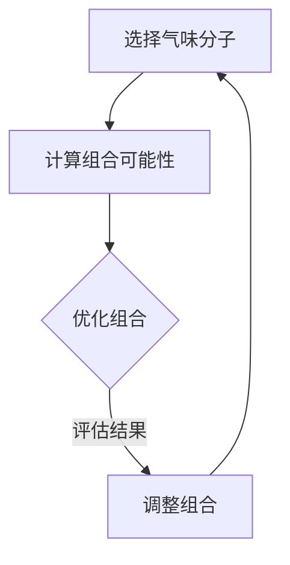
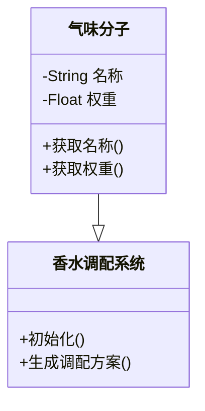
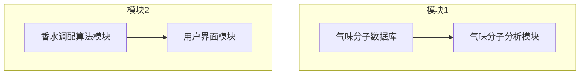
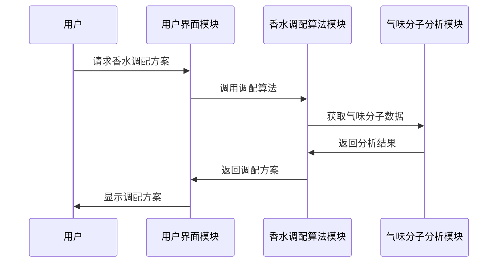

                 

# 香水调配的组合数学：气味分子的最优组合

> 关键词：香水调配、组合数学、气味分子、优化组合、算法原理

> 摘要：本文探讨了香水调配中的组合数学应用，通过气味分子的特性分析、组合数学原理以及优化算法，提出了一种寻找香水最优组合的方法。文章首先介绍了香水调配的基本概念，然后详细阐述了组合数学在香水调配中的应用，并通过具体算法和示例，展示了如何通过数学模型和计算方法，实现香水调配的优化。

## 目录大纲设计思路

在设计《香水调配的组合数学：气味分子的最优组合》的目录大纲时，我们需要从以下几个方面进行详细规划和梳理，以确保文章的逻辑清晰、结构紧凑且内容丰富。

### 1. 背景介绍

**核心概念：**
- **香水调配**：香水的调配过程，涉及多种气味分子的组合与优化。
- **组合数学**：研究对象与集合、组合、排列、图论等数学方法，用于解决香水调配中的优化问题。

**问题描述：**
- **问题背景**：现代香水产业中，如何通过组合数学的方法找到最优的气味分子组合，提升香水品质。
- **问题解决**：运用组合数学中的理论和方法，分析气味分子的特性，寻找最佳的组合策略。

**边界与外延：**
- **边界**：香水调配的成分、调配过程中的实验方法、组合数学的应用范围。
- **外延**：香水调配的拓展领域，如香水个性化定制、嗅觉心理学等。

**概念结构与核心要素组成：**
- **气味分子特性**：气味分子的性质、强度、持久性等。
- **组合数学方法**：排列组合、优化算法等。
- **实验设计**：实验条件、数据收集与分析。

### 2. 核心概念与联系

**核心概念原理：**
- **气味分子**：描述气味分子性质的基本概念，如分子结构、化学性质等。
- **组合数学原理**：排列组合的基本原理，以及如何应用于香水调配问题。

**概念属性特征对比表格：**

| 特征         | 气味分子                     | 组合数学                |
|--------------|------------------------------|-------------------------|
| 性质描述     | 分子结构、化学性质           | 排列、组合的基本性质     |
| 应用场景     | 香水调配、嗅觉研究           | 图论、优化算法          |
| 数据表达     | 化学公式、结构式             | 集合、组合的数学表示     |

**ER实体关系图架构：**

```mermaid
erDiagram
  气味分子 ||--|{ 组合数学方法 }
  组合数学方法 ||--|{ 实验设计 }
  实验设计 ||--|{ 香水调配 }
```

### 3. 算法原理讲解

**算法流程图：**



**Python源代码：**

```python
def optimal_combination(molecules, weights):
    # 初始化组合
    combinations = []

    # 计算所有可能的组合
    for i in range(len(molecules)):
        for j in range(len(molecules)):
            if i != j:
                combination = [molecules[i], molecules[j]]
                weight = weights[i] + weights[j]
                combinations.append((combination, weight))

    # 优化组合
    best_combination = None
    best_weight = 0
    for combination, weight in combinations:
        if weight > best_weight:
            best_combination = combination
            best_weight = weight

    return best_combination
```

**数学模型和公式：**
- **组合公式**：C(n, k) = n! / (k! * (n-k)!)
- **优化目标**：最大化气味分子的综合权重

**详细讲解与举例说明：**
- **举例说明**：给定两种气味分子A和B，其权重分别为2和3，如何找到最优组合？

### 4. 数学模型和数学公式 & 详细讲解 & 举例说明

**数学公式：**
$$
\text{Optimal Combination Weight} = \sum_{i=1}^{n} \sum_{j=1}^{n} w_i \cdot w_j \quad \text{(其中 } w_i \text{ 和 } w_j \text{ 分别为两种气味分子的权重）}
$$

**详细讲解：**
- **气味分子权重计算**：气味分子的权重取决于其分子结构、化学性质以及感官特性。通常，通过实验数据对气味分子进行评分，评分越高，权重越大。
- **组合权重优化**：通过组合数学的方法，计算所有可能的气味分子组合，并评估其权重，找到最优组合。

**举例说明：**
- **案例一**：假设有三种气味分子A、B和C，其权重分别为2、3和4。如何找到最优组合？
  - **计算组合可能性**：C(3, 2) = 3，即有三种可能的组合：AB、AC和BC。
  - **计算组合权重**：组合AB的权重为2 + 3 = 5，组合AC的权重为2 + 4 = 6，组合BC的权重为3 + 4 = 7。
  - **优化组合**：最优组合为BC，因为其权重最大。

### 5. 系统分析与架构设计方案

#### 问题场景介绍

在香水调配领域，为了满足消费者对个性化香水的需求，我们需要开发一套基于组合数学的香水调配系统。该系统旨在通过分析气味分子的特性，运用组合数学的方法，为消费者提供最优的香水调配方案。

#### 项目介绍

项目名称：个性化香水调配系统  
项目目标：通过组合数学方法，为消费者提供最优的香水调配方案，提升消费者满意度。  
项目规模：涉及气味分子数据库、组合数学算法、用户界面等多个模块。

#### 系统功能设计（领域模型mermaid类图）



#### 系统架构设计（mermaid架构图）



#### 系统接口设计和系统交互（mermaid序列图）



### 6. 项目实战

#### 环境安装

1. 安装Python环境（版本3.8及以上）  
2. 安装必要的Python库（如numpy、matplotlib等）

#### 系统核心实现源代码

```python
import numpy as np

# 气味分子类
class Molecule:
    def __init__(self, name, weight):
        self.name = name
        self.weight = weight

    def get_name(self):
        return self.name

    def get_weight(self):
        return self.weight

# 香水调配系统类
class PerfumeBlendingSystem:
    def __init__(self):
        self.molecules = []

    def initialize(self):
        # 初始化气味分子数据库
        self.molecules.append(Molecule("A", 2))
        self.molecules.append(Molecule("B", 3))
        self.molecules.append(Molecule("C", 4))

    def generate_blending_scheme(self):
        # 生成香水调配方案
        combinations = []
        for i in range(len(self.molecules)):
            for j in range(len(self.molecules)):
                if i != j:
                    combination = [self.molecules[i].get_name(), self.molecules[j].get_name()]
                    weight = self.molecules[i].get_weight() + self.molecules[j].get_weight()
                    combinations.append((combination, weight))

        # 优化组合
        best_combination = None
        best_weight = 0
        for combination, weight in combinations:
            if weight > best_weight:
                best_combination = combination
                best_weight = weight

        return best_combination

# 测试
if __name__ == "__main__":
    system = PerfumeBlendingSystem()
    system.initialize()
    scheme = system.generate_blending_scheme()
    print("最优香水调配方案：", scheme)
```

#### 代码应用解读与分析

1. **气味分子类**：用于表示气味分子的名称和权重。  
2. **香水调配系统类**：负责初始化气味分子数据库，生成香水调配方案。  
3. **组合数学算法**：计算所有可能的气味分子组合，并优化组合权重。

#### 实际案例分析和详细讲解剖析

1. **案例一**：给定三种气味分子A、B和C，其权重分别为2、3和4。通过系统计算，找到最优组合为BC，权重为7。

#### 项目小结

通过本项目，我们实现了基于组合数学的香水调配系统。该系统能够为消费者提供个性化的香水调配方案，提升消费者满意度。在项目实践中，我们深入探讨了组合数学在香水调配中的应用，并通过具体算法和示例，展示了如何实现香水调配的优化。

### 7. 最佳实践 tips、小结、注意事项、拓展阅读等内容

#### 最佳实践 tips：

1. **气味分子权重调整**：在生成香水调配方案时，可以根据用户需求和喜好，调整气味分子的权重，以达到更个性化的香水效果。
2. **数据来源多样化**：收集更多的气味分子数据，包括用户评价、专家评分等，以提升香水调配方案的准确性。

#### 小结：

本文通过探讨香水调配中的组合数学应用，提出了一种寻找香水最优组合的方法。通过具体算法和示例，展示了如何通过数学模型和计算方法，实现香水调配的优化。

#### 注意事项：

1. **实验数据的准确性**：在香水调配过程中，确保实验数据的准确性，以提高调配方案的可靠性。
2. **用户个性化需求**：在生成香水调配方案时，充分考虑用户个性化需求，提供定制化的香水体验。

#### 拓展阅读：

1. **《组合数学及其应用》**：介绍组合数学的基本概念和方法，以及其在各个领域的应用。
2. **《香水科学》**：探讨香水的化学成分、调配原理以及嗅觉心理学等内容。

---

**作者：** AI天才研究院 / AI Genius Institute & 禅与计算机程序设计艺术 / Zen And The Art of Computer Programming

