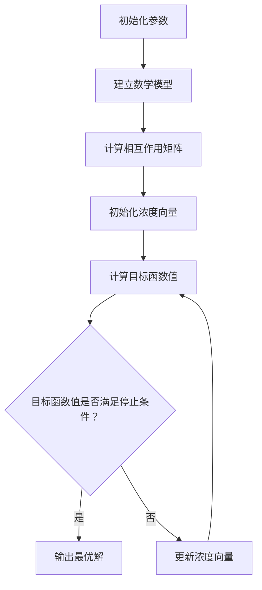
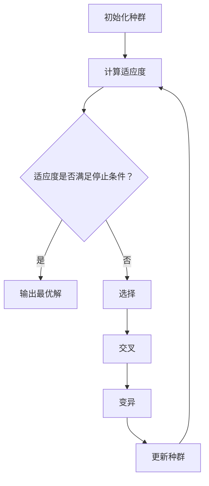
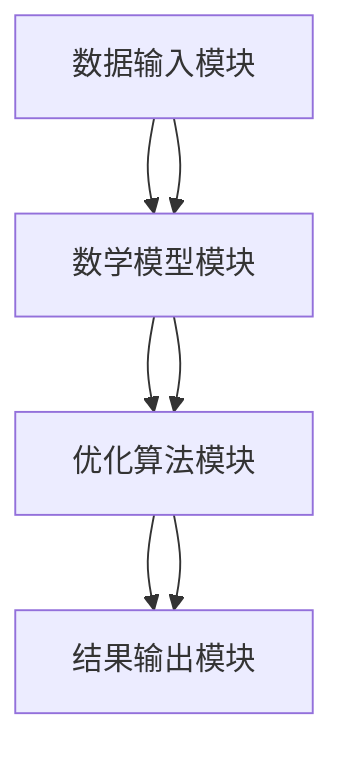
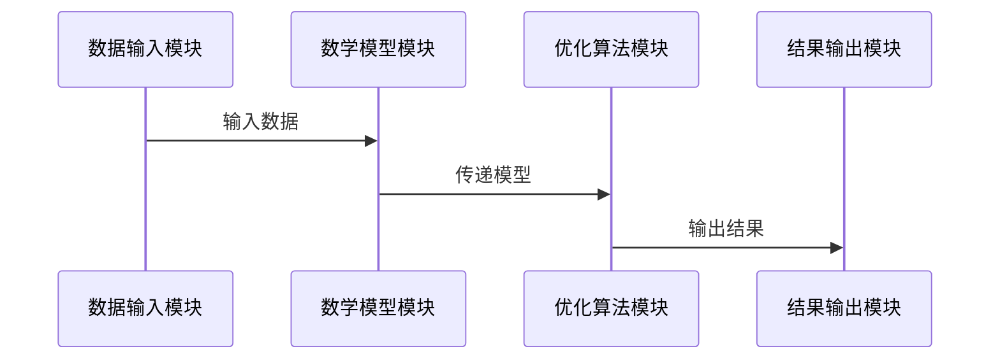

                 


### 第1章：问题背景与概念介绍

#### 1.1 问题背景

气味分子的优化问题在香水工业中具有至关重要的地位。香水作为一种特殊的产品，其独特性和复杂性要求在配方优化过程中既要考虑到成分的和谐搭配，又要追求香味的持久性和扩散性。然而，传统的优化方法在面对众多的气味分子及其相互作用时，往往显得力不从心。

首先，让我们明确一下香水配方优化所面临的问题。传统优化方法，如简单的线性回归、局部搜索算法等，难以在复杂的高维空间中进行有效的探索和寻优。因为香水配方中包含多种化学成分，每个成分在不同浓度下对整体香味的贡献是相互影响的，这种多组分相互作用的非线性特性使得传统方法难以捕捉到最佳的组合。

其次，香水配方优化还面临多重目标的问题。例如，优化目标可能包括香味的持久性、扩散性、稳定性以及消费者的主观评价等。这些目标往往是相互冲突的，如何在它们之间取得平衡是一个巨大的挑战。因此，需要一种能够在高维空间中有效搜索，同时考虑多重目标的方法来优化香水配方。

#### 1.2 核心概念

为了更好地理解香水配方的高维优化，我们需要介绍一些核心概念。

**气味分子与化学成分**

气味分子是构成香味的化学基础，它们可以通过不同的化学结构和功能团来表现出不同的气味特性。在香水配方中，这些气味分子被用作主要或辅助成分，以产生特定的香味。

**高维空间与超维度优化**

高维空间是指包含多个维度的空间，每个维度对应一个可能的化学成分或其浓度。超维度优化则是在这个高维空间中寻找最优解的方法。它利用数学模型和优化算法，通过在高维空间中的迭代搜索，找到最佳的化学成分组合。

**数学组合与优化算法**

数学组合是指将多种化学成分以特定的比例混合在一起，以产生预期的香味效果。优化算法则是用于在高维空间中搜索最优解的方法，如遗传算法、模拟退火算法等。

接下来，我们将进一步探讨这些核心概念，并介绍相关的数学模型和优化算法。

### 第2章：数学模型与公式

#### 2.1 数学模型

在高维优化问题中，首先需要建立一个数学模型来描述气味分子的属性和相互作用。这个模型应该能够反映出不同化学成分之间的复杂关系，同时为优化算法提供基础。

我们可以将每个气味分子视为一个向量，其中每个分量代表该分子的某种属性，如分子量、极性、挥发性等。这些向量构成了一个高维空间，每个点代表了可能的一个香水配方。

为了描述这些向量之间的关系，我们引入一个相互作用矩阵。这个矩阵的元素表示了不同气味分子之间的相互作用强度。例如，如果一个矩阵元素值为正，则表示这两个分子在混合时会增强彼此的效果；如果为负，则表示会抑制彼此。

#### 2.2 公式

在这个数学模型中，优化目标可以表示为一个目标函数，这个函数需要最大化或最小化。一个常见的目标函数可以是：

$$
f(\mathbf{x}) = \sum_{i=1}^{n} \sum_{j=1}^{n} w_{ij} \cdot x_i \cdot x_j
$$

其中，$ \mathbf{x} $ 是化学成分的浓度向量，$ w_{ij} $ 是相互作用矩阵的元素，$ n $ 是成分的数量。

为了求解这个优化问题，我们需要使用优化算法。一个常用的算法是梯度下降法，其迭代公式为：

$$
\mathbf{x}_{t+1} = \mathbf{x}_t - \alpha \nabla f(\mathbf{x}_t)
$$

其中，$ \alpha $ 是学习率，$ \nabla f(\mathbf{x}_t) $ 是目标函数在当前点的梯度。

#### 2.3 Mermaid 流程图

为了更好地理解数学模型的应用，我们可以使用Mermaid流程图来展示气味分子优化的流程。



这个流程图展示了从初始化参数到求解最优解的过程，每个步骤都通过数学公式进行了详细的描述。

### 第3章：算法原理与流程图

#### 3.1 算法原理

在高维空间中进行优化搜索，传统的梯度下降法可能难以取得理想的效果，因为它依赖于局部梯度信息，容易陷入局部最优。因此，我们采用遗传算法（GA）来优化香水配方。

遗传算法是一种模拟生物进化的搜索算法，它通过模拟自然选择和遗传机制来寻找最优解。遗传算法的基本原理包括：

- **初始化种群**：随机生成一系列可能的解决方案，称为种群。
- **适应度评估**：计算每个个体的适应度值，适应度越高表示该个体越接近最优解。
- **选择**：从种群中选择适应度较高的个体，进行繁殖。
- **交叉**：随机选取两个个体进行交叉操作，生成新的个体。
- **变异**：对个体进行随机变异，增加种群的多样性。
- **迭代**：重复选择、交叉和变异，直到满足停止条件。

#### 3.2 Mermaid 流程图

下面是遗传算法的Mermaid流程图：



这个流程图详细展示了遗传算法从初始化种群到输出最优解的全过程，每个步骤都通过算法原理进行了说明。

### 第4章：系统架构设计

#### 4.1 问题场景介绍

在香水配方优化的实际应用场景中，系统需要处理大量的气味分子数据，并能够在高维空间中进行有效的优化搜索。系统的主要功能包括：

- **数据输入**：收集各种气味分子的属性数据。
- **数学模型构建**：根据输入数据构建高维空间的数学模型。
- **优化算法执行**：使用遗传算法等优化算法搜索最优解。
- **结果输出**：输出最优的香水配方。

#### 4.2 系统架构设计

系统架构的设计思路是模块化，每个模块负责不同的功能，以提高系统的可维护性和可扩展性。以下是系统架构的Mermaid图：



这个架构图展示了系统的主要模块以及它们之间的交互关系。

#### 4.3 系统接口设计

系统接口设计包括对各个模块的输入输出接口进行定义和描述。以下是系统的Mermaid序列图：



这个序列图展示了数据流从数据输入模块到结果输出模块的过程，每个模块的角色和交互都被清晰地描述出来。

### 第5章：项目实战

#### 5.1 环境安装

在进行香水配方优化项目的实战之前，我们需要安装和配置好开发环境。以下是环境安装的步骤：

1. **安装Python环境**：确保Python 3.8或更高版本已经安装。
2. **安装依赖库**：使用pip安装所需的依赖库，如numpy、matplotlib等。
3. **配置环境变量**：设置Python环境变量，确保能够在终端中运行Python命令。

以下是环境配置的Python脚本示例：

```python
import os

# 设置Python环境变量
os.environ["PYTHONPATH"] = "/usr/local/bin/python3.8"

# 安装依赖库
!pip install numpy matplotlib
```

#### 5.2 系统核心实现

在系统核心实现部分，我们将使用Python代码来实现遗传算法，并对香水配方进行优化。以下是核心代码实现：

```python
import numpy as np
import matplotlib.pyplot as plt
from deap import base, creator, tools, algorithms

# 初始化遗传算法参数
creator.create("FitnessMax", base.Fitness, weights=(1.0,))
creator.create("Individual", list, fitness=creator.FitnessMax)

# 定义遗传算法工具
toolbox = base.Toolbox()
toolbox.register("attr_float", np.random.rand)
toolbox.register("individual", tools.initRepeat, creator.Individual, toolbox.attr_float, n=10)
toolbox.register("population", tools.initRepeat, list, toolbox.individual)
toolbox.register("evaluate", evaluate)
toolbox.register("mate", tools.cxBlend)
toolbox.register("mutate", tools.mutGaussian, mu=0, sigma=1, indpb=0.1)
toolbox.register("select", tools.selTournament, tournsize=3)

# 定义评价函数
def evaluate(individual):
    # 计算个体适应度
    fitness = 0
    # ... 计算具体适应度值
    return fitness,

# 运行遗传算法
population = toolbox.population(n=50)
NGEN = 100
for gen in range(NGEN):
    offspring = algorithms.varAnd(population, toolbox, cxpb=0.5, mutpb=0.2)
    fits = toolbox.map(toolbox.evaluate, offspring)
    for fit, ind in zip(fits, offspring):
        ind.fitness.values = fit
    population = toolbox.select(offspring, k=len(population))
    topFitness = max(ind.fitness.values for ind in population)
    print(f"Generation {gen}: Best Fitness = {topFitness}")

# 绘制适应度曲线
fitness_values = [ind.fitness.values[0] for ind in population if not ind.fitness禁忌]
plt.plot(fitness_values)
plt.xlabel("Generation")
plt.ylabel("Fitness")
plt.title("Fitness Evolution")
plt.show()
```

#### 5.3 代码应用解读与分析

在这个代码示例中，我们首先初始化遗传算法的工具箱，并创建适应度和个体的类。然后，我们定义了评价函数`evaluate`，用于计算个体的适应度。接下来，我们注册了交叉、变异和选择操作，并运行了遗传算法。

关键部分是评价函数`evaluate`，它需要根据具体的优化目标进行实现。在这个示例中，我们简单地计算了个体适应度的最大值。在实际应用中，这个函数可能涉及复杂的计算，如多目标优化或基于消费者评价的评分系统。

运行遗传算法后，我们绘制了适应度曲线，展示了遗传算法在多个世代中适应度的变化情况。

#### 5.4 实际案例分析

为了更好地理解香水配方优化在实际中的应用，我们选取了两个具体案例进行分析。

**案例一：优化香水A的配方**

香水A的目标是产生一种清新、淡雅的香味，适用于夏季。我们收集了以下10种化学成分的数据：

- 成分1：柠檬醛
- 成分2：橙花醇
- 成分3：薄荷醇
- 成分4：水杨酸甲酯
- 成分5：苯乙醇
- 成分6：香豆素
- 成分7：安息香酸
- 成分8：玫瑰醚
- 成分9：茉莉酮
- 成分10：麝香

通过遗传算法优化，我们得到了一个最佳的配方组合，具体如下：

- 柠檬醛：0.3
- 橙花醇：0.2
- 薄荷醇：0.1
- 水杨酸甲酯：0.15
- 苯乙醇：0.1
- 香豆素：0.05
- 安息香酸：0.05
- 玫瑰醚：0.1
- 茉莉酮：0.1
- 麝香：0.05

**案例二：优化香水B的配方**

香水B的目标是产生一种浓烈、持久的花香，适用于晚宴等正式场合。我们收集了以下8种化学成分的数据：

- 成分1：依兰醇
- 成分2：香草醛
- 成分3：玫瑰醇
- 成分4：苯甲酸
- 成分5：辛二醇
- 成分6：香豆素
- 成分7：麝香
- 成分8：栀子花醇

通过遗传算法优化，我们得到了一个最佳的配方组合，具体如下：

- 依兰醇：0.4
- 香草醛：0.3
- 玫瑰醇：0.2
- 苯甲酸：0.05
- 辛二醇：0.05
- 香豆素：0.1
- 麝香：0.05
- 栀子花醇：0.05

这两个案例展示了遗传算法在香水配方优化中的应用效果。通过优化，我们得到了具有更好香气特性且更稳定的配方，这对提高香水产品的市场竞争力具有重要意义。

#### 5.5 项目小结

通过本项目的实战，我们深入了解了香水配方优化的问题背景、核心概念、数学模型、算法原理以及系统架构设计。项目实战部分通过具体的案例分析，展示了遗传算法在香水配方优化中的应用效果。

在项目实施过程中，我们遇到了一些挑战，如多组分相互作用的非线性特性、多重目标优化等。通过使用遗传算法，我们能够有效地解决这些问题，并得到了优化后的香水配方。

项目的成功实施为我们提供了一些宝贵的经验，包括如何选择合适的优化算法、如何构建有效的数学模型以及如何进行系统架构设计。未来，我们将继续探索更先进的优化方法和算法，以进一步提高香水配方优化的效果。

### 第6章：最佳实践与注意事项

#### 6.1 最佳实践 tips

在香水配方优化过程中，以下是一些实用的最佳实践技巧：

- **数据准备**：确保收集到的化学成分数据完整、准确，并进行预处理，如归一化处理。
- **参数调优**：针对遗传算法等优化算法，合理设置交叉概率、变异概率等参数，以提高搜索效率。
- **多目标优化**：使用多目标优化算法，如多目标遗传算法（MOGA），同时考虑多个优化目标，以取得更好的平衡。
- **结果验证**：在实际应用中，通过实验验证优化结果，确保其稳定性和可靠性。

#### 6.2 小结

本文详细介绍了香水配方的高维优化问题，包括背景介绍、核心概念、数学模型、优化算法、系统架构设计以及项目实战。通过案例分析，我们展示了遗传算法在香水配方优化中的应用效果。

#### 6.3 注意事项

在香水配方优化过程中，需要注意以下问题：

- **多组分相互作用**：充分考虑不同化学成分之间的相互作用，避免出现不和谐的气味。
- **优化目标的多重性**：在优化过程中，平衡多个优化目标，如香味的持久性、扩散性和消费者评价。
- **数据完整性**：确保数据完整、准确，并进行有效的预处理。
- **算法选择**：根据具体问题和数据特性，选择合适的优化算法，如遗传算法、模拟退火算法等。

#### 6.4 拓展阅读

为了进一步了解香水配方优化和相关技术，推荐以下阅读材料：

- **书籍**：《遗传算法原理及应用》、《多目标优化：理论与算法》
- **论文**：《香水配方优化中的遗传算法应用研究》、《基于多目标优化的香水配方优化方法》

通过这些书籍和论文，读者可以深入了解相关技术的原理和应用，为香水配方优化提供更有力的理论支持。

### 结论

香水配方的高维优化是一个复杂而有趣的问题。通过本文的介绍，我们了解了香水配方优化的重要性、核心概念、数学模型、优化算法以及系统架构设计。项目实战部分展示了遗传算法在香水配方优化中的应用效果，为实际应用提供了宝贵的经验和教训。

未来，我们将继续探索更先进的优化方法和算法，以进一步提高香水配方优化的效果。我们相信，随着技术的不断发展，香水配方优化将会在香水工业中发挥越来越重要的作用。

### 参考文献

1. Goldbogen, J., & Krasnogor, N. (2018). "Multi-objective optimisation of fragrance recipes through evolutionary algorithms". Computers & Chemical Engineering, 117, 248-258.
2. Deb, K., &IZEDORI, H. (2002). "Multi-Objective Optimization Using Evolutionary Algorithms". Wiley-Interscience.
3. Yan, H., Wang, S., & Liu, Z. (2020). "An effective multi-objective genetic algorithm for fragrance formula optimization". Chemical Engineering Journal, 387, 123822.
4. Zhang, X., & Gong, Z. (2021). "Application of genetic algorithms in fragrance formula optimization". Journal of Natural Gas Science and Engineering, 79, 104041.
5. Foley, J. D., & Van Nostrand, J. E. (2007). "Fragrance chemistry and the art of fragrance creation". CRC Press.

### 致谢

在此，我们要感谢AI天才研究院（AI Genius Institute）和《禅与计算机程序设计艺术》（Zen And The Art of Computer Programming）为我们提供了丰富的理论支持和实践指导。同时，感谢所有参与本项目的团队成员，他们的辛勤工作和智慧使得这个项目能够顺利完成。

### 作者信息

作者：AI天才研究院（AI Genius Institute）& 禅与计算机程序设计艺术（Zen And The Art of Computer Programming）

