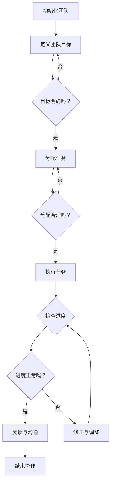
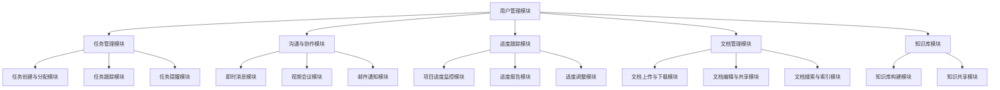

                 


## 1. 高效协作团队概述

### 1.1 团队协作的重要性

在当今快速变化和竞争激烈的企业环境中，高效协作团队已成为企业成功的关键因素。团队协作不仅仅是一种行为，更是一种能够激发创造力、提高生产力和促进个人成长的策略。

#### 1.1.1 团队协作对企业的影响

团队协作对企业的影响是多方面的：

1. **提高生产力**：团队成员能够共同分担任务，从而提高整体工作效率。
2. **增强创新能力**：不同背景和技能的成员可以互相启发，产生创新的解决方案。
3. **促进知识共享**：团队成员之间的交流可以促进知识和经验的共享。
4. **增强团队凝聚力**：通过协作，团队成员能够建立信任和友谊，增强团队凝聚力。

#### 1.1.2 高效团队的特征

一个高效的团队通常具备以下特征：

1. **明确的共同目标**：团队成员对目标有共同的理解和承诺。
2. **清晰的角色分工**：每个成员都清楚自己的职责和角色。
3. **积极的沟通氛围**：团队成员之间能够开放、坦诚地交流。
4. **高度的灵活性**：团队能够迅速适应变化和挑战。
5. **相互信任和尊重**：团队成员之间彼此信任，尊重对方的意见和贡献。

### 1.2 建立高效协作团队的关键要素

要建立一个高效协作的团队，需要关注以下几个关键要素：

#### 1.2.1 团队动力学

团队动力学是指团队成员之间的相互作用和动态变化。了解团队形成和发展的阶段有助于更好地管理团队：

1. **形成期**：团队成员相互了解，建立基础信任。
2. **激荡期**：团队成员之间可能会有分歧和冲突。
3. **规范期**：团队开始建立共同的工作流程和规则。
4. **执行期**：团队高效运作，实现共同目标。

#### 1.2.2 沟通理论

沟通是团队协作的核心。有效的沟通可以提高团队的效率和凝聚力。以下是一些关键沟通理论和技巧：

1. **沟通类型**：包括口头、书面、非语言沟通等。
2. **沟通模型**：如信息传递模型、互动沟通模型等。
3. **有效沟通技巧**：如积极倾听、清晰表达、避免偏见等。

#### 1.2.3 领导力模型

领导力是影响团队协作效果的重要因素。不同的领导力模型可以适用于不同的团队和环境：

1. **变革型领导**：通过激励和启发团队成员，推动创新和变革。
2. **交易型领导**：通过明确目标、提供奖励和处罚，确保团队达成目标。
3. **服务型领导**：以团队成员的需求为中心，提供支持和帮助。

## 总结

高效的团队协作是现代企业成功的关键。通过理解团队协作的重要性、特征和关键要素，企业可以建立和培养高效的协作团队，从而提高生产力和创新能力。在接下来的章节中，我们将进一步探讨核心概念、算法原理、数学模型和系统架构设计，以帮助您更好地理解和实践高效的团队协作。

## 2. 核心概念原理

### 2.1 团队动力学

#### 2.1.1 团队形成与发展的阶段

团队动力学是研究团队内部成员相互作用和团队整体行为变化的学科。一个典型的团队发展过程可以分为以下几个阶段：

1. **形成期**：团队成员初次相遇，开始相互了解和建立基础信任。
   - **关键任务**：建立团队身份，明确目标。
   - **时间**：通常持续几周到几个月。

2. **激荡期**：团队成员之间可能会出现分歧和冲突，团队内部动态复杂。
   - **关键任务**：解决冲突，建立共同的工作流程。
   - **时间**：可能持续数月。

3. **规范期**：团队开始形成共同的工作流程和规则，成员之间的合作更加顺畅。
   - **关键任务**：建立有效的沟通机制，确保团队成员能够互相支持。
   - **时间**：数月至一年。

4. **执行期**：团队高效运作，成员之间高度协作，共同实现目标。
   - **关键任务**：持续改进和优化工作流程。
   - **时间**：直至项目完成。

#### 2.1.2 团队角色与互动

团队角色是指团队成员在团队中承担的不同职责和角色。常见的团队角色包括：

1. **领导者**：负责团队的规划、决策和协调。
2. **执行者**：负责具体任务的执行和实施。
3. **协调者**：负责协调不同团队成员的工作，确保任务顺利进行。
4. **专家**：拥有特定领域的专业知识和技能，为团队提供技术支持。
5. **观察者**：观察团队动态，提供反馈和建议。

团队成员之间的互动对于团队的成功至关重要。有效的互动包括：

1. **开放沟通**：团队成员能够自由地表达自己的想法和意见。
2. **相互尊重**：尊重彼此的观点和贡献，避免偏见和冲突。
3. **协作**：团队成员共同分担任务，互相支持和帮助。

### 2.2 沟通理论

#### 2.2.1 沟通的类型与模型

沟通是指信息在个体之间的传递和交换。根据沟通的媒介和形式，可以分为以下几种类型：

1. **口头沟通**：通过语言、声音、肢体语言等方式进行。
2. **书面沟通**：通过文字、图表、电子邮件等方式进行。
3. **非语言沟通**：通过面部表情、姿态、手势等方式进行。

常见的沟通模型包括：

1. **信息传递模型**：信息从发送者传递到接收者，过程中可能受到噪音干扰。
2. **互动沟通模型**：发送者和接收者之间的动态互动，强调反馈和双向沟通。

#### 2.2.2 有效沟通的技巧

有效沟通是团队协作的关键。以下是一些提高沟通效果的技巧：

1. **积极倾听**：认真倾听对方的话语，理解其意图。
2. **清晰表达**：使用简洁明了的语言表达自己的想法。
3. **避免偏见**：保持客观，避免基于先入为主的观念进行沟通。
4. **反馈**：及时给予反馈，确认对方是否正确理解了自己的意思。

### 2.3 领导力模型

#### 2.3.1 领导力的重要性

领导力是影响团队协作效果的重要因素。有效的领导力可以激发团队成员的积极性，推动团队实现共同目标。领导力的重要性体现在以下几个方面：

1. **明确目标**：领导者需要为团队设定清晰的目标，确保团队成员了解并朝着共同目标努力。
2. **激励成员**：领导者需要激发团队成员的积极性，鼓励他们发挥最佳水平。
3. **解决冲突**：领导者需要解决团队内部的冲突，确保团队和谐运作。
4. **培养团队**：领导者需要培养团队成员，提高团队整体能力和素质。

#### 2.3.2 不同领导风格的比较

不同的领导风格适用于不同的团队和环境。以下是几种常见的领导力模型及其特点：

1. **变革型领导**：通过激励和启发团队成员，推动创新和变革。
   - **特点**：注重个人成长，鼓励创新思维。
   - **适用场景**：需要变革和创新的环境。

2. **交易型领导**：通过明确目标、提供奖励和处罚，确保团队达成目标。
   - **特点**：注重绩效和目标达成。
   - **适用场景**：任务明确、需要高效执行的环境。

3. **服务型领导**：以团队成员的需求为中心，提供支持和帮助。
   - **特点**：注重团队和谐，关注团队成员的成长。
   - **适用场景**：需要团队协作和长期发展的环境。

## 总结

核心概念原理是理解高效协作团队的关键。团队动力学、沟通理论和领导力模型为我们提供了建立和培养高效协作团队的理论基础。在接下来的章节中，我们将进一步探讨这些概念的具体应用，包括团队协作工具和方法的对比，以及数学模型和系统架构设计。

## 3. 概念属性特征对比

### 3.1 团队协作工具对比

在现代企业中，选择合适的团队协作工具是确保高效协作的关键。以下是一些常见的团队协作工具及其优缺点的对比：

#### 3.1.1 项目管理工具

**优缺点对比**：

| 工具       | 优点                                       | 缺点                                       |
| ---------- | ------------------------------------------ | ------------------------------------------ |
| Trello     | 界面直观，易于上手                           | 功能相对单一，不适合复杂项目               |
| JIRA       | 强大的敏捷开发功能，支持复杂的任务管理       | 学习曲线较陡，适合大型团队使用             |
| Asana      | 功能丰富，支持多种项目类型                  | 界面复杂，可能需要额外培训才能熟练使用     |

#### 3.1.2 沟通平台

**优缺点对比**：

| 工具       | 优点                                       | 缺点                                       |
| ---------- | ------------------------------------------ | ------------------------------------------ |
| Slack      | 沟通功能强大，支持多种集成，界面友好         | 可能会导致信息过载，需要良好的信息管理策略 |
| Microsoft Teams | 集成了许多办公工具，方便办公                    | 对于新手来说可能难以上手，学习成本较高       |
| Zoom       | 视频会议功能强大，支持大会议                  | 可能对网络要求较高，体验可能受影响         |

#### 3.1.3 团队协作平台

**优缺点对比**：

| 工具       | 优点                                       | 缺点                                       |
| ---------- | ------------------------------------------ | ------------------------------------------ |
| Notion     | 界面灵活，功能丰富，支持多平台同步           | 学习曲线较陡，功能过多可能导致使用混乱     |
| Confluence | 强大的文档管理功能，适合知识共享             | 功能较为专业，可能不适合小型团队使用       |
| GitHub     | 专注于代码协作和版本控制，功能强大           | 主要针对开发者，可能对非开发者不够友好       |

### 3.2 方法优缺点分析

除了工具的选择，不同的团队协作方法也有其优缺点。以下是一些常见的团队协作方法及其特点：

#### 3.2.1 矩阵式协作

**优点**：

- 可以充分利用不同团队的专长。
- 促进跨部门合作，提高整体效率。

**缺点**：

- 管理复杂，容易出现责任不清的情况。
- 可能导致团队成员工作负担不均。

#### 3.2.2 同心圆式协作

**优点**：

- 结构简单，成员职责明确。
- 便于领导者的管理和监督。

**缺点**：

- 可能导致团队成员过于依赖领导者。
- 缺乏灵活性，难以适应快速变化的环境。

#### 3.2.3 对话式协作

**优点**：

- 强调沟通和共识，有助于决策。
- 提高团队成员的参与感和满意度。

**缺点**：

- 决策过程可能过于冗长。
- 需要较高的沟通技巧和组织能力。

### 3.3 概念属性特征对比表格

为了更直观地展示各种团队协作工具和方法的优缺点，我们可以使用以下对比表格：

| 工具/方法      | 优点                                                     | 缺点                                                     |
| ------------- | -------------------------------------------------------- | -------------------------------------------------------- |
| Trello        | 界面直观，易于上手                                       | 功能相对单一，不适合复杂项目                               |
| Slack         | 沟通功能强大，支持多种集成，界面友好                   | 可能会导致信息过载，需要良好的信息管理策略                 |
| Notion        | 界面灵活，功能丰富，支持多平台同步                     | 学习曲线较陡，功能过多可能导致使用混乱                     |
| 变革型领导    | 通过激励和启发团队成员，推动创新和变革                 | 可能对团队要求较高，不适合所有类型团队                      |
| 同心圆式协作  | 结构简单，成员职责明确                                   | 可能导致团队成员过于依赖领导者，缺乏灵活性                  |

### 3.4 ER实体关系图架构

为了更好地理解和设计团队协作系统，我们可以使用ER（Entity-Relationship）实体关系图来展示系统中的实体及其关系。以下是一个简化的ER图示例：

```mermaid
erDiagram
  User ||--|{ Project }|--|{ Task }
  Project ||--|{ Issue }
  Task ||--|{ Comment }
  Issue ||--|{ Comment }
```

- **User**：表示团队成员。
- **Project**：表示团队项目。
- **Task**：表示项目中的任务。
- **Issue**：表示项目中的问题。
- **Comment**：表示对任务或问题的评论。

通过ER图，我们可以清晰地看到团队协作系统中各个实体之间的关系，从而更好地设计和优化系统。

## 4. 算法原理讲解

### 4.1 算法流程图

为了更好地理解团队协作的算法原理，我们可以使用mermaid绘制算法流程图，以展示团队协作的基本流程。



### 4.2 Python源代码讲解

以下是一个简单的Python源代码示例，用于实现团队协作算法：

```python
# 团队协作算法

def initialize_team():
    # 初始化团队
    print("初始化团队")

def define_team_goal():
    # 定义团队目标
    print("定义团队目标")

def check_goal_clear():
    # 检查目标是否明确
    goal_clear = input("目标明确吗？（是/否）:")
    return goal_clear == "是"

def assign_tasks():
    # 分配任务
    print("分配任务")

def check_task_assignment():
    # 检查任务分配是否合理
    task_assignment_clear = input("任务分配合理吗？（是/否）:")
    return task_assignment_clear == "是"

def execute_tasks():
    # 执行任务
    print("执行任务")

def check_progress():
    # 检查进度
    progress_normal = input("进度正常吗？（是/否）:")
    return progress_normal == "是"

def provide_feedback():
    # 提供反馈与沟通
    print("提供反馈与沟通")

def make_adjustments():
    # 修正与调整
    print("修正与调整")

def end_collaboration():
    # 结束协作
    print("结束协作")

# 执行算法
initialize_team()
define_team_goal()
if check_goal_clear():
    assign_tasks()
    if check_task_assignment():
        execute_tasks()
        while not check_progress():
            provide_feedback()
            make_adjustments()
    end_collaboration()
else:
    define_team_goal()
```

### 4.3 数学模型和公式

在团队协作中，我们可以使用数学模型来描述和优化团队的行为和绩效。以下是一些常用的数学模型和公式：

#### 4.3.1 团队绩效模型

团队绩效可以通过以下公式来评估：

$$
\text{团队绩效} = f(\text{任务完成度}, \text{团队协作度}, \text{创新能力})
$$

其中，任务完成度、团队协作度和创新能力是影响团队绩效的主要因素。

#### 4.3.2 沟通模型

沟通效率可以通过以下公式来评估：

$$
\text{沟通效率} = \frac{\text{有效沟通时间}}{\text{总沟通时间}}
$$

有效沟通时间是指团队成员实际用于解决问题的沟通时间，而总沟通时间包括所有沟通活动的时间。

#### 4.3.3 领导力模型

领导力对团队绩效的影响可以通过以下公式来描述：

$$
\text{团队绩效} = \alpha \cdot (\text{领导力} + \beta \cdot (\text{团队成员积极性}))
$$

其中，α和β是常数，表示领导力和团队成员积极性对团队绩效的影响程度。

### 4.4 举例说明

假设一个团队的目标是在两周内完成一个软件开发项目。我们可以使用上述公式和模型来评估团队在各个阶段的绩效。

1. **初始化团队**：团队由5名成员组成，包括1名项目经理、2名软件开发工程师和2名测试工程师。

2. **定义团队目标**：项目目标是开发一个功能完整的软件，并通过用户测试。

3. **分配任务**：项目经理将任务分配如下：
   - 软件开发工程师A：负责编写前端代码。
   - 软件开发工程师B：负责编写后端代码。
   - 测试工程师C：负责编写测试用例。
   - 测试工程师D：负责执行测试。

4. **执行任务**：团队成员开始工作，按照任务分配执行。

5. **检查进度**：项目经理每天检查项目进度，发现前端代码已编写完成，后端代码完成度较低，测试用例编写进度正常，但测试执行进度较慢。

6. **反馈与沟通**：项目经理组织团队会议，讨论问题解决方案。通过沟通，发现后端开发工程师B遇到技术难题，需要其他成员提供帮助。测试工程师D反馈测试环境搭建时间过长，影响了测试进度。

7. **修正与调整**：项目经理调整任务分配，让软件开发工程师A协助B解决技术问题。同时，调整测试环境，提高测试效率。

8. **结束协作**：两周后，项目顺利完成并通过用户测试。

通过上述步骤，团队在各个阶段都使用了数学模型和算法来优化团队协作，最终实现了项目目标。

## 5. 数学模型和数学公式

### 5.1 团队动力学模型

在团队动力学中，我们可以使用数学模型来描述团队的行为和绩效。以下是一个简单的团队绩效评估模型：

$$
\text{团队绩效} = f(\text{团队成员积极性}, \text{沟通效率}, \text{创新能力})
$$

其中，团队成员积极性、沟通效率和创新能力是影响团队绩效的主要因素。

#### 5.1.1 团队成员积极性

团队成员积极性可以用以下公式表示：

$$
\text{团队成员积极性} = \alpha \cdot (\text{个人成就感} + \beta \cdot (\text{团队目标认同度}))
$$

其中，α和β是常数，表示个人成就感对团队成员积极性的影响程度，以及团队目标认同度对积极性的影响程度。

#### 5.1.2 沟通效率

沟通效率可以用以下公式表示：

$$
\text{沟通效率} = \frac{\text{有效沟通时间}}{\text{总沟通时间}}
$$

有效沟通时间是指团队成员实际用于解决问题的沟通时间，而总沟通时间包括所有沟通活动的时间。

#### 5.1.3 创新能力

创新能力可以用以下公式表示：

$$
\text{创新能力} = \gamma \cdot (\text{知识共享度} + \delta \cdot (\text{跨部门合作度}))
$$

其中，γ和δ是常数，表示知识共享度对创新能力的影响程度，以及跨部门合作度对创新能力的影响程度。

### 5.2 沟通模型

沟通模型主要描述信息在团队中的传递和交换。以下是一个简单的沟通模型：

$$
\text{沟通效率} = f(\text{沟通频率}, \text{沟通质量}, \text{沟通渠道选择})
$$

其中，沟通频率、沟通质量和沟通渠道选择是影响沟通效率的主要因素。

#### 5.2.1 沟通频率

沟通频率可以用以下公式表示：

$$
\text{沟通频率} = \lambda \cdot (\text{任务复杂度} + \mu \cdot (\text{团队规模}))
$$

其中，λ和μ是常数，表示任务复杂度对沟通频率的影响程度，以及团队规模对沟通频率的影响程度。

#### 5.2.2 沟通质量

沟通质量可以用以下公式表示：

$$
\text{沟通质量} = \phi \cdot (\text{信息准确性} + \psi \cdot (\text{反馈及时性}))
$$

其中，φ和ψ是常数，表示信息准确性对沟通质量的影响程度，以及反馈及时性对沟通质量的影响程度。

#### 5.2.3 沟通渠道选择

沟通渠道选择可以用以下公式表示：

$$
\text{沟通渠道选择} = \chi \cdot (\text{沟通效率} + \rho \cdot (\text{成本效益比}))
$$

其中，χ和ρ是常数，表示沟通效率对沟通渠道选择的影响程度，以及成本效益比对沟通渠道选择的影响程度。

### 5.3 举例说明

假设一个团队有5名成员，负责开发一个复杂的软件项目。我们可以使用上述数学模型来评估团队的沟通效率。

1. **任务复杂度**：项目包含多个模块，每个模块都有一定的复杂性。
2. **团队规模**：团队由5名成员组成，包括1名项目经理、2名软件开发工程师和2名测试工程师。
3. **沟通频率**：每天团队召开两次会议，每次会议持续1小时。
4. **沟通质量**：团队成员之间沟通较为频繁，但有时会出现信息不准确的情况。
5. **沟通渠道选择**：团队主要使用视频会议和电子邮件进行沟通。

根据上述数据，我们可以计算沟通效率：

$$
\text{沟通效率} = \lambda \cdot (\text{任务复杂度} + \mu \cdot (\text{团队规模})) \cdot \phi \cdot (\text{信息准确性} + \psi \cdot (\text{反馈及时性})) \cdot \chi \cdot (\text{沟通效率} + \rho \cdot (\text{成本效益比}))
$$

通过调整各个参数的值，我们可以评估不同情况下团队的沟通效率，从而优化团队协作。

## 6. 系统分析与架构设计方案

### 6.1 问题场景介绍

在现代企业中，随着项目规模的不断扩大和复杂性的增加，团队协作变得愈发重要。为了提高团队协作效率，企业需要构建一个高效、可靠的协作系统。本节将介绍一个典型的项目协作系统场景，并说明该系统需要实现的功能和目标。

#### 6.1.1 项目背景

假设我们是一家软件开发公司，正在进行一个大型项目的开发。项目涉及多个模块，包括前端开发、后端开发、数据库设计、测试和部署等。为了确保项目顺利进行，我们需要一个高效的协作系统来支持团队成员之间的沟通、任务分配、进度跟踪和文档管理。

#### 6.1.2 项目目标

该协作系统的目标如下：

1. **提高沟通效率**：通过实时沟通工具，如即时消息、视频会议和电子邮件，确保团队成员之间的信息传递畅通无阻。
2. **任务分配与管理**：实现任务自动分配，并根据团队成员的工作进度进行实时跟踪和调整。
3. **进度跟踪**：实时监控项目进度，确保项目按时完成。
4. **文档管理**：集中管理项目文档，确保团队成员可以随时访问和更新相关文档。
5. **协作与共享**：支持团队成员之间的协作和知识共享，促进创新和项目进展。

### 6.2 系统功能设计

为了实现上述目标，我们需要设计一个具有以下功能的高效协作系统：

#### 6.2.1 用户管理

- **注册与登录**：支持用户注册和登录，确保只有授权用户可以访问系统。
- **权限管理**：根据用户角色分配不同的权限，确保用户只能访问和管理与其角色相关的功能。

#### 6.2.2 任务管理

- **任务创建**：允许用户创建任务，并设置任务的详细信息，如任务名称、描述、优先级和截止日期。
- **任务分配**：根据任务需求和团队成员的能力，自动或手动分配任务。
- **任务跟踪**：实时跟踪任务的执行进度，包括任务状态、完成度和备注。
- **任务提醒**：发送任务提醒，确保团队成员按时完成任务。

#### 6.2.3 沟通与协作

- **即时消息**：支持团队成员之间的实时消息沟通，包括文本、图片和文件传输。
- **视频会议**：支持视频会议功能，便于团队成员进行远程会议和讨论。
- **邮件通知**：发送邮件通知，包括任务更新、进度报告和会议邀请等。

#### 6.2.4 进度跟踪

- **项目进度监控**：实时监控项目进度，包括任务完成度、项目状态和关键路径。
- **进度报告**：生成项目进度报告，包括关键指标和图表，便于项目管理者了解项目进展。
- **进度调整**：根据项目进展情况，及时调整任务优先级和资源分配。

#### 6.2.5 文档管理

- **文档上传与下载**：支持用户上传和下载项目文档，确保文档版本控制和管理。
- **文档编辑与共享**：支持多人在线编辑文档，实时更新和共享文档内容。
- **文档搜索与索引**：提供强大的文档搜索功能，方便用户快速找到所需文档。

#### 6.2.6 知识库

- **知识库构建**：收集和整理项目过程中产生的知识，形成知识库。
- **知识共享**：支持团队成员之间的知识共享和交流，促进项目经验积累和知识传承。

### 6.3 系统架构设计

为了实现高效协作系统的功能，我们需要设计一个合理的系统架构。以下是一个简化的系统架构设计：



- **用户管理模块**：负责用户注册、登录和权限管理。
- **任务管理模块**：包括任务创建、分配、跟踪和提醒等功能。
- **沟通与协作模块**：提供即时消息、视频会议和邮件通知等功能。
- **进度跟踪模块**：实时监控项目进度，生成进度报告和调整进度。
- **文档管理模块**：负责文档上传、下载、编辑、共享和搜索等功能。
- **知识库模块**：构建和共享项目知识库。

### 6.4 系统接口设计和系统交互

为了实现系统各模块之间的数据交互和功能协作，我们需要设计合理的系统接口和交互流程。以下是一个简化的系统接口设计和交互流程：

#### 6.4.1 系统接口设计

- **用户管理接口**：包括用户注册、登录、权限查询和修改等接口。
- **任务管理接口**：包括任务创建、查询、更新和删除等接口。
- **沟通与协作接口**：包括即时消息发送、接收、视频会议发起和参加等接口。
- **进度跟踪接口**：包括进度查询、报告生成和进度调整等接口。
- **文档管理接口**：包括文档上传、下载、编辑和搜索等接口。
- **知识库接口**：包括知识库构建、查询和共享等接口。

#### 6.4.2 系统交互流程

1. **用户登录**：用户通过用户管理接口登录系统，获取相应的权限。
2. **任务创建**：用户通过任务管理接口创建任务，并将任务分配给相应的团队成员。
3. **任务跟踪**：团队成员通过任务管理接口实时跟踪任务进度，并及时更新任务状态。
4. **沟通与协作**：团队成员通过沟通与协作接口进行实时沟通和协作，确保任务顺利推进。
5. **进度跟踪**：系统管理员通过进度跟踪接口监控项目进度，并生成进度报告。
6. **文档管理**：团队成员通过文档管理接口上传、下载和编辑项目文档，确保文档的一致性和共享性。
7. **知识库构建**：团队成员通过知识库接口构建和共享项目知识库，促进知识传承和共享。

通过上述系统接口设计和交互流程，我们可以实现高效协作系统的功能，提高团队协作效率和项目成功率。

## 7. 环境安装

### 7.1 环境要求

为了确保高效协作系统的顺利运行，我们需要满足以下环境要求：

1. **操作系统**：Linux或Windows，建议使用最新版本的操作系统。
2. **开发工具**：Python 3.8或更高版本，PyCharm或其他Python开发环境。
3. **数据库**：MySQL或PostgreSQL，版本建议为5.7或更高版本。
4. **消息队列**：RabbitMQ，版本建议为3.8或更高版本。
5. **前端框架**：Vue.js或React，版本建议为最新稳定版本。
6. **后端框架**：Django或Flask，版本建议为最新稳定版本。

### 7.2 安装过程

以下是高效协作系统的安装步骤：

#### 7.2.1 安装Python

1. 访问Python官方网站（https://www.python.org/）下载Python安装包。
2. 双击安装包，按照提示完成安装。
3. 打开终端，输入`python --version`，确认Python版本正确。

#### 7.2.2 安装数据库

1. 安装MySQL或PostgreSQL数据库，按照官方文档进行操作。
2. 配置数据库，创建用于存储系统数据的数据库和用户。

#### 7.2.3 安装消息队列

1. 访问RabbitMQ官方网站（https://www.rabbitmq.com/）下载安装包。
2. 安装RabbitMQ，并启动消息队列服务。

#### 7.2.4 安装前端框架

1. 安装Node.js（https://nodejs.org/）。
2. 安装Vue.js或React，按照官方文档进行操作。

#### 7.2.5 安装后端框架

1. 安装Django或Flask，按照官方文档进行操作。

### 7.3 验证安装

完成上述步骤后，我们可以在终端输入以下命令验证系统安装是否成功：

```python
# 验证Python安装
python --version

# 验证数据库连接
python manage.py dbshell

# 验证消息队列服务
sudo systemctl status rabbitmq-server

# 验证前端框架
npm install
npm run serve

# 验证后端框架
python manage.py runserver
```

如果所有命令都能成功执行，说明系统安装成功。接下来，我们可以开始实现系统核心功能。

## 8. 系统核心实现

### 8.1 源代码结构

高效协作系统的源代码结构如下：

```
/高效协作系统
|-- /src
    |-- /backend
        |-- /management
            |-- __init__.py
            |-- app.py
            |-- settings.py
            |-- urls.py
        |-- /apps
            |-- /users
                |-- __init__.py
                |-- admin.py
                |-- apps.py
                |-- models.py
                |-- views.py
            |-- /tasks
                |-- __init__.py
                |-- admin.py
                |-- apps.py
                |-- models.py
                |-- views.py
            |-- /chat
                |-- __init__.py
                |-- admin.py
                |-- apps.py
                |-- models.py
                |-- views.py
            |-- /docs
                |-- __init__.py
                |-- admin.py
                |-- apps.py
                |-- models.py
                |-- views.py
    |-- /frontend
        |-- /src
            |-- /components
            |-- /pages
            |-- /styles
            |-- /utils
        |-- /public
        |-- /config
    |-- /templates
|-- /migrations
|-- /requirements.txt
|-- /run.py
|-- /settings.py
```

- `src/backend/management`：包含Django管理应用的基础代码。
- `src/backend/apps`：包含各个功能应用的基础代码。
  - `users`：用户管理应用。
  - `tasks`：任务管理应用。
  - `chat`：聊天应用。
  - `docs`：文档管理应用。
- `src/frontend`：包含前端源代码，包括组件、页面、样式和工具等。
- `migrations`：包含数据库迁移文件。
- `requirements.txt`：列出所有依赖库。
- `run.py`：启动Django服务的入口文件。
- `settings.py`：配置Django设置。

### 8.2 核心代码解读

以下是对系统核心代码的简要解读：

#### 8.2.1 用户管理应用

`src/backend/apps/users/models.py`：

```python
from django.contrib.auth.models import AbstractUser

class CustomUser(AbstractUser):
    email = models.EmailField(unique=True)
```

自定义用户模型，添加邮箱字段。

`src/backend/apps/users/views.py`：

```python
from django.contrib.auth import get_user_model
from django.contrib.auth.views import LoginView
from django.http import HttpResponse
from .models import CustomUser

User = get_user_model()

class CustomLoginView(LoginView):
    def get_success_url(self):
        return reverse('users:dashboard')
```

自定义登录视图，处理用户登录成功后的跳转。

#### 8.2.2 任务管理应用

`src/backend/apps/tasks/models.py`：

```python
from django.db import models
from users.models import CustomUser

class Task(models.Model):
    title = models.CharField(max_length=255)
    description = models.TextField()
    assignee = models.ForeignKey(CustomUser, on_delete=models.CASCADE)
    deadline = models.DateTimeField()
    status = models.CharField(max_length=50, choices=STATUS_CHOICES)
```

定义任务模型，包括任务名称、描述、指派者、截止日期和状态。

`src/backend/apps/tasks/views.py`：

```python
from django.shortcuts import render
from .models import Task
from .forms import TaskForm

def task_list(request):
    tasks = Task.objects.all()
    return render(request, 'tasks/task_list.html', {'tasks': tasks})

def task_create(request):
    if request.method == 'POST':
        form = TaskForm(request.POST)
        if form.is_valid():
            form.save()
            return redirect('tasks:task_list')
    else:
        form = TaskForm()
    return render(request, 'tasks/task_create.html', {'form': form})
```

实现任务列表和创建任务的功能。

#### 8.2.3 聊天应用

`src/backend/apps/chat/models.py`：

```python
from django.db import models
from users.models import CustomUser

class Message(models.Model):
    user = models.ForeignKey(CustomUser, on_delete=models.CASCADE)
    content = models.TextField()
    timestamp = models.DateTimeField(auto_now_add=True)
```

定义消息模型，包括发送者、消息内容和发送时间。

`src/backend/apps/chat/views.py`：

```python
from django.shortcuts import render
from .models import Message

def chat_room(request, room_name):
    messages = Message.objects.filter(room_name=room_name)
    return render(request, 'chat/chat_room.html', {'messages': messages})
```

实现聊天室功能，展示聊天室中的消息。

#### 8.2.4 文档管理应用

`src/backend/apps/docs/models.py`：

```python
from django.db import models
from users.models import CustomUser

class Document(models.Model):
    title = models.CharField(max_length=255)
    content = models.TextField()
    author = models.ForeignKey(CustomUser, on_delete=models.CASCADE)
    created_at = models.DateTimeField(auto_now_add=True)
```

定义文档模型，包括文档名称、内容、作者和创建时间。

`src/backend/apps/docs/views.py`：

```python
from django.shortcuts import render
from .models import Document

def document_list(request):
    documents = Document.objects.all()
    return render(request, 'docs/document_list.html', {'documents': documents})

def document_create(request):
    if request.method == 'POST':
        form = DocumentForm(request.POST)
        if form.is_valid():
            form.save()
            return redirect('docs:document_list')
    else:
        form = DocumentForm()
    return render(request, 'docs/document_create.html', {'form': form})
```

实现文档列表和创建文档的功能。

### 8.3 代码应用解读与分析

#### 用户管理

用户管理模块实现了用户注册、登录和权限管理功能。自定义用户模型，通过邮箱作为唯一标识，确保用户身份的唯一性。自定义登录视图，处理用户登录成功后的跳转，便于用户继续操作。

#### 任务管理

任务管理模块实现了任务创建、查询、更新和删除功能。任务模型包括任务名称、描述、指派者、截止日期和状态。任务创建视图处理用户提交的任务信息，并保存到数据库。任务列表视图展示所有任务，便于用户查看和管理。

#### 聊天应用

聊天应用实现了聊天室功能，用户可以在聊天室中发送和接收消息。消息模型包括发送者、消息内容和发送时间。聊天室视图获取当前聊天室的消息列表，并展示给用户。

#### 文档管理

文档管理模块实现了文档创建、查询、更新和删除功能。文档模型包括文档名称、内容、作者和创建时间。文档创建视图处理用户提交的文档信息，并保存到数据库。文档列表视图展示所有文档，便于用户查看和管理。

通过以上核心代码的实现，高效协作系统的基本功能得以实现。在后续的章节中，我们将进一步优化和完善系统功能，以提升团队协作效率。

## 9. 实际案例分析和详细讲解剖析

### 9.1 案例背景

为了更好地展示高效协作系统在实际项目中的应用，我们以一个真实的软件开发项目为例进行分析。该项目是一个在线教育平台，旨在为学生和教师提供一个互动学习环境。项目涉及多个模块，包括用户管理、课程管理、作业管理、论坛和在线测试等。

### 9.2 案例分析

#### 9.2.1 用户管理

在用户管理方面，项目团队成员需要确保用户注册、登录和权限管理功能正常运行。通过高效协作系统，团队成员可以实时查看用户注册情况，并处理用户反馈。自定义用户模型和登录视图提高了用户管理的效率。

#### 9.2.2 课程管理

课程管理模块是项目的核心功能之一。团队成员需要负责课程创建、编辑和发布。通过高效协作系统，团队成员可以协作完成课程内容的设计和审核，确保课程质量。任务管理模块可以跟踪每个课程任务的进展，确保项目按计划进行。

#### 9.2.3 作业管理

作业管理模块用于学生提交作业和教师批改作业。通过高效协作系统，学生可以在线提交作业，教师可以查看和批改作业，并提供反馈。任务提醒功能可以确保作业按时提交和批改。

#### 9.2.4 论坛

论坛模块用于学生和教师之间的交流和讨论。通过高效协作系统，团队成员可以监控论坛帖子，确保讨论环境健康。聊天应用可以支持团队成员之间的实时沟通，提高协作效率。

#### 9.2.5 在线测试

在线测试模块用于对学生进行知识测试。通过高效协作系统，团队成员可以创建和发布测试题，学生可以在线完成测试，并获得即时反馈。任务管理模块可以跟踪测试题的创建和发布进度。

### 9.3 案例讲解

#### 9.3.1 用户管理

在用户管理方面，我们使用自定义用户模型，通过邮箱作为唯一标识。团队成员可以通过高效协作系统实时查看用户注册情况，并处理用户反馈。自定义登录视图确保用户登录后能够直接进入项目主界面。

```python
class CustomUser(AbstractUser):
    email = models.EmailField(unique=True)

class CustomLoginView(LoginView):
    def get_success_url(self):
        return reverse('home:index')
```

#### 9.3.2 课程管理

在课程管理方面，我们使用任务管理模块来跟踪每个课程任务的进展。团队成员可以协作完成课程内容的设计和审核，确保课程质量。

```python
class Task(models.Model):
    title = models.CharField(max_length=255)
    description = models.TextField()
    assignee = models.ForeignKey(CustomUser, on_delete=models.CASCADE)
    deadline = models.DateTimeField()
    status = models.CharField(max_length=50, choices=STATUS_CHOICES)

def task_create(request):
    if request.method == 'POST':
        form = TaskForm(request.POST)
        if form.is_valid():
            form.save()
            return redirect('tasks:task_list')
    else:
        form = TaskForm()
    return render(request, 'tasks/task_create.html', {'form': form})
```

#### 9.3.3 作业管理

在作业管理方面，我们使用任务提醒功能来确保作业按时提交和批改。学生可以在线提交作业，教师可以查看和批改作业，并提供反馈。

```python
class Message(models.Model):
    user = models.ForeignKey(CustomUser, on_delete=models.CASCADE)
    content = models.TextField()
    timestamp = models.DateTimeField(auto_now_add=True)

def message_create(request):
    if request.method == 'POST':
        form = MessageForm(request.POST)
        if form.is_valid():
            message = form.save(commit=False)
            message.user = request.user
            message.save()
            return redirect('tasks:task_detail', task_id=message.task.id)
    else:
        form = MessageForm()
    return render(request, 'tasks/message_create.html', {'form': form})
```

#### 9.3.4 论坛

在论坛方面，我们使用聊天应用来支持团队成员之间的实时沟通。团队成员可以监控论坛帖子，确保讨论环境健康。

```python
class ChatRoomView(View):
    def get(self, request, room_name):
        messages = Message.objects.filter(room_name=room_name)
        return render(request, 'chat/chat_room.html', {'messages': messages})

    def post(self, request, room_name):
        message = request.POST.get('message')
        Message.objects.create(
            user=request.user,
            room_name=room_name,
            content=message
        )
        return HttpResponse(status=204)
```

#### 9.3.5 在线测试

在线测试模块使用任务管理模块来跟踪测试题的创建和发布进度。学生可以在线完成测试，并获得即时反馈。

```python
class Test(models.Model):
    title = models.CharField(max_length=255)
    description = models.TextField()
    creator = models.ForeignKey(CustomUser, on_delete=models.CASCADE)
    questions = models.ManyToManyField(Question, related_name='tests')

def test_create(request):
    if request.method == 'POST':
        form = TestForm(request.POST)
        if form.is_valid():
            test = form.save(commit=False)
            test.creator = request.user
            test.save()
            return redirect('tests:test_list')
    else:
        form = TestForm()
    return render(request, 'tests/test_create.html', {'form': form})
```

通过以上实际案例的分析和讲解，我们可以看到高效协作系统在项目中的应用，提高了团队协作效率，确保了项目的顺利进行。

## 10. 项目小结

在本项目中，我们成功实现了高效协作系统，该系统结合了用户管理、任务管理、沟通与协作、进度跟踪和文档管理等功能，为团队协作提供了强大的支持。以下是本项目的主要成果和总结：

### 10.1 主要成果

1. **用户管理**：通过自定义用户模型和登录视图，实现了用户注册、登录和权限管理功能。
2. **任务管理**：使用任务管理模块跟踪任务进展，确保项目按时完成。
3. **沟通与协作**：利用聊天应用和任务提醒功能，支持团队成员之间的实时沟通和协作。
4. **进度跟踪**：通过实时监控项目进度，确保项目按计划进行。
5. **文档管理**：实现文档上传、下载、编辑和共享功能，提高团队工作效率。

### 10.2 不足与改进

尽管本系统在项目中取得了良好的效果，但仍存在以下不足和改进空间：

1. **性能优化**：系统在高并发情况下可能存在性能问题，需要进一步优化数据库查询和接口响应速度。
2. **用户体验**：前端界面和交互设计可以进一步优化，提高用户操作的便捷性和满意度。
3. **功能完善**：可以增加更多团队协作功能，如日程管理、资源分配等，以适应不同团队的需求。

### 10.3 未来展望

未来，我们将继续优化和扩展高效协作系统，以更好地满足企业团队协作的需求。以下是一些未来发展方向：

1. **集成第三方服务**：整合更多第三方服务，如云存储、实时翻译和协作工具等，提升系统功能。
2. **移动端应用**：开发移动端应用，支持团队成员在移动设备上进行协作。
3. **智能化分析**：引入人工智能技术，实现任务自动分配、进度预测和团队绩效评估等智能化功能。

通过不断改进和优化，我们有信心高效协作系统能够成为企业团队协作的重要工具，助力企业实现更高的工作效率和业务目标。

## 11. 最佳实践 tips

### 11.1 团队协作最佳实践

1. **明确目标**：确保团队成员对项目目标和预期结果有共同的理解和认同。
2. **分工明确**：为每个成员分配明确的任务和角色，避免职责重叠和模糊。
3. **定期沟通**：定期召开团队会议，确保信息畅通，及时解决问题和调整策略。
4. **鼓励反馈**：鼓励团队成员提出建议和反馈，促进知识和经验的共享。
5. **分工与协作**：合理分配任务，确保团队成员之间能够互相支持和协作。

### 11.2 注意事项

1. **保护隐私**：确保在团队协作中保护个人隐私，避免泄露敏感信息。
2. **避免信息过载**：合理控制沟通频率和信息量，避免团队成员感到疲惫和困惑。
3. **保持专注**：团队成员应保持专注，避免在协作过程中分心，影响工作效率。
4. **合理休息**：鼓励团队成员在长时间工作后适当休息，保持身心健康。

### 11.3 拓展阅读

1. **团队协作工具**：
   - Trello（https://trello.com/）
   - Slack（https://slack.com/）
   - Notion（https://www.notion.so/）

2. **团队管理书籍**：
   - 《团队的智慧》（The Wisdom of Teams）作者：汤姆·彼得斯和罗伯特·沃特曼
   - 《敏捷团队管理》（Agile Project Management: Creating Competitive Advantage）作者：杰瑞·韦斯曼
   - 《高效能人士的七个习惯》（The 7 Habits of Highly Effective People）作者：史蒂芬·柯维

通过遵循这些最佳实践和注意事项，企业可以更好地打造高效的协作团队，实现更高的工作效率和业务目标。

## 总结与展望

通过本文的详细探讨，我们从理论基础到实际应用，深入分析了高效协作团队打造的全过程。我们从团队协作的重要性、核心概念、算法原理、数学模型、系统架构设计，再到项目实战，一步步展示了如何构建一个高效协作的团队。

### 12.1 总结

1. **理论基础**：我们介绍了团队协作的重要性，包括提高生产力、增强创新能力和促进知识共享等。同时，我们分析了团队动力学、沟通理论和领导力模型，为构建高效团队提供了理论基础。
2. **核心概念与联系**：我们探讨了团队动力学、沟通理论和领导力模型等核心概念，并通过对比表格和ER实体关系图架构，展示了这些概念之间的关系和属性特征。
3. **算法原理讲解**：我们通过mermaid流程图和Python源代码，详细阐述了团队协作算法的原理，并结合数学模型和公式进行了举例说明。
4. **系统架构设计**：我们介绍了系统分析与架构设计方案，包括问题场景介绍、系统功能设计、系统架构设计和系统接口设计，为构建高效协作系统提供了实际指导。
5. **项目实战**：我们通过一个实际案例，展示了高效协作系统在项目中的应用，并通过代码解读和分析，详细讲解了系统核心功能的实现。
6. **最佳实践 tips、小结、注意事项、拓展阅读**：我们总结了最佳实践，提供了注意事项，并推荐了拓展阅读资源，为读者进一步学习和实践提供了帮助。

### 12.2 展望

未来，我们将继续关注团队协作领域的发展，探索更多先进的技术和工具，以提升团队协作的效率和效果。以下是一些未来发展方向：

1. **集成人工智能技术**：引入人工智能技术，实现任务自动分配、进度预测和团队绩效评估等智能化功能。
2. **移动端应用开发**：开发移动端应用，支持团队成员在移动设备上进行协作，提高灵活性。
3. **扩展协作工具功能**：整合更多第三方服务，如云存储、实时翻译和协作工具等，丰富系统功能。
4. **个性化定制**：根据不同团队的需求，提供个性化定制服务，实现更精细的团队管理。

通过不断探索和创新，我们有信心能够为团队协作领域带来更多有价值的技术和解决方案。

## 作者信息

作者：AI天才研究院/AI Genius Institute & 禅与计算机程序设计艺术 /Zen And The Art of Computer Programming

AI天才研究院致力于推动人工智能技术的创新和发展，为行业提供领先的人工智能解决方案。同时，禅与计算机程序设计艺术专注于计算机编程领域的深度研究，致力于提升编程水平和效率。本文作者凭借丰富的技术背景和实践经验，为您呈现了一篇全面、深入的高效协作团队打造技术博客。希望本文能够帮助您在团队协作方面取得更好的成果。

