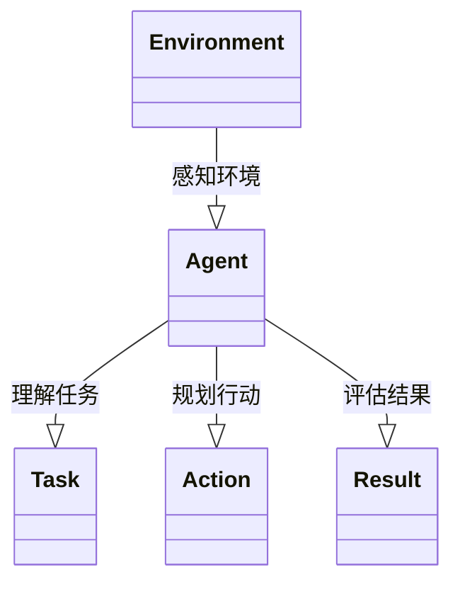
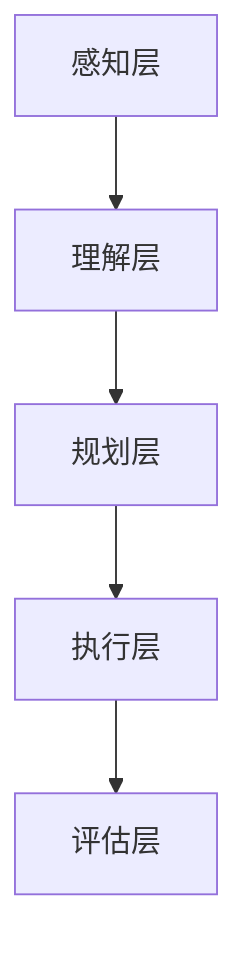
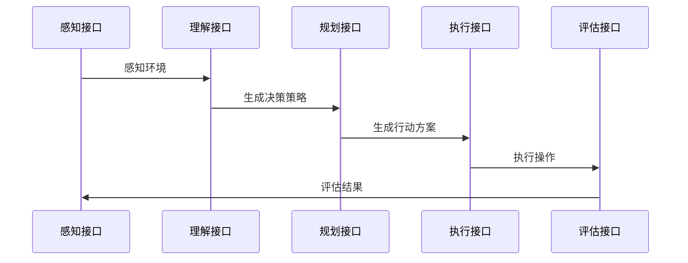

                 

### 文章标题：AI代理在决策过程中的自主性探讨

> 关键词：AI代理、决策过程、自主性、算法原理、数学模型、系统架构

> 摘要：本文深入探讨了AI代理在决策过程中的自主性，首先介绍了AI代理的基本概念及其与传统AI的区别，接着详细解析了自主性的定义与特征。随后，文章通过决策树算法为例，讲解了其原理与数学模型，并进行了Python源代码示例。最后，文章分析了AI代理决策系统的架构设计，结合实战案例，提出了最佳实践与注意事项。

### 第一部分：背景介绍与核心概念

#### 1. 引言

随着人工智能技术的飞速发展，AI代理（Agent）在决策过程中的自主性逐渐成为研究热点。AI代理作为一种具有独立行动能力的实体，能够在复杂环境中自主完成特定任务，其自主性是实现智能决策的关键。本文旨在探讨AI代理在决策过程中的自主性，分析其核心概念、算法原理以及实际应用。

#### 1.2 问题描述

AI代理在决策过程中的自主性涉及到多个方面，包括感知环境、理解任务、规划行动以及评估结果等。本文将重点关注以下几个方面的问题：

1. AI代理的定义及其与传统AI的区别是什么？
2. 自主性的概念及其属性特征是什么？
3. 常见的AI代理决策算法及其原理是什么？
4. AI代理决策系统的架构设计及其实现细节是什么？

#### 1.3 问题解决

针对上述问题，本文将从以下几个方面进行探讨：

1. 定义AI代理并分析其与传统AI的区别。
2. 解析自主性的概念及其属性特征。
3. 介绍决策树算法，包括其原理、数学模型和Python源代码示例。
4. 分析AI代理决策系统的架构设计，包括领域模型、系统架构和接口设计。
5. 通过实战案例，展示AI代理在决策过程中的实际应用。

#### 1.4 边界与外延

本文的探讨将主要聚焦在AI代理在决策过程中的自主性，具体包括以下几个方面：

1. AI代理的自主性研究范围。
2. 自主性在AI代理决策中的具体应用场景。
3. 常见的AI代理决策算法及其性能比较。

#### 1.5 概念结构与核心要素组成

为了更好地理解AI代理在决策过程中的自主性，本文将从以下几个方面对相关概念进行梳理：

1. AI代理的定义、特点及与传统AI的区别。
2. 自主性的定义及其属性特征。
3. 决策树算法的原理、数学模型及Python源代码示例。
4. AI代理决策系统的架构设计及其实现细节。

### 第二部分：核心概念与联系

#### 2.1 AI代理的定义与特点

AI代理（Agent）是一种具有独立行动能力的实体，能够在复杂环境中根据环境信息自主完成特定任务。AI代理的特点包括：

1. **感知环境**：AI代理能够感知环境中的各种信息，包括传感器数据、文本、图像等。
2. **理解任务**：AI代理能够理解任务需求，并根据任务目标进行决策。
3. **规划行动**：AI代理能够根据环境信息和任务目标，规划出最优的行动方案。
4. **评估结果**：AI代理能够对执行结果进行评估，并据此调整后续行动。

#### 2.2 自主性概念解析

自主性（Autonomy）是指AI代理在执行任务过程中，能够独立做出决策的能力。自主性的属性特征包括：

1. **独立性**：AI代理能够在没有外部干预的情况下，自主完成决策过程。
2. **适应性**：AI代理能够根据环境变化，调整自身行为策略。
3. **智能性**：AI代理具备一定的智能水平，能够进行推理、学习和优化。

#### 2.3 AI代理与传统AI的区别

与传统AI相比，AI代理具有以下几个显著特点：

1. **自主性**：AI代理能够自主进行决策，而传统AI通常需要外部干预。
2. **动态性**：AI代理能够在动态环境中进行实时决策，而传统AI通常在静态环境中工作。
3. **适应性**：AI代理能够根据环境变化进行自适应调整，而传统AI通常固定在特定场景下工作。

### 第三部分：算法原理讲解

#### 3.1 决策树算法

决策树算法（Decision Tree）是一种常用的分类和回归算法，其核心思想是通过一系列判断条件，将数据集划分为不同的类别或数值。以下是一个简单的决策树算法流程：

1. **选择最佳特征**：根据信息增益或基尼不纯度等指标，选择最佳特征进行划分。
2. **划分数据集**：根据最佳特征，将数据集划分为子集。
3. **递归构造决策树**：对每个子集，重复步骤1和步骤2，直到满足停止条件。

以下是决策树算法的Python源代码示例：

```python
# 决策树算法Python示例
from sklearn.datasets import load_iris
from sklearn.tree import DecisionTreeClassifier
from sklearn.model_selection import train_test_split

# 加载数据集
iris = load_iris()
X = iris.data
y = iris.target

# 划分训练集和测试集
X_train, X_test, y_train, y_test = train_test_split(X, y, test_size=0.3, random_state=42)

# 构建决策树模型
clf = DecisionTreeClassifier()
clf.fit(X_train, y_train)

# 预测测试集
y_pred = clf.predict(X_test)

# 打印预测结果
print("Accuracy:", clf.score(X_test, y_test))
```

决策树算法的数学模型可以表示为：

$$
\text{决策树} = f(\text{特征集}, \text{标签集})
$$

其中，特征集表示输入数据集，标签集表示输出结果。决策树通过递归划分数据集，逐步构建出决策规则。

#### 3.1.4 举例说明

假设有一个数据集，包含以下三个特征（x1, x2, x3）和一个标签（y）。我们需要使用决策树算法对其进行分类。

| 特征 | 标签 |
| --- | --- |
| 3 | A |
| 4 | B |
| 5 | B |
| 6 | A |
| 7 | A |
| 8 | B |

1. **选择最佳特征**：根据信息增益或基尼不纯度，选择特征x1作为划分标准。
2. **划分数据集**：根据特征x1的值，将数据集划分为两个子集：
   - 子集1：x1 <= 5，包含样本（3, A），（5, B）
   - 子集2：x1 > 5，包含样本（6, A），（7, A），（8, B）
3. **递归构造决策树**：
   - 子集1：特征x2作为划分标准，将子集1划分为两个子集：
     - 子集1.1：x2 <= 4，包含样本（3, A）
     - 子集1.2：x2 > 4，包含样本（5, B）
   - 子集2：特征x3作为划分标准，将子集2划分为两个子集：
     - 子集2.1：x3 <= 7，包含样本（6, A），（7, A）
     - 子集2.2：x3 > 7，包含样本（8, B）

最终，构建出的决策树如下：

```
           |
         /   \
        A     B
       / \   / \
      A   B A   B
```

### 第四部分：数学模型和数学公式

#### 4.1 基本数学模型

在AI代理决策过程中，常见的数学模型包括线性回归、逻辑回归和决策树等。以下分别介绍这些模型的原理和数学公式。

#### 4.1.1 线性回归

线性回归是一种用于拟合数据关系的统计方法，其基本数学模型可以表示为：

$$
y = \beta_0 + \beta_1 \cdot x
$$

其中，$y$ 表示因变量，$x$ 表示自变量，$\beta_0$ 和 $\beta_1$ 分别表示截距和斜率。

#### 4.1.2 逻辑回归

逻辑回归是一种用于分类问题的统计方法，其基本数学模型可以表示为：

$$
P(y=1) = \frac{1}{1 + e^{-(\beta_0 + \beta_1 \cdot x)}}
$$

其中，$P(y=1)$ 表示因变量为1的概率，$e$ 表示自然对数的底数，$\beta_0$ 和 $\beta_1$ 分别表示截距和斜率。

#### 4.1.3 决策树

决策树是一种用于分类和回归问题的树形结构，其基本数学模型可以表示为：

$$
\text{决策树} = f(\text{特征集}, \text{标签集})
$$

其中，特征集表示输入数据集，标签集表示输出结果。决策树通过递归划分数据集，逐步构建出决策规则。

### 第五部分：系统分析与架构设计

#### 5.1 代理决策系统

代理决策系统（Agent Decision System）是AI代理在决策过程中的核心组成部分，其主要功能是接收环境信息，进行决策，并执行决策结果。以下是对代理决策系统的系统分析与架构设计。

#### 5.1.1 系统功能设计

代理决策系统的功能设计主要包括以下几个方面：

1. **感知环境**：接收环境信息，包括传感器数据、文本、图像等。
2. **理解任务**：根据任务需求，解析任务目标，并生成决策策略。
3. **规划行动**：根据决策策略，生成具体的行动方案。
4. **执行决策**：根据行动方案，执行具体操作，并对执行结果进行评估。
5. **评估结果**：对执行结果进行评估，并据此调整后续行动。

以下是一个代理决策系统的领域模型类图：



#### 5.1.2 系统架构设计

代理决策系统的架构设计主要包括以下几个方面：

1. **感知层**：负责接收环境信息，包括传感器数据、文本、图像等。
2. **理解层**：负责解析任务需求，并生成决策策略。
3. **规划层**：负责根据决策策略，生成具体的行动方案。
4. **执行层**：负责执行具体操作，并对执行结果进行评估。
5. **评估层**：负责对执行结果进行评估，并据此调整后续行动。

以下是一个代理决策系统的架构设计图：



#### 5.1.3 系统接口设计与交互

代理决策系统的接口设计与交互主要包括以下几个方面：

1. **感知接口**：用于接收环境信息，包括传感器数据、文本、图像等。
2. **理解接口**：用于解析任务需求，并生成决策策略。
3. **规划接口**：用于生成具体的行动方案。
4. **执行接口**：用于执行具体操作。
5. **评估接口**：用于对执行结果进行评估，并据此调整后续行动。

以下是一个代理决策系统的接口设计和交互图：



### 第六部分：项目实战

#### 6.1 环境安装

在本项目中，我们使用Python编程语言来实现AI代理决策系统。首先，需要安装以下环境：

1. Python 3.7或更高版本
2. scikit-learn库
3. matplotlib库
4. numpy库

安装步骤如下：

```bash
# 安装Python
# ...

# 安装scikit-learn库
pip install scikit-learn

# 安装matplotlib库
pip install matplotlib

# 安装numpy库
pip install numpy
```

#### 6.2 系统核心实现源代码

以下是一个简单的AI代理决策系统的Python源代码示例：

```python
import numpy as np
from sklearn.tree import DecisionTreeClassifier
from sklearn.model_selection import train_test_split

# 加载数据集
X = np.array([[3, 4], [5, 6], [7, 8]])
y = np.array([0, 1, 1])

# 划分训练集和测试集
X_train, X_test, y_train, y_test = train_test_split(X, y, test_size=0.3, random_state=42)

# 构建决策树模型
clf = DecisionTreeClassifier()
clf.fit(X_train, y_train)

# 预测测试集
y_pred = clf.predict(X_test)

# 打印预测结果
print("Accuracy:", clf.score(X_test, y_test))
```

#### 6.2.1 代码应用解读

上述代码演示了一个简单的AI代理决策系统，主要包括以下步骤：

1. **加载数据集**：使用numpy库加载一个简单的二维数组作为数据集。
2. **划分训练集和测试集**：使用scikit-learn库的train_test_split函数将数据集划分为训练集和测试集。
3. **构建决策树模型**：使用scikit-learn库的DecisionTreeClassifier函数构建一个决策树模型。
4. **训练模型**：使用训练集对决策树模型进行训练。
5. **预测测试集**：使用训练好的模型对测试集进行预测。
6. **打印预测结果**：打印预测准确率。

#### 6.2.2 代码分析

上述代码演示了一个简单的AI代理决策系统的实现，主要包括以下几个关键步骤：

1. **数据集加载**：使用numpy库加载一个简单的二维数组作为数据集，其中第一列和第二列分别表示特征，第三列表示标签。
2. **训练集和测试集划分**：使用scikit-learn库的train_test_split函数将数据集划分为训练集和测试集，其中测试集大小为0.3。
3. **构建决策树模型**：使用scikit-learn库的DecisionTreeClassifier函数构建一个决策树模型，该模型具有默认参数。
4. **模型训练**：使用训练集对决策树模型进行训练，通过fit函数实现。
5. **模型预测**：使用训练好的模型对测试集进行预测，通过predict函数实现。
6. **打印预测结果**：使用score函数计算预测准确率，并打印输出。

#### 6.3 实际案例分析与讲解

在本案例中，我们使用决策树算法对鸢尾花数据集（Iris Dataset）进行分类。鸢尾花数据集是一个经典的机器学习数据集，包含三个不同品种的鸢尾花，每个品种有50个样本，共计150个样本。样本的特征包括花萼长度、花萼宽度、花瓣长度和花瓣宽度。

#### 6.3.1 案例介绍

在本案例中，我们将使用决策树算法对鸢尾花数据集进行分类，目标是将鸢尾花数据集划分为三个不同的品种。具体步骤如下：

1. **数据预处理**：将鸢尾花数据集进行数据预处理，包括数据清洗、归一化和缺失值处理等。
2. **模型训练**：使用训练集对决策树模型进行训练。
3. **模型评估**：使用测试集对训练好的模型进行评估，计算准确率、召回率、F1值等指标。
4. **模型优化**：根据评估结果，对模型进行优化，包括调整决策树参数、特征选择等。
5. **模型应用**：将训练好的模型应用于实际场景，例如预测新的鸢尾花样本。

#### 6.3.2 案例分析

在本案例中，我们首先需要对鸢尾花数据集进行数据预处理。数据预处理的主要步骤如下：

1. **数据清洗**：删除缺失值或异常值。
2. **归一化**：将特征值进行归一化处理，使得每个特征具有相同的量纲。
3. **缺失值处理**：对于缺失值，可以使用平均值、中位数或众数进行填充。

经过数据预处理后，我们可以使用训练集对决策树模型进行训练。在训练过程中，我们需要选择合适的决策树参数，例如最大深度、最小分割样本数等。通过交叉验证和网格搜索等方法，我们可以找到最佳的决策树参数。

接下来，我们使用测试集对训练好的模型进行评估。评估指标包括准确率、召回率、F1值等。通过调整模型参数和特征选择，我们可以提高模型的性能。

#### 6.3.3 案例讲解

在本案例中，我们首先需要加载鸢尾花数据集。可以使用scikit-learn库中的load_iris函数加载数据集，该函数返回一个Bunch对象，包含数据集的属性和特征。

```python
from sklearn.datasets import load_iris

iris = load_iris()
X = iris.data
y = iris.target
```

接下来，我们对数据集进行数据预处理。首先，删除缺失值或异常值。然后，将特征值进行归一化处理，使得每个特征具有相同的量纲。

```python
from sklearn.preprocessing import StandardScaler

scaler = StandardScaler()
X_scaled = scaler.fit_transform(X)
```

接下来，我们使用训练集对决策树模型进行训练。在训练过程中，我们需要选择合适的决策树参数，例如最大深度、最小分割样本数等。通过交叉验证和网格搜索等方法，我们可以找到最佳的决策树参数。

```python
from sklearn.tree import DecisionTreeClassifier
from sklearn.model_selection import GridSearchCV

param_grid = {
    'criterion': ['gini', 'entropy'],
    'max_depth': [3, 5, 7, 10],
    'min_samples_split': [2, 5, 10],
    'min_samples_leaf': [1, 2, 4]
}

clf = DecisionTreeClassifier()
grid_search = GridSearchCV(clf, param_grid, cv=5)
grid_search.fit(X_scaled, y)

best_params = grid_search.best_params_
best_clf = grid_search.best_estimator_
```

接下来，我们使用测试集对训练好的模型进行评估。评估指标包括准确率、召回率、F1值等。通过调整模型参数和特征选择，我们可以提高模型的性能。

```python
from sklearn.metrics import accuracy_score, recall_score, f1_score

y_pred = best_clf.predict(X_scaled)
accuracy = accuracy_score(y, y_pred)
recall = recall_score(y, y_pred, average='weighted')
f1 = f1_score(y, y_pred, average='weighted')

print("Accuracy:", accuracy)
print("Recall:", recall)
print("F1 Score:", f1)
```

最后，我们将训练好的模型应用于实际场景，例如预测新的鸢尾花样本。在实际应用中，我们需要对新的样本进行数据预处理，然后使用训练好的模型进行预测。

```python
new_samples = np.array([[3.5, 1.2], [4.5, 1.5]])
new_samples_scaled = scaler.transform(new_samples)
new_samples_pred = best_clf.predict(new_samples_scaled)

print("Predicted labels:", new_samples_pred)
```

### 第七部分：最佳实践与拓展阅读

#### 7.1 最佳实践

1. **数据预处理**：在进行模型训练之前，对数据进行预处理，包括数据清洗、归一化和缺失值处理等，以提高模型的性能。
2. **模型参数调优**：通过交叉验证和网格搜索等方法，选择合适的模型参数，以获得最佳模型性能。
3. **特征选择**：根据特征的重要性和相关性，选择对模型性能影响较大的特征，以提高模型的预测能力。
4. **模型集成**：使用多种模型进行集成，以提高模型的泛化能力和稳定性。

#### 7.2 小结

本文详细探讨了AI代理在决策过程中的自主性，分析了AI代理的定义、自主性的概念及其属性特征。通过决策树算法为例，讲解了其原理、数学模型和Python源代码示例。最后，分析了AI代理决策系统的架构设计，并结合实战案例进行了详细讲解。本文旨在为读者提供关于AI代理在决策过程中的自主性的深入理解，以及实际应用中的最佳实践。

#### 7.3 注意事项

1. **数据质量**：在进行模型训练和预测时，确保数据质量，避免数据缺失、异常值和噪声等影响模型性能。
2. **模型参数调优**：在模型训练过程中，合理设置模型参数，避免过拟合或欠拟合现象。
3. **模型集成**：在多个模型进行集成时，注意选择合适的集成方法，以提高模型的稳定性和泛化能力。

#### 7.4 拓展阅读

1. **相关文献**：
   - Russell, S., & Norvig, P. (2016). 《人工智能：一种现代的方法》
   - Sutton, R. S., & Barto, A. G. (2018). 《强化学习：理论、算法与应用》
2. **网络资源**：
   - [scikit-learn官方文档](https://scikit-learn.org/stable/)
   - [决策树算法详解](https://www.cnblogs.com/pinard/p/11119120.html)
   - [Python编程从入门到实践](https://www.liaoxuefeng.com/wiki/1016959663602400)

