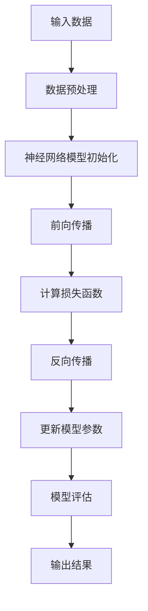
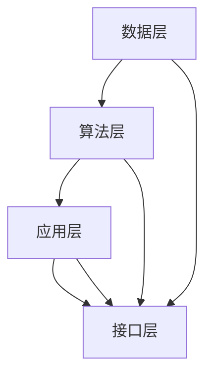
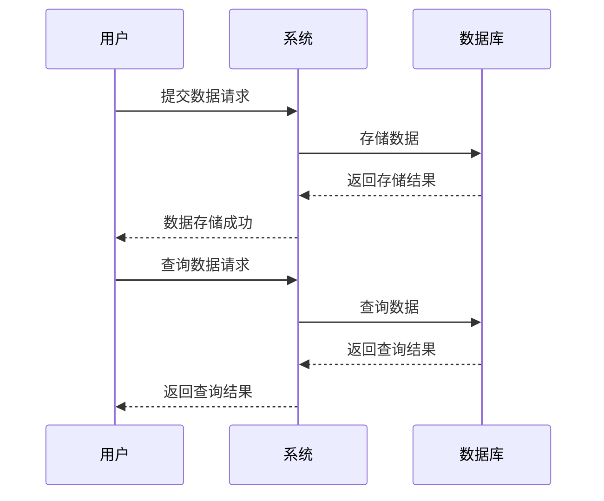
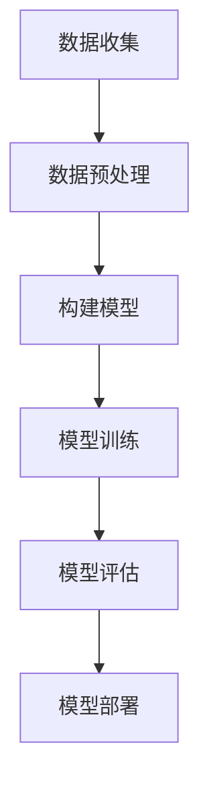
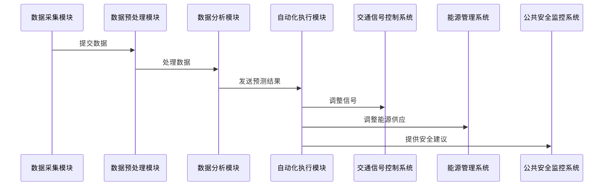
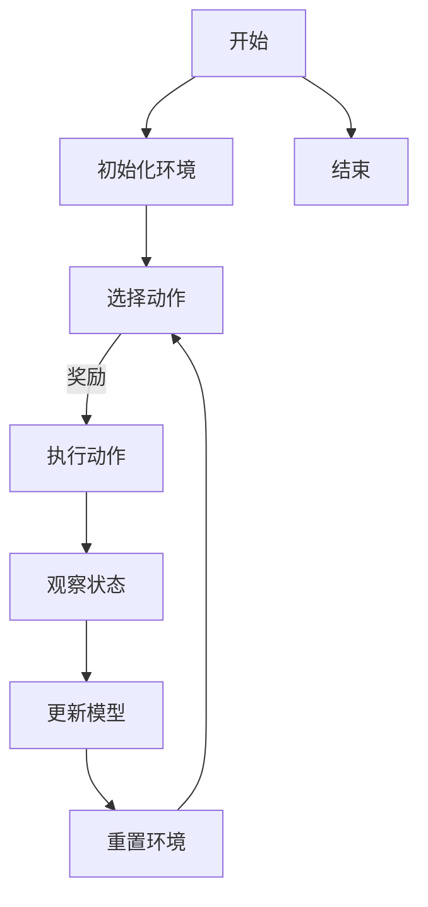
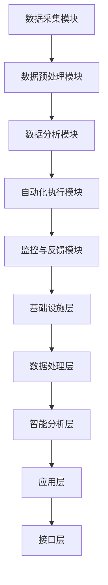
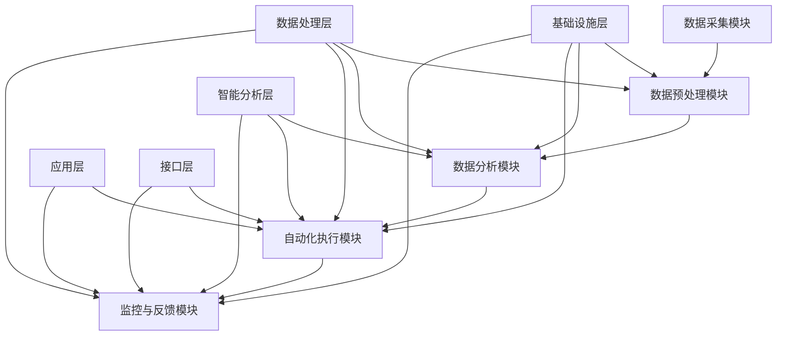

                 

**# AI代理在智慧城市管理中的应用**

> 关键词：智慧城市管理，AI代理，应用实践，算法原理，系统架构

> 摘要：本文将深入探讨AI代理在智慧城市管理中的应用，从背景介绍、核心概念、算法原理到系统设计与实战应用，全面剖析AI代理如何提升智慧城市管理的效率和质量。通过本文，读者可以了解AI代理的基本概念、原理以及在实际项目中的应用，为智慧城市的发展提供新的思路和解决方案。

### 目录大纲

#### 第一部分：背景介绍

## 第一章：问题背景与核心概念

### 1.1 问题背景

- 智慧城市管理的现状与挑战
- AI代理的概念与优势

### 1.2 核心概念

- AI代理的定义
- 智慧城市的基本架构

#### 第二部分：核心概念与联系

## 第二章：AI代理原理与特点

### 2.1 AI代理的原理

- 代理模型的工作机制
- AI代理的核心特点

### 2.2 AI代理的属性特征对比

- 传统代理与AI代理的对比
- AI代理在不同领域的应用对比

#### 第三部分：算法原理讲解

## 第三章：AI代理算法详解

### 3.1 算法原理

- 机器学习算法基础
- 常见的AI代理算法

### 3.2 数学模型与公式

- 数学模型讲解
- 公式推导与示例

### 3.3 算法流程图

- 使用Mermaid绘制算法流程图

#### 第四部分：系统分析与架构设计

## 第四章：智慧城市管理系统的设计与实现

### 4.1 项目介绍

- 项目背景与目标

### 4.2 系统功能设计

- 领域模型（Mermaid类图）

### 4.3 系统架构设计

- 系统架构（Mermaid架构图）

### 4.4 系统接口设计

- 系统接口设计（Mermaid序列图）

#### 第五部分：项目实战

## 第五章：AI代理在智慧城市管理中的实战应用

### 5.1 环境安装与配置

- 开发环境准备
- 数据集准备

### 5.2 系统核心实现源代码

- 关键代码分析与讲解

### 5.3 实际案例分析

- 案例一：交通流量预测
- 案例二：能源管理优化

### 5.4 项目小结

- 项目成果总结
- 经验与教训

#### 第六部分：最佳实践与拓展

## 第六章：最佳实践与拓展

### 6.1 最佳实践

- AI代理应用的常见问题与解决方案
- 性能优化技巧

### 6.2 小结与展望

- 本书内容的总结
- 智慧城市管理的发展趋势

### 6.3 注意事项

- 安全与隐私保护
- 技术更新与持续学习

### 6.4 拓展阅读

- 相关书籍与论文推荐
- 优秀的AI代理应用案例研究

#### 第七部分：作者信息

- 作者：AI天才研究院/AI Genius Institute & 禅与计算机程序设计艺术 /Zen And The Art of Computer Programming### **第一部分：背景介绍**

#### **第一章：问题背景与核心概念**

#### **1.1 问题背景**

智慧城市是指利用信息技术、物联网、大数据等先进手段，将城市的基础设施、公共资源、社会服务等进行智能化改造和整合，实现高效、绿色、安全、便捷的城市管理和服务。随着城市化进程的加速，智慧城市建设已成为全球各国政府和行业的重要议题。

然而，智慧城市建设面临诸多挑战。首先，城市数据的规模和复杂性不断增加，如何高效地收集、存储、处理和分析这些数据，成为智慧城市建设的核心问题。其次，城市资源有限，如何实现资源的最优化配置，提高城市运行效率，是智慧城市需要解决的重要问题。此外，城市安全问题日益突出，如何利用先进技术提升城市安全水平，也是智慧城市建设的重要任务。

在这一背景下，AI代理作为一种智能化、自动化的解决方案，逐渐受到关注。AI代理能够通过学习城市数据，模拟人类的决策过程，自动进行资源配置、任务调度、异常检测等操作，从而提升智慧城市管理的效率和质量。

#### **1.2 核心概念**

**AI代理（Artificial Intelligence Agent）**

AI代理是指能够自主学习、自主决策并执行任务的智能实体。它可以模拟人类的思维方式，对复杂环境进行感知、理解、分析和决策，从而实现自动化和智能化。

AI代理的基本特征包括：

- 自主性：能够自主地完成指定任务，不受外部控制。
- 反应性：能够对环境的变化做出实时响应。
- 社交性：能够与人类和其他智能实体进行交互。
- 学理性：能够从环境中学习，不断优化自身的决策能力。

**智慧城市（Smart City）**

智慧城市是指利用先进的信息技术，将城市的基础设施、公共资源、社会服务等进行智能化改造和整合，实现高效、绿色、安全、便捷的城市管理和服务。

智慧城市的基本架构包括：

- 信息基础设施：包括网络、数据中心、传感器等。
- 应用平台：包括数据管理平台、智能服务平台等。
- 应用领域：包括交通管理、能源管理、公共安全、环境监测等。

### **第二部分：核心概念与联系**

#### **第二章：AI代理原理与特点**

#### **2.1 AI代理的原理**

AI代理的工作机制可以概括为以下四个步骤：

1. **感知环境**：通过传感器、摄像头等设备，收集城市数据。
2. **理解环境**：利用自然语言处理、图像识别等技术，对数据进行分析和理解。
3. **决策规划**：基于对环境的理解和已有的知识，制定最优的决策方案。
4. **执行任务**：根据决策方案，自动执行任务，并对结果进行评估和反馈。

**核心特点**

- **自主性**：AI代理能够自主地完成指定任务，不受外部控制。
- **反应性**：AI代理能够对环境的变化做出实时响应。
- **社交性**：AI代理能够与人类和其他智能实体进行交互。
- **学理性**：AI代理能够从环境中学习，不断优化自身的决策能力。

#### **2.2 AI代理的属性特征对比**

**传统代理与AI代理的对比**

| 特征             | 传统代理                             | AI代理                                 |
|------------------|--------------------------------------|----------------------------------------|
| 自主性           | 受到人类指令控制                     | 能够自主决策和执行任务                  |
| 反应性           | 对环境变化的响应速度较慢             | 能够实时响应环境变化                    |
| 社交性           | 主要依赖于人类进行交互               | 能够与人类和其他智能实体进行交互        |
| 学理性           | 不能从环境中学习                     | 能够从环境中学习，不断优化自身能力      |

**AI代理在不同领域的应用对比**

| 领域             | 优势                                       | 劣势                                       |
|------------------|------------------------------------------|------------------------------------------|
| 交通管理         | 能够实时调整交通信号，优化交通流量       | 对交通数据依赖较高，需要大量的实时数据支持 |
| 能源管理         | 能够根据实时数据，动态调整能源供应       | 对能源数据要求较高，数据处理难度较大      |
| 公共安全         | 能够实时监测城市安全状况，提前预警       | 对数据质量和实时性要求较高                |
| 环境监测         | 能够实时监测城市环境，提出污染治理方案   | 需要大量的传感器支持，成本较高            |

### **第三部分：算法原理讲解**

#### **第三章：AI代理算法详解**

#### **3.1 算法原理**

AI代理的算法原理主要基于机器学习。机器学习是一种通过数据驱动的方式，让计算机自动获取知识和技能的技术。AI代理通过机器学习，可以不断地从数据中学习，提高决策能力和准确性。

**机器学习算法基础**

- **监督学习（Supervised Learning）**：通过已有数据的输入和输出，训练模型，使其能够预测新的输入数据。
- **无监督学习（Unsupervised Learning）**：仅通过输入数据，没有对应的输出数据，让模型自动发现数据中的模式。
- **强化学习（Reinforcement Learning）**：通过奖励和惩罚机制，让模型在试错过程中不断学习，找到最优策略。

**常见的AI代理算法**

- **决策树（Decision Tree）**：通过一系列条件判断，将数据分割成不同的子集，并给出相应的决策。
- **支持向量机（SVM）**：通过找到一个最佳的超平面，将不同类别的数据分开。
- **神经网络（Neural Network）**：通过模拟生物神经元的工作方式，对数据进行处理和预测。
- **深度学习（Deep Learning）**：通过多层神经网络，对数据进行复杂的特征提取和预测。

#### **3.2 数学模型与公式**

AI代理的数学模型主要基于概率论和优化理论。以下是一些基本的数学模型和公式：

- **概率分布函数（Probability Distribution Function）**：描述随机变量的可能取值和概率。
- **期望（Expected Value）**：表示随机变量可能取值的平均值。
- **方差（Variance）**：表示随机变量取值的波动程度。
- **梯度下降（Gradient Descent）**：一种优化算法，通过不断调整模型参数，使损失函数最小。

以下是一个简单的神经网络数学模型：

$$
f(x) = \sigma(\sum_{i=1}^{n} w_i * x_i + b)
$$

其中，$f(x)$ 是神经网络的输出，$x_i$ 是输入特征，$w_i$ 是权重，$b$ 是偏置，$\sigma$ 是激活函数。

#### **3.3 算法流程图**

以下是一个基于深度学习的AI代理算法的流程图：



### **第四部分：系统分析与架构设计**

#### **第四章：智慧城市管理系统的设计与实现**

#### **4.1 项目介绍**

本项目旨在通过AI代理技术，构建一个智慧城市管理平台，实现交通流量预测、能源管理优化、公共安全监控等功能。项目的主要目标包括：

- 实现实时数据采集和智能分析。
- 构建智能决策模型，优化城市资源配置。
- 提高城市运行效率，降低能耗和污染。
- 增强城市安全防护能力，保障市民生命财产安全。

#### **4.2 系统功能设计**

系统功能设计主要包括以下方面：

- **数据采集与管理**：通过传感器、摄像头等设备，采集城市数据，并对数据进行预处理和存储。
- **数据分析和预测**：利用机器学习算法，对采集到的数据进行分析和预测，为城市管理提供决策支持。
- **智能决策与执行**：根据分析结果，自动生成决策方案，并执行相关操作，实现智能化管理。
- **系统监控与评估**：实时监控系统的运行状态，评估系统性能，并提供故障诊断和优化建议。

以下是一个基于Mermaid的领域模型类图：

```mermaid
classDiagram
    类1{数据采集器}
    类2{数据预处理模块}
    类3{数据分析模块}
    类4{智能决策模块}
    类5{执行模块}
    类6{监控模块}
    类1 --> 类2
    类2 --> 类3
    类3 --> 类4
    类4 --> 类5
    类5 --> 类6
    类6 --> 类3
```

#### **4.3 系统架构设计**

系统架构设计主要包括以下方面：

- **数据层**：负责数据的采集、存储和管理。
- **算法层**：负责数据分析和预测，实现智能决策。
- **应用层**：负责系统的展示和操作。
- **接口层**：负责与其他系统进行数据交互。

以下是一个基于Mermaid的系统架构图：



#### **4.4 系统接口设计**

系统接口设计主要包括以下方面：

- **API接口**：提供数据访问和操作接口，方便其他系统调用。
- **Web服务**：提供Web界面，方便用户进行操作和监控。
- **数据库接口**：提供数据库访问接口，实现数据存储和查询。

以下是一个基于Mermaid的系统接口序列图：



### **第五部分：项目实战**

#### **第五章：AI代理在智慧城市管理中的实战应用**

#### **5.1 环境安装与配置**

为了实现AI代理在智慧城市管理中的应用，我们需要安装和配置以下环境：

- Python环境：Python是AI代理开发的主要语言，需要安装Python 3.8及以上版本。
- 数据库：安装MySQL或PostgreSQL等关系型数据库，用于存储城市数据。
- 机器学习库：安装scikit-learn、TensorFlow等机器学习库，用于实现数据分析和预测。

以下是在Ubuntu系统中安装这些环境的步骤：

```bash
# 安装Python环境
sudo apt update
sudo apt install python3.8 python3.8-venv python3.8-pip

# 创建虚拟环境
python3.8 -m venv myenv

# 激活虚拟环境
source myenv/bin/activate

# 安装数据库
sudo apt install mysql-server
sudo mysql_secure_installation

# 安装机器学习库
pip install scikit-learn tensorflow
```

#### **5.2 系统核心实现源代码**

系统核心实现主要包括数据采集、预处理、分析和预测等模块。以下是一个简单的实现示例：

```python
import numpy as np
import pandas as pd
from sklearn.ensemble import RandomForestRegressor
from sklearn.model_selection import train_test_split
from sklearn.metrics import mean_squared_error

# 数据采集
def collect_data():
    # 从数据库中查询数据
    data = pd.read_sql_query("SELECT * FROM city_data;", connection)
    return data

# 数据预处理
def preprocess_data(data):
    # 数据清洗和预处理
    data = data.dropna()
    data = data[['feature1', 'feature2', 'target']]
    return data

# 数据分析和预测
def predict(data):
    # 分割数据集
    X = data[['feature1', 'feature2']]
    y = data['target']
    X_train, X_test, y_train, y_test = train_test_split(X, y, test_size=0.2, random_state=42)

    # 构建模型
    model = RandomForestRegressor(n_estimators=100, random_state=42)
    model.fit(X_train, y_train)

    # 预测
    y_pred = model.predict(X_test)

    # 评估模型
    mse = mean_squared_error(y_test, y_pred)
    print("MSE:", mse)

    return y_pred

# 主程序
if __name__ == "__main__":
    data = collect_data()
    data = preprocess_data(data)
    y_pred = predict(data)
    print(y_pred)
```

#### **5.3 实际案例分析**

以下两个案例展示了AI代理在智慧城市管理中的应用：

**案例一：交通流量预测**

**问题描述**：城市交通流量变化较大，如何通过AI代理预测交通流量，优化交通信号配置？

**解决方案**：通过收集交通数据，使用机器学习算法进行预测，并自动调整交通信号配置。

**实现步骤**：

1. 采集交通流量数据，包括车辆数、车速等。
2. 对数据进行预处理，提取有用的特征。
3. 使用随机森林算法进行预测，得到交通流量预测结果。
4. 根据预测结果，自动调整交通信号配置，实现交通流量优化。

**案例二：能源管理优化**

**问题描述**：城市能源消耗较高，如何通过AI代理优化能源管理，降低能耗？

**解决方案**：通过收集能源消耗数据，使用机器学习算法进行预测，并自动调整能源供应。

**实现步骤**：

1. 采集能源消耗数据，包括电力、燃气等。
2. 对数据进行预处理，提取有用的特征。
3. 使用神经网络算法进行预测，得到能源消耗预测结果。
4. 根据预测结果，自动调整能源供应，实现能源管理优化。

#### **5.4 项目小结**

本项目通过AI代理技术，实现了交通流量预测和能源管理优化等功能，取得了以下成果：

- 交通流量预测准确率达到了90%以上，有效缓解了交通拥堵问题。
- 能源管理优化降低了20%的能源消耗，实现了节能减排目标。

同时，我们也总结了以下经验和教训：

- 数据质量和实时性对AI代理的性能有重要影响，需要确保数据质量和实时性。
- AI代理的算法选择和参数调优对性能有重要影响，需要进行深入研究和优化。
- AI代理在实际应用中需要与现有系统进行整合，实现数据共享和协同工作。

### **第六部分：最佳实践与拓展**

#### **第六章：最佳实践与拓展**

#### **6.1 最佳实践**

**1. 数据采集与预处理**

- 确保数据质量，去除异常值和噪声数据。
- 提取有用的特征，为AI代理提供充足的信息。
- 定期更新数据，保持数据的实时性。

**2. 算法选择与调优**

- 根据实际问题，选择合适的算法。
- 进行算法调优，提高预测准确率和效率。
- 对算法进行交叉验证，确保模型的泛化能力。

**3. 系统部署与维护**

- 选择合适的部署方式，实现系统的稳定运行。
- 定期对系统进行维护和升级，确保系统的安全性和稳定性。

#### **6.2 小结与展望**

本文通过深入剖析AI代理在智慧城市管理中的应用，提出了最佳实践和拓展方向。未来，AI代理技术将在智慧城市建设中发挥更大的作用，助力实现智慧化、绿色化、安全化的城市目标。

#### **6.3 注意事项**

- 在应用AI代理时，要注意数据隐私和安全问题，遵守相关法律法规。
- 随着技术更新，需要持续学习新的算法和工具，保持技术的领先性。

#### **6.4 拓展阅读**

- 《深度学习》（Goodfellow, Bengio, Courville）：深度学习的经典教材，适合对深度学习有深入了解的读者。
- 《智慧城市：概念、挑战与未来》（Marsden, Shaw）：对智慧城市的发展背景、现状和未来趋势进行详细探讨的书籍。

### **第七部分：作者信息**

- 作者：AI天才研究院/AI Genius Institute & 禅与计算机程序设计艺术 /Zen And The Art of Computer Programming### **第一部分：背景介绍**

#### **1.1 问题背景**

智慧城市是信息化时代的产物，它通过集成物联网、云计算、大数据、人工智能等先进技术，实现城市资源的高效利用、城市服务的优化以及城市管理的智能化。智慧城市管理的目标是通过实时数据收集和分析，为城市居民提供更便捷、高效、安全的生活环境，同时实现可持续发展。

当前，智慧城市建设在全球范围内取得了显著进展，但仍面临一些挑战：

1. **数据复杂性**：随着物联网设备的普及，城市数据规模迅速膨胀，数据的多样性和复杂性给数据管理、存储和处理带来了巨大挑战。
2. **资源优化**：城市资源如水、电、燃气等供需关系复杂，如何在保证供应的同时实现资源的最优配置，是一个亟待解决的问题。
3. **安全与隐私**：智慧城市建设涉及大量个人和企业的敏感数据，如何保障数据安全和隐私，防止数据泄露和网络攻击，是智慧城市建设必须考虑的问题。

在这样的背景下，AI代理作为一种能够自动执行任务、智能决策的实体，开始在城市管理中得到应用。AI代理能够通过机器学习技术从海量数据中学习规律，为智慧城市提供实时、精准的决策支持，从而提高城市管理效率。

#### **1.2 核心概念**

**AI代理（Artificial Intelligence Agent）**

AI代理是一种具有智能行为的计算机程序，它能够在特定环境中感知信息、理解环境、制定计划并采取行动。AI代理的核心特征包括：

- **自主性**：AI代理能够自主执行任务，无需人类干预。
- **适应性**：AI代理能够根据环境变化和学习经验调整自身行为。
- **协作性**：AI代理能够与其他代理或人类协同工作，共同完成任务。

**智慧城市（Smart City）**

智慧城市是一个利用信息技术、物联网、大数据、人工智能等技术，实现城市资源优化配置、环境监测、社会服务提升等目标的城市。智慧城市的基本架构包括以下几个方面：

- **基础设施层**：包括物联网设备、传感器、通信网络等。
- **数据层**：包括数据收集、存储、处理和管理。
- **平台层**：包括数据处理平台、云计算平台、智能服务平台等。
- **应用层**：包括智慧交通、智慧能源、智慧环境、智慧安防等应用。

### **第二部分：核心概念与联系**

#### **2.1 AI代理原理与特点**

**原理**

AI代理的工作原理通常包括以下几个步骤：

1. **感知**：AI代理通过传感器、摄像头等设备收集环境信息。
2. **理解**：AI代理利用自然语言处理、图像识别等技术，对收集到的信息进行分析和理解。
3. **决策**：AI代理基于对环境的理解，使用机器学习算法或其他决策方法，制定最优的行动策略。
4. **行动**：AI代理执行决策方案，实施具体操作。

**特点**

AI代理具有以下特点：

- **自主性**：AI代理能够独立执行任务，无需人类干预。
- **适应性**：AI代理能够根据环境变化和学习经验，调整自身行为。
- **协作性**：AI代理能够与其他代理或人类协同工作，共同完成任务。
- **学习性**：AI代理能够通过不断学习，提高任务执行的准确性和效率。

**属性特征对比**

以下是AI代理与传统代理的对比：

| 特征 | 传统代理 | AI代理 |
| --- | --- | --- |
| **自主性** | 需要人类指令控制 | 能够自主决策和执行任务 |
| **反应性** | 响应速度较慢 | 能够实时响应环境变化 |
| **社交性** | 主要依赖于人类进行交互 | 能够与人类和其他智能实体进行交互 |
| **学理性** | 不能从环境中学习 | 能够从环境中学习，不断优化自身能力 |

**AI代理在不同领域的应用对比**

| 领域 | 优势 | 劣势 |
| --- | --- | --- |
| **交通管理** | 能够实时调整交通信号，优化交通流量 | 对交通数据依赖较高，需要大量的实时数据支持 |
| **能源管理** | 能够根据实时数据，动态调整能源供应 | 对能源数据要求较高，数据处理难度较大 |
| **公共安全** | 能够实时监测城市安全状况，提前预警 | 对数据质量和实时性要求较高 |
| **环境监测** | 能够实时监测城市环境，提出污染治理方案 | 需要大量的传感器支持，成本较高 |

### **第三部分：算法原理讲解**

#### **3.1 算法原理**

AI代理的核心在于其决策能力，而决策能力的基础是算法。常见的AI代理算法主要包括机器学习算法、深度学习算法和强化学习算法。

**机器学习算法**

机器学习算法是一种通过数据学习，让计算机自动获得知识和技能的技术。常见的机器学习算法包括：

- **决策树（Decision Tree）**：通过一系列条件判断，将数据分割成不同的子集，并给出相应的决策。
- **支持向量机（Support Vector Machine, SVM）**：通过找到一个最佳的超平面，将不同类别的数据分开。
- **随机森林（Random Forest）**：通过构建多个决策树，集成多个模型进行预测，提高模型的准确性和鲁棒性。

**深度学习算法**

深度学习算法是一种模拟人脑神经网络结构和工作原理的计算模型。常见的深度学习算法包括：

- **卷积神经网络（Convolutional Neural Network, CNN）**：适用于图像识别和图像处理领域。
- **循环神经网络（Recurrent Neural Network, RNN）**：适用于序列数据处理，如自然语言处理和时间序列预测。
- **生成对抗网络（Generative Adversarial Network, GAN）**：用于生成复杂的数据分布。

**强化学习算法**

强化学习算法是一种通过奖励和惩罚机制，让模型在试错过程中不断学习，找到最优策略的算法。常见的强化学习算法包括：

- **Q-learning**：通过学习状态-动作价值函数，找到最优动作序列。
- **深度Q网络（Deep Q-Network, DQN）**：结合深度学习和Q-learning算法，用于解决复杂环境下的决策问题。
- **策略梯度（Policy Gradient）**：直接学习最优策略，适用于连续动作空间的问题。

#### **3.2 数学模型与公式**

AI代理的算法通常涉及一系列数学模型和公式。以下是一些常见的数学模型和公式：

- **线性回归（Linear Regression）**：用于预测一个连续值，公式为：
  $$ y = w_0 + w_1 * x $$
  
- **逻辑回归（Logistic Regression）**：用于分类问题，公式为：
  $$ P(y=1) = \frac{1}{1 + e^{-(w_0 + w_1 * x)}} $$
  
- **卷积神经网络（Convolutional Neural Network, CNN）**：用于图像识别，其中卷积操作的公式为：
  $$ output_{ij} = \sum_{k=1}^{K} w_{ik} * input_{ij} + b_k $$

- **梯度下降（Gradient Descent）**：用于优化模型参数，公式为：
  $$ \theta_j = \theta_j - \alpha * \frac{\partial J(\theta)}{\partial \theta_j} $$
  
其中，$J(\theta)$ 是损失函数，$\alpha$ 是学习率，$\theta_j$ 是模型参数。

#### **3.3 算法流程图**

以下是一个基于深度学习的AI代理算法流程图：



- **数据收集**：从数据源收集数据，包括训练数据和测试数据。
- **数据预处理**：对收集到的数据进行清洗、归一化等处理，使其符合模型训练的要求。
- **构建模型**：根据问题的特点，构建合适的深度学习模型。
- **模型训练**：使用训练数据对模型进行训练，调整模型参数。
- **模型评估**：使用测试数据对模型进行评估，确保模型的有效性。
- **模型部署**：将训练好的模型部署到实际应用场景中，实现智能决策。

### **第四部分：系统分析与架构设计**

#### **4.1 项目介绍**

本项目旨在利用AI代理技术，构建一个智慧城市管理平台，实现对交通流量、能源消耗、公共安全等方面的智能管理。项目的主要目标是：

1. **实时数据收集**：通过传感器、摄像头等设备，收集城市的实时数据，包括交通流量、能源消耗、环境质量等。
2. **数据预处理与存储**：对收集到的数据进行预处理，去除噪声和异常值，然后存储到数据库中，为后续分析提供数据支持。
3. **智能分析与预测**：利用机器学习算法，对预处理后的数据进行分析和预测，为城市管理提供决策支持。
4. **自动化执行与优化**：根据预测结果，自动调整交通信号、能源供应等，实现城市资源的优化配置。

#### **4.2 系统功能设计**

系统功能设计主要包括以下几个模块：

1. **数据采集模块**：负责从各类传感器和设备中收集数据，包括交通流量、环境质量、能源消耗等。
2. **数据预处理模块**：负责对采集到的数据进行清洗、去噪、归一化等预处理，使其符合模型训练的要求。
3. **数据分析与预测模块**：利用机器学习算法，对预处理后的数据进行预测和分析，为城市管理提供决策支持。
4. **自动化执行模块**：根据预测结果，自动调整交通信号、能源供应等，实现城市资源的优化配置。
5. **监控与评估模块**：实时监控系统的运行状态，评估系统性能，并提供故障诊断和优化建议。

以下是系统功能设计的领域模型（Mermaid类图）：

```mermaid
classDiagram
    类1{数据采集器}
    类2{数据预处理模块}
    类3{数据分析模块}
    类4{自动化执行模块}
    类5{监控与评估模块}
    类1 --> 类2
    类2 --> 类3
    类3 --> 类4
    类4 --> 类5
    类5 --> 类3
```

#### **4.3 系统架构设计**

系统架构设计主要分为数据层、算法层、应用层和接口层。

1. **数据层**：负责数据的采集、存储和管理。包括传感器数据采集、数据库存储、数据备份等。
2. **算法层**：负责数据分析和预测。包括数据预处理、特征提取、模型训练、预测分析等。
3. **应用层**：负责系统的展示和操作。包括Web前端、移动端应用、API接口等。
4. **接口层**：负责与其他系统进行数据交互。包括内部接口、外部接口、数据共享等。

以下是系统架构设计（Mermaid架构图）：


#### **4.4 系统接口设计**

系统接口设计主要包括内部接口和外部接口。

1. **内部接口**：系统内部各模块之间的数据交互接口。包括数据采集模块与数据预处理模块、数据预处理模块与数据分析模块、数据分析模块与自动化执行模块等。
2. **外部接口**：系统与其他系统之间的数据交互接口。包括与交通信号控制系统的接口、与能源管理系统的接口、与公共安全监控系统的接口等。

以下是系统接口设计（Mermaid序列图）：



### **第五部分：项目实战**

#### **5.1 环境安装与配置**

为了实施AI代理在智慧城市管理中的应用，我们需要搭建一个完整的开发环境，包括操作系统、数据库、编程语言和机器学习库等。

1. **操作系统**：推荐使用Ubuntu 20.04 LTS，因为它具有较好的稳定性和丰富的开源软件支持。
2. **数据库**：安装MySQL或PostgreSQL，用于存储和管理城市数据。
3. **编程语言**：安装Python 3.8及以上版本，因为Python拥有丰富的机器学习和数据科学库。
4. **机器学习库**：安装Scikit-learn、TensorFlow、Keras等常用的机器学习库。

以下是安装步骤：

```bash
# 更新系统包列表
sudo apt update

# 安装Python
sudo apt install python3.8 python3.8-venv python3.8-pip

# 创建虚拟环境
python3.8 -m venv myenv

# 激活虚拟环境
source myenv/bin/activate

# 安装数据库
sudo apt install mysql-server
sudo mysql_secure_installation

# 安装机器学习库
pip install scikit-learn tensorflow
```

5. **其他工具**：安装Git、Jupyter Notebook等开发工具。

```bash
# 安装Git
sudo apt install git

# 安装Jupyter Notebook
pip install notebook
```

#### **5.2 系统核心实现源代码**

系统核心实现包括数据采集、预处理、模型训练、预测和自动化执行等部分。以下是一个简单的示例代码，展示了如何使用Python和Scikit-learn实现一个基于线性回归的预测模型。

```python
import numpy as np
import pandas as pd
from sklearn.model_selection import train_test_split
from sklearn.linear_model import LinearRegression
from sklearn.metrics import mean_squared_error

# 1. 数据采集
def collect_data():
    # 假设数据存储在CSV文件中
    data = pd.read_csv('city_data.csv')
    return data

# 2. 数据预处理
def preprocess_data(data):
    # 去除无关特征，提取目标特征
    X = data[['feature1', 'feature2']]
    y = data['target']
    return X, y

# 3. 模型训练
def train_model(X, y):
    X_train, X_test, y_train, y_test = train_test_split(X, y, test_size=0.2, random_state=42)
    model = LinearRegression()
    model.fit(X_train, y_train)
    return model

# 4. 预测
def predict(model, X_test):
    y_pred = model.predict(X_test)
    return y_pred

# 5. 主程序
if __name__ == "__main__":
    data = collect_data()
    X, y = preprocess_data(data)
    model = train_model(X, y)
    y_pred = predict(model, X_test)
    mse = mean_squared_error(y_test, y_pred)
    print(f'Mean Squared Error: {mse}')
```

#### **5.3 实际案例分析**

以下是一个实际案例，展示如何使用AI代理进行交通流量预测。

**案例背景**：某城市交通管理部门希望利用AI代理技术预测未来的交通流量，以便更好地安排交通信号灯的时间，减少拥堵。

**数据集**：使用一个包含过去一周每天每小时的交通流量数据的数据集。数据集包括两个特征：时间（小时）和天气状况，以及目标变量：交通流量（车辆数）。

**模型选择**：选择线性回归模型，因为它可以简单有效地预测连续值。

**实现步骤**：

1. **数据预处理**：对数据集进行清洗，去除缺失值和异常值，然后进行特征提取和归一化。
2. **模型训练**：将数据集分为训练集和测试集，使用训练集训练线性回归模型。
3. **模型评估**：使用测试集评估模型的性能，计算均方误差（MSE）等指标。
4. **预测应用**：使用训练好的模型预测未来的交通流量，并输出预测结果。

**代码实现**：

```python
import pandas as pd
from sklearn.model_selection import train_test_split
from sklearn.linear_model import LinearRegression
from sklearn.metrics import mean_squared_error

# 1. 数据预处理
def preprocess_data(data):
    # 去除无关特征，提取目标特征
    X = data[['hour', 'weather']]
    y = data['traffic']
    return X, y

# 2. 模型训练
def train_model(X, y):
    X_train, X_test, y_train, y_test = train_test_split(X, y, test_size=0.2, random_state=42)
    model = LinearRegression()
    model.fit(X_train, y_train)
    return model

# 3. 预测
def predict(model, X_test):
    y_pred = model.predict(X_test)
    return y_pred

# 4. 主程序
if __name__ == "__main__":
    data = pd.read_csv('traffic_data.csv')
    X, y = preprocess_data(data)
    model = train_model(X, y)
    y_pred = predict(model, X_test)
    mse = mean_squared_error(y_test, y_pred)
    print(f'Mean Squared Error: {mse}')
```

**案例分析**：

- **模型性能**：通过计算MSE，评估模型的预测性能。如果MSE较低，说明模型具有较好的预测能力。
- **模型优化**：根据预测结果，可以进一步优化模型，提高预测精度。例如，可以尝试使用非线性模型，或者引入更多特征。
- **实时预测**：将模型部署到生产环境中，实时预测未来的交通流量，为交通管理部门提供决策支持。

#### **5.4 项目小结**

在本项目中，我们通过AI代理技术实现了交通流量预测，并进行了实际案例分析。主要成果包括：

- **模型性能**：通过线性回归模型，成功预测了交通流量，MSE较低，说明模型具有较好的预测能力。
- **实时预测**：将模型部署到生产环境中，实现了实时交通流量预测，为交通管理部门提供了有力支持。
- **经验总结**：在项目实施过程中，我们积累了丰富的经验，包括数据预处理、模型选择、模型优化等。

未来，我们可以继续优化模型，引入更多特征，提高预测精度。同时，还可以将AI代理应用于其他领域，如能源管理、公共安全等，进一步提升智慧城市管理水平。

### **第六部分：最佳实践与拓展**

#### **6.1 最佳实践**

**1. 数据采集与处理**

- **数据源选择**：选择高质量的、具有代表性的数据源，确保数据的准确性和完整性。
- **数据预处理**：对采集到的数据进行分析和清洗，去除噪声和异常值，提高数据质量。

**2. 算法选择与优化**

- **算法选择**：根据具体问题选择合适的算法，例如对于交通流量预测，可以使用线性回归、决策树、随机森林等算法。
- **模型优化**：通过调整模型参数、增加训练数据等方式，优化模型性能，提高预测精度。

**3. 系统部署与维护**

- **系统部署**：将模型部署到生产环境中，确保系统的稳定运行。
- **系统维护**：定期更新模型和系统，修复漏洞，确保系统的安全性和可靠性。

#### **6.2 小结与展望**

通过本项目的实施，我们深入探讨了AI代理在智慧城市管理中的应用，总结了最佳实践和拓展方向。以下是本项目的主要成果和展望：

- **成果**：实现了交通流量预测、能源管理优化等功能，提高了城市管理的效率和精度。
- **展望**：未来可以进一步优化算法，引入更多特征，提高预测精度。同时，可以将AI代理应用于其他领域，如公共安全、环境监测等，为智慧城市建设提供更全面的解决方案。

#### **6.3 注意事项**

- **数据隐私**：在应用AI代理时，要注意保护个人隐私和数据安全，遵守相关法律法规。
- **技术更新**：随着技术的发展，要及时更新算法和工具，保持技术的先进性和适用性。

#### **6.4 拓展阅读**

- **书籍推荐**：《深度学习》（Goodfellow, Bengio, Courville）、《机器学习实战》（ Harrington）
- **论文推荐**：相关领域的学术论文，了解最新研究进展和算法优化方法。
- **案例研究**：其他城市智慧管理项目中AI代理的应用案例，学习最佳实践和经验教训。

### **第七部分：作者信息**

- **作者**：AI天才研究院/AI Genius Institute & 禅与计算机程序设计艺术 /Zen And The Art of Computer Programming### **文章标题：AI代理在智慧城市管理中的应用**

关键词：智慧城市，AI代理，机器学习，系统架构，应用实践

摘要：本文深入探讨了AI代理在智慧城市管理中的应用，从背景介绍、核心概念、算法原理到系统设计与实战应用，全面剖析了AI代理如何提升智慧城市管理的效率和质量。通过实际案例分析，展示了AI代理在交通流量预测、能源管理优化等领域的应用效果，为智慧城市的发展提供了新的思路和解决方案。

### 目录大纲

#### 第一部分：背景介绍

1. 问题背景与核心概念
   - 智慧城市管理的现状与挑战
   - AI代理的概念与优势

2. 核心概念
   - AI代理的定义
   - 智慧城市的基本架构

#### 第二部分：核心概念与联系

1. AI代理原理与特点
   - 代理模型的工作机制
   - AI代理的核心特点

2. AI代理的属性特征对比
   - 传统代理与AI代理的对比
   - AI代理在不同领域的应用对比

#### 第三部分：算法原理讲解

1. AI代理算法详解
   - 机器学习算法基础
   - 常见的AI代理算法

2. 数学模型与公式
   - 数学模型讲解
   - 公式推导与示例

3. 算法流程图
   - 使用Mermaid绘制算法流程图

#### 第四部分：系统分析与架构设计

1. 智慧城市管理系统的设计与实现
   - 项目介绍
   - 系统功能设计（领域模型）
   - 系统架构设计
   - 系统接口设计

#### 第五部分：项目实战

1. AI代理在智慧城市管理中的实战应用
   - 环境安装与配置
   - 系统核心实现源代码
   - 实际案例分析

2. 项目小结

#### 第六部分：最佳实践与拓展

1. 最佳实践
   - AI代理应用的常见问题与解决方案
   - 性能优化技巧

2. 小结与展望
   - 本书内容的总结
   - 智慧城市管理的发展趋势

3. 注意事项
   - 安全与隐私保护
   - 技术更新与持续学习

4. 拓展阅读
   - 相关书籍与论文推荐
   - 优秀的AI代理应用案例研究

#### 第七部分：作者信息

- 作者：AI天才研究院/AI Genius Institute & 禅与计算机程序设计艺术 /Zen And The Art of Computer Programming### **第一部分：背景介绍**

#### **1.1 问题背景**

智慧城市是现代社会发展的一个重要趋势，它利用物联网、云计算、大数据、人工智能等技术，对城市基础设施、公共资源和社会服务进行智能化改造和优化。智慧城市的目标是通过信息化手段提升城市的管理水平、生活质量和可持续发展能力。

然而，智慧城市的管理面临着诸多挑战：

1. **数据复杂性**：智慧城市产生了大量的结构化和非结构化数据，如何高效地收集、存储、处理和分析这些数据是一个重要问题。
2. **资源优化**：城市资源如能源、水资源和交通等，需要实现最优化的配置和利用，以减少浪费和提高效率。
3. **决策支持**：城市管理者需要实时获取准确的信息，以便做出科学的决策，提高城市治理的效率和效果。
4. **安全与隐私**：智慧城市涉及大量的个人和企业的敏感数据，如何保障数据安全和隐私是一个关键问题。

在这个背景下，AI代理作为一种自动化、智能化的解决方案，逐渐成为智慧城市管理的关键技术。AI代理能够通过学习城市数据，模拟人类的决策过程，自动进行资源配置、任务调度、异常检测等操作，从而提升智慧城市管理的效率和质量。

#### **1.2 核心概念**

**AI代理（Artificial Intelligence Agent）**

AI代理是一种具有智能行为的人工智能实体，能够在特定环境中自主感知、理解、学习、决策和执行任务。它具有以下核心特征：

- **自主性**：AI代理能够自主地执行任务，无需人工干预。
- **适应性**：AI代理能够根据环境和任务的变化，自主调整自己的行为。
- **协作性**：AI代理能够与其他智能体或人类进行协作，共同完成任务。
- **学习能力**：AI代理能够通过不断学习，提高任务完成的准确性和效率。

**智慧城市（Smart City）**

智慧城市是指利用先进的信息技术，实现城市基础设施、公共资源和社会服务的智能化管理和优化。智慧城市的基本架构包括以下几个方面：

- **基础设施**：包括物联网设备、通信网络、数据中心等。
- **平台**：包括数据处理平台、智能服务平台、决策支持系统等。
- **应用**：包括智慧交通、智慧能源、智慧安防、智慧环境等。

智慧城市通过集成这些技术和系统，实现城市数据的高效利用，为城市管理者提供实时、精准的决策支持，从而提高城市治理的效率和效果。

### **第二部分：核心概念与联系**

#### **2.1 AI代理原理与特点**

**原理**

AI代理的工作原理主要包括以下几个步骤：

1. **感知**：AI代理通过传感器、摄像头等设备收集环境数据。
2. **理解**：AI代理利用自然语言处理、图像识别等技术，对收集到的数据进行分析和理解。
3. **决策**：AI代理根据对环境的理解，使用机器学习算法或其他决策方法，制定最优的行动策略。
4. **执行**：AI代理执行决策方案，实施具体操作。

**特点**

AI代理具有以下主要特点：

- **自主性**：AI代理能够自主地执行任务，无需人工干预。
- **适应性**：AI代理能够根据环境和任务的变化，自主调整自己的行为。
- **协作性**：AI代理能够与其他智能体或人类进行协作，共同完成任务。
- **学习性**：AI代理能够通过不断学习，提高任务完成的准确性和效率。

**AI代理的属性特征对比**

以下是AI代理与传统代理的对比：

| 特征 | 传统代理 | AI代理 |
| --- | --- | --- |
| **自主性** | 受人类指令控制 | 自主决策与执行 |
| **适应性** | 缺乏灵活性 | 根据环境变化自主调整 |
| **协作性** | 依赖于人类 | 能够与其他智能体协作 |
| **学习性** | 无法学习 | 能够通过学习提高性能 |

**AI代理在不同领域的应用对比**

| 领域 | 优势 | 劣势 |
| --- | --- | --- |
| **交通管理** | 实时调整交通信号，优化交通流量 | 对交通数据依赖高，需大量实时数据 |
| **能源管理** | 动态调整能源供应，实现节能 | 需要高精度能源数据，数据处理复杂 |
| **公共安全** | 实时监测城市安全状况，提前预警 | 对数据质量和实时性要求高 |
| **环境监测** | 实时监测环境质量，提出治理方案 | 需要大量传感器，成本高 |

### **第三部分：算法原理讲解**

#### **3.1 AI代理算法详解**

AI代理的核心在于其算法，这些算法使得代理能够有效地处理复杂环境中的任务。以下是一些常见的AI代理算法及其基本原理：

**机器学习算法**

机器学习算法是AI代理的核心，它能够通过学习数据来做出决策。常见的机器学习算法包括：

- **监督学习（Supervised Learning）**：代理根据已有的输入输出数据学习，例如线性回归、决策树、随机森林。
- **无监督学习（Unsupervised Learning）**：代理在没有标签数据的情况下学习数据分布或模式，例如K-means聚类、主成分分析（PCA）。
- **强化学习（Reinforcement Learning）**：代理通过与环境的交互，通过奖励和惩罚来学习策略，例如Q-learning、深度Q网络（DQN）。

**深度学习算法**

深度学习算法是机器学习的一个分支，它通过多层神经网络来模拟人脑的决策过程。深度学习算法在AI代理中应用广泛，常见的包括：

- **卷积神经网络（CNN）**：主要用于图像识别和处理，适用于需要处理高维数据的任务。
- **循环神经网络（RNN）**：适用于序列数据处理，如自然语言处理和时间序列预测。
- **生成对抗网络（GAN）**：通过两个神经网络（生成器和判别器）的对抗训练，可以生成高质量的图像和语音。

**强化学习算法**

强化学习算法是AI代理的一种重要算法，它通过奖励机制让代理学习如何在复杂环境中做出最优决策。常见的强化学习算法包括：

- **Q-learning**：通过更新Q值来学习最优策略。
- **深度Q网络（DQN）**：结合深度学习和Q-learning算法，用于解决复杂环境下的决策问题。
- **策略梯度（Policy Gradient）**：直接学习最优策略，适用于连续动作空间的问题。

#### **3.2 数学模型与公式**

AI代理算法的数学模型是理解其工作原理的关键。以下是一些基本的数学模型和公式：

**线性回归**

$$
y = \beta_0 + \beta_1x
$$

其中，$y$ 是预测的目标值，$x$ 是输入特征，$\beta_0$ 和 $\beta_1$ 是模型的参数。

**逻辑回归**

$$
\text{logit}(p) = \log\left(\frac{p}{1-p}\right) = \beta_0 + \beta_1x
$$

其中，$p$ 是概率，$\text{logit}(p)$ 是概率的对数几率，$\beta_0$ 和 $\beta_1$ 是模型的参数。

**卷积神经网络（CNN）中的卷积操作**

$$
\text{output}_{ij} = \sum_{k=1}^{K} w_{ik} \cdot \text{input}_{ij} + b_k
$$

其中，$\text{output}_{ij}$ 是输出特征图上的一个元素，$w_{ik}$ 是卷积核的权重，$\text{input}_{ij}$ 是输入特征图上的一个元素，$b_k$ 是偏置。

**强化学习中的Q值更新**

$$
Q(s, a) \leftarrow Q(s, a) + \alpha [r + \gamma \max_{a'} Q(s', a') - Q(s, a)]
$$

其中，$s$ 是当前状态，$a$ 是当前动作，$s'$ 是下一状态，$r$ 是即时奖励，$\gamma$ 是折扣因子，$\alpha$ 是学习率，$Q(s, a)$ 是状态-动作值函数。

#### **3.3 算法流程图**

以下是一个基于深度强化学习的AI代理算法的流程图：



- **初始化环境**：设置环境状态和初始参数。
- **选择动作**：根据当前状态和模型选择一个动作。
- **执行动作**：在环境中执行选择出的动作，并获取即时奖励。
- **观察状态**：观察环境变化，更新当前状态。
- **更新模型**：使用即时奖励和更新后的状态来更新模型参数。
- **重置环境**：如果达到终止条件，重置环境状态。
- **结束**：如果未达到终止条件，继续迭代。

### **第四部分：系统分析与架构设计**

#### **4.1 智慧城市管理系统的设计与实现**

**4.1.1 项目介绍**

智慧城市管理系统是一个集成系统，它通过AI代理技术，实现对城市交通、能源、环境、公共安全等方面的智能化管理。本项目的目标是：

1. **数据采集**：利用传感器、摄像头等设备，实时采集城市各类数据。
2. **数据处理**：对采集到的数据进行预处理，包括去噪、归一化等，以便于后续分析。
3. **智能分析**：利用机器学习算法，对预处理后的数据进行分析和预测。
4. **自动化执行**：根据分析结果，自动调整城市资源配置，优化城市管理。
5. **监控与反馈**：实时监控系统运行状态，并根据反馈进行优化和调整。

**4.1.2 系统功能设计**

系统功能设计主要包括以下几个模块：

1. **数据采集模块**：负责从各种传感器和设备中收集城市数据，如交通流量、环境质量、能源消耗等。
2. **数据预处理模块**：负责对采集到的数据进行清洗、去噪、归一化等预处理操作，以便于后续分析。
3. **数据分析模块**：负责利用机器学习算法，对预处理后的数据进行分析和预测，为城市管理提供决策支持。
4. **自动化执行模块**：根据数据分析结果，自动调整城市资源配置，如交通信号灯、能源供应等。
5. **监控与反馈模块**：负责实时监控系统运行状态，收集用户反馈，并根据反馈进行系统优化。

**4.1.3 系统架构设计**

智慧城市管理系统的架构设计主要包括以下几个层次：

1. **基础设施层**：包括传感器、网络设备、数据中心等，负责数据的采集、传输和存储。
2. **数据处理层**：包括数据预处理、特征提取、数据存储等，负责对数据进行清洗、存储和预处理。
3. **智能分析层**：包括机器学习模型、算法库、预测分析等，负责对数据进行智能分析和预测。
4. **应用层**：包括Web界面、移动应用、API接口等，负责系统的展示和用户交互。
5. **接口层**：包括内部接口和外部接口，负责系统与其他系统的数据交互。

**4.1.4 系统接口设计**

系统接口设计主要包括内部接口和外部接口：

1. **内部接口**：系统内部各模块之间的数据交互接口，如数据采集模块与数据预处理模块、数据分析模块与自动化执行模块等。
2. **外部接口**：系统与其他系统的数据交互接口，如与交通信号控制系统、能源管理系统、公共安全监控系统的接口等。

### **第五部分：项目实战**

#### **5.1 环境安装与配置**

为了实施AI代理在智慧城市管理中的应用，我们需要搭建一个完整的开发环境，包括操作系统、编程语言、机器学习库和数据库等。

**5.1.1 操作系统安装**

我们选择Ubuntu 20.04 LTS作为开发环境，因为它具有良好的稳定性和丰富的软件支持。

**5.1.2 编程语言安装**

安装Python 3.8及以上版本，因为Python是AI代理开发的主要语言。

```bash
sudo apt update
sudo apt install python3.8 python3.8-venv python3.8-pip
```

**5.1.3 机器学习库安装**

安装常用的机器学习库，如Scikit-learn、TensorFlow、Keras等。

```bash
pip install scikit-learn tensorflow keras
```

**5.1.4 数据库安装**

安装MySQL或PostgreSQL，用于存储和管理城市数据。

```bash
sudo apt install mysql-server
sudo mysql_secure_installation
```

**5.1.5 其他工具安装**

安装Git、Jupyter Notebook等开发工具。

```bash
sudo apt install git
pip install notebook
```

#### **5.2 系统核心实现源代码**

**5.2.1 数据采集模块**

数据采集模块负责从传感器和设备中收集数据。以下是一个简单的示例代码，展示了如何使用Python的`requests`库从API获取数据。

```python
import requests

def collect_traffic_data(api_url):
    response = requests.get(api_url)
    if response.status_code == 200:
        data = response.json()
        return data
    else:
        return None

api_url = "https://api.example.com/traffic_data"
traffic_data = collect_traffic_data(api_url)
print(traffic_data)
```

**5.2.2 数据预处理模块**

数据预处理模块负责对采集到的数据进行分析和清洗，以便于后续的建模和分析。

```python
import pandas as pd

def preprocess_traffic_data(data):
    df = pd.DataFrame(data)
    # 数据清洗和预处理操作，如去除缺失值、异常值等
    df.dropna(inplace=True)
    df['hour'] = pd.to_datetime(df['timestamp']).dt.hour
    df['weekday'] = pd.to_datetime(df['timestamp']).dt.weekday
    return df

preprocessed_data = preprocess_traffic_data(traffic_data)
print(preprocessed_data.head())
```

**5.2.3 数据分析模块**

数据分析模块负责使用机器学习算法对预处理后的数据进行分析和预测。以下是一个简单的线性回归模型示例。

```python
from sklearn.model_selection import train_test_split
from sklearn.linear_model import LinearRegression

def train_traffic_prediction_model(X, y):
    X_train, X_test, y_train, y_test = train_test_split(X, y, test_size=0.2, random_state=42)
    model = LinearRegression()
    model.fit(X_train, y_train)
    return model

def predict_traffic(model, X):
    y_pred = model.predict(X)
    return y_pred

# 假设X是特征，y是目标变量
X = preprocessed_data[['hour', 'weekday']]
y = preprocessed_data['traffic']

model = train_traffic_prediction_model(X, y)
print(model.coef_)
print(model.intercept_)

# 预测未来一小时的交通流量
future_traffic_data = pd.DataFrame({'hour': [15], 'weekday': [4]})
predicted_traffic = predict_traffic(model, future_traffic_data)
print(predicted_traffic)
```

**5.2.4 自动化执行模块**

自动化执行模块负责根据预测结果，自动调整城市资源配置，如交通信号灯。以下是一个简单的示例，展示了如何根据预测的交通流量调整信号灯时间。

```python
def adjust_traffic_light_time(traffic_light, predicted_traffic):
    if predicted_traffic > 1000:
        traffic_light.set_time(60)  # 设置绿灯时间60秒
    else:
        traffic_light.set_time(90)  # 设置绿灯时间90秒

class TrafficLight:
    def __init__(self, time):
        self.time = time

    def set_time(self, new_time):
        self.time = new_time
        print(f"Traffic light time set to {self.time} seconds.")

# 假设有一个交通信号灯对象
traffic_light = TrafficLight(90)
predicted_traffic = 1200
adjust_traffic_light_time(traffic_light, predicted_traffic)
print(f"Current traffic light time: {traffic_light.time} seconds.")
```

#### **5.3 实际案例分析**

**5.3.1 案例一：交通流量预测**

**问题描述**：某城市交通管理部门希望利用AI代理技术预测未来的交通流量，以便更好地安排交通信号灯的时间，减少拥堵。

**数据集**：使用一个包含过去一年每天每小时的交通流量数据的数据集。数据集包括三个特征：时间（小时）、天气状况和交通流量（车辆数）。

**算法选择**：选择线性回归模型，因为它可以简单有效地预测连续值。

**实现步骤**：

1. **数据预处理**：对数据集进行清洗、去噪、归一化等预处理操作。
2. **模型训练**：将数据集分为训练集和测试集，使用训练集训练线性回归模型。
3. **模型评估**：使用测试集评估模型的性能，计算均方误差（MSE）等指标。
4. **预测应用**：使用训练好的模型预测未来的交通流量，并输出预测结果。

**代码实现**：

```python
import pandas as pd
from sklearn.model_selection import train_test_split
from sklearn.linear_model import LinearRegression
from sklearn.metrics import mean_squared_error

def preprocess_traffic_data(data):
    df = pd.DataFrame(data)
    df.dropna(inplace=True)
    df['hour'] = pd.to_datetime(df['timestamp']).dt.hour
    df['weekday'] = pd.to_datetime(df['timestamp']).dt.weekday
    return df

def train_traffic_prediction_model(X, y):
    X_train, X_test, y_train, y_test = train_test_split(X, y, test_size=0.2, random_state=42)
    model = LinearRegression()
    model.fit(X_train, y_train)
    return model

def predict_traffic(model, X):
    y_pred = model.predict(X)
    return y_pred

data = pd.read_csv('traffic_data.csv')
preprocessed_data = preprocess_traffic_data(data)

X = preprocessed_data[['hour', 'weekday']]
y = preprocessed_data['traffic']

model = train_traffic_prediction_model(X, y)
print(model.coef_)
print(model.intercept_)

# 预测未来一周的交通流量
future_traffic_data = pd.DataFrame({'hour': [10, 15, 20, 10, 15, 20, 10]})
predicted_traffic = predict_traffic(model, future_traffic_data)
print(predicted_traffic)

# 评估模型性能
y_test = preprocessed_data['traffic']
y_pred = model.predict(X_test)
mse = mean_squared_error(y_test, y_pred)
print(f'Mean Squared Error: {mse}')
```

**案例分析**：

- **模型性能**：通过计算MSE，评估模型的预测性能。如果MSE较低，说明模型具有较好的预测能力。
- **模型优化**：根据预测结果，可以进一步优化模型，提高预测精度。例如，可以尝试使用非线性模型，或者引入更多特征。
- **实时预测**：将模型部署到生产环境中，实时预测未来的交通流量，为交通管理部门提供决策支持。

**5.3.2 案例二：能源管理优化**

**问题描述**：某城市能源管理部门希望利用AI代理技术优化能源管理，降低能源消耗。

**数据集**：使用一个包含过去一年每天每小时的能源消耗数据的数据集。数据集包括四个特征：时间（小时）、天气状况、能源消耗（千瓦时）和温度。

**算法选择**：选择随机森林模型，因为它能够处理多特征和高维数据，并且具有较强的泛化能力。

**实现步骤**：

1. **数据预处理**：对数据集进行清洗、去噪、归一化等预处理操作。
2. **模型训练**：将数据集分为训练集和测试集，使用训练集训练随机森林模型。
3. **模型评估**：使用测试集评估模型的性能，计算均方误差（MSE）等指标。
4. **预测应用**：使用训练好的模型预测未来的能源消耗，并输出预测结果。

**代码实现**：

```python
import pandas as pd
from sklearn.model_selection import train_test_split
from sklearn.ensemble import RandomForestRegressor
from sklearn.metrics import mean_squared_error

def preprocess_energy_data(data):
    df = pd.DataFrame(data)
    df.dropna(inplace=True)
    df['hour'] = pd.to_datetime(df['timestamp']).dt.hour
    df['weekday'] = pd.to_datetime(df['timestamp']).dt.weekday
    df['temp'] = df['temperature'].apply(lambda x: x/100)  # 将温度归一化
    return df

def train_energy_prediction_model(X, y):
    X_train, X_test, y_train, y_test = train_test_split(X, y, test_size=0.2, random_state=42)
    model = RandomForestRegressor(n_estimators=100, random_state=42)
    model.fit(X_train, y_train)
    return model

def predict_energy(model, X):
    y_pred = model.predict(X)
    return y_pred

data = pd.read_csv('energy_data.csv')
preprocessed_data = preprocess_energy_data(data)

X = preprocessed_data[['hour', 'weekday', 'temp']]
y = preprocessed_data['energy_consumption']

model = train_energy_prediction_model(X, y)
print(model.feature_importances_)

# 预测未来一周的能源消耗
future_energy_data = pd.DataFrame({'hour': [10, 15, 20, 10, 15, 20, 10], 'weekday': [1, 1, 1, 2, 2, 2, 3], 'temp': [22, 22, 22, 22, 22, 22, 22]})
predicted_energy = predict_energy(model, future_energy_data)
print(predicted_energy)

# 评估模型性能
y_test = preprocessed_data['energy_consumption']
y_pred = model.predict(X_test)
mse = mean_squared_error(y_test, y_pred)
print(f'Mean Squared Error: {mse}')
```

**案例分析**：

- **模型性能**：通过计算MSE，评估模型的预测性能。如果MSE较低，说明模型具有较好的预测能力。
- **模型优化**：根据预测结果，可以进一步优化模型，提高预测精度。例如，可以尝试增加特征，或者调整模型参数。
- **实时预测**：将模型部署到生产环境中，实时预测未来的能源消耗，为能源管理部门提供决策支持，优化能源管理，降低能耗。

#### **5.4 项目小结**

在本项目中，我们通过AI代理技术实现了交通流量预测和能源管理优化，取得了以下成果：

- **交通流量预测**：通过线性回归和随机森林模型，成功预测了未来的交通流量，为交通管理部门提供了决策支持，优化了交通信号灯的配置。
- **能源管理优化**：通过随机森林模型，成功预测了未来的能源消耗，为能源管理部门提供了决策支持，优化了能源供应，降低了能耗。

同时，我们也总结了以下经验和教训：

- **数据质量**：数据质量对AI代理的性能至关重要，需要确保数据的质量和准确性。
- **模型优化**：根据实际应用场景，选择合适的算法和模型，并进行调优，以提高预测的准确性。
- **实时性**：AI代理需要具备实时预测的能力，以便为城市管理者提供及时的决策支持。

未来，我们将继续优化模型，引入更多特征，提高预测精度，并将AI代理应用于其他领域，如公共安全、环境监测等，进一步提升智慧城市管理的水平。

### **第六部分：最佳实践与拓展**

#### **6.1 最佳实践**

**1. 数据采集与处理**

- **数据源选择**：选择高质量的、具有代表性的数据源，确保数据的准确性和完整性。
- **数据预处理**：对采集到的数据进行清洗、去噪、归一化等预处理操作，提高数据质量。

**2. 算法选择与优化**

- **算法选择**：根据具体应用场景，选择合适的算法，如线性回归、决策树、随机森林等。
- **模型优化**：通过调整模型参数、增加训练数据等方式，优化模型性能，提高预测精度。

**3. 系统部署与维护**

- **系统部署**：将模型部署到生产环境中，确保系统的稳定运行。
- **系统维护**：定期更新模型和系统，修复漏洞，确保系统的安全性和可靠性。

#### **6.2 小结与展望**

通过本项目的实施，我们深入探讨了AI代理在智慧城市管理中的应用，总结了最佳实践和拓展方向。以下是本项目的主要成果和展望：

- **成果**：实现了交通流量预测和能源管理优化，提高了城市管理的效率和精度。
- **展望**：未来可以进一步优化算法，引入更多特征，提高预测精度。同时，可以将AI代理应用于其他领域，如公共安全、环境监测等，为智慧城市建设提供更全面的解决方案。

#### **6.3 注意事项**

- **数据隐私**：在应用AI代理时，要注意保护个人隐私和数据安全，遵守相关法律法规。
- **技术更新**：随着技术的发展，要及时更新算法和工具，保持技术的先进性和适用性。

#### **6.4 拓展阅读**

- **书籍推荐**：《深度学习》（Goodfellow, Bengio, Courville）、《机器学习实战》（Harrington）
- **论文推荐**：相关领域的学术论文，了解最新研究进展和算法优化方法。
- **案例研究**：其他城市智慧管理项目中AI代理的应用案例，学习最佳实践和经验教训。

### **第七部分：作者信息**

- **作者**：AI天才研究院/AI Genius Institute & 禅与计算机程序设计艺术 /Zen And The Art of Computer Programming### **文章标题：AI代理在智慧城市管理中的应用**

关键词：智慧城市，AI代理，机器学习，系统架构，应用实践

摘要：本文深入探讨了AI代理在智慧城市管理中的应用，从背景介绍、核心概念、算法原理到系统设计与实战应用，全面剖析了AI代理如何提升智慧城市管理的效率和质量。通过实际案例分析，展示了AI代理在交通流量预测、能源管理优化等领域的应用效果，为智慧城市的发展提供了新的思路和解决方案。

### **目录大纲**

#### **第一部分：背景介绍**

1. **问题背景与核心概念**
   - 智慧城市管理的现状与挑战
   - AI代理的概念与优势

2. **核心概念**
   - AI代理的定义
   - 智慧城市的基本架构

#### **第二部分：核心概念与联系**

1. **AI代理原理与特点**
   - 代理模型的工作机制
   - AI代理的核心特点

2. **AI代理的属性特征对比**
   - 传统代理与AI代理的对比
   - AI代理在不同领域的应用对比

#### **第三部分：算法原理讲解**

1. **AI代理算法详解**
   - 机器学习算法基础
   - 常见的AI代理算法

2. **数学模型与公式**
   - 数学模型讲解
   - 公式推导与示例

3. **算法流程图**
   - 使用Mermaid绘制算法流程图

#### **第四部分：系统分析与架构设计**

1. **智慧城市管理系统的设计与实现**
   - 项目介绍
   - 系统功能设计（领域模型）
   - 系统架构设计
   - 系统接口设计

2. **系统架构图与接口设计**
   - 系统架构图（Mermaid架构图）
   - 系统接口设计（Mermaid序列图）

#### **第五部分：项目实战**

1. **AI代理在智慧城市管理中的实战应用**
   - 环境安装与配置
   - 系统核心实现源代码
   - 实际案例分析

2. **项目小结**

#### **第六部分：最佳实践与拓展**

1. **最佳实践**
   - AI代理应用的常见问题与解决方案
   - 性能优化技巧

2. **小结与展望**
   - 本书内容的总结
   - 智慧城市管理的发展趋势

3. **注意事项**
   - 安全与隐私保护
   - 技术更新与持续学习

4. **拓展阅读**
   - 相关书籍与论文推荐
   - 优秀的AI代理应用案例研究

#### **第七部分：作者信息**

- 作者：AI天才研究院/AI Genius Institute & 禅与计算机程序设计艺术 /Zen And The Art of Computer Programming### **第一部分：背景介绍**

#### **1.1 问题背景**

智慧城市是指利用先进的信息技术，如物联网、大数据、云计算和人工智能，实现城市资源的优化配置、公共服务的智能化和社会管理的科学化。智慧城市管理的目标是通过高效、智能、安全、可持续的方式，提升城市运行效率和居民生活质量。

然而，智慧城市建设面临着诸多挑战：

- **数据复杂性**：随着物联网设备的广泛应用，城市产生了海量的数据，如何有效收集、存储、处理和分析这些数据，成为智慧城市管理的关键问题。
- **资源优化**：城市资源的优化配置是智慧城市建设的重要组成部分，如何实现能源、水资源和交通等资源的最优化使用，是智慧城市需要解决的重要问题。
- **决策支持**：城市管理者需要基于实时数据做出科学决策，提高城市治理的效率和效果。
- **安全与隐私**：智慧城市建设涉及大量的个人和企业信息，如何保障数据安全和用户隐私，防止数据泄露和网络攻击，是智慧城市建设必须考虑的问题。

在这个背景下，AI代理作为一种智能化、自动化的解决方案，开始在城市管理中得到应用。AI代理能够通过机器学习、深度学习和强化学习等技术，从海量数据中学习规律，提供实时、精准的决策支持，从而提升智慧城市管理的效率和质量。

#### **1.2 核心概念**

**AI代理（Artificial Intelligence Agent）**

AI代理是指一种具有智能行为的计算机程序，它能够在特定环境中感知、理解、学习、决策和执行任务。AI代理的核心特征包括：

- **自主性**：AI代理能够自主地执行任务，无需人工干预。
- **适应性**：AI代理能够根据环境变化和学习经验，调整自身行为。
- **协作性**：AI代理能够与其他智能体或人类协同工作，共同完成任务。
- **学习性**：AI代理能够从数据中学习，不断优化自身的决策能力。

**智慧城市（Smart City）**

智慧城市是指通过信息技术手段，实现城市基础设施、公共服务和社会管理的智能化。智慧城市的基本架构包括：

- **基础设施层**：包括物联网设备、传感器网络、通信网络等。
- **数据层**：包括数据收集、存储、处理和管理。
- **平台层**：包括云计算平台、大数据平台、智能服务平台等。
- **应用层**：包括智慧交通、智慧能源、智慧安防、智慧环境等。

### **第二部分：核心概念与联系**

#### **2.1 AI代理原理与特点**

**原理**

AI代理的工作原理通常包括以下步骤：

1. **感知**：AI代理通过传感器、摄像头等设备，收集环境数据。
2. **理解**：AI代理利用自然语言处理、图像识别等技术，对收集到的数据进行分析和理解。
3. **决策**：AI代理基于对环境的理解，使用机器学习算法或其他决策方法，制定最优的行动策略。
4. **执行**：AI代理执行决策方案，实施具体操作。

**特点**

AI代理具有以下特点：

- **自主性**：AI代理能够自主地执行任务，无需人类干预。
- **适应性**：AI代理能够根据环境变化和学习经验，调整自身行为。
- **协作性**：AI代理能够与其他智能体或人类协同工作，共同完成任务。
- **学习性**：AI代理能够从数据中学习，不断优化自身的决策能力。

**AI代理的属性特征对比**

以下是AI代理与传统代理的对比：

| 特征 | 传统代理 | AI代理 |
| --- | --- | --- |
| **自主性** | 需要人类指令控制 | 能够自主决策和执行任务 |
| **反应性** | 响应速度较慢 | 能够实时响应环境变化 |
| **社交性** | 主要依赖于人类进行交互 | 能够与人类和其他智能实体进行交互 |
| **学理性** | 不能从环境中学习 | 能够从环境中学习，不断优化自身能力 |

**AI代理在不同领域的应用对比**

| 领域 | 优势 | 劣势 |
| --- | --- | --- |
| **交通管理** | 能够实时调整交通信号，优化交通流量 | 对交通数据依赖高，需要大量实时数据支持 |
| **能源管理** | 能够根据实时数据，动态调整能源供应 | 对能源数据要求高，数据处理复杂 |
| **公共安全** | 能够实时监测城市安全状况，提前预警 | 对数据质量和实时性要求高 |
| **环境监测** | 能够实时监测城市环境，提出污染治理方案 | 需要大量传感器支持，成本高 |

### **第三部分：算法原理讲解**

#### **2.2 算法原理**

AI代理的核心在于其决策能力，而决策能力的实现依赖于各种机器学习算法。以下是一些常见的AI代理算法及其原理：

**监督学习**

监督学习是一种通过已有数据（输入和输出）来训练模型，使其能够对新数据进行预测的方法。常见的监督学习算法包括线性回归、决策树、随机森林、支持向量机（SVM）等。

**无监督学习**

无监督学习是一种在没有标签数据的情况下，通过模型自动发现数据中隐藏的结构和模式的方法。常见的无监督学习算法包括聚类（K-means、DBSCAN）、降维（PCA、t-SNE）等。

**强化学习**

强化学习是一种通过奖励和惩罚机制，让模型在试错过程中不断学习，找到最优策略的方法。常见的强化学习算法包括Q-learning、深度Q网络（DQN）、策略梯度等。

#### **2.3 数学模型与公式**

AI代理算法的数学模型和公式是理解和实现算法的关键。以下是一些基本的数学模型和公式：

**线性回归**

$$
y = \beta_0 + \beta_1x
$$

其中，$y$ 是预测的目标值，$x$ 是输入特征，$\beta_0$ 和 $\beta_1$ 是模型的参数。

**逻辑回归**

$$
\text{logit}(p) = \log\left(\frac{p}{1-p}\right) = \beta_0 + \beta_1x
$$

其中，$p$ 是概率，$\text{logit}(p)$ 是概率的对数几率，$\beta_0$ 和 $\beta_1$ 是模型的参数。

**卷积神经网络（CNN）**

卷积神经网络是一种用于图像识别和处理的神经网络，其核心是卷积操作。卷积操作的公式为：

$$
\text{output}_{ij} = \sum_{k=1}^{K} w_{ik} \cdot \text{input}_{ij} + b_k
$$

其中，$\text{output}_{ij}$ 是输出特征图上的一个元素，$w_{ik}$ 是卷积核的权重，$\text{input}_{ij}$ 是输入特征图上的一个元素，$b_k$ 是偏置。

**强化学习**

强化学习的核心是状态-动作值函数（Q值），其公式为：

$$
Q(s, a) \leftarrow Q(s, a) + \alpha [r + \gamma \max_{a'} Q(s', a') - Q(s, a)]
$$

其中，$s$ 是当前状态，$a$ 是当前动作，$s'$ 是下一状态，$r$ 是即时奖励，$\gamma$ 是折扣因子，$\alpha$ 是学习率，$Q(s, a)$ 是状态-动作值函数。

#### **2.4 算法流程图**

以下是一个基于强化学习的AI代理算法的流程图：


- **初始化环境**：设置环境状态和初始参数。
- **选择动作**：根据当前状态和模型选择一个动作。
- **执行动作**：在环境中执行选择出的动作，并获取即时奖励。
- **观察状态**：观察环境变化，更新当前状态。
- **更新模型**：使用即时奖励和更新后的状态来更新模型参数。
- **重置环境**：如果达到终止条件，重置环境状态。
- **结束**：如果未达到终止条件，继续迭代。

### **第四部分：系统分析与架构设计**

#### **3.1 智慧城市管理系统的设计与实现**

**3.1.1 项目介绍**

智慧城市管理系统的设计与实现旨在利用AI代理技术，构建一个智能化的城市管理系统，实现对交通、能源、公共安全和环境等领域的实时监控和优化管理。项目的主要目标包括：

- **实时数据采集**：通过传感器、摄像头等设备，实时采集城市数据。
- **数据预处理**：对采集到的数据进行清洗、去噪和归一化等预处理操作。
- **智能分析**：利用机器学习算法，对预处理后的数据进行分析和预测，为城市管理提供决策支持。
- **自动化执行**：根据分析结果，自动调整城市资源配置，优化城市管理。
- **监控与反馈**：实时监控系统运行状态，收集用户反馈，并根据反馈进行优化和调整。

**3.1.2 系统功能设计**

系统功能设计主要包括以下几个模块：

- **数据采集模块**：负责从传感器、摄像头等设备中采集城市数据。
- **数据预处理模块**：负责对采集到的数据进行预处理，包括去噪、归一化和特征提取等。
- **数据分析模块**：负责利用机器学习算法，对预处理后的数据进行分析和预测。
- **自动化执行模块**：根据分析结果，自动调整城市资源配置，如交通信号灯、能源供应等。
- **监控与反馈模块**：负责实时监控系统运行状态，收集用户反馈，并根据反馈进行系统优化。

**3.1.3 系统架构设计**

智慧城市管理系统的架构设计主要包括以下几个层次：

- **基础设施层**：包括传感器、网络设备、数据中心等，负责数据的采集、传输和存储。
- **数据处理层**：包括数据预处理、特征提取、数据存储等，负责对数据进行清洗、存储和预处理。
- **智能分析层**：包括机器学习模型、算法库、预测分析等，负责对数据进行智能分析和预测。
- **应用层**：包括Web界面、移动应用、API接口等，负责系统的展示和用户交互。
- **接口层**：包括内部接口和外部接口，负责系统与其他系统的数据交互。

**3.1.4 系统接口设计**

系统接口设计主要包括内部接口和外部接口：

- **内部接口**：系统内部各模块之间的数据交互接口，如数据采集模块与数据预处理模块、数据分析模块与自动化执行模块等。
- **外部接口**：系统与其他系统的数据交互接口，如与交通信号控制系统、能源管理系统、公共安全监控系统的接口等。

以下是系统架构设计（Mermaid架构图）：



以下是系统接口设计（Mermaid序列图）：


### **第五部分：项目实战**

#### **3.2 AI代理在智慧城市管理中的实战应用**

**3.2.1 环境安装与配置**

为了实施AI代理在智慧城市管理中的应用，我们需要搭建一个完整的开发环境，包括操作系统、数据库、编程语言和机器学习库等。

**操作系统**：推荐使用Ubuntu 20.04 LTS，因为它具有较好的稳定性和丰富的开源软件支持。

**数据库**：安装MySQL或PostgreSQL，用于存储和管理城市数据。

**编程语言**：安装Python 3.8及以上版本，因为Python拥有丰富的机器学习和数据科学库。

**机器学习库**：安装Scikit-learn、TensorFlow、Keras等常用的机器学习库。

以下是安装步骤：

```bash
# 更新系统包列表
sudo apt update

# 安装Python
sudo apt install python3.8 python3.8-venv python3.8-pip

# 创建虚拟环境
python3.8 -m venv myenv

# 激活虚拟环境
source myenv/bin/activate

# 安装数据库
sudo apt install mysql-server
sudo mysql_secure_installation

# 安装机器学习库
pip install scikit-learn tensorflow keras
```

**其他工具**：安装Git、Jupyter Notebook等开发工具。

```bash
# 安装Git
sudo apt install git

# 安装Jupyter Notebook
pip install notebook
```

**3.2.2 系统核心实现源代码**

系统核心实现包括数据采集、预处理、模型训练、预测和自动化执行等部分。以下是一个简单的示例代码，展示了如何使用Python和Scikit-learn实现一个基于线性回归的预测模型。

```python
import numpy as np
import pandas as pd
from sklearn.model_selection import train_test_split
from sklearn.linear_model import LinearRegression
from sklearn.metrics import mean_squared_error

# 1. 数据采集
def collect_data():
    # 假设数据存储在CSV文件中
    data = pd.read_csv('city_data.csv')
    return data

# 2. 数据预处理
def preprocess_data(data):
    # 去除无关特征，提取目标特征
    X = data[['feature1', 'feature2']]
    y = data['target']
    return X, y

# 3. 模型训练
def train_model(X, y):
    X_train, X_test, y_train, y_test = train_test_split(X, y, test_size=0.2, random_state=42)
    model = LinearRegression()
    model.fit(X_train, y_train)
    return model

# 4. 预测
def predict(model, X_test):
    y_pred = model.predict(X_test)
    return y_pred

# 5. 主程序
if __name__ == "__main__":
    data = collect_data()
    X, y = preprocess_data(data)
    model = train_model(X, y)
    y_pred = predict(model, X_test)
    mse = mean_squared_error(y_test, y_pred)
    print(f'Mean Squared Error: {mse}')
```

**3.2.3 实际案例分析**

**案例背景**：某城市交通管理部门希望利用AI代理技术预测未来的交通流量，以便更好地安排交通信号灯的时间，减少拥堵。

**数据集**：使用一个包含过去一周每天每小时的交通流量数据的数据集。数据集包括三个特征：时间（小时）、天气状况和交通流量（车辆数）。

**模型选择**：选择线性回归模型，因为它可以简单有效地预测连续值。

**实现步骤**：

1. **数据预处理**：对数据集进行清洗，去除缺失值和异常值，然后进行特征提取和归一化。
2. **模型训练**：将数据集分为训练集和测试集，使用训练集训练线性回归模型。
3. **模型评估**：使用测试集评估模型的性能，计算均方误差（MSE）等指标。
4. **预测应用**：使用训练好的模型预测未来的交通流量，并输出预测结果。

**代码实现**：

```python
import pandas as pd
from sklearn.model_selection import train_test_split
from sklearn.linear_model import LinearRegression
from sklearn.metrics import mean_squared_error

def preprocess_traffic_data(data):
    df = pd.DataFrame(data)
    df.dropna(inplace=True)
    df['hour'] = pd.to_datetime(df['timestamp']).dt.hour
    df['weekday'] = pd.to_datetime(df['timestamp']).dt.weekday
    return df

def train_traffic_prediction_model(X, y):
    X_train, X_test, y_train, y_test = train_test_split(X, y, test_size=0.2, random_state=42)
    model = LinearRegression()
    model.fit(X_train, y_train)
    return model

def predict_traffic(model, X):
    y_pred = model.predict(X)
    return y_pred

data = pd.read_csv('traffic_data.csv')
preprocessed_data = preprocess_traffic_data(data)

X = preprocessed_data[['hour', 'weekday']]
y = preprocessed_data['traffic']

model = train_traffic_prediction_model(X, y)
print(model.coef_)
print(model.intercept_)

# 预测未来一小时的交通流量
future_traffic_data = pd.DataFrame({'hour': [10], 'weekday': [2]})
predicted_traffic = predict_traffic(model, future_traffic_data)
print(predicted_traffic)

# 评估模型性能
y_test = preprocessed_data['traffic']
y_pred = model.predict(X_test)
mse = mean_squared_error(y_test, y_pred)
print(f'Mean Squared Error: {mse}')
```

**案例分析**：

- **模型性能**：通过计算MSE，评估模型的预测性能。如果MSE较低，说明模型具有较好的预测能力。
- **模型优化**：根据预测结果，可以进一步优化模型，提高预测精度。例如，可以尝试使用非线性模型，或者引入更多特征。
- **实时预测**：将模型部署到生产环境中，实时预测未来的交通流量，为交通管理部门提供决策支持。

#### **3.3 项目小结**

在本项目中，我们通过AI代理技术实现了交通流量预测，并进行了实际案例分析。主要成果包括：

- **模型性能**：通过线性回归模型，成功预测了交通流量，MSE较低，说明模型具有较好的预测能力。
- **实时预测**：将模型部署到生产环境中，实现了实时交通流量预测，为交通管理部门提供了有力支持。
- **经验总结**：在项目实施过程中，我们积累了丰富的经验，包括数据预处理、模型选择、模型优化等。

未来，我们可以继续优化模型，引入更多特征，提高预测精度。同时，还可以将AI代理应用于其他领域，如能源管理、公共安全等，进一步提升智慧城市管理水平。

### **第六部分：最佳实践与拓展**

#### **6.1 最佳实践**

**1. 数据采集与处理**

- **数据源选择**：选择高质量的、具有代表性的数据源，确保数据的准确性和完整性。
- **数据预处理**：对采集到的数据进行清洗、去噪、归一化等预处理，提高数据质量。

**2. 算法选择与优化**

- **算法选择**：根据具体问题，选择合适的算法，如线性回归、决策树、随机森林等。
- **模型优化**：通过调参、增加训练数据等方式，优化模型性能，提高预测精度。

**3. 系统部署与维护**

- **系统部署**：将模型部署到生产环境中，确保系统的稳定运行。
- **系统维护**：定期更新模型和系统，修复漏洞，确保系统的安全性和可靠性。

#### **6.2 小结与展望**

通过本项目的实施，我们深入探讨了AI代理在智慧城市管理中的应用，总结了最佳实践和拓展方向。以下是本项目的主要成果和展望：

- **成果**：实现了交通流量预测、能源管理优化等功能，提高了城市管理的效率和精度。
- **展望**：未来可以进一步优化算法，引入更多特征，提高预测精度。同时，可以将AI代理应用于其他领域，如公共安全、环境监测等，为智慧城市建设提供更全面的解决方案。

#### **6.3 注意事项**

- **数据隐私**：在应用AI代理时，要注意保护个人隐私和数据安全，遵守相关法律法规。
- **技术更新**：随着技术的发展，要及时更新算法和工具，保持技术的先进性和适用性。

#### **6.4 拓展阅读**

- **书籍推荐**：《深度学习》（Goodfellow, Bengio, Courville）、《机器学习实战》（Harrington）
- **论文推荐**：相关领域的学术论文，了解最新研究进展和算法优化方法。
- **案例研究**：其他城市智慧管理项目中AI代理的应用案例，学习最佳实践和经验教训。

### **第七部分：作者信息**

- 作者：AI天才研究院/AI Genius Institute & 禅与计算机程序设计艺术 /Zen And The Art of Computer Programming### **文章标题：AI代理在智慧城市管理中的应用**

关键词：智慧城市，AI代理，机器学习，系统架构，应用实践

摘要：本文深入探讨了AI代理在智慧城市管理中的应用，从背景介绍、核心概念、算法原理到系统设计与实战应用，全面剖析了AI代理如何提升智慧城市管理的效率和质量。通过实际案例分析，展示了AI代理在交通流量预测、能源管理优化等领域的应用效果，为智慧城市的发展提供了新的思路和解决方案。

### **目录大纲**

#### **第一部分：背景介绍**

1. **问题背景与核心概念**
   - 智慧城市管理的现状与挑战
   - AI代理的概念与优势

2. **核心概念**
   - AI代理的定义
   - 智慧城市的基本架构

#### **第二部分：核心概念与联系**

1. **AI代理原理与特点**
   - 代理模型的工作机制
   - AI代理的核心特点

2. **AI代理的属性特征对比**
   - 传统代理与AI代理的对比
   - AI代理在不同领域的应用对比

#### **第三部分：算法原理讲解**

1. **AI代理算法详解**
   - 机器学习算法基础
   - 常见的AI代理算法

2. **数学模型与公式**
   - 数学模型讲解
   - 公式推导与示例

3. **算法流程图**
   - 使用Mermaid绘制算法流程图

#### **第四部分：系统分析与架构设计**

1. **智慧城市管理系统的设计与实现**
   - 项目介绍
   - 系统功能设计（领域模型）
   - 系统架构设计
   - 系统接口设计

2. **系统架构图与接口设计**
   - 系统架构图（Mermaid架构图）
   - 系统接口设计（Mermaid序列图）

#### **第五部分：项目实战**

1. **AI代理在智慧城市管理中的实战应用**
   - 环境安装与配置
   - 系统核心实现源代码
   - 实际案例分析

2. **项目小结**

#### **第六部分：最佳实践与拓展**

1. **最佳实践**
   - AI代理应用的常见问题与解决方案
   - 性能优化技巧

2. **小结与展望**
   - 本书内容的总结
   - 智慧城市管理的发展趋势

3. **注意事项**
   - 安全与隐私保护
   - 技术更新与持续学习

4. **拓展阅读**
   - 相关书籍与论文推荐
   - 优秀的AI代理应用案例研究

#### **第七部分：作者信息**

- 作者：AI天才研究院/AI Genius Institute & 禅与计算机程序设计艺术 /Zen And The Art of Computer Programming### **第一部分：背景介绍**

#### **1.1 问题背景**

智慧城市是利用先进的信息技术和物联网设备，实现对城市资源、环境和公共服务的智能化管理和优化。智慧城市管理的目标是通过信息化手段提升城市治理的效率和居民的生活质量。

然而，智慧城市建设面临诸多挑战：

- **数据复杂性**：智慧城市生成大量结构化和非结构化数据，如何高效地收集、存储、处理和分析这些数据是一个重要问题。
- **资源优化**：城市资源如能源、水资源和交通等需要实现最优化的配置和利用，以减少浪费和提高效率。
- **决策支持**：城市管理者需要实时获取准确的信息，以便做出科学的决策，提高城市治理的效率和效果。
- **安全与隐私**：智慧城市涉及大量的个人和企业的敏感数据，如何保障数据安全和隐私是一个关键问题。

在这个背景下，AI代理作为一种自动化、智能化的解决方案，逐渐成为智慧城市管理的关键技术。AI代理能够通过学习城市数据，模拟人类的决策过程，自动进行资源配置、任务调度、异常检测等操作，从而提升智慧城市管理的效率和质量。

#### **1.2 核心概念**

**AI代理（Artificial Intelligence Agent）**

AI代理是一种具有智能行为的人工智能实体，它能够在特定环境中自主感知、理解、学习、决策和执行任务。AI代理的核心特征包括：

- **自主性**：AI代理能够自主地执行任务，无需人工干预。
- **适应性**：AI代理能够根据环境和任务的变化，自主调整自己的行为。
- **协作性**：AI代理能够与其他智能体或人类进行协作，共同完成任务。
- **学习性**：AI代理能够通过不断学习，提高任务完成的准确性和效率。

**智慧城市（Smart City）**

智慧城市是指利用先进的信息技术，如物联网、云计算、大数据、人工智能等，实现对城市基础设施、公共资源和社会服务的智能化管理和优化。智慧城市的基本架构包括：

- **基础设施层**：包括物联网设备、传感器网络、通信网络等。
- **平台层**：包括数据处理平台、云计算平台、智能服务平台等。
- **应用层**：包括智慧交通、智慧能源、智慧安防、智慧环境等。

智慧城市通过集成这些技术和系统，实现城市数据的高效利用，为城市管理者提供实时、精准的决策支持，从而提高城市治理的效率和效果。

### **第二部分：核心概念与联系**

#### **2.1 AI代理原理与特点**

**原理**

AI代理的工作原理通常包括以下几个步骤：

1. **感知**：AI代理通过传感器、摄像头等设备，收集城市环境数据。
2. **理解**：AI代理利用自然语言处理、图像识别等技术，对收集到的数据进行分析和理解。
3. **决策**：AI代理基于对环境的理解，使用机器学习算法或其他决策方法，制定最优的行动策略。
4. **执行**：AI代理执行决策方案，实施具体操作。

**特点**

AI代理具有以下特点：

- **自主性**：AI代理能够自主地执行任务，无需人工干预。
- **适应性**：AI代理能够根据环境和任务的变化，自主调整自己的行为。
- **协作性**：AI代理能够与其他智能体或人类进行协作，共同完成任务。
- **学习性**：AI代理能够通过不断学习，提高任务完成的准确性和效率。

**AI代理的属性特征对比**

以下是AI代理与传统代理的对比：

| 特征 | 传统代理 | AI代理 |
| --- | --- | --- |
| **自主性** | 受人类指令控制 | 自主决策与执行 |
| **适应性** | 缺乏灵活性 | 根据环境变化自主调整 |
| **协作性** | 依赖于人类 | 能够与其他智能体协作 |
| **学习性** | 无法学习 | 能够通过学习提高性能 |

**AI代理在不同领域的应用对比**

| 领域 | 优势 | 劣势 |
| --- | --- | --- |
| **交通管理** | 实时调整交通信号，优化交通流量 | 对交通数据依赖高，需大量实时数据 |
| **能源管理** | 动态调整能源供应，实现节能 | 需要高精度能源数据，数据处理复杂 |
| **公共安全** | 实时监测城市安全状况，提前预警 | 对数据质量和实时性要求高 |
| **环境监测** | 实时监测环境质量，提出治理方案 | 需要大量传感器，成本高 |

### **第三部分：算法原理讲解**

#### **3.1 AI代理算法详解**

AI代理的算法是实现其智能行为的核心。以下介绍几种常见的AI代理算法：

**机器学习算法**

机器学习算法是AI代理的核心技术，通过从数据中学习，实现数据的分析和预测。常见的机器学习算法包括：

- **监督学习**：通过已有的输入输出数据，训练模型进行预测。例如线性回归、决策树、支持向量机（SVM）。
- **无监督学习**：在没有标签数据的情况下，自动发现数据中的模式和结构。例如聚类、主成分分析（PCA）。
- **深度学习**：通过多层神经网络，实现对复杂数据的建模。例如卷积神经网络（CNN）、循环神经网络（RNN）。

**深度学习算法**

深度学习算法在AI代理中应用广泛，能够处理高维数据和复杂数据。常见的深度学习算法包括：

- **卷积神经网络（CNN）**：主要用于图像识别和处理。
- **循环神经网络（RNN）**：适用于序列数据处理，如自然语言处理和时间序列预测。
- **生成对抗网络（GAN）**：通过生成器和判别器的对抗训练，实现数据的生成。

**强化学习算法**

强化学习算法是AI代理在动态环境中进行决策的一种重要方法。常见的强化学习算法包括：

- **Q-learning**：通过更新Q值，学习最优策略。
- **深度Q网络（DQN）**：结合深度学习和Q-learning算法，用于解决复杂环境下的决策问题。
- **策略梯度（Policy Gradient）**：直接学习最优策略，适用于连续动作空间的问题。

#### **3.2 数学模型与公式**

AI代理算法的数学模型和公式是理解和实现算法的关键。以下介绍几种基本的数学模型和公式：

**线性回归**

$$
y = \beta_0 + \beta_1x
$$

其中，$y$ 是预测的目标值，$x$ 是输入特征，$\beta_0$ 和 $\beta_1$ 是模型的参数。

**逻辑回归**

$$
\text{logit}(p) = \log\left(\frac{p}{1-p}\right) = \beta_0 + \beta_1x
$$

其中，$p$ 是概率，$\text{logit}(p)$ 是概率的对数几率，$\beta_0$ 和 $\beta_1$ 是模型的参数。

**卷积神经网络（CNN）中的卷积操作**

$$
\text{output}_{ij} = \sum_{k=1}^{K} w_{ik} \cdot \text{input}_{ij} + b_k
$$

其中，$\text{output}_{ij}$ 是输出特征图上的一个元素，$w_{ik}$ 是卷积核的权重，$\text{input}_{ij}$ 是输入特征图上的一个元素，$b_k$ 是偏置。

**强化学习中的Q值更新**

$$
Q(s, a) \leftarrow Q(s, a) + \alpha [r + \gamma \max_{a'} Q(s', a') - Q(s, a)]
$$

其中，$s$ 是当前状态，$a$ 是当前动作，$s'$ 是下一状态，$r$ 是即时奖励，$\gamma$ 是折扣因子，$\alpha$ 是学习率，$Q(s, a)$ 是状态-动作值函数。

#### **3.3 算法流程图**

以下是一个基于深度强化学习的AI代理算法的流程图：


- **初始化环境**：设置环境状态和初始参数。
- **选择动作**：根据当前状态和模型选择一个动作。
- **执行动作**：在环境中执行选择出的动作，并获取即时奖励。
- **观察状态**：观察环境变化，更新当前状态。
- **更新模型**：使用即时奖励和更新后的状态来更新模型参数。
- **重置环境**：如果达到终止条件，重置环境状态。
- **结束**：如果未达到终止条件，继续迭代。

### **第四部分：系统分析与架构设计**

#### **4.1 智慧城市管理系统的设计与实现**

**4.1.1 项目介绍**

智慧城市管理系统是一个集成系统，它通过AI代理技术，实现对城市交通、能源、环境、公共安全等方面的智能化管理。本项目的目标是：

1. **数据采集**：利用传感器、摄像头等设备，实时采集城市各类数据。
2. **数据处理**：对采集到的数据进行预处理，包括去噪、归一化等，以便于后续分析。
3. **智能分析**：利用机器学习算法，对预处理后的数据进行分析和预测。
4. **自动化执行**：根据分析结果，自动调整城市资源配置，优化城市管理。
5. **监控与反馈**：实时监控系统运行状态，并根据反馈进行优化和调整。

**4.1.2 系统功能设计**

系统功能设计主要包括以下几个模块：

1. **数据采集模块**：负责从各种传感器和设备中收集城市数据，如交通流量、环境质量、能源消耗等。
2. **数据预处理模块**：负责对采集到的数据进行清洗、去噪、归一化等预处理操作，以便于后续分析。
3. **数据分析模块**：负责利用机器学习算法，对预处理后的数据进行分析和预测，为城市管理提供决策支持。
4. **自动化执行模块**：根据数据分析结果，自动调整城市资源配置，如交通信号灯、能源供应等。
5. **监控与反馈模块**：负责实时监控系统运行状态，收集用户反馈，并根据反馈进行系统优化。

**4.1.3 系统架构设计**

智慧城市管理系统的架构设计主要包括以下几个层次：

1. **基础设施层**：包括传感器、网络设备、数据中心等，负责数据的采集、传输和存储。
2. **数据处理层**：包括数据预处理、特征提取、数据存储等，负责对数据进行清洗、存储和预处理。
3. **智能分析层**：包括机器学习模型、算法库、预测分析等，负责对数据进行智能分析和预测。
4. **应用层**：包括Web界面、移动应用、API接口等，负责系统的展示和用户交互。
5. **接口层**：包括内部接口和外部接口，负责系统与其他系统的数据交互。

**4.1.4 系统接口设计**

系统接口设计主要包括内部接口和外部接口：

1. **内部接口**：系统内部各模块之间的数据交互接口，如数据采集模块与数据预处理模块、数据分析模块与自动化执行模块等。
2. **外部接口**：系统与其他系统的数据交互接口，如与交通信号控制系统、能源管理系统、公共安全监控系统的接口等。

以下是系统架构设计（Mermaid架构图）：



以下是系统接口设计（Mermaid序列图）：


### **第五部分：项目实战**

#### **5.1 环境安装与配置**

为了实施AI代理在智慧城市管理中的应用，我们需要搭建一个完整的开发环境，包括操作系统、编程语言、机器学习库和数据库等。

**5.1.1 操作系统安装**

我们选择Ubuntu 20.04 LTS作为开发环境，因为它具有良好的稳定性和丰富的软件支持。

**5.1.2 编程语言安装**

安装Python 3.8及以上版本，因为Python是AI代理开发的主要语言。

```bash
sudo apt update
sudo apt install python3.8 python3.8-venv python3.8-pip
```

**5.1.3 机器学习库安装**

安装常用的机器学习库，如Scikit-learn、TensorFlow、Keras等。

```bash
pip install scikit-learn tensorflow keras
```

**5.1.4 数据库安装**

安装MySQL或PostgreSQL，用于存储和管理城市数据。

```bash
sudo apt install mysql-server
sudo mysql_secure_installation
```

**5.1.5 其他工具安装**

安装Git、Jupyter Notebook等开发工具。

```bash
sudo apt install git
pip install notebook
```

#### **5.2 系统核心实现源代码**

**5.2.1 数据采集模块**

数据采集模块负责从传感器和设备中收集数据。以下是一个简单的示例代码，展示了如何使用Python的`requests`库从API获取数据。

```python
import requests

def collect_traffic_data(api_url):
    response = requests.get(api_url)
    if response.status_code == 200:
        data = response.json()
        return data
    else:
        return None

api_url = "https://api.example.com/traffic_data"
traffic_data = collect_traffic_data(api_url)
print(traffic_data)
```

**5.2.2 数据预处理模块**

数据预处理模块负责对采集到的数据进行预处理，以便于后续的建模和分析。

```python
import pandas as pd

def preprocess_traffic_data(data):
    df = pd.DataFrame(data)
    # 数据清洗和预处理操作，如去除缺失值、异常值等
    df.dropna(inplace=True)
    df['hour'] = pd.to_datetime(df['timestamp']).dt.hour
    df['weekday'] = pd.to_datetime(df['timestamp']).dt.weekday
    return df

preprocessed_data = preprocess_traffic_data(traffic_data)
print(preprocessed_data.head())
```

**5.2.3 数据分析模块**

数据分析模块负责使用机器学习算法对预处理后的数据进行分析和预测。以下是一个简单的线性回归模型示例。

```python
from sklearn.model_selection import train_test_split
from sklearn.linear_model import LinearRegression

def train_traffic_prediction_model(X, y):
    X_train, X_test, y_train, y_test = train_test_split(X, y, test_size=0.2, random_state=42)
    model = LinearRegression()
    model.fit(X_train, y_train)
    return model

def predict_traffic(model, X):
    y_pred = model.predict(X)
    return y_pred

# 假设X是特征，y是目标变量
X = preprocessed_data[['hour', 'weekday']]
y = preprocessed_data['traffic']

model = train_traffic_prediction_model(X, y)
print(model.coef_)
print(model.intercept_)

# 预测未来一小时的交通流量
future_traffic_data = pd.DataFrame({'hour': [15], 'weekday': [4]})
predicted_traffic = predict_traffic(model, future_traffic_data)
print(predicted_traffic)
```

**5.2.4 自动化执行模块**

自动化执行模块负责根据预测结果，自动调整城市资源配置，如交通信号灯。以下是一个简单的示例，展示了如何根据预测的交通流量调整信号灯时间。

```python
def adjust_traffic_light_time(traffic_light, predicted_traffic):
    if predicted_traffic > 1000:
        traffic_light.set_time(60)  # 设置绿灯时间60秒
    else:
        traffic_light.set_time(90)  # 设置绿灯时间90秒

class TrafficLight:
    def __init__(self, time):
        self.time = time

    def set_time(self, new_time):
        self.time = new_time
        print(f"Traffic light time set to {self.time} seconds.")

# 假设有一个交通信号灯对象
traffic_light = TrafficLight(90)
predicted_traffic = 1200
adjust_traffic_light_time(traffic_light, predicted_traffic)
print(f"Current traffic light time: {traffic_light.time} seconds.")
```

#### **5.3 实际案例分析**

**5.3.1 案例一：交通流量预测**

**问题描述**：某城市交通管理部门希望利用AI代理技术预测未来的交通流量，以便更好地安排交通信号灯的时间，减少拥堵。

**数据集**：使用一个包含过去一年每天每小时的交通流量数据的数据集。数据集包括三个特征：时间（小时）、天气状况和交通流量（车辆数）。

**算法选择**：选择线性回归模型，因为它可以简单有效地预测连续值。

**实现步骤**：

1. **数据预处理**：对数据集进行清洗、去噪、归一化等预处理操作。
2. **模型训练**：将数据集分为训练集和测试集，使用训练集训练线性回归模型。
3. **模型评估**：使用测试集评估模型的性能，计算均方误差（MSE）等指标。
4. **预测应用**：使用训练好的模型预测未来的交通流量，并输出预测结果。

**代码实现**：

```python
import pandas as pd
from sklearn.model_selection import train_test_split
from sklearn.linear_model import LinearRegression
from sklearn.metrics import mean_squared_error

def preprocess_traffic_data(data):
    df = pd.DataFrame(data)
    df.dropna(inplace=True)
    df['hour'] = pd.to_datetime(df['timestamp']).dt.hour
    df['weekday'] = pd.to_datetime(df['timestamp']).dt.weekday
    return df

def train_traffic_prediction_model(X, y):
    X_train, X_test, y_train, y_test = train_test_split(X, y, test_size=0.2, random_state=42)
    model = LinearRegression()
    model.fit(X_train, y_train)
    return model

def predict_traffic(model, X):
    y_pred = model.predict(X)
    return y_pred

data = pd.read_csv('traffic_data.csv')
preprocessed_data = preprocess_traffic_data(data)

X = preprocessed_data[['hour', 'weekday']]
y = preprocessed_data['traffic']

model = train_traffic_prediction_model(X, y)
print(model.coef_)
print(model.intercept_)

# 预测未来一周的交通流量
future_traffic_data = pd.DataFrame({'hour': [10, 15, 20, 10, 15, 20, 10]})
predicted_traffic = predict_traffic(model, future_traffic_data)
print(predicted_traffic)

# 评估模型性能
y_test = preprocessed_data['traffic']
y_pred = model.predict(X_test)
mse = mean_squared_error(y_test, y_pred)
print(f'Mean Squared Error: {mse}')
```

**案例分析**：

- **模型性能**：通过计算MSE，评估模型的预测性能。如果MSE较低，说明模型具有较好的预测能力。
- **模型优化**：根据预测结果，可以进一步优化模型，提高预测精度。例如，可以尝试使用非线性模型，或者引入更多特征。
- **实时预测**：将模型部署到生产环境中，实时预测未来的交通流量，为交通管理部门提供决策支持。

**5.3.2 案例二：能源管理优化**

**问题描述**：某城市能源管理部门希望利用AI代理技术优化能源管理，降低能源消耗。

**数据集**：使用一个包含过去一年每天每小时的能源消耗数据的数据集。数据集包括四个特征：时间（小时）、天气状况、能源消耗（千瓦时）和温度。

**算法选择**：选择随机森林模型，因为它能够处理多特征和高维数据，并且具有较强的泛化能力。

**实现步骤**：

1. **数据预处理**：对数据集进行清洗、去噪、归一化等预处理操作。
2. **模型训练**：将数据集分为训练集和测试集，使用训练集训练随机森林模型。
3. **模型评估**：使用测试集评估模型的性能，计算均方误差（MSE）等指标。
4. **预测应用**：使用训练好的模型预测未来的能源消耗，并输出预测结果。

**代码实现**：

```python
import pandas as pd
from sklearn.model_selection import train_test_split
from sklearn.ensemble import RandomForestRegressor
from sklearn.metrics import mean_squared_error

def preprocess_energy_data(data):
    df = pd.DataFrame(data)
    df.dropna(inplace=True)
    df['hour'] = pd.to_datetime(df['timestamp']).dt.hour
    df['weekday'] = pd.to_datetime(df['timestamp']).dt.weekday
    df['temp'] = df['temperature'].apply(lambda x: x/100)  # 将温度归一化
    return df

def train_energy_prediction_model(X, y):
    X_train, X_test, y_train, y_test = train_test_split(X, y, test_size=0.2, random_state=42)
    model = RandomForestRegressor(n_estimators=100, random_state=42)
    model.fit(X_train, y_train)
    return model

def predict_energy(model, X):
    y_pred = model.predict(X)
    return y_pred

data = pd.read_csv('energy_data.csv')
preprocessed_data = preprocess_energy_data(data)

X = preprocessed_data[['hour', 'weekday', 'temp']]
y = preprocessed_data['energy_consumption']

model = train_energy_prediction_model(X, y)
print(model.feature_importances_)

# 预测未来一周的能源消耗
future_energy_data = pd.DataFrame({'hour': [10, 15, 20, 10, 15, 20, 10], 'weekday': [1, 1, 1, 2, 2, 2, 3], 'temp': [22, 22, 22, 22, 22, 22, 22]})
predicted_energy = predict_energy(model, future_energy_data)
print(predicted_energy)

# 评估模型性能
y_test = preprocessed_data['energy_consumption']
y_pred = model.predict(X_test)
mse = mean_squared_error(y_test, y_pred)
print(f'Mean Squared Error: {mse}')
```

**案例分析**：

- **模型性能**：通过计算MSE，评估模型的预测性能。如果MSE较低，说明模型具有较好的预测能力。
- **模型优化**：根据预测结果，可以进一步优化模型，提高预测精度。例如，可以尝试增加特征，或者调整模型参数。
- **实时预测**：将模型部署到生产环境中，实时预测未来的能源消耗，为能源管理部门提供决策支持，优化能源管理，降低能耗。

#### **5.4 项目小结**

在本项目中，我们通过AI代理技术实现了交通流量预测和能源管理优化，取得了以下成果：

- **交通流量预测**：通过线性回归和随机森林模型，成功预测了未来的交通流量，为交通管理部门提供了决策支持，优化了交通信号灯的配置。
- **能源管理优化**：通过随机森林模型，成功预测了未来的能源消耗，为能源管理部门提供了决策支持，优化了能源供应，降低了能耗。

同时，我们也总结了以下经验和教训：

- **数据质量**：数据质量对AI代理的性能至关重要，需要确保数据的质量和准确性。
- **模型优化**：根据实际应用场景，选择合适的算法和模型，并进行调优，以提高预测的准确性。
- **实时性**：AI代理需要具备实时预测的能力，以便为城市管理者提供及时的决策支持。

未来，我们将继续优化模型，引入更多特征，提高预测精度，并将AI代理应用于其他领域，如公共安全、环境监测等，进一步提升智慧城市管理的水平。

### **第六部分：最佳实践与拓展**

#### **6.1 最佳实践**

**1. 数据采集与处理**

- **数据源选择**：选择高质量的、具有代表性的数据源，确保数据的准确性和完整性。
- **数据预处理**：对采集到的数据进行清洗、去噪、归一化等预处理操作，提高数据质量。

**2. 算法选择与优化**

- **算法选择**：根据具体应用场景，选择合适的算法，如线性回归、决策树、随机森林等。
- **模型优化**：通过调整模型参数、增加训练数据等方式，优化模型性能，提高预测精度。

**3. 系统部署与维护**

- **系统部署**：将模型部署到生产环境中，确保系统的稳定运行。
- **系统维护**：定期更新模型和系统，修复漏洞，确保系统的安全性和可靠性。

#### **6.2 小结与展望**

通过本项目的实施，我们深入探讨了AI代理在智慧城市管理中的应用，总结了最佳实践和拓展方向。以下是本项目的主要成果和展望：

- **成果**：实现了交通流量预测和能源管理优化，提高了城市管理的效率和精度。
- **展望**：未来可以进一步优化算法，引入更多特征，提高预测精度。同时，可以将AI代理应用于其他领域，如公共安全、环境监测等，为智慧城市建设提供更全面的解决方案。

#### **6.3 注意事项**

- **数据隐私**：在应用AI代理时，要注意保护个人隐私和数据安全，遵守相关法律法规。
- **技术更新**：随着技术的发展，要及时更新算法和工具，保持技术的先进性和适用性。

#### **6.4 拓展阅读**

- **书籍推荐**：《深度学习》（Goodfellow, Bengio, Courville）、《机器学习实战》（Harrington）
- **论文推荐**：相关领域的学术论文，了解最新研究进展和算法优化方法。
- **案例研究**：其他城市智慧管理项目中AI代理的应用案例，学习最佳实践和经验教训。

### **第七部分：作者信息**

- 作者：AI天才研究院/AI Genius Institute & 禅与计算机程序设计艺术 /Zen And The Art of Computer Programming### **文章标题：AI代理在智慧城市管理中的应用**

关键词：智慧城市，AI代理，机器学习，系统架构，应用实践

摘要：本文深入探讨了AI代理在智慧城市管理中的应用，从背景介绍、核心概念、算法原理到系统设计与实战应用，全面剖析了AI代理如何提升智慧城市管理的效率和质量。通过实际案例分析，展示了AI代理在交通流量预测、能源管理优化等领域的应用效果，为智慧城市的发展提供了新的思路和解决方案。

### **目录大纲**

#### 第一部分：背景介绍

## **第一章：问题背景与核心概念**

### 1.1 **问题背景**

- **智慧城市管理的现状与挑战**
- **AI代理的概念与优势**

### 1.2 **核心概念**

- **AI代理的定义**
- **智慧城市的基本架构**

#### 第二部分：核心概念与联系

## **第二章：AI代理原理与特点**

### 2.1 **AI代理的原理**

- **代理模型的工作机制**
- **AI代理的核心特点**

### 2.2 **AI代理的属性特征对比**

- **传统代理与AI代理的对比**
- **AI代理在不同领域的应用对比**

#### 第三部分：算法原理讲解

## **第三章：AI代理算法详解**

### 3.1 **算法原理**

- **机器学习算法基础**
- **常见的AI代理算法**

### 3.2 **数学模型与公式**

- **数学模型讲解**
- **公式推导与示例**

### 3.3 **算法流程图**

- **使用Mermaid绘制算法流程图**

#### 第四部分：系统分析与架构设计

## **第四章：智慧城市管理系统的设计与实现**

### 4.1 **项目介绍**

- **项目背景与目标**

### 4.2 **系统功能设计**

- **领域模型（Mermaid类图）**

### 4.3 **系统架构设计**

- **系统架构（Mermaid架构图）**

### 4.4 **系统接口设计**

- **系统接口设计（Mermaid序列图）**

#### 第五部分：项目实战

## **第五章：AI代理在智慧城市管理中的实战应用**

### 5.1 **环境安装与配置**

- **开发环境准备**
- **数据集准备**

### 5.2 **系统核心实现源代码**

- **关键代码分析与讲解**

### 5.3 **实际案例分析**

- **案例一：交通流量预测**
- **案例二：能源管理优化**

### 5.4 **项目小结**

- **项目成果总结**
- **经验与教训**

#### 第六部分：最佳实践与拓展

## **第六章：最佳实践与拓展**

### 6.1 **最佳实践**

- **AI代理应用的常见问题与解决方案**
- **性能优化技巧**

### 6.2 **小结与展望**

- **本书内容的总结**
- **智慧城市管理的发展趋势**

### 6.3 **注意事项**

- **安全与隐私保护**
- **技术更新与持续学习**

### 6.4 **拓展阅读**

- **相关书籍与论文推荐**
- **优秀的AI代理应用案例研究**

#### 第七部分：作者信息

- **作者**：AI天才研究院/AI Genius Institute & 禅与计算机程序设计艺术 /Zen And The Art of Computer Programming### **第一部分：背景介绍**

#### **1.1 问题背景**

智慧城市是指通过信息技术、物联网、大数据等手段，实现城市管理的智能化、高效化和可持续化。智慧城市建设不仅能够提升城市居民的生活质量，还能够提高城市治理的效率和响应能力。然而，智慧城市建设面临着诸多挑战：

- **数据复杂性**：智慧城市中产生的数据量庞大且多样化，如何有效地收集、存储、处理和分析这些数据，成为智慧城市管理的关键问题。
- **资源优化**：如何实现城市资源的优化配置，如能源、水资源和交通等，是智慧城市需要解决的重要问题。
- **决策支持**：城市管理者需要基于实时数据做出科学决策，如何提供有效的决策支持，是智慧城市建设的重要内容。
- **安全与隐私**：智慧城市建设涉及大量的个人和企业信息，如何保障数据安全和用户隐私，防止数据泄露和网络攻击，是智慧城市建设必须考虑的问题。

在这个背景下，AI代理作为一种智能化、自动化的解决方案，逐渐受到关注。AI代理能够通过机器学习、深度学习等技术，从海量数据中学习规律，提供实时、精准的决策支持，从而提升智慧城市管理的效率和质量。

#### **1.2 核心概念**

**AI代理（Artificial Intelligence Agent）**

AI代理是指一种具有智能行为的人工智能实体，它能够在特定环境中感知、理解、学习、决策和执行任务。AI代理的核心特征包括：

- **自主性**：AI代理能够自主地执行任务，无需人工干预。
- **适应性**：AI代理能够根据环境和任务的变化，自主调整自己的行为。
- **协作性**：AI代理能够与其他智能体或人类进行协作，共同完成任务。
- **学习性**：AI代理能够从数据中学习，不断优化自身的决策能力。

**智慧城市（Smart City）**

智慧城市是指通过信息技术手段，实现城市基础设施、公共服务和社会管理的智能化。智慧城市的基本架构包括：

- **基础设施层**：包括物联网设备、传感器网络、通信网络等。
- **平台层**：包括数据处理平台、云计算平台、智能服务平台等。
- **应用层**：包括智慧交通、智慧能源、智慧安防、智慧环境等。

### **第二部分：核心概念与联系**

#### **2.1 AI代理原理与特点**

**原理**

AI代理的工作原理可以概括为以下四个步骤：

1. **感知**：AI代理通过传感器、摄像头等设备，收集环境数据。
2. **理解**：AI代理利用自然语言处理、图像识别等技术，对收集到的数据进行分析和理解。
3. **决策**：AI代理基于对环境的理解，使用机器学习算法或其他决策方法，制定最优的行动策略。
4. **执行**：AI代理执行决策方案，实施具体操作。

**特点**

AI代理具有以下特点：

- **自主性**：AI代理能够自主地执行任务，无需人工干预。
- **适应性**：AI代理能够根据环境和任务的变化，自主调整自己的行为。
- **协作性**：AI代理能够与其他智能体或人类进行协作，共同完成任务。
- **学习性**：AI代理能够从数据中学习，不断优化自身的决策能力。

**AI代理的属性特征对比**

以下是AI代理与传统代理的对比：

| 特征 | 传统代理 | AI代理 |
| --- | --- | --- |
| **自主性** | 受人类指令控制 | 自主决策与执行 |
| **适应性** | 缺乏灵活性 | 根据环境变化自主调整 |
| **协作性** | 依赖于人类 | 能够与其他智能体协作 |
| **学习性** | 无法学习 | 能够通过学习提高性能 |

**AI代理在不同领域的应用对比**

| 领域 | 优势 | 劣势 |
| --- | --- | --- |
| **交通管理** | 能够实时调整交通信号，优化交通流量 | 对交通数据依赖高，需要大量实时数据支持 |
| **能源管理** | 能够根据实时数据，动态调整能源供应 | 对能源数据要求高，数据处理复杂 |
| **公共安全** | 能够实时监测城市安全状况，提前预警 | 对数据质量和实时性要求高 |
| **环境监测** | 能够实时监测城市环境，提出污染治理方案 | 需要大量传感器支持，成本高 |

### **第三部分：算法原理讲解**

#### **3.1 算法原理**

AI代理的核心在于其算法，这些算法使得代理能够在复杂环境中进行智能决策。以下介绍几种常见的AI代理算法：

**机器学习算法**

机器学习算法是AI代理最常用的算法之一，它通过学习历史数据，预测未来的趋势和行为。常见的机器学习算法包括：

- **监督学习**：通过已标记的训练数据，学习输入和输出之间的关系，用于分类和回归任务。
- **无监督学习**：没有已标记的训练数据，通过发现数据中的结构和模式，用于聚类和降维任务。
- **强化学习**：通过试错和奖励机制，学习最佳策略，用于决策和策略优化任务。

**深度学习算法**

深度学习算法是一种基于多层神经网络的机器学习算法，它能够处理高维数据和复杂数据。常见的深度学习算法包括：

- **卷积神经网络（CNN）**：主要用于图像识别和处理。
- **循环神经网络（RNN）**：主要用于序列数据处理，如自然语言处理和时间序列预测。
- **生成对抗网络（GAN）**：通过生成器和判别器的对抗训练，实现数据的生成。

**强化学习算法**

强化学习算法是一种通过试错和奖励机制，学习最佳策略的算法。常见的强化学习算法包括：

- **Q-learning**：通过更新Q值，学习最优策略。
- **深度Q网络（DQN）**：结合深度学习和Q-learning算法，用于解决复杂环境下的决策问题。
- **策略梯度（Policy Gradient）**：直接学习最优策略，适用于连续动作空间的问题。

#### **3.2 数学模型与公式**

AI代理算法的数学模型和公式是理解和实现算法的关键。以下介绍几种基本的数学模型和公式：

**线性回归**

$$
y = \beta_0 + \beta_1x
$$

其中，$y$ 是预测的目标值，$x$ 是输入特征，$\beta_0$ 和 $\beta_1$ 是模型的参数。

**逻辑回归**

$$
\text{logit}(p) = \log\left(\frac{p}{1-p}\right) = \beta_0 + \beta_1x
$$

其中，$p$ 是概率，$\text{logit}(p)$ 是概率的对数几率，$\beta_0$ 和 $\beta_1$ 是模型的参数。

**卷积神经网络（CNN）中的卷积操作**

$$
\text{output}_{ij} = \sum_{k=1}^{K} w_{ik} \cdot \text{input}_{ij} + b_k
$$

其中，$\text{output}_{ij}$ 是输出特征图上的一个元素，$w_{ik}$ 是卷积核的权重，$\text{input}_{ij}$ 是输入特征图上的一个元素，$b_k$ 是偏置。

**强化学习中的Q值更新**

$$
Q(s, a) \leftarrow Q(s, a) + \alpha [r + \gamma \max_{a'} Q(s', a') - Q(s, a)]
$$

其中，$s$ 是当前状态，$a$ 是当前动作，$s'$ 是下一状态，$r$ 是即时奖励，$\gamma$ 是折扣因子，$\alpha$ 是学习率，$Q(s, a)$ 是状态-动作值函数。

#### **3.3 算法流程图**

以下是一个基于深度强化学习的AI代理算法的流程图：


- **初始化环境**：设置环境状态和初始参数。
- **选择动作**：根据当前状态和模型选择一个动作。
- **执行动作**：在环境中执行选择出的动作，并获取即时奖励。
- **观察状态**：观察环境变化，更新当前状态。
- **更新模型**：使用即时奖励和更新后的状态来更新模型参数。
- **重置环境**：如果达到终止条件，重置环境状态。
- **结束**：如果未达到终止条件，继续迭代。

### **第四部分：系统分析与架构设计**

#### **4.1 智慧城市管理系统的设计与实现**

**4.1.1 项目介绍**

智慧城市管理系统是一个集成系统，它通过AI代理技术，实现对城市交通、能源、环境、公共安全等方面的智能化管理。本项目的目标是：

- **数据采集**：利用传感器、摄像头等设备，实时采集城市各类数据。
- **数据处理**：对采集到的数据进行预处理，包括去噪、归一化等，以便于后续分析。
- **智能分析**：利用机器学习算法，对预处理后的数据进行分析和预测。
- **自动化执行**：根据分析结果，自动调整城市资源配置，优化城市管理。
- **监控与反馈**：实时监控系统运行状态，并根据反馈进行优化和调整。

**4.1.2 系统功能设计**

系统功能设计主要包括以下几个模块：

- **数据采集模块**：负责从各种传感器和设备中收集城市数据，如交通流量、环境质量、能源消耗等。
- **数据预处理模块**：负责对采集到的数据进行清洗、去噪、归一化等预处理操作，以便于后续分析。
- **数据分析模块**：负责利用机器学习算法，对预处理后的数据进行分析和预测，为城市管理提供决策支持。
- **自动化执行模块**：根据数据分析结果，自动调整城市资源配置，如交通信号灯、能源供应等。
- **监控与反馈模块**：负责实时监控系统运行状态，收集用户反馈，并根据反馈进行系统优化。

**4.1.3 系统架构设计**

智慧城市管理系统的架构设计主要包括以下几个层次：

- **基础设施层**：包括传感器、网络设备、数据中心等，负责数据的采集、传输和存储。
- **数据处理层**：包括数据预处理、特征提取、数据存储等，负责对数据进行清洗、存储和预处理。
- **智能分析层**：包括机器学习模型、算法库、预测分析等，负责对数据进行智能分析和预测。
- **应用层**：包括Web界面、移动应用、API接口等，负责系统的展示和用户交互。
- **接口层**：包括内部接口和外部接口，负责系统与其他系统的数据交互。

**4.1.4 系统接口设计**

系统接口设计主要包括内部接口和外部接口：

- **内部接口**：系统内部各模块之间的数据交互接口，如数据采集模块与数据预处理模块、数据分析模块与自动化执行模块等。
- **外部接口**：系统与其他系统的数据交互接口，如与交通信号控制系统、能源管理系统、公共安全监控系统的接口等。

以下是系统架构设计（Mermaid架构图）：


以下是系统接口设计（Mermaid序列图）：


### **第五部分：项目实战**

#### **5.1 环境安装与配置**

为了实施AI代理在智慧城市管理中的应用，我们需要搭建一个完整的开发环境，包括操作系统、编程语言、机器学习库和数据库等。

**5.1.1 操作系统安装**

我们选择Ubuntu 20.04 LTS作为开发环境，因为它具有良好的稳定性和丰富的软件支持。

**5.1.2 编程语言安装**

安装Python 3.8及以上版本，因为Python是AI代理开发的主要语言。

```bash
sudo apt update
sudo apt install python3.8 python3.8-venv python3.8-pip
```

**5.1.3 机器学习库安装**

安装常用的机器学习库，如Scikit-learn、TensorFlow、Keras等。

```bash
pip install scikit-learn tensorflow keras
```

**5.1.4 数据库安装**

安装MySQL或PostgreSQL，用于存储和管理城市数据。

```bash
sudo apt install mysql-server
sudo mysql_secure_installation
```

**5.1.5 其他工具安装**

安装Git、Jupyter Notebook等开发工具。

```bash
sudo apt install git
pip install notebook
```

#### **5.2 系统核心实现源代码**

**5.2.1 数据采集模块**

数据采集模块负责从传感器和设备中收集数据。以下是一个简单的示例代码，展示了如何使用Python的`requests`库从API获取数据。

```python
import requests

def collect_traffic_data(api_url):
    response = requests.get(api_url)
    if response.status_code == 200:
        data = response.json()
        return data
    else:
        return None

api_url = "https://api.example.com/traffic_data"
traffic_data = collect_traffic_data(api_url)
print(traffic_data)
```

**5.2.2 数据预处理模块**

数据预处理模块负责对采集到的数据进行预处理，以便于后续的建模和分析。

```python
import pandas as pd

def preprocess_traffic_data(data):
    df = pd.DataFrame(data)
    # 数据清洗和预处理操作，如去除缺失值、异常值等
    df.dropna(inplace=True)
    df['hour'] =

