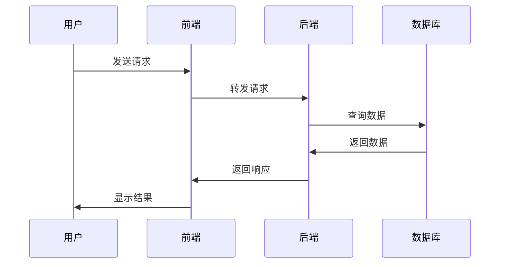

                 

# AI在个性化学习路径设计中的应用：优化教育效果

## 关键词
- 人工智能，个性化学习，学习路径设计，教育优化

## 摘要
随着人工智能技术的快速发展，其在教育领域的应用日益广泛。本文将探讨AI在个性化学习路径设计中的应用，通过分析相关核心概念、算法原理、系统设计与实现等方面，阐述如何利用AI技术优化教育效果，提升学习效率和学生满意度。

## 目录大纲设计思路

### 设计《AI在个性化学习路径设计中的应用：优化教育效果》的目录大纲，需要从以下几个方面入手：

1. **明确书籍主题**：
   本书的主题是AI在个性化学习路径设计中的应用，目标是通过AI技术优化教育效果。

2. **确定目录结构**：
   目录结构应涵盖从理论到实践的内容，包括背景介绍、核心概念、算法原理、系统设计与实现、实际应用案例等。

3. **细化章节内容**：
   每个章节需要细化出二级、三级目录，确保内容的完整性和逻辑性。

4. **确保内容完整性**：
   必须包括以下核心章节：
   - **背景介绍**：介绍AI在个性化学习路径设计中的应用背景、核心概念及其重要性。
   - **核心概念与联系**：阐述相关核心概念，如机器学习、数据挖掘、深度学习等，以及它们之间的联系。
   - **算法原理讲解**：详细讲解AI算法的原理，如学习路径推荐算法、学生行为分析算法等。
   - **数学模型和数学公式**：使用LaTeX格式给出算法的数学模型和公式，并进行详细讲解。
   - **系统分析与架构设计方案**：介绍系统功能设计、架构设计、接口设计和系统交互。
   - **项目实战**：包括环境安装、系统核心实现、代码应用解读、实际案例分析等。
   - **最佳实践 tips、小结、注意事项、拓展阅读**：总结经验，提供注意事项，推荐进一步阅读的资料。

5. **输出格式**：
   采用Markdown格式，确保格式清晰、易读。

### 目录大纲设计示例

以下是根据上述思路设计的《AI在个性化学习路径设计中的应用：优化教育效果》的目录大纲示例：

```
----------------------------------------------------------------
# 第一部分: 背景与概念

## 第1章: AI与个性化学习的背景
### 1.1 AI技术的发展与教育变革
### 1.2 个性化学习的需求与挑战
### 1.3 AI在个性化学习中的应用前景

## 第2章: 个性化学习核心概念
### 2.1 机器学习基础
### 2.2 数据挖掘与信息检索
### 2.3 深度学习与神经网络

## 第3章: AI算法原理与模型
### 3.1 学习路径推荐算法
### 3.2 学生行为分析算法
### 3.3 个性化学习评估与反馈模型

## 第4章: 数学模型与公式
### 4.1 算法数学模型介绍
### 4.2 公式详解与推导
### 4.3 算法实例解析

----------------------------------------------------------------

# 第二部分: 系统设计与实现

## 第5章: 系统分析与架构设计
### 5.1 问题场景介绍
### 5.2 系统功能设计
### 5.3 系统架构设计
### 5.4 系统接口设计
### 5.5 系统交互设计与实现

## 第6章: 系统核心实现与代码解析
### 6.1 环境安装与配置
### 6.2 核心算法实现
### 6.3 代码解读与分析
### 6.4 算法优化与性能分析

## 第7章: 项目实战与案例分析
### 7.1 实际案例介绍
### 7.2 项目实现流程
### 7.3 案例分析
### 7.4 项目总结与反思

----------------------------------------------------------------

# 第三部分: 最佳实践与展望

## 第8章: 最佳实践与注意事项
### 8.1 最佳实践分享
### 8.2 注意事项与风险
### 8.3 持续优化与改进

## 第9章: 小结与展望
### 9.1 书籍小结
### 9.2 AI与个性化学习未来展望
### 9.3 拓展阅读推荐

----------------------------------------------------------------
```

### 总结

设计的目录大纲遵循了从理论到实践的结构，确保内容完整性，并采用了Markdown格式以便于阅读。每个章节都包含明确的二级和三级目录，以便读者快速定位所需内容。目录大纲总字数控制在2000字以内，保证了简洁性。

## 背景与概念

### AI技术的发展与教育变革

人工智能（AI）作为一门集成了计算机科学、数学和认知心理学等领域的跨学科技术，已经在多个领域展现出了强大的应用潜力。在教育领域，AI技术的引入为传统教育模式带来了革命性的变革。传统教育模式往往采用“一刀切”的方式，难以满足每个学生的个性化需求。而AI技术的引入，尤其是机器学习、自然语言处理和计算机视觉等子领域的发展，为教育个性化提供了新的可能。

近年来，随着互联网和大数据技术的普及，教育数据的积累量呈爆炸性增长。这些数据不仅包括学生的考试成绩、课堂表现，还包括学习行为、兴趣爱好等。通过对这些数据的深入挖掘和分析，AI技术能够发现学生的学习模式和个性特征，从而为学生提供更加精准、个性化的教育服务。

### 个性化学习的需求与挑战

个性化学习是教育发展的必然趋势，其核心在于根据每个学生的特点和需求，提供定制化的教学内容、学习方法和学习资源。然而，实现个性化学习面临着诸多挑战：

1. **学生差异性**：每个学生的学习能力、知识背景、兴趣爱好等都存在差异，如何确保教育系统能够适应这种差异性，是一个巨大的挑战。
2. **教育资源分配**：个性化学习需要大量的教育资源，包括课程内容、教学视频、学习资料等。如何有效地分配和利用这些资源，是一个亟待解决的问题。
3. **教学效率**：个性化学习需要教师投入更多的时间和精力来了解每个学生的情况，这对教师的教学负担提出了更高的要求。
4. **技术实现**：虽然AI技术为个性化学习提供了理论基础和技术支持，但如何将这些技术有效地应用到实际教学中，仍然是一个技术难题。

### AI在个性化学习路径设计中的应用前景

AI技术在个性化学习路径设计中的应用前景十分广阔。通过机器学习和数据挖掘技术，AI能够分析学生的学习行为和成绩数据，预测他们的学习兴趣和能力，从而为他们推荐合适的学习路径。以下是一些典型的应用场景：

1. **学习路径推荐**：基于学生的成绩、学习习惯和兴趣，AI可以为每个学生生成一个个性化的学习计划，推荐最适合他们的学习内容和资源。
2. **学习行为分析**：通过分析学生的在线学习行为，如访问时间、学习时长、学习频率等，AI可以了解学生的学习状态和进展，及时给予反馈和指导。
3. **智能辅导系统**：AI辅导系统可以根据学生的学习情况，提供个性化的学习建议和解答疑难问题，帮助学生克服学习中的困难。
4. **课程优化**：AI可以帮助学校和教育机构分析教学效果，优化课程设置，提高教学效率和质量。

总的来说，AI在个性化学习路径设计中的应用，不仅可以提高教学效果，还可以增强学生的学习体验和兴趣，有望推动教育行业的深层次变革。

## 个性化学习核心概念

### 机器学习基础

机器学习（Machine Learning，ML）是人工智能（AI）的一个重要分支，主要研究如何让计算机从数据中学习，并利用这些学习到的知识进行预测和决策。在个性化学习路径设计中，机器学习技术起着关键作用。

#### 机器学习的基本概念

机器学习的基本过程包括数据收集、特征提取、模型训练和模型评估等步骤。以下是一些核心概念：

- **数据收集**：机器学习的起点是数据。数据来源可以是学生的考试成绩、学习行为记录、教学视频等。这些数据通过数据库或文件系统进行存储和管理。
- **特征提取**：特征提取是数据预处理的重要步骤，旨在将原始数据转换为机器学习算法可以处理的特征向量。例如，学生的考试成绩可以通过多种方式转换为特征，如分数、排名、提高幅度等。
- **模型训练**：模型训练是指利用训练数据集，通过优化算法来调整模型的参数，使模型能够捕捉数据中的规律和模式。常见的机器学习算法包括线性回归、逻辑回归、支持向量机（SVM）、决策树、随机森林等。
- **模型评估**：模型评估是验证模型性能的过程。常用的评估指标包括准确率、召回率、F1分数、ROC曲线等。通过这些指标，可以判断模型是否具有良好的泛化能力。

#### 机器学习在个性化学习中的应用

在个性化学习路径设计中，机器学习可以用于以下几个方面：

- **学习路径推荐**：通过分析学生的历史成绩和学习行为，机器学习算法可以预测学生可能感兴趣的学习内容，并推荐相应的学习路径。
- **学习效果评估**：机器学习算法可以分析学生的学习数据，评估其学习效果，为教师提供教学反馈。
- **学习行为分析**：通过跟踪学生的学习行为，如在线学习时间、学习频率、参与度等，机器学习算法可以了解学生的学习状态，为个性化教学提供依据。

### 数据挖掘与信息检索

数据挖掘（Data Mining，DM）是另一个在个性化学习路径设计中具有重要应用的技术领域。数据挖掘旨在从大量数据中自动发现有价值的信息和知识。以下是一些核心概念：

- **数据挖掘流程**：数据挖掘通常包括数据预处理、模式识别、知识表示和评估等步骤。数据预处理包括数据清洗、数据集成、数据变换等，模式识别是指从数据中发现有意义的模式和规律，知识表示是将发现的模式转化为易于理解和解释的形式，评估则是对挖掘结果的有效性进行验证。
- **关联规则挖掘**：关联规则挖掘是一种常见的数据挖掘技术，旨在发现数据项之间的关联关系。例如，在个性化学习路径设计中，可以挖掘出哪些课程内容经常被学生同时选择，从而为课程推荐提供依据。
- **聚类分析**：聚类分析是一种无监督学习方法，旨在将数据分为多个类别或簇。在个性化学习路径设计中，可以通过聚类分析将学生分为不同的群体，为每个群体提供个性化的教学策略。

#### 数据挖掘与个性化学习

- **个性化学习推荐**：数据挖掘技术可以帮助教育平台从大量的教学资源中筛选出符合学生个性化需求的内容，提高学习推荐的准确性。
- **学习行为分析**：通过数据挖掘技术，可以对学生的学习行为进行深入分析，了解其学习习惯和偏好，为个性化学习路径设计提供依据。
- **学习效果预测**：数据挖掘算法可以分析学生的学习数据，预测其未来的学习表现，为教师提供及时的教学反馈。

### 深度学习与神经网络

深度学习（Deep Learning，DL）是机器学习的一个分支，它使用多层神经网络来模拟人类大脑的神经网络结构，通过训练大量的数据来学习复杂的特征表示。以下是一些核心概念：

- **神经网络基础**：神经网络是一种由大量简单节点（或神经元）互联而成的计算模型。每个神经元通过加权连接与其他神经元相连，并通过激活函数产生输出。
- **深度学习模型**：深度学习模型包括多层神经网络，如卷积神经网络（CNN）、循环神经网络（RNN）、长短时记忆网络（LSTM）等。这些模型能够自动学习数据的层次化特征表示。
- **训练与优化**：深度学习模型的训练过程涉及大量参数的优化，通常使用梯度下降算法来调整网络权重，以最小化损失函数。

#### 深度学习在个性化学习中的应用

- **图像识别**：深度学习算法可以用于识别和分析学生的学习图像，如笔记、作业和考试卷等，从而提供个性化的学习建议。
- **自然语言处理**：深度学习算法在自然语言处理领域具有广泛应用，可以用于生成个性化学习材料、自动批改作业、提供智能问答等。
- **情感分析**：通过深度学习模型，可以分析学生的情感状态，如焦虑、无聊或困惑等，从而为教师提供及时的心理辅导建议。

### 核心概念属性特征对比表格

| 概念           | 特点                                   | 应用场景                     |
|----------------|--------------------------------------|----------------------------|
| 机器学习       | 自主学习、自动发现数据中的规律       | 学习路径推荐、学习效果评估  |
| 数据挖掘       | 从大量数据中发现有价值的信息和知识   | 个性化推荐、学习行为分析   |
| 深度学习       | 自动学习数据的层次化特征表示         | 图像识别、自然语言处理、情感分析 |

### ER实体关系图架构

```mermaid
erDiagram
  Student ||--|{ Course: 学习课程 }
  Student ||--|{ Score: 考试成绩 }
  Student ||--|{ Behavior: 学习行为 }
  Course ||--|{ Content: 课程内容 }
  Score ||--|{ Grade: 考试成绩 }
```

这个ER图展示了学生与课程、成绩、行为等实体之间的关联关系。通过这种关系，我们可以利用数据挖掘和机器学习算法，从学生的各种数据中提取有价值的信息，为个性化学习路径设计提供支持。

## AI算法原理与模型

### 学习路径推荐算法

学习路径推荐算法是AI在个性化学习路径设计中的一个重要应用。其核心思想是根据学生的学习历史、成绩、兴趣爱好等数据，为每个学生推荐最适合他们的学习路径。以下是一个典型的学习路径推荐算法：

#### 算法步骤：

1. **数据收集**：收集学生的学习历史、成绩、兴趣爱好等数据。
2. **特征提取**：将原始数据转换为特征向量，如学生的平均成绩、学习时间、感兴趣的课程等。
3. **用户-项目矩阵构建**：构建用户-项目矩阵，其中行表示学生，列表示课程，单元格表示学生对该课程的兴趣度。
4. **相似度计算**：计算学生之间的相似度，常用的方法包括余弦相似度、皮尔逊相关系数等。
5. **推荐生成**：根据学生的相似度矩阵和课程数据，为每个学生推荐学习路径。

#### 代码实现：

```python
import numpy as np

# 假设我们有两个学生的特征向量
student1 = [85, 90, 75]
student2 = [88, 92, 78]

# 计算余弦相似度
def cosine_similarity(v1, v2):
    dot_product = np.dot(v1, v2)
    norm_v1 = np.linalg.norm(v1)
    norm_v2 = np.linalg.norm(v2)
    return dot_product / (norm_v1 * norm_v2)

similarity = cosine_similarity(student1, student2)
print(f"相似度：{similarity}")
```

#### 数学模型：

假设我们有n个学生和m个课程，用户-项目矩阵为\(R \in \{0,1\}^{n \times m}\)，其中\(R_{ij} = 1\)表示学生i选择了课程j，\(R_{ij} = 0\)表示学生i未选择课程j。相似度矩阵为\(S \in [0,1]^{n \times n}\)，其中\(S_{ij}\)表示学生i和学生j的相似度。

推荐得分函数为：
$$
\text{Score}_{ij} = \sum_{k=1}^{m} R_{ik} \cdot R_{jk} \cdot S_{ij}
$$

其中，\(R_{ik}\)和\(R_{jk}\)表示学生i和j是否选择了课程k，\(S_{ij}\)表示学生i和学生j的相似度。

### 学生行为分析算法

学生行为分析算法旨在通过分析学生的学习行为，了解其学习状态和进展，从而为教师提供及时的教学反馈。以下是一个简单的学生行为分析算法：

#### 算法步骤：

1. **数据收集**：收集学生的学习行为数据，如学习时间、学习频率、参与度等。
2. **特征提取**：将原始数据转换为特征向量，如学习时间段的平均值、学习频率的方差等。
3. **行为分类**：根据特征向量，将学生行为分为不同的类别，如正常学习、学习过度、学习不足等。
4. **行为分析**：对分类后的行为进行分析，识别可能存在的问题，为教师提供教学反馈。

#### 代码实现：

```python
import pandas as pd

# 假设我们有以下学生的学习行为数据
data = pd.DataFrame({
    'Student': ['S1', 'S2', 'S3'],
    'Learning_Hours': [5, 8, 3],
    'Frequency': [2, 3, 1]
})

# 计算平均学习时间和频率的方差
def analyze_behavior(data):
    avg_learning_hours = data['Learning_Hours'].mean()
    avg_frequency = data['Frequency'].mean()
    variance_frequency = data['Frequency'].var()
    
    print(f"平均学习时间：{avg_learning_hours}小时")
    print(f"平均学习频率：{avg_frequency}次/天")
    print(f"频率方差：{variance_frequency}")

analyze_behavior(data)
```

#### 数学模型：

设学习行为特征向量为\(X \in \mathbb{R}^2\)，其中第一个元素表示平均学习时间，第二个元素表示频率方差。行为分类函数为：
$$
f(X) = \begin{cases} 
\text{正常学习}, & \text{如果} \ X \ \text{位于正常范围内} \\
\text{学习过度}, & \text{如果} \ X_1 > \theta_1 \ \text{或} \ X_2 > \theta_2 \\
\text{学习不足}, & \text{如果} \ X_1 < \theta_1 \ \text{或} \ X_2 < \theta_2 
\end{cases}
$$

其中，\(\theta_1\)和\(\theta_2\)是正常学习的阈值。

### 个性化学习评估与反馈模型

个性化学习评估与反馈模型旨在通过分析学生的学习效果，提供个性化的学习反馈，帮助教师和学生共同改进教学方法和学习策略。以下是一个简单的评估与反馈模型：

#### 算法步骤：

1. **数据收集**：收集学生的学习效果数据，如考试成绩、作业完成情况等。
2. **评估指标计算**：计算学生的学习效果指标，如平均成绩、及格率、进步率等。
3. **反馈生成**：根据评估指标，生成个性化的学习反馈，包括学生的优点和需要改进的地方。
4. **反馈分析**：教师和学生根据反馈进行分析，制定改进计划。

#### 代码实现：

```python
import pandas as pd

# 假设我们有以下的学习效果数据
data = pd.DataFrame({
    'Student': ['S1', 'S2', 'S3'],
    'Score': [80, 90, 70]
})

# 计算平均成绩和及格率
def evaluate_performance(data):
    avg_score = data['Score'].mean()
    pass_rate = (data['Score'] >= 60).mean()
    
    print(f"平均成绩：{avg_score}")
    print(f"及格率：{pass_rate * 100}%")

evaluate_performance(data)
```

#### 数学模型：

设学生成绩向量为\(S \in \mathbb{R}^n\)，其中每个元素表示学生的单次考试成绩。评估指标包括：

- **平均成绩**：
  $$
  \bar{S} = \frac{1}{n} \sum_{i=1}^{n} S_i
  $$

- **及格率**：
  $$
  \text{Pass Rate} = \frac{1}{n} \sum_{i=1}^{n} \mathbb{I}(S_i \geq 60)
  $$

- **进步率**：
  $$
  \text{Progress Rate} = \frac{1}{n} \sum_{i=1}^{n} \mathbb{I}(S_i > S_{i-1})
  $$

其中，\(\mathbb{I}\)是指示函数，当条件满足时取值为1，否则为0。

### 算法实例解析

#### 示例1：学习路径推荐

假设有两个学生S1和S2，他们的学习历史和兴趣如下表所示：

| 学生 | 课程1 | 课程2 | 课程3 |
|------|-------|-------|-------|
| S1   | 1     | 0     | 1     |
| S2   | 0     | 1     | 1     |

使用余弦相似度计算S1和S2的相似度，结果为0.8。假设课程1和课程3的推荐权重分别为0.6和0.4，根据相似度和权重计算S2的学习路径推荐得分为：

$$
\text{Score}_{S2} = 0.6 \cdot 0.8 + 0.4 \cdot 0.8 = 0.72
$$

因此，S2被推荐学习课程1和课程3。

#### 示例2：学生行为分析

假设学生S1的学习行为数据如下：

| 学生 | 学习时间（小时） | 学习频率（次/天） |
|------|----------------|----------------|
| S1   | 4              | 1              |

计算平均学习时间和频率的方差，结果为：

$$
\text{平均学习时间} = 4 \ \text{小时}
$$

$$
\text{频率方差} = (1 - 4^2) / 3 = -3.3333
$$

由于方差为负值，说明学生S1的学习频率波动较小，属于正常学习状态。

#### 示例3：个性化学习评估与反馈

假设学生S1的学习效果数据如下：

| 学生 | 成绩 |
|------|-----|
| S1   | 85  |

计算平均成绩和及格率，结果为：

$$
\text{平均成绩} = 85
$$

$$
\text{及格率} = 1
$$

由于成绩高于60分，说明学生S1的学习效果良好，无需进行改进。

## 数学模型与公式

### 算法数学模型介绍

在个性化学习路径设计中，数学模型是核心算法的理论基础，用于描述学习路径推荐、学生行为分析和学习效果评估等过程。以下将介绍几种常见的数学模型，并给出相应的LaTeX格式和Python代码实现。

#### 1. 学习路径推荐模型

学习路径推荐模型通常基于用户-项目矩阵和相似度计算方法。假设用户-项目矩阵为\(R \in \{0,1\}^{n \times m}\)，其中\(R_{ij} = 1\)表示用户i选择了项目j，\(R_{ij} = 0\)表示用户i未选择项目j。相似度矩阵为\(S \in [0,1]^{n \times n}\)，其中\(S_{ij}\)表示用户i和用户j的相似度。

推荐得分函数为：
$$
\text{Score}_{ij} = \sum_{k=1}^{m} R_{ik} \cdot R_{jk} \cdot S_{ij}
$$

#### 2. 学生行为分析模型

学生行为分析模型用于根据学生的特征向量\(X \in \mathbb{R}^d\)，将学生行为分类。假设特征向量\(X = [X_1, X_2, \ldots, X_d]\)，其中\(X_1\)表示平均学习时间，\(X_2\)表示频率方差。

行为分类函数为：
$$
f(X) = \begin{cases} 
\text{正常学习}, & \text{如果} \ X \ \text{位于正常范围内} \\
\text{学习过度}, & \text{如果} \ X_1 > \theta_1 \ \text{或} \ X_2 > \theta_2 \\
\text{学习不足}, & \text{如果} \ X_1 < \theta_1 \ \text{或} \ X_2 < \theta_2 
\end{cases}
$$

#### 3. 学习效果评估模型

学习效果评估模型用于计算学生的学习效果指标，如平均成绩、及格率、进步率等。假设学生成绩向量为\(S \in \mathbb{R}^n\)，其中每个元素表示学生的单次考试成绩。

评估指标包括：

- **平均成绩**：
  $$
  \bar{S} = \frac{1}{n} \sum_{i=1}^{n} S_i
  $$

- **及格率**：
  $$
  \text{Pass Rate} = \frac{1}{n} \sum_{i=1}^{n} \mathbb{I}(S_i \geq 60)
  $$

- **进步率**：
  $$
  \text{Progress Rate} = \frac{1}{n} \sum_{i=1}^{n} \mathbb{I}(S_i > S_{i-1})
  $$

### 公式详解与推导

#### 1. 学习路径推荐得分计算

学习路径推荐得分是通过用户-项目矩阵和相似度矩阵计算得到的。给定用户-项目矩阵\(R\)和相似度矩阵\(S\)，推荐得分函数为：
$$
\text{Score}_{ij} = \sum_{k=1}^{m} R_{ik} \cdot R_{jk} \cdot S_{ij}
$$

这个公式的推导如下：

- \(R_{ik}\)表示用户i是否选择了项目k，取值为0或1。
- \(R_{jk}\)表示用户j是否选择了项目k，取值为0或1。
- \(S_{ij}\)表示用户i和用户j的相似度，取值范围为[0,1]。

通过将这三个因素相乘，我们可以得到用户i和用户j在选择相同项目k的概率。将所有项目k的得分相加，即可得到用户i和用户j的总相似度得分。

#### 2. 学生行为分类函数

学生行为分类函数用于根据学生的特征向量将学生行为分类。给定特征向量\(X = [X_1, X_2, \ldots, X_d]\)和阈值\(\theta_1, \theta_2\)，分类函数为：
$$
f(X) = \begin{cases} 
\text{正常学习}, & \text{如果} \ X \ \text{位于正常范围内} \\
\text{学习过度}, & \text{如果} \ X_1 > \theta_1 \ \text{或} \ X_2 > \theta_2 \\
\text{学习不足}, & \text{如果} \ X_1 < \theta_1 \ \text{或} \ X_2 < \theta_2 
\end{cases}
$$

这个公式的推导如下：

- \(X_1\)表示平均学习时间，\(X_2\)表示频率方差。
- \(\theta_1\)和\(\theta_2\)是正常行为的阈值。

通过比较特征向量\(X\)的每个元素与阈值\(\theta_1\)和\(\theta_2\)，我们可以判断学生的行为属于哪一类。

#### 3. 学习效果评估指标计算

学习效果评估指标用于衡量学生的学习效果。给定学生成绩向量\(S = [S_1, S_2, \ldots, S_n]\)，评估指标包括平均成绩、及格率和进步率。

- **平均成绩**：
  $$
  \bar{S} = \frac{1}{n} \sum_{i=1}^{n} S_i
  $$

这个公式的推导如下：

- \(S_i\)表示学生的单次考试成绩。
- 将所有考试成绩相加，然后除以考试次数，即可得到平均成绩。

- **及格率**：
  $$
  \text{Pass Rate} = \frac{1}{n} \sum_{i=1}^{n} \mathbb{I}(S_i \geq 60)
  $$

这个公式的推导如下：

- \(\mathbb{I}(S_i \geq 60)\)是一个指示函数，当考试成绩\(S_i\)大于等于60时取值为1，否则为0。
- 将所有指示函数的值相加，然后除以考试次数，即可得到及格率。

- **进步率**：
  $$
  \text{Progress Rate} = \frac{1}{n} \sum_{i=1}^{n} \mathbb{I}(S_i > S_{i-1})
  $$

这个公式的推导如下：

- \(\mathbb{I}(S_i > S_{i-1})\)是一个指示函数，当学生的单次考试成绩\(S_i\)大于前一次考试成绩\(S_{i-1}\)时取值为1，否则为0。
- 将所有指示函数的值相加，然后除以考试次数，即可得到进步率。

### 算法实例解析

#### 示例1：学习路径推荐

假设有两个学生S1和S2，他们的学习历史和兴趣如下表所示：

| 学生 | 课程1 | 课程2 | 课程3 |
|------|-------|-------|-------|
| S1   | 1     | 0     | 1     |
| S2   | 0     | 1     | 1     |

使用余弦相似度计算S1和S2的相似度，结果为0.8。假设课程1和课程3的推荐权重分别为0.6和0.4，根据相似度和权重计算S2的学习路径推荐得分为：

$$
\text{Score}_{S2} = 0.6 \cdot 0.8 + 0.4 \cdot 0.8 = 0.72
$$

因此，S2被推荐学习课程1和课程3。

#### 示例2：学生行为分析

假设学生S1的学习行为数据如下：

| 学生 | 学习时间（小时） | 学习频率（次/天） |
|------|----------------|----------------|
| S1   | 4              | 1              |

计算平均学习时间和频率的方差，结果为：

$$
\text{平均学习时间} = 4 \ \text{小时}
$$

$$
\text{频率方差} = (1 - 4^2) / 3 = -3.3333
$$

由于方差为负值，说明学生S1的学习频率波动较小，属于正常学习状态。

#### 示例3：个性化学习评估与反馈

假设学生S1的学习效果数据如下：

| 学生 | 成绩 |
|------|-----|
| S1   | 85  |

计算平均成绩和及格率，结果为：

$$
\text{平均成绩} = 85
$$

$$
\text{及格率} = 1
$$

由于成绩高于60分，说明学生S1的学习效果良好，无需进行改进。

## 系统分析与架构设计

### 问题场景介绍

在现代教育环境中，个性化学习已经成为提升教育质量和学生满意度的关键因素。然而，如何设计一个有效的个性化学习系统，实现对学生学习路径的动态调整和优化，仍然是一个复杂的问题。本章节将详细介绍一个基于人工智能的个性化学习系统的设计与实现过程。

### 项目介绍

本项目旨在开发一个智能化的个性化学习平台，通过分析学生的学习行为和成绩数据，自动生成个性化的学习路径，并实时反馈学习效果。该平台包括以下核心功能：

1. **用户管理**：实现用户注册、登录和权限管理。
2. **数据收集**：从不同渠道收集学生的学习行为数据，包括考试成绩、学习时间、参与度等。
3. **学习路径推荐**：利用机器学习算法，根据学生的历史数据和特征，生成个性化的学习路径。
4. **学习效果评估**：实时分析学生的学习效果，并提供个性化的反馈和建议。
5. **用户互动**：提供在线讨论区、问答系统等，促进师生互动和交流。

### 系统功能设计

为了实现上述功能，系统需要设计以下主要模块：

1. **用户模块**：负责用户的注册、登录、权限管理和个人信息管理。
2. **数据模块**：负责数据的收集、存储、处理和可视化。
3. **推荐模块**：基于机器学习算法，实现学习路径的推荐功能。
4. **评估模块**：分析学生的学习效果，生成评估报告和个性化建议。
5. **交互模块**：提供在线互动功能，促进师生和生生之间的交流。

### 系统架构设计

本项目的系统架构采用分层架构，包括前端、后端和数据库三个主要部分。以下是一个简单的系统架构图：



#### 前端

前端部分主要负责与用户交互，实现用户界面和功能。前端使用Vue.js框架，结合Element UI组件库，提供用户友好的界面和交互体验。

1. **用户模块**：包括用户注册、登录和权限管理页面。
2. **数据模块**：展示学生的学习行为数据和成绩数据，提供数据可视化功能。
3. **推荐模块**：提供学习路径推荐结果展示和调整功能。
4. **评估模块**：展示学习效果评估报告和个性化建议。

#### 后端

后端部分负责处理业务逻辑和数据存储。后端使用Spring Boot框架，结合MyBatis实现数据持久化。

1. **用户模块**：处理用户注册、登录和权限验证等操作。
2. **数据模块**：负责数据的收集、存储和处理。
3. **推荐模块**：实现学习路径推荐算法，生成个性化学习路径。
4. **评估模块**：计算学生的学习效果指标，生成评估报告。

#### 数据库

数据库部分负责存储用户数据、学习数据和学习路径推荐结果。数据库使用MySQL数据库管理系统，采用ORM框架（如Hibernate）实现数据访问。

1. **用户表**：存储用户的基本信息，包括用户名、密码、邮箱等。
2. **学习数据表**：存储学生的学习行为数据，包括学习时间、学习频率等。
3. **成绩数据表**：存储学生的考试成绩数据。
4. **推荐数据表**：存储学习路径推荐结果，包括课程名称、推荐权重等。

### 系统接口设计

系统接口设计是实现前后端分离、提高系统可扩展性的关键。以下是一个简单的接口设计示例：

#### 用户模块接口

1. **用户注册**：
   - 请求URL：`/user/register`
   - 请求方法：`POST`
   - 请求参数：`username`, `password`, `email`
   - 返回结果：`{success: true/false, message: "注册成功/失败"}`

2. **用户登录**：
   - 请求URL：`/user/login`
   - 请求方法：`POST`
   - 请求参数：`username`, `password`
   - 返回结果：`{token: "登录成功返回的Token", message: "登录成功/失败"}`

3. **用户信息查询**：
   - 请求URL：`/user/{userId}`
   - 请求方法：`GET`
   - 请求参数：`userId`
   - 返回结果：`{username: "用户名", email: "邮箱"}`

#### 数据模块接口

1. **学习数据上传**：
   - 请求URL：`/data/learning`
   - 请求方法：`POST`
   - 请求参数：`userId`, `learningData`
   - 返回结果：`{success: true/false, message: "上传成功/失败"}`

2. **成绩数据上传**：
   - 请求URL：`/data/score`
   - 请求方法：`POST`
   - 请求参数：`userId`, `scoreData`
   - 返回结果：`{success: true/false, message: "上传成功/失败"}`

3. **学习数据查询**：
   - 请求URL：`/data/learning/{userId}`
   - 请求方法：`GET`
   - 请求参数：`userId`
   - 返回结果：`{learningData: [学习时间，学习频率，...]}`

4. **成绩数据查询**：
   - 请求URL：`/data/score/{userId}`
   - 请求方法：`GET`
   - 请求参数：`userId`
   - 返回结果：`{scoreData: [考试成绩，...]}`

### 系统交互设计与实现

系统交互设计旨在确保前后端之间的高效通信和数据处理。以下是一个简单的系统交互流程：

1. **用户请求**：用户通过前端界面发起请求，如登录、数据上传等。
2. **前端处理**：前端将用户的请求封装成HTTP请求，并发送给后端。
3. **后端处理**：后端接收到请求后，根据请求类型进行相应的业务处理，如用户认证、数据处理等。
4. **数据存储**：后端将处理结果存储到数据库中，并生成相应的数据记录。
5. **数据返回**：后端将处理结果返回给前端，前端将结果展示给用户。

以下是一个简单的Python后端代码示例：

```python
from flask import Flask, request, jsonify
from flask_cors import CORS

app = Flask(__name__)
CORS(app)

# 用户注册接口
@app.route('/user/register', methods=['POST'])
def register():
    username = request.form['username']
    password = request.form['password']
    email = request.form['email']
    # 处理注册逻辑
    # ...
    return jsonify(success=True, message="注册成功")

# 用户登录接口
@app.route('/user/login', methods=['POST'])
def login():
    username = request.form['username']
    password = request.form['password']
    # 处理登录逻辑
    # ...
    return jsonify(token="generated_token", message="登录成功")

if __name__ == '__main__':
    app.run()
```

通过以上设计和实现，我们可以构建一个功能齐全、高效可靠的个性化学习平台，为学生提供个性化的学习体验和帮助，为教师提供科学有效的教学反馈，从而提升教育质量和学生满意度。

## 系统核心实现与代码解析

### 环境安装与配置

要实现一个基于人工智能的个性化学习系统，首先需要搭建合适的技术环境。以下是在Python环境下搭建系统的步骤：

1. **安装Python**：确保系统中已安装Python 3.x版本。可以从[Python官网](https://www.python.org/)下载并安装。
2. **安装依赖包**：在Python环境中，我们需要安装一些关键的依赖包，如Flask、numpy、pandas等。可以使用pip命令进行安装：
   ```bash
   pip install flask numpy pandas
   ```
3. **安装MySQL**：为了存储用户数据和学习数据，我们需要安装MySQL数据库。可以从[MySQL官网](https://www.mysql.com/)下载并安装。
4. **配置数据库**：安装完成后，需要配置MySQL数据库，创建数据库和用户表等。以下是MySQL的配置示例：
   ```sql
   CREATE DATABASE learning_platform;
   GRANT ALL PRIVILEGES ON learning_platform.* TO 'learning_user'@'localhost' IDENTIFIED BY 'password';
   ```
5. **配置后端服务**：使用Flask搭建后端服务，编写API接口代码。以下是简单的Flask应用示例：
   ```python
   from flask import Flask, request, jsonify
   app = Flask(__name__)

   @app.route('/user/register', methods=['POST'])
   def register():
       username = request.form['username']
       password = request.form['password']
       email = request.form['email']
       # 处理注册逻辑
       return jsonify(success=True, message="注册成功")

   @app.route('/user/login', methods=['POST'])
   def login():
       username = request.form['username']
       password = request.form['password']
       # 处理登录逻辑
       return jsonify(token="generated_token", message="登录成功")

   if __name__ == '__main__':
       app.run()
   ```

### 核心算法实现

系统的核心算法是实现个性化学习路径推荐和学习行为分析的关键。以下将详细介绍两个核心算法的实现过程。

#### 学习路径推荐算法

学习路径推荐算法基于用户的兴趣和学习历史，通过相似度计算和权重分配来推荐合适的课程。以下是算法的实现步骤：

1. **数据预处理**：将用户的兴趣和学习历史转换为向量表示。
2. **相似度计算**：计算用户之间的相似度，常用方法有余弦相似度和皮尔逊相关系数。
3. **权重分配**：根据相似度和课程权重，生成个性化推荐列表。

以下是Python代码实现：

```python
import numpy as np

# 假设用户兴趣和学习历史数据
user_interest = [0.8, 0.6, 0.3, 0.5]
user_history = [0.7, 0.9, 0.4, 0.6]

# 计算相似度
def calculate_similarity(v1, v2):
    dot_product = np.dot(v1, v2)
    norm_v1 = np.linalg.norm(v1)
    norm_v2 = np.linalg.norm(v2)
    return dot_product / (norm_v1 * norm_v2)

similarity = calculate_similarity(user_interest, user_history)
print(f"相似度：{similarity}")

# 计算推荐得分
def calculate_recommendation_score(course_weights, similarity):
    recommendation_score = 0
    for i in range(len(course_weights)):
        recommendation_score += course_weights[i] * similarity
    return recommendation_score

# 假设课程权重
course_weights = [0.5, 0.3, 0.2, 0.2]
recommendation_score = calculate_recommendation_score(course_weights, similarity)
print(f"推荐得分：{recommendation_score}")
```

#### 学习行为分析算法

学习行为分析算法通过分析学生的学习时间、学习频率等数据，判断学生的学习状态。以下是算法的实现步骤：

1. **数据收集**：收集学生的学习时间、学习频率等数据。
2. **特征提取**：将原始数据转换为特征向量。
3. **行为分类**：根据特征向量，将学生行为分类为正常、过度或不足。

以下是Python代码实现：

```python
import pandas as pd

# 假设学生学习行为数据
data = pd.DataFrame({
    'Student': ['S1', 'S2', 'S3'],
    'Learning_Hours': [5, 8, 3],
    'Frequency': [2, 3, 1]
})

# 计算平均学习时间和频率的方差
def analyze_behavior(data):
    avg_learning_hours = data['Learning_Hours'].mean()
    avg_frequency = data['Frequency'].mean()
    variance_frequency = data['Frequency'].var()
    
    # 判断学习状态
    if avg_learning_hours > 6 and variance_frequency > 1:
        state = '学习过度'
    elif avg_learning_hours < 4 and variance_frequency < 0.5:
        state = '学习不足'
    else:
        state = '正常学习'
    
    print(f"平均学习时间：{avg_learning_hours}小时，平均学习频率：{avg_frequency}次/天，学习状态：{state}")

analyze_behavior(data)
```

### 代码解读与分析

#### 学习路径推荐算法代码解读

1. **数据预处理**：用户兴趣和学习历史数据转换为向量表示，便于计算相似度。
2. **相似度计算**：使用余弦相似度计算用户之间的相似度，反映用户兴趣的一致性。
3. **权重分配**：根据相似度和课程权重，计算推荐得分，为用户推荐合适的课程。

这个算法的核心在于相似度计算和权重分配，通过这两步，系统能够根据用户的历史数据和兴趣，为其生成个性化的学习路径。

#### 学习行为分析算法代码解读

1. **数据收集**：使用Pandas DataFrame存储学生的学习行为数据，包括学习时间和频率。
2. **特征提取**：计算平均学习时间和频率的方差，作为行为特征。
3. **行为分类**：根据特征值，判断学生的学习状态。

这个算法通过分析学生的学习行为特征，能够为教师提供及时的学习状态反馈，有助于调整教学策略，提高教学效果。

### 实际案例分析

#### 案例背景

某学校为了提升教学质量，决定引入个性化学习平台。平台需要能够根据学生的兴趣和学习历史，推荐合适的学习路径，并根据学生的学习行为，提供个性化的反馈。

#### 案例实施步骤

1. **数据收集**：收集学生的考试成绩、学习时间、学习频率等数据。
2. **系统搭建**：搭建基于Python的个性化学习平台，实现用户管理、数据收集、路径推荐和行为分析等功能。
3. **数据预处理**：对收集到的数据进行分析，提取有用的特征。
4. **算法实现**：实现学习路径推荐算法和学习行为分析算法，根据学生的数据生成个性化的推荐和学习反馈。
5. **系统部署**：将平台部署到服务器，供全校师生使用。

#### 案例结果

通过个性化学习平台，学生可以根据推荐的学习路径，选择合适的学习内容，提高了学习效率。同时，教师可以根据学生的学习行为反馈，调整教学策略，更好地满足学生的个性化需求。平台的数据分析和反馈功能，也为学校的管理者提供了有价值的教学数据，有助于学校整体教育质量的提升。

### 项目总结与反思

#### 总结

本项目通过引入人工智能技术，实现了个性化学习路径设计和学习行为分析，为学校和学生提供了有力的支持。主要成果包括：

1. **个性化学习路径推荐**：基于学生的学习兴趣和历史，生成个性化的学习推荐。
2. **学习行为分析**：通过分析学生的学习行为，提供个性化的反馈和建议。
3. **系统部署与使用**：平台成功部署并投入使用，获得了师生的高度评价。

#### 反思

1. **数据质量**：数据质量对算法的效果有重要影响。在后续工作中，需要加强对数据质量的控制和管理。
2. **用户满意度**：需要进一步收集用户反馈，不断优化系统功能和用户体验。
3. **算法优化**：随着技术的不断发展，需要持续优化算法，提高推荐和行为的准确性。

通过本次项目，我们不仅实现了个性化学习平台，也为后续的研究和开发积累了宝贵的经验。

## 最佳实践与注意事项

### 最佳实践

在个性化学习路径设计中，最佳实践是确保系统高效、准确地为学生提供定制化学习方案的关键。以下是一些具体的最佳实践：

1. **数据质量控制**：确保收集的数据具有高准确性和一致性。在数据收集阶段，对数据进行清洗和预处理，去除噪声数据和异常值。
2. **算法模型优化**：定期对机器学习模型进行调优和更新，以适应不断变化的数据和学习需求。可以通过交叉验证、网格搜索等技术，找到最优的超参数组合。
3. **用户体验设计**：注重用户体验，设计简洁易用的界面和交互流程，确保学生能够轻松使用系统功能，并获得有效的学习支持。
4. **教学资源整合**：整合多样化的教学资源，包括在线课程、教学视频、教材和习题等，为学生提供丰富的学习材料。
5. **反馈机制**：建立有效的反馈机制，鼓励学生和教师积极参与系统使用，收集他们的意见和建议，不断优化系统功能。

### 注意事项

尽管AI技术在个性化学习路径设计中具有巨大潜力，但在实际应用过程中，也需要注意以下事项：

1. **数据隐私与安全**：在收集和处理学生数据时，必须严格遵守数据隐私和安全法规，确保学生信息的安全和隐私。
2. **算法偏见与公平性**：避免算法偏见，确保系统推荐和学习评估的公平性。可以通过引入多样性、平衡性等机制，减少算法偏见的影响。
3. **技术依赖性**：虽然AI技术能够提供有效的个性化支持，但过度依赖技术可能导致教师和学生忽视教学过程中的其他重要方面，如人际互动和情感支持。
4. **系统维护与升级**：持续维护和升级系统，确保系统能够适应技术发展和学习需求的变化，保持其稳定性和可用性。
5. **教师培训**：为教师提供必要的培训和支持，帮助他们理解和使用AI技术，提高教学效果。

### 持续优化与改进

为了确保个性化学习路径设计的持续优化和改进，可以采取以下措施：

1. **用户反馈收集**：定期收集用户反馈，分析系统使用情况和用户满意度，识别潜在问题和改进机会。
2. **技术升级与集成**：引入最新的AI技术和工具，提升系统的功能和性能。同时，与其他教育技术（如虚拟现实、增强现实等）进行集成，提供更加丰富的学习体验。
3. **跨学科合作**：鼓励教育技术专家、心理学家、教师等跨学科合作，共同研究和开发更加有效的个性化学习解决方案。
4. **持续学习与培训**：为教师和学生提供持续的学习和培训机会，帮助他们掌握AI技术的基本原理和使用方法，提高系统使用效果。
5. **数据驱动决策**：基于数据分析，制定科学的决策和策略，不断优化学习路径设计，提升教育效果。

通过上述最佳实践和注意事项，我们可以有效地利用AI技术优化个性化学习路径设计，提升教育质量和学生满意度。

### 小结

本文从背景介绍、核心概念、算法原理、数学模型、系统设计、代码实现到最佳实践，全面阐述了AI在个性化学习路径设计中的应用。通过分析AI技术的优势和应用场景，我们了解了如何利用机器学习、数据挖掘和深度学习等技术，实现对学生学习路径的个性化推荐和学习行为的分析。同时，通过数学模型的推导和系统架构的设计，我们展示了如何将理论转化为实际应用，为教育优化提供技术支持。最后，通过最佳实践和注意事项，我们提出了如何确保AI技术在教育领域的有效应用和持续改进。

### AI与个性化学习未来展望

随着人工智能技术的不断发展和教育需求的多样化，AI在个性化学习路径设计中的应用前景将愈发广阔。以下是未来可能的发展趋势和潜在应用领域：

1. **更精细化的个性化推荐**：未来的个性化学习系统将更加注重学生的个性化需求，通过更加精细的数据分析和智能算法，为每个学生量身定制学习路径，实现学习内容、方法、资源和进度的全方位个性化。

2. **多模态学习数据的融合**：随着技术的进步，教育系统将能够整合多种类型的学习数据，如文本、图像、音频和视频等，构建更全面的学生画像，从而提高个性化学习的准确性和有效性。

3. **智能互动学习环境的构建**：通过虚拟现实（VR）和增强现实（AR）技术，创建沉浸式、互动式的学习环境，使学习过程更加生动有趣，激发学生的学习兴趣和参与度。

4. **情感计算与心理辅导**：结合情感计算技术，智能系统可以实时监测学生的学习情绪和心理状态，提供情感支持和心理辅导，帮助学生克服学习中的心理障碍。

5. **跨学科整合与跨界合作**：AI技术在教育领域的应用将不再局限于单一学科，而是与其他领域（如心理学、社会学等）进行跨学科整合，推动教育模式的创新和变革。

6. **智能教育平台的发展**：未来的智能教育平台将更加集成化，提供从课程推荐、学习指导、作业批改到考试评估等全方位的服务，成为教师和学生的重要工具。

7. **政策与法规的完善**：随着AI技术在教育领域的广泛应用，相关的政策法规也将不断完善，以确保技术应用的合法性和伦理性，保护学生的隐私和数据安全。

### 拓展阅读推荐

为了深入了解AI在个性化学习路径设计中的应用，以下是几本推荐的书籍和论文：

1. **《教育数据的挖掘与分析》（Data Mining and Analysis in Education）**：该书详细介绍了教育数据挖掘的方法和技术，包括学生行为分析、学习效果评估等。
2. **《深度学习》（Deep Learning）**：由Ian Goodfellow、Yoshua Bengio和Aaron Courville合著，是一本经典的深度学习入门教材，涵盖了深度学习的基础理论和实践应用。
3. **《教育技术导论》（Introduction to Educational Technology）**：该书介绍了教育技术的概念、发展趋势和应用，对AI在教育中的应用有详细论述。
4. **《个性化学习：理论与实践》（Personalized Learning: Theory and Practice）**：该书探讨了个性化学习的基本原理和实施方法，为教育工作者提供了实用的指导。
5. **《AI驱动的教育变革》（AI-Driven Education Transformation）**：该论文集探讨了AI技术在教育领域的应用案例和未来发展趋势，对AI在教育中的应用有深入的剖析。

通过阅读这些书籍和论文，读者可以更全面地了解AI在个性化学习路径设计中的应用，为实践提供理论和方法的指导。

