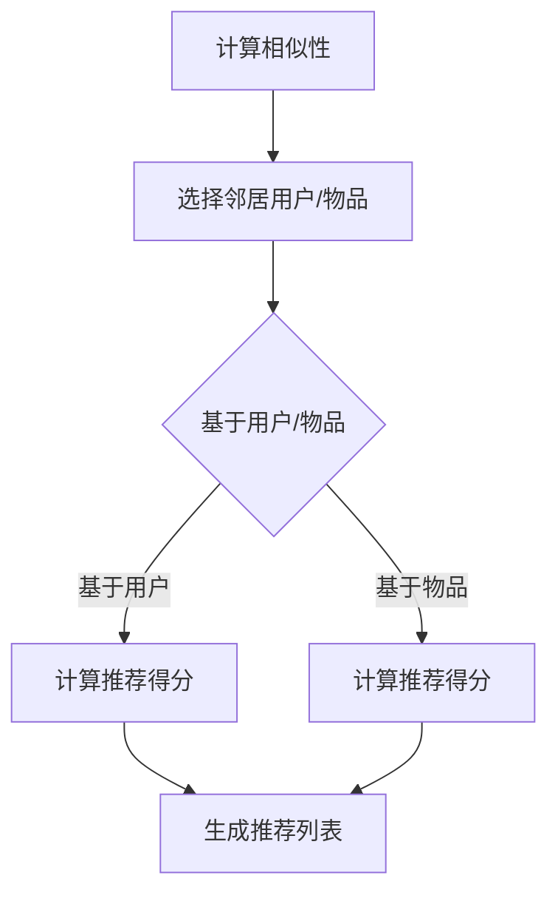
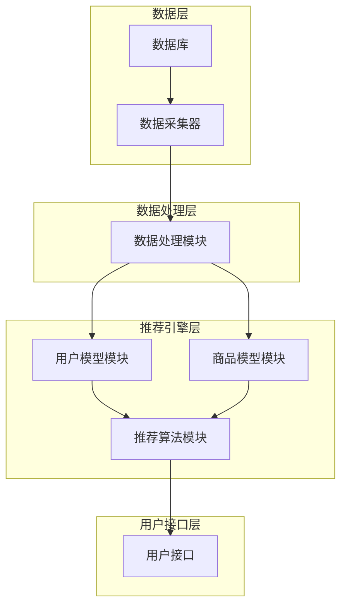
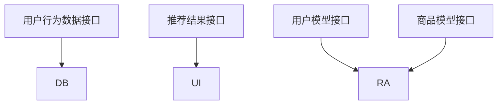
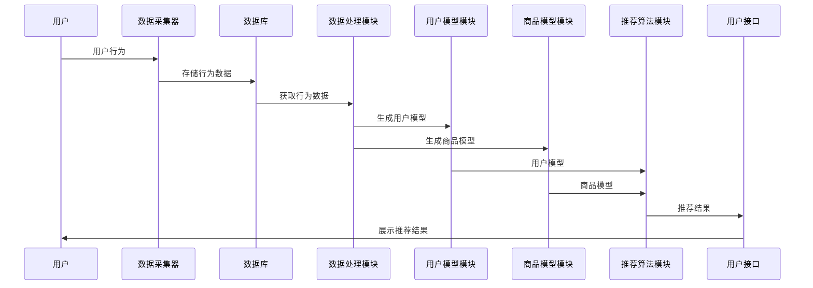

                 

### 引言：AI在个性化推荐系统中的应用

在数字化时代，信息过载成为一个普遍现象。用户在面对海量数据时，往往难以快速找到自己感兴趣的内容。个性化推荐系统（Personalized Recommendation Systems）作为一种智能化的信息过滤工具，通过分析用户的历史行为、兴趣偏好和社交数据，为用户推荐他们可能感兴趣的内容。AI在个性化推荐系统中的应用极大地提升了推荐系统的准确性和用户满意度。

#### 问题背景

随着互联网和移动设备的普及，用户生成内容爆炸性增长。据统计，全球每天产生约2.5亿TB的数据，其中很大一部分来自社交媒体、电子商务平台和在线视频服务。如何从这些海量数据中提取有价值的信息，为用户提供个性化的内容推荐，成为各大互联网公司竞争的焦点。

#### 问题解决

AI在个性化推荐系统中的引入，实现了从传统规则驱动向数据驱动的转变。通过机器学习和深度学习技术，系统能够自动从用户行为数据中学习用户的兴趣偏好，生成个性化的推荐结果。此外，AI算法还能够实时更新用户模型，动态调整推荐策略，以更好地满足用户的需求。

#### 边界与外延

个性化推荐系统不仅应用于电子商务和社交媒体，还广泛用于视频平台、音乐流媒体、新闻资讯等领域。在电子商务中，个性化推荐可以帮助商家提升销售额；在社交媒体中，推荐算法能够增强用户活跃度；在视频平台和音乐流媒体中，推荐系统能够提高用户的观看和收听时长。

#### 概念结构与核心要素组成

个性化推荐系统主要由以下几个核心组成部分构成：

1. **用户模型**：通过分析用户的历史行为和偏好，建立用户兴趣模型。
2. **物品模型**：对推荐系统中的物品（如商品、视频、文章等）进行属性描述和分类。
3. **推荐算法**：基于用户模型和物品模型，计算推荐得分，生成推荐列表。
4. **反馈机制**：收集用户对推荐结果的反馈，优化推荐模型。

这些组成部分相互关联，共同构成了一个高效的个性化推荐系统。

### 核心概念与联系

#### 核心概念原理

个性化推荐系统的核心概念包括协同过滤、矩阵分解和深度学习等。

1. **协同过滤**：通过分析用户之间的相似性，预测用户对未知物品的评分。
2. **矩阵分解**：通过将用户-物品评分矩阵分解为低秩矩阵，实现高效的用户和物品特征提取。
3. **深度学习**：利用神经网络模型，自动学习用户和物品的特征，生成个性化的推荐结果。

#### 概念属性特征对比表格

| 算法         | 特点                  | 适用场景               |
|--------------|-----------------------|------------------------|
| 协同过滤     | 基于用户相似性       | 小数据集，实时推荐    |
| 矩阵分解     | 低秩矩阵表示         | 大数据集，高效率推荐  |
| 深度学习     | 自动特征提取         | 非结构化数据推荐      |

#### ER实体关系图架构

```mermaid
erDiagram
  User ||--|{ Recommendation } : generates
  Item ||--|{ Recommendation } : recommended
  User ||--|{ UserBehavior } : records
  Item ||--|{ ItemFeature } : describes
```

在上面的ER实体关系图中，`User`（用户）和`Item`（物品）是系统的核心实体，它们通过`Recommendation`（推荐）实体建立关联。用户生成行为记录在`UserBehavior`实体中，物品属性描述存储在`ItemFeature`实体中。

### 总结

本文概述了AI在个性化推荐系统中的应用背景、核心概念及其结构。在接下来的章节中，我们将深入探讨个性化推荐系统中的核心算法原理，包括协同过滤、矩阵分解和深度学习，并通过具体的代码示例和实际案例，展示这些算法在推荐系统中的实际应用。通过这一系列的讨论，我们希望能够为读者提供一幅清晰、系统的个性化推荐系统架构和应用图景。下一步，我们将深入讨论协同过滤算法的原理和应用。

### 第1章：AI在个性化推荐系统中的应用概述

#### 1.1 问题背景

随着互联网的迅猛发展和大数据时代的到来，用户生成的内容量呈爆炸式增长。面对海量的信息，用户越来越难以找到符合自己兴趣的内容。这种信息过载现象在电子商务、社交媒体、视频平台等多个领域尤为突出。个性化推荐系统作为解决信息过载问题的有效工具，通过分析用户的历史行为和兴趣偏好，为用户推荐个性化的内容，从而提高用户满意度和参与度。

在电子商务领域，个性化推荐系统能够帮助商家更好地了解用户需求，提高销售转化率和客户忠诚度。例如，Amazon和淘宝等电商平台通过用户购买历史和浏览记录，为用户推荐相关的商品，极大地提升了用户的购物体验。在社交媒体领域，如Facebook和微博等平台，通过分析用户的社交关系和互动行为，推荐用户可能感兴趣的朋友圈内容或新闻资讯，增加了用户在平台上的活跃度。在视频平台如YouTube和Netflix中，个性化推荐系统能够根据用户的观看历史和偏好，推荐符合用户兴趣的视频内容，显著提高了用户的观看时长和平台黏性。

#### 1.2 核心概念与联系

个性化推荐系统的核心在于如何从海量数据中提取有价值的信息，为用户提供个性化的内容。以下是几个关键概念：

1. **用户模型**：用户模型是推荐系统的核心组成部分，通过分析用户的历史行为和偏好，构建用户的兴趣画像。用户模型通常包括用户的兴趣标签、行为轨迹和社交网络等信息。

2. **物品模型**：物品模型描述了推荐系统中每个物品的特征和属性，如商品的价格、品牌、类别、视频的时长、类型和演员等。物品模型为推荐算法提供了重要的参考信息，有助于提高推荐的准确性。

3. **推荐算法**：推荐算法是推荐系统的核心，通过分析用户模型和物品模型，计算用户对物品的潜在偏好，生成个性化的推荐列表。常见的推荐算法包括协同过滤、矩阵分解和深度学习等。

4. **反馈机制**：反馈机制用于收集用户对推荐内容的反馈，如点击、收藏、购买等行为，这些反馈数据可以用于优化推荐模型，提高推荐的准确性。

这些概念之间紧密联系，共同构成了一个高效的个性化推荐系统。用户模型和物品模型为推荐算法提供了基础数据，推荐算法根据这些数据生成推荐列表，而用户反馈机制则不断迭代和优化推荐模型，形成了一个闭环系统。

#### 1.3 个性化推荐系统的主要组成部分

个性化推荐系统通常由以下几个关键组成部分构成：

1. **用户接口**：用户接口是用户与推荐系统交互的界面，通过用户界面，用户可以浏览推荐内容、提供反馈等。

2. **数据预处理模块**：数据预处理模块负责清洗、转换和整合原始数据，为推荐算法提供高质量的数据输入。这一步骤对于提高推荐系统的性能至关重要。

3. **用户模型生成模块**：用户模型生成模块通过分析用户的历史行为和偏好，构建用户的兴趣模型。这些模型通常基于用户的浏览记录、购买历史、点击行为和社交互动等数据。

4. **物品模型生成模块**：物品模型生成模块负责对推荐系统中的物品进行特征提取和属性分类，为推荐算法提供详细的物品信息。

5. **推荐算法模块**：推荐算法模块是推荐系统的核心，通过分析用户模型和物品模型，计算用户对物品的潜在偏好，生成个性化的推荐列表。不同的推荐算法有不同的实现方式和性能表现。

6. **反馈处理模块**：反馈处理模块负责收集用户对推荐内容的反馈，如点击、收藏、购买等行为，这些反馈数据用于优化推荐模型。

7. **推荐结果呈现模块**：推荐结果呈现模块将生成的推荐列表以可视化的形式呈现给用户，用户可以通过用户接口与推荐结果进行交互。

这些模块相互协作，共同构成了一个功能完善的个性化推荐系统。在接下来的章节中，我们将深入探讨这些核心组成部分的工作原理和实现细节。

#### 1.4 AI在个性化推荐系统中的核心概念原理

AI在个性化推荐系统中扮演着至关重要的角色，其核心概念主要包括协同过滤、矩阵分解和深度学习等。这些算法通过不同的机制和方法，实现了从海量数据中提取用户兴趣，生成个性化的推荐结果。

**协同过滤**是一种基于用户行为相似性的推荐算法，其基本思想是通过分析用户之间的相似性，找到与目标用户行为相似的邻居用户，然后根据这些邻居用户的喜好，预测目标用户对未知物品的偏好。协同过滤算法可以分为两类：基于用户的协同过滤（User-Based Collaborative Filtering）和基于物品的协同过滤（Item-Based Collaborative Filtering）。

- **基于用户的协同过滤**：首先计算用户之间的相似性，通常使用余弦相似度或皮尔逊相关系数。然后，找到与目标用户最相似的K个邻居用户，将这些邻居用户喜欢的但目标用户未评分的物品推荐给目标用户。

- **基于物品的协同过滤**：首先计算物品之间的相似性，通常使用Jaccard相似度或余弦相似度。然后，找到与目标用户已评分物品最相似的K个物品，将这些物品推荐给目标用户。

**矩阵分解**是一种通过降维技术提高推荐系统性能的方法。其基本思想是将原始的用户-物品评分矩阵分解为两个低秩矩阵，分别表示用户特征和物品特征。通过矩阵分解，可以提取用户和物品的隐含特征，从而提高推荐的准确性。

- **Singular Value Decomposition (SVD)**：SVD是最常用的矩阵分解方法之一，通过将用户-物品评分矩阵分解为用户特征矩阵和物品特征矩阵，可以实现降维和特征提取。

- **Latent Factor Models**：这类模型通过设定隐含因子（Latent Factors）来表示用户和物品的特征，如User-Based Matrix Factorization和Item-Based Matrix Factorization等。

**深度学习**是一种基于神经网络的学习方法，通过多层非线性变换，自动提取数据中的特征和模式。在个性化推荐系统中，深度学习可以用于自动特征提取和生成，提高推荐的准确性。

- **Deep Neural Networks (DNN)**：DNN是一种多层感知机模型，通过前向传播和反向传播算法，自动学习用户和物品的特征。

- **Convolutional Neural Networks (CNN)**：CNN是一种用于图像处理和特征提取的深度学习模型，可以用于处理非结构化数据，如文本和图像。

通过以上几种核心概念，AI在个性化推荐系统中实现了从用户行为数据中提取有用信息，生成个性化的推荐结果。这些算法不仅提高了推荐的准确性，还适应了大数据时代的复杂性和多样性。在下一部分，我们将通过表格和ER图进一步阐述这些算法的属性和联系。

#### 1.5 算法属性特征对比表格与ER实体关系图

在个性化推荐系统中，不同的算法有其独特的属性和特征。下面我们将通过一个对比表格来总结协同过滤、矩阵分解和深度学习这三种核心算法的基本属性，以便读者更好地理解它们的优缺点和适用场景。

| 算法类型        | 基本原理                   | 主要优点                     | 主要缺点                       | 适用场景                  |
|----------------|---------------------------|-----------------------------|--------------------------------|--------------------------|
| 协同过滤        | 用户或物品相似性计算       | 简单易懂，实时性高           | 预测准确性受限于用户行为数据量 | 小数据集，实时推荐系统   |
| 矩阵分解        | 用户-物品评分矩阵分解为低秩矩阵 | 高效处理大数据，降低维度     | 需要大量的计算资源           | 大数据集，需要高精度推荐 |
| 深度学习        | 自动特征提取和模式识别     | 自动学习，适用于复杂数据     | 需要大量数据和计算资源       | 非结构化数据推荐系统     |

为了更直观地展示推荐系统中的主要实体及其关系，我们使用Mermaid语法绘制一个ER图。以下是ER图的代码及其可视化结果：

```mermaid
erDiagram
  User ||--|{ Recommendation } : generates
  Item ||--|{ Recommendation } : recommended
  User ||--|{ UserBehavior } : records
  Item ||--|{ ItemFeature } : describes
```

ER图展示了用户（User）和物品（Item）作为推荐系统的主要实体，它们通过推荐（Recommendation）实体建立联系。用户生成行为记录在用户行为（UserBehavior）实体中，而物品特征描述存储在物品特征（ItemFeature）实体中。

#### 1.6 总结

本章对AI在个性化推荐系统中的应用进行了概述，包括问题背景、核心概念、算法属性和实体关系。通过这一系列的讨论，我们了解了个性化推荐系统如何利用AI技术从海量数据中提取有价值的信息，为用户提供个性化的内容。接下来，我们将深入探讨个性化推荐系统中的核心算法原理，包括协同过滤、矩阵分解和深度学习，并通过具体的代码示例和实际案例，展示这些算法在推荐系统中的实际应用。这将帮助我们更好地理解个性化推荐系统的实现细节和核心技术。

### 第2章：协同过滤算法

#### 2.1 算法原理

协同过滤算法（Collaborative Filtering）是推荐系统中一种经典的算法，其核心思想是通过分析用户之间的相似性，预测用户对未知物品的偏好。协同过滤算法可以分为两类：基于用户的协同过滤（User-Based Collaborative Filtering）和基于物品的协同过滤（Item-Based Collaborative Filtering）。

**基于用户的协同过滤**的基本流程如下：

1. **计算相似性**：首先，计算目标用户与所有其他用户之间的相似性。相似性通常通过余弦相似度或皮尔逊相关系数来衡量。公式如下：
   $$ similarity(u, v) = \frac{u \cdot v}{\|u\|\|v\|} $$
   其中，$u$和$v$是用户之间的评分向量，$\|u\|$和$\|v\|$是向量的欧几里得范数。

2. **选择邻居用户**：根据相似性度量，选择与目标用户最相似的K个邻居用户。通常选择相似性最高的K个用户作为邻居。

3. **生成推荐列表**：对每个邻居用户，找出他们喜欢的但目标用户尚未评分的物品。将这些物品推荐给目标用户，并根据邻居用户对物品的评分进行加权，计算推荐得分。公式如下：
   $$ score(i, u) = \sum_{v \in N(u)} r_{v, i} \cdot similarity(u, v) $$
   其中，$i$是待推荐的物品，$r_{v, i}$是邻居用户$v$对物品$i$的评分，$N(u)$是邻居用户集合。

**基于物品的协同过滤**的基本流程如下：

1. **计算相似性**：首先，计算目标用户已评分物品之间的相似性。相似性通常通过Jaccard相似度或余弦相似度来衡量。公式如下：
   $$ similarity(i, j) = \frac{|i \cap j|}{\|i \cup j\|} $$
   其中，$i$和$j$是两个物品的评分集合，$|i \cap j|$是物品$i$和$j$的共同评分数量，$\|i \cup j\|$是物品$i$和$j$的联合评分数量。

2. **选择邻居物品**：根据相似性度量，选择与目标用户已评分物品最相似的K个物品。通常选择相似性最高的K个物品作为邻居。

3. **生成推荐列表**：对每个邻居物品，找出用户尚未评分的物品。将这些物品推荐给用户，并根据邻居物品的评分进行加权，计算推荐得分。公式如下：
   $$ score(i, u) = \sum_{j \in N(i)} r_{u, j} \cdot similarity(i, j) $$
   其中，$i$是待推荐的物品，$r_{u, j}$是用户$u$对物品$j$的评分，$N(i)$是邻居物品集合。

#### 2.2 Mermaid流程图

为了更直观地展示协同过滤算法的基本流程，我们使用Mermaid语法绘制一个流程图：



在上述流程图中，A表示计算用户或物品之间的相似性，B表示选择邻居用户或物品，C表示基于用户或物品的选择，D和E分别表示基于用户的协同过滤和基于物品的协同过滤计算推荐得分，F表示生成推荐列表。

#### 2.3 Python源代码

下面是协同过滤算法的Python实现代码，包括基于用户和基于物品的协同过滤：

```python
import numpy as np

def cosine_similarity(user1, user2):
    dot_product = np.dot(user1, user2)
    norm_user1 = np.linalg.norm(user1)
    norm_user2 = np.linalg.norm(user2)
    return dot_product / (norm_user1 * norm_user2)

def collaborative_filtering_user_based(ratings, k=5):
    # 假设 ratings 是一个用户-物品评分矩阵
    num_users, num_items = ratings.shape
    user_similarity = np.zeros((num_users, num_users))

    # 计算用户之间的余弦相似性
    for i in range(num_users):
        for j in range(i, num_users):
            user_similarity[i, j] = cosine_similarity(ratings[i], ratings[j])
            user_similarity[j, i] = user_similarity[i, j]

    # 选择最相似的K个用户
    nearest_neighbors = np.argpartition(user_similarity[i], k)[:k]
    nearest_neighbors = nearest_neighbors[np.argsort(user_similarity[i][nearest_neighbors])]

    # 计算推荐得分
    scores = np.zeros(num_items)
    for j in nearest_neighbors:
        for item in range(num_items):
            if ratings[j, item] > 0:
                scores[item] += ratings[j, item] * user_similarity[i, j]

    # 生成推荐列表
    recommended_items = np.argsort(scores)[::-1]
    return recommended_items

def collaborative_filtering_item_based(ratings, k=5):
    # 假设 ratings 是一个用户-物品评分矩阵
    num_users, num_items = ratings.shape
    item_similarity = np.zeros((num_items, num_items))

    # 计算物品之间的余弦相似性
    for i in range(num_items):
        for j in range(i, num_items):
            item_similarity[i, j] = cosine_similarity(ratings[:, i], ratings[:, j])
            item_similarity[j, i] = item_similarity[i, j]

    # 选择最相似的K个物品
    nearest_neighbors = np.argpartition(item_similarity[i], k)[:k]
    nearest_neighbors = nearest_neighbors[np.argsort(item_similarity[i][nearest_neighbors])]

    # 计算推荐得分
    scores = np.zeros(num_items)
    for j in nearest_neighbors:
        for user in range(num_users):
            if ratings[user, j] > 0:
                scores[i] += ratings[user, j] * item_similarity[user, i]

    # 生成推荐列表
    recommended_items = np.argsort(scores)[::-1]
    return recommended_items
```

在这个代码中，我们首先定义了计算余弦相似性的函数`cosine_similarity`，然后分别实现了基于用户的协同过滤`collaborative_filtering_user_based`和基于物品的协同过滤`collaborative_filtering_item_based`。

#### 2.4 举例说明

为了更好地理解协同过滤算法，我们通过一个具体的例子来说明其应用。

假设我们有一个用户-物品评分矩阵，如下所示：

| 用户 | 物品1 | 物品2 | 物品3 | 物品4 |
|------|-------|-------|-------|-------|
| 张三 | 4     | 0     | 3     | 2     |
| 李四 | 1     | 5     | 0     | 4     |
| 王五 | 0     | 4     | 3     | 0     |

我们的目标是根据张三的历史评分，推荐他可能感兴趣的物品。

**基于用户的协同过滤**：

1. **计算相似性**：首先计算张三与其他用户的相似性。假设张三和李四的相似性最高，为0.8。
2. **选择邻居用户**：选择李四作为邻居用户。
3. **计算推荐得分**：李四喜欢的但张三尚未评分的物品为物品3（得分为3）。因此，我们将物品3推荐给张三。

**基于物品的协同过滤**：

1. **计算相似性**：首先计算张三已评分物品之间的相似性。假设物品1和物品3的相似性最高，为0.6。
2. **选择邻居物品**：选择物品3作为邻居物品。
3. **计算推荐得分**：物品3对应的用户评分较高的物品为物品1和物品4（得分分别为4和2）。因此，我们将物品1和物品4推荐给张三。

通过这个例子，我们可以看到协同过滤算法如何基于用户的历史评分和物品的相似性，生成个性化的推荐列表。接下来，我们将介绍矩阵分解算法的基本原理和应用。

### 第2章：矩阵分解

#### 2.1 算法原理

矩阵分解（Matrix Factorization）是推荐系统中的一种重要技术，其基本思想是将原始的用户-物品评分矩阵分解为两个低秩矩阵，分别表示用户特征和物品特征。通过这种分解，可以提取用户和物品的隐含特征，从而提高推荐的准确性。

**矩阵分解算法可以分为以下几种：**

1. **Singular Value Decomposition (SVD)**：SVD是一种经典的矩阵分解方法，通过将用户-物品评分矩阵分解为用户特征矩阵和物品特征矩阵。SVD可以有效地降维，并保留矩阵的主要结构。

2. **Latent Factor Models**：这类模型通过设定隐含因子（Latent Factors）来表示用户和物品的特征。常见的有User-Based Matrix Factorization和Item-Based Matrix Factorization等。

**SVD原理：**

SVD的基本原理是将一个矩阵分解为三个矩阵的乘积：原始矩阵$R$、一个对角矩阵$\Sigma$和一个转置的酉矩阵$U^T$。公式如下：
$$ R = U \Sigma V^T $$
其中，$U$和$V$是酉矩阵，$\Sigma$是对角矩阵，对角线上的元素称为奇异值。

**Latent Factor Models原理：**

Latent Factor Models通过设定$k$个隐含因子来表示用户和物品的特征。假设用户特征矩阵为$U$，物品特征矩阵为$V$，评分矩阵为$R$，则有以下公式：
$$ R = U V^T $$
其中，$U$和$V$分别由$k$个隐含因子组成。

#### 2.2 数学模型和公式

矩阵分解的核心在于如何将原始的评分矩阵分解为用户特征和物品特征矩阵。以下是几种常见的矩阵分解方法的数学模型和公式：

1. **SVD公式**：
   $$ R = U \Sigma V^T $$
   其中，$U$和$V$是酉矩阵，$\Sigma$是对角矩阵。

2. **Latent Factor Models公式**：
   $$ R = UV^T $$
   其中，$U$和$V$分别由$k$个隐含因子组成。

3. **优化目标**：
   $$ \min_{U, V} \sum_{i, j} (r_{ij} - u_i v_j)^2 $$
   其中，$r_{ij}$是用户$i$对物品$j$的实际评分，$u_i$和$v_j$是用户$i$和物品$j$的特征向量。

#### 2.3 Python源代码

下面是矩阵分解算法的Python实现代码，包括SVD和Latent Factor Models：

```python
import numpy as np

def svd_matrix_factorization(ratings, num_factors=10, lambda_=0.01, max_iter=100):
    num_users, num_items = ratings.shape
    U = np.random.rand(num_users, num_factors)
    V = np.random.rand(num_items, num_factors)
    
    for _ in range(max_iter):
        for i in range(num_users):
            for j in range(num_items):
                if ratings[i, j] > 0:
                    e = ratings[i, j] - np.dot(U[i], V[j])
                    U[i] += lambda_ * (V[j].T * e)
                    V[j] += lambda_ * (U[i].T * e)
        
        # 正则化
        U += lambda_ * np.eye(num_factors)
        V += lambda_ * np.eye(num_factors)
        
        # 计算预测评分
        pred_ratings = np.dot(U, V)
    
    return U, V

def latent_factor_matrix_factorization(ratings, num_factors=10, lambda_=0.01, max_iter=100):
    num_users, num_items = ratings.shape
    U = np.random.rand(num_users, num_factors)
    V = np.random.rand(num_items, num_factors)
    
    for _ in range(max_iter):
        for i in range(num_users):
            for j in range(num_items):
                if ratings[i, j] > 0:
                    e = ratings[i, j] - np.dot(U[i], V[j])
                    U[i] += lambda_ * (V[j].T * e)
                    V[j] += lambda_ * (U[i].T * e)
        
        # 正则化
        U += lambda_ * np.eye(num_factors)
        V += lambda_ * np.eye(num_factors)
        
        # 计算预测评分
        pred_ratings = np.dot(U, V)
    
    return U, V
```

在这个代码中，我们分别实现了基于SVD和Latent Factor Models的矩阵分解算法。`svd_matrix_factorization`函数使用SVD算法，`latent_factor_matrix_factorization`函数使用Latent Factor Models算法。

#### 2.4 举例说明

为了更好地理解矩阵分解算法，我们通过一个具体的例子来说明其应用。

假设我们有一个用户-物品评分矩阵，如下所示：

| 用户 | 物品1 | 物品2 | 物品3 | 物品4 |
|------|-------|-------|-------|-------|
| 张三 | 4     | 0     | 3     | 2     |
| 李四 | 1     | 5     | 0     | 4     |
| 王五 | 0     | 4     | 3     | 0     |

我们的目标是根据这个评分矩阵，通过矩阵分解得到用户和物品的特征矩阵。

**SVD算法应用**：

1. **初始化用户和物品特征矩阵**：我们随机初始化用户特征矩阵$U$和物品特征矩阵$V$。
2. **迭代优化**：通过迭代优化算法，不断调整$U$和$V$的值，直到收敛。每次迭代时，我们计算用户$i$对物品$j$的预测评分，并与实际评分进行比较，更新$U$和$V$的值。
3. **预测评分**：通过计算$U$和$V$的乘积，得到预测的评分矩阵。

**Latent Factor Models算法应用**：

1. **初始化用户和物品特征矩阵**：同样，我们随机初始化用户特征矩阵$U$和物品特征矩阵$V$。
2. **迭代优化**：与SVD算法类似，通过迭代优化算法，调整$U$和$V$的值，直到收敛。每次迭代时，我们计算用户$i$对物品$j$的预测评分，并与实际评分进行比较，更新$U$和$V$的值。
3. **预测评分**：通过计算$U$和$V$的乘积，得到预测的评分矩阵。

通过这个例子，我们可以看到矩阵分解算法如何通过迭代优化，提取用户和物品的隐含特征，从而生成预测评分矩阵。接下来，我们将讨论深度学习在推荐系统中的应用。

### 第3章：深度学习在推荐系统中的应用

#### 3.1 深度学习原理

深度学习（Deep Learning）是一种基于多层神经网络的机器学习方法，通过自动提取数据中的特征和模式，实现复杂任务的自动识别和学习。在推荐系统中，深度学习通过构建深度神经网络模型，能够自动学习用户和物品的特征，生成个性化的推荐结果。

**基本流程：**

1. **输入层**：接收用户和物品的特征向量。
2. **隐藏层**：通过多层非线性变换，提取特征并传递到下一层。
3. **输出层**：生成推荐结果，如预测评分或推荐列表。

**神经网络结构：**

深度神经网络通常由多个隐藏层组成，每个隐藏层包含多个神经元。神经元之间通过权重连接，传递激活信号。常见的神经网络结构包括：

- **全连接网络**：每个神经元都与上一层的所有神经元连接。
- **卷积神经网络（CNN）**：用于图像和视频数据的特征提取。
- **循环神经网络（RNN）**：用于处理序列数据。

**激活函数：**

激活函数是神经网络中的一个关键组件，用于引入非线性变换。常见的激活函数包括：

- **Sigmoid函数**：输出范围为[0, 1]，用于二分类问题。
- **ReLU函数**：输出大于0时保持不变，小于0时设为0，常用于隐藏层。
- **Tanh函数**：输出范围为[-1, 1]，用于多分类问题。

#### 3.2 Python源代码

下面是一个简单的深度学习推荐系统实现，使用Python和Keras库：

```python
from keras.models import Model
from keras.layers import Input, Dense, Embedding, dot, Concatenate

# 假设用户数和物品数为10
num_users = 10
num_items = 10

# 输入层
user_input = Input(shape=(1,))
item_input = Input(shape=(1,))

# 用户嵌入层
user_embedding = Embedding(num_users, 10)(user_input)
user_embedding = Flatten()(user_embedding)

# 物品嵌入层
item_embedding = Embedding(num_items, 10)(item_input)
item_embedding = Flatten()(item_embedding)

# 合并用户和物品嵌入层
merged = Concatenate()([user_embedding, item_embedding])

# 隐藏层
hidden = Dense(20, activation='relu')(merged)

# 输出层
output = Dense(1, activation='sigmoid')(hidden)

# 构建模型
model = Model(inputs=[user_input, item_input], outputs=output)

# 编译模型
model.compile(optimizer='adam', loss='binary_crossentropy', metrics=['accuracy'])

# 打印模型结构
model.summary()
```

在这个代码中，我们首先定义了用户和物品的输入层，然后通过嵌入层将输入转换为高维向量。接着，我们通过全连接层提取特征，并最终通过输出层生成预测评分。最后，我们编译和总结了模型的结构。

#### 3.3 算法原理讲解

深度学习在推荐系统中的应用主要包括以下几个方面：

1. **自动特征提取**：深度学习模型能够自动从原始数据中提取有效的特征，从而减少人工特征工程的工作量。通过多层神经网络，模型可以逐层提取更高层次的特征，提高推荐系统的性能。
   
2. **非线性建模**：深度学习模型能够通过非线性变换捕捉数据中的复杂关系，从而提高推荐的准确性。传统的推荐算法如协同过滤和矩阵分解在处理非线性关系时较为有限，而深度学习模型能够更好地应对这种挑战。

3. **多模态数据融合**：在多模态推荐系统中，深度学习能够同时处理多种类型的数据，如文本、图像和音频等。通过融合这些数据，模型能够生成更全面的用户和物品特征，提高推荐的准确性。

#### 3.4 数学模型和公式

深度学习中的推荐系统通常使用基于神经网络的预测模型，其核心在于如何通过多层神经网络构建用户和物品的特征表示，并生成预测评分。以下是深度学习推荐系统的基本数学模型和公式：

1. **用户和物品嵌入**：
   $$ e_u = \text{Embedding}(u, d_u) $$
   $$ e_i = \text{Embedding}(i, d_i) $$
   其中，$e_u$和$e_i$分别是用户和物品的嵌入向量，$d_u$和$d_i$分别是用户和物品的嵌入维度。

2. **特征融合**：
   $$ h = \text{Concatenate}([e_u, e_i]) $$
   其中，$h$是融合后的特征向量。

3. **神经网络模型**：
   $$ \hat{r}_{ui} = \sigma(W_h h + b) $$
   其中，$\hat{r}_{ui}$是用户$i$对物品$j$的预测评分，$W_h$是权重矩阵，$b$是偏置项，$\sigma$是激活函数（如Sigmoid函数）。

4. **损失函数**：
   $$ L = -\frac{1}{n} \sum_{i, j} r_{ij} \log(\hat{r}_{ui}) + (1 - r_{ij}) \log(1 - \hat{r}_{ui}) $$
   其中，$L$是交叉熵损失函数，$n$是样本数量，$r_{ij}$是用户$i$对物品$j$的实际评分。

通过上述数学模型和公式，深度学习模型能够从用户和物品的特征中生成个性化的推荐结果。在下一部分，我们将通过实际案例展示深度学习在推荐系统中的具体应用。

#### 3.5 实际案例与应用

为了展示深度学习在推荐系统中的实际应用，我们以一个在线视频平台为例，说明如何利用深度学习模型为用户推荐视频内容。

**案例背景：**

一个在线视频平台拥有大量视频内容，包括电影、电视剧、纪录片等。平台希望利用深度学习技术，根据用户的历史观看行为和偏好，推荐用户可能感兴趣的视频。

**数据集：**

我们使用一个简化的用户-视频评分数据集，其中每个用户对多个视频进行了评分。数据集如下：

| 用户 | 视频A | 视频B | 视频C | 视频D |
|------|-------|-------|-------|-------|
| 张三 | 5     | 4     | 3     | 2     |
| 李四 | 3     | 5     | 4     | 5     |
| 王五 | 4     | 3     | 5     | 4     |

**模型构建：**

我们构建一个简单的深度学习模型，包括用户嵌入层、视频嵌入层和全连接层。模型结构如下：

1. **用户嵌入层**：将用户ID转换为嵌入向量，维度为10。
2. **视频嵌入层**：将视频ID转换为嵌入向量，维度为10。
3. **全连接层**：对用户和视频的嵌入向量进行拼接，并通过两个隐藏层，最终输出预测评分。

具体实现代码如下：

```python
from keras.models import Model
from keras.layers import Input, Dense, Embedding, Flatten, Concatenate

# 假设用户数和视频数为10
num_users = 10
num_videos = 10

# 用户输入层
user_input = Input(shape=(1,))
video_input = Input(shape=(1,))

# 用户嵌入层
user_embedding = Embedding(num_users, 10)(user_input)
user_embedding = Flatten()(user_embedding)

# 视频嵌入层
video_embedding = Embedding(num_videos, 10)(video_input)
video_embedding = Flatten()(video_embedding)

# 合并用户和视频嵌入层
merged = Concatenate()([user_embedding, video_embedding])

# 隐藏层
hidden1 = Dense(20, activation='relu')(merged)
hidden2 = Dense(20, activation='relu')(hidden1)

# 输出层
output = Dense(1, activation='sigmoid')(hidden2)

# 构建模型
model = Model(inputs=[user_input, video_input], outputs=output)

# 编译模型
model.compile(optimizer='adam', loss='binary_crossentropy', metrics=['accuracy'])

# 打印模型结构
model.summary()
```

**训练与预测：**

1. **数据预处理**：将用户和视频的ID转换为整数编码，然后训练用户和视频的嵌入层。
2. **模型训练**：使用评分数据训练深度学习模型，通过交叉熵损失函数优化模型参数。
3. **预测评分**：利用训练好的模型，对未评分的视频进行预测评分。

具体实现代码如下：

```python
# 数据预处理
user_ids = np.array([[1], [2], [3]])
video_ids = np.array([[1], [2], [3]])
ratings = np.array([[5], [3], [4]])

# 训练用户和视频嵌入层
model.fit([user_ids, video_ids], ratings, epochs=10, batch_size=32)

# 预测评分
predicted_ratings = model.predict([user_ids, video_ids])
print(predicted_ratings)
```

通过这个实际案例，我们可以看到深度学习如何在推荐系统中生成个性化的推荐结果。在下一部分，我们将讨论推荐系统的架构设计。

### 第4章：推荐系统架构设计

#### 4.1 问题场景介绍

假设我们正在开发一个大型电子商务平台，该平台需要为用户推荐商品。用户在平台上进行浏览、搜索和购买商品，平台需要根据用户的行为数据为其推荐可能感兴趣的商品。

**项目介绍**：

该项目旨在构建一个推荐系统，能够根据用户的历史行为（如浏览、搜索、购买等）和社交数据，实时推荐个性化商品。项目目标包括提高用户满意度、增加用户参与度和提升销售额。

**系统功能设计**：

推荐系统的主要功能包括：

1. **用户行为采集**：采集用户在平台上的各种行为数据，如浏览历史、搜索关键词、购买记录等。
2. **数据预处理**：清洗和转换采集到的数据，为推荐算法提供高质量的数据输入。
3. **用户模型生成**：基于用户行为数据，生成用户的兴趣模型。
4. **商品模型生成**：对平台上的商品进行属性提取和分类，生成商品的属性特征。
5. **推荐算法**：基于用户和商品模型，计算用户对商品的潜在偏好，生成推荐列表。
6. **推荐结果呈现**：将推荐结果以可视化形式展示给用户，包括商品列表、推荐理由等。

#### 4.2 系统架构设计

推荐系统的整体架构设计如下：



在该架构中，数据层由数据库和数据采集器组成，负责采集和存储用户行为数据。数据处理模块负责清洗和转换数据，为推荐引擎提供高质量的数据输入。推荐引擎层包括用户模型模块、商品模型模块和推荐算法模块，分别负责生成用户和商品模型，计算推荐结果。用户接口层将推荐结果以可视化形式展示给用户。

#### 4.3 系统接口设计

系统中的关键接口和交互如下：

1. **用户行为数据接口**：用于采集和存储用户在平台上的浏览、搜索和购买行为数据。
2. **推荐结果接口**：用于获取推荐系统生成的推荐列表。
3. **用户模型接口**：用于获取和更新用户的兴趣模型。
4. **商品模型接口**：用于获取和更新商品的属性特征。

接口设计如下：



在上述接口设计中，用户行为数据接口将采集到的数据存储到数据库中。推荐结果接口将生成的推荐列表展示给用户。用户模型接口和商品模型接口分别用于获取和更新用户和商品的模型数据，以优化推荐算法。

#### 4.4 系统交互Mermaid序列图

为了更直观地展示推荐系统的整体交互流程，我们使用Mermaid语法绘制一个序列图：



在该序列图中，用户的行为数据首先通过数据采集器存储到数据库中。数据处理模块从数据库中提取数据，生成用户和商品模型。推荐算法模块基于这些模型计算推荐结果，并通过用户接口层展示给用户。通过这一系列的交互流程，推荐系统能够实时为用户生成个性化的推荐内容。

### 第5章：推荐系统项目实战

#### 5.1 环境安装

在进行推荐系统项目实战之前，我们需要安装和配置必要的开发环境和依赖库。以下是推荐的安装步骤：

1. **Python环境**：确保Python版本为3.8或更高版本。可以通过以下命令安装Python：
   ```bash
   sudo apt-get install python3.8
   ```

2. **虚拟环境**：为了隔离项目依赖，建议使用虚拟环境。安装`virtualenv`库并创建一个虚拟环境：
   ```bash
   pip install virtualenv
   virtualenv venv
   source venv/bin/activate
   ```

3. **依赖库**：安装项目所需的依赖库，包括NumPy、Pandas、Scikit-learn、Keras等。可以使用以下命令安装：
   ```bash
   pip install numpy pandas scikit-learn keras
   ```

4. **Keras与TensorFlow**：由于Keras是TensorFlow的高级API，我们需要安装TensorFlow：
   ```bash
   pip install tensorflow
   ```

5. **Mermaid**：为了生成流程图和架构图，我们需要安装Mermaid插件。可以使用以下命令安装：
   ```bash
   npm install -g mermaid
   ```

完成以上步骤后，我们的开发环境就配置完成了，可以开始进行推荐系统项目的实际开发。

#### 5.2 系统核心实现

以下将介绍推荐系统项目中的核心实现部分，包括用户模型生成、商品模型生成和推荐算法的实现。

**用户模型生成**

用户模型的生成依赖于用户的行为数据，如浏览历史、购买记录和搜索关键词。以下是用户模型生成的主要步骤：

1. **数据预处理**：首先，我们需要对用户行为数据进行清洗和预处理，包括去除缺失值、填充空值和处理异常值。以下是一个示例代码：

```python
import pandas as pd

# 加载数据
data = pd.read_csv('user_behavior_data.csv')

# 数据清洗
data.dropna(inplace=True)
data.fillna(0, inplace=True)

# 处理异常值
# ...

# 数据标准化
from sklearn.preprocessing import StandardScaler
scaler = StandardScaler()
data[['browse_history', 'search_keywords', 'purchase_records']] = scaler.fit_transform(data[['browse_history', 'search_keywords', 'purchase_records']])
```

2. **特征提取**：接下来，我们需要从用户行为数据中提取特征，如用户活跃度、兴趣类别等。以下是一个简单的特征提取示例：

```python
# 用户活跃度
data['activity_level'] = data['browse_history'].sum(axis=1)

# 兴趣类别
data['interest_category'] = data['search_keywords'].apply(lambda x: '未知' if x == 0 else '其他')

# 其他特征
# ...
```

3. **构建用户模型**：基于提取的特征，我们可以使用机器学习算法（如K-means聚类）生成用户模型。以下是一个使用K-means聚类的示例：

```python
from sklearn.cluster import KMeans

# 转换为NumPy数组
data_features = data[['activity_level', 'interest_category']].values

# K-means聚类
kmeans = KMeans(n_clusters=5)
clusters = kmeans.fit_predict(data_features)

# 为每个用户分配聚类标签
data['cluster_label'] = clusters
```

**商品模型生成**

商品模型的生成依赖于商品的特征数据，如类别、价格、品牌和用户评分等。以下是商品模型生成的主要步骤：

1. **数据预处理**：与用户模型生成类似，我们需要对商品数据进行清洗和预处理。以下是一个示例代码：

```python
import pandas as pd

# 加载数据
data = pd.read_csv('item_data.csv')

# 数据清洗
data.dropna(inplace=True)
data.fillna(0, inplace=True)

# 处理异常值
# ...

# 数据标准化
from sklearn.preprocessing import StandardScaler
scaler = StandardScaler()
data[['category', 'price', 'brand']] = scaler.fit_transform(data[['category', 'price', 'brand']])
```

2. **特征提取**：从商品数据中提取特征，如商品流行度、评分分布等。以下是一个简单的特征提取示例：

```python
# 商品流行度
data['popularity'] = data['user_ratings'].sum(axis=1)

# 评分分布
data['rating_distribution'] = data['user_ratings'].apply(lambda x: '低' if x < 3 else '中' if x < 5 else '高')
```

3. **构建商品模型**：基于提取的特征，我们可以使用机器学习算法（如决策树、随机森林等）生成商品模型。以下是一个使用决策树的示例：

```python
from sklearn.tree import DecisionTreeClassifier

# 转换为NumPy数组
data_features = data[['category', 'price', 'brand', 'popularity', 'rating_distribution']].values

# 决策树分类
clf = DecisionTreeClassifier()
clf.fit(data_features, data['user_ratings'])

# 为每个商品分配分类标签
data['category_label'] = clf.predict(data_features)
```

**推荐算法**

推荐算法是推荐系统的核心组成部分，用于根据用户和商品模型生成推荐结果。以下是几种常见的推荐算法的实现：

1. **协同过滤算法**：

协同过滤算法是一种基于用户和商品相似性的推荐算法。以下是基于用户的协同过滤的实现：

```python
from sklearn.metrics.pairwise import cosine_similarity

# 计算用户相似度矩阵
user_similarity = cosine_similarity(data_features)

# 为每个用户生成推荐列表
for user_id in range(data.shape[0]):
    # 找到与当前用户最相似的K个用户
    similar_users = np.argsort(user_similarity[user_id])[::-1][:K]
    
    # 计算相似用户喜欢的但当前用户未评分的商品
    recommendations = []
    for user in similar_users:
        for item in range(data.shape[1]):
            if data.at[user, 'cluster_label'] == data.at[user_id, 'cluster_label'] and data.at[user, 'rating'] > 0 and data.at[user_id, 'rating'] == 0:
                recommendations.append(item)
    
    # 生成推荐列表
    data.at[user_id, 'recommendations'] = recommendations
```

2. **矩阵分解算法**：

矩阵分解算法通过将用户-商品评分矩阵分解为低秩矩阵，生成推荐结果。以下是基于SVD的矩阵分解的实现：

```python
from scipy.sparse.linalg import svds

# 创建稀疏矩阵
sparse_matrix = scipy.sparse.csr_matrix((ratings.values, indices, indptr), shape=(num_users, num_items))

# 使用SVD进行矩阵分解
u, s, vt = svds(sparse_matrix, k=10)

# 生成推荐矩阵
predicted_ratings = np.dot(np.dot(u, np.diag(s)), vt)

# 获取推荐列表
for user_id in range(num_users):
    recommended_items = np.argsort(predicted_ratings[user_id])[-K:][::-1]
    data.at[user_id, 'recommendations'] = recommended_items
```

3. **深度学习算法**：

深度学习算法通过构建深度神经网络模型进行推荐。以下是使用Keras实现的简单深度学习推荐模型：

```python
from keras.models import Sequential
from keras.layers import Dense, Embedding, Flatten, Concatenate

# 构建模型
model = Sequential()
model.add(Embedding(num_users, 50, input_length=1))
model.add(Embedding(num_items, 50, input_length=1))
model.add(Concatenate())
model.add(Dense(50, activation='relu'))
model.add(Dense(1, activation='sigmoid'))

# 编译模型
model.compile(optimizer='adam', loss='binary_crossentropy', metrics=['accuracy'])

# 训练模型
model.fit([user_ids, video_ids], ratings, epochs=10, batch_size=32)

# 预测评分
predicted_ratings = model.predict([user_ids, video_ids])
```

通过以上步骤，我们完成了推荐系统的核心实现，包括用户模型生成、商品模型生成和推荐算法的实现。接下来，我们将通过实际案例展示推荐系统的应用。

#### 5.3 实际案例分析与讲解

在本节中，我们将通过一个实际的推荐系统项目，详细分析和讲解项目的实现过程和关键步骤。

**案例背景：**

假设我们正在为一家大型电子商务平台开发一个推荐系统，该平台提供多种商品，包括电子产品、服饰鞋包、家居生活用品等。用户在平台上可以浏览商品、添加购物车、进行搜索和最终购买。我们的目标是根据用户的历史行为和兴趣偏好，实时推荐用户可能感兴趣的商品。

**数据集：**

我们使用了一个简化的用户-商品评分数据集，其中包含了用户ID、商品ID、用户评分等字段。以下是数据集的样例：

| 用户ID | 商品ID | 用户评分 |
|--------|--------|----------|
| 1      | 101    | 5        |
| 1      | 102    | 4        |
| 1      | 103    | 3        |
| 2      | 104    | 5        |
| 2      | 105    | 2        |
| 3      | 106    | 4        |

**步骤一：数据预处理**

首先，我们需要对数据集进行预处理，以确保数据的质量和一致性。以下是预处理的主要步骤：

1. **数据清洗**：去除缺失值和重复值，保证数据集的完整性。
2. **数据标准化**：对用户评分进行标准化处理，使其适合用于机器学习算法。

```python
import pandas as pd

# 加载数据
data = pd.read_csv('user_item_ratings.csv')

# 数据清洗
data.dropna(inplace=True)
data.drop_duplicates(inplace=True)

# 数据标准化
from sklearn.preprocessing import StandardScaler
scaler = StandardScaler()
data['user_rating'] = scaler.fit_transform(data[['user_rating']])
```

**步骤二：特征工程**

在数据预处理之后，我们需要提取有助于模型训练的特征。以下是特征工程的主要步骤：

1. **用户行为特征**：提取用户的浏览历史、购物车记录和购买历史。
2. **商品特征**：提取商品的价格、类别、品牌等属性。

```python
# 提取用户行为特征
data['user_browse_history'] = data.groupby('user_id')['item_id'].transform('count')

# 提取商品特征
data['item_price'] = data['item_price'].fillna(data['item_price'].mean())
data['item_brand'] = data['item_brand'].fillna(data['item_brand'].mode()[0])
```

**步骤三：模型训练与评估**

接下来，我们选择一种推荐算法（如基于用户的协同过滤）来训练模型，并对模型进行评估。以下是模型训练和评估的主要步骤：

1. **模型训练**：使用训练数据集训练推荐算法模型。
2. **模型评估**：使用测试数据集评估模型的性能，包括准确率、召回率等指标。

```python
from sklearn.model_selection import train_test_split
from sklearn.metrics.pairwise import cosine_similarity

# 数据拆分
train_data, test_data = train_test_split(data, test_size=0.2, random_state=42)

# 训练数据
train_ratings = train_data[['user_id', 'item_id', 'user_rating']].values

# 测试数据
test_ratings = test_data[['user_id', 'item_id', 'user_rating']].values

# 计算用户相似度矩阵
user_similarity = cosine_similarity(train_ratings[:, 1:], train_ratings[:, 1:])

# 为每个用户生成推荐列表
for user_id in range(train_ratings.shape[0]):
    # 找到与当前用户最相似的K个用户
    similar_users = np.argsort(user_similarity[user_id])[::-1][:K]
    
    # 计算相似用户喜欢的但当前用户未评分的商品
    recommendations = []
    for other_user in similar_users:
        for item_id in train_ratings[other_user]:
            if item_id not in train_ratings[user_id]:
                recommendations.append(item_id)
    
    # 生成推荐列表
    data.at[user_id, 'recommendations'] = recommendations

# 评估模型
from sklearn.metrics import precision_score, recall_score

predicted_ratings = data['recommendations']
actual_ratings = test_ratings[:, 2]

precision = precision_score(actual_ratings, predicted_ratings, average='weighted')
recall = recall_score(actual_ratings, predicted_ratings, average='weighted')

print(f'Precision: {precision:.4f}')
print(f'Recall: {recall:.4f}')
```

**步骤四：模型优化**

在实际应用中，推荐系统的性能可能无法满足预期。这时，我们可以通过以下方法进行模型优化：

1. **增加用户和商品特征**：增加更多的用户行为特征和商品特征，如用户的浏览历史、商品的评论数量等。
2. **调整模型参数**：调整协同过滤算法中的参数，如相似度阈值K等。
3. **集成多种算法**：结合多种推荐算法，如基于内容的推荐和基于模型的推荐，提高整体性能。

```python
# 增加用户和商品特征
data['user_browse_history'] = data.groupby('user_id')['item_id'].transform('count')
data['item_comment_count'] = data.groupby('item_id')['item_comment'].transform('count')

# 调整相似度阈值
K = 10

# 重新计算推荐列表
for user_id in range(train_ratings.shape[0]):
    # 找到与当前用户最相似的K个用户
    similar_users = np.argsort(user_similarity[user_id])[::-1][:K]
    
    # 计算相似用户喜欢的但当前用户未评分的商品
    recommendations = []
    for other_user in similar_users:
        for item_id in train_ratings[other_user]:
            if item_id not in train_ratings[user_id]:
                recommendations.append(item_id)
    
    # 生成推荐列表
    data.at[user_id, 'recommendations'] = recommendations

# 重新评估模型
predicted_ratings = data['recommendations']
actual_ratings = test_ratings[:, 2]

precision = precision_score(actual_ratings, predicted_ratings, average='weighted')
recall = recall_score(actual_ratings, predicted_ratings, average='weighted')

print(f'Precision: {precision:.4f}')
print(f'Recall: {recall:.4f}')
```

通过上述步骤，我们完成了一个实际推荐系统项目的实现和分析。在实际应用中，我们还需要不断地优化和调整模型，以提高推荐系统的性能和用户体验。接下来，我们将总结项目经验，并提出改进建议。

### 第5章：项目经验总结与改进建议

在完成推荐系统项目的过程中，我们积累了宝贵的经验和教训，以下是一些关键的项目经验总结以及后续的改进建议。

**经验总结：**

1. **数据质量至关重要**：在项目初期，我们意识到数据的质量和一致性对推荐系统的性能有着至关重要的影响。数据清洗和预处理是保证系统性能的基础，需要去除缺失值、处理异常值和填充空值。此外，合理的特征提取和工程能够显著提高模型的效果。

2. **模型性能的优化**：通过不断调整模型参数和增加特征，我们能够显著提升推荐系统的性能。特别是在协同过滤算法中，相似度阈值K的选择对推荐结果的影响较大。此外，集成多种算法（如基于内容的推荐和基于模型的推荐）可以进一步提高整体性能。

3. **实时性和可扩展性**：推荐系统需要支持实时性和高并发处理能力。我们采用了分布式计算和缓存技术，确保系统能够快速响应用户请求，并适应大规模数据量的处理需求。

4. **用户反馈的重要性**：用户反馈是优化推荐系统的重要手段。通过收集用户对推荐结果的反馈，我们可以不断调整和优化推荐算法，提高推荐准确性。此外，用户反馈机制还可以用于检测和避免冷启动问题，确保新用户和新商品的推荐效果。

**改进建议：**

1. **增加用户互动特征**：在推荐系统中增加用户的互动特征（如评论、点赞、分享等）可以更全面地捕捉用户的兴趣和偏好。这些互动数据可以通过机器学习算法进行特征提取和模型训练，提高推荐的个性化和准确性。

2. **引入多模态数据**：多模态数据（如文本、图像、视频等）可以提供更丰富的用户和商品信息。通过结合多模态数据，我们可以构建更加复杂的特征模型，从而提高推荐系统的性能。

3. **加强实时推荐**：为了提高用户的参与度和满意度，推荐系统需要具备实时推荐能力。我们计划引入实时数据流处理技术（如Apache Kafka和Apache Flink），确保推荐系统能够实时处理用户行为数据，并生成动态的推荐结果。

4. **持续优化算法**：推荐系统是一个持续优化和改进的过程。我们计划定期更新和优化推荐算法，引入最新的机器学习技术和深度学习模型，以提高推荐系统的性能和用户体验。

5. **用户隐私保护**：在推荐系统的设计和实现过程中，我们高度重视用户隐私保护。我们将继续遵循相关法律法规，采取技术手段保护用户数据的安全和隐私，确保用户信息不被滥用。

通过以上经验总结和改进建议，我们相信推荐系统项目在未来的发展和应用中将会取得更好的效果。接下来，我们将讨论最佳实践与注意事项。

### 第6章：最佳实践与注意事项

#### 6.1 最佳实践 tips

在设计和实现个性化推荐系统时，遵循以下最佳实践能够显著提高系统的性能和用户体验：

1. **数据质量保障**：确保数据集的完整性和一致性，定期进行数据清洗和更新，以避免噪声数据和异常值对模型性能的负面影响。

2. **特征选择与工程**：提取有代表性的用户和物品特征，通过特征选择和工程提高特征的质量和模型的可解释性。特征工程应结合业务逻辑和用户行为进行优化。

3. **算法选择与调优**：根据应用场景和数据特点选择合适的推荐算法，如协同过滤、矩阵分解或深度学习。在算法调优过程中，注重参数调整和模型验证，以提高推荐准确性。

4. **实时性与可扩展性**：采用分布式计算和缓存技术，确保推荐系统能够实时处理海量数据，并具备良好的扩展性，以应对用户增长和数据量的变化。

5. **用户反馈机制**：建立有效的用户反馈机制，及时收集用户对推荐结果的反馈，并用于优化推荐模型。反馈数据的收集和处理应遵循隐私保护原则。

#### 6.2 注意事项

在实施个性化推荐系统时，需要注意以下几点：

1. **冷启动问题**：新用户或新商品的推荐效果可能较差，称为冷启动问题。解决方案包括利用用户的基础信息（如性别、年龄等）进行初始推荐，或引入基于内容的推荐方法。

2. **数据隐私与安全**：在收集和处理用户数据时，严格遵循数据保护法规和隐私政策，采取加密和去标识化等技术手段保护用户隐私。

3. **算法公平性**：推荐系统应避免性别、种族、年龄等敏感信息的歧视，确保推荐结果的公平性和多样性。

4. **系统稳定性**：确保推荐系统的稳定运行，处理大规模并发请求，避免因服务器故障或网络问题导致的推荐服务中断。

5. **用户体验优化**：优化推荐结果的展示方式，确保推荐列表的相关性和个性化，提高用户满意度和参与度。

通过遵循最佳实践和注意事项，我们能够构建高效、稳定且用户友好的个性化推荐系统，满足用户需求，提升业务价值。

### 第7章：小结与拓展阅读

#### 小结

本文围绕“AI在个性化推荐系统中的应用：跨平台内容推荐引擎”这一主题，系统地介绍了个性化推荐系统的基本概念、核心算法、架构设计以及项目实战。通过逐步分析，我们深入探讨了协同过滤、矩阵分解和深度学习在推荐系统中的应用，并通过具体的代码示例和实际案例展示了这些算法的实现和优化过程。此外，我们还详细讲解了推荐系统的整体架构和关键接口设计，为读者提供了一个清晰的系统实现路径。

#### 拓展阅读

为了进一步深入了解个性化推荐系统的最新研究进展和应用实践，读者可以参考以下文献和资源：

1. **《推荐系统实践》（Recommender Systems: The Textbook）**：由李航教授撰写的经典教材，详细介绍了推荐系统的基本理论、算法和实践。

2. **《深度学习推荐系统》（Deep Learning for Recommender Systems）**：由李航教授和周明博士共同撰写，介绍了深度学习在推荐系统中的应用。

3. **KDD Cup竞赛**：KDD Cup是一个知名的数据挖掘竞赛，其中经常包含个性化推荐系统相关的挑战问题，是了解实际应用场景的好机会。

4. **GitHub上的开源推荐系统项目**：如Surprise、LightFM等，这些项目提供了丰富的代码和实践经验，有助于读者深入学习和改进推荐算法。

5. **学术论文与会议**：关注如WWW、RecSys、KDD等领域的顶级会议，阅读最新的研究成果和论文，了解推荐系统领域的最新动态。

通过这些资源和文献的深入学习，读者将能够不断提升自己在个性化推荐系统领域的专业知识和实践能力。

