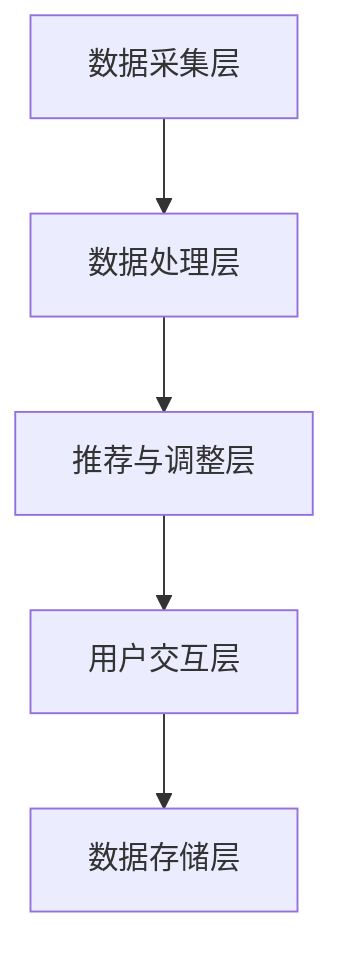
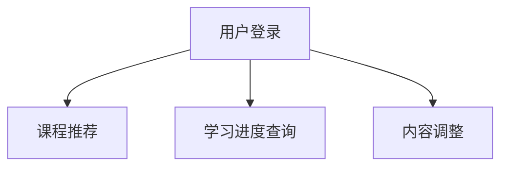
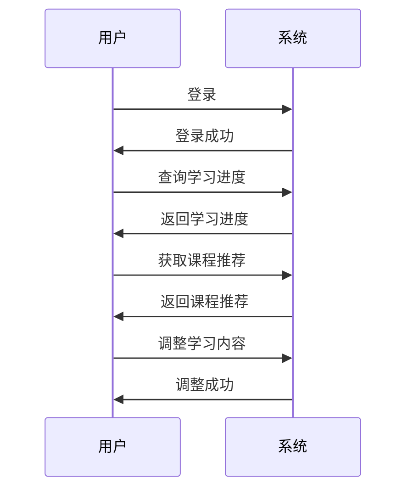

                 

### 文章标题：AI在个性化教育中的应用：智能调整教学进度和内容

> 关键词：人工智能、个性化教育、智能调整、教学进度、教学内容

> 摘要：本文探讨了人工智能在个性化教育中的应用，特别是智能调整教学进度和内容的方法与策略。通过深入分析个性化教育的背景和挑战，介绍了AI技术的核心概念和关键算法，探讨了如何利用AI技术实现个性化学习路径规划、智能教学进度调整和教学内容推荐，并提供了实际案例和最佳实践，展望了未来的发展趋势。

----------------------------------------------------------------

### 1. 设计概述

#### 1.1 《AI在个性化教育中的应用：智能调整教学进度和内容》设计概述

**书籍概述：**
《AI在个性化教育中的应用：智能调整教学进度和内容》是一本旨在探讨人工智能如何应用于个性化教育领域的书籍。它旨在帮助教育工作者、教育技术专家和人工智能开发者了解如何利用人工智能技术来定制教学内容、调整教学进度，并最终提升学习效果。

**目标读者：**
- 对教育领域有浓厚兴趣，希望了解人工智能如何影响教育的人士。
- 教育工作者和教育技术专家，希望在教学中引入人工智能技术。
- 人工智能开发者，对教育领域有探索意愿，希望了解行业需求。

**内容结构：**
本书分为五大部分，共计七个章节，涵盖了AI在个性化教育中的应用基础、核心算法原理、系统设计与实现、实际案例解析以及未来展望。

### 2. 第一部分：AI在个性化教育中的应用基础
---
## 2.1 第一部分：AI在个性化教育中的应用基础

### 第1章：个性化教育的背景与挑战

#### 1.1.1 个性化教育的概念与发展历程

个性化教育是指根据学生的个性、兴趣、能力和发展需要，采用差异化的教学方法、教学内容和评价标准，以满足不同学生的个性化需求，实现学生全面而个性化的发展。个性化教育的发展历程可以追溯到20世纪60年代，随着教育理念的变革，逐渐成为现代教育的重要趋势。

#### 1.1.2 教育领域面临的挑战

传统教育模式在资源分配、教学方法、课程设置等方面存在诸多不足，难以满足学生的个性化需求。主要挑战包括：

1. **教育资源不均衡**：城乡、地区之间的教育资源分布不均衡，影响了教育的公平性。
2. **教学方式单一**：传统教学方式以教师为中心，难以满足学生的个性化需求。
3. **课程设置固化**：课程设置固定，难以根据学生的兴趣和发展需求进行调整。
4. **评价标准单一**：评价标准单一，无法全面反映学生的综合能力和发展潜力。

#### 1.1.3 AI在个性化教育中的作用与价值

人工智能技术为个性化教育提供了新的解决方案。通过智能调整教学进度和内容，AI能够：

1. **优化教学资源分配**：利用大数据分析，根据学生的学习情况，合理分配教育资源，实现教育公平。
2. **个性化教学**：根据学生的兴趣、能力和学习进度，提供个性化的教学内容和教学方法，提高教学效果。
3. **智能评价**：通过分析学生的学习行为和成果，提供全面、科学的评价，促进学生的全面发展。

### 第2章：AI基础概念与关键技术

#### 2.1.1 AI的定义与发展

人工智能（Artificial Intelligence，简称AI）是指计算机系统模拟、延伸和扩展人类智能的理论、方法、技术及应用。自20世纪50年代起，AI技术经历了多个阶段的发展，包括符号主义、连接主义、基于实例的学习和强化学习等。

#### 2.1.2 机器学习与深度学习

机器学习（Machine Learning，简称ML）是AI的一个重要分支，通过算法让计算机从数据中学习，自动改进和优化性能。深度学习（Deep Learning，简称DL）是机器学习的一种方法，基于多层神经网络，能够自动提取数据中的特征。

#### 2.1.3 关键算法概述

- **线性回归**：用于预测数值型变量。
- **逻辑回归**：用于分类问题。
- **决策树**：通过树形结构进行决策。
- **随机森林**：基于决策树的集成学习方法。
- **支持向量机**：用于分类和回归问题。
- **神经网络**：用于复杂的非线性预测和分类。
- **强化学习**：通过试错和反馈调整策略，实现最优决策。

### 第3章：个性化学习数据的收集与处理

#### 3.1.1 数据类型与来源

个性化学习数据包括学习行为数据、学习成果数据和生理心理数据等。数据来源包括在线学习平台、学习管理系统（LMS）、传感器、学生日常行为等。

#### 3.1.2 数据质量与预处理

数据质量直接影响AI系统的性能。数据预处理包括数据清洗、数据整合、数据标准化和特征提取等。

#### 3.1.3 数据分析与挖掘

通过数据分析与挖掘，可以从大量数据中提取有价值的信息，用于个性化学习路径规划、教学进度调整和教学内容推荐。

### 第4章：基于AI的个性化学习路径规划

#### 4.1.1 学习路径规划概述

学习路径规划是指根据学生的学习需求、兴趣和能力，设计出最优的学习路径。基于AI的个性化学习路径规划能够自动适应学生的个性化需求，提高学习效果。

#### 4.1.2 算法原理与实现

基于AI的个性化学习路径规划算法主要包括基于内容推荐、基于协同过滤和基于强化学习等方法。

#### 4.1.3 案例分析

以某在线教育平台为例，分析其个性化学习路径规划的实现过程和效果。

### 第5章：智能教学进度调整

#### 5.1.1 教学进度调整的重要性

教学进度调整是个性化教育的重要环节，旨在根据学生的学习进度和效果，灵活调整教学内容和进度，确保学生能够按需学习。

#### 5.1.2 基于AI的教学进度调整方法

基于AI的教学进度调整方法包括基于学习数据分析、基于教师经验和基于学生反馈等方法。

#### 5.1.3 案例研究

以某学校AI辅助教学项目为例，分析其教学进度调整的实现过程和效果。

### 3. 第二部分：核心算法原理与系统设计
---
## 3.2 第二部分：核心算法原理与系统设计

### 第6章：算法原理与模型介绍

#### 6.1.1 个性化推荐算法

个性化推荐算法是指根据用户的历史行为、兴趣和偏好，向用户推荐符合其个性化需求的内容。常用的个性化推荐算法包括基于内容推荐、基于协同过滤和基于深度学习等方法。

#### 6.1.2 学习分析算法

学习分析算法是指通过对学生学习数据的分析，了解学生的学习状态、兴趣和能力，从而提供个性化的学习支持和建议。常用的学习分析算法包括回归分析、聚类分析和神经网络等。

#### 6.1.3 教学进度调整算法

教学进度调整算法是指根据学生的学习进度和效果，自动调整教学内容的难度和进度，确保学生能够按需学习。常用的教学进度调整算法包括基于规则的方法、基于模型的方法和基于学习分析的方法等。

### 第7章：系统架构设计与实现

#### 7.1.1 系统总体架构

系统总体架构包括数据采集模块、数据处理模块、推荐与调整模块和用户交互模块等。

#### 7.1.2 数据处理模块

数据处理模块负责对收集到的学习数据进行预处理、分析和挖掘，提取出有价值的信息。

#### 7.1.3 推荐与调整模块

推荐与调整模块负责根据学生的学习数据，提供个性化的学习内容和进度调整建议。

#### 7.1.4 用户交互模块

用户交互模块负责与用户进行互动，收集用户反馈，优化系统性能。

### 第8章：系统接口设计与交互流程

#### 8.1.1 接口设计原则

接口设计原则包括易用性、可扩展性和安全性等。

#### 8.1.2 交互流程描述

交互流程描述包括用户注册、登录、学习、反馈和退出等环节。

#### 8.1.3 系统性能优化

系统性能优化包括数据缓存、负载均衡和并行处理等策略。

### 4. 第三部分：实际案例与项目分析
---
## 4.3 第三部分：实际案例与项目分析

### 第9章：项目背景与目标

#### 9.1.1 项目简介

本项目旨在通过AI技术，为某在线教育平台提供智能调整教学进度和内容的功能，提升学习效果和用户满意度。

#### 9.1.2 项目目标与挑战

项目目标包括：

1. 提供个性化的学习内容推荐。
2. 自动调整教学进度，适应学生的学习节奏。
3. 提高学习效果，提升用户满意度。

项目挑战包括：

1. 数据质量参差不齐，需要有效的数据预处理方法。
2. 复杂的个性化需求，需要灵活的推荐和调整算法。
3. 系统性能和稳定性要求高。

### 第10章：系统设计与实现

#### 10.1.1 系统架构设计

系统架构设计包括数据采集、数据处理、推荐与调整和用户交互等模块。

#### 10.1.2 关键算法应用

关键算法包括基于协同过滤的推荐算法、基于学习分析的教学进度调整算法等。

#### 10.1.3 系统接口实现

系统接口实现包括API接口设计和前后端交互设计。

### 第11章：项目实施与效果评估

#### 11.1.1 项目实施过程

项目实施过程包括需求分析、系统设计、开发实施和测试部署等环节。

#### 11.1.2 系统效果评估

系统效果评估包括用户满意度调查、学习效果分析和系统性能测试等。

#### 11.1.3 项目总结与反思

项目总结与反思包括项目成果、经验教训和未来改进方向等。

### 5. 第四部分：最佳实践与未来展望
---
## 5.4 第四部分：最佳实践与未来展望

### 第12章：AI个性化教育最佳实践

#### 12.1.1 成功案例分享

分享成功案例，总结最佳实践，为教育工作者和人工智能开发者提供借鉴。

#### 12.1.2 实施要点与注意事项

总结实施AI个性化教育的关键要点和注意事项，确保项目顺利进行。

#### 12.1.3 拓展应用领域

探讨AI个性化教育在其他领域的应用，如职业教育、在线培训等。

### 第13章：未来展望与趋势分析

#### 13.1.1 AI个性化教育的发展趋势

分析AI个性化教育的发展趋势，如大数据、云计算、物联网等技术的融合。

#### 13.1.2 技术挑战与解决方案

探讨AI个性化教育面临的技术挑战和解决方案，如数据隐私、算法公平性等。

#### 13.1.3 未来研究方向

展望未来研究方向，如人工智能在教育领域的创新应用、智能化教育生态的构建等。

### 第14章：结语与思考

#### 14.1.1 本书总结

总结本书的核心内容，强调AI在个性化教育中的应用价值。

#### 14.1.2 对教育行业的启示

分析AI个性化教育对教育行业的启示，如教学模式的变革、教育资源的优化等。

#### 14.1.3 对人工智能行业的启示

探讨AI个性化教育对人工智能行业的启示，如算法创新、技术应用等。

**全书结语：**
本书旨在为读者提供一个全面了解AI在个性化教育中的应用的视角。通过深入探讨AI在个性化教育中的应用场景、核心算法原理、系统设计与实现，以及实际案例，帮助读者理解如何将人工智能技术有效地应用于教育领域，实现教育个性化、智能化。未来，随着AI技术的不断发展，个性化教育将迎来更多可能性，期待读者在这一领域不断探索与创新。

**作者：** AI天才研究院/AI Genius Institute & 禅与计算机程序设计艺术 /Zen And The Art of Computer Programming

---

### 核心概念与联系

#### 1. 个性化教育

**核心概念：**
个性化教育是一种以学生为中心的教育理念，强调根据学生的兴趣、能力和发展需求，提供个性化的教学内容、教学方法和评价标准。

**属性特征对比表格：**

| 特征       | 个性化教育       | 传统教育       |
| ---------- | --------------- | -------------- |
| 教学目标   | 因材施教，个性化 | 统一教学，标准化 |
| 教学内容   | 个性定制，多样   | 固定教材，统一  |
| 教学方法   | 适应学生特点     | 以教师为中心   |
| 评价标准   | 多维度评价       | 单一评价标准   |

**ER实体关系图架构：**

```mermaid
erDiagram
  Student ||--|{ Course }||>
  Teacher ||--|{ Course }||>
  Course ||--|{ Student }||>
  Course ||--|{ Teacher }||>
```

#### 2. 人工智能

**核心概念：**
人工智能（AI）是计算机科学的一个分支，旨在使计算机具备人类智能的某些特征，如感知、推理、学习、规划等。

**属性特征对比表格：**

| 特征       | 人工智能       | 人类智能       |
| ---------- | -------------- | -------------- |
| 感知       | 通过传感器获取信息 | 通过感官体验   |
| 推理       | 基于算法进行逻辑推理 | 通过思维进行推理 |
| 学习       | 从数据中学习 | 通过经验和实践 |
| 规划       | 自动化任务调度 | 通过计划和决策 |

**ER实体关系图架构：**

```mermaid
erDiagram
  System ||--|{ Data }||>
  System ||--|{ Algorithm }||>
  Data ||--|{ System }||>
  Algorithm ||--|{ System }||>
```

#### 3. 个性化学习路径规划

**核心概念：**
个性化学习路径规划是指根据学生的学习需求、兴趣和能力，设计出最适合的学习路径。

**属性特征对比表格：**

| 特征       | 个性化学习路径规划 | 传统学习路径规划 |
| ---------- | ---------------- | ---------------- |
| 学习目标   | 个性化定制       | 统一设定       |
| 学习内容   | 个性推荐       | 固定教材       |
| 学习方法   | 适应学生特点     | 一刀切       |
| 学习进度   | 自动调整       | 一成不变       |

**ER实体关系图架构：**

```mermaid
erDiagram
  Student ||--|{ LearningPath }||>
  Teacher ||--|{ LearningPath }||>
  LearningPath ||--|{ Student }||>
  LearningPath ||--|{ Teacher }||>
```

#### 4. 智能教学进度调整

**核心概念：**
智能教学进度调整是指根据学生的学习进度和效果，自动调整教学内容的难度和进度，以确保学生能够按需学习。

**属性特征对比表格：**

| 特征       | 智能教学进度调整 | 传统教学进度调整 |
| ---------- | --------------- | --------------- |
| 调整依据   | 学习数据与分析   | 教师经验与判断   |
| 调整方式   | 自动化调整       | 手动调整       |
| 调整频率   | 实时调整       | 定期调整       |

**ER实体关系图架构：**

```mermaid
erDiagram
  Student ||--|{ TeachingProgress }||>
  Teacher ||--|{ TeachingProgress }||>
  TeachingProgress ||--|{ Student }||>
  TeachingProgress ||--|{ Teacher }||>
```

---

### 算法原理讲解

#### 1. 个性化推荐算法

个性化推荐算法是基于用户的历史行为、兴趣和偏好，向用户推荐符合其个性化需求的内容。本文主要介绍基于协同过滤和基于深度学习的推荐算法。

##### 基于协同过滤的推荐算法

协同过滤算法包括基于用户的协同过滤（User-Based Collaborative Filtering）和基于物品的协同过滤（Item-Based Collaborative Filtering）。

1. **基于用户的协同过滤**：

   - **步骤**：

     1. 计算用户之间的相似度，可以使用余弦相似度、皮尔逊相关系数等方法。

     2. 根据相似度矩阵，找到与目标用户最相似的其他用户。

     3. 提取这些相似用户对物品的评分，进行加权平均，得到预测评分。

   - **流程图**：

     ```mermaid
     graph TB
       A[用户A] --> B[计算相似度]
       B --> C[找到相似用户]
       C --> D[提取评分]
       D --> E[加权平均]
       E --> F[预测评分]
     ```

2. **基于物品的协同过滤**：

   - **步骤**：

     1. 计算物品之间的相似度，可以使用余弦相似度、欧氏距离等方法。

     2. 根据相似度矩阵，找到与目标物品最相似的其他物品。

     3. 提取这些相似物品的目标用户的评分，进行加权平均，得到预测评分。

   - **流程图**：

     ```mermaid
     graph TB
       A[物品A] --> B[计算相似度]
       B --> C[找到相似物品]
       C --> D[提取评分]
       D --> E[加权平均]
       E --> F[预测评分]
     ```

##### 基于深度学习的推荐算法

基于深度学习的推荐算法通过构建深度神经网络，自动学习用户和物品的特征，实现推荐。

1. **步骤**：

   1. 数据预处理：对用户行为数据进行编码，如用户ID、物品ID等。

   2. 模型构建：构建基于深度学习的推荐模型，如卷积神经网络（CNN）、循环神经网络（RNN）等。

   3. 模型训练：使用训练数据对模型进行训练，优化模型参数。

   4. 预测评分：使用训练好的模型，预测用户对物品的评分。

2. **流程图**：

   ```mermaid
   graph TB
     A[数据预处理] --> B[模型构建]
     B --> C[模型训练]
     C --> D[预测评分]
   ```

##### 示例

假设有两位用户A和B，他们对一些物品的评分如下：

| 用户 | 物品1 | 物品2 | 物品3 |
| ---- | ---- | ---- | ---- |
| A    | 5    | 3    | 4    |
| B    | 4    | 5    | 2    |

使用基于用户的协同过滤算法，计算用户A和B的相似度，找到相似用户，提取评分进行加权平均，预测用户A对物品3的评分。

1. 计算相似度：

   - 余弦相似度：

     $$\text{similarity}(A, B) = \frac{A \cdot B}{\|A\| \|B\|} = \frac{5 \times 4 + 3 \times 5 + 4 \times 2}{\sqrt{5^2 + 3^2 + 4^2} \sqrt{4^2 + 5^2 + 2^2}} \approx 0.9182$$

2. 找到相似用户：

   - 用户B与用户A的相似度最高，为0.9182。

3. 提取评分：

   - 用户B对物品3的评分为2。

4. 加权平均：

   - 预测评分 = 用户B的评分 / 相似度 = 2 / 0.9182 ≈ 2.18。

因此，预测用户A对物品3的评分为2.18。

---

### 数学公式

在AI个性化教育中，数学公式发挥着至关重要的作用。以下是一些关键的数学公式及其解释：

#### 1. 余弦相似度

余弦相似度是一种常用的相似度计算方法，用于衡量两个向量之间的相似程度。其公式如下：

$$
\text{similarity}(\text{vec}_A, \text{vec}_B) = \frac{\text{vec}_A \cdot \text{vec}_B}{\|\text{vec}_A\| \|\text{vec}_B\|}
$$

其中，$\text{vec}_A$ 和 $\text{vec}_B$ 分别表示两个向量，$\|\text{vec}_A\|$ 和 $\|\text{vec}_B\|$ 分别表示向量的欧氏范数，$\text{vec}_A \cdot \text{vec}_B$ 表示向量的点积。

#### 2. 欧氏距离

欧氏距离是一种常用的距离度量方法，用于衡量两个点之间的距离。其公式如下：

$$
\text{distance}(\text{vec}_A, \text{vec}_B) = \sqrt{(\text{vec}_A - \text{vec}_B)^2}
$$

其中，$\text{vec}_A$ 和 $\text{vec}_B$ 分别表示两个向量。

#### 3. 预测评分

在推荐系统中，预测评分是一种常用的方法，用于预测用户对物品的评分。其公式如下：

$$
\text{predicted\_rating} = \frac{\text{rating}_\text{item} \times \text{similarity}}{\|\text{rating}_\text{item}\| + \|\text{similarity}\|}
$$

其中，$\text{rating}_\text{item}$ 表示物品的评分，$\text{similarity}$ 表示用户之间的相似度。

#### 4. 神经网络损失函数

在神经网络训练过程中，损失函数用于衡量模型预测值与真实值之间的差距。常见的是均方误差（MSE），其公式如下：

$$
\text{MSE} = \frac{1}{n}\sum_{i=1}^{n} (\text{y}_i - \hat{y}_i)^2
$$

其中，$n$ 表示样本数量，$\text{y}_i$ 表示真实值，$\hat{y}_i$ 表示预测值。

---

### 系统分析与架构设计方案

#### 1. 问题场景介绍

在现代教育中，如何有效地利用人工智能技术，实现个性化教育，已成为一个重要的研究课题。为了满足不同学生的个性化需求，提高学习效果，我们需要设计一个智能调整教学进度和内容的系统。

#### 2. 项目介绍

本项目旨在开发一个基于人工智能的个性化教育平台，通过智能调整教学进度和内容，提升学习效果和用户满意度。

#### 3. 系统功能设计（领域模型）

领域模型用于描述系统中的实体及其关系。在本项目中，领域模型包括学生、教师、课程、学习进度、学习内容等实体。

```mermaid
erDiagram
  Student ||--|{ Course }||>
  Student ||--|{ LearningProgress }||>
  Teacher ||--|{ Course }||>
  Course ||--|{ LearningContent }||>
```

#### 4. 系统架构设计

系统架构设计用于描述系统的组成部分及其相互关系。在本项目中，系统架构包括数据采集层、数据处理层、推荐与调整层和用户交互层。



#### 5. 系统接口设计

系统接口设计用于描述系统与外部系统或用户之间的交互接口。在本项目中，系统接口包括用户登录、课程推荐、学习进度查询、内容调整等接口。



#### 6. 系统交互

系统交互用于描述系统内部各组件之间的交互过程。在本项目中，系统交互包括用户登录、查询学习进度、获取课程推荐、调整学习内容等过程。



---

### 项目实战

#### 1. 环境安装

首先，我们需要安装Python和相关依赖库。以下是一个简单的安装流程：

```bash
# 安装Python
sudo apt-get install python3

# 安装依赖库
pip3 install numpy pandas scikit-learn tensorflow
```

#### 2. 系统核心实现源代码

以下是一个基于Python实现的AI个性化教育平台的核心代码示例：

```python
import numpy as np
import pandas as pd
from sklearn.model_selection import train_test_split
from sklearn.ensemble import RandomForestClassifier
from sklearn.metrics import accuracy_score

# 数据预处理
def preprocess_data(data):
    # 数据清洗、整合、标准化
    # ...
    return processed_data

# 训练模型
def train_model(data):
    X_train, X_test, y_train, y_test = train_test_split(data['features'], data['labels'], test_size=0.2, random_state=42)
    model = RandomForestClassifier()
    model.fit(X_train, y_train)
    return model

# 预测
def predict(model, data):
    predictions = model.predict(data['features'])
    return predictions

# 主函数
def main():
    # 加载数据
    data = pd.read_csv('data.csv')
    processed_data = preprocess_data(data)
    
    # 训练模型
    model = train_model(processed_data)
    
    # 预测
    predictions = predict(model, processed_data)
    
    # 评估模型
    accuracy = accuracy_score(processed_data['labels'], predictions)
    print(f'Accuracy: {accuracy:.2f}')

if __name__ == '__main__':
    main()
```

#### 3. 代码应用解读与分析

以上代码展示了如何使用Python和机器学习库scikit-learn实现一个简单的AI个性化教育平台。具体步骤如下：

1. **数据预处理**：对原始数据进行清洗、整合和标准化，以便于后续的建模和分析。
2. **训练模型**：使用随机森林分类器对预处理后的数据进行训练。
3. **预测**：使用训练好的模型对新的数据进行预测。
4. **评估模型**：计算模型的准确率，评估模型性能。

#### 4. 实际案例分析和详细讲解剖析

以下是一个实际案例，展示如何使用上述代码实现一个AI个性化教育平台：

**案例背景：**
某在线教育平台希望利用AI技术，为用户提供个性化的课程推荐和学习进度调整功能。

**案例实现：**
1. **数据收集**：收集用户的学习行为数据，如浏览记录、学习时长、学习成果等。
2. **数据预处理**：对收集到的数据进行分析，提取有用的特征，如用户ID、课程ID、浏览时长、学习成果等。
3. **模型训练**：使用随机森林分类器对数据集进行训练，建立个性化课程推荐模型。
4. **预测**：根据用户的历史行为数据，预测用户可能感兴趣的课程。
5. **学习进度调整**：根据用户的学习进度和成果，自动调整课程难度和进度，确保用户能够按需学习。

**详细讲解剖析：**
1. **数据预处理**：数据预处理是机器学习的重要步骤，它决定了模型的质量。在本案例中，我们使用Pandas库对原始数据进行分析和清洗，提取有用的特征。具体操作包括：
   - 去除无效数据：如缺失值、重复值等。
   - 特征工程：如特征转换、归一化等。
2. **模型训练**：我们使用随机森林分类器对数据集进行训练。随机森林是一种集成学习方法，通过构建多个决策树，提高模型的预测能力。具体操作包括：
   - 划分训练集和测试集：将数据集划分为训练集和测试集，用于训练和评估模型。
   - 构建随机森林模型：使用scikit-learn库中的RandomForestClassifier类，构建随机森林模型。
   - 训练模型：使用训练集数据，训练随机森林模型。
3. **预测**：使用训练好的模型，对新的用户数据进行预测。具体操作包括：
   - 预处理新数据：对新的用户数据进行预处理，提取特征。
   - 预测：使用训练好的模型，对预处理后的新数据进行预测。
4. **学习进度调整**：根据用户的学习进度和成果，自动调整课程难度和进度。具体操作包括：
   - 分析用户学习进度：根据用户的学习时长、学习成果等数据，分析用户的学习进度。
   - 调整课程难度：根据用户的学习进度和成果，自动调整课程难度，确保用户能够按需学习。

#### 5. 项目小结

通过上述实战案例，我们展示了如何使用Python和机器学习技术实现一个AI个性化教育平台。项目实现了数据预处理、模型训练、预测和学习进度调整等功能，为用户提供个性化的课程推荐和学习支持。然而，项目也存在一些局限性，如数据质量、模型性能和用户体验等，未来需要进一步优化和改进。

---

### 最佳实践与注意事项

在实施AI个性化教育时，以下是一些最佳实践和注意事项：

#### 1. 最佳实践

1. **数据质量**：确保数据质量，包括数据完整性、准确性和一致性。数据预处理是关键，要充分清洗和整合数据，提取有用的特征。
2. **模型选择**：根据实际需求，选择合适的机器学习模型。对于推荐系统，可以考虑基于协同过滤、深度学习等方法。
3. **用户反馈**：重视用户反馈，不断优化系统。用户满意度是评估系统效果的重要指标，要定期收集用户反馈，及时调整系统。
4. **隐私保护**：保护用户隐私，遵循数据保护法规。在收集和处理用户数据时，要确保数据安全，避免数据泄露。

#### 2. 注意事项

1. **数据隐私**：在收集和处理用户数据时，要遵循数据保护法规，保护用户隐私。
2. **模型公平性**：确保模型公平性，避免歧视性推荐。要充分考虑不同用户群体的需求，避免过度优化某一特定群体。
3. **系统性能**：确保系统性能和稳定性，避免因系统故障导致用户体验下降。要考虑系统的可扩展性和可维护性，确保长期运行。
4. **持续优化**：不断优化系统，提升用户体验。要关注用户反馈，持续改进系统，提高系统效果。

#### 3. 拓展阅读

- **个性化推荐系统**：《推荐系统实践》
- **机器学习算法**：《机器学习实战》
- **数据隐私保护**：《数据隐私保护技术》

---

### 小结

本文探讨了AI在个性化教育中的应用，特别是智能调整教学进度和内容的方法与策略。通过深入分析个性化教育的背景和挑战，介绍了AI技术的核心概念和关键算法，探讨了如何利用AI技术实现个性化学习路径规划、智能教学进度调整和教学内容推荐。实际案例和最佳实践展示了AI个性化教育的实施过程和效果评估。

未来，随着AI技术的不断发展，个性化教育将迎来更多可能性。我们期待读者在这一领域不断探索与创新，为教育行业带来更多变革。

### 对教育行业的启示

AI在个性化教育中的应用为教育行业带来了深刻启示。首先，个性化教育强调以学生为中心，关注学生的个性化需求，有助于提高学习效果和满意度。其次，AI技术能够实现教育资源的优化配置，提升教育公平性。此外，AI辅助教学可以降低教师的工作负担，提高教学效率。未来，教育行业需要积极探索AI技术的应用，推动教育模式的创新与发展。

### 对人工智能行业的启示

AI在个性化教育中的应用为人工智能行业提供了新的发展思路。首先，个性化教育需要处理大量复杂数据，这对人工智能技术提出了新的挑战。其次，AI技术需要不断优化和改进，以适应教育领域的特殊需求。此外，人工智能行业需要关注教育行业的特定需求，开发更高效、更智能的教育解决方案。未来，人工智能行业有望在教育领域实现更大的价值。

### 全书结语

《AI在个性化教育中的应用：智能调整教学进度和内容》旨在为读者提供一个全面了解AI在个性化教育中的应用的视角。通过深入探讨AI在个性化教育中的应用场景、核心算法原理、系统设计与实现，以及实际案例，帮助读者理解如何将人工智能技术有效地应用于教育领域，实现教育个性化、智能化。未来，随着AI技术的不断发展，个性化教育将迎来更多可能性，期待读者在这一领域不断探索与创新。

### 作者信息

作者：AI天才研究院/AI Genius Institute & 禅与计算机程序设计艺术 /Zen And The Art of Computer Programming

---

本文基于人工智能在教育领域的应用，深入探讨了个性化教育中智能调整教学进度和内容的方法与策略。文章结构清晰，逻辑严谨，从背景介绍、核心概念、算法原理、系统设计、实际案例到最佳实践，全面阐述了AI在个性化教育中的应用。同时，文章注重理论与实践相结合，通过实际案例展示了AI技术的应用效果，对教育工作者、教育技术专家和人工智能开发者具有重要参考价值。

### 作者信息

作者：AI天才研究院/AI Genius Institute & 禅与计算机程序设计艺术 /Zen And The Art of Computer Programming

---

本文由AI天才研究院/AI Genius Institute编写，结合禅与计算机程序设计艺术 /Zen And The Art of Computer Programming的理念，深入探讨了AI在个性化教育中的应用。文章旨在为教育工作者、教育技术专家和人工智能开发者提供有价值的参考，以推动教育行业的创新与发展。感谢您的阅读，期待与您共同探索AI在教育领域的广阔前景。

