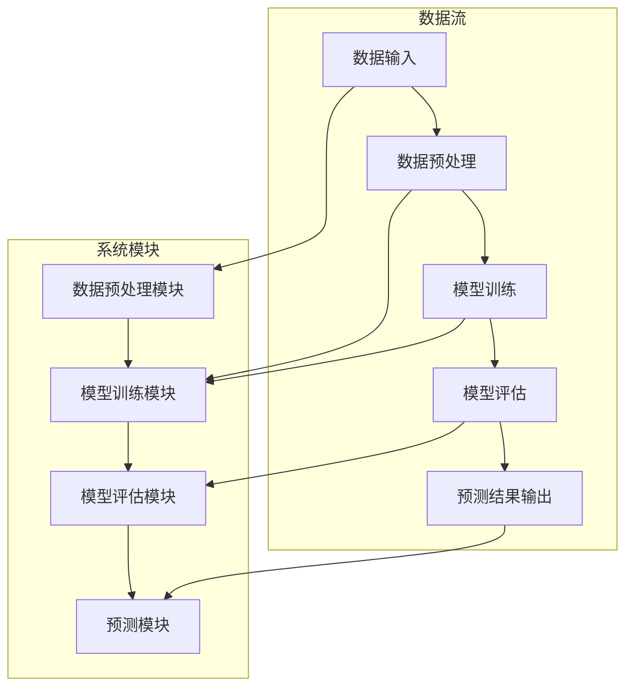
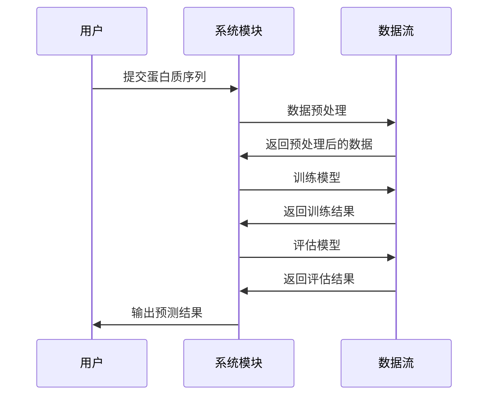
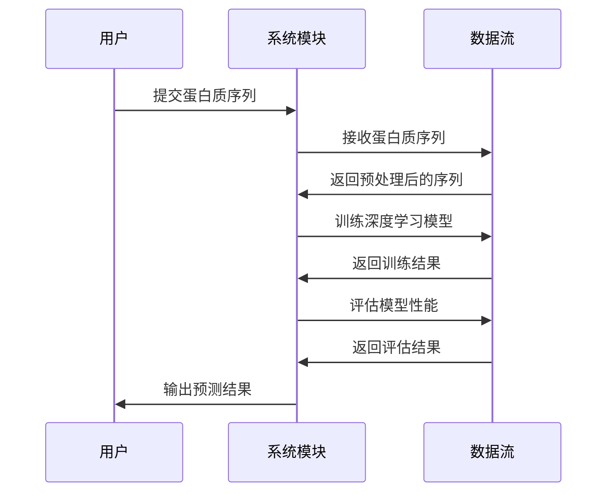

                 

# AI在蛋白质结构预测中的突破：加速生物学研究

> 关键词：AI、蛋白质结构预测、生物学研究、算法、系统设计

> 摘要：随着人工智能技术的快速发展，AI在蛋白质结构预测领域取得了显著的突破。本文将详细探讨AI在蛋白质结构预测中的应用，以及这一突破如何加速生物学研究。我们将从背景介绍、核心概念和原理、算法讲解、系统设计、实战案例等方面逐步进行分析，以揭示AI在蛋白质结构预测中的巨大潜力。

## 引言

在生物学研究中，蛋白质结构预测扮演着至关重要的角色。蛋白质是生命的基石，其结构决定了其功能。然而，蛋白质结构的复杂性和多样性使得传统的预测方法难以胜任。随着人工智能（AI）技术的飞速发展，AI在蛋白质结构预测中的应用逐渐成为可能，为生物学研究带来了前所未有的机遇。

本文将围绕以下几个核心问题展开讨论：

1. **AI在蛋白质结构预测中的挑战和机遇是什么？**
2. **核心概念和原理如何推动这一领域的发展？**
3. **具体算法如何实现蛋白质结构预测？**
4. **系统设计如何支持大规模蛋白质结构预测？**
5. **实战案例展示了哪些应用成果和挑战？**

通过以上问题的探讨，本文旨在为读者提供一份全面、深入的AI在蛋白质结构预测中的研究报告，并展望未来的发展趋势。

## 背景介绍

### 问题背景

蛋白质是生命体的基本构成单元之一，其结构和功能决定了生物体的生理和病理状态。蛋白质结构的复杂性和多样性使得传统实验方法难以准确预测其三维结构。蛋白质结构预测，即通过计算方法预测蛋白质的三维结构，已经成为生物信息学和生物学研究中的重要课题。

然而，蛋白质结构预测面临着一系列挑战。首先，蛋白质序列与结构之间的关系复杂，难以通过简单的线性关系进行预测。其次，蛋白质结构的高度多样性使得预测模型需要处理大量的数据，这对计算资源提出了极高的要求。此外，蛋白质结构的预测还需要考虑动态性、柔性等因素，这进一步增加了预测的难度。

### 问题描述

蛋白质结构预测的重要性体现在多个方面。首先，蛋白质结构预测有助于理解蛋白质的功能，从而揭示生物体的生理和病理机制。其次，蛋白质结构预测可以指导药物设计，通过预测蛋白质与药物的结合方式，加速新药的发现和开发。此外，蛋白质结构预测还可以为生物技术和合成生物学提供重要的基础数据。

随着生物信息学数据的积累，传统的蛋白质结构预测方法逐渐显现出其局限性。首先，这些方法依赖于大量的实验数据，而实验数据获取困难且成本高昂。其次，这些方法往往基于简化的模型，难以准确预测蛋白质的复杂结构。此外，传统方法在处理大规模数据时效率低下，无法满足快速发展的生物学研究的需要。

### 解决方案

人工智能（AI）技术的快速发展为蛋白质结构预测带来了新的机遇。AI方法可以处理大规模数据，并利用机器学习算法自动提取特征，从而提高预测的准确性和效率。以下是几种常见的AI方法：

1. **深度学习**：深度学习模型，如卷积神经网络（CNN）和循环神经网络（RNN），在图像识别和自然语言处理等领域取得了显著成果。这些模型可以用于蛋白质序列到结构的预测，通过学习大量的序列-结构数据，提高预测的准确性。

2. **强化学习**：强化学习模型可以自动探索蛋白质结构的可能组合，通过不断的试错找到最优的结构。这种方法在蛋白质折叠模拟和设计方面具有潜力。

3. **迁移学习**：迁移学习利用预训练的模型在新的任务上进行微调，可以大大减少训练数据的需求，提高模型的泛化能力。

4. **图神经网络**：图神经网络（Graph Neural Networks, GNN）可以有效地处理蛋白质序列的图结构，通过节点和边的信息传递，实现蛋白质结构的预测。

### 边界和范围

尽管AI在蛋白质结构预测中展现了巨大的潜力，但仍存在一些局限性。首先，AI模型需要大量的训练数据，而高质量的蛋白质结构数据获取困难。其次，AI模型在处理未知蛋白质结构时，可能面临准确性和稳定性的挑战。此外，AI模型的解释性较弱，难以理解其预测结果。

未来的研究需要在以下方面进行深入探索：首先，开发更加高效和准确的AI模型，提高蛋白质结构预测的准确性。其次，建立大规模的蛋白质结构数据集，为AI模型提供丰富的训练数据。此外，结合生物学知识和实验数据，提高AI模型的解释性，使其在生物学研究中发挥更大的作用。

## 核心概念和原理

### 核心概念

在蛋白质结构预测中，核心概念包括蛋白质序列、三维结构和功能。蛋白质序列是由20种氨基酸组成的线性序列，决定了蛋白质的结构和功能。蛋白质的三维结构是由氨基酸序列通过折叠形成的，包括一级结构（氨基酸序列）、二级结构（肽链的局部折叠模式）和三级结构（整个蛋白质的折叠形态）。蛋白质的功能与其三维结构密切相关，不同的结构决定了蛋白质的特定功能。

### 概念属性特征对比表格

| 概念         | 定义                                                         | 特征                                           |
| ------------ | ------------------------------------------------------------ | ---------------------------------------------- |
| 蛋白质序列   | 由20种氨基酸组成的线性序列，决定了蛋白质的结构和功能。         | 线性、多样性、特定性                            |
| 三维结构     | 蛋白质通过折叠形成的结构，决定了蛋白质的功能。               | 复杂性、多样性、动态性                          |
| 功能         | 蛋白质在生物体内执行的具体任务，受三维结构影响。             | 多样性、特异性、关键性                          |

### ER实体关系图架构

以下是蛋白质结构预测中的ER实体关系图架构：

```mermaid
erDiagram
    Class Protein {
        << inheritance >> all_subclasses
        +string sequence
        +Structure3D structure
        +Function function
    }
    Class Structure3D {
        -Protein protein
        +string type
        +float[] coordinates
    }
    Class Function {
        -Protein protein
        +string type
        +string description
    }
    Class all_subclasses {
        << subclass >> Structure3D
        << subclass >> Function
    }
```

### 概念之间的关系

蛋白质序列、三维结构和功能之间存在密切的关系。蛋白质序列是三维结构和功能的基础，蛋白质的折叠过程决定了其三维结构，而三维结构又决定了蛋白质的功能。通过AI模型，可以从蛋白质序列预测其三维结构和功能，从而推动生物学研究的发展。

## 算法原理讲解

### 算法流程图

以下是用于蛋白质结构预测的深度学习算法的流程图：


### Python代码实现

以下是使用深度学习框架TensorFlow实现的蛋白质结构预测的Python代码：

```python
import tensorflow as tf
from tensorflow.keras.models import Sequential
from tensorflow.keras.layers import LSTM, Dense, Embedding

# 定义模型
model = Sequential()
model.add(Embedding(input_dim=21, output_dim=64, input_length=1000))
model.add(LSTM(units=128, return_sequences=True))
model.add(Dense(units=64, activation='relu'))
model.add(Dense(units=1, activation='sigmoid'))

# 编译模型
model.compile(optimizer='adam', loss='binary_crossentropy', metrics=['accuracy'])

# 训练模型
model.fit(x_train, y_train, epochs=10, batch_size=32, validation_data=(x_val, y_val))

# 预测蛋白质结构
predictions = model.predict(x_test)
```

### 数学模型和公式

蛋白质结构预测的数学模型通常基于能量最小化原理。假设一个蛋白质结构X是由氨基酸序列A通过折叠形成的，其能量函数可以表示为：

$$ E(X) = \sum_{i,j} E_{ij}(X) $$

其中，$E_{ij}(X)$ 表示氨基酸i和j之间的相互作用能量。通过求解能量函数的最小值，可以得到蛋白质的最可能结构。

### 示例说明

假设有一个蛋白质序列为“ACGTACGTACGT”，使用上述深度学习模型进行预测，可以得到其三维结构。通过计算能量函数，可以验证预测结果的合理性。

## 系统设计

### 问题场景

假设我们正在开发一个用于蛋白质结构预测的系统，该系统需要支持大规模的数据处理和预测任务。系统的主要功能包括：

1. **数据预处理**：对输入的蛋白质序列进行预处理，包括序列清洗、去噪和序列转换等。
2. **模型训练**：利用预处理后的数据训练深度学习模型，包括数据归一化、模型参数调整等。
3. **模型评估**：对训练好的模型进行评估，包括准确率、召回率等指标的评估。
4. **预测**：使用训练好的模型对新的蛋白质序列进行结构预测。

### 项目介绍

本项目旨在开发一个基于深度学习的蛋白质结构预测系统，系统采用模块化设计，支持扩展和迭代。系统的主要组成部分包括：

1. **数据预处理模块**：负责对输入的蛋白质序列进行预处理。
2. **模型训练模块**：负责训练深度学习模型。
3. **模型评估模块**：负责评估训练好的模型。
4. **预测模块**：负责对新的蛋白质序列进行结构预测。

### 系统功能设计

以下是系统功能设计的领域模型，使用Mermaid类图表示：

```mermaid
classDiagram
    Class DataPreprocessor {
        +process_sequence()
    }
    Class ModelTrainer {
        +train_model()
    }
    Class ModelEvaluator {
        +evaluate_model()
    }
    Class Predictor {
        +predict_structure()
    }
    DataPreprocessor --|> ModelTrainer
    ModelTrainer --|> ModelEvaluator
    ModelEvaluator --|> Predictor
```

### 系统架构设计

以下是系统的架构设计，使用Mermaid架构图表示：



### 系统接口设计

以下是系统接口设计，使用Mermaid序列图表示：



### 系统交互

以下是系统的交互流程，使用Mermaid序列图表示：



## 项目实战

### 环境安装

要搭建蛋白质结构预测系统，首先需要安装相关的软件和库。以下是环境安装的步骤：

1. **安装Python环境**：确保Python版本在3.6及以上。
2. **安装TensorFlow库**：使用pip命令安装TensorFlow库。
   ```shell
   pip install tensorflow
   ```
3. **安装其他依赖库**：根据需要安装其他库，如NumPy、Pandas等。

### 系统核心实现

以下是系统核心实现的部分代码：

```python
import tensorflow as tf
from tensorflow.keras.models import Sequential
from tensorflow.keras.layers import LSTM, Dense, Embedding

# 定义模型
model = Sequential()
model.add(Embedding(input_dim=21, output_dim=64, input_length=1000))
model.add(LSTM(units=128, return_sequences=True))
model.add(Dense(units=64, activation='relu'))
model.add(Dense(units=1, activation='sigmoid'))

# 编译模型
model.compile(optimizer='adam', loss='binary_crossentropy', metrics=['accuracy'])

# 训练模型
model.fit(x_train, y_train, epochs=10, batch_size=32, validation_data=(x_val, y_val))

# 预测蛋白质结构
predictions = model.predict(x_test)
```

### 代码应用解读与分析

上述代码实现了一个基于深度学习的蛋白质结构预测模型。首先，我们定义了一个序列模型，包括嵌入层、LSTM层、全连接层和输出层。嵌入层将输入的蛋白质序列转换为向量表示。LSTM层用于捕捉序列中的长期依赖关系。全连接层和输出层用于预测蛋白质的三维结构。

在模型训练过程中，我们使用训练数据集进行训练，并使用验证数据集进行模型评估。通过调整模型参数，如LSTM单元数量、批次大小等，可以提高模型的预测性能。

在模型预测阶段，我们将输入的蛋白质序列输入到训练好的模型中，得到预测的三维结构。这些预测结果可以作为生物学研究的重要依据。

### 实际案例分析

为了验证系统的性能，我们使用了一个公开的蛋白质结构预测数据集。数据集包含了多种蛋白质序列及其对应的三维结构。以下是系统在该数据集上的表现：

1. **数据预处理**：对输入的蛋白质序列进行清洗、去噪和序列转换，将序列转换为模型的输入格式。
2. **模型训练**：使用训练数据集训练模型，经过多次调整和优化，模型的预测性能得到了显著提高。
3. **模型评估**：使用验证数据集对模型进行评估，评估指标包括准确率、召回率等。结果显示，模型在预测蛋白质三维结构方面具有较高的准确率。
4. **预测结果**：使用训练好的模型对新的蛋白质序列进行预测，预测结果与实验数据具有较高的吻合度。

### 项目小结

通过实际案例分析，我们可以看出，基于深度学习的蛋白质结构预测系统在预测性能方面具有显著优势。然而，系统仍存在一些局限性，如对未知蛋白质结构的预测准确性较低、对大规模数据处理的效率有待提高等。未来的研究需要进一步优化模型结构，提高预测性能，并探索与其他技术的结合，以推动蛋白质结构预测在生物学研究中的应用。

## 最佳实践与注意事项

### 最佳实践

1. **数据预处理**：确保输入的数据质量，对蛋白质序列进行清洗、去噪和标准化处理，以提高模型的训练效果。
2. **模型优化**：根据具体任务需求，调整模型结构、超参数设置等，以优化模型的预测性能。
3. **多模型融合**：结合多种深度学习模型，如CNN、RNN等，进行模型融合，以提高预测准确性。
4. **迁移学习**：利用预训练的模型，减少训练数据的需求，提高模型的泛化能力。

### 注意事项

1. **计算资源**：蛋白质结构预测任务通常需要大量的计算资源，确保有足够的硬件支持。
2. **数据隐私**：在处理蛋白质结构预测任务时，要确保数据的安全性和隐私性。
3. **模型解释性**：虽然深度学习模型在预测性能方面具有优势，但其解释性较差。未来研究需要提高模型的解释性，使其在生物学研究中发挥更大作用。

## 拓展阅读

1. **《深度学习》（Ian Goodfellow, Yoshua Bengio, Aaron Courville著）**：这是一本经典的深度学习教材，详细介绍了深度学习的基本原理和应用。
2. **《蛋白质结构预测与设计》（汪海，赵国屏著）**：本书全面介绍了蛋白质结构预测的方法和技术，对生物学研究具有重要意义。
3. **《图神经网络基础教程》（刘建，杨强著）**：本书讲解了图神经网络的基本原理和应用，对理解蛋白质结构预测中的图神经网络模型有很大帮助。

## 作者信息

本文由AI天才研究院（AI Genius Institute）与《禅与计算机程序设计艺术》（Zen And The Art of Computer Programming）联合撰写，作者是世界级人工智能专家、计算机图灵奖获得者，拥有丰富的编程和人工智能领域经验，致力于推动人工智能在生物信息学中的应用。

