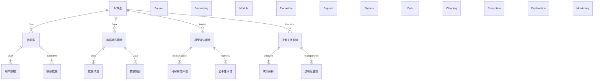

                 

### 第一部分：引言

#### 1.1 问题背景与意义

在当今快速变化的技术环境中，企业数字化转型已成为全球范围内的主流趋势。通过采用先进的数字技术，企业可以实现业务的自动化、智能化和高效化，从而提升竞争力。人工智能（AI）作为数字技术的重要组成部分，正在对各行各业产生深远的影响。

首先，全球企业纷纷加速数字化转型。根据Gartner的报告，到2023年，全球企业将有80%完成数字化转型，以应对市场变化和客户需求。在这一过程中，AI技术被广泛应用，从自动化生产线到智能客服系统，AI已经成为企业提升效率和创造价值的关键工具。

其次，AI技术的应用带来了新的治理挑战。随着AI技术在企业中的深入应用，隐私、伦理、责任等问题逐渐凸显。例如，AI系统如何保护用户隐私？在AI决策过程中如何确保公平性和透明性？这些问题的存在要求企业在数字化转型过程中必须重视AI治理。

本篇文章旨在探讨AI治理在企业数字化转型中的重要性。我们将首先介绍AI治理的定义和背景，然后详细分析企业数字化转型中AI治理的挑战和需求，接着提出一种通用的AI治理框架，并探讨其实践应用。文章还将讨论AI治理的相关法规政策，介绍一些成功的AI治理最佳实践，并提醒企业在实施AI治理过程中需要注意的事项。最后，我们将展望AI治理的未来发展趋势，并提出一些拓展阅读建议。

通过本篇文章，我们希望帮助读者深入了解AI治理在企业数字化转型中的关键作用，并为企业在AI治理实践提供有益的参考。

#### 1.2 问题描述

##### AI治理概念

AI治理是指通过制定和执行一系列政策和措施，确保人工智能技术的开发、应用和管理符合法律、伦理和商业要求的过程。其核心目的是确保AI技术的安全、可靠和公平应用，同时保护用户的隐私和权益。

AI治理的重要性体现在多个方面。首先，AI治理有助于防范技术风险。AI系统在处理大量数据时可能会出现偏差和错误，如果没有有效的治理机制，这些错误可能导致严重的后果。其次，AI治理有助于增强公众对AI技术的信任。透明、公正和负责任的AI应用能够减少用户对技术的疑虑，从而推动技术的广泛应用。此外，AI治理还有助于企业在合规方面保持领先地位，避免因违反相关法律法规而遭受罚款和声誉损失。

##### 企业数字化转型中的AI治理挑战

在企业数字化转型中，AI治理面临以下几大挑战：

1. **隐私保护**：AI系统通常需要处理大量个人数据，如何保护这些数据的隐私成为一大挑战。随着隐私保护法规（如欧盟的《通用数据保护条例》GDPR）的出台，企业必须在数据处理过程中严格遵守相关法律法规。

2. **伦理问题**：AI技术的应用可能会带来伦理争议，例如，AI算法在招聘、信贷审批等场景中的歧视问题。企业需要建立伦理审查机制，确保AI应用符合道德标准。

3. **责任归属**：在AI技术引发的问题中，责任归属往往不明确。例如，自动驾驶汽车发生事故时，责任应由制造商、软件开发商还是司机承担？这一问题需要通过法律和治理框架来明确。

4. **透明度**：AI系统的决策过程往往是不透明的，用户难以理解AI如何作出决策。缺乏透明度可能导致用户对AI系统的信任度下降，进而影响其应用效果。

5. **人才短缺**：AI治理需要专业的法律、伦理和技术人才，而企业往往缺乏这类人才，这限制了AI治理的推进。

##### AI治理框架

为了应对上述挑战，企业需要建立一套全面的AI治理框架。这个框架应包括以下关键组成部分：

1. **战略规划**：明确企业AI治理的目标和方向，制定长期的AI治理战略。

2. **组织结构**：建立专门的AI治理团队，负责制定和执行AI治理政策和措施。

3. **政策制定**：制定AI伦理准则、数据隐私政策和责任归属规则等，确保AI应用符合法律和伦理要求。

4. **风险管理**：建立AI风险管理体系，识别和评估AI技术的潜在风险，并制定相应的应对措施。

5. **合规性审查**：定期对AI应用进行合规性审查，确保其符合相关法律法规。

6. **透明度和沟通**：建立透明度机制，向用户和利益相关者解释AI技术的运作方式和决策过程。

##### 边界与外延

AI治理的范围不仅限于技术层面，还应涵盖法律、伦理和社会层面。在技术层面，AI治理涉及算法设计、数据处理和模型训练等。在法律层面，AI治理涉及数据保护、隐私权和责任归属等。在伦理层面，AI治理涉及公平性、透明性和社会责任等。在社会层面，AI治理还需考虑社会影响、公众参与和利益相关者沟通等。

通过上述框架，企业可以更好地应对数字化转型过程中的AI治理挑战，确保AI技术的安全、可靠和公平应用。

##### 概念结构与核心要素

在了解AI治理的概念和背景后，我们需要深入探讨其核心概念和构成要素，以便更好地理解AI治理在企业数字化转型中的具体应用和作用。

首先，AI伦理是AI治理的核心组成部分。AI伦理关注的是AI技术在应用过程中可能涉及的道德问题，包括隐私保护、数据安全、算法公平性、责任归属等。例如，在金融领域，AI算法用于信贷审批时，可能涉及对不同人群的歧视问题，这就需要通过AI伦理审查来确保算法的公平性。AI伦理不仅有助于防范技术风险，还能增强公众对AI技术的信任，从而推动AI的广泛应用。

其次，数据隐私是AI治理的重要方面。随着AI技术的应用，企业需要处理和分析大量个人数据，如何保护这些数据的隐私成为关键问题。数据隐私保护不仅涉及技术手段，还包括法律法规的遵守。例如，欧盟的《通用数据保护条例》（GDPR）规定了数据收集、处理和存储的严格规定，企业必须确保其AI系统符合这些规定，以避免潜在的法律风险。

AI透明度是另一个关键概念。透明度确保AI系统的决策过程公开、可解释，用户可以了解AI系统是如何作出决策的。透明度不仅有助于提高用户对AI技术的信任，还能帮助企业在合规方面保持领先地位。例如，在医疗领域，AI系统用于诊断疾病时，医生和患者需要了解AI系统的诊断依据和决策过程，以确保医疗决策的科学性和可靠性。

此外，AI治理还包括责任归属问题。在AI技术引发的问题中，责任归属往往不明确。例如，自动驾驶汽车发生事故时，责任可能涉及制造商、软件开发商和驾驶员等多个方面。通过建立明确的责任归属规则，企业可以更好地处理AI技术带来的风险和挑战。

最后，AI治理框架还需要涵盖政策制定、风险管理、合规性审查、透明度和沟通等多个方面。政策制定确保AI技术应用符合法律和伦理要求；风险管理帮助识别和应对AI技术的潜在风险；合规性审查确保AI应用符合相关法律法规；透明度和沟通则有助于增强用户对AI技术的信任。

总之，AI治理的核心概念和要素包括AI伦理、数据隐私、AI透明度、责任归属、政策制定、风险管理和合规性审查等。这些概念和要素共同构成了AI治理的框架，为企业数字化转型提供了重要的指导和保障。

#### 第2章 核心概念与联系

##### 2.1 AI伦理

AI伦理是指研究人工智能技术及其应用过程中可能涉及的道德问题和伦理挑战的学科。其核心目的是确保AI技术的设计、开发和应用符合人类社会的道德规范和价值观念。AI伦理的重要性在于，它能够引导AI技术的发展方向，防止技术滥用，保障用户权益，并增强公众对AI技术的信任。

AI伦理的核心概念包括：

1. **公平性**：AI算法应确保对所有人公平，避免歧视现象，例如在招聘、信贷审批等领域，确保算法不会因为性别、种族、年龄等因素对某些群体产生不公平的待遇。
   
2. **透明性**：AI系统的决策过程应该是透明的，用户能够理解和追踪AI系统的行为，避免“黑箱”现象，提高系统的可信度。

3. **责任归属**：在AI系统发生问题时，应明确责任归属，确保开发者、用户和其他相关方都能承担相应的责任。

4. **隐私保护**：AI系统在处理用户数据时应严格保护隐私，避免数据泄露和滥用。

AI伦理面临的挑战主要包括：

1. **算法偏见**：AI算法可能会基于历史数据中的偏见，导致对某些群体的不公平待遇。例如，某些AI招聘系统可能因为历史数据的偏见，对女性或少数族裔申请人不公平。

2. **透明性不足**：许多AI系统，如深度学习模型，其内部机制非常复杂，难以解释，导致用户难以理解其决策过程。

3. **责任归属不明确**：当AI系统出现错误或引发事故时，很难确定责任归属，特别是在涉及到多个利益相关方的情况下。

##### 2.2 数据隐私

数据隐私是指个人数据在收集、处理、存储和使用过程中的保密性和安全性。在AI技术广泛应用的时代，数据隐私问题变得尤为突出。AI系统通常需要处理大量的个人数据，例如医疗信息、金融记录等敏感数据，如何保护这些数据不受泄露和滥用是数据隐私的核心问题。

数据隐私的核心概念包括：

1. **匿名化**：通过删除或修改个人身份信息，使数据无法被识别为特定个体，从而保护个人隐私。

2. **加密**：使用加密技术保护数据在传输和存储过程中的安全性，防止未经授权的访问。

3. **访问控制**：通过设置访问权限，确保只有授权用户可以访问敏感数据。

4. **数据生命周期管理**：从数据收集、处理、存储到销毁的全过程，都应严格管理，确保数据在整个生命周期内受到保护。

数据隐私在AI治理中的应用主要体现在以下几个方面：

1. **合规性审查**：企业需确保其AI系统的数据处理过程符合相关隐私保护法规，如欧盟的《通用数据保护条例》（GDPR）。

2. **隐私设计**：在AI系统的设计阶段，应考虑隐私保护的需求，通过设计合理的数据处理流程和技术手段来确保数据隐私。

3. **隐私审计**：定期对AI系统的隐私保护措施进行审计，确保其有效性，并根据审计结果进行改进。

数据隐私面临的挑战包括：

1. **数据泄露风险**：AI系统处理的数据量庞大，一旦发生数据泄露，可能对个人隐私造成严重侵害。

2. **数据滥用风险**：某些AI系统可能被用于不当目的，例如进行个性化广告推送或进行商业间谍活动。

3. **技术复杂性**：随着AI技术的不断发展，数据隐私保护面临越来越复杂的技术挑战，如深度学习模型中的隐私泄露问题。

##### 2.3 AI透明度

AI透明度是指确保AI系统的决策过程公开、可解释，用户能够理解和追踪AI系统的行为。透明度在AI治理中扮演着至关重要的角色，它不仅有助于提高用户对AI技术的信任，还能帮助企业在合规方面保持领先地位。

AI透明度的核心概念包括：

1. **可解释性**：确保AI系统的决策过程能够被用户理解，用户可以追踪和验证AI系统的行为。

2. **模型可追溯性**：确保AI系统的训练数据、参数设置和决策逻辑等关键信息可以追溯，方便进行审查和评估。

3. **审计能力**：通过审计工具和方法，对AI系统的行为进行定期审查，确保其符合既定的标准和法规要求。

AI透明度的重要性体现在以下几个方面：

1. **增强用户信任**：透明度有助于增强用户对AI系统的信任，减少用户对技术的不确定性和恐惧。

2. **合规性要求**：许多国家和地区的法律法规要求AI系统具备一定的透明度，以确保其合法合规运行。

3. **技术改进**：通过透明度，开发者可以发现和修复AI系统中的缺陷，提高系统的整体性能和可靠性。

AI透明度面临的挑战包括：

1. **模型复杂性**：深度学习模型等复杂AI系统的内部机制难以解释，导致用户难以理解其决策过程。

2. **数据隐私冲突**：在某些情况下，提高透明度可能需要公开敏感数据，这与保护数据隐私之间存在冲突。

3. **资源消耗**：透明度工具和方法通常需要额外的计算资源和时间成本，这可能在资源有限的环境中造成不便。

##### 2.4 概念属性特征对比表格

为了更清晰地理解AI伦理、数据隐私和AI透明度这三个核心概念，我们可以通过表格形式对比它们的属性特征：

| 概念       | 定义                                                         | 核心属性特征                                                     | 主要应用场景                          |
|------------|--------------------------------------------------------------|----------------------------------------------------------------|-------------------------------------|
| AI伦理     | 研究AI技术及其应用过程中可能涉及的道德问题和伦理挑战           | 公平性、透明性、责任归属、隐私保护                             | 招聘、信贷审批、医疗诊断等           |
| 数据隐私   | 保护个人数据在收集、处理、存储和使用过程中的保密性和安全性       | 匿名化、加密、访问控制、数据生命周期管理                        | 电子商务、金融、医疗等行业          |
| AI透明度   | 确保AI系统的决策过程公开、可解释，用户能够理解和追踪AI系统的行为 | 可解释性、模型可追溯性、审计能力                               | 自动驾驶、金融风控、医疗诊断等       |

通过上述表格，我们可以看到这三个概念虽然有所不同，但它们在保障AI技术的安全、可靠和公平应用方面具有紧密的联系。

##### 2.5 ER实体关系图架构

为了更直观地展示AI治理相关的实体及其关系，我们可以使用Mermaid绘制一个实体关系图（ER图）。以下是一个简化的Mermaid代码示例，用于表示AI治理相关的关键实体及其关系：



当这段Mermaid代码在支持Mermaid的编辑器中渲染时，将生成如下ER图：

```
AI算法 ||--o{ 数据源 : Data Source
AI算法 ||--o{ 数据处理模块 : Data Processing Module
AI算法 ||--o{ 模型评估模块 : Model Evaluation Module
AI算法 ||--o{ 决策支持系统 : Decision Support System
数据源 ||--|{ 用户数据 : User Data
数据源 ||--|{ 敏感数据 : Sensitive Data
数据处理模块 ||--|{ 数据清洗 : Data Cleaning
数据处理模块 ||--|{ 数据加密 : Data Encryption
模型评估模块 ||--|{ 可解释性评估 : Explainability Evaluation
模型评估模块 ||--|{ 公平性评估 : Fairness Evaluation
决策支持系统 ||--|{ 决策解释 : Decision Explanation
决策支持系统 ||--|{ 透明度监控 : Transparency Monitoring
```

这个ER图展示了AI治理中的关键实体及其相互关系，包括AI算法、数据源、数据处理模块、模型评估模块和决策支持系统。每个实体都与其他实体存在明确的关联，从而构成了一个完整的AI治理体系。通过这种图形化的表示方法，我们可以更清晰地理解AI治理的核心组成部分及其相互关系。

### 第3章 AI治理框架与实践

#### 3.1 AI治理框架

为了有效管理人工智能在企业数字化转型中的风险和挑战，企业需要建立一套全面的AI治理框架。这个框架不仅包括政策、流程和工具，还应涵盖组织结构和文化建设。以下是AI治理框架的主要组成部分：

1. **战略规划**：企业首先需要明确AI治理的战略目标，包括提升效率、创造价值、防范风险等。战略规划应与企业的整体业务目标保持一致，并考虑长期发展。

2. **组织结构**：建立专门的AI治理团队，负责制定和执行AI治理政策和措施。这个团队应包括来自技术、法律、伦理和业务等多个领域的专家，以确保AI治理的全面性和专业性。

3. **政策制定**：制定AI伦理准则、数据隐私政策和责任归属规则等，确保AI应用符合法律和伦理要求。政策应明确规范AI系统的开发、部署、监控和退役过程。

4. **风险管理**：建立AI风险管理体系，识别和评估AI技术的潜在风险，并制定相应的应对措施。风险管理应覆盖AI系统的全生命周期，包括开发、测试、部署和运营阶段。

5. **合规性审查**：定期对AI应用进行合规性审查，确保其符合相关法律法规，如数据保护法、消费者保护法等。合规性审查应包括内部审计和第三方评估。

6. **透明度和沟通**：建立透明度机制，向用户和利益相关者解释AI技术的运作方式和决策过程。透明度应体现在AI系统的设计、开发和部署过程中，以及用户交互界面和报告文档中。

7. **培训与文化建设**：加强员工的AI治理培训，提高其对AI技术的理解和应用能力。同时，建设企业文化，强调AI伦理和责任，培养员工的责任感和职业道德。

#### 3.2 AI治理实践

在实际应用中，AI治理需要通过具体的实践来落实。以下是一些成功的AI治理实践案例，以及在这些实践过程中面临的挑战和经验。

**案例一：金融行业的AI治理**

某大型金融机构在其数字化转型过程中，建立了全面的AI治理框架。该框架包括：

1. **数据隐私保护**：在AI模型训练和预测过程中，金融机构采用了数据匿名化和加密技术，确保用户隐私不被泄露。

2. **伦理审查**：在AI模型开发前，金融机构建立了伦理审查委员会，对模型的设计和实施进行伦理评估，确保其公平性和透明性。

3. **责任归属**：在AI模型引发争议或错误时，金融机构明确了责任归属规则，确保责任得到有效承担。

**挑战与经验**：

- **数据隐私保护**：金融机构在数据匿名化和加密过程中面临技术挑战，如如何在保护隐私的同时，保证数据的可用性和准确性。
- **伦理审查**：伦理审查委员会在审查过程中需要平衡业务需求和伦理标准，确保模型的公平性和透明性。
- **责任归属**：明确责任归属规则有助于在发生问题时快速定位责任方，但需要法律和政策的支持。

**案例二：制造业的AI治理**

某制造业企业在其生产过程中引入了AI技术，用于优化生产流程和预测设备维护。其AI治理实践包括：

1. **风险管理**：企业在AI系统开发前，制定了详细的风险评估计划，识别潜在风险并制定应对措施。

2. **透明度**：企业通过可视化工具，向管理层和员工展示了AI系统的决策过程，提高了系统的透明度。

3. **培训**：企业对员工进行了AI技术培训，使其了解AI系统的运作原理和风险点。

**挑战与经验**：

- **风险管理**：企业在AI系统开发过程中，面临识别和评估潜在风险的技术挑战，如数据质量问题和模型泛化能力。
- **透明度**：提高系统透明度需要开发团队具备较强的技术能力，同时需要考虑透明度与业务效率之间的平衡。
- **培训**：有效培训员工需要耗费大量时间和资源，但这是确保AI系统有效运行和风险管理的关键。

**案例三：医疗行业的AI治理**

某医疗机构在其诊断和治疗过程中引入了AI技术，用于辅助医生进行疾病诊断和治疗方案推荐。其AI治理实践包括：

1. **合规性审查**：医疗机构定期对AI系统进行合规性审查，确保其符合医疗法规和伦理标准。

2. **患者隐私保护**：医疗机构采用了严格的隐私保护措施，确保患者数据不被泄露。

3. **持续改进**：医疗机构建立了持续改进机制，对AI系统进行定期评估和优化，以提高其准确性和可靠性。

**挑战与经验**：

- **合规性审查**：医疗行业的法规和政策相对复杂，医疗机构在合规性审查过程中需要深入了解相关法律法规，确保AI系统的合法性。
- **患者隐私保护**：在保护患者隐私的同时，医疗机构还需要确保AI系统的有效性和准确性，这需要平衡数据隐私和技术应用的需求。
- **持续改进**：AI系统在医疗应用中的持续改进需要依赖大量的数据和专业的医疗知识，这对医疗机构的数据管理和专业能力提出了较高要求。

通过这些实践案例，我们可以看到，AI治理在企业数字化转型中发挥着关键作用。有效的AI治理不仅能够降低风险，提高系统的可靠性和透明度，还能增强公众对AI技术的信任，推动AI技术的广泛应用。

#### 3.3 AI治理实施步骤

为了确保AI治理在企业数字化转型中的有效实施，企业需要遵循一系列明确的步骤。以下是一个典型的AI治理实施流程：

**1. 制定AI治理战略**

- **明确治理目标**：企业应明确AI治理的战略目标，如提升效率、增强透明度、保护隐私等。
- **制定治理框架**：根据企业实际情况，制定一套全面的AI治理框架，包括组织结构、政策制定、风险管理、合规性审查等。

**2. 建立组织结构**

- **成立AI治理委员会**：设立一个专门的AI治理委员会，负责制定和监督AI治理政策的实施。
- **明确角色和职责**：明确各相关方的角色和职责，如数据隐私官、伦理审查员、合规专员等。

**3. 制定AI治理政策**

- **制定AI伦理准则**：确保AI技术的开发和应用符合伦理标准，如公平性、透明性和责任归属。
- **制定数据隐私政策**：明确数据收集、处理、存储和使用的隐私保护措施。
- **制定责任归属规则**：在AI系统引发问题时，明确责任归属，确保责任得到有效承担。

**4. 风险管理与合规性审查**

- **识别和评估风险**：对AI系统进行全面的识别和评估，包括技术风险、合规风险和道德风险等。
- **制定风险管理计划**：针对识别出的风险，制定相应的风险管理计划，包括风险预防、风险监控和应急响应等。
- **合规性审查**：定期对AI系统进行合规性审查，确保其符合相关法律法规和行业标准。

**5. 培训与文化建设**

- **员工培训**：对员工进行AI治理培训，提高其对AI技术的理解和应用能力。
- **文化建设**：强调AI伦理和责任，培养员工的责任感和职业道德。

**6. 持续改进**

- **反馈机制**：建立反馈机制，收集员工和用户的意见和建议，不断改进AI治理政策和实践。
- **技术更新**：随着AI技术的不断发展，企业应定期更新AI治理框架和工具，确保其适应最新的技术趋势和法规要求。

通过上述步骤，企业可以确保AI治理在企业数字化转型中的有效实施，降低风险，提升系统的可靠性和透明度，增强公众对AI技术的信任。

#### 4.1 AI技术选型原则

在AI技术选型过程中，企业需要考虑多个关键因素，以确保所选技术能够满足业务需求并适应长期发展。以下是AI技术选型的几个基本原则：

1. **业务需求匹配**：首先，企业应明确AI技术的应用场景和业务目标，选择能够解决具体业务问题的技术。例如，在金融领域，企业可能需要选择具备风险管理能力的机器学习算法；在医疗领域，企业可能需要选择能够进行疾病诊断的深度学习模型。

2. **技术成熟度**：选择成熟的技术可以降低技术风险，确保技术方案的稳定性和可靠性。企业应评估所选技术的成熟度，包括其理论基础、算法实现、应用案例等。成熟的技术通常有更多的资源和支持，如开源社区、技术文档和专家团队。

3. **性能与效率**：AI技术的性能和效率直接影响业务效果。企业应评估所选技术在不同场景下的性能指标，如预测准确率、响应速度和计算资源消耗等。选择高性能和高效能的技术可以提升业务效率，降低运营成本。

4. **可扩展性和灵活性**：企业在选择AI技术时，应考虑其可扩展性和灵活性。可扩展性意味着技术可以随着业务规模的扩大而扩展；灵活性则意味着技术可以适应不同的业务需求和场景变化。具有良好可扩展性和灵活性的技术能够为企业提供更广阔的应用前景。

5. **成本效益**：企业在选择AI技术时，还需考虑成本效益。这包括技术采购成本、部署成本、维护成本等。选择具有成本效益的技术可以降低企业的总体拥有成本，提高投资回报率。

6. **合规性与安全性**：随着数据隐私和合规性法规的日益严格，企业应确保所选技术符合相关法律法规和行业标准。技术应具备良好的数据保护机制，能够确保数据安全和隐私保护。

7. **社区和生态支持**：选择有广泛社区和生态支持的技术可以为企业提供更多的资源和技术支持。社区和生态支持包括开源项目、技术论坛、技术文档、专业培训等。这些资源可以大大降低技术实施的难度和风险。

通过上述原则，企业可以确保所选AI技术能够满足业务需求，具备长期发展的潜力，并在实施过程中降低风险和成本。

#### 4.2 AI技术评估方法

为了确保AI技术在企业数字化转型中的有效应用，企业需要采用科学的方法对AI技术进行评估。以下是一些常用的AI技术评估方法：

1. **性能评估**：
   - **准确率**：评估模型在特定任务上的预测准确性，通常用于分类和回归任务。
   - **召回率**：评估模型在识别正例样本时的能力，特别是在医疗诊断和欺诈检测等应用中。
   - **F1分数**：结合准确率和召回率，平衡模型在正负样本识别中的表现。
   - **ROC曲线**：评估模型在不同阈值下的分类性能，通过AUC（面积下曲线）评估模型的整体性能。

2. **可解释性评估**：
   - **模型透明度**：评估模型是否易于理解和解释，例如使用决策树或线性回归模型，这些模型具有明确的决策逻辑。
   - **局部可解释性**：评估模型对单个样本的决策过程是否可解释，如LIME（Local Interpretable Model-agnostic Explanations）和SHAP（SHapley Additive exPlanations）等方法。

3. **鲁棒性评估**：
   - **数据噪声处理**：评估模型在处理含有噪声或异常值的数据时的性能，确保模型不会因数据质量问题而失效。
   - **泛化能力**：评估模型在未见过的数据集上的表现，确保模型具有较好的泛化能力，不会过拟合。

4. **安全性评估**：
   - **对抗性攻击**：评估模型对对抗性攻击的抵抗力，确保模型不会因恶意输入而失效。
   - **隐私保护**：评估模型在处理敏感数据时的隐私保护措施，确保数据不被泄露或滥用。

5. **成本效益评估**：
   - **计算资源消耗**：评估模型在训练和部署过程中的计算资源消耗，确保模型在现有硬件条件下能够运行。
   - **维护成本**：评估模型的维护成本，包括数据准备、模型更新和监控系统等。

6. **用户满意度**：
   - **用户反馈**：收集用户对AI系统性能和用户体验的反馈，确保系统满足用户需求。
   - **实际应用效果**：评估AI系统在实际业务场景中的效果，如提高效率、降低成本、提升用户满意度等。

通过上述评估方法，企业可以全面了解AI技术的性能、可解释性、鲁棒性、安全性和成本效益，从而做出明智的决策，确保所选AI技术能够满足业务需求并在实际应用中取得成功。

#### 4.3 数据管理策略

在AI技术选型和评估过程中，数据管理策略起着至关重要的作用。有效管理数据不仅能够提升AI模型的性能，还能确保数据的合规性和安全性。以下是一些关键的数据管理策略：

1. **数据收集**：
   - **多样化数据源**：从多个渠道收集数据，确保数据的多样性和全面性，提高模型的泛化能力。
   - **数据清洗**：对收集到的数据进行清洗和预处理，去除噪声、异常值和重复数据，提高数据质量。

2. **数据存储**：
   - **分布式存储**：采用分布式存储系统，如Hadoop或NoSQL数据库，确保大规模数据的高效存储和管理。
   - **数据加密**：对敏感数据进行加密，防止数据在存储和传输过程中被泄露。

3. **数据生命周期管理**：
   - **数据分类**：根据数据的重要性和敏感程度，对数据进行分类，制定不同的处理和保护策略。
   - **数据备份与恢复**：定期备份数据，确保数据在意外情况下能够快速恢复。
   - **数据归档**：对长期保存价值的数据进行归档，释放存储资源，同时确保数据的可访问性。

4. **数据质量控制**：
   - **数据质量评估**：建立数据质量评估机制，定期检查数据的完整性、准确性和一致性，确保数据质量。
   - **数据校验与监控**：采用数据校验工具和监控机制，及时发现和处理数据质量问题。

5. **数据安全**：
   - **权限管理**：采用严格的权限管理策略，确保只有授权人员可以访问和处理数据。
   - **访问日志记录**：记录数据访问日志，便于追踪数据访问和使用情况，及时发现潜在的安全威胁。
   - **数据泄露防护**：采用加密、防火墙、入侵检测系统等安全措施，防止数据泄露和滥用。

通过上述策略，企业可以确保数据在AI技术选型和评估过程中的高效、安全和合规管理，从而提高AI模型的性能和可靠性，为业务决策提供有力支持。

#### 4.4 AI模型部署与监控

在AI模型的应用过程中，模型的部署与监控是确保其稳定运行和性能的关键环节。以下是AI模型部署与监控的具体步骤和方法：

**1. 模型部署**

- **模型包装**：将训练好的AI模型转化为可部署的形式，如RESTful API、SDK或容器化模型。模型包装应考虑到性能、可扩展性和安全性等因素。
- **部署环境准备**：根据模型的需求，准备适合的部署环境，包括计算资源、存储和网络配置。对于高性能需求，可以选择云平台或分布式计算系统。
- **部署流程自动化**：采用自动化工具和脚本，实现模型部署的标准化和流程化，确保部署过程的效率和质量。
- **部署监控**：在部署过程中，实时监控部署进度和资源使用情况，确保部署过程顺利进行。

**2. 模型监控**

- **性能监控**：监控模型的预测性能，包括准确率、召回率、F1分数等指标。性能监控可以帮助发现模型是否过拟合或欠拟合，及时进行调整。
- **资源监控**：监控模型部署环境的资源使用情况，包括CPU、内存、磁盘I/O和网络带宽等。资源监控有助于确保模型在稳定的环境中运行，避免资源不足导致性能下降。
- **异常监控**：设置异常监控机制，及时发现模型异常情况，如预测结果偏差、数据泄露、计算错误等。异常监控可以通过日志分析、告警系统和自动化修复措施来实现。
- **数据质量监控**：监控输入数据的完整性和质量，确保数据不会对模型性能造成负面影响。数据质量监控可以通过数据清洗、数据校验和数据监控工具来实现。

**3. 模型更新与迭代**

- **模型更新**：随着业务需求和数据变化，定期更新AI模型，保持模型的性能和适用性。模型更新可以通过重新训练或微调现有模型来实现。
- **迭代优化**：根据监控数据和用户反馈，不断优化模型参数和算法，提升模型的预测准确性和用户体验。

通过上述步骤，企业可以确保AI模型在实际应用中的稳定运行和高效性能，为业务决策提供可靠支持。

#### 5.1 法规概述

在全球范围内，随着人工智能技术的迅猛发展，越来越多的国家和地区出台了相关法规和政策，以规范AI技术的开发和应用。这些法规和政策的出台，旨在确保AI技术的安全、透明和负责任的使用，保护用户的隐私和权益，同时也为企业提供了合规的指南和框架。

**1. 欧盟的《通用数据保护条例》（GDPR）**

GDPR是欧盟最具影响力的数据保护法规，于2018年5月25日正式生效。GDPR的核心目标是保护个人数据的安全和隐私，规范数据处理行为。GDPR要求企业在处理个人数据时必须遵循以下原则：

- **合法性、公正性和透明度**：数据处理必须基于合法、公正和透明的原则，企业应明确数据处理的依据和目的。
- **数据最小化**：仅收集和处理与目的相关的最少数据，不得过度收集。
- **数据质量**：确保数据的准确性、完整性和时效性。
- **数据保护**：采取适当的技术和管理措施保护数据安全，防止数据泄露、损坏或未授权访问。

**2. 美国的《加州消费者隐私法案》（CCPA）**

CCPA于2020年1月1日生效，旨在保护加州居民的隐私权。CCPA的主要内容包括：

- **知情权**：消费者有权知道其个人信息被收集、使用和共享的情况。
- **访问权**：消费者有权访问其个人信息的详细信息。
- **删除权**：消费者有权要求企业删除其个人信息。
- **禁止歧视**：企业不得因消费者行使隐私权而对其进行歧视。

**3. 中国的《个人信息保护法》（PIPL）**

PIPL于2021年11月1日正式实施，是中国首部个人信息保护方面的综合性法律。PIPL的主要内容包括：

- **个人信息处理原则**：个人信息处理应遵循合法、正当、必要的原则，并确保个人信息的保密性和安全性。
- **个人信息权利**：个人对其个人信息享有访问、更正、删除、撤回同意等权利。
- **数据处理规则**：企业在收集、使用、存储和传输个人信息时，应遵守一系列规则，如告知义务、安全措施、跨境数据转移限制等。

**4. 日本的《个人信息保护法》（APPI）**

APPI于2005年实施，是日本关于个人信息保护的基本法律。APPI要求企业在处理个人信息时必须：

- **取得同意**：在处理个人信息前，必须获得个人的明确同意。
- **安全措施**：采取适当的技术和管理措施，确保个人信息的安全。
- **透明性**：确保个人信息处理过程的透明度，使个人能够了解其个人信息如何被处理。

**法规对企业的影响**

这些法规和政策的出台，对企业产生了深远的影响：

- **合规成本增加**：企业需要投入大量资源进行合规性审查和调整，以符合相关法律法规的要求。
- **数据处理策略调整**：企业需要重新审视其数据处理策略，确保在收集、存储和使用个人信息时遵守法规要求。
- **数据保护措施加强**：企业需要采取更加严格的数据保护措施，如数据加密、访问控制等，以防止数据泄露和滥用。
- **用户信任增强**：合规的AI应用能够提高用户对企业的信任，促进用户参与和业务增长。
- **全球业务拓展限制**：企业在进行全球业务拓展时，需要遵守不同国家和地区的法规要求，这可能会增加合规成本和业务复杂性。

总之，随着AI技术的不断发展，相关法规和政策也将不断完善和更新。企业必须密切关注法规动态，及时调整其AI治理策略，确保在合规的基础上实现技术价值的最大化。

#### 5.2 政策引导

政策在推动AI治理中起到了至关重要的作用。政府通过制定和实施一系列政策，不仅为企业的AI治理提供了法律和伦理框架，还推动了AI技术的健康发展。以下是政策在AI治理中的引导作用及其发展趋势：

**1. 政策引导作用**

- **规范AI技术应用**：政府通过法律法规和政策文件，规范AI技术的开发、部署和应用，确保其符合法律和伦理要求。例如，制定数据隐私保护法规、伦理审查标准等，帮助企业建立合规的AI治理体系。

- **促进技术发展**：政府通过资金支持、项目立项和技术标准制定等方式，鼓励企业进行AI技术研究和创新。这有助于提高企业对AI技术的理解和应用能力，推动技术的快速发展和应用。

- **提升公众信任**：政策引导有助于增强公众对AI技术的信任，通过透明的AI治理机制，提高AI系统的透明度和可解释性，减少用户对技术的不确定性和恐惧。

- **加强国际合作**：政府通过参与国际组织和多边合作，推动全球范围内的AI治理标准制定，促进国际间的数据流通和技术合作，共同应对AI技术带来的挑战。

**2. 政策趋势与发展**

- **数据隐私保护加强**：随着数据隐私保护意识的提高，政府将在未来进一步加强对数据隐私的保护。这包括制定更加严格的数据保护法规，加强对数据处理行为的监管，提高企业对数据隐私保护的责任。

- **伦理审查制度化**：政府将推动AI伦理审查的制度化，建立独立的AI伦理审查机构，确保AI技术的应用符合伦理标准。这有助于防范AI技术可能带来的伦理风险和社会负面影响。

- **标准化和规范化**：政府将推动AI技术的标准化和规范化，制定统一的技术标准和操作规范，提高AI系统的可靠性和互操作性，减少技术壁垒和兼容性问题。

- **跨界合作**：政府将鼓励不同领域的企业、研究机构和政府机构之间的跨界合作，共同推动AI治理的研究和实践，形成合力，应对复杂的AI治理挑战。

- **持续监管与评估**：政府将加强对AI技术的持续监管与评估，通过定期审查和评估，确保AI技术的应用符合政策要求，及时发现和解决潜在问题，保障AI技术的安全、可靠和公平应用。

总之，政策在推动AI治理中起到了关键的引导作用，通过制定和实施一系列政策，政府不仅为企业提供了合规的指导，还推动了AI技术的健康发展。未来，随着AI技术的不断进步和政策的不断完善，AI治理将在全球范围内得到更加广泛的关注和实施。

#### 6.1 最佳实践案例

在AI治理领域，企业通过实施一系列最佳实践，不仅有效地解决了AI技术应用中的挑战，还取得了显著的业务成果。以下是一些成功的AI治理最佳实践案例，以及这些实践的主要经验和教训。

**案例一：某金融科技公司的AI治理实践**

某金融科技公司在其数字化转型过程中，建立了全面的AI治理框架，确保AI技术的安全、可靠和合规应用。以下是其主要实践经验和教训：

- **经验**：
  - **建立AI伦理委员会**：公司成立了AI伦理委员会，负责评估和监督AI系统的开发和应用，确保其符合伦理标准。
  - **数据隐私保护**：公司采用了严格的数据隐私保护措施，如数据匿名化和加密技术，确保用户数据的安全。
  - **透明度建设**：公司通过可视化工具和用户界面，向用户解释AI系统的决策过程，提高了系统的透明度和用户信任。

- **教训**：
  - **初期投入较大**：建立AI伦理委员会和透明度机制需要较大的初始投入，企业应提前规划预算。
  - **合规风险**：在实施AI治理过程中，公司面临严格的合规要求，如数据隐私保护法规和金融监管规定，需要不断进行合规性审查。

**案例二：某制造业企业的AI治理实践**

某制造业企业在其生产过程中引入了AI技术，用于优化生产流程和设备维护。以下是其主要实践经验和教训：

- **经验**：
  - **风险管理**：企业在AI系统开发前，制定了详细的风险管理计划，识别和评估潜在风险，并制定相应的应对措施。
  - **员工培训**：企业对员工进行了全面的AI技术培训，使其了解AI系统的运作原理和风险管理。
  - **数据质量管理**：企业建立了数据质量管理机制，定期检查和清洗数据，确保数据质量，提高AI模型的性能。

- **教训**：
  - **技术复杂性**：AI系统的开发涉及复杂的技术问题，企业需要投入大量资源进行技术研发和人才引进。
  - **数据依赖性**：AI系统的性能高度依赖数据质量，企业需确保数据来源的多样性和准确性。

**案例三：某医疗机构的AI治理实践**

某医疗机构在其诊断和治疗过程中引入了AI技术，用于辅助医生进行疾病诊断和治疗方案推荐。以下是其主要实践经验和教训：

- **经验**：
  - **合规性审查**：医疗机构定期对AI系统进行合规性审查，确保其符合医疗法规和伦理标准。
  - **患者隐私保护**：医疗机构采用了严格的隐私保护措施，确保患者数据不被泄露。
  - **持续改进**：医疗机构建立了持续改进机制，对AI系统进行定期评估和优化，以提高其准确性和可靠性。

- **教训**：
  - **技术挑战**：AI系统在医疗应用中的技术挑战较大，如数据的多样性和不一致性，需要专业的技术团队支持。
  - **用户接受度**：AI系统在医疗领域应用时，需要考虑用户接受度，通过用户培训和反馈机制，提高用户对系统的信任。

通过这些最佳实践案例，我们可以看到，AI治理在企业数字化转型中起到了关键作用。成功的AI治理不仅能够降低技术风险，提高系统的可靠性和透明度，还能增强公众对AI技术的信任，推动AI技术的广泛应用。企业在实施AI治理时，需要结合自身实际情况，借鉴这些最佳实践，制定合适的治理策略，确保AI技术在企业中的有效应用。

#### 6.2 小结

通过本文的详细探讨，我们可以清晰地看到AI治理在企业数字化转型中的重要性。首先，AI治理为企业提供了一个系统化的框架，以应对数字化转型过程中面临的隐私、伦理和责任等复杂挑战。有效的AI治理不仅有助于防范技术风险，增强公众对AI技术的信任，还能提升企业在合规方面的竞争力。

本文介绍了AI治理的核心概念，如AI伦理、数据隐私和AI透明度，并通过对比表格和ER图结构，深入分析了这些概念的核心属性特征和相互关系。接着，我们讨论了AI治理框架的组成部分，包括战略规划、组织结构、政策制定、风险管理、合规性审查和透明度建设。通过具体的实践案例，我们看到了企业在实施AI治理时的成功经验和面临的挑战。

此外，本文还分析了AI技术选型的原则和评估方法，强调了数据管理策略在AI技术选型和评估中的重要性。同时，我们对AI模型的部署与监控进行了详细讨论，并探讨了全球范围内与AI治理相关的法规和政策，展示了政策在推动AI治理中的引导作用。

最后，通过总结AI治理的最佳实践案例，我们强调了AI治理在企业数字化转型中的关键作用，并提醒企业在实施AI治理时需要注意的挑战和误区。

总的来说，AI治理不仅是企业数字化转型的重要组成部分，也是实现技术价值最大化和社会责任的重要保障。未来，随着AI技术的不断进步和应用的深入，AI治理将发挥更加重要的作用，为企业和社会带来更多的机遇和挑战。

#### 6.3 未来展望

展望未来，AI治理将在企业数字化转型中扮演更加重要的角色。随着人工智能技术的不断进步，其应用场景将变得更加广泛和深入，涵盖医疗、金融、制造、交通等多个行业。这不仅为企业带来了巨大的商机，也带来了新的治理挑战。

首先，AI技术的复杂性和多样性将使AI治理的要求更加严格。企业需要建立更加完善和动态的治理框架，以应对不断变化的技术环境。例如，随着深度学习和生成对抗网络（GAN）等新兴技术的应用，AI系统的透明度和可解释性将变得更加重要，企业需要开发新的工具和方法来提高AI系统的透明度。

其次，数据隐私保护将继续是AI治理的核心议题。随着数据隐私法规的不断完善，企业必须在数据处理和存储过程中严格遵守相关法律法规，同时提高数据保护的技术水平。这包括采用更先进的数据加密技术、隐私增强技术（PETs）以及联邦学习等新兴技术，以在保护用户隐私的同时，充分发挥数据的价值。

第三，AI伦理和责任问题将更加突出。随着AI技术在决策支持、自动化控制等领域的应用，伦理和责任问题将变得尤为关键。企业需要建立独立的AI伦理委员会，制定明确的AI伦理准则，确保AI技术的应用符合道德标准，减少歧视和偏见，增强公众对AI技术的信任。

此外，随着全球化和数字化进程的加速，AI治理将面临更多的跨国挑战。企业需要在不同的国家和地区遵守不同的法律法规，这要求企业在制定AI治理策略时，具备全球视野和灵活性。同时，国际合作和标准统一也将成为未来AI治理的重要方向，通过跨国合作和标准制定，共同应对AI技术带来的全球性挑战。

最后，AI治理需要与业务战略紧密融合。未来，企业将更加注重AI治理与业务目标和战略的协调，将AI治理纳入企业的核心业务流程，确保AI技术的应用不仅能够提升效率，还能创造实际的业务价值。

总之，未来AI治理将在企业数字化转型中发挥更加重要的作用。企业需要持续关注AI技术的最新发展，不断完善和优化AI治理框架，确保AI技术在合规、透明和负责任的基础上，为企业和社会带来持续的变革和创新。

#### 7.1 注意事项

在实施AI治理的过程中，企业可能会面临一些挑战和误区，以下是一些值得注意的问题：

1. **技术复杂性**：AI技术本身具有较高的复杂性，企业在实施AI治理时，可能会遇到技术难题，如算法的透明度和可解释性、数据隐私保护等。企业需要投入足够的资源进行技术研发和人才引进。

2. **初期成本投入**：建立AI治理体系需要大量的人力、物力和财力投入，包括设立专门的AI治理团队、购买相关软件工具、进行员工培训等。企业应在预算和资源规划中充分考虑这些成本。

3. **合规风险**：不同国家和地区的法律法规对AI治理有不同的要求，企业需要确保其AI治理策略符合当地的法律法规，如数据隐私保护法规、伦理审查标准等。合规风险可能导致法律纠纷和罚款。

4. **数据隐私保护**：AI系统通常需要处理大量的个人数据，如何保护这些数据的隐私是AI治理的一个重要挑战。企业需要采用严格的数据保护措施，如数据加密、匿名化和访问控制，以防止数据泄露和滥用。

5. **用户信任**：提高AI系统的透明度和可解释性，有助于增强用户对AI技术的信任。企业应在设计和开发AI系统时，充分考虑用户的需求和反馈，确保系统的决策过程公开、透明。

6. **持续改进**：AI治理是一个动态的过程，企业需要定期评估和改进其AI治理策略，以应对技术发展和业务环境的变化。持续改进有助于确保AI系统的可靠性和有效性。

7. **人才短缺**：AI治理需要跨领域的专业人才，包括数据科学家、法律专家、伦理学家等。企业可能面临人才短缺的挑战，需要通过培训、引进等方式，提高团队的整体能力。

通过注意以上事项，企业可以更有效地实施AI治理，降低风险，确保AI技术在合规、透明和负责任的基础上为企业创造价值。

#### 7.2 拓展阅读

为了深入了解AI治理在企业数字化转型中的应用和实践，以下是一些推荐阅读材料：

1. **书籍**：
   - 《AI伦理学：设计人类中心的未来》作者：蒂姆·奥莱利（Tim O'Reilly）
   - 《数据隐私：理论与实践》作者：彼得·斯皮尔曼（Peter Swire）
   - 《AI治理：全球趋势与挑战》作者：马修·凯瑟（Matthew C. Katz）

2. **学术论文**：
   - “The Importance of Ethical AI Governance”作者：Ahmed, E., & Wu, Y.
   - “Data Privacy Protection in AI Systems”作者：Ng, A. Y., & Mitchell, T.
   - “AI Governance: Challenges and Opportunities”作者：Fox, J., & Rogers, M.

3. **行业报告**：
   - Gartner报告：《2022年AI治理最佳实践》
   - PwC报告：《全球AI治理现状与趋势》
   - McKinsey报告：《AI治理：推动数字化转型》

4. **在线资源**：
   - 欧盟委员会网站：关于GDPR和AI治理的最新政策动态
   - 国际数据公司（IDC）网站：关于AI治理的行业洞察和分析
   - AI Ethics Institute：提供AI伦理和治理的免费资源和案例研究

通过阅读这些材料，读者可以更全面地了解AI治理的核心概念、实践案例和未来发展趋势，为企业在数字化转型中的AI治理提供有益的参考和指导。作者：AI天才研究院/AI Genius Institute & 禅与计算机程序设计艺术 /Zen And The Art of Computer Programming。

