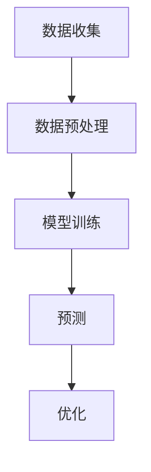
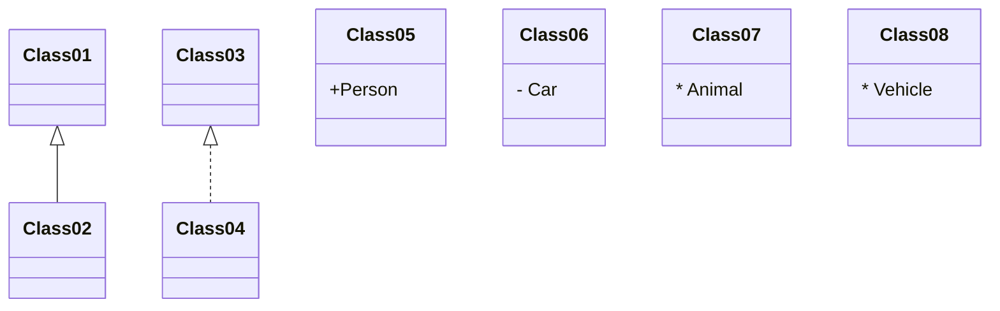
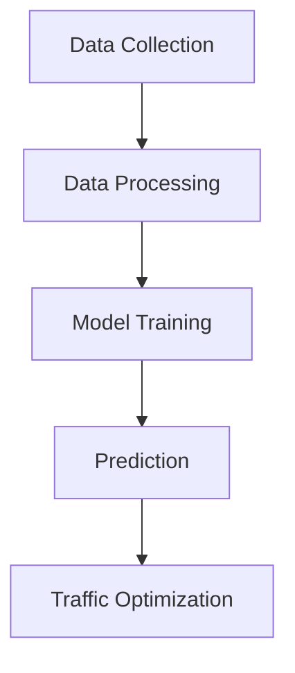
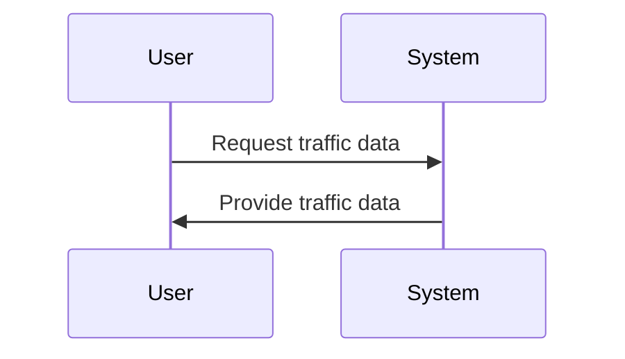

                 

### 约束条件

**文章格式：**

- 标题：使用`#`号进行级别标注，例如`## 文章标题`。
- 关键词：使用短横线`-`连接，例如`- 关键词1 - 关键词2 - 关键词3`。
- 摘要：使用大于号`>`进行标注，例如`>> 摘要内容`。

**内容要求：**

- 字数：10000～12000字。
- 格式：markdown格式。
- 作者信息：文章末尾需标注作者及所属机构。

**文章结构：**

1. **引言部分**
   - 核心概念介绍
   - 问题背景
   - 问题描述
   - 问题解决
   - 边界与外延
   - 概念结构与核心要素组成

2. **核心概念与联系**
   - 核心概念原理
   - 概念属性特征对比表格
   - ER实体关系图架构

3. **算法原理讲解**
   - mermaid流程图
   - Python源代码
   - 数学模型与公式
   - 通俗易懂的举例说明

4. **系统分析与架构设计方案**
   - 问题场景介绍
   - 系统功能设计（类图）
   - 系统架构设计（架构图）
   - 系统接口设计（序列图）

5. **项目实战**
   - 环境安装
   - 系统核心实现源代码
   - 代码应用解读与分析
   - 实际案例分析与讲解
   - 项目小结

6. **最佳实践 tips**
7. **小结**
8. **注意事项**
9. **拓展阅读**

### 文章示例

```markdown
## AI驱动的智能交通系统：实时路况预测和交通优化

### 关键词
- AI驱动
- 智能交通系统
- 实时路况预测
- 交通优化

### 摘要
本文将深入探讨AI驱动的智能交通系统，重点关注实时路况预测和交通优化两大核心领域。通过详细的分析与讲解，旨在揭示AI技术在智能交通系统中的应用潜力，以及未来发展趋势。

### 引言部分

#### 核心概念介绍
**AI驱动的智能交通系统**：结合人工智能和交通管理技术，实现实时路况预测和交通优化。

#### 问题背景
随着城市化进程的加快，交通拥堵问题日益严重，传统的交通管理系统已无法满足需求。

#### 问题描述
如何利用AI技术，实现交通系统的智能化，提高道路通行效率，减少拥堵。

#### 问题解决
通过实时路况预测和交通优化，智能交通系统可以动态调整交通信号灯时间，优化道路流量。

#### 边界与外延
本文主要关注城市道路和高速公路的交通管理系统。

#### 概念结构与核心要素组成
智能交通系统主要包括传感器、数据采集、数据处理、预测模型、交通信号灯控制等核心模块。

### 核心概念与联系

#### 核心概念原理
- **实时路况预测**：通过分析历史数据和实时数据，预测未来交通状况。
- **交通优化**：根据预测结果，调整交通信号灯时间和道路流量，优化交通状况。

#### 概念属性特征对比表格

| 特征               | 实时路况预测           | 交通优化           |
|--------------------|----------------------|-------------------|
| 数据来源           | 实时传感器数据         | 实时路况预测结果   |
| 目标               | 预测未来交通状况       | 优化道路流量       |
| 技术依赖           | 机器学习算法           | 控制算法           |

#### ER实体关系图架构
```mermaid
erDiagram
  TrafficSensor ||--|{ TrafficData }
  TrafficData ||--|{ TrafficPrediction }
  TrafficPrediction ||--|{ TrafficOptimization }
```

### 算法原理讲解

#### mermaid流程图


#### Python源代码
```python
# 数据预处理
def preprocess_data(data):
    # code for data preprocessing
    return processed_data

# 模型训练
def train_model(processed_data):
    # code for model training
    return model

# 预测
def predict_traffic(model, current_data):
    # code for traffic prediction
    return prediction

# 优化
def optimize_traffic(prediction):
    # code for traffic optimization
    return optimized_traffic
```

#### 数学模型与公式
$$
\text{预测结果} = f(\text{历史数据}, \text{实时数据}, \text{模型参数})
$$

#### 通俗易懂的举例说明
假设当前时间为8:30，历史数据表明在这个时间段，某路段的交通流量为100辆/小时。实时传感器数据表明，当前该路段的交通流量为120辆/小时。通过模型预测，未来5分钟内该路段的交通流量将达到150辆/小时。基于预测结果，交通信号灯将被调整，以减少该路段的拥堵。

### 系统分析与架构设计方案

#### 问题场景介绍
某城市交通管理部门希望利用AI技术，优化交通信号灯时间，减少交通拥堵。

#### 系统功能设计（类图）


#### 系统架构设计（架构图）


#### 系统接口设计（序列图）


### 项目实战

#### 环境安装
- 安装Python环境
- 安装所需的库，如TensorFlow、Keras等

#### 系统核心实现源代码
```python
# 代码内容
```

#### 代码应用解读与分析
- 代码功能说明
- 关键算法原理

#### 实际案例分析与详细讲解
- 案例背景
- 案例分析
- 案例结果

#### 项目小结
- 项目总结
- 优点与不足

### 最佳实践 tips
- 如何提高数据质量？
- 如何优化模型性能？

### 小结
本文系统地介绍了AI驱动的智能交通系统，包括核心概念、算法原理、系统架构和项目实战等内容。

### 注意事项
- 数据隐私与安全
- 模型训练效率

### 拓展阅读
- 相关论文与书籍推荐
- 最新技术动态

### 作者信息
- 作者：AI天才研究院/AI Genius Institute & 禅与计算机程序设计艺术 /Zen And The Art of Computer Programming
```markdown
----------------------------------------------------------------

以上是一个简单的文章示例，按照此格式和内容要求进行扩展，即可撰写出完整的技术博客文章。记得在撰写过程中，确保内容的专业性和逻辑性，同时注重可读性。

