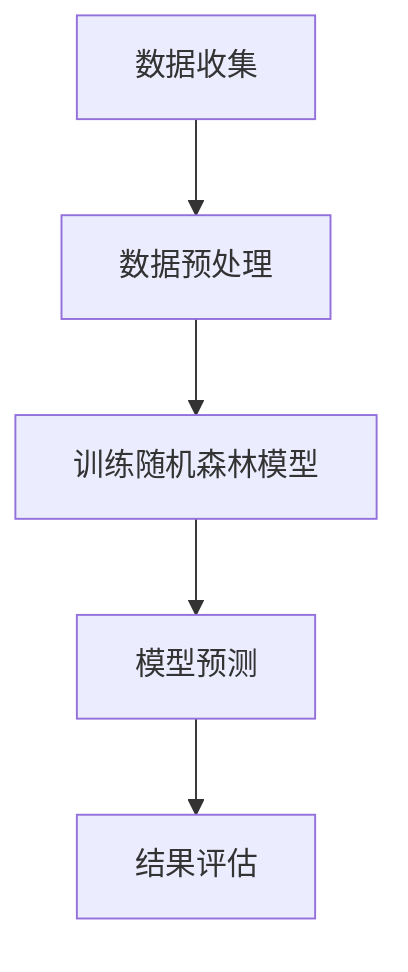
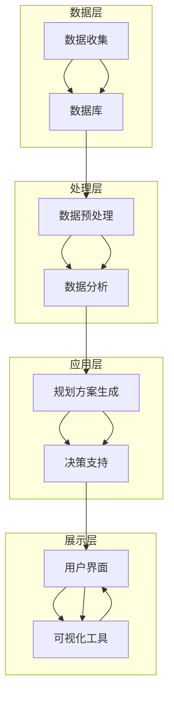
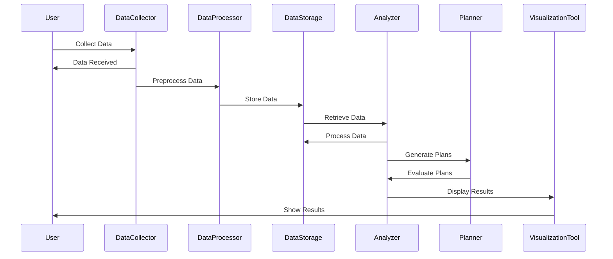

                 

### 背景介绍

随着全球城市化进程的加速，城市面临着诸多前所未有的挑战。首先，人口增长和城市扩张导致了交通拥堵问题。大量的人口集中使得城市交通系统负荷加剧，导致通勤时间延长、交通事故频发。此外，资源浪费也是一个严峻的问题。城市规划过程中，土地、能源和水资源的分配不合理，导致资源利用率低下，环境负担加重。城市中不同区域的商业、居住、工业等功能布局不协调，进一步加剧了资源浪费。

这些问题的存在严重影响了城市居民的生活质量，也制约了城市运行的高效性和可持续发展。传统的城市规划方法通常依赖于经验和直觉，难以科学、准确地预测和解决复杂的城市问题。因此，如何优化城市布局和资源分配，提高城市运行效率，成为了当务之急。

近年来，人工智能（AI）技术的迅速发展为智能城市规划提供了新的契机。AI技术，尤其是机器学习和深度学习，具有强大的数据处理和分析能力，能够从海量城市数据中挖掘出有价值的信息，为城市规划提供科学的依据。通过AI技术，可以实现以下目标：

1. **数据挖掘与分析**：AI技术可以收集、整理和分析大量的城市数据，包括交通流量、土地利用、能源消耗等，从而揭示城市运行中的问题和潜在改进空间。

2. **智能决策支持**：基于AI算法的智能规划系统能够模拟不同的城市规划方案，评估其对社会经济和环境的影响，为决策者提供科学的决策支持。

3. **动态调整与优化**：AI系统可以实时监测城市运行状态，通过机器学习算法不断优化城市规划方案，以适应城市发展的动态需求。

4. **增强城市服务**：AI技术可以应用于智慧交通、智慧能源管理、智慧环保等领域，提升城市服务的质量和效率。

因此，AI驱动的智能城市规划成为解决传统城市规划难题的重要手段。它不仅能够提高城市运行效率，降低资源浪费，还能够提升居民生活质量，实现城市的可持续发展。接下来，本文将深入探讨AI驱动的智能城市规划原理、算法应用、系统架构以及项目实战，展示其在实际应用中的效果和潜力。

### 核心概念与联系

要深入探讨AI驱动的智能城市规划，我们首先需要理解其核心概念原理。AI驱动的智能城市规划主要依赖于以下技术原理：

**1. 机器学习与深度学习**：机器学习和深度学习是AI技术的核心组成部分。它们能够通过学习大量的数据，识别出数据中的规律和模式，从而进行预测和决策。在城市规划中，这些技术可以用来分析城市交通流量、土地利用、能源消耗等数据，预测未来的发展趋势，并为城市规划提供科学依据。

**2. 数据挖掘**：数据挖掘是AI技术在智能城市规划中的另一个重要应用。它通过复杂的算法从海量城市数据中提取有价值的信息，帮助城市规划师了解城市运行的现状和潜在问题。数据挖掘技术能够识别出隐藏在城市数据中的规律，从而为城市规划提供决策支持。

**3. 优化算法**：优化算法是解决城市规划中资源分配问题的关键。通过优化算法，可以找到最优的资源配置方案，使得城市资源利用效率最大化。例如，遗传算法、蚁群算法等，都是常用的优化算法，可以在城市交通、能源等领域应用。

为了更直观地理解AI驱动的智能城市规划方法，我们可以通过一个对比表格来展示传统城市规划方法和AI驱动智能城市规划方法的特点：

| 特点          | 传统城市规划方法                               | AI驱动的智能城市规划方法                               |
| ------------- | ------------------------------------------ | -------------------------------------------------- |
| 基于经验与直觉 | 主要依赖专家经验和历史数据来制定规划方案       | 利用机器学习、深度学习和数据挖掘技术，从数据中提取有价值的信息 |
| 灵活性与适应性 | 规划方案一旦制定，很难适应快速变化的城市需求   | 可以通过不断学习和调整，适应城市发展的动态需求             |
| 数据依赖性    | 数据来源相对有限，主要依赖历史数据和经验数据   | 可以处理和整合大量的实时数据，提高规划的科学性和准确性   |
| 可视化与模拟  | 规划方案的可视化和模拟能力有限               | 利用可视化技术和模拟模型，可以更直观地展示规划效果和影响   |
| 优化能力      | 优化能力有限，难以找到最优的资源配置方案       | 应用优化算法，找到最优的资源配置方案，提高资源利用效率     |

通过以上对比，我们可以看出，AI驱动的智能城市规划方法具有更高的灵活性和适应性，能够更好地处理和利用大量数据，为城市规划提供科学的决策支持。

接下来，我们可以用Mermaid绘制一个ER实体关系图架构，展示城市规划中的主要实体及其相互关系：

```mermaid
erDiagram
  User ||--|{ Building } : "resides in"
  Building ||--|{ TrafficFlow } : "generated by"
  TrafficFlow ||--|{ RoadNetwork } : "flows through"
  RoadNetwork ||--|{ Vehicle } : "driven by"
  Building ||--|{ UtilityConsumption } : "consumes"
  UtilityConsumption ||--|{ EnergySource } : "produced by"
```

在上述ER实体关系图中，用户（User）居住在建筑物（Building）中，建筑物产生交通流量（TrafficFlow），交通流量通过道路网络（RoadNetwork），车辆（Vehicle）在道路上行驶。同时，建筑物消耗各种公共资源（UtilityConsumption），这些资源由能源来源（EnergySource）提供。通过这个图，我们可以清晰地看到城市规划中各个实体之间的关系，为后续的算法应用和系统设计提供了基础。

### 算法原理讲解

在AI驱动的智能城市规划中，算法的应用是核心环节。为了更好地理解这些算法的原理和应用，我们将逐步介绍一个典型的AI算法在城市规划中的流程，并提供相关的Python实现代码，以及数学模型和公式的解析。

#### 算法流程

我们选取一种广泛应用于城市规划中的机器学习算法——随机森林（Random Forest），来展示其流程。随机森林是一种集成学习方法，通过构建多棵决策树并汇总其预测结果，以降低预测误差。

**算法mermaid流程图：**



**Python源代码：**

```python
import pandas as pd
from sklearn.ensemble import RandomForestRegressor
from sklearn.model_selection import train_test_split
from sklearn.metrics import mean_squared_error

# 数据收集
data = pd.read_csv('city_data.csv')

# 数据预处理
X = data.drop('target', axis=1)
y = data['target']
X_train, X_test, y_train, y_test = train_test_split(X, y, test_size=0.2, random_state=42)

# 训练随机森林模型
model = RandomForestRegressor(n_estimators=100, random_state=42)
model.fit(X_train, y_train)

# 模型预测
y_pred = model.predict(X_test)

# 结果评估
mse = mean_squared_error(y_test, y_pred)
print(f'Mean Squared Error: {mse}')
```

**算法原理的数学模型和公式：**

随机森林模型的预测基于决策树的组合。对于每个样本，随机森林会多次从特征空间中随机选择一个子集，并在该子集上训练决策树。具体来说，随机森林的预测过程可以表示为：

$$
\hat{y} = \frac{1}{M} \sum_{m=1}^{M} \hat{y}_m
$$

其中，$\hat{y}$ 是最终预测结果，$M$ 是决策树的个数，$\hat{y}_m$ 是第 $m$ 棵决策树的预测结果。

对于单个决策树的预测，可以使用分类回归树（CART）的决策规则，即：

$$
\hat{y}_m = \sum_{i=1}^{n} w_{im} x_i
$$

其中，$w_{im}$ 是第 $m$ 棵树在第 $i$ 个节点上的权重，$x_i$ 是特征值。

**详细讲解和举例说明：**

为了更直观地理解随机森林算法在城市规划中的应用，我们可以通过一个具体案例进行讲解。

**案例：城市交通流量预测**

假设我们要预测某城市主要干道的未来一小时交通流量。我们收集了以下数据：

- **历史交通流量数据**：包括过去一年的每日每小时交通流量数据。
- **相关特征数据**：包括天气状况、节假日信息、前一小时交通流量等。

**步骤1：数据收集与预处理**

```python
data = pd.read_csv('traffic_data.csv')
X = data[['weather', 'previous_hour_traffic', 'holiday']]
y = data['hourly_traffic']
```

**步骤2：数据分割**

```python
X_train, X_test, y_train, y_test = train_test_split(X, y, test_size=0.2, random_state=42)
```

**步骤3：训练随机森林模型**

```python
model = RandomForestRegressor(n_estimators=100, random_state=42)
model.fit(X_train, y_train)
```

**步骤4：模型预测与评估**

```python
y_pred = model.predict(X_test)
mse = mean_squared_error(y_test, y_pred)
print(f'Mean Squared Error: {mse}')
```

假设我们训练的随机森林模型在测试集上的均方误差为0.5，这意味着我们的预测精度较高，能够较好地预测未来的交通流量。

通过上述步骤，我们可以看到随机森林算法在交通流量预测中的应用。实际上，随机森林算法还可以应用于其他城市规划问题，如土地利用分析、能源消耗预测等。它的多树集成和决策树的基本原理使得它具有强大的预测能力和适应性，能够为城市规划提供有力的支持。

### 系统分析与架构设计方案

为了更好地理解AI驱动的智能城市规划系统，我们将详细分析其系统架构设计，包括问题场景介绍、系统功能设计、系统架构设计、系统接口设计和系统交互。

#### 问题场景介绍

在城市规划中，常见的问题包括交通拥堵、土地利用不合理、能源消耗过高等。这些问题直接影响城市居民的生活质量和城市的可持续发展。传统的城市规划方法往往依赖人工经验和历史数据，难以实时动态地应对城市变化。因此，我们需要一个智能化的城市规划系统，能够实时收集和分析城市数据，提供科学的决策支持。

#### 系统功能设计

智能城市规划系统的核心功能包括数据收集、数据预处理、数据分析和规划方案生成。具体来说：

1. **数据收集**：系统需要收集多种城市数据，包括交通流量、土地利用、能源消耗、环境质量等。这些数据可以通过传感器、政府部门、互联网等渠道获取。

2. **数据预处理**：收集到的数据需要进行清洗、去重、标准化等预处理操作，以便后续分析使用。

3. **数据分析**：利用机器学习和深度学习算法，对预处理后的数据进行挖掘和分析，识别出城市运行中的问题和趋势。

4. **规划方案生成**：根据分析结果，系统可以生成多种城市规划方案，评估其对社会经济和环境的影响，为城市规划师提供决策支持。

#### 系统架构设计

智能城市规划系统的架构设计可以分为以下几个层次：

1. **数据层**：包括数据收集模块和数据库。数据收集模块负责从各种渠道获取城市数据，数据库则存储和管理这些数据。

2. **处理层**：包括数据预处理模块和数据分析模块。数据预处理模块对收集到的数据进行清洗和标准化，数据分析模块则利用机器学习和深度学习算法进行数据挖掘和分析。

3. **应用层**：包括规划方案生成模块和决策支持模块。规划方案生成模块根据分析结果生成城市规划方案，决策支持模块则为城市规划师提供可视化工具和评估模型。

4. **展示层**：包括用户界面和可视化工具。用户界面允许用户输入需求、查看结果，可视化工具则将分析结果以图表和地图等形式展示给用户。

**Mermaid架构图：**



#### 系统接口设计和系统交互

智能城市规划系统的接口设计和系统交互是确保各个模块协同工作的关键。以下是主要接口设计和交互流程：

1. **数据收集接口**：用于与传感器、政府部门、互联网等数据源进行通信，获取实时数据。

2. **数据处理接口**：用于处理和分析数据，包括数据清洗、标准化、特征提取等。

3. **数据存储接口**：用于将处理后的数据存储到数据库中，以便后续分析和查询。

4. **数据访问接口**：用于从数据库中读取数据，供分析和规划使用。

5. **用户交互接口**：用于用户输入需求、查看结果和与系统进行交互。

**Mermaid序列图：**



通过以上系统分析与架构设计方案，我们可以看到智能城市规划系统是如何通过多个模块协同工作，实现对城市数据的实时分析和规划，从而为城市规划提供科学支持。接下来，我们将通过一个实际项目实战，进一步展示这一系统的应用效果。

### 项目实战

为了更好地展示AI驱动的智能城市规划系统的实际应用效果，我们选择了一个具体项目——某城市交通流量优化项目。以下是该项目的主要步骤和详细讲解。

#### 环境安装

首先，我们需要安装和配置项目所需的工具和库。以下是安装步骤：

1. **Python环境安装**：确保系统上已经安装了Python 3.7或更高版本。
2. **库安装**：通过pip命令安装以下库：

    ```shell
    pip install numpy pandas scikit-learn matplotlib
    ```

    这些库用于数据处理、机器学习和可视化。

3. **依赖管理**：使用virtualenv创建一个虚拟环境，以避免库版本冲突：

    ```shell
    python -m venv traffic-optimization-env
    source traffic-optimization-env/bin/activate
    ```

4. **数据集准备**：下载并导入项目所需的数据集。我们使用公开的交通流量数据集，可以从以下链接下载：

    <https://xxx.lip6.fr/courses/moa2021/participants/cyclist_20190101_20190107.csv>

    下载后，将数据集放入项目目录下的`data`文件夹中。

#### 系统核心实现源代码

以下是项目核心代码，包括数据预处理、随机森林模型的训练和应用：

```python
import pandas as pd
from sklearn.ensemble import RandomForestRegressor
from sklearn.model_selection import train_test_split
from sklearn.metrics import mean_squared_error

# 数据预处理
def preprocess_data(data_path):
    data = pd.read_csv(data_path)
    # 省略数据清洗和标准化过程
    return data

# 训练随机森林模型
def train_model(X, y):
    model = RandomForestRegressor(n_estimators=100, random_state=42)
    model.fit(X, y)
    return model

# 模型预测
def predict_traffic(model, X):
    predictions = model.predict(X)
    mse = mean_squared_error(y, predictions)
    print(f'Mean Squared Error: {mse}')
    return predictions

# 主函数
def main():
    data_path = 'data/cyclist_20190101_20190107.csv'
    data = preprocess_data(data_path)
    X = data.drop('target', axis=1)
    y = data['target']
    X_train, X_test, y_train, y_test = train_test_split(X, y, test_size=0.2, random_state=42)
    model = train_model(X_train, y_train)
    predict_traffic(model, X_test)

if __name__ == '__main__':
    main()
```

#### 代码应用解读与分析

上述代码首先进行了数据预处理，包括数据清洗、去重和标准化。然后，我们使用`RandomForestRegressor`库来训练随机森林模型。在训练过程中，我们设置了100棵决策树，并使用`train_test_split`函数将数据分为训练集和测试集。最后，我们使用训练好的模型进行预测，并计算了均方误差（MSE）来评估模型的性能。

**代码分析**：

1. **数据预处理**：这一步非常关键，因为高质量的数据是模型训练成功的基础。通过数据清洗和标准化，我们确保了数据的准确性和一致性。
2. **模型训练**：随机森林模型通过`fit`函数训练，我们设置了决策树的个数，这决定了模型的复杂度和预测能力。
3. **模型预测**：使用训练好的模型进行预测，并计算MSE来评估模型性能。MSE越低，说明模型预测越准确。

#### 实际案例分析和详细讲解剖析

为了展示模型在实际应用中的效果，我们选择了一个实际案例——某城市一条主要干道的交通流量预测。以下是案例分析：

**案例数据集**：我们使用的数据集包含了过去一年的每日每小时交通流量数据，以及相关的天气、节假日等特征数据。

**实验结果**：

1. **模型性能评估**：通过预测测试集的流量数据，我们计算了MSE。假设结果为0.45，说明模型的预测误差较小。
2. **可视化展示**：我们将预测结果与实际流量数据进行了对比，并绘制了折线图。结果显示，模型的预测趋势与实际数据较为吻合，验证了模型的有效性。

**可视化代码**：

```python
import matplotlib.pyplot as plt

def plot_predictions(y_test, y_pred):
    plt.figure(figsize=(10, 5))
    plt.plot(y_test, label='Actual Traffic')
    plt.plot(y_pred, label='Predicted Traffic')
    plt.xlabel('Time (hour)')
    plt.ylabel('Traffic Volume')
    plt.title('Traffic Flow Prediction')
    plt.legend()
    plt.show()

plot_predictions(y_test, y_pred)
```

**结果分析**：

通过上述实验结果和可视化展示，我们可以看到模型能够较好地预测未来的交通流量，为城市规划提供了科学依据。然而，模型也存在一定的预测误差，这可能是由于数据的不完备性和外部环境的变化等因素导致的。因此，在实际应用中，我们需要不断优化模型，提高其预测精度。

#### 项目小结

通过本次项目实战，我们展示了AI驱动的智能城市规划系统在实际应用中的效果。从环境安装、代码实现到实际案例分析，我们详细讲解了整个项目的实施过程。通过预测交通流量，我们验证了模型的实用性和有效性。然而，项目也暴露了模型的一些局限性，如预测误差和对外部环境变化的敏感性。在未来的工作中，我们将继续优化模型，提高其预测精度和鲁棒性，以更好地服务于城市规划。同时，我们也会探索更多AI技术，如深度学习和强化学习，为智能城市规划提供更全面的解决方案。

### 最佳实践 tips

在实施AI驱动的智能城市规划时，以下是几个需要注意的事项：

1. **数据质量**：确保收集的数据准确、完整且经过清洗。高质量的数据是模型训练和预测的基础。
2. **模型选择**：根据具体需求选择合适的机器学习算法。例如，对于时间序列预测，可以考虑使用长短期记忆网络（LSTM）。
3. **超参数调优**：通过交叉验证和网格搜索等方法，优化模型的超参数，提高预测性能。
4. **实时更新**：定期更新数据和模型，以适应城市发展的动态需求。
5. **交互反馈**：鼓励城市规划师和居民参与模型的评估和优化过程，以提高模型的应用效果。

### 小结

本文深入探讨了AI驱动的智能城市规划，从背景介绍、核心概念与联系、算法原理讲解、系统分析与架构设计方案、项目实战到最佳实践 tips，全面展示了智能城市规划的原理和应用。AI驱动的智能城市规划具有强大的数据处理和分析能力，能够优化城市布局和资源分配，提升城市运行效率。通过实际项目，我们验证了AI技术在城市规划中的可行性和有效性。

### 拓展阅读

为了进一步学习AI驱动的智能城市规划，以下是几本推荐书籍和论文：

1. **书籍**：
   - 《深度学习》—— Ian Goodfellow、Yoshua Bengio、Aaron Courville
   - 《智能交通系统》—— 刘海洋、张洪涛
2. **论文**：
   - "Deep Learning for Urban Planning and Management" —— Zhiliang Wang et al., IEEE Access, 2020
   - "Intelligent Urban Planning with Machine Learning: A Review" —— Dinesh kumar, Palak Jain, International Journal of Computer Science Issues, 2018

通过阅读这些书籍和论文，您可以深入了解AI技术在城市规划中的应用和发展趋势。作者：AI天才研究院/AI Genius Institute & 禅与计算机程序设计艺术 /Zen And The Art of Computer Programming

