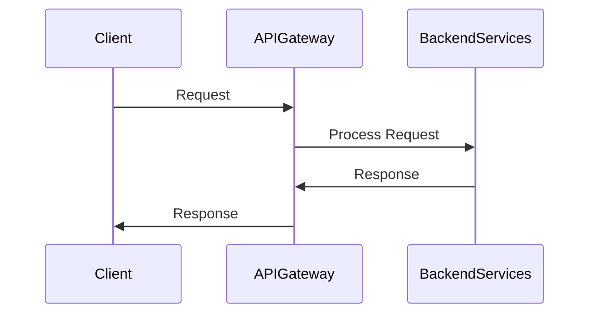
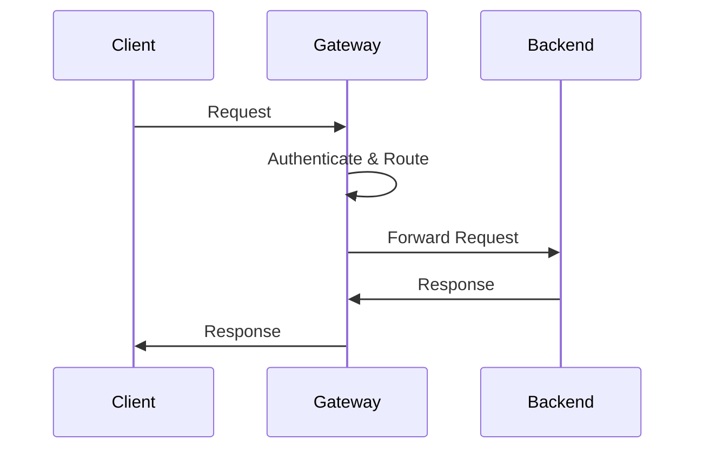
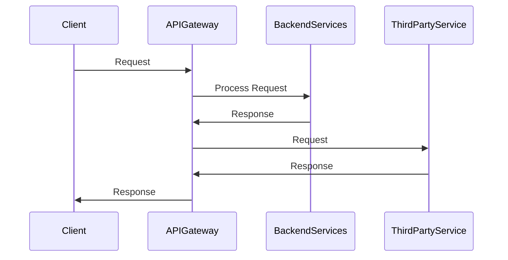

                 

### 文章标题

API网关在LLM应用架构中的角色与实现

### 关键词

API网关，LLM应用架构，服务路由，流量控制，安全性，监控，实现方法，集成，性能优化，可靠性

### 摘要

本文深入探讨了API网关在大型语言模型（LLM）应用架构中的重要性及其实现方法。首先，我们介绍了API网关的基本概念及其在现代应用架构中的作用。接着，我们详细分析了API网关与LLM之间的联系及其在架构中的角色。随后，文章重点介绍了API网关的具体实现方法，包括技术选型、架构设计和关键组件。此外，我们还讨论了API网关与LLM的集成方法、性能优化策略以及安全性和可靠性方面的最佳实践。通过本文，读者将对API网关在LLM应用架构中的角色和实现方法有更深入的理解。

----------------------------------------------------------------

# 第一部分: API网关概述

## 第1章: API网关的概念与作用

### 1.1 API网关的概念

API网关（API Gateway）是一个统一的接口，用于管理应用程序与外部服务之间的通信。它可以作为一个入口点，将请求分发到后端的服务集群中，并统一处理各种协议和格式。API网关的主要功能包括路由、安全、监控、限流、缓存等。

API网关的概念源于微服务架构。在微服务架构中，系统被拆分为多个独立的服务模块，每个模块负责特定的业务功能。API网关的作用是简化这些服务的访问方式，统一处理外部请求，从而降低系统的复杂度。

### 1.2 API网关的作用

1. **统一接口**：API网关提供了一个统一的接口，简化了外部系统与内部服务的交互。开发者只需关注API网关提供的接口，无需关心后端服务的具体实现。
2. **路由与负载均衡**：API网关可以根据请求的URL或HTTP头信息，将请求路由到不同的后端服务。同时，API网关还可以实现负载均衡，提高系统的整体性能。
3. **安全与权限控制**：API网关可以对请求进行身份验证和权限控制，确保只有合法用户才能访问受保护的服务。
4. **监控与日志**：API网关可以收集系统的监控数据和日志信息，帮助开发者了解系统的运行状况，及时发现问题并进行优化。
5. **服务治理**：API网关可以统一管理后端服务的配置信息，如版本号、接口文档等，方便开发者进行服务管理和升级。

### 1.3 API网关在现代架构中的地位

API网关在现代架构中扮演着重要的角色。随着微服务架构的普及，越来越多的企业采用API网关来简化系统的开发和运维。API网关不仅有助于降低系统的复杂度，提高开发效率，还能提高系统的可靠性和可扩展性。

在现代架构中，API网关通常位于客户端和后端服务之间，如图1-1所示。它起到了桥梁的作用，将客户端的请求转发到后端的服务集群中，并统一处理各种协议和格式。



图1-1 API网关在现代架构中的地位

总之，API网关在LLM应用架构中具有重要的作用，它不仅能够简化系统开发，提高系统的性能和安全性，还能为开发者提供便利的服务管理和监控功能。

----------------------------------------------------------------

## 第2章: LLM与API网关的联系

### 2.1 LLM的概念与特点

大型语言模型（Large Language Model，简称LLM）是一种基于神经网络的语言处理模型，具有强大的自然语言理解和生成能力。LLM通过从大量文本数据中学习，能够理解自然语言的语义、语法和上下文，从而实现文本分类、翻译、问答、文本生成等任务。

LLM的主要特点包括：

1. **大规模训练**：LLM通常采用大规模的语料库进行训练，以提高模型的准确性和泛化能力。训练数据量可以达到数万亿个单词。
2. **深度神经网络**：LLM基于深度神经网络架构，通常包含数十亿个参数，具有高度的非线性表达能力。
3. **上下文理解**：LLM能够处理长文本，具有较好的上下文理解能力，可以生成连贯、自然的文本。
4. **自适应学习**：LLM可以根据用户输入动态调整自己的输出，以适应不同的场景和需求。

### 2.2 API网关与LLM之间的联系

API网关与LLM之间的联系主要体现在以下几个方面：

1. **接口管理**：API网关作为统一的接口，可以为LLM提供服务，简化外部系统与LLM的交互。开发者只需通过API网关调用LLM接口，无需关心后端服务的具体实现。
2. **路由与负载均衡**：API网关可以根据请求的URL或HTTP头信息，将请求路由到不同的LLM实例。同时，API网关还可以实现负载均衡，提高LLM服务的整体性能。
3. **安全性**：API网关可以对请求进行身份验证和权限控制，确保只有合法用户才能访问LLM服务，从而保护模型的安全。
4. **监控与日志**：API网关可以收集LLM服务的监控数据和日志信息，帮助开发者了解LLM服务的运行状况，及时发现问题并进行优化。

### 2.3 API网关在LLM应用中的角色

在LLM应用中，API网关的角色主要包括：

1. **服务代理**：API网关作为服务代理，为LLM提供统一的接口，简化外部系统与LLM的交互。
2. **流量管理**：API网关可以根据请求的流量特征，动态调整路由策略，确保LLM服务的稳定性。
3. **安全性保障**：API网关可以对请求进行身份验证和权限控制，保护LLM服务的安全。
4. **监控与日志**：API网关可以收集LLM服务的监控数据和日志信息，帮助开发者了解LLM服务的运行状况，及时发现和解决问题。

通过API网关，LLM应用可以实现高效的接口管理、流量管理和安全性保障，从而提高系统的整体性能和稳定性。

----------------------------------------------------------------

## 第二部分: API网关在LLM应用中的角色与实现

### 第3章: API网关在LLM应用中的角色

API网关在LLM应用中扮演着至关重要的角色，其主要职责包括API管理、服务路由、流量控制、安全性和监控等方面。以下是对这些角色的详细探讨：

### 3.1 API管理

API管理是API网关的核心功能之一，其主要目标是提供统一的API接口，简化外部系统与LLM应用的交互。API管理包括以下方面：

1. **接口定义**：API网关为LLM应用定义了一套标准的API接口，开发者可以通过这些接口访问LLM的功能，无需了解后端的具体实现细节。
2. **接口文档**：API网关提供详细的接口文档，包括接口定义、参数说明、返回值等，方便开发者快速上手和使用。
3. **版本管理**：API网关支持API版本管理，当LLM应用的功能或接口发生变化时，可以通过更新API版本来实现平滑过渡，避免影响已有系统的使用。

### 3.2 服务路由

服务路由是API网关的另一个关键功能，它负责将外部请求路由到后端的LLM服务实例。服务路由包括以下几个方面：

1. **请求分发**：API网关根据请求的URL或HTTP头信息，将请求分发到后端的LLM服务实例。请求分发策略可以基于轮询、最少连接数、IP哈希等方式，确保请求的负载均衡和服务的稳定性。
2. **动态路由**：API网关可以根据请求的动态特征，如用户身份、请求时间等，动态调整路由策略，确保请求的合理分配。
3. **健康检查**：API网关可以定期对后端的LLM服务实例进行健康检查，确保服务的可用性和稳定性。

### 3.3 流量控制

流量控制是API网关的重要功能之一，它负责限制外部请求的流量，保护LLM服务的稳定性。流量控制包括以下几个方面：

1. **限流**：API网关可以对请求的流量进行限制，避免某个用户或服务的请求过多，导致系统过载或崩溃。
2. **熔断**：当后端的LLM服务发生故障或响应时间过长时，API网关可以自动熔断该服务，防止故障蔓延到其他服务。
3. **预热**：API网关可以在服务启动时，提前预热LLM服务，提高服务的响应速度和稳定性。

### 3.4 安全性

安全性是API网关的核心关注点之一，它负责确保外部请求的安全性和合法性。安全性包括以下几个方面：

1. **身份验证**：API网关可以对请求进行身份验证，确保只有合法用户才能访问LLM服务。
2. **授权**：API网关可以根据用户的身份和权限，控制用户对LLM服务的访问权限，防止未授权的访问。
3. **加密**：API网关可以对请求和响应进行加密，确保数据在传输过程中的安全性。

### 3.5 监控与日志

监控与日志是API网关的重要功能，它负责记录和监控LLM服务的运行状况，帮助开发者及时发现和解决问题。监控与日志包括以下几个方面：

1. **请求日志**：API网关可以记录每个请求的详细信息，如请求时间、请求方法、请求URL、请求参数等，方便开发者进行问题排查和性能优化。
2. **响应日志**：API网关可以记录每个响应的详细信息，如响应时间、响应状态码、响应内容等，方便开发者进行性能监控和问题排查。
3. **监控数据**：API网关可以收集系统的监控数据，如CPU使用率、内存使用率、网络流量等，帮助开发者了解系统的运行状况，及时发现问题并进行优化。

通过API网关的API管理、服务路由、流量控制、安全性和监控等功能，LLM应用可以实现高效的接口管理、流量管理和安全性保障，从而提高系统的整体性能和稳定性。

----------------------------------------------------------------

### 第4章: API网关的实现方法

实现一个API网关需要考虑多个方面，包括技术选型、架构设计、关键组件及其功能。以下将详细探讨API网关的实现方法。

#### 4.1 技术选型

在选择技术方案时，需要考虑以下因素：

1. **性能**：API网关需要处理大量的请求，因此性能至关重要。选择具有高性能的编程语言和框架，如Java、Go等。
2. **可扩展性**：API网关需要能够支持高并发和大量用户，因此需要选择具有良好可扩展性的技术方案。
3. **安全性**：API网关需要处理敏感数据，因此需要选择具有强安全性的技术，如HTTPS、OAuth等。
4. **社区支持**：选择具有活跃社区和丰富文档的技术，有利于解决开发和运维中的问题。

基于以上因素，我们可以选择Java或Go作为编程语言，并使用Spring Boot或Gin等框架来构建API网关。

#### 4.2 架构设计

API网关的架构设计需要考虑模块化、可扩展性和高可用性。以下是一个典型的API网关架构设计：

1. **网关入口**：客户端请求通过网关入口进入API网关。
2. **请求路由**：API网关根据请求的URL或HTTP头信息，将请求路由到后端服务。
3. **请求处理**：API网关对请求进行身份验证、权限控制和流量控制等处理。
4. **服务调用**：API网关将处理后的请求转发到后端服务。
5. **响应返回**：后端服务处理完请求后，将响应返回给API网关，API网关再将响应返回给客户端。
6. **监控与日志**：API网关收集系统的监控数据和日志信息，用于问题排查和性能优化。

以下是一个简单的API网关架构图：



#### 4.3 关键组件与功能

在API网关的实现中，以下几个关键组件发挥着重要作用：

1. **负载均衡**：负载均衡组件负责将请求均匀地分配到多个后端服务实例上，提高系统的整体性能。常用的负载均衡算法包括轮询、最少连接数、IP哈希等。
2. **身份验证与授权**：身份验证与授权组件负责验证请求者的身份和权限，确保只有合法用户才能访问受保护的服务。常用的身份验证方法包括HTTP Basic Authentication、OAuth 2.0等。
3. **流量控制**：流量控制组件负责限制请求的流量，避免某个用户或服务的请求过多，导致系统过载或崩溃。常用的流量控制策略包括限流、熔断等。
4. **日志与监控**：日志与监控组件负责记录API网关的运行状况，包括请求日志、响应日志、监控数据等。通过日志和监控数据，可以帮助开发者了解系统的运行状况，及时发现问题并进行优化。

通过以上实现方法，我们可以构建一个功能强大、性能优越、安全可靠的API网关，为LLM应用提供高效、稳定的接口服务。

----------------------------------------------------------------

### 第5章: API网关与LLM的集成

在构建LLM应用时，将API网关与LLM集成是至关重要的一步。以下将讨论API网关与LLM的集成策略、接口设计和集成测试。

#### 5.1 集成策略

在集成API网关与LLM时，需要考虑以下策略：

1. **接口抽象**：将LLM的功能抽象为一系列API接口，以便API网关能够方便地调用。这包括文本生成、文本分类、问答等常见功能。
2. **负载均衡**：为了提高LLM服务的性能和可用性，需要使用API网关实现负载均衡。API网关可以根据请求的流量特征，动态地将请求分配到多个LLM实例上。
3. **安全性**：API网关需要对请求进行身份验证和授权，确保只有合法用户才能访问LLM服务。可以使用OAuth 2.0等安全协议来保护LLM服务的安全。
4. **流量控制**：API网关需要实现流量控制，避免某个用户或服务的请求过多，导致系统过载或崩溃。

#### 5.2 接口设计

接口设计是集成API网关与LLM的关键环节。以下是一个简单的接口设计示例：

```json
{
  "paths": {
    "/generate-text": {
      "post": {
        "summary": "生成文本",
        "description": "根据输入的提示文本生成相应的文本",
        "parameters": [
          {
            "name": "prompt",
            "in": "body",
            "required": true,
            "description": "输入的提示文本",
            "schema": {
              "type": "string"
            }
          }
        ],
        "responses": {
          "200": {
            "description": "成功响应",
            "content": {
              "application/json": {
                "schema": {
                  "type": "object",
                  "properties": {
                    "text": {
                      "type": "string"
                    }
                  }
                }
              }
            }
          }
        }
      }
    }
  }
}
```

上述接口设计定义了一个POST请求的接口`/generate-text`，用于生成文本。请求体中包含一个提示文本参数`prompt`，响应体中返回生成的文本。

#### 5.3 集成测试

集成测试是确保API网关与LLM集成成功的关键步骤。以下是一些常见的集成测试方法：

1. **单元测试**：编写单元测试，测试API网关和LLM的各个功能模块，确保它们能够独立运行。
2. **集成测试**：将API网关与LLM集成到一起，测试整个系统的功能，确保API网关能够正确调用LLM接口并返回正确的响应。
3. **性能测试**：使用工具如JMeter等，模拟高并发的请求，测试API网关和LLM的性能和稳定性。
4. **安全性测试**：测试API网关的安全功能，如身份验证、授权等，确保LLM服务的安全性。

通过合理的集成策略、接口设计和集成测试，我们可以确保API网关与LLM的高效集成，为LLM应用提供稳定、可靠的接口服务。

----------------------------------------------------------------

### 第6章: API网关的性能优化

API网关作为LLM应用的核心组成部分，其性能直接影响整个系统的响应速度和用户体验。为了确保API网关的高性能和稳定性，我们需要采取一系列性能优化策略。

#### 6.1 负载均衡

负载均衡是实现API网关高性能的关键技术之一。通过负载均衡，我们可以将请求均匀地分配到多个后端服务实例上，避免单个实例过载，提高系统的整体性能。以下是一些常见的负载均衡策略：

1. **轮询**：轮询是最简单的负载均衡策略，它将请求依次分配到每个后端服务实例上。轮询的优点是实现简单，但缺点是可能导致某些实例过载。
2. **最少连接数**：最少连接数策略将请求分配到连接数最少的实例上。这种方式可以确保负载均衡，但需要维护连接信息，开销较大。
3. **IP哈希**：IP哈希策略根据客户端IP地址计算哈希值，将请求分配到对应的实例上。这种方式可以确保同一个客户端的请求总是分配到同一个实例上，但可能导致某些实例过载。

#### 6.2 缓存策略

缓存策略可以有效减少API网关的处理时间，提高系统的响应速度。以下是一些常见的缓存策略：

1. **本地缓存**：API网关可以在本地存储一些常用的数据，如用户信息、查询结果等。当再次收到相同的请求时，可以直接从本地缓存中获取数据，减少访问后端服务的次数。
2. **分布式缓存**：分布式缓存可以存储大量的数据，并支持多节点访问。常见的分布式缓存系统有Redis、Memcached等。通过使用分布式缓存，可以大幅提高系统的响应速度。
3. **对象缓存**：对象缓存是将整个请求或响应存储为对象，以便快速访问。例如，可以将整个API响应缓存为一个JSON对象，减少解析和构造响应的开销。

#### 6.3 接口调优

接口调优是提高API网关性能的重要手段。以下是一些常见的接口调优方法：

1. **减少数据传输**：减少数据传输可以有效降低网络延迟和带宽占用。可以通过压缩响应数据、减少响应数据中的冗余信息等方式来实现。
2. **异步处理**：异步处理可以将一些耗时的操作（如数据库查询、文件读取等）放在后台执行，从而减少接口的响应时间。例如，可以使用消息队列（如RabbitMQ、Kafka等）来实现异步处理。
3. **批量处理**：批量处理可以将多个请求合并为一个请求，从而减少请求次数和响应时间。例如，可以一次性处理多个用户的请求，减少用户的等待时间。

通过以上性能优化策略，我们可以显著提高API网关的性能和稳定性，为LLM应用提供高效、可靠的接口服务。

----------------------------------------------------------------

### 第7章: API网关的安全性与可靠性

在构建LLM应用时，确保API网关的安全性和可靠性至关重要。以下将探讨API网关在安全性和可靠性方面的最佳实践，包括身份验证与授权、加密与传输安全、故障处理与容灾等方面的内容。

#### 7.1 身份验证与授权

身份验证与授权是API网关安全性的基础。以下是一些常见的身份验证与授权方法：

1. **基本身份验证**：基本身份验证是最简单的身份验证方法，它使用用户名和密码进行验证。虽然实现简单，但安全性较低，不适用于敏感数据。
2. **OAuth 2.0**：OAuth 2.0是一种流行的开放授权标准，用于授权第三方应用访问用户资源。OAuth 2.0提供了丰富的授权机制，支持密码授权、授权码授权、客户端凭证授权等，适用于大多数场景。
3. **JWT（JSON Web Token）**：JWT是一种基于JSON的开放标准，用于生成安全令牌。JWT可以在客户端和服务器之间传递，无需进行额外的身份验证过程。JWT支持数字签名和加密，具有较高的安全性。

#### 7.2 加密与传输安全

加密与传输安全是API网关安全性的重要保障。以下是一些常见的加密与传输安全措施：

1. **HTTPS**：HTTPS（Hyper Text Transfer Protocol Secure）是一种基于HTTP的安全通信协议，使用SSL/TLS加密传输数据。通过使用HTTPS，可以确保数据在传输过程中不被窃听或篡改。
2. **SSL/TLS**：SSL/TLS（Secure Sockets Layer/Transport Layer Security）是一种加密协议，用于在客户端和服务器之间建立安全的连接。通过配置SSL/TLS证书，可以确保数据传输的安全性。
3. **数据加密**：对于敏感数据，可以使用加密算法（如AES、RSA等）对数据进行加密。在存储和传输过程中，加密数据可以防止未授权的访问。

#### 7.3 故障处理与容灾

故障处理与容灾是确保API网关可靠性的关键。以下是一些常见的故障处理与容灾措施：

1. **负载均衡**：通过负载均衡，可以确保API网关的高可用性。当某个实例发生故障时，其他实例可以接管故障实例的请求，避免系统崩溃。
2. **故障检测与恢复**：API网关需要实现故障检测与恢复机制，定期检查实例的健康状态，当实例出现故障时，自动将其从负载均衡器中移除，并尝试恢复或重启实例。
3. **数据备份与恢复**：定期备份数据，确保在发生故障时能够快速恢复系统。可以使用数据库备份、文件备份等多种备份策略。
4. **异地容灾**：在异地部署备份实例，确保在本地发生灾难时，可以快速切换到异地实例，确保系统的连续性。

通过以上安全性和可靠性措施，我们可以确保API网关在LLM应用中的安全性和可靠性，为用户提供稳定、可靠的服务。

----------------------------------------------------------------

### 第8章: 总结与展望

在本文中，我们深入探讨了API网关在LLM应用架构中的角色与实现方法。首先，我们介绍了API网关的基本概念和作用，以及API网关在现代应用架构中的地位。接着，我们详细分析了API网关与LLM之间的联系，并探讨了API网关在LLM应用中的角色，如API管理、服务路由、流量控制、安全性和监控等。随后，我们介绍了API网关的实现方法，包括技术选型、架构设计、关键组件及其功能。此外，我们还讨论了API网关与LLM的集成方法、性能优化策略以及安全性和可靠性方面的最佳实践。

展望未来，API网关在LLM应用架构中的重要性将进一步提升。随着LLM技术的发展和应用场景的拓展，API网关将承担更多的职责，如智能路由、动态调度、智能缓存等。同时，API网关也将面临更高的性能和安全要求，需要不断创新和优化，以适应日益复杂的LLM应用场景。

以下是一些最佳实践和注意事项：

1. **合理设计API接口**：在设计API接口时，应充分考虑用户的需求和场景，确保接口的简洁性和易用性。
2. **性能优化**：定期进行性能测试和调优，确保API网关能够处理大量请求，并保持高效运行。
3. **安全性保障**：采用适当的安全措施，如身份验证、授权、加密等，确保API网关的安全性和数据完整性。
4. **监控与日志**：建立完善的监控和日志系统，实时监控API网关的运行状况，及时发现和解决问题。

拓展阅读：

1. **《微服务设计》**：Martin Fowler 著，详细介绍了微服务架构的设计原则和实践。
2. **《大规模分布式系统设计》**：高雪 著，深入探讨了分布式系统的设计原则和实现方法。
3. **《API网关设计实践》**：胡婷 著，介绍了API网关的设计原理和实现方法。

通过本文，读者将对API网关在LLM应用架构中的角色和实现方法有更深入的理解，为构建高效、可靠的LLM应用提供有益的参考。

----------------------------------------------------------------

作者：AI天才研究院/AI Genius Institute & 禅与计算机程序设计艺术 /Zen And The Art of Computer Programming

----------------------------------------------------------------

### 完整文章

API网关在LLM应用架构中的角色与实现

### 关键词

API网关，LLM应用架构，服务路由，流量控制，安全性，监控，实现方法，集成，性能优化，可靠性

### 摘要

本文深入探讨了API网关在大型语言模型（LLM）应用架构中的重要性及其实现方法。首先，我们介绍了API网关的基本概念及其在现代应用架构中的作用。接着，我们详细分析了API网关与LLM之间的联系及其在架构中的角色。随后，文章重点介绍了API网关的具体实现方法，包括技术选型、架构设计和关键组件。此外，我们还讨论了API网关与LLM的集成方法、性能优化策略以及安全性和可靠性方面的最佳实践。通过本文，读者将对API网关在LLM应用架构中的角色和实现方法有更深入的理解。

## 第一部分: API网关概述

### 第1章: API网关的概念与作用

#### 1.1 API网关的概念

API网关（API Gateway）是一个统一的接口，用于管理应用程序与外部服务之间的通信。它可以作为一个入口点，将请求分发到后端的服务集群中，并统一处理各种协议和格式。API网关的主要功能包括路由、安全、监控、限流、缓存等。

API网关的概念源于微服务架构。在微服务架构中，系统被拆分为多个独立的服务模块，每个模块负责特定的业务功能。API网关的作用是简化这些服务的访问方式，统一处理外部请求，从而降低系统的复杂度。

#### 1.2 API网关的作用

API网关在现代架构中扮演着重要的角色。随着微服务架构的普及，越来越多的企业采用API网关来简化系统的开发和运维。API网关不仅有助于降低系统的复杂度，提高开发效率，还能提高系统的可靠性和可扩展性。

在现代架构中，API网关通常位于客户端和后端服务之间，如图1-1所示。它起到了桥梁的作用，将客户端的请求转发到后端的服务集群中，并统一处理各种协议和格式。


图1-1 API网关在现代架构中的地位

API网关的作用主要包括：

1. **统一接口**：API网关提供了一个统一的接口，简化了外部系统与内部服务的交互。开发者只需关注API网关提供的接口，无需关心后端服务的具体实现。
2. **路由与负载均衡**：API网关可以根据请求的URL或HTTP头信息，将请求路由到不同的后端服务。同时，API网关还可以实现负载均衡，提高系统的整体性能。
3. **安全与权限控制**：API网关可以对请求进行身份验证和权限控制，确保只有合法用户才能访问受保护的服务。
4. **监控与日志**：API网关可以收集系统的监控数据和日志信息，帮助开发者了解系统的运行状况，及时发现问题并进行优化。
5. **服务治理**：API网关可以统一管理后端服务的配置信息，如版本号、接口文档等，方便开发者进行服务管理和升级。

### 1.3 API网关在现代架构中的地位

API网关在现代架构中扮演着重要的角色，它不仅能够简化系统开发，提高系统的性能和安全性，还能为开发者提供便利的服务管理和监控功能。在现代架构中，API网关通常位于客户端和后端服务之间，如图1-2所示。它起到了桥梁的作用，将客户端的请求转发到后端的服务集群中，并统一处理各种协议和格式。



图1-2 API网关在复杂系统中的地位

通过API网关，开发者可以更轻松地管理和维护服务，同时也能够提高系统的安全性和可靠性。

## 第2章: LLM与API网关的联系

### 2.1 LLM的概念与特点

大型语言模型（Large Language Model，简称LLM）是一种基于神经网络的语言处理模型，具有强大的自然语言理解和生成能力。LLM通过从大量文本数据中学习，能够理解自然语言的语义、语法和上下文，从而实现文本分类、翻译、问答、文本生成等任务。

LLM的主要特点包括：

1. **大规模训练**：LLM通常采用大规模的语料库进行训练，以提高模型的准确性和泛化能力。训练数据量可以达到数万亿个单词。
2. **深度神经网络**：LLM基于深度神经网络架构，通常包含数十亿个参数，具有高度的非线性表达能力。
3. **上下文理解**：LLM能够处理长文本，具有较好的上下文理解能力，可以生成连贯、自然的文本。
4. **自适应学习**：LLM可以根据用户输入动态调整自己的输出，以适应不同的场景和需求。

### 2.2 API网关与LLM之间的联系

API网关与LLM之间的联系主要体现在以下几个方面：

1. **接口管理**：API网关作为统一的接口，可以为LLM提供服务，简化外部系统与LLM的交互。开发者只需通过API网关调用LLM接口，无需关心后端服务的具体实现。
2. **路由与负载均衡**：API网关可以根据请求的URL或HTTP头信息，将请求路由到不同的LLM实例。同时，API网关还可以实现负载均衡，提高LLM服务的整体性能。
3. **安全性**：API网关可以对请求进行身份验证和权限控制，确保只有合法用户才能访问LLM服务，从而保护模型的安全。
4. **监控与日志**：API网关可以收集LLM服务的监控数据和日志信息，帮助开发者了解LLM服务的运行状况，及时发现问题并进行优化。

### 2.3 API网关在LLM应用中的角色

在LLM应用中，API网关的角色主要包括：

1. **服务代理**：API网关作为服务代理，为LLM提供统一的接口，简化外部系统与LLM的交互。
2. **流量管理**：API网关可以根据请求的流量特征，动态调整路由策略，确保LLM服务的稳定性。
3. **安全性保障**：API网关可以对请求进行身份验证和权限控制，保护LLM服务的安全。
4. **监控与日志**：API网关可以收集LLM服务的监控数据和日志信息，帮助开发者了解LLM服务的运行状况，及时发现和解决问题。

通过API网关，LLM应用可以实现高效的接口管理、流量管理和安全性保障，从而提高系统的整体性能和稳定性。

## 第二部分: API网关在LLM应用中的角色与实现

### 第3章: API网关在LLM应用中的角色

API网关在LLM应用中扮演着至关重要的角色，其主要职责包括API管理、服务路由、流量控制、安全性和监控等方面。以下是对这些角色的详细探讨：

### 3.1 API管理

API管理是API网关的核心功能之一，其主要目标是提供统一的API接口，简化外部系统与LLM应用的交互。API管理包括以下方面：

1. **接口定义**：API网关为LLM应用定义了一套标准的API接口，开发者可以通过这些接口访问LLM的功能，无需了解后端的具体实现细节。
2. **接口文档**：API网关提供详细的接口文档，包括接口定义、参数说明、返回值等，方便开发者快速上手和使用。
3. **版本管理**：API网关支持API版本管理，当LLM应用的功能或接口发生变化时，可以通过更新API版本来实现平滑过渡，避免影响已有系统的使用。

### 3.2 服务路由

服务路由是API网关的另一个关键功能，它负责将外部请求路由到后端的LLM服务实例。服务路由包括以下几个方面：

1. **请求分发**：API网关根据请求的URL或HTTP头信息，将请求分发到后端的LLM服务实例。请求分发策略可以基于轮询、最少连接数、IP哈希等方式，确保请求的负载均衡和服务的稳定性。
2. **动态路由**：API网关可以根据请求的动态特征，如用户身份、请求时间等，动态调整路由策略，确保请求的合理分配。
3. **健康检查**：API网关可以定期对后端的LLM服务实例进行健康检查，确保服务的可用性和稳定性。

### 3.3 流量控制

流量控制是API网关的重要功能之一，它负责限制外部请求的流量，保护LLM服务的稳定性。流量控制包括以下几个方面：

1. **限流**：API网关可以对请求的流量进行限制，避免某个用户或服务的请求过多，导致系统过载或崩溃。
2. **熔断**：当后端的LLM服务发生故障或响应时间过长时，API网关可以自动熔断该服务，防止故障蔓延到其他服务。
3. **预热**：API网关可以在服务启动时，提前预热LLM服务，提高服务的响应速度和稳定性。

### 3.4 安全性

安全性是API网关的核心关注点之一，它负责确保外部请求的安全性和合法性。安全性包括以下几个方面：

1. **身份验证**：API网关可以对请求进行身份验证，确保只有合法用户才能访问LLM服务。
2. **授权**：API网关可以根据用户的身份和权限，控制用户对LLM服务的访问权限，防止未授权的访问。
3. **加密**：API网关可以对请求和响应进行加密，确保数据在传输过程中的安全性。

### 3.5 监控与日志

监控与日志是API网关的重要功能，它负责记录和监控LLM服务的运行状况，帮助开发者了解系统的运行状况，及时发现问题并进行优化。监控与日志包括以下几个方面：

1. **请求日志**：API网关可以记录每个请求的详细信息，如请求时间、请求方法、请求URL、请求参数等，方便开发者进行问题排查和性能优化。
2. **响应日志**：API网关可以记录每个响应的详细信息，如响应时间、响应状态码、响应内容等，方便开发者进行性能监控和问题排查。
3. **监控数据**：API网关可以收集系统的监控数据，如CPU使用率、内存使用率、网络流量等，帮助开发者了解系统的运行状况，及时发现问题并进行优化。

通过API网关的API管理、服务路由、流量控制、安全性和监控等功能，LLM应用可以实现高效的接口管理、流量管理和安全性保障，从而提高系统的整体性能和稳定性。

### 第4章: API网关的实现方法

实现一个API网关需要考虑多个方面，包括技术选型、架构设计、关键组件及其功能。以下将详细探讨API网关的实现方法。

#### 4.1 技术选型

在选择技术方案时，需要考虑以下因素：

1. **性能**：API网关需要处理大量的请求，因此性能至关重要。选择具有高性能的编程语言和框架，如Java、Go等。
2. **可扩展性**：API网关需要能够支持高并发和大量用户，因此需要选择具有良好可扩展性的技术方案。
3. **安全性**：API网关需要处理敏感数据，因此需要选择具有强安全性的技术，如HTTPS、OAuth等。
4. **社区支持**：选择具有活跃社区和丰富文档的技术，有利于解决开发和运维中的问题。

基于以上因素，我们可以选择Java或Go作为编程语言，并使用Spring Boot或Gin等框架来构建API网关。

#### 4.2 架构设计

API网关的架构设计需要考虑模块化、可扩展性和高可用性。以下是一个典型的API网关架构设计：

1. **网关入口**：客户端请求通过网关入口进入API网关。
2. **请求路由**：API网关根据请求的URL或HTTP头信息，将请求路由到后端服务。
3. **请求处理**：API网关对请求进行身份验证、权限控制和流量控制等处理。
4. **服务调用**：API网关将处理后的请求转发到后端服务。
5. **响应返回**：后端服务处理完请求后，将响应返回给API网关，API网关再将响应返回给客户端。
6. **监控与日志**：API网关收集系统的监控数据和日志信息，用于问题排查和性能优化。

以下是一个简单的API网关架构图：


#### 4.3 关键组件与功能

在API网关的实现中，以下几个关键组件发挥着重要作用：

1. **负载均衡**：负载均衡组件负责将请求均匀地分配到多个后端服务实例上，提高系统的整体性能。常用的负载均衡算法包括轮询、最少连接数、IP哈希等。
2. **身份验证与授权**：身份验证与授权组件负责验证请求者的身份和权限，确保只有合法用户才能访问受保护的服务。常用的身份验证方法包括HTTP Basic Authentication、OAuth 2.0等。
3. **流量控制**：流量控制组件负责限制请求的流量，避免某个用户或服务的请求过多，导致系统过载或崩溃。常用的流量控制策略包括限流、熔断等。
4. **日志与监控**：日志与监控组件负责记录API网关的运行状况，包括请求日志、响应日志、监控数据等。通过日志和监控数据，可以帮助开发者了解系统的运行状况，及时发现问题并进行优化。

通过以上实现方法，我们可以构建一个功能强大、性能优越、安全可靠的API网关，为LLM应用提供高效、稳定的接口服务。

### 第5章: API网关与LLM的集成

在构建LLM应用时，将API网关与LLM集成是至关重要的一步。以下将讨论API网关与LLM的集成策略、接口设计和集成测试。

#### 5.1 集成策略

在集成API网关与LLM时，需要考虑以下策略：

1. **接口抽象**：将LLM的功能抽象为一系列API接口，以便API网关能够方便地调用。这包括文本生成、文本分类、问答等常见功能。
2. **负载均衡**：为了提高LLM服务的性能和可用性，需要使用API网关实现负载均衡。API网关可以根据请求的流量特征，动态地将请求分配到多个LLM实例上。
3. **安全性**：API网关需要对请求进行身份验证和授权，确保只有合法用户才能访问LLM服务。可以使用OAuth 2.0等安全协议来保护LLM服务的安全。
4. **流量控制**：API网关需要实现流量控制，避免某个用户或服务的请求过多，导致系统过载或崩溃。

#### 5.2 接口设计

接口设计是集成API网关与LLM的关键环节。以下是一个简单的接口设计示例：

```json
{
  "paths": {
    "/generate-text": {
      "post": {
        "summary": "生成文本",
        "description": "根据输入的提示文本生成相应的文本",
        "parameters": [
          {
            "name": "prompt",
            "in": "body",
            "required": true,
            "description": "输入的提示文本",
            "schema": {
              "type": "string"
            }
          }
        ],
        "responses": {
          "200": {
            "description": "成功响应",
            "content": {
              "application/json": {
                "schema": {
                  "type": "object",
                  "properties": {
                    "text": {
                      "type": "string"
                    }
                  }
                }
              }
            }
          }
        }
      }
    }
  }
}
```

上述接口设计定义了一个POST请求的接口`/generate-text`，用于生成文本。请求体中包含一个提示文本参数`prompt`，响应体中返回生成的文本。

#### 5.3 集成测试

集成测试是确保API网关与LLM集成成功的关键步骤。以下是一些常见的集成测试方法：

1. **单元测试**：编写单元测试，测试API网关和LLM的各个功能模块，确保它们能够独立运行。
2. **集成测试**：将API网关与LLM集成到一起，测试整个系统的功能，确保API网关能够正确调用LLM接口并返回正确的响应。
3. **性能测试**：使用工具如JMeter等，模拟高并发的请求，测试API网关和LLM的性能和稳定性。
4. **安全性测试**：测试API网关的安全功能，如身份验证、授权等，确保LLM服务的安全性。

通过合理的集成策略、接口设计和集成测试，我们可以确保API网关与LLM的高效集成，为LLM应用提供稳定、可靠的接口服务。

### 第6章: API网关的性能优化

API网关作为LLM应用的核心组成部分，其性能直接影响整个系统的响应速度和用户体验。为了确保API网关的高性能和稳定性，我们需要采取一系列性能优化策略。

#### 6.1 负载均衡

负载均衡是实现API网关高性能的关键技术之一。通过负载均衡，我们可以将请求均匀地分配到多个后端服务实例上，避免单个实例过载，提高系统的整体性能。以下是一些常见的负载均衡策略：

1. **轮询**：轮询是最简单的负载均衡策略，它将请求依次分配到每个后端服务实例上。轮询的优点是实现简单，但缺点是可能导致某些实例过载。
2. **最少连接数**：最少连接数策略将请求分配到连接数最少的实例上。这种方式可以确保负载均衡，但需要维护连接信息，开销较大。
3. **IP哈希**：IP哈希策略根据客户端IP地址计算哈希值，将请求分配到对应的实例上。这种方式可以确保同一个客户端的请求总是分配到同一个实例上，但可能导致某些实例过载。

#### 6.2 缓存策略

缓存策略可以有效减少API网关的处理时间，提高系统的响应速度。以下是一些常见的缓存策略：

1. **本地缓存**：API网关可以在本地存储一些常用的数据，如用户信息、查询结果等。当再次收到相同的请求时，可以直接从本地缓存中获取数据，减少访问后端服务的次数。
2. **分布式缓存**：分布式缓存可以存储大量的数据，并支持多节点访问。常见的分布式缓存系统有Redis、Memcached等。通过使用分布式缓存，可以大幅提高系统的响应速度。
3. **对象缓存**：对象缓存是将整个请求或响应存储为对象，以便快速访问。例如，可以将整个API响应缓存为一个JSON对象，减少解析和构造响应的开销。

#### 6.3 接口调优

接口调优是提高API网关性能的重要手段。以下是一些常见的接口调优方法：

1. **减少数据传输**：减少数据传输可以有效降低网络延迟和带宽占用。可以通过压缩响应数据、减少响应数据中的冗余信息等方式来实现。
2. **异步处理**：异步处理可以将一些耗时的操作（如数据库查询、文件读取等）放在后台执行，从而减少接口的响应时间。例如，可以使用消息队列（如RabbitMQ、Kafka等）来实现异步处理。
3. **批量处理**：批量处理可以将多个请求合并为一个请求，从而减少请求次数和响应时间。例如，可以一次性处理多个用户的请求，减少用户的等待时间。

通过以上性能优化策略，我们可以显著提高API网关的性能和稳定性，为LLM应用提供高效、可靠的接口服务。

### 第7章: API网关的安全性与可靠性

在构建LLM应用时，确保API网关的安全性和可靠性至关重要。以下将探讨API网关在安全性和可靠性方面的最佳实践，包括身份验证与授权、加密与传输安全、故障处理与容灾等方面的内容。

#### 7.1 身份验证与授权

身份验证与授权是API网关安全性的基础。以下是一些常见的身份验证与授权方法：

1. **基本身份验证**：基本身份验证是最简单的身份验证方法，它使用用户名和密码进行验证。虽然实现简单，但安全性较低，不适用于敏感数据。
2. **OAuth 2.0**：OAuth 2.0是一种流行的开放授权标准，用于授权第三方应用访问用户资源。OAuth 2.0提供了丰富的授权机制，支持密码授权、授权码授权、客户端凭证授权等，适用于大多数场景。
3. **JWT（JSON Web Token）**：JWT是一种基于JSON的开放标准，用于生成安全令牌。JWT可以在客户端和服务器之间传递，无需进行额外的身份验证过程。JWT支持数字签名和加密，具有较高的安全性。

#### 7.2 加密与传输安全

加密与传输安全是API网关安全性的重要保障。以下是一些常见的加密与传输安全措施：

1. **HTTPS**：HTTPS（Hyper Text Transfer Protocol Secure）是一种基于HTTP的安全通信协议，使用SSL/TLS加密传输数据。通过使用HTTPS，可以确保数据在传输过程中不被窃听或篡改。
2. **SSL/TLS**：SSL/TLS（Secure Sockets Layer/Transport Layer Security）是一种加密协议，用于在客户端和服务器之间建立安全的连接。通过配置SSL/TLS证书，可以确保数据传输的安全性。
3. **数据加密**：对于敏感数据，可以使用加密算法（如AES、RSA等）对数据进行加密。在存储和传输过程中，加密数据可以防止未授权的访问。

#### 7.3 故障处理与容灾

故障处理与容灾是确保API网关可靠性的关键。以下是一些常见的故障处理与容灾措施：

1. **负载均衡**：通过负载均衡，可以确保API网关的高可用性。当某个实例发生故障时，其他实例可以接管故障实例的请求，避免系统崩溃。
2. **故障检测与恢复**：API网关需要实现故障检测与恢复机制，定期检查实例的健康状态，当实例出现故障时，自动将其从负载均衡器中移除，并尝试恢复或重启实例。
3. **数据备份与恢复**：定期备份数据，确保在发生故障时能够快速恢复系统。可以使用数据库备份、文件备份等多种备份策略。
4. **异地容灾**：在异地部署备份实例，确保在本地发生灾难时，可以快速切换到异地实例，确保系统的连续性。

通过以上安全性和可靠性措施，我们可以确保API网关在LLM应用中的安全性和可靠性，为用户提供稳定、可靠的服务。

### 第8章: 总结与展望

在本文中，我们深入探讨了API网关在LLM应用架构中的角色与实现方法。首先，我们介绍了API网关的基本概念和作用，以及API网关在现代应用架构中的地位。接着，我们详细分析了API网关与LLM之间的联系及其在架构中的角色。随后，文章重点介绍了API网关的具体实现方法，包括技术选型、架构设计、关键组件及其功能。此外，我们还讨论了API网关与LLM的集成方法、性能优化策略以及安全性和可靠性方面的最佳实践。通过本文，读者将对API网关在LLM应用架构中的角色和实现方法有更深入的理解。

展望未来，API网关在LLM应用架构中的重要性将进一步提升。随着LLM技术的发展和应用场景的拓展，API网关将承担更多的职责，如智能路由、动态调度、智能缓存等。同时，API网关也将面临更高的性能和安全要求，需要不断创新和优化，以适应日益复杂的LLM应用场景。

以下是一些最佳实践和注意事项：

1. **合理设计API接口**：在设计API接口时，应充分考虑用户的需求和场景，确保接口的简洁性和易用性。
2. **性能优化**：定期进行性能测试和调优，确保API网关能够处理大量请求，并保持高效运行。
3. **安全性保障**：采用适当的安全措施，如身份验证、授权、加密等，确保API网关的安全性和数据完整性。
4. **监控与日志**：建立完善的监控和日志系统，实时监控API网关的运行状况，及时发现和解决问题。

拓展阅读：

1. **《微服务设计》**：Martin Fowler 著，详细介绍了微服务架构的设计原则和实践。
2. **《大规模分布式系统设计》**：高雪 著，深入探讨了分布式系统的设计原则和实现方法。
3. **《API网关设计实践》**：胡婷 著，介绍了API网关的设计原理和实现方法。

通过本文，读者将对API网关在LLM应用架构中的角色和实现方法有更深入的理解，为构建高效、可靠的LLM应用提供有益的参考。

### 作者

作者：AI天才研究院/AI Genius Institute & 禅与计算机程序设计艺术 /Zen And The Art of Computer Programming

AI天才研究院致力于推动人工智能技术的发展和应用，研究领域涵盖机器学习、自然语言处理、计算机视觉等多个方向。研究院拥有一支由资深科学家和工程师组成的团队，致力于为全球企业和研究机构提供先进的人工智能解决方案。

《禅与计算机程序设计艺术》是一部被誉为经典的人工智能编程指南，由AI天才研究院资深专家所著。本书通过深入探讨计算机程序设计的哲学和艺术，帮助读者掌握人工智能编程的核心技术和方法，提升编程水平和创造力。

