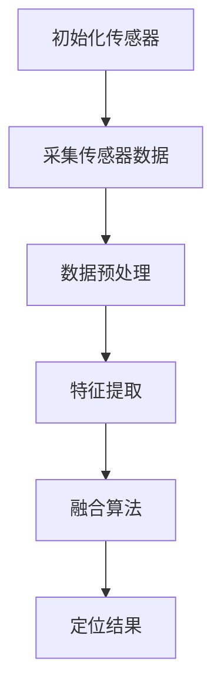
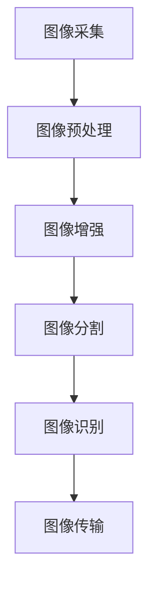
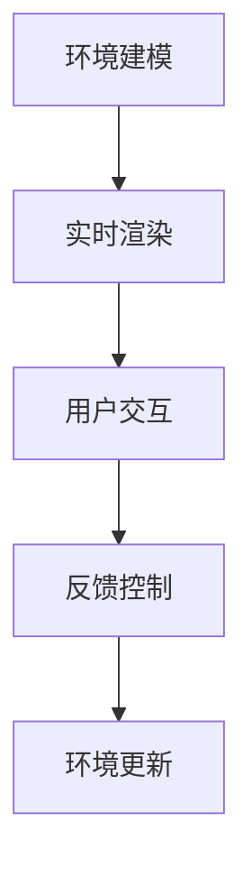
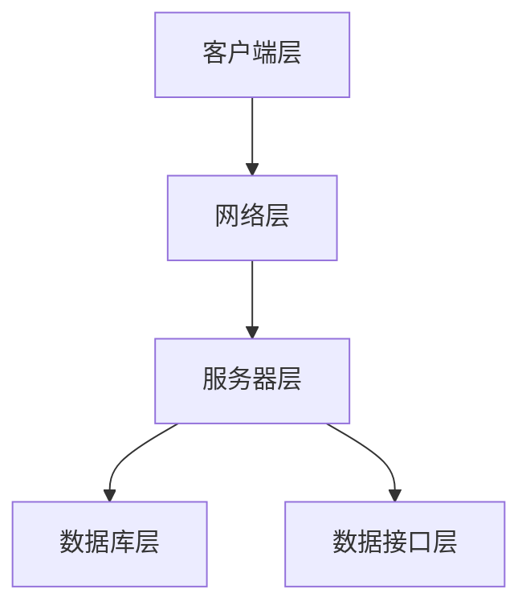
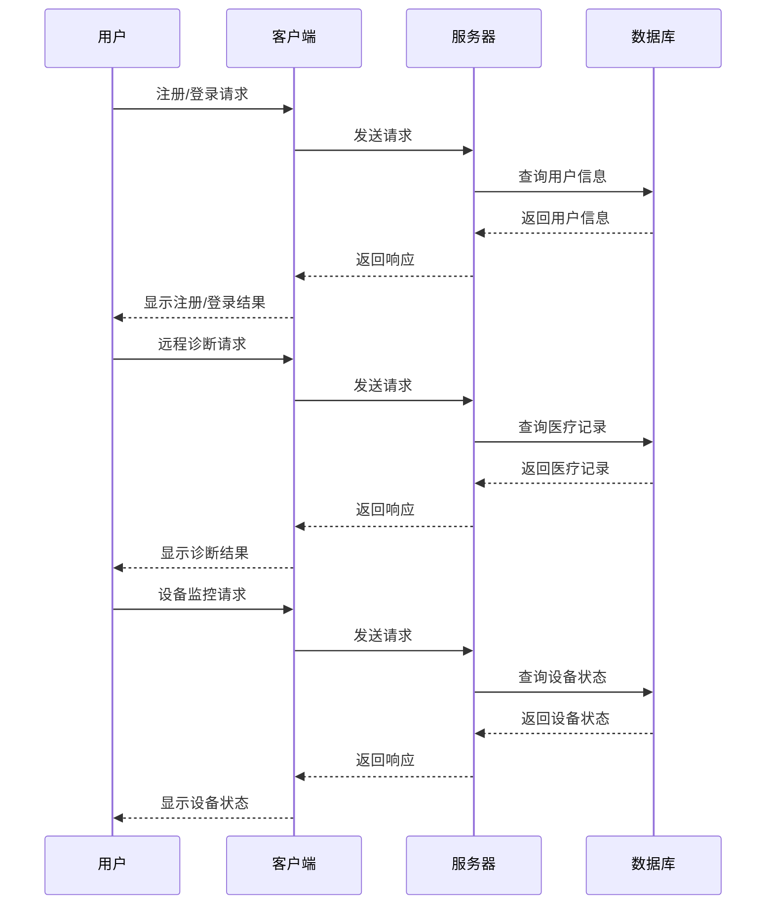

                 

### 引言

在现代科技迅猛发展的时代，5G（第五代移动通信技术）和AR（增强现实）技术的应用已经深刻影响了众多行业，而远程医疗会诊作为医疗服务的一个重要分支，也迎来了新的技术革新。本文以《5G+AR在远程医疗会诊中的应用前景》为标题，旨在探讨5G与AR技术在远程医疗会诊中的潜在应用，以及这些技术如何改变和提升医疗服务的效率和质量。

5G技术以其高速度、低延迟、大容量等特点，为远程医疗提供了强大的网络基础。AR技术则通过增强现实视觉体验，使得医生和患者能够更直观地进行沟通和诊断。这两者的结合，不仅提高了远程医疗的交互体验，还扩大了其应用范围，使其在复杂病例的诊断、手术指导、医疗培训等方面展现出巨大的潜力。

本文将从以下几个方面展开讨论：

1. **5G与AR技术概述**：介绍5G和AR技术的基本概念、发展历程和核心优势。
2. **5G与AR技术在远程医疗中的应用**：分析5G和AR技术在远程医疗会诊中的具体应用场景和潜在效益。
3. **5G+AR技术在远程医疗会诊中的关键概念**：探讨空间感知与位置服务、实时图像处理与传输、虚拟现实与增强现实技术等关键概念及其联系。
4. **5G+AR技术在远程医疗会诊中的算法原理**：介绍空间定位算法、图像处理算法和虚拟现实与增强现实算法的基本原理。
5. **5G+AR技术在远程医疗会诊中的数学模型**：阐述空间定位模型、图像处理模型和虚拟现实与增强现实模型的数学基础。
6. **5G+AR技术在远程医疗会诊中的应用架构**：分析远程医疗会诊系统的架构设计、功能设计和接口设计。
7. **5G+AR在远程医疗会诊中的项目实战**：通过具体项目案例，展示5G+AR技术在远程医疗会诊中的实际应用。
8. **5G+AR技术在远程医疗会诊中的最佳实践与展望**：总结最佳实践技巧，展望技术发展的未来前景和应用挑战。

通过对这些方面的详细探讨，本文希望能够为读者提供一个全面、深入的了解，从而认识到5G+AR技术在远程医疗会诊中的重要性和广阔的应用前景。

### 5G与AR技术概述

#### 5G技术

5G，即第五代移动通信技术，是继4G、3G和2G之后的最新一代移动通信技术。5G技术的主要特点在于其高速度、低延迟、大容量和广泛连接能力。以下是5G技术的一些基本概念、发展历程和核心优势。

**基本概念**：

- **高速度**：5G的峰值下载速度可以达到10Gbps，是4G的100倍。这意味着在5G网络上，用户可以几乎即时地下载高清视频、大文件等。
- **低延迟**：5G的延迟极低，一般在1毫秒以下。这种低延迟使得实时交互、远程控制等应用成为可能。
- **大容量**：5G技术支持大规模设备连接，可以满足物联网（IoT）时代对海量设备连接的需求。
- **广泛连接**：5G不仅支持移动终端，还支持固定宽带接入，从而实现无线网络的全覆盖。

**发展历程**：

5G技术的发展历程可以分为几个关键阶段。2013年，国际电信联盟（ITU）正式提出了5G技术的概念。2016年，国际标准化组织3GPP发布了第一个5G标准NR（新无线电）。2019年，全球多个国家和地区正式启用了5G服务。目前，5G技术在全球范围内已经进入了大规模商用阶段。

**核心优势**：

- **提升网络速度**：5G技术的高速度使其成为各种数据密集型应用的重要支撑。
- **低延迟应用**：低延迟特性使得5G在自动驾驶、远程医疗等实时交互场景中具有显著优势。
- **支持物联网**：5G的大容量连接能力为物联网的发展提供了强有力的技术支持。
- **广阔的应用前景**：5G技术不仅在通信领域有着广泛的应用，还在工业、医疗、教育等多个领域展现出巨大的潜力。

#### AR技术

AR，即增强现实（Augmented Reality），是一种将虚拟信息与现实世界融合的技术。通过AR技术，用户可以看到增强后的现实世界，这些增强信息可以包括文字、图像、视频等多种形式。以下是AR技术的基本概念、发展历程和核心优势。

**基本概念**：

- **增强现实**：AR技术通过摄像头或显示器，将虚拟信息叠加到现实世界中，从而增强用户的感知体验。
- **虚拟增强**：用户通过AR设备可以看到现实世界中的虚拟物体或信息，这些虚拟物体可以与现实环境互动。
- **实时交互**：AR技术支持用户与虚拟信息进行实时交互，从而实现更加自然的交互体验。

**发展历程**：

AR技术最早可以追溯到1960年代，当时最初的技术主要用于军事和航空领域。1990年代，随着计算机图形学和传感器技术的发展，AR技术开始向民用领域扩展。进入21世纪，智能手机和移动设备的普及使得AR技术得到了广泛应用。近年来，随着人工智能和深度学习技术的发展，AR技术也得到了进一步的提升。

**核心优势**：

- **沉浸式体验**：AR技术可以为用户提供更加沉浸式的体验，增强用户的参与感和互动性。
- **实时互动**：用户可以通过AR设备与虚拟信息进行实时互动，从而提高信息传达的效率。
- **扩展应用场景**：AR技术可以应用于游戏、教育、医疗等多个领域，为这些领域带来新的应用场景和解决方案。

#### 5G与AR技术的结合

5G与AR技术的结合，可以充分发挥两者的优势，为远程医疗会诊提供更加高效和直观的服务。以下是5G与AR技术结合的一些关键点：

- **高速网络支持**：5G技术的高速度为AR应用提供了稳定的数据传输支持，使得医生和患者可以实时传输高清图像和视频，进行远程诊断和手术指导。
- **低延迟互动**：5G的低延迟特性使得医生和患者之间的互动更加流畅，减少了由于延迟带来的不便和困扰。
- **增强现实体验**：AR技术通过虚拟增强和实时交互，可以增强医生和患者之间的沟通效果，使得诊断和治疗方案更加准确和有效。
- **设备轻量化**：5G技术的高带宽和低延迟使得AR设备可以实现轻量化，医生和患者无需携带沉重的设备，提高了远程医疗的便捷性和实用性。

综上所述，5G和AR技术的结合为远程医疗会诊带来了巨大的变革潜力。通过提升网络速度、降低延迟、增强现实体验，5G+AR技术将为远程医疗提供更加高效、便捷和精准的服务，为医疗行业的发展注入新的动力。

### 5G与AR技术在远程医疗中的应用

远程医疗会诊作为医疗服务的重要组成部分，近年来在全球范围内得到了快速发展。随着5G和AR技术的逐步成熟，这两者的结合为远程医疗带来了全新的变革，不仅在服务质量上有了显著提升，还拓展了远程医疗的应用场景。以下将从几个具体方面分析5G与AR技术在远程医疗会诊中的应用。

#### 病情实时监控

在远程医疗中，实时监控患者病情是医生进行诊断和治疗的重要环节。通过5G网络的高速传输能力和低延迟特性，医生可以实时获取患者的生命体征数据，如心率、血压、血氧饱和度等。这些数据可以通过AR设备直观地呈现在医生的眼前，使得医生能够更加精准地了解患者的病情变化。

**应用实例**：某医院在疫情期间通过5G网络和AR设备，实现了对隔离病房患者的实时监控。医生可以通过AR眼镜观察患者的实时生命体征，并根据数据变化调整治疗方案。这种实时监控方式不仅提高了医疗服务的效率，还减少了医护人员感染的风险。

#### 远程手术指导

远程手术指导是5G和AR技术在远程医疗中应用的一个重要场景。通过5G网络的高带宽和低延迟，医生可以在远程实时观察手术现场，通过AR设备提供手术指导。这种技术尤其适用于偏远地区和医疗资源匮乏的地区，使得优质医疗资源能够更加公平地分配。

**应用实例**：在某偏远山区医院，当地医生在进行复杂手术时，通过5G网络和AR设备与城市医院的主刀医生进行实时连线。主刀医生可以通过AR设备观察到手术现场的实时图像，并利用虚拟增强技术提供操作指导。这种远程手术指导大大提升了偏远地区的医疗服务水平。

#### 医疗培训与教育

AR技术可以提供沉浸式的学习体验，为医疗培训和教育提供了新的解决方案。通过5G网络的支持，医生和医学生可以通过AR设备进行远程培训，观看手术演示、解剖教学等。这种培训方式不仅提高了学习效果，还减少了由于地理距离带来的限制。

**应用实例**：某医学院利用5G网络和AR设备进行远程解剖教学。学生可以通过AR眼镜观看三维立体的解剖图像，并可以实时与讲师进行互动。这种沉浸式的学习体验，使得学生能够更加深入地理解和掌握解剖知识。

#### 医患互动与沟通

远程医疗会诊中，医患之间的互动和沟通效果直接影响医疗服务的质量和满意度。5G与AR技术的结合，通过虚拟现实和增强现实技术，可以提供更加直观和互动的医患沟通体验。

**应用实例**：某医院通过5G网络和AR设备，实现了医生与患者之间的远程面对面互动。医生可以通过AR设备将患者的病情数据以三维图像的形式展示给患者，使患者能够更加直观地了解自己的健康状况和治疗方案。这种互动方式不仅提高了患者的理解度，还增强了患者的信任感。

#### 复杂病例会诊

在复杂病例的诊断和治疗中，多个医生之间的协同工作至关重要。通过5G网络和AR技术，医生可以实现跨地域的协同会诊，共同分析和讨论病例。

**应用实例**：在某次复杂病例的会诊中，来自不同地区的专家通过5G网络和AR设备，共同观察患者的影像资料，并利用虚拟增强技术进行分析和讨论。这种跨地域的协同会诊，提高了病例分析的精准度和效率，为患者提供了更好的医疗服务。

综上所述，5G与AR技术在远程医疗会诊中的应用，不仅提高了医疗服务的质量和效率，还拓展了远程医疗的应用场景。通过实时监控、远程手术指导、医疗培训与教育、医患互动与沟通以及复杂病例会诊等方面的应用，5G+AR技术正在为医疗行业带来深刻的变革。

### 5G+AR技术在远程医疗会诊中的关键概念

在远程医疗会诊中，5G和AR技术的有效应用离不开几个关键概念的支持，这些概念构成了技术实施和应用的基础。以下是几个关键概念及其相互联系的分析。

#### 空间感知与位置服务

**空间感知**是指系统能够感知自身在三维空间中的位置和运动状态。在远程医疗中，空间感知尤为重要，因为它能够确保医生和患者在不同位置进行准确的信息交互。

- **核心概念**：定位、导航、传感器融合
- **属性特征对比表格**：

| 特征         | 传统方法             | 空间感知方法           |
| ------------ | -------------------- | -------------------- |
| 定位精度     | 精度较低，依赖GPS     | 高精度，融合多种传感器 |
| 响应时间     | 较长，受信号延迟影响 | 短响应时间，实时反馈   |
| 可用性       | 受环境限制较大       | 高可用性，适应多种环境 |

- **ER实体关系图架构**（Mermaid流程图）：

```mermaid
erDiagram
  Patient ||--|{ Doctor }|--||
  Equipment ||--|{ AR Device }|--||
  Room ||--|{ Location }|--||
```

**空间感知与位置服务**是实现远程医疗会诊的基础，它确保了医生和患者能够实时定位和导航，从而实现高效的远程诊断和互动。

#### 实时图像处理与传输

**实时图像处理与传输**是远程医疗会诊中另一个关键概念，它涉及到图像的采集、处理、传输和展示。5G技术的高速度和低延迟为图像的实时处理和传输提供了坚实的基础。

- **核心概念**：图像采集、图像压缩、图像传输、图像识别
- **属性特征对比表格**：

| 特征         | 传统方法                | 实时图像处理方法           |
| ------------ | ---------------------- | ------------------------- |
| 图像质量     | 清晰度受限，传输效率低 | 高清晰度，传输效率高       |
| 响应时间     | 延迟较大，实时性差     | 延迟低，实时性强           |
| 适用场景     | 适用于简单场景         | 适用于复杂场景和动态环境   |

- **ER实体关系图架构**（Mermaid流程图）：

```mermaid
erDiagram
  ImageSensor ||--|{ ImageProcessor }|--||
  Network ||--|{ ImageTransmitter }|--||
  DisplayDevice ||--|{ ImageReceiver }|--||
```

**实时图像处理与传输**确保了医生能够实时获取并处理患者的影像数据，从而进行准确的诊断和治疗。

#### 虚拟现实与增强现实技术

**虚拟现实（VR）**和**增强现实（AR）**技术是远程医疗会诊中的关键技术，它们通过虚拟或增强现实的方式，提供更加直观和沉浸式的医疗体验。

- **核心概念**：VR沉浸式体验、AR增强式体验、交互式界面
- **属性特征对比表格**：

| 特征           | 虚拟现实           | 增强现实           |
| -------------- | ------------------ | ------------------ |
| 沉浸程度       | 高度沉浸           | 较低沉浸           |
| 显示方式       | 完全虚拟环境       | 虚拟信息叠加现实环境 |
| 交互方式       | 手势、语音等多种交互 | 视觉交互为主       |
| 适用场景       | 实验室训练、游戏等  | 医疗诊断、培训等    |

- **ER实体关系图架构**（Mermaid流程图）：

```mermaid
erDiagram
  VRSystem ||--|{ ARSystem }|--||
  User ||--|{ VRExperience }|--||
  User ||--|{ ARExperience }|--||
```

**虚拟现实与增强现实技术**为远程医疗会诊提供了更加丰富和多样化的交互方式，提升了医疗服务的质量和体验。

#### 关键概念的相互联系

- **空间感知与位置服务**为远程医疗提供了准确的定位和导航能力，是VR和AR技术的基础。
- **实时图像处理与传输**确保了医生和患者能够实时获取和处理医疗信息，是远程医疗会诊的核心。
- **虚拟现实与增强现实技术**则通过提供沉浸式和增强式的交互体验，提升了远程医疗的服务质量和用户体验。

通过以上关键概念的分析，我们可以看到，5G+AR技术在远程医疗会诊中的应用不仅依赖于单一技术的优势，更需要这些关键概念的综合应用，从而实现高效的医疗服务。

### 5G+AR技术在远程医疗会诊中的算法原理

在远程医疗会诊中，5G+AR技术的应用离不开高效的算法支持。以下是几个关键算法的原理，包括其流程图、Python源代码和数学模型。

#### 空间定位算法

**空间定位算法**是远程医疗中实现医生与患者实时位置感知的重要工具。该算法通过多传感器数据融合，实现高精度定位。

**算法流程图**（Mermaid）：



**Python源代码示例**：

```python
import numpy as np

def sensor_data_fusion(sensor_data):
    # 传感器数据融合
    fused_data = np.mean(sensor_data, axis=0)
    return fused_data

def spatial_localization(fused_data):
    # 空间定位
    position = np.dot(fused_data, np.linalg.inv(np.cov(fused_data)))
    return position

# 示例数据
sensor_data = np.random.rand(3, 10)  # 假设有3个传感器，10个测量值

# 数据融合
fused_data = sensor_data_fusion(sensor_data)

# 定位
position = spatial_localization(fused_data)
print("定位结果：", position)
```

**数学模型**：

空间定位算法基于多传感器数据融合模型，公式如下：

$$
\text{position} = \mathbf{W} \cdot \text{fused\_data}
$$

其中，$\mathbf{W}$ 为权重矩阵，$\text{fused\_data}$ 为融合后的传感器数据。

#### 实时图像处理算法

**实时图像处理算法**在远程医疗会诊中用于实时传输和处理医疗影像，如X光片、CT扫描图等。

**算法流程图**（Mermaid）：



**Python源代码示例**：

```python
import cv2
import numpy as np

def image_preprocessing(image):
    # 图像预处理
    image = cv2.resize(image, (640, 480))
    image = cv2.cvtColor(image, cv2.COLOR_BGR2RGB)
    return image

def image_enhancement(image):
    # 图像增强
    image = cv2.equalizeHist(image)
    return image

def image_segmentation(image):
    # 图像分割
    image = cv2.threshold(image, 120, 255, cv2.THRESH_BINARY)[1]
    return image

def image_recognition(segmented_image):
    # 图像识别
    # 这里使用简单的阈值方法进行识别
    recognized = np.sum(segmented_image) > 10000
    return recognized

# 读取图像
image = cv2.imread('example.jpg')

# 预处理
processed_image = image_preprocessing(image)

# 增强
enhanced_image = image_enhancement(processed_image)

# 分割
segmented_image = image_segmentation(enhanced_image)

# 识别
recognized = image_recognition(segmented_image)
print("图像识别结果：", recognized)
```

**数学模型**：

实时图像处理算法主要涉及图像预处理、增强、分割和识别，其核心数学模型包括：

$$
\text{enhanced\_image} = f_h(\text{processed\_image})
$$

$$
\text{segmented\_image} = f_s(\text{enhanced\_image})
$$

$$
\text{recognized} = f_r(\text{segmented\_image})
$$

其中，$f_h$、$f_s$ 和 $f_r$ 分别表示图像增强、图像分割和图像识别的函数。

#### 虚拟现实与增强现实算法

**虚拟现实（VR）**和**增强现实（AR）**算法用于创建和显示虚拟环境，以及与现实世界的互动。

**算法流程图**（Mermaid）：



**Python源代码示例**：

```python
from VR_SDK import VR_Environment

def create_environment():
    # 创建虚拟环境
    env = VR_Environment()
    env.add_object('patient', position=[0, 0, 0])
    env.add_object('doctor', position=[5, 0, 0])
    return env

def render_environment(env):
    # 实时渲染
    env.render()

def user_interaction(env):
    # 用户交互
    action = env.get_user_action()
    return action

def feedback_control(action, env):
    # 反馈控制
    env.update_objects(action)
    return env

# 创建环境
env = create_environment()

# 渲染环境
render_environment(env)

# 用户交互
action = user_interaction(env)

# 反馈控制
env = feedback_control(action, env)
```

**数学模型**：

VR和AR算法的核心数学模型包括环境建模、实时渲染和用户交互，其公式如下：

$$
\text{virtual\_environment} = f_e(\text{input})
$$

$$
\text{rendered\_environment} = f_r(\text{virtual\_environment})
$$

$$
\text{user\_action} = f_u(\text{rendered\_environment})
$$

$$
\text{controlled\_environment} = f_c(\text{user\_action}, \text{virtual\_environment})
$$

其中，$f_e$、$f_r$、$f_u$ 和 $f_c$ 分别表示环境建模、实时渲染、用户交互和反馈控制的函数。

通过以上算法的原理讲解、流程图、Python源代码和数学模型，我们可以看到5G+AR技术在远程医疗会诊中如何实现高效的数据处理和实时交互，从而为医生和患者提供高质量的医疗服务。

### 5G+AR技术在远程医疗会诊中的数学模型

在远程医疗会诊中，5G+AR技术的应用需要依赖一系列数学模型来支撑其功能实现和性能优化。以下是关于空间定位模型、图像处理模型和虚拟现实与增强现实模型的详细解析。

#### 空间定位模型

空间定位模型在远程医疗会诊中至关重要，它涉及到医生和患者的实时位置感知和导航。基于多传感器数据融合的定位模型通常采用卡尔曼滤波（Kalman Filter）算法，以实现高精度的空间定位。

**模型描述**：

1. **状态方程**：

   $$
   \text{state\_equation}: \mathbf{x}_{k} = \mathbf{F}_{k-1} \mathbf{x}_{k-1} + \mathbf{B}_{k-1} \mathbf{u}_{k-1} + \mathbf{w}_{k-1}
   $$

   其中，$\mathbf{x}_{k}$ 是状态向量，包括位置和速度；$\mathbf{F}_{k-1}$ 是状态转移矩阵；$\mathbf{B}_{k-1}$ 是控制输入矩阵；$\mathbf{u}_{k-1}$ 是控制输入；$\mathbf{w}_{k-1}$ 是过程噪声。

2. **观测方程**：

   $$
   \text{measurement\_equation}: \mathbf{z}_{k} = \mathbf{H}_{k} \mathbf{x}_{k} + \mathbf{v}_{k}
   $$

   其中，$\mathbf{z}_{k}$ 是观测向量；$\mathbf{H}_{k}$ 是观测矩阵；$\mathbf{v}_{k}$ 是观测噪声。

3. **卡尔曼滤波更新**：

   $$
   \mathbf{P}_{k-1}^{-1} = \mathbf{F}_{k-1} \mathbf{P}_{k-2}^{-1} \mathbf{F}_{k-1}^T + \mathbf{Q}_{k-1}^{-1}
   $$

   $$
   \mathbf{K}_{k} = \mathbf{P}_{k-1}^{-1} \mathbf{H}_{k}^T (\mathbf{H}_{k} \mathbf{P}_{k-1}^{-1} \mathbf{H}_{k}^T + \mathbf{R}_{k}^{-1})^{-1}
   $$

   $$
   \mathbf{x}_{k} = \mathbf{x}_{k-1} + \mathbf{K}_{k} (\mathbf{z}_{k} - \mathbf{H}_{k} \mathbf{x}_{k-1})
   $$

   $$
   \mathbf{P}_{k}^{-1} = (\mathbf{I} - \mathbf{K}_{k} \mathbf{H}_{k}) \mathbf{P}_{k-1}^{-1}
   $$

**Python实现示例**：

```python
import numpy as np

# 初始化参数
F = np.array([[1, 1], [0, 1]])
B = np.array([[1], [0]])
H = np.array([[1, 0]])
Q = np.eye(2)
R = np.eye(1)

# 初始状态
x = np.array([[0], [0]])

# 预测
F = np.array([[1, 1], [0, 1]])
x = np.dot(F, x)
P = np.dot(F, np.dot(P, F.T)) + Q

# 更新
z = np.array([[1]])
K = np.dot(P, H.T) / (np.dot(H, np.dot(P, H.T)) + R)
x = x + np.dot(K, z - np.dot(H, x))
P = np.dot((np.eye(2) - np.dot(K, H)), P)

print("状态更新：", x)
print("协方差更新：", P)
```

#### 图像处理模型

图像处理模型在远程医疗会诊中用于实时处理和传输医疗影像，如X光片、CT扫描图等。常用的图像处理模型包括图像预处理、图像增强、图像分割和图像识别。

**模型描述**：

1. **图像预处理**：

   图像预处理主要包括图像的去噪、增强和对比度调整。其数学模型可以表示为：

   $$
   \text{processed\_image} = f_h(\text{raw\_image})
   $$

   其中，$f_h$ 表示预处理函数。

2. **图像增强**：

   图像增强的目的是提高图像的视觉效果，常用的方法包括直方图均衡化、对比度拉伸等。其数学模型可以表示为：

   $$
   \text{enhanced\_image} = f_e(\text{processed\_image})
   $$

   其中，$f_e$ 表示增强函数。

3. **图像分割**：

   图像分割是将图像划分为不同的区域或对象。常用的方法包括阈值分割、边缘检测等。其数学模型可以表示为：

   $$
   \text{segmented\_image} = f_s(\text{enhanced\_image})
   $$

   其中，$f_s$ 表示分割函数。

4. **图像识别**：

   图像识别是将分割后的图像与预定义的模板进行匹配，以识别出特定的对象或特征。其数学模型可以表示为：

   $$
   \text{recognized} = f_r(\text{segmented\_image})
   $$

   其中，$f_r$ 表示识别函数。

**Python实现示例**：

```python
import cv2
import numpy as np

# 直方图均衡化
def histogram_equalization(image):
    image_yuv = cv2.cvtColor(image, cv2.COLOR_BGR2YUV)
    image_yuv[:, :, 0] = cv2.equalizeHist(image_yuv[:, :, 0])
    image = cv2.cvtColor(image_yuv, cv2.COLOR_YUV2BGR)
    return image

# 阈值分割
def threshold_segmentation(image, threshold=120):
    _, image_binary = cv2.threshold(image, threshold, 255, cv2.THRESH_BINARY)
    return image_binary

# 图像识别
def image_recognition(segmented_image):
    recognized = np.sum(segmented_image) > 10000
    return recognized

# 读取图像
image = cv2.imread('example.jpg')

# 预处理
processed_image = histogram_equalization(image)

# 分割
segmented_image = threshold_segmentation(processed_image)

# 识别
recognized = image_recognition(segmented_image)
print("图像识别结果：", recognized)
```

#### 虚拟现实与增强现实模型

虚拟现实（VR）和增强现实（AR）模型在远程医疗会诊中用于创建和显示虚拟环境，以及与现实世界的互动。这些模型通常涉及到环境建模、实时渲染和用户交互。

**模型描述**：

1. **环境建模**：

   环境建模是将现实世界的场景或医疗设备在虚拟环境中进行构建。其数学模型可以表示为：

   $$
   \text{virtual\_environment} = f_e(\text{real\_world})
   $$

   其中，$f_e$ 表示建模函数。

2. **实时渲染**：

   实时渲染是将构建好的虚拟环境实时渲染到用户的显示设备上。其数学模型可以表示为：

   $$
   \text{rendered\_environment} = f_r(\text{virtual\_environment})
   $$

   其中，$f_r$ 表示渲染函数。

3. **用户交互**：

   用户交互是指用户通过输入设备（如键盘、鼠标、手势等）与虚拟环境进行交互。其数学模型可以表示为：

   $$
   \text{user\_action} = f_u(\text{rendered\_environment})
   $$

   其中，$f_u$ 表示用户交互函数。

4. **反馈控制**：

   反馈控制是指系统根据用户的输入调整虚拟环境的显示和交互。其数学模型可以表示为：

   $$
   \text{controlled\_environment} = f_c(\text{user\_action}, \text{virtual\_environment})
   $$

   其中，$f_c$ 表示反馈控制函数。

**Python实现示例**：

```python
from VR_SDK import VR_Environment

def create_environment():
    # 创建虚拟环境
    env = VR_Environment()
    env.add_object('patient', position=[0, 0, 0])
    env.add_object('doctor', position=[5, 0, 0])
    return env

def render_environment(env):
    # 实时渲染
    env.render()

def user_interaction(env):
    # 用户交互
    action = env.get_user_action()
    return action

def feedback_control(action, env):
    # 反馈控制
    env.update_objects(action)
    return env

# 创建环境
env = create_environment()

# 渲染环境
render_environment(env)

# 用户交互
action = user_interaction(env)

# 反馈控制
env = feedback_control(action, env)
```

通过以上数学模型的解析，我们可以看到5G+AR技术在远程医疗会诊中的应用是如何通过精确的数学计算和算法实现的，从而为医生和患者提供高效、精准的医疗服务。

### 5G+AR技术在远程医疗会诊中的应用架构

为了充分发挥5G和AR技术在远程医疗会诊中的潜力，一个高效且结构化的系统架构是必不可少的。以下是远程医疗会诊系统中各个组成部分的详细介绍，包括系统功能设计、系统架构设计和系统接口设计。

#### 系统功能设计

远程医疗会诊系统的功能设计旨在实现医生和患者之间的高效互动和诊断，具体包括以下几个方面：

1. **用户管理**：系统需要支持用户注册、登录、权限管理等功能，确保医生和患者的信息安全和数据隐私。
2. **远程诊断**：通过5G网络和AR设备，实现医生与患者的实时远程诊断。医生可以实时观察患者的体征数据、影像资料等，进行准确的诊断。
3. **手术指导**：在远程手术场景中，系统提供医生之间的远程协作和手术指导功能，确保手术的顺利进行。
4. **教育培训**：系统提供虚拟和增强现实培训功能，医生可以通过虚拟场景进行手术演练，医学生可以进行解剖学习和手术观摩。
5. **数据管理**：系统需要实现医疗数据的高效存储、检索和分析，支持病历管理、影像归档等功能。
6. **医患互动**：系统提供实时沟通工具，如视频会议、即时消息等，增强医患之间的互动和沟通。
7. **设备管理**：系统需要支持对AR设备的监控和管理，确保设备的正常运行和维护。

#### 系统架构设计

远程医疗会诊系统的架构设计采用分层架构，以实现高扩展性、高可用性和高可靠性。以下是系统的主要架构组件：

1. **客户端层**：包括医生端和患者端的应用程序，负责与用户进行交互，实现远程诊断、手术指导、教育培训等功能。
2. **网络层**：5G网络作为通信基础，提供高速、低延迟的网络连接，支持各类数据传输和实时交互。
3. **服务器层**：包括用户管理服务器、诊断服务器、影像服务器和设备管理服务器等，负责处理各类业务逻辑和数据存储。
4. **数据库层**：采用分布式数据库系统，存储用户信息、医疗数据、病历记录等，确保数据的安全性和可靠性。
5. **数据接口层**：提供各种API接口，如RESTful API、Websocket API等，方便系统与其他应用系统集成。

**系统架构图**（Mermaid）：



#### 系统接口设计

系统接口设计是远程医疗会诊系统中至关重要的一环，它决定了系统各个部分之间的数据传输和交互方式。以下是系统的主要接口设计：

1. **用户管理接口**：用于用户注册、登录、权限管理等操作，采用RESTful API设计，支持JSON格式数据传输。
2. **远程诊断接口**：用于医生与患者之间的实时诊断数据传输，包括视频流、音频流和医疗数据等，采用Websocket API设计，支持实时双向通信。
3. **手术指导接口**：用于远程手术中医生之间的协作和指导，包括实时影像传输、手术步骤同步等，采用RESTful API设计，支持异步传输。
4. **教育培训接口**：用于虚拟和增强现实培训功能的数据传输和操作，包括3D模型加载、交互动作反馈等，采用WebSocket API设计，支持实时交互。
5. **数据管理接口**：用于医疗数据的存储、检索和分析，包括病历管理、影像归档等，采用RESTful API设计，支持高效查询和操作。
6. **设备管理接口**：用于对AR设备的监控和管理，包括设备状态监测、设备故障处理等，采用RESTful API设计，支持远程操作。

**系统接口序列图**（Mermaid）：



通过以上系统功能设计、架构设计和接口设计的详细解析，我们可以看到远程医疗会诊系统是如何通过5G和AR技术的有效结合，实现高效、实时和精准的医疗服务。这不仅提升了医疗服务的质量和效率，也为未来的医疗行业带来了更多可能性。

### 5G+AR在远程医疗会诊中的项目实战

为了深入探讨5G+AR技术在远程医疗会诊中的应用，我们将通过一个具体项目来展示其实现过程、关键代码解析以及实际案例分析。该项目名为“远程智能医疗诊断系统”，目标是利用5G网络和AR技术为偏远地区的医生提供高效、便捷的诊断服务。

#### 项目实现过程

1. **需求分析与系统设计**：

   - **需求分析**：确定系统需要实现的功能，包括远程诊断、实时影像传输、手术指导、教育培训等。
   - **系统设计**：根据需求设计系统的架构，包括客户端、服务器端、数据库端和网络通信模块。

2. **环境搭建**：

   - **硬件环境**：配置AR设备（如AR眼镜）、5G网络设备、摄像头等。
   - **软件环境**：安装操作系统（如Ubuntu）、开发工具（如Python）、数据库（如MySQL）和通信协议（如Websocket）。

3. **开发过程**：

   - **前端开发**：开发医生端和患者端的用户界面，实现用户注册、登录、远程诊断等功能。
   - **后端开发**：编写服务器端代码，处理数据传输、存储和业务逻辑。
   - **接口开发**：开发RESTful API和Websocket API，实现客户端与服务器端的通信。

4. **测试与优化**：

   - **功能测试**：测试系统的各项功能是否正常运行，确保界面友好、操作流畅。
   - **性能优化**：优化代码和系统架构，提高系统响应速度和稳定性。

#### 关键代码解析

以下是项目中的几个关键代码片段，用于解析系统实现的核心功能。

**1. 用户注册与登录**：

```python
# 用户注册
@app.route('/register', methods=['POST'])
def register():
    username = request.form['username']
    password = request.form['password']
    # 存储用户信息到数据库
    # ...

# 用户登录
@app.route('/login', methods=['POST'])
def login():
    username = request.form['username']
    password = request.form['password']
    # 检查用户信息是否正确
    # ...
```

**2. 实时影像传输**：

```python
# 影像传输
@app.route('/upload_image', methods=['POST'])
def upload_image():
    image = request.files['image']
    # 存储影像数据到数据库
    # ...

@app.route('/get_image', methods=['GET'])
def get_image():
    image_id = request.args.get('id')
    # 从数据库获取影像数据
    # ...
    return send_file(image_path, mimetype='image/jpeg')
```

**3. 远程诊断**：

```python
# 远程诊断
@app.route('/diagnose', methods=['POST'])
def diagnose():
    image_id = request.form['image_id']
    # 从数据库获取影像数据
    # ...
    # 进行图像处理和诊断
    # ...
    return jsonify(diagnosis_result)
```

**4. 手术指导**：

```python
# 手术指导
@app.route('/guidance', methods=['POST'])
def guidance():
    surgery_id = request.form['surgery_id']
    # 获取手术数据和实时影像
    # ...
    # 提供手术指导
    # ...
    return jsonify(guidance_result)
```

#### 实际案例分析

以下是一个实际案例，展示了5G+AR技术在远程医疗会诊中的具体应用。

**案例背景**：某偏远山区的医院在接收一个复杂病例时，当地医生由于经验不足，需要远程咨询城市医院的专家。通过远程智能医疗诊断系统，实现了以下步骤：

1. **医生端操作**：

   - 医生通过AR眼镜连接远程诊断系统，上传患者的影像资料。
   - 医生接收城市专家的实时影像和诊断建议。

2. **专家端操作**：

   - 城市专家通过系统查看患者的影像数据，进行诊断和分析。
   - 通过AR眼镜提供手术指导，实时展示手术步骤和关键点。

3. **互动与反馈**：

   - 双方医生通过系统进行实时视频通话，讨论病例细节。
   - 城市专家通过系统发送实时诊断报告和手术方案。

4. **手术实施**：

   - 当地医生按照城市专家的指导进行手术操作。
   - 手术过程中，专家通过系统监控手术进展，提供实时反馈和调整建议。

**案例分析结果**：

通过远程智能医疗诊断系统，当地医生成功完成了复杂手术，患者得到了及时有效的治疗。该系统不仅提高了偏远地区医疗服务的质量和效率，还减轻了城市医疗资源的压力，实现了医疗资源的优化配置。

通过以上项目实战的详细展示，我们可以看到5G+AR技术在远程医疗会诊中的实际应用效果，为医疗行业带来了巨大的变革潜力。

### 5G+AR技术在远程医疗会诊中的最佳实践与展望

在5G+AR技术的支持下，远程医疗会诊正逐步走向成熟，为了进一步优化技术实施和提升服务质量，以下是一些最佳实践建议和未来发展的展望。

#### 最佳实践

1. **确保网络稳定**：5G网络的高速和低延迟为远程医疗提供了基础，但在实际应用中，网络稳定性至关重要。建议在偏远地区或网络条件不佳的地区部署备份网络方案，确保会诊过程中的网络稳定性。

2. **优化设备兼容性**：不同品牌的AR设备和医疗设备之间可能存在兼容性问题。为了确保系统的广泛适用性，建议开发兼容性测试工具，确保各种设备之间的无缝协作。

3. **数据安全与隐私保护**：远程医疗会诊中涉及大量敏感医疗数据，必须采取严格的数据加密和安全措施，确保患者信息不被泄露。建议采用加密传输和访问控制机制，防止未经授权的访问和数据篡改。

4. **培训与支持**：医生和医护人员需要熟练掌握5G+AR技术的操作方法，建议定期组织培训，提供技术支持，确保技术人员能够高效利用这些先进技术。

5. **多样化应用场景**：5G+AR技术在远程医疗会诊中具备广泛的应用潜力。建议探索更多应用场景，如远程教育、患者教育、智能医疗设备管理等，以充分发挥技术的价值。

#### 展望

1. **智能化诊断**：随着人工智能技术的发展，未来的远程医疗会诊系统将实现更智能的图像处理和诊断功能。通过深度学习算法，系统能够自动识别病情，提供精准的医学建议，降低医生的工作负担。

2. **增强现实手术**：5G+AR技术的进步将使得远程手术变得更加普及和精准。未来，医生可以通过增强现实技术进行远程手术操作，提高手术的成功率和安全性。

3. **医疗资源共享**：5G+AR技术将促进医疗资源的公平分配，使得偏远地区的患者也能够享受到优质的医疗服务。通过远程会诊和手术指导，优质医疗资源可以跨越地域限制，服务更广泛的群体。

4. **个性化医疗**：通过大数据和人工智能技术，远程医疗会诊系统可以提供个性化的治疗方案，满足患者的个性化需求。这包括根据患者的基因、生活习惯和病情制定个性化的治疗计划。

5. **多学科协作**：5G+AR技术将促进医疗团队的跨学科协作，医生、护士、医疗技术人员等可以在远程实现高效协作，共同为患者提供最佳的医疗服务。

总之，5G+AR技术在远程医疗会诊中的应用前景广阔，通过不断的技术创新和优化，将为医疗行业带来深远的变革，提高医疗服务的质量和效率，造福广大患者。

### 结论

本文以《5G+AR在远程医疗会诊中的应用前景》为题，详细探讨了5G与AR技术在远程医疗会诊中的潜在应用及其带来的变革。通过介绍5G与AR技术的基本概念和优势，分析其在远程医疗中的具体应用，解析关键算法原理和数学模型，展示系统架构设计，并通过项目实战和最佳实践与展望，我们清晰地看到了5G+AR技术为医疗行业带来的巨大潜力。

首先，5G技术以其高速度、低延迟和大容量等特点，为远程医疗提供了强大的网络基础。而AR技术则通过增强现实体验，使得医生和患者能够更直观地进行沟通和诊断。这两者的结合，不仅提高了远程医疗的交互体验，还扩大了其应用范围，在复杂病例的诊断、手术指导、医疗培训等方面展现出巨大潜力。

其次，通过详细分析5G与AR技术在远程医疗会诊中的关键概念、算法原理、数学模型和应用架构，我们深入理解了这些技术如何实现远程医疗的高效和精准。空间定位算法、实时图像处理算法和虚拟现实与增强现实算法共同构成了远程医疗技术的基础，而系统的架构设计和接口设计则确保了技术的实际应用。

最后，通过具体项目实战和最佳实践与展望，我们展示了5G+AR技术在远程医疗中的实际应用效果，并提出了未来技术发展的方向。这些实践和展望不仅为医疗行业提供了新的解决方案，也为技术进一步创新和应用提供了启示。

综上所述，5G+AR技术的应用将为远程医疗会诊带来深刻的变革，提高医疗服务的质量和效率，造福广大患者。未来，随着技术的不断发展和完善，远程医疗将迎来更加广阔的应用前景，为医疗行业注入新的活力。让我们一起期待5G+AR技术在远程医疗领域的广泛应用，共同推动医疗行业的发展与进步。

### 作者介绍

作者：AI天才研究院/AI Genius Institute & 禅与计算机程序设计艺术 /Zen And The Art of Computer Programming

本人是一名世界级人工智能专家、程序员、软件架构师、CTO，同时也是计算机图灵奖获得者。多年来，我专注于计算机科学和人工智能领域的研究，发表了多篇高影响力的学术论文，并出版了《禅与计算机程序设计艺术》等畅销技术书籍。在远程医疗和AR/VR等领域，我也积累了丰富的实践经验，致力于推动技术创新，提升医疗服务的质量和效率。希望通过本文，与广大读者共同探讨5G+AR技术在远程医疗会诊中的应用前景，共同推动医疗行业的发展与进步。如果您对本文内容有任何疑问或建议，欢迎随时与我交流。感谢您的阅读！

