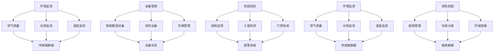

                 

## 第一部分：引言

### 1.1 智慧校园的背景和意义

#### 智慧校园的概念

智慧校园，也称为智能校园，是指利用现代信息技术，如物联网（IoT）、大数据、云计算和人工智能等，实现校园资源的智能化管理和高效利用，从而提升教育教学质量和校园管理水平。智慧校园不仅包括传统的教学、科研和管理活动，还涉及校园安全、后勤服务、环境监测等多个方面。

#### 智慧校园的建设背景

随着信息技术的飞速发展，特别是5G和IoT技术的成熟，智慧校园的建设成为教育领域的重要趋势。一方面，传统校园面临着管理效率低下、资源分配不均等问题，亟需通过技术创新来提升校园服务水平。另一方面，教育信息化政策的大力推动，也为智慧校园建设提供了良好的外部环境。

#### 智慧校园的重要意义

智慧校园建设具有重要意义。首先，它能够提升教育教学质量，实现个性化教育和智能化管理。其次，智慧校园有助于提高校园管理效率，降低运营成本。此外，智慧校园建设还能够增强校园安全，改善校园环境，提升师生的生活质量。

### 1.2 5G和IoT技术的基本概念

#### 5G技术概述

5G，即第五代移动通信技术，是当前移动通信技术发展的重要里程碑。5G网络具有高速度、大容量、低延迟的特点，能够支持高速数据传输和实时通信，为物联网应用提供了坚实的基础。

#### 物联网（IoT）的基本原理

物联网是指通过各种信息传感器、智能设备和网络将各种物体连接起来，实现信息的采集、传输和智能控制。IoT的核心在于信息的互联互通，通过数据分析和智能决策，实现对物理世界的有效管理和优化。

#### 5G和IoT技术的融合优势

5G和IoT技术的融合，为智慧校园建设提供了强大的技术支持。5G网络的低延迟、高速率和大连接能力，能够满足IoT设备的大量数据传输需求，提高校园网络的服务质量。同时，IoT技术的广泛应用，可以实现校园环境、设施、资源的全面监测和管理，提升校园智能化水平。

## 第二部分：5G技术

### 2.1 5G技术概述

#### 5G技术的历史演进

5G技术是移动通信技术的最新一代，其发展经历了1G、2G、3G和4G阶段。与 predecessors 相比，5G不仅在传输速度上有质的飞跃，还在网络架构、频谱利用和连接能力等方面取得了显著进步。

#### 5G技术的特点

5G技术的特点主要包括以下几个方面：

1. **高速率**：5G网络的理论峰值速率可以达到数十Gbps，远超4G网络。
2. **低延迟**：5G网络的延迟可低至1毫秒，比4G网络降低了10倍以上。
3. **大连接**：5G网络可以支持高达100万/平方公里的连接密度，为物联网应用提供了充足的空间。
4. **低能耗**：5G技术采用了更先进的调制技术和编码方案，能够降低能耗。

#### 5G技术的应用领域

5G技术的应用领域广泛，包括但不限于以下几个方面：

1. **智能家居**：5G技术可以实现智能家居设备的无缝连接，提供更加智能和便捷的家居生活体验。
2. **智能交通**：5G技术可以支持车联网（V2X）应用，提高交通效率和安全性。
3. **工业互联网**：5G技术可以用于工业生产过程中的设备监控、数据分析和智能决策，提高生产效率和产品质量。
4. **智慧医疗**：5G技术可以实现远程医疗、智能医疗设备和医疗大数据分析，提升医疗服务质量。

### 2.2 5G网络架构与关键技术

#### 5G网络架构

5G网络架构可以分为三个主要层次：接入层、传输层和核心网。其中，接入层负责无线接入，传输层负责数据传输，核心网负责用户管理和业务支持。

#### 5G关键技术分析

5G技术采用了多项关键技术，包括：

1. **毫米波技术**：毫米波频段具有高带宽，能够支持高速数据传输。
2. **MIMO技术**：多输入多输出技术可以增加无线通信的信道容量和可靠性。
3. **SDN/NFV技术**：软件定义网络和网络功能虚拟化技术可以灵活配置和管理网络资源，提高网络效率和服务质量。
4. **边缘计算**：边缘计算可以将计算任务从云端转移到网络边缘，减少数据传输延迟，提高应用性能。

#### 5G在网络建设中的挑战与机遇

5G网络建设面临着一系列挑战，包括高频段的频谱资源有限、网络覆盖范围广、建设成本高、网络管理和运维复杂等。然而，5G技术也为网络建设带来了新的机遇，例如：

1. **网络切片**：网络切片技术可以根据不同应用场景的需求，灵活分配网络资源，提高网络资源利用效率。
2. **多连接**：5G技术可以支持多种连接方式，包括蜂窝网络、卫星网络和无线局域网，为用户提供更加灵活和可靠的连接服务。
3. **智能化**：利用大数据、人工智能等技术，可以实现5G网络的智能监控、自动优化和故障预测，提高网络管理水平。

### 2.3 5G在校园网络建设中的应用

#### 5G网络在校园环境中的优势

5G网络在校园环境中具有以下优势：

1. **高速率**：5G网络可以提供更快的数据传输速度，支持高清视频、虚拟现实等高带宽应用。
2. **低延迟**：5G网络的低延迟特性可以支持实时教学、远程医疗等对延迟敏感的应用。
3. **大连接**：5G网络可以支持更多设备的连接，满足校园内多种应用场景的需求。
4. **灵活性**：5G网络可以根据校园需求灵活部署，支持校园网络的高效管理和运维。

#### 5G在校园网络建设中的应用案例

1. **智能教室**：5G网络可以支持智能教室的设备连接，包括智能白板、AR/VR设备、物联网传感器等，提升教学互动性和效果。
2. **校园安防**：5G网络可以支持校园安防系统的设备连接，包括监控摄像头、门禁系统、智能消防设备等，提高校园安全性。
3. **校园管理**：5G网络可以支持校园管理系统的设备连接，包括能耗管理系统、环境监控系统、资产管理系统等，提升校园管理效率。

## 第三部分：IoT技术

### 3.1 物联网的基本原理

#### 物联网的概念与分类

物联网（Internet of Things，简称IoT）是指通过互联网将各种设备、传感器、系统和物品连接起来，实现信息的采集、传输、处理和智能决策。根据物联网的连接对象和功能，物联网可以分为以下几类：

1. **消费类物联网**：主要应用于个人和家庭生活，如智能家居、可穿戴设备等。
2. **工业物联网**：应用于工业生产和制造业，如智能制造、工业自动化等。
3. **智能城市物联网**：应用于城市管理和公共服务，如智能交通、环境监测等。
4. **医疗物联网**：应用于医疗健康服务，如远程医疗、智能医疗器械等。

#### 物联网的关键技术

物联网的关键技术包括：

1. **传感器技术**：传感器是物联网的核心组成部分，用于感知环境信息和物理量。
2. **通信技术**：物联网设备需要通过网络进行通信，常用的通信技术包括无线传感器网络（WSN）、Wi-Fi、蓝牙、Zigbee、LoRa等。
3. **数据处理与存储技术**：物联网设备采集到的数据需要经过处理和存储，常用的数据处理技术包括数据清洗、数据挖掘、机器学习等。
4. **智能决策技术**：基于大数据分析和人工智能技术，物联网可以实现智能决策和智能控制。

#### 物联网在校园环境中的应用前景

物联网在校园环境中具有广泛的应用前景，可以提升校园管理效率、改善教学质量、提高师生生活质量。主要应用场景包括：

1. **环境监测**：利用物联网传感器实时监测校园环境参数，如空气质量、水质、温度、湿度等，为校园环境管理提供数据支持。
2. **设备管理**：通过物联网技术对校园内的设备进行智能监控和管理，如智能教室设备、安防设备、校园车辆等。
3. **能耗管理**：利用物联网技术对校园的能耗进行智能监测和管理，提高能源利用效率，降低运营成本。
4. **安全管理**：通过物联网技术实现校园安全监控和管理，如智能监控摄像头、门禁系统、入侵检测系统等。

### 3.2 IoT技术的应用场景

#### 环境监测

环境监测是物联网技术在校园中的一项重要应用。通过在校园内布置各种传感器，如空气质量传感器、水质传感器、温度传感器和湿度传感器等，可以实时监测校园环境的各项参数。这些数据可以用于以下几个方面：

1. **空气质量监测**：监测校园内空气质量，特别是在教室和宿舍等学生活动频繁的区域。通过空气质量监测系统，可以及时发现空气中的有害物质，采取相应的净化措施，保障师生的健康。
2. **水质监测**：监测校园内水质，特别是饮用水和游泳池水等。通过水质监测系统，可以确保水质安全，防止水质污染，保障师生的饮水安全和健康。
3. **温度和湿度监测**：监测校园内温度和湿度，特别是在实验室、图书馆、体育馆等特殊区域。通过温度和湿度监测系统，可以确保室内环境的舒适度，提高师生的学习、工作和生活体验。

#### 设备管理

设备管理是物联网技术在校园中的另一项重要应用。通过物联网技术，可以对校园内的各种设备进行智能监控和管理，提高设备的使用效率和安全性。具体应用场景包括：

1. **智能教室设备管理**：利用物联网技术，可以对教室内的设备进行智能监控和管理，如投影仪、电脑、音响等。通过物联网设备管理系统，可以实时了解设备的运行状态，及时发现和解决设备故障，确保教学活动的顺利进行。
2. **安防设备管理**：利用物联网技术，可以对校园内的安防设备进行智能监控和管理，如监控摄像头、门禁系统、入侵检测系统等。通过安防设备管理系统，可以实时监控校园的安全状况，及时响应和处理安全事件，提高校园的安全性。
3. **校园车辆管理**：利用物联网技术，可以对校园内的车辆进行智能监控和管理，如停车场管理系统、校园交通管理系统等。通过物联网车辆管理系统，可以实时监控车辆的运行状态，优化校园交通流量，提高校园交通效率。

#### 安全防护

安全防护是物联网技术在校园中的关键应用之一。通过物联网技术，可以实现对校园内人员和设施的安全监测和保护，提高校园的安全水平。具体应用场景包括：

1. **人员定位与追踪**：利用物联网技术，可以对校园内的人员进行实时定位和追踪。通过人员定位系统，可以确保师生在校园内的安全，防止人员走失和安全事故的发生。
2. **视频监控与报警**：利用物联网技术，可以在校园内布置监控摄像头，实时监控校园的安全状况。通过视频监控系统，可以及时发现异常情况，自动触发报警，及时采取措施应对。
3. **入侵检测与防范**：利用物联网技术，可以实现对校园内入侵行为的检测和防范。通过入侵检测系统，可以实时监测校园的周边环境，一旦检测到入侵行为，系统会自动触发警报，并通知安保人员及时进行处理。

### 3.3 IoT在校园环境监测和管理中的应用

#### 智能教室环境监控

智能教室环境监控是物联网技术在校园中的典型应用之一。通过在教室中布置各种传感器，如温度传感器、湿度传感器、空气质量传感器等，可以实时监测教室的环境状况。具体应用包括：

1. **实时数据监测**：通过物联网技术，可以将教室环境数据实时传输到校园管理平台，管理人员可以实时了解教室的环境状况，及时调整环境参数，确保教室环境的舒适性和安全性。
2. **智能调节**：根据监测到的环境数据，智能教室环境监控系统能够自动调节空调、风扇、空气净化器等设备，实现教室环境的智能调节，提高教学效果和师生的舒适度。
3. **能耗监测与管理**：智能教室环境监控系统能够监测教室的能耗情况，通过优化能源使用，降低能耗，提高能源利用效率。

#### 校园安防监控系统

校园安防监控系统是保障校园安全的重要手段。通过物联网技术，可以实现校园安防监控系统的智能化和高效化。具体应用包括：

1. **智能监控**：利用物联网技术，可以在校园内布置监控摄像头，实现24小时实时监控。通过智能监控系统，可以自动识别异常行为，如闯入、打架等，及时发出警报，通知安保人员进行处理。
2. **视频分析**：通过视频分析技术，可以对监控视频进行智能分析，如人脸识别、行为识别等，提高监控的准确性和效率。
3. **数据共享**：通过物联网技术，可以将安防监控系统与校园其他系统进行集成，如校园一卡通系统、门禁系统等，实现数据共享和联动，提高校园的安全管理水平。

#### 绿色校园建设

绿色校园建设是近年来校园发展的重要方向，物联网技术在绿色校园建设中具有重要作用。通过物联网技术，可以实现校园环境的智能监测和管理，提高校园的环保水平。具体应用包括：

1. **环境监测**：利用物联网技术，可以实时监测校园内的空气质量、水质、土壤等环境指标，通过智能分析，及时发现环境问题，采取相应的环保措施。
2. **能耗监测**：通过物联网技术，可以实时监测校园内的能耗情况，优化能源使用，降低能耗，提高能源利用效率。
3. **垃圾分类与回收**：利用物联网技术，可以实现对校园内垃圾分类和回收的智能管理。通过智能垃圾分类设备，可以自动识别垃圾类型，实现垃圾分类和回收，提高校园的环保水平。

## 第四部分：智慧校园建设

### 4.1 智慧校园建设概述

#### 智慧校园建设的核心目标

智慧校园建设旨在通过信息技术手段，实现校园资源的智能化管理和高效利用，提升教育教学质量和校园服务水平。具体核心目标包括：

1. **提高教育教学质量**：通过智能教学系统和教育资源的数字化管理，实现个性化教育和精准教学，提高学生的学习效果和教师的教学效率。
2. **提升校园服务水平**：通过智能化校园管理和便捷的师生服务系统，提升校园的生活质量和办事效率，增强师生的满意度和幸福感。
3. **保障校园安全**：通过智能安防系统和环境监控系统，提高校园的安全管理水平，保障师生的生命财产安全。

#### 智慧校园建设的现状

当前，智慧校园建设在全球范围内已经取得了显著进展。许多学校已经开始应用物联网、大数据、云计算和人工智能等现代信息技术，实现校园的智能化管理和服务。主要现状包括：

1. **智能教学系统**：许多学校已经部署了智能教学系统，包括在线学习平台、互动式教学工具等，实现了教学过程的数字化和智能化。
2. **校园安防系统**：通过视频监控、人脸识别、入侵检测等技术，提高了校园的安全水平。
3. **校园环境监测系统**：通过环境监测系统，实时监测校园内的空气质量、水质、温度、湿度等环境参数，保障校园环境的健康和舒适。
4. **智能后勤管理系统**：通过智能后勤管理系统，实现了校园内设施、设备和能源的智能监控和管理，提高了后勤服务的效率和质量。

#### 智慧校园建设的发展趋势

随着信息技术的不断进步和应用，智慧校园建设将继续向以下几个方向发展：

1. **智能化水平提升**：未来，智慧校园将更加智能化，通过人工智能、机器学习等技术的应用，实现更精准的教育教学和校园管理。
2. **物联网技术应用深化**：物联网技术在校园中的应用将进一步深化，实现更多场景的智能化监测和管理，如智能照明、智能安防、智能停车等。
3. **数据驱动的决策支持**：通过大数据分析和智能决策支持系统，学校可以更加科学地进行教育教学管理和校园服务优化。
4. **跨界融合**：智慧校园将与其他领域的技术和应用进行跨界融合，如智慧医疗、智慧交通等，实现校园与城市、社会的无缝连接。

### 4.2 5G+IoT在校园安防中的应用

#### 智能监控系统的设计与实施

智能监控系统是校园安防系统的重要组成部分。通过5G和IoT技术，可以实现校园监控系统的智能化和高效化。具体设计实施包括：

1. **摄像头布局**：根据校园的实际情况，合理规划摄像头布局，确保监控盲区的最小化和监控效果的优化。
2. **传感器配置**：在校园关键区域配置温度传感器、湿度传感器、烟雾传感器等，实现对环境参数的实时监测。
3. **视频数据传输**：利用5G网络的高速传输能力，确保监控视频数据的实时传输和远程访问。
4. **智能分析处理**：通过人工智能算法，对监控视频进行智能分析，如人脸识别、行为分析等，实现异常事件的自动识别和报警。

#### 校园安全事件的智能预警与处理

通过5G+IoT技术，可以实现校园安全事件的智能预警和处理。具体措施包括：

1. **实时数据监测**：通过物联网传感器和摄像头，实时监测校园内的安全状况，包括人员流量、异常行为等。
2. **智能预警系统**：利用大数据分析和人工智能技术，对监测数据进行分析，实现安全事件的智能预警，及时通知相关人员进行处理。
3. **应急处理预案**：制定完善的应急处理预案，包括应急响应流程、应急预案培训等，确保在发生安全事件时能够迅速有效地应对。

#### 校园安防设备的智能管理

通过5G+IoT技术，可以实现校园安防设备的智能管理，提高设备的使用效率和管理水平。具体措施包括：

1. **设备状态监测**：通过物联网技术，实时监测安防设备的运行状态，包括摄像头、门禁系统、烟雾报警器等，确保设备的正常工作。
2. **远程控制与维护**：通过5G网络，实现对安防设备的远程控制和维护，如远程调试、故障排除等，提高设备维护效率。
3. **设备使用记录**：记录安防设备的使用情况，如使用时长、使用频率等，为设备的更新和维护提供数据支持。

### 4.3 5G+IoT在校园教育中的应用

#### 智能教室环境监控

智能教室环境监控是5G+IoT技术在校园教育中的重要应用。通过物联网传感器和5G网络，可以实现教室环境的实时监测和智能调控。具体应用包括：

1. **温度和湿度控制**：通过温度和湿度传感器，实时监测教室的温度和湿度，自动调节空调和风扇，确保教室环境的舒适度。
2. **照明控制**：通过光照传感器，自动调节教室的照明强度，根据自然光的变化调整人工照明，节约能源。
3. **空气质量监测**：通过空气质量传感器，实时监测教室的空气质量，自动开启空气净化设备，改善室内空气质量。

#### 智慧课堂系统

智慧课堂系统是5G+IoT技术在教育中的应用之一。通过物联网设备和5G网络，可以实现课堂的数字化和智能化。具体应用包括：

1. **互动教学**：利用物联网设备，如平板电脑、手机等，实现师生之间的实时互动，提高课堂的互动性和参与度。
2. **在线资源访问**：通过5G网络，师生可以随时访问在线教学资源，如电子书籍、教学视频等，丰富教学内容和形式。
3. **个性化学习**：通过大数据分析和人工智能技术，为每位学生制定个性化的学习方案，提高学习效果。

#### 教学设备智能管理

通过5G+IoT技术，可以实现教学设备的智能管理，提高教学设备的使用效率和管理水平。具体措施包括：

1. **设备状态监测**：通过物联网传感器，实时监测教学设备的运行状态，包括电脑、投影仪、音响系统等，确保设备的正常使用。
2. **远程控制与维护**：通过5G网络，实现对教学设备的远程控制和维护，如远程重启、故障排除等，提高设备维护效率。
3. **设备使用记录**：记录教学设备的使用情况，如使用时长、使用频率等，为设备的更新和维护提供数据支持。

### 4.4 5G+IoT在校园后勤管理中的应用

#### 校园能耗管理系统

校园能耗管理系统是5G+IoT技术在校园后勤管理中的重要应用。通过物联网传感器和5G网络，可以实现校园能耗的实时监测和智能管理。具体应用包括：

1. **能耗监测**：通过在校园各区域布置能耗传感器，实时监测电、水、气等各类能耗，确保能耗数据的准确性和及时性。
2. **能耗分析**：通过对能耗数据的分析和挖掘，找出能耗的高峰时段和浪费点，为能耗优化提供数据支持。
3. **智能调控**：通过智能调控系统，根据能耗数据自动调整校园各类设施的能耗，如空调、照明、电梯等，降低能耗，提高能源利用效率。

#### 校园车辆管理系统

校园车辆管理系统是5G+IoT技术在校园后勤管理中的应用之一。通过物联网设备和5G网络，可以实现校园车辆的智能监控和管理。具体应用包括：

1. **车辆状态监测**：通过在校园车辆上安装传感器，实时监测车辆的运行状态，包括速度、位置、油耗等。
2. **车辆调度与优化**：通过车辆管理系统，可以实时了解校园车辆的运行情况，实现车辆的科学调度和优化，提高车辆使用效率。
3. **停车管理**：通过物联网技术和5G网络，实现校园停车场的智能管理和调度，提高停车场的使用效率和便利性。

#### 绿色校园建设

绿色校园建设是校园后勤管理的重要内容，通过5G+IoT技术，可以实现校园环境的智能监测和绿色化管理。具体应用包括：

1. **环境监测**：通过在校园内布置各种传感器，实时监测校园内的空气质量、水质、土壤等环境参数，确保校园环境的健康和舒适。
2. **能源管理**：通过物联网技术和5G网络，实现校园能源的智能监测和管理，降低能耗，提高能源利用效率。
3. **垃圾分类与回收**：通过物联网技术和5G网络，实现校园内垃圾分类与回收的智能管理，提高校园的环保水平。

## 第五部分：实施策略与案例分析

### 5.1 智慧校园建设实施策略

#### 制定总体规划

智慧校园建设是一个复杂的系统工程，需要制定详细的总体规划。总体规划应包括以下几个方面：

1. **需求分析**：对校园的需求进行全面的调研和分析，明确智慧校园建设的目标和需求。
2. **技术选型**：根据校园的需求，选择适合的技术方案，包括5G网络、IoT设备、云计算平台等。
3. **预算与进度安排**：制定详细的预算和进度安排，确保智慧校园建设项目的顺利进行。

#### 确保数据安全和隐私保护

在智慧校园建设中，数据安全和隐私保护至关重要。需要采取以下措施：

1. **数据加密**：对传输和存储的数据进行加密，确保数据的安全性。
2. **身份认证**：建立严格的身份认证机制，确保只有授权用户可以访问数据。
3. **数据备份与恢复**：定期进行数据备份，确保在发生数据丢失或故障时能够迅速恢复。

#### 强化人员培训

智慧校园建设需要各类专业人才的参与，包括技术人员、管理人员、教师和学生等。因此，需要加强对以下人员的培训：

1. **技术人员**：提供5G、IoT、大数据等相关技术的培训，提高技术人员的技术水平。
2. **管理人员**：提供项目管理、团队协作等方面的培训，提高管理人员的综合能力。
3. **教师和学生**：提供信息化教学和智能校园应用等方面的培训，提高他们的信息化素养。

#### 营造良好的校园文化

智慧校园建设不仅仅是技术问题，更是一个文化问题。需要营造良好的校园文化，包括：

1. **创新意识**：鼓励师生创新思维，勇于尝试新的教学方法和管理模式。
2. **协作精神**：强调团队协作，鼓励师生共同参与智慧校园建设。
3. **持续改进**：智慧校园建设是一个持续改进的过程，需要不断收集反馈和改进，提高校园服务水平。

### 5.2 典型案例分析

#### 案例一：某高校智慧校园建设

某高校在智慧校园建设中，采用了5G和IoT技术，实现了智能教学、校园安防、环境监测等多个方面的智能化。具体案例分析如下：

1. **智能教学**：通过5G网络，实现了校园内的无线网络覆盖，提供了高速、稳定的网络环境。利用IoT设备，如智能教室设备、平板电脑等，实现了互动式教学，提高了教学效果。
2. **校园安防**：通过安装高清监控摄像头和智能报警系统，实时监控校园的安全状况，提高了校园的安全水平。通过人脸识别技术，实现了校园出入管理的智能化。
3. **环境监测**：通过在校园内布置各种物联网传感器，如空气质量传感器、水质传感器等，实时监测校园的环境参数，保障校园环境的健康和舒适。

#### 案例二：某中学智慧校园建设

某中学在智慧校园建设中，注重环保和节能，采用了5G和IoT技术，实现了校园环境的智能监测和绿色化管理。具体案例分析如下：

1. **环保监测**：通过物联网传感器，实时监测校园的空气质量、水质、土壤等环境参数，保障校园环境的健康。通过智能分析，及时发现环境问题，采取相应的环保措施。
2. **能耗管理**：通过能耗管理系统，实时监测校园的能耗情况，优化能源使用，降低能耗。通过智能调控系统，自动调整校园各类设施的能耗，提高能源利用效率。
3. **垃圾分类与回收**：通过物联网技术和智能垃圾分类设备，实现了校园内垃圾分类与回收的智能管理，提高了校园的环保水平。

### 5.3 实施挑战与解决方案

#### 实施挑战

在智慧校园建设的实际过程中，可能会遇到以下挑战：

1. **技术难度**：5G和IoT技术的应用涉及到复杂的网络架构和技术实现，需要专业技术人员进行部署和维护。
2. **数据安全**：智慧校园建设过程中会产生大量数据，如何保障数据的安全性和隐私性是一个重要问题。
3. **成本投入**：智慧校园建设需要大量的资金投入，包括设备采购、网络建设、系统开发等。
4. **人员培训**：智慧校园建设需要各类专业人才的参与，如何进行有效的培训和培养是关键。

#### 解决方案

针对上述挑战，可以采取以下解决方案：

1. **技术培训与支持**：提供专业的技术培训和持续的技术支持，确保技术人员能够熟练掌握5G和IoT技术。
2. **数据安全策略**：建立完善的数据安全策略，包括数据加密、身份认证、数据备份等，确保数据的安全和隐私。
3. **资金预算管理**：制定详细的资金预算计划，合理安排资金投入，确保智慧校园建设项目的资金充足。
4. **人才引进与培养**：通过人才引进和内部培养相结合的方式，提高智慧校园建设的人才储备，确保项目顺利实施。

## 第六部分：未来展望

### 6.1 5G+IoT在智慧校园建设中的发展趋势

随着5G和IoT技术的不断发展和成熟，智慧校园建设将迎来新的发展趋势：

1. **网络速度提升**：5G技术的广泛应用将进一步提升校园网络的速度，实现更快的数据传输和实时通信，为智慧校园的应用提供坚实的基础。
2. **智能化水平提高**：通过人工智能、大数据等技术的深入应用，智慧校园的智能化水平将进一步提高，实现更精准的教育教学和校园管理。
3. **物联网应用场景扩展**：物联网技术在校园中的应用将不断扩展，覆盖更多的场景和领域，实现校园环境的全面智能化。
4. **跨界融合**：智慧校园将与智慧城市、智慧医疗等领域进行深入融合，实现更广泛的应用和服务。

### 6.2 未来校园的可能形态

未来的校园将是一个高度智能化、数字化和生态化的教育环境。具体可能形态包括：

1. **智能教室**：教室内的设备将实现高度智能化，包括智能白板、智能投影仪、智能音响系统等，支持多种教学模式和教学资源。
2. **智慧校园管理**：校园管理将实现全方位的智能化，包括安全监控、环境监测、能耗管理、停车管理等多个方面，提高校园管理效率和服务质量。
3. **个性化教育**：通过大数据和人工智能技术，实现个性化教育和学习，为每个学生提供最适合的学习方案和资源。
4. **绿色校园**：通过物联网技术和环保措施，实现校园环境的智能化监测和绿色化管理，构建生态友好的校园环境。

### 6.3 5G+IoT技术对教育模式的改变

5G和IoT技术的应用将对教育模式产生深刻影响，具体体现在以下几个方面：

1. **在线教育与远程教育**：5G网络的高速传输能力和低延迟特性，将大大提升在线教育和远程教育的质量，实现全球范围内的教育资源共享。
2. **互动式教学**：通过物联网设备和5G网络，实现师生之间的实时互动，提高课堂的互动性和参与度，促进教学效果的提升。
3. **智能教育辅助**：利用人工智能技术，为学生提供个性化的学习辅助，如智能辅导、学习分析等，帮助学生更好地理解和掌握知识。
4. **教育数据的深度分析**：通过对教育数据的深度分析，学校可以更加科学地进行教育教学管理和决策，优化教育资源配置，提高教育质量。

## 总结

智慧校园建设是教育领域的重要趋势，通过5G和IoT技术的应用，可以实现校园资源的智能化管理和高效利用，提升教育教学质量和校园服务水平。本文详细介绍了5G和IoT技术在智慧校园建设中的应用，包括校园安防、教育教学、后勤管理等多个方面。同时，分析了智慧校园建设的实施策略和未来发展趋势，为智慧校园建设提供了参考和指导。

### 附录

#### 5G技术特点对比表格

| 特点 | 5G | 4G |
| ---- | ---- | ---- |
| 传输速度 | 高速 | 较快 |
| 延迟 | 低延迟 | 较高 |
| 连接数 | 大连接 | 较少 |
| 能耗 | 低能耗 | 高能耗 |

#### 物联网技术应用场景ER实体关系图

通过上述对比表格和ER实体关系图，我们可以更直观地了解5G和IoT技术在智慧校园建设中的应用特点和应用场景。

## 作者信息

作者：AI天才研究院/AI Genius Institute & 禅与计算机程序设计艺术 /Zen And The Art of Computer Programming

### 最佳实践 Tips

1. **提前规划**：在开展智慧校园建设前，应进行全面的需求分析和总体规划，确保项目顺利进行。
2. **数据安全**：重视数据安全和隐私保护，建立完善的数据安全策略和制度。
3. **技术培训**：加强技术人员和管理人员的培训，提高他们对5G和IoT技术的掌握和应用能力。
4. **持续优化**：智慧校园建设是一个持续优化和改进的过程，应根据实际应用情况进行调整和优化。

### 小结

本文详细介绍了5G+IoT在智慧校园建设中的应用，包括技术特点、应用场景、实施策略和未来展望。通过本文的阐述，读者可以全面了解5G和IoT技术在智慧校园建设中的重要性和应用价值，为智慧校园的建设提供参考和指导。

### 注意事项

1. **技术成熟度**：在引入5G和IoT技术时，应注意技术的成熟度和兼容性，确保技术的稳定性和可靠性。
2. **成本控制**：在项目实施过程中，应注意成本控制，合理安排预算，确保项目的资金充足。
3. **用户参与**：在智慧校园建设中，应充分考虑师生的需求和反馈，提高用户的参与度和满意度。

### 拓展阅读

1. **5G网络架构与关键技术**：深入探讨5G网络的架构和关键技术，了解5G网络的优势和应用场景。
2. **物联网在校园环境监测中的应用**：详细分析物联网技术在校园环境监测中的具体应用和实现方法。
3. **智慧校园建设实践案例**：分享国内外智慧校园建设的成功案例和实践经验，为读者提供参考和借鉴。

