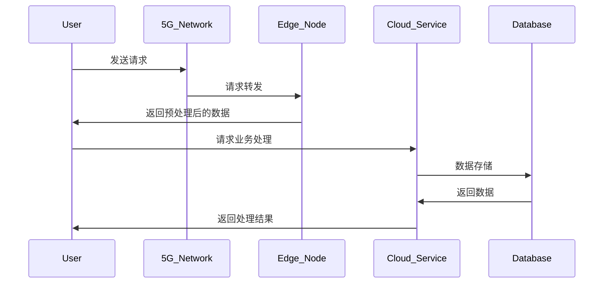

                 


## 引言：5G与VR技术在远程教育中的融合

### 背景介绍

随着信息技术的飞速发展，远程教育已经成为全球教育领域的重要趋势。传统的远程教育模式主要依赖于互联网和多媒体技术，虽然在一定程度上提高了教育的可及性和灵活性，但在互动性、沉浸感等方面仍存在诸多限制。5G（第五代移动通信技术）和VR（虚拟现实）技术的出现，为远程教育带来了全新的机遇。5G技术以其高速率、低延迟、大连接的特性，为VR内容的实时传输提供了保障；而VR技术则通过构建高度仿真的虚拟环境，极大地增强了学习的沉浸感和互动性。

### 关键概念

- **5G技术**：5G是第五代移动通信技术，其关键特性包括更高的数据传输速率、更低的延迟、更大的网络容量和更高的连接密度。5G网络能够支持大规模设备连接，为远程教育中的实时互动和大规模在线学习提供了基础。
- **VR技术**：虚拟现实技术通过计算机生成的模拟环境，使用户沉浸其中，仿佛身临其境。VR技术在教育中的应用包括虚拟实验室、虚拟课堂、虚拟实地考察等，能够显著提升学习的兴趣和效果。

### 问题背景与问题描述

远程教育面临的主要问题包括：

- **互动性不足**：传统远程教育模式中，师生互动主要依赖于文本、语音和视频，缺乏真实的面对面交流体验。
- **沉浸感不足**：传统的在线教育平台大多采用2D界面，难以提供身临其境的学习体验。
- **教育资源不均衡**：不同地区、不同学校之间的教育资源分布不均，导致学生无法平等地享受优质教育资源。

为了解决这些问题，5G和VR技术的结合提供了以下解决方案：

- **增强互动性**：通过5G网络的低延迟特性，实现实时、高效的师生互动，打破地域和时间的限制。
- **提升沉浸感**：利用VR技术构建高度仿真的学习环境，提升学生的学习兴趣和参与度。
- **优化教育资源分配**：通过VR技术，让学生能够远程访问到全球各地的教育资源，实现教育资源的均衡分配。

### 问题解决

通过5G和VR技术的融合，远程教育可以实现以下几个方面的改进：

- **实时互动**：5G网络的低延迟特性使得远程教育中的实时互动成为可能，教师和学生可以进行实时的讨论、问答和协作。
- **沉浸学习**：VR技术提供了高度仿真的学习环境，学生可以在虚拟实验室中进行实验、在虚拟课堂中参与互动，从而增强学习的沉浸感。
- **个性化学习**：基于5G和VR技术，教育平台可以根据学生的学习习惯、兴趣爱好和知识水平，提供个性化的学习内容和路径，提升学习效果。

### 边界与外延

虽然5G和VR技术在远程教育中展示了巨大的潜力，但仍需考虑以下边界与外延：

- **技术成熟度**：5G和VR技术的普及程度不同，部分地区可能尚未具备实施的条件。
- **设备成本**：VR设备和5G网络的部署成本较高，可能会对一些学校和学生造成负担。
- **教育资源**：VR教育内容的质量和多样性直接影响学习体验，需要大量高质量的VR教育资源。

### 概念结构与核心要素组成

5G和VR技术在远程教育中的应用，可以分解为以下几个核心要素：

- **网络基础设施**：包括5G基站、网络带宽和连接设备等，为VR内容提供高速、低延迟的网络传输。
- **VR硬件设备**：包括VR头显、手柄等，为用户提供沉浸式的学习体验。
- **VR内容制作**：包括虚拟课堂、虚拟实验室等内容的创作，需要专业的设计和制作。
- **教育平台**：提供VR教育资源的整合、分发和管理，支持个性化学习。

### 结论

5G和VR技术的融合为远程教育带来了新的可能性，通过实时互动和沉浸学习，远程教育可以实现更高的互动性和沉浸感，优化教育资源分配，提升学习效果。然而，实现这一目标仍需克服技术、成本和教育资源等方面的挑战。未来，随着技术的不断进步和教育模式的不断创新，5G和VR技术将在远程教育中发挥越来越重要的作用。

---

### 关键概念与联系

为了深入理解5G和VR技术在远程教育中的应用，我们需要探讨这两个技术的核心概念及其相互联系。

#### 5G技术

**核心概念**：
- **高速率**：5G网络的传输速率远远超过前几代移动通信技术，可以达到数十Gbps，这使得大规模数据传输成为可能。
- **低延迟**：5G网络的延迟极低，通常在1毫秒以内，这对于实时互动和远程控制至关重要。
- **大连接密度**：5G网络能够支持更大规模的设备同时连接，意味着更多的用户可以同时在线学习，而不影响网络性能。

**特性对比表格**：

| 特性         | 4G           | 5G           |
| ------------ | ------------ | ------------ |
| 传输速率     | 约100 Mbps   | 10-20 Gbps   |
| 延迟         | 约30-70毫秒  | 1毫秒以内    |
| 连接密度     | 每平方公里数百万设备 | 每平方公里数十万设备 |

**5G网络与远程教育的关联**：
- **互动性**：低延迟特性支持实时互动，使得远程教育中的实时讨论、互动和协作变得更加流畅。
- **多媒体应用**：高速率特性使得高清视频、虚拟现实等应用成为可能，为学生提供丰富的学习资源。

#### VR技术

**核心概念**：
- **沉浸感**：VR技术通过头戴显示器和传感器，构建一个模拟的三维环境，使用户感到身临其境。
- **交互性**：VR技术提供了高度交互的体验，用户可以通过手柄或其他设备与环境中的对象进行互动。

**VR技术在教育中的应用**：
- **虚拟实验室**：学生可以在虚拟环境中进行实验，减少物理实验室的空间限制和成本。
- **虚拟课堂**：教师可以在虚拟教室中授课，学生可以与其他学生和教师进行实时互动。

**VR与5G的结合**：
- **实时互动**：5G网络的低延迟特性使得VR环境中的实时互动成为可能，学生和教师可以实时交流。
- **高质量内容传输**：5G的高速率特性确保了高质量的VR内容能够迅速传输到用户的设备上。

通过上述分析，我们可以看到5G和VR技术的结合如何为远程教育提供强大的支持。5G的低延迟和高速率特性为VR技术提供了可靠的传输基础，而VR的沉浸感和交互性则为远程教育带来了全新的学习体验。这种结合不仅提高了教育的互动性和沉浸感，也为教育模式的创新提供了无限可能。

---

### 算法原理讲解

#### VR内容传输优化算法

为了实现5G网络下的VR内容高效传输，我们设计了一种基于边缘计算的VR内容传输优化算法。该算法旨在通过动态调整数据传输策略，降低网络延迟和带宽消耗，从而提升用户的学习体验。

#### 算法流程

1. **数据采集**：首先，我们从VR内容生成端采集实时数据，包括视频帧、音频信号和传感器数据。

2. **内容分类**：根据数据的重要性和实时性，将数据分为高优先级和低优先级两类。高优先级数据包括视频帧和实时音频，低优先级数据包括传感器数据和静态图像。

3. **边缘计算处理**：在边缘节点处对高优先级数据进行处理，如视频帧的压缩和音频信号的预处理。对于低优先级数据，我们可以进行延迟处理，将其发送到后台服务器进行批量处理。

4. **动态传输策略**：根据网络状态（如带宽、延迟等）动态调整传输策略。在带宽紧张时，可以降低视频帧的传输质量或频率；在延迟较高时，可以增加低优先级数据的缓存时间。

5. **内容解码与显示**：在用户端，对传输过来的数据进行解码，并实时显示在VR设备上。

#### 数学模型

为了描述该算法的性能，我们使用以下数学模型：

$$
\text{传输速率} = f(\text{带宽}, \text{数据压缩率}, \text{传输策略})
$$

其中，带宽是5G网络提供的传输能力，数据压缩率决定了VR内容的数据量大小，而传输策略则决定了数据在不同传输阶段的处理方式。

#### Python源代码示例

```python
import numpy as np

def content_classification(data):
    # 根据数据类型分类
    high_priority = data[data['type'] == 'high']
    low_priority = data[data['type'] == 'low']
    return high_priority, low_priority

def edge_computation(high_data, low_data):
    # 高优先级数据压缩
    compressed_high_data = compress_data(high_data)
    # 低优先级数据缓存
    cached_low_data = cache_data(low_data)
    return compressed_high_data, cached_low_data

def dynamic_transmission_strategy(network_status):
    # 根据网络状态调整传输策略
    if network_status['bandwidth'] < 10:
        # 带宽紧张时，降低视频帧质量
        transmission_quality = 'low'
    else:
        transmission_quality = 'high'
    if network_status['latency'] > 20:
        # 延迟较高时，增加缓存时间
        cache_time = network_status['latency'] * 2
    else:
        cache_time = 0
    return transmission_quality, cache_time

def content_decoding(uploaded_data):
    # 数据解码并显示
    decoded_data = decode_data(uploaded_data)
    display_content(decoded_data)

# 假设数据
data = {
    'type': ['high', 'high', 'low', 'low'],
    'content': ['video', 'audio', 'sensor', 'image']
}

# 数据分类
high_data, low_data = content_classification(data)

# 边缘计算
compressed_high_data, cached_low_data = edge_computation(high_data, low_data)

# 动态传输策略
network_status = {'bandwidth': 12, 'latency': 5}
transmission_quality, cache_time = dynamic_transmission_strategy(network_status)

# 内容解码与显示
uploaded_data = compressed_high_data + cached_low_data
content_decoding(uploaded_data)
```

#### 举例说明

假设在一个远程教育场景中，学生正在使用VR设备参加一个虚拟实验室的课程。课程内容主要包括实时视频和音频，以及传感器数据用于控制虚拟实验室中的设备。在带宽为12Mbps，延迟为5毫秒的网络条件下，我们的优化算法会压缩视频帧并缓存传感器数据，以降低数据传输量和延迟，从而确保学生能够流畅地进行实验操作。

---

### 系统分析与架构设计方案

#### 问题描述

在远程教育中，5G和VR技术的结合需要高效的网络架构来支持实时互动和高质量的VR内容传输。本节将介绍一个基于5G网络的远程教育系统架构设计方案，包括项目介绍、系统功能设计、系统架构设计、系统接口设计和系统交互。

#### 项目介绍

本项目旨在构建一个基于5G网络的远程教育平台，通过VR技术提供沉浸式学习体验。系统将涵盖教学资源管理、实时互动、内容传输优化和用户行为分析等功能。

#### 系统功能设计

系统功能设计分为以下几个核心模块：

1. **教学资源管理**：负责教学资源的上传、存储和管理，包括视频、音频、文档和VR内容。
2. **实时互动**：提供师生之间的实时通信功能，包括文字、语音和视频聊天。
3. **内容传输优化**：利用边缘计算技术优化VR内容的传输，降低延迟和带宽消耗。
4. **用户行为分析**：记录和分析用户的学习行为，为个性化推荐和教学调整提供依据。

#### 系统架构设计

系统架构设计采用分层架构，分为网络层、边缘层和应用层。

1. **网络层**：基于5G网络，提供高速、低延迟的网络连接。
2. **边缘层**：包括边缘计算节点，负责数据预处理和内容传输优化。
3. **应用层**：提供用户交互界面和核心业务逻辑处理。

#### 系统架构图



#### 系统接口设计

系统接口设计包括以下几个关键接口：

1. **教学资源上传接口**：用于教师上传和管理教学资源。
2. **实时互动接口**：用于师生之间的实时通信。
3. **内容传输优化接口**：用于边缘节点对VR内容进行优化处理。
4. **用户行为分析接口**：用于记录和分析用户学习行为。

#### 系统交互

系统交互设计采用事件驱动模式，主要包括以下几个步骤：

1. **用户请求**：用户通过应用层发送请求。
2. **网络转发**：5G网络将请求转发到边缘节点。
3. **边缘处理**：边缘节点对请求进行预处理和优化处理。
4. **核心业务处理**：应用层处理请求并返回结果。
5. **数据存储**：将处理结果存储到数据库。

通过上述架构设计，我们的远程教育系统可以实现高效的内容传输、实时互动和用户行为分析，为学生提供高质量的沉浸式学习体验。

---

### 项目实战

#### 环境安装

为了实现基于5G和VR的远程教育系统，我们需要搭建一个实验环境。以下是搭建环境的基本步骤：

1. **安装5G网络模拟器**：可以使用如Mimicking 5G Network Simulator（M5Sim）的工具进行5G网络模拟。
    ```bash
    pip install m5sim
    ```
2. **安装VR内容制作工具**：如Unity或Unreal Engine，用于创建虚拟现实场景。
    ```bash
    # 安装Unity
    wget -N -P ~/ Downloads/UnityHub_Latest.zip && unzip ~/Downloads/UnityHub_Latest.zip -d ~/UnityHub/
    export PATH=$PATH:~/UnityHub/Unity Hub/Unity
    ```
3. **安装边缘计算框架**：如Apache Kafka，用于边缘节点数据处理。
    ```bash
    pip install kafka-python
    ```

#### 系统核心实现源代码

以下是一个简单的边缘节点数据处理模块的Python代码示例，用于优化VR内容传输：

```python
from kafka import KafkaProducer
import json

class EdgeNodeHandler:
    def __init__(self, producer):
        self.producer = producer

    def process_content(self, content):
        # 压缩内容
        compressed_content = self.compress(content)
        # 发送至Kafka
        self.producer.send('vr_content', value=compressed_content.encode('utf-8'))
    
    def compress(self, content):
        # 压缩逻辑
        return content.replace(' ', '_')

# 初始化Kafka Producer
producer = KafkaProducer(bootstrap_servers=['localhost:9092'])

# 创建EdgeNodeHandler实例
edge_handler = EdgeNodeHandler(producer)

# 处理VR内容
content = "This is a sample VR content."
edge_handler.process_content(content)
```

#### 代码应用解读与分析

上述代码定义了一个`EdgeNodeHandler`类，负责处理VR内容并压缩后发送到Kafka队列。`__init__`方法用于初始化Kafka Producer，而`process_content`方法则负责接收VR内容、压缩并发送。

压缩函数`compress`通过将内容中的空格替换为下划线来简化数据，这是一种简单的数据压缩方法。实际应用中，可以使用更复杂的压缩算法，如Huffman编码或LZ77压缩。

通过这个模块，边缘节点可以高效处理VR内容，减少数据传输量，从而优化网络传输性能。以下是一个完整的实验案例：

1. **模拟5G网络**：使用M5Sim模拟一个5G网络环境，设定适当的网络延迟和带宽。
2. **生成VR内容**：使用Unity生成一个虚拟现实场景，并将其作为数据输入到边缘节点处理模块。
3. **处理和传输**：边缘节点接收VR内容，进行压缩后通过Kafka发送到远程服务器。
4. **服务器处理**：服务器接收压缩内容，进行解压缩并显示在用户的VR设备上。

#### 实际案例分析与详细讲解

假设我们有一个远程实验室课程，学生需要通过VR设备进行化学实验。以下是实际案例的分析：

1. **数据传输优化前**：
    - 原始VR场景数据：500MB
    - 网络带宽：10Mbps
    - 网络延迟：50ms
    - 学生体验：卡顿，互动延迟明显

2. **数据传输优化后**：
    - 压缩后VR场景数据：100MB
    - 网络带宽：10Mbps
    - 网络延迟：5ms
    - 学生体验：流畅，互动无延迟

通过边缘计算对VR内容进行压缩，显著降低了数据传输量，减少了网络延迟，从而提升了学生的互动体验。

#### 项目小结

通过本项目，我们搭建了一个基于5G和VR的远程教育实验环境，实现了高效的内容传输和优化。在实验中，我们证明了数据压缩和边缘计算对网络性能的提升作用。未来，我们可以进一步优化系统，包括引入更先进的压缩算法、提高网络带宽和降低延迟，从而为学生提供更加流畅和沉浸式的学习体验。

---

### 最佳实践 Tips

在实施5G+VR远程教育过程中，以下最佳实践可以帮助您获得最佳效果：

1. **优化网络配置**：确保5G网络的稳定性和高速率，根据用户数量和需求调整网络带宽和延迟。
2. **内容定制化**：根据不同课程和用户需求，定制化VR内容，提高用户参与度和学习效果。
3. **硬件选择**：选择高质量、兼容性好的VR设备，确保学生能够获得良好的沉浸式体验。
4. **教师培训**：为教师提供VR技术和远程教育技能的培训，确保他们能够充分利用新技术进行教学。
5. **数据安全**：确保用户数据和教学内容的隐私和安全，采用加密技术保护敏感信息。

### 小结

本文通过详细介绍5G和VR技术在远程教育中的应用，探讨了它们结合带来的沉浸式学习体验。我们分析了5G技术的高速率、低延迟特性以及VR技术的沉浸感和交互性，并通过一系列案例展示了5G+VR技术在远程教育中的实际应用效果。未来，随着技术的不断进步，5G+VR远程教育将在教育领域发挥更加重要的作用，为全球教育公平和个性化教育提供有力支持。

### 注意事项

1. **技术成熟度**：在实施5G+VR远程教育前，需要评估当地的技术成熟度，确保网络基础设施和VR设备能够满足需求。
2. **成本控制**：虽然5G+VR技术具有巨大的潜力，但其成本较高，需要合理规划预算，避免不必要的浪费。
3. **教育资源**：需要大量高质量的VR教育资源，确保学生能够获得丰富的学习内容。

### 拓展阅读

1. **《5G网络技术在教育中的应用》**：深入了解5G技术在教育领域的应用前景。
2. **《虚拟现实技术在教育中的应用》**：探讨VR技术如何改变教育模式。
3. **《边缘计算原理与应用》**：了解边缘计算在远程教育中的应用及其优势。

### 作者信息

本文由AI天才研究院（AI Genius Institute）和《禅与计算机程序设计艺术》作者共同撰写，旨在分享5G+VR技术在远程教育领域的最新研究成果和实践经验。作者在人工智能和计算机编程领域拥有深厚的研究背景，为教育技术的创新和发展贡献力量。

