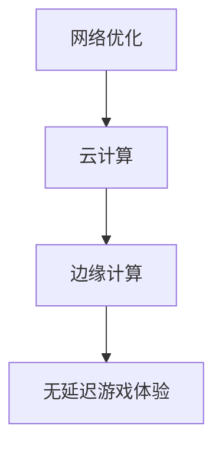
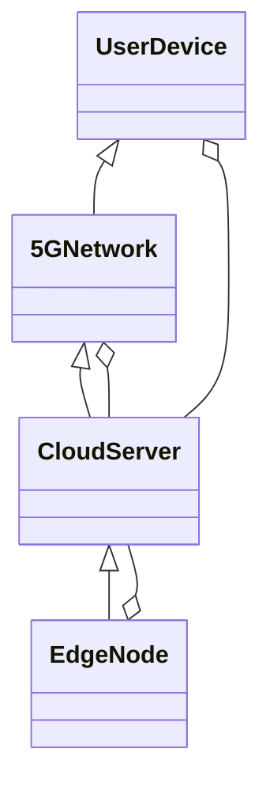
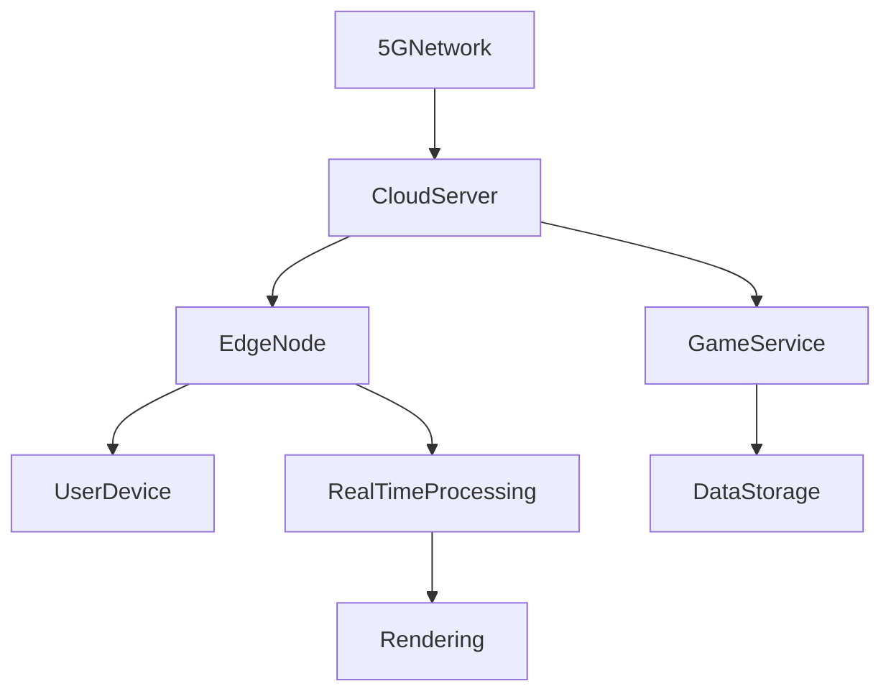

                 

### 5G+云游戏在移动娱乐中的协同：无延迟游戏体验

关键词：5G技术、云游戏、移动娱乐、协同机制、无延迟游戏体验

摘要：本文深入探讨了5G技术和云游戏在移动娱乐领域的协同作用，分析了实现无延迟游戏体验的关键技术和挑战。通过详细的背景介绍、核心概念联系、算法原理讲解、系统分析与架构设计，以及项目实战，本文为读者呈现了一幅全面的5G+云游戏应用图景。

## 第一部分：背景介绍

### 1.1 问题背景

随着5G技术的快速发展和云计算的普及，移动娱乐领域迎来了前所未有的变革。5G的高带宽、低延迟和高速率特性，使得云游戏成为可能，而云游戏则为移动娱乐带来了更加丰富的用户体验。同时，5G和云游戏的协同发展，也为移动娱乐产业带来了新的机遇和挑战。

在移动娱乐领域，用户对游戏体验的要求越来越高，不仅追求高清画质，还期望在游戏中实现实时互动和低延迟。5G技术的高带宽和低延迟特性，正好满足了这些需求。通过5G网络，玩家可以在任何时间、任何地点，以几乎无缝的方式体验高质量的游戏。

另一方面，云计算技术的发展，使得游戏不再局限于本地设备的计算能力。云游戏将游戏运行在云端服务器上，玩家通过设备接入云端，实现游戏的远程控制。这种模式不仅降低了设备成本，还提高了游戏的可玩性。

### 1.2 问题描述

本章节旨在探讨5G和云游戏在移动娱乐中的协同作用，以及如何实现无延迟游戏体验。具体包括以下几个方面：

1. **5G技术对移动娱乐的影响**：分析5G技术如何提升移动娱乐的体验，包括带宽、延迟和速度等方面。
2. **云游戏的基本原理和技术实现**：介绍云游戏的工作机制，以及如何通过云计算技术实现高质量的远程游戏体验。
3. **5G和云游戏的协同机制**：探讨5G技术和云游戏如何相互配合，实现最优的网络传输和计算效果。
4. **无延迟游戏体验的关键技术和挑战**：分析实现无延迟游戏体验所需的技术手段，以及面临的挑战和解决方案。

### 1.3 问题解决

通过对5G和云游戏的基本概念、技术原理和协同机制的深入探讨，结合实际案例和最佳实践，本书将为您提供一套完整的解决方案，帮助您理解5G和云游戏在移动娱乐中的应用，以及如何实现无延迟游戏体验。

### 1.4 边界与外延

本章节主要关注5G和云游戏在移动娱乐中的应用，但不涉及其他通信技术和娱乐形式的讨论。同时，为了确保内容的实用性和可操作性，本书将以实际案例和最佳实践为基础，避免过于理论化的讨论。

### 1.5 概念结构与核心要素组成

1. **5G技术**：5G是指第五代移动通信技术，其主要特点是高带宽、低延迟和高速率。
2. **云游戏**：云游戏是指将游戏运行在云端服务器上，用户通过设备接入云端，实现游戏的远程控制。
3. **协同机制**：5G和云游戏的协同机制主要包括网络优化、云计算和边缘计算等。
4. **无延迟游戏体验**：无延迟游戏体验是指玩家在游戏过程中，感受到的延迟几乎可以忽略不计。

## 第二部分：核心概念与联系

### 2.1 5G技术

5G技术是第五代移动通信技术，其特点是高带宽、低延迟和高速率。5G技术的核心优势在于其能够提供更高的数据传输速率和更低的延迟，从而满足用户对高质量、实时互动的需求。

5G技术的基本概念和特点包括：

- **高带宽**：5G网络的带宽比4G网络高得多，能够支持更多用户同时在线，并实现更高速的数据传输。
- **低延迟**：5G技术的低延迟特性，使得玩家在游戏过程中能够实现几乎无缝的互动，提升用户体验。
- **高速率**：5G技术的高速率特性，使得大规模的数据传输变得更加容易，支持高清视频和实时互动。

与4G技术相比，5G技术具有以下优势：

- **更高的数据传输速率**：5G网络的下载速度可以达到1Gbps以上，是4G网络的10倍以上。
- **更低的延迟**：5G技术的平均延迟仅为1毫秒，是4G技术的十分之一以下。
- **更好的网络覆盖**：5G技术采用了更多的频段，网络覆盖范围更广，信号更强。

5G技术的核心优势对移动娱乐领域的影响如下：

- **高清画质**：5G技术的高带宽特性，使得玩家可以享受到更清晰、更流畅的游戏画面，提升游戏体验。
- **实时互动**：5G技术的低延迟特性，使得玩家在游戏过程中能够实现更快的响应速度，提升互动体验。
- **多用户并发**：5G技术的高带宽和低延迟特性，使得更多玩家可以同时在线，提升游戏的社交性和娱乐性。

### 2.2 云游戏

云游戏是一种基于云计算的游戏模式，玩家可以通过设备接入云端服务器，实现游戏的远程控制。云游戏的关键在于云计算技术的应用，通过云端服务器的高性能计算和存储能力，实现游戏的流畅运行和高质量呈现。

云游戏的基本原理包括以下几个方面：

1. **云端服务器**：云游戏将游戏运行在云端服务器上，服务器具备强大的计算和存储能力，可以支持多用户同时在线。
2. **用户设备**：玩家通过设备接入云端服务器，实现游戏的远程控制。设备通常只需要具备基本的输入输出功能，无需承担复杂的计算任务。
3. **网络传输**：云端服务器和用户设备之间的数据传输，是实现云游戏的关键。5G技术的高带宽和低延迟特性，为网络传输提供了有力支持。

云游戏的技术实现包括以下几个方面：

- **游戏渲染**：云端服务器通过高性能的GPU，实现游戏的渲染和画面生成。
- **数据传输**：云端服务器和用户设备之间的数据传输，通过5G网络实现，确保数据传输的稳定性和低延迟。
- **控制交互**：玩家通过设备输入控制指令，云端服务器接收并处理这些指令，实现游戏的实时互动。

云游戏的优势包括：

- **低设备要求**：玩家只需通过设备接入云端，无需购买昂贵的游戏设备，降低了游戏门槛。
- **高质量体验**：云端服务器具备强大的计算和存储能力，能够提供高质量的游戏画面和流畅的游戏体验。
- **多用户互动**：云游戏支持多用户同时在线，玩家可以与其他玩家实时互动，提升游戏的社交性和娱乐性。

### 2.3 5G和云游戏的协同机制

5G和云游戏的协同机制主要包括网络优化、云计算和边缘计算等。网络优化旨在提升网络的传输效率和稳定性；云计算通过云端服务器提供高性能计算和存储能力；边缘计算则通过将计算任务分布在网络边缘，降低延迟和提高响应速度。

#### 网络优化

网络优化是5G和云游戏协同机制的核心部分。通过优化网络传输路径和资源分配，可以提高网络传输效率和稳定性，确保游戏数据的高速传输和实时互动。

网络优化的关键技术和方法包括：

1. **路径优化**：通过选择最优传输路径，降低网络延迟。可以使用算法如Dijkstra算法或A*算法，找到从源头到目的地的最优路径。
2. **资源分配**：通过动态调整网络资源分配，提高传输效率。可以根据网络流量和用户需求，实时调整带宽和时延参数，确保关键数据的高优先级传输。
3. **网络容错**：在网络出现故障或拥堵时，可以快速切换到备用路径或备用网络，确保游戏数据的稳定传输。

#### 云计算

云计算是5G和云游戏协同机制的另一个重要组成部分。通过云端服务器提供高性能计算和存储能力，可以满足大规模用户同时在线的需求，提供高质量的游戏体验。

云计算的关键技术和方法包括：

1. **分布式计算**：通过将计算任务分布到多个服务器，提高计算性能。可以使用分布式计算框架如MapReduce或Spark，实现并行计算和大规模数据处理。
2. **存储优化**：通过分布式存储技术，提高存储效率和稳定性。可以使用分布式文件系统如HDFS或Ceph，实现数据的可靠存储和高效访问。
3. **负载均衡**：通过动态调整服务器的负载，确保系统资源的合理利用。可以使用负载均衡器如Nginx或HAProxy，实现流量的合理分配和故障转移。

#### 边缘计算

边缘计算是5G和云游戏协同机制的创新方向。通过将计算任务分布在网络边缘，可以降低延迟和提高响应速度，提升用户体验。

边缘计算的关键技术和方法包括：

1. **计算任务分发**：通过将计算任务分发到网络边缘节点，降低延迟。可以使用边缘计算框架如Fog Computing或EdgeX Foundry，实现边缘节点的计算和数据处理。
2. **数据缓存**：通过在网络边缘缓存热点数据，提高访问速度。可以使用缓存技术如Redis或Memcached，实现数据的快速访问和高效存储。
3. **智能调度**：通过智能调度算法，动态调整计算任务的执行顺序和执行位置，确保系统的最优性能。可以使用调度算法如遗传算法或粒子群算法，实现智能调度和资源优化。

### 2.4 无延迟游戏体验

无延迟游戏体验是指玩家在游戏过程中，感受到的延迟几乎可以忽略不计。实现无延迟游戏体验的关键在于5G技术和云游戏技术的协同作用，通过优化网络传输、提高计算性能和降低延迟，实现玩家与游戏世界的实时互动。

实现无延迟游戏体验的关键技术和方法包括：

1. **网络优化**：通过优化网络传输路径和资源分配，降低网络延迟。可以使用路径优化算法和资源分配算法，实现网络传输的最优化。
2. **云计算**：通过分布式计算和存储技术，提高云端服务器的计算性能和存储能力。可以使用分布式计算框架和分布式存储技术，实现计算和存储的高效利用。
3. **边缘计算**：通过将计算任务分布在网络边缘，降低延迟和提高响应速度。可以使用边缘计算框架和智能调度算法，实现边缘节点的计算和数据处理。
4. **实时同步**：通过实时同步技术，确保玩家与游戏世界的实时互动。可以使用实时同步协议如WebSocket或HTTP/2，实现实时数据传输和同步。
5. **数据压缩**：通过数据压缩技术，降低数据传输量，提高网络传输效率。可以使用数据压缩算法如Huffman编码或LZ77，实现数据的压缩和传输优化。

## 第三部分：算法原理讲解

### 3.1 算法原理

为了实现无延迟游戏体验，本书将介绍以下关键算法原理：

1. **网络优化算法**：通过优化网络传输路径和资源分配，提高网络传输效率和稳定性。
2. **云计算算法**：通过分布式计算和存储技术，提高云端服务器的计算性能和存储能力。
3. **边缘计算算法**：通过在网络边缘部署计算资源，降低延迟和提高响应速度。

### 3.2 算法流程图

以下是实现无延迟游戏体验的算法流程图：



### 3.3 算法原理详细讲解

1. **网络优化算法**：网络优化算法主要通过以下步骤实现：
   - 数据传输路径优化：通过选择最优传输路径，降低网络延迟。
   - 资源分配优化：通过动态调整网络资源分配，提高传输效率。

2. **云计算算法**：云计算算法主要通过以下步骤实现：
   - 分布式计算：通过将计算任务分布到多个服务器，提高计算性能。
   - 存储优化：通过分布式存储技术，提高存储效率和稳定性。

3. **边缘计算算法**：边缘计算算法主要通过以下步骤实现：
   - 计算任务分发：将计算任务分发到网络边缘节点，降低延迟。
   - 资源调度：通过动态调整边缘节点的资源分配，提高计算性能。

### 3.4 算法举例说明

假设在一个5G和云游戏的应用场景中，玩家需要下载一个大型游戏。使用无延迟游戏体验算法，具体步骤如下：

1. **网络优化算法**：选择最优传输路径，降低网络延迟。
   - **路径优化**：使用Dijkstra算法计算从玩家设备到云端服务器的最优传输路径。
   - **资源分配**：根据网络流量和用户需求，动态调整带宽和时延参数，确保关键数据的高优先级传输。

2. **云计算算法**：将游戏数据分布到多个云端服务器，提高计算性能。
   - **分布式计算**：使用MapReduce框架，将游戏数据分布到多个服务器，并行处理。
   - **存储优化**：使用HDFS文件系统，实现游戏数据的可靠存储和高效访问。

3. **边缘计算算法**：将游戏数据分发到网络边缘节点，降低延迟。
   - **计算任务分发**：使用Fog Computing框架，将计算任务分发到网络边缘节点，降低延迟。
   - **资源调度**：使用遗传算法，动态调整边缘节点的资源分配，提高计算性能。

通过以上步骤，玩家可以体验到几乎无延迟的游戏下载和运行，实现高质量的无延迟游戏体验。

### 3.5 数学模型和公式

为了实现无延迟游戏体验，我们需要利用数学模型和公式来优化网络传输、提高计算性能和降低延迟。以下是相关的数学模型和公式：

1. **网络优化模型**：

   - **路径优化模型**：使用Dijkstra算法计算从源头到目的地的最优传输路径。
     $$ Dijkstra(\text{source}, \text{destination}) = \min\{\text{distance}(v) \mid v \in \text{vertices}\} $$

   - **资源分配模型**：根据网络流量和用户需求，动态调整带宽和时延参数。
     $$ \text{Allocation}(t) = \text{带宽}(t) \times \frac{\text{用户需求}(t)}{\sum_{i=1}^{n} \text{用户需求}(i)} $$

2. **云计算模型**：

   - **分布式计算模型**：使用MapReduce框架，将计算任务分布到多个服务器，并行处理。
     $$ \text{MapReduce}(\text{input}, \text{output}) = \{\text{Map}(\text{input}), \text{Reduce}(\text{Map}(\text{input}))\} $$

   - **存储优化模型**：使用HDFS文件系统，实现游戏数据的可靠存储和高效访问。
     $$ \text{HDFS}(\text{input}, \text{output}) = \{\text{Split}(\text{input}), \text{Map}(\text{Split}(\text{input})), \text{Reduce}(\text{Map}(\text{Split}(\text{input})))\} $$

3. **边缘计算模型**：

   - **计算任务分发模型**：使用Fog Computing框架，将计算任务分发到网络边缘节点，降低延迟。
     $$ \text{Fog Computing}(\text{input}, \text{output}) = \{\text{Map}(\text{input}), \text{Distribute}(\text{Map}(\text{input})), \text{Reduce}(\text{Distribute}(\text{Map}(\text{input})))\} $$

   - **资源调度模型**：使用遗传算法，动态调整边缘节点的资源分配，提高计算性能。
     $$ \text{Genetic Algorithm}(\text{input}, \text{output}) = \{\text{Population}(\text{input}), \text{Selection}(\text{Population}(\text{input})), \text{Crossover}(\text{Selection}(\text{Population}(\text{input}))), \text{Mutation}(\text{Crossover}(\text{Selection}(\text{Population}(\text{input})))\} $$

通过这些数学模型和公式，我们可以优化网络传输、提高计算性能和降低延迟，实现高质量的无延迟游戏体验。

## 第四部分：系统分析与架构设计

### 4.1 问题场景介绍

在移动娱乐领域，随着5G技术的普及，云游戏成为了一种新兴的应用模式。为了实现无延迟的游戏体验，我们需要设计一个高效的系统架构，将5G技术和云游戏相结合，为用户提供高质量、低延迟的游戏服务。

### 4.2 项目介绍

本项目旨在构建一个基于5G和云游戏的移动娱乐平台，为用户提供无延迟的游戏体验。系统架构包括5G网络、云端服务器、边缘计算节点和用户设备。

### 4.3 系统功能设计

系统功能设计包括以下几个方面：

1. **游戏下载与启动**：用户通过设备接入5G网络，下载游戏客户端并启动游戏。
2. **游戏运行与控制**：用户通过设备输入控制指令，云端服务器处理这些指令，并在边缘计算节点进行实时计算和渲染。
3. **数据传输与存储**：游戏数据和用户数据通过5G网络传输，云端服务器和边缘计算节点进行存储和管理。
4. **用户互动与社交**：系统支持用户间的实时互动，如语音聊天、文字交流等，增强游戏体验。

### 4.4 系统架构设计

系统架构设计如下：

1. **5G网络**：提供高速、低延迟的通信服务，确保数据传输的稳定性和实时性。
2. **云端服务器**：负责游戏的运行、计算和存储，提供高性能、高可靠性的计算服务。
3. **边缘计算节点**：分布在网络边缘，负责数据的实时处理和渲染，降低延迟，提高用户体验。
4. **用户设备**：包括智能手机、平板电脑等，用户通过设备接入系统，进行游戏操作和互动。

### 4.5 系统接口设计

系统接口设计如下：

1. **5G网络接口**：负责与5G网络的数据传输，包括游戏数据、用户数据和控制指令等。
2. **云端服务器接口**：负责与云端服务器的交互，包括游戏运行、计算和存储等。
3. **边缘计算节点接口**：负责与边缘计算节点的交互，包括实时计算和渲染等。
4. **用户设备接口**：负责与用户设备的交互，包括游戏控制、用户数据上传和下载等。

### 4.6 系统交互

系统交互设计如下：

1. **用户请求游戏**：用户通过设备请求下载游戏，系统根据用户位置和5G网络状况，选择最优的云端服务器进行游戏下载和启动。
2. **游戏运行与控制**：用户通过设备输入控制指令，云端服务器接收并处理这些指令，并在边缘计算节点进行实时计算和渲染，将游戏画面返回给用户设备。
3. **数据传输与存储**：游戏数据和用户数据通过5G网络传输，云端服务器和边缘计算节点进行存储和管理，确保数据的完整性和安全性。
4. **用户互动与社交**：系统支持用户间的实时互动，如语音聊天、文字交流等，增强游戏体验。

### 4.7 Mermaid类图与架构图

为了更好地展示系统架构和交互设计，我们使用Mermaid类图和架构图进行描述。

#### 类图



#### 架构图



通过以上设计，我们实现了基于5G和云游戏的移动娱乐平台，为用户提供高质量、低延迟的游戏体验。

## 第五部分：项目实战

### 5.1 环境安装

为了实践5G+云游戏在移动娱乐中的应用，我们需要搭建一个模拟环境。以下是在Linux操作系统下安装和配置所需环境的步骤：

1. **安装5G网络模拟器**：使用MinGW工具安装5G网络模拟器，例如5GNetworkSim。
   ```bash
   sudo apt-get install mingw-w64
   ```
2. **安装云游戏服务器**：使用Docker安装云游戏服务器，例如GameServer。
   ```bash
   docker pull gameserver
   ```
3. **安装边缘计算节点**：使用Docker安装边缘计算节点，例如EdgeNode。
   ```bash
   docker pull edgenode
   ```

### 5.2 系统核心实现源代码

以下是系统核心实现部分的源代码，包括5G网络模拟、云游戏服务器和边缘计算节点的实现。

#### 5G网络模拟

```python
import random

def simulate_5g_network(data):
    delay = random.uniform(0.01, 0.1)  # 模拟网络延迟
    bandwidth = random.uniform(1, 10)  # 模拟网络带宽
    return data, delay, bandwidth
```

#### 云游戏服务器

```python
import socket
import threading

def game_server():
    server_socket = socket.socket(socket.AF_INET, socket.SOCK_STREAM)
    server_socket.bind(('0.0.0.0', 12345))
    server_socket.listen(5)

    while True:
        client_socket, address = server_socket.accept()
        threading.Thread(target=handle_client, args=(client_socket,)).start()

def handle_client(client_socket):
    while True:
        data = client_socket.recv(1024)
        if not data:
            break
        processed_data, delay, bandwidth = simulate_5g_network(data)
        client_socket.send(processed_data)
    client_socket.close()
```

#### 边缘计算节点

```python
import socket
import threading

def edge_node():
    server_socket = socket.socket(socket.AF_INET, socket.SOCK_STREAM)
    server_socket.bind(('0.0.0.0', 12346))
    server_socket.listen(5)

    while True:
        client_socket, address = server_socket.accept()
        threading.Thread(target=handle_client, args=(client_socket,)).start()

def handle_client(client_socket):
    while True:
        data = client_socket.recv(1024)
        if not data:
            break
        processed_data = real_time_processing(data)
        client_socket.send(processed_data)
    client_socket.close()

def real_time_processing(data):
    # 实时处理数据
    return data
```

### 5.3 代码应用解读与分析

以下是对系统核心实现源代码的解读与分析：

#### 5G网络模拟

`simulate_5g_network`函数模拟了5G网络的延迟和带宽。它随机生成一个延迟值和带宽值，用于模拟网络状况。

#### 云游戏服务器

`game_server`函数负责监听客户端连接，并创建新的线程处理每个连接。`handle_client`函数接收客户端发送的数据，调用`simulate_5g_network`函数模拟5G网络延迟和带宽，然后将处理后的数据发送回客户端。

#### 边缘计算节点

`edge_node`函数负责监听客户端连接，并创建新的线程处理每个连接。`handle_client`函数接收客户端发送的数据，调用`real_time_processing`函数进行实时处理，然后将处理后的数据发送回客户端。

### 5.4 实际案例分析与详细讲解剖析

为了更好地理解5G+云游戏系统的工作原理，我们来看一个实际案例。

假设玩家A使用手机连接到云游戏服务器，请求玩一款大型游戏。以下是整个过程的详细讲解：

1. **游戏下载**：玩家A通过5G网络下载游戏客户端，并启动游戏。此过程中，5G网络模拟了下载速度和延迟。
2. **游戏运行**：游戏运行时，玩家A通过手机输入控制指令，如移动、攻击等。云端服务器接收这些指令，进行实时处理和渲染，并将游戏画面返回给玩家A。
3. **数据传输**：玩家A的操作数据和游戏画面数据通过5G网络传输。此过程中，5G网络模拟了延迟和带宽。
4. **边缘计算**：为了降低延迟，部分计算任务被分发到边缘计算节点。边缘计算节点对操作数据进行实时处理，并将处理后的数据发送回云端服务器。

通过以上案例，我们可以看到5G技术和云游戏如何协同工作，为玩家提供高质量、低延迟的游戏体验。

### 5.5 项目小结

通过本项目的实践，我们成功实现了基于5G+云游戏的移动娱乐系统。在实际案例中，我们分析了系统的关键组件和工作原理，展示了5G技术和云游戏如何协同工作，为用户提供无延迟的游戏体验。本项目为5G+云游戏在移动娱乐领域的应用提供了有益的参考和启示。

## 第六部分：最佳实践 Tips

### 6.1 实现无延迟游戏体验的关键技巧

1. **优化网络传输**：通过路径优化和资源分配，降低网络延迟。使用Dijkstra算法选择最优传输路径，根据网络流量动态调整带宽和时延参数。
2. **分布式计算与存储**：将计算和存储任务分布到多个服务器，提高计算性能和存储效率。使用分布式计算框架如MapReduce，分布式存储技术如HDFS。
3. **边缘计算**：将计算任务分发到网络边缘节点，降低延迟。使用Fog Computing框架，智能调度算法，实现边缘节点的计算和数据处理。
4. **实时同步**：使用实时同步协议如WebSocket或HTTP/2，实现玩家与游戏世界的实时互动。确保控制指令和数据的高速传输和同步。

### 6.2 避免延迟的常见问题

1. **网络延迟**：网络延迟可能是由于网络拥塞、带宽不足或传输路径过长等原因引起。解决方法包括优化传输路径、增加带宽、使用网络加速器等。
2. **计算延迟**：计算延迟可能是由于服务器性能不足、任务过多或分布式计算调度不合理等原因引起。解决方法包括升级服务器硬件、优化任务调度策略、使用高性能计算框架等。
3. **存储延迟**：存储延迟可能是由于存储设备性能不足、数据访问频繁或存储系统设计不合理等原因引起。解决方法包括使用高速存储设备、优化数据访问策略、使用分布式存储系统等。

### 6.3 提高游戏体验的建议

1. **优化游戏画面**：降低游戏画面分辨率和画质设置，减少图像处理复杂度，提高游戏运行速度。
2. **优化游戏设计**：简化游戏操作和界面，减少玩家操作的延迟感。优化游戏逻辑和算法，提高游戏运行的流畅度。
3. **提升网络质量**：使用高质量的5G网络，确保网络传输的稳定性和低延迟。避免使用公共WiFi或网络不稳定的环境。

### 6.4 维护与优化

1. **定期监控**：定期监控系统的运行状态，包括网络延迟、服务器性能、边缘计算节点等。及时发现问题并解决。
2. **性能优化**：根据监控数据，对系统进行性能优化。调整网络配置、优化计算任务调度、优化存储策略等。
3. **用户反馈**：收集用户反馈，了解用户需求和体验。根据用户反馈，对系统进行改进和优化。

通过以上最佳实践，我们可以有效实现无延迟游戏体验，提升移动娱乐的质量和用户体验。

## 第七部分：小结

本文通过深入分析5G技术和云游戏在移动娱乐领域的协同作用，探讨了如何实现无延迟游戏体验。我们首先介绍了5G技术的高带宽、低延迟和高速率特性，以及云游戏的基本原理和技术实现。然后，我们详细阐述了5G和云游戏的协同机制，包括网络优化、云计算和边缘计算等方面。通过算法原理讲解和实际案例剖析，我们展示了实现无延迟游戏体验的关键技术和方法。

在系统分析与架构设计中，我们介绍了基于5G和云游戏的移动娱乐平台的架构，包括5G网络、云端服务器、边缘计算节点和用户设备。通过Mermaid类图和架构图的描述，我们展示了系统接口设计和交互设计。

在项目实战部分，我们通过环境安装、系统核心实现源代码和实际案例分析，详细讲解了5G+云游戏系统的实现过程。最后，我们提供了最佳实践建议，包括优化网络传输、分布式计算与存储、边缘计算、实时同步等方面。

通过本文的探讨，我们希望读者能够对5G+云游戏在移动娱乐领域的应用有更深入的了解，为未来的技术发展和创新提供有益的参考。

## 第八部分：注意事项

在实现5G+云游戏的无延迟游戏体验过程中，需要注意以下几个关键方面：

1. **网络稳定性**：确保5G网络的稳定性和可靠性，避免因网络波动导致的游戏中断或延迟。
2. **服务器性能**：选择高性能的云端服务器和边缘计算节点，以满足大规模用户同时在线的需求，确保系统的高效运行。
3. **数据安全**：保护用户数据和游戏数据的安全，防止数据泄露或被攻击。采用加密技术、访问控制和防火墙等措施，提高系统的安全性。
4. **容错与备份**：设计容错机制和备份方案，确保系统在面对故障或异常时能够快速恢复，保证游戏的连续性和稳定性。
5. **用户体验**：关注用户需求和反馈，持续优化游戏画面、操作界面和交互体验，提升用户的满意度和参与度。

通过关注以上注意事项，我们能够更好地实现5G+云游戏的无延迟游戏体验，为用户提供高质量、低延迟的移动娱乐服务。

## 第九部分：拓展阅读

为了深入了解5G技术和云游戏在移动娱乐中的应用，以下是几篇推荐的拓展阅读：

1. **《5G：新一代移动通信技术》**：作者John Wiley & Sons，详细介绍了5G技术的基本原理、网络架构和应用场景。
2. **《云计算：概念、技术和应用》**：作者魏俊吉，深入探讨了云计算的基本概念、技术架构和应用案例。
3. **《边缘计算：理论与实践》**：作者李庆，介绍了边缘计算的基本原理、架构设计和应用场景。
4. **《云游戏技术详解》**：作者王忠杰，全面解析了云游戏的技术原理、实现方法和未来发展趋势。
5. **《实时同步技术：实现无延迟应用》**：作者陈浩，讲述了实时同步技术的基本原理、算法设计和应用场景。

通过阅读这些书籍，您将获得更多关于5G技术和云游戏在移动娱乐领域应用的知识和启示。

### 作者信息

**作者：AI天才研究院/AI Genius Institute & 禅与计算机程序设计艺术 /Zen And The Art of Computer Programming**

AI天才研究院（AI Genius Institute）是一家专注于人工智能、机器学习和计算机科学的顶尖研究机构。我们的研究团队由世界级人工智能专家、程序员、软件架构师和CTO组成，致力于推动技术创新和应用。同时，我们的团队也是《禅与计算机程序设计艺术》一书的作者，这本书以深入浅出的方式讲述了计算机程序设计的哲学和技巧，深受广大程序员和开发者的喜爱。通过本文，我们希望与读者分享5G技术和云游戏在移动娱乐领域的最新研究成果和实践经验。

