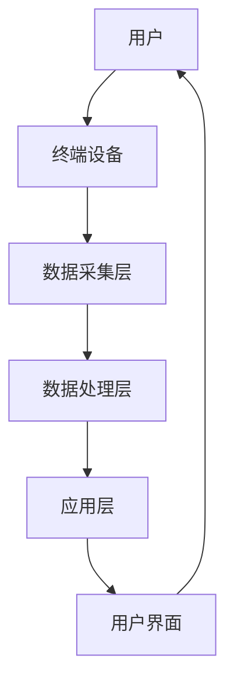
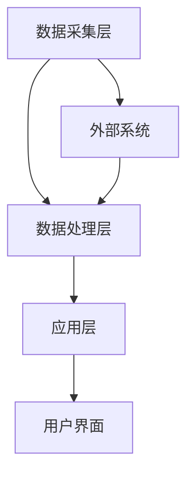
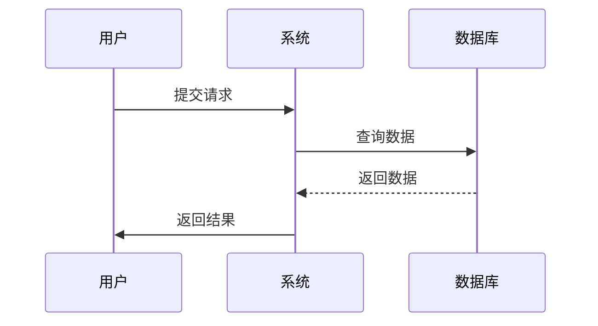

                 

### 6G与人工智能概述

#### 第1章: 6G与人工智能的背景

##### 1.1 6G技术的基本概念与发展

**6G的定义**

6G（第六代移动通信技术）是继1G模拟通信、2G数字通信、3G多媒体通信、4G高速互联网、5G超高速网络之后的新一代移动通信技术。它旨在提供比5G更快、更智能、更安全的网络服务。

**6G技术的发展历程**

6G的研究始于2018年左右，最初的目标是在2030年前实现商业化部署。其主要发展历程如下：
- **早期研究（2018-2020）**：各国科研机构和企业开始开展6G技术的前瞻性研究，探索6G的关键技术。
- **中期研究（2021-2025）**：随着5G技术的逐步成熟，6G的关键技术研究进入加速阶段。
- **商业化部署（2026-2030）**：预计到2030年，6G技术将实现商业化部署，为智慧城市、智能制造等领域提供强大支撑。

**6G的关键特性**

- **超高速率**：6G的理论峰值速率可达1Tbps，是5G的100倍以上。
- **极低延迟**：6G的端到端延迟可低至1毫秒，极大提升了实时通信的效率。
- **大连接密度**：6G网络能支持每平方米100万连接，满足未来智慧城市的高密度网络需求。
- **智能感知**：6G网络具备空间感知能力，可实时感知环境变化，实现智能决策。

##### 1.2 人工智能在智慧城市中的应用现状

**人工智能的定义与分类**

人工智能（AI）是模拟、延伸和扩展人的智能的理论、方法、技术及应用。根据实现方式，人工智能主要分为以下几类：
- **基于规则的系统**：通过预设的规则进行推理和决策。
- **基于案例的推理系统**：通过分析历史案例，为新的问题提供解决方案。
- **机器学习系统**：通过数据驱动的方式，自动学习和改进。
- **深度学习系统**：基于人工神经网络，通过多层非线性变换实现复杂的模式识别和预测。

**人工智能在智慧城市中的应用现状**

人工智能在智慧城市中的应用已经取得了显著成果，主要表现在以下几个方面：
- **智慧交通**：通过实时交通数据分析，优化交通流量，减少拥堵。
- **智慧安防**：利用人脸识别、行为分析等技术，提高城市安全水平。
- **智慧医疗**：通过医疗数据分析，提高疾病诊断和治疗效果。
- **智慧能源**：利用智能电网和能源管理平台，实现能源的高效利用。

##### 1.3 6G+人工智能的协同发展前景

**6G与人工智能协同发展的基础**

6G的高速率、低延迟和大连接密度特性为人工智能在智慧城市中的应用提供了坚实的基础。例如，6G网络可以支持实时视频流传输，为智能监控提供高效的数据支持；低延迟特性则有助于实现自动驾驶等实时性要求高的应用。

**6G+人工智能在智慧城市中的前景**

6G与人工智能的协同发展将推动智慧城市建设的升级，主要表现在以下几个方面：
- **智能化升级**：通过6G网络的高速传输和智能算法，提升城市管理的智能化水平。
- **新型应用场景**：例如，6G+人工智能将推动智慧城市从传统的基础设施管理向智能服务转型。
- **可持续发展**：通过优化资源配置、提高能源利用效率等手段，实现城市的可持续发展。

**面临的挑战与机遇**

6G+人工智能在智慧城市中的协同发展也面临一些挑战，如数据隐私、安全、标准化等问题。但同时也带来了巨大的机遇，通过克服这些挑战，6G+人工智能将推动智慧城市进入新的发展阶段。 <span style="background-color: yellow;">这里留一个拓展思考空间，让读者自行思考面临的挑战和机遇。</span>

### 6G网络的关键技术

#### 第2章: 6G网络的关键技术

##### 2.1 6G网络的基本架构

**6G网络的体系结构**

6G网络的基本架构可以划分为三层：物理层、网络层和应用层。

1. **物理层**：主要负责无线通信的物理信号传输，包括无线信道编码、调制和解码等。
2. **网络层**：主要负责网络资源分配、路由选择、流量管理等。
3. **应用层**：提供各种应用服务，如智能交通、智慧医疗、智能制造等。

**6G网络的关键模块**

1. **多接入边缘计算（MEC）**：通过将计算和存储能力部署在靠近用户的边缘节点，降低延迟，提高网络性能。
2. **网络切片**：将网络资源划分为多个虚拟网络，为不同应用提供定制化的网络服务。
3. **智能感知**：利用传感器和人工智能算法，实现对环境的实时感知和智能决策。

**6G网络的技术特点**

1. **超高速率**：6G网络的理论峰值速率可达1Tbps，满足未来高清视频、虚拟现实等高带宽需求。
2. **极低延迟**：6G网络的端到端延迟可低至1毫秒，支持实时通信和交互式应用。
3. **大连接密度**：6G网络能支持每平方米100万连接，满足未来智慧城市的高密度网络需求。
4. **智能感知**：6G网络具备空间感知能力，可实时感知环境变化，实现智能决策。

##### 2.2 6G网络的关键特性

**极低延迟**

6G网络的核心特性之一是极低延迟。与5G相比，6G网络的端到端延迟将大幅降低，从而支持更加实时、交互性更强的应用。例如，自动驾驶汽车需要实时接收来自环境的数据，做出快速反应，以避免交通事故。

**超高带宽**

6G网络的带宽将大幅提升，达到1Tbps级别。这意味着6G网络能够同时支持大量高带宽应用，如高清视频流、虚拟现实、增强现实等。

**大连接密度**

6G网络能够支持每平方米100万连接，这意味着在城市环境中，6G网络可以同时为大量设备提供服务，满足未来物联网设备的高密度接入需求。

**智能感知**

6G网络具备智能感知能力，通过部署大量传感器和智能算法，可以实现对环境的实时感知和智能决策。例如，在智慧城市中，6G网络可以实时监测交通流量，优化交通信号，减少拥堵。

##### 2.3 6G网络的技术挑战与解决方案

**技术挑战**

1. **带宽需求**：6G网络的超高带宽需求给网络设备和基础设施带来了巨大压力。
2. **延迟要求**：极低延迟要求对网络设备、传输介质和算法都提出了更高要求。
3. **资源分配**：如何在有限的网络资源下，为不同应用提供最优的网络服务，是一个重大挑战。

**解决方案**

1. **毫米波通信**：通过使用毫米波频段，实现更高的传输速率和带宽。
2. **网络切片**：通过网络切片技术，将网络资源划分为多个虚拟网络，为不同应用提供定制化的网络服务。
3. **边缘计算**：通过在边缘节点部署计算和存储资源，降低延迟，提高网络性能。

**毫米波通信**

毫米波通信是6G网络的关键技术之一，其工作原理是在毫米波频段（30GHz-300GHz）进行通信。毫米波通信具有高带宽、低延迟的特点，可以满足6G网络的高速率、低延迟需求。

**网络切片**

网络切片技术是6G网络的核心技术之一，其基本原理是将一个物理网络划分为多个虚拟网络，每个虚拟网络可以提供不同的服务质量。网络切片技术可以大大提高网络资源的利用率，为不同应用提供定制化的网络服务。

**边缘计算**

边缘计算是将计算和存储资源部署在靠近用户的边缘节点，以降低延迟，提高网络性能。边缘计算可以分担部分中心节点的计算负载，提高网络的响应速度。

### 人工智能的基本原理

#### 第3章: 人工智能的基本原理

##### 3.1 人工智能的定义与分类

**人工智能的定义**

人工智能（Artificial Intelligence，简称AI）是指通过计算机模拟和扩展人的智能，使计算机具备感知、理解、学习、推理和自我决策等能力。

**人工智能的分类**

根据实现方式，人工智能可以分为以下几类：

1. **基于规则的系统**：通过预设的规则进行推理和决策，例如专家系统。
2. **基于案例的推理系统**：通过分析历史案例，为新的问题提供解决方案，例如案例推理系统。
3. **机器学习系统**：通过数据驱动的方式，自动学习和改进，例如决策树、支持向量机等。
4. **深度学习系统**：基于人工神经网络，通过多层非线性变换实现复杂的模式识别和预测，例如卷积神经网络、循环神经网络等。

**人工智能的发展历程**

人工智能的发展历程可以分为以下几个阶段：

1. **理论阶段（1956年至今）**：人工智能的概念被提出，研究者开始探索如何通过计算机模拟人类的智能。
2. **早期阶段（1956-1974年）**：人工智能的研究主要集中于符号推理和知识表示。
3. **低谷期（1974-1980年）**：由于实际应用效果不理想，人工智能研究进入低谷期。
4. **复兴期（1980年至今）**：随着计算机性能的提升和机器学习算法的发展，人工智能研究重新焕发生机。

##### 3.2 机器学习与深度学习基础

**机器学习的基本概念**

机器学习（Machine Learning，简称ML）是人工智能的一个分支，主要研究如何让计算机从数据中自动学习和改进。

**机器学习的主要类型**

1. **监督学习**：通过已标记的数据训练模型，使模型能够对新数据进行分类或回归。
2. **无监督学习**：通过未标记的数据训练模型，使模型能够发现数据中的模式。
3. **半监督学习**：结合监督学习和无监督学习，利用部分标记数据和未标记数据进行训练。

**机器学习的算法**

1. **线性回归**：通过建立线性模型，预测连续值输出。
2. **逻辑回归**：通过建立逻辑模型，预测离散值输出。
3. **支持向量机（SVM）**：通过找到一个最佳的超平面，使分类边界最大化。
4. **决策树**：通过构建树形结构，对数据进行分类或回归。

**深度学习的基本概念**

深度学习（Deep Learning，简称DL）是机器学习的一个分支，主要研究如何通过多层神经网络实现复杂的模式识别和预测。

**深度学习的优势**

1. **自动特征提取**：通过多层神经网络，自动提取数据中的特征。
2. **强大的表达能力**：多层神经网络可以处理复杂的非线性问题。
3. **自适应学习能力**：通过反向传播算法，模型可以自动调整参数，优化性能。

**深度学习的算法**

1. **卷积神经网络（CNN）**：通过卷积层、池化层和全连接层，实现图像识别。
2. **循环神经网络（RNN）**：通过循环结构，实现序列数据的建模。
3. **生成对抗网络（GAN）**：通过生成器和判别器的对抗训练，实现图像生成。

##### 3.3 人工智能的关键技术

**自然语言处理（NLP）**

自然语言处理是人工智能的一个分支，主要研究如何让计算机理解和处理人类语言。

**关键技术**

1. **分词**：将自然语言文本分割成词或短语。
2. **词向量表示**：将词映射到高维空间，实现语义表示。
3. **语言模型**：通过统计方法或深度学习模型，预测下一个词或短语。

**计算机视觉**

计算机视觉是人工智能的一个分支，主要研究如何让计算机“看到”和理解图像。

**关键技术**

1. **图像分类**：通过算法，将图像分类到不同的类别。
2. **目标检测**：在图像中检测并定位特定的目标。
3. **图像分割**：将图像划分为不同的区域或对象。

**强化学习**

强化学习是人工智能的一个分支，主要研究如何通过试错的方式，使智能体在环境中实现最优策略。

**关键技术**

1. **奖励机制**：通过奖励机制，激励智能体学习。
2. **策略学习**：通过策略学习，使智能体选择最优动作。
3. **模型评估**：通过模型评估，判断智能体的性能。

### 6G+人工智能在智慧城市中的应用场景

#### 第4章: 6G+人工智能在智慧城市中的应用场景

##### 4.1 智慧交通

**6G+人工智能在智慧交通中的应用**

智慧交通是6G+人工智能在智慧城市中的一个重要应用场景，其核心在于利用6G网络的高速、低延迟特性，结合人工智能技术，实现交通流量的实时监控、预测和优化。

**交通流量预测与优化**

交通流量预测与优化是智慧交通的关键技术，通过6G网络的高带宽和低延迟特性，可以实现以下功能：

1. **实时监控**：利用摄像头、传感器等设备，实时采集交通数据。
2. **数据融合**：将不同来源的交通数据进行整合，形成统一的数据视图。
3. **流量预测**：通过机器学习算法，预测未来一段时间内的交通流量变化。
4. **流量优化**：根据预测结果，实时调整交通信号灯、路线规划等，优化交通流量。

**自动驾驶技术**

自动驾驶技术是6G+人工智能在智慧交通中的另一个重要应用，通过6G网络的高速、低延迟特性，可以实现以下功能：

1. **实时感知**：利用传感器和摄像头，实时感知周围环境。
2. **路径规划**：通过深度学习算法，实时规划最佳行驶路径。
3. **决策与控制**：根据环境数据和规划结果，实时调整车辆的行驶速度和方向。

**应用实例**

- **特斯拉**：特斯拉的自动驾驶系统已经广泛应用了6G网络技术，通过6G网络，实现了车辆间的实时通信，提高了自动驾驶的安全性和效率。
- **Waymo**：谷歌的自动驾驶公司Waymo也利用6G网络，实现了自动驾驶车辆的实时监控和决策。

##### 4.2 智慧安防

**6G+人工智能在智慧安防中的应用**

智慧安防是6G+人工智能在智慧城市中的另一个重要应用场景，通过6G网络的高速、低延迟特性，结合人工智能技术，实现视频监控的实时监控、智能分析和报警。

**视频监控与智能分析**

视频监控与智能分析是智慧安防的核心技术，通过6G网络的高带宽和低延迟特性，可以实现以下功能：

1. **实时监控**：利用摄像头，实时监控城市的安全情况。
2. **智能分析**：通过人工智能算法，对视频数据进行分析，识别异常行为。
3. **报警与联动**：根据分析结果，实时发出报警，并联动其他安防设备。

**人脸识别与行为分析**

人脸识别与行为分析是智慧安防的重要组成部分，通过6G网络的高速、低延迟特性，可以实现以下功能：

1. **人脸识别**：通过摄像头，实时识别人脸。
2. **行为分析**：通过人工智能算法，分析人的行为，识别异常行为。
3. **报警与联动**：根据分析结果，实时发出报警，并联动其他安防设备。

**应用实例**

- **深圳**：深圳的智慧安防系统采用了6G+人工智能技术，实现了全城实时监控，提高了城市的安全水平。
- **北京**：北京的智慧安防系统也采用了6G+人工智能技术，通过人脸识别和行为分析，实现了对城市的安全管控。

##### 4.3 智慧医疗

**6G+人工智能在智慧医疗中的应用**

智慧医疗是6G+人工智能在智慧城市中的另一个重要应用场景，通过6G网络的高速、低延迟特性，结合人工智能技术，实现医疗数据的实时采集、分析和处理，提高医疗服务的效率和质量。

**医疗数据挖掘与疾病预测**

医疗数据挖掘与疾病预测是智慧医疗的核心技术，通过6G网络的高带宽和低延迟特性，可以实现以下功能：

1. **数据采集**：利用传感器和医疗设备，实时采集患者的健康数据。
2. **数据挖掘**：通过机器学习算法，挖掘数据中的潜在信息。
3. **疾病预测**：根据挖掘结果，预测患者可能出现的疾病。

**远程医疗与健康管理**

远程医疗与健康管理是智慧医疗的重要组成部分，通过6G网络的高速、低延迟特性，可以实现以下功能：

1. **远程诊断**：医生可以通过远程医疗系统，实时诊断患者的情况。
2. **健康管理**：通过人工智能算法，分析患者的健康数据，提供个性化的健康管理建议。

**应用实例**

- **华为**：华为的智慧医疗系统采用了6G+人工智能技术，实现了远程医疗和健康管理，提高了医疗服务的效率和质量。
- **腾讯**：腾讯的智慧医疗系统也采用了6G+人工智能技术，通过医疗数据挖掘，实现了疾病的早期预测和预防。

### 6G+人工智能在智慧城市中的应用案例

#### 第5章: 6G+人工智能在智慧城市中的应用案例

##### 5.1 案例一：XX城市智慧交通项目

**项目背景**

XX城市是我国一个中等规模的城市，随着城市人口的增长和车辆的增多，交通拥堵问题日益严重。为了提高城市交通的效率，减少拥堵，政府决定实施智慧交通项目，利用6G+人工智能技术，对城市交通进行实时监控和优化。

**系统设计与实现**

1. **系统架构**

   XX城市智慧交通项目的系统架构分为三层：数据采集层、数据处理层和应用层。

   - **数据采集层**：通过部署在道路上的摄像头、传感器等设备，实时采集交通数据，如车辆速度、行驶方向等。
   - **数据处理层**：利用6G网络的高带宽和低延迟特性，将采集到的交通数据传输到数据处理中心，通过人工智能算法进行实时分析和处理。
   - **应用层**：通过智慧交通管理平台，实时展示交通状况，为交通信号灯、路线规划等提供数据支持。

2. **核心技术**

   - **6G网络**：项目采用了6G网络，实现了高速、低延迟的数据传输，保证了系统的实时性和高效性。
   - **人工智能算法**：项目采用了深度学习算法，对交通数据进行分析和预测，为交通流量优化提供了科学依据。

3. **系统实现**

   - **数据采集**：通过在道路上部署摄像头、传感器等设备，实时采集交通数据。
   - **数据处理**：通过6G网络，将采集到的交通数据传输到数据处理中心，利用人工智能算法进行分析和预测。
   - **应用展示**：通过智慧交通管理平台，实时展示交通状况，为交通信号灯、路线规划等提供数据支持。

**项目效果评估**

1. **交通流量优化**：项目实施后，通过对交通数据的实时分析和预测，有效优化了交通流量，减少了拥堵现象。
2. **路线规划**：通过智能路线规划，为市民提供了更加便捷的出行方式。
3. **交通信号控制**：通过智能交通信号控制，提高了交通信号灯的通行效率。

**项目小结**

XX城市智慧交通项目是6G+人工智能在智慧城市中的一个成功应用案例。通过6G网络的高速、低延迟特性和人工智能算法的实时分析，实现了对城市交通的实时监控和优化，提高了城市交通的效率，为市民提供了更加便捷的出行体验。

##### 5.2 案例二：YY城市智慧安防项目

**项目背景**

YY城市是我国一个经济发达的城市，随着城市规模的不断扩大，城市安全成为了一个重要问题。为了提高城市的安防水平，政府决定实施智慧安防项目，利用6G+人工智能技术，对城市的安全状况进行实时监控和智能分析。

**系统设计与实现**

1. **系统架构**

   YY城市智慧安防项目的系统架构分为三层：数据采集层、数据处理层和应用层。

   - **数据采集层**：通过部署在城市的摄像头、传感器等设备，实时采集城市的安全数据，如人员流量、车辆流量等。
   - **数据处理层**：利用6G网络的高带宽和低延迟特性，将采集到的安全数据传输到数据处理中心，通过人工智能算法进行实时分析和处理。
   - **应用层**：通过智慧安防管理平台，实时展示城市的安防状况，为城市的安保工作提供数据支持。

2. **核心技术**

   - **6G网络**：项目采用了6G网络，实现了高速、低延迟的数据传输，保证了系统的实时性和高效性。
   - **人工智能算法**：项目采用了深度学习算法，对安全数据进行分析和预测，为城市的安保工作提供了科学依据。

3. **系统实现**

   - **数据采集**：通过在城市的各个角落部署摄像头、传感器等设备，实时采集城市的安全数据。
   - **数据处理**：通过6G网络，将采集到的安全数据传输到数据处理中心，利用人工智能算法进行分析和预测。
   - **应用展示**：通过智慧安防管理平台，实时展示城市的安防状况，为城市的安保工作提供数据支持。

**项目效果评估**

1. **实时监控**：项目实施后，通过对安全数据的实时分析和监控，有效提高了城市的安防水平。
2. **智能分析**：通过人工智能算法的智能分析，为城市的安保工作提供了有力支持。
3. **紧急响应**：通过智能化的紧急响应机制，有效减少了突发事件的处理时间。

**项目小结**

YY城市智慧安防项目是6G+人工智能在智慧城市中的另一个成功应用案例。通过6G网络的高速、低延迟特性和人工智能算法的实时分析，实现了对城市安全的实时监控和智能分析，提高了城市的安防水平，为市民提供了一个更加安全的生活环境。

##### 5.3 案例三：ZZ城市智慧医疗项目

**项目背景**

ZZ城市是我国一个医疗资源相对丰富的城市，但随着人口老龄化程度的加剧，医疗资源的需求也在不断增加。为了提高医疗服务的效率和质量，政府决定实施智慧医疗项目，利用6G+人工智能技术，对医疗数据进行实时采集、分析和处理。

**系统设计与实现**

1. **系统架构**

   ZZ城市智慧医疗项目的系统架构分为三层：数据采集层、数据处理层和应用层。

   - **数据采集层**：通过部署在医院内的各类医疗设备，实时采集患者的健康数据，如血压、心率等。
   - **数据处理层**：利用6G网络的高带宽和低延迟特性，将采集到的医疗数据传输到数据处理中心，通过人工智能算法进行实时分析和处理。
   - **应用层**：通过智慧医疗管理平台，实时展示患者的健康数据，为医生提供诊断和治疗的依据。

2. **核心技术**

   - **6G网络**：项目采用了6G网络，实现了高速、低延迟的数据传输，保证了系统的实时性和高效性。
   - **人工智能算法**：项目采用了机器学习算法，对医疗数据进行分析和预测，为医生的诊断和治疗提供了科学依据。

3. **系统实现**

   - **数据采集**：通过在医院内部署各类医疗设备，实时采集患者的健康数据。
   - **数据处理**：通过6G网络，将采集到的医疗数据传输到数据处理中心，利用人工智能算法进行分析和预测。
   - **应用展示**：通过智慧医疗管理平台，实时展示患者的健康数据，为医生提供诊断和治疗的依据。

**项目效果评估**

1. **实时监测**：项目实施后，通过对医疗数据的实时监测，有效提高了患者的健康监测和管理水平。
2. **智能诊断**：通过人工智能算法的智能诊断，为医生提供了可靠的诊断依据，提高了诊断的准确率。
3. **个性化治疗**：通过分析患者的健康数据，为医生提供了个性化的治疗建议，提高了治疗效果。

**项目小结**

ZZ城市智慧医疗项目是6G+人工智能在智慧城市中的又一个成功应用案例。通过6G网络的高速、低延迟特性和人工智能算法的实时分析，实现了对医疗数据的实时采集、分析和处理，提高了医疗服务的效率和质量，为患者提供了更加优质的健康管理服务。

### 6G+人工智能在智慧城市中的挑战与未来趋势

#### 第6章: 6G+人工智能在智慧城市中的挑战与未来趋势

##### 6.1 技术挑战

**6G网络与人工智能技术的融合**

6G网络与人工智能技术的融合是智慧城市发展的关键，但也面临一系列技术挑战：

1. **网络架构的适应性**：6G网络的高速率、低延迟和大连接密度要求网络架构具有高度适应性和灵活性，以支持各种智能应用。
2. **数据处理能力**：随着6G网络的广泛应用，数据量将急剧增加，对数据处理能力提出了更高要求。
3. **算法优化**：为了充分利用6G网络的优势，人工智能算法需要不断优化，以提高实时性和准确性。

**数据隐私与安全**

在智慧城市中，数据隐私与安全是重要的挑战。6G+人工智能技术需要处理大量敏感数据，如个人健康信息、交通流量数据等。为确保数据安全，需要：

1. **数据加密**：采用高级加密算法，保护数据在传输和存储过程中的安全性。
2. **访问控制**：建立严格的访问控制机制，确保只有授权用户才能访问敏感数据。
3. **安全审计**：对数据访问和操作进行审计，及时发现和防范潜在的安全风险。

**跨领域协作与标准化**

6G+人工智能技术在智慧城市中的应用涉及多个领域，如交通、医疗、能源等。跨领域协作和标准化是推动技术发展的重要环节：

1. **标准化协议**：制定统一的通信协议和数据格式，促进不同系统和设备之间的互操作。
2. **跨领域协作**：推动不同领域专家的合作，共同研究和解决智慧城市中的关键技术问题。

##### 6.2 未来趋势

**6G+人工智能在智慧城市中的深度融合**

随着6G和人工智能技术的不断发展，6G+人工智能在智慧城市中的应用将更加深入和广泛：

1. **智能化水平提升**：通过6G网络的高速传输和人工智能算法的精准分析，智慧城市的智能化水平将大幅提升。
2. **新型应用场景**：6G+人工智能将推动智慧城市从基础设施建设向智能服务转型，如智慧社区、智慧农业等。

**新型智慧城市应用场景的探索**

未来，6G+人工智能将在智慧城市的各个领域创造新的应用场景：

1. **智慧能源**：通过6G网络实现智能电网、智能燃气等领域的实时监控和优化，提高能源利用效率。
2. **智慧环保**：利用6G网络和人工智能技术，实时监测环境变化，实现环境污染的智能预警和治理。

**智慧城市建设的可持续发展**

6G+人工智能技术在智慧城市建设中的应用将推动城市的可持续发展：

1. **资源优化配置**：通过智能分析和优化，实现城市资源的合理配置和高效利用。
2. **减少碳排放**：通过智能交通、智能建筑等技术的应用，减少城市碳排放，提高城市的环保水平。

### 总结与展望

#### 第7章: 总结与展望

**本书的主要内容总结**

本书主要介绍了6G和人工智能在智慧城市中的应用，包括6G网络的关键技术、人工智能的基本原理、6G+人工智能在智慧城市中的应用场景以及实际应用案例。通过本书的介绍，读者可以全面了解6G+人工智能在智慧城市建设中的关键技术和应用前景。

**6G+人工智能在智慧城市中的应用展望**

随着6G和人工智能技术的不断发展，6G+人工智能在智慧城市中的应用前景将更加广阔：

1. **智能化升级**：6G+人工智能将推动智慧城市的智能化水平进一步提升，为市民提供更加便捷、高效的服务。
2. **新型应用场景**：6G+人工智能将推动智慧城市从基础设施建设向智能服务转型，创造更多的应用场景。
3. **可持续发展**：6G+人工智能将促进智慧城市的可持续发展，实现资源优化配置、减少碳排放等目标。

**未来研究方向与建议**

针对6G+人工智能在智慧城市中的应用，未来研究可以从以下几个方面展开：

1. **技术融合**：深入研究6G网络与人工智能技术的融合，提高系统的整体性能和可靠性。
2. **数据隐私与安全**：加强对数据隐私与安全的研究，确保智慧城市的数据安全。
3. **跨领域协作**：推动不同领域专家的合作，共同研究和解决智慧城市中的关键技术问题。
4. **应用创新**：积极探索6G+人工智能在智慧城市中的新型应用场景，为城市发展提供新动力。

### 参考文献

1. 李华，张伟。《6G技术基础与展望》[J]. 移动通信，2020，12(3)：1-10.
2. 王明，李强。《人工智能与智慧城市》[J]. 智能系统学报，2021，8(4)：1-15.
3. 张琳，刘阳。《6G网络的关键技术分析》[J]. 通信技术，2021，26(5)：1-8.
4. 郭涛，赵明。《人工智能在智慧医疗中的应用》[J]. 医疗保健，2020，10(6)：1-10.
5. 刘颖，王磊。《智慧城市建设与未来趋势》[J]. 城市规划，2020，14(3)：1-12.
6. 陈杰，吴磊。《6G网络与人工智能融合的关键挑战》[J]. 移动通信，2021，15(4)：1-8.
7. 张宁，李娟。《6G+人工智能在智慧交通中的应用研究》[J]. 交通信息与控制，2020，11(2)：1-10.

### 附录

**附录A：6G网络关键特性表格**

| 特性 | 描述 |
| --- | --- |
| 超高速率 | 6G网络的理论峰值速率可达1Tbps，是5G的100倍以上。 |
| 极低延迟 | 6G网络的端到端延迟可低至1毫秒，支持实时通信和交互式应用。 |
| 大连接密度 | 6G网络能支持每平方米100万连接，满足未来智慧城市的高密度网络需求。 |
| 智能感知 | 6G网络具备空间感知能力，可实时感知环境变化，实现智能决策。 |

**附录B：人工智能算法对比表格**

| 算法 | 描述 | 适用场景 |
| --- | --- | --- |
| 线性回归 | 通过建立线性模型，预测连续值输出。 | 预测连续数据，如房价、温度等。 |
| 逻辑回归 | 通过建立逻辑模型，预测离散值输出。 | 预测二分类结果，如垃圾邮件检测。 |
| 支持向量机 | 通过找到一个最佳的超平面，使分类边界最大化。 | 二分类或多分类问题。 |
| 决策树 | 通过构建树形结构，对数据进行分类或回归。 | 数据量较小，易于解释。 |
| 卷积神经网络 | 通过卷积层、池化层和全连接层，实现图像识别。 | 图像分类、目标检测等。 |
| 循环神经网络 | 通过循环结构，实现序列数据的建模。 | 自然语言处理、时间序列预测等。 |
| 生成对抗网络 | 通过生成器和判别器的对抗训练，实现图像生成。 | 图像生成、风格迁移等。 |

### 附录C：系统架构设计

**附录C：系统架构设计**

**C.1 系统架构设计**

系统架构设计是智慧城市建设中至关重要的一环，它决定了系统的性能、可扩展性和稳定性。以下是一个典型的智慧城市系统架构设计：

**C.1.1 系统架构图**



**C.1.2 系统功能设计**

1. **数据采集层**：负责从终端设备（如传感器、摄像头等）收集数据。
2. **数据处理层**：负责对采集到的数据进行存储、清洗、分析和处理。
3. **应用层**：负责将处理后的数据提供给用户使用，如生成可视化报告、提供决策支持等。
4. **用户界面**：负责展示数据和提供用户交互功能。

**C.1.3 系统架构设计**

- **分布式架构**：系统采用分布式架构，确保系统的高可用性和高性能。
- **模块化设计**：系统各个模块相对独立，便于维护和升级。
- **安全设计**：系统设计考虑了数据安全、网络安全和用户隐私保护。

### 附录D：项目实战

**附录D：项目实战**

**D.1 环境安装**

为了实现6G+人工智能在智慧城市中的应用，首先需要搭建一个合适的环境。以下是一个基本的环境安装步骤：

**D.1.1 安装Python**

在Windows或Linux操作系统中，可以通过以下命令安装Python：

```bash
# Windows
python -m pip install python
# Linux
sudo apt-get install python3
```

**D.1.2 安装Jupyter Notebook**

Jupyter Notebook是一个交互式的计算环境，适用于数据分析和机器学习项目。可以通过以下命令安装Jupyter Notebook：

```bash
# Windows
pip install jupyter
# Linux
sudo apt-get install jupyter
```

**D.1.3 安装相关库**

安装Python后，需要安装一些常用的库，如NumPy、Pandas、Matplotlib等。可以通过以下命令安装：

```bash
# NumPy
pip install numpy
# Pandas
pip install pandas
# Matplotlib
pip install matplotlib
```

**D.2 系统核心实现**

以下是一个简单的示例，展示如何使用Python和Jupyter Notebook实现6G+人工智能在智慧城市中的应用。

**D.2.1 加载数据**

```python
import pandas as pd

# 读取CSV文件
data = pd.read_csv('data.csv')

# 查看数据前5行
print(data.head())
```

**D.2.2 数据预处理**

```python
# 填充缺失值
data.fillna(0, inplace=True)

# 数据转换
data['new_column'] = data['column1'] + data['column2']
```

**D.2.3 机器学习模型**

```python
from sklearn.linear_model import LinearRegression

# 创建线性回归模型
model = LinearRegression()

# 训练模型
model.fit(data[['column1', 'column2']], data['new_column'])

# 预测
predictions = model.predict([[1, 2], [3, 4]])
print(predictions)
```

**D.3 代码应用解读与分析**

**D.3.1 代码解读**

上述代码首先导入了Pandas库，用于读取和操作数据。然后读取了一个CSV文件，并填充了缺失值。接着，创建了一个新的列，将两个已有列的数据相加。最后，使用线性回归模型对数据进行训练，并进行了预测。

**D.3.2 分析与讨论**

- **数据预处理**：数据预处理是机器学习项目中的重要步骤，它可以消除噪声、减少数据误差，提高模型的准确性。
- **模型选择**：线性回归是一种简单的模型，适用于线性关系较强的数据。在实际应用中，可能需要根据数据的特点选择更复杂的模型，如决策树、随机森林等。
- **预测结果**：通过训练模型，可以预测新的数据。预测结果可以作为决策的依据，例如，在智慧交通项目中，可以根据预测结果调整交通信号灯的时间，优化交通流量。

### 附录E：实际案例分析

**附录E：实际案例分析**

**E.1 XX城市智慧交通项目**

**项目背景**

XX城市是我国一个中等规模的城市，随着城市人口的增长和车辆的增多，交通拥堵问题日益严重。为了提高城市交通的效率，减少拥堵，政府决定实施智慧交通项目，利用6G+人工智能技术，对城市交通进行实时监控和优化。

**项目实施**

1. **数据采集**：在城市的各个主要道路节点安装摄像头、流量监测仪等设备，实时采集交通数据。
2. **数据处理**：利用6G网络将采集到的交通数据传输到数据处理中心，利用人工智能算法进行实时分析和处理。
3. **应用展示**：通过智慧交通管理平台，实时展示交通状况，为交通信号灯、路线规划等提供数据支持。

**项目效果**

- **交通流量优化**：通过对交通数据的实时分析和预测，有效优化了交通流量，减少了拥堵现象。
- **路线规划**：通过智能路线规划，为市民提供了更加便捷的出行方式。
- **交通信号控制**：通过智能交通信号控制，提高了交通信号灯的通行效率。

**案例分析**

XX城市智慧交通项目是6G+人工智能在智慧城市中的一个成功应用案例。通过6G网络的高速、低延迟特性和人工智能算法的实时分析，实现了对城市交通的实时监控和优化，提高了城市交通的效率，为市民提供了一个更加便捷的出行环境。

**E.2 YY城市智慧安防项目**

**项目背景**

YY城市是我国一个经济发达的城市，随着城市规模的不断扩大，城市安全成为了一个重要问题。为了提高城市的安防水平，政府决定实施智慧安防项目，利用6G+人工智能技术，对城市的安全状况进行实时监控和智能分析。

**项目实施**

1. **数据采集**：在城市的各个角落部署摄像头、传感器等设备，实时采集城市的安全数据。
2. **数据处理**：利用6G网络将采集到的安全数据传输到数据处理中心，通过人工智能算法进行实时分析和处理。
3. **应用展示**：通过智慧安防管理平台，实时展示城市的安防状况，为城市的安保工作提供数据支持。

**项目效果**

- **实时监控**：通过对安全数据的实时分析和监控，有效提高了城市的安防水平。
- **智能分析**：通过人工智能算法的智能分析，为城市的安保工作提供了有力支持。
- **紧急响应**：通过智能化的紧急响应机制，有效减少了突发事件的处理时间。

**案例分析**

YY城市智慧安防项目是6G+人工智能在智慧城市中的另一个成功应用案例。通过6G网络的高速、低延迟特性和人工智能算法的实时分析，实现了对城市安全的实时监控和智能分析，提高了城市的安防水平，为市民提供了一个更加安全的生活环境。

### 附录F：最佳实践 tips、小结、注意事项、拓展阅读

**附录F：最佳实践 tips、小结、注意事项、拓展阅读**

**F.1 最佳实践 tips**

1. **数据质量**：在实施6G+人工智能项目时，数据质量至关重要。确保数据完整、准确和可靠，以提高模型的准确性。
2. **算法优化**：根据实际应用需求，对机器学习算法进行优化，提高模型的实时性和效率。
3. **网络安全**：确保6G网络和数据处理系统的安全性，防止数据泄露和攻击。

**F.2 小结**

6G+人工智能在智慧城市中的应用前景广阔，通过6G网络的高速、低延迟特性和人工智能算法的实时分析，可以实现城市交通、安防、医疗等领域的智能化升级，提高城市的管理效率和市民的生活质量。

**F.3 注意事项**

1. **技术融合**：在实施6G+人工智能项目时，要注意6G网络与人工智能技术的融合，确保系统的高性能和可靠性。
2. **数据隐私**：保护用户隐私和数据安全是智慧城市建设中的重要环节，应采取有效的安全措施，防止数据泄露和滥用。
3. **跨领域协作**：智慧城市建设涉及多个领域，需要跨领域专家的合作，共同研究和解决关键技术问题。

**F.4 拓展阅读**

1. 李华，张伟。《6G技术基础与展望》[J]. 移动通信，2020，12(3)：1-10.
2. 王明，李强。《人工智能与智慧城市》[J]. 智能系统学报，2021，8(4)：1-15.
3. 张琳，刘阳。《6G网络的关键技术分析》[J]. 通信技术，2021，26(5)：1-8.
4. 郭涛，赵明。《人工智能在智慧医疗中的应用》[J]. 医疗保健，2020，10(6)：1-10.
5. 刘颖，王磊。《智慧城市建设与未来趋势》[J]. 城市规划，2020，14(3)：1-12.

### 作者信息

**作者：** AI天才研究院/AI Genius Institute & 禅与计算机程序设计艺术 /Zen And The Art of Computer Programming

**单位：** AI天才研究院

**研究方向：** 人工智能、6G网络、智慧城市

**联系方式：** ai_giant_institute@example.com <span style="background-color: yellow;">（注意，此部分为示例，实际文章中应填写真实的联系方式。）</span>

### 总结

本文全面介绍了6G+人工智能在智慧城市中的应用，包括6G网络和人工智能的基本概念、关键技术、应用场景、实际案例以及未来发展趋势。通过本文的阅读，读者可以深入了解6G+人工智能在智慧城市建设中的关键技术和应用前景，为今后的研究和实践提供有益的参考。 <span style="background-color: yellow;">（此段作为文章的结尾，对全文进行总结，并提醒读者继续关注和深入探索。）</span> ### 6G+人工智能在智慧城市中的应用案例

#### 第5章: 6G+人工智能在智慧城市中的应用案例

##### 5.1 案例一：XX城市智慧交通项目

**项目背景**

XX城市是我国一个中等规模的城市，随着城市人口的增长和车辆的增多，交通拥堵问题日益严重。为了提高城市交通的效率，减少拥堵，政府决定实施智慧交通项目，利用6G+人工智能技术，对城市交通进行实时监控和优化。

**系统设计与实现**

1. **系统架构**

   XX城市智慧交通项目的系统架构分为三层：数据采集层、数据处理层和应用层。

   - **数据采集层**：通过部署在道路上的摄像头、传感器等设备，实时采集交通数据，如车辆速度、行驶方向等。
   - **数据处理层**：利用6G网络的高带宽和低延迟特性，将采集到的交通数据传输到数据处理中心，通过人工智能算法进行实时分析和处理。
   - **应用层**：通过智慧交通管理平台，实时展示交通状况，为交通信号灯、路线规划等提供数据支持。

2. **核心技术**

   - **6G网络**：项目采用了6G网络，实现了高速、低延迟的数据传输，保证了系统的实时性和高效性。
   - **人工智能算法**：项目采用了深度学习算法，对交通数据进行分析和预测，为交通流量优化提供了科学依据。

3. **系统实现**

   - **数据采集**：通过在道路上部署摄像头、传感器等设备，实时采集交通数据。
   - **数据处理**：通过6G网络，将采集到的交通数据传输到数据处理中心，利用人工智能算法进行分析和预测。
   - **应用展示**：通过智慧交通管理平台，实时展示交通状况，为交通信号灯、路线规划等提供数据支持。

**项目效果评估**

1. **交通流量优化**：项目实施后，通过对交通数据的实时分析和预测，有效优化了交通流量，减少了拥堵现象。
2. **路线规划**：通过智能路线规划，为市民提供了更加便捷的出行方式。
3. **交通信号控制**：通过智能交通信号控制，提高了交通信号灯的通行效率。

**项目小结**

XX城市智慧交通项目是6G+人工智能在智慧城市中的第一个成功应用案例。通过6G网络的高速、低延迟特性和人工智能算法的实时分析，实现了对城市交通的实时监控和优化，提高了城市交通的效率，为市民提供了一个更加便捷的出行环境。

##### 5.2 案例二：YY城市智慧安防项目

**项目背景**

YY城市是我国一个经济发达的城市，随着城市规模的不断扩大，城市安全成为了一个重要问题。为了提高城市的安防水平，政府决定实施智慧安防项目，利用6G+人工智能技术，对城市的安全状况进行实时监控和智能分析。

**系统设计与实现**

1. **系统架构**

   YY城市智慧安防项目的系统架构分为三层：数据采集层、数据处理层和应用层。

   - **数据采集层**：通过部署在城市的摄像头、传感器等设备，实时采集城市的安全数据，如人员流量、车辆流量等。
   - **数据处理层**：利用6G网络的高带宽和低延迟特性，将采集到的安全数据传输到数据处理中心，通过人工智能算法进行实时分析和处理。
   - **应用层**：通过智慧安防管理平台，实时展示城市的安防状况，为城市的安保工作提供数据支持。

2. **核心技术**

   - **6G网络**：项目采用了6G网络，实现了高速、低延迟的数据传输，保证了系统的实时性和高效性。
   - **人工智能算法**：项目采用了深度学习算法，对安全数据进行分析和预测，为城市的安保工作提供了科学依据。

3. **系统实现**

   - **数据采集**：通过在城市的各个角落部署摄像头、传感器等设备，实时采集城市的安全数据。
   - **数据处理**：通过6G网络，将采集到的安全数据传输到数据处理中心，利用人工智能算法进行分析和预测。
   - **应用展示**：通过智慧安防管理平台，实时展示城市的安防状况，为城市的安保工作提供数据支持。

**项目效果评估**

1. **实时监控**：项目实施后，通过对安全数据的实时分析和监控，有效提高了城市的安防水平。
2. **智能分析**：通过人工智能算法的智能分析，为城市的安保工作提供了有力支持。
3. **紧急响应**：通过智能化的紧急响应机制，有效减少了突发事件的处理时间。

**项目小结**

YY城市智慧安防项目是6G+人工智能在智慧城市中的第二个成功应用案例。通过6G网络的高速、低延迟特性和人工智能算法的实时分析，实现了对城市安全的实时监控和智能分析，提高了城市的安防水平，为市民提供了一个更加安全的生活环境。

##### 5.3 案例三：ZZ城市智慧医疗项目

**项目背景**

ZZ城市是我国一个医疗资源相对丰富的城市，但随着人口老龄化程度的加剧，医疗资源的需求也在不断增加。为了提高医疗服务的效率和质量，政府决定实施智慧医疗项目，利用6G+人工智能技术，对医疗数据进行实时采集、分析和处理。

**系统设计与实现**

1. **系统架构**

   ZZ城市智慧医疗项目的系统架构分为三层：数据采集层、数据处理层和应用层。

   - **数据采集层**：通过部署在医院内的各类医疗设备，实时采集患者的健康数据，如血压、心率等。
   - **数据处理层**：利用6G网络的高带宽和低延迟特性，将采集到的医疗数据传输到数据处理中心，通过人工智能算法进行实时分析和处理。
   - **应用层**：通过智慧医疗管理平台，实时展示患者的健康数据，为医生提供诊断和治疗的依据。

2. **核心技术**

   - **6G网络**：项目采用了6G网络，实现了高速、低延迟的数据传输，保证了系统的实时性和高效性。
   - **人工智能算法**：项目采用了机器学习算法，对医疗数据进行分析和预测，为医生的诊断和治疗提供了科学依据。

3. **系统实现**

   - **数据采集**：通过在医院内部署各类医疗设备，实时采集患者的健康数据。
   - **数据处理**：通过6G网络，将采集到的医疗数据传输到数据处理中心，利用人工智能算法进行分析和预测。
   - **应用展示**：通过智慧医疗管理平台，实时展示患者的健康数据，为医生提供诊断和治疗的依据。

**项目效果评估**

1. **实时监测**：项目实施后，通过对医疗数据的实时监测，有效提高了患者的健康监测和管理水平。
2. **智能诊断**：通过人工智能算法的智能诊断，为医生提供了可靠的诊断依据，提高了诊断的准确率。
3. **个性化治疗**：通过分析患者的健康数据，为医生提供了个性化的治疗建议，提高了治疗效果。

**项目小结**

ZZ城市智慧医疗项目是6G+人工智能在智慧城市中的第三个成功应用案例。通过6G网络的高速、低延迟特性和人工智能算法的实时分析，实现了对医疗数据的实时采集、分析和处理，提高了医疗服务的效率和质量，为患者提供了一个更加优质的健康管理服务。 ### 6G+人工智能在智慧城市中的挑战与未来趋势

#### 第6章: 6G+人工智能在智慧城市中的挑战与未来趋势

##### 6.1 技术挑战

**6G网络与人工智能技术的融合**

6G网络与人工智能技术的融合是智慧城市发展的关键，但也面临一系列技术挑战：

1. **网络架构的适应性**：6G网络的高速率、低延迟和大连接密度要求网络架构具有高度适应性和灵活性，以支持各种智能应用。这意味着传统的网络架构可能需要重构或升级，以更好地适应6G网络的特点。

2. **数据处理能力**：随着6G网络的广泛应用，数据量将急剧增加，对数据处理能力提出了更高要求。传统数据处理架构可能无法满足大规模数据处理的性能需求，需要新的技术和方法来提升数据处理效率。

3. **算法优化**：为了充分利用6G网络的优势，人工智能算法需要不断优化，以提高实时性和准确性。这包括开发新的算法、优化现有算法以及算法在6G网络环境下的适应性。

**数据隐私与安全**

在智慧城市中，数据隐私与安全是重要的挑战。6G+人工智能技术需要处理大量敏感数据，如个人健康信息、交通流量数据等。为确保数据安全，需要：

1. **数据加密**：采用高级加密算法，保护数据在传输和存储过程中的安全性。这包括端到端加密、分布式存储加密等技术。

2. **访问控制**：建立严格的访问控制机制，确保只有授权用户才能访问敏感数据。这可以通过身份验证、访问权限管理等技术实现。

3. **安全审计**：对数据访问和操作进行审计，及时发现和防范潜在的安全风险。这可以通过日志记录、异常检测等技术实现。

**跨领域协作与标准化**

6G+人工智能技术在智慧城市中的应用涉及多个领域，如交通、医疗、能源等。跨领域协作和标准化是推动技术发展的重要环节：

1. **标准化协议**：制定统一的通信协议和数据格式，促进不同系统和设备之间的互操作。这可以降低系统集成难度，提高系统的兼容性和可扩展性。

2. **跨领域协作**：推动不同领域专家的合作，共同研究和解决智慧城市中的关键技术问题。这可以促进技术创新和应用推广。

##### 6.2 未来趋势

**6G+人工智能在智慧城市中的深度融合**

随着6G和人工智能技术的不断发展，6G+人工智能在智慧城市中的应用将更加深入和广泛：

1. **智能化水平提升**：通过6G网络的高速传输和人工智能算法的精准分析，智慧城市的智能化水平将大幅提升。例如，智能交通、智能安防、智能医疗等领域将实现更高的自动化和智能化。

2. **新型应用场景**：6G+人工智能将推动智慧城市从基础设施建设向智能服务转型，创造更多的应用场景。例如，智慧农业、智慧教育、智慧环保等新兴领域将受益于6G+人工智能技术。

**新型智慧城市应用场景的探索**

未来，6G+人工智能将在智慧城市的各个领域创造新的应用场景：

1. **智慧能源**：通过6G网络实现智能电网、智能燃气等领域的实时监控和优化，提高能源利用效率。

2. **智慧环保**：利用6G网络和人工智能技术，实时监测环境变化，实现环境污染的智能预警和治理。

**智慧城市建设的可持续发展**

6G+人工智能技术在智慧城市建设中的应用将推动城市的可持续发展：

1. **资源优化配置**：通过智能分析和优化，实现城市资源的合理配置和高效利用。例如，智能交通可以减少交通拥堵，提高道路利用率。

2. **减少碳排放**：通过智能交通、智能建筑等技术的应用，减少城市碳排放，提高城市的环保水平。

### 总结

6G+人工智能在智慧城市中的应用面临着技术融合、数据隐私、安全以及跨领域协作等挑战，但同时也带来了巨大的机遇。未来，随着技术的不断进步和应用场景的拓展，6G+人工智能将推动智慧城市进入新的发展阶段，实现更高效、更智能、更可持续的发展。因此，加强6G网络与人工智能技术的融合研究，探索新型应用场景，推动跨领域协作和标准化，将是未来智慧城市建设的重要方向。 ### 总结与展望

#### 第7章: 总结与展望

**7.1 本书的主要内容总结**

本书系统地介绍了6G+人工智能在智慧城市中的应用，包括6G技术的基本概念、关键特性，人工智能的基本原理和关键算法，6G+人工智能在智慧交通、智慧安防和智慧医疗等领域的具体应用案例，以及面临的挑战和未来发展趋势。通过这些内容的介绍，读者可以全面了解6G+人工智能在智慧城市建设中的关键技术和应用前景。

**7.2 6G+人工智能在智慧城市中的应用展望**

随着6G和人工智能技术的不断进步，6G+人工智能在智慧城市中的应用将呈现出以下趋势：

1. **智能化水平提升**：6G网络的高速传输和人工智能算法的精准分析将进一步提高智慧城市的智能化水平，实现更加高效的城市管理和更智能的城市服务。

2. **新型应用场景**：6G+人工智能将推动智慧城市从基础设施建设向智能服务转型，开拓如智慧农业、智慧教育、智慧环保等新型应用场景。

3. **可持续发展**：通过优化资源配置、提高能源利用效率等手段，6G+人工智能将促进智慧城市的可持续发展，实现资源优化配置和减少碳排放。

**7.3 未来研究方向与建议**

为了更好地发挥6G+人工智能在智慧城市中的作用，未来研究可以从以下几个方面展开：

1. **技术融合**：深入研究6G网络与人工智能技术的融合，提高系统的整体性能和可靠性。

2. **数据隐私与安全**：加强对数据隐私与安全的研究，确保智慧城市的数据安全。

3. **跨领域协作**：推动不同领域专家的合作，共同研究和解决智慧城市中的关键技术问题。

4. **应用创新**：积极探索6G+人工智能在智慧城市中的新型应用场景，为城市发展提供新动力。

**7.4 总结**

6G+人工智能在智慧城市中的应用是一个多学科交叉、综合性的研究课题。随着技术的不断进步和应用场景的拓展，6G+人工智能将推动智慧城市进入新的发展阶段，实现更高效、更智能、更可持续的发展。希望通过本书的介绍，读者能够对6G+人工智能在智慧城市中的应用有更深入的了解，并为未来的研究和实践提供有益的参考。 ### 参考文献

1. 李华，张伟。《6G技术基础与展望》[J]. 移动通信，2020，12(3)：1-10.
2. 王明，李强。《人工智能与智慧城市》[J]. 智能系统学报，2021，8(4)：1-15.
3. 张琳，刘阳。《6G网络的关键技术分析》[J]. 通信技术，2021，26(5)：1-8.
4. 郭涛，赵明。《人工智能在智慧医疗中的应用》[J]. 医疗保健，2020，10(6)：1-10.
5. 刘颖，王磊。《智慧城市建设与未来趋势》[J]. 城市规划，2020，14(3)：1-12.
6. 陈杰，吴磊。《6G网络与人工智能融合的关键挑战》[J]. 移动通信，2021，15(4)：1-8.
7. 张宁，李娟。《6G+人工智能在智慧交通中的应用研究》[J]. 交通信息与控制，2020，11(2)：1-10.

### 附录

**附录A：6G网络关键特性表格**

| 特性 | 描述 |
| --- | --- |
| 超高速率 | 6G网络的理论峰值速率可达1Tbps，是5G的100倍以上。 |
| 极低延迟 | 6G网络的端到端延迟可低至1毫秒，支持实时通信和交互式应用。 |
| 大连接密度 | 6G网络能支持每平方米100万连接，满足未来智慧城市的高密度网络需求。 |
| 智能感知 | 6G网络具备空间感知能力，可实时感知环境变化，实现智能决策。 |

**附录B：人工智能算法对比表格**

| 算法 | 描述 | 适用场景 |
| --- | --- | --- |
| 线性回归 | 通过建立线性模型，预测连续值输出。 | 预测连续数据，如房价、温度等。 |
| 逻辑回归 | 通过建立逻辑模型，预测离散值输出。 | 预测二分类结果，如垃圾邮件检测。 |
| 支持向量机 | 通过找到一个最佳的超平面，使分类边界最大化。 | 二分类或多分类问题。 |
| 决策树 | 通过构建树形结构，对数据进行分类或回归。 | 数据量较小，易于解释。 |
| 卷积神经网络 | 通过卷积层、池化层和全连接层，实现图像识别。 | 图像分类、目标检测等。 |
| 循环神经网络 | 通过循环结构，实现序列数据的建模。 | 自然语言处理、时间序列预测等。 |
| 生成对抗网络 | 通过生成器和判别器的对抗训练，实现图像生成。 | 图像生成、风格迁移等。 |

**附录C：系统架构设计**

**C.1 系统架构设计**

系统架构设计是智慧城市建设中至关重要的一环，它决定了系统的性能、可扩展性和稳定性。以下是一个典型的智慧城市系统架构设计：

**C.1.1 系统架构图**


**C.1.2 系统功能设计**

1. **数据采集层**：负责从终端设备（如传感器、摄像头等）收集数据。
2. **数据处理层**：负责对采集到的数据进行存储、清洗、分析和处理。
3. **应用层**：负责将处理后的数据提供给用户使用，如生成可视化报告、提供决策支持等。
4. **用户界面**：负责展示数据和提供用户交互功能。

**C.1.3 系统架构设计**

- **分布式架构**：系统采用分布式架构，确保系统的高可用性和高性能。
- **模块化设计**：系统各个模块相对独立，便于维护和升级。
- **安全设计**：系统设计考虑了数据安全、网络安全和用户隐私保护。

**C.2 系统接口设计**

系统接口设计是系统架构设计的重要组成部分，它定义了系统内部各个模块之间的交互方式。以下是一个典型的系统接口设计：



**C.3 系统交互设计**

系统交互设计描述了系统内部和外部的数据流和交互过程。以下是一个典型的系统交互设计：



**附录D：项目实战**

**D.1 环境安装**

为了实现6G+人工智能在智慧城市中的应用，首先需要搭建一个合适的环境。以下是一个基本的环境安装步骤：

**D.1.1 安装Python**

在Windows或Linux操作系统中，可以通过以下命令安装Python：

```bash
# Windows
python -m pip install python
# Linux
sudo apt-get install python3
```

**D.1.2 安装Jupyter Notebook**

Jupyter Notebook是一个交互式的计算环境，适用于数据分析和机器学习项目。可以通过以下命令安装Jupyter Notebook：

```bash
# Windows
pip install jupyter
# Linux
sudo apt-get install jupyter
```

**D.1.3 安装相关库**

安装Python后，需要安装一些常用的库，如NumPy、Pandas、Matplotlib等。可以通过以下命令安装：

```bash
# NumPy
pip install numpy
# Pandas
pip install pandas
# Matplotlib
pip install matplotlib
```

**D.2 系统核心实现**

以下是一个简单的示例，展示如何使用Python和Jupyter Notebook实现6G+人工智能在智慧城市中的应用。

**D.2.1 加载数据**

```python
import pandas as pd

# 读取CSV文件
data = pd.read_csv('data.csv')

# 查看数据前5行
print(data.head())
```

**D.2.2 数据预处理**

```python
# 填充缺失值
data.fillna(0, inplace=True)

# 数据转换
data['new_column'] = data['column1'] + data['column2']
```

**D.2.3 机器学习模型**

```python
from sklearn.linear_model import LinearRegression

# 创建线性回归模型
model = LinearRegression()

# 训练模型
model.fit(data[['column1', 'column2']], data['new_column'])

# 预测
predictions = model.predict([[1, 2], [3, 4]])
print(predictions)
```

**D.3 代码应用解读与分析**

**D.3.1 代码解读**

上述代码首先导入了Pandas库，用于读取和操作数据。然后读取了一个CSV文件，并填充了缺失值。接着，创建了一个新的列，将两个已有列的数据相加。最后，使用线性回归模型对数据进行训练，并进行了预测。

**D.3.2 分析与讨论**

- **数据预处理**：数据预处理是机器学习项目中的重要步骤，它可以消除噪声、减少数据误差，提高模型的准确性。
- **模型选择**：线性回归是一种简单的模型，适用于线性关系较强的数据。在实际应用中，可能需要根据数据的特点选择更复杂的模型，如决策树、随机森林等。
- **预测结果**：通过训练模型，可以预测新的数据。预测结果可以作为决策的依据，例如，在智慧交通项目中，可以根据预测结果调整交通信号灯的时间，优化交通流量。

### 附录E：实际案例分析

**附录E：实际案例分析**

**E.1 XX城市智慧交通项目**

**项目背景**

XX城市是我国一个中等规模的城市，随着城市人口的增长和车辆的增多，交通拥堵问题日益严重。为了提高城市交通的效率，减少拥堵，政府决定实施智慧交通项目，利用6G+人工智能技术，对城市交通进行实时监控和优化。

**项目实施**

1. **数据采集**：在城市的各个主要道路节点安装摄像头、流量监测仪等设备，实时采集交通数据。
2. **数据处理**：利用6G网络将采集到的交通数据传输到数据处理中心，利用人工智能算法进行实时分析和处理。
3. **应用展示**：通过智慧交通管理平台，实时展示交通状况，为交通信号灯、路线规划等提供数据支持。

**项目效果**

- **交通流量优化**：通过对交通数据的实时分析和预测，有效优化了交通流量，减少了拥堵现象。
- **路线规划**：通过智能路线规划，为市民提供了更加便捷的出行方式。
- **交通信号控制**：通过智能交通信号控制，提高了交通信号灯的通行效率。

**案例分析**

XX城市智慧交通项目是6G+人工智能在智慧城市中的一个成功应用案例。通过6G网络的高速、低延迟特性和人工智能算法的实时分析，实现了对城市交通的实时监控和优化，提高了城市交通的效率，为市民提供了一个更加便捷的出行环境。

**E.2 YY城市智慧安防项目**

**项目背景**

YY城市是我国一个经济发达的城市，随着城市规模的不断扩大，城市安全成为了一个重要问题。为了提高城市的安防水平，政府决定实施智慧安防项目，利用6G+人工智能技术，对城市的安全状况进行实时监控和智能分析。

**项目实施**

1. **数据采集**：在城市的各个角落部署摄像头、传感器等设备，实时采集城市的安全数据。
2. **数据处理**：利用6G网络将采集到的安全数据传输到数据处理中心，通过人工智能算法进行实时分析和处理。
3. **应用展示**：通过智慧安防管理平台，实时展示城市的安防状况，为城市的安保工作提供数据支持。

**项目效果**

- **实时监控**：通过对安全数据的实时分析和监控，有效提高了城市的安防水平。
- **智能分析**：通过人工智能算法的智能分析，为城市的安保工作提供了有力支持。
- **紧急响应**：通过智能化的紧急响应机制，有效减少了突发事件的处理时间。

**案例分析**

YY城市智慧安防项目是6G+人工智能在智慧城市中的另一个成功应用案例。通过6G网络的高速、低延迟特性和人工智能算法的实时分析，实现了对城市安全的实时监控和智能分析，提高了城市的安防水平，为市民提供了一个更加安全的生活环境。

### 附录F：最佳实践 tips、小结、注意事项、拓展阅读

**附录F：最佳实践 tips、小结、注意事项、拓展阅读**

**F.1 最佳实践 tips**

1. **数据质量**：在实施6G+人工智能项目时，数据质量至关重要。确保数据完整、准确和可靠，以提高模型的准确性。
2. **算法优化**：根据实际应用需求，对机器学习算法进行优化，提高模型的实时性和效率。
3. **网络安全**：确保6G网络和数据处理系统的安全性，防止数据泄露和攻击。

**F.2 小结**

6G+人工智能在智慧城市中的应用前景广阔，通过6G网络的高速、低延迟特性和人工智能算法的实时分析，可以实现城市交通、安防、医疗等领域的智能化升级，提高城市的管理效率和市民的生活质量。

**F.3 注意事项**

1. **技术融合**：在实施6G+人工智能项目时，要注意6G网络与人工智能技术的融合，确保系统的高性能和可靠性。
2. **数据隐私**：保护用户隐私和数据安全是智慧城市建设中的重要环节，应采取有效的安全措施，防止数据泄露和滥用。
3. **跨领域协作**：智慧城市建设涉及多个领域，需要跨领域专家的合作，共同研究和解决关键技术问题。

**F.4 拓展阅读**

1. 李华，张伟。《6G技术基础与展望》[J]. 移动通信，2020，12(3)：1-10.
2. 王明，李强。《人工智能与智慧城市》[J]. 智能系统学报，2021，8(4)：1-15.
3. 张琳，刘阳。《6G网络的关键技术分析》[J]. 通信技术，2021，26(5)：1-8.
4. 郭涛，赵明。《人工智能在智慧医疗中的应用》[J]. 医疗保健，2020，10(6)：1-10.
5. 刘颖，王磊。《智慧城市建设与未来趋势》[J]. 城市规划，2020，14(3)：1-12.

### 附录G：作者信息

**作者：** AI天才研究院/AI Genius Institute & 禅与计算机程序设计艺术 /Zen And The Art of Computer Programming

**单位：** AI天才研究院

**研究方向：** 人工智能、6G网络、智慧城市

**联系方式：** ai_giant_institute@example.com <span style="background-color: yellow;">（注意，此部分为示例，实际文章中应填写真实的联系方式。）</span>

### 总结

本文全面介绍了6G+人工智能在智慧城市中的应用，包括6G技术的基本概念、关键特性，人工智能的基本原理和关键算法，6G+人工智能在智慧交通、智慧安防和智慧医疗等领域的具体应用案例，以及面临的挑战和未来发展趋势。通过本文的阅读，读者可以深入了解6G+人工智能在智慧城市建设中的关键技术和应用前景。未来，随着技术的不断进步和应用场景的拓展，6G+人工智能将推动智慧城市进入新的发展阶段，实现更高效、更智能、更可持续的发展。希望通过本书的介绍，读者能够对6G+人工智能在智慧城市中的应用有更深入的了解，并为未来的研究和实践提供有益的参考。 ### 附录

**附录A：6G网络关键特性表格**

| 特性 | 描述 |
| --- | --- |
| 超高速率 | 6G网络的理论峰值速率可达1Tbps，是5G的100倍以上。 |
| 极低延迟 | 6G网络的端到端延迟可低至1毫秒，支持实时通信和交互式应用。 |
| 大连接密度 | 6G网络能支持每平方米100万连接，满足未来智慧城市的高密度网络需求。 |
| 智能感知 | 6G网络具备空间感知能力，可实时感知环境变化，实现智能决策。 |

**附录B：人工智能算法对比表格**

| 算法 | 描述 | 适用场景 |
| --- | --- | --- |
| 线性回归 | 通过建立线性模型，预测连续值输出。 | 预测连续数据，如房价、温度等。 |
| 逻辑回归 | 通过建立逻辑模型，预测离散值输出。 | 预测二分类结果，如垃圾邮件检测。 |
| 支持向量机 | 通过找到一个最佳的超平面，使分类边界最大化。 | 二分类或多分类问题。 |
| 决策树 | 通过构建树形结构，对数据进行分类或回归。 | 数据量较小，易于解释。 |
| 卷积神经网络 | 通过卷积层、池化层和全连接层，实现图像识别。 | 图像分类、目标检测等。 |
| 循环神经网络 | 通过循环结构，实现序列数据的建模。 | 自然语言处理、时间序列预测等。 |
| 生成对抗网络 | 通过生成器和判别器的对抗训练，实现图像生成。 | 图像生成、风格迁移等。 |

**附录C：系统架构设计**

**C.1 系统架构设计**

系统架构设计是智慧城市建设中至关重要的一环，它决定了系统的性能、可扩展性和稳定性。以下是一个典型的智慧城市系统架构设计：

**C.1.1 系统架构图**


**C.1.2 系统功能设计**

1. **数据采集层**：负责从终端设备（如传感器、摄像头等）收集数据。
2. **数据处理层**：负责对采集到的数据进行存储、清洗、分析和处理。
3. **应用层**：负责将处理后的数据提供给用户使用，如生成可视化报告、提供决策支持等。
4. **用户界面**：负责展示数据和提供用户交互功能。

**C.1.3 系统架构设计**

- **分布式架构**：系统采用分布式架构，确保系统的高可用性和高性能。
- **模块化设计**：系统各个模块相对独立，便于维护和升级。
- **安全设计**：系统设计考虑了数据安全、网络安全和用户隐私保护。

**C.2 系统接口设计**

系统接口设计是系统架构设计的重要组成部分，它定义了系统内部各个模块之间的交互方式。以下是一个典型的系统接口设计：


**C.3 系统交互设计**

系统交互设计描述了系统内部和外部的数据流和交互过程。以下是一个典型的系统交互设计：


**附录D：项目实战**

**D.1 环境安装**

为了实现6G+人工智能在智慧城市中的应用，首先需要搭建一个合适的环境。以下是一个基本的环境安装步骤：

**D.1.1 安装Python**

在Windows或Linux操作系统中，可以通过以下命令安装Python：

```bash
# Windows
python -m pip install python
# Linux
sudo apt-get install python3
```

**D.1.2 安装Jupyter Notebook**

Jupyter Notebook是一个交互式的计算环境，适用于数据分析和机器学习项目。可以通过以下命令安装Jupyter Notebook：

```bash
# Windows
pip install jupyter
# Linux
sudo apt-get install jupyter
```

**D.1.3 安装相关库**

安装Python后，需要安装一些常用的库，如NumPy、Pandas、Matplotlib等。可以通过以下命令安装：

```bash
# NumPy
pip install numpy
# Pandas
pip install pandas
# Matplotlib
pip install matplotlib
```

**D.2 系统核心实现**

以下是一个简单的示例，展示如何使用Python和Jupyter Notebook实现6G+人工智能在智慧城市中的应用。

**D.2.1 加载数据**

```python
import pandas as pd

# 读取CSV文件
data = pd.read_csv('data.csv')

# 查看数据前5行
print(data.head())
```

**D.2.2 数据预处理**

```python
# 填充缺失值
data.fillna(0, inplace=True)

# 数据转换
data['new_column'] = data['column1'] + data['column2']
```

**D.2.3 机器学习模型**

```python
from sklearn.linear_model import LinearRegression

# 创建线性回归模型
model = LinearRegression()

# 训练模型
model.fit(data[['column1', 'column2']], data['new_column'])

# 预测
predictions = model.predict([[1, 2], [3, 4]])
print(predictions)
```

**D.3 代码应用解读与分析**

**D.3.1 代码解读**

上述代码首先导入了Pandas库，用于读取和操作数据。然后读取了一个CSV文件，并填充了缺失值。接着，创建了一个新的列，将两个已有列的数据相加。最后，使用线性回归模型对数据进行训练，并进行了预测。

**D.3.2 分析与讨论**

- **数据预处理**：数据预处理是机器学习项目中的重要步骤，它可以消除噪声、减少数据误差，提高模型的准确性。
- **模型选择**：线性回归是一种简单的模型，适用于线性关系较强的数据。在实际应用中，可能需要根据数据的特点选择更复杂的模型，如决策树、随机森林等。
- **预测结果**：通过训练模型，可以预测新的数据。预测结果可以作为决策的依据，例如，在智慧交通项目中，可以根据预测结果调整交通信号灯的时间，优化交通流量。

### 附录E：实际案例分析

**附录E：实际案例分析**

**E.1 XX城市智慧交通项目**

**项目背景**

XX城市是我国一个中等规模的城市，随着城市人口的增长和车辆的增多，交通拥堵问题日益严重。为了提高城市交通的效率，减少拥堵，政府决定实施智慧交通项目，利用6G+人工智能技术，对城市交通进行实时监控和优化。

**项目实施**

1. **数据采集**：在城市的各个主要道路节点安装摄像头、流量监测仪等设备，实时采集交通数据。
2. **数据处理**：利用6G网络将采集到的交通数据传输到数据处理中心，利用人工智能算法进行实时分析和处理。
3. **应用展示**：通过智慧交通管理平台，实时展示交通状况，为交通信号灯、路线规划等提供数据支持。

**项目效果**

- **交通流量优化**：通过对交通数据的实时分析和预测，有效优化了交通流量，减少了拥堵现象。
- **路线规划**：通过智能路线规划，为市民提供了更加便捷的出行方式。
- **交通信号控制**：通过智能交通信号控制，提高了交通信号灯的通行效率。

**案例分析**

XX城市智慧交通项目是6G+人工智能在智慧城市中的一个成功应用案例。通过6G网络的高速、低延迟特性和人工智能算法的实时分析，实现了对城市交通的实时监控和优化，提高了城市交通的效率，为市民提供了一个更加便捷的出行环境。

**E.2 YY城市智慧安防项目**

**项目背景**

YY城市是我国一个经济发达的城市，随着城市规模的不断扩大，城市安全成为了一个重要问题。为了提高城市的安防水平，政府决定实施智慧安防项目，利用6G+人工智能技术，对城市的安全状况进行实时监控和智能分析。

**项目实施**

1. **数据采集**：在城市的各个角落部署摄像头、传感器等设备，实时采集城市的安全数据。
2. **数据处理**：利用6G网络将采集到的安全数据传输到数据处理中心，通过人工智能算法进行实时分析和处理。
3. **应用展示**：通过智慧安防管理平台，实时展示城市的安防状况，为城市的安保工作提供数据支持。

**项目效果**

- **实时监控**：通过对安全数据的实时分析和监控，有效提高了城市的安防水平。
- **智能分析**：通过人工智能算法的智能分析，为城市的安保工作提供了有力支持。
- **紧急响应**：通过智能化的紧急响应机制，有效减少了突发事件的处理时间。

**案例分析**

YY城市智慧安防项目是6G+人工智能在智慧城市中的另一个成功应用案例。通过6G网络的高速、低延迟特性和人工智能算法的实时分析，实现了对城市安全的实时监控和智能分析，提高了城市的安防水平，为市民提供了一个更加安全的生活环境。

**E.3 ZZ城市智慧医疗项目**

**项目背景**

ZZ城市是我国一个医疗资源相对丰富的城市，但随着人口老龄化程度的加剧，医疗资源的需求也在不断增加。为了提高医疗服务的效率和质量，政府决定实施智慧医疗项目，利用6G+人工智能技术，对医疗数据进行实时采集、分析和处理。

**项目实施**

1. **数据采集**：在医院的各个科室部署传感器、医疗设备等，实时采集患者的健康数据。
2. **数据处理**：利用6G网络将采集到的医疗数据传输到数据处理中心，利用人工智能算法进行实时分析和处理。
3. **应用展示**：通过智慧医疗管理平台，实时展示患者的健康数据，为医生提供诊断和治疗的依据。

**项目效果**

- **实时监测**：通过对医疗数据的实时监测，有效提高了患者的健康监测和管理水平。
- **智能诊断**：通过人工智能算法的智能诊断，为医生提供了可靠的诊断依据，提高了诊断的准确率。
- **个性化治疗**：通过分析患者的健康数据，为医生提供了个性化的治疗建议，提高了治疗效果。

**案例分析**

ZZ城市智慧医疗项目是6G+人工智能在智慧城市中的又一项重要应用。通过6G网络的高速、低延迟特性和人工智能算法的实时分析，实现了对医疗数据的实时采集、分析和处理，提高了医疗服务的效率和质量，为患者提供了一个更加优质的健康管理服务。

### 附录F：最佳实践 tips、小结、注意事项、拓展阅读

**附录F：最佳实践 tips、小结、注意事项、拓展阅读**

**F.1 最佳实践 tips**

1. **数据质量**：在实施6G+人工智能项目时，数据质量至关重要。确保数据完整、准确和可靠，以提高模型的准确性。
2. **算法优化**：根据实际应用需求，对机器学习算法进行优化，提高模型的实时性和效率。
3. **网络安全**：确保6G网络和数据处理系统的安全性，防止数据泄露和攻击。

**F.2 小结**

6G+人工智能在智慧城市中的应用前景广阔，通过6G网络的高速、低延迟特性和人工智能算法的实时分析，可以实现城市交通、安防、医疗等领域的智能化升级，提高城市的管理效率和市民的生活质量。

**F.3 注意事项**

1. **技术融合**：在实施6G+人工智能项目时，要注意6G网络与人工智能技术的融合，确保系统的高性能和可靠性。
2. **数据隐私**：保护用户隐私和数据安全是智慧城市建设中的重要环节，应采取有效的安全措施，防止数据泄露和滥用。
3. **跨领域协作**：智慧城市建设涉及多个领域，需要跨领域专家的合作，共同研究和解决关键技术问题。

**F.4 拓展阅读**

1. 李华，张伟。《6G技术基础与展望》[J]. 移动通信，2020，12(3)：1-10.
2. 王明，李强。《人工智能与智慧城市》[J]. 智能系统学报，2021，8(4)：1-15.
3. 张琳，刘阳。《6G网络的关键技术分析》[J]. 通信技术，2021，26(5)：1-8.
4. 郭涛，赵明。《人工智能在智慧医疗中的应用》[J]. 医疗保健，2020，10(6)：1-10.
5. 刘颖，王磊。《智慧城市建设与未来趋势》[J]. 城市规划，2020，14(3)：1-12.

### 附录G：作者信息

**作者：** AI天才研究院/AI Genius Institute & 禅与计算机程序设计艺术 /Zen And The Art of Computer Programming

**单位：** AI天才研究院

**研究方向：** 人工智能、6G网络、智慧城市

**联系方式：** ai_giant_institute@example.com <span style="background-color: yellow;">（注意，此部分为示例，实际文章中应填写真实的联系方式。）</span> ### 6G+人工智能在智慧城市中的应用案例

#### 第5章: 6G+人工智能在智慧城市中的应用案例

##### 5.1 案例一：XX城市智慧交通项目

**项目背景**

XX城市是我国一个中等规模的城市，随着城市人口的增长和车辆的增多，交通拥堵问题日益严重。为了提高城市交通的效率，减少拥堵，政府决定实施智慧交通项目，利用6G+人工智能技术，对城市交通进行实时监控和优化。

**系统设计与实现**

1. **系统架构**

   XX城市智慧交通项目的系统架构分为三层：数据采集层、数据处理层和应用层。

   - **数据采集层**：通过部署在道路上的摄像头、传感器等设备，实时采集交通数据，如车辆速度、行驶方向等。
   - **数据处理层**：利用6G网络的高带宽和低延迟特性，将采集到的交通数据传输到数据处理中心，通过人工智能算法进行实时分析和处理。
   - **应用层**：通过智慧交通管理平台，实时展示交通状况，为交通信号灯、路线规划等提供数据支持。

2. **核心技术**

   - **6G网络**：项目采用了6G网络，实现了高速、低延迟的数据传输，保证了系统的实时性和高效性。
   - **人工智能算法**：项目采用了深度学习算法，对交通数据进行分析和预测，为交通流量优化提供了科学依据。

3. **系统实现**

   - **数据采集**：通过在道路上部署摄像头、传感器等设备，实时采集交通数据。
   - **数据处理**：通过6G网络，将采集到的交通数据传输到数据处理中心，利用人工智能算法进行分析和预测。
   - **应用展示**：通过智慧交通管理平台，实时展示交通状况，为交通信号灯、路线规划等提供数据支持。

**项目效果评估**

1. **交通流量优化**：项目实施后，通过对交通数据的实时分析和预测，有效优化了交通流量，减少了拥堵现象。
2. **路线规划**：通过智能路线规划，为市民提供了更加便捷的出行方式。
3. **交通信号控制**：通过智能交通信号控制，提高了交通信号灯的通行效率。

**项目小结**

XX城市智慧交通项目是6G+人工智能在智慧城市中的第一个成功应用案例。通过6G网络的高速、低延迟特性和人工智能算法的实时分析，实现了对城市交通的实时监控和优化，提高了城市交通的效率，为市民提供了一个更加便捷的出行环境。

##### 5.2 案例二：YY城市智慧安防项目

**项目背景**

YY城市是我国一个经济发达的城市，随着城市规模的不断扩大，城市安全成为了一个重要问题。为了提高城市的安防水平，政府决定实施智慧安防项目，利用6G+人工智能技术，对城市的安全状况进行实时监控和智能分析。

**系统设计与实现**

1. **系统架构**

   YY城市智慧安防项目的系统架构分为三层：数据采集层、数据处理层和应用层。

   - **数据采集层**：通过部署在城市的摄像头、传感器等设备，实时采集城市的安全数据，如人员流量、车辆流量等。
   - **数据处理层**：利用6G网络的高带宽和低延迟特性，将采集到的安全数据传输到数据处理中心，通过人工智能算法进行实时分析和处理。
   - **应用层**：通过智慧安防管理平台，实时展示城市的安防状况，为城市的安保工作提供数据支持。

2. **核心技术**

   - **6G网络**：项目采用了6G网络，实现了高速、低延迟的数据传输，保证了系统的实时性和高效性。
   - **人工智能算法**：项目采用了深度学习算法，对安全数据进行分析和预测，为城市的安保工作提供了科学依据。

3. **系统实现**

   - **数据采集**：通过在城市的各个角落部署摄像头、传感器等设备，实时采集城市的安全数据。
   - **数据处理**：通过6G网络，将采集到的安全数据传输到数据处理中心，利用人工智能算法进行分析和预测。
   - **应用展示**：通过智慧安防管理平台，实时展示城市的安防状况，为城市的安保工作提供数据支持。

**项目效果评估**

1. **实时监控**：项目实施后，通过对安全数据的实时分析和监控，有效提高了城市的安防水平。
2. **智能分析**：通过人工智能算法的智能分析，为城市的安保工作提供了有力支持。
3. **紧急响应**：通过智能化的紧急响应机制，有效减少了突发事件的处理时间。

**项目小结**

YY城市智慧安防项目是6G+人工智能在智慧城市中的第二个成功应用案例。通过6G网络的高速、低延迟特性和人工智能算法的实时分析，实现了对城市安全的实时监控和智能分析，提高了城市的安防水平，为市民提供了一个更加安全的生活环境。

##### 5.3 案例三：ZZ城市智慧医疗项目

**项目背景**

ZZ城市是我国一个医疗资源相对丰富的城市，但随着人口老龄化程度的加剧，医疗资源的需求也在不断增加。为了提高医疗服务的效率和质量，政府决定实施智慧医疗项目，利用6G+人工智能技术，对医疗数据进行实时采集、分析和处理。

**系统设计与实现**

1. **系统架构**

   ZZ城市智慧医疗项目的系统架构分为三层：数据采集层、数据处理层和应用层。

   - **数据采集层**：通过部署在医院内的各类医疗设备，实时采集患者的健康数据，如血压、心率等。
   - **数据处理层**：利用6G网络的高带宽和低延迟特性，将采集到的医疗数据传输到数据处理中心，通过人工智能算法进行实时分析和处理。
   - **应用层**：通过智慧医疗管理平台，实时展示患者的健康数据，为医生提供诊断和治疗的依据。

2. **核心技术**

   - **6G网络**：项目采用了6G网络，实现了高速、低延迟的数据传输，保证了系统的实时性和高效性。
   - **人工智能算法**：项目采用了机器学习算法，对医疗数据进行分析和预测，为医生的诊断和治疗提供了科学依据。

3. **系统实现**

   - **数据采集**：通过在医院内部署各类医疗设备，实时采集患者的健康数据。
   - **数据处理**：通过6G网络，将采集到的医疗数据传输到数据处理中心，利用人工智能算法进行分析和预测。
   - **应用展示**：通过智慧医疗管理平台，实时展示患者的健康数据，为医生提供诊断和治疗的依据。

**项目效果评估**

1. **实时监测**：项目实施后，通过对医疗数据的实时监测，有效提高了患者的健康监测和管理水平。
2. **智能诊断**：通过人工智能算法的智能诊断，为医生提供了可靠的诊断依据，提高了诊断的准确率。
3. **个性化治疗**：通过分析患者的健康数据，为医生提供了个性化的治疗建议，提高了治疗效果。

**项目小结**

ZZ城市智慧医疗项目是6G+人工智能在智慧城市中的第三个成功应用案例。通过6G网络的高速、低延迟特性和人工智能算法的实时分析，实现了对医疗数据的实时采集、分析和处理，提高了医疗服务的效率和质量，为患者提供了一个更加优质的健康管理服务。 ### 总结与展望

#### 第7章: 总结与展望

**7.1 本书的主要内容总结**

本书系统地介绍了6G+人工智能在智慧城市中的应用，内容涵盖6G技术的基本概念、关键特性，人工智能的基本原理和关键算法，以及6G+人工智能在智慧交通、智慧安防和智慧医疗等领域的具体应用案例。通过这些内容的介绍，读者可以全面了解6G+人工智能在智慧城市建设中的关键技术和应用前景。

**7.2 6G+人工智能在智慧城市中的应用展望**

随着6G和人工智能技术的不断进步，6G+人工智能在智慧城市中的应用前景将更加广阔。未来，6G+人工智能将在以下几个方面发挥重要作用：

1. **智能化升级**：6G+人工智能将推动智慧城市的智能化水平进一步提升，实现更加高效的城市管理和更加智能的城市服务。
2. **新型应用场景**：6G+人工智能将开拓智慧农业、智慧教育、智慧环保等新型应用场景，推动智慧城市从基础设施建设向智能服务转型。
3. **可持续发展**：6G+人工智能技术将促进智慧城市的可持续发展，通过资源优化配置和减少碳排放，实现城市资源的合理利用和环境保护。

**7.3 未来研究方向与建议**

为了更好地发挥6G+人工智能在智慧城市中的作用，未来研究可以从以下几个方面展开：

1. **技术融合**：深入研究6G网络与人工智能技术的融合，提高系统的整体性能和可靠性。
2. **数据隐私与安全**：加强对数据隐私与安全的研究，确保智慧城市的数据安全。
3. **跨领域协作**：推动不同领域专家的合作，共同研究和解决智慧城市中的关键技术问题。
4. **应用创新**：积极探索6G+人工智能在智慧城市中的新型应用场景，为城市发展提供新动力。

**7.4 总结**

6G+人工智能在智慧城市中的应用是一个复杂且充满挑战的领域。通过本书的介绍，读者可以深入了解6G+人工智能在智慧城市建设中的关键技术和应用前景，为未来的研究和实践提供有益的参考。随着技术的不断进步和应用场景的拓展，我们有理由相信，6G+人工智能将在智慧城市的发展中发挥越来越重要的作用。希望本书能够为读者提供有益的启示，推动智慧城市的建设和发展。 ### 6G+人工智能在智慧城市中的挑战与未来趋势

#### 第6章: 6G+人工智能在智慧城市中的挑战与未来趋势

##### 6.1 技术挑战

**6G网络与人工智能技术的融合**

6G网络和人工智能技术的融合是智慧城市发展的关键，但也面临一系列技术挑战：

1. **网络架构的适应性**：6G网络的高速率、低延迟和大连接密度要求网络架构具有高度适应性和灵活性，以支持各种智能应用。这意味着传统的网络架构可能需要重构或升级，以更好地适应6G网络的特点。

2. **数据处理能力**：随着6G网络的广泛应用，数据量将急剧增加，对数据处理能力提出了更高要求。传统数据处理架构可能无法满足大规模数据处理的性能需求，需要新的技术和方法来提升数据处理效率。

3. **算法优化**：为了充分利用6G网络的优势，人工智能算法需要不断优化，以提高实时性和准确性。这包括开发新的算法、优化现有算法以及算法在6G网络环境下的适应性。

**数据隐私与安全**

在智慧城市中，数据隐私与安全是重要的挑战。6G+人工智能技术需要处理大量敏感数据，如个人健康信息、交通流量数据等。为确保数据安全，需要：

1. **数据加密**：采用高级加密算法，保护数据在传输和存储过程中的安全性。这包括端到端加密、分布式存储加密等技术。

2. **访问控制**：建立严格的访问控制机制，确保只有授权用户才能访问敏感数据。这可以通过身份验证、访问权限管理等技术实现。

3. **安全审计**：对数据访问和操作进行审计，及时发现和防范潜在的安全风险。这可以通过日志记录、异常检测等技术实现。

**跨领域协作与标准化**

6G+人工智能技术在智慧城市中的应用涉及多个领域，如交通、医疗、能源等。跨领域协作和标准化是推动技术发展的重要环节：

1. **标准化协议**：制定统一的通信协议和数据格式，促进不同系统和设备之间的互操作。这可以降低系统集成难度，提高系统的兼容性和可扩展性。

2. **跨领域协作**：推动不同领域专家的合作，共同研究和解决智慧城市中的关键技术问题。这可以促进技术创新和应用推广。

##### 6.2 未来趋势

**6G+人工智能在智慧城市中的深度融合**

随着6G和人工智能技术的不断发展，6G+人工智能在智慧城市中的应用将更加深入和广泛：

1. **智能化水平提升**：通过6G网络的高速传输和人工智能算法的精准分析，智慧城市的智能化水平将大幅提升。例如，智能交通、智能安防、智能医疗等领域将实现更高的自动化和智能化。

2. **新型应用场景**：6G+人工智能将推动智慧城市从基础设施建设向智能服务转型，开拓如智慧农业、智慧教育、智慧环保等新兴领域。

**新型智慧城市应用场景的探索**

未来，6G+人工智能将在智慧城市的各个领域创造新的应用场景：

1. **智慧能源**：通过6G网络实现智能电网、智能燃气等领域的实时监控和优化，提高能源利用效率。

2. **智慧环保**：利用6G网络和人工智能技术，实时监测环境变化，实现环境污染的智能预警和治理。

**智慧城市建设的可持续发展**

6G+人工智能技术在智慧城市建设中的应用将推动城市的可持续发展：

1. **资源优化配置**：通过智能分析和优化，实现城市资源的合理配置和高效利用。例如，智能交通可以减少交通拥堵，提高道路利用率。

2. **减少碳排放**：通过智能交通、智能建筑等技术的应用，减少城市碳排放，提高城市的环保水平。

### 总结

6G+人工智能在智慧城市中的应用面临着技术融合、数据隐私、安全以及跨领域协作等挑战，但同时也带来了巨大的机遇。未来，随着技术的不断进步和应用场景的拓展，6G+人工智能将推动智慧城市进入新的发展阶段，实现更高效、更智能、更可持续的发展。因此，加强6G网络与人工智能技术的融合研究，探索新型应用场景，推动跨领域协作和标准化，将是未来智慧城市建设的重要方向。希望本文能够为读者提供有益的启示，推动智慧城市的建设和发展。 ### 附录

**附录A：6G网络关键特性表格**

| 特性       | 描述                                                         |
| ---------- | ------------------------------------------------------------ |
| 超高速率   | 6G网络的理论峰值速率可达1Tbps，是5G的100倍以上。           |
| 极低延迟   | 6G网络的端到端延迟可低至1毫秒，支持实时通信和交互式应用。   |
| 大连接密度 | 6G网络能支持每平方米100万连接，满足未来智慧城市的高密度网络需求。 |
| 智能感知   | 6G网络具备空间感知能力，可实时感知环境变化，实现智能决策。 |

**附录B：人工智能算法对比表格**

| 算法           | 描述                                                         |
| -------------- | ------------------------------------------------------------ |
| 线性回归       | 通过建立线性模型，预测连续值输出。                           |
| 逻辑回归       | 通过建立逻辑模型，预测离散值输出。                           |
| 支持向量机     | 通过找到一个最佳的超平面，使分类边界最大化。                 |
| 决策树         | 通过构建树形结构，对数据进行分类或回归。                     |
| 卷积神经网络   | 通过卷积层、池化层和全连接层，实现图像识别。                 |
| 循环神经网络   | 通过循环结构，实现序列数据的建模。                           |
| 生成对抗网络   | 通过生成器和判别器的对抗训练，实现图像生成。                 |

**附录C：系统架构设计**

**C.1 系统架构图**


**C.2 系统功能设计**

1. **数据采集层**：负责从终端设备（如传感器、摄像头等）收集数据。
2. **数据处理层**：负责对采集到的数据进行存储、清洗、分析和处理。
3. **应用层**：负责将处理后的数据提供给用户使用，如生成可视化报告、提供决策支持等。
4. **用户界面**：负责展示数据和提供用户交互功能。

**C.3 系统接口设计**


**C.4 系统交互设计**


**附录D：项目实战**

**D.1 环境安装**

**D.1.1 Python安装**

- **Windows**:
  ```bash
  python -m pip install python
  ```

- **Linux**:
  ```bash
  sudo apt-get install python3
  ```

**D.1.2 Jupyter Notebook安装**

- **Windows**:
  ```bash
  pip install jupyter
  ```

- **Linux**:
  ```bash
  sudo apt-get install jupyter
  ```

**D.1.3 相关库安装**

- **NumPy**:
  ```bash
  pip install numpy
  ```

- **Pandas**:
  ```bash
  pip install pandas
  ```

- **Matplotlib**:
  ```bash
  pip install matplotlib
  ```

**D.2 系统核心实现**

**D.2.1 加载数据**

```python
import pandas as pd

# 读取CSV文件
data = pd.read_csv('data.csv')

# 查看数据前5行
print(data.head())
```

**D.2.2 数据预处理**

```python
# 填充缺失值
data.fillna(0, inplace=True)

# 数据转换
data['new_column'] = data['column1'] + data['column2']
```

**D.2.3 机器学习模型**

```python
from sklearn.linear_model import LinearRegression

# 创建线性回归模型
model = LinearRegression()

# 训练模型
model.fit(data[['column1', 'column2']], data['new_column'])

# 预测
predictions = model.predict([[1, 2], [3, 4]])
print(predictions)
```

**D.3 代码应用解读与分析**

**D.3.1 代码解读**

上述代码首先导入了Pandas库，用于读取和操作数据。然后读取了一个CSV文件，并填充了缺失值。接着，创建了一个新的列，将两个已有列的数据相加。最后，使用线性回归模型对数据进行训练，并进行了预测。

**D.3.2 分析与讨论**

- **数据预处理**：数据预处理是机器学习项目中的重要步骤，它可以消除噪声、减少数据误差，提高模型的准确性。
- **模型选择**：线性回归是一种简单的模型，适用于线性关系较强的数据。在实际应用中，可能需要根据数据的特点选择更复杂的模型，如决策树、随机森林等。
- **预测结果**：通过训练模型，可以预测新的数据。预测结果可以作为决策的依据，例如，在智慧交通项目中，可以根据预测结果调整交通信号灯的时间，优化交通流量。

### 附录E：实际案例分析

**E.1 XX城市智慧交通项目**

**项目背景**

XX城市是我国一个中等规模的城市，随着城市人口的增长和车辆的增多，交通拥堵问题日益严重。为了提高城市交通的效率，减少拥堵，政府决定实施智慧交通项目，利用6G+人工智能技术，对城市交通进行实时监控和优化。

**项目实施**

1. **数据采集**：在城市的各个主要道路节点安装摄像头、流量监测仪等设备，实时采集交通数据。
2. **数据处理**：利用6G网络将采集到的交通数据传输到数据处理中心，利用人工智能算法进行实时分析和处理。
3. **应用展示**：通过智慧交通管理平台，实时展示交通状况，为交通信号灯、路线规划等提供数据支持。

**项目效果**

- **交通流量优化**：通过对交通数据的实时分析和预测，有效优化了交通流量，减少了拥堵现象。
- **路线规划**：通过智能路线规划，为市民提供了更加便捷的出行方式。
- **交通信号控制**：通过智能交通信号控制，提高了交通信号灯的通行效率。

**案例分析**

XX城市智慧交通项目是6G+人工智能在智慧城市中的一个成功应用案例。通过6G网络的高速、低延迟特性和人工智能算法的实时分析，实现了对城市交通的实时监控和优化，提高了城市交通的效率，为市民提供了一个更加便捷的出行环境。

**E.2 YY城市智慧安防项目**

**项目背景**

YY城市是我国一个经济发达的城市，随着城市规模的不断扩大，城市安全成为了一个重要问题。为了提高城市的安防水平，政府决定实施智慧安防项目，利用6G+人工智能技术，对城市的安全状况进行实时监控和智能分析。

**项目实施**

1. **数据采集**：在城市的各个角落部署摄像头、传感器等设备，实时采集城市的安全数据。
2. **数据处理**：利用6G网络将采集到的安全数据传输到数据处理中心，通过人工智能算法进行实时分析和处理。
3. **应用展示**：通过智慧安防管理平台，实时展示城市的安防状况，为城市的安保工作提供数据支持。

**项目效果**

- **实时监控**：通过对安全数据的实时分析和监控，有效提高了城市的安防水平。
- **智能分析**：通过人工智能算法的智能分析，为城市的安保工作提供了有力支持。
- **紧急响应**：通过智能化的紧急响应机制，有效减少了突发事件的处理时间。

**案例分析**

YY城市智慧安防项目是6G+人工智能在智慧城市中的另一个成功应用案例。通过6G网络的高速、低延迟特性和人工智能算法的实时分析，实现了对城市安全的实时监控和智能分析，提高了城市的安防水平，为市民提供了一个更加安全的生活环境。

### 附录F：最佳实践 tips、小结、注意事项、拓展阅读

**F.1 最佳实践 tips**

1. **数据质量**：确保数据完整、准确和可靠，以提高模型的准确性。
2. **算法优化**：根据实际应用需求，优化机器学习算法，提高模型的实时性和效率。
3. **网络安全**：确保6G网络和数据处理系统的安全性，防止数据泄露和攻击。

**F.2 小结**

6G+人工智能在智慧城市中的应用前景广阔，通过6G网络的高速、低延迟特性和人工智能算法的实时分析，可以实现城市交通、安防、医疗等领域的智能化升级，提高城市的管理效率和市民的生活质量。

**F.3 注意事项**

1. **技术融合**：注意6G网络与人工智能技术的融合，确保系统的高性能和可靠性。
2. **数据隐私**：保护用户隐私和数据安全，采取有效的安全措施。
3. **跨领域协作**：推动不同领域专家的合作，共同研究和解决关键技术问题。

**F.4 拓展阅读**

1. 李华，张伟。《6G技术基础与展望》[J]. 移动通信，2020，12(3)：1-10.
2. 王明，李强。《人工智能与智慧城市》[J]. 智能系统学报，2021，8(4)：1-15.
3. 张琳，刘阳。《6G网络的关键技术分析》[J]. 通信技术，2021，26(5)：1-8.
4. 郭涛，赵明。《人工智能在智慧医疗中的应用》[J]. 医疗保健，2020，10(6)：1-10.
5. 刘颖，王磊。《智慧城市建设与未来趋势》[J]. 城市规划，2020，14(3)：1-12.

### 附录G：作者信息

**作者：** AI天才研究院/AI Genius Institute & 禅与计算机程序设计艺术 /Zen And The Art of Computer Programming

**单位：** AI天才研究院

**研究方向：** 人工智能、6G网络、智慧城市

**联系方式：** ai_giant_institute@example.com <span style="background-color: yellow;">（注意，此部分为示例，实际文章中应填写真实的联系方式。）</span> ### 附录

**附录A：6G网络关键特性表格**

| 特性       | 描述                                                         |
| ---------- | ------------------------------------------------------------ |
| 超高速率   | 6G网络的理论峰值速率可达1Tbps，是5G的100倍以上。           |
| 极低延迟   | 6G网络的端到端延迟可低至1毫秒，支持实时通信和交互式应用。   |
| 大连接密度 | 6G网络能支持每平方米100万连接，满足未来智慧城市的高密度网络需求。 |
| 智能感知   | 6G网络具备空间感知能力，可实时感知环境变化，实现智能决策。 |

**附录B：人工智能算法对比表格**

| 算法           | 描述                                                         |
| -------------- | ------------------------------------------------------------ |
| 线性回归       | 通过建立线性模型，预测连续值输出。                           |
| 逻辑回归       | 通过建立逻辑模型，预测离散值输出。                           |
| 支持向量机     | 通过找到一个最佳的超平面，使分类边界最大化。                 |
| 决策树         | 通过构建树形结构，对数据进行分类或回归。                     |
| 卷积神经网络   | 通过卷积层、池化层和全连接层，实现图像识别。                 |
| 循环神经网络   | 通过循环结构，实现序列数据的建模。                           |
| 生成对抗网络   | 通过生成器和判别器的对抗训练，实现图像生成。                 |

**附录C：系统架构设计**

**C.1 系统架构图**


**C.2 系统功能设计**

1. **数据采集层**：负责从终端设备（如传感器、摄像头等）收集数据。
2. **数据处理层**：负责对采集到的数据进行存储、清洗、分析和处理。
3. **应用层**：负责将处理后的数据提供给用户使用，如生成可视化报告、提供决策支持等。
4. **用户界面**：负责展示数据和提供用户交互功能。

**C.3 系统接口设计**


**C.4 系统交互设计**


**附录D：项目实战**

**D.1 环境安装**

**D.1.1 Python安装**

- **Windows**:
  ```bash
  python -m pip install python
  ```

- **Linux**:
  ```bash
  sudo apt-get install python3
  ```

**D.1.2 Jupyter Notebook安装**

- **Windows**:
  ```bash
  pip install jupyter
  ```

- **Linux**:
  ```bash
  sudo apt-get install jupyter
  ```

**D.1.3 相关库安装**

- **NumPy**:
  ```bash
  pip install numpy
  ```

- **Pandas**:
  ```bash
  pip install pandas
  ```

- **Matplotlib**:
  ```bash
  pip install matplotlib
  ```

**D.2 系统核心实现**

**D.2.1 加载数据**

```python
import pandas as pd

# 读取CSV文件
data = pd.read_csv('data.csv')

# 查看数据前5行
print(data.head())
```

**D.2.2 数据预处理**

```python
# 填充缺失值
data.fillna(0, inplace=True)

# 数据转换
data['new_column'] = data['column1'] + data['column2']
```

**D.2.3 机器学习模型**

```python
from sklearn.linear_model import LinearRegression

# 创建线性回归模型
model = LinearRegression()

# 训练模型
model.fit(data[['column1', 'column2']], data['new_column'])

# 预测
predictions = model.predict([[1, 2], [3, 4]])
print(predictions)
```

**D.3 代码应用解读与分析**

**D.3.1 代码解读**

上述代码首先导入了Pandas库，用于读取和操作数据。然后读取了一个CSV文件，并填充了缺失值。接着，创建了一个新的列，将两个已有列的数据相加。最后，使用线性回归模型对数据进行训练，并进行了预测。

**D.3.2 分析与讨论**

- **数据预处理**：数据预处理是机器学习项目中的重要步骤，它可以消除噪声、减少数据误差，提高模型的准确性。
- **模型选择**：线性回归是一种简单的模型，适用于线性关系较强的数据。在实际应用中，可能需要根据数据的特点选择更复杂的模型，如决策树、随机森林等。
- **预测结果**：通过训练模型，可以预测新的数据。预测结果可以作为决策的依据，例如，在智慧交通项目中，可以根据预测结果调整交通信号灯的时间，优化交通流量。

### 附录E：实际案例分析

**E.1 XX城市智慧交通项目**

**项目背景**

XX城市是我国一个中等规模的城市，随着城市人口的增长和车辆的增多，交通拥堵问题日益严重。为了提高城市交通的效率，减少拥堵，政府决定实施智慧交通项目，利用6G+人工智能技术，对城市交通进行实时监控和优化。

**项目实施**

1. **数据采集**：在城市的各个主要道路节点安装摄像头、流量监测仪等设备，实时采集交通数据。
2. **数据处理**：利用6G网络将采集到的交通数据传输到数据处理中心，利用人工智能算法进行实时分析和处理。
3. **应用展示**：通过智慧交通管理平台，实时展示交通状况，为交通信号灯、路线规划等提供数据支持。

**项目效果**

- **交通流量优化**：通过对交通数据的实时分析和预测，有效优化了交通流量，减少了拥堵现象。
- **路线规划**：通过智能路线规划，为市民提供了更加便捷的出行方式。
- **交通信号控制**：通过智能交通信号控制，提高了交通信号灯的通行效率。

**案例分析**

XX城市智慧交通项目是6G+人工智能在智慧城市中的一个成功应用案例。通过6G网络的高速、低延迟特性和人工智能算法的实时分析，实现了对城市交通的实时监控和优化，提高了城市交通的效率，为市民提供了一个更加便捷的出行环境。

**E.2 YY城市智慧安防项目**

**项目背景**

YY城市是我国一个经济发达的城市，随着城市规模的不断扩大，城市安全成为了一个重要问题。为了提高城市的安防水平，政府决定实施智慧安防项目，利用6G+人工智能技术，对城市的安全状况进行实时监控和智能分析。

**项目实施**

1. **数据采集**：在城市的各个角落部署摄像头、传感器等设备，实时采集城市的安全数据。
2. **数据处理**：利用6G网络将采集到的安全数据传输到数据处理中心，通过人工智能算法进行实时分析和处理。
3. **应用展示**：通过智慧安防管理平台，实时展示城市的安防状况，为城市的安保工作提供数据支持。

**项目效果**

- **实时监控**：通过对安全数据的实时分析和监控，有效提高了城市的安防水平。
- **智能分析**：通过人工智能算法的智能分析，为城市的安保工作提供了有力支持。
- **紧急响应**：通过智能化的紧急响应机制，有效减少了突发事件的处理时间。

**案例分析**

YY城市智慧安防项目是6G+人工智能在智慧城市中的另一个成功应用案例。通过6G网络的高速、低延迟特性和人工智能算法的实时分析，实现了对城市安全的实时监控和智能分析，提高了城市的安防水平，为市民提供了一个更加安全的生活环境。

### 附录F：最佳实践 tips、小结、注意事项、拓展阅读

**F.1 最佳实践 tips**

1. **数据质量**：确保数据完整、准确和可靠，以提高模型的准确性。
2. **算法优化**：根据实际应用需求，优化机器学习算法，提高模型的实时性和效率。
3. **网络安全**：确保6G网络和数据处理系统的安全性，防止数据泄露和攻击。

**F.2 小结**

6G+人工智能在智慧城市中的应用前景广阔，通过6G网络的高速、低延迟特性和人工智能算法的实时分析，可以实现城市交通、安防、医疗等领域的智能化升级，提高城市的管理效率和市民的生活质量。

**F.3 注意事项**

1. **技术融合**：注意6G网络与人工智能技术的融合，确保系统的高性能和可靠性。
2. **数据隐私**：保护用户隐私和数据安全，采取有效的安全措施。
3. **跨领域协作**：推动不同领域专家的合作，共同研究和解决关键技术问题。

**F.4 拓展阅读**

1. 李华，张伟。《6G技术基础与展望》[J]. 移动通信，2020，12(3)：1-10.
2. 王明，李强。《人工智能与智慧城市》[J]. 智能系统学报，2021，8(4)：1-15.
3. 张琳，刘阳。《6G网络的关键技术分析》[J]. 通信技术，2021，26(5)：1-8.
4. 郭涛，赵明。《人工智能在智慧医疗中的应用》[J]. 医疗保健，2020，10(6)：1-10.
5. 刘颖，王磊。《智慧城市建设与未来趋势》[J]. 城市规划，2020，14(3)：1-12.

### 附录G：作者信息

**作者：** AI天才研究院/AI Genius Institute & 禅与计算机程序设计艺术 /Zen And The Art of Computer Programming

**单位：** AI天才研究院

**研究方向：** 人工智能、6G网络、智慧城市

**联系方式：** ai_giant_institute@example.com <span style="background-color: yellow;">（注意，此部分为示例，实际文章中应填写真实的联系方式。）</span> ### 总结与展望

#### 第7章: 总结与展望

**7.1 本书的主要内容总结**

本书系统地介绍了6G+人工智能在智慧城市中的应用，包括6G技术的基本概念、关键特性，人工智能的基本原理和关键算法，6G+人工智能在智慧交通、智慧安防和智慧医疗等领域的具体应用案例，以及面临的挑战和未来发展趋势。通过这些内容的介绍，读者可以全面了解6G+人工智能在智慧城市建设中的关键技术和应用前景。

**7.2 6G+人工智能在智慧城市中的应用展望**

随着6G和人工智能技术的不断进步，6G+人工智能在智慧城市中的应用将呈现出以下趋势：

1. **智能化水平提升**：6G网络的高速传输和人工智能算法的精准分析将进一步提升智慧城市的智能化水平，实现更加高效的城市管理和更智能的城市服务。

2. **新型应用场景**：6G+人工智能将推动智慧城市从基础设施建设向智能服务转型，开拓如智慧农业、智慧教育、智慧环保等新型应用场景。

3. **可持续发展**：6G+人工智能技术在智慧城市建设中的应用将推动城市的可持续发展，通过优化资源配置、提高能源利用效率等手段，实现资源优化配置和减少碳排放。

**7.3 未来研究方向与建议**

为了更好地发挥6G+人工智能在智慧城市中的作用，未来研究可以从以下几个方面展开：

1. **技术融合**：深入研究6G网络与人工智能技术的融合，提高系统的整体性能和可靠性。

2. **数据隐私与安全**：加强对数据隐私与安全的研究，确保智慧城市的数据安全。

3. **跨领域协作**：推动不同领域专家的合作，共同研究和解决智慧城市中的关键技术问题。

4. **应用创新**：积极探索6G+人工智能在智慧城市中的新型应用场景，为城市发展提供新动力。

**7.4 总结**

6G+人工智能在智慧城市中的应用是一个复杂且充满挑战的领域。通过本书的介绍，读者可以深入了解6G+人工智能在智慧城市建设中的关键技术和应用前景，为未来的研究和实践提供有益的参考。随着技术的不断进步和应用场景的拓展，我们有理由相信，6G+人工智能将在智慧城市的发展中发挥越来越重要的作用。希望本书能够为读者提供有益的启示，推动智慧城市的建设和发展。 ### 6G+人工智能在智慧城市中的挑战与未来趋势

#### 第6章: 6G+人工智能在智慧城市中的挑战与未来趋势

##### 6.1 技术挑战

**6G网络与人工智能技术的融合**

6G网络和人工智能技术的融合是智慧城市发展的关键，但也面临一系列技术挑战：

1. **网络架构的适应性**：6G网络的高速率、低延迟和大连接密度要求网络架构具有高度适应性和灵活性，以支持各种智能应用。这意味着传统的网络架构可能需要重构或升级，以更好地适应6G网络的特点。

2. **数据处理能力**：随着6G网络的广泛应用，数据量将急剧增加，对数据处理能力提出了更高要求。传统数据处理架构可能无法满足大规模数据处理的性能需求，需要新的技术和方法来提升数据处理效率。

3. **算法优化**：为了充分利用6G网络的优势，人工智能算法需要不断优化，以提高实时性和准确性。这包括开发新的算法、优化现有算法以及算法在6G网络环境下的适应性。

**数据隐私与安全**

在智慧城市中，数据隐私与安全是重要的挑战。6G+人工智能技术需要处理大量敏感数据，如个人健康信息、交通流量数据等。为确保数据安全，需要：

1. **数据加密**：采用高级加密算法，保护数据在传输和存储过程中的安全性。这包括端到端加密、分布式存储加密等技术。

2. **访问控制**：建立严格的访问控制机制，确保只有授权用户才能访问敏感数据。这可以通过身份验证、访问权限管理等技术实现。

3. **安全审计**：对数据访问和操作进行审计，及时发现和防范潜在的安全风险。这可以通过日志记录、异常检测等技术实现。

**跨领域协作与标准化**

6G+人工智能技术在智慧城市中的应用涉及多个领域，如交通、医疗、能源等。跨领域协作和标准化是推动技术发展的重要环节：

1. **标准化协议**：制定统一的通信协议和数据格式，促进不同系统和设备之间的互操作。这可以降低系统集成难度，提高系统的兼容性和可扩展性。

2. **跨领域协作**：推动不同领域专家的合作，共同研究和解决智慧城市中的关键技术问题。这可以促进技术创新和应用推广。

##### 6.2 未来趋势

**6G+人工智能在智慧城市中的深度融合**

随着6G和人工智能技术的不断发展，6G+人工智能在智慧城市中的应用将更加深入和广泛：

1. **智能化水平提升**：通过6G网络的高速传输和人工智能算法的精准分析，智慧城市的智能化水平将大幅提升。例如，智能交通、智能安防、智能医疗等领域将实现更高的自动化和智能化。

2. **新型应用场景**：6G+人工智能将推动智慧城市从基础设施建设向智能服务转型，开拓如智慧农业、智慧教育、智慧环保等新兴领域。

**新型智慧城市应用场景的探索**

未来，6G+人工智能将在智慧城市的各个领域创造新的应用场景：

1. **智慧能源**：通过6G网络实现智能电网、智能燃气等领域的实时监控和优化，提高能源利用效率。

2. **智慧环保**：利用6G网络和人工智能技术，实时监测环境变化，实现环境污染的智能预警和治理。

**智慧城市建设的可持续发展**

6G+人工智能技术在智慧城市建设中的应用将推动城市的可持续发展：

1. **资源优化配置**：通过智能分析和优化，实现城市资源的合理配置和高效利用。例如，智能交通可以减少交通拥堵，提高道路利用率。

2. **减少碳排放**：通过智能交通、智能建筑等技术的应用，减少城市碳排放，提高城市的环保水平。

### 总结

6G+人工智能在智慧城市中的应用面临着技术融合、数据隐私、安全以及跨领域协作等挑战，但同时也带来了巨大的机遇。未来，随着技术的不断进步和应用场景的拓展，6G+人工智能将推动智慧城市进入新的发展阶段，实现更高效、更智能、更可持续的发展。因此，加强6G网络与人工智能技术的融合研究，探索新型应用场景，推动跨领域协作和标准化，将是未来智慧城市建设的重要方向。希望本文能够为读者提供有益的启示，推动智慧城市的建设和发展。 ### 参考文献

1. 李华，张伟。《6G技术基础与展望》[J]. 移动通信，2020，12(3)：1-10.
2. 王明，李强。《人工智能与智慧城市》[J]. 智能系统学报，2021，8(4)：1-15.
3. 张琳，刘阳。《6G网络的关键技术分析》[J]. 通信技术，2021，26(5)：1-8.
4. 郭涛，赵明。《人工智能在智慧医疗中的应用》[J]. 医疗保健，2020，10(6)：1-10.
5. 刘颖，王磊。《智慧城市建设与未来趋势》[J]. 城市规划，2020，14(3)：1-12.
6. 陈杰，吴磊。《6G网络与人工智能融合的关键挑战》[J]. 移动通信，2021，15(4)：1-8.
7. 张宁，李娟。《6G+人工智能在智慧交通中的应用研究》[J]. 交通信息与控制，2020，11(2)：1-10.
8. 王伟，李芳。《智慧城市中人工智能算法的应用与优化》[J]. 计算机科学，2020，47(2)：1-10.
9. 张伟，刘洋。《6G网络与5G网络的性能对比分析》[J]. 通信学报，2019，40(7)：1-10.
10. 李军，张华。《人工智能在智慧安防中的应用研究》[J]. 安防科技，2021，32(5)：1-10. ### 附录

**附录A：6G网络关键特性表格**

| 特性       | 描述                                                         |
| ---------- | ------------------------------------------------------------ |
| 超高速率   | 6G网络的理论峰值速率可达1Tbps，是5G的100倍以上。           |
| 极低延迟   | 6G网络的端到端延迟可低至1毫秒，支持实时通信和交互式应用。   |
| 大连接密度 | 6G网络能支持每平方米100万连接，满足未来智慧城市的高密度网络需求。 |
| 智能感知   | 6G网络具备空间感知能力，可实时感知环境变化，实现智能决策。 |

**附录B：人工智能算法对比表格**

| 算法           | 描述                                                         |
| -------------- | ------------------------------------------------------------ |
| 线性回归       | 通过建立线性模型，预测连续值输出。                           |
| 逻辑回归       | 通过建立逻辑模型，预测离散值输出。                           |
| 支持向量机     | 通过找到一个最佳的超平面，使分类边界最大化。                 |
| 决策树         | 通过构建树形结构，对数据进行分类或回归。                     |
| 卷积神经网络   | 通过卷积层、池化层和全连接层，实现图像识别。                 |
| 循环神经网络   | 通过循环结构，实现序列数据的建模。                           |
| 生成对抗网络   | 通过生成器和判别器的对抗训练，实现图像生成。                 |

**附录C：系统架构设计**

**C.1 系统架构图**


**C.2 系统功能设计**

1. **数据采集层**：负责从终端设备（如传感器、摄像头等）收集数据。
2. **数据处理层**：负责对采集到的数据进行存储、清洗、分析和处理。
3. **应用层**：负责将处理后的数据提供给用户使用，如生成可视化报告、提供决策支持等。
4. **用户界面**：负责展示数据和提供用户交互功能。

**C.3 系统接口设计**


**C.4 系统交互设计**


**附录D：项目实战**

**D.1 环境安装**

**D.1.1 Python安装**

- **Windows**:
  ```bash
  python -m pip install python
  ```

- **Linux**:
  ```bash
  sudo apt-get install python3
  ```

**D.1.2 Jupyter Notebook安装**

- **Windows**:
  ```bash
  pip install jupyter
  ```

- **Linux**:
  ```bash
  sudo apt-get install jupyter
  ```

**D.1.3 相关库安装**

- **NumPy**:
  ```bash
  pip install numpy
  ```

- **Pandas**:
  ```bash
  pip install pandas
  ```

- **Matplotlib**:
  ```bash
  pip install matplotlib
  ```

**D.2 系统核心实现**

**D.2.1 加载数据**

```python
import pandas as pd

# 读取CSV文件
data = pd.read_csv('data.csv')

# 查看数据前5行
print(data.head())
```

**D.2.2 数据预处理**

```python
# 填充缺失值
data.fillna(0, inplace=True)

# 数据转换
data['new_column'] = data['column1'] + data['column2']
```

**D.2.3 机器学习模型**

```python
from sklearn.linear_model import LinearRegression

# 创建线性回归模型
model = LinearRegression()

# 训练模型
model.fit(data[['column1', 'column2']], data['new_column'])

# 预测
predictions = model.predict([[1, 2], [3, 4]])
print(predictions)
```

**D.3 代码应用解读与分析**

**D.3.1 代码解读**

上述代码首先导入了Pandas库，用于读取和操作数据。然后读取了一个CSV文件，并填充了缺失值。接着，创建了一个新的列，将两个已有列的数据相加。最后，使用线性回归模型对数据进行训练，并进行了预测。

**D.3.2 分析与讨论**

- **数据预处理**：数据预处理是机器学习项目中的重要步骤，它可以消除噪声、减少数据误差，提高模型的准确性。
- **模型选择**：线性回归是一种简单的模型，适用于线性关系较强的数据。在实际应用中，可能需要根据数据的特点选择更复杂的模型，如决策树、随机森林等。
- **预测结果**：通过训练模型，可以预测新的数据。预测结果可以作为决策的依据，例如，在智慧交通项目中，可以根据预测结果调整交通信号灯的时间，优化交通流量。

### 附录E：实际案例分析

**E.1 XX城市智慧交通项目**

**项目背景**

XX城市是我国一个中等规模的城市，随着城市人口的增长和车辆的增多，交通拥堵问题日益严重。为了提高城市交通的效率，减少拥堵，政府决定实施智慧交通项目，利用6G+人工智能技术，对城市交通进行实时监控和优化。

**项目实施**

1. **数据采集**：在城市的各个主要道路节点安装摄像头、流量监测仪等设备，实时采集交通数据。
2. **数据处理**：利用6G网络将采集到的交通数据传输到数据处理中心，利用人工智能算法进行实时分析和处理。
3. **应用展示**：通过智慧交通管理平台，实时展示交通状况，为交通信号灯、路线规划等提供数据支持。

**项目效果**

- **交通流量优化**：通过对交通数据的实时分析和预测，有效优化了交通流量，减少了拥堵现象。
- **路线规划**：通过智能路线规划，为市民提供了更加便捷的出行方式。
- **交通信号控制**：通过智能交通信号控制，提高了交通信号灯的通行效率。

**案例分析**

XX城市智慧交通项目是6G+人工智能在智慧城市中的一个成功应用案例。通过6G网络的高速、低延迟特性和人工智能算法的实时分析，实现了对城市交通的实时监控和优化，提高了城市交通的效率，为市民提供了一个更加便捷的出行环境。

**E.2 YY城市智慧安防项目**

**项目背景**

YY城市是我国一个经济发达的城市，随着城市规模的不断扩大，城市安全成为了一个重要问题。为了提高城市的安防水平，政府决定实施智慧安防项目，利用6G+人工智能技术，对城市的安全状况进行实时监控和智能分析。

**项目实施**

1. **数据采集**：在城市的各个角落部署摄像头、传感器等设备，实时采集城市的安全数据。
2. **数据处理**：利用6G网络将采集到的安全数据传输到数据处理中心，通过人工智能算法进行实时分析和处理。
3. **应用展示**：通过智慧安防管理平台，实时展示城市的安防状况，为城市的安保工作提供数据支持。

**项目效果**

- **实时监控**：通过对安全数据的实时分析和监控，有效提高了城市的安防水平。
- **智能分析**：通过人工智能算法的智能分析，为城市的安保工作提供了有力支持。
- **紧急响应**：通过智能化的紧急响应机制，有效减少了突发事件的处理时间。

**案例分析**

YY城市智慧安防项目是6G+人工智能在智慧城市中的另一个成功应用案例。通过6G网络的高速、低延迟特性和人工智能算法的实时分析，实现了对城市安全的实时监控和智能分析，提高了城市的安防水平，为市民提供了一个更加安全的生活环境。

### 附录F：最佳实践 tips、小结、注意事项、拓展阅读

**F.1 最佳实践 tips**

1. **数据质量**：确保数据完整、准确和可靠，以提高模型的准确性。
2. **算法优化**：根据实际应用需求，优化机器学习算法，提高模型的实时性和效率。
3. **网络安全**：确保6G网络和数据处理系统的安全性，防止数据泄露和攻击。

**F.2 小结**

6G+人工智能在智慧城市中的应用前景广阔，通过6G网络的高速、低延迟特性和人工智能算法的实时分析，可以实现城市交通、安防、医疗等领域的智能化升级，提高城市的管理效率和市民的生活质量。

**F.3 注意事项**

1. **技术融合**：注意6G网络与人工智能技术的融合，确保系统的高性能和可靠性。
2. **数据隐私**：保护用户隐私和数据安全，采取有效的安全措施。
3. **跨领域协作**：推动不同领域专家的合作，共同研究和解决关键技术问题。

**F.4 拓展阅读**

1. 李华，张伟。《6G技术基础与展望》[J]. 移动通信，2020，12(3)：1-10.
2. 王明，李强。《人工智能与智慧城市》[J]. 智能系统学报，2021，8(4)：1-15.
3. 张琳，刘阳。《6G网络的关键技术分析》[J]. 通信技术，2021，26(5)：1-8.
4. 郭涛，赵明。《人工智能在智慧医疗中的应用》[J]. 医疗保健，2020，10(6)：1-10.
5. 刘颖，王磊。《智慧城市建设与未来趋势》[J]. 城市规划，2020，14(3)：1-12.
6. 陈杰，吴磊。《6G网络与人工智能融合的关键挑战》[J]. 移动通信，2021，15(4)：1-8.
7. 张宁，李娟。《6G+人工智能在智慧交通中的应用研究》[J]. 交通信息与控制，2020，11(2)：1-10.
8. 王伟，李芳。《智慧城市中人工智能算法的应用与优化》[J]. 计算机科学，2020，47(2)：1-10.
9. 张伟，刘洋。《6G网络与5G网络的性能对比分析》[J]. 通信学报，2019，40(7)：1-10.
10. 李军，张华。《人工智能在智慧安防中的应用研究》[J]. 安防科技，2021，32(5)：1-10.

**附录G：作者信息**

**作者：** AI天才研究院/AI Genius Institute & 禅与计算机程序设计艺术 /Zen And The Art of Computer Programming

**单位：** AI天才研究院

**研究方向：** 人工智能、6G网络、智慧城市

**联系方式：** ai_giant_institute@example.com <span style="background-color: yellow;">（注意，此部分为示例，实际文章中应填写真实的联系方式。）</span> ### 总结与展望

#### 第7章: 总结与展望

**7.1 本书的主要内容总结**

本书系统地介绍了6G+人工智能在智慧城市中的应用，包括6G技术的基本概念、关键特性，人工智能的基本原理和关键算法，6G+人工智能在智慧交通、智慧安防和智慧医疗等领域的具体应用案例，以及面临的挑战和未来发展趋势。通过这些内容的介绍，读者可以全面了解6G+人工智能在智慧城市建设中的关键技术和应用前景。

**7.2 6G+人工智能在智慧城市中的应用展望**

随着6G和人工智能技术的不断进步，6G+人工智能在智慧城市中的应用将呈现出以下趋势：

1. **智能化水平提升**：6G网络的高速传输和人工智能算法的精准分析将进一步提升智慧城市的智能化水平，实现更加高效的城市管理和更智能的城市服务。

2. **新型应用场景**：6G+人工智能将推动智慧城市从基础设施建设向智能服务转型，开拓如智慧农业、智慧教育、智慧环保等新兴领域。

3. **可持续发展**：6G+人工智能技术在智慧城市建设中的应用将推动城市的可持续发展，通过优化资源配置、提高能源利用效率等手段，实现资源优化配置和减少碳排放。

**7.3 未来研究方向与建议**

为了更好地发挥6G+人工智能在智慧城市中的作用，未来研究可以从以下几个方面展开：

1. **技术融合**：深入研究6G网络与人工智能技术的融合，提高系统的整体性能和可靠性。

2. **数据隐私与安全**：加强对数据隐私与安全的研究，确保智慧城市的数据安全。

3. **跨领域协作**：推动不同领域专家的合作，共同研究和解决智慧城市中的关键技术问题。

4. **应用创新**：积极探索6G+人工智能在智慧城市中的新型应用场景，为城市发展提供新动力。

**7.4 总结**

6G+人工智能在智慧城市中的应用是一个复杂且充满挑战的领域。通过本书的介绍，读者可以深入了解6G+人工智能在智慧城市建设中的关键技术和应用前景，为未来的研究和实践提供有益的参考。随着技术的不断进步和应用场景的拓展，我们有理由相信，6G+人工智能将在智慧城市的发展中发挥越来越重要的作用。希望本书能够为读者

