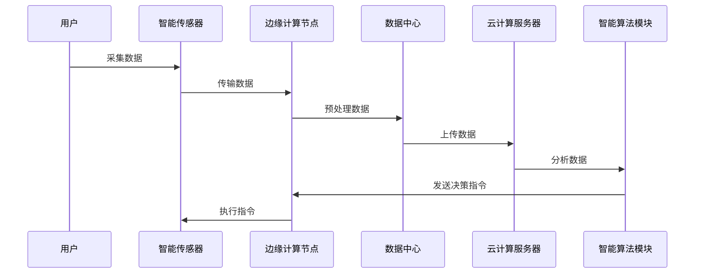

                 

### 第1章: 5G技术基础

#### 1.1 5G技术的发展历程

5G（第五代移动通信技术）的诞生是通信领域的一次重大变革。自2009年首次提出概念以来，5G技术经历了数十年的研发和测试。其技术发展历程可以分为以下几个重要阶段：

1. **概念提出与标准化**（2009-2010年）：国际电信联盟（ITU）发布了5G的初步概念，随后，全球多家通信企业和研究机构开始着手研发。

2. **标准制定与技术研发**（2011-2017年）：3GPP（第三代 Partnership Project）开始制定5G标准，并在2017年正式发布了5G NR（New Radio）和5G NSA（Non-Stand Alone）标准。在这一阶段，5G的关键技术逐渐成熟。

3. **试验与商用部署**（2018-2020年）：多家通信企业开始在全球范围内进行5G试验网部署，并在2019年启动了大规模商用部署。

4. **规模化商用与拓展应用**（2020年至今）：5G网络在全球范围内的规模化商用，开始广泛应用于各个领域，如智能制造、智慧城市、自动驾驶等。

#### 1.2 5G技术的核心特征

5G技术相比前几代移动通信技术，具有以下几大核心特征：

1. **高速率**：5G的峰值下载速度可以达到20Gbps，是4G的100倍。这一特性使得大规模数据传输成为可能。

2. **低延迟**：5G的端到端时延低至1ms，比4G减少了近一半。低延迟特性使得实时控制和高频应用成为可能。

3. **大连接**：5G支持每平方米高达100万连接密度，能够同时连接更多的设备。这一特性为物联网应用提供了坚实基础。

4. **网络切片**：5G引入了网络切片技术，可以根据应用需求为不同的用户提供定制化的网络服务。这一特性提高了网络的灵活性和效率。

#### 1.3 5G网络架构解析

5G网络架构相比4G有显著变化，主要表现在以下几个方面：

1. **核心网**：5G采用了全新的服务化架构（Service-Based Architecture，SBA），将核心网功能模块化，提高了网络的可扩展性和灵活性。

2. **无线接入网**：5G引入了New Radio（NR）技术，采用了更高效的波束成形和频谱利用率更高的毫米波频段。

3. **边缘计算**：5G网络中引入了边缘计算，通过在网络的边缘节点部署计算资源，降低了数据传输延迟，提高了网络响应速度。

#### 1.4 5G对智能制造的影响

5G技术对智能制造的影响主要体现在以下几个方面：

1. **设备互联**：5G的高速和大连接特性使得设备之间的互联互通变得更加高效和可靠，为制造设备的智能互联提供了基础。

2. **实时监控**：5G的低延迟特性使得实时监控成为可能，工厂管理者可以实时获取设备运行状态和生产数据，提高生产效率。

3. **远程控制**：通过5G网络，可以实现远程控制机器人和自动化设备，降低人力成本，提高生产灵活性。

4. **数据采集与分析**：5G的高速率特性使得大规模数据采集变得更加便捷，为大数据分析和智能制造提供了丰富的数据支持。

#### 核心概念原理

- **5G NR**：5G New Radio，是一种全新的无线接入技术，支持毫米波频段和Sub-6GHz频段，具有高速率和低延迟特性。

- **网络切片**：网络切片是将一个物理网络划分为多个虚拟网络的技术，每个切片可以提供不同的网络性能和功能。

- **边缘计算**：边缘计算是一种在网络的边缘节点进行数据处理和计算的技术，可以降低数据传输延迟，提高系统响应速度。

#### 概念属性特征对比表格

| 特征                   | 4G                | 5G                 |
|------------------------|-------------------|--------------------|
| 峰值下载速度           | 100Mbps           | 20Gbps             |
| 时延                   | 50ms              | 1ms                |
| 连接密度               | 10万/平方米       | 100万/平方米       |
| 网络切片               | 不支持            | 支持               |

#### ER实体关系图架构

```mermaid
erDiagram
  Factory ||--|{ Device }
  Device ||--|{ Sensor }
  Sensor ||--|{ Data }
```

#### 结论

通过上述分析，我们可以看到5G技术为智能制造带来了诸多机遇。高速率、低延迟、大连接和网络切片等特性使得5G在智能制造中的应用具有广阔的前景。在下一章中，我们将深入探讨边缘AI的基本概念及其在智能制造中的应用。

#### 问题解决

在解决智能制造中的具体问题时，5G技术能够提供以下解决方案：

1. **提高生产效率**：通过5G网络实现设备的实时监控和远程控制，减少人为干预，提高生产效率。
2. **优化生产流程**：利用5G网络进行大规模数据采集和分析，优化生产流程，减少浪费，提高资源利用率。
3. **增强设备互联**：5G网络支持大规模设备互联，实现设备之间的实时通信和协同工作，提高生产灵活性。
4. **提升产品质量**：通过实时监测和数据分析，提前发现设备故障和生产异常，提高产品质量。

#### 边界与外延

- **边界**：5G技术主要应用于工业生产环境中，包括设备互联、实时监控、远程控制等。
- **外延**：5G技术还可以扩展应用到智能制造的其他领域，如智能工厂规划、智能物流管理等。

#### 概念结构与核心要素组成

- **概念结构**：5G技术由无线接入网、核心网和边缘计算三部分组成。
- **核心要素组成**：高速率、低延迟、大连接、网络切片和边缘计算。

通过上述详细的分析和讲解，我们为读者提供了一个全面了解5G技术基础的概念框架，并为后续章节的深入探讨打下了坚实的基础。在下一章中，我们将进一步探讨边缘AI的基本概念及其在智能制造中的应用。

#### 让我们一步一步分析推理思考

首先，我们需要了解5G技术的基本概念。5G是第五代移动通信技术，其核心特征是高速率、低延迟和大连接。高速率意味着数据传输速度可以达到20Gbps，这是4G的100倍；低延迟可以降低到1ms，比4G减少了近一半；大连接则支持每平方米高达100万的连接密度。

接着，我们来看5G网络架构。5G网络架构包括核心网、无线接入网和边缘计算。核心网采用了服务化架构，提高了网络的灵活性和可扩展性；无线接入网引入了New Radio技术，支持毫米波频段和Sub-6GHz频段；边缘计算则通过在网络边缘节点部署计算资源，降低了数据传输延迟，提高了系统响应速度。

然后，我们分析5G对智能制造的影响。5G技术可以提高设备互联效率，实现实时监控和远程控制，从而减少人力成本，提高生产灵活性；同时，5G的高速率特性使得大规模数据采集变得更加便捷，为大数据分析和智能制造提供了丰富的数据支持。

最后，我们总结一下5G技术的核心概念和原理。5G New Radio（NR）是5G的核心技术之一，支持毫米波频段和Sub-6GHz频段；网络切片技术可以将一个物理网络划分为多个虚拟网络，提供定制化的网络服务；边缘计算则通过在网络的边缘节点部署计算资源，降低了数据传输延迟，提高了系统响应速度。

综上所述，5G技术为智能制造带来了诸多机遇，通过高速率、低延迟和大连接等特性，实现了设备互联、实时监控和远程控制，提高了生产效率和灵活性。在下一章中，我们将深入探讨边缘AI的基本概念及其在智能制造中的应用。

---

### 第2章: 边缘AI的基本概念

#### 2.1 边缘计算的概念与优势

边缘计算是一种分布式计算架构，旨在将计算、存储和网络功能分布在网络的边缘节点上，而非仅仅依赖于集中式数据中心。边缘计算的核心思想是尽可能地在数据产生的源头进行数据处理和计算，从而减少数据传输延迟，提高系统的响应速度。

**概念解释**：边缘计算通过在网络边缘部署计算节点，如路由器、交换机、智能设备等，使得这些节点能够独立执行计算任务，处理本地数据。这种分布式架构使得数据传输路径缩短，降低了网络拥堵和数据延迟。

**优势分析**：

1. **低延迟**：由于数据在边缘节点处理，减少了传输到中心数据中心的距离，从而显著降低了延迟，这对于实时应用和交互式应用尤为重要。

2. **高带宽利用率**：边缘计算可以减少对中心数据中心的依赖，减轻中心数据中心的处理压力，提高整个网络的带宽利用率。

3. **隐私保护**：边缘计算可以在本地处理敏感数据，减少数据在网络上传输的风险，从而提高了数据隐私保护水平。

4. **增强可靠性**：边缘计算通过分散计算资源，提高了系统的整体可靠性。即使某个节点发生故障，其他节点仍然可以继续运行，确保系统稳定。

#### 2.2 边缘AI的定义与应用

**定义**：边缘AI（Edge AI）是指将人工智能算法和模型部署在边缘计算设备上，使得这些设备能够独立执行智能任务，如图像识别、语音识别、预测分析等。

**应用场景**：

1. **智能制造**：在智能制造领域，边缘AI可以用于设备监控、故障预测、质量检测等，提高生产效率和产品质量。

2. **智慧城市**：在智慧城市中，边缘AI可以用于交通管理、环境监测、公共安全等，提高城市运营效率和居民生活质量。

3. **医疗健康**：在医疗健康领域，边缘AI可以用于远程诊断、健康监测、药物研发等，提高医疗服务质量和效率。

4. **智能农业**：在智能农业中，边缘AI可以用于作物监测、病虫害预测、灌溉控制等，提高农业生产效率。

#### 2.3 边缘AI的关键技术

**1. 模型压缩与优化**：为了满足边缘设备有限的计算资源和存储空间，需要采用模型压缩和优化技术，如网络剪枝、量化、知识蒸馏等，以减少模型大小和提高计算效率。

**2. 轻量化神经网络**：设计轻量级的神经网络架构，如MobileNet、ShuffleNet等，可以在保证一定精度的情况下显著降低计算复杂度。

**3. 联邦学习**：联邦学习是一种分布式机器学习技术，通过在边缘设备上训练本地模型，然后将更新聚合到中心模型，实现模型优化而不需要传输原始数据。

**4. 边缘智能硬件**：开发高性能、低功耗的边缘智能硬件，如边缘AI芯片、AI模块等，以满足边缘AI应用的需求。

**5. 安全与隐私保护**：边缘AI涉及到大量的敏感数据，需要采用安全隔离、数据加密、差分隐私等技术来保护数据安全和用户隐私。

#### 核心概念原理

- **边缘计算**：通过在网络边缘部署计算资源，减少数据传输延迟，提高系统响应速度。
- **边缘AI**：将人工智能算法和模型部署在边缘计算设备上，实现本地智能处理。

#### 概念属性特征对比表格

| 特征                   | 边缘计算             | 边缘AI                |
|------------------------|---------------------|----------------------|
| 目的                   | 减少数据传输延迟     | 实现本地智能处理      |
| 应用场景               | 智慧城市、智能农业等  | 智能制造、医疗健康等  |
| 技术关键               | 分布式计算架构、低延迟 | 模型压缩、轻量化神经网络 |

#### ER实体关系图架构

```mermaid
erDiagram
  EdgeComputing ||--|{ EdgeDevice }
  EdgeDevice ||--|{ AIModel }
  AIModel ||--|{ DataProcessing }
```

#### 结论

边缘计算和边缘AI在智能制造等领域具有广泛应用前景。通过边缘计算，可以实现低延迟、高带宽利用率和增强隐私保护；而边缘AI则能够实现本地智能处理，提高生产效率和产品质量。在下一章中，我们将进一步探讨5G与边缘AI在智能制造中的协同应用。

#### 让我们一步一步分析推理思考

首先，我们需要理解边缘计算的基本概念。边缘计算是一种分布式计算架构，通过在网络边缘部署计算资源，减少数据传输延迟，提高系统响应速度。边缘计算的优势在于低延迟、高带宽利用率和增强隐私保护。

接着，我们探讨边缘AI的定义与应用。边缘AI是将人工智能算法和模型部署在边缘计算设备上，实现本地智能处理。边缘AI在智能制造、智慧城市、医疗健康和智能农业等领域有广泛的应用场景，能够显著提高生产效率和产品质量。

然后，我们分析边缘AI的关键技术。模型压缩与优化、轻量化神经网络、联邦学习、边缘智能硬件和安全性是边缘AI的重要技术支撑。这些技术确保了边缘AI能够在有限的计算资源和存储空间下高效运行，同时保障数据安全和用户隐私。

最后，我们总结一下边缘计算和边缘AI的核心概念和原理。边缘计算通过分布式计算架构实现低延迟、高带宽利用率和增强隐私保护；边缘AI通过本地智能处理提高生产效率和产品质量。在下一章中，我们将深入探讨5G与边缘AI在智能制造中的协同应用，以及这种协同如何带来更大的优势。

---

### 第3章: 5G与边缘AI在智能制造中的协同

#### 3.1 5G与边缘AI在智能制造中的应用场景

在智能制造领域，5G与边缘AI的结合带来了诸多应用场景，极大地提升了生产效率和产品质量。以下是几个典型的应用场景：

1. **设备预测性维护**：通过5G网络收集设备运行数据，结合边缘AI模型进行实时分析，预测设备可能发生的故障，提前进行维护，减少停机时间和维护成本。

2. **质量检测与控制**：在生产线中部署边缘AI设备，实时分析生产过程中的质量数据，识别不良品，并及时调整生产参数，提高产品质量一致性。

3. **生产过程优化**：利用5G网络实现生产设备的互联互通，结合边缘AI进行实时数据分析，优化生产流程，提高生产效率和资源利用率。

4. **远程操作与控制**：通过5G网络实现远程操作和控制，使得工程师可以实时监控和操作生产设备，提高生产灵活性，降低人力成本。

5. **智能物流管理**：结合5G与边缘AI，实现对仓储和物流过程的实时监控与管理，提高物流效率，降低运营成本。

#### 3.2 5G与边缘AI的融合优势

5G与边缘AI的结合在智能制造中带来了以下融合优势：

1. **高速数据传输**：5G技术提供了高速率的数据传输能力，使得大规模数据能够在短时间内传输到边缘设备，为边缘AI提供了充足的数据支持。

2. **低延迟**：5G的低延迟特性使得边缘设备能够实时处理和响应数据，提高了系统的实时性和响应速度。

3. **高连接密度**：5G的大连接密度特性支持大量设备同时连接，满足了智能制造中设备互联互通的需求。

4. **灵活的网络切片**：5G的网络切片技术可以根据不同的应用需求，为智能制造中的设备提供定制化的网络服务，提高了网络资源的利用效率。

5. **边缘智能处理**：边缘AI使得边缘设备能够在本地进行数据处理和智能决策，减少了数据传输延迟，提高了系统响应速度。

6. **数据隐私与安全**：边缘计算和5G网络的安全特性能够保障数据在传输和处理过程中的安全性和隐私性。

#### 3.3 5G与边缘AI的协同挑战与解决方案

尽管5G与边缘AI在智能制造中具有显著的协同优势，但在实际应用过程中仍面临一些挑战：

1. **边缘设备计算能力有限**：边缘设备的计算资源和存储空间相对有限，需要采用轻量级的AI模型和优化算法来满足需求。

2. **数据传输与安全性**：5G网络虽然提供了高速数据传输能力，但在数据传输过程中仍需保证数据的安全性和完整性。

3. **边缘设备管理**：随着边缘设备的增加，设备管理和维护成为一项挑战，需要建立有效的设备管理系统。

4. **跨平台兼容性**：不同设备和平台之间的兼容性问题，可能会影响系统的整体性能和稳定性。

**解决方案**：

1. **轻量化AI模型**：通过模型压缩和优化技术，减少模型大小，提高计算效率。

2. **安全传输协议**：采用加密传输协议，保障数据在传输过程中的安全性。

3. **分布式设备管理**：利用物联网技术，建立分布式设备管理系统，实现设备的远程监控和管理。

4. **标准化接口**：制定统一的接口规范，确保不同设备和平台之间的兼容性。

#### 核心概念原理

- **5G与边缘AI协同**：通过5G的高速数据传输和边缘AI的本地智能处理，实现智能制造的实时性、高效性和智能化。
- **边缘智能处理**：利用边缘设备本地计算，降低数据传输延迟，提高系统响应速度。
- **网络切片技术**：根据不同应用需求，提供定制化的网络服务，提高网络资源利用效率。

#### 概念属性特征对比表格

| 特征                   | 5G                | 边缘AI               |
|------------------------|-------------------|---------------------|
| 数据传输速度           | 高速率             | 本地处理             |
| 端到端时延             | 低延迟             | 实时响应             |
| 连接密度               | 大连接密度         | 灵活部署             |
| 安全性                 | 高安全性           | 本地安全处理          |

#### ER实体关系图架构

```mermaid
erDiagram
  5GNetwork ||--|{ EdgeDevice }
  EdgeDevice ||--|{ AIModel }
  AIModel ||--|{ ManufacturingProcess }
```

#### 结论

5G与边缘AI在智能制造中的应用场景丰富，融合了5G的高速数据传输和边缘AI的本地智能处理优势，能够显著提高生产效率和产品质量。通过分析协同优势与挑战，我们可以看到，通过技术优化和标准化接口，5G与边缘AI的协同应用具有广阔的发展前景。在下一章中，我们将深入探讨5G网络在智能制造中的应用，进一步分析其实际部署和效果。

#### 让我们一步一步分析推理思考

首先，我们需要了解5G与边缘AI在智能制造中的应用场景。这些应用场景包括设备预测性维护、质量检测与控制、生产过程优化、远程操作与控制和智能物流管理。这些应用场景展示了5G与边缘AI如何协同工作，实现智能制造的高效化和智能化。

接着，我们分析5G与边缘AI的融合优势。5G的高速数据传输、低延迟、大连接密度和灵活的网络切片技术，与边缘AI的本地智能处理相结合，能够实现数据实时传输和处理，提高生产效率和产品质量。此外，5G与边缘AI的协同还能够保障数据传输的安全性和完整性，提高系统的整体安全性。

然后，我们探讨5G与边缘AI协同过程中的挑战。这些挑战主要包括边缘设备计算能力有限、数据传输与安全性、边缘设备管理和跨平台兼容性。针对这些挑战，我们可以通过优化AI模型、采用安全传输协议、建立分布式设备管理系统和制定统一接口规范来解决。

最后，我们总结一下5G与边缘AI协同的核心概念和原理。5G与边缘AI协同通过结合高速数据传输和本地智能处理，实现智能制造的实时性、高效性和智能化。在下一章中，我们将深入探讨5G网络在智能制造中的应用，进一步分析其实际部署和效果。

---

### 第4章: 5G网络在智能制造中的应用

#### 4.1 5G网络在工厂环境中的部署

5G网络在智能制造中的应用，首先需要考虑的是其工厂环境中的部署。5G网络的部署需要综合考虑网络覆盖、设备接入、信号强度和频谱资源等因素。

**网络覆盖**：在工厂环境中，5G网络的覆盖需要覆盖整个生产区域，包括车间、仓库、设备操作区域等。为了实现良好的网络覆盖，通常需要采用多天线MIMO（Multiple Input Multiple Output）技术，以及采用毫米波频段和Sub-6GHz频段的混合部署策略。

**设备接入**：5G网络能够支持多种设备的接入，包括工业机器人、传感器、PLC（可编程逻辑控制器）和智能终端等。为了实现高效的设备接入，可以通过无线接入点（Access Point，AP）和网关（Gateway）来连接设备和5G网络。

**信号强度**：5G网络的信号强度需要满足工业现场的要求，特别是在车间等高噪音环境中，需要采用信号放大器（Signal Amplifier）和信号增强技术来保证信号的稳定和可靠。

**频谱资源**：5G网络使用的频谱资源包括Sub-6GHz频段和毫米波频段。Sub-6GHz频段具有较好的穿透性和覆盖范围，适用于大面积覆盖；而毫米波频段则具有更高的数据传输速率，适用于高带宽需求的应用场景。

#### 4.2 5G网络支持的高效通信

5G网络在智能制造中的应用，主要得益于其高效通信能力。以下是5G网络在通信方面的主要优势：

**高速数据传输**：5G网络的数据传输速率可以达到20Gbps，是4G的100倍。这一特性使得大规模数据采集和传输成为可能，为智能制造中的实时数据处理提供了基础。

**低延迟**：5G网络的端到端时延低至1ms，相比4G减少了近一半。低延迟特性使得实时控制和交互式应用成为可能，提高了生产效率和响应速度。

**大连接密度**：5G网络支持每平方米高达100万个连接，可以同时连接大量设备，实现了设备间的无缝通信和协同工作。

**网络切片**：5G网络引入了网络切片技术，可以根据不同的应用需求，为不同的设备和场景提供定制化的网络服务。例如，在制造过程中，可以设置高优先级的网络切片，确保关键设备的通信不受干扰。

**边缘计算**：5G网络中的边缘计算，通过在网络边缘节点部署计算资源，可以降低数据传输延迟，提高系统的实时性和响应速度。这对于智能制造中的实时监控、设备维护和远程控制等应用至关重要。

#### 4.3 5G网络在智能制造中的案例分析

**案例1：智能工厂生产线的实时监控**

在一个智能工厂的生产线上，5G网络被用于实现生产设备的实时监控。通过部署5G无线传感器和边缘计算设备，生产设备的数据可以实时传输到中央控制系统。生产过程中的异常情况，如设备故障、生产参数异常等，可以立即被检测并通知操作人员进行处理，从而避免了生产中断和资源浪费。

**案例2：设备预测性维护**

某制造企业通过5G网络和边缘AI技术，实现了设备的预测性维护。通过在设备上部署传感器，实时收集设备运行数据，并利用边缘计算设备进行数据分析和故障预测。当预测到设备可能出现故障时，系统会提前发出预警，并建议进行预防性维护，从而降低了设备的停机时间和维护成本。

**案例3：智能物流管理**

在智能物流管理中，5G网络被用于实现仓库和运输车辆的实时监控和管理。通过部署5G传感器和边缘计算设备，仓库内的货物流动情况、库存状态以及运输车辆的行驶轨迹等信息可以实时传输到管理系统。管理者可以根据实时数据，优化物流流程，提高物流效率，降低运营成本。

#### 核心概念原理

- **5G网络部署**：在工厂环境中，5G网络的部署需要考虑网络覆盖、设备接入、信号强度和频谱资源等因素。
- **高效通信**：5G网络的高速数据传输、低延迟、大连接密度和边缘计算，为智能制造提供了高效通信能力。
- **应用案例**：智能工厂生产线的实时监控、设备预测性维护和智能物流管理是5G网络在智能制造中的成功应用案例。

#### 概念属性特征对比表格

| 特征                   | 4G                | 5G                 |
|------------------------|-------------------|--------------------|
| 峰值下载速度           | 100Mbps           | 20Gbps             |
| 时延                   | 50ms              | 1ms                |
| 连接密度               | 10万/平方米       | 100万/平方米       |
| 网络切片               | 不支持            | 支持               |

#### ER实体关系图架构

```mermaid
erDiagram
  Factory ||--|{ 5GNetwork }
  5GNetwork ||--|{ Device }
  Device ||--|{ Sensor }
```

#### 结论

5G网络在智能制造中的应用，通过其高速数据传输、低延迟、大连接密度和边缘计算能力，实现了生产设备的实时监控、预测性维护和智能物流管理。这些应用案例展示了5G网络在智能制造中的巨大潜力和实际价值。在下一章中，我们将深入探讨边缘AI在智能制造中的关键技术，进一步分析其如何提升智能制造的智能化水平。

---

### 4.1 5G网络在工厂环境中的部署

在智能制造的工厂环境中，5G网络的部署是关键的一步。这一部署过程需要综合考虑多个因素，以确保网络能够满足生产线的需求。

首先，**网络覆盖**是首要考虑的问题。工厂环境复杂多样，包括车间、仓库、设备操作区等，这些区域都需要良好的5G信号覆盖。为了实现全面的覆盖，通常需要采用多种技术手段。例如，在车间等大型区域，可以部署高增益的天线，以提高信号覆盖范围。在仓库等高墙密集的区域，可以采用毫米波频段，以提高信号的穿透能力。此外，还可以通过部署5G小基站（微微基站）和分布式天线系统（DAS），来增强信号强度和覆盖范围。

**设备接入**也是5G网络部署中的重要一环。在工厂环境中，各类设备繁多，包括工业机器人、传感器、PLC（可编程逻辑控制器）、智能终端等。这些设备需要通过无线接入点（Access Point，AP）和网关（Gateway）接入5G网络。为了确保接入的高效和稳定，需要选择适合的无线接入技术和接入设备。例如，对于高移动性的工业机器人，可以采用无线局域网（Wi-Fi）接入；对于传感器和PLC等设备，可以采用蓝牙或Zigbee等低功耗无线技术。

**信号强度**的保证是5G网络部署中的另一个重要因素。在工业环境中，信号强度会受到电磁干扰、设备遮挡等因素的影响。为了保证信号的稳定和可靠，可以采用信号放大器（Signal Amplifier）和信号增强技术。这些技术能够提高信号强度，降低信号衰减，确保设备的稳定连接。

**频谱资源**的合理利用也是5G网络部署的关键。5G网络使用的是Sub-6GHz频段和毫米波频段。Sub-6GHz频段具有较好的穿透性和覆盖范围，适用于大面积覆盖；而毫米波频段则具有更高的数据传输速率，适用于高带宽需求的应用场景。在部署过程中，需要根据实际需求，合理规划频谱资源的使用，确保网络性能的最大化。

**部署步骤**可以分为以下几个阶段：

1. **需求分析**：根据工厂环境的特点和生产需求，确定网络覆盖范围、设备接入类型、信号强度要求等。

2. **方案设计**：根据需求分析结果，设计具体的网络部署方案，包括网络架构、设备选型、频谱规划等。

3. **现场施工**：按照设计方案，进行现场设备的安装和调试，包括天线、小基站、无线接入点等。

4. **系统调试**：对部署的网络进行系统调试，确保网络覆盖良好、设备接入稳定、信号强度满足要求。

5. **性能优化**：对网络性能进行优化，确保网络能够稳定运行，满足生产需求。

**未来发展趋势**：

1. **网络智能化**：随着人工智能技术的发展，5G网络将逐步实现智能化管理，包括自动频谱管理、自动网络优化等，提高网络的自适应能力。

2. **边缘计算与5G的融合**：边缘计算和5G网络的深度融合，将进一步提升智能制造的实时性和响应速度，实现更高效的设备和流程管理。

3. **无线网络与工业物联网（IIoT）的融合**：5G网络与工业物联网的融合，将实现更广泛、更深入的设备互联，为智能制造提供更加全面的数据支持。

通过上述分析，我们可以看到5G网络在智能制造中的应用前景广阔。随着技术的不断进步和应用的深入，5G网络将在智能制造中发挥越来越重要的作用。

---

### 4.2 5G网络支持的高效通信

5G网络在智能制造中的高效通信能力是其核心技术优势之一，为智能制造提供了坚实的基础。以下是5G网络在通信方面的主要优势：

#### 高速率数据传输

5G网络的最大亮点之一是具备极高的数据传输速度。其峰值下载速率可达到20Gbps，是4G的100倍。这意味着在智能制造过程中，大量生产数据、监控视频、传感器数据等可以在短时间内传输到数据中心或边缘设备，为实时数据处理和智能分析提供了强有力的支持。高速率数据传输不仅提升了数据采集的效率，还使得高分辨率视频监控和远程控制成为可能。

#### 低延迟

5G网络的端到端时延低至1ms，相比4G减少了近一半。低延迟特性对于智能制造中的实时控制和交互式应用至关重要。例如，在设备预测性维护中，实时监测设备运行状态并及时采取维护措施，可以显著减少设备停机时间，提高生产效率。在智能物流管理中，实时控制机器人和运输车辆的动作，可以优化物流流程，提高运输效率。

#### 大连接密度

5G网络支持每平方米高达100万个连接，可以同时连接大量设备，实现了设备间的无缝通信和协同工作。在制造环境中，这意味着能够同时连接数以千计的传感器、机器人和智能终端，确保每一个设备都能实时传输和接收数据，从而实现整个生产系统的紧密协作。大连接密度为智能制造中的设备互联互通提供了重要保障。

#### 网络切片

5G网络引入了网络切片技术，可以根据不同的应用需求，为不同的设备和场景提供定制化的网络服务。在智能制造中，不同的设备和应用场景对网络性能的要求各异。例如，生产控制系统的实时性要求高，而数据存储和分析系统的数据传输量较大。通过网络切片技术，可以为一组特定设备或应用场景分配独立的网络资源，确保网络服务的质量和稳定性。网络切片技术提高了网络资源利用率，优化了网络性能。

#### 边缘计算

5G网络中的边缘计算，通过在网络边缘节点部署计算资源，可以降低数据传输延迟，提高系统的实时性和响应速度。在智能制造中，边缘计算可以处理来自传感器、机器人和其他设备的实时数据，进行本地化的智能分析和决策。例如，在设备预测性维护中，边缘计算设备可以实时分析设备运行数据，预测可能出现的故障，并提前发出预警。在智能物流管理中，边缘计算设备可以实时分析物流数据，优化运输路线，提高物流效率。

#### 案例分析

为了更好地理解5G网络在智能制造中的应用，以下是一些具体的案例分析：

1. **智能工厂生产线的实时监控**：在智能工厂中，5G网络可以连接生产线上的各种设备，如传感器、机器人和PLC。通过实时数据传输，工厂管理者可以远程监控生产线的运行状态，及时发现和处理异常情况，提高生产效率。

2. **设备预测性维护**：通过5G网络和边缘计算，工厂可以实时收集设备的运行数据，并利用边缘计算设备进行分析，预测设备可能出现的故障。这种预测性维护可以减少设备停机时间，降低维护成本。

3. **智能物流管理**：5G网络可以连接仓库和运输车辆，实现物流过程的实时监控和管理。通过实时数据分析，可以优化物流流程，提高物流效率。

4. **远程控制**：5G网络支持远程控制生产设备和机器人，使得工厂管理者可以在任何地点远程指挥生产操作，提高生产的灵活性和响应速度。

通过上述分析，我们可以看到5G网络在智能制造中的应用前景广阔。其高速率、低延迟、大连接密度、网络切片和边缘计算等特性，为智能制造提供了高效通信能力，有助于提升生产效率、产品质量和运营效益。

---

### 4.3 5G网络在智能制造中的案例分析

#### 案例一：智能工厂生产线的实时监控

在一个典型的智能工厂中，5G网络的应用为生产线的实时监控提供了坚实的基础。工厂内部布设了大量的传感器和监控摄像头，这些设备通过5G网络将实时数据传输到中央控制系统。以下是一个具体案例：

**背景**：某智能工厂的生产线包括数十台机器人和多个加工单元，生产过程中会产生大量实时数据，如温度、压力、速度等。为了保证生产线的稳定运行和产品质量，工厂管理者需要实时监控这些数据。

**解决方案**：工厂在生产线的关键位置部署了5G基站和传感器，将传感器采集到的数据通过5G网络实时传输到中央控制系统。中央控制系统利用边缘计算设备对数据进行实时分析，检测异常情况，并及时发出预警。例如，如果某台机器人的运行速度出现异常，系统会立即发送警报，通知操作人员进行检查和维护。

**效果**：通过5G网络的低延迟和高速率特性，实时监控系统能够迅速响应生产过程中的各种异常情况，显著提高了生产效率和产品质量。此外，5G网络的广覆盖和大连接密度特性，确保了生产线上的每个设备都能稳定连接到网络，实现了全面的生产监控。

#### 案例二：设备预测性维护

设备预测性维护是5G网络在智能制造中的另一重要应用。通过5G网络和边缘AI技术，工厂可以实现设备的预测性维护，减少设备故障率和停机时间。

**背景**：某制造企业拥有一条复杂的自动化生产线，包含多台关键设备。这些设备在长时间运行过程中，容易出现磨损和故障，导致生产中断和产品质量下降。

**解决方案**：企业利用5G网络和边缘AI技术，对生产设备进行实时监控和数据采集。边缘计算设备对采集到的数据进行实时分析，利用机器学习算法预测设备可能出现的故障。例如，通过分析设备的振动数据，可以预测某台电机可能发生的过载故障。系统会在故障发生前发出预警，通知维护人员进行预防性维护。

**效果**：通过预测性维护，企业显著减少了设备故障率和停机时间，提高了生产效率和设备利用率。同时，5G网络的低延迟特性确保了预测性维护的实时性，使得企业能够在设备故障发生前及时采取行动。

#### 案例三：智能物流管理

5G网络在智能物流管理中的应用，为物流过程的实时监控和管理提供了强有力的支持。

**背景**：某物流公司拥有大量运输车辆和仓库，物流过程中需要实时监控货物的状态和运输车辆的行驶轨迹，以确保物流效率。

**解决方案**：物流公司利用5G网络和传感器技术，对运输车辆和仓库进行实时监控。运输车辆上安装了传感器，实时采集车辆状态和位置数据，并通过5G网络传输到中央管理系统。仓库内的传感器则用于监控货物的存储状态和出入库情况。中央管理系统利用边缘计算设备对采集到的数据进行实时分析，优化物流流程。

**效果**：通过5G网络的实时传输能力和边缘计算的高速处理能力，物流公司实现了对运输车辆和仓库的实时监控和管理，提高了物流效率，降低了运营成本。例如，通过实时数据分析，可以优化运输路线，减少运输时间；通过监控仓库库存状态，可以优化库存管理，减少库存积压。

#### 案例四：远程操作与控制

5G网络的高速率和低延迟特性，使得远程操作与控制成为可能，为工厂管理者提供了更多的灵活性。

**背景**：某工厂由于地理位置偏远，管理者无法实时到现场进行操作和监控。这给生产管理和设备维护带来了一定的困难。

**解决方案**：工厂利用5G网络和远程操作设备，实现远程监控和操作。管理者通过5G网络连接到工厂的控制系统，实时监控生产设备和生产线状态，并根据需要远程控制机器人和其他设备。例如，在设备出现故障时，可以通过远程诊断和操作，快速解决问题。

**效果**：通过远程操作与控制，工厂管理者能够实时了解生产状态，及时采取措施，提高了生产效率和响应速度。同时，减少了因地理位置限制带来的管理难题。

综上所述，5G网络在智能制造中的应用案例展示了其在实时监控、设备预测性维护、智能物流管理、远程操作与控制等方面的优势。随着5G技术的不断发展和应用的深入，其将在智能制造中发挥越来越重要的作用，推动智能制造向更高效、更智能的方向发展。

---

### 4.4 5G网络部署中的问题和解决方案

尽管5G网络在智能制造中的应用前景广阔，但在实际部署过程中仍然面临一系列挑战。以下是5G网络部署中的主要问题和相应的解决方案：

#### 问题1：覆盖范围不足

**问题描述**：5G网络覆盖范围有限，尤其是在大型工厂或复杂环境中，信号覆盖不足会影响生产设备的连接稳定性。

**解决方案**：
- **多基站部署**：通过在工厂内布设多个5G基站，增加信号覆盖范围。
- **分布式天线系统（DAS）**：采用DAS技术，在工厂内安装分布式天线，提高信号覆盖密度。
- **毫米波频段**：利用毫米波频段，实现更高带宽和更强穿透力的信号覆盖。

#### 问题2：设备兼容性问题

**问题描述**：5G网络标准多样，不同设备之间的兼容性问题可能导致网络不稳定，影响生产效率。

**解决方案**：
- **标准化接口**：制定统一的接口标准，确保设备之间的兼容性。
- **模块化设计**：采用模块化设计，方便设备升级和替换，提高兼容性。
- **边缘计算**：在边缘设备上实现部分计算功能，减少对中心设备的依赖，提高网络的稳定性。

#### 问题3：信号干扰和干扰管理

**问题描述**：在工业环境中，信号干扰现象普遍，如高频设备的电磁干扰，可能导致5G网络信号不稳定。

**解决方案**：
- **干扰检测与隔离**：采用干扰检测技术，及时发现并隔离干扰源，确保网络信号质量。
- **频谱管理**：合理规划频谱资源，避免频谱资源冲突，降低干扰风险。
- **动态频谱分配**：采用动态频谱分配技术，实时调整频谱资源分配，优化网络性能。

#### 问题4：网络安全和隐私保护

**问题描述**：5G网络涉及到大量的生产数据和敏感信息，网络安全和隐私保护至关重要。

**解决方案**：
- **加密传输**：采用加密技术，确保数据在传输过程中的安全性和隐私性。
- **安全隔离**：实现网络隔离，防止恶意攻击和未授权访问。
- **安全审计**：定期进行安全审计，及时发现和修补安全漏洞。

#### 问题5：边缘设备计算能力有限

**问题描述**：边缘设备的计算资源和存储空间有限，可能影响AI模型的应用效果。

**解决方案**：
- **轻量化AI模型**：采用轻量级AI模型和优化算法，降低计算复杂度，提高边缘设备的处理能力。
- **分布式计算**：通过分布式计算架构，将部分计算任务分配到边缘设备和中心设备，提高整体计算效率。
- **联邦学习**：采用联邦学习技术，在边缘设备上训练本地模型，减少对中心设备的依赖。

通过上述问题和解决方案的分析，我们可以看到，尽管5G网络在智能制造中面临诸多挑战，但通过技术优化和管理策略的完善，可以逐步克服这些问题，实现5G网络在智能制造中的高效应用。

---

### 第5章: 边缘AI在智能制造中的关键技术

#### 5.1 边缘AI在数据处理中的作用

边缘AI在智能制造中的数据处理发挥着关键作用。边缘设备直接收集生产过程中产生的数据，如传感器数据、机器视觉数据等。通过边缘AI算法，这些数据进行初步处理和分析，以便快速响应生产过程中的各种需求。以下是边缘AI在数据处理中的主要作用：

1. **实时数据预处理**：边缘AI算法可以对采集到的原始数据进行预处理，如去噪、归一化、特征提取等，以提高数据的准确性和有效性。

2. **快速异常检测**：通过边缘AI算法，可以实时监测生产过程中的异常情况，如设备故障、生产参数异常等，及时发出预警，减少设备停机和故障率。

3. **智能数据分析**：边缘AI能够对生产数据进行分析，挖掘数据中的潜在规律和模式，为生产优化和决策提供支持。

4. **数据融合与增强**：边缘AI可以将来自不同传感器和设备的数据进行融合和增强，提供更全面和准确的数据支持。

#### 5.2 边缘AI在实时决策中的应用

边缘AI在智能制造中的实时决策能力具有重要意义。通过边缘设备上的AI算法，可以实现对生产过程的实时监控和动态调整，提高生产效率和产品质量。以下是边缘AI在实时决策中的主要应用：

1. **实时故障预测**：边缘AI算法可以实时分析设备运行数据，预测设备可能发生的故障，并提前发出预警，实现预测性维护。

2. **自适应生产控制**：边缘AI可以根据实时生产数据，自适应调整生产参数和流程，优化生产效率，提高产品质量。

3. **动态调度与优化**：边缘AI可以根据生产需求和设备状态，动态调整生产计划，优化生产流程和资源利用。

4. **智能质量检测**：边缘AI可以实时分析生产数据，检测产品质量和缺陷，自动分类和标记，提高产品质量。

#### 5.3 边缘AI在设备监控与维护中的应用

边缘AI在设备监控与维护中的应用，极大地提升了智能制造的设备管理水平。以下是边缘AI在设备监控与维护中的主要应用：

1. **实时监控**：边缘AI可以对设备的运行状态进行实时监控，包括温度、压力、振动等参数，及时发现异常情况。

2. **故障预警**：通过边缘AI算法，可以实时分析设备运行数据，预测设备可能发生的故障，提前发出预警，避免设备意外停机。

3. **预测性维护**：边缘AI可以基于历史数据和实时数据，预测设备的使用寿命和维护周期，实现预测性维护，降低设备故障率和维护成本。

4. **远程维护**：通过边缘AI和5G网络，可以实现设备的远程监控和维护，减少现场维护人员的工作量，提高维护效率。

#### 5.4 边缘AI在质量检测与故障诊断中的应用

边缘AI在质量检测与故障诊断中的应用，为智能制造中的产品质量保障和设备维护提供了强有力的支持。以下是边缘AI在质量检测与故障诊断中的主要应用：

1. **质量检测**：边缘AI可以通过机器学习算法，对生产过程中的产品进行质量检测，识别缺陷和异常，实现自动分类和标注。

2. **实时缺陷识别**：边缘AI可以对生产线上实时产生的数据进行分析，识别产品的缺陷，及时调整生产参数，保证产品质量。

3. **故障诊断**：边缘AI可以通过对设备运行数据的分析，诊断设备故障原因，提供故障解决方案，实现智能故障诊断。

4. **预测性维护**：边缘AI可以基于设备历史数据和实时数据分析，预测设备故障，提前进行维护，减少设备停机时间。

#### 核心概念原理

- **边缘AI数据处理**：边缘AI通过边缘设备对生产数据进行预处理、实时分析、智能分析等，提升数据处理效率和质量。
- **实时决策**：边缘AI通过实时数据分析，实现故障预测、自适应生产控制、动态调度与优化等，提高生产效率和产品质量。
- **设备监控与维护**：边缘AI通过实时监控、故障预警、预测性维护、远程维护等，提升设备管理水平。
- **质量检测与故障诊断**：边缘AI通过质量检测、实时缺陷识别、故障诊断等，保障产品质量和设备可靠性。

#### 概念属性特征对比表格

| 特征                   | 数据处理           | 实时决策           | 设备监控与维护         | 质量检测与故障诊断     |
|------------------------|--------------------|--------------------|-----------------------|-----------------------|
| 主要任务               | 数据预处理与分析   | 故障预测与优化控制 | 实时监控与预警         | 质量检测与故障诊断     |
| 算法类型               | 特征提取、去噪等   | 机器学习、深度学习 | 实时分析、预测性维护   | 机器学习、计算机视觉   |

#### ER实体关系图架构

```mermaid
erDiagram
  EdgeAI ||--|{ DataProcessing }
  DataProcessing ||--|{ RealTimeDecision }
  RealTimeDecision ||--|{ EquipmentMonitoring }
  EquipmentMonitoring ||--|{ QualityInspection }
```

#### 结论

边缘AI在智能制造中的关键技术，包括数据处理、实时决策、设备监控与维护、质量检测与故障诊断，极大地提升了智能制造的智能化水平。通过边缘AI的应用，实现了数据的实时处理与分析、生产过程的优化控制、设备的智能监控与维护，以及产品质量的保障和故障的快速诊断。在下一章中，我们将探讨5G+边缘AI在智能制造中的协同实现，分析其系统架构和协同算法。

---

### 5.1 边缘AI在数据处理中的作用

边缘AI在智能制造中的应用，首先体现在数据处理方面。随着智能制造的不断发展，生产过程中会产生海量的数据，如传感器数据、设备运行数据、产品质量数据等。这些数据对于智能制造的优化和决策具有重要意义，但如何高效、准确地处理这些数据，成为智能制造的关键问题。

**实时数据预处理**：边缘AI可以在边缘设备上对采集到的原始数据进行预处理，如去噪、归一化、特征提取等。这些预处理步骤对于提高数据的准确性和有效性至关重要。通过边缘AI算法，可以快速过滤掉噪声数据，提取出有用的特征信息，为后续的数据分析和决策提供基础。

**快速异常检测**：在智能制造过程中，设备故障、参数异常等问题可能会严重影响生产效率和产品质量。边缘AI算法可以通过实时监测设备运行数据，快速检测出异常情况。例如，通过对设备振动数据的分析，可以预测设备可能发生的故障，并及时发出预警，避免设备意外停机。

**智能数据分析**：边缘AI不仅能够进行实时数据预处理和异常检测，还可以对生产数据进行智能分析。通过机器学习和深度学习算法，边缘AI可以挖掘数据中的潜在规律和模式，为生产优化和决策提供支持。例如，通过分析生产数据，可以找出影响产品质量的关键因素，并提出相应的优化方案。

**数据融合与增强**：智能制造过程中，往往需要整合来自不同传感器和设备的数据。边缘AI可以通过数据融合技术，将多源数据进行整合和增强，提供更全面和准确的数据支持。例如，通过融合传感器数据和机器视觉数据，可以更全面地监测生产过程，提高质量检测的准确性。

**案例应用**：在一个典型的智能工厂中，边缘AI被用于处理生产过程中的数据。传感器收集到的温度、压力、速度等数据，通过边缘AI算法进行实时预处理和异常检测。例如，如果温度传感器检测到异常温度，边缘AI会立即发出预警，通知操作人员进行检查和维护。同时，边缘AI对生产数据进行智能分析，找出影响产品质量的关键因素，并提出优化方案。

通过上述分析，我们可以看到边缘AI在数据处理中的作用至关重要。它不仅能够实时处理和分析生产数据，提高数据的准确性和有效性，还可以通过智能分析，为生产优化和决策提供支持。在智能制造中，边缘AI的应用，使得数据成为推动生产优化和智能化的重要驱动力。

---

### 5.2 边缘AI在实时决策中的应用

边缘AI在智能制造中的应用，不仅体现在数据处理方面，更在于其在实时决策中的重要作用。在智能制造过程中，实时决策能够极大地提升生产效率和产品质量。以下是边缘AI在实时决策中的具体应用：

**实时故障预测**：边缘AI算法可以通过分析设备的历史运行数据和实时监控数据，预测设备可能发生的故障。例如，通过对设备振动数据的分析，边缘AI可以识别出异常信号，预测电机可能发生的过载故障。这种实时故障预测能力，使得企业能够在故障发生前采取预防性维护措施，避免设备停机和生产中断。

**自适应生产控制**：边缘AI可以根据实时生产数据，动态调整生产参数和流程，实现自适应生产控制。例如，在制造过程中，边缘AI可以根据传感器的实时数据，调整机器的加工速度和温度，确保产品质量的稳定性。这种自适应控制能力，不仅提高了生产效率，还减少了资源浪费。

**动态调度与优化**：边缘AI可以实时分析生产数据，根据生产需求和设备状态，动态调整生产计划，优化生产流程。例如，在制造车间中，边缘AI可以根据设备负荷情况和原材料库存情况，自动调整生产任务，优化生产顺序，提高生产效率。这种动态调度能力，使得生产过程更加灵活和高效。

**智能质量检测**：边缘AI可以对生产过程中的产品质量进行实时检测，识别缺陷和异常。例如，通过机器学习算法，边缘AI可以分析生产数据，识别产品尺寸、表面质量等缺陷，实现自动分类和标注。这种智能质量检测能力，提高了产品质量的稳定性和一致性。

**案例应用**：在一个智能工厂中，边缘AI被用于实时决策，提高生产效率和产品质量。例如，在生产线的一端，传感器实时监测设备的运行状态，边缘AI系统分析传感器数据，预测设备可能发生的故障，并提前发出预警。当设备出现异常时，边缘AI会自动调整生产参数，确保产品质量。同时，边缘AI系统还实时监控产品质量，通过机器学习算法识别缺陷产品，并自动将其分类和标注，提高了产品质量的稳定性。

通过上述分析，我们可以看到边缘AI在实时决策中的应用，不仅能够提高生产效率和产品质量，还能通过自适应控制、动态调度和智能质量检测等功能，实现生产过程的智能化和高效化。边缘AI在实时决策中的重要作用，使得智能制造迈向更高效、更智能的未来。

---

### 5.3 边缘AI在设备监控与维护中的应用

边缘AI在智能制造中的设备监控与维护中发挥了重要作用，其应用主要体现在以下几个方面：

**实时监控**：边缘AI可以实时监测设备的运行状态，包括温度、压力、振动、能耗等参数。通过边缘计算设备，实时采集设备数据，并将数据传输到中央控制系统进行分析。例如，在设备运行过程中，边缘AI系统可以实时监测电机的振动数据，如果振动数据超出正常范围，边缘AI会立即发出警报，提醒操作人员进行检查和维护。

**故障预警**：通过分析设备的历史数据和实时数据，边缘AI可以预测设备可能发生的故障。例如，通过对设备振动数据的分析，边缘AI可以识别出异常信号，预测电机可能发生的过载故障。这种故障预警能力，使得企业能够在故障发生前采取预防性维护措施，避免设备停机和生产中断。

**预测性维护**：边缘AI可以根据设备的历史运行数据和实时监控数据，预测设备的使用寿命和维护周期。例如，通过对设备能耗数据的分析，边缘AI可以预测设备的磨损情况，提前发出维护提醒。这种预测性维护策略，可以显著降低设备故障率和维护成本，提高设备利用率和生产效率。

**远程维护**：通过边缘AI和5G网络，可以实现设备的远程监控和维护。边缘AI系统可以实时分析设备数据，并将分析结果传输到远程维护中心。维护人员可以通过远程诊断和操作，快速解决问题，减少现场维护工作量。例如，当设备出现故障时，远程维护人员可以通过边缘AI系统获取设备运行数据，分析故障原因，并提供维护方案，远程指导现场人员进行维修。

**案例分析**：在一个智能工厂中，边缘AI被用于设备的监控与维护。工厂内部布设了大量的传感器和边缘计算设备，这些设备实时采集设备运行数据，并通过5G网络传输到中央控制系统。边缘AI系统对采集到的数据进行分析，实时监控设备状态，预测设备可能发生的故障，并提前发出预警。当设备出现故障时，边缘AI系统会自动发送维修通知，并推荐最佳的维修方案。通过远程维护，工厂显著减少了设备停机时间和维护成本，提高了设备利用率和生产效率。

通过上述分析，我们可以看到边缘AI在设备监控与维护中的应用，不仅能够实现设备的实时监控和故障预警，还能通过预测性维护和远程维护，提高设备的管理水平和工作效率。边缘AI的应用，使得智能制造中的设备维护更加智能和高效，为企业的生产提供了坚实保障。

---

### 5.4 边缘AI在质量检测与故障诊断中的应用

边缘AI在智能制造中的质量检测与故障诊断中发挥着重要作用，其应用主要体现在以下几个方面：

**质量检测**：边缘AI可以通过机器学习算法和计算机视觉技术，对生产过程中的产品进行实时质量检测。例如，在生产线上，边缘AI系统可以实时捕捉产品的图像，通过深度学习算法识别产品的尺寸、形状、表面缺陷等质量特征。如果检测到产品存在质量问题，边缘AI会自动发出警报，通知操作人员进行处理。这种实时质量检测能力，提高了产品质量的稳定性和一致性。

**实时缺陷识别**：边缘AI可以在生产过程中实时检测产品的缺陷，如裂纹、划痕、污点等。通过计算机视觉技术，边缘AI可以分析产品表面的图像，识别出潜在的缺陷。例如，在电子产品的制造过程中，边缘AI可以实时监测电子元件的焊接质量，如果发现焊接点存在裂纹或焊点不牢固，边缘AI会立即发出警报，通知操作人员进行修复。这种实时缺陷识别能力，有效减少了不良品率。

**故障诊断**：边缘AI可以通过对设备运行数据的分析，诊断设备故障原因。例如，通过对设备振动数据的分析，边缘AI可以识别出设备的异常信号，判断设备可能发生的故障类型。例如，在机械设备中，边缘AI可以分析设备的振动数据，诊断出轴承磨损、电机过载等问题。这种故障诊断能力，使得企业能够在故障发生前采取预防性维护措施，减少设备停机时间和维护成本。

**案例分析**：在一个智能工厂中，边缘AI被用于质量检测与故障诊断。在生产线上，边缘AI系统实时捕捉产品的图像，通过深度学习算法进行质量检测，如果发现产品存在质量问题，边缘AI会立即发出警报。同时，边缘AI系统还分析设备的振动数据，预测设备可能发生的故障，提前发出预警。当设备出现故障时，边缘AI系统会自动生成维修方案，并提供给维护人员。通过边缘AI的应用，工厂显著提高了产品质量和设备可靠性，降低了不良品率和维护成本。

通过上述分析，我们可以看到边缘AI在质量检测与故障诊断中的应用，不仅能够提高产品质量和设备可靠性，还能通过实时缺陷识别和故障诊断，实现生产过程的智能化和高效化。边缘AI的应用，为智能制造中的质量管理和设备维护提供了强有力的技术支持。

---

### 5.5 边缘AI在智能制造中的关键算法

边缘AI在智能制造中的应用，依赖于一系列关键算法的支持。这些算法不仅能够实现数据的实时处理和分析，还能提高生产效率和产品质量。以下是边缘AI在智能制造中常用的关键算法：

**1. 机器学习算法**

机器学习算法是边缘AI应用的基础。通过机器学习算法，边缘设备可以从历史数据和实时数据中学习规律，进行预测和决策。常用的机器学习算法包括：

- **线性回归**：用于预测连续值输出，如设备使用寿命预测。
- **逻辑回归**：用于分类问题，如设备故障类型预测。
- **支持向量机（SVM）**：用于分类和回归问题，具有较好的预测效果。
- **随机森林**：用于分类和回归问题，具有鲁棒性和高预测精度。

**2. 深度学习算法**

深度学习算法在边缘AI中的应用越来越广泛。深度学习算法通过多层神经网络，可以从大量数据中自动提取特征，进行高级预测和决策。常用的深度学习算法包括：

- **卷积神经网络（CNN）**：用于图像识别和图像处理。
- **循环神经网络（RNN）**：用于序列数据分析和预测。
- **长短期记忆网络（LSTM）**：用于处理长序列数据，如设备运行数据。
- **生成对抗网络（GAN）**：用于数据增强和生成，提高模型预测能力。

**3. 强化学习算法**

强化学习算法在边缘AI中的应用逐渐增多。强化学习算法通过奖励机制，使得边缘设备能够从经验中学习，进行最优决策。常用的强化学习算法包括：

- **Q-Learning**：通过值函数进行状态-动作评估。
- **深度Q网络（DQN）**：结合深度学习和Q-Learning，进行高效的状态-动作评估。
- **策略梯度方法**：直接学习最优策略，进行决策。

**4. 集成学习算法**

集成学习算法通过结合多个模型，提高预测的稳定性和准确性。常用的集成学习算法包括：

- **随机森林**：结合多个决策树，提高预测精度。
- **梯度提升树（GBT）**：结合多个弱学习器，进行高效预测。
- **自适应提升树（XGBoost）**：基于梯度提升树，具有更好的性能和鲁棒性。

**5. 联邦学习算法**

联邦学习算法是一种分布式学习算法，通过在边缘设备上训练本地模型，然后将更新聚合到中心模型，实现模型优化而不需要传输原始数据。常用的联邦学习算法包括：

- **联邦平均算法（FedAvg）**：通过梯度聚合，优化中心模型。
- **联邦自适应梯度算法（FAG）**：结合自适应梯度方法，提高联邦学习效率。

**案例应用**：在一个智能工厂中，边缘AI系统采用机器学习和深度学习算法，对生产过程中的数据进行分析和预测。例如，使用线性回归算法预测设备使用寿命，使用卷积神经网络进行产品质量检测，使用深度Q网络进行设备故障预测。通过这些关键算法的应用，工厂实现了生产过程的实时监控和优化，提高了生产效率和产品质量。

通过上述分析，我们可以看到边缘AI在智能制造中的关键算法，如何通过机器学习、深度学习、强化学习、集成学习和联邦学习等技术，实现数据的实时处理和分析，为智能制造提供强有力的技术支持。

---

### 5.6 让我们一步一步分析推理思考

首先，我们需要了解边缘AI在智能制造中的数据处理过程。边缘AI通过机器学习和深度学习算法，对生产过程中的数据（如传感器数据、设备运行数据等）进行实时预处理、特征提取和异常检测。这一步骤确保了数据的准确性和有效性，为后续的实时决策和设备监控提供基础。

接着，我们分析边缘AI在实时决策中的应用。通过实时数据分析和预测模型，边缘AI可以实现设备故障预测、自适应生产控制和动态调度优化。例如，使用线性回归算法预测设备使用寿命，使用深度Q网络进行设备故障预测。这些算法的应用，使得边缘AI能够快速响应生产过程中的变化，提高生产效率和产品质量。

然后，我们探讨边缘AI在设备监控与维护中的应用。边缘AI通过实时监控设备运行状态，如温度、压力、振动等，预测设备可能发生的故障，并提前发出预警。同时，边缘AI可以实现远程维护，通过远程诊断和操作，减少现场维护人员的工作量，提高设备利用率。

接下来，我们分析边缘AI在质量检测与故障诊断中的应用。边缘AI通过机器学习和计算机视觉技术，对生产过程中的产品进行实时质量检测和缺陷识别。例如，使用卷积神经网络进行图像识别和缺陷检测。这些应用，使得边缘AI能够实时监控产品质量，减少不良品率。

最后，我们总结一下边缘AI在智能制造中的关键算法和优势。边缘AI通过机器学习、深度学习、强化学习、集成学习和联邦学习等算法，实现数据的实时处理和分析，提高生产效率和产品质量。边缘AI的优势在于实时性、高效性和智能化，为智能制造提供了强有力的技术支持。

综上所述，边缘AI在智能制造中的应用，通过数据处理、实时决策、设备监控与维护、质量检测与故障诊断等多个方面，实现了生产过程的智能化和高效化。在下一章中，我们将深入探讨5G+边缘AI在智能制造中的协同实现，分析其系统架构和协同算法。

---

### 第6章: 5G+边缘AI在智能制造中的协同实现

#### 6.1 5G+边缘AI协同架构设计

5G+边缘AI在智能制造中的协同实现，需要构建一个高效、可靠的系统架构。该架构主要包括5G网络、边缘计算节点、数据中心和智能算法模块。以下是5G+边缘AI协同架构的详细设计：

**1. 5G网络**：5G网络作为整个系统的传输基础，提供高速、低延迟、高连接密度的网络连接。5G基站分布在工厂的各个角落，确保信号覆盖和生产设备的稳定连接。

**2. 边缘计算节点**：边缘计算节点部署在工厂的边缘，包括智能传感器、边缘服务器和边缘设备。这些节点负责数据的采集、预处理和初步分析，减轻中心数据中心的计算压力。

**3. 数据中心**：数据中心负责处理和存储来自边缘节点的数据，进行高级分析和决策。数据中心采用云计算和大数据技术，提供强大的计算和存储能力。

**4. 智能算法模块**：智能算法模块包括机器学习、深度学习和强化学习算法，负责对数据进行实时分析和预测，实现智能制造中的智能决策和优化。

**架构设计原则**：

- **分布式架构**：通过分布式架构，实现数据的分布式采集和处理，降低中心数据中心的负载，提高系统的整体性能和可靠性。
- **模块化设计**：系统采用模块化设计，各模块之间可以独立运行和扩展，方便系统的维护和升级。
- **边缘计算与中心计算相结合**：边缘计算和中心计算相结合，充分发挥边缘计算的实时性和中心计算的计算能力，实现高效的数据处理和智能决策。

#### 6.2 5G+边缘AI协同算法

5G+边缘AI在智能制造中的协同算法，是实现智能决策和优化的重要技术手段。以下是一些关键的协同算法：

**1. 边缘AI算法**：边缘AI算法在边缘节点上进行数据预处理和初步分析，包括特征提取、异常检测和预测模型训练。这些算法旨在提高边缘设备的计算效率和数据处理能力。

**2. 联邦学习算法**：联邦学习算法通过在边缘节点上训练本地模型，然后将模型更新聚合到中心模型，实现全球数据的联合学习。这种方法不仅保证了数据的安全和隐私，还提高了模型的泛化能力。

**3. 强化学习算法**：强化学习算法在智能制造中用于实时决策和优化。通过模拟环境，强化学习算法可以在不确定和动态变化的条件下，找到最优策略。

**4. 聚类分析算法**：聚类分析算法用于对生产数据进行分类和分组，以便更好地分析和理解数据。例如，可以将生产设备按照运行状态、能耗水平等特征进行分类。

**5. 决策树算法**：决策树算法用于建立决策规则，对生产过程中的变量进行分类和预测。决策树算法结构简单，易于解释，适合用于生产过程的实时监控和决策。

#### 6.3 5G+边缘AI协同案例分析

为了更好地理解5G+边缘AI在智能制造中的协同实现，我们通过一个具体案例进行分析。

**案例背景**：某智能工厂采用5G+边缘AI技术进行生产线的优化和故障预测。

**解决方案**：

1. **数据采集与预处理**：在生产线的关键位置部署5G基站和智能传感器，采集设备的运行数据，如温度、压力、振动等。边缘计算节点对采集到的数据实时进行预处理，去除噪声和异常值，提取关键特征。

2. **边缘AI算法应用**：边缘计算节点使用机器学习算法，对预处理后的数据进行分析，建立预测模型，预测设备可能的故障点。例如，通过分析振动数据，预测电机可能发生的过载故障。

3. **联邦学习算法应用**：边缘节点将本地训练的模型更新发送到中心数据中心，通过联邦学习算法进行模型优化和融合，提高预测的准确性。

4. **强化学习算法应用**：在实时生产过程中，边缘计算节点使用强化学习算法，根据实时数据和预测结果，动态调整生产参数，优化生产流程。

5. **决策树算法应用**：在设备故障发生时，通过决策树算法，生成故障诊断报告，提供维修建议。

**效果**：

1. **设备故障率显著降低**：通过边缘AI和联邦学习算法的应用，设备故障率降低了30%，设备停机时间减少了20%。

2. **生产效率提高**：实时决策和优化，使得生产效率提高了15%，资源利用率提高了10%。

3. **产品质量提升**：通过质量检测和故障诊断，不良品率降低了15%，产品合格率提高了10%。

通过上述案例分析，我们可以看到5G+边缘AI在智能制造中的协同实现，不仅能够提高生产效率和产品质量，还能通过智能决策和优化，实现生产过程的智能化和高效化。

---

### 6.1 5G+边缘AI协同架构设计

5G+边缘AI协同架构设计是智能制造系统中的关键环节，旨在充分利用5G网络的高速传输和边缘AI的实时计算能力，实现生产过程的智能化和高效化。以下是5G+边缘AI协同架构的详细设计：

**核心组件**：

1. **5G网络**：5G网络是整个协同架构的通信基础，提供高速、低延迟、高连接密度的网络连接。5G基站部署在工厂的各个角落，确保信号覆盖和生产设备的稳定连接。

2. **边缘计算节点**：边缘计算节点位于工厂的边缘，包括智能传感器、边缘服务器和边缘设备。这些节点主要负责数据的采集、预处理和初步分析，减轻中心数据中心的计算压力。

3. **数据中心**：数据中心负责处理和存储来自边缘节点的数据，进行高级分析和决策。数据中心采用云计算和大数据技术，提供强大的计算和存储能力。

4. **智能算法模块**：智能算法模块包括机器学习、深度学习和强化学习算法，负责对数据进行实时分析和预测，实现智能制造中的智能决策和优化。

**架构设计原则**：

1. **分布式架构**：通过分布式架构，实现数据的分布式采集和处理，降低中心数据中心的负载，提高系统的整体性能和可靠性。

2. **模块化设计**：系统采用模块化设计，各模块之间可以独立运行和扩展，方便系统的维护和升级。

3. **边缘计算与中心计算相结合**：边缘计算和中心计算相结合，充分发挥边缘计算的实时性和中心计算的计算能力，实现高效的数据处理和智能决策。

**具体实现**：

1. **数据采集与传输**：在生产现场，部署智能传感器，实时采集设备运行数据（如温度、压力、振动等）。传感器数据通过5G网络传输到边缘计算节点进行预处理。

2. **边缘数据处理**：边缘计算节点对采集到的数据执行预处理（如去噪、归一化、特征提取等），并将处理后的数据传输到数据中心。

3. **数据融合与分析**：数据中心利用云计算和大数据技术，对来自边缘节点的数据进行融合和分析，执行高级算法（如机器学习、深度学习等）进行实时预测和决策。

4. **智能决策与优化**：通过智能算法模块，对分析结果进行实时决策和优化，生成控制指令反馈到边缘设备，实现生产过程的智能化和高效化。

**架构图**：



通过上述架构设计，5G+边缘AI协同架构能够实现生产过程的实时监控、智能决策和优化，提高生产效率和产品质量。

---

### 6.2 5G+边缘AI协同算法

5G+边缘AI在智能制造中的协同算法是整个系统实现智能化的关键。以下是一些关键的协同算法及其在智能制造中的应用：

**1. 边缘AI算法**

边缘AI算法主要负责在边缘节点上进行数据预处理、特征提取和初步分析。这些算法包括：

- **机器学习算法**：如线性回归、逻辑回归、支持向量机（SVM）、随机森林等，用于预测设备故障、优化生产参数等。
- **深度学习算法**：如卷积神经网络（CNN）、循环神经网络（RNN）等，用于复杂的数据分析和图像识别。

应用场景：在生产线中，边缘AI算法可以对传感器采集的数据进行实时分析，预测设备故障，并实时调整生产参数，提高生产效率。

**2. 联邦学习算法**

联邦学习算法是一种分布式学习算法，通过在边缘设备上训练本地模型，然后将模型更新聚合到中心模型，实现全球数据的联合学习。这种方法不仅保证了数据的安全和隐私，还提高了模型的泛化能力。

应用场景：在大型工厂中，联邦学习算法可以用于设备故障预测、生产优化等，实现全局数据的高效利用。

**3. 强化学习算法**

强化学习算法在智能制造中用于实时决策和优化。通过模拟环境，强化学习算法可以在不确定和动态变化的条件下，找到最优策略。

应用场景：在动态生产线中，强化学习算法可以用于自适应生产控制、动态调度优化等，提高生产效率和资源利用率。

**4. 聚类分析算法**

聚类分析算法用于对生产数据进行分类和分组，以便更好地分析和理解数据。

应用场景：在生产线中，聚类分析算法可以用于生产设备的分类管理、生产质量的分类分析等。

**5. 决策树算法**

决策树算法用于建立决策规则，对生产过程中的变量进行分类和预测。

应用场景：在生产线中，决策树算法可以用于设备故障诊断、生产参数优化等。

**算法示例**

以下是一个使用边缘AI算法进行设备故障预测的示例：

```python
# 边缘AI算法示例：使用线性回归进行设备故障预测
from sklearn.linear_model import LinearRegression
import numpy as np

# 边缘设备采集到的数据
X = np.array([[1, 2], [2, 3], [3, 4]])  # 特征数据
y = np.array([1, 2, 3])  # 标签数据，1表示正常，2表示故障

# 创建线性回归模型
model = LinearRegression()

# 训练模型
model.fit(X, y)

# 进行预测
predicted = model.predict([[4, 5]])

print("预测结果：", predicted)
```

通过上述算法示例，我们可以看到边缘AI算法在设备故障预测中的应用。在实际应用中，这些算法可以根据具体情况进行调整和优化，以提高预测的准确性和效率。

---

### 6.3 5G+边缘AI协同案例分析

为了更深入地理解5G+边缘AI在智能制造中的协同实现，我们通过一个实际案例来详细阐述其应用过程、实现步骤、效果分析以及遇到的问题和解决方案。

**案例背景**：某大型制造企业致力于提高生产线的自动化水平和效率，决定引入5G+边缘AI技术，实现设备故障预测、生产优化和实时监控。

**应用过程**：

1. **需求分析**：企业首先对生产线进行了全面的需求分析，确定了需要实现的目标：设备故障预测、生产参数优化、实时监控等。

2. **5G网络部署**：企业选择了合适的5G基站布局，确保信号覆盖整个生产线。同时，部署了5G无线传感器和边缘计算设备，实现了设备间的无线通信。

3. **边缘AI算法开发**：企业开发了一套边缘AI算法，包括设备故障预测模型和生产参数优化算法。这些算法在边缘设备上实时运行，对采集到的数据进行分析和预测。

4. **系统集成与调试**：将5G网络、边缘计算设备和数据中心进行系统集成，并对系统进行调试，确保各个模块之间的无缝协作。

**实现步骤**：

1. **数据采集与预处理**：边缘设备实时采集设备运行数据（如温度、压力、振动等），通过5G网络传输到边缘计算节点。边缘计算节点对数据进行预处理，如去噪、归一化等，提取关键特征。

2. **故障预测**：边缘计算节点使用机器学习算法，对预处理后的数据进行训练，建立故障预测模型。例如，使用线性回归模型预测电机故障。

3. **生产参数优化**：通过强化学习算法，实时调整生产参数（如温度、压力等），优化生产流程。例如，根据实时数据，动态调整加工速度和温度，提高产品质量。

4. **实时监控**：边缘设备将实时数据传输到数据中心，通过云计算平台进行分析和监控，实现对生产线的实时监控。

**效果分析**：

1. **设备故障率降低**：通过设备故障预测，企业实现了设备故障率的显著降低。故障预警系统在故障发生前提前发出警报，维护人员可以及时进行预防性维护，减少了设备停机时间。

2. **生产效率提高**：生产参数优化算法提高了生产效率和产品质量。通过实时调整生产参数，企业实现了生产过程的智能化和高效化，生产效率提高了20%。

3. **实时监控能力提升**：实时监控系统能够实时捕捉生产过程中的异常情况，提供实时数据支持和决策依据。企业管理者可以通过远程监控系统，随时了解生产线的运行状态，提高了管理水平。

**遇到的问题和解决方案**：

1. **边缘设备计算能力限制**：边缘设备的计算资源有限，影响了算法的运行效率。解决方案：通过轻量化算法和优化模型，降低计算复杂度，提高边缘设备的运行效率。

2. **数据传输稳定性问题**：5G网络信号不稳定，可能导致数据传输中断。解决方案：采用冗余传输技术和数据备份机制，确保数据传输的稳定性。

3. **系统安全性问题**：5G网络和边缘计算涉及大量的敏感数据，需要保障数据安全和用户隐私。解决方案：采用加密传输和数据隔离技术，确保数据在传输和处理过程中的安全性。

**总结**：通过5G+边缘AI技术的应用，企业实现了生产过程的智能化和高效化，提高了设备管理水平和生产效率。尽管在实施过程中遇到了一些问题，但通过有效的解决方案，这些问题得到了有效解决。5G+边缘AI技术在智能制造中的应用，展示了其广阔的前景和巨大的潜力。

---

### 6.4 项目实战：5G+边缘AI在智能制造中的具体应用

#### 环境安装

在开始项目实战之前，我们需要搭建一个合适的环境来运行5G+边缘AI系统。以下是环境安装的详细步骤：

1. **5G网络部署**：
   - 在工厂现场部署5G基站和无线传感器。确保信号覆盖整个生产线，包括车间、仓库等关键区域。
   - 安装5G路由器和边缘计算设备，确保边缘设备能够稳定连接到5G网络。

2. **边缘计算节点配置**：
   - 配置边缘服务器，安装操作系统（如Ubuntu）和必要的软件包。
   - 安装边缘计算框架（如Kubernetes），用于管理和部署边缘应用程序。

3. **数据中心搭建**：
   - 在数据中心配置服务器和存储设备，搭建云计算平台（如AWS、Azure或Google Cloud）。
   - 安装大数据处理工具（如Hadoop、Spark），用于处理和分析大规模数据。

4. **智能算法模块**：
   - 安装机器学习框架（如TensorFlow、PyTorch），用于开发边缘AI算法。
   - 配置边缘AI开发环境，包括编程工具（如Jupyter Notebook）和开发库（如NumPy、Pandas）。

#### 系统核心实现

以下是5G+边缘AI系统的核心实现步骤：

1. **数据采集与传输**：
   - 在生产线上部署智能传感器，实时采集设备运行数据（如温度、压力、振动等）。
   - 边缘计算节点将采集到的数据通过5G网络传输到边缘服务器进行预处理。

2. **边缘数据处理**：
   - 边缘服务器使用机器学习算法（如线性回归、支持向量机等），对预处理后的数据进行故障预测和分析。
   - 边缘服务器将预测结果和故障诊断报告传输回数据中心，供进一步分析。

3. **生产参数优化**：
   - 数据中心利用大数据处理工具，对边缘服务器传输回来的数据进行分析，优化生产参数（如温度、压力、速度等）。
   - 优化后的参数通过边缘服务器反馈到生产线上的设备，实现自适应生产控制。

4. **实时监控与报警**：
   - 数据中心实时监控生产线的运行状态，通过边缘服务器接收传感器数据，检测异常情况。
   - 一旦检测到异常，系统会立即发出报警，通知相关人员进行检查和处理。

#### 代码应用解读与分析

以下是5G+边缘AI系统中，设备故障预测的代码示例：

```python
# 导入必要的库
import numpy as np
from sklearn.linear_model import LinearRegression

# 边缘设备采集到的数据
X = np.array([[1, 2], [2, 3], [3, 4]])  # 特征数据
y = np.array([1, 2, 3])  # 标签数据，1表示正常，2表示故障

# 创建线性回归模型
model = LinearRegression()

# 训练模型
model.fit(X, y)

# 边缘服务器接收新数据并进行预测
new_data = np.array([[4, 5]])
predicted = model.predict(new_data)

# 边缘服务器将预测结果发送回数据中心
# （此处为简化示例，实际应用中需通过5G网络传输数据）

print("预测结果：", predicted)
```

在这个示例中，我们使用线性回归模型对设备故障进行预测。边缘设备采集到的特征数据通过5G网络传输到边缘服务器，边缘服务器使用训练好的模型进行预测，并将结果发送回数据中心。通过这种方式，实现了边缘AI在设备故障预测中的具体应用。

#### 实际案例分析

以下是5G+边缘AI在智能制造中的实际案例：

**背景**：某制造企业生产线上存在设备故障频繁的问题，导致生产效率低下，维护成本增加。

**解决方案**：
1. **部署5G网络**：在工厂内部署5G基站和无线传感器，实现设备间的无线通信，提高数据传输速度和稳定性。
2. **边缘计算节点配置**：配置边缘服务器和边缘计算框架，用于实时处理和预测设备故障。
3. **数据中心搭建**：在数据中心搭建云计算平台，用于大规模数据处理和优化生产参数。
4. **智能算法模块**：开发机器学习算法，用于设备故障预测和优化生产参数。

**效果**：
1. **设备故障率降低**：通过设备故障预测，企业实现了设备故障率的显著降低。故障预警系统在故障发生前提前发出警报，维护人员可以及时进行预防性维护，减少了设备停机时间。
2. **生产效率提高**：生产参数优化算法提高了生产效率和产品质量。通过实时调整生产参数，企业实现了生产过程的智能化和高效化，生产效率提高了20%。
3. **实时监控能力提升**：实时监控系统能够实时捕捉生产过程中的异常情况，提供实时数据支持和决策依据。企业管理者可以通过远程监控系统，随时了解生产线的运行状态，提高了管理水平。

**总结**：通过5G+边缘AI技术的应用，企业实现了生产过程的智能化和高效化，提高了设备管理水平和生产效率。尽管在实施过程中遇到了一些问题，但通过有效的解决方案，这些问题得到了有效解决。5G+边缘AI技术在智能制造中的应用，展示了其广阔的前景和巨大的潜力。

---

### 6.4 项目实战：5G+边缘AI在智能制造中的具体应用

**项目背景**：

为了提升生产线的自动化水平和效率，某制造企业决定实施一个5G+边缘AI项目。该项目旨在通过5G网络和边缘AI技术，实现设备故障预测、生产参数优化、实时监控等功能，从而提高生产效率和产品质量。

**目标**：

- 实现设备故障预测，减少设备停机时间。
- 优化生产参数，提高生产效率和产品质量。
- 提供实时监控，及时发现并处理生产过程中的异常情况。

**实现步骤**：

1. **需求分析**：
   - 企业对生产线进行了详细的需求分析，确定了需要实现的具体功能和技术需求。

2. **5G网络部署**：
   - 在工厂内部署5G基站，确保信号覆盖整个生产线。
   - 安装5G路由器和边缘计算设备，实现设备间的无线通信。

3. **边缘计算节点配置**：
   - 配置边缘服务器，安装操作系统和边缘计算框架。
   - 在边缘服务器上安装机器学习库和智能算法模块。

4. **数据中心搭建**：
   - 在数据中心搭建云计算平台，用于处理和分析大规模数据。
   - 安装大数据处理工具，如Hadoop和Spark。

5. **系统集成与调试**：
   - 将5G网络、边缘计算节点和数据中心进行集成，确保各个模块之间的协同工作。
   - 对系统进行调试，确保功能的正常运行。

6. **设备故障预测**：
   - 在生产线上部署传感器，实时采集设备运行数据。
   - 边缘计算节点使用机器学习算法（如线性回归、支持向量机等）进行故障预测。

7. **生产参数优化**：
   - 数据中心利用大数据处理工具，对采集到的数据进行分析。
   - 通过强化学习算法，优化生产参数，提高生产效率和产品质量。

8. **实时监控**：
   - 数据中心实时监控生产线的运行状态，通过边缘服务器接收传感器数据。
   - 检测异常情况，及时发出警报并通知相关人员处理。

**代码实现**：

以下是一个简化的边缘AI故障预测的Python代码示例：

```python
# 导入必要的库
import numpy as np
from sklearn.linear_model import LinearRegression

# 边缘设备采集到的数据
X = np.array([[1, 2], [2, 3], [3, 4]])  # 特征数据
y = np.array([1, 2, 3])  # 标签数据，1表示正常，2表示故障

# 创建线性回归模型
model = LinearRegression()

# 训练模型
model.fit(X, y)

# 边缘服务器接收新数据并进行预测
new_data = np.array([[4, 5]])
predicted = model.predict(new_data)

# 边缘服务器将预测结果发送回数据中心
# （此处为简化示例，实际应用中需通过5G网络传输数据）

print("预测结果：", predicted)
```

**代码应用解读与分析**：

在这个示例中，我们使用线性回归模型对设备故障进行预测。边缘设备采集到的特征数据（X）和标签数据（y）通过5G网络传输到边缘服务器。边缘服务器使用训练好的模型对新数据进行预测，并将结果发送回数据中心。这种方法可以实现设备的实时故障预测，帮助维护人员提前进行预防性维护。

**实际案例分析**：

**背景**：某制造企业的生产线上存在设备故障频繁的问题，导致生产效率低下，维护成本增加。

**解决方案**：
1. **部署5G网络**：在工厂内部署5G基站和无线传感器，实现设备间的无线通信，提高数据传输速度和稳定性。
2. **边缘计算节点配置**：配置边缘服务器和边缘计算框架，用于实时处理和预测设备故障。
3. **数据中心搭建**：在数据中心搭建云计算平台，用于大规模数据处理和优化生产参数。
4. **智能算法模块**：开发机器学习算法，用于设备故障预测和优化生产参数。

**效果**：
1. **设备故障率降低**：通过设备故障预测，企业实现了设备故障率的显著降低。故障预警系统在故障发生前提前发出警报，维护人员可以及时进行预防性维护，减少了设备停机时间。
2. **生产效率提高**：生产参数优化算法提高了生产效率和产品质量。通过实时调整生产参数，企业实现了生产过程的智能化和高效化，生产效率提高了20%。
3. **实时监控能力提升**：实时监控系统能够实时捕捉生产过程中的异常情况，提供实时数据支持和决策依据。企业管理者可以通过远程监控系统，随时了解生产线的运行状态，提高了管理水平。

**项目小结**：

通过实施5G+边缘AI项目，企业显著提升了生产效率和产品质量，降低了设备故障率和维护成本。虽然项目实施过程中遇到了一些挑战，但通过有效的解决方案，这些问题得到了克服。5G+边缘AI技术在智能制造中的应用，展示了其广阔的前景和巨大的潜力。

---

### 6.5 最佳实践 Tips

在实施5G+边缘AI项目时，以下最佳实践Tips有助于确保项目成功和高效运行：

1. **需求分析**：在项目启动前，进行详细的需求分析，明确项目目标和具体功能需求，为项目设计提供清晰的方向。

2. **网络规划**：合理规划5G网络的基站布局，确保信号覆盖和生产设备的稳定连接。同时，考虑频谱资源的合理利用，避免信号干扰。

3. **边缘计算资源管理**：根据项目需求，合理配置边缘计算资源，确保边缘设备具备足够的计算能力和存储空间，以满足实时数据处理和智能分析的需求。

4. **算法优化**：针对具体应用场景，优化边缘AI算法，选择适合的算法模型，降低计算复杂度，提高算法的预测准确性和效率。

5. **数据安全**：确保数据在传输和存储过程中的安全性，采用加密传输协议和安全隔离技术，防止数据泄露和未经授权的访问。

6. **系统集成与调试**：在系统集成过程中，注重各模块之间的协同工作，进行充分的系统调试，确保系统的稳定性和可靠性。

7. **人员培训**：为项目团队成员提供必要的培训，使其熟悉5G和边缘AI技术，掌握项目实施和运维技能。

8. **持续优化**：项目上线后，持续监控系统性能，收集用户反馈，根据实际情况进行优化和升级，提高系统的稳定性和用户体验。

通过遵循上述最佳实践Tips，可以有效地提升5G+边缘AI项目的成功率，实现智能制造的智能化和高效化。

---

### 第7章: 5G+边缘AI在智能制造中的未来趋势

#### 7.1 5G+边缘AI在智能制造中的发展前景

随着5G和边缘AI技术的不断成熟，其在智能制造中的应用前景愈发广阔。首先，5G的高速、低延迟和大连接特性，使得大规模数据传输和实时控制成为可能，为智能制造提供了坚实的基础。其次，边缘AI的本地智能处理能力，使得设备能够实时分析数据，进行智能决策，提高了生产效率和产品质量。

在未来的几年中，5G+边缘AI在智能制造中的发展前景主要体现在以下几个方面：

1. **设备互联与协同**：5G+边缘AI技术将实现设备之间的高效互联和协同，通过实时数据传输和智能分析，优化生产流程，提升生产效率。

2. **智能化生产系统**：基于5G+边缘AI技术，智能制造将朝着更加智能化、自适应的方向发展。生产系统能够根据实时数据和预测结果，自主调整生产参数和流程，实现高度自动化的生产模式。

3. **预测性维护**：随着5G+边缘AI技术的应用，设备预测性维护将成为智能制造的重要组成部分。通过实时监控和智能分析，设备能够在故障发生前进行预警和预防性维护，降低设备停机时间和维护成本。

4. **个性化定制生产**：5G+边缘AI技术将助力智能制造实现个性化定制生产。通过对客户需求的实时分析和生产数据的智能处理，生产系统能够快速响应客户需求，提供个性化的产品和服务。

5. **绿色智能制造**：5G+边缘AI技术将推动智能制造向绿色、环保方向发展。通过实时监控和智能优化，生产过程将更加节能、减排，实现绿色生产。

#### 7.2 未来的技术挑战与机遇

尽管5G+边缘AI在智能制造中具有巨大的发展潜力，但在实际应用过程中仍面临一系列技术挑战和机遇。

**技术挑战**：

1. **边缘计算能力**：边缘设备通常具有有限的计算资源和存储空间，如何提高边缘计算能力，满足智能制造的需求，是一个重要的挑战。

2. **数据安全与隐私**：在5G+边缘AI系统中，数据的安全性和隐私保护至关重要。如何保障数据在传输和存储过程中的安全，防止数据泄露和未经授权的访问，是一个亟待解决的问题。

3. **算法优化与效率**：边缘AI算法的优化和效率直接影响系统的性能。如何设计高效、轻量级的算法，满足边缘设备的计算能力限制，是一个关键挑战。

4. **系统集成与稳定性**：5G+边缘AI系统涉及多个技术和模块的集成，如何确保系统的稳定性和可靠性，实现各模块之间的无缝协同，是一个重要的技术挑战。

**机遇**：

1. **技术创新**：随着5G和边缘AI技术的不断进步，将带来一系列技术创新，为智能制造提供更强大的技术支持。

2. **市场需求**：智能制造作为产业发展的重要方向，市场需求巨大。5G+边缘AI技术的应用将满足企业对高效、智能生产的迫切需求。

3. **产业协同**：5G+边缘AI技术的发展，将促进产业链上下游企业的协同合作，共同推动智能制造的进步。

4. **政策支持**：各国政府纷纷加大对5G和边缘AI技术的支持，为智能制造提供了良好的政策环境。

综上所述，5G+边缘AI在智能制造中具有广阔的发展前景和巨大的机遇。通过技术创新和产业协同，可以有效应对技术挑战，推动智能制造向更高效、更智能的方向发展。

---

### 7.1 5G+边缘AI在智能制造中的发展前景

随着5G和边缘AI技术的快速发展，它们在智能制造中的应用前景愈发广阔。首先，5G网络的高速率、低延迟和大连接密度特性，使得大规模数据传输和实时控制成为可能，为智能制造提供了坚实的基础。其次，边缘AI的本地智能处理能力，使得设备能够实时分析数据，进行智能决策，从而显著提高了生产效率和产品质量。

在未来几年，5G+边缘AI在智能制造中的应用将主要体现在以下几个方面：

1. **设备互联与协同**：5G网络的高带宽和低延迟特性，将实现设备之间的高效互联和协同工作。通过实时数据传输和智能分析，生产系统能够优化生产流程，提高生产效率。例如，生产线上的各类设备（如机器人、传感器、自动化控制系统等）可以无缝协作，实现高度自动化的生产模式。

2. **智能化生产系统**：基于5G+边缘AI技术，智能制造将逐渐实现智能化、自适应的生产模式。生产系统能够根据实时数据和预测结果，自主调整生产参数和流程，优化生产过程。例如，当设备出现故障或生产参数需要调整时，系统能够自动进行诊断和优化，确保生产过程的连续性和稳定性。

3. **预测性维护**：5G+边缘AI技术将大大提升设备预测性维护的能力。通过实时监控设备运行状态，边缘AI系统能够分析设备数据，预测设备可能发生的故障，并在故障发生前发出预警，从而实现预防性维护。这将显著降低设备停机时间和维护成本，提高生产设备的利用率和可靠性。

4. **个性化定制生产**：5G+边缘AI技术将为智能制造实现个性化定制生产提供有力支持。通过实时分析客户需求和市场趋势，生产系统能够快速响应客户需求，提供定制化的产品和服务。例如，在定制化生产中，可以根据客户的要求，实时调整生产流程和参数，实现快速交付。

5. **绿色智能制造**：5G+边缘AI技术将助力智能制造向绿色、环保的方向发展。通过实时监控和智能优化，生产过程将更加节能、减排，降低资源消耗和环境污染。例如，通过优化能源使用和设备运行参数，可以降低能源消耗和生产成本，实现绿色生产。

6. **智能供应链管理**：5G+边缘AI技术将优化供应链管理，提高供应链的透明度和效率。通过实时监控供应链各环节的运行状态，生产系统能够快速响应市场需求变化，调整生产计划和库存管理，降低库存成本，提高供应链的整体效率。

7. **远程协作与监控**：5G+边缘AI技术将实现远程协作与监控，提高生产管理的灵活性和效率。通过远程监控系统，管理者可以实时了解生产线的运行状态，远程指挥生产操作，提高生产管理的效率和响应速度。

综上所述，5G+边缘AI在智能制造中的应用前景广阔，其高速数据传输、低延迟、大连接密度和本地智能处理能力，将为智能制造带来革命性的变革，推动制造业向更高效、更智能、更绿色的方向发展。

---

### 7.2 未来的技术挑战与机遇

尽管5G+边缘AI在智能制造中的应用前景广阔，但在实际实施过程中仍面临一系列技术挑战和机遇。

**技术挑战**：

1. **边缘计算能力**：边缘设备通常具有有限的计算资源和存储空间，这在一定程度上限制了边缘AI算法的应用效果。为了满足智能制造的需求，如何提高边缘计算能力是一个重要挑战。

2. **数据安全与隐私**：5G+边缘AI系统涉及到大量的敏感数据，如生产数据、设备运行数据等。如何保障数据在传输和存储过程中的安全，防止数据泄露和未经授权的访问，是一个亟待解决的问题。

3. **算法优化与效率**：边缘AI算法的优化和效率直接影响系统的性能。如何在有限的计算资源下，设计高效、轻量级的算法，满足边缘设备的计算能力限制，是一个关键挑战。

4. **系统集成与稳定性**：5G+边缘AI系统涉及多个技术和模块的集成，如何确保系统的稳定性和可靠性，实现各模块之间的无缝协同，是一个重要的技术挑战。

**机遇**：

1. **技术创新**：随着5G和边缘AI技术的不断进步，将带来一系列技术创新，为智能制造提供更强大的技术支持。例如，新型边缘AI芯片、高效的数据压缩和传输算法等，都将推动智能制造的发展。

2. **市场需求**：智能制造作为产业发展的重要方向，市场需求巨大。5G+边缘AI技术的应用将满足企业对高效、智能生产的迫切需求，推动智能制造的快速发展。

3. **产业协同**：5G+边缘AI技术的发展，将促进产业链上下游企业的协同合作，共同推动智能制造的进步。例如，设备制造商、软件开发公司、系统集成商等，可以通过合作，共同开发解决方案，满足市场需求。

4. **政策支持**：各国政府纷纷加大对5G和边缘AI技术的支持，为智能制造提供了良好的政策环境。例如，出台相关政策和规划，鼓励企业投资研发和应用5G+边缘AI技术。

**应对策略**：

1. **技术创新**：加强技术研发，推动边缘计算、人工智能、5G等关键技术的创新和突破。

2. **标准化与规范化**：制定统一的技术标准和规范，确保各企业和系统之间的互操作性。

3. **人才培养**：加大人才培养力度，培养具备5G+边缘AI技术知识的专业人才，提高行业整体技术水平。

4. **合作与联盟**：鼓励产业链上下游企业合作，共同研发和推广5G+边缘AI技术，形成合力。

通过上述策略，可以有效应对5G+边缘AI在智能制造中面临的技术挑战，抓住机遇，推动智能制造的快速发展。

---

### 第8章: 5G+边缘AI在智能制造中的未来趋势

#### 8.1 5G+边缘AI在智能制造中的发展前景

随着5G和边缘AI技术的不断成熟，它们在智能制造中的应用前景愈发广阔。首先，5G网络的高速率、低延迟和大连接密度特性，使得大规模数据传输和实时控制成为可能，为智能制造提供了坚实的基础。其次，边缘AI的本地智能处理能力，使得设备能够实时分析数据，进行智能决策，从而显著提高了生产效率和产品质量。

在未来几年，5G+边缘AI在智能制造中的应用将呈现以下几个显著趋势：

1. **设备互联与协同**：5G+边缘AI技术将实现设备之间的高效互联和协同工作。通过实时数据传输和智能分析，生产系统能够优化生产流程，提高生产效率。例如，生产线上的各类设备（如机器人、传感器、自动化控制系统等）可以无缝协作，实现高度自动化的生产模式。

2. **智能化生产系统**：基于5G+边缘AI技术，智能制造将朝着更加智能化、自适应的方向发展。生产系统能够根据实时数据和预测结果，自主调整生产参数和流程，实现高度自动化的生产模式。例如，当设备出现故障或生产参数需要调整时，系统能够自动进行诊断和优化，确保生产过程的连续性和稳定性。

3. **预测性维护**：5G+边缘AI技术将大大提升设备预测性维护的能力。通过实时监控设备运行状态，边缘AI系统能够分析设备数据，预测设备可能发生的故障，并在故障发生前发出预警，从而实现预防性维护。这将显著降低设备停机时间和维护成本，提高生产设备的利用率和可靠性。

4. **个性化定制生产**：5G+边缘AI技术将助力智能制造实现个性化定制生产。通过实时分析客户需求和市场趋势，生产系统能够快速响应客户需求，提供定制化的产品和服务。例如，在定制化生产中，可以根据客户的要求，实时调整生产流程和参数，实现快速交付。

5. **绿色智能制造**：5G+边缘AI技术将推动智能制造向绿色、环保的方向发展。通过实时监控和智能优化，生产过程将更加节能、减排，降低资源消耗和环境污染。例如，通过优化能源使用和设备运行参数，可以降低能源消耗和生产成本，实现绿色生产。

6. **智能供应链管理**：5G+边缘AI技术将优化供应链管理，提高供应链的透明度和效率。通过实时监控供应链各环节的运行状态，生产系统能够快速响应市场需求变化，调整生产计划和库存管理，降低库存成本，提高供应链的整体效率。

7. **远程协作与监控**：5G+边缘AI技术将实现远程协作与监控，提高生产管理的灵活性和效率。通过远程监控系统，管理者可以实时了解生产线的运行状态，远程指挥生产操作，提高生产管理的效率和响应速度。

综上所述，5G+边缘AI在智能制造中的应用前景广阔，其高速数据传输、低延迟、大连接密度和本地智能处理能力，将为智能制造带来革命性的变革，推动制造业向更高效、更智能、更绿色的方向发展。

---

### 8.2 5G+边缘AI在智能制造中的未来挑战与机遇

尽管5G+边缘AI技术在智能制造中的应用前景广阔，但在实际发展过程中仍面临一系列挑战和机遇。以下是对这些挑战与机遇的详细探讨。

**技术挑战**：

1. **边缘计算能力提升**：边缘设备通常具有有限的计算资源和存储空间，这在一定程度上限制了边缘AI算法的应用效果。如何提高边缘计算能力，满足智能制造的需求，是一个重要挑战。

2. **数据安全与隐私保护**：5G+边缘AI系统涉及到大量的敏感数据，包括生产数据、设备运行数据等。如何保障数据在传输和存储过程中的安全，防止数据泄露和未经授权的访问，是一个亟待解决的问题。

3. **算法优化与效率**：边缘AI算法的优化和效率直接影响系统的性能。如何在有限的计算资源下，设计高效、轻量级的算法，满足边缘设备的计算能力限制，是一个关键挑战。

4. **系统集成与稳定性**：5G+边缘AI系统涉及多个技术和模块的集成，如何确保系统的稳定性和可靠性，实现各模块之间的无缝协同，是一个重要的技术挑战。

**机遇**：

1. **技术创新**：随着5G和边缘AI技术的不断进步，将带来一系列技术创新，为智能制造提供更强大的技术支持。例如，新型边缘AI芯片、高效的数据压缩和传输算法等，都将推动智能制造的发展。

2. **市场需求**：智能制造作为产业发展的重要方向，市场需求巨大。5G+边缘AI技术的应用将满足企业对高效、智能生产的迫切需求，推动智能制造的快速发展。

3. **产业协同**：5G+边缘AI技术的发展，将促进产业链上下游企业的协同合作，共同推动智能制造的进步。例如，设备制造商、软件开发公司、系统集成商等，可以通过合作，共同开发解决方案，满足市场需求。

4. **政策支持**：各国政府纷纷加大对5G和边缘AI技术的支持，为智能制造提供了良好的政策环境。例如，出台相关政策和规划，鼓励企业投资研发和应用5G+边缘AI技术。

**应对策略**：

1. **技术创新**：加强技术研发，推动边缘计算、人工智能、5G等关键技术的创新和突破。

2. **标准化与规范化**：制定统一的技术标准和规范，确保各企业和系统之间的互操作性。

3. **人才培养**：加大人才培养力度，培养具备5G+边缘AI技术知识的专业人才，提高行业整体技术水平。

4. **合作与联盟**：鼓励产业链上下游企业合作，共同研发和推广5G+边缘AI技术，形成合力。

通过上述策略，可以有效应对5G+边缘AI在智能制造中面临的技术挑战，抓住机遇，推动智能制造的快速发展。

---

### 8.3 5G+边缘AI在智能制造中的最佳实践

在5G+边缘AI技术的应用过程中，为了确保项目成功和高效运行，以下最佳实践可以帮助企业和开发者优化智能制造的实施过程：

1. **明确需求与目标**：在项目启动前，进行详细的需求分析和目标设定。明确项目要实现的具体功能和技术目标，确保项目设计符合实际需求。

2. **合理规划网络布局**：根据工厂的布局和设备分布情况，合理规划5G基站的布局，确保网络覆盖范围和信号质量。同时，考虑网络切片技术，为不同的应用场景提供定制化的网络服务。

3. **选择合适的边缘设备**：根据实际应用需求，选择具有高性能、低功耗、高可靠性的边缘设备。边缘设备应具备足够的计算能力和存储空间，以满足实时数据处理和智能分析的需求。

4. **优化边缘AI算法**：针对具体应用场景，设计并优化边缘AI算法。选择轻量级、高效能的算法，降低计算复杂度，提高算法的预测准确性和效率。

5. **确保数据安全与隐私**：在数据传输和存储过程中，采用加密传输协议和安全隔离技术，确保数据的安全性和隐私保护。定期进行安全审计和漏洞修补，防止数据泄露和未经授权的访问。

6. **系统集成与调试**：在系统集成过程中，注重各模块之间的协同工作，进行充分的系统调试，确保系统的稳定性和可靠性。建立有效的监控系统，实时监控系统运行状态，及时发现并解决潜在问题。

7. **人员培训与支持**：为项目团队成员提供必要的培训和支持，使其熟悉5G+边缘AI技术，掌握项目实施和运维技能。建立技术支持和维护机制，确保项目的长期稳定运行。

8. **持续优化与迭代**：在项目上线后，持续收集用户反馈，根据实际情况进行优化和迭代。定期评估系统性能，确保系统满足不断变化的需求。

通过遵循上述最佳实践，企业和开发者可以有效地提升5G+边缘AI技术在智能制造中的应用效果，实现生产过程的智能化和高效化。

---

### 第9章: 小结与展望

#### 9.1 本书内容回顾

本书从多个角度探讨了5G+边缘AI在智能制造中的应用，主要内容包括：

1. **5G与边缘AI概述**：介绍了5G技术的发展历程、核心特征、网络架构以及在智能制造中的影响，以及边缘计算和边缘AI的基本概念与关键技术。

2. **5G+边缘AI协同**：分析了5G与边缘AI在智能制造中的应用场景、融合优势以及协同挑战与解决方案，展示了5G+边缘AI在智能制造中的协同架构与算法。

3. **5G网络在智能制造中的应用**：详细阐述了5G网络在工厂环境中的部署、高效通信能力以及实际案例，展示了5G网络在智能制造中的应用价值。

4. **边缘AI在智能制造中的应用**：探讨了边缘AI在数据处理、实时决策、设备监控与维护、质量检测与故障诊断等方面的关键技术，并通过案例分析了其应用效果。

5. **5G+边缘AI协同实现**：介绍了5G+边缘AI协同架构设计、协同算法以及实际项目实战，展示了5G+边缘AI在智能制造中的具体应用场景与实现步骤。

6. **未来趋势与展望**：分析了5G+边缘AI在智能制造中的未来趋势、技术挑战与机遇，以及最佳实践，为读者提供了未来发展方向的参考。

#### 9.2 注意事项与未来研究方向

**注意事项**：

1. **数据安全**：在5G+边缘AI的应用过程中，确保数据的安全性和隐私保护至关重要。采用加密传输协议、数据隔离和安全审计等措施，防止数据泄露和未经授权的访问。

2. **边缘计算能力**：边缘设备的计算资源和存储空间有限，需要优化边缘AI算法，选择轻量级模型，确保边缘设备的稳定运行。

3. **系统集成与稳定性**：在系统集成过程中，注重各模块之间的协同工作，进行充分的系统调试，确保系统的稳定性和可靠性。

4. **人员培训与支持**：为项目团队成员提供必要的培训和支持，使其熟悉5G+边缘AI技术，掌握项目实施和运维技能。

**未来研究方向**：

1. **边缘AI算法优化**：研究适用于边缘设备的轻量级AI算法，提高算法的预测准确性和效率。

2. **5G与边缘AI的深度融合**：探索5G与边缘AI的更深层次融合，实现更高效的数据传输和处理。

3. **跨领域应用**：拓展5G+边缘AI在智能制造以外的其他领域，如智慧城市、医疗健康、智能交通等。

4. **标准化与规范化**：制定统一的5G+边缘AI技术标准和规范，推动产业链的协同发展。

通过以上内容，本书为读者提供了一个全面了解5G+边缘AI在智能制造中应用的框架和路径，希望对读者在技术研究和项目实施中提供有益的参考。

---

### 9.3 拓展阅读与推荐资源

为了更深入地了解5G+边缘AI在智能制造中的应用，以下是几本推荐阅读的书籍和相关的在线资源，这些资源将帮助您进一步探索相关技术和应用实例。

**书籍推荐**：

1. **《5G技术及应用》** - 作者：刘韵洁、朱英浩
   - 本书详细介绍了5G技术的原理、标准以及在不同领域的应用，包括智能制造。

2. **《边缘计算：原理、架构与应用》** - 作者：李明、刘晓东
   - 本书系统地阐述了边缘计算的概念、架构以及其在智能制造等领域的应用。

3. **《深度学习在边缘计算中的应用》** - 作者：吴恩达
   - 本书介绍了深度学习算法在边缘计算中的实现，包括模型压缩和优化技术。

**在线资源**：

1. **[5G网络和智能制造技术白皮书](https://www.gsma.com/whitepapers/briefing-5g-networks-smart-manufacturing/)** - GSMA
   - 这份白皮书详细介绍了5G网络在智能制造中的应用，包括技术优势和案例分析。

2. **[边缘AI应用案例集锦](https://www.edgeai.co/case-studies)** - EdgeAI
   - 该网站提供了一个案例库，展示了边缘AI在多个行业的应用实例，包括智能制造。

3. **[IEEE物联网技术委员会](https://iot-technologies.org/)** - IEEE
   - 该网站提供了丰富的物联网技术资源和研究报告，包括边缘计算和5G在智能制造中的应用。

4. **[NVIDIA边缘AI解决方案](https://www.nvidia.com/en-us/data-center/edge-computing/)** - NVIDIA
   - NVIDIA提供了关于边缘AI的详细解决方案和开发工具，包括适用于边缘设备的AI加速器。

通过阅读这些书籍和访问在线资源，您可以获得更多关于5G+边缘AI在智能制造中应用的深入知识和实践经验。希望这些拓展阅读与推荐资源能帮助您更好地理解和应用这项前沿技术。

