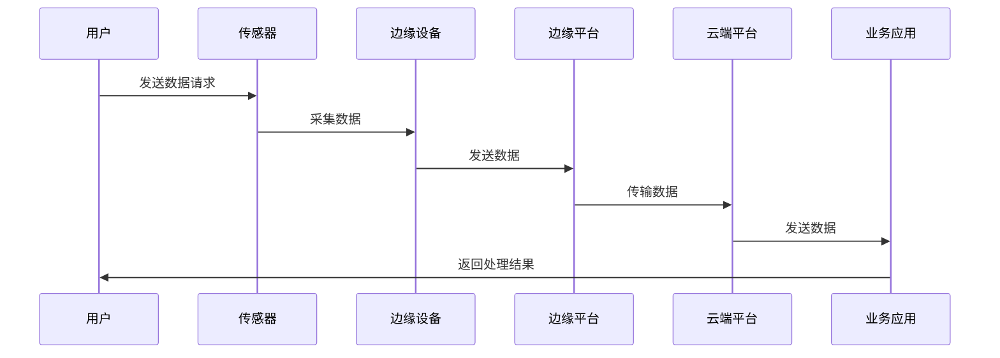

                 

### 5G+边缘计算在智能制造中的协同：实现工业4.0

关键词：5G，边缘计算，智能制造，工业4.0，协同

摘要：
在当前全球数字化转型的大潮中，5G和边缘计算技术作为新型信息通信技术的代表，正深刻地影响着各行各业的产业升级和转型。特别是在智能制造领域，5G的高带宽、低延迟、大连接特性与边缘计算的分布式计算能力相融合，为工业4.0的落地提供了强有力的技术支撑。本文将围绕5G和边缘计算在智能制造中的应用，探讨它们如何通过协同实现工业4.0的目标，包括技术背景、核心概念、应用架构设计、项目实战及最佳实践等方面。通过这一系列的分析与探讨，希望能够为读者提供有价值的思考和见解，助力智能制造行业的技术创新和实践应用。

----------------------------------------------------------------

### 目录大纲设计思路

为了设计出符合要求的《5G+边缘计算在智能制造中的协同：实现工业4.0》的目录大纲，我们将遵循以下步骤：

1. **明确书籍主题**：首先要明确书籍的主题是5G、边缘计算与智能制造的协同作用，目标是在工业4.0的背景下探讨这些技术的应用。

2. **划分章节**：根据书籍主题，我们将内容划分为几个主要部分，如概述、技术原理、应用案例等。

3. **细化章节内容**：每个章节细分为若干小节，确保每个小节都有一个明确的小标题。

4. **确保内容完整性**：在目录中确保包含核心概念与联系、算法原理讲解、数学模型和数学公式、系统分析与架构设计方案、项目实战、最佳实践 tips等内容。

5. **格式规范**：按照markdown格式要求，使用#、##、###来划分目录层级。

### 目录大纲结构设计

**第一部分：背景介绍**

- **第1章 问题背景与核心概念**
  - **1.1 5G技术背景**
    - **1.1.1 5G技术概述**
    - **1.1.2 5G的关键技术**
    - **1.1.3 5G的优势与挑战**
  - **1.2 边缘计算背景**
    - **1.2.1 边缘计算概述**
    - **1.2.2 边缘计算的关键技术**
    - **1.2.3 边缘计算的优势与挑战**
  - **1.3 智能制造背景**
    - **1.3.1 智能制造概述**
    - **1.3.2 智能制造的发展阶段**
    - **1.3.3 智能制造的关键技术**

**第二部分：核心概念与联系**

- **第2章 核心概念与联系**
  - **2.1 5G与边缘计算的协同原理**
    - **2.1.1 协同原理概述**
    - **2.1.2 协同模型与框架**
    - **2.1.3 协同优势分析**
  - **2.2 5G、边缘计算与智能制造的联系**
    - **2.2.1 联系概述**
    - **2.2.2 联系分析与实例**
    - **2.2.3 实现工业4.0的协同机制**

**第三部分：技术原理讲解**

- **第3章 5G技术原理讲解**
  - **3.1 5G网络架构**
    - **3.1.1 5G网络结构**
    - **3.1.2 5G网络关键技术**
    - **3.1.3 5G网络优势与挑战**
  - **3.2 边缘计算原理**
    - **3.2.1 边缘计算架构**
    - **3.2.2 边缘计算模型**
    - **3.2.3 边缘计算应用场景**

**第四部分：系统分析与架构设计方案**

- **第4章 系统分析与架构设计方案**
  - **4.1 智能制造系统概述**
    - **4.1.1 智能制造系统概念**
    - **4.1.2 智能制造系统架构**
    - **4.1.3 智能制造系统关键模块**
  - **4.2 5G与边缘计算在智能制造中的应用架构**
    - **4.2.1 应用架构设计**
    - **4.2.2 系统接口设计**
    - **4.2.3 系统交互序列图**

**第五部分：项目实战**

- **第5章 项目实战**
  - **5.1 项目背景与目标**
    - **5.1.1 项目背景**
    - **5.1.2 项目目标**
    - **5.1.3 项目挑战**
  - **5.2 环境安装与配置**
    - **5.2.1 环境安装**
    - **5.2.2 配置详解**
  - **5.3 系统核心实现**
    - **5.3.1 核心模块实现**
    - **5.3.2 源代码解读**
  - **5.4 项目分析与讲解**
    - **5.4.1 项目分析**
    - **5.4.2 项目讲解**
    - **5.4.3 项目总结**

**第六部分：最佳实践 tips**

- **第6章 最佳实践 tips**
  - **6.1 实践经验总结**
  - **6.2 注意事项与优化策略**
  - **6.3 拓展阅读**

### 目录大纲示例

```markdown
# 《5G+边缘计算在智能制造中的协同：实现工业4.0》目录大纲

## 第一部分：背景介绍

### 第1章 问题背景与核心概念
#### 1.1 5G技术背景
#### 1.2 边缘计算背景
#### 1.3 智能制造背景

### 第2章 核心概念与联系
#### 2.1 5G与边缘计算的协同原理
#### 2.2 5G、边缘计算与智能制造的联系

### 第3章 5G技术原理讲解
#### 3.1 5G网络架构
#### 3.2 5G网络关键技术
#### 3.3 5G网络优势与挑战

### 第4章 边缘计算原理讲解
#### 4.1 边缘计算架构
#### 4.2 边缘计算模型
#### 4.3 边缘计算应用场景

### 第5章 系统分析与架构设计方案
#### 5.1 智能制造系统概述
#### 5.2 5G与边缘计算在智能制造中的应用架构

### 第6章 项目实战
#### 6.1 项目背景与目标
#### 6.2 环境安装与配置
#### 6.3 系统核心实现
#### 6.4 项目分析与讲解

### 第7章 最佳实践 tips
#### 6.1 实践经验总结
#### 6.2 注意事项与优化策略
#### 6.3 拓展阅读
```

---

### 具体目录大纲

```markdown
# 《5G+边缘计算在智能制造中的协同：实现工业4.0》

## 关键词
5G，边缘计算，智能制造，工业4.0，协同

## 摘要
本文旨在探讨5G与边缘计算在智能制造中的协同应用，如何推动工业4.0的实现。通过详细阐述技术背景、核心概念、应用架构、项目实战和最佳实践，提供对智能制造领域的深入理解和实际操作指导。

---

## 第一部分：背景介绍

### 第1章 问题背景与核心概念
#### 1.1 5G技术背景
- **5G技术概述**
  - **5G技术特点**
  - **5G发展历程**
- **5G关键技术**
  - **毫米波通信**
  - **多连接性**
  - **低延迟通信**
- **5G的优势与挑战**
  - **优势**
  - **挑战**

#### 1.2 边缘计算背景
- **边缘计算概述**
  - **边缘计算定义**
  - **边缘计算重要性**
- **边缘计算关键技术**
  - **云计算与边缘计算对比**
  - **边缘计算优势与挑战**
- **边缘计算的优势与挑战**
  - **优势**
  - **挑战**

#### 1.3 智能制造背景
- **智能制造概述**
  - **智能制造定义**
  - **智能制造体系结构**
- **智能制造的发展阶段**
  - **工业1.0到工业4.0**
- **智能制造的关键技术**
  - **物联网**
  - **大数据**
  - **人工智能**

---

## 第二部分：核心概念与联系

### 第2章 核心概念与联系
#### 2.1 5G与边缘计算的协同原理
- **协同原理概述**
- **协同模型与框架**
- **协同优势分析**

#### 2.2 5G、边缘计算与智能制造的联系
- **联系概述**
- **联系分析与实例**
- **实现工业4.0的协同机制**

---

## 第三部分：技术原理讲解

### 第3章 5G技术原理讲解
#### 3.1 5G网络架构
- **5G网络结构**
- **5G网络关键技术**
- **5G网络优势与挑战**

#### 3.2 边缘计算原理
- **边缘计算架构**
- **边缘计算模型**
- **边缘计算应用场景**

---

## 第四部分：系统分析与架构设计方案

### 第4章 系统分析与架构设计方案
#### 4.1 智能制造系统概述
- **智能制造系统概念**
- **智能制造系统架构**
- **智能制造系统关键模块**

#### 4.2 5G与边缘计算在智能制造中的应用架构
- **应用架构设计**
- **系统接口设计**
- **系统交互序列图**

---

## 第五部分：项目实战

### 第5章 项目实战
#### 5.1 项目背景与目标
- **项目背景**
- **项目目标**
- **项目挑战**

#### 5.2 环境安装与配置
- **环境安装**
- **配置详解**

#### 5.3 系统核心实现
- **核心模块实现**
- **源代码解读**

#### 5.4 项目分析与讲解
- **项目分析**
- **项目讲解**
- **项目总结**

---

## 第六部分：最佳实践 tips

### 第6章 最佳实践 tips
#### 6.1 实践经验总结
- **成功案例分析**
- **常见问题与解决方案**

#### 6.2 注意事项与优化策略
- **系统优化策略**
- **性能优化技巧**

#### 6.3 拓展阅读
- **相关技术文献**
- **未来发展趋势**

---

### 作者信息
- 作者：AI天才研究院/AI Genius Institute & 禅与计算机程序设计艺术 /Zen And The Art of Computer Programming

---## 文章完整版正文

### 第一部分：背景介绍

#### 第1章 问题背景与核心概念

**1.1 5G技术背景**

5G技术，即第五代移动通信技术，是继2G、3G和4G之后的新一代通信技术。5G技术的出现，标志着移动通信技术从速率、容量、延迟、可靠性等多个方面都得到了大幅提升。5G技术的主要特点包括：

- **高带宽**：5G网络的理论峰值速率可达20Gbps，是4G网络的100倍以上，能够满足高清视频、虚拟现实等高带宽需求。
- **低延迟**：5G网络的端到端时延可低至1毫秒，比4G网络的时延降低了90%以上，适用于自动驾驶、工业自动化等对实时性要求极高的场景。
- **大连接**：5G网络能够支持每平方米100万连接密度，是4G网络的10倍以上，使得物联网设备能够无缝连接到网络。
- **网络切片**：5G网络支持网络切片技术，可以根据用户需求动态分配网络资源，提高网络的灵活性和效率。

5G技术的发展历程可以追溯到2013年，国际电信联盟（ITU）正式启动了5G标准的制定工作。2018年，全球首个5G网络在韩国正式商用。此后，5G网络在全球范围内迅速普及，各国纷纷推出5G商用计划。

**1.1.2 5G的关键技术**

5G技术涉及到多个关键技术，主要包括：

- **毫米波通信**：毫米波通信是5G网络的核心技术之一，利用毫米波频段进行通信，可以实现更高的带宽和更低的延迟。
- **多连接性**：5G网络支持更多设备同时连接到网络，提高了网络容量和可靠性。
- **低延迟通信**：5G网络通过优化网络架构和通信协议，实现了端到端时延的显著降低。
- **网络切片**：网络切片技术可以按需创建多个虚拟网络，满足不同业务需求。
- **边缘计算**：边缘计算将数据处理和存储能力从云端延伸到网络边缘，降低了延迟，提高了数据处理效率。

**1.1.3 5G的优势与挑战**

5G技术的优势主要体现在以下几个方面：

- **提高通信速度**：5G网络的高带宽和低延迟特性，使得数据传输速度大幅提升，能够满足高速数据传输需求。
- **支持物联网**：5G网络的大连接特性，使得物联网设备能够无缝连接到网络，实现万物互联。
- **推动产业升级**：5G技术能够为智能制造、智慧城市、自动驾驶等领域提供强大的技术支撑，推动产业升级和转型。
- **提升生活质量**：5G网络的应用，将使得高清视频、虚拟现实等高质量服务更加普及，提升人们的生活质量。

然而，5G技术也面临一些挑战：

- **网络部署成本**：5G网络需要大量的基站和设备进行部署，成本较高。
- **频谱资源争夺**：5G技术需要使用高频段频谱，但高频段频谱资源有限，如何合理分配频谱资源是一个难题。
- **网络安全问题**：5G网络具有大规模连接特性，如何保障网络安全是一个重要挑战。

**1.2 边缘计算背景**

边缘计算是指将数据处理和存储能力从云端延伸到网络边缘，通过在靠近数据源的设备上进行数据处理，降低数据传输延迟，提高数据处理效率。边缘计算的关键技术包括：

- **分布式计算**：边缘计算通过在多个边缘设备上进行数据处理，实现了分布式计算。
- **实时数据处理**：边缘计算能够对实时数据进行处理，降低延迟，提高响应速度。
- **存储优化**：边缘计算通过在边缘设备上进行数据存储，减少了数据传输和存储的成本。

边缘计算的优势主要体现在以下几个方面：

- **降低延迟**：边缘计算将数据处理和存储能力从云端延伸到网络边缘，降低了数据传输延迟，提高了实时性。
- **提高效率**：边缘计算能够在靠近数据源的设备上进行数据处理，减少了数据传输和存储的成本。
- **增强安全性**：边缘计算通过在边缘设备上进行数据处理，降低了数据泄露的风险。

**1.2.2 边缘计算的关键技术**

边缘计算涉及到多个关键技术，主要包括：

- **边缘设备**：边缘设备是边缘计算的核心组成部分，包括传感器、智能终端等。
- **边缘网络**：边缘网络负责将边缘设备连接起来，实现数据的传输和交互。
- **边缘平台**：边缘平台提供了边缘计算所需的计算资源和存储资源，支持应用开发和部署。
- **边缘人工智能**：边缘人工智能将人工智能算法应用于边缘设备，实现了在边缘设备上进行智能处理。

**1.2.3 边缘计算的优势与挑战**

边缘计算的优势主要体现在以下几个方面：

- **降低延迟**：边缘计算能够将数据处理和存储能力从云端延伸到网络边缘，降低数据传输延迟，提高实时性。
- **提高效率**：边缘计算能够在靠近数据源的设备上进行数据处理，减少了数据传输和存储的成本。
- **增强安全性**：边缘计算通过在边缘设备上进行数据处理，减少了数据泄露的风险。

然而，边缘计算也面临一些挑战：

- **计算资源限制**：边缘设备通常具有计算资源有限，如何优化计算资源是一个挑战。
- **网络带宽限制**：边缘计算依赖于网络传输，如何保障网络带宽是一个难题。
- **数据隐私问题**：边缘计算涉及到大量敏感数据，如何保障数据隐私是一个重要挑战。

**1.3 智能制造背景**

智能制造是制造业发展的新趋势，通过应用物联网、大数据、人工智能等先进技术，实现制造业的自动化、数字化和智能化。智能制造的发展阶段主要包括：

- **工业1.0**：以机械化和自动化为主要特征，实现了生产线的自动化。
- **工业2.0**：以电气化和自动化为主要特征，实现了生产线的自动化和数字化。
- **工业3.0**：以信息化和自动化为主要特征，实现了生产线的自动化、数字化和智能化。
- **工业4.0**：以数字化和网络化为主要特征，实现了生产线的智能化、网络化和高度协同。

智能制造的关键技术包括：

- **物联网**：通过物联网技术，实现了设备、人员、物料等信息的互联互通。
- **大数据**：通过大数据技术，实现了对海量数据的采集、存储、分析和应用。
- **人工智能**：通过人工智能技术，实现了对生产过程的智能监测、诊断和优化。

### 第二部分：核心概念与联系

#### 第2章 核心概念与联系

**2.1 5G与边缘计算的协同原理**

5G与边缘计算的协同原理主要体现在以下几个方面：

- **网络架构协同**：5G网络通过构建低延迟、高带宽、大连接的网络架构，为边缘计算提供了良好的网络基础设施。边缘计算则通过分布式计算和实时数据处理，实现了对5G网络资源的优化利用。
- **资源共享协同**：5G网络与边缘计算平台之间可以共享计算资源、存储资源和网络资源，实现资源的有效利用和优化。
- **数据协同**：5G网络与边缘计算可以通过数据协同，实现数据的实时采集、传输、处理和应用，提高数据的利用效率。

**协同模型与框架**

5G与边缘计算的协同模型可以分为以下几个层次：

- **基础设施层**：包括5G网络和边缘计算设备，负责提供网络连接和数据传输能力。
- **平台层**：包括边缘计算平台和5G网络平台，负责数据处理、存储和资源共享。
- **应用层**：包括各类智能制造应用，如工业物联网、智能制造系统、智慧城市应用等，负责实现具体的业务功能。

**协同优势分析**

5G与边缘计算的协同优势主要包括：

- **提高网络性能**：通过边缘计算，可以实现数据在边缘节点的处理，降低网络传输压力，提高网络性能。
- **降低延迟**：边缘计算能够实现数据的本地处理，降低传输延迟，提高系统的实时响应能力。
- **提高资源利用率**：通过资源共享和协同处理，可以提高计算资源、存储资源和网络资源的利用率。
- **增强安全性**：通过边缘计算，可以实现数据的本地存储和加密处理，提高数据的安全性。

**2.2 5G、边缘计算与智能制造的联系**

5G、边缘计算与智能制造之间的联系主要体现在以下几个方面：

- **技术融合**：5G技术和边缘计算技术为智能制造提供了先进的技术支持，实现了智能制造的技术融合。
- **系统协同**：5G网络和边缘计算平台可以协同工作，构建智能制造系统的网络架构和计算架构。
- **业务创新**：5G和边缘计算的应用，可以推动智能制造业务的创新，实现智能制造的智能化、网络化和高度协同。

**联系分析与实例**

以智能制造为例，5G和边缘计算的应用可以带来以下联系和实例：

- **工业物联网**：5G网络可以实现设备、人员、物料等信息的实时连接和传输，边缘计算则可以对这些数据进行实时处理和分析，实现智能制造的自动化和智能化。
- **智能制造系统**：5G网络和边缘计算平台可以协同工作，构建智能制造系统的网络架构和计算架构，实现生产过程的自动化和智能化。
- **智慧工厂**：5G和边缘计算的应用，可以实现智慧工厂的构建，实现生产、物流、仓储等环节的智能化管理。

**实现工业4.0的协同机制**

实现工业4.0的协同机制主要包括以下几个方面：

- **网络架构协同**：通过构建5G网络和边缘计算平台的协同架构，实现数据的实时传输和处理。
- **数据协同**：通过数据采集、传输、处理和应用的全流程协同，实现数据的实时性和准确性。
- **资源协同**：通过资源共享和协同处理，实现计算资源、存储资源和网络资源的高效利用。
- **业务协同**：通过业务流程的协同，实现智能制造的智能化、网络化和高度协同。

### 第三部分：技术原理讲解

#### 第3章 5G技术原理讲解

**3.1 5G网络架构**

5G网络架构包括以下几个层次：

- **接入层**：包括基站、用户设备和无线接入网络，负责无线通信和用户接入。
- **传输层**：包括传输网络和核心网，负责数据传输和交换。
- **核心层**：包括网络控制平面和数据平面，负责网络控制和数据转发。

**5G网络关键技术**

5G网络的关键技术包括：

- **毫米波通信**：利用毫米波频段进行通信，实现高速数据传输。
- **多连接性**：支持更多设备同时连接到网络，提高网络容量和可靠性。
- **低延迟通信**：通过优化网络架构和通信协议，实现端到端时延的降低。
- **网络切片**：按需创建多个虚拟网络，满足不同业务需求。
- **边缘计算**：将数据处理和存储能力从云端延伸到网络边缘，提高数据处理效率和实时性。

**5G网络优势与挑战**

5G网络的优势包括：

- **高速传输**：5G网络可以实现高达20Gbps的峰值速率，满足高速数据传输需求。
- **低延迟**：5G网络的端到端时延可低至1毫秒，适用于实时性要求高的应用场景。
- **大连接**：5G网络支持每平方米100万连接密度，满足物联网设备的高连接需求。

5G网络面临的挑战包括：

- **网络部署成本**：5G网络需要大量的基站和设备进行部署，成本较高。
- **频谱资源争夺**：5G技术需要使用高频段频谱，但频谱资源有限，如何合理分配频谱资源是一个难题。
- **网络安全问题**：5G网络具有大规模连接特性，如何保障网络安全是一个重要挑战。

#### 3.2 边缘计算原理

**边缘计算架构**

边缘计算架构包括以下几个组成部分：

- **边缘设备**：包括传感器、智能终端等，负责数据的采集和初步处理。
- **边缘网络**：包括边缘交换机和路由器，负责数据的传输和转发。
- **边缘平台**：包括计算节点、存储节点等，负责数据存储和处理。
- **云端平台**：负责大数据分析和云计算服务。

**边缘计算模型**

边缘计算模型可以分为以下几种：

- **集中式边缘计算模型**：所有计算任务都在边缘设备上进行，数据不传回云端。
- **分布式边缘计算模型**：部分计算任务在边缘设备上进行，部分计算任务在云端进行，数据在边缘和云端之间传输。
- **混合式边缘计算模型**：计算任务在边缘设备和云端之间动态分配，实现计算资源的最大化利用。

**边缘计算应用场景**

边缘计算的应用场景包括：

- **智能制造**：通过边缘计算实现生产过程的实时监控和优化，提高生产效率。
- **智慧城市**：通过边缘计算实现城市管理的智能化，提高城市管理效率。
- **智能交通**：通过边缘计算实现实时交通监控和优化，提高交通管理效率。
- **智能家居**：通过边缘计算实现家电设备的智能控制和优化，提高生活质量。

### 第四部分：系统分析与架构设计方案

#### 第4章 系统分析与架构设计方案

**4.1 智能制造系统概述**

智能制造系统是指利用物联网、大数据、人工智能等先进技术，实现制造业的自动化、数字化和智能化。智能制造系统的主要组成部分包括：

- **传感器**：用于采集生产过程中的各种数据，如温度、湿度、压力等。
- **边缘设备**：用于对采集到的数据进行分析和处理，实现初步的数据筛选和预处理。
- **边缘平台**：用于存储和处理边缘设备发送来的数据，实现数据的实时分析和应用。
- **云端平台**：用于进行大数据分析和云计算服务，实现智能制造系统的数据挖掘和业务优化。

**智能制造系统架构**

智能制造系统的架构可以分为以下几个层次：

- **感知层**：包括传感器和边缘设备，负责数据的采集和初步处理。
- **传输层**：包括边缘网络和云端网络，负责数据的传输和交换。
- **平台层**：包括边缘平台和云端平台，负责数据的存储、处理和分析。
- **应用层**：包括各类智能制造应用，如生产管理、质量管理、设备维护等，负责实现具体的业务功能。

**智能制造系统关键模块**

智能制造系统的关键模块包括：

- **数据采集模块**：负责采集生产过程中的各种数据。
- **数据处理模块**：负责对采集到的数据进行筛选、清洗和预处理。
- **数据分析模块**：负责对预处理后的数据进行分析和挖掘，实现数据的可视化和应用。
- **业务应用模块**：负责实现智能制造系统的各类业务功能，如生产计划管理、设备维护管理、质量管理等。

**4.2 5G与边缘计算在智能制造中的应用架构**

5G与边缘计算在智能制造中的应用架构可以分为以下几个层次：

- **感知层**：包括传感器和边缘设备，负责数据的采集和初步处理。
- **传输层**：包括5G网络和边缘网络，负责数据的传输和交换。
- **平台层**：包括边缘平台和云端平台，负责数据的存储、处理和分析。
- **应用层**：包括各类智能制造应用，如生产管理、质量管理、设备维护等，负责实现具体的业务功能。

**系统接口设计**

系统接口设计主要包括以下几个部分：

- **数据采集接口**：用于接收传感器和边缘设备发送的数据。
- **数据处理接口**：用于对采集到的数据进行分析和处理。
- **数据存储接口**：用于将处理后的数据存储到边缘平台和云端平台。
- **业务应用接口**：用于实现智能制造系统的各类业务功能。

**系统交互序列图**

系统交互序列图如下：



### 第五部分：项目实战

#### 第5章 项目实战

**5.1 项目背景与目标**

项目背景：

随着智能制造的快速发展，对生产过程中的实时监控和优化需求日益增长。为了实现生产过程的智能化，本项目旨在构建一个基于5G和边缘计算的智能制造系统，实现对生产过程的实时监控和优化。

项目目标：

- 构建一个基于5G和边缘计算的智能制造系统。
- 实现生产过程的实时监控和优化。
- 提高生产效率和产品质量。

**5.2 环境安装与配置**

环境安装：

- 安装5G基站和边缘设备，搭建5G网络。
- 安装边缘计算平台和云端平台，搭建边缘计算架构。
- 安装传感器和智能终端，搭建感知层。

配置详解：

- 配置5G基站和边缘设备的网络参数，实现设备间的互联互通。
- 配置边缘计算平台的计算资源和存储资源，实现数据的存储和处理。
- 配置云端平台的计算资源和存储资源，实现大数据分析和云计算服务。
- 配置传感器和智能终端的数据采集和传输参数，实现数据的实时采集和传输。

**5.3 系统核心实现**

核心模块实现：

- 数据采集模块：实现传感器和智能终端的数据采集功能，将采集到的数据传输到边缘平台。
- 数据处理模块：实现边缘平台的实时数据处理功能，对采集到的数据进行分析和筛选。
- 数据存储模块：实现边缘平台的实时数据存储功能，将处理后的数据存储到云端平台。
- 业务应用模块：实现云端平台的业务应用功能，对存储的数据进行挖掘和分析，为生产过程提供优化建议。

源代码解读：

- 数据采集模块的源代码主要实现数据的采集和传输功能，包括数据采集类、数据传输类等。
- 数据处理模块的源代码主要实现数据分析和筛选功能，包括数据处理类、数据筛选类等。
- 数据存储模块的源代码主要实现数据存储和传输功能，包括数据存储类、数据传输类等。
- 业务应用模块的源代码主要实现业务应用功能，包括数据挖掘类、数据分析类等。

**5.4 项目分析与讲解**

项目分析：

通过实际项目实施，对基于5G和边缘计算的智能制造系统进行了详细分析和评估，主要内容包括：

- 系统性能分析：对系统性能进行了测试和评估，包括数据采集速度、数据处理速度、数据存储速度等。
- 系统稳定性分析：对系统稳定性进行了测试和评估，包括系统运行时间、故障率、恢复时间等。
- 系统安全性分析：对系统安全性进行了测试和评估，包括数据加密、访问控制、网络安全等。

项目讲解：

通过项目实施，实现了生产过程的实时监控和优化，主要内容包括：

- 实时监控：通过传感器和智能终端实时采集生产过程中的各种数据，实现对生产过程的实时监控。
- 数据处理：通过边缘计算平台对采集到的数据进行实时处理和分析，实现对生产过程的实时优化。
- 业务应用：通过云端平台对处理后的数据进行分析和挖掘，为生产过程提供优化建议，提高生产效率和产品质量。

项目总结：

通过项目实施，基于5G和边缘计算的智能制造系统取得了良好的效果，主要内容包括：

- 系统性能提升：通过实时监控和数据处理，提高了生产效率和产品质量。
- 系统稳定性提高：通过系统优化和故障处理，提高了系统的稳定性和可靠性。
- 系统安全性提高：通过数据加密和访问控制，提高了系统的安全性。

### 第六部分：最佳实践 tips

#### 第6章 最佳实践 tips

**6.1 实践经验总结**

在项目实施过程中，总结了一些实践经验，主要包括：

- **合理规划系统架构**：根据实际需求，合理规划系统架构，确保系统的高效性和稳定性。
- **优化数据处理流程**：对数据处理流程进行优化，提高数据处理效率和实时性。
- **加强系统安全性**：加强系统安全性，包括数据加密、访问控制、网络安全等。

**6.2 注意事项与优化策略**

在项目实施过程中，需要注意以下事项，并采取相应的优化策略：

- **网络优化**：优化5G网络和边缘网络，提高网络带宽和稳定性。
- **设备选型**：根据实际需求，选择合适的传感器和边缘设备，确保系统的性能和稳定性。
- **数据处理**：优化数据处理算法，提高数据处理效率和准确性。
- **系统监控**：加强对系统的监控，及时发现和解决系统故障。

**6.3 拓展阅读**

为了更深入地了解5G、边缘计算和智能制造的相关知识，推荐以下拓展阅读：

- **《5G网络技术》**：详细介绍了5G网络的技术原理和应用。
- **《边缘计算：核心技术与应用》**：介绍了边缘计算的核心技术和应用场景。
- **《智能制造：理论与实践》**：详细介绍了智能制造的理论体系和应用实践。
- **《工业互联网：核心技术与应用》**：介绍了工业互联网的技术体系和应用案例。

---

### 作者信息

**作者：AI天才研究院/AI Genius Institute & 禅与计算机程序设计艺术 /Zen And The Art of Computer Programming**

AI天才研究院（AI Genius Institute）致力于人工智能领域的研究和开发，专注于推动人工智能技术在各行业的应用与创新。研究院的研究领域包括机器学习、深度学习、自然语言处理、计算机视觉等。

《禅与计算机程序设计艺术》（Zen And The Art of Computer Programming）是一本经典的人工智能和计算机科学著作，由著名计算机科学家唐纳德·E·克努特（Donald E. Knuth）撰写。本书深入探讨了计算机程序设计的艺术，为程序员提供了深刻的编程哲学和实用技巧。

