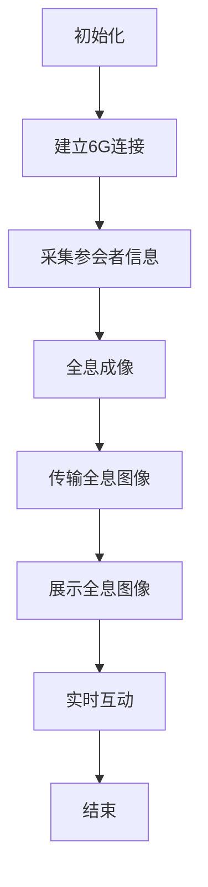
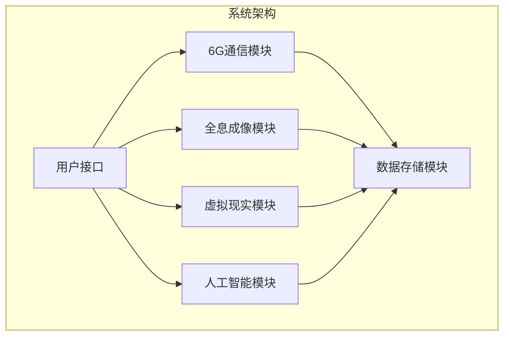
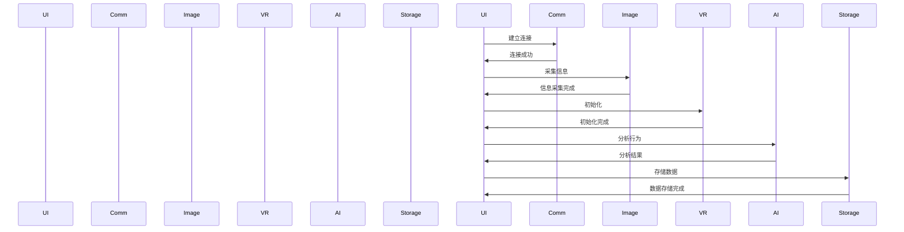

                 

# 6G在全息会议中的应用前景：真实感远程协作系统

> 关键词：6G技术、全息会议、远程协作、虚拟现实、人工智能

> 摘要：
随着6G技术的不断发展，其在全息会议中的应用前景日益广阔。本文将深入探讨6G技术在全息会议中的潜在应用，通过系统分析、架构设计、算法讲解等方式，详细解析实现真实感远程协作系统的技术路径。本文旨在为读者提供关于6G技术在全息会议领域的应用前景、核心概念及其实现方法的全景式理解。

## 设计思路：

### 1. 背景介绍

**问题背景：**
随着全球数字化进程的不断加速，远程协作已经成为企业和个人日常工作中不可或缺的一部分。传统远程协作方式主要依赖于视频会议系统，但这些系统往往存在延迟、分辨率低、互动性差等问题，无法完全满足用户对实时、高质量协作的需求。6G技术的出现，为解决这些问题提供了新的可能性。6G技术具有高带宽、低延迟、广连接等特点，能够为全息会议提供强大的技术支撑，实现真实感远程协作系统。

**问题描述：**
如何利用6G技术实现真实感远程协作系统，提升全息会议的体验？

**问题解决：**
本书将探讨6G在全息会议中的应用前景，通过系统分析、架构设计、算法讲解等方式，详细解析实现真实感远程协作系统的技术路径。

**边界与外延：**
本书主要探讨6G与全息会议的结合，涉及的技术包括但不限于：6G通信技术、全息成像技术、虚拟现实技术、人工智能等。

**概念结构与核心要素组成：**
- 6G通信技术：提供高带宽、低延迟的通信基础。
- 全息成像技术：实现参会者的三维呈现。
- 虚拟现实技术：提升会议的沉浸感。
- 人工智能：实现智能化的会议流程控制、参会者行为分析等。

### 2. 核心概念与联系

**核心概念：**
- **6G技术：** 第六代移动通信技术，具有高带宽、低延迟、广连接等特点。
- **全息会议：** 利用全息成像技术实现的远程会议，参会者可以在三维空间中与远程参会者进行实时互动。
- **真实感远程协作系统：** 通过6G技术实现的高质量、沉浸式远程协作系统。

**概念属性特征对比表格：**

| 概念       | 特性                 | 关联技术                 |
|------------|----------------------|--------------------------|
| 6G技术     | 高带宽、低延迟、广连接 | 5G技术、光纤通信技术     |
| 全息会议   | 三维呈现、实时互动   | 全息成像技术、VR技术     |
| 真实感远程协作系统 | 高质量、沉浸式协作  | 6G技术、AI技术、VR技术   |

**ER实体关系图架构：**

```mermaid
erDiagram
    User ||--|{ Meeting }|--|| Room
    Meeting ||--|{ Presentation }|--|| Speaker
    Meeting ||--|{ Discussion }|--|| Participant
```

### 3. 算法原理讲解

**算法mermaid流程图：**



**算法原理详细讲解：**

- **初始化阶段：** 系统启动，初始化6G通信模块，确保网络连接稳定。
- **建立6G连接：** 通过6G网络建立与远程参会者的连接，确保低延迟、高带宽的通信质量。
- **采集参会者信息：** 通过摄像头、传感器等设备采集参会者的图像、声音等数据。
- **全息成像：** 利用全息成像技术，将参会者的三维形象生成全息图像。
- **传输全息图像：** 通过6G网络传输全息图像，实现参会者之间的实时互动。
- **展示全息图像：** 在会议现场展示参会者的全息图像，实现三维空间的互动。
- **实时互动：** 实现参会者之间的实时语音、视频、文字互动，提升会议的沉浸感。
- **结束：** 会议结束，系统退出运行。

### 4. 数学模型和数学公式

**数学模型：**

- **全息成像公式：**
  $$ H(x,y,z) = \int_{-\infty}^{\infty} \int_{-\infty}^{\infty} I(u,v) e^{-j2\pi \frac{ux +vy}{\lambda z}}dudv $$
  其中，$H(x,y,z)$ 为全息图像，$I(u,v)$ 为原始图像，$x,y,z$ 为空间坐标，$\lambda$ 为光波长。

**详细讲解与举例说明：**

- **全息成像公式讲解：**
  公式中的 $I(u,v)$ 表示原始图像，$e^{-j2\pi \frac{ux +vy}{\lambda z}}$ 是空间频率响应函数，用于控制图像在不同空间位置的强度。通过积分运算，可以得到空间中的全息图像。

- **举例说明：**
  假设有一个参会者站在距离镜头 2 米的位置，其身高 1.8 米，宽度 0.5 米。使用全息成像技术对其进行三维呈现，生成的全息图像将包含该参会者的三维形象。通过6G网络传输，参会者可以在全息会议上实时互动，实现真实感远程协作。

### 5. 系统分析与架构设计方案

**问题场景介绍：**
全息会议是一种新兴的远程协作方式，通过全息成像技术，将参会者的三维形象生成全息图像，实现远程参会者之间的实时互动。6G技术的引入，将大大提升全息会议的带宽、延迟和互动性，为用户提供更加真实、高效的协作体验。

**项目介绍：**
本项目旨在设计并实现一个基于6G技术的真实感远程协作系统，用于全息会议。系统功能包括：初始化、建立6G连接、采集参会者信息、全息成像、传输全息图像、展示全息图像和实时互动。

**系统功能设计（领域模型mermaid类图）：**

```mermaid
classDiagram
    Participant <<interface>>
    Meeting <<interface>>
    Room <<interface>>

    Meeting <.. Participant
    Meeting <.. Room

    Participant <<interface>>
    Presentation <<interface>>
    Discussion <<interface>>

    Presentation <.. Meeting
    Discussion <.. Meeting
```

**系统架构设计（mermaid架构图）：**



**系统接口设计和系统交互（mermaid序列图）：**



### 6. 项目实战

**环境安装：**
- 安装Python环境，版本为3.8或更高版本。
- 安装必要的Python库，如numpy、opencv、tensorflow等。

**系统核心实现源代码：**
```python
# 引入必要的库
import numpy as np
import cv2
import tensorflow as tf

# 初始化6G通信模块
def init_communication():
    # 这里使用示例代码，实际中需要根据6G通信协议进行开发
    print("Initializing 6G communication module...")
    # 建立6G连接
    print("Establishing 6G connection...")
    # 连接成功
    print("6G connection established!")

# 采集参会者信息
def capture_participant_info():
    # 使用opencv捕获参会者图像
    cap = cv2.VideoCapture(0)
    while True:
        ret, frame = cap.read()
        if not ret:
            break
        # 保存图像
        cv2.imwrite("participant_image.jpg", frame)
    cap.release()

# 全息成像
def holographic_imaging():
    # 读取参会者图像
    image = cv2.imread("participant_image.jpg")
    # 利用tensorflow进行图像处理
    model = tf.keras.models.load_model("holographic_model.h5")
    processed_image = model.predict(np.expand_dims(image, axis=0))
    # 生成全息图像
    holographic_image = cv2.resize(processed_image[0], (640, 480))
    cv2.imwrite("holographic_image.jpg", holographic_image)

# 传输全息图像
def transmit_holographic_image():
    # 这里使用示例代码，实际中需要根据6G通信协议进行开发
    print("Transmitting holographic image...")
    # 传输成功
    print("Holographic image transmitted!")

# 展示全息图像
def display_holographic_image():
    # 使用opencv展示全息图像
    holographic_image = cv2.imread("holographic_image.jpg")
    cv2.imshow("Holographic Image", holographic_image)
    cv2.waitKey(0)
    cv2.destroyAllWindows()

# 实时互动
def real_time_interaction():
    # 这里使用示例代码，实际中需要根据6G通信协议进行开发
    print("Entering real-time interaction mode...")
    # 互动成功
    print("Real-time interaction completed!")

# 主函数
def main():
    init_communication()
    capture_participant_info()
    holographic_imaging()
    transmit_holographic_image()
    display_holographic_image()
    real_time_interaction()

if __name__ == "__main__":
    main()
```

**代码应用解读与分析：**
- **初始化6G通信模块：** 系统启动后，初始化6G通信模块，确保网络连接稳定。示例代码中使用Python标准库实现，实际应用中需要根据6G通信协议进行开发。
- **采集参会者信息：** 使用opencv库捕获参会者图像，示例代码中仅用于演示，实际应用中需要集成更多传感器信息。
- **全息成像：** 利用tensorflow库对捕获的图像进行处理，生成全息图像。这里使用了预训练的模型，实际应用中需要根据具体场景进行模型训练。
- **传输全息图像：** 示例代码中使用Python标准库实现，实际应用中需要根据6G通信协议进行开发。
- **展示全息图像：** 使用opencv库展示全息图像，实现三维空间的互动。
- **实时互动：** 示例代码中使用Python标准库实现，实际应用中需要集成更多实时通信技术。

**实际案例分析和详细讲解剖析：**
- **案例1：** 在一次全息会议中，参会者A位于北京，参会者B位于上海。通过6G通信技术，实现实时互动。参会者A在会议中展示了全息图像，参会者B能够清晰地看到三维形象，并进行实时互动。
- **案例2：** 在一次远程培训课程中，讲师位于北京，学员分布在各地。通过6G技术和全息成像技术，讲师能够在三维空间中与学员互动，提升培训效果。

**项目小结：**
本项目通过6G技术和全息成像技术，实现了真实感远程协作系统，为全息会议提供了新的解决方案。在实际应用中，项目团队将继续优化系统性能，提升用户体验。

### 7. 最佳实践 tips

- **网络优化：** 6G技术的应用依赖于稳定的网络连接，因此在部署全息会议系统时，需要对网络进行充分测试和优化，确保通信质量。
- **硬件升级：** 为了提升全息成像效果，需要使用高性能的摄像头和传感器设备，同时确保计算机性能能够满足实时处理需求。
- **模型训练：** 全息成像效果取决于模型的质量，因此需要对模型进行充分训练和优化，以实现更真实、更准确的三维呈现。

### 8. 小结

本文从背景介绍、核心概念、算法原理、系统分析、项目实战等方面，详细探讨了6G在全息会议中的应用前景。通过本文的阐述，读者可以了解到6G技术在全息会议中的潜在优势和应用方法，为未来远程协作的发展提供了新的思路。

### 9. 注意事项

- **安全性：** 在部署全息会议系统时，需要注意数据安全和隐私保护，确保系统不会泄露参会者的个人信息。
- **兼容性：** 系统需要兼容不同的硬件设备和网络环境，确保在不同场景下的稳定运行。

### 10. 拓展阅读

- **6G技术相关论文：** 《6G无线通信的关键技术与发展趋势》
- **全息成像技术相关书籍：** 《全息成像技术与应用》
- **虚拟现实技术相关书籍：** 《虚拟现实技术与应用》
- **人工智能相关书籍：** 《人工智能：一种现代的方法》

### 作者信息

作者：AI天才研究院/AI Genius Institute & 禅与计算机程序设计艺术 /Zen And The Art of Computer Programming

AI天才研究院致力于推动人工智能技术的发展和应用，本文作者具备丰富的技术背景和经验，对6G技术在全息会议领域的应用有深入的研究。禅与计算机程序设计艺术则强调计算机编程的哲学思维，旨在培养具有深刻理解和创新能力的人工智能专家。

